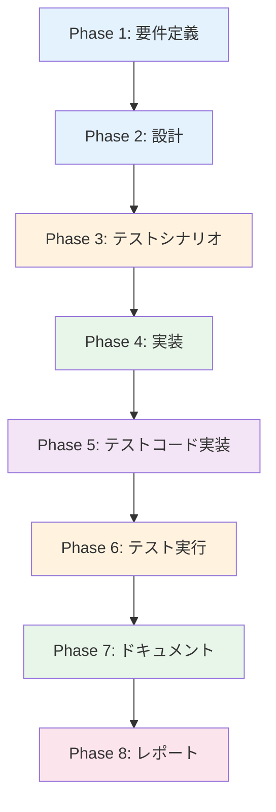

# プロジェクト計画書 - Issue #193

**Issue**: [TASK] Lambda Teardown Pipeline用のforce_destroyパラメータのドキュメント化
**Issue URL**: https://github.com/tielec/infrastructure-as-code/issues/193
**作成日**: 2025年度

---

## 1. Issue分析

### 複雑度
**簡単**

### 見積もり工数
**2~3時間**

**根拠**:
- 影響範囲は限定的（ドキュメント更新のみ）
- 既存の動作は変更不要（プレイブックは既に正しく実装済み）
- 主な作業はドキュメント更新と実行例の追記
- コード変更なし、テスト不要

### リスク評価
**低**

**理由**:
- ドキュメントのみの更新
- 既存機能への影響なし
- リグレッションリスクなし

---

## 2. 実装戦略判断

### 実装戦略: EXTEND

**判断根拠**:
- 新規ファイル作成は不要
- 既存ドキュメント（jenkins/README.md、ansible/README.md）への追記
- 既存のJob DSLファイル（infrastructure_ansible_playbook_executor_job.groovy）へのコメント追加
- コード実装は不要（既存のAnsibleプレイブックは正しく動作している）

### テスト戦略: UNIT_ONLY

**判断根拠**:
- ドキュメントのみの変更のため、実際のテストは不要
- ドキュメントの正確性と可読性のレビューのみ（「ユニットテスト」相当）
- 手順の検証はマニュアルテストで十分

### テストコード戦略: EXTEND_TEST

**判断根拠**:
- テストコード自体は不要
- ドキュメントの内容検証（例：パラメータ名の正確性、実行例の動作確認）を手動で実施
- 既存の動作は変更しないため、既存テストの修正も不要

---

## 3. 影響範囲分析

### 既存コードへの影響
**変更が必要なファイル**:
1. `jenkins/jobs/dsl/infrastructure/infrastructure_ansible_playbook_executor_job.groovy`
   - `ANSIBLE_EXTRA_VARS`パラメータのコメントに`force_destroy`の説明を追加

2. `jenkins/README.md`
   - Lambda Teardown Pipelineジョブの使用方法セクションを追加
   - パラメータ一覧に`force_destroy`の説明を追記

3. `ansible/README.md`
   - Lambda Teardown Pipelineの実行例に`force_destroy=true`を明記
   - 非対話モードでの注意事項を追加

### 依存関係の変更
**なし**

### マイグレーション要否
**不要**

---

## 4. タスク分割

### Phase 1: 要件定義 (見積もり: 0.5h)

- [ ] Task 1-1: Issue内容の詳細分析 (0.25h)
  - Issue #193の背景と目的を整理
  - `force_destroy`パラメータの必要性を確認
  - 非対話モード（Jenkins/CI）での動作を理解
- [ ] Task 1-2: 影響範囲の最終確認 (0.25h)
  - 更新対象のドキュメントをリストアップ
  - 既存のドキュメント構造を確認

### Phase 2: 設計 (見積もり: 0.5h)

- [x] Task 2-1: ドキュメント構成の設計 (0.25h)
  - jenkins/README.mdの更新箇所を決定
  - ansible/README.mdの更新箇所を決定
  - 統一的な記述スタイルを定義
- [x] Task 2-2: 実行例の設計 (0.25h)
  - Jenkinsからの実行例を設計
  - コマンドラインからの実行例を設計
  - `destroy_ssm=true`との組み合わせ例も含める

### Phase 3: テストシナリオ (見積もり: 0.25h)

- [ ] Task 3-1: ドキュメント検証シナリオの作成 (0.25h)
  - パラメータ名の正確性チェック
  - 実行例の動作確認手順
  - 既存ドキュメントとの整合性チェック

### Phase 4: 実装 (見積もり: 1h)

- [x] Task 4-1: Job DSLファイルへのコメント追加 (0.25h)
  - `infrastructure_ansible_playbook_executor_job.groovy`の`ANSIBLE_EXTRA_VARS`パラメータにコメント追加
- [x] Task 4-2: jenkins/README.mdの更新 (0.5h)
  - Lambda Teardown Pipelineジョブの使用方法セクションを追加
  - パラメータ一覧に`force_destroy`の説明を追記
  - 実行例を記載
- [x] Task 4-3: ansible/README.mdの更新 (0.25h)
  - Lambda Teardown Pipelineの実行例を更新
  - 非対話モードでの注意事項を追記

### Phase 5: テストコード実装 (見積もり: 0h)

- [x] Task 5-1: テストコード不要の確認 (0h)
  - ドキュメントのみの変更のため、テストコードは不要

### Phase 6: テスト実行 (見積もり: 0.25h)

- [ ] Task 6-1: ドキュメント内容の検証 (0.15h)
  - パラメータ名の正確性を確認
  - 実行例が正しいか確認
  - 誤字脱字のチェック
- [ ] Task 6-2: 既存ドキュメントとの整合性確認 (0.1h)
  - 他のセクションとの一貫性を確認
  - リンクが正しく機能するか確認

### Phase 7: ドキュメント (見積もり: 0.25h)

- [ ] Task 7-1: 変更内容のまとめ (0.15h)
  - 更新したファイル一覧
  - 追加したセクション一覧
- [ ] Task 7-2: コミットメッセージの作成 (0.1h)
  - 規約に従ったコミットメッセージを作成

### Phase 8: レポート (見積もり: 0.25h)

- [ ] Task 8-1: 完了レポートの作成 (0.25h)
  - 実施内容のサマリー
  - 更新箇所のスクリーンショット（オプション）
  - Issue #193のクローズ準備

---

## 5. 依存関係



---

## 6. リスクと軽減策

### リスク1: ドキュメントの記述漏れ
- **影響度**: 中
- **確率**: 低
- **軽減策**:
  - Issue #193のTODOリストを確認し、すべての項目をカバー
  - Phase 6でチェックリストによる検証を実施

### リスク2: パラメータ名の誤記
- **影響度**: 中
- **確率**: 低
- **軽減策**:
  - プレイブック（`lambda_teardown_pipeline.yml`）の実装を直接確認
  - 実行例をコピー&ペーストで正確に記載

### リスク3: 既存ドキュメントとの整合性の欠如
- **影響度**: 低
- **確率**: 低
- **軽減策**:
  - jenkins/README.mdとansible/README.mdの既存フォーマットを踏襲
  - Phase 6で整合性を確認

### リスク4: 実行例の動作未確認
- **影響度**: 低
- **確率**: 中
- **軽減策**:
  - プレイブック（66-69行目）のロジックを再確認
  - 必要に応じて実際に実行して動作を検証（オプション）

---

## 7. 品質ゲート

### Phase 1: 要件定義
- [ ] Issue #193の背景と目的が明確に理解できている
- [ ] `force_destroy`パラメータの必要性が説明できる
- [ ] 更新対象ファイルが特定されている

### Phase 2: 設計
- [x] 実装戦略（EXTEND）の判断根拠が明記されている
- [x] テスト戦略（UNIT_ONLY）の判断根拠が明記されている
- [x] ドキュメント構成が設計されている
- [x] 実行例が具体的に設計されている

### Phase 3: テストシナリオ
- [x] ドキュメント検証の手順が定義されている
- [x] パラメータ名の正確性チェック方法が明確

### Phase 4: 実装
- [ ] Job DSLファイルにコメントが追加されている
- [ ] jenkins/README.mdに使用方法が追記されている
- [ ] ansible/README.mdに実行例が追記されている
- [ ] すべてのTODO項目がカバーされている

### Phase 5: テストコード実装
- [ ] テストコード不要の確認が完了している

### Phase 6: テスト実行
- [ ] パラメータ名が正確である
- [ ] 実行例が動作する（または動作することが確認できる）
- [ ] 誤字脱字がない
- [ ] 既存ドキュメントとの整合性が取れている

### Phase 7: ドキュメント
- [ ] 変更内容がまとめられている
- [ ] コミットメッセージが規約に従っている

### Phase 8: レポート
- [ ] 完了レポートが作成されている
- [ ] Issue #193がクローズできる状態になっている

---

## 8. 補足情報

### 関連ファイル
- **Ansibleプレイブック**: `ansible/playbooks/lambda/lambda_teardown_pipeline.yml` (66-69行目)
- **Job DSL**: `jenkins/jobs/dsl/infrastructure/infrastructure_ansible_playbook_executor_job.groovy`
- **ドキュメント**:
  - `jenkins/README.md`
  - `ansible/README.md`

### 実装済みの動作（確認事項）
プレイブック（66-69行目）では、以下のチェックが既に実装されています：

```yaml
- name: Check force_destroy in non-interactive mode
  ansible.builtin.fail:
    msg: |
      Running in non-interactive mode (CI/Jenkins).
      To destroy resources, you must explicitly set 'force_destroy=true'
      Example: ansible-playbook lambda_teardown_pipeline.yml -e "env=dev force_destroy=true"
  when:
    - not is_interactive | bool
    - force_destroy is not defined or not force_destroy | bool
```

このロジックにより、Jenkinsから実行する場合は`force_destroy=true`が必須となっています。

### 追記する実行例（設計案）

**Jenkinsから実行する場合**:
```
ANSIBLE_EXTRA_VARS: "env=dev force_destroy=true"
```

**SSMパラメータも削除する場合**:
```
ANSIBLE_EXTRA_VARS: "env=dev force_destroy=true destroy_ssm=true"
```

---

## まとめ

このタスクは**ドキュメント更新のみ**の簡単なタスクです。既存の動作は正しく実装されているため、コード変更は不要です。主な作業は以下の3点です：

1. Job DSLファイルへのコメント追加
2. jenkins/README.mdへの使用方法追記
3. ansible/README.mdへの実行例追記

見積もり工数は**2~3時間**、リスクは**低**です。

---

**レビューポイント**:
- [ ] 実装戦略（EXTEND）が適切か
- [ ] テスト戦略（UNIT_ONLY）が適切か
- [ ] タスク粒度が適切か（1タスク = 1~4時間以内）
- [ ] リスクが十分に洗い出されているか
- [ ] 品質ゲートが明確で検証可能か
