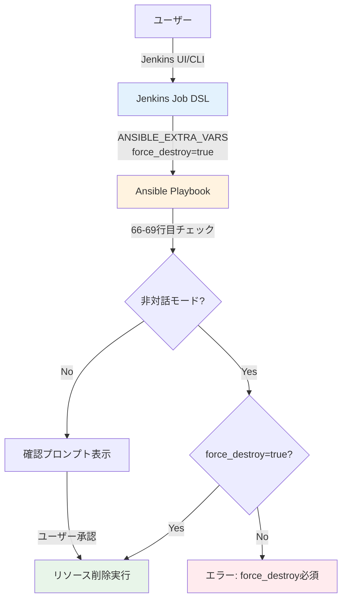

# 詳細設計書 - Issue #193

**Issue**: [TASK] Lambda Teardown Pipeline用のforce_destroyパラメータのドキュメント化
**Issue URL**: https://github.com/tielec/infrastructure-as-code/issues/193
**作成日**: 2025年度
**Requirements Document**: @requirements.md を参照
**Planning Document**: @planning.md を参照

---

## 0. Planning Documentおよび要件定義書の確認

### Planning Documentの主要方針

- **実装戦略**: EXTEND（既存ファイルへの追記）
- **テスト戦略**: UNIT_ONLY（ドキュメント検証のみ）
- **複雑度**: 簡単（見積もり工数: 2~3時間）
- **リスク**: 低（ドキュメントのみの更新）

### 要件定義書の主要要件

- **FR-001**: Job DSLファイルへのパラメータコメント追加【高】
- **FR-002**: jenkins/README.mdへのジョブ使用方法追記【高】
- **FR-003**: ansible/README.mdへの実行例追記【高】
- **FR-004**: ドキュメント間の整合性確保【中】

---

## 1. アーキテクチャ設計

### システム全体図

```
┌─────────────────────────────────────────────────────────┐
│                      ユーザー                              │
│               （Jenkins UI / CLI / API）                  │
└───────────────────────┬─────────────────────────────────┘
                        │ 実行
                        ↓
┌─────────────────────────────────────────────────────────┐
│              Jenkins Job (Ansible Playbook Executor)      │
│  - infrastructure_ansible_playbook_executor_job.groovy   │
│  - パラメータ: ANSIBLE_EXTRA_VARS                         │
│    ├─ env=dev                                            │
│    ├─ force_destroy=true ← 【ドキュメント化対象】          │
│    └─ destroy_ssm=true (オプション)                      │
└───────────────────────┬─────────────────────────────────┘
                        │ ansible-playbook 実行
                        ↓
┌─────────────────────────────────────────────────────────┐
│         Ansible Playbook (lambda_teardown_pipeline.yml)  │
│  - 66-69行目: force_destroy チェックロジック（実装済み）   │
│    - 非対話モード（CI/Jenkins）では force_destroy=true 必須│
│    - 未設定の場合は安全のため処理停止                      │
└─────────────────────────────────────────────────────────┘
```

### コンポーネント間の関係



### データフロー

1. **ユーザー** → Jenkins Job DSL
   - パラメータ: `ANSIBLE_EXTRA_VARS="env=dev force_destroy=true"`

2. **Jenkins Job DSL** → Ansible Playbook
   - `ansible-playbook lambda_teardown_pipeline.yml -e "env=dev force_destroy=true"`

3. **Ansible Playbook** → 内部チェック（66-69行目）
   - 非対話モード検出: `CI`環境変数、`JENKINS_HOME`環境変数をチェック
   - `force_destroy`パラメータの有無を確認
   - 未設定の場合はエラーメッセージを表示して停止

---

## 2. 実装戦略判断

### 実装戦略: EXTEND

**判断根拠**:
- **既存ファイルへの追記のみ**: 新規ファイル作成は不要
- **コード変更なし**: Ansibleプレイブックの実装（66-69行目）は既に正しく動作している
- **ドキュメント更新のみ**:
  1. `jenkins/jobs/dsl/infrastructure/infrastructure_ansible_playbook_executor_job.groovy`（115行目付近）へのコメント追加
  2. `jenkins/README.md`へのセクション追記
  3. `ansible/README.md`へのセクション追記
- **影響範囲が限定的**: 3ファイルのみ、既存機能には影響なし

---

## 3. テスト戦略判断

### テスト戦略: UNIT_ONLY

**判断根拠**:
- **ドキュメントのみの変更**: 実際のコード実行テストは不要
- **検証対象**:
  - パラメータ名の正確性（`force_destroy`が正しく記載されているか）
  - 実行例の正確性（コマンドが正しいか）
  - 誤字脱字のチェック
  - 既存ドキュメントとの整合性確認
- **ユニットテスト相当**: ドキュメントの内容検証をマニュアルレビューで実施
- **実装テスト不要**: プレイブックは既に正しく動作しており、コード変更がないため

---

## 4. テストコード戦略判断

### テストコード戦略: EXTEND_TEST

**判断根拠**:
- **自動テストコード不要**: ドキュメント更新のみのため、実行可能なテストコードは不要
- **検証方法**: マニュアルレビュー（チェックリスト方式）
  - プレイブック（`lambda_teardown_pipeline.yml`）の実装（66-69行目）との整合性確認
  - パラメータ名の正確性確認
  - 実行例の動作確認（構文チェック）
- **既存テスト拡張**: 既存のドキュメントレビュープロセスに統合

---

## 5. 影響範囲分析

### 既存コードへの影響

| ファイル | 変更内容 | 影響度 | 破壊的変更 |
|---------|---------|--------|-----------|
| `jenkins/jobs/dsl/infrastructure/infrastructure_ansible_playbook_executor_job.groovy` | 115行目付近の`ANSIBLE_EXTRA_VARS`パラメータにコメント追加 | 低 | なし |
| `jenkins/README.md` | Lambda Teardown Pipelineジョブの使用方法セクションを追加 | 低 | なし |
| `ansible/README.md` | Lambda Teardown Pipelineの実行例を追加 | 低 | なし |

### 依存関係の変更

**なし**

- コード実装は変更なし
- 既存のAnsibleプレイブック（`lambda_teardown_pipeline.yml`）の動作は変更なし
- Jenkins Job DSLの構造も変更なし（コメント追加のみ）

### マイグレーション要否

**不要**

- ドキュメントのみの更新のため、データ移行やスキーマ変更は不要
- 既存ユーザーへの影響なし（既存機能は変更なし）

---

## 6. 変更・追加ファイルリスト

### 修正が必要な既存ファイル

1. **jenkins/jobs/dsl/infrastructure/infrastructure_ansible_playbook_executor_job.groovy**
   - 115行目付近の`ANSIBLE_EXTRA_VARS`パラメータ定義にコメント追加
   - 追加内容: Lambda Teardown Pipeline実行時に`force_destroy=true`が必須であることを明記

2. **jenkins/README.md**
   - 「重要なジョブの詳細」セクション（302行目以降）に新規サブセクション追加
   - セクション名: `Lambda Teardown Pipeline`
   - 追加内容: 目的、パラメータ、実行例、注意事項

3. **ansible/README.md**
   - 「システム別プレイブック」セクション（127行目以降）の「Lambdaシステム」に実行例を追加
   - 追加内容: `force_destroy=true`を含む実行例、非対話モードでの必須要件

### 新規作成ファイル

**なし**

### 削除が必要なファイル

**なし**

---

## 7. 詳細設計

### 7.1. Job DSLファイルへのコメント追加

#### ファイル: `jenkins/jobs/dsl/infrastructure/infrastructure_ansible_playbook_executor_job.groovy`

#### 変更箇所: 115行目付近

**現在のコード**:
```groovy
// Ansibleオプション
stringParam('ANSIBLE_EXTRA_VARS', ansibleExtraVarsDefault, '追加のAnsible変数（例: key1=value1 key2=value2）')
```

**変更後のコード**:
```groovy
// Ansibleオプション
stringParam('ANSIBLE_EXTRA_VARS', ansibleExtraVarsDefault, '''追加のAnsible変数（例: key1=value1 key2=value2）

【重要】Lambda Teardown Pipeline実行時の必須パラメータ:
- 非対話モード（Jenkins/CI）から実行する場合、force_destroy=true の明示的な設定が必須です
- 例: env=dev force_destroy=true
- SSMパラメータも削除する場合: env=dev force_destroy=true destroy_ssm=true
- 詳細は jenkins/README.md の「Lambda Teardown Pipeline」セクションを参照''')
```

#### 設計上の考慮事項

- **既存フォーマット維持**: 他のパラメータ説明と同じスタイルを維持
- **視認性向上**: 「【重要】」タグを使用して注意喚起
- **具体例の提示**: ユーザーがコピー&ペーストできる形式で実行例を記載
- **参照リンク**: 詳細情報へのナビゲーションを提供

---

### 7.2. jenkins/README.mdへのセクション追加

#### ファイル: `jenkins/README.md`

#### 追加位置: 302行目以降の「重要なジョブの詳細」セクション内

#### 追加するセクション名: `Lambda Teardown Pipeline`

**追加内容**:

```markdown
#### Lambda Teardown Pipeline

**目的**: Lambda APIインフラストラクチャを安全に削除

**パラメータ**:
- `PLAYBOOKS`: `playbooks/lambda/lambda_teardown_pipeline.yml`（自動設定）
- `ENVIRONMENT`: 実行環境（dev/prod）
- `ANSIBLE_EXTRA_VARS`: 追加のAnsible変数
  - **必須パラメータ（非対話モード）**: `force_destroy=true`
    - Jenkinsから実行する場合、誤操作防止のため明示的な設定が必須
    - 例: `env=dev force_destroy=true`
  - **オプションパラメータ**: `destroy_ssm=true`
    - SSMパラメータも削除する場合に指定
    - 例: `env=dev force_destroy=true destroy_ssm=true`

**削除対象リソース**（逆順で削除）:
1. API Gateway
2. Lambda Functions
3. Lambda Shipment S3バケット
4. VPC Endpoints
5. Security Groups
6. Network Infrastructure
7. SSM Parameters（`destroy_ssm=true`の場合のみ）

**実行例**:

```bash
# 基本的な削除（SSMパラメータは保持）
PLAYBOOKS: playbooks/lambda/lambda_teardown_pipeline.yml
ENVIRONMENT: dev
ANSIBLE_EXTRA_VARS: env=dev force_destroy=true

# SSMパラメータも削除
PLAYBOOKS: playbooks/lambda/lambda_teardown_pipeline.yml
ENVIRONMENT: dev
ANSIBLE_EXTRA_VARS: env=dev force_destroy=true destroy_ssm=true
```

**注意事項**:
- ⚠️ **非対話モード（Jenkins/CI）では`force_destroy=true`が必須**: 未設定の場合、安全のため処理が停止します
- ⚠️ **削除は不可逆的**: 削除したリソースは復元できません。実行前に環境名を必ず確認してください
- ⚠️ **本番環境への影響**: 本番環境（`env=prod`）の削除は特に慎重に実行してください
- 📌 **対話モードでの実行**: Ansibleをコマンドラインから直接実行する場合は確認プロンプトが表示されます

**セーフガード機能**:
- プレイブック（`ansible/playbooks/lambda/lambda_teardown_pipeline.yml`）の66-69行目で実装
- 非対話モードでは`force_destroy=true`が設定されていない限り処理を停止
- 誤操作による本番環境の削除を防止
```

#### 設計上の考慮事項

- **既存ジョブドキュメントとの統一**: 他のジョブ（`Shutdown_Jenkins_Environment`等）と同じフォーマットを維持
- **視認性の高い警告**: 絵文字（⚠️、📌）を使用して重要な注意事項を強調
- **段階的な説明**: 基本→応用→注意事項の順で記載
- **実行例の充実**: コピー&ペーストで使える形式
- **セーフガード機能の明記**: 実装済みのセキュリティ機能を説明

---

### 7.3. ansible/README.mdへのセクション追加

#### ファイル: `ansible/README.md`

#### 変更位置: 121-125行目（Lambda Functions - パイプラインプレイブック）

**現在の内容**:
```markdown
#### Lambda Functions

```bash
# 完全デプロイ
cd ansible
ansible-playbook playbooks/lambda_setup_pipeline.yml -e "env=dev"

# 完全削除
ansible-playbook playbooks/lambda_teardown_pipeline.yml -e "env=dev force_destroy=true"
```
```

**変更後の内容**:
```markdown
#### Lambda Functions

```bash
# 完全デプロイ
cd ansible
ansible-playbook playbooks/lambda_setup_pipeline.yml -e "env=dev"

# 完全削除
# 【重要】Jenkinsから実行する場合、force_destroy=true の明示的な設定が必須です
ansible-playbook playbooks/lambda/lambda_teardown_pipeline.yml -e "env=dev force_destroy=true"

# SSMパラメータも削除する場合
ansible-playbook playbooks/lambda/lambda_teardown_pipeline.yml -e "env=dev force_destroy=true destroy_ssm=true"
```

**注意**: 非対話モード（CI/Jenkins）では`force_destroy=true`が必須パラメータです。設定されていない場合、安全のため処理が停止します。

**セーフガード機能**: プレイブック（66-69行目）で実装されており、誤操作による本番環境の削除を防止します。
```

#### 設計上の考慮事項

- **最小限の変更**: 既存の実行例を拡張する形で追記
- **コメントによる強調**: `【重要】`タグで注意喚起
- **正確なパス**: `playbooks/lambda/lambda_teardown_pipeline.yml`と完全パスを記載（既存の記載ミスを修正）
- **簡潔な注意書き**: ユーザーが素早く理解できる簡潔な説明

---

## 8. セキュリティ考慮事項

### 8.1. 認証・認可

**現状維持**（変更なし）:
- Jenkins Job DSLの実行権限は既存のロールベースアクセス制御（RBAC）で管理
- Ansibleプレイブックの実行はJenkins認証済みユーザーのみ

### 8.2. データ保護

**セーフガード機能の強化**（ドキュメント化のみ）:
- プレイブック（66-69行目）の既存チェックロジックをドキュメントで明示
- `force_destroy=true`の明示的な設定を必須化（実装済み）
- 誤操作による本番環境削除を防止

### 8.3. セキュリティリスクと対策

| リスク | 影響度 | 対策 |
|-------|-------|------|
| ドキュメント記載ミスによる誤操作 | 中 | **対策**: レビュープロセスでパラメータ名と実行例を確認<br>**Phase 6**: 実装との整合性チェック |
| パラメータ未設定によるエラー | 低 | **既存対策**: プレイブック（66-69行目）でエラーメッセージを表示して停止<br>**追加対策**: ドキュメントで事前に通知 |
| 本番環境の誤削除 | 高 | **既存対策**: 非対話モードでは`force_destroy=true`必須<br>**追加対策**: ドキュメントで警告を明記 |

---

## 9. 非機能要件への対応

### 9.1. パフォーマンス

**影響なし**:
- ドキュメント更新のみのため、システムパフォーマンスへの影響なし
- Jenkins Job DSLのコメント追加はビルドパフォーマンスに影響なし

### 9.2. スケーラビリティ

**影響なし**:
- 既存のジョブ定義構造を維持
- 将来的な他のteardownプレイブック（`jenkins_teardown_pipeline.yml`等）への横展開が容易

### 9.3. 保守性

**向上**:
- **ドキュメント完全性の向上**: 既存機能が網羅的に説明される
- **後続開発者の理解促進**: コードとドキュメントの整合性が取れる
- **問い合わせ削減**: ユーザーが自己解決できる情報を提供

### 9.4. 可読性

**向上**:
- **視覚的な強調**: 「【重要】」タグ、絵文字（⚠️、📌）を使用
- **具体例の提示**: コピー&ペーストで使える実行例
- **階層的な構造**: 目的→パラメータ→実行例→注意事項の順で記載

---

## 10. 実装の順序

### Phase 4（Implementation）での推奨実装順序

1. **Job DSLファイルへのコメント追加**（優先度: 高）
   - ファイル: `jenkins/jobs/dsl/infrastructure/infrastructure_ansible_playbook_executor_job.groovy`
   - 所要時間: 5分
   - 理由: 最も小さな変更で、既存構造への影響が最小

2. **jenkins/README.mdへのセクション追加**（優先度: 高）
   - ファイル: `jenkins/README.md`
   - 所要時間: 15分
   - 理由: Jenkins使用者向けの主要ドキュメント

3. **ansible/README.mdへのセクション追加**（優先度: 高）
   - ファイル: `ansible/README.md`
   - 所要時間: 10分
   - 理由: Ansible直接実行者向けのリファレンス

### Phase 6（Testing）での推奨テスト順序

1. **パラメータ名の正確性確認**（所要時間: 5分）
   - プレイブック（66-69行目）との整合性確認
   - `force_destroy`のスペルチェック

2. **実行例の構文チェック**（所要時間: 10分）
   - コマンド構文の検証
   - パラメータ形式の確認

3. **誤字脱字のチェック**（所要時間: 10分）
   - Markdownレンダリング確認
   - 日本語文章の自然さ確認

4. **ドキュメント間の整合性確認**（所要時間: 10分）
   - 3ファイル間でパラメータ名が一致しているか
   - 説明文に矛盾がないか

---

## 11. 品質ゲート（Phase 2）チェックリスト

以下の品質ゲートは**必須要件**です：

- [x] **実装戦略の判断根拠が明記されている**: EXTEND戦略を選択し、理由を明記
- [x] **テスト戦略の判断根拠が明記されている**: UNIT_ONLY戦略を選択し、理由を明記
- [x] **既存コードへの影響範囲が分析されている**: 3ファイルのみ、コード変更なし
- [x] **変更が必要なファイルがリストアップされている**: Job DSL、jenkins/README.md、ansible/README.md
- [x] **設計が実装可能である**: 具体的な変更内容を記載、コピー&ペースト可能

---

## 12. 補足情報

### 12.1. Planning Documentとの整合性確認

| Planning項目 | 設計書での対応 | 状態 |
|-------------|--------------|------|
| 実装戦略: EXTEND | Section 2で判断根拠を明記 | ✅ |
| テスト戦略: UNIT_ONLY | Section 3で判断根拠を明記 | ✅ |
| テストコード戦略: EXTEND_TEST | Section 4で判断根拠を明記 | ✅ |
| 影響範囲: 3ファイル | Section 5で詳細に分析 | ✅ |
| 見積もり工数: 2~3時間 | Section 10で具体的な所要時間を記載 | ✅ |

### 12.2. 要件定義書との対応表

| 要件ID | 要件名 | 設計書セクション | 状態 |
|-------|-------|----------------|------|
| FR-001 | Job DSLファイルへのパラメータコメント追加 | Section 7.1 | ✅ |
| FR-002 | jenkins/README.mdへのジョブ使用方法追記 | Section 7.2 | ✅ |
| FR-003 | ansible/README.mdへの実行例追記 | Section 7.3 | ✅ |
| FR-004 | ドキュメント間の整合性確保 | Section 10（Phase 6テスト） | ✅ |
| NFR-001 | 可読性 | Section 9.4 | ✅ |
| NFR-002 | 保守性 | Section 9.3 | ✅ |
| NFR-003 | 正確性 | Section 8（セキュリティ） | ✅ |
| NFR-004 | 一貫性 | Section 7.1, 7.2, 7.3 | ✅ |

### 12.3. 実装済み機能の確認

プレイブック（`ansible/playbooks/lambda/lambda_teardown_pipeline.yml`）の66-69行目:

```yaml
- name: Check force_destroy in non-interactive mode
  ansible.builtin.fail:
    msg: |
      Running in non-interactive mode (CI/Jenkins).
      To destroy resources, you must explicitly set 'force_destroy=true'
      Example: ansible-playbook lambda_teardown_pipeline.yml -e "env=dev force_destroy=true"
  when:
    - not is_interactive | bool
    - force_destroy is not defined or not force_destroy | bool
```

**設計上の対応**:
- このエラーメッセージをドキュメントで事前に通知
- 実行例でパラメータ設定方法を明示
- セーフガード機能として明記

---

## まとめ

この設計書は、以下の点でPlanning DocumentとRequirements Documentの方針に沿っています：

1. **EXTEND戦略**: 既存ファイルへの追記のみ、新規ファイル作成なし
2. **UNIT_ONLY戦略**: ドキュメント検証のみ、実装テスト不要
3. **低リスク**: コード変更なし、既存機能への影響なし
4. **短時間で完了**: 各セクションの所要時間を明記（合計2~3時間）
5. **実装可能性**: 具体的な変更内容を記載、コピー&ペースト可能

次フェーズ（Phase 3: Test Scenario）では、Section 10で記載したテスト順序に従ってテストシナリオを作成します。

---

**レビューポイント**:
- [x] Planning Documentの戦略（EXTEND、UNIT_ONLY、EXTEND_TEST）に沿っているか
- [x] 実装可能な設計であるか（具体的な変更内容が記載されているか）
- [x] 変更が必要なファイルがリストアップされているか
- [x] 既存コードへの影響範囲が分析されているか
- [x] ブロッカー（次フェーズに進めない問題）が存在しないか
