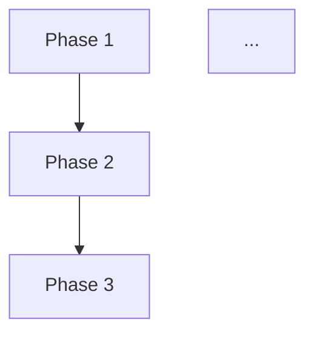

# 詳細設計書: Phase 0 (Planning) - プロジェクトマネージャ役割の追加

## 1. アーキテクチャ設計

### 1.1 システム全体図

```
┌─────────────────────────────────────────────────────────────┐
│                     AI駆動開発自動化ワークフロー                │
└─────────────────────────────────────────────────────────────┘

Phase 0: Planning (新規追加)
    ├─ Issue分析と作業計画の策定
    ├─ 実装戦略・テスト戦略の事前決定
    └─ planning.mdとmetadata.jsonへの戦略保存
        ↓
Phase 1-7: Execute (既存)
    ├─ Phase 1: Requirements（Phase 0の計画を参照）
    ├─ Phase 2: Design（実装戦略決定ロジックを削除）
    ├─ Phase 3: Test Scenario
    ├─ Phase 4: Implementation
    ├─ Phase 5: Testing
    ├─ Phase 6: Documentation
    └─ Phase 7: Report
        ↓
Review: QA Engineer (既存)
    └─ 各フェーズの品質チェック
```

### 1.2 コンポーネント間の関係

```
┌──────────────────────┐
│   PlanningPhase      │
│  (phases/planning.py)│
└──────┬───────────────┘
       │ 継承
       ↓
┌──────────────────────┐
│    BasePhase         │
│ (phases/base_phase.py)│
└──────┬───────────────┘
       │ 依存
       ├───→ MetadataManager (metadata.jsonの読み書き)
       ├───→ ClaudeAgentClient (Claude Agent SDK統合)
       ├───→ GitHubClient (Issue情報取得、進捗報告)
       └───→ GitManager (Git自動commit & push)
```

### 1.3 データフロー

```
[GitHub Issue] ─取得→ [PlanningPhase]
                          │
                          ├─ Issue分析
                          ├─ 実装戦略決定
                          ├─ テスト戦略決定
                          ├─ タスク分割
                          ├─ リスク評価
                          │
                          ↓
           ┌──────────────┴──────────────┐
           │                             │
           ↓                             ↓
    [planning.md]                  [metadata.json]
    (.ai-workflow/issue-313/      design_decisions:
     00_planning/output/)           - implementation_strategy
                                    - test_strategy
                                    - test_code_strategy
           │                             │
           └──────────┬──────────────────┘
                      │
                      ↓
              [Phase 2: Design]
              (実装戦略決定をスキップし、
               metadata.jsonから読み取る)
```

## 2. 実装戦略判断

### 実装戦略: CREATE

**判断根拠**:
- **新規フェーズの追加**: Phase 0 (Planning)は既存Phase 1-7とは独立した新しいフェーズであり、既存コードへの直接的な修正は最小限
- **新規ファイルの作成が中心**:
  - `phases/planning.py`: 新規作成
  - `prompts/planning/execute.txt`: 新規作成
  - `prompts/planning/review.txt`: 新規作成
  - `prompts/planning/revise.txt`: 新規作成
  - `tests/e2e/test_phase0.py`: 新規作成
  - `tests/unit/phases/test_planning.py`: 新規作成
- **既存ファイルへの修正は限定的**:
  - `main.py`: フェーズ番号マッピングとCLIコマンド追加のみ
  - `phases/base_phase.py`: PHASE_NUMBERSマッピングに1行追加のみ
  - `phases/design.py`: 実装戦略決定ロジックの削除（Phase 2のリファクタリング要素があるが、主目的は新規Phase追加）
- **既存機能との統合度**: 低（BasePhaseのインターフェースに従うだけで、他Phaseとの依存関係は最小限）

## 3. テスト戦略判断

### テスト戦略: UNIT_INTEGRATION

**判断根拠**:
- **Unit テストの必要性**:
  - `PlanningPhase`クラスの各メソッド（execute, review, revise）の単体テスト
  - `_extract_design_decisions()`メソッドの正規表現パターンマッチングの単体テスト
  - `_format_issue_info()`メソッドのフォーマット処理の単体テスト
- **Integration テストの必要性**:
  - Claude Agent SDKとの統合テスト（プロンプトの実行とレスポンスの解析）
  - GitHub APIとの統合テスト（Issue情報取得、進捗報告、レビュー結果投稿）
  - metadata.jsonへの戦略保存とPhase 2からの読み取りの統合テスト
  - Git自動commit & pushの統合テスト
- **BDD テストは不要**:
  - Phase 0は開発者向けの内部ツールであり、エンドユーザー向けのユーザーストーリーは存在しない
  - ビジネスロジックよりも技術的な実装が中心
- **既存テストとの整合性**:
  - 既存Phase（requirements.py, design.py等）もUNIT_INTEGRATIONパターンを採用
  - E2Eテスト（test_phase1.py等）が存在するため、test_phase0.pyも作成

## 4. テストコード戦略判断

### テストコード戦略: CREATE_TEST

**判断根拠**:
- **新規テストファイルの作成が必要**:
  - `tests/e2e/test_phase0.py`: Phase 0のE2Eテスト（新規作成）
  - `tests/unit/phases/test_planning.py`: PlanningPhaseクラスの単体テスト（新規作成）
- **既存テストファイルの拡張は不要**:
  - Phase 0は既存Phaseとは独立しているため、既存のtest_phase1.py等への追加は不要
  - BasePhaseのテスト（test_base_phase.py）への変更も不要（PHASE_NUMBERSマッピング追加は破壊的変更ではない）
- **既存テストとの関連性**:
  - Phase 0のテストは既存Phase 1-7のテストと同じ構造（execute → review → revise）を踏襲
  - テストファイル名も既存パターンに従う（test_phase0.py）

## 5. 影響範囲分析

### 5.1 既存コードへの影響

#### 変更が必要なファイル（最小限）:

1. **`scripts/ai-workflow/main.py`** (3箇所の変更)
   - 変更箇所1: Importセクション（1行追加）
     ```python
     from phases.planning import PlanningPhase  # 新規追加
     ```
   - 変更箇所2: `execute`コマンドのChoice型（main.py:95-96行目）
     ```python
     type=click.Choice(['planning', 'requirements', 'design', ...])  # planningを追加
     ```
   - 変更箇所3: `phase_classes`辞書（main.py:158-166行目）
     ```python
     phase_classes = {
         'planning': PlanningPhase,  # 新規追加
         'requirements': RequirementsPhase,
         ...
     }
     ```

2. **`scripts/ai-workflow/phases/base_phase.py`** (1行追加)
   - 変更箇所: PHASE_NUMBERSマッピング（base_phase.py:22-30行目）
     ```python
     PHASE_NUMBERS = {
         'planning': '00',  # 新規追加
         'requirements': '01',
         ...
     }
     ```

3. **`scripts/ai-workflow/phases/design.py`** (リファクタリング - Phase 2の簡素化)
   - 変更箇所1: execute()メソッド内の実装戦略決定ロジック削除
     - Phase 0で決定した戦略をmetadata.jsonから読み取るロジックに変更
   - 変更箇所2: プロンプトファイル`prompts/design/execute.txt`の修正
     - 実装戦略・テスト戦略の決定セクションを削除
     - metadata.jsonから読み取った戦略情報を参照するセクションに変更

### 5.2 依存関係の変更

- **新規依存**: なし（既存の依存関係のみ使用）
  - BasePhase（継承）
  - MetadataManager（既存）
  - ClaudeAgentClient（既存）
  - GitHubClient（既存）
  - GitManager（既存）

- **Phase間の新しい依存関係**:
  - Phase 0 → metadata.json (戦略情報を保存)
  - Phase 2 → metadata.json (Phase 0が保存した戦略情報を参照)

### 5.3 マイグレーション要否

- **マイグレーション不要**:
  - metadata.jsonのスキーマは既に`design_decisions`フィールドを持っている（metadata.json:7-11行目）
  - 既存のmetadata.jsonとの互換性は維持される
  - Phase 0をスキップして従来通りPhase 1から開始しても動作する（後方互換性あり）

## 6. 変更・追加ファイルリスト

### 6.1 新規作成ファイル

```
scripts/ai-workflow/
├── phases/
│   └── planning.py                          # PlanningPhaseクラス
├── prompts/
│   └── planning/
│       ├── execute.txt                       # 計画書生成プロンプト
│       ├── review.txt                        # 計画書レビュープロンプト
│       └── revise.txt                        # 計画書修正プロンプト
└── tests/
    ├── e2e/
    │   └── test_phase0.py                    # E2Eテスト
    └── unit/
        └── phases/
            └── test_planning.py              # 単体テスト
```

### 6.2 修正が必要な既存ファイル

```
scripts/ai-workflow/
├── main.py                                   # CLI追加（3箇所の変更）
├── phases/
│   ├── base_phase.py                         # PHASE_NUMBERSマッピング追加（1行）
│   └── design.py                             # 実装戦略決定ロジックを削除
└── prompts/
    └── design/
        └── execute.txt                       # 実装戦略決定セクションを削除
```

### 6.3 削除が必要なファイル

なし

## 7. 詳細設計

### 7.1 クラス設計

#### PlanningPhase クラス

```python
"""Phase 0: プロジェクト計画フェーズ

GitHub Issue情報から以下を策定:
- Issue複雑度分析
- 実装タスクの洗い出しと分割
- タスク間依存関係の特定
- 各フェーズの見積もり
- リスク評価とリスク軽減策
- 実装戦略・テスト戦略の事前決定
"""

class PlanningPhase(BasePhase):
    """プロジェクト計画フェーズ"""

    def __init__(self, *args, **kwargs):
        """初期化"""
        super().__init__(phase_name='planning', *args, **kwargs)

    def execute(self) -> Dict[str, Any]:
        """
        プロジェクト計画フェーズを実行

        処理フロー:
        1. Issue情報を取得
        2. Issue情報をフォーマット
        3. 実行プロンプトを読み込み
        4. Claude Agent SDKでタスクを実行
        5. planning.mdのパスを取得
        6. 戦略判断を抽出してmetadata.jsonに保存
        7. GitHub Issueに成果物を投稿

        Returns:
            Dict[str, Any]: 実行結果
                - success: bool
                - output: str - planning.mdのパス
                - error: Optional[str]
        """

    def review(self) -> Dict[str, Any]:
        """
        計画書をレビュー

        処理フロー:
        1. planning.mdを読み込み
        2. レビュープロンプトを読み込み
        3. Claude Agent SDKでレビューを実行
        4. レビュー結果をパース
        5. レビュー結果をファイルに保存

        Returns:
            Dict[str, Any]: レビュー結果
                - result: str - PASS/PASS_WITH_SUGGESTIONS/FAIL
                - feedback: str
                - suggestions: List[str]
        """

    def revise(self, review_feedback: str) -> Dict[str, Any]:
        """
        レビュー結果を元に計画書を修正

        処理フロー:
        1. Issue情報を取得
        2. 元の計画書を読み込み
        3. 修正プロンプトを読み込み
        4. Claude Agent SDKでタスクを実行
        5. planning.mdのパスを取得
        6. 戦略判断を再抽出してmetadata.jsonに保存

        Args:
            review_feedback: レビュー結果のフィードバック

        Returns:
            Dict[str, Any]: 修正結果
                - success: bool
                - output: str - planning.mdのパス
                - error: Optional[str]
        """

    def _format_issue_info(self, issue_info: Dict[str, Any]) -> str:
        """
        Issue情報をフォーマット

        Args:
            issue_info: Issue情報

        Returns:
            str: フォーマットされたIssue情報
        """

    def _extract_design_decisions(self, planning_content: str) -> Dict[str, str]:
        """
        計画書から戦略判断を抽出

        正規表現パターン:
        - 実装戦略: r'###?\s*実装戦略[:：]\s*(CREATE|EXTEND|REFACTOR)'
        - テスト戦略: r'###?\s*テスト戦略[:：]\s*(UNIT_ONLY|INTEGRATION_ONLY|...)'
        - テストコード戦略: r'###?\s*テストコード戦略[:：]\s*(EXTEND_TEST|CREATE_TEST|BOTH_TEST)'

        Args:
            planning_content: 計画書の内容

        Returns:
            Dict[str, str]: 戦略判断
                - implementation_strategy: CREATE/EXTEND/REFACTOR
                - test_strategy: UNIT_ONLY/.../ALL
                - test_code_strategy: EXTEND_TEST/CREATE_TEST/BOTH_TEST
        """
```

### 7.2 関数設計（主要な関数のみ）

#### execute()メソッドの詳細

```python
def execute(self) -> Dict[str, Any]:
    try:
        # 1. Issue情報を取得
        issue_number = int(self.metadata.data['issue_number'])
        issue_info = self.github.get_issue_info(issue_number)

        # 2. Issue情報をフォーマット
        issue_info_text = self._format_issue_info(issue_info)

        # 3. 実行プロンプトを読み込み
        execute_prompt_template = self.load_prompt('execute')

        # 4. プロンプトに情報を埋め込み
        execute_prompt = execute_prompt_template.replace(
            '{issue_info}',
            issue_info_text
        ).replace(
            '{issue_number}',
            str(issue_number)
        )

        # 5. Claude Agent SDKでタスクを実行
        messages = self.execute_with_claude(
            prompt=execute_prompt,
            max_turns=50,  # 計画フェーズは複雑なので多めに
            log_prefix='execute'
        )

        # 6. planning.mdのパスを取得
        output_file = self.output_dir / 'planning.md'

        if not output_file.exists():
            return {
                'success': False,
                'output': None,
                'error': f'planning.mdが生成されませんでした: {output_file}'
            }

        # 7. 戦略判断を抽出してmetadata.jsonに保存
        planning_content = output_file.read_text(encoding='utf-8')
        decisions = self._extract_design_decisions(planning_content)

        if decisions:
            self.metadata.data['design_decisions'].update(decisions)
            self.metadata.save()
            print(f"[INFO] 戦略判断をmetadata.jsonに保存: {decisions}")

        # 8. GitHub Issueに成果物を投稿
        try:
            self.post_output(
                output_content=planning_content,
                title="プロジェクト計画書"
            )
        except Exception as e:
            print(f"[WARNING] 成果物のGitHub投稿に失敗しました: {e}")

        return {
            'success': True,
            'output': str(output_file),
            'error': None
        }

    except Exception as e:
        return {
            'success': False,
            'output': None,
            'error': str(e)
        }
```

#### _extract_design_decisions()メソッドの詳細

```python
def _extract_design_decisions(self, planning_content: str) -> Dict[str, str]:
    """
    計画書から戦略判断を抽出

    正規表現パターン:
    - 実装戦略: r'###?\s*実装戦略[:：]\s*(CREATE|EXTEND|REFACTOR)'
    - テスト戦略: r'###?\s*テスト戦略[:：]\s*(UNIT_ONLY|INTEGRATION_ONLY|BDD_ONLY|UNIT_INTEGRATION|UNIT_BDD|INTEGRATION_BDD|ALL)'
    - テストコード戦略: r'###?\s*テストコード戦略[:：]\s*(EXTEND_TEST|CREATE_TEST|BOTH_TEST)'
    """
    import re

    decisions = {}

    # 実装戦略を抽出
    impl_match = re.search(
        r'###?\s*実装戦略[:：]\s*(CREATE|EXTEND|REFACTOR)',
        planning_content,
        re.IGNORECASE | re.MULTILINE
    )
    if impl_match:
        decisions['implementation_strategy'] = impl_match.group(1).upper()

    # テスト戦略を抽出
    test_match = re.search(
        r'###?\s*テスト戦略[:：]\s*(UNIT_ONLY|INTEGRATION_ONLY|BDD_ONLY|UNIT_INTEGRATION|UNIT_BDD|INTEGRATION_BDD|ALL)',
        planning_content,
        re.IGNORECASE | re.MULTILINE
    )
    if test_match:
        decisions['test_strategy'] = test_match.group(1).upper()

    # テストコード戦略を抽出
    test_code_match = re.search(
        r'###?\s*テストコード戦略[:：]\s*(EXTEND_TEST|CREATE_TEST|BOTH_TEST)',
        planning_content,
        re.IGNORECASE | re.MULTILINE
    )
    if test_code_match:
        decisions['test_code_strategy'] = test_code_match.group(1).upper()

    return decisions
```

### 7.3 データ構造設計

#### planning.md の構造

```markdown
# プロジェクト計画書

## 1. Issue分析
- 複雑度: [簡単/中程度/複雑]
- 見積もり工数: X時間
- リスク評価: [低/中/高]

## 2. 実装戦略判断

### 実装戦略: CREATE / EXTEND / REFACTOR

**判断根拠**:
- （理由1）
- （理由2）

### テスト戦略: UNIT_ONLY / ... / ALL

**判断根拠**:
- （理由1）
- （理由2）

### テストコード戦略: EXTEND_TEST / CREATE_TEST / BOTH_TEST

**判断根拠**:
- （理由1）
- （理由2）

## 3. 影響範囲分析
- 既存コードへの影響: ...
- 依存関係の変更: ...
- マイグレーション要否: ...

## 4. タスク分割

### Phase 1: 要件定義 (見積もり: Xh)
- サブタスク1
- サブタスク2

### Phase 2: 設計 (見積もり: Xh)
...

## 5. 依存関係



## 6. リスクと軽減策

### リスク1: ...
- **影響度**: [低/中/高]
- **確率**: [低/中/高]
- **軽減策**: ...

## 7. 品質ゲート

### Phase 1: 要件定義
- [ ] 機能要件が明確に記載されている
- [ ] 受け入れ基準が定義されている
...
```

#### metadata.json のスキーマ（design_decisions部分）

```json
{
  "design_decisions": {
    "implementation_strategy": "CREATE",  // CREATE/EXTEND/REFACTOR
    "test_strategy": "UNIT_INTEGRATION",  // UNIT_ONLY/.../ALL
    "test_code_strategy": "CREATE_TEST"   // EXTEND_TEST/CREATE_TEST/BOTH_TEST
  }
}
```

### 7.4 インターフェース設計

#### BasePhase インターフェースの実装

```python
# BasePhaseクラスで定義されている抽象メソッドを実装

@abstractmethod
def execute(self) -> Dict[str, Any]:
    """
    フェーズを実行

    Returns:
        Dict[str, Any]: 実行結果
            - success: bool - 成功/失敗
            - output: Any - 実行結果の出力
            - error: Optional[str] - エラーメッセージ
    """

@abstractmethod
def review(self) -> Dict[str, Any]:
    """
    フェーズをレビュー

    Returns:
        Dict[str, Any]: レビュー結果
            - result: str - PASS/PASS_WITH_SUGGESTIONS/FAIL
            - feedback: str - フィードバック
            - suggestions: List[str] - 改善提案一覧
    """

# revise()メソッドは抽象メソッドではないが、リトライ機能のため実装必須

def revise(self, review_feedback: str) -> Dict[str, Any]:
    """
    レビュー結果を元に計画書を修正

    Args:
        review_feedback: レビュー結果のフィードバック

    Returns:
        Dict[str, Any]: 修正結果
            - success: bool
            - output: str - planning.mdのパス
            - error: Optional[str]
    """
```

## 8. セキュリティ考慮事項

### 8.1 認証・認可

- **GitHub API認証**:
  - 環境変数`GITHUB_TOKEN`から取得（main.py:143行目）
  - トークンの有効性チェックはGitHubClientで実施（既存実装を踏襲）
  - トークンはハードコーディングしない

### 8.2 データ保護

- **機密情報の保護**:
  - planning.mdにAPIキーやパスワード等の機密情報を含めない
  - metadata.jsonに機密情報を保存しない（既存仕様と同じ）

### 8.3 セキュリティリスクと対策

- **リスク1: Issue本文にトークンが含まれる可能性**
  - 対策: プロンプトで「機密情報を含めないでください」と明示
  - 対策: レビューフェーズでセキュリティチェックを実施

- **リスク2: Claude Agent SDKのプロンプトインジェクション**
  - 対策: Issue本文を直接プロンプトに埋め込むが、Claude Agent SDKはサンドボックス環境で実行
  - 対策: ファイル書き込み権限は`.ai-workflow/`ディレクトリ内に制限

## 9. 非機能要件への対応

### 9.1 パフォーマンス

- **NFR-1.1: Planning Phase実行時間は15分以内**
  - 対策: max_turns=50に設定（base_phase.py:283行目のデフォルトは50）
  - 対策: タイムアウト設定は15分（900秒）
  - 実装: ClaudeAgentClientにタイムアウト設定を追加（オプション）

- **NFR-1.2: planning.mdのファイルサイズは500KB以内**
  - 対策: プロンプトで「簡潔に記述してください」と明示
  - 対策: レビューフェーズでファイルサイズチェック（オプション）

### 9.2 スケーラビリティ

- **複数Issue同時処理**:
  - 各Issueは独立したディレクトリ（.ai-workflow/issue-{number}/）で管理
  - 並列実行時の競合はなし

### 9.3 保守性

- **コードの可読性**:
  - 既存Phase（requirements.py, design.py）と同じ構造を踏襲
  - ドキュメント文字列（docstring）を日本語で記述
  - 型ヒント（Type Hints）を使用

- **拡張性**:
  - Phase 8 (Evaluation)の実装を見据えた設計
  - planning.mdのフォーマットは柔軟に変更可能

## 10. 実装の順序

### 10.1 フェーズ1: 基本実装（優先度: 高）

1. **ディレクトリ構造の作成**
   ```bash
   mkdir -p scripts/ai-workflow/prompts/planning
   ```

2. **PlanningPhaseクラスの実装**
   - ファイル: `scripts/ai-workflow/phases/planning.py`
   - 実装内容:
     - `__init__()`: 初期化（phase_name='planning'）
     - `execute()`: 計画書生成
     - `review()`: 計画書レビュー
     - `revise()`: 計画書修正
     - `_format_issue_info()`: Issue情報フォーマット
     - `_extract_design_decisions()`: 戦略判断抽出

3. **プロンプトファイルの作成**
   - ファイル:
     - `scripts/ai-workflow/prompts/planning/execute.txt`
     - `scripts/ai-workflow/prompts/planning/review.txt`
     - `scripts/ai-workflow/prompts/planning/revise.txt`
   - 実装内容:
     - execute.txt: 要件定義書の内容を参考に、プロジェクト計画書生成プロンプトを作成
     - review.txt: 計画書レビュープロンプト（実現可能性、タスク分割の適切性、リスク分析の網羅性）
     - revise.txt: 計画書修正プロンプト

4. **main.pyの修正**
   - ファイル: `scripts/ai-workflow/main.py`
   - 実装内容:
     - Importセクション: `from phases.planning import PlanningPhase`
     - executeコマンドのChoice型に'planning'を追加
     - phase_classesに'planning': PlanningPhaseを追加

5. **BasePhase.PHASE_NUMBERSの更新**
   - ファイル: `scripts/ai-workflow/phases/base_phase.py`
   - 実装内容:
     - PHASE_NUMBERSマッピングに`'planning': '00'`を追加

### 10.2 フェーズ2: Phase 2のリファクタリング（優先度: 高）

1. **design.pyの修正**
   - ファイル: `scripts/ai-workflow/phases/design.py`
   - 実装内容:
     - execute()メソッド: 実装戦略決定ロジックを削除
     - metadata.jsonから戦略情報を読み取るロジックを追加
     - _extract_design_decisions()メソッドは残す（Phase 0がスキップされた場合のフォールバック）

2. **design/execute.txtの修正**
   - ファイル: `scripts/ai-workflow/prompts/design/execute.txt`
   - 実装内容:
     - 実装戦略・テスト戦略の決定セクションを削除
     - metadata.jsonから読み取った戦略情報を参照するセクションを追加

### 10.3 フェーズ3: テストの作成（優先度: 中）

1. **E2Eテストの作成**
   - ファイル: `scripts/ai-workflow/tests/e2e/test_phase0.py`
   - 実装内容:
     - test_phase0()関数: Phase 0のexecute → review → revise のフローをテスト
     - 既存のtest_phase1.pyを参考に実装

2. **単体テストの作成**
   - ファイル: `scripts/ai-workflow/tests/unit/phases/test_planning.py`
   - 実装内容:
     - test_extract_design_decisions(): 正規表現パターンマッチングのテスト
     - test_format_issue_info(): Issue情報フォーマットのテスト

### 10.4 フェーズ4: ドキュメントの更新（優先度: 低）

1. **README.mdの更新**
   - Phase 0の説明を追加
   - CLIコマンド例を更新

2. **CONTRIBUTION.mdの更新**
   - Phase 0の開発ガイドラインを追加

### 10.5 依存関係の考慮

- フェーズ1 → フェーズ2: main.pyとbase_phase.pyを先に修正しないとPlanningPhaseが動作しない
- フェーズ2 → フェーズ3: Phase 2のリファクタリングが完了しないとE2Eテストが完全にテストできない
- フェーズ3 → フェーズ4: テストが完了してからドキュメントを更新（テスト結果を反映）

## 11. 設計上の注意事項

### 11.1 既存コードとの整合性

- **BasePhaseのインターフェース厳守**:
  - execute()、review()、revise()の戻り値型を統一
  - 既存Phaseと同じディレクトリ構造（output/, execute/, review/, revise/）

- **metadata.jsonスキーマの互換性**:
  - 既存のdesign_decisionsフィールドを使用（新規フィールド追加なし）
  - Phase 0をスキップしても動作する（design_decisionsがnullの場合はPhase 2で決定）

### 11.2 Phase 2との連携

- **Phase 2の実装戦略決定ロジック削除**:
  - Phase 0が完了している場合: metadata.jsonから戦略情報を読み取る
  - Phase 0がスキップされた場合: 従来通りPhase 2で戦略を決定（後方互換性）

- **フォールバック機構**:
  ```python
  # design.py の execute() メソッド内
  decisions = self.metadata.data['design_decisions']

  if decisions['implementation_strategy'] is None:
      # Phase 0がスキップされた場合は、Phase 2で決定
      design_content = output_file.read_text(encoding='utf-8')
      decisions = self._extract_design_decisions(design_content)
      self.metadata.data['design_decisions'].update(decisions)
      self.metadata.save()
  else:
      # Phase 0で決定済みの場合は、そのまま使用
      print(f"[INFO] Phase 0で決定済みの戦略を使用: {decisions}")
  ```

### 11.3 プロンプト設計のポイント

- **execute.txt**:
  - 要件定義書の内容を踏まえ、実装戦略・テスト戦略の判断を促す
  - タスク分割の粒度（1タスク = 1〜4時間）を明示
  - 依存関係図（Mermaid形式）の出力を推奨

- **review.txt**:
  - 実現可能性、タスク分割の適切性、リスク分析の網羅性をチェック
  - 品質ゲート（判定: PASS/PASS_WITH_SUGGESTIONS/FAIL）を明示

- **revise.txt**:
  - レビューフィードバックを元に計画書を修正
  - 元の計画書とレビュー結果の両方を参照

## 12. まとめ

### 12.1 設計の要点

1. **新規Phase追加**: Phase 0 (Planning)を追加し、プロジェクト計画を事前に策定
2. **実装戦略の前倒し**: Phase 2で行っていた実装戦略決定をPhase 0に移行
3. **既存コードへの影響最小化**: main.pyとbase_phase.pyの変更は最小限（4行追加）
4. **後方互換性**: Phase 0をスキップしても動作する（従来通りPhase 2で戦略決定）
5. **テスト戦略**: UNIT_INTEGRATIONで既存Phaseと統一
6. **テストコード戦略**: CREATE_TESTで新規テストファイルを作成

### 12.2 実装の優先順位

1. **高**: PlanningPhaseクラス、プロンプトファイル、main.py/base_phase.pyの修正
2. **高**: Phase 2のリファクタリング（実装戦略決定ロジックの削除）
3. **中**: E2Eテスト、単体テストの作成
4. **低**: ドキュメントの更新

### 12.3 品質ゲート確認

- [x] **実装戦略の判断根拠が明記されている**: セクション2で記載
- [x] **テスト戦略の判断根拠が明記されている**: セクション3で記載
- [x] **既存コードへの影響範囲が分析されている**: セクション5で記載
- [x] **変更が必要なファイルがリストアップされている**: セクション6で記載
- [x] **設計が実装可能である**: セクション7で詳細設計を記載、セクション10で実装順序を定義

---

**作成日**: 2025-10-10
**対象Issue**: #313
**ワークフローバージョン**: 1.0.0
