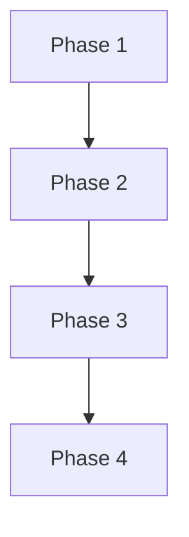

# テストシナリオ: Phase 0 (Planning) - プロジェクトマネージャ役割の追加

## 1. テスト戦略サマリー

### 選択されたテスト戦略
**UNIT_INTEGRATION** (Phase 2で決定)

### テスト対象の範囲
- **Unit テスト対象**:
  - `PlanningPhase`クラスの各メソッド
  - `_extract_design_decisions()`メソッドの正規表現パターンマッチング
  - `_format_issue_info()`メソッドのフォーマット処理

- **Integration テスト対象**:
  - Claude Agent SDKとの統合（プロンプト実行とレスポンス解析）
  - GitHub APIとの統合（Issue情報取得、進捗報告、レビュー結果投稿）
  - metadata.jsonへの戦略保存とPhase 2からの読み取り
  - Git自動commit & push

### テストの目的
1. **機能の正確性**: Phase 0が要件通りに動作することを検証
2. **既存システムとの統合**: BasePhaseインターフェースの遵守、外部システムとの連携を検証
3. **データの整合性**: metadata.jsonへの戦略保存と後続フェーズでの参照を検証
4. **エラーハンドリング**: 異常系での適切なエラー処理を検証

---

## 2. Unitテストシナリオ

### 2.1 PlanningPhase クラス - 初期化

#### テストケース: test_init_正常系
- **目的**: PlanningPhaseが正しく初期化されることを検証
- **前提条件**: BasePhaseが正常に動作する
- **入力**:
  - `issue_number`: 313
  - `workspace_root`: `/tmp/test-workspace`
- **期待結果**:
  - `phase_name`が'planning'である
  - `output_dir`が`.ai-workflow/issue-313/00_planning/output/`である
  - `execute_dir`が`.ai-workflow/issue-313/00_planning/execute/`である
  - `review_dir`が`.ai-workflow/issue-313/00_planning/review/`である
- **テストデータ**: 上記入力パラメータ

---

### 2.2 _format_issue_info() メソッド

#### テストケース: test_format_issue_info_正常系
- **目的**: Issue情報が正しくフォーマットされることを検証
- **前提条件**: issue_infoが有効なデータである
- **入力**:
  ```python
  issue_info = {
      'number': 313,
      'title': '[FEATURE] Phase 0追加',
      'state': 'open',
      'labels': ['enhancement'],
      'body': '## 概要\nPhase 0を追加する'
  }
  ```
- **期待結果**:
  - Issue番号、タイトル、状態、ラベル、本文が含まれる文字列
  - Markdown形式で整形されている
- **テストデータ**: 上記issue_info

#### テストケース: test_format_issue_info_ラベルなし
- **目的**: ラベルが空の場合でもエラーにならないことを検証
- **前提条件**: issue_infoのlabelsが空リスト
- **入力**:
  ```python
  issue_info = {
      'number': 313,
      'title': '[FEATURE] Phase 0追加',
      'state': 'open',
      'labels': [],
      'body': '## 概要\nPhase 0を追加する'
  }
  ```
- **期待結果**:
  - ラベル部分が空文字列またはデフォルト値
  - エラーが発生しない
- **テストデータ**: 上記issue_info

#### テストケース: test_format_issue_info_本文null
- **目的**: 本文がnullの場合でもエラーにならないことを検証
- **前提条件**: issue_infoのbodyがNull
- **入力**:
  ```python
  issue_info = {
      'number': 313,
      'title': '[FEATURE] Phase 0追加',
      'state': 'open',
      'labels': ['enhancement'],
      'body': None
  }
  ```
- **期待結果**:
  - 本文部分が空文字列またはデフォルト値
  - エラーが発生しない
- **テストデータ**: 上記issue_info

---

### 2.3 _extract_design_decisions() メソッド

#### テストケース: test_extract_design_decisions_すべて抽出成功
- **目的**: 計画書から3つの戦略（実装戦略、テスト戦略、テストコード戦略）が正しく抽出されることを検証
- **前提条件**: planning.mdに戦略情報が記載されている
- **入力**:
  ```markdown
  ## 実装戦略判断

  ### 実装戦略: CREATE

  **判断根拠**:
  - 新規フェーズの追加

  ### テスト戦略: UNIT_INTEGRATION

  **判断根拠**:
  - Unitテストの必要性

  ### テストコード戦略: CREATE_TEST

  **判断根拠**:
  - 新規テストファイルの作成
  ```
- **期待結果**:
  ```python
  {
      'implementation_strategy': 'CREATE',
      'test_strategy': 'UNIT_INTEGRATION',
      'test_code_strategy': 'CREATE_TEST'
  }
  ```
- **テストデータ**: 上記Markdown文字列

#### テストケース: test_extract_design_decisions_一部のみ抽出
- **目的**: 実装戦略のみ記載されている場合、その部分だけ抽出されることを検証
- **前提条件**: planning.mdに実装戦略のみ記載
- **入力**:
  ```markdown
  ### 実装戦略: EXTEND

  **判断根拠**: 既存機能の拡張
  ```
- **期待結果**:
  ```python
  {
      'implementation_strategy': 'EXTEND'
  }
  ```
- **テストデータ**: 上記Markdown文字列

#### テストケース: test_extract_design_decisions_抽出失敗
- **目的**: 戦略情報が存在しない場合、空の辞書が返されることを検証
- **前提条件**: planning.mdに戦略情報が記載されていない
- **入力**:
  ```markdown
  ## タスク分割

  ### Phase 1: 要件定義
  - サブタスク1
  ```
- **期待結果**:
  ```python
  {}
  ```
- **テストデータ**: 上記Markdown文字列

#### テストケース: test_extract_design_decisions_大文字小文字混在
- **目的**: 戦略名の大文字小文字が混在していても正しく抽出されることを検証
- **前提条件**: planning.mdの戦略名が小文字
- **入力**:
  ```markdown
  ### 実装戦略: create
  ### テスト戦略: unit_integration
  ```
- **期待結果**:
  ```python
  {
      'implementation_strategy': 'CREATE',
      'test_strategy': 'UNIT_INTEGRATION'
  }
  ```
- **テストデータ**: 上記Markdown文字列

#### テストケース: test_extract_design_decisions_無効な戦略名
- **目的**: 無効な戦略名が記載されている場合、抽出されないことを検証
- **前提条件**: planning.mdに無効な戦略名が記載
- **入力**:
  ```markdown
  ### 実装戦略: INVALID_STRATEGY
  ```
- **期待結果**:
  ```python
  {}
  ```
- **テストデータ**: 上記Markdown文字列

---

### 2.4 execute() メソッド

#### テストケース: test_execute_正常系
- **目的**: execute()が正常に実行され、planning.mdが生成されることを検証
- **前提条件**:
  - Issue #313が存在する
  - Claude Agent SDKが正常に動作する
- **入力**: なし（metadata.jsonからissue_numberを取得）
- **期待結果**:
  ```python
  {
      'success': True,
      'output': '.ai-workflow/issue-313/00_planning/output/planning.md',
      'error': None
  }
  ```
- **確認項目**:
  - planning.mdが存在する
  - metadata.jsonにdesign_decisionsが保存されている
- **テストデータ**: モックされたIssue情報

#### テストケース: test_execute_Issue取得失敗
- **目的**: Issue情報の取得に失敗した場合、エラーが返されることを検証
- **前提条件**: GitHub APIがエラーを返す
- **入力**: なし
- **期待結果**:
  ```python
  {
      'success': False,
      'output': None,
      'error': 'GitHub API error: ...'
  }
  ```
- **テストデータ**: GitHub APIのモックエラー

#### テストケース: test_execute_planning.md生成失敗
- **目的**: Claude Agent SDKがplanning.mdを生成しなかった場合、エラーが返されることを検証
- **前提条件**: Claude Agent SDKが正常終了するが、planning.mdが存在しない
- **入力**: なし
- **期待結果**:
  ```python
  {
      'success': False,
      'output': None,
      'error': 'planning.mdが生成されませんでした: ...'
  }
  ```
- **テストデータ**: モックされたClaude Agent SDKレスポンス

---

### 2.5 review() メソッド

#### テストケース: test_review_PASS
- **目的**: レビューが成功し、PASSが返されることを検証
- **前提条件**:
  - planning.mdが存在する
  - 計画内容が適切である
- **入力**: なし
- **期待結果**:
  ```python
  {
      'result': 'PASS',
      'feedback': '計画が適切で実行可能です。',
      'suggestions': []
  }
  ```
- **テストデータ**: 適切なplanning.md

#### テストケース: test_review_PASS_WITH_SUGGESTIONS
- **目的**: レビューが成功するが、改善提案がある場合を検証
- **前提条件**:
  - planning.mdが存在する
  - 改善余地はあるが実行可能
- **入力**: なし
- **期待結果**:
  ```python
  {
      'result': 'PASS_WITH_SUGGESTIONS',
      'feedback': '改善余地はありますが実行可能です。',
      'suggestions': [
          'リスク分析をより詳細に記載してください',
          'タスク見積もりにバッファを追加してください'
      ]
  }
  ```
- **テストデータ**: 改善余地のあるplanning.md

#### テストケース: test_review_FAIL
- **目的**: レビューが失敗し、FAILが返されることを検証
- **前提条件**:
  - planning.mdが存在する
  - 計画に重大な問題がある
- **入力**: なし
- **期待結果**:
  ```python
  {
      'result': 'FAIL',
      'feedback': '重大な問題があり再計画が必要です。',
      'suggestions': [
          '実装戦略が決定されていません',
          'タスク分割の粒度が粗すぎます'
      ]
  }
  ```
- **テストデータ**: 不適切なplanning.md

#### テストケース: test_review_planning.md存在しない
- **目的**: planning.mdが存在しない場合、エラーが返されることを検証
- **前提条件**: planning.mdが存在しない
- **入力**: なし
- **期待結果**:
  ```python
  {
      'result': 'FAIL',
      'feedback': 'planning.mdが存在しません',
      'suggestions': []
  }
  ```
- **テストデータ**: なし

---

### 2.6 revise() メソッド

#### テストケース: test_revise_正常系
- **目的**: revise()が正常に実行され、planning.mdが修正されることを検証
- **前提条件**:
  - 元のplanning.mdが存在する
  - レビューフィードバックが存在する
- **入力**:
  ```python
  review_feedback = '''
  以下の点を修正してください:
  - リスク分析をより詳細に記載
  - タスク見積もりにバッファを追加
  '''
  ```
- **期待結果**:
  ```python
  {
      'success': True,
      'output': '.ai-workflow/issue-313/00_planning/output/planning.md',
      'error': None
  }
  ```
- **確認項目**:
  - planning.mdが更新されている
  - metadata.jsonのdesign_decisionsが更新されている
- **テストデータ**: 上記review_feedback

#### テストケース: test_revise_Claude Agent SDK失敗
- **目的**: Claude Agent SDKが失敗した場合、エラーが返されることを検証
- **前提条件**: Claude Agent SDKがエラーを返す
- **入力**: review_feedback（任意）
- **期待結果**:
  ```python
  {
      'success': False,
      'output': None,
      'error': 'Claude Agent SDK error: ...'
  }
  ```
- **テストデータ**: モックされたClaude Agent SDKエラー

---

## 3. Integrationテストシナリオ

### 3.1 Claude Agent SDKとの統合

#### シナリオ名: Claude Agent SDK - プロンプト実行とplanning.md生成

- **目的**: Claude Agent SDKがプロンプトを正しく実行し、planning.mdが生成されることを検証
- **前提条件**:
  - Claude Agent SDKが利用可能
  - Issue #313が存在する
  - プロンプトファイル（execute.txt）が存在する
- **テスト手順**:
  1. PlanningPhaseのインスタンスを作成
  2. execute()メソッドを呼び出し
  3. Claude Agent SDKがプロンプトを実行
  4. planning.mdが生成される
  5. planning.mdの内容を確認
- **期待結果**:
  - planning.mdが`.ai-workflow/issue-313/00_planning/output/`に生成される
  - planning.mdに必須セクションが含まれる:
    - Issue分析
    - 実装戦略判断
    - 影響範囲分析
    - タスク分割
    - 依存関係
    - リスクと軽減策
  - Claude Agent SDKの実行ログが保存される
- **確認項目**:
  - [ ] planning.mdが存在する
  - [ ] planning.mdが有効なMarkdown形式である
  - [ ] 必須セクションがすべて含まれている
  - [ ] 実行ログが`.ai-workflow/issue-313/00_planning/execute/`に保存されている

---

#### シナリオ名: Claude Agent SDK - レビュー実行とresult.md生成

- **目的**: Claude Agent SDKがレビュープロンプトを正しく実行し、レビュー結果が生成されることを検証
- **前提条件**:
  - planning.mdが存在する
  - プロンプトファイル（review.txt）が存在する
- **テスト手順**:
  1. review()メソッドを呼び出し
  2. Claude Agent SDKがレビュープロンプトを実行
  3. レビュー結果が返される
  4. result.mdが生成される
- **期待結果**:
  - レビュー結果が返される（PASS/PASS_WITH_SUGGESTIONS/FAIL）
  - result.mdが`.ai-workflow/issue-313/00_planning/review/`に保存される
  - フィードバックと改善提案が含まれる
- **確認項目**:
  - [ ] result.mdが存在する
  - [ ] 判定（PASS/PASS_WITH_SUGGESTIONS/FAIL）が明記されている
  - [ ] フィードバックが記載されている
  - [ ] 改善提案（該当する場合）が記載されている

---

#### シナリオ名: Claude Agent SDK - 修正実行とplanning.md更新

- **目的**: Claude Agent SDKが修正プロンプトを正しく実行し、planning.mdが更新されることを検証
- **前提条件**:
  - 元のplanning.mdが存在する
  - レビューフィードバックが存在する
  - プロンプトファイル（revise.txt）が存在する
- **テスト手順**:
  1. revise(review_feedback)メソッドを呼び出し
  2. Claude Agent SDKが修正プロンプトを実行
  3. planning.mdが更新される
  4. 更新内容を確認
- **期待結果**:
  - planning.mdが更新される
  - レビューフィードバックの内容が反映されている
  - 戦略判断が再抽出されmetadata.jsonに保存される
- **確認項目**:
  - [ ] planning.mdが更新されている
  - [ ] レビューフィードバックの指摘が反映されている
  - [ ] metadata.jsonのdesign_decisionsが更新されている

---

### 3.2 GitHub APIとの統合

#### シナリオ名: GitHub API - Issue情報取得

- **目的**: GitHub APIからIssue情報が正しく取得されることを検証
- **前提条件**:
  - GitHub APIトークンが設定されている
  - Issue #313が存在する
- **テスト手順**:
  1. PlanningPhaseのインスタンスを作成
  2. execute()メソッド内でGitHub.get_issue_info(313)を呼び出し
  3. Issue情報を取得
  4. Issue情報をフォーマット
- **期待結果**:
  - Issue情報が取得される:
    - number: 313
    - title: '[FEATURE] Phase 0 (Planning): プロジェクトマネージャ役割の追加'
    - state: 'open'
    - labels: ['enhancement']
    - body: （Issue本文）
  - フォーマットされたIssue情報がプロンプトに埋め込まれる
- **確認項目**:
  - [ ] Issue情報が正しく取得される
  - [ ] エラーが発生しない
  - [ ] タイトル、本文、ラベルが含まれる

---

#### シナリオ名: GitHub API - 進捗報告の投稿

- **目的**: GitHub IssueにPhase開始・完了の進捗報告が投稿されることを検証
- **前提条件**:
  - GitHub APIトークンが設定されている
  - Issue #313が存在する
- **テスト手順**:
  1. BasePhase.run()メソッドを実行
  2. Phase開始時に進捗報告が投稿される
  3. Phase完了時に進捗報告が投稿される
  4. GitHub Issueのコメントを確認
- **期待結果**:
  - Phase開始時のコメントが投稿される:
    ```
    ✅ **Phase 0 (Planning)** を開始しました
    ```
  - Phase完了時のコメントが投稿される:
    ```
    ✅ **Phase 0 (Planning)** が完了しました

    ## 成果物
    - planning.md

    ## 実装戦略
    - 実装戦略: CREATE
    - テスト戦略: UNIT_INTEGRATION
    - テストコード戦略: CREATE_TEST
    ```
- **確認項目**:
  - [ ] Phase開始コメントが投稿される
  - [ ] Phase完了コメントが投稿される
  - [ ] 成果物（planning.md）が含まれる
  - [ ] 戦略判断が含まれる

---

#### シナリオ名: GitHub API - レビュー結果の投稿

- **目的**: GitHub Issueにレビュー結果が投稿されることを検証
- **前提条件**:
  - planning.mdが存在する
  - レビューが完了している
- **テスト手順**:
  1. review()メソッドを実行
  2. レビュー結果が返される
  3. BasePhase.run()がレビュー結果をGitHub Issueに投稿
  4. GitHub Issueのコメントを確認
- **期待結果**:
  - レビュー結果のコメントが投稿される:
    ```
    🔍 **Phase 0 (Planning)** のレビュー結果

    判定: PASS

    フィードバック:
    計画が適切で実行可能です。
    ```
- **確認項目**:
  - [ ] レビュー結果コメントが投稿される
  - [ ] 判定（PASS/PASS_WITH_SUGGESTIONS/FAIL）が含まれる
  - [ ] フィードバックが含まれる
  - [ ] 改善提案（該当する場合）が含まれる

---

### 3.3 metadata.jsonへの戦略保存とPhase 2からの読み取り

#### シナリオ名: metadata.json - 戦略情報の保存

- **目的**: Phase 0が決定した戦略がmetadata.jsonに正しく保存されることを検証
- **前提条件**:
  - planning.mdが生成されている
  - 戦略判断が抽出可能である
- **テスト手順**:
  1. execute()メソッドを実行
  2. planning.mdから戦略判断を抽出
  3. metadata.jsonのdesign_decisionsに保存
  4. metadata.jsonを確認
- **期待結果**:
  - metadata.jsonが更新される:
    ```json
    {
      "design_decisions": {
        "implementation_strategy": "CREATE",
        "test_strategy": "UNIT_INTEGRATION",
        "test_code_strategy": "CREATE_TEST"
      }
    }
    ```
- **確認項目**:
  - [ ] metadata.jsonが存在する
  - [ ] design_decisionsに3つの戦略が保存されている
  - [ ] 値が有効な戦略タイプである（CREATE/EXTEND/REFACTOR等）

---

#### シナリオ名: Phase 2 - metadata.jsonからの戦略読み取り

- **目的**: Phase 2がmetadata.jsonから戦略を読み取り、実装戦略決定をスキップすることを検証
- **前提条件**:
  - Phase 0が完了している
  - metadata.jsonに戦略が保存されている
- **テスト手順**:
  1. Phase 2 (Design)を実行
  2. design.pyのexecute()メソッド内でmetadata.jsonを読み取り
  3. implementation_strategyがnullでない場合、Phase 0の戦略を使用
  4. design.mdに戦略情報を反映
- **期待結果**:
  - Phase 2がmetadata.jsonから戦略を読み取る
  - 実装戦略決定をスキップする
  - design.mdにPhase 0で決定した戦略が記載される
  - ログに「Phase 0で決定済みの戦略を使用」が出力される
- **確認項目**:
  - [ ] Phase 2が戦略決定をスキップする
  - [ ] metadata.jsonから戦略が読み取られる
  - [ ] design.mdに戦略が反映される
  - [ ] ログに確認メッセージが出力される

---

#### シナリオ名: Phase 2 - Phase 0スキップ時のフォールバック

- **目的**: Phase 0がスキップされた場合、Phase 2が従来通り戦略を決定することを検証（後方互換性）
- **前提条件**:
  - Phase 0がスキップされている
  - metadata.jsonのimplementation_strategyがnull
- **テスト手順**:
  1. Phase 2 (Design)を実行
  2. design.pyのexecute()メソッド内でmetadata.jsonを確認
  3. implementation_strategyがnullの場合、Phase 2で戦略を決定
  4. 決定した戦略をmetadata.jsonに保存
- **期待結果**:
  - Phase 2が戦略を決定する（従来通り）
  - metadata.jsonに戦略が保存される
  - design.mdに戦略が記載される
- **確認項目**:
  - [ ] Phase 2が戦略を決定する
  - [ ] metadata.jsonに戦略が保存される
  - [ ] 後方互換性が維持される

---

### 3.4 Git自動commit & push

#### シナリオ名: Git - Phase完了時の自動commit & push

- **目的**: Phase完了時に変更ファイルが自動的にcommit & pushされることを検証
- **前提条件**:
  - Gitリポジトリが初期化されている
  - ブランチ`ai-workflow/issue-313`が存在する
- **テスト手順**:
  1. BasePhase.run()メソッドを実行
  2. Phase完了後、finallyブロックが実行される
  3. GitManager.auto_commit_and_push()が呼び出される
  4. 変更ファイルがcommitされる
  5. リモートブランチにpushされる
  6. Gitログを確認
- **期待結果**:
  - 変更ファイルがcommitされる:
    - `.ai-workflow/issue-313/00_planning/output/planning.md`
    - `.ai-workflow/issue-313/metadata.json`
  - コミットメッセージ: `[ai-workflow] Phase 0 (planning) - completed`
  - リモートブランチにpushされる
- **確認項目**:
  - [ ] 変更ファイルがcommitされる
  - [ ] コミットメッセージが正しい
  - [ ] リモートブランチにpushされる
  - [ ] commit失敗時もPhase自体は失敗しない（warningログのみ）

---

#### シナリオ名: Git - Phase失敗時の自動commit & push

- **目的**: Phase失敗時でも変更ファイルが自動的にcommit & pushされることを検証
- **前提条件**:
  - Phaseがエラーで失敗する
- **テスト手順**:
  1. BasePhase.run()メソッドを実行（エラーが発生）
  2. finallyブロックが実行される
  3. GitManager.auto_commit_and_push()が呼び出される
  4. 変更ファイルがcommitされる
  5. コミットメッセージを確認
- **期待結果**:
  - 変更ファイルがcommitされる
  - コミットメッセージ: `[ai-workflow] Phase 0 (planning) - failed`
  - リモートブランチにpushされる
  - Phase自体は失敗として記録される
- **確認項目**:
  - [ ] Phase失敗時もcommit & pushされる
  - [ ] コミットメッセージに「failed」が含まれる
  - [ ] Phase自体の失敗ステータスが保持される

---

#### シナリオ名: Git - commit失敗時のエラーハンドリング

- **目的**: Git commit & pushが失敗してもPhase自体は失敗しないことを検証
- **前提条件**:
  - Gitリポジトリが正常でない（例: リモート接続失敗）
- **テスト手順**:
  1. BasePhase.run()メソッドを実行
  2. GitManager.auto_commit_and_push()が失敗する
  3. エラーハンドリングが実行される
  4. Phaseのステータスを確認
- **期待結果**:
  - warningログが出力される: `[WARNING] Git自動commit & pushに失敗しました: ...`
  - Phase自体は成功として記録される
  - 処理が継続される
- **確認項目**:
  - [ ] warningログが出力される
  - [ ] Phase自体は成功として記録される
  - [ ] 処理が中断されない

---

### 3.5 BasePhaseインターフェースの遵守

#### シナリオ名: BasePhase - run()メソッドの統合フロー

- **目的**: PlanningPhaseがBasePhase.run()メソッドを通じて正しく実行されることを検証
- **前提条件**:
  - PlanningPhaseがBasePhaseを継承している
- **テスト手順**:
  1. BasePhase.run()メソッドを呼び出し
  2. execute()が実行される
  3. review()が実行される
  4. レビュー結果がFAILの場合、revise()が最大3回実行される
  5. Git自動commit & pushが実行される
  6. 最終ステータスを確認
- **期待結果**:
  - execute() → review() → （必要に応じて）revise() → Git commit & push の順に実行される
  - 最大3回のリトライが実行される
  - 最終的にPASSまたはリトライ上限到達で終了
- **確認項目**:
  - [ ] execute()が実行される
  - [ ] review()が実行される
  - [ ] FAILの場合revise()が実行される
  - [ ] 最大3回のリトライが遵守される
  - [ ] Git commit & pushが最後に実行される

---

#### シナリオ名: BasePhase - PHASE_NUMBERSマッピング

- **目的**: PHASE_NUMBERSマッピングに'planning': '00'が追加され、正しく動作することを検証
- **前提条件**:
  - base_phase.pyのPHASE_NUMBERSが更新されている
- **テスト手順**:
  1. BasePhase.PHASE_NUMBERSを確認
  2. 'planning'キーが存在し、値が'00'であることを確認
  3. PlanningPhaseのoutput_dirが`.ai-workflow/issue-313/00_planning/output/`になることを確認
- **期待結果**:
  - PHASE_NUMBERS['planning'] == '00'
  - output_dirが正しく生成される
  - 既存フェーズの番号（01〜07）に影響しない
- **確認項目**:
  - [ ] PHASE_NUMBERS['planning']が'00'である
  - [ ] output_dirが`.ai-workflow/issue-313/00_planning/output/`である
  - [ ] 既存フェーズの番号が変更されていない

---

## 4. テストデータ

### 4.1 Issue情報（モックデータ）

```python
mock_issue_info = {
    'number': 313,
    'title': '[FEATURE] Phase 0 (Planning): プロジェクトマネージャ役割の追加',
    'state': 'open',
    'url': 'https://github.com/tielec/infrastructure-as-code/issues/313',
    'labels': ['enhancement'],
    'body': '''
## 概要
AI駆動開発自動化ワークフローに**Phase 0 (Planning): プロジェクトマネージャ**の役割を追加し、
開発作業をより計画的かつ効率的に進められるようにする。

## 機能要件
1. Issue分析と作業計画の策定
2. 実装戦略の事前決定
3. 進捗管理とコミュニケーション
4. 品質保証の計画
    '''
}
```

### 4.2 planning.md（サンプル正常データ）

```markdown
# プロジェクト計画書

## 1. Issue分析
- 複雑度: 中程度
- 見積もり工数: 12時間
- リスク評価: 中

## 2. 実装戦略判断

### 実装戦略: CREATE

**判断根拠**:
- 新規フェーズの追加

### テスト戦略: UNIT_INTEGRATION

**判断根拠**:
- Unitテストの必要性
- Integrationテストの必要性

### テストコード戦略: CREATE_TEST

**判断根拠**:
- 新規テストファイルの作成

## 3. 影響範囲分析
- 既存コードへの影響: 最小限
- 依存関係の変更: なし
- マイグレーション要否: 不要

## 4. タスク分割

### Phase 1: 要件定義 (見積もり: 2h)
- 機能要件の明確化
- 受け入れ基準の定義

### Phase 2: 設計 (見積もり: 3h)
- クラス設計
- インターフェース設計

## 5. 依存関係



## 6. リスクと軽減策

### リスク1: 既存フェーズへの影響
- **影響度**: 高
- **確率**: 中
- **軽減策**: BasePhaseの既存インターフェースを厳密に遵守

## 7. 品質ゲート

### Phase 1: 要件定義
- [ ] 機能要件が明確に記載されている
- [ ] 受け入れ基準が定義されている
```

### 4.3 planning.md（サンプル異常データ - 戦略未定義）

```markdown
# プロジェクト計画書

## 1. Issue分析
- 複雑度: 中程度
- 見積もり工数: 12時間

## 4. タスク分割

### Phase 1: 要件定義
- 機能要件の明確化
```

### 4.4 metadata.json（初期状態）

```json
{
  "issue_number": 313,
  "current_phase": "planning",
  "design_decisions": {
    "implementation_strategy": null,
    "test_strategy": null,
    "test_code_strategy": null
  }
}
```

### 4.5 metadata.json（Phase 0完了後）

```json
{
  "issue_number": 313,
  "current_phase": "planning",
  "design_decisions": {
    "implementation_strategy": "CREATE",
    "test_strategy": "UNIT_INTEGRATION",
    "test_code_strategy": "CREATE_TEST"
  }
}
```

---

## 5. テスト環境要件

### 5.1 テスト環境
- **ローカル環境**: 開発者のマシンでユニットテストを実行
- **CI/CD環境**: GitHub ActionsでE2Eテストを実行

### 5.2 必要な外部サービス
- **GitHub API**: Issue情報取得、進捗報告投稿
  - テスト用のGitHubトークンが必要
  - テスト用リポジトリとIssueを準備
- **Claude API**: プロンプト実行
  - テスト用のAPIキーが必要
  - モックを使用する場合はモックサーバーを準備

### 5.3 必要なデータベース
なし（ファイルベースのmetadata.json使用）

### 5.4 モック/スタブの必要性

#### Unitテスト用モック:
- **GitHubClient**: Issue情報取得、進捗報告投稿をモック
- **ClaudeAgentClient**: プロンプト実行をモック
- **GitManager**: Git操作をモック

#### Integrationテスト:
- 実際のClaude API、GitHub APIを使用
- テスト用のリポジトリとIssueを準備
- Git操作は実際のリポジトリで実行

---

## 6. 品質ゲート確認

### ✅ Phase 2の戦略に沿ったテストシナリオである
- UNIT_INTEGRATION戦略に従い、Unitテストシナリオ（2.1〜2.6）とIntegrationテストシナリオ（3.1〜3.5）を作成
- BDDシナリオは含まれていない（戦略に含まれないため）

### ✅ 主要な正常系がカバーされている
- execute()の正常系: test_execute_正常系（2.4）
- review()の正常系: test_review_PASS（2.5）
- revise()の正常系: test_revise_正常系（2.6）
- 統合シナリオ: Claude Agent SDKとの統合（3.1）、GitHub APIとの統合（3.2）、metadata.json統合（3.3）

### ✅ 主要な異常系がカバーされている
- Issue取得失敗: test_execute_Issue取得失敗（2.4）
- planning.md生成失敗: test_execute_planning.md生成失敗（2.4）
- レビュー失敗: test_review_FAIL（2.5）
- revise失敗: test_revise_Claude Agent SDK失敗（2.6）
- Git commit失敗時のエラーハンドリング（3.4）

### ✅ 期待結果が明確である
- 各テストケースに期待結果が明記されている
- 戻り値の型と構造が明示されている
- 確認項目がチェックリスト形式で記載されている

---

## 7. テスト実行計画

### 7.1 Unitテストの実行
```bash
# 全Unitテストを実行
pytest scripts/ai-workflow/tests/unit/phases/test_planning.py -v

# 特定のテストケースのみ実行
pytest scripts/ai-workflow/tests/unit/phases/test_planning.py::test_extract_design_decisions_すべて抽出成功 -v
```

### 7.2 Integrationテストの実行
```bash
# 全E2Eテストを実行
pytest scripts/ai-workflow/tests/e2e/test_phase0.py -v

# CI/CD環境での実行（GitHub Actions）
# .github/workflows/test-phase0.yml で自動実行
```

### 7.3 テストカバレッジの確認
```bash
# カバレッジを計測
pytest --cov=phases.planning --cov-report=html

# カバレッジレポートを確認
open htmlcov/index.html
```

### 7.4 目標カバレッジ
- **ライン カバレッジ**: 80%以上
- **ブランチ カバレッジ**: 70%以上
- **関数 カバレッジ**: 100%（すべてのpublicメソッド）

---

## 8. 付録: テストケースマトリクス

| テスト種別 | テスト対象 | 正常系 | 異常系 | 境界値 | 優先度 |
|---------|----------|-------|-------|-------|-------|
| Unit | PlanningPhase.__init__() | ✅ | - | - | 高 |
| Unit | _format_issue_info() | ✅ | ✅ | ✅ | 高 |
| Unit | _extract_design_decisions() | ✅ | ✅ | ✅ | 高 |
| Unit | execute() | ✅ | ✅ | - | 高 |
| Unit | review() | ✅ | ✅ | - | 高 |
| Unit | revise() | ✅ | ✅ | - | 高 |
| Integration | Claude Agent SDK | ✅ | ✅ | - | 高 |
| Integration | GitHub API | ✅ | ✅ | - | 高 |
| Integration | metadata.json | ✅ | ✅ | - | 高 |
| Integration | Git操作 | ✅ | ✅ | - | 中 |
| Integration | BasePhaseインターフェース | ✅ | - | - | 高 |

---

## 9. まとめ

### テストシナリオの要約
- **Unitテストシナリオ**: 6つのメソッドに対して15個のテストケースを作成
- **Integrationテストシナリオ**: 5つの統合ポイントに対して12個のシナリオを作成
- **カバレッジ**: 主要な正常系・異常系・境界値をカバー

### テスト実施時の注意点
1. **外部サービス依存**: Claude API、GitHub APIのモックを適切に設定する
2. **テストデータ管理**: テスト用のIssue、metadata.jsonを事前に準備する
3. **テスト環境の分離**: ローカル環境とCI/CD環境でテストデータを分離する
4. **実行時間**: Integrationテストは時間がかかるため、並列実行を検討する

### 次のステップ
1. **Phase 4: Implementation**: このテストシナリオに基づいて実装を進める
2. **テストコード作成**: test_planning.py、test_phase0.pyを作成する
3. **CI/CD設定**: GitHub Actionsでの自動テスト実行を設定する

---

**作成日**: 2025-10-10
**対象Issue**: #313
**ワークフローバージョン**: 1.0.0
