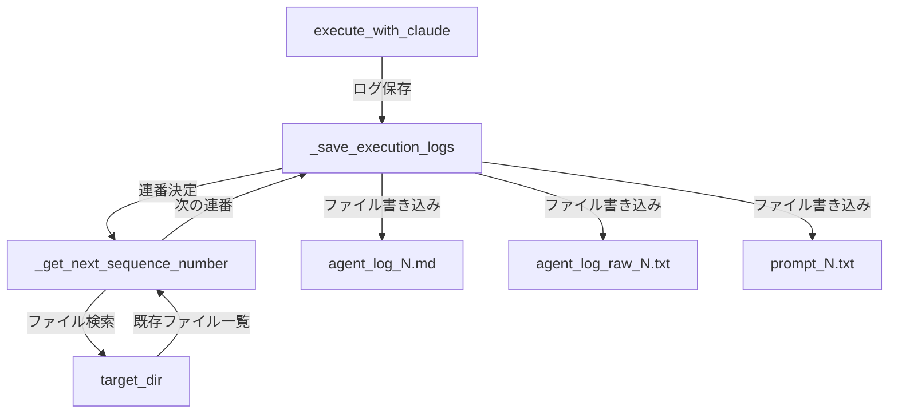

# 詳細設計書: リトライ時のログファイル連番管理

**Issue番号**: #317
**作成日**: 2025-10-10
**対象システム**: AI Workflow Orchestrator
**実装対象**: BasePhase クラス

---

## 1. アーキテクチャ設計

### 1.1 システム全体図

```
BasePhase クラス
├── execute_with_claude()
│   └── _save_execution_logs()  ← 🔧 連番ロジックを追加
│       ├── _get_next_sequence_number()  ← 🆕 新規メソッド
│       └── ログファイル保存（連番付き）
│
└── _format_agent_log()
    └── （変更なし）
```

### 1.2 コンポーネント間の関係



### 1.3 データフロー

```
1. execute_with_claude() 実行
   ↓
2. Claude Agent SDK でタスク実行
   ↓
3. _save_execution_logs() 呼び出し
   ↓
4. _get_next_sequence_number() で連番決定
   ├─ 対象ディレクトリ内の agent_log_*.md を検索
   ├─ 正規表現で連番を抽出
   ├─ 最大値を取得
   └─ 最大値 + 1 を返す（存在しない場合は1）
   ↓
5. 連番付きファイル名でログ保存
   ├─ agent_log_{N}.md
   ├─ agent_log_raw_{N}.txt
   └─ prompt_{N}.txt
```

---

## 2. 実装戦略判断

### 実装戦略: EXTEND

**判断根拠**:
1. **既存ファイルへの修正が必要**: `base_phase.py` の `_save_execution_logs()` メソッドを修正する必要がある
2. **新規メソッドの追加**: 連番決定用の `_get_next_sequence_number()` メソッドを追加する
3. **既存機能との統合**: 既存のログ保存機能を拡張する形で実装し、他の機能への影響を最小限に抑える
4. **後方互換性の維持**: 既存のログファイル（連番なし）が存在する環境でも正常に動作する必要がある

この要件は既存のログ保存機能を**拡張**するものであり、完全な新規作成ではないため、**EXTEND**戦略が最適です。

---

## 3. テスト戦略判断

### テスト戦略: UNIT_INTEGRATION

**判断根拠**:
1. **Unitテストが必須**:
   - `_get_next_sequence_number()` メソッドの単体動作確認が必要
   - 連番決定ロジックの境界値テストが必要（既存ファイルなし、欠番あり、大量ファイルなど）
   - 正規表現パターンマッチングの正確性確認が必要

2. **Integrationテストも必要**:
   - `execute_with_claude()` → `_save_execution_logs()` → `_get_next_sequence_number()` の一連の流れを確認
   - 実際のディレクトリ構造でのファイル生成を確認
   - リトライシナリオでの連番インクリメント動作を確認

3. **BDDは不要**:
   - ユーザーストーリーよりも技術的な動作確認が主目的
   - エンドツーエンドのシナリオテストは既存のe2eテストでカバー可能

したがって、**UNIT_INTEGRATION**戦略を採用します。

---

## 4. テストコード戦略判断

### テストコード戦略: EXTEND_TEST

**判断根拠**:
1. **既存テストファイルが存在**: `tests/unit/phases/test_base_phase.py` が既に存在し、BasePhaseクラスのテストを実施している
2. **既存テストとの関連性が高い**: 今回追加する機能は `_save_execution_logs()` の拡張であり、既存の `test_execute_with_claude()` テストと密接に関連
3. **テストの一貫性**: 同じクラスの機能は同じテストファイルにまとめる方が保守性が高い
4. **統合テストは新規作成**: 既存のintegrationテストには該当するファイルがないため、新規作成が必要

**テストファイル構成**:
- **既存拡張**: `tests/unit/phases/test_base_phase.py` にテストケース追加
- **新規作成**: `tests/integration/test_log_file_sequencing.py` を作成（Integration テスト用）

したがって、**EXTEND_TEST**戦略を採用します（ただし、Integrationテストは新規作成）。

---

## 5. 影響範囲分析

### 5.1 既存コードへの影響

| コンポーネント | 影響度 | 詳細 |
|--------------|--------|------|
| `BasePhase._save_execution_logs()` | **高** | ログファイル名に連番を付与するロジックを追加 |
| `BasePhase.execute_with_claude()` | **低** | メソッドシグネチャは変更なし、内部でログ保存時に連番が自動付与 |
| 派生Phaseクラス | **なし** | BasePhaseの変更のみで自動的に恩恵を受ける |
| 既存ログファイル | **なし** | 既存のログファイル（連番なし）は残り続け、新規実行分から連番が付与される |

### 5.2 依存関係の変更

**追加される依存関係**: なし（標準ライブラリのみ使用）

**変更される依存関係**: なし

### 5.3 マイグレーション要否

**マイグレーション不要**:
- 既存のログファイル（連番なし）はそのまま保持
- 新規実行分から連番付きファイル名で保存開始
- 後方互換性を完全に維持

---

## 6. 変更・追加ファイルリスト

### 6.1 修正が必要な既存ファイル

```
scripts/ai-workflow/phases/base_phase.py
```

### 6.2 新規作成ファイル

```
scripts/ai-workflow/tests/integration/test_log_file_sequencing.py
```

### 6.3 削除が必要なファイル

なし

---

## 7. 詳細設計

### 7.1 新規メソッド設計

#### 7.1.1 `_get_next_sequence_number()` メソッド

```python
def _get_next_sequence_number(self, target_dir: Path) -> int:
    """
    対象ディレクトリ内の既存ログファイルから次の連番を取得

    Args:
        target_dir: ログファイルを検索するディレクトリ

    Returns:
        int: 次の連番（1始まり）

    Notes:
        - agent_log_*.md パターンのファイルを検索
        - 正規表現で連番を抽出し、最大値を取得
        - 最大値 + 1 を返す（ファイルが存在しない場合は1）
    """
    import re

    # agent_log_*.md パターンのファイルを検索
    log_files = list(target_dir.glob('agent_log_*.md'))

    if not log_files:
        return 1

    # 連番を抽出
    sequence_numbers = []
    pattern = re.compile(r'agent_log_(\d+)\.md$')

    for log_file in log_files:
        match = pattern.search(log_file.name)
        if match:
            sequence_numbers.append(int(match.group(1)))

    if not sequence_numbers:
        return 1

    # 最大値 + 1 を返す
    return max(sequence_numbers) + 1
```

### 7.2 修正メソッド設計

#### 7.2.1 `_save_execution_logs()` メソッドの修正

**修正前のファイル名**:
```python
prompt_file = target_dir / 'prompt.txt'
agent_log_file = target_dir / 'agent_log.md'
raw_log_file = target_dir / 'agent_log_raw.txt'
```

**修正後のファイル名**:
```python
# 連番を取得
sequence_number = self._get_next_sequence_number(target_dir)

# 連番付きファイル名
prompt_file = target_dir / f'prompt_{sequence_number}.txt'
agent_log_file = target_dir / f'agent_log_{sequence_number}.md'
raw_log_file = target_dir / f'agent_log_raw_{sequence_number}.txt'
```

**完全な修正後のコード**:
```python
def _save_execution_logs(
    self,
    prompt: str,
    messages: List[str],
    log_prefix: str = ''
):
    """
    プロンプトとエージェントログを保存（連番付き）

    Args:
        prompt: 実行したプロンプト
        messages: エージェントからのレスポンスメッセージ
        log_prefix: ログファイル名のプレフィックス（'execute' or 'review' or 'revise'）
    """
    # log_prefixに応じてディレクトリを選択
    if log_prefix == 'execute':
        target_dir = self.execute_dir
    elif log_prefix == 'review':
        target_dir = self.review_dir
    elif log_prefix == 'revise':
        target_dir = self.revise_dir
    else:
        # デフォルトはフェーズディレクトリ
        target_dir = self.phase_dir

    # 連番を取得
    sequence_number = self._get_next_sequence_number(target_dir)

    # プロンプトを保存（連番付き）
    prompt_file = target_dir / f'prompt_{sequence_number}.txt'
    prompt_file.write_text(prompt, encoding='utf-8')
    print(f"[INFO] プロンプトを保存: {prompt_file}")

    # エージェントログをマークダウン形式で整形（連番付き）
    formatted_log = self._format_agent_log(messages)
    agent_log_file = target_dir / f'agent_log_{sequence_number}.md'
    agent_log_file.write_text(formatted_log, encoding='utf-8')
    print(f"[INFO] エージェントログを保存: {agent_log_file}")

    # 生ログも保存（デバッグ用、連番付き）
    raw_log_file = target_dir / f'agent_log_raw_{sequence_number}.txt'
    raw_log = '\n\n'.join(messages)
    raw_log_file.write_text(raw_log, encoding='utf-8')
    print(f"[INFO] 生ログを保存: {raw_log_file}")
```

### 7.3 データ構造設計

#### 7.3.1 ディレクトリ構造（修正後）

```
.ai-workflow/issue-XXX/
├── 01_requirements/
│   ├── execute/
│   │   ├── agent_log_1.md
│   │   ├── agent_log_raw_1.txt
│   │   ├── prompt_1.txt
│   │   ├── agent_log_2.md      # リトライ1回目
│   │   ├── agent_log_raw_2.txt
│   │   └── prompt_2.txt
│   ├── review/
│   │   ├── agent_log_1.md
│   │   ├── agent_log_raw_1.txt
│   │   └── prompt_1.txt
│   ├── revise/
│   │   ├── agent_log_1.md
│   │   ├── agent_log_raw_1.txt
│   │   └── prompt_1.txt
│   └── output/
│       └── requirements.md    # 上書きでOK
│
├── 02_design/
│   ├── execute/
│   │   ├── agent_log_1.md
│   │   └── ...
│   └── output/
│       └── design.md          # 上書きでOK
│
└── ...
```

### 7.4 インターフェース設計

#### 7.4.1 公開メソッドのインターフェース

**変更なし**: `execute_with_claude()` メソッドのシグネチャは変更しない

```python
def execute_with_claude(
    self,
    prompt: str,
    system_prompt: Optional[str] = None,
    max_turns: int = 50,
    verbose: bool = True,
    save_logs: bool = True,
    log_prefix: str = ''
) -> List[str]:
    """
    Claude Agent SDKでタスクを実行

    Args:
        prompt: タスクプロンプト
        system_prompt: システムプロンプト（省略可）
        max_turns: 最大ターン数
        verbose: 詳細ログ出力（リアルタイムメッセージ表示、デフォルト: True）
        save_logs: プロンプトとエージェントログを保存するか（デフォルト: True）
        log_prefix: ログファイル名のプレフィックス（例: 'review', 'execute'）

    Returns:
        List[str]: レスポンスメッセージのリスト
    """
```

#### 7.4.2 内部メソッドのインターフェース

**新規追加**:
```python
def _get_next_sequence_number(self, target_dir: Path) -> int:
    """
    対象ディレクトリ内の既存ログファイルから次の連番を取得

    Args:
        target_dir: ログファイルを検索するディレクトリ

    Returns:
        int: 次の連番（1始まり）
    """
```

**修正**:
```python
def _save_execution_logs(
    self,
    prompt: str,
    messages: List[str],
    log_prefix: str = ''
):
    """
    プロンプトとエージェントログを保存（連番付き）

    Args:
        prompt: 実行したプロンプト
        messages: エージェントからのレスポンスメッセージ
        log_prefix: ログファイル名のプレフィックス（'execute' or 'review' or 'revise'）

    Notes:
        - 連番は _get_next_sequence_number() で自動決定
        - ファイル名: agent_log_{N}.md, agent_log_raw_{N}.txt, prompt_{N}.txt
    """
```

---

## 8. セキュリティ考慮事項

### 8.1 認証・認可

**影響なし**: ログファイルの保存先は既存と同じため、アクセス制御に変更なし

### 8.2 データ保護

| 項目 | 考慮事項 | 対策 |
|------|---------|------|
| ファイル名の一意性 | 同一連番の重複防止 | `_get_next_sequence_number()` で最大値+1を保証 |
| ファイル上書き防止 | 既存ファイルの保護 | 連番により常に新規ファイル名で保存 |
| パーミッション | ファイルアクセス権限 | Python の `Path.write_text()` はデフォルトパーミッション（0o644）を使用 |

### 8.3 セキュリティリスクと対策

| リスク | 影響 | 対策 |
|--------|------|------|
| ディスク容量枯渇 | ログファイルの蓄積によるディスク枯渇 | 運用でログローテーション・クリーンアップを実施（本機能のスコープ外） |
| 正規表現DoS | 大量のファイル名マッチング | `glob()` による事前絞り込みで対象ファイルを制限 |

---

## 9. 非機能要件への対応

### 9.1 パフォーマンス

| 要件 | 目標 | 実装方針 |
|------|------|---------|
| 連番決定処理 | 100ms以内 | `glob()` + 正規表現マッチング（O(n)、nはファイル数）で十分高速 |
| ファイル検出処理 | 1000ファイルで1秒以内 | Pythonの`glob()`は高速。1000ファイル程度では問題なし |
| 既存処理への影響 | オーバーヘッド5%以内 | ファイル検索と連番決定のみ追加。I/O処理がボトルネックのため影響軽微 |

**パフォーマンステスト項目**:
- 1000ファイル存在時の連番決定時間計測
- リトライ10回時の全体実行時間計測

### 9.2 スケーラビリティ

| シナリオ | 対応 |
|---------|------|
| 大量リトライ（100回以上） | 連番は整数型（Pythonは任意精度）のため問題なし |
| 大量ファイル（10000+） | `glob()`のパフォーマンス低下の可能性あり。運用でログクリーンアップ推奨 |

### 9.3 保守性

| 項目 | 対応 |
|------|------|
| コードの可読性 | `_get_next_sequence_number()` を独立メソッドとして実装 |
| テスタビリティ | 単体テストが容易な設計（モックなしでテスト可能） |
| 拡張性 | 他のログファイル種別への適用が容易（パターンを変更するだけ） |
| ドキュメント | Docstringによる詳細な説明 |

---

## 10. 実装の順序

以下の順序で実装を進めることを推奨します：

### フェーズ1: 基本機能実装（優先度: 高）
1. `_get_next_sequence_number()` メソッドの実装
2. `_save_execution_logs()` メソッドの修正
3. 単体テストの実装（既存テストファイルに追加）

### フェーズ2: テスト実装（優先度: 高）
4. Unitテストケースの追加
   - 既存ファイルなしの場合（連番=1）
   - 既存ファイルありの場合（最大値+1）
   - 欠番がある場合（最大値+1）
   - 正規表現マッチング境界値テスト
5. Integrationテストの実装（新規ファイル作成）
   - execute → review → revise のリトライシナリオ
   - 実ディレクトリでのファイル生成確認

### フェーズ3: 動作確認（優先度: 中）
6. 手動テスト
   - 実際のワークフローでリトライ実行
   - ログファイルの連番確認
7. パフォーマンステスト
   - 1000ファイル存在時の動作確認

### フェーズ4: ドキュメント更新（優先度: 低）
8. コードコメントの追加
9. 必要に応じて運用ドキュメントの更新

---

## 11. テスト設計概要

### 11.1 Unitテストケース

| テストケース | 検証内容 | 期待結果 |
|------------|---------|---------|
| `test_get_next_sequence_number_no_files` | ファイルが存在しない場合 | 連番=1を返す |
| `test_get_next_sequence_number_with_files` | 既存ファイルが存在する場合 | 最大値+1を返す |
| `test_get_next_sequence_number_with_gaps` | 欠番がある場合（1, 3, 5） | 最大値+1（=6）を返す |
| `test_get_next_sequence_number_large_numbers` | 大きな連番（999） | 1000を返す |
| `test_save_execution_logs_with_sequence` | ログ保存時の連番付与 | `agent_log_1.md`等が作成される |
| `test_save_execution_logs_retry` | リトライ時の連番インクリメント | 2回目は `agent_log_2.md` |

### 11.2 Integrationテストケース

| テストケース | 検証内容 | 期待結果 |
|------------|---------|---------|
| `test_log_sequencing_execute_review_revise` | execute → review → revise の連番管理 | 各ディレクトリで独立した連番 |
| `test_log_sequencing_retry_scenario` | リトライシナリオ全体 | reviseディレクトリで連番インクリメント |
| `test_log_sequencing_multiple_phases` | 複数フェーズでの動作 | フェーズごとに独立した連番管理 |

---

## 12. 品質ゲート確認

- [x] **実装戦略の判断根拠が明記されている**: EXTEND戦略を選択し、4つの具体的理由を記載
- [x] **テスト戦略の判断根拠が明記されている**: UNIT_INTEGRATION戦略を選択し、3つの理由を記載
- [x] **テストコード戦略の判断根拠が明記されている**: EXTEND_TEST戦略を選択し、4つの理由を記載
- [x] **既存コードへの影響範囲が分析されている**: 影響範囲分析セクションで詳細に記載
- [x] **変更が必要なファイルがリストアップされている**: 修正1件、新規1件を明記
- [x] **設計が実装可能である**: 具体的なコード例とメソッド設計を記載

---

## 13. 備考

### 13.1 今後の拡張候補

1. **ログクリーンアップ機能**
   - 古いログファイルを自動削除するメソッド追加
   - 保存期間・最大ファイル数の設定

2. **ログビューア機能**
   - 連番付きログファイルを時系列で表示するツール
   - Markdown形式のログを整形表示

3. **統計情報の追加**
   - 各フェーズのリトライ回数集計
   - 平均実行時間の算出

### 13.2 既知の制限事項

1. **連番のリセット機能なし**
   - 連番を1に戻す機能は含まれない
   - 手動でファイル削除が必要

2. **ログローテーション機能なし**
   - 古いログの自動削除・アーカイブ機能は含まれない
   - 運用で対応が必要

3. **並行実行の考慮なし**
   - 同一ディレクトリへの並行書き込み時の連番重複は考慮していない
   - 通常のワークフロー（順次実行）では問題なし

---

**レビュー準備完了**: この設計書はクリティカルシンキングレビューの準備ができています。
