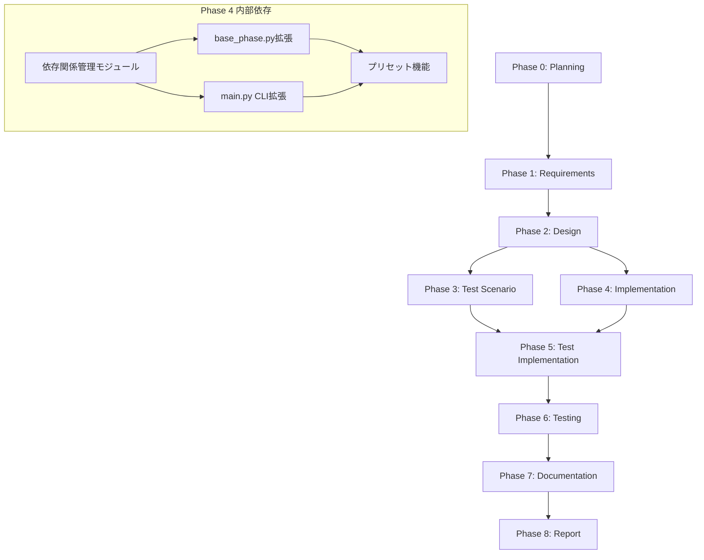

# プロジェクト計画書: Issue #319

## 📋 Issue情報

- **Issue番号**: #319
- **タイトル**: [FEATURE] AIワークフロー: フェーズ依存関係の柔軟化と選択的実行機能
- **URL**: https://github.com/tielec/infrastructure-as-code/issues/319

## 1. Issue分析

### 複雑度: 中程度

**判定根拠**:
- 複数ファイルの変更が必要（main.py, base_phase.py, 新規モジュール追加）
- 既存のワークフローエンジンの拡張（依存関係管理の追加）
- 新機能追加（プリセット機能、依存関係チェック）
- アーキテクチャの根本的な変更ではなく、既存機能の拡張

### 見積もり工数: 10~14時間

**内訳**:
- Phase 1（要件定義）: 1時間
- Phase 2（設計）: 2時間
- Phase 3（テストシナリオ）: 1.5時間
- Phase 4（実装）: 4~6時間
- Phase 5（テスト実装）: 1.5時間
- Phase 6（テスト）: 0.5時間
- Phase 7（ドキュメント）: 1時間
- Phase 8（レポート）: 0.5時間

### リスク評価: 中

**リスク要因**:
1. **既存ワークフローへの影響**: 依存関係チェックを追加することで、既存の全フェーズ実行フローが影響を受ける可能性
2. **後方互換性**: 既存の実行モードをデフォルトとして維持する必要がある
3. **エラーハンドリング**: 依存フェーズ未完了時のエラーメッセージの明確化が必要
4. **外部ドキュメント指定**: ファイルパスのバリデーションとセキュリティ考慮が必要

## 2. 実装戦略判断

### 実装戦略: **EXTEND**

**判断根拠**:
- 既存のワークフローエンジン（main.py, base_phase.py）の拡張が中心
- 新規クラス・モジュールは最小限（依存関係管理モジュール1つのみ）
- 既存の`execute()`コマンドにオプションを追加する形で実装
- 既存のフェーズ実行ロジックは維持し、依存関係チェック機能を追加

**具体的なアプローチ**:
1. 依存関係定義を定数として追加（`PHASE_DEPENDENCIES`）
2. `base_phase.py`に依存関係チェック機能を追加
3. `main.py`のCLIオプションを拡張（`--skip-dependency-check`等）
4. プリセット機能を追加（`--preset`オプション）

### テスト戦略: **UNIT_INTEGRATION**

**判断根拠**:
- **ユニットテスト**: 依存関係チェック関数、プリセット定義の検証
- **インテグレーションテスト**: 既存のワークフローとの統合、エンドツーエンドのフェーズ実行

**テスト対象**:
1. **ユニットテスト**:
   - `validate_phase_dependencies()` 関数の動作確認
   - プリセット定義の正当性検証
   - エラーメッセージの内容確認

2. **インテグレーションテスト**:
   - 依存関係チェックが有効な場合のフェーズ実行
   - `--skip-dependency-check`フラグの動作確認
   - `--preset`オプションの動作確認
   - 既存の全フェーズ実行モード（`--phase all`）との互換性

### テストコード戦略: **BOTH_TEST**

**判断根拠**:
- **既存テストの拡張**: 既存のインテグレーションテスト（`test_workflow_init.py`, `test_phase_separation.py`）に依存関係チェックのテストケースを追加
- **新規テストの作成**: 依存関係管理機能専用のユニットテスト（`test_phase_dependencies.py`）を新規作成

**具体的なアプローチ**:
1. **既存テスト拡張**: `tests/integration/test_phase_separation.py` に依存関係違反時のテストケースを追加
2. **新規テスト作成**: `tests/unit/test_phase_dependencies.py` を作成し、依存関係チェック機能の単体テストを実装

## 3. 影響範囲分析

### 既存コードへの影響

| ファイル | 変更内容 | 影響度 |
|---------|---------|-------|
| `scripts/ai-workflow/main.py` | CLIオプション追加（`--skip-dependency-check`, `--preset`等） | 中 |
| `scripts/ai-workflow/phases/base_phase.py` | 依存関係チェック機能追加 | 中 |
| `scripts/ai-workflow/core/metadata_manager.py` | 依存関係情報の取得メソッド追加 | 低 |
| `scripts/ai-workflow/README.md` | 使用方法のドキュメント更新 | 低 |

### 新規ファイル

| ファイル | 目的 |
|---------|------|
| `scripts/ai-workflow/core/phase_dependencies.py` | フェーズ依存関係の定義と検証機能 |
| `scripts/ai-workflow/tests/unit/test_phase_dependencies.py` | 依存関係機能のユニットテスト |

### 依存関係の変更

- **新規依存の追加**: なし（標準ライブラリのみ使用）
- **既存依存の変更**: なし

### マイグレーション要否

- **メタデータスキーマ変更**: なし（既存のmetadata.jsonスキーマは変更なし）
- **設定ファイル変更**: なし
- **データベーススキーマ変更**: 該当なし

## 4. タスク分割

### Phase 1: 要件定義 (見積もり: 1h)

1. **ユースケースの整理** (0.5h)
   - 要件定義のみ実行
   - 実装のみ実行
   - テストのみ実行
   - 部分フェーズ実行

2. **受け入れ基準の明確化** (0.5h)
   - 依存関係チェックの動作仕様
   - エラーメッセージの内容
   - プリセット機能の仕様

### Phase 2: 設計 (見積もり: 2h)

1. **依存関係データ構造の設計** (0.5h)
   - `PHASE_DEPENDENCIES` 辞書の定義
   - フェーズ名とその依存フェーズのマッピング

2. **依存関係チェック機能の設計** (0.5h)
   - `validate_phase_dependencies()` 関数の仕様
   - エラーハンドリングの方針

3. **CLIオプションの設計** (0.5h)
   - `--skip-dependency-check` フラグ
   - `--ignore-dependencies` フラグ
   - `--{phase}-doc` オプション

4. **プリセット機能の設計** (0.5h)
   - プリセット定義（requirements-only, design-phase等）
   - プリセットとフェーズリストのマッピング

### Phase 3: テストシナリオ (見積もり: 1.5h)

1. **ユニットテストシナリオ** (0.5h)
   - 依存関係チェック関数の正常系・異常系
   - プリセット定義の検証

2. **インテグレーションテストシナリオ** (1h)
   - 依存関係違反時のエラー処理
   - `--skip-dependency-check` フラグの動作
   - `--preset` オプションの動作
   - 既存ワークフローとの互換性

### Phase 4: 実装 (見積もり: 4~6h)

1. **依存関係管理モジュールの実装** (1.5h)
   - `phase_dependencies.py` の作成
   - `PHASE_DEPENDENCIES` 定義
   - `validate_phase_dependencies()` 関数実装

2. **base_phase.pyの拡張** (1h)
   - 依存関係チェック機能の統合
   - エラーハンドリングの追加

3. **main.pyのCLI拡張** (1.5~2h)
   - `--skip-dependency-check` フラグの追加
   - `--ignore-dependencies` フラグの追加
   - `--{phase}-doc` オプションの追加

4. **プリセット機能の実装** (1~1.5h)
   - `--preset` オプションの追加
   - プリセット定義の実装
   - プリセットに応じたフェーズ選択ロジック

### Phase 5: テスト実装 (見積もり: 1.5h)

1. **ユニットテストの実装** (0.5h)
   - `test_phase_dependencies.py` の作成
   - 依存関係チェック機能のテストケース

2. **インテグレーションテストの拡張** (1h)
   - 既存テストに依存関係チェックのケース追加
   - プリセット機能のテストケース追加

### Phase 6: テスト (見積もり: 0.5h)

1. **ユニットテストの実行** (0.2h)
   - 依存関係チェック機能の動作確認

2. **インテグレーションテストの実行** (0.3h)
   - 既存ワークフローとの統合確認
   - エンドツーエンドのフェーズ実行確認

### Phase 7: ドキュメント (見積もり: 1h)

1. **README.mdの更新** (0.5h)
   - 使用例の追加
   - プリセット一覧の追加

2. **依存関係図の追加** (0.3h)
   - Mermaid形式でフェーズ依存関係を図示

3. **API仕様の追加** (0.2h)
   - 依存関係チェック関数の仕様書

### Phase 8: レポート (見積もり: 0.5h)

1. **実装サマリーの作成** (0.3h)
   - 追加機能の一覧
   - 変更ファイルの一覧

2. **既知の制限事項の記載** (0.2h)
   - 外部ドキュメント指定時の制約
   - プリセット機能の拡張方針

## 5. 依存関係

**タスク間の依存関係詳細**:

1. **Phase 1 → Phase 2**: 要件定義が完了してから設計を開始
2. **Phase 2 → Phase 3**: 設計が完了してからテストシナリオを作成
3. **Phase 2 → Phase 4**: 設計が完了してから実装を開始
4. **Phase 3 & Phase 4 → Phase 5**: 実装とテストシナリオが完了してからテスト実装を開始
5. **Phase 4内の依存**:
   - 依存関係管理モジュール → base_phase.py拡張
   - 依存関係管理モジュール → main.py CLI拡張
   - base_phase.py拡張 & main.py CLI拡張 → プリセット機能

## 6. リスクと軽減策

### リスク1: 既存ワークフローへの影響

- **影響度**: 中
- **確率**: 中
- **軽減策**:
  1. 依存関係チェックをオプトイン形式にする（デフォルトではチェックしない）
  2. 既存の全フェーズ実行モード（`--phase all`）はデフォルト動作を維持
  3. 既存のインテグレーションテストを実行し、互換性を確認
  4. 段階的なリリース（まずは`--experimental`フラグで提供）

### リスク2: 依存関係の循環参照

- **影響度**: 低
- **確率**: 低
- **軽減策**:
  1. `PHASE_DEPENDENCIES` 定義時に循環参照をチェックする関数を実装
  2. ユニットテストで循環参照の検出を確認
  3. 依存関係は常に前方依存（Phase N → Phase N-1）のみとする設計原則を確立

### リスク3: 外部ドキュメント指定時のセキュリティ

- **影響度**: 中
- **確率**: 中
- **軽減策**:
  1. ファイルパスのバリデーション（相対パス、絶対パスの制限）
  2. 読み込み可能なファイル形式の制限（Markdown, テキストのみ）
  3. ファイルサイズの上限設定（10MB）
  4. ファイル読み込み時のエラーハンドリング

### リスク4: プリセット機能の拡張性

- **影響度**: 低
- **確率**: 中
- **軽減策**:
  1. プリセット定義を辞書形式で管理し、追加が容易な設計にする
  2. カスタムプリセットの定義方法をドキュメント化
  3. プリセット定義のバリデーション機能を実装

### リスク5: テストカバレッジの不足

- **影響度**: 中
- **確率**: 中
- **軽減策**:
  1. ユニットテストで依存関係チェック機能を網羅的にテスト
  2. インテグレーションテストで既存ワークフローとの互換性を確認
  3. テストカバレッジを測定し、80%以上を目標とする
  4. 手動テストでエッジケースを確認

## 7. 品質ゲート

### Phase 0: Planning

- [x] **実装戦略が明確に決定されている**（EXTEND）
- [x] **テスト戦略が明確に決定されている**（UNIT_INTEGRATION）
- [x] **テストコード戦略が明確に決定されている**（BOTH_TEST）
- [x] **影響範囲が分析されている**
- [x] **タスク分割が適切な粒度である**（1タスク = 1~4時間）
- [x] **リスクが洗い出されている**

### Phase 1: Requirements

- [ ] 機能要件が明確に記載されている
- [ ] 受け入れ基準が定義されている
- [ ] ユースケースが網羅的に列挙されている
- [ ] 非機能要件（パフォーマンス、セキュリティ）が明確化されている

### Phase 2: Design

- [ ] 実装戦略の判断根拠が明記されている
- [ ] テスト戦略の判断根拠が明記されている
- [ ] クラス図・シーケンス図が作成されている
- [ ] API仕様が明確に定義されている
- [ ] エラーハンドリング方針が明確化されている

### Phase 3: Test Scenario

- [ ] ユニットテストシナリオが網羅的に定義されている
- [ ] インテグレーションテストシナリオが定義されている
- [ ] エッジケースが洗い出されている
- [ ] テストデータが準備されている

### Phase 4: Implementation

- [ ] 依存関係管理モジュールが実装されている
- [ ] base_phase.pyに依存関係チェックが統合されている
- [ ] main.pyにCLIオプションが追加されている
- [ ] プリセット機能が実装されている
- [ ] コードレビューが完了している
- [ ] コーディング規約に準拠している

### Phase 5: Test Implementation

- [ ] ユニットテストが実装されている
- [ ] インテグレーションテストが実装されている
- [ ] テストカバレッジが80%以上である
- [ ] 既存テストとの互換性が確認されている

### Phase 6: Testing

- [ ] 全ユニットテストがパスしている
- [ ] 全インテグレーションテストがパスしている
- [ ] 既存ワークフローとの互換性が確認されている
- [ ] パフォーマンスが劣化していない

### Phase 7: Documentation

- [ ] README.mdが更新されている
- [ ] 使用例が追加されている
- [ ] プリセット一覧が記載されている
- [ ] 依存関係図が追加されている
- [ ] API仕様が記載されている

### Phase 8: Report

- [ ] 実装サマリーが作成されている
- [ ] 変更ファイル一覧が記載されている
- [ ] 既知の制限事項が記載されている
- [ ] 今後の拡張方針が明記されている

## 8. 成功基準

本プロジェクトの成功基準は以下の通りです：

1. **機能要件**:
   - [ ] 依存関係チェック機能が正常に動作する
   - [ ] `--skip-dependency-check` フラグが機能する
   - [ ] プリセット機能（requirements-only, design-phase等）が機能する
   - [ ] 既存の全フェーズ実行モードが正常に動作する（後方互換性）

2. **品質要件**:
   - [ ] ユニットテストカバレッジが80%以上
   - [ ] 全インテグレーションテストがパス
   - [ ] 既存ワークフローとの互換性が確認されている

3. **ドキュメント要件**:
   - [ ] README.mdが更新されている
   - [ ] 使用例が追加されている
   - [ ] 依存関係図が追加されている

4. **パフォーマンス要件**:
   - [ ] 依存関係チェックのオーバーヘッドが0.1秒以下
   - [ ] 既存ワークフローのパフォーマンスが劣化していない

## 9. 次のステップ

1. **Phase 1: Requirements** を開始
2. 要件定義書を作成し、レビューを実施
3. レビュー合格後、Phase 2: Design へ進む

---

**作成日**: 2025-10-12
**作成者**: AI Workflow Orchestrator (Claude Agent SDK)
**バージョン**: 1.0
