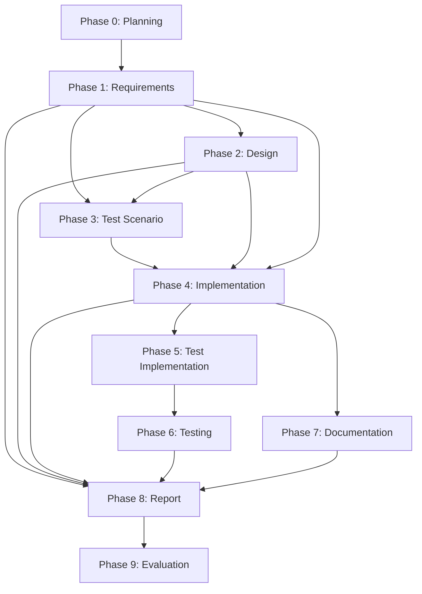

# 要件定義書: Issue #319

## 📋 プロジェクト情報

- **Issue番号**: #319
- **タイトル**: [FEATURE] AIワークフロー: フェーズ依存関係の柔軟化と選択的実行機能
- **URL**: https://github.com/tielec/infrastructure-as-code/issues/319
- **作成日**: 2025-10-12

---

## 0. Planning Documentの確認

Planning Phase (Phase 0) において、以下の開発計画が策定されています：

### 実装戦略
**EXTEND** - 既存ワークフローエンジンの拡張

- 既存の`main.py`、`base_phase.py`を拡張
- 新規クラス・モジュールは最小限（依存関係管理モジュール1つのみ）
- 既存のフェーズ実行ロジックは維持し、依存関係チェック機能を追加

### テスト戦略
**UNIT_INTEGRATION**

- ユニットテスト: 依存関係チェック関数、プリセット定義の検証
- インテグレーションテスト: 既存のワークフローとの統合、エンドツーエンドのフェーズ実行

### リスク評価
**中** - 既存ワークフローへの影響、後方互換性の維持が主要なリスク

### 見積もり工数
10~14時間（Phase 1-8の合計）

---

## 1. 概要

### 1.1 背景

現在のAIワークフローシステムは、全フェーズ（Planning → Requirements → Design → Test Scenario → Implementation → Test Implementation → Testing → Documentation → Report → Evaluation）が順次実行される前提で設計されており、各フェーズは前フェーズの成果物に依存しています。

この設計により、以下の問題が発生しています：

1. **小規模タスクでのオーバーヘッド**: 簡単な不具合修正でも全フェーズ実行が必要
2. **柔軟性の欠如**: 要件定義だけレビューしたい、実装だけ実行したいなどの要望に対応できない
3. **部分実行の不可能性**: 設計レビューで止めて検討したいケースに対応できない

### 1.2 目的

フェーズ間の依存関係を明示化し、必要なフェーズだけを選択的に実行できる機能を追加することで、タスクの規模や種類に応じた柔軟なワークフロー実行を可能にします。

### 1.3 ビジネス価値・技術的価値

**ビジネス価値**:
- 開発効率の向上: 不要なフェーズをスキップして時間短縮
- コスト削減: Claude API呼び出し回数の削減
- 柔軟なレビュープロセス: 段階的なレビューによる品質向上

**技術的価値**:
- 保守性の向上: 依存関係の明示化による可読性向上
- 拡張性の確保: 新規フェーズ追加時の依存関係管理が容易
- 既存資産の活用: 既存ドキュメントを指定して部分実行が可能

---

## 2. 機能要件

### FR-001: フェーズ依存関係の定義 【優先度: 高】

#### 説明
各フェーズの依存関係を定数として定義し、フェーズ実行前に依存関係を検証する機能

#### 詳細
- `PHASE_DEPENDENCIES` 辞書を新規モジュール `phase_dependencies.py` に定義
- 各フェーズがどのフェーズに依存するかを明示的に記述
- 依存関係は前方依存（Phase N → Phase N-1以前）のみとする

#### 受け入れ基準
- Given: `PHASE_DEPENDENCIES` が定義されている
- When: 各フェーズ名をキーに依存フェーズリストを取得
- Then: 依存フェーズのリストが正しく返される

**依存関係定義例**:
```python
PHASE_DEPENDENCIES = {
    'planning': [],
    'requirements': ['planning'],
    'design': ['requirements'],
    'test_scenario': ['requirements', 'design'],
    'implementation': ['requirements', 'design', 'test_scenario'],
    'test_implementation': ['implementation'],
    'testing': ['test_implementation'],
    'documentation': ['implementation'],
    'report': ['requirements', 'design', 'implementation', 'testing', 'documentation'],
    'evaluation': ['report']
}
```

---

### FR-002: 依存関係チェック機能 【優先度: 高】

#### 説明
フェーズ実行前に依存フェーズが完了しているか検証する機能

#### 詳細
- `validate_phase_dependencies(phase_name: str, metadata: MetadataManager) -> bool` 関数を実装
- 依存フェーズのステータスが `completed` であることを確認
- 未完了の依存フェーズがある場合は `DependencyError` を送出
- エラーメッセージには具体的な未完了フェーズ名を含める

#### 受け入れ基準
- Given: Phase X を実行しようとする
- When: 依存フェーズ Y が未完了である
- Then: `DependencyError` が送出され、エラーメッセージに「Phase 'Y' must be completed before 'X'」が含まれる

---

### FR-003: 依存関係チェックのスキップ機能 【優先度: 中】

#### 説明
`--skip-dependency-check` フラグにより依存関係チェックを無効化する機能

#### 詳細
- `main.py` の `execute` コマンドに `--skip-dependency-check` フラグを追加
- フラグ指定時は依存関係チェックをスキップしてフェーズを強制実行
- 警告メッセージを標準出力に表示

#### 受け入れ基準
- Given: `--skip-dependency-check` フラグが指定されている
- When: 依存フェーズが未完了の状態でフェーズを実行
- Then: 警告メッセージが表示され、フェーズが実行される

---

### FR-004: 依存関係違反の警告表示 【優先度: 中】

#### 説明
`--ignore-dependencies` フラグにより依存関係チェックを警告のみに変更する機能

#### 詳細
- `main.py` の `execute` コマンドに `--ignore-dependencies` フラグを追加
- フラグ指定時は依存関係違反を検出しても警告のみ表示して実行継続
- 警告メッセージには未完了の依存フェーズ名を明示

#### 受け入れ基準
- Given: `--ignore-dependencies` フラグが指定されている
- When: 依存フェーズが未完了の状態でフェーズを実行
- Then: 警告メッセージが表示され、フェーズが実行される（エラーにはならない）

---

### FR-005: 外部ドキュメント指定機能 【優先度: 低】

#### 説明
`--{phase}-doc` オプションにより外部ドキュメントを指定してフェーズをスキップする機能

#### 詳細
- 各フェーズに対応する `--requirements-doc`、`--design-doc`、`--test-scenario-doc` オプションを追加
- 指定されたファイルパスの成果物を使用して、対応するフェーズの実行をスキップ
- ファイルパスのバリデーション（存在確認、読み込み可能形式のチェック）
- メタデータに外部ドキュメントのパスを記録

#### 受け入れ基準
- Given: `--requirements-doc /path/to/requirements.md` が指定されている
- When: implementation フェーズを実行
- Then: requirements フェーズはスキップされ、指定されたファイルが成果物として使用される

---

### FR-006: プリセット実行モード 【優先度: 中】

#### 説明
よくあるパターンをプリセットとして提供し、簡単に部分実行を可能にする機能

#### 詳細
- `--preset` オプションを追加
- 以下のプリセットを提供:
  - `requirements-only`: Phase 1 (Requirements) のみ実行
  - `design-phase`: Phase 1-2 (Requirements, Design) まで実行
  - `implementation-phase`: Phase 1-4 (Requirements, Design, Test Scenario, Implementation) まで実行
  - `full-workflow`: Phase 0-9 全フェーズ実行（デフォルト）
- プリセット定義は `phase_dependencies.py` に記述

#### 受け入れ基準
- Given: `--preset design-phase` が指定されている
- When: execute コマンドを実行
- Then: Requirements と Design フェーズのみが実行される

---

### FR-007: base_phase.py への統合 【優先度: 高】

#### 説明
`BasePhase.run()` に依存関係チェックを統合する機能

#### 詳細
- `BasePhase.run()` の先頭で依存関係チェックを実行
- `--skip-dependency-check` または `--ignore-dependencies` フラグの有無に応じて動作を変更
- デフォルト動作（フラグなし）は依存関係チェックを実施

#### 受け入れ基準
- Given: フェーズを実行する
- When: 依存関係チェックが有効である（デフォルト）
- Then: 依存フェーズが完了していない場合は `DependencyError` が送出される

---

## 3. 非機能要件

### NFR-001: パフォーマンス要件

- 依存関係チェックのオーバーヘッドは 0.1秒以下
- `metadata.json` の読み込み回数を最小化（キャッシュ活用）
- 既存ワークフローのパフォーマンスに劣化がないこと

### NFR-002: セキュリティ要件

- 外部ドキュメント指定時のファイルパスバリデーション
  - 相対パス・絶対パスの制限（リポジトリ内のみ許可）
  - 読み込み可能なファイル形式の制限（Markdown, テキストのみ）
  - ファイルサイズの上限設定（10MB）
- `--skip-dependency-check` 使用時の警告表示（セキュリティリスクの明示）

### NFR-003: 可用性・信頼性要件

- 依存関係チェックエラー時の明確なエラーメッセージ
- 依存関係違反時のロールバック手段の提供（`metadata.json` のバックアップ）
- 循環参照の検出機能（開発者向けバリデーション）

### NFR-004: 保守性・拡張性要件

- 依存関係定義は一箇所に集約（`phase_dependencies.py`）
- 新規フェーズ追加時は `PHASE_DEPENDENCIES` への追加のみで対応可能
- プリセット定義も同じモジュール内で管理
- 依存関係の変更がテストで検証可能

---

## 4. 制約事項

### TC-001: 技術的制約

- 使用技術: Python 3.8+、Click（CLIライブラリ）
- 既存の `main.py`、`base_phase.py`、`metadata_manager.py` の修正が必要
- 既存のフェーズクラス（`BasePhase` のサブクラス）の修正は不要

### TC-002: リソース制約

- 実装期間: 10~14時間（Planning Documentの見積もり）
- Phase 4 (Implementation) の実装時間: 4~6時間

### TC-003: ポリシー制約

- 後方互換性の維持: 既存の `--phase all` モードはデフォルト動作として維持
- コーディング規約: `CLAUDE.md` に準拠
- テストカバレッジ: 80%以上（Planning Documentで設定）

---

## 5. 前提条件

### PC-001: システム環境

- Python 3.8以上
- Git環境（リポジトリ管理）
- Claude Agent SDK（Claude API アクセス用）
- GitHub API アクセス（`GITHUB_TOKEN` 環境変数）

### PC-002: 依存コンポーネント

- `core/metadata_manager.py`: フェーズステータス管理
- `core/workflow_state.py`: ワークフロー状態管理
- `phases/base_phase.py`: フェーズ基底クラス
- `main.py`: CLIエントリーポイント

### PC-003: 外部システム連携

- GitHub API: Issue情報取得、進捗報告
- Claude API: フェーズ実行時のAI処理

---

## 6. 受け入れ基準

### AC-001: 依存関係定義の完全性

- **Given**: 全フェーズ（planning, requirements, design, test_scenario, implementation, test_implementation, testing, documentation, report, evaluation）が定義されている
- **When**: `PHASE_DEPENDENCIES` を参照する
- **Then**: 各フェーズの依存関係が正しく定義されている

### AC-002: 依存関係チェックの正確性

- **Given**: Phase X を実行しようとする
- **When**: 依存フェーズ Y が `completed` ステータスでない
- **Then**: `DependencyError` が送出され、具体的なエラーメッセージが表示される

### AC-003: 依存関係スキップ機能の動作

- **Given**: `--skip-dependency-check` フラグが指定されている
- **When**: 依存フェーズが未完了の状態でフェーズを実行
- **Then**: 警告メッセージが表示され、フェーズが正常に実行される

### AC-004: プリセット機能の動作

- **Given**: `--preset requirements-only` が指定されている
- **When**: execute コマンドを実行
- **Then**: Requirements フェーズのみが実行され、他のフェーズはスキップされる

### AC-005: 後方互換性の維持

- **Given**: フラグを何も指定しない（デフォルト動作）
- **When**: `--phase all` で全フェーズを実行
- **Then**: 既存の動作と同じように全フェーズが順次実行される

### AC-006: 外部ドキュメント指定の動作

- **Given**: `--requirements-doc /path/to/requirements.md` が指定されている
- **When**: implementation フェーズを実行
- **Then**:
  - 指定されたファイルが存在することが確認される
  - requirements フェーズがスキップされる
  - 指定されたファイルが成果物として使用される

### AC-007: エラーメッセージの明確性

- **Given**: Phase X を実行しようとする
- **When**: 依存フェーズ Y が未完了である
- **Then**: エラーメッセージに以下が含まれる
  - 未完了の依存フェーズ名（Y）
  - 実行しようとしたフェーズ名（X）
  - 具体的な解決方法（例: "Please complete Phase Y first"）

### AC-008: パフォーマンス要件の達成

- **Given**: 依存関係チェックを実行する
- **When**: フェーズを100回連続実行する
- **Then**: 依存関係チェックのオーバーヘッドが平均0.1秒以下である

### AC-009: セキュリティ要件の達成

- **Given**: `--requirements-doc` に不正なパスが指定されている
- **When**: ファイルパスのバリデーションを実行
- **Then**: エラーメッセージが表示され、実行が中断される

**不正なパスの例**:
- リポジトリ外のファイル（絶対パス: `/etc/passwd`）
- 許可されていない形式（実行ファイル: `script.sh`）
- サイズ超過（10MB以上のファイル）

---

## 7. スコープ外

### OUT-001: フェーズの動的追加

ユーザーが独自のカスタムフェーズを追加する機能は本リリースではスコープ外とします。`PHASE_DEPENDENCIES` はハードコードされた定義のみ対応します。

### OUT-002: GUI インターフェース

依存関係を可視化するGUIやWebインターフェースは将来的な拡張候補ですが、本リリースではCLIのみ対応します。

### OUT-003: 依存関係の動的変更

実行時に依存関係を変更する機能（例: "Phase X が失敗した場合、Phase Y の依存関係を無視する"）はスコープ外です。依存関係は静的に定義されます。

### OUT-004: 複雑な依存関係パターン

AND条件（"Phase X と Phase Y の両方が完了"）のみ対応します。OR条件（"Phase X または Phase Y のいずれかが完了"）や条件分岐（"Phase X が PASS_WITH_SUGGESTIONS の場合のみ Phase Z を実行"）はスコープ外です。

### OUT-005: 依存関係の自動解決

依存フェーズが未完了の場合、自動的に依存フェーズを実行する機能はスコープ外です。ユーザーが明示的に依存フェーズを実行する必要があります。

---

## 8. 将来的な拡張候補

1. **カスタムプリセットの定義**: ユーザーが独自のプリセットを設定ファイルで定義できる機能
2. **依存関係の可視化**: Mermaid形式で依存関係図を自動生成する機能
3. **並列実行**: 依存関係のないフェーズを並列実行する機能
4. **条件付き依存関係**: レビュー結果に応じて依存関係を動的に変更する機能
5. **依存関係の自動解決**: 依存フェーズが未完了の場合、自動的に依存フェーズを実行する機能

---

## 9. 設計上の考慮事項

### DC-001: 循環参照の検出

`PHASE_DEPENDENCIES` 定義時に循環参照が発生しないように、バリデーション関数 `validate_no_circular_dependencies()` を実装します。これは開発者向けのユニットテストで検証されます。

### DC-002: メタデータスキーマの互換性

既存の `metadata.json` スキーマは変更しません。外部ドキュメント指定時も、新しいフィールド（`external_documents`）を追加するのみとします。

### DC-003: エラーハンドリング

依存関係チェックエラーは `DependencyError` という専用の例外クラスを定義し、他のエラー（`FileNotFoundError`、`PermissionError`）と明確に区別します。

### DC-004: ログ出力

依存関係チェックの結果（成功/失敗）は標準出力とログファイルの両方に記録します。デバッグ用に詳細ログオプション（`--verbose`）も検討します。

---

## 10. 参考情報

- **Planning Document**: `.ai-workflow/issue-319/00_planning/output/planning.md`
- **CLAUDE.md**: プロジェクト全体の開発ガイドライン
- **ARCHITECTURE.md**: Platform Engineeringのアーキテクチャ設計思想
- **main.py**: 既存のCLI実装
- **base_phase.py**: 既存のフェーズ基底クラス

---

## 11. 付録

### 付録A: フェーズ依存関係図



### 付録B: CLIコマンド例

```bash
# 依存関係チェックを無効化して実行
python main.py execute --phase implementation --issue 319 --skip-dependency-check

# 依存関係違反を警告のみで実行
python main.py execute --phase implementation --issue 319 --ignore-dependencies

# 外部ドキュメントを指定して実行
python main.py execute --phase implementation --issue 319 \
  --requirements-doc .ai-workflow/issue-319/01_requirements/output/requirements.md \
  --design-doc .ai-workflow/issue-319/02_design/output/design.md

# プリセットで実行
python main.py execute --preset design-phase --issue 319

# フルワークフロー実行（デフォルト）
python main.py execute --phase all --issue 319
```

---

**作成日**: 2025-10-12
**作成者**: AI Workflow Orchestrator (Claude Agent SDK)
**バージョン**: 1.0
