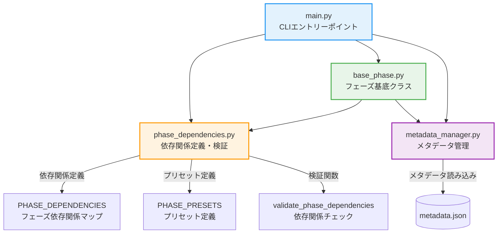
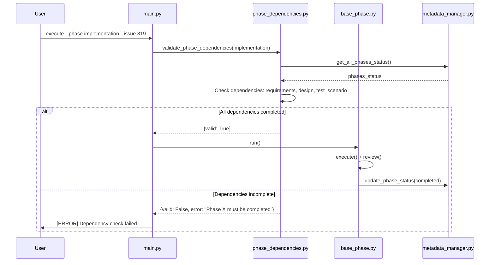
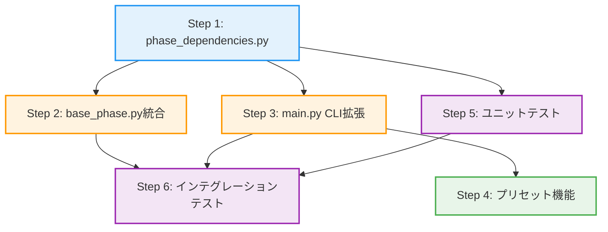
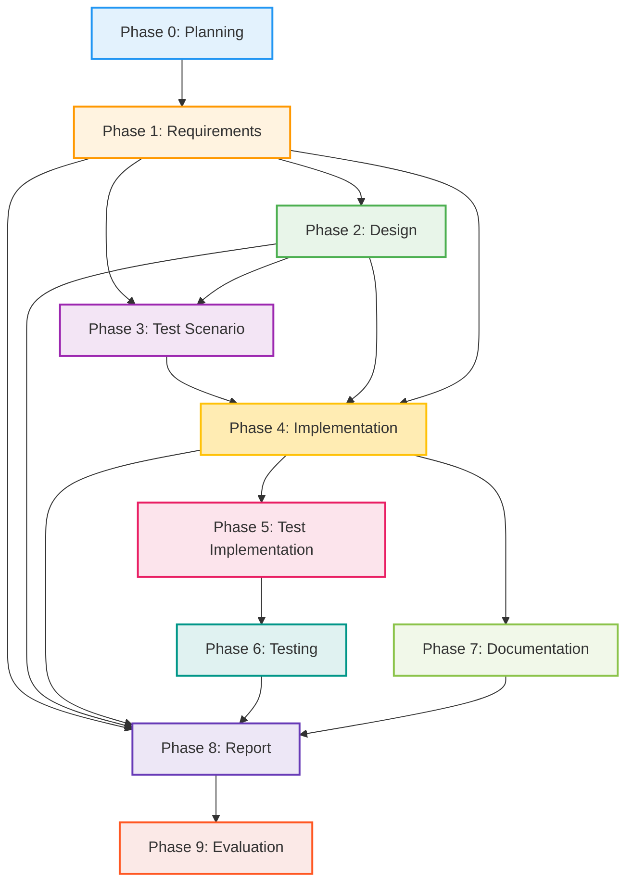

# 詳細設計書: Issue #319

## 📋 プロジェクト情報

- **Issue番号**: #319
- **タイトル**: [FEATURE] AIワークフロー: フェーズ依存関係の柔軟化と選択的実行機能
- **URL**: https://github.com/tielec/infrastructure-as-code/issues/319
- **作成日**: 2025-10-12

---

## 0. Planning Document・Requirements Documentの確認

### Planning Phase (Phase 0)

Planning Phase において、以下の開発計画が策定されています：

- **実装戦略**: EXTEND - 既存ワークフローエンジンの拡張
- **テスト戦略**: UNIT_INTEGRATION
- **リスク評価**: 中 - 既存ワークフローへの影響、後方互換性の維持が主要なリスク
- **見積もり工数**: 10~14時間（Phase 1-8の合計）

### Requirements Phase (Phase 1)

要件定義書（`.ai-workflow/issue-319/01_requirements/output/requirements.md`）において、以下の機能要件が定義されています：

1. **FR-001**: フェーズ依存関係の定義
2. **FR-002**: 依存関係チェック機能
3. **FR-003**: 依存関係チェックのスキップ機能
4. **FR-004**: 依存関係違反の警告表示
5. **FR-005**: 外部ドキュメント指定機能
6. **FR-006**: プリセット実行モード
7. **FR-007**: base_phase.py への統合

---

## 1. アーキテクチャ設計

### 1.1 システム全体図



### 1.2 コンポーネント間の関係

#### 1.2.1 新規コンポーネント: `phase_dependencies.py`

**責務**:
- フェーズ依存関係の定義（`PHASE_DEPENDENCIES`）
- プリセット定義（`PHASE_PRESETS`）
- 依存関係検証ロジック（`validate_phase_dependencies()`）
- 循環参照検出（`detect_circular_dependencies()`）
- 外部ドキュメント検証（`validate_external_document()`）

**公開インターフェース**:
```python
# 定数
PHASE_DEPENDENCIES: Dict[str, List[str]]
PHASE_PRESETS: Dict[str, List[str]]

# 関数
def validate_phase_dependencies(
    phase_name: str,
    metadata_manager: MetadataManager,
    skip_check: bool = False,
    ignore_violations: bool = False
) -> Dict[str, Any]:
    """依存関係を検証"""

def detect_circular_dependencies() -> List[List[str]]:
    """循環参照を検出"""

def validate_external_document(file_path: str) -> Dict[str, Any]:
    """外部ドキュメントのバリデーション"""
```

#### 1.2.2 既存コンポーネント拡張: `main.py`

**変更点**:
- `execute` コマンドに以下のCLIオプションを追加
  - `--skip-dependency-check`: 依存関係チェックをスキップ
  - `--ignore-dependencies`: 依存関係違反を警告のみで実行
  - `--requirements-doc`, `--design-doc`, `--test-scenario-doc`: 外部ドキュメント指定
  - `--preset`: プリセット実行モード

**新規関数**:
```python
def _get_preset_phases(preset_name: str) -> List[str]:
    """プリセット名からフェーズリストを取得"""

def _load_external_documents(
    requirements_doc: Optional[str],
    design_doc: Optional[str],
    test_scenario_doc: Optional[str]
) -> Dict[str, str]:
    """外部ドキュメントを読み込みメタデータに記録"""
```

#### 1.2.3 既存コンポーネント拡張: `base_phase.py`

**変更点**:
- `run()` メソッドの冒頭で依存関係チェックを実行
- 依存関係違反時の処理分岐（スキップ/警告/エラー）

**追加コード箇所**:
```python
def run(self) -> bool:
    """フェーズを実行してレビュー（リトライ機能付き）"""
    MAX_RETRIES = 3

    # ━━━ 新規追加: 依存関係チェック ━━━
    from core.phase_dependencies import validate_phase_dependencies

    validation_result = validate_phase_dependencies(
        phase_name=self.phase_name,
        metadata_manager=self.metadata,
        skip_check=self.skip_dependency_check,
        ignore_violations=self.ignore_dependencies
    )

    if not validation_result['valid']:
        if not validation_result.get('ignored', False):
            # 依存関係違反でエラー終了
            self.update_phase_status(status='failed')
            self.post_progress(
                status='failed',
                details=validation_result['error']
            )
            return False
        else:
            # 警告のみ表示して実行継続
            print(f"[WARNING] {validation_result['warning']}")
    # ━━━ 新規追加ここまで ━━━

    # 既存のフェーズ実行ロジック
    # ...
```

### 1.3 データフロー



---

## 2. 実装戦略判断

### 実装戦略: **EXTEND**

**判断根拠**:
1. **既存コードの拡張が中心**: `main.py` と `base_phase.py` の既存機能を拡張する形で実装
2. **新規モジュールは最小限**: 依存関係管理専用の `phase_dependencies.py` を1つのみ追加
3. **既存フェーズクラスへの影響なし**: `BasePhase` のサブクラス（`RequirementsPhase`, `DesignPhase` 等）の修正は不要
4. **後方互換性の維持**: 既存の `--phase all` モードはデフォルト動作として維持
5. **段階的な機能追加**: 既存のワークフローエンジンに依存関係チェック機能を追加する形で、破壊的な変更を避ける

**具体的なアプローチ**:
- 依存関係定義を定数として `phase_dependencies.py` に追加
- `base_phase.py` の `run()` メソッドに依存関係チェックを統合
- `main.py` の `execute` コマンドにCLIオプションを追加
- プリセット機能を `phase_dependencies.py` に実装

---

## 3. テスト戦略判断

### テスト戦略: **UNIT_INTEGRATION**

**判断根拠**:
1. **ユニットテストが必要な理由**:
   - `validate_phase_dependencies()` 関数の正常系・異常系を網羅的にテスト
   - プリセット定義の正当性を検証
   - エラーメッセージの内容を確認
   - 循環参照検出機能の動作確認

2. **インテグレーションテストが必要な理由**:
   - 依存関係チェックが有効な場合のフェーズ実行フロー全体をテスト
   - `--skip-dependency-check` フラグの動作確認
   - `--ignore-dependencies` フラグの動作確認
   - `--preset` オプションの動作確認
   - 既存の全フェーズ実行モード（`--phase all`）との互換性確認

3. **BDDテストが不要な理由**:
   - ユーザーストーリーベースのテストは既存のE2Eテストで十分カバーされている
   - 本機能は内部的な依存関係チェック機能であり、ユーザーストーリーの粒度でのテストは冗長

**テスト対象**:

#### ユニットテスト（`tests/unit/core/test_phase_dependencies.py`）:
- `PHASE_DEPENDENCIES` 定義の完全性（全フェーズが定義されている）
- `validate_phase_dependencies()` の正常系（依存関係が満たされている場合）
- `validate_phase_dependencies()` の異常系（依存関係が満たされていない場合）
- `--skip-dependency-check` フラグの動作
- `--ignore-dependencies` フラグの動作
- プリセット定義の正当性
- 循環参照検出機能
- 外部ドキュメントバリデーション

#### インテグレーションテスト（`tests/integration/test_phase_dependencies_integration.py`）:
- 依存関係違反時のフェーズ実行（エラーで停止）
- `--skip-dependency-check` フラグ指定時のフェーズ実行（警告表示＋実行継続）
- `--ignore-dependencies` フラグ指定時のフェーズ実行（警告のみ表示＋実行継続）
- プリセット実行モード（`--preset requirements-only` 等）の動作確認
- 既存の `--phase all` モードとの互換性

---

## 4. テストコード戦略判断

### テストコード戦略: **BOTH_TEST**

**判断根拠**:
1. **既存テストの拡張が必要な理由**:
   - 既存のインテグレーションテスト（`test_phase_separation.py`）に依存関係チェックのテストケースを追加
   - 既存の全フェーズ実行テスト（`test_phase_all.py`）に後方互換性のテストケースを追加

2. **新規テストの作成が必要な理由**:
   - 依存関係管理機能専用のユニットテスト（`test_phase_dependencies.py`）を新規作成
   - 依存関係チェック機能の統合テスト（`test_phase_dependencies_integration.py`）を新規作成

**具体的なアプローチ**:
- **既存テスト拡張**: `tests/integration/test_phase_separation.py` に依存関係違反時のテストケースを追加
- **新規テスト作成**:
  - `tests/unit/core/test_phase_dependencies.py` を作成し、依存関係チェック機能の単体テストを実装
  - `tests/integration/test_phase_dependencies_integration.py` を作成し、統合テストを実装

---

## 5. 影響範囲分析

### 5.1 既存コードへの影響

| ファイル | 変更内容 | 影響度 | 詳細 |
|---------|---------|-------|------|
| `scripts/ai-workflow/main.py` | CLIオプション追加 | 中 | `execute` コマンドに `--skip-dependency-check`, `--ignore-dependencies`, `--{phase}-doc`, `--preset` オプションを追加。既存の `--phase` オプションとの組み合わせを処理。 |
| `scripts/ai-workflow/phases/base_phase.py` | 依存関係チェック統合 | 中 | `run()` メソッドの冒頭で `validate_phase_dependencies()` を呼び出し。依存関係違反時の処理分岐を追加。 |
| `scripts/ai-workflow/core/metadata_manager.py` | メソッド追加 | 低 | `get_all_phases_status()` メソッドを追加（既に実装済み: line 224-234）。外部ドキュメント情報を記録するフィールドを追加。 |

### 5.2 新規ファイル

| ファイル | 目的 | 詳細 |
|---------|------|------|
| `scripts/ai-workflow/core/phase_dependencies.py` | フェーズ依存関係の定義と検証機能 | `PHASE_DEPENDENCIES`, `PHASE_PRESETS` 定数、`validate_phase_dependencies()`, `detect_circular_dependencies()`, `validate_external_document()` 関数を実装 |
| `scripts/ai-workflow/tests/unit/core/test_phase_dependencies.py` | 依存関係機能のユニットテスト | 依存関係チェック関数、プリセット定義、循環参照検出のテストケース |
| `scripts/ai-workflow/tests/integration/test_phase_dependencies_integration.py` | 依存関係機能の統合テスト | フェーズ実行時の依存関係チェック、プリセット実行モードのテストケース |

### 5.3 依存関係の変更

- **新規依存の追加**: なし（標準ライブラリのみ使用）
- **既存依存の変更**: なし

### 5.4 マイグレーション要否

- **メタデータスキーマ変更**: なし（既存の `metadata.json` スキーマは変更なし）
- **設定ファイル変更**: なし
- **データベーススキーマ変更**: 該当なし

**注意**: 外部ドキュメント指定機能（FR-005）を使用する場合、`metadata.json` に新しいフィールド（`external_documents`）を追加する可能性がありますが、これはオプション機能であり、既存データとの互換性は維持されます。

---

## 6. 変更・追加ファイルリスト

### 6.1 新規作成ファイル

```
scripts/ai-workflow/core/phase_dependencies.py
scripts/ai-workflow/tests/unit/core/test_phase_dependencies.py
scripts/ai-workflow/tests/integration/test_phase_dependencies_integration.py
```

### 6.2 修正が必要な既存ファイル

```
scripts/ai-workflow/main.py
scripts/ai-workflow/phases/base_phase.py
scripts/ai-workflow/core/metadata_manager.py (optional: 外部ドキュメント機能)
scripts/ai-workflow/tests/integration/test_phase_separation.py (optional: テストケース追加)
```

### 6.3 削除が必要なファイル

なし

---

## 7. 詳細設計

### 7.1 クラス設計

本機能は関数ベースで実装するため、新規クラスは追加しません。既存の `MetadataManager` クラスを活用します。

### 7.2 関数設計

#### 7.2.1 `phase_dependencies.py` の関数

##### (1) `validate_phase_dependencies()`

```python
def validate_phase_dependencies(
    phase_name: str,
    metadata_manager: MetadataManager,
    skip_check: bool = False,
    ignore_violations: bool = False
) -> Dict[str, Any]:
    """
    フェーズ実行前に依存関係をチェック

    Args:
        phase_name: フェーズ名（例: 'implementation'）
        metadata_manager: MetadataManagerインスタンス
        skip_check: 依存関係チェックをスキップするか（--skip-dependency-check）
        ignore_violations: 依存関係違反を警告のみで許可するか（--ignore-dependencies）

    Returns:
        Dict[str, Any]: 検証結果
            - valid: bool - 依存関係が満たされているか
            - error: Optional[str] - エラーメッセージ（valid=False の場合）
            - warning: Optional[str] - 警告メッセージ（ignored=True の場合）
            - ignored: bool - 依存関係違反が無視されたか
            - missing_phases: List[str] - 未完了の依存フェーズ一覧

    Raises:
        ValueError: phase_name が不正な場合

    Example:
        >>> result = validate_phase_dependencies('implementation', metadata_manager)
        >>> if not result['valid']:
        ...     print(result['error'])
        Phase 'requirements' must be completed before 'implementation'
    """
```

**実装ロジック**:
1. `phase_name` が `PHASE_DEPENDENCIES` に存在するか確認
2. `skip_check=True` の場合は即座に `{valid: True}` を返す
3. `PHASE_DEPENDENCIES[phase_name]` から依存フェーズリストを取得
4. `metadata_manager.get_all_phases_status()` で各依存フェーズのステータスを確認
5. 未完了の依存フェーズが存在する場合:
   - `ignore_violations=True` の場合: `{valid: False, ignored: True, warning: "..."}` を返す
   - `ignore_violations=False` の場合: `{valid: False, error: "..."}` を返す
6. すべての依存フェーズが完了している場合: `{valid: True}` を返す

##### (2) `detect_circular_dependencies()`

```python
def detect_circular_dependencies() -> List[List[str]]:
    """
    PHASE_DEPENDENCIES 内の循環参照を検出

    Returns:
        List[List[str]]: 循環参照のリスト（例: [['A', 'B', 'A']]）
                         循環参照が存在しない場合は空リスト

    Algorithm:
        DFS (Depth-First Search) を使用して循環を検出

    Example:
        >>> cycles = detect_circular_dependencies()
        >>> if cycles:
        ...     print(f"Circular dependencies detected: {cycles}")
    """
```

**実装ロジック**:
1. グラフ構造（隣接リスト）を構築
2. DFS で各ノードを訪問し、訪問中のノードを記録
3. 訪問中のノードに再度到達した場合、循環参照を検出
4. 検出された循環参照をリストで返す

##### (3) `validate_external_document()`

```python
def validate_external_document(file_path: str) -> Dict[str, Any]:
    """
    外部ドキュメントファイルのバリデーション

    Args:
        file_path: ファイルパス（相対パスまたは絶対パス）

    Returns:
        Dict[str, Any]: バリデーション結果
            - valid: bool
            - error: Optional[str]
            - absolute_path: str - 絶対パス

    Validation rules:
        - ファイルが存在すること
        - 読み込み可能な形式（.md, .txt）
        - ファイルサイズが10MB以下
        - リポジトリ内のファイル（相対パスで指定）

    Example:
        >>> result = validate_external_document('path/to/requirements.md')
        >>> if not result['valid']:
        ...     print(result['error'])
    """
```

**実装ロジック**:
1. ファイルの存在確認
2. ファイル拡張子のチェック（`.md`, `.txt` のみ許可）
3. ファイルサイズのチェック（10MB以下）
4. 絶対パスへの変換
5. リポジトリ内のファイルかどうかをチェック（セキュリティ）
6. バリデーション結果を返す

#### 7.2.2 `main.py` の関数

##### (1) `_get_preset_phases()`

```python
def _get_preset_phases(preset_name: str) -> List[str]:
    """
    プリセット名からフェーズリストを取得

    Args:
        preset_name: プリセット名（例: 'requirements-only'）

    Returns:
        List[str]: フェーズリスト

    Raises:
        ValueError: 不正なプリセット名の場合

    Example:
        >>> phases = _get_preset_phases('design-phase')
        ['requirements', 'design']
    """
```

##### (2) `_load_external_documents()`

```python
def _load_external_documents(
    requirements_doc: Optional[str],
    design_doc: Optional[str],
    test_scenario_doc: Optional[str],
    metadata_manager: MetadataManager
) -> Dict[str, str]:
    """
    外部ドキュメントを読み込みメタデータに記録

    Args:
        requirements_doc: 要件定義書のパス
        design_doc: 設計書のパス
        test_scenario_doc: テストシナリオのパス
        metadata_manager: MetadataManagerインスタンス

    Returns:
        Dict[str, str]: フェーズ名 → ファイルパスのマッピング

    Side effects:
        - metadata.json に external_documents フィールドを追加
        - 対応するフェーズのステータスを 'completed' に変更

    Example:
        >>> docs = _load_external_documents(
        ...     requirements_doc='path/to/requirements.md',
        ...     design_doc=None,
        ...     test_scenario_doc=None,
        ...     metadata_manager=metadata_manager
        ... )
        {'requirements': 'path/to/requirements.md'}
    """
```

### 7.3 データ構造設計

#### 7.3.1 `PHASE_DEPENDENCIES` 定数

```python
PHASE_DEPENDENCIES: Dict[str, List[str]] = {
    'planning': [],  # 依存なし
    'requirements': ['planning'],
    'design': ['requirements'],
    'test_scenario': ['requirements', 'design'],
    'implementation': ['requirements', 'design', 'test_scenario'],
    'test_implementation': ['implementation'],
    'testing': ['test_implementation'],
    'documentation': ['implementation'],
    'report': ['requirements', 'design', 'implementation', 'testing', 'documentation'],
    'evaluation': ['report']
}
```

**設計原則**:
- 依存関係は前方依存（Phase N → Phase N-1以前）のみ
- 循環参照を避ける
- 明示的な依存関係のみを記述（推移的依存関係は含めない）

#### 7.3.2 `PHASE_PRESETS` 定数

```python
PHASE_PRESETS: Dict[str, List[str]] = {
    'requirements-only': ['requirements'],
    'design-phase': ['requirements', 'design'],
    'implementation-phase': ['requirements', 'design', 'test_scenario', 'implementation'],
    'full-workflow': [
        'planning', 'requirements', 'design', 'test_scenario',
        'implementation', 'test_implementation', 'testing',
        'documentation', 'report', 'evaluation'
    ]
}
```

#### 7.3.3 メタデータスキーマ拡張（optional）

外部ドキュメント指定機能（FR-005）を使用する場合、`metadata.json` に以下のフィールドを追加：

```json
{
  "external_documents": {
    "requirements": "/path/to/requirements.md",
    "design": "/path/to/design.md",
    "test_scenario": "/path/to/test_scenario.md"
  }
}
```

**注意**: このフィールドはオプションであり、既存の `metadata.json` との互換性は維持されます。

### 7.4 インターフェース設計

#### 7.4.1 CLIオプション

##### `execute` コマンドへの追加オプション

```bash
# 依存関係チェックをスキップ
python main.py execute --phase implementation --issue 319 --skip-dependency-check

# 依存関係違反を警告のみで許可
python main.py execute --phase implementation --issue 319 --ignore-dependencies

# 外部ドキュメントを指定
python main.py execute --phase implementation --issue 319 \
  --requirements-doc .ai-workflow/issue-319/01_requirements/output/requirements.md \
  --design-doc .ai-workflow/issue-319/02_design/output/design.md

# プリセット実行モード
python main.py execute --preset design-phase --issue 319

# フルワークフロー実行（デフォルト）
python main.py execute --phase all --issue 319
```

##### オプション詳細

| オプション | 型 | デフォルト | 説明 |
|-----------|-----|-----------|------|
| `--skip-dependency-check` | flag | False | 依存関係チェックを完全にスキップ |
| `--ignore-dependencies` | flag | False | 依存関係違反を警告のみで許可 |
| `--requirements-doc` | string | None | 要件定義書のパス |
| `--design-doc` | string | None | 設計書のパス |
| `--test-scenario-doc` | string | None | テストシナリオのパス |
| `--preset` | choice | None | プリセット実行モード（requirements-only, design-phase, implementation-phase, full-workflow） |

**オプションの排他性**:
- `--preset` と `--phase` は排他的（同時に指定できない）
- `--skip-dependency-check` と `--ignore-dependencies` は排他的

#### 7.4.2 エラーメッセージ設計

##### 依存関係違反時のエラーメッセージ

```
[ERROR] Dependency check failed for phase 'implementation'
[ERROR] The following phases must be completed first:
[ERROR]   - requirements: pending
[ERROR]   - design: pending
[ERROR]   - test_scenario: in_progress
[ERROR]
[ERROR] To bypass this check, use one of the following options:
[ERROR]   --skip-dependency-check    (skip all dependency checks)
[ERROR]   --ignore-dependencies      (show warnings but continue)
```

##### 外部ドキュメントバリデーションエラー

```
[ERROR] Invalid external document: /path/to/requirements.md
[ERROR] Reason: File size exceeds 10MB limit (actual: 15.2MB)
[ERROR]
[ERROR] Please ensure:
[ERROR]   - File exists and is readable
[ERROR]   - File format is .md or .txt
[ERROR]   - File size is less than 10MB
[ERROR]   - File is within the repository
```

##### プリセット実行モードのエラー

```
[ERROR] Invalid preset: 'unknown-preset'
[ERROR] Available presets:
[ERROR]   - requirements-only
[ERROR]   - design-phase
[ERROR]   - implementation-phase
[ERROR]   - full-workflow
```

---

## 8. セキュリティ考慮事項

### 8.1 外部ドキュメント指定時のセキュリティ

#### 8.1.1 ファイルパスのバリデーション

**リスク**: パストラバーサル攻撃（`../../etc/passwd` などの不正なパス指定）

**対策**:
1. 絶対パスへの変換後、リポジトリルート配下であることを確認
2. シンボリックリンクの解決（`Path.resolve()`）
3. 相対パスで指定された場合はリポジトリルートを基準に解決

**実装例**:
```python
def _validate_file_path(file_path: str, repo_root: Path) -> Dict[str, Any]:
    """ファイルパスのセキュリティチェック"""
    try:
        # 絶対パスに変換
        abs_path = Path(file_path).resolve()

        # リポジトリ内のファイルかチェック
        repo_root_resolved = repo_root.resolve()
        if not abs_path.is_relative_to(repo_root_resolved):
            return {
                'valid': False,
                'error': 'File must be within the repository'
            }

        return {'valid': True, 'absolute_path': str(abs_path)}
    except Exception as e:
        return {'valid': False, 'error': str(e)}
```

#### 8.1.2 ファイル形式の制限

**リスク**: 実行可能ファイルやバイナリファイルの読み込み

**対策**:
1. 許可する拡張子を `.md`, `.txt` のみに制限
2. MIMEタイプのチェック（オプション）

#### 8.1.3 ファイルサイズの上限

**リスク**: 大きなファイルの読み込みによるメモリ枯渇

**対策**:
1. ファイルサイズを10MBに制限
2. 超過した場合はエラーメッセージを表示

### 8.2 依存関係チェックのバイパス時の警告

**リスク**: `--skip-dependency-check` の不適切な使用により、不整合な状態でのフェーズ実行

**対策**:
1. `--skip-dependency-check` 使用時に明示的な警告メッセージを表示
2. ログに記録（将来の監査用）

**警告メッセージ例**:
```
[WARNING] Dependency check has been skipped!
[WARNING] This may result in inconsistent workflow execution.
[WARNING] Use this option only if you understand the implications.
```

### 8.3 循環参照の検出

**リスク**: `PHASE_DEPENDENCIES` の誤った定義による循環参照

**対策**:
1. `detect_circular_dependencies()` 関数をユニットテストで実行
2. 循環参照が検出された場合はテストを失敗させる
3. 開発者向けのバリデーションスクリプトを提供

---

## 9. 非機能要件への対応

### 9.1 パフォーマンス

#### NFR-001: 依存関係チェックのオーバーヘッド

**要件**: 依存関係チェックのオーバーヘッドは 0.1秒以下

**対応策**:
1. `metadata.json` の読み込み回数を最小化
   - `MetadataManager` のキャッシュを活用
   - 一度読み込んだデータを再利用
2. 依存関係チェックのアルゴリズムを最適化
   - O(n) の計算量（n = 依存フェーズ数）
   - 早期リターン（最初の未完了フェーズで停止）

**実装例**:
```python
def validate_phase_dependencies(
    phase_name: str,
    metadata_manager: MetadataManager,
    skip_check: bool = False,
    ignore_violations: bool = False
) -> Dict[str, Any]:
    """依存関係をチェック（早期リターン最適化）"""
    if skip_check:
        return {'valid': True}  # 即座にリターン

    required_phases = PHASE_DEPENDENCIES.get(phase_name, [])
    phases_status = metadata_manager.get_all_phases_status()  # 一度だけ取得

    missing_phases = []
    for required_phase in required_phases:
        status = phases_status.get(required_phase)
        if status != 'completed':
            missing_phases.append(required_phase)
            if not ignore_violations:
                # 早期リターン（ignore_violationsがFalseの場合）
                return {
                    'valid': False,
                    'error': f"Phase '{required_phase}' must be completed before '{phase_name}'",
                    'missing_phases': [required_phase]
                }

    # すべてチェック完了
    if missing_phases and ignore_violations:
        return {
            'valid': False,
            'ignored': True,
            'warning': f"Dependency violations ignored: {', '.join(missing_phases)}",
            'missing_phases': missing_phases
        }

    return {'valid': True}
```

### 9.2 スケーラビリティ

#### 将来的なフェーズ追加への対応

**対応策**:
1. 依存関係定義を一箇所に集約（`phase_dependencies.py`）
2. 新規フェーズ追加時は `PHASE_DEPENDENCIES` への追加のみで対応可能
3. プリセット定義も同じモジュール内で管理

**フェーズ追加手順**:
1. `PHASE_DEPENDENCIES` に新規フェーズを追加
2. 必要に応じてプリセット定義に追加
3. ユニットテストでカバレッジを確認

### 9.3 保守性

#### 9.3.1 コードの可読性

**対応策**:
1. 関数・変数名は self-documenting（自己文書化）
2. 型ヒントを徹底（`Dict[str, List[str]]`, `Optional[str]` 等）
3. Docstring を充実（Args, Returns, Raises, Example）

#### 9.3.2 テスタビリティ

**対応策**:
1. 純粋関数として実装（副作用を最小化）
2. 依存注入パターン（`metadata_manager` を引数で渡す）
3. モックが容易な設計

#### 9.3.3 エラーメッセージの明確性

**対応策**:
1. エラーメッセージに具体的な未完了フェーズ名を含める
2. 解決方法を提示（例: `--skip-dependency-check` オプションの案内）
3. エラーレベルを明示（`[ERROR]`, `[WARNING]`, `[INFO]`）

---

## 10. 実装の順序

### Phase 4: 実装（推奨順序）

#### ステップ1: 依存関係管理モジュールの実装 (1.5時間)

**作業内容**:
1. `scripts/ai-workflow/core/phase_dependencies.py` を作成
2. `PHASE_DEPENDENCIES` 定数を定義
3. `validate_phase_dependencies()` 関数を実装
4. `detect_circular_dependencies()` 関数を実装
5. `validate_external_document()` 関数を実装

**成果物**:
- `phase_dependencies.py` (完成)

**依存関係**: なし

---

#### ステップ2: base_phase.py への統合 (1時間)

**作業内容**:
1. `base_phase.py` の `run()` メソッドに依存関係チェックを追加
2. 依存関係違反時の処理分岐を実装
3. エラーメッセージの表示

**成果物**:
- `base_phase.py` (修正完了)

**依存関係**: ステップ1

---

#### ステップ3: main.py のCLI拡張 (1.5~2時間)

**作業内容**:
1. `execute` コマンドに以下のオプションを追加:
   - `--skip-dependency-check`
   - `--ignore-dependencies`
   - `--requirements-doc`, `--design-doc`, `--test-scenario-doc`
   - `--preset`
2. `_get_preset_phases()` 関数を実装
3. `_load_external_documents()` 関数を実装
4. オプションの排他性チェック

**成果物**:
- `main.py` (修正完了)

**依存関係**: ステップ1

---

#### ステップ4: プリセット機能の実装 (1~1.5時間)

**作業内容**:
1. `PHASE_PRESETS` 定数を定義（ステップ1で実装済み）
2. `main.py` でプリセット選択ロジックを実装
3. `--preset` オプションの動作確認

**成果物**:
- プリセット機能（完成）

**依存関係**: ステップ1, ステップ3

---

### Phase 5: テスト実装（推奨順序）

#### ステップ5: ユニットテストの実装 (0.5時間)

**作業内容**:
1. `tests/unit/core/test_phase_dependencies.py` を作成
2. 依存関係チェック機能のテストケースを実装
   - 正常系: すべての依存フェーズが完了している場合
   - 異常系: 依存フェーズが未完了の場合
   - `--skip-dependency-check` フラグの動作
   - `--ignore-dependencies` フラグの動作
3. プリセット定義のテストケース
4. 循環参照検出のテストケース

**成果物**:
- `test_phase_dependencies.py` (完成)

**依存関係**: ステップ1

---

#### ステップ6: インテグレーションテストの実装 (1時間)

**作業内容**:
1. `tests/integration/test_phase_dependencies_integration.py` を作成
2. フェーズ実行時の依存関係チェックのテストケース
3. プリセット実行モードのテストケース
4. 既存テスト（`test_phase_separation.py`）に依存関係違反時のテストケースを追加

**成果物**:
- `test_phase_dependencies_integration.py` (完成)
- `test_phase_separation.py` (修正完了)

**依存関係**: ステップ1, ステップ2, ステップ3

---

### 実装順序のまとめ



**並列実行可能なステップ**:
- ステップ2とステップ3は並列実行可能（どちらもステップ1に依存）
- ステップ5（ユニットテスト）はステップ2, 3と並列実行可能

---

## 11. テストシナリオ詳細

### 11.1 ユニットテストシナリオ

#### `test_validate_phase_dependencies_success()`

**目的**: すべての依存フェーズが完了している場合、バリデーションが成功すること

**準備**:
- モックの `metadata_manager` を作成
- `get_all_phases_status()` が以下を返すように設定:
  ```python
  {
      'planning': 'completed',
      'requirements': 'completed',
      'design': 'completed',
      'test_scenario': 'completed'
  }
  ```

**実行**:
```python
result = validate_phase_dependencies('implementation', metadata_manager)
```

**期待結果**:
```python
assert result['valid'] == True
```

---

#### `test_validate_phase_dependencies_failure()`

**目的**: 依存フェーズが未完了の場合、バリデーションが失敗すること

**準備**:
- モックの `metadata_manager` を作成
- `get_all_phases_status()` が以下を返すように設定:
  ```python
  {
      'planning': 'completed',
      'requirements': 'pending',  # 未完了
      'design': 'pending'
  }
  ```

**実行**:
```python
result = validate_phase_dependencies('implementation', metadata_manager)
```

**期待結果**:
```python
assert result['valid'] == False
assert 'requirements' in result['error']
assert 'missing_phases' in result
assert 'requirements' in result['missing_phases']
```

---

#### `test_skip_dependency_check()`

**目的**: `skip_check=True` の場合、依存関係チェックがスキップされること

**準備**:
- モックの `metadata_manager` を作成
- 依存フェーズが未完了でも問題ない設定

**実行**:
```python
result = validate_phase_dependencies('implementation', metadata_manager, skip_check=True)
```

**期待結果**:
```python
assert result['valid'] == True
```

---

#### `test_ignore_dependencies()`

**目的**: `ignore_violations=True` の場合、警告のみで実行が継続されること

**準備**:
- モックの `metadata_manager` を作成
- `get_all_phases_status()` で依存フェーズが未完了

**実行**:
```python
result = validate_phase_dependencies('implementation', metadata_manager, ignore_violations=True)
```

**期待結果**:
```python
assert result['valid'] == False
assert result['ignored'] == True
assert 'warning' in result
```

---

#### `test_detect_circular_dependencies_none()`

**目的**: 循環参照が存在しない場合、空リストが返されること

**実行**:
```python
cycles = detect_circular_dependencies()
```

**期待結果**:
```python
assert cycles == []
```

---

#### `test_validate_external_document_success()`

**目的**: 正常なファイルパスが指定された場合、バリデーションが成功すること

**準備**:
- テスト用のMarkdownファイルを作成
- ファイルサイズは10MB以下

**実行**:
```python
result = validate_external_document('test_file.md')
```

**期待結果**:
```python
assert result['valid'] == True
assert 'absolute_path' in result
```

---

#### `test_validate_external_document_file_not_found()`

**目的**: 存在しないファイルが指定された場合、バリデーションが失敗すること

**実行**:
```python
result = validate_external_document('non_existent.md')
```

**期待結果**:
```python
assert result['valid'] == False
assert 'not found' in result['error'].lower()
```

---

#### `test_validate_external_document_invalid_format()`

**目的**: 不正なファイル形式が指定された場合、バリデーションが失敗すること

**準備**:
- テスト用の実行可能ファイル（.sh）を作成

**実行**:
```python
result = validate_external_document('test_script.sh')
```

**期待結果**:
```python
assert result['valid'] == False
assert 'format' in result['error'].lower()
```

---

#### `test_validate_external_document_size_exceeded()`

**目的**: ファイルサイズが10MBを超える場合、バリデーションが失敗すること

**準備**:
- テスト用の大きなファイル（10MB超）を作成

**実行**:
```python
result = validate_external_document('large_file.md')
```

**期待結果**:
```python
assert result['valid'] == False
assert 'size' in result['error'].lower()
```

---

### 11.2 インテグレーションテストシナリオ

#### `test_phase_execution_with_dependency_check()`

**目的**: 依存関係チェックが有効な場合、未完了の依存フェーズがあるとエラーになること

**準備**:
- テスト用のリポジトリ環境を作成
- `metadata.json` を作成し、依存フェーズが未完了の状態に設定

**実行**:
```bash
python main.py execute --phase implementation --issue test-issue
```

**期待結果**:
- 終了コード: 1（エラー）
- 標準エラー出力にエラーメッセージが表示される
- `metadata.json` のステータスが `failed` になっていない（フェーズ実行前に停止）

---

#### `test_phase_execution_with_skip_dependency_check()`

**目的**: `--skip-dependency-check` フラグ指定時、依存関係チェックがスキップされること

**準備**:
- テスト用のリポジトリ環境を作成
- `metadata.json` を作成し、依存フェーズが未完了の状態に設定

**実行**:
```bash
python main.py execute --phase implementation --issue test-issue --skip-dependency-check
```

**期待結果**:
- 警告メッセージが表示される
- フェーズが正常に実行される
- 終了コード: 0（成功）

---

#### `test_phase_execution_with_ignore_dependencies()`

**目的**: `--ignore-dependencies` フラグ指定時、警告のみで実行が継続されること

**準備**:
- テスト用のリポジトリ環境を作成
- `metadata.json` を作成し、依存フェーズが未完了の状態に設定

**実行**:
```bash
python main.py execute --phase implementation --issue test-issue --ignore-dependencies
```

**期待結果**:
- 警告メッセージが表示される
- フェーズが正常に実行される
- 終了コード: 0（成功）

---

#### `test_preset_requirements_only()`

**目的**: `--preset requirements-only` で requirements フェーズのみが実行されること

**準備**:
- テスト用のリポジトリ環境を作成

**実行**:
```bash
python main.py execute --preset requirements-only --issue test-issue
```

**期待結果**:
- requirements フェーズのみが実行される
- 他のフェーズはスキップされる
- 終了コード: 0（成功）

---

#### `test_preset_design_phase()`

**目的**: `--preset design-phase` で requirements と design フェーズが実行されること

**準備**:
- テスト用のリポジトリ環境を作成

**実行**:
```bash
python main.py execute --preset design-phase --issue test-issue
```

**期待結果**:
- requirements と design フェーズが実行される
- 他のフェーズはスキップされる
- 終了コード: 0（成功）

---

#### `test_backward_compatibility_phase_all()`

**目的**: 既存の `--phase all` モードが正常に動作すること

**準備**:
- テスト用のリポジトリ環境を作成

**実行**:
```bash
python main.py execute --phase all --issue test-issue
```

**期待結果**:
- すべてのフェーズが順次実行される
- 既存の動作と同じ
- 終了コード: 0（成功）

---

## 12. リスクと軽減策

### リスク1: 既存ワークフローへの影響

**影響度**: 中
**確率**: 中

**軽減策**:
1. 依存関係チェックをデフォルトで有効にする（後方互換性を維持）
2. 既存の全フェーズ実行モード（`--phase all`）はデフォルト動作を維持
3. 既存のインテグレーションテストを実行し、互換性を確認
4. 段階的なリリース（まずは `--experimental` フラグで提供）

---

### リスク2: 依存関係の循環参照

**影響度**: 低
**確率**: 低

**軽減策**:
1. `PHASE_DEPENDENCIES` 定義時に循環参照をチェックする関数（`detect_circular_dependencies()`）を実装
2. ユニットテストで循環参照の検出を確認
3. 依存関係は常に前方依存（Phase N → Phase N-1）のみとする設計原則を確立

---

### リスク3: 外部ドキュメント指定時のセキュリティ

**影響度**: 中
**確率**: 中

**軽減策**:
1. ファイルパスのバリデーション（相対パス、絶対パスの制限）
2. 読み込み可能なファイル形式の制限（Markdown, テキストのみ）
3. ファイルサイズの上限設定（10MB）
4. ファイル読み込み時のエラーハンドリング

---

### リスク4: プリセット機能の拡張性

**影響度**: 低
**確率**: 中

**軽減策**:
1. プリセット定義を辞書形式で管理し、追加が容易な設計にする
2. カスタムプリセットの定義方法をドキュメント化
3. プリセット定義のバリデーション機能を実装

---

### リスク5: テストカバレッジの不足

**影響度**: 中
**確率**: 中

**軽減策**:
1. ユニットテストで依存関係チェック機能を網羅的にテスト
2. インテグレーションテストで既存ワークフローとの互換性を確認
3. テストカバレッジを測定し、80%以上を目標とする
4. 手動テストでエッジケースを確認

---

## 13. 開発者向けガイドライン

### 13.1 新規フェーズ追加時の手順

1. `phase_dependencies.py` の `PHASE_DEPENDENCIES` に新規フェーズを追加
2. 依存関係を定義（前方依存のみ）
3. `detect_circular_dependencies()` を実行して循環参照がないか確認
4. ユニットテストを追加
5. プリセット定義に必要に応じて追加

### 13.2 プリセット追加時の手順

1. `phase_dependencies.py` の `PHASE_PRESETS` に新規プリセットを追加
2. プリセットが既存のフェーズ名で構成されていることを確認
3. ユニットテストを追加
4. ドキュメント（README.md）に使用例を追加

### 13.3 依存関係変更時の注意点

1. 依存関係の変更は既存ワークフローに影響する可能性がある
2. 変更前に影響範囲を確認（どのフェーズが影響を受けるか）
3. 変更後にインテグレーションテストを実行
4. ドキュメントを更新（依存関係図）

---

## 14. 将来的な拡張候補

### 14.1 カスタムプリセットの定義

**概要**: ユーザーが独自のプリセットを設定ファイルで定義できる機能

**実装方針**:
- `.ai-workflow/presets.yaml` のような設定ファイルを読み込む
- YAML形式でプリセットを定義
- `PHASE_PRESETS` にマージして使用

**例**:
```yaml
custom-presets:
  my-workflow:
    - requirements
    - design
    - implementation
    - testing
```

---

### 14.2 依存関係の可視化

**概要**: Mermaid形式で依存関係図を自動生成する機能

**実装方針**:
- `phase_dependencies.py` に `generate_dependency_graph()` 関数を追加
- `PHASE_DEPENDENCIES` から Mermaid 形式のグラフを生成
- ドキュメント生成時に自動実行

---

### 14.3 並列実行

**概要**: 依存関係のないフェーズを並列実行する機能

**実装方針**:
- `asyncio` を使用した非同期実行
- 依存関係グラフを解析して並列実行可能なフェーズを特定
- メタデータの排他制御（複数フェーズの同時更新）

---

### 14.4 条件付き依存関係

**概要**: レビュー結果に応じて依存関係を動的に変更する機能

**実装方針**:
- `PHASE_DEPENDENCIES` に条件付き依存関係を追加
- `validate_phase_dependencies()` でレビュー結果を考慮

**例**:
```python
CONDITIONAL_DEPENDENCIES = {
    'documentation': {
        'default': ['implementation'],
        'if_review_pass_with_suggestions': ['implementation', 'report']
    }
}
```

---

### 14.5 依存関係の自動解決

**概要**: 依存フェーズが未完了の場合、自動的に依存フェーズを実行する機能

**実装方針**:
- `execute` コマンドに `--auto-resolve-dependencies` フラグを追加
- 未完了の依存フェーズを再帰的に実行

**注意**: この機能は慎重に設計する必要がある（無限ループの防止、実行時間の管理）

---

## 15. 付録

### 付録A: フェーズ依存関係図



---

### 付録B: CLIコマンド例

```bash
# ━━━━━━━━━━━━━━━━━━━━━━━━━━━━━━━━━━
# 基本的な使用例
# ━━━━━━━━━━━━━━━━━━━━━━━━━━━━━━━━━━

# 1. 依存関係チェックを無効化して実行
python main.py execute --phase implementation --issue 319 --skip-dependency-check

# 2. 依存関係違反を警告のみで実行
python main.py execute --phase implementation --issue 319 --ignore-dependencies

# 3. 外部ドキュメントを指定して実行
python main.py execute --phase implementation --issue 319 \
  --requirements-doc .ai-workflow/issue-319/01_requirements/output/requirements.md \
  --design-doc .ai-workflow/issue-319/02_design/output/design.md

# 4. プリセットで実行
python main.py execute --preset design-phase --issue 319

# 5. フルワークフロー実行（デフォルト）
python main.py execute --phase all --issue 319

# ━━━━━━━━━━━━━━━━━━━━━━━━━━━━━━━━━━
# 応用例
# ━━━━━━━━━━━━━━━━━━━━━━━━━━━━━━━━━━

# 6. 要件定義のみ実行（プリセット使用）
python main.py execute --preset requirements-only --issue 319

# 7. 設計フェーズまで実行（プリセット使用）
python main.py execute --preset design-phase --issue 319

# 8. 実装フェーズまで実行（プリセット使用）
python main.py execute --preset implementation-phase --issue 319

# 9. 外部ドキュメントを使用して特定フェーズをスキップ
# (要件定義をスキップして設計から開始)
python main.py execute --phase design --issue 319 \
  --requirements-doc external/requirements.md \
  --skip-dependency-check

# 10. 依存関係チェックを無視してテストのみ実行
python main.py execute --phase testing --issue 319 --ignore-dependencies
```

---

### 付録C: エラーメッセージ一覧

#### C.1 依存関係違反

```
[ERROR] Dependency check failed for phase 'implementation'
[ERROR] The following phases must be completed first:
[ERROR]   - requirements: pending
[ERROR]   - design: in_progress
[ERROR]   - test_scenario: pending
[ERROR]
[ERROR] To bypass this check, use one of the following options:
[ERROR]   --skip-dependency-check    (skip all dependency checks)
[ERROR]   --ignore-dependencies      (show warnings but continue)
```

#### C.2 外部ドキュメントエラー

```
[ERROR] Invalid external document: /path/to/requirements.md
[ERROR] Reason: File not found
[ERROR]
[ERROR] Please ensure:
[ERROR]   - File exists and is readable
[ERROR]   - File format is .md or .txt
[ERROR]   - File size is less than 10MB
[ERROR]   - File is within the repository
```

#### C.3 プリセットエラー

```
[ERROR] Invalid preset: 'unknown-preset'
[ERROR] Available presets:
[ERROR]   - requirements-only
[ERROR]   - design-phase
[ERROR]   - implementation-phase
[ERROR]   - full-workflow
```

#### C.4 オプション排他性エラー

```
[ERROR] Options '--preset' and '--phase' are mutually exclusive
[ERROR] Please specify only one of them
```

```
[ERROR] Options '--skip-dependency-check' and '--ignore-dependencies' are mutually exclusive
[ERROR] Please specify only one of them
```

---

### 付録D: 開発チェックリスト

#### Phase 4: 実装

- [ ] `phase_dependencies.py` を作成
  - [ ] `PHASE_DEPENDENCIES` 定数を定義
  - [ ] `PHASE_PRESETS` 定数を定義
  - [ ] `validate_phase_dependencies()` 関数を実装
  - [ ] `detect_circular_dependencies()` 関数を実装
  - [ ] `validate_external_document()` 関数を実装
- [ ] `base_phase.py` を修正
  - [ ] `run()` メソッドに依存関係チェックを追加
  - [ ] エラーハンドリングを実装
- [ ] `main.py` を修正
  - [ ] `--skip-dependency-check` フラグを追加
  - [ ] `--ignore-dependencies` フラグを追加
  - [ ] `--{phase}-doc` オプションを追加
  - [ ] `--preset` オプションを追加
  - [ ] `_get_preset_phases()` 関数を実装
  - [ ] `_load_external_documents()` 関数を実装
- [ ] コードレビュー実施
- [ ] コーディング規約準拠確認

#### Phase 5: テスト実装

- [ ] ユニットテストを作成
  - [ ] `test_phase_dependencies.py` を作成
  - [ ] 依存関係チェック機能のテストケースを実装
  - [ ] プリセット定義のテストケースを実装
  - [ ] 循環参照検出のテストケースを実装
  - [ ] 外部ドキュメントバリデーションのテストケースを実装
- [ ] インテグレーションテストを作成
  - [ ] `test_phase_dependencies_integration.py` を作成
  - [ ] フェーズ実行時の依存関係チェックのテストケースを実装
  - [ ] プリセット実行モードのテストケースを実装
- [ ] テストカバレッジを確認（80%以上）
- [ ] 既存テストとの互換性を確認

---

## 16. まとめ

本設計書では、Issue #319「AIワークフロー: フェーズ依存関係の柔軟化と選択的実行機能」の詳細設計を記載しました。

### 主要なポイント:

1. **実装戦略**: EXTEND - 既存ワークフローエンジンを拡張する形で実装
2. **テスト戦略**: UNIT_INTEGRATION - ユニットテストとインテグレーションテストを組み合わせ
3. **テストコード戦略**: BOTH_TEST - 既存テストの拡張と新規テストの作成
4. **影響範囲**: 3つの既存ファイルの修正と3つの新規ファイルの作成
5. **実装順序**: 依存関係管理モジュール → base_phase.py統合 → main.py CLI拡張 → プリセット機能 → テスト実装

### 次のステップ:

1. Phase 3 (Test Scenario) に進み、テストシナリオを詳細化
2. Phase 4 (Implementation) で実装を開始
3. Phase 5 (Test Implementation) でテストを実装
4. Phase 6 (Testing) でテストを実行

---

**作成日**: 2025-10-12
**作成者**: AI Workflow Orchestrator (Claude Agent SDK)
**バージョン**: 1.0
