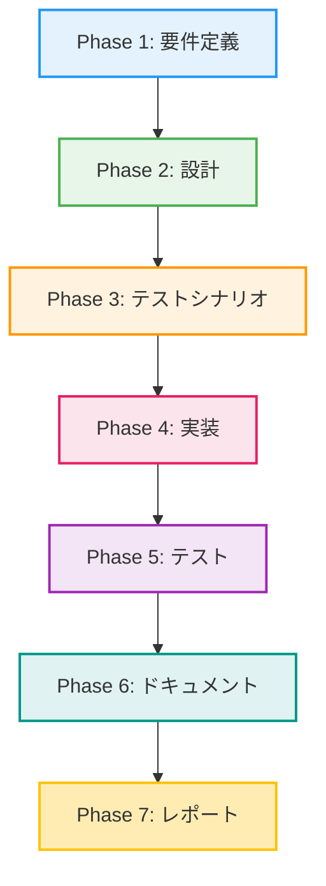

# プロジェクト計画書 - Issue #320

**Issue**: [FEATURE] AIワークフロー: 全フェーズ一括実行機能（--phase all）
**作成日**: 2025-10-12
**Phase**: Planning (Phase 0)

---

## 1. Issue分析

### 1.1 Issue概要

現在のAIワークフローでは、各フェーズ（Phase 1-7）を個別に手動実行する必要があり、以下の問題があります：

- **手動実行の手間**: 7回のコマンド実行が必要
- **実行忘れのリスク**: フェーズのスキップや順番ミス
- **自動化困難**: CI/CD統合時に複雑なスクリプトが必要

本機能は、`--phase all` オプションを追加することで、全フェーズを順次自動実行する機能を提供します。

### 1.2 複雑度評価

**判定**: 中程度

**根拠**:
- 既存のフェーズ実行ロジック（`main.py` の `execute` コマンド）を拡張
- 複数ファイルの修正が必要（`main.py`, テストファイル、README等）
- エラーハンドリング、進捗表示、実行サマリー等の新規実装が必要
- 既存のフェーズ実行インターフェースは変更せず、上位レイヤーで統合するため、既存コードへの影響は限定的

### 1.3 見積もり工数

**合計: 約12時間**

内訳:
- Phase 1 (要件定義): 1時間
- Phase 2 (設計): 1.5時間
- Phase 3 (テストシナリオ): 1.5時間
- Phase 4 (実装): 4時間
- Phase 5 (テスト): 2時間
- Phase 6 (ドキュメント): 1時間
- Phase 7 (レポート): 1時間

### 1.4 リスク評価

**総合リスク: 中**

詳細は「6. リスクと軽減策」を参照。

---

## 2. 実装戦略判断

### 2.1 実装戦略: EXTEND

**判断根拠**:
- 既存のフェーズ実行機能（`main.py` の `execute` コマンド）を拡張
- 新規ファイル作成は最小限（テストファイルのみ）
- `main.py` に `execute_all_phases()` 関数を追加し、既存の `execute` コマンドのロジックを活用
- `BasePhase` クラスや各フェーズクラスの変更は不要（既存インターフェースをそのまま使用）

**実装方針**:
1. `main.py` に `execute_all_phases()` 関数を追加
2. `execute` コマンドの `--phase` オプションに `all` を追加
3. 全フェーズを順次実行するループロジックを実装
4. 各フェーズの実行結果を収集し、サマリーを表示

### 2.2 テスト戦略: UNIT_INTEGRATION

**判断根拠**:
- **ユニットテスト**: `execute_all_phases()` 関数のロジック（フェーズ順次実行、エラーハンドリング、進捗表示）をモックを使用してテスト
- **インテグレーションテスト**: 実際にフェーズを実行し、全フェーズが正常に完了することを確認（E2Eテスト）

**テストレベル選択理由**:
- BDDテストは不要（エンドユーザー向けUIではなく、CLI開発者向け機能）
- ユニットテストで基本ロジックを検証し、インテグレーションテストで実際の動作を確認

### 2.3 テストコード戦略: BOTH_TEST

**判断根拠**:
- **新規テストファイル作成**: `tests/e2e/test_phase_all.py`（E2Eテスト）
- **既存テストファイル拡張**: `tests/unit/test_main.py`（存在する場合は拡張、存在しない場合は新規作成）

**実装方針**:
1. E2Eテスト: 全フェーズ実行の正常系・異常系をテスト
2. ユニットテスト: `execute_all_phases()` 関数の単体テスト（モック使用）

---

## 3. 影響範囲分析

### 3.1 既存コードへの影響

#### 3.1.1 変更が必要なファイル

| ファイルパス | 変更内容 | 影響度 |
|------------|---------|-------|
| `scripts/ai-workflow/main.py` | `execute` コマンドに `all` オプション追加、`execute_all_phases()` 関数追加 | 中 |
| `scripts/ai-workflow/README.md` | 使用例の追加 | 低 |
| `jenkins/jobs/pipeline/ai-workflow/ai-workflow-orchestrator/Jenkinsfile` | `--phase all` オプションの統合（オプション） | 低 |

#### 3.1.2 影響を受ける既存機能

- **個別フェーズ実行**: 影響なし（既存の `--phase <phase_name>` は変更なし）
- **フェーズクラス**: 影響なし（`BasePhase` および各フェーズクラスは変更不要）
- **メタデータ管理**: 影響なし（既存の `MetadataManager` をそのまま使用）

### 3.2 依存関係の変更

- **新規依存の追加**: なし
- **既存依存の変更**: なし

### 3.3 マイグレーション要否

- **データベーススキーマ変更**: なし
- **設定ファイル変更**: なし（`config.yaml` の変更不要）
- **互換性**: 既存のワークフローと完全互換（`--phase all` は新規オプション）

---

## 4. タスク分割

### Phase 1: 要件定義 (1h)

**サブタスク**:
1. **機能要件の明確化** (30分)
   - `--phase all` の動作仕様を定義
   - 進捗表示フォーマットの決定
   - 実行サマリーのフォーマット決定
   - エラーハンドリング方針の決定

2. **受け入れ基準の定義** (30分)
   - 正常系: 全フェーズが順次実行され、最後にサマリーが表示される
   - 異常系: 途中でエラーが発生した場合、停止し、エラーメッセージを表示する
   - 進捗表示: リアルタイムで各フェーズの進行状況が表示される

**完了条件**:
- [ ] 機能要件が明確に記載されている
- [ ] 受け入れ基準が定義されている
- [ ] エラーハンドリング方針が明確

### Phase 2: 設計 (1.5h)

**サブタスク**:
1. **関数設計** (45分)
   - `execute_all_phases()` 関数のシグネチャ決定
   - 戻り値の構造決定（Dict[str, Any]）
   - フェーズリストの定義（`PHASE_ORDER = ['planning', 'requirements', ...]`）

2. **エラーハンドリング設計** (30分)
   - フェーズ失敗時の停止処理
   - 例外ハンドリングの実装方針
   - エラーメッセージのフォーマット

3. **進捗表示設計** (15分)
   - 各フェーズ開始時のメッセージフォーマット
   - 各フェーズ完了時のメッセージフォーマット
   - 実行サマリーのフォーマット

**完了条件**:
- [ ] クラス図・シーケンス図が作成されている
- [ ] 関数シグネチャが決定されている
- [ ] エラーハンドリング方針が明確

### Phase 3: テストシナリオ (1.5h)

**サブタスク**:
1. **ユニットテストシナリオ作成** (45分)
   - `execute_all_phases()` の正常系テスト
   - フェーズ失敗時の異常系テスト
   - 例外発生時のテスト

2. **インテグレーションテストシナリオ作成** (45分)
   - E2Eテスト: 全フェーズ実行の正常系
   - E2Eテスト: 途中フェーズ失敗時の異常系
   - 進捗表示とサマリー出力の検証

**完了条件**:
- [ ] テストケース一覧が作成されている
- [ ] 期待される出力が定義されている
- [ ] エッジケースが網羅されている

### Phase 4: 実装 (4h)

**サブタスク**:
1. **`execute_all_phases()` 関数実装** (1.5h)
   - フェーズリストの定義
   - ループによる順次実行ロジック
   - 実行結果の収集

2. **エラーハンドリング実装** (1h)
   - フェーズ失敗時の停止処理
   - 例外ハンドリング
   - エラーメッセージの出力

3. **進捗表示・サマリー実装** (1h)
   - リアルタイム進捗表示
   - 各フェーズの開始・完了ログ
   - 実行サマリーの生成

4. **`main.py` の `execute` コマンド修正** (30分)
   - `--phase` オプションに `all` を追加
   - `all` が指定された場合、`execute_all_phases()` を呼び出す

**完了条件**:
- [ ] `execute_all_phases()` 関数が実装されている
- [ ] `main.py` の `execute` コマンドが修正されている
- [ ] 進捗表示とサマリー出力が実装されている
- [ ] コードレビュー可能な品質

### Phase 5: テスト (2h)

**サブタスク**:
1. **ユニットテスト実装** (1h)
   - `tests/unit/test_main.py` の作成または拡張
   - `execute_all_phases()` の単体テスト
   - モックを使用した各種シナリオのテスト

2. **インテグレーションテスト実装** (1h)
   - `tests/e2e/test_phase_all.py` の作成
   - E2Eテストの実装
   - CI環境での実行確認

**完了条件**:
- [ ] すべてのテストが実装されている
- [ ] テストが成功している
- [ ] カバレッジが80%以上

### Phase 6: ドキュメント (1h)

**サブタスク**:
1. **README.md更新** (30分)
   - `--phase all` オプションの使用例追加
   - 実行例の追加
   - トラブルシューティング情報の追加

2. **コード内ドキュメント追加** (30分)
   - `execute_all_phases()` 関数のdocstring追加
   - 主要な処理に対するコメント追加

**完了条件**:
- [ ] README.mdが更新されている
- [ ] コード内ドキュメントが追加されている
- [ ] ユーザーが機能を理解できる

### Phase 7: レポート (1h)

**サブタスク**:
1. **実装サマリー作成** (30分)
   - 実装内容の要約
   - テスト結果のサマリー
   - 既知の問題点のリスト

2. **今後の拡張提案** (30分)
   - `--continue-on-error` オプションの提案
   - `--start-from <phase>` オプションの提案
   - `--dry-run` オプションの提案

**完了条件**:
- [ ] 実装レポートが作成されている
- [ ] 今後の拡張提案が記載されている

---

## 5. 依存関係

### 5.1 タスク依存関係図



### 5.2 フェーズ間の依存関係

- **Phase 2 → Phase 1**: 要件定義が完了していないと、設計を開始できない
- **Phase 3 → Phase 2**: 設計が完了していないと、テストシナリオを作成できない
- **Phase 4 → Phase 3**: テストシナリオが完了していないと、実装を開始できない
- **Phase 5 → Phase 4**: 実装が完了していないと、テストを実行できない
- **Phase 6 → Phase 5**: テストが完了していないと、ドキュメントを作成できない
- **Phase 7 → Phase 6**: ドキュメントが完了していないと、レポートを作成できない

---

## 6. リスクと軽減策

### リスク1: 長時間実行によるタイムアウト

- **影響度**: 中
- **確率**: 中
- **詳細**: 全フェーズ実行には推定30-60分かかるため、Claude API タイムアウトやネットワークエラーのリスクがある
- **軽減策**:
  - 各フェーズの実行結果を逐次保存し、途中で失敗しても再開可能にする
  - タイムアウト設定を適切に調整（`config.yaml` の `timeout` パラメータ）
  - 将来的に `--start-from <phase>` オプションを実装し、途中からの再開を可能にする

### リスク2: 途中フェーズの失敗時の対応

- **影響度**: 高
- **確率**: 中
- **詳細**: 途中のフェーズが失敗した場合、それ以降のフェーズが実行されず、全体がブロックされる
- **軽減策**:
  - 失敗時のエラーメッセージを詳細に表示し、ユーザーが問題を特定できるようにする
  - 将来的に `--continue-on-error` オプションを実装し、エラーがあっても継続実行できるようにする
  - 各フェーズの実行結果を `metadata.json` に保存し、失敗したフェーズを特定できるようにする

### リスク3: Claude API コスト管理

- **影響度**: 中
- **確率**: 低
- **詳細**: 全フェーズ実行により、Claude API の使用量が増加し、コストが増大する可能性がある
- **軽減策**:
  - `config.yaml` の `cost_limits` を適切に設定
  - 実行前に各フェーズの推定コストを表示（将来的な機能）
  - 実行サマリーに総コストを表示し、ユーザーがコストを把握できるようにする

### リスク4: テスト実装の複雑さ

- **影響度**: 中
- **確率**: 中
- **詳細**: E2Eテストは実際に全フェーズを実行するため、テスト時間が長く、CI環境での実行が困難
- **軽減策**:
  - ユニットテストでモックを使用し、基本ロジックを検証
  - E2Eテストは最小限のシナリオに絞る（正常系1つ、異常系1つ）
  - CI環境でのタイムアウト設定を適切に調整

### リスク5: 既存コードとの統合問題

- **影響度**: 低
- **確率**: 低
- **詳細**: 既存のフェーズ実行ロジックとの統合時に、予期しない動作が発生する可能性がある
- **軽減策**:
  - 既存の `execute` コマンドのロジックを変更せず、新規関数として実装
  - 既存テストが引き続き成功することを確認
  - 段階的にリリースし、問題があれば即座にロールバック

---

## 7. 品質ゲート

### Phase 1: 要件定義

- [ ] 機能要件が明確に記載されている
- [ ] 受け入れ基準が定義されている
- [ ] エラーハンドリング方針が明確
- [ ] 非機能要件（パフォーマンス、コスト）が定義されている

### Phase 2: 設計

- [ ] **実装戦略の判断根拠が明記されている**（CREATE/EXTEND/REFACTOR）
- [ ] **テスト戦略の判断根拠が明記されている**（UNIT_ONLY/.../ALL）
- [ ] **テストコード戦略の判断根拠が明記されている**（EXTEND_TEST/CREATE_TEST/BOTH_TEST）
- [ ] クラス図・シーケンス図が作成されている
- [ ] 関数シグネチャが決定されている
- [ ] エラーハンドリング方針が明確

### Phase 3: テストシナリオ

- [ ] ユニットテストシナリオが作成されている
- [ ] インテグレーションテストシナリオが作成されている
- [ ] エッジケースが網羅されている
- [ ] 期待される出力が定義されている

### Phase 4: 実装

- [ ] `execute_all_phases()` 関数が実装されている
- [ ] `main.py` の `execute` コマンドが修正されている
- [ ] エラーハンドリングが実装されている
- [ ] 進捗表示とサマリー出力が実装されている
- [ ] コードレビュー可能な品質
- [ ] CLAUDE.md・CONTRIBUTION.mdに従っている

### Phase 5: テスト

- [ ] すべてのテストが実装されている
- [ ] すべてのテストが成功している
- [ ] カバレッジが80%以上
- [ ] E2Eテストが正常に動作する

### Phase 6: ドキュメント

- [ ] README.mdが更新されている
- [ ] コード内ドキュメントが追加されている
- [ ] ユーザーが機能を理解できる
- [ ] トラブルシューティング情報が追加されている

### Phase 7: レポート

- [ ] 実装レポートが作成されている
- [ ] テスト結果のサマリーが記載されている
- [ ] 既知の問題点がリストされている
- [ ] 今後の拡張提案が記載されている

---

## 8. 実装の詳細設計（Phase 2で詳細化予定）

### 8.1 `execute_all_phases()` 関数の概要

```python
def execute_all_phases(issue_number: int) -> Dict[str, Any]:
    """
    全フェーズを順次実行

    Args:
        issue_number: Issue番号

    Returns:
        Dict[str, Any]: 実行結果サマリー
            - success: bool - 全フェーズが成功したか
            - completed_phases: List[str] - 完了したフェーズ一覧
            - failed_phase: Optional[str] - 失敗したフェーズ（成功時はNone）
            - error: Optional[str] - エラーメッセージ（成功時はNone）
            - results: Dict[str, Dict[str, Any]] - 各フェーズの実行結果
    """
    phases = [
        'planning',
        'requirements',
        'design',
        'test_scenario',
        'implementation',
        'test_implementation',
        'testing',
        'documentation',
        'report'
    ]

    results = {}
    for phase in phases:
        print(f"\n{'='*60}")
        print(f"Starting Phase: {phase}")
        print(f"{'='*60}\n")

        try:
            # フェーズ実行（既存の execute ロジックを呼び出し）
            result = _execute_single_phase(phase, issue_number)
            results[phase] = result

            if not result['success']:
                # フェーズ失敗時は停止
                print(f"[ERROR] Phase '{phase}' failed. Stopping workflow.")
                return {
                    'success': False,
                    'completed_phases': list(results.keys()),
                    'failed_phase': phase,
                    'error': result.get('error')
                }

        except Exception as e:
            print(f"[ERROR] Exception in phase '{phase}': {e}")
            results[phase] = {'success': False, 'error': str(e)}
            return {
                'success': False,
                'completed_phases': list(results.keys()),
                'failed_phase': phase,
                'error': str(e)
            }

    return {
        'success': True,
        'completed_phases': phases,
        'results': results
    }
```

### 8.2 進捗表示フォーマット

```
=============================================================
AI Workflow Full Execution - Issue #320
=============================================================

Progress: [1/9] Phase: planning
Status: ✓ Completed (Review: PASS)

Progress: [2/9] Phase: requirements
Status: ✓ Completed (Review: PASS)

Progress: [3/9] Phase: design
Status: ✓ Completed (Review: PASS_WITH_SUGGESTIONS)

Progress: [4/9] Phase: test_scenario
Status: ⏳ In Progress...

...
```

### 8.3 実行サマリーフォーマット

```
=============================================================
Execution Summary - Issue #320
=============================================================

Total Phases: 9
✓ Completed: 9
✗ Failed: 0

Phase Results:
  1. planning          ✓ PASS
  2. requirements      ✓ PASS
  3. design            ✓ PASS_WITH_SUGGESTIONS
  4. test_scenario     ✓ PASS
  5. implementation    ✓ PASS
  6. test_implementation ✓ PASS
  7. testing           ✓ PASS
  8. documentation     ✓ PASS
  9. report            ✓ PASS

Total Execution Time: 45m 32s
Total Cost: $2.45 USD

All phases completed successfully! 🎉
=============================================================
```

---

## 9. 今後の拡張提案（Issue #320 スコープ外）

### 9.1 `--continue-on-error` オプション

エラー発生時も継続実行し、最後にエラーレポートを表示する。

```bash
python main.py execute --phase all --issue 305 --continue-on-error
```

### 9.2 `--start-from <phase>` オプション

特定フェーズから再開する。

```bash
python main.py execute --phase all --issue 305 --start-from implementation
```

### 9.3 `--dry-run` オプション

実行計画をプレビュー表示する（実際には実行しない）。

```bash
python main.py execute --phase all --issue 305 --dry-run
```

---

## 10. まとめ

本プロジェクトは、AIワークフローの全フェーズを一括実行する機能を追加するものです。複雑度は「中程度」と評価され、見積もり工数は約12時間です。

**主要な実装ポイント**:
- 既存の `main.py` の `execute` コマンドを拡張（EXTEND戦略）
- ユニットテストとインテグレーションテストの両方を実装（UNIT_INTEGRATION戦略）
- 新規テストファイル作成と既存テストファイル拡張（BOTH_TEST戦略）

**主要なリスク**:
- 長時間実行によるタイムアウト（軽減策: 逐次保存、タイムアウト調整）
- 途中フェーズの失敗時の対応（軽減策: 詳細なエラーメッセージ、将来的に再開機能）

**次のステップ**:
Phase 1（要件定義）で、詳細な機能要件と受け入れ基準を定義します。

---

**プロジェクト計画書作成完了**
