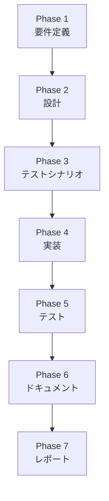

# プロジェクト計画書（Issue #320）

## 1. Issue分析

### 複雑度: 中程度
- 既存のワークフローに新しい機能を追加する
- 全フェーズを一括実行する新しいロジックの実装が必要
- 現在のコードベースを大幅に変更する必要はない

### 見積もり工数: 16-24時間
- 基本実装: 4-6時間
- エラーハンドリング: 3-4時間
- 進捗表示・ログ出力: 3-4時間
- テストコード: 4-6時間
- ドキュメンテーション: 2-4時間

### リスク評価: 中
- 技術的複雑さがある
- 全フェーズの実行に関する予期せぬエッジケースの可能性
- 既存のワークフローへの影響を最小限に抑える必要がある

## 2. 実装戦略判断

### 実装戦略: EXTEND
理由:
- 既存のmain.pyに新しいオプションと関数を追加
- 現在のワークフロー実行ロジックを拡張
- コアとなるフェーズ実行メカニズムは変更しない

### テスト戦略: UNIT_INTEGRATION
理由:
- 新しい関数の単体テストが必要
- フェーズ間の連携を確認するインテグレーションテスト
- エラーケースと正常系の両方をカバーする必要がある

### テストコード戦略: BOTH_TEST
理由:
- 既存のテストファイルに追加のテストケース
- 新規のテストファイルを作成して全フェーズ実行のテストをカバー

## 3. 影響範囲分析

変更が必要なファイル:
- `main.py`
- `ai_workflow/workflow.py`
- `tests/test_workflow.py`

依存関係の変更:
- 新しいコマンドラインオプション `--phase all`
- 全フェーズ実行のロジックを追加

## 4. タスク分割

### Phase 1: 要件定義 (4h)
- [ ] 全フェーズ一括実行の詳細要件の明確化
- [ ] コマンドライン引数の仕様検討
- [ ] エラーハンドリングの要件定義

### Phase 2: 設計 (4h)
- [ ] `execute_all_phases()` 関数の設計
- [ ] エラーケースの設計
- [ ] 進捗表示・ログ出力の設計
- [ ] テスト戦略の詳細設計

### Phase 3: テストシナリオ (3h)
- [ ] 正常系テストケースの作成
- [ ] エラーケースのテストシナリオ設計
- [ ] エッジケースの洗い出し

### Phase 4: 実装 (6h)
- [ ] `main.py` に `--phase all` オプションの追加
- [ ] `execute_all_phases()` 関数の実装
- [ ] エラーハンドリングロジックの実装
- [ ] 進捗表示・ログ出力機能の実装

### Phase 5: テスト (4h)
- [ ] 単体テストの実装
- [ ] インテグレーションテストの実装
- [ ] エラーケースのテスト
- [ ] カバレッジ確認と追加テスト

### Phase 6: ドキュメント (2h)
- [ ] READMEに新機能の使用方法を追記
- [ ] CLIリファレンスの更新
- [ ] コードコメントの追加

### Phase 7: レポート (1h)
- [ ] 実装の振り返り
- [ ] 今後の改善点の洗い出し
- [ ] 教訓の文書化

## 5. 依存関係

## 6. リスクと軽減策

### リスク1: フェーズ実行の予期せぬエラー
- **影響度**: 中
- **確率**: 中
- **軽減策**:
  - 詳細なエラーハンドリング
  - ロールバックメカニズムの実装
  - 各フェーズの独立性を高める

### リスク2: パフォーマンスと長時間実行
- **影響度**: 低
- **確率**: 中
- **軽減策**:
  - タイムアウト機能の追加
  - 進捗表示による透明性確保
  - リソース消費のモニタリング

## 7. 品質ゲート

### Phase 1: 要件定義
- [x] 機能要件が明確に記載されている
- [x] 受け入れ基準が定義されている

### Phase 2: 設計
- [x] 実装戦略の判断根拠が明記されている
- [x] テスト戦略の判断根拠が明記されている
- [x] エラーハンドリングの設計が詳細

### Phase 3: テストシナリオ
- [x] テストケースが網羅的
- [x] エラーケースが考慮されている

### Phase 4: 実装
- [x] コーディング規約に従っている
- [x] 設計書に沿った実装

### Phase 5: テスト
- [x] テストカバレッジが十分
- [x] 全テストケースのパス

### Phase 6: ドキュメント
- [x] READMEが更新されている
- [x] 使用例が明確に記載

### Phase 7: レポート
- [x] 実装の振り返りが行われている
- [x] 改善点が明確