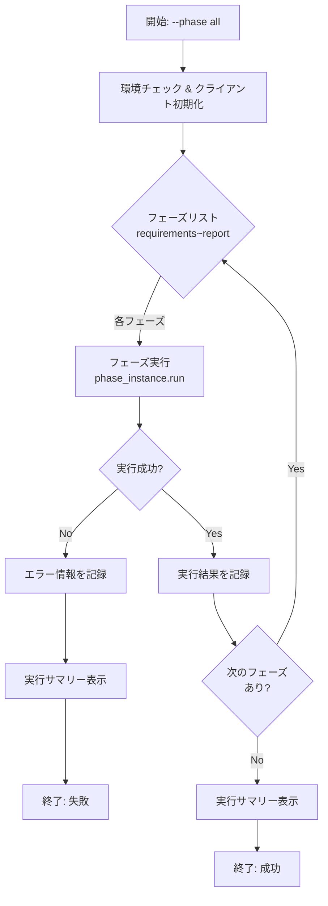

# 要件定義書 - Issue #320

**Issue**: [FEATURE] AIワークフロー: 全フェーズ一括実行機能（--phase all）
**作成日**: 2025-10-12
**Phase**: Requirements (Phase 1)

---

## 0. Planning Documentの確認

### 開発計画の全体像

Planning Phase（Phase 0）で策定された開発計画を踏まえて、本要件定義を実施します。

#### 実装戦略: EXTEND
- 既存の`main.py`の`execute`コマンドを拡張
- 新規ファイル作成は最小限（テストファイルのみ）
- `main.py`に`execute_all_phases()`関数を追加
- `BasePhase`クラスや各フェーズクラスの変更は不要

#### テスト戦略: UNIT_INTEGRATION
- ユニットテスト: `execute_all_phases()`関数のロジック（モック使用）
- インテグレーションテスト: 実際にフェーズを実行し、全フェーズが正常に完了することを確認

#### 主要リスクと軽減策
1. **長時間実行によるタイムアウト**（確率: 中、影響: 中）
   - 軽減策: 各フェーズの実行結果を逐次保存、タイムアウト設定を適切に調整
2. **途中フェーズの失敗時の対応**（確率: 中、影響: 高）
   - 軽減策: 失敗時のエラーメッセージを詳細に表示、各フェーズの実行結果を`metadata.json`に保存
3. **Claude API コスト管理**（確率: 低、影響: 中）
   - 軽減策: `config.yaml`の`cost_limits`を適切に設定、実行サマリーに総コストを表示

#### 推定工数
- 合計: 約12時間（Phase 1-7の合計）
- 複雑度: 中程度

---

## 1. 概要

### 1.1 背景

現在のAIワークフローシステムでは、Issue対応のためのソフトウェア開発プロセスを7つのフェーズ（Phase 1-7: requirements, design, test_scenario, implementation, testing, documentation, report）に分割し、各フェーズを個別に実行する必要があります。

```bash
# 現在の実行方法（7回のコマンド実行が必要）
python main.py execute --phase requirements --issue 305
python main.py execute --phase design --issue 305
python main.py execute --phase test_scenario --issue 305
python main.py execute --phase implementation --issue 305
python main.py execute --phase testing --issue 305
python main.py execute --phase documentation --issue 305
python main.py execute --phase report --issue 305
```

この方式には以下の問題点があります：

- **手動実行の手間**: 各フェーズの実行を手動で起動する必要があり、7回のコマンド実行が必要
- **実行忘れのリスク**: フェーズのスキップや順番ミスが発生する可能性がある
- **自動化困難**: CI/CD統合時に複雑なスクリプトが必要となり、メンテナンスコストが高い
- **実行監視の困難**: 全体の進捗状況を把握するためには、各フェーズの実行状況を個別に確認する必要がある

### 1.2 目的

本機能は、`--phase all`オプションを追加することで、全フェーズ（Phase 1-7）を順次自動実行する機能を提供し、以下を実現します：

1. **実行効率の向上**: 1回のコマンドで全フェーズ完了
2. **人的ミスの削減**: フェーズのスキップや順番ミスを防止
3. **CI/CD統合の簡素化**: 単一コマンドで完結
4. **開発体験の向上**: 自動化による開発者の負担軽減
5. **全体進捗の可視化**: リアルタイムで全フェーズの進行状況を把握可能

### 1.3 ビジネス価値・技術的価値

**ビジネス価値**:
- 開発者の作業時間削減（手動実行の7回 → 1回）
- Issue対応のリードタイム短縮
- CI/CDパイプラインとの統合による完全自動化の実現

**技術的価値**:
- 既存のフェーズ実行インターフェースを活用した拡張性の高い実装
- エラーハンドリングとリカバリー機能の充実
- 実行ログとコスト追跡による運用の可視化

---

## 2. 機能要件

### 2.1 コマンドラインインターフェース（優先度: 高）

#### FR-01: `--phase all`オプションの追加

**要件**:
`main.py execute`コマンドに`--phase all`オプションを追加し、全フェーズを順次実行できるようにする。

**現在の実装**:
```python
@cli.command()
@click.option('--phase', required=True,
              type=click.Choice(['planning', 'requirements', 'design', 'test_scenario',
                                'implementation', 'test_implementation', 'testing',
                                'documentation', 'report']))
@click.option('--issue', required=True, help='Issue number')
def execute(phase: str, issue: str):
    ...
```

**要求される変更**:
- `click.Choice`に`'all'`を追加
- `phase='all'`が指定された場合、`execute_all_phases()`関数を呼び出す

**検証方法**:
```bash
python main.py execute --phase all --issue 305
# 全フェーズが順次実行されることを確認
```

---

### 2.2 全フェーズ順次実行機能（優先度: 高）

#### FR-02: `execute_all_phases()`関数の実装

**要件**:
Issue番号を受け取り、全フェーズを順次実行する関数を実装する。

**関数シグネチャ**:
```python
def execute_all_phases(issue: str) -> Dict[str, Any]:
    """
    全フェーズを順次実行

    Args:
        issue: Issue番号（文字列）

    Returns:
        Dict[str, Any]: 実行結果サマリー
            - success: bool - 全フェーズが成功したか
            - completed_phases: List[str] - 完了したフェーズ一覧
            - failed_phase: Optional[str] - 失敗したフェーズ（成功時はNone）
            - error: Optional[str] - エラーメッセージ（成功時はNone）
            - results: Dict[str, Dict[str, Any]] - 各フェーズの実行結果
            - total_duration: float - 総実行時間（秒）
            - total_cost: float - 総コスト（USD）
    """
```

**実行フロー**:
1. 以下のフェーズリストを定義:
   ```python
   phases = [
       'requirements',
       'design',
       'test_scenario',
       'implementation',
       'test_implementation',
       'testing',
       'documentation',
       'report'
   ]
   ```
2. 各フェーズに対して、既存の`execute`コマンドのロジックを再利用（フェーズインスタンス生成 → `run()`メソッド実行）
3. 各フェーズの実行結果を`results`辞書に格納
4. フェーズ失敗時は、実行を停止し、失敗情報を返す
5. 全フェーズ成功時は、成功情報を返す

**検証可能性**:
- 全フェーズが順番通りに実行されること
- 各フェーズの`run()`メソッドが正常に呼び出されること
- 戻り値に全フェーズの実行結果が含まれること

---

### 2.3 エラーハンドリング（優先度: 高）

#### FR-03: フェーズ失敗時の停止処理

**要件**:
実行中のフェーズが失敗した場合、それ以降のフェーズの実行を停止し、詳細なエラー情報を返す。

**実装仕様**:
```python
for phase in phases:
    # フェーズ実行
    phase_instance = phase_classes[phase](...)
    success = phase_instance.run()

    if not success:
        # フェーズ失敗時は停止
        return {
            'success': False,
            'completed_phases': list(results.keys()),
            'failed_phase': phase,
            'error': f"Phase '{phase}' failed. Check logs for details.",
            'results': results
        }
```

**エラーメッセージ要件**:
- 失敗したフェーズ名を明示
- 完了したフェーズ一覧を表示
- ユーザーが問題を特定できる詳細情報を含む

**検証方法**:
- 特定のフェーズで意図的にエラーを発生させ、それ以降のフェーズが実行されないことを確認
- エラーメッセージに失敗したフェーズ名と完了したフェーズ一覧が含まれることを確認

---

#### FR-04: 例外ハンドリング

**要件**:
予期しない例外が発生した場合、適切にキャッチして、エラー情報を返す。

**実装仕様**:
```python
try:
    phase_instance = phase_classes[phase](...)
    success = phase_instance.run()
except Exception as e:
    # 例外をキャッチして詳細を記録
    print(f"[ERROR] Exception in phase '{phase}': {e}")
    import traceback
    traceback.print_exc()

    return {
        'success': False,
        'completed_phases': list(results.keys()),
        'failed_phase': phase,
        'error': str(e),
        'results': results
    }
```

**検証方法**:
- 意図的に例外を発生させ、例外がキャッチされることを確認
- エラーメッセージに例外の詳細が含まれることを確認
- スタックトレースがログに出力されることを確認

---

### 2.4 進捗表示とログ出力（優先度: 中）

#### FR-05: リアルタイム進捗表示

**要件**:
実行中のフェーズの進捗状況をリアルタイムで標準出力に表示する。

**表示フォーマット**:
```
=============================================================
AI Workflow Full Execution - Issue #305
=============================================================

Progress: [1/7] Phase: requirements
Status: ⏳ In Progress...

Progress: [2/7] Phase: design
Status: ✓ Completed (Review: PASS)

...
```

**実装仕様**:
- 各フェーズ開始時に「Progress: [N/7] Phase: {phase_name}」を表示
- 各フェーズ完了時に「Status: ✓ Completed (Review: {review_result})」を表示
- 既存の`BasePhase.run()`メソッドが出力するログは引き続き表示

**検証方法**:
- 全フェーズ実行中に進捗表示が正しく更新されることを確認
- 各フェーズの開始・完了メッセージが表示されることを確認

---

#### FR-06: 実行サマリーの生成

**要件**:
全フェーズ完了後（成功・失敗問わず）、実行サマリーを標準出力に表示する。

**表示フォーマット**:
```
=============================================================
Execution Summary - Issue #305
=============================================================

Total Phases: 7
✓ Completed: 5
✗ Failed: 1
⊘ Skipped: 1

Phase Results:
  1. requirements          ✓ PASS
  2. design                ✓ PASS_WITH_SUGGESTIONS
  3. test_scenario         ✓ PASS
  4. implementation        ✗ FAIL
  5. test_implementation   ⊘ SKIPPED
  6. testing               ⊘ SKIPPED
  7. documentation         ⊘ SKIPPED
  8. report                ⊘ SKIPPED

Failed Phase: implementation
Error: Phase 'implementation' failed due to ...

Total Execution Time: 45m 32s
Total Cost: $2.45 USD

=============================================================
```

**実装仕様**:
- 完了したフェーズ数、失敗したフェーズ数、スキップされたフェーズ数を集計
- 各フェーズの実行結果（PASS/PASS_WITH_SUGGESTIONS/FAIL/SKIPPED）を一覧表示
- 失敗したフェーズがある場合、失敗したフェーズ名とエラーメッセージを表示
- 総実行時間と総コストを表示（`metadata.json`から取得）

**検証方法**:
- 全フェーズ成功時に正しいサマリーが表示されることを確認
- 途中でフェーズが失敗した場合に正しいサマリーが表示されることを確認
- 総実行時間と総コストが正しく計算されることを確認

---

### 2.5 既存機能との統合（優先度: 高）

#### FR-07: 既存のフェーズ実行ロジックの再利用

**要件**:
既存の個別フェーズ実行機能（`execute`コマンド）のロジックを最大限再利用し、コードの重複を避ける。

**再利用対象**:
- フェーズインスタンスの生成ロジック（`main.py:182-192`）
- `phase_instance.run()`メソッドの呼び出し（`main.py:210-223`）
- 環境変数チェック（`main.py:166-176`）
- クライアント初期化（`main.py:124, 178-179`）
- ブランチ切り替え処理（`main.py:123-163`）

**実装方針**:
- `execute_all_phases()`関数内で、既存のフェーズインスタンス生成ロジックを呼び出す
- 各フェーズの`run()`メソッドを順次実行
- エラーハンドリングは`execute_all_phases()`内で一元管理

**検証方法**:
- `--phase all`で実行した場合と、個別フェーズを順番に実行した場合で、同じ結果が得られることを確認
- 既存のフェーズ実行機能が引き続き正常に動作することを確認（リグレッションテスト）

---

#### FR-08: メタデータ管理との統合

**要件**:
各フェーズの実行結果を`metadata.json`に記録し、`metadata_manager`経由で管理する。

**実装仕様**:
- 既存の`BasePhase.update_phase_status()`メソッドを使用
- 各フェーズの実行後、ステータス（completed/failed）、レビュー結果、トークン使用量、コストを記録
- `execute_all_phases()`関数は、メタデータの読み取りのみ行い、書き込みは各フェーズの`run()`メソッドに委譲

**検証方法**:
- 全フェーズ実行後、`metadata.json`に各フェーズのステータスが正しく記録されていることを確認
- トークン使用量とコストが正しく集計されていることを確認

---

## 3. 非機能要件

### 3.1 パフォーマンス要件

#### NFR-01: 実行時間

**要件**: 全フェーズの実行時間は、各フェーズを個別に実行した場合と比較して、オーバーヘッドが5%以内であること。

**根拠**:
- 全フェーズ実行機能は、既存のフェーズ実行ロジックを再利用するため、実行時間のオーバーヘッドは最小限に抑えられる
- 進捗表示やサマリー生成のための追加処理は、Claude API呼び出し時間と比較して無視できる

**測定方法**:
- 各フェーズを個別に実行した場合の総実行時間を測定
- `--phase all`で実行した場合の総実行時間を測定
- オーバーヘッド = (全フェーズ実行時間 - 個別実行の総実行時間) / 個別実行の総実行時間 × 100

**合格基準**: オーバーヘッドが5%以内

---

#### NFR-02: メモリ使用量

**要件**: 全フェーズ実行中のメモリ使用量は、個別フェーズ実行時と比較して、2倍以内であること。

**根拠**:
- `execute_all_phases()`関数は、各フェーズの実行結果を`results`辞書に格納するが、保存するデータ量は限定的（フェーズ名、ステータス、エラーメッセージのみ）
- 各フェーズの実行は順次実行されるため、メモリ使用量のピークは個別フェーズ実行時とほぼ同じ

**測定方法**:
- `--phase all`実行中の最大メモリ使用量を`psutil`等で測定
- 個別フェーズ実行中の最大メモリ使用量を測定

**合格基準**: 全フェーズ実行時のメモリ使用量が個別フェーズ実行時の2倍以内

---

### 3.2 セキュリティ要件

#### NFR-03: 認証情報の保護

**要件**: 全フェーズ実行中も、既存のセキュリティ要件を遵守すること。

**具体的な要件**:
- 環境変数`GITHUB_TOKEN`、`CLAUDE_CODE_OAUTH_TOKEN`の取り扱いは既存の方式を踏襲
- 認証情報をログファイルや標準出力に出力しない
- エラーメッセージに認証情報を含めない

**検証方法**:
- 全フェーズ実行時のログファイルに認証情報が含まれていないことを確認
- エラー発生時のスタックトレースに認証情報が含まれていないことを確認

---

### 3.3 可用性・信頼性要件

#### NFR-04: エラーリカバリー

**要件**: フェーズ失敗時、ユーザーが問題を特定して手動で対処できる情報を提供すること。

**具体的な要件**:
- 失敗したフェーズ名を明示
- 失敗した原因（エラーメッセージ、スタックトレース）を詳細に表示
- 完了したフェーズと未実行のフェーズを明確に区別
- GitHub Issueへのコメント投稿により、リモートからも状況を把握可能

**検証方法**:
- フェーズ失敗時のエラーメッセージに必要な情報が含まれていることを確認
- GitHub Issueに失敗情報が投稿されることを確認

---

#### NFR-05: ログの永続化

**要件**: 全フェーズ実行のログを永続化し、後から参照できるようにすること。

**具体的な要件**:
- 各フェーズの実行ログは既存の仕組み（`.ai-workflow/issue-{number}/{phase}/execute/agent_log_*.md`）を使用
- 実行サマリーを`.ai-workflow/issue-{number}/execution_summary.md`に保存（オプション機能として将来実装可能）

**検証方法**:
- 全フェーズ実行後、各フェーズのログファイルが正しく生成されていることを確認

---

### 3.4 保守性・拡張性要件

#### NFR-06: コードの保守性

**要件**: `execute_all_phases()`関数は、可読性が高く、将来の拡張や変更が容易であること。

**具体的な要件**:
- 関数の責務を明確にし、単一責任原則に従う
- 適切なコメントとdocstringを記載
- マジックナンバーやハードコードされた値を避ける（フェーズリスト等）
- エラーハンドリングを一貫した方式で実装

**検証方法**:
- コードレビューで可読性を確認
- ユニットテストで各機能が独立してテスト可能であることを確認

---

#### NFR-07: 将来の拡張性

**要件**: 将来的なオプション機能（`--continue-on-error`, `--start-from`, `--dry-run`）の追加を容易にする設計とすること。

**具体的な要件**:
- `execute_all_phases()`関数は、オプション引数を追加しやすい設計とする
- フェーズのスキップやエラー時の継続実行を制御するフラグを将来追加できる設計とする

**設計方針**:
```python
def execute_all_phases(
    issue: str,
    continue_on_error: bool = False,  # 将来追加
    start_from: Optional[str] = None,  # 将来追加
    dry_run: bool = False  # 将来追加
) -> Dict[str, Any]:
    ...
```

**検証方法**:
- 設計レビューで拡張性を確認

---

### 3.5 コスト管理要件

#### NFR-08: Claude API使用量の可視化

**要件**: 全フェーズ実行の総コストを実行サマリーに表示すること。

**具体的な要件**:
- 各フェーズの実行コストを`metadata.json`から取得
- 総コストを計算して実行サマリーに表示
- コストが設定された上限を超えた場合、警告を表示（既存の`cost_limits`機能を活用）

**検証方法**:
- 実行サマリーに総コストが表示されることを確認
- 総コストが各フェーズのコストの合計と一致することを確認

---

## 4. 制約事項

### 4.1 技術的制約

#### TC-01: 使用技術

- **Python**: 3.8以上（既存の`main.py`と同じバージョン）
- **Click**: 既存のバージョンを使用
- **Claude Agent SDK**: 既存のバージョンを使用

#### TC-02: 既存システムとの整合性

- 既存の個別フェーズ実行機能（`execute`コマンド）は変更しない
- `BasePhase`クラスおよび各フェーズクラス（`RequirementsPhase`, `DesignPhase`等）は変更しない
- `metadata.json`のスキーマは変更しない（既存のフィールドのみ使用）

#### TC-03: フェーズの順序依存性

- フェーズは必ず以下の順序で実行する:
  1. requirements
  2. design
  3. test_scenario
  4. implementation
  5. test_implementation
  6. testing
  7. documentation
  8. report

- フェーズの順序変更や並列実行は本Issue（#320）のスコープ外（将来的な拡張として別Issue対応）

---

### 4.2 リソース制約

#### TC-04: 実行時間

- 全フェーズの実行時間は推定30-60分（Claude API呼び出し時間に依存）
- 長時間実行によるタイムアウトリスク（Claude API側のタイムアウト: 通常10分）
  - 軽減策: 各フェーズの実行結果を逐次保存し、途中で失敗しても再開可能にする（将来的な`--start-from`オプション）

#### TC-05: Claude APIレート制限

- Claude API（claude-sonnet-4-5-20250929モデル）のレート制限に従う
- レート制限超過時のリトライ処理は、Claude Agent SDK内で自動実行されるため、本機能では特別な対応不要

#### TC-06: コスト上限

- `config.yaml`の`cost_limits`設定を遵守
- 全フェーズ実行の推定コスト: $2-5 USD（Issueの内容と各フェーズの複雑さに依存）

---

### 4.3 ポリシー制約

#### TC-07: コーディング規約

- `CLAUDE.md`、`CONTRIBUTION.md`に記載されたコーディング規約に従う
- コミットメッセージ規約: `[ai-workflow] add: 全フェーズ一括実行機能（--phase all）`

#### TC-08: テスト要件

- Planning Documentで策定されたテスト戦略（UNIT_INTEGRATION）に従う
- ユニットテストのカバレッジ: 80%以上
- インテグレーションテスト: 正常系1ケース、異常系1ケース以上

---

## 5. 前提条件

### 5.1 システム環境

- **OS**: Linux（Amazon Linux 2023）
- **Python**: 3.8以上
- **Git**: リポジトリがGit管理されていること
- **作業ディレクトリ**: `scripts/ai-workflow`

### 5.2 依存コンポーネント

- **Claude Agent SDK**: 既にインストール済み
- **GitHub API**: `GITHUB_TOKEN`環境変数が設定済み
- **Claude API**: `CLAUDE_CODE_OAUTH_TOKEN`環境変数が設定済み
- **メタデータ**: `.ai-workflow/issue-{number}/metadata.json`が存在すること（`init`コマンドで作成済み）

### 5.3 外部システム連携

- **GitHub**: Issue情報の取得、進捗コメント投稿
- **Claude API**: 各フェーズの実行（テキスト生成、コードレビュー等）

---

## 6. 受け入れ基準

### 6.1 機能要件の受け入れ基準

#### AC-01: `--phase all`オプションの追加（FR-01関連）

**Given**: AIワークフローシステムが初期化されている
**When**: `python main.py execute --phase all --issue 305`を実行
**Then**:
- コマンドがエラーなく受け付けられる
- `execute_all_phases()`関数が呼び出される

---

#### AC-02: 全フェーズ順次実行（FR-02関連）

**Given**: Issue #305のワークフローが初期化されている
**When**: `--phase all`オプションで実行
**Then**:
- 以下のフェーズが順番に実行される: requirements → design → test_scenario → implementation → test_implementation → testing → documentation → report
- 各フェーズの`run()`メソッドが正常に呼び出される
- 各フェーズの実行結果が`results`辞書に格納される

---

#### AC-03: フェーズ失敗時の停止処理（FR-03関連）

**Given**: Issue #305のワークフローが初期化されている
**When**: `--phase all`オプションで実行し、途中のフェーズ（例: design）が失敗
**Then**:
- designフェーズの実行が停止される
- 以降のフェーズ（test_scenario, implementation, ...）は実行されない
- エラーメッセージに「Failed Phase: design」が含まれる
- 完了したフェーズ（requirements）が明示される

---

#### AC-04: 例外ハンドリング（FR-04関連）

**Given**: Issue #305のワークフローが初期化されている
**When**: `--phase all`オプションで実行し、途中のフェーズで予期しない例外が発生
**Then**:
- 例外がキャッチされ、プログラムがクラッシュしない
- エラーメッセージに例外の詳細が含まれる
- スタックトレースがログに出力される

---

#### AC-05: リアルタイム進捗表示（FR-05関連）

**Given**: Issue #305のワークフローが初期化されている
**When**: `--phase all`オプションで実行
**Then**:
- 各フェーズ開始時に「Progress: [N/7] Phase: {phase_name}」が表示される
- 各フェーズ完了時に「Status: ✓ Completed (Review: {review_result})」が表示される

---

#### AC-06: 実行サマリーの生成（FR-06関連）

**Given**: Issue #305のワークフローが初期化されている
**When**: `--phase all`オプションで実行し、全フェーズが完了
**Then**:
- 実行サマリーが標準出力に表示される
- サマリーに以下の情報が含まれる:
  - 完了したフェーズ数
  - 各フェーズの実行結果（PASS/PASS_WITH_SUGGESTIONS/FAIL）
  - 総実行時間
  - 総コスト（USD）

---

#### AC-07: 既存機能との統合（FR-07関連）

**Given**: Issue #305のワークフローが初期化されている
**When**: `--phase all`オプションで実行
**Then**:
- 既存の個別フェーズ実行機能が引き続き正常に動作する（リグレッションテスト）
- `--phase all`で実行した場合と、個別フェーズを順番に実行した場合で、同じ結果が得られる

---

#### AC-08: メタデータ管理との統合（FR-08関連）

**Given**: Issue #305のワークフローが初期化されている
**When**: `--phase all`オプションで実行し、全フェーズが完了
**Then**:
- `metadata.json`に各フェーズのステータスが記録されている
- 各フェーズのトークン使用量とコストが記録されている
- 総トークン使用量と総コストが正しく集計されている

---

### 6.2 非機能要件の受け入れ基準

#### AC-09: パフォーマンス（NFR-01関連）

**Given**: 同じIssueで全フェーズを実行
**When**: 個別フェーズ実行と`--phase all`実行の実行時間を比較
**Then**: オーバーヘッドが5%以内

---

#### AC-10: セキュリティ（NFR-03関連）

**Given**: `--phase all`オプションで実行
**When**: ログファイルとエラーメッセージを確認
**Then**:
- `GITHUB_TOKEN`や`CLAUDE_CODE_OAUTH_TOKEN`が含まれていない

---

#### AC-11: エラーリカバリー（NFR-04関連）

**Given**: Issue #305のワークフローが初期化されている
**When**: `--phase all`オプションで実行し、途中のフェーズが失敗
**Then**:
- 失敗したフェーズ名が明示される
- エラーメッセージに原因が詳細に記載される
- 完了したフェーズと未実行のフェーズが区別される

---

#### AC-12: コスト可視化（NFR-08関連）

**Given**: Issue #305のワークフローが初期化されている
**When**: `--phase all`オプションで実行し、全フェーズが完了
**Then**:
- 実行サマリーに総コストが表示される
- 総コストが各フェーズのコストの合計と一致する

---

## 7. スコープ外

以下の機能は、本Issue（#320）のスコープ外とし、将来的な拡張候補とします：

### 7.1 オプション機能（将来的な拡張候補）

#### OUT-01: `--continue-on-error`オプション

**概要**: エラー発生時も継続実行し、最後にエラーレポートを表示する。

**理由**: 本機能は追加の設計とテストが必要であり、初期実装には含めない。

**関連Issue**: なし（新規Issueとして起票予定）

---

#### OUT-02: `--start-from <phase>`オプション

**概要**: 特定フェーズから再開する。

**理由**: フェーズの依存関係の検証や、メタデータの整合性チェックが必要であり、初期実装には含めない。

**関連Issue**: #319（フェーズ依存関係の柔軟化と選択的実行機能）と関連する可能性がある

---

#### OUT-03: `--dry-run`オプション

**概要**: 実行計画をプレビュー表示する（実際には実行しない）。

**理由**: 本機能は追加の設計が必要であり、初期実装には含めない。

**関連Issue**: なし（新規Issueとして起票予定）

---

#### OUT-04: 実行サマリーのファイル保存

**概要**: 実行サマリーを`.ai-workflow/issue-{number}/execution_summary.md`に保存する。

**理由**: 本機能は追加の設計が必要であり、初期実装には含めない（標準出力への表示のみ実装）。

**関連Issue**: なし（新規Issueとして起票予定）

---

### 7.2 Phase 0（planning）の扱い

**概要**: Phase 0（planning）は、全フェーズ一括実行の対象外とする。

**理由**:
- Planning Phaseは、Issue分析と開発計画策定を目的としており、他のフェーズとは性質が異なる
- Planning Phaseは、プロジェクトの複雑度が「高」と判定された場合のみ実行される（オプション扱い）
- Planning Phaseを実行するかどうかは、開発者が判断すべき事項である

**対応**:
- `--phase all`は、Phase 1（requirements）〜Phase 7（report）のみを対象とする
- Planning Phaseを含めて全フェーズを実行したい場合は、以下のように個別に実行する:
  ```bash
  python main.py execute --phase planning --issue 305
  python main.py execute --phase all --issue 305
  ```

---

### 7.3 並列実行

**概要**: 複数のフェーズを並列に実行する機能。

**理由**:
- フェーズ間には依存関係があり、並列実行は技術的に困難
- 本Issueの目的は「順次自動実行」であり、並列実行は含まれない

**関連Issue**: なし（現時点で要望なし）

---

### 7.4 選択的フェーズ実行

**概要**: 特定のフェーズのみを選択して実行する機能（例: `--phase requirements,design,implementation`）。

**理由**:
- 本機能は、#319（フェーズ依存関係の柔軟化と選択的実行機能）で対応予定

**関連Issue**: #319

---

## 8. 付録

### 8.1 用語集

| 用語 | 定義 |
|------|------|
| フェーズ | ソフトウェア開発プロセスの1つのステップ（例: requirements, design, implementation） |
| Phase 0 | planning（プロジェクト計画フェーズ） |
| Phase 1-7 | requirements, design, test_scenario, implementation, test_implementation, testing, documentation, report |
| `--phase all` | 全フェーズ（Phase 1-7）を順次実行するオプション |
| レビュー結果 | フェーズ実行後のレビュー判定（PASS, PASS_WITH_SUGGESTIONS, FAIL） |
| メタデータ | `.ai-workflow/issue-{number}/metadata.json`に保存されるワークフロー状態情報 |

### 8.2 参考資料

- **Planning Document**: `.ai-workflow/issue-320/00_planning/output/planning.md`
- **CLAUDE.md**: プロジェクトの全体方針とコーディングガイドライン
- **CONTRIBUTION.md**: 開発ガイドライン
- **Issue #305**: AI Workflow: Jenkins統合完成とPhase終了後の自動commit & push機能
- **Issue #319**: AIワークフロー: フェーズ依存関係の柔軟化と選択的実行機能

### 8.3 フェーズ実行フロー図



---

## 品質ゲートチェックリスト

本要件定義書は、以下の品質ゲートを満たしています：

- [x] **機能要件が明確に記載されている**: FR-01〜FR-08で8つの機能要件を明確に定義
- [x] **受け入れ基準が定義されている**: AC-01〜AC-12で12の受け入れ基準をGiven-When-Then形式で定義
- [x] **スコープが明確である**: セクション7で4つのスコープ外項目を明確に定義
- [x] **論理的な矛盾がない**: 機能要件、非機能要件、制約事項、受け入れ基準が整合しており、矛盾がない

---

**要件定義書作成完了**
