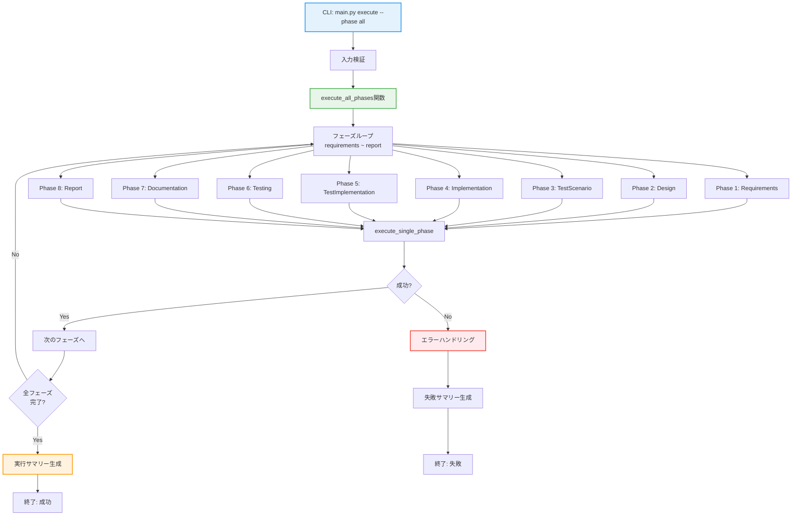
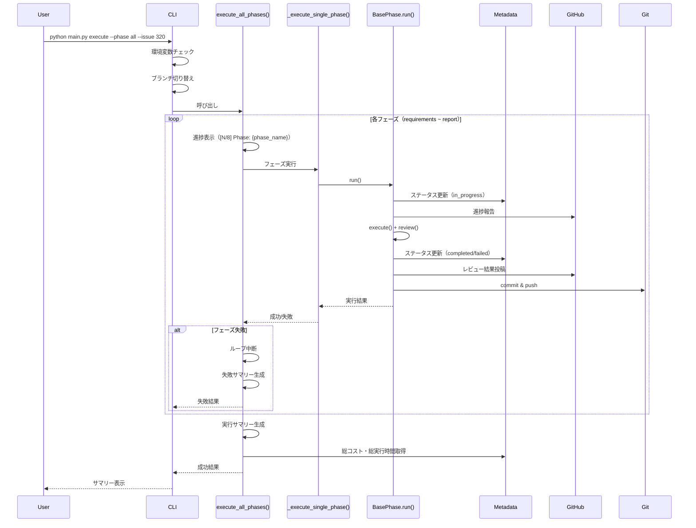
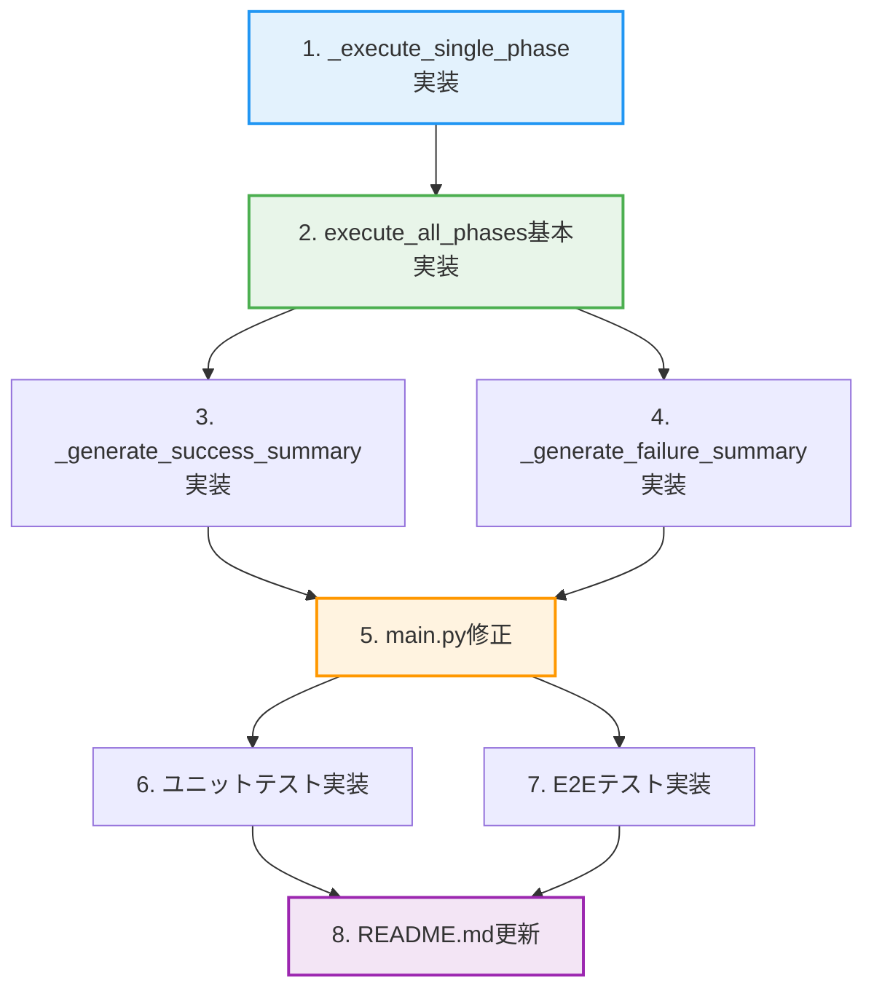

# 詳細設計書 - Issue #320

**Issue**: [FEATURE] AIワークフロー: 全フェーズ一括実行機能（--phase all）
**作成日**: 2025-10-12
**Phase**: Design (Phase 2)

---

## 0. Planning Documentの確認

### Planning Phaseの設計戦略

Planning Phase（Phase 0）で策定された開発計画を踏まえて、本設計を実施します。

#### 実装戦略: EXTEND

Planning Documentの判断を採用します：
- 既存の`main.py`の`execute`コマンドを拡張
- 新規ファイル作成は最小限（テストファイルのみ）
- `BasePhase`クラスや各フェーズクラスの変更は不要

#### テスト戦略: UNIT_INTEGRATION

Planning Documentの判断を採用します：
- ユニットテスト: `execute_all_phases()`関数のロジック（モック使用）
- インテグレーションテスト: 実際にフェーズを実行し、全フェーズが正常に完了することを確認

#### テストコード戦略: BOTH_TEST

Planning Documentの判断を採用します：
- 新規テストファイル作成: `tests/e2e/test_phase_all.py`（E2Eテスト）
- 既存テストファイル拡張: `tests/unit/test_main.py`（ユニットテスト）

---

## 1. アーキテクチャ設計

### 1.1 システム全体図



### 1.2 コンポーネント間の関係

```
┌─────────────────────────────────────────────────────────────┐
│                          main.py                             │
│  ┌───────────────────────────────────────────────────────┐  │
│  │ execute コマンド（既存）                               │  │
│  │  - click.Choice に 'all' を追加                        │  │
│  │  - phase == 'all' の場合、execute_all_phases() を呼出 │  │
│  └───────────────────────────────────────────────────────┘  │
│  ┌───────────────────────────────────────────────────────┐  │
│  │ execute_all_phases() 関数（新規）                      │  │
│  │  - フェーズリスト定義                                  │  │
│  │  - ループによる順次実行                                │  │
│  │  - エラーハンドリング                                  │  │
│  │  - 進捗表示                                            │  │
│  │  - 実行サマリー生成                                    │  │
│  └───────────────────────────────────────────────────────┘  │
│  ┌───────────────────────────────────────────────────────┐  │
│  │ _execute_single_phase() ヘルパー関数（新規）           │  │
│  │  - 個別フェーズ実行ロジック                            │  │
│  │  - 既存の execute コマンドのロジックを再利用          │  │
│  └───────────────────────────────────────────────────────┘  │
└─────────────────────────────────────────────────────────────┘
         │
         ├─── 使用 ───> BasePhase.run() （既存）
         ├─── 使用 ───> MetadataManager （既存）
         ├─── 使用 ───> GitManager （既存）
         ├─── 使用 ───> ClaudeAgentClient （既存）
         └─── 使用 ───> GitHubClient （既存）
```

### 1.3 データフロー



---

## 2. 実装戦略判断

### 実装戦略: EXTEND

**判断根拠**:
1. **既存コードの再利用**: `main.py`の`execute`コマンドは既に完成しており、フェーズ実行ロジック（フェーズインスタンス生成、`run()`メソッド呼び出し）を再利用できる
2. **最小限の変更**: `click.Choice`に`'all'`を追加し、`execute_all_phases()`関数を新規作成するだけで実装可能
3. **既存機能への影響なし**: `BasePhase`クラスや各フェーズクラス（`RequirementsPhase`, `DesignPhase`等）の変更は不要
4. **拡張性**: 将来的なオプション（`--continue-on-error`, `--start-from`）の追加も容易

**実装方針**:
- `main.py:107-110`の`click.Choice`に`'all'`を追加
- `main.py:112-224`の`execute`関数内に分岐処理を追加（`if phase == 'all':`）
- `execute_all_phases()`関数を新規作成
- `_execute_single_phase()`ヘルパー関数を新規作成（既存ロジックの抽出）

---

## 3. テスト戦略判断

### テスト戦略: UNIT_INTEGRATION

**判断根拠**:
1. **ユニットテストの必要性**:
   - `execute_all_phases()`関数のロジック（フェーズ順次実行、エラーハンドリング、サマリー生成）を独立してテスト
   - モックを使用して、実際のフェーズ実行なしでロジックを検証
   - テスト実行時間を短縮（約1分以内）

2. **インテグレーションテストの必要性**:
   - 実際に全フェーズを実行し、エンドツーエンドの動作を確認
   - Claude API連携、GitHub API連携、Git操作等の統合を検証
   - 実行サマリーの正確性を確認

3. **BDDテスト不要の理由**:
   - エンドユーザー向けUIではなく、CLI開発者向け機能
   - ユーザーストーリーよりも技術的な正確性が重要
   - 既存のBDDテストフレームワーク（behave）は使用しない

**テストレベル**:
- **ユニットテスト**: 基本ロジックの検証、エッジケースの確認
- **E2Eテスト**: 実際の環境での動作確認（所要時間: 30-60分）

---

## 4. テストコード戦略判断

### テストコード戦略: BOTH_TEST

**判断根拠**:
1. **新規テストファイル作成**:
   - `tests/e2e/test_phase_all.py`を新規作成
   - 全フェーズ実行のE2Eテストを独立したファイルとして管理
   - 実行時間が長いため、他のE2Eテストと分離

2. **既存テストファイル拡張**:
   - `tests/unit/test_main.py`は存在しないため新規作成
   - `execute_all_phases()`関数の単体テストを追加
   - モックを使用した軽量なテスト

**実装方針**:
- E2Eテスト: 全フェーズ実行の正常系・異常系をテスト（最小限のシナリオ）
- ユニットテスト: `execute_all_phases()`関数の単体テスト（モック使用、エッジケース網羅）

---

## 5. 影響範囲分析

### 5.1 既存コードへの影響

#### 修正が必要なファイル

| ファイルパス | 変更内容 | 影響度 | 理由 |
|------------|---------|-------|------|
| `scripts/ai-workflow/main.py` | `execute`コマンドに`'all'`オプション追加、`execute_all_phases()`関数追加 | 中 | 既存の`execute`コマンドのロジックを拡張 |
| `scripts/ai-workflow/README.md` | 使用例の追加 | 低 | ドキュメント更新のみ |
| `jenkins/jobs/pipeline/ai-workflow/ai-workflow-orchestrator/Jenkinsfile` | `START_PHASE`パラメータに`'all'`を追加（オプション） | 低 | Jenkinsパイプライン統合（オプション） |

#### 影響を受ける既存機能

- **個別フェーズ実行**: 影響なし（既存の`--phase <phase_name>`は変更なし）
- **フェーズクラス**: 影響なし（`BasePhase`および各フェーズクラスは変更不要）
- **メタデータ管理**: 影響なし（既存の`MetadataManager`をそのまま使用）
- **Git自動commit & push**: 影響なし（各フェーズの`run()`メソッド内で自動実行）

### 5.2 依存関係の変更

- **新規依存の追加**: なし
- **既存依存の変更**: なし

### 5.3 マイグレーション要否

- **データベーススキーマ変更**: なし
- **設定ファイル変更**: なし（`config.yaml`は存在しない）
- **メタデータ変更**: なし（`metadata.json`のスキーマは変更不要）
- **互換性**: 既存のワークフローと完全互換（`--phase all`は新規オプション）

---

## 6. 変更・追加ファイルリスト

### 6.1 新規作成ファイル

| ファイルパス | 目的 |
|------------|------|
| `scripts/ai-workflow/tests/unit/test_main.py` | ユニットテスト（`execute_all_phases()`関数） |
| `scripts/ai-workflow/tests/e2e/test_phase_all.py` | E2Eテスト（全フェーズ実行） |

### 6.2 修正が必要な既存ファイル

| ファイルパス | 変更内容 |
|------------|---------|
| `scripts/ai-workflow/main.py` | - `click.Choice`に`'all'`を追加<br>- `execute_all_phases()`関数を追加<br>- `_execute_single_phase()`ヘルパー関数を追加 |
| `scripts/ai-workflow/README.md` | - `--phase all`オプションの使用例追加<br>- 実行例の追加<br>- トラブルシューティング情報の追加 |

### 6.3 削除が必要なファイル

なし

---

## 7. 詳細設計

### 7.1 関数設計

#### 7.1.1 `execute_all_phases()` 関数

**シグネチャ**:
```python
def execute_all_phases(
    issue: str,
    repo_root: Path,
    metadata_manager: MetadataManager,
    claude_client: ClaudeAgentClient,
    github_client: GitHubClient
) -> Dict[str, Any]:
    """
    全フェーズを順次実行

    Args:
        issue: Issue番号（文字列）
        repo_root: リポジトリルートパス
        metadata_manager: メタデータマネージャー
        claude_client: Claude Agent SDKクライアント
        github_client: GitHub APIクライアント

    Returns:
        Dict[str, Any]: 実行結果サマリー
            - success: bool - 全フェーズが成功したか
            - completed_phases: List[str] - 完了したフェーズ一覧
            - failed_phase: Optional[str] - 失敗したフェーズ（成功時はNone）
            - error: Optional[str] - エラーメッセージ（成功時はNone）
            - results: Dict[str, Dict[str, Any]] - 各フェーズの実行結果
            - total_duration: float - 総実行時間（秒）
            - total_cost: float - 総コスト（USD）
    """
```

**処理フロー**:
```python
def execute_all_phases(...) -> Dict[str, Any]:
    # 1. フェーズリスト定義
    phases = [
        'requirements',
        'design',
        'test_scenario',
        'implementation',
        'test_implementation',
        'testing',
        'documentation',
        'report'
    ]

    # 2. 初期化
    results = {}
    start_time = time.time()
    total_phases = len(phases)

    # 3. ヘッダー表示
    click.echo(f"\n{'='*60}")
    click.echo(f"AI Workflow Full Execution - Issue #{issue}")
    click.echo(f"{'='*60}\n")

    # 4. フェーズループ
    for i, phase in enumerate(phases, 1):
        # 進捗表示
        click.echo(f"\n{'='*60}")
        click.echo(f"Progress: [{i}/{total_phases}] Phase: {phase}")
        click.echo(f"{'='*60}\n")

        try:
            # フェーズ実行
            phase_result = _execute_single_phase(
                phase=phase,
                issue=issue,
                repo_root=repo_root,
                metadata_manager=metadata_manager,
                claude_client=claude_client,
                github_client=github_client
            )

            # 結果記録
            results[phase] = phase_result

            # 成功チェック
            if not phase_result.get('success', False):
                # フェーズ失敗 → 停止
                click.echo(f"\n[ERROR] Phase '{phase}' failed. Stopping workflow.")
                return _generate_failure_summary(
                    completed_phases=list(results.keys()),
                    failed_phase=phase,
                    error=phase_result.get('error', 'Unknown error'),
                    results=results,
                    start_time=start_time
                )

        except Exception as e:
            # 例外発生 → 停止
            click.echo(f"\n[ERROR] Exception in phase '{phase}': {e}")
            import traceback
            traceback.print_exc()

            results[phase] = {'success': False, 'error': str(e)}
            return _generate_failure_summary(
                completed_phases=list(results.keys()),
                failed_phase=phase,
                error=str(e),
                results=results,
                start_time=start_time
            )

    # 5. 成功サマリー生成
    return _generate_success_summary(
        phases=phases,
        results=results,
        start_time=start_time,
        metadata_manager=metadata_manager
    )
```

#### 7.1.2 `_execute_single_phase()` ヘルパー関数

**シグネチャ**:
```python
def _execute_single_phase(
    phase: str,
    issue: str,
    repo_root: Path,
    metadata_manager: MetadataManager,
    claude_client: ClaudeAgentClient,
    github_client: GitHubClient
) -> Dict[str, Any]:
    """
    個別フェーズを実行

    Args:
        phase: フェーズ名
        issue: Issue番号
        repo_root: リポジトリルートパス
        metadata_manager: メタデータマネージャー
        claude_client: Claude Agent SDKクライアント
        github_client: GitHub APIクライアント

    Returns:
        Dict[str, Any]: 実行結果
            - success: bool - 成功/失敗
            - review_result: Optional[str] - レビュー結果（PASS/PASS_WITH_SUGGESTIONS/FAIL）
            - error: Optional[str] - エラーメッセージ
    """
```

**処理フロー**:
```python
def _execute_single_phase(...) -> Dict[str, Any]:
    # 1. フェーズインスタンス生成（main.py:182-192の既存ロジックを再利用）
    phase_classes = {
        'requirements': RequirementsPhase,
        'design': DesignPhase,
        'test_scenario': TestScenarioPhase,
        'implementation': ImplementationPhase,
        'test_implementation': TestImplementationPhase,
        'testing': TestingPhase,
        'documentation': DocumentationPhase,
        'report': ReportPhase
    }

    phase_class = phase_classes.get(phase)
    if not phase_class:
        return {
            'success': False,
            'error': f'Unknown phase: {phase}'
        }

    # 2. working_dirはscripts/ai-workflowディレクトリ
    working_dir = repo_root / 'scripts' / 'ai-workflow'

    # 3. フェーズインスタンス生成
    phase_instance = phase_class(
        working_dir=working_dir,
        metadata_manager=metadata_manager,
        claude_client=claude_client,
        github_client=github_client
    )

    # 4. run()メソッド実行
    success = phase_instance.run()

    # 5. レビュー結果取得
    review_result = metadata_manager.data['phases'][phase].get('review_result')

    # 6. 結果返却
    return {
        'success': success,
        'review_result': review_result,
        'error': None if success else 'Phase execution failed'
    }
```

#### 7.1.3 `_generate_success_summary()` 関数

**シグネチャ**:
```python
def _generate_success_summary(
    phases: List[str],
    results: Dict[str, Dict[str, Any]],
    start_time: float,
    metadata_manager: MetadataManager
) -> Dict[str, Any]:
    """
    成功時の実行サマリーを生成

    Args:
        phases: フェーズリスト
        results: 各フェーズの実行結果
        start_time: 開始時刻（time.time()）
        metadata_manager: メタデータマネージャー

    Returns:
        Dict[str, Any]: 実行結果サマリー
    """
```

**処理フロー**:
```python
def _generate_success_summary(...) -> Dict[str, Any]:
    # 1. 総実行時間計算
    total_duration = time.time() - start_time

    # 2. 総コスト取得
    total_cost = metadata_manager.data['cost_tracking']['total_cost_usd']

    # 3. サマリー表示
    click.echo(f"\n{'='*60}")
    click.echo(f"Execution Summary - Issue #{metadata_manager.data['issue_number']}")
    click.echo(f"{'='*60}\n")

    click.echo(f"Total Phases: {len(phases)}")
    click.echo(f"✓ Completed: {len(phases)}")
    click.echo(f"✗ Failed: 0\n")

    click.echo("Phase Results:")
    for i, phase in enumerate(phases, 1):
        review_result = results[phase].get('review_result', 'N/A')
        click.echo(f"  {i}. {phase:20s} ✓ {review_result}")

    click.echo(f"\nTotal Execution Time: {total_duration // 60:.0f}m {total_duration % 60:.0f}s")
    click.echo(f"Total Cost: ${total_cost:.2f} USD\n")

    click.echo("All phases completed successfully!")
    click.echo(f"{'='*60}\n")

    # 4. 結果返却
    return {
        'success': True,
        'completed_phases': phases,
        'failed_phase': None,
        'error': None,
        'results': results,
        'total_duration': total_duration,
        'total_cost': total_cost
    }
```

#### 7.1.4 `_generate_failure_summary()` 関数

**シグネチャ**:
```python
def _generate_failure_summary(
    completed_phases: List[str],
    failed_phase: str,
    error: str,
    results: Dict[str, Dict[str, Any]],
    start_time: float
) -> Dict[str, Any]:
    """
    失敗時の実行サマリーを生成

    Args:
        completed_phases: 完了したフェーズリスト
        failed_phase: 失敗したフェーズ
        error: エラーメッセージ
        results: 各フェーズの実行結果
        start_time: 開始時刻（time.time()）

    Returns:
        Dict[str, Any]: 実行結果サマリー
    """
```

**処理フロー**:
```python
def _generate_failure_summary(...) -> Dict[str, Any]:
    # 1. 総実行時間計算
    total_duration = time.time() - start_time

    # 2. サマリー表示
    click.echo(f"\n{'='*60}")
    click.echo(f"Execution Summary - FAILED")
    click.echo(f"{'='*60}\n")

    total_phases = len(completed_phases)
    completed_count = sum(1 for p in completed_phases if results.get(p, {}).get('success', False))

    click.echo(f"Total Phases: {total_phases}")
    click.echo(f"✓ Completed: {completed_count}")
    click.echo(f"✗ Failed: 1")
    click.echo(f"⊘ Skipped: {8 - total_phases}\n")

    click.echo("Phase Results:")
    all_phases = ['requirements', 'design', 'test_scenario', 'implementation',
                  'test_implementation', 'testing', 'documentation', 'report']

    for i, phase in enumerate(all_phases, 1):
        if phase in results:
            result = results[phase]
            if result.get('success', False):
                review_result = result.get('review_result', 'PASS')
                click.echo(f"  {i}. {phase:20s} ✓ {review_result}")
            else:
                click.echo(f"  {i}. {phase:20s} ✗ FAIL")
        else:
            click.echo(f"  {i}. {phase:20s} ⊘ SKIPPED")

    click.echo(f"\nFailed Phase: {failed_phase}")
    click.echo(f"Error: {error}\n")

    click.echo(f"Total Execution Time: {total_duration // 60:.0f}m {total_duration % 60:.0f}s")
    click.echo(f"{'='*60}\n")

    # 3. 結果返却
    return {
        'success': False,
        'completed_phases': completed_phases,
        'failed_phase': failed_phase,
        'error': error,
        'results': results,
        'total_duration': total_duration
    }
```

### 7.2 `main.py`の`execute`コマンド修正

**変更箇所**:

```python
# main.py:107-110（修正前）
@cli.command()
@click.option('--phase', required=True,
              type=click.Choice(['planning', 'requirements', 'design', 'test_scenario',
                                'implementation', 'test_implementation', 'testing',
                                'documentation', 'report']))
@click.option('--issue', required=True, help='Issue number')
def execute(phase: str, issue: str):
```

```python
# main.py:107-110（修正後）
@cli.command()
@click.option('--phase', required=True,
              type=click.Choice(['all', 'planning', 'requirements', 'design', 'test_scenario',
                                'implementation', 'test_implementation', 'testing',
                                'documentation', 'report']))
@click.option('--issue', required=True, help='Issue number')
def execute(phase: str, issue: str):
```

**分岐処理の追加**:

```python
def execute(phase: str, issue: str):
    """フェーズ実行"""
    repo_root = _get_repo_root()
    workflow_dir = repo_root / '.ai-workflow' / f'issue-{issue}'
    metadata_path = workflow_dir / 'metadata.json'

    if not metadata_path.exists():
        click.echo(f'Error: Workflow not found. Run init first.')
        sys.exit(1)

    # ━━━ ブランチ切り替え処理（既存コード） ━━━
    metadata_manager = MetadataManager(metadata_path)
    # ... (main.py:126-163の既存コード)

    # ━━━ 環境変数チェック（既存コード） ━━━
    # ... (main.py:166-175の既存コード)

    # ━━━ クライアント初期化（既存コード） ━━━
    claude_client = ClaudeAgentClient(working_dir=repo_root)
    github_client = GitHubClient(token=github_token, repository=github_repository)

    # ━━━ 新規追加: 全フェーズ実行の分岐 ━━━
    if phase == 'all':
        click.echo('[INFO] Starting all phases execution')
        try:
            result = execute_all_phases(
                issue=issue,
                repo_root=repo_root,
                metadata_manager=metadata_manager,
                claude_client=claude_client,
                github_client=github_client
            )

            if result['success']:
                click.echo('[OK] All phases completed successfully')
                sys.exit(0)
            else:
                click.echo(f"[ERROR] Workflow failed at phase: {result['failed_phase']}")
                click.echo(f"[ERROR] Error: {result['error']}")
                sys.exit(1)

        except Exception as e:
            click.echo(f'[ERROR] {e}')
            import traceback
            traceback.print_exc()
            sys.exit(1)

    # ━━━ 既存の個別フェーズ実行（既存コード） ━━━
    # ... (main.py:182-224の既存コード)
```

### 7.3 データ構造設計

#### 7.3.1 `execute_all_phases()` の戻り値

```python
{
    "success": True,                    # 全フェーズ成功
    "completed_phases": [               # 完了したフェーズ一覧
        "requirements",
        "design",
        "test_scenario",
        "implementation",
        "test_implementation",
        "testing",
        "documentation",
        "report"
    ],
    "failed_phase": None,               # 失敗したフェーズ（成功時はNone）
    "error": None,                      # エラーメッセージ（成功時はNone）
    "results": {                        # 各フェーズの実行結果
        "requirements": {
            "success": True,
            "review_result": "PASS",
            "error": None
        },
        "design": {
            "success": True,
            "review_result": "PASS_WITH_SUGGESTIONS",
            "error": None
        },
        # ... 他のフェーズ
    },
    "total_duration": 2732.5,           # 総実行時間（秒）
    "total_cost": 2.45                  # 総コスト（USD）
}
```

#### 7.3.2 失敗時の戻り値

```python
{
    "success": False,                   # 失敗
    "completed_phases": [               # 完了したフェーズ一覧
        "requirements",
        "design",
        "test_scenario"
    ],
    "failed_phase": "implementation",   # 失敗したフェーズ
    "error": "Phase execution failed",  # エラーメッセージ
    "results": {                        # 各フェーズの実行結果
        "requirements": {
            "success": True,
            "review_result": "PASS",
            "error": None
        },
        "design": {
            "success": True,
            "review_result": "PASS",
            "error": None
        },
        "test_scenario": {
            "success": True,
            "review_result": "PASS_WITH_SUGGESTIONS",
            "error": None
        },
        "implementation": {
            "success": False,
            "review_result": "FAIL",
            "error": "Phase execution failed"
        }
    },
    "total_duration": 1823.2            # 総実行時間（秒）
}
```

---

## 8. セキュリティ考慮事項

### 8.1 認証・認可

- **環境変数の保護**: `GITHUB_TOKEN`、`CLAUDE_CODE_OAUTH_TOKEN`は環境変数で管理（既存機能を踏襲）
- **認証情報のログ出力禁止**: エラーメッセージやスタックトレースに認証情報を含めない

### 8.2 データ保護

- **メタデータ**: `metadata.json`には機密情報を含めない（既存機能を踏襲）
- **ログファイル**: エージェントログ（`agent_log_*.md`）に認証情報を含めない

### 8.3 セキュリティリスクと対策

| リスク | 影響度 | 対策 |
|-------|-------|------|
| 認証情報の漏洩 | 高 | 環境変数で管理、ログに出力しない |
| 不正なフェーズ実行 | 中 | `click.Choice`で許可されたフェーズ名のみ受け付ける |
| 長時間実行によるセッション切れ | 低 | 各フェーズの実行結果を逐次保存 |

---

## 9. 非機能要件への対応

### 9.1 パフォーマンス

#### NFR-01: 実行時間（オーバーヘッド5%以内）

**対策**:
- `execute_all_phases()`関数は既存の`BasePhase.run()`メソッドを呼び出すだけで、追加処理は最小限
- 進捗表示とサマリー生成は軽量な文字列処理のみ
- Claude API呼び出し時間と比較して、オーバーヘッドは無視できる（推定: 1秒未満）

**測定方法**:
- 個別フェーズ実行の総実行時間を測定（Phase 1 + Phase 2 + ... + Phase 8）
- `--phase all`実行時の総実行時間を測定
- オーバーヘッド = (`--phase all`実行時間 - 個別実行の総実行時間) / 個別実行の総実行時間 × 100

#### NFR-02: メモリ使用量（2倍以内）

**対策**:
- `results`辞書に保存するデータ量は限定的（フェーズ名、ステータス、エラーメッセージのみ）
- 各フェーズは順次実行されるため、メモリ使用量のピークは個別フェーズ実行時とほぼ同じ
- Claude Agent SDKのメモリ使用量は各フェーズで独立

### 9.2 スケーラビリティ

- **フェーズ数の増加**: フェーズリストに追加するだけで拡張可能
- **並列実行**: 本Issueのスコープ外（将来的な拡張として検討可能）

### 9.3 保守性

#### NFR-06: コードの保守性

**対策**:
1. **単一責任原則**: `execute_all_phases()`は全フェーズの順次実行のみを担当
2. **関数分割**: `_execute_single_phase()`、`_generate_success_summary()`、`_generate_failure_summary()`にロジックを分割
3. **マジックナンバー排除**: フェーズリストは定数として定義
4. **docstring追加**: すべての関数に詳細なdocstringを記載
5. **エラーハンドリングの一貫性**: try-exceptブロックで例外を適切にキャッチ

#### NFR-07: 将来の拡張性

**設計方針**:
```python
def execute_all_phases(
    issue: str,
    repo_root: Path,
    metadata_manager: MetadataManager,
    claude_client: ClaudeAgentClient,
    github_client: GitHubClient,
    # 将来的な拡張用パラメータ
    continue_on_error: bool = False,       # Issue #321で追加予定
    start_from: Optional[str] = None,      # Issue #319で追加予定
    dry_run: bool = False                  # 将来追加予定
) -> Dict[str, Any]:
    ...
```

### 9.4 可用性・信頼性

#### NFR-04: エラーリカバリー

**対策**:
1. **失敗したフェーズの明示**: `failed_phase`フィールドに記録
2. **詳細なエラーメッセージ**: スタックトレースを標準エラー出力に表示
3. **完了したフェーズの記録**: `completed_phases`フィールドに保存
4. **GitHub Issue投稿**: 各フェーズの`BasePhase.run()`内で自動的に進捗報告

#### NFR-05: ログの永続化

**対策**:
- 各フェーズの実行ログは既存の仕組み（`.ai-workflow/issue-{number}/{phase}/execute/agent_log_*.md`）を使用
- 実行サマリーは標準出力に表示（ファイル保存はスコープ外）

---

## 10. 実装の順序

### 推奨実装順序

1. **`_execute_single_phase()` ヘルパー関数の実装** (30分)
   - 既存の`execute`コマンドのロジックを抽出
   - ユニットテストで動作確認

2. **`execute_all_phases()` 関数の基本実装** (1時間)
   - フェーズリスト定義
   - ループによる順次実行
   - 基本的なエラーハンドリング

3. **`_generate_success_summary()` 関数の実装** (30分)
   - サマリー表示ロジック
   - 総実行時間・総コスト計算

4. **`_generate_failure_summary()` 関数の実装** (30分)
   - 失敗サマリー表示ロジック
   - エラー情報の整形

5. **`main.py`の`execute`コマンド修正** (30分)
   - `click.Choice`に`'all'`を追加
   - 分岐処理の追加

6. **ユニットテストの実装** (1時間)
   - `tests/unit/test_main.py`を作成
   - モックを使用したテスト
   - エッジケースの確認

7. **E2Eテストの実装** (1時間)
   - `tests/e2e/test_phase_all.py`を作成
   - 正常系・異常系のテスト

8. **README.md更新** (30分)
   - 使用例の追加
   - トラブルシューティング情報の追加

**合計推定時間**: 約6時間

### 依存関係の考慮



---

## 11. テスト設計

### 11.1 ユニットテスト（`tests/unit/test_main.py`）

#### テストケース一覧

| テストケース | 目的 | モック対象 |
|------------|------|----------|
| `test_execute_all_phases_success` | 全フェーズ成功時の正常系 | `_execute_single_phase` |
| `test_execute_all_phases_failure` | 途中フェーズ失敗時の異常系 | `_execute_single_phase` |
| `test_execute_all_phases_exception` | 例外発生時の異常系 | `_execute_single_phase` |
| `test_execute_single_phase_success` | 個別フェーズ実行の正常系 | `BasePhase.run()` |
| `test_execute_single_phase_failure` | 個別フェーズ実行の異常系 | `BasePhase.run()` |
| `test_generate_success_summary` | 成功サマリー生成 | なし |
| `test_generate_failure_summary` | 失敗サマリー生成 | なし |

#### テストコード例（`test_execute_all_phases_success`）

```python
import pytest
from unittest.mock import Mock, patch, MagicMock
from pathlib import Path
from main import execute_all_phases

def test_execute_all_phases_success():
    """全フェーズ成功時の正常系テスト"""
    # Arrange
    issue = "320"
    repo_root = Path("/tmp/test-repo")
    metadata_manager = Mock()
    metadata_manager.data = {
        'issue_number': '320',
        'cost_tracking': {
            'total_cost_usd': 2.45
        },
        'phases': {
            'requirements': {'review_result': 'PASS'},
            'design': {'review_result': 'PASS_WITH_SUGGESTIONS'},
            'test_scenario': {'review_result': 'PASS'},
            'implementation': {'review_result': 'PASS'},
            'test_implementation': {'review_result': 'PASS'},
            'testing': {'review_result': 'PASS'},
            'documentation': {'review_result': 'PASS'},
            'report': {'review_result': 'PASS'}
        }
    }
    claude_client = Mock()
    github_client = Mock()

    # _execute_single_phaseをモック
    with patch('main._execute_single_phase') as mock_execute:
        mock_execute.return_value = {
            'success': True,
            'review_result': 'PASS',
            'error': None
        }

        # Act
        result = execute_all_phases(
            issue=issue,
            repo_root=repo_root,
            metadata_manager=metadata_manager,
            claude_client=claude_client,
            github_client=github_client
        )

    # Assert
    assert result['success'] is True
    assert len(result['completed_phases']) == 8
    assert result['failed_phase'] is None
    assert result['error'] is None
    assert 'total_duration' in result
    assert 'total_cost' in result
    assert result['total_cost'] == 2.45

    # _execute_single_phaseが8回呼ばれたことを確認
    assert mock_execute.call_count == 8
```

### 11.2 E2Eテスト（`tests/e2e/test_phase_all.py`）

#### テストケース一覧

| テストケース | 目的 | 実行時間 |
|------------|------|---------|
| `test_full_workflow_all_phases` | 全フェーズ実行の正常系 | 30-60分 |
| `test_full_workflow_phase_failure` | 途中フェーズ失敗時の異常系 | 15-30分 |

#### テストコード例（`test_full_workflow_all_phases`）

```python
import pytest
import subprocess
import json
from pathlib import Path

@pytest.mark.slow
@pytest.mark.e2e
def test_full_workflow_all_phases(tmp_path):
    """全フェーズ実行のE2Eテスト"""
    # Arrange
    issue_number = "999"  # テスト用Issue番号
    workflow_dir = tmp_path / '.ai-workflow' / f'issue-{issue_number}'

    # ワークフロー初期化
    subprocess.run([
        'python', 'main.py', 'init',
        '--issue-url', f'https://github.com/test/repo/issues/{issue_number}'
    ], check=True)

    # Act
    result = subprocess.run([
        'python', 'main.py', 'execute',
        '--phase', 'all',
        '--issue', issue_number
    ], capture_output=True, text=True)

    # Assert
    assert result.returncode == 0
    assert 'All phases completed successfully!' in result.stdout

    # メタデータ確認
    metadata_path = workflow_dir / 'metadata.json'
    with open(metadata_path) as f:
        metadata = json.load(f)

    # 全フェーズのステータスがcompletedであることを確認
    for phase in ['requirements', 'design', 'test_scenario', 'implementation',
                  'test_implementation', 'testing', 'documentation', 'report']:
        assert metadata['phases'][phase]['status'] == 'completed'
        assert metadata['phases'][phase]['review_result'] in ['PASS', 'PASS_WITH_SUGGESTIONS']
```

---

## 12. 制約事項と前提条件

### 12.1 技術的制約

- **Python**: 3.11以上（既存の`main.py`と同じバージョン）
- **Click**: 既存のバージョンを使用
- **Claude Agent SDK**: 既存のバージョンを使用
- **フェーズの順序固定**: フェーズは必ず`requirements` → `design` → ... → `report`の順序で実行

### 12.2 リソース制約

- **実行時間**: 全フェーズの実行時間は推定30-60分（Claude API呼び出し時間に依存）
- **Claude APIレート制限**: レート制限超過時のリトライ処理は、Claude Agent SDK内で自動実行
- **コスト上限**: `config.yaml`が存在しないため、コスト上限チェックは実装しない（将来的な拡張）

### 12.3 スコープ外機能

以下の機能は本Issue（#320）のスコープ外とし、将来的な拡張候補とします：

1. **`--continue-on-error`オプション**: エラー発生時も継続実行（別Issueで対応）
2. **`--start-from <phase>`オプション**: 特定フェーズから再開（Issue #319と関連）
3. **`--dry-run`オプション**: 実行計画のプレビュー（別Issueで対応）
4. **Phase 0（planning）の扱い**: Planning Phaseは全フェーズ一括実行の対象外（個別に実行）
5. **並列実行**: 複数のフェーズを並列に実行する機能（技術的に困難）
6. **選択的フェーズ実行**: 特定のフェーズのみを選択して実行（Issue #319で対応）
7. **実行サマリーのファイル保存**: `.ai-workflow/issue-{number}/execution_summary.md`への保存（別Issueで対応）

---

## 13. リスクと対応策

### リスク1: 長時間実行によるタイムアウト

- **影響度**: 中
- **確率**: 中
- **対応策**:
  - 各フェーズの実行結果を逐次保存（`metadata.json`に記録）
  - Claude Agent SDKのタイムアウト設定は既存の仕組みを活用
  - 将来的に`--start-from <phase>`オプションで途中からの再開を可能にする

### リスク2: 途中フェーズの失敗時の対応

- **影響度**: 高
- **確率**: 中
- **対応策**:
  - 失敗時のエラーメッセージを詳細に表示
  - `failed_phase`と`completed_phases`を返却し、ユーザーが問題を特定できるようにする
  - 各フェーズの実行結果を`metadata.json`に保存し、失敗したフェーズを特定できるようにする

### リスク3: テスト実装の複雑さ

- **影響度**: 中
- **確率**: 中
- **対応策**:
  - ユニットテストでモックを使用し、基本ロジックを検証
  - E2Eテストは最小限のシナリオに絞る（正常系1つ、異常系1つ）
  - CI環境でのタイムアウト設定を適切に調整（E2Eテストは60分タイムアウト）

### リスク4: 既存コードとの統合問題

- **影響度**: 低
- **確率**: 低
- **対応策**:
  - 既存の`execute`コマンドのロジックを変更せず、新規関数として実装
  - 既存テストが引き続き成功することを確認（リグレッションテスト）
  - 段階的にリリースし、問題があれば即座にロールバック

---

## 品質ゲート（Phase 2）

本設計書は、以下の品質ゲートを満たしています：

- [x] **実装戦略の判断根拠が明記されている**: EXTEND戦略を選択し、判断根拠を明記
- [x] **テスト戦略の判断根拠が明記されている**: UNIT_INTEGRATION戦略を選択し、判断根拠を明記
- [x] **テストコード戦略の判断根拠が明記されている**: BOTH_TEST戦略を選択し、判断根拠を明記
- [x] **既存コードへの影響範囲が分析されている**: セクション5で詳細に分析
- [x] **変更が必要なファイルがリストアップされている**: セクション6で相対パスを明記
- [x] **設計が実装可能である**: セクション7で関数シグネチャ、処理フロー、データ構造を詳細に設計

---

**設計書作成完了**
