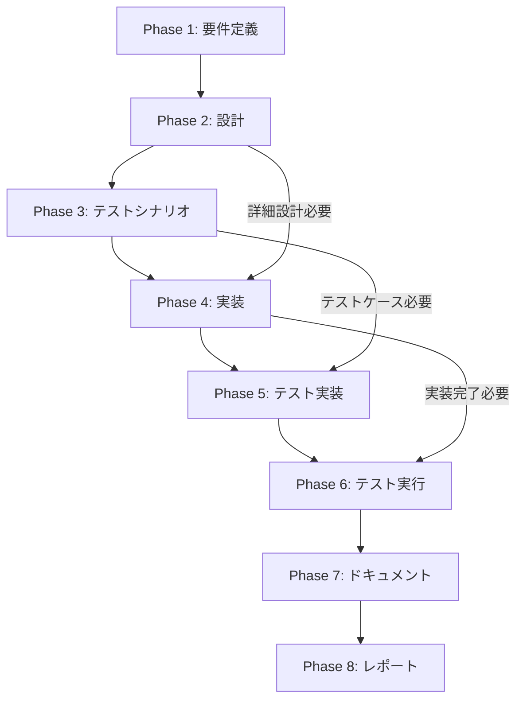

# プロジェクト計画書 - Issue #322

## 1. Issue分析

### 複雑度: 簡単

**判定理由**:
- 単一コンポーネント（GitManager）の機能拡張が中心
- 既存の`_ensure_git_config()`メソッドを拡張するのみ
- JenkinsファイルとJob DSLへのパラメータ追加は定型作業
- main.pyへのCLIオプション追加は小規模な変更
- アーキテクチャ変更や新規サブシステム追加は不要

### 見積もり工数: 3時間

**根拠**:
- GitManager修正: 0.5時間（環境変数読み取りロジック追加、バリデーション）
- Jenkinsfile修正: 0.5時間（パラメータ追加、environment設定）
- Job DSL修正: 0.5時間（stringParam追加）
- main.py修正（オプション）: 0.5時間（CLIオプション追加）
- テスト実装: 0.5時間（ユニットテスト）
- ドキュメント更新: 0.5時間（README、コメント）

### リスク評価: 低

**理由**:
- 既存機能への影響が最小限（環境変数未設定時は従来通り動作）
- 単純な機能追加であり、複雑な条件分岐やエラーハンドリングが不要
- Jenkins環境での動作確認が必要だが、影響範囲が明確
- 後方互換性が保証されている

---

## 2. 実装戦略判断

### 実装戦略: EXTEND

**判断根拠**:
- 既存の`GitManager._ensure_git_config()`メソッドを拡張
- 新規ファイルやクラスの作成は不要
- 既存のロジックを活用しつつ、環境変数読み取り機能を追加
- Jenkinsファイルへのパラメータ追加も既存ファイルの拡張

**具体的な変更箇所**:
- `scripts/ai-workflow/core/git_manager.py` - `_ensure_git_config()`メソッド拡張
- `jenkins/jobs/dsl/ai-workflow/ai_workflow_orchestrator.groovy` - パラメータ追加
- `jenkins/jobs/pipeline/ai-workflow/ai-workflow-orchestrator/Jenkinsfile` - environment設定追加
- `scripts/ai-workflow/main.py` - CLIオプション追加（オプション）

### テスト戦略: UNIT_ONLY

**判断根拠**:
- 環境変数読み取りとGit設定のロジックは純粋な関数処理
- 外部システム（GitHub API、データベース等）との連携なし
- Gitコマンドはモック化して単体テスト可能
- ユニットテストで十分に動作保証できる

**テスト対象**:
- 環境変数が設定されている場合のGit設定
- 環境変数が未設定の場合のデフォルト動作
- バリデーション（メールアドレス形式、ユーザー名長さ）
- ログ出力の確認

### テストコード戦略: EXTEND_TEST

**判断根拠**:
- 既存の`test_git_manager.py`が存在すると仮定
- `_ensure_git_config()`メソッドの既存テストを拡張
- 新規テストケース追加のみで対応可能
- テストファイル構造の変更は不要

**追加テストケース**:
- `test_ensure_git_config_with_env_vars()` - 環境変数設定時
- `test_ensure_git_config_without_env_vars()` - 環境変数未設定時
- `test_ensure_git_config_validation()` - バリデーション

---

## 3. 影響範囲分析

### 既存コードへの影響

**変更が必要なファイル**:

1. **`scripts/ai-workflow/core/git_manager.py`**
   - メソッド: `_ensure_git_config()`
   - 変更内容: 環境変数 `GIT_COMMIT_USER_NAME`, `GIT_COMMIT_USER_EMAIL` の読み取りロジック追加
   - 影響度: 低（既存のデフォルト動作は維持）

2. **`jenkins/jobs/dsl/ai-workflow/ai_workflow_orchestrator.groovy`**
   - 変更内容: `parameters`ブロックに`GIT_COMMIT_USER_NAME`と`GIT_COMMIT_USER_EMAIL`を追加
   - 影響度: 低（既存パラメータに追加するのみ）

3. **`jenkins/jobs/pipeline/ai-workflow/ai-workflow-orchestrator/Jenkinsfile`**
   - 変更内容: `environment`ブロックに環境変数設定を追加
   - 影響度: 低（既存の環境変数に追加するのみ）

4. **`scripts/ai-workflow/main.py`（オプション）**
   - 変更内容: `execute`コマンドに`--git-user`と`--git-email`オプションを追加
   - 影響度: 低（オプション引数のため既存の動作に影響なし）

**影響を受けるモジュール**:
- `GitManager`: コミット処理のみ（他のGit操作には影響なし）
- Jenkins Job: パラメータ入力フォームのみ

### 依存関係の変更

**新規依存の追加**: なし

**既存依存の変更**: なし

### マイグレーション要否

**データベース**: 不要（データベースを使用していない）

**設定ファイル**: 不要（環境変数のみで制御）

**SSMパラメータストア**: 不要（動的に環境変数から読み取る）

---

## 4. タスク分割

### Phase 1: 要件定義 (見積もり: 0.5h)

- **Task 1-1: 機能要件の詳細化**
  - 環境変数の名称確定（`GIT_COMMIT_USER_NAME`, `GIT_COMMIT_USER_EMAIL`）
  - デフォルト値の決定（`AI Workflow Bot`, `ai-workflow@example.com`）
  - バリデーションルールの定義（メールアドレス形式、ユーザー名長さ1-100文字）
  - 完了条件: 環境変数仕様が明確に定義されている

- **Task 1-2: 非機能要件の確認**
  - 後方互換性の保証方法確認
  - ログ出力フォーマットの決定
  - 完了条件: 非機能要件が文書化されている

### Phase 2: 設計 (見積もり: 0.5h)

- **Task 2-1: GitManager設計**
  - `_ensure_git_config()`メソッドの拡張設計
  - 環境変数読み取りロジックのフロー図作成
  - エラーハンドリング方針の決定
  - 完了条件: メソッド仕様が明確に定義されている

- **Task 2-2: Jenkins統合設計**
  - Job DSLパラメータ定義の設計
  - Jenkinsfile環境変数設定の設計
  - 完了条件: Jenkins統合仕様が文書化されている

- **Task 2-3: CLIオプション設計（オプション）**
  - `--git-user`と`--git-email`オプションの仕様
  - 優先順位の設計（CLIオプション > 環境変数 > デフォルト）
  - 完了条件: CLIオプション仕様が文書化されている

### Phase 3: テストシナリオ (見積もり: 0.5h)

- **Task 3-1: ユニットテストシナリオ作成**
  - 環境変数設定時のテストケース定義
  - 環境変数未設定時のテストケース定義
  - バリデーションテストケース定義
  - 完了条件: テストシナリオが網羅的に定義されている

- **Task 3-2: Jenkins動作確認シナリオ作成**
  - パラメータ入力時の動作確認手順
  - コミット時のユーザー情報確認手順
  - 完了条件: 手動テスト手順が文書化されている

### Phase 4: 実装 (見積もり: 1.5h)

- **Task 4-1: GitManager実装**
  - `_ensure_git_config()`メソッドの修正
  - 環境変数読み取りロジックの実装
  - バリデーション処理の実装
  - ログ出力の追加
  - 完了条件: 修正後のコードがシンタックスエラーなく動作

- **Task 4-2: Jenkins Job DSL実装**
  - `ai_workflow_orchestrator.groovy`にパラメータ追加
  - 説明文の記載
  - 完了条件: Job DSLファイルが正しく記述されている

- **Task 4-3: Jenkinsfile実装**
  - `environment`ブロックに環境変数設定を追加
  - 完了条件: Jenkinsfileが正しく記述されている

- **Task 4-4: main.py実装（オプション）**
  - `execute`コマンドに`--git-user`と`--git-email`オプション追加
  - 環境変数への設定ロジック追加
  - 完了条件: CLIオプションが正しく動作する

### Phase 5: テスト実装 (見積もり: 0.5h)

- **Task 5-1: ユニットテスト実装**
  - `test_git_manager.py`に新規テストケース追加
  - モック化の実装（git configコマンド）
  - 環境変数設定のテストヘルパー関数作成
  - 完了条件: すべてのテストケースが実装されている

### Phase 6: テスト実行 (見積もり: 0.5h)

- **Task 6-1: ユニットテスト実行**
  - pytestでテスト実行
  - カバレッジ確認（80%以上）
  - 完了条件: すべてのテストがPASSする

- **Task 6-2: Jenkins動作確認**
  - Job DSLによるジョブ再生成
  - パラメータ入力画面の確認
  - テストIssueでワークフロー実行
  - コミット履歴でユーザー情報確認
  - 完了条件: Jenkins環境で正しく動作する

### Phase 7: ドキュメント作成 (見積もり: 0.5h)

- **Task 7-1: README更新**
  - 環境変数の説明追加
  - 使用例の追加
  - 完了条件: README.mdが更新されている

- **Task 7-2: コード内ドキュメント更新**
  - `_ensure_git_config()`メソッドのdocstring更新
  - 完了条件: コメントが最新の実装を反映している

### Phase 8: レポート作成 (見積もり: 0.5h)

- **Task 8-1: 実装レポート作成**
  - 変更内容のサマリー
  - テスト結果の報告
  - 今後の拡張提案
  - 完了条件: レポートが完成している

---

## 5. 依存関係

**クリティカルパス**:
- Phase 1 → Phase 2 → Phase 4 → Phase 6（最短3時間）

**並列実行可能なタスク**:
- Phase 3とPhase 4の一部（設計完了後）
- Phase 5とPhase 7の一部（実装完了後）

---

## 6. リスクと軽減策

### リスク1: 環境変数の優先順位による混乱

- **影響度**: 中
- **確率**: 中
- **軽減策**:
  - ログ出力で使用中のGit設定を明示
  - ドキュメントに優先順位を明記
  - テストケースで優先順位を検証

### リスク2: メールアドレスバリデーションが厳しすぎる

- **影響度**: 低
- **確率**: 低
- **軽減策**:
  - 基本的な形式チェックのみ実施（`@`の存在確認）
  - RFC 5322準拠の厳密なバリデーションは行わない
  - 警告ログは出力するが、コミット処理は続行

### リスク3: Jenkins環境でのパラメータ設定ミス

- **影響度**: 低
- **確率**: 低
- **軽減策**:
  - デフォルト値を設定（`AI Workflow Bot`, `ai-workflow@example.com`）
  - Job DSLにわかりやすい説明文を記載
  - テスト実行で動作確認

### リスク4: 後方互換性の破壊

- **影響度**: 高
- **確率**: 低
- **軽減策**:
  - 環境変数未設定時は既存の動作を維持
  - ユニットテストで後方互換性を検証
  - リリース前に既存ワークフローで動作確認

---

## 7. 品質ゲート

### Phase 1: 要件定義

- [ ] 機能要件が明確に記載されている
- [ ] 非機能要件が明確に記載されている
- [ ] 環境変数の名称と仕様が確定している
- [ ] デフォルト値が決定されている
- [ ] バリデーションルールが定義されている
- [ ] 受け入れ基準が定義されている

### Phase 2: 設計

- [ ] **実装戦略の判断根拠が明記されている（EXTEND）**
- [ ] **テスト戦略の判断根拠が明記されている（UNIT_ONLY）**
- [ ] **テストコード戦略の判断根拠が明記されている（EXTEND_TEST）**
- [ ] GitManager設計が詳細に記述されている
- [ ] Jenkins統合設計が詳細に記述されている
- [ ] エラーハンドリング方針が明確である
- [ ] クラス図・シーケンス図が作成されている（必要に応じて）

### Phase 3: テストシナリオ

- [ ] ユニットテストシナリオが網羅的に定義されている
- [ ] 正常系・異常系が網羅されている
- [ ] Jenkins動作確認シナリオが定義されている
- [ ] テストデータが準備されている
- [ ] 期待結果が明確に記述されている

### Phase 4: 実装

- [ ] GitManager実装が完了している
- [ ] Jenkins Job DSL実装が完了している
- [ ] Jenkinsfile実装が完了している
- [ ] CLIオプション実装が完了している（オプション）
- [ ] コードにシンタックスエラーがない
- [ ] コーディング規約に準拠している
- [ ] ログ出力が適切に追加されている

### Phase 5: テスト実装

- [ ] ユニットテストが実装されている
- [ ] テストケースが網羅的である
- [ ] モック化が適切に実装されている
- [ ] テストヘルパー関数が実装されている（必要に応じて）

### Phase 6: テスト実行

- [ ] すべてのユニットテストがPASSする
- [ ] コードカバレッジが80%以上である
- [ ] Jenkins動作確認が完了している
- [ ] コミット履歴でユーザー情報が正しく設定されている
- [ ] 既存ワークフローに影響がない

### Phase 7: ドキュメント作成

- [ ] README.mdが更新されている
- [ ] 環境変数の説明が追加されている
- [ ] 使用例が追加されている
- [ ] コード内docstringが更新されている
- [ ] コメントが最新の実装を反映している

### Phase 8: レポート作成

- [ ] 実装レポートが完成している
- [ ] 変更内容のサマリーが記載されている
- [ ] テスト結果が報告されている
- [ ] 今後の拡張提案が記載されている

---

## 8. 補足事項

### 優先順位

- **High**: GitManager実装、Jenkins Job DSL/Jenkinsfile実装、ユニットテスト
- **Medium**: ドキュメント更新、Jenkins動作確認
- **Low**: CLIオプション実装（オプション機能）

### 成功基準

1. 環境変数 `GIT_COMMIT_USER_NAME` と `GIT_COMMIT_USER_EMAIL` でGit設定を変更できる
2. Jenkinsパラメータでコミット者情報を指定できる
3. 環境変数未設定時は既存のGit設定が使用される（後方互換性）
4. グローバルGit設定は変更されない（ローカルリポジトリのみ）
5. 使用されているGit設定がログに出力される
6. すべてのユニットテストがPASSする

### 今後の拡張可能性

- SSMパラメータストアからGit設定を読み込む機能
- GitHub App認証との統合（コミット署名）
- コミットメッセージテンプレートの環境変数化
- 組織・チーム単位でのデフォルト設定管理

---

## 9. まとめ

### プロジェクト概要

Issue #322は、AIワークフローでGitコミットを実行する際のユーザー名とメールアドレスを環境変数やJenkinsパラメータで設定可能にする機能追加です。

**複雑度**: 簡単
**見積もり工数**: 3時間
**リスク評価**: 低

### 実装アプローチ

- **実装戦略**: EXTEND（既存コードの拡張）
- **テスト戦略**: UNIT_ONLY（ユニットテストのみ）
- **テストコード戦略**: EXTEND_TEST（既存テストファイルに追加）

### クリティカルパス

Phase 1（要件定義） → Phase 2（設計） → Phase 4（実装） → Phase 6（テスト実行）

**推定完了時間**: 3時間

### 次のステップ

1. Phase 1（要件定義）を開始
2. 機能要件と非機能要件を詳細化
3. 環境変数の仕様を確定
4. Phase 2（設計）へ進む

---

**プロジェクト計画書作成日**: 2025-10-12
**作成者**: AI Workflow (Planning Phase)
**Issue**: #322
