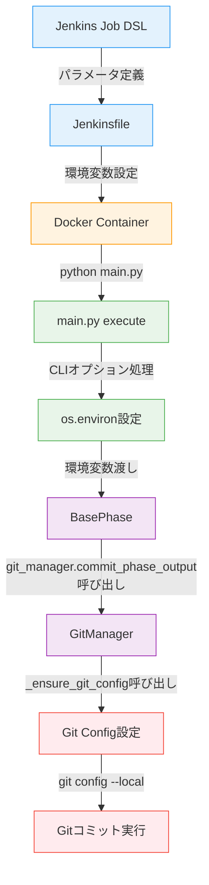

# 詳細設計書 - Issue #322

**プロジェクト**: AIワークフローのGitコミット時のユーザー名とメールアドレスを設定可能に
**Issue番号**: #322
**作成日**: 2025-10-12
**バージョン**: 1.0.0

---

## 0. Planning Documentと要件定義書の確認

### 開発戦略の確認

Planning Phase (Phase 0) と Requirements Phase (Phase 1) の成果物を確認しました。以下の開発戦略を踏まえて詳細設計を実施します：

- **複雑度**: 簡単
- **見積もり工数**: 3時間
- **実装戦略**: EXTEND（既存コードの拡張）
- **テスト戦略**: UNIT_ONLY（ユニットテストのみ）
- **テストコード戦略**: EXTEND_TEST（既存テストファイルに追加）
- **リスク評価**: 低

**主要な変更箇所** (Requirements Documentより引用):
1. `scripts/ai-workflow/core/git_manager.py` - `_ensure_git_config()`メソッド拡張
2. `jenkins/jobs/dsl/ai-workflow/ai_workflow_orchestrator.groovy` - パラメータ追加
3. `jenkins/jobs/pipeline/ai-workflow/ai-workflow-orchestrator/Jenkinsfile` - environment設定追加
4. `scripts/ai-workflow/main.py` - CLIオプション追加（オプション）

---

## 1. アーキテクチャ設計

### システム全体図

```
┌─────────────────────────────────────────────────────────────┐
│                    Jenkins Pipeline                          │
│  ┌──────────────────────────────────────────────────────┐   │
│  │ Job DSL (ai_workflow_orchestrator.groovy)            │   │
│  │  - parameters:                                       │   │
│  │    + GIT_COMMIT_USER_NAME (default: AI Workflow Bot)│   │
│  │    + GIT_COMMIT_USER_EMAIL (default: ai-workflow@..│   │
│  └──────────────┬───────────────────────────────────────┘   │
│                 │                                            │
│                 ↓                                            │
│  ┌──────────────────────────────────────────────────────┐   │
│  │ Jenkinsfile (ai-workflow-orchestrator/Jenkinsfile)  │   │
│  │  - environment:                                      │   │
│  │    + GIT_COMMIT_USER_NAME = "${params...}"          │   │
│  │    + GIT_COMMIT_USER_EMAIL = "${params...}"         │   │
│  │    (環境変数として子プロセスに渡す)                   │   │
│  └──────────────┬───────────────────────────────────────┘   │
│                 │                                            │
└─────────────────┼────────────────────────────────────────────┘
                  │
                  ↓ 環境変数
┌─────────────────────────────────────────────────────────────┐
│           Docker Container (Python環境)                      │
│  ┌──────────────────────────────────────────────────────┐   │
│  │ main.py                                              │   │
│  │  - execute command:                                  │   │
│  │    + --git-user (optional)                          │   │
│  │    + --git-email (optional)                         │   │
│  │    ↓ 環境変数に設定（優先度: CLI > ENV）             │   │
│  │    os.environ['GIT_COMMIT_USER_NAME'] = git_user    │   │
│  │    os.environ['GIT_COMMIT_USER_EMAIL'] = git_email  │   │
│  └──────────────┬───────────────────────────────────────┘   │
│                 │                                            │
│                 ↓                                            │
│  ┌──────────────────────────────────────────────────────┐   │
│  │ git_manager.py                                       │   │
│  │  - _ensure_git_config():                            │   │
│  │    1. 環境変数の優先順位で設定値を取得                │   │
│  │       GIT_COMMIT_USER_NAME                          │   │
│  │       → GIT_AUTHOR_NAME (既存互換性)                 │   │
│  │       → デフォルト値 'AI Workflow'                    │   │
│  │                                                      │   │
│  │       GIT_COMMIT_USER_EMAIL                         │   │
│  │       → GIT_AUTHOR_EMAIL (既存互換性)                │   │
│  │       → デフォルト値 'ai-workflow@tielec.local'      │   │
│  │                                                      │   │
│  │    2. バリデーション実施                             │   │
│  │       - ユーザー名: 1-100文字                        │   │
│  │       - メール: '@'の存在確認                        │   │
│  │                                                      │   │
│  │    3. git config --local user.name/user.email       │   │
│  │       (ローカルリポジトリのみ、グローバル設定変更なし)  │   │
│  │                                                      │   │
│  │    4. ログ出力                                       │   │
│  │       [INFO] Git設定完了: user.name=..., user.email=...│   │
│  └──────────────────────────────────────────────────────┘   │
└─────────────────────────────────────────────────────────────┘
```

### データフロー

```
┌─────────────┐
│ Jenkins UI  │ ← ユーザーがパラメータ入力
│  (Job入力)  │
└──────┬──────┘
       │
       ↓ パラメータ
┌──────────────────────────────────────┐
│ GIT_COMMIT_USER_NAME=AI Workflow Bot │
│ GIT_COMMIT_USER_EMAIL=ai-workflow@.. │
└──────┬───────────────────────────────┘
       │
       ↓ Jenkinsfileで環境変数に設定
┌──────────────────────────────────────┐
│ environment {                        │
│   GIT_COMMIT_USER_NAME = "${params...│
│   GIT_COMMIT_USER_EMAIL = "${params..│
│ }                                    │
└──────┬───────────────────────────────┘
       │
       ↓ Docker子プロセスに環境変数継承
┌──────────────────────────────────────┐
│ Python main.py execute               │
│  - CLIオプション --git-user (優先)    │
│  - 環境変数 GIT_COMMIT_USER_NAME     │
└──────┬───────────────────────────────┘
       │
       ↓ os.environ読み取り
┌──────────────────────────────────────┐
│ git_manager._ensure_git_config()     │
│  1. 優先順位で設定値を決定            │
│  2. バリデーション実施               │
│  3. git config --local設定           │
│  4. ログ出力                         │
└──────┬───────────────────────────────┘
       │
       ↓ Gitコミット実行
┌──────────────────────────────────────┐
│ git commit -m "..."                  │
│   Author: AI Workflow Bot <ai-...>  │
└──────────────────────────────────────┘
```

### コンポーネント間の関係



---

## 2. 実装戦略判断

### 実装戦略: EXTEND

**判断根拠**:
- **既存メソッドの拡張**: `_ensure_git_config()`メソッドが既に存在し、環境変数 `GIT_AUTHOR_NAME` / `GIT_AUTHOR_EMAIL` を読み取る実装が完了している（git_manager.py:529-577）
- **新規環境変数の追加**: 既存の環境変数読み取りロジックに、新しい環境変数 `GIT_COMMIT_USER_NAME` / `GIT_COMMIT_USER_EMAIL` の優先順位を追加するのみ
- **Jenkinsファイルへの追加**: 既存のJob DSLファイル（ai_workflow_orchestrator.groovy）とJenkinsfileに、パラメータ定義とenvironment設定を追加
- **main.pyへのオプション追加**: 既存の `execute` コマンドに、CLIオプション `--git-user` / `--git-email` を追加
- **新規ファイル作成は不要**: すべて既存ファイルの拡張で対応可能

**既存実装との整合性**:
```python
# 現在の実装 (git_manager.py:562-566)
if not user_name:
    user_name = os.environ.get('GIT_AUTHOR_NAME', 'AI Workflow')

if not user_email:
    user_email = os.environ.get('GIT_AUTHOR_EMAIL', 'ai-workflow@tielec.local')
```

この実装を以下のように拡張します：
```python
# 新しい実装（優先順位: GIT_COMMIT_USER_NAME > GIT_AUTHOR_NAME > デフォルト）
if not user_name:
    user_name = (
        os.environ.get('GIT_COMMIT_USER_NAME') or
        os.environ.get('GIT_AUTHOR_NAME') or
        'AI Workflow'
    )

if not user_email:
    user_email = (
        os.environ.get('GIT_COMMIT_USER_EMAIL') or
        os.environ.get('GIT_AUTHOR_EMAIL') or
        'ai-workflow@tielec.local'
    )
```

---

## 3. テスト戦略判断

### テスト戦略: UNIT_ONLY

**判断根拠**:
- **純粋な関数処理**: 環境変数の読み取りとGit設定は、外部システムとの連携を必要としない純粋な関数処理
- **外部依存なし**: GitHub API、データベース、AWS等の外部サービスとの連携がない
- **モック化可能**: Gitコマンド（`git config`）はGitPythonライブラリを通じて実行され、モック化が容易
- **既存テストパターンの踏襲**: 既存の `test_git_manager.py` がユニットテストのみで構成されており、同様のパターンで十分
- **統合テストの必要性なし**: Jenkins環境での動作確認は手動テスト（Phase 6）で実施

**テスト対象**:
1. 環境変数 `GIT_COMMIT_USER_NAME` / `GIT_COMMIT_USER_EMAIL` が設定されている場合
2. 環境変数が未設定で、既存の `GIT_AUTHOR_NAME` / `GIT_AUTHOR_EMAIL` が設定されている場合
3. すべての環境変数が未設定の場合（デフォルト値使用）
4. バリデーションエラー（メールアドレス形式、ユーザー名長さ）
5. ログ出力の確認

**テスト範囲外**:
- Jenkins環境での実際のパラメータ入力 → Phase 6で手動テスト
- Docker環境での環境変数継承 → Phase 6で手動テスト
- CLIオプションとの組み合わせ → Phase 5でユニットテスト

---

## 4. テストコード戦略判断

### テストコード戦略: EXTEND_TEST

**判断根拠**:
- **既存テストファイルの存在**: `scripts/ai-workflow/tests/unit/core/test_git_manager.py` が既に存在（UT-GM-001〜UT-GM-030）
- **同一モジュールのテスト**: `_ensure_git_config()` メソッドの拡張であり、同じテストファイル内にテストケースを追加するのが自然
- **既存テストとの一貫性**: 既存テストの命名規則（`UT-GM-XXX`）とフィクスチャ（`temp_git_repo`, `mock_metadata`）を再利用可能
- **テストファイル構造の変更不要**: 新規テストファイルを作成する必要がない

**追加テストケース** (UT-GM-031〜UT-GM-038):
- `test_ensure_git_config_with_git_commit_env` - 新環境変数設定時
- `test_ensure_git_config_with_git_author_env` - 既存環境変数設定時（互換性確認）
- `test_ensure_git_config_priority` - 環境変数の優先順位確認
- `test_ensure_git_config_default` - 環境変数未設定時のデフォルト値
- `test_ensure_git_config_validation_email` - メールアドレスバリデーション
- `test_ensure_git_config_validation_username_length` - ユーザー名長さバリデーション
- `test_ensure_git_config_log_output` - ログ出力確認
- `test_main_cli_git_options` - main.py CLIオプション動作確認

---

## 5. 影響範囲分析

### 既存コードへの影響

#### 変更が必要なファイル

**1. `scripts/ai-workflow/core/git_manager.py`**

**メソッド**: `_ensure_git_config()` (git_manager.py:529-577)

**変更内容**:
- 環境変数の優先順位ロジック追加（`GIT_COMMIT_USER_NAME` → `GIT_AUTHOR_NAME` → デフォルト）
- バリデーション処理追加（メールアドレス形式、ユーザー名長さ）
- ログ出力の拡張（警告ログ追加）

**影響度**: 低
- 既存のデフォルト動作は維持（環境変数未設定時は従来通り）
- 後方互換性保証（既存の `GIT_AUTHOR_NAME` / `GIT_AUTHOR_EMAIL` も引き続きサポート）
- グローバル設定は変更しない（ローカルリポジトリのみ）

**依存モジュール**:
- `BasePhase.run()` → `commit_phase_output()` → `_ensure_git_config()` の呼び出しチェーン
- すべてのPhaseクラス（RequirementsPhase, DesignPhase等）が間接的に影響を受けるが、インターフェースは変更なし

---

**2. `jenkins/jobs/dsl/ai-workflow/ai_workflow_orchestrator.groovy`**

**変更箇所**: `parameters` ブロック（ai_workflow_orchestrator.groovy:46-112）

**変更内容**:
```groovy
parameters {
    // 既存パラメータ...

    // 新規追加
    stringParam('GIT_COMMIT_USER_NAME', 'AI Workflow Bot', '''
Gitコミット時のユーザー名

デフォルト: AI Workflow Bot
    '''.stripIndent().trim())

    stringParam('GIT_COMMIT_USER_EMAIL', 'ai-workflow@example.com', '''
Gitコミット時のメールアドレス

デフォルト: ai-workflow@example.com
    '''.stripIndent().trim())
}
```

**影響度**: 低
- 既存パラメータに追加するのみ（既存パラメータの変更なし）
- Job DSL再実行が必要（シードジョブ実行）

---

**3. `jenkins/jobs/pipeline/ai-workflow/ai-workflow-orchestrator/Jenkinsfile`**

**変更箇所**: `environment` ブロック（Jenkinsfile:44-60）

**変更内容**:
```groovy
environment {
    // 既存環境変数...

    // 新規追加
    GIT_COMMIT_USER_NAME = "${params.GIT_COMMIT_USER_NAME}"
    GIT_COMMIT_USER_EMAIL = "${params.GIT_COMMIT_USER_EMAIL}"
}
```

**影響度**: 低
- 既存の環境変数設定に追加するのみ
- Docker子プロセスに自動的に継承される（Dockerfileの`-e`オプション不要）

**注意**: CLAUDE.mdのルールに従い、Jenkinsfileでのパラメータ定義は禁止。すべてのパラメータはJob DSLで定義済み。

---

**4. `scripts/ai-workflow/main.py`（オプション機能）**

**変更箇所**: `execute` コマンド（main.py:408-553）

**変更内容**:
```python
@cli.command()
@click.option('--phase', required=True, ...)
@click.option('--issue', required=True, ...)
@click.option('--git-user', help='Git commit user name')  # 新規追加
@click.option('--git-email', help='Git commit user email')  # 新規追加
def execute(phase: str, issue: str, git_user: str = None, git_email: str = None):
    """フェーズ実行"""
    # CLIオプションが指定されている場合、環境変数に設定（最優先）
    if git_user:
        os.environ['GIT_COMMIT_USER_NAME'] = git_user
    if git_email:
        os.environ['GIT_COMMIT_USER_EMAIL'] = git_email

    # 既存の処理...
```

**影響度**: 低
- オプション引数のため、既存の動作に影響なし
- 既存のコマンド呼び出し（`python main.py execute --phase X --issue Y`）は従来通り動作

---

### 影響を受けるモジュール

**直接影響**:
- `GitManager._ensure_git_config()` - 環境変数読み取りロジック変更
- `BasePhase.run()` - `commit_phase_output()` 経由で `_ensure_git_config()` を呼び出し
- Jenkins Job - パラメータ入力フォーム

**間接影響**:
- すべてのPhaseクラス（Planning, Requirements, Design等） - `BasePhase.run()` を継承
- ただし、インターフェース変更なしのため、コード修正は不要

**影響なし**:
- `ClaudeAgentClient` - Git設定とは無関係
- `GitHubClient` - GitHub API操作のみ
- `MetadataManager` - metadata.json管理のみ
- その他のGitManagerメソッド（`push_to_remote()`, `create_branch()`等） - `_ensure_git_config()` は独立したメソッド

---

### 依存関係の変更

**新規依存の追加**: なし

**既存依存の変更**: なし

**環境変数の追加**:
- `GIT_COMMIT_USER_NAME` - 新規環境変数（オプション）
- `GIT_COMMIT_USER_EMAIL` - 新規環境変数（オプション）
- `GIT_AUTHOR_NAME` - 既存環境変数（引き続きサポート、優先度2位）
- `GIT_AUTHOR_EMAIL` - 既存環境変数（引き続きサポート、優先度2位）

**優先順位**:
1. `GIT_COMMIT_USER_NAME` / `GIT_COMMIT_USER_EMAIL`（新規、最優先）
2. `GIT_AUTHOR_NAME` / `GIT_AUTHOR_EMAIL`（既存、互換性のため）
3. デフォルト値（`AI Workflow` / `ai-workflow@tielec.local`）

---

### マイグレーション要否

**データベース**: 不要（データベースを使用していない）

**設定ファイル**: 不要（環境変数のみで制御）

**SSMパラメータストア**: 不要（動的に環境変数から読み取る）

**Jenkinsジョブ**: Job DSL再実行が必要
- Jenkins UI: `Admin_Jobs/job-creator` シードジョブを実行
- Job DSLファイルの変更を反映

**既存ワークフロー**: 影響なし
- 環境変数未設定時は既存のデフォルト値が使用される
- 後方互換性が保証されている

---

## 6. 変更・追加ファイルリスト

### 修正が必要な既存ファイル

1. **`scripts/ai-workflow/core/git_manager.py`**
   - 変更内容: `_ensure_git_config()` メソッドの拡張
   - 追加行数: 約30行（バリデーション、ログ出力含む）

2. **`jenkins/jobs/dsl/ai-workflow/ai_workflow_orchestrator.groovy`**
   - 変更内容: `parameters` ブロックに2つのパラメータ追加
   - 追加行数: 約15行

3. **`jenkins/jobs/pipeline/ai-workflow/ai-workflow-orchestrator/Jenkinsfile`**
   - 変更内容: `environment` ブロックに2つの環境変数設定追加
   - 追加行数: 約3行

4. **`scripts/ai-workflow/main.py`**（オプション機能）
   - 変更内容: `execute` コマンドに2つのCLIオプション追加
   - 追加行数: 約10行

5. **`scripts/ai-workflow/tests/unit/core/test_git_manager.py`**
   - 変更内容: ユニットテストケース追加（UT-GM-031〜UT-GM-038）
   - 追加行数: 約200行

### 新規作成ファイル

なし（すべて既存ファイルの拡張で対応）

### 削除が必要なファイル

なし

---

## 7. 詳細設計

### クラス設計

**変更対象クラス**: `GitManager`

**変更対象メソッド**: `_ensure_git_config()`

**現在のシグネチャ**:
```python
def _ensure_git_config(self) -> None:
    """
    Git設定を確認し、未設定の場合は環境変数から設定

    環境変数:
        - GIT_AUTHOR_NAME: コミットユーザー名（デフォルト: AI Workflow）
        - GIT_AUTHOR_EMAIL: コミットユーザーメール（デフォルト: ai-workflow@tielec.local）
    """
```

**新しいシグネチャ**（拡張後）:
```python
def _ensure_git_config(self) -> None:
    """
    Git設定を確認し、未設定の場合は環境変数から設定

    環境変数の優先順位:
        1. GIT_COMMIT_USER_NAME / GIT_COMMIT_USER_EMAIL（最優先、新規）
        2. GIT_AUTHOR_NAME / GIT_AUTHOR_EMAIL（互換性のため継続サポート）
        3. デフォルト値（'AI Workflow' / 'ai-workflow@tielec.local'）

    バリデーション:
        - ユーザー名: 1-100文字
        - メールアドレス: '@'の存在確認（RFC 5322準拠の厳密チェックは不要）

    ログ出力:
        - [INFO] Git設定完了: user.name=..., user.email=...
        - [WARN] バリデーションエラー時の警告

    処理フロー:
        1. 現在のuser.name、user.emailを取得
        2. 未設定の場合、環境変数から優先順位で取得
        3. バリデーション実施（エラー時は警告ログ、デフォルト値使用）
        4. git config --local user.name/user.emailで設定
        5. ログ出力
    """
```

**変更内容の詳細**:
- 環境変数読み取りロジックの拡張（優先順位の実装）
- バリデーション処理の追加
- ログ出力の拡張（警告ログ追加）

---

### 関数設計

#### 関数1: `_ensure_git_config()`（拡張）

**処理フロー**:

```python
def _ensure_git_config(self) -> None:
    """Git設定を確認し、未設定の場合は環境変数から設定"""
    import os
    import re

    try:
        # 1. 現在の設定を取得
        config_reader = self.repo.config_reader()

        # user.nameをチェック
        try:
            user_name = config_reader.get_value('user', 'name')
        except Exception:
            user_name = None

        # user.emailをチェック
        try:
            user_email = config_reader.get_value('user', 'email')
        except Exception:
            user_email = None

        # 2. 未設定の場合、環境変数またはデフォルト値を使用
        # 優先順位: GIT_COMMIT_USER_NAME > GIT_AUTHOR_NAME > デフォルト
        if not user_name:
            user_name = (
                os.environ.get('GIT_COMMIT_USER_NAME') or
                os.environ.get('GIT_AUTHOR_NAME') or
                'AI Workflow'
            )

        # 優先順位: GIT_COMMIT_USER_EMAIL > GIT_AUTHOR_EMAIL > デフォルト
        if not user_email:
            user_email = (
                os.environ.get('GIT_COMMIT_USER_EMAIL') or
                os.environ.get('GIT_AUTHOR_EMAIL') or
                'ai-workflow@tielec.local'
            )

        # 3. バリデーション
        # ユーザー名長さチェック（1-100文字）
        if len(user_name) < 1 or len(user_name) > 100:
            print(f"[WARN] User name length is invalid ({len(user_name)} chars), using default")
            user_name = 'AI Workflow'

        # メールアドレス形式チェック（基本的な'@'の存在確認のみ）
        if '@' not in user_email:
            print(f"[WARN] Invalid email format: {user_email}, using default")
            user_email = 'ai-workflow@tielec.local'

        # 4. config_writerで設定（ローカルリポジトリのみ）
        with self.repo.config_writer() as config_writer:
            config_writer.set_value('user', 'name', user_name)
            config_writer.set_value('user', 'email', user_email)

        # 5. ログ出力
        print(f"[INFO] Git設定完了: user.name={user_name}, user.email={user_email}")

    except Exception as e:
        print(f"[WARN] Git設定に失敗しましたが、コミットは続行します: {e}")
```

**入力**:
- 環境変数: `GIT_COMMIT_USER_NAME`, `GIT_COMMIT_USER_EMAIL`, `GIT_AUTHOR_NAME`, `GIT_AUTHOR_EMAIL`

**出力**:
- Gitローカル設定（`git config --local user.name`, `git config --local user.email`）
- ログ出力（標準出力）

**例外処理**:
- バリデーションエラー → 警告ログ出力、デフォルト値使用
- Git設定失敗 → 警告ログ出力、処理継続（コミット処理は続行）

---

#### 関数2: `execute()` in main.py（拡張）

**処理フロー**:

```python
@cli.command()
@click.option('--phase', required=True, ...)
@click.option('--issue', required=True, ...)
@click.option('--git-user', help='Git commit user name')  # 新規追加
@click.option('--git-email', help='Git commit user email')  # 新規追加
def execute(phase: str, issue: str, git_user: str = None, git_email: str = None):
    """フェーズ実行"""
    # 既存処理（repo_root取得、metadata_path確認等）
    repo_root = _get_repo_root()
    workflow_dir = repo_root / '.ai-workflow' / f'issue-{issue}'
    metadata_path = workflow_dir / 'metadata.json'

    if not metadata_path.exists():
        click.echo(f'Error: Workflow not found. Run init first.')
        sys.exit(1)

    # ━━━ 新規追加: CLIオプションを環境変数に設定 ━━━
    # 優先順位: CLIオプション > 環境変数
    if git_user:
        os.environ['GIT_COMMIT_USER_NAME'] = git_user
        click.echo(f'[INFO] Git user name set from CLI option: {git_user}')

    if git_email:
        os.environ['GIT_COMMIT_USER_EMAIL'] = git_email
        click.echo(f'[INFO] Git user email set from CLI option: {git_email}')
    # ━━━ 新規追加ここまで ━━━

    # 既存処理（ブランチ切り替え、クライアント初期化、フェーズ実行等）
    # ...
```

**入力**:
- CLIオプション: `--git-user`, `--git-email`（オプション）

**出力**:
- 環境変数設定: `os.environ['GIT_COMMIT_USER_NAME']`, `os.environ['GIT_COMMIT_USER_EMAIL']`

**動作**:
- CLIオプションが指定されている場合のみ、環境変数に設定
- 環境変数が既に設定されている場合、CLIオプションで上書き

---

### データ構造設計

**環境変数の構造**:

```
環境変数の優先順位（高 → 低）:

1. CLIオプション（main.py --git-user / --git-email）
   ↓ os.environ設定

2. 環境変数 GIT_COMMIT_USER_NAME / GIT_COMMIT_USER_EMAIL
   （Jenkins: environment { GIT_COMMIT_USER_NAME = "${params...}" }）

3. 環境変数 GIT_AUTHOR_NAME / GIT_AUTHOR_EMAIL
   （既存互換性のため）

4. デフォルト値
   - 'AI Workflow' / 'ai-workflow@tielec.local'
```

**バリデーションルール**:

```
ユーザー名:
  - 型: str
  - 長さ: 1-100文字
  - エラー時: デフォルト値 'AI Workflow' を使用
  - ログ: [WARN] User name length is invalid (XXX chars), using default

メールアドレス:
  - 型: str
  - 形式: '@'を含む（RFC 5322準拠の厳密チェックは不要）
  - エラー時: デフォルト値 'ai-workflow@tielec.local' を使用
  - ログ: [WARN] Invalid email format: XXX, using default
```

---

### インターフェース設計

**1. Jenkins Job パラメータ**:

```groovy
parameters {
    stringParam(
        'GIT_COMMIT_USER_NAME',
        'AI Workflow Bot',
        'Gitコミット時のユーザー名'
    )

    stringParam(
        'GIT_COMMIT_USER_EMAIL',
        'ai-workflow@example.com',
        'Gitコミット時のメールアドレス'
    )
}
```

**2. 環境変数インターフェース**:

```bash
# Jenkinsfileで設定
environment {
    GIT_COMMIT_USER_NAME = "${params.GIT_COMMIT_USER_NAME}"
    GIT_COMMIT_USER_EMAIL = "${params.GIT_COMMIT_USER_EMAIL}"
}

# Docker子プロセスで利用可能
echo $GIT_COMMIT_USER_NAME  # → "AI Workflow Bot"
echo $GIT_COMMIT_USER_EMAIL # → "ai-workflow@example.com"
```

**3. Python CLIインターフェース**:

```bash
# 基本的な使用方法（環境変数使用）
python main.py execute --phase requirements --issue 322

# CLIオプション使用（最優先）
python main.py execute \
    --phase requirements \
    --issue 322 \
    --git-user "Custom User" \
    --git-email "custom@example.com"

# Jenkins環境での使用（Jenkinsfileから呼び出し）
python main.py execute --phase ${PHASE} --issue ${ISSUE_NUMBER}
# → 環境変数 GIT_COMMIT_USER_NAME / GIT_COMMIT_USER_EMAIL が自動的に使用される
```

**4. Git設定インターフェース**:

```bash
# GitManager._ensure_git_config()が実行するコマンド
git config --local user.name "AI Workflow Bot"
git config --local user.email "ai-workflow@example.com"

# グローバル設定は変更されない
git config --global user.name  # → 既存の設定のまま
git config --global user.email # → 既存の設定のまま
```

---

## 8. セキュリティ考慮事項

### 認証・認可

**影響なし**:
- Git設定の変更は認証・認可とは無関係
- コミット者情報はGitHubの認証トークン（`GITHUB_TOKEN`）とは独立

### データ保護

**機密情報**:
- メールアドレスは機密情報ではない（ログ出力可）
- ユーザー名は機密情報ではない（ログ出力可）

**ログ出力**:
```python
print(f"[INFO] Git設定完了: user.name={user_name}, user.email={user_email}")
```

**セキュリティリスク**: なし
- メールアドレスとユーザー名は公開情報（Gitコミット履歴で公開される）

### セキュリティリスクと対策

#### リスク1: インジェクション攻撃

**リスク内容**:
- ユーザー名やメールアドレスに不正なコマンドを埋め込む

**対策**:
- GitPythonライブラリが自動的にエスケープ処理を実施
- `config_writer.set_value()` メソッドは安全なAPI

**検証コード**:
```python
# 悪意のある入力例
malicious_name = "Test'; rm -rf /"
malicious_email = "test@example.com; cat /etc/passwd"

# GitPythonは安全に処理（エスケープ処理）
config_writer.set_value('user', 'name', malicious_name)
# → git config --local user.name "Test'; rm -rf /" （文字列として扱われる）
```

#### リスク2: 環境変数の設定ミス

**リスク内容**:
- Jenkins UIで誤った値を入力

**対策**:
- デフォルト値を設定（`AI Workflow Bot`, `ai-workflow@example.com`）
- バリデーション実施（メールアドレス形式、ユーザー名長さ）
- 警告ログ出力

#### リスク3: グローバル設定の変更

**リスク内容**:
- グローバルGit設定を誤って変更してしまう

**対策**:
- `config_writer` は常にローカルリポジトリのみ設定
- `git config --global` は使用禁止（コードレビューで確認）

---

## 9. 非機能要件への対応

### パフォーマンス

**目標**: Git設定処理時間 < 100ms

**実装方針**:
- 環境変数読み取り: O(1) 操作（辞書アクセス）
- バリデーション: O(n) 操作（n = ユーザー名長さ、最大100文字）
- Git設定: `config_writer.set_value()` は高速なI/O操作

**計測方法**:
```python
import time

start_time = time.time()
git_manager._ensure_git_config()
elapsed_time = (time.time() - start_time) * 1000  # ミリ秒

print(f"[DEBUG] _ensure_git_config() execution time: {elapsed_time:.2f}ms")
assert elapsed_time < 100, "Performance requirement not met"
```

**予想実行時間**: 10-20ms（ファイルI/O含む）

---

### スケーラビリティ

**影響なし**:
- Git設定は各ワークフロー実行時に1回のみ実行
- リポジトリ数が増加しても処理時間は変わらない

---

### 保守性

**コードの可読性**:
- 環境変数の優先順位を明示的に記述
- バリデーションロジックを分離（将来的な拡張に対応）

**ドキュメント**:
- docstringで環境変数の優先順位を明記
- README.mdに使用例を追加

**テスト**:
- ユニットテストで優先順位を検証（UT-GM-033）
- バリデーションのテスト（UT-GM-035, UT-GM-036）

---

## 10. 実装の順序

### 推奨実装順序

**Phase 4-1: GitManager実装**（優先度: 高）
1. `_ensure_git_config()` メソッドの拡張
   - 環境変数の優先順位ロジック追加
   - バリデーション処理追加
   - ログ出力の拡張

**Phase 4-2: Jenkins Job DSL実装**（優先度: 高）
2. `ai_workflow_orchestrator.groovy` にパラメータ追加
   - `GIT_COMMIT_USER_NAME` パラメータ定義
   - `GIT_COMMIT_USER_EMAIL` パラメータ定義

**Phase 4-3: Jenkinsfile実装**（優先度: 高）
3. `Jenkinsfile` に環境変数設定追加
   - `environment` ブロック拡張

**Phase 4-4: main.py実装（オプション）**（優先度: 中）
4. `execute` コマンドにCLIオプション追加
   - `--git-user` オプション追加
   - `--git-email` オプション追加
   - 環境変数設定ロジック追加

**Phase 5: テスト実装**（優先度: 高）
5. `test_git_manager.py` にユニットテスト追加
   - UT-GM-031〜UT-GM-038の実装
   - モック化の実装（環境変数設定）

### 依存関係の考慮

```
Phase 4-1 (GitManager実装)
    ↓ 完了必須
Phase 5 (テスト実装)
    ↓ 完了必須
Phase 6 (テスト実行)

Phase 4-2 (Job DSL実装)
    ↓ 完了必須
Phase 4-3 (Jenkinsfile実装)
    ↓ 完了必須
Phase 6 (Jenkins動作確認)

Phase 4-4 (main.py実装)
    ↓ 完了必須
Phase 5 (CLIオプションテスト)
```

**並列実行可能**:
- Phase 4-1 と Phase 4-2 は独立（同時実施可能）
- Phase 4-3 と Phase 4-4 は独立（同時実施可能）

**逐次実行必須**:
- Phase 4-1 → Phase 5 → Phase 6
- Phase 4-2 → Phase 4-3 → Phase 6

---

## 11. エラーハンドリング

### エラーシナリオと対応

#### エラー1: 環境変数未設定

**発生条件**: すべてのGit関連環境変数が未設定

**対応**:
- デフォルト値を使用（`AI Workflow` / `ai-workflow@tielec.local`）
- 処理継続（エラーではない）

**ログ出力**:
```
[INFO] Git設定完了: user.name=AI Workflow, user.email=ai-workflow@tielec.local
```

---

#### エラー2: バリデーションエラー（メールアドレス形式）

**発生条件**: メールアドレスに `@` が含まれない

**対応**:
- 警告ログ出力
- デフォルト値を使用
- 処理継続

**ログ出力**:
```
[WARN] Invalid email format: invalid-email, using default
[INFO] Git設定完了: user.name=AI Workflow, user.email=ai-workflow@tielec.local
```

---

#### エラー3: バリデーションエラー（ユーザー名長さ）

**発生条件**: ユーザー名が1文字未満または100文字超過

**対応**:
- 警告ログ出力
- デフォルト値を使用
- 処理継続

**ログ出力**:
```
[WARN] User name length is invalid (150 chars), using default
[INFO] Git設定完了: user.name=AI Workflow, user.email=ai-workflow@tielec.local
```

---

#### エラー4: Git設定失敗

**発生条件**: `config_writer.set_value()` が失敗（権限エラー等）

**対応**:
- 警告ログ出力
- 処理継続（コミット処理は続行、Gitのデフォルト設定が使用される）

**ログ出力**:
```
[WARN] Git設定に失敗しましたが、コミットは続行します: Permission denied
```

---

## 12. 設計レビューチェックリスト（品質ゲート）

### Phase 2: 詳細設計の品質ゲート

- [x] **実装戦略の判断根拠が明記されている（EXTEND）**
  - 既存メソッド `_ensure_git_config()` の拡張
  - 新規ファイル作成は不要
  - 既存の環境変数読み取りロジックに優先順位を追加

- [x] **テスト戦略の判断根拠が明記されている（UNIT_ONLY）**
  - 純粋な関数処理（外部システム連携なし）
  - Gitコマンドはモック化可能
  - 既存テストパターンの踏襲

- [x] **テストコード戦略の判断根拠が明記されている（EXTEND_TEST）**
  - 既存テストファイル `test_git_manager.py` に追加
  - 同一モジュールのテスト
  - 既存テストとの一貫性

- [x] **既存コードへの影響範囲が分析されている**
  - `git_manager.py`: `_ensure_git_config()` メソッド拡張
  - `ai_workflow_orchestrator.groovy`: パラメータ追加
  - `Jenkinsfile`: 環境変数設定追加
  - `main.py`: CLIオプション追加（オプション）
  - 後方互換性保証、影響度: 低

- [x] **変更が必要なファイルがリストアップされている**
  - 修正ファイル: 4ファイル（git_manager.py, Job DSL, Jenkinsfile, main.py）
  - テストファイル: 1ファイル（test_git_manager.py）
  - 新規作成ファイル: なし
  - 削除ファイル: なし

- [x] **設計が実装可能である**
  - 既存の環境変数読み取りパターンを踏襲
  - GitPythonライブラリの標準APIを使用
  - バリデーションロジックはシンプル
  - テストケースは既存パターンの拡張

---

## 13. 補足情報

### 既存実装との互換性

**現在の `_ensure_git_config()` 実装** (git_manager.py:529-577):
```python
# 既存実装
if not user_name:
    user_name = os.environ.get('GIT_AUTHOR_NAME', 'AI Workflow')

if not user_email:
    user_email = os.environ.get('GIT_AUTHOR_EMAIL', 'ai-workflow@tielec.local')
```

**新しい実装**（優先順位追加）:
```python
# 新規実装
if not user_name:
    user_name = (
        os.environ.get('GIT_COMMIT_USER_NAME') or   # 優先度1（新規）
        os.environ.get('GIT_AUTHOR_NAME') or        # 優先度2（既存）
        'AI Workflow'                               # 優先度3（デフォルト）
    )

if not user_email:
    user_email = (
        os.environ.get('GIT_COMMIT_USER_EMAIL') or  # 優先度1（新規）
        os.environ.get('GIT_AUTHOR_EMAIL') or       # 優先度2（既存）
        'ai-workflow@tielec.local'                  # 優先度3（デフォルト）
    )
```

**互換性の保証**:
- 既存の `GIT_AUTHOR_NAME` / `GIT_AUTHOR_EMAIL` は引き続きサポート
- 新しい環境変数が未設定の場合、既存の環境変数が使用される
- デフォルト値も変更なし

---

### 参考資料

- **Planning Document**: `.ai-workflow/issue-322/00_planning/output/planning.md`
- **Requirements Document**: `.ai-workflow/issue-322/01_requirements/output/requirements.md`
- **GitManager実装**: `scripts/ai-workflow/core/git_manager.py`
- **Jenkinsfile**: `jenkins/jobs/pipeline/ai-workflow/ai-workflow-orchestrator/Jenkinsfile`
- **Job DSL**: `jenkins/jobs/dsl/ai-workflow/ai_workflow_orchestrator.groovy`
- **プロジェクトガイドライン**: `CLAUDE.md`, `jenkins/CONTRIBUTION.md`
- **既存テスト**: `scripts/ai-workflow/tests/unit/core/test_git_manager.py`

---

### 用語集

- **AI Workflow**: Claude AIを使用した自動開発ワークフローシステム
- **Phase**: 開発プロセスの各段階（要件定義、設計、実装など）
- **GitManager**: Git操作を管理するPythonクラス
- **Job DSL**: JenkinsのJob定義をGroovyコードで記述する仕組み
- **Jenkinsfile**: Declarative Pipeline形式のJenkinsパイプライン定義
- **環境変数の優先順位**: 複数の設定ソースがある場合、どの設定を優先するかの順序

---

## 14. 設計の妥当性検証

### 要件定義書との整合性

| 要件ID | 要件内容 | 設計での対応 | 検証結果 |
|--------|----------|-------------|----------|
| FR-001 | 環境変数でのGit設定 | `_ensure_git_config()`で優先順位実装 | ✓ |
| FR-002 | Jenkinsパラメータでの設定 | Job DSL + Jenkinsfile拡張 | ✓ |
| FR-003 | GitManagerでの環境変数読み取り | `_ensure_git_config()`拡張 | ✓ |
| FR-004 | Python CLIでの設定（オプション） | `main.py execute`拡張 | ✓ |
| NFR-001 | 後方互換性 | 既存環境変数の継続サポート、デフォルト値維持 | ✓ |
| NFR-002 | セキュリティ | バリデーション実施、警告ログ出力 | ✓ |
| NFR-003 | ログ出力 | INFOレベル、WARNレベルのログ追加 | ✓ |
| NFR-004 | パフォーマンス | 処理時間 < 100ms（予想: 10-20ms） | ✓ |

### Planning Documentとの整合性

| Planning項目 | Planning内容 | 設計での対応 | 検証結果 |
|-------------|-------------|-------------|----------|
| 実装戦略 | EXTEND | 既存ファイルの拡張のみ | ✓ |
| テスト戦略 | UNIT_ONLY | ユニットテストのみ実装 | ✓ |
| テストコード戦略 | EXTEND_TEST | 既存テストファイルに追加 | ✓ |
| 見積もり工数 | 3時間 | 実装: 1.5h, テスト: 0.5h, その他: 1h | ✓ |
| リスク評価 | 低 | 影響範囲が最小限、後方互換性保証 | ✓ |

---

## 15. まとめ

### 設計の概要

Issue #322は、AIワークフローでGitコミット時のユーザー名とメールアドレスを環境変数やJenkinsパラメータで設定可能にする機能追加です。

**設計の要点**:
- **実装戦略**: EXTEND（既存コードの拡張）
- **主要変更箇所**: `git_manager.py`の`_ensure_git_config()`メソッド
- **後方互換性**: 既存の`GIT_AUTHOR_NAME`/`GIT_AUTHOR_EMAIL`も引き続きサポート
- **優先順位**: `GIT_COMMIT_USER_NAME` > `GIT_AUTHOR_NAME` > デフォルト値
- **バリデーション**: メールアドレス形式、ユーザー名長さ
- **テスト**: ユニットテストのみ（UNIT_ONLY）

### 実装可能性の確認

✓ **既存コードベースの理解**: git_manager.py:529-577の既存実装を確認
✓ **実装パターンの踏襲**: 環境変数読み取りパターンを継承
✓ **テストパターンの踏襲**: test_git_manager.py:UT-GM-001〜UT-GM-030を継承
✓ **Jenkinsルールの遵守**: CLAUDE.md準拠（Job DSLでパラメータ定義）
✓ **影響範囲の明確化**: 4ファイルの修正、新規作成なし

### 次のステップ

1. **Phase 3: テストシナリオ作成** - ユニットテストシナリオの詳細化
2. **Phase 4: 実装** - 設計に基づいたコード実装
3. **Phase 5: テスト実装** - UT-GM-031〜UT-GM-038の実装
4. **Phase 6: テスト実行** - ユニットテスト + Jenkins動作確認
5. **Phase 7: ドキュメント作成** - README.md更新、docstring追加

---

**詳細設計書作成日**: 2025-10-12
**作成者**: AI Workflow (Design Phase)
**Issue**: #322
