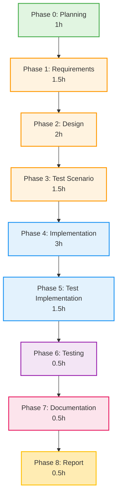

# プロジェクト計画書 - Issue #324

## Issue情報

- **Issue番号**: #324
- **タイトル**: [FEATURE] 実装フェーズとテストコード実装フェーズの分離
- **URL**: https://github.com/tielec/infrastructure-as-code/issues/324
- **優先度**: High
- **ラベル**: enhancement, ai-workflow, refactoring

## 1. Issue分析

### 複雑度: 中程度

**判断根拠**:
- 複数のPythonファイル（workflow_state.py、execute.txt、レビュープロンプト等）の修正が必要
- 既存のフェーズ構造への影響が大きい（Phase 5以降のすべてのフェーズ番号がシフト）
- 新規フェーズ（test_implementation）の追加により、依存関係の再定義が必要
- 後方互換性を維持しながらの拡張が求められる
- ただし、アーキテクチャの根本的な変更ではなく、既存パターンの延長

### 見積もり工数: 12時間

**内訳**:
- Phase 0 (planning): 1時間（本計画書作成）
- Phase 1 (requirements): 1.5時間（機能要件・非機能要件の詳細化）
- Phase 2 (design): 2時間（詳細設計、ファイル変更リスト作成）
- Phase 3 (test_scenario): 1.5時間（テストシナリオ作成）
- Phase 4 (implementation): 3時間（コード実装）
- Phase 5 (test_implementation): 1.5時間（テストコード実装）
- Phase 6 (testing): 0.5時間（テスト実行）
- Phase 7 (documentation): 0.5時間（ドキュメント更新）
- Phase 8 (report): 0.5時間（最終レポート作成）

**根拠**:
- 既存の8フェーズ構造を理解する必要がある（metadata.json、workflow_state.py、各プロンプトファイル）
- 新規フェーズ追加に伴う、すべてのフェーズ番号のシフト処理が必要
- 後方互換性を考慮した設計・実装が必要
- 既存のテストコードへの影響分析と修正が必要

### リスク評価: 中

**根拠**:
- **技術的複雑性（中）**: フェーズ番号のシフトは単純作業だが、漏れがあると致命的
- **影響範囲（高）**: Phase 5以降のすべてのフェーズに影響
- **後方互換性（中）**: 既存のワークフロー（Issue #305等）が正しく動作し続ける必要がある
- **テストカバレッジ（中）**: 既存のテストが十分にカバーしているか不明

## 2. 実装戦略判断

### 実装戦略: EXTEND

**判断根拠**:
- **新規ファイル作成**: `prompts/test_implementation/execute.txt`、`prompts/test_implementation/review.txt`、`prompts/test_implementation/revise.txt`（3ファイル）
- **既存ファイル拡張**: `workflow_state.py`にtest_implementationフェーズを追加、`implementation/execute.txt`の責務を明確化
- **既存構造の踏襲**: 他のフェーズと同じパターン（execute/review/revise）を踏襲
- **アーキテクチャ変更なし**: 既存のフェーズ管理の仕組み（metadata.json、PhaseStatus等）はそのまま利用

→ 新規作成と拡張の両方が含まれるが、**拡張が中心**と判断。既存のフェーズ管理システムに新しいフェーズを組み込む作業がメイン。

### テスト戦略: UNIT_INTEGRATION

**判断根拠**:
- **ユニットテスト**:
  - `WorkflowState.create_new()`が新しいフェーズ構造を正しく生成するか
  - `update_phase_status()`、`get_phase_status()`が"test_implementation"フェーズに対して正しく動作するか
  - フェーズ番号のシフト（Phase 5→6、Phase 6→7、Phase 7→8）が正しく反映されているか
- **インテグレーションテスト**:
  - 実際のワークフロー実行（planning → requirements → design → test_scenario → implementation → test_implementation → testing → documentation → report）
  - 既存のワークフロー（Phase 1-7構成）が引き続き動作するか（後方互換性）
  - クリティカルシンキングレビューが各フェーズで正しく機能するか

→ BDDは不要（エンドユーザー向け機能ではなく、内部システムの拡張）

### テストコード戦略: BOTH_TEST

**判断根拠**:
- **既存テスト拡張（EXTEND_TEST）**:
  - `tests/unit/core/test_workflow_state.py`: 既存のWorkflowStateテストに、test_implementationフェーズのテストケースを追加
  - `tests/integration/test_workflow_init.py`: 既存のワークフロー初期化テストに、新しいフェーズ構造の確認を追加
- **新規テスト作成（CREATE_TEST）**:
  - `tests/integration/test_phase_separation.py`: Phase 4（implementation）とPhase 5（test_implementation）の責務分離を検証する新規テスト
  - プロンプトファイルの内容検証（test_implementationプロンプトが正しく生成されているか）

→ 既存テストの拡張と新規テストの両方が必要。

## 3. 影響範囲分析

### 既存コードへの影響

#### 変更が必要なファイル（既存）

1. **`scripts/ai-workflow/core/workflow_state.py`**
   - `create_new()`: phases辞書に"test_implementation"を追加（Phase 4とPhase 5の間）
   - フェーズ順序の定数定義（存在する場合）の更新

2. **`scripts/ai-workflow/prompts/implementation/execute.txt`**
   - 「実装フェーズでは実コードのみを実装」という責務を明確化
   - テストコード実装は"Phase 5 (test_implementation)"に委譲する旨を追記

3. **`scripts/ai-workflow/prompts/testing/execute.txt`**
   - Phase番号の更新（Phase 5 → Phase 6）

4. **`scripts/ai-workflow/prompts/documentation/execute.txt`**
   - Phase番号の更新（Phase 6 → Phase 7）

5. **`scripts/ai-workflow/prompts/report/execute.txt`**
   - Phase番号の更新（Phase 7 → Phase 8）

6. **テストファイル**
   - `tests/unit/core/test_workflow_state.py`: test_implementationフェーズのテストケース追加
   - `tests/integration/test_workflow_init.py`: 新しいフェーズ構造の検証

#### 新規作成ファイル

1. **`scripts/ai-workflow/prompts/test_implementation/execute.txt`**
   - テストコード実装に特化したプロンプト
   - Phase 3（test_scenario）のシナリオとPhase 4（implementation）の実コードを参照
   - テスト戦略（UNIT_ONLY/INTEGRATION_ONLY等）に応じた実装指示

2. **`scripts/ai-workflow/prompts/test_implementation/review.txt`**
   - テストコードのクリティカルシンキングレビュープロンプト
   - テストカバレッジ、テストの網羅性、エッジケース確認

3. **`scripts/ai-workflow/prompts/test_implementation/revise.txt`**
   - テストコード修正プロンプト（レビュー指摘事項の修正）

4. **`tests/integration/test_phase_separation.py`**
   - Phase 4とPhase 5の責務分離を検証する統合テスト

### 依存関係の変更

#### 新規依存の追加
- なし（既存のPython標準ライブラリとワークフローフレームワークのみ使用）

#### 既存依存の変更
- なし（既存の依存関係は維持）

### マイグレーション要否

#### データマイグレーション: 不要

**理由**:
- 既存のmetadata.json（Issue #305、#310等）は旧フェーズ構造（Phase 1-7）のまま保持される
- 新規作成されるワークフローのみが新しいフェーズ構造（Phase 1-8）を使用
- WorkflowState.create_new()が新旧どちらの構造でも動作するように設計（後方互換性維持）

#### 設定ファイル変更: 不要

**理由**:
- 設定ファイルはフェーズ構造に依存していない

#### ドキュメント更新: 必要

**更新対象**:
- `scripts/ai-workflow/README.md`: フェーズ構造の説明を更新（Phase 1-7 → Phase 1-8）
- `.ai-workflow/issue-324/07_documentation/output/documentation.md`: Phase 7で自動生成

## 4. タスク分割

### Phase 0: 計画 (見積もり: 1h)

- [x] Issue情報の分析と複雑度判定
- [x] 実装戦略・テスト戦略・テストコード戦略の決定
- [x] 影響範囲分析とファイルリストの洗い出し
- [x] タスク分割とスケジュール作成
- [x] リスク分析と軽減策の検討
- [x] 本プロジェクト計画書の作成

### Phase 1: 要件定義 (見積もり: 1.5h)

- [ ] 機能要件の詳細化（FR-001〜FR-006の具体化）
- [ ] 非機能要件の詳細化（NFR-001〜NFR-003の具体化）
- [ ] 受け入れ基準の明確化（Issue記載の8項目を具体化）
- [ ] ユースケースの洗い出し（新規ワークフロー作成、既存ワークフロー実行等）
- [ ] 要件定義書の作成

**完了条件**:
- 機能要件が曖昧さなく記載されている
- 受け入れ基準が測定可能である
- ユースケースが網羅的に記載されている

### Phase 2: 設計 (見積もり: 2h)

- [ ] workflow_state.pyの詳細設計（create_new()の変更箇所）
- [ ] test_implementationプロンプトファイルの構成設計
- [ ] Phase番号シフトの影響箇所リストアップ（testing/documentation/report）
- [ ] 後方互換性の設計（既存metadata.jsonの扱い）
- [ ] クラス図・シーケンス図の作成（必要に応じて）
- [ ] ファイル変更リストの最終化
- [ ] 設計書の作成

**完了条件**:
- 変更ファイルリストが明確
- 実装方針が具体的に記載されている
- レビューアが実装イメージを持てる

### Phase 3: テストシナリオ (見積もり: 1.5h)

- [ ] ユニットテストシナリオの作成
  - WorkflowState.create_new()の新フェーズ構造検証
  - update_phase_status()のtest_implementationフェーズ対応
  - フェーズ番号シフトの検証
- [ ] インテグレーションテストシナリオの作成
  - 新規ワークフロー（Phase 1-8）の実行
  - 既存ワークフロー（Phase 1-7）の互換性確認
  - Phase 4とPhase 5の責務分離検証
- [ ] エッジケースの洗い出し
  - フェーズ名のtypo（"test_implemantation"等）
  - 存在しないフェーズへのアクセス
- [ ] テストシナリオ書の作成

**完了条件**:
- Given-When-Then形式でシナリオが記載されている
- 正常系・異常系の両方がカバーされている
- テスト戦略（UNIT_INTEGRATION）に沿っている

### Phase 4: 実装 (見積もり: 3h)

- [ ] workflow_state.pyの修正
  - create_new()にtest_implementationフェーズを追加
  - phases辞書の順序を調整（implementation → test_implementation → testing → ...）
- [ ] implementation/execute.txtの修正
  - 「実コードのみ実装」という責務を明記
  - 「テストコードはPhase 5で実装」と記載
- [ ] testing/execute.txtの修正
  - Phase番号を5→6に更新
- [ ] documentation/execute.txtの修正
  - Phase番号を6→7に更新
- [ ] report/execute.txtの修正
  - Phase番号を7→8に更新
- [ ] 実装ログの作成（implementation.md）

**完了条件**:
- Phase 2の設計に沿った実装である
- 既存コードの規約に準拠している
- 明らかなバグがない

### Phase 5: テストコード実装 (見積もり: 1.5h)

- [ ] 新規プロンプトファイルの作成
  - test_implementation/execute.txt
  - test_implementation/review.txt
  - test_implementation/revise.txt
- [ ] 既存ユニットテストの拡張
  - test_workflow_state.pyにtest_implementationフェーズのテストケース追加
- [ ] 既存インテグレーションテストの拡張
  - test_workflow_init.pyに新フェーズ構造の検証を追加
- [ ] 新規インテグレーションテストの作成
  - test_phase_separation.py（Phase 4とPhase 5の責務分離検証）
- [ ] テストコード実装ログの作成（test_implementation.md）

**完了条件**:
- テストシナリオ（Phase 3）がすべて実装されている
- テストコードが実行可能である
- テストの意図がコメントで明確

### Phase 6: テスト実行 (見積もり: 0.5h)

- [ ] ユニットテストの実行
  - pytest tests/unit/core/test_workflow_state.py
- [ ] インテグレーションテストの実行
  - pytest tests/integration/
- [ ] テスト結果の記録（カバレッジ、合否）
- [ ] 失敗ケースの分析と修正（必要に応じてPhase 4/5に戻る）
- [ ] テスト実行ログの作成（testing.md）

**完了条件**:
- すべてのテストがPASSしている
- カバレッジが十分（新規コードで80%以上）
- 既存テストの回帰がない

### Phase 7: ドキュメント (見積もり: 0.5h)

- [ ] README.mdの更新
  - フェーズ構造の説明を更新（Phase 1-7 → Phase 1-8）
  - test_implementationフェーズの説明を追加
- [ ] CHANGELOG.mdの更新（存在する場合）
  - v1.4.0としてリリースノートを記載
- [ ] コードコメントの最終確認
- [ ] ドキュメント更新ログの作成（documentation.md）

**完了条件**:
- ユーザーが新しいフェーズ構造を理解できる
- 変更内容が記録されている

### Phase 8: レポート (見積もり: 0.5h)

- [ ] 全フェーズの成果物サマリー作成
- [ ] Issue受け入れ基準の確認（8項目すべてクリアしているか）
- [ ] 工数実績の記録（見積もりとの比較）
- [ ] 今後の改善提案（あれば）
- [ ] 最終レポートの作成（report.md）

**完了条件**:
- Issue受け入れ基準がすべて満たされている
- 成果物が揃っている
- プルリクエストが作成可能な状態

## 5. 依存関係

**依存関係の説明**:
- Phase 0-3は計画・設計フェーズで、順次実行
- Phase 4（実装）はPhase 3のテストシナリオに依存
- Phase 5（テスト実装）はPhase 4の実コードに依存
- Phase 6（テスト実行）はPhase 5のテストコードに依存
- Phase 7-8は成果物の文書化フェーズ

**並行実行の可能性**:
- なし（各フェーズは前フェーズの成果物に依存）

## 6. リスクと軽減策

### リスク1: フェーズ番号シフトの漏れ

- **影響度**: 高
- **確率**: 中
- **リスクの詳細**: Phase 5以降のすべてのプロンプトファイル（testing、documentation、report）でPhase番号を更新する必要があるが、1箇所でも漏れるとクリティカルシンキングレビューが誤動作する
- **軽減策**:
  1. Phase 2（設計）で変更ファイルリストを網羅的に作成
  2. Phase 4（実装）でgrepを使用してPhase番号の記載箇所を全検索（`grep -r "Phase [5-7]" prompts/`）
  3. Phase 6（テスト）でインテグレーションテストを実行し、各フェーズが正しく遷移するか確認
  4. Phase 7（ドキュメント）でREADME.mdのフェーズ構造説明を更新

### リスク2: 後方互換性の破壊

- **影響度**: 高
- **確率**: 中
- **リスクの詳細**: 既存のワークフロー（Issue #305等）が新しいコードで動作しなくなる可能性
- **軽減策**:
  1. Phase 2（設計）で後方互換性の維持方法を明確化（既存metadata.jsonはそのまま使用可能とする）
  2. Phase 5（テスト実装）で既存ワークフローの互換性テストを作成
  3. Phase 6（テスト）で実際に既存のmetadata.json（Phase 1-7構成）を使用してテスト実行
  4. 必要に応じて、WorkflowStateにバージョン判定ロジックを追加（v1.0.0 = Phase 1-7、v1.1.0 = Phase 1-8）

### リスク3: test_implementationフェーズの責務が曖昧

- **影響度**: 中
- **確率**: 中
- **リスクの詳細**: Phase 4とPhase 5でどこまでテストを実装するかの境界が曖昧だと、レビューアが混乱する
- **軽減策**:
  1. Phase 1（要件定義）で責務を明確に定義
     - Phase 4: 実コードのみ（ビジネスロジック、API等）
     - Phase 5: テストコードのみ（unit/integration/BDD）
  2. Phase 2（設計）でimplementation/execute.txtに明記
  3. Phase 4（実装）でtest_implementation/execute.txtに具体例を記載
  4. Phase 7（ドキュメント）でREADME.mdに責務分担を記載

### リスク4: 工数オーバー（12h → 16h以上）

- **影響度**: 低
- **確率**: 中
- **リスクの詳細**: テスト実装や後方互換性の対応で想定以上の時間がかかる可能性
- **軽減策**:
  1. Phase 0（計画）でタスクを細分化し、見積もり精度を向上
  2. Phase 2（設計）で実装方針を明確化し、迷いを減らす
  3. Phase 6（テスト）で失敗した場合、原因分析を素早く行い、Phase 4/5に戻る判断を早める
  4. 工数が15時間を超えそうな場合、Phase 5で最小限のテストコードのみ実装し、残りを別Issueに切り出す

### リスク5: クリティカルシンキングレビューの基準不明

- **影響度**: 中
- **確率**: 低
- **リスクの詳細**: test_implementationフェーズのレビュー基準が明確でないと、何度もリトライが発生する
- **軽減策**:
  1. Phase 1（要件定義）で品質ゲートを明確に定義
  2. Phase 2（設計）でtest_implementation/review.txtのレビュー観点を具体化（テストカバレッジ、エッジケース、テストの独立性等）
  3. Phase 5（テスト実装）で品質ゲートを意識してテストコードを実装
  4. 既存フェーズ（implementation、testing等）のレビュープロンプトを参考にする

### リスク6: metadata.jsonの構造変更に伴うバグ

- **影響度**: 高
- **確率**: 低
- **リスクの詳細**: WorkflowState.create_new()の変更で、フェーズ辞書の順序が意図しない形になる可能性
- **軽減策**:
  1. Phase 2（設計）でmetadata.jsonの構造を詳細に設計（JSON例を記載）
  2. Phase 4（実装）でPythonの辞書順序に依存しない実装（Python 3.7+では辞書順序が保証されるが、明示的にOrderedDictを使用することも検討）
  3. Phase 5（テスト実装）でmetadata.jsonの構造を検証するユニットテストを追加
  4. Phase 6（テスト）でmetadata.jsonの実際の内容を目視確認

## 7. 品質ゲート

### Phase 0: 計画

- [x] **実装戦略が明確に決定されている**（CREATE/EXTEND/REFACTOR） → EXTEND
- [x] **テスト戦略が明確に決定されている**（UNIT_ONLY/.../ALL） → UNIT_INTEGRATION
- [x] **テストコード戦略が明確に決定されている**（EXTEND_TEST/CREATE_TEST/BOTH_TEST） → BOTH_TEST
- [x] **影響範囲が分析されている** → セクション3に記載
- [x] **タスク分割が適切な粒度である**（1タスク = 1~4時間） → セクション4に記載
- [x] **リスクが洗い出されている** → セクション6に6つのリスクを記載

### Phase 1: 要件定義

- [ ] 機能要件が明確に記載されている（曖昧さがない）
- [ ] 非機能要件が明確に記載されている（測定可能）
- [ ] 受け入れ基準が定義されている（Issue記載の8項目を具体化）
- [ ] ユースケースが網羅的に記載されている
- [ ] Phase 4とPhase 5の責務が明確に定義されている

### Phase 2: 設計

- [ ] **実装戦略の判断根拠が明記されている** → 本計画書セクション2に記載済み
- [ ] **テスト戦略の判断根拠が明記されている** → 本計画書セクション2に記載済み
- [ ] 変更ファイルリストが明確である（既存ファイル、新規ファイル）
- [ ] 実装方針が具体的に記載されている（コード例を含む）
- [ ] 後方互換性の維持方法が明確である
- [ ] metadata.jsonの構造例が記載されている

### Phase 3: テストシナリオ

- [ ] Given-When-Then形式でシナリオが記載されている
- [ ] 正常系・異常系の両方がカバーされている
- [ ] テスト戦略（UNIT_INTEGRATION）に沿っている
- [ ] エッジケースが洗い出されている
- [ ] Phase 4とPhase 5の責務分離を検証するシナリオがある

### Phase 4: 実装

- [ ] **Phase 2の設計に沿った実装である**
- [ ] **既存コードの規約に準拠している**（命名規則、インデント等）
- [ ] **基本的なエラーハンドリングがある**（存在しないフェーズへのアクセス等）
- [ ] **明らかなバグがない**（typo、ロジックミス等）
- [ ] Phase番号のシフトが漏れなく実施されている
- [ ] 実装ログ（implementation.md）が作成されている

### Phase 5: テストコード実装

- [ ] **Phase 3のテストシナリオがすべて実装されている**
- [ ] **テストコードが実行可能である**（syntaxエラーがない）
- [ ] **テストの意図がコメントで明確**
- [ ] 既存テストの拡張と新規テストの両方が実装されている
- [ ] test_implementation/execute.txtのプロンプト品質が高い（他フェーズと同等）
- [ ] テストコード実装ログ（test_implementation.md）が作成されている

### Phase 6: テスト実行

- [ ] **すべてのテストがPASSしている**
- [ ] **カバレッジが十分**（新規コードで80%以上）
- [ ] **既存テストの回帰がない**（Phase 1-7構成のワークフローが動作）
- [ ] テスト実行ログ（testing.md）が作成されている

### Phase 7: ドキュメント

- [ ] README.mdが更新されている（フェーズ構造の説明）
- [ ] Phase 4とPhase 5の責務分担が記載されている
- [ ] ユーザーが新しいフェーズ構造を理解できる
- [ ] 変更内容が記録されている（CHANGELOG.md等）
- [ ] ドキュメント更新ログ（documentation.md）が作成されている

### Phase 8: レポート

- [ ] Issue受け入れ基準がすべて満たされている（8項目）
- [ ] 成果物が揃っている（各フェーズのoutput/ディレクトリ）
- [ ] 工数実績が記録されている（見積もりとの比較）
- [ ] プルリクエストが作成可能な状態
- [ ] 最終レポート（report.md）が作成されている

## 8. 成功基準（Issue受け入れ基準の具体化）

Issue #324に記載された受け入れ基準を、測定可能な形で具体化します：

### AC-1: Phase 5（test_implementation）が新設されている
- [ ] `workflow_state.py`のcreate_new()にtest_implementationフェーズが追加されている
- [ ] `prompts/test_implementation/`ディレクトリが存在し、execute.txt/review.txt/revise.txtが配置されている
- [ ] metadata.jsonのphasesにtest_implementationが含まれている

### AC-2: Phase 5でテストコードのみが実装される
- [ ] `prompts/test_implementation/execute.txt`に「テストコードのみを実装」と明記されている
- [ ] Phase 3のテストシナリオを参照する旨が記載されている
- [ ] Phase 4の実コードを参照する旨が記載されている

### AC-3: Phase 4では実コードのみが実装される
- [ ] `prompts/implementation/execute.txt`に「実コードのみを実装」と明記されている
- [ ] 「テストコードはPhase 5で実装」と記載されている

### AC-4: 既存のワークフロー（Phase 1-7）は引き続き動作する
- [ ] 既存のmetadata.json（Issue #305等）を使用したテストがPASSする
- [ ] WorkflowState.create_new()が新旧両方の構造を生成できる（バージョン判定ロジック等）

### AC-5: Jenkinsでの自動実行が可能
- [ ] 新しいフェーズ構造でワークフローが最後まで実行できる
- [ ] Jenkins統合テストがPASSする（存在する場合）

### AC-6: クリティカルシンキングレビューが正しく機能する
- [ ] test_implementation/review.txtが適切なレビュー観点を含む
- [ ] 実際にレビューを実行し、ブロッカー検出が機能することを確認

### AC-7: metadata.jsonにtest_implementationフェーズが記録される
- [ ] 新規作成されたmetadata.jsonにtest_implementationが含まれている
- [ ] フェーズの順序が正しい（implementation → test_implementation → testing → ...）

### AC-8: 全フェーズのGit auto-commit & pushが正しく動作する
- [ ] 各フェーズの成果物がGitにコミットされる
- [ ] コミットメッセージが適切である（Phase名を含む）
- [ ] リモートリポジトリにpushされる

## 9. 次のステップ

本プロジェクト計画書の承認後、Phase 1（要件定義）に進みます。

Phase 1では以下を実施します：
1. Issue #324に記載された機能要件（FR-001〜FR-006）の詳細化
2. 非機能要件（NFR-001〜NFR-003）の詳細化
3. Phase 4とPhase 5の責務の明確な定義
4. ユースケースの洗い出し
5. 要件定義書の作成

---

**計画書作成日時**: 2025-10-10
**作成者**: AI Workflow Orchestrator
**レビュー状態**: 未レビュー（Phase 0 クリティカルシンキングレビュー待ち）
