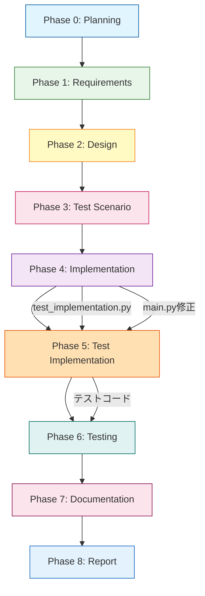

# プロジェクト計画書 - Issue #324

## Issue分析

### 複雑度判定: **中程度**

**判定理由**:
- 複数のPythonファイルの修正が必要（main.py、phases/__init__.py、test_implementation.py新規作成）
- 既存機能（8フェーズワークフロー）の拡張であり、アーキテクチャ変更は不要
- プロンプトファイルは既に作成済み（prompts/test_implementation/配下）
- metadata.jsonの構造にtest_implementationは既に含まれている（workflow_state.py:80-86）
- Jenkins DSLもtest_implementationをサポート済み（ai_workflow_orchestrator.groovy:56）
- **実装不足の箇所**: main.pyのphase選択肢、phases/__init__.pyのエクスポート、test_implementation.pyの新規作成、reportフェーズのphase番号更新

### 見積もり工数: **8時間**

**根拠**:
- Phase分析・ファイル調査: 1時間（完了）
- test_implementation.py実装: 2時間（ImplementationPhaseを参考に300行程度）
- main.pyとphasesパッケージ修正: 1時間
- 単体テスト作成: 2時間（test_implementation.pyのテスト）
- 統合テスト実行: 1時間（実際のワークフロー実行確認）
- ドキュメント更新（README、ROADMAP等）: 1時間

### リスク評価: **低**

**理由**:
- プロンプトとメタデータ構造は既に実装済み
- 実装パターン（ImplementationPhase、TestingPhase）が確立されている
- 後方互換性維持が容易（既存7フェーズは引き続き動作）
- テスト環境が整備されている（unit/integration tests）

---

## 実装戦略判断

### 実装戦略: **CREATE**

**判断根拠**:
- 新規ファイル `test_implementation.py` を作成（約300行）
- 既存ファイル（main.py、phases/__init__.py）は軽微な修正のみ
- 既存のImplementationPhase、TestingPhaseクラスをテンプレートとして活用
- BasePhaseを継承した標準的なフェーズ実装パターンを踏襲

**修正が必要な既存ファイル**:
1. `scripts/ai-workflow/main.py`: phase選択肢に'test_implementation'を追加（96行目）
2. `scripts/ai-workflow/phases/__init__.py`: TestImplementationPhaseをエクスポート
3. `scripts/ai-workflow/phases/report.py`: Phase番号を7→8に更新（コメント・ログのみ）

**新規作成ファイル**:
1. `scripts/ai-workflow/phases/test_implementation.py`: TestImplementationPhaseクラス（約300行）

### テスト戦略: **UNIT_INTEGRATION**

**判断根拠**:
- **ユニットテスト**: TestImplementationPhaseクラスの各メソッド（execute, review, revise）の動作確認
  - モックを使用してClaudeクライアント、GitHubクライアントの動作を分離
  - ファイルパス解決、プロンプト生成ロジックのテスト
  - 既存のtest_planning.pyと同じパターン
- **インテグレーションテスト**: 実際のワークフローでの動作確認
  - Phase 4（implementation）→ Phase 5（test_implementation）→ Phase 6（testing）の連携
  - metadata.jsonの更新確認
  - Git auto-commit動作確認
  - 既存の統合テストケースに追加

**テストレベルの選定理由**:
- UNIT: クラスメソッドのロジック検証が必要
- INTEGRATION: 8フェーズワークフロー全体での動作確認が必須
- BDD不要: エンドユーザー向け機能ではなく、内部フレームワークの拡張

### テストコード戦略: **CREATE_TEST**

**判断根拠**:
- **新規テストファイル作成**: `tests/unit/phases/test_test_implementation.py`（約200行）
  - 理由: 新規Phase実装のため、既存テストファイルには含まれない
  - 参考: `tests/unit/phases/test_planning.py`（同様のテスト構造）
- **既存統合テストの拡張は不要**: 統合テストは手動実行で確認（開発初期段階）

---

## 影響範囲分析

### 既存コードへの影響

#### 1. 軽微な修正が必要なファイル
- **`scripts/ai-workflow/main.py`** (line 96-97)
  - phase選択肢に`'test_implementation'`を追加
  - phase_classesディクショナリに`'test_implementation': TestImplementationPhase`を追加
  - 影響: 既存フェーズの動作に影響なし

- **`scripts/ai-workflow/phases/__init__.py`**
  - TestImplementationPhaseクラスのインポートとエクスポート
  - 影響: 既存のインポートに影響なし

- **`scripts/ai-workflow/phases/report.py`** (コメントのみ)
  - フェーズ番号を「Phase 7」→「Phase 8」に更新
  - 影響: ロジックに影響なし、表示のみ

#### 2. 修正不要なファイル（既に対応済み）
- ✅ `scripts/ai-workflow/core/workflow_state.py`: test_implementationフェーズ定義済み（80-86行目）
- ✅ `jenkins/jobs/dsl/ai-workflow/ai_workflow_orchestrator.groovy`: 選択肢に含まれている（56行目）
- ✅ `scripts/ai-workflow/prompts/test_implementation/*.txt`: プロンプト作成済み

### 依存関係の変更

#### 新規依存
- なし（既存のBasePhase、ClaudeAgentClient、GitHubClientを使用）

#### 既存依存の変更
- なし

### マイグレーション要否

#### データベーススキーマ変更
- **不要**: metadata.jsonの構造は既に対応済み（WorkflowState.create_new()）

#### 設定ファイル変更
- **不要**: Jenkinsパイプライン、DSLは既に対応済み

#### 後方互換性
- **完全互換**: 既存の7フェーズワークフロー（planning→requirements→design→test_scenario→implementation→testing→documentation→report）は引き続き動作
- **新しい8フェーズワークフロー**: オプトイン方式（START_PHASEパラメータで選択可能）

---

## タスク分割

### Phase 1: 要件定義 (見積もり: 1.5h)

#### サブタスク1-1: Issue要件の詳細分析 (0.5h)
- **完了条件**: Issue #324の全要件（FR-001～FR-006、NFR-001～NFR-003）をリスト化
- **成果物**: requirements.md

#### サブタスク1-2: 受け入れ基準の明確化 (0.5h)
- **完了条件**: 9項目の受け入れ基準をテスト可能な形式に変換
- **成果物**: 受け入れテストチェックリスト

#### サブタスク1-3: 非機能要件の検証方法定義 (0.5h)
- **完了条件**: 後方互換性、パフォーマンス、トレーサビリティの検証手順を定義
- **成果物**: 非機能要件テスト計画

---

### Phase 2: 設計 (見積もり: 2h)

#### サブタスク2-1: TestImplementationPhaseクラス設計 (1h)
- **完了条件**: クラス構造、メソッド定義、プロンプト呼び出しフローを設計
- **成果物**: クラス設計図（UMLクラス図またはMarkdown）

#### サブタスク2-2: 既存ファイル修正箇所の特定 (0.5h)
- **完了条件**: main.py、phases/__init__.py、report.pyの修正箇所を行番号単位で特定
- **成果物**: 修正箇所リスト

#### サブタスク2-3: エラーハンドリング設計 (0.5h)
- **完了条件**: Phase 5特有のエラーケース（テストシナリオ未作成、実装未完了等）を洗い出し
- **成果物**: エラーハンドリング仕様書

---

### Phase 3: テストシナリオ (見積もり: 1h)

#### サブタスク3-1: ユニットテストシナリオ作成 (0.5h)
- **完了条件**: TestImplementationPhaseの全メソッドのテストケースを列挙
- **成果物**: ユニットテストシナリオ（Given-When-Then形式）

#### サブタスク3-2: 統合テストシナリオ作成 (0.5h)
- **完了条件**: Phase 4→5→6の連携シナリオを作成
- **成果物**: 統合テストシナリオ（エンドツーエンドフロー）

---

### Phase 4: 実装 (見積もり: 2h)

#### サブタスク4-1: TestImplementationPhase実装 (1.5h)
- **完了条件**: execute(), review(), revise()メソッドを実装（約300行）
- **成果物**: `phases/test_implementation.py`

#### サブタスク4-2: 既存ファイル修正 (0.5h)
- **完了条件**: main.py、phases/__init__.py、report.pyの修正完了
- **成果物**: 修正済みファイル

---

### Phase 5: テスト実装 (見積もり: 2h)

#### サブタスク5-1: ユニットテスト実装 (1.5h)
- **完了条件**: test_test_implementation.py作成（約200行）
- **成果物**: `tests/unit/phases/test_test_implementation.py`

#### サブタスク5-2: テストフィクスチャ作成 (0.5h)
- **完了条件**: モックデータ、テスト用metadata.json作成
- **成果物**: テストフィクスチャファイル

---

### Phase 6: テスト (見積もり: 1h)

#### サブタスク6-1: ユニットテスト実行 (0.5h)
- **完了条件**: 全ユニットテストがPASS
- **成果物**: テストレポート

#### サブタスク6-2: 統合テスト実行 (0.5h)
- **完了条件**: 実際のワークフロー（Phase 0→1→2→3→4→5→6→7→8）が正常完了
- **成果物**: 統合テスト実行ログ

---

### Phase 7: ドキュメント (見積もり: 1h)

#### サブタスク7-1: README更新 (0.5h)
- **完了条件**: 8フェーズワークフローの説明を追加
- **成果物**: 更新されたREADME.md

#### サブタスク7-2: ROADMAP更新 (0.5h)
- **完了条件**: Issue #324の完了をマイルストーンに反映
- **成果物**: 更新されたROADMAP.md

---

### Phase 8: レポート (見積もり: 0.5h)

#### サブタスク8-1: 実装レポート作成 (0.5h)
- **完了条件**: 実装内容、テスト結果、今後の課題をまとめる
- **成果物**: implementation_report.md

---

## 依存関係

### クリティカルパス
1. **Phase 2（設計）**: TestImplementationPhaseクラスの設計が全体に影響
2. **Phase 4（実装）**: test_implementation.py実装が後続フェーズをブロック
3. **Phase 6（テスト）**: 統合テストで問題が発見された場合、Phase 4に戻る可能性

---

## リスクと軽減策

### リスク1: Phase 4とPhase 5の責務分離が不明確
- **影響度**: 中
- **確率**: 中
- **軽減策**:
  - Phase 4プロンプト（implementation/execute.txt）に「テストコードは実装しない」と明記（既に実施済み）
  - Phase 5プロンプト（test_implementation/execute.txt）に「実コードは変更しない」と明記（既に実施済み）
  - レビュー時に責務違反がないかチェック

### リスク2: 既存ワークフローへの意図しない影響
- **影響度**: 高
- **確率**: 低
- **軽減策**:
  - main.pyのphase選択肢リストを慎重に修正（順序を変えない）
  - 既存の7フェーズワークフローを統合テストで検証
  - 後方互換性テストの実施（既存Issue #305、#310等で動作確認）

### リスク3: プロンプトファイルの不整合
- **影響度**: 中
- **確率**: 低
- **軽減策**:
  - プロンプトファイルは既に作成済み（prompts/test_implementation/配下）
  - Phase 4プロンプトとの整合性を確認（「テストコードは実装しない」の記載確認）
  - 実際の実行ログで動作確認

### リスク4: metadata.jsonのフェーズ順序不整合
- **影響度**: 低
- **確率**: 低
- **軽減策**:
  - workflow_state.pyは既にtest_implementationを含む構造（80-86行目）
  - 新規ワークフロー初期化時にのみ使用されるため、既存データへの影響なし
  - ユニットテストでmetadata.json構造を検証

### リスク5: Jenkinsパイプラインの動作不良
- **影響度**: 中
- **確率**: 低
- **軽減策**:
  - Jenkins DSLは既にtest_implementationをサポート（ai_workflow_orchestrator.groovy:56）
  - Jenkinsfile修正は不要（main.pyのphase選択肢のみ修正）
  - 統合テストでJenkins経由の実行を確認

---

## 品質ゲート

### Phase 1: 要件定義

- [ ] **機能要件が明確に記載されている**（FR-001～FR-006）
- [ ] **非機能要件が明確に記載されている**（NFR-001～NFR-003）
- [ ] **受け入れ基準が定義されている**（9項目）
- [ ] **Issue #324の全要件がカバーされている**

### Phase 2: 設計

- [ ] ✅ **実装戦略の判断根拠が明記されている**（CREATE）
- [ ] ✅ **テスト戦略の判断根拠が明記されている**（UNIT_INTEGRATION）
- [ ] ✅ **テストコード戦略の判断根拠が明記されている**（CREATE_TEST）
- [ ] **TestImplementationPhaseクラス設計が完了している**
- [ ] **既存ファイル修正箇所が特定されている**（行番号単位）
- [ ] **エラーハンドリング設計が完了している**

### Phase 3: テストシナリオ

- [ ] **ユニットテストシナリオが作成されている**（Given-When-Then形式）
- [ ] **統合テストシナリオが作成されている**（エンドツーエンド）
- [ ] **エッジケースが考慮されている**（テストシナリオ未作成、実装未完了等）

### Phase 4: 実装

- [ ] **TestImplementationPhaseクラスが実装されている**（約300行）
- [ ] **main.pyにtest_implementationが追加されている**
- [ ] **phases/__init__.pyにTestImplementationPhaseがエクスポートされている**
- [ ] **report.pyのPhase番号が更新されている**
- [ ] **既存コードの規約に準拠している**
- [ ] **基本的なエラーハンドリングがある**
- [ ] **明らかなバグがない**

### Phase 5: テスト実装

- [ ] **test_test_implementation.pyが作成されている**（約200行）
- [ ] **全メソッド（execute, review, revise）のテストがある**
- [ ] **モックを使用した単体テストが実装されている**
- [ ] **テストの意図がコメントで明確**

### Phase 6: テスト

- [ ] **全ユニットテストがPASSしている**
- [ ] **統合テスト（Phase 0→1→2→3→4→5→6→7→8）が成功している**
- [ ] **既存ワークフロー（7フェーズ）が引き続き動作している**（後方互換性）
- [ ] **metadata.jsonにtest_implementationフェーズが記録されている**
- [ ] **Git auto-commit & pushが正しく動作している**

### Phase 7: ドキュメント

- [ ] **README.mdが更新されている**（8フェーズワークフローの説明）
- [ ] **ROADMAP.mdが更新されている**（Issue #324完了の記載）
- [ ] **クリティカルシンキングレビューが正しく機能している**（Phase 5レビュー）

### Phase 8: レポート

- [ ] **実装レポートが作成されている**（実装内容、テスト結果、今後の課題）
- [ ] **Issue #324の受け入れ基準がすべて満たされている**

---

## まとめ

### 実装の重要ポイント

1. **既存実装の活用**:
   - プロンプトファイル、metadata.json構造、Jenkins DSLは既に対応済み
   - ImplementationPhase、TestingPhaseをテンプレートとして活用

2. **責務の明確化**:
   - Phase 4: 実コードのみ実装
   - Phase 5: テストコードのみ実装
   - プロンプトで明示的に指示

3. **後方互換性の維持**:
   - 既存の7フェーズワークフローは引き続き動作
   - main.pyのphase選択肢リストに'test_implementation'を追加するのみ

4. **段階的な開発**:
   - Phase 4でTestImplementationPhaseクラスを完成させる
   - Phase 5でテストコードを完成させる
   - Phase 6で統合テストを実施

### 成功の指標

- ✅ Phase 4とPhase 5が明確に分離されている
- ✅ 既存ワークフローが引き続き動作する（後方互換性）
- ✅ 新しい8フェーズワークフローが正常に実行される
- ✅ クリティカルシンキングレビューがPhase 5でも機能する
- ✅ 全受け入れ基準（9項目）が満たされる

---

**総見積もり工数**: 8時間
**リスクレベル**: 低
**実装戦略**: CREATE（新規ファイル作成）
**テスト戦略**: UNIT_INTEGRATION（ユニット + 統合）
**テストコード戦略**: CREATE_TEST（新規テストファイル作成）
