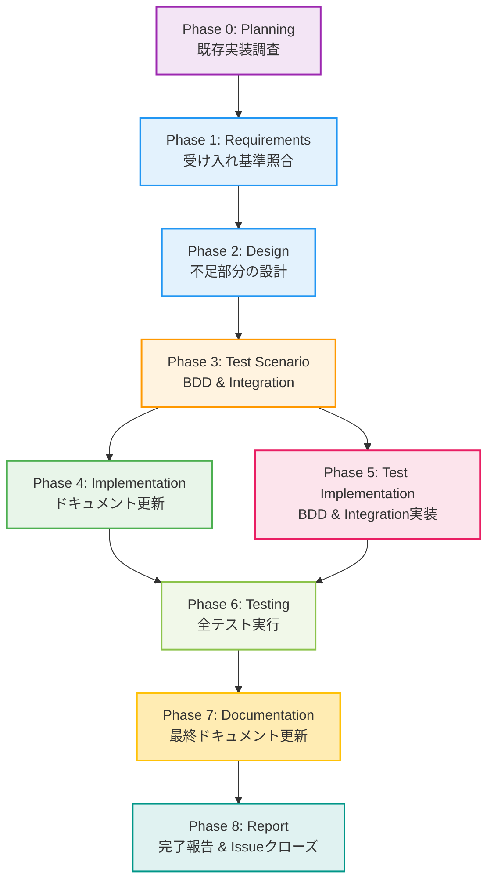

# プロジェクト計画書 - Issue #324

## Issue情報

- **Issue番号**: #324
- **タイトル**: [FEATURE] 実装フェーズとテストコード実装フェーズの分離
- **状態**: open
- **URL**: https://github.com/tielec/infrastructure-as-code/issues/324

## 1. Issue分析

### 複雑度

**判定: 中程度**

### 根拠

- **既存実装の状況**: `test_implementation`フェーズは既に実装済み（`scripts/ai-workflow/phases/test_implementation.py`、プロンプト、metadata.json統合）
- **作業範囲**: Issue #324の要件の多くは既に実装されているが、受け入れ基準を完全に満たしているか検証が必要
- **残存タスク**: ドキュメント更新、後方互換性の検証、Jenkinsジョブの確認、全フェーズの動作確認

### 見積もり工数

**12時間**（根拠）

- Phase 1（要件定義）: 2時間 - 既存実装の詳細調査、受け入れ基準との照合
- Phase 2（設計）: 1.5時間 - 不足している部分の設計（あれば）
- Phase 3（テストシナリオ）: 2時間 - 受け入れ基準ベースのテストシナリオ作成
- Phase 4（実装）: 2時間 - 不足部分の実装（ドキュメント更新、設定ファイル修正など）
- Phase 5（テスト実装）: 1.5時間 - テストコードの追加・修正
- Phase 6（テスト実行）: 1時間 - 全フェーズの動作確認
- Phase 7（ドキュメント）: 1時間 - READMEやCONTRIBUTION.mdの更新
- Phase 8（レポート）: 1時間 - 完了報告とIssueクローズ

### リスク評価

**中**

#### リスク要因

1. **既存実装の不完全性**: 実装されているが、受け入れ基準を完全に満たしているか不明
2. **後方互換性の問題**: 既存ワークフロー（Phase 1-7）が正しく動作するか
3. **Jenkinsジョブの未更新**: JenkinsfileやJob DSLが最新のフェーズ構成に対応しているか
4. **ドキュメントの不整合**: README.mdなどのドキュメントが最新でない可能性

## 2. 実装戦略判断

### 実装戦略: EXTEND

**判断根拠**:

- `test_implementation`フェーズのコア機能は既に実装済み
- 不足している部分（ドキュメント、設定ファイル、テストコード）を拡張
- 既存コードのリファクタリングは最小限にとどめる

### テスト戦略: INTEGRATION_BDD

**判断根拠**:

- **Integration Test**: 全フェーズ（Phase 0-8）が正しく連携して動作することを確認
- **BDD Test**: 受け入れ基準を直接検証するシナリオテスト（Gherkin形式）
- **Unit Testは不要**: 既存のPhaseクラスのユニットテストは既に存在

**テスト対象**:

1. **Integration Test**:
   - Phase 4（implementation）でテストコードが生成されないこと
   - Phase 5（test_implementation）でテストコードのみが生成されること
   - Phase 6（testing）がPhase 5の成果物を使用してテストを実行すること
   - metadata.jsonにtest_implementationフェーズが正しく記録されること

2. **BDD Test**:
   - 受け入れ基準の各項目を直接検証するシナリオ
   - 既存ワークフロー（Phase 1-7）の後方互換性確認

### テストコード戦略: CREATE_TEST

**判断根拠**:

- 新規BDDテストシナリオを作成（`tests/features/test_implementation_phase_separation.feature`）
- 新規インテグレーションテストを作成（`tests/integration/test_phase_separation.py`）
- 既存テストの拡張は不要（test_implementationフェーズ自体のテストは別途存在すると想定）

## 3. 影響範囲分析

### 既存コードへの影響

#### 実装済みの影響

1. **scripts/ai-workflow/phases/test_implementation.py** - ✅ 実装済み
2. **scripts/ai-workflow/main.py** - ✅ test_implementationフェーズが統合済み
3. **scripts/ai-workflow/prompts/test_implementation/** - ✅ プロンプトファイル作成済み
4. **metadata.json schema** - ✅ test_implementationフェーズが追加済み

#### 未確認・要検証

1. **jenkins/jobs/dsl/** - Jenkinsジョブ定義が最新か？
2. **scripts/ai-workflow/core/workflow_state.py** - フェーズ番号の変更に対応しているか？
3. **README.md, CONTRIBUTION.md** - ドキュメントが最新か？
4. **tests/** - 受け入れ基準を満たすテストが存在するか？

### 依存関係の変更

**新規依存の追加**: なし

**既存依存の変更**:

- Phase 5（testing） → Phase 6（testing）に繰り下げ
- Phase 6（documentation） → Phase 7（documentation）に繰り下げ
- Phase 7（report） → Phase 8（report）に繰り下げ

### マイグレーション要否

**必要**: metadata.jsonスキーマのマイグレーション

- 既存のIssueワークフロー（Phase 1-7構成）が、新しいスキーマ（Phase 0-8構成）でも動作するように後方互換性を確保
- migration機能が既に実装されているか確認（`WorkflowState.migrate()`メソッドの詳細確認）

## 4. タスク分割

### Phase 1: 要件定義 (見積もり: 2h)

**サブタスク**:

1. **既存実装の詳細調査** (0.5h)
   - `test_implementation.py`のコードレビュー
   - プロンプトファイルの内容確認
   - metadata.jsonのスキーマ確認

2. **受け入れ基準との照合** (1h)
   - Issue #324の受け入れ基準8項目をチェックリスト化
   - 各項目が既存実装で満たされているか検証
   - 不足している項目を特定

3. **要件定義書の作成** (0.5h)
   - 満たされている要件を明記
   - 不足している要件を明記
   - 追加で必要な作業を定義

### Phase 2: 設計 (見積もり: 1.5h)

**サブタスク**:

1. **不足部分の設計** (0.5h)
   - ドキュメント更新方針の決定
   - Jenkinsジョブの修正方針の決定
   - テスト戦略の詳細化

2. **後方互換性の設計** (0.5h)
   - 既存ワークフロー（Phase 1-7）の動作保証方法
   - metadata.jsonマイグレーション戦略の確認

3. **設計書の作成** (0.5h)
   - ファイル構成図
   - データフロー図
   - 実装詳細の記述

### Phase 3: テストシナリオ (見積もり: 2h)

**サブタスク**:

1. **BDDシナリオの作成** (1h)
   - 受け入れ基準ベースのGherkinシナリオ作成
   - `tests/features/test_implementation_phase_separation.feature`

2. **インテグレーションテストシナリオの作成** (0.5h)
   - Phase 4とPhase 5の責務分離を確認するシナリオ
   - metadata.json更新を確認するシナリオ

3. **テストシナリオドキュメントの作成** (0.5h)
   - テストケース一覧
   - 期待される結果
   - テスト環境の要件

### Phase 4: 実装 (見積もり: 2h)

**サブタスク**:

1. **ドキュメントの更新** (0.5h)
   - README.mdのフェーズ構成を更新（Phase 1-7 → Phase 0-8）
   - CONTRIBUTION.mdに開発ガイドラインを追加
   - scripts/ai-workflow/README.md（存在する場合）の更新

2. **Jenkinsジョブの検証と修正** (0.5h)
   - Job DSLファイルを確認
   - test_implementationフェーズが含まれているか検証
   - 不足があれば追加

3. **設定ファイルの検証** (0.5h)
   - metadata.jsonのスキーマが正しいか確認
   - WorkflowState.migrate()の動作確認
   - 必要に応じて修正

4. **実装ログの作成** (0.5h)
   - 実施した変更内容を記録
   - 変更前後の差分を明示

### Phase 5: テスト実装 (見積もり: 1.5h)

**サブタスク**:

1. **BDDテストの実装** (0.5h)
   - `tests/features/steps/`にステップ定義を実装
   - 受け入れ基準を直接検証するコード

2. **インテグレーションテストの実装** (0.5h)
   - `tests/integration/test_phase_separation.py`を作成
   - Phase 4とPhase 5の責務分離を確認

3. **テスト補助スクリプトの作成** (0.5h)
   - テスト用のモックデータ生成
   - テスト環境のセットアップスクリプト

### Phase 6: テスト実行 (見積もり: 1h)

**サブタスク**:

1. **ユニットテストの実行** (0.2h)
   - 既存のテストが全てパスすることを確認

2. **インテグレーションテストの実行** (0.3h)
   - Phase 4とPhase 5の連携動作を確認
   - metadata.json更新を確認

3. **BDDテストの実行** (0.3h)
   - 受け入れ基準8項目を全て検証
   - 後方互換性を確認

4. **テスト結果の記録** (0.2h)
   - test-result.mdに結果を記録
   - 失敗したテストの詳細を記載

### Phase 7: ドキュメント (見積もり: 1h)

**サブタスク**:

1. **ユーザー向けドキュメントの更新** (0.5h)
   - README.mdの最終チェック
   - セットアップ手順の確認
   - フェーズ構成図の更新

2. **開発者向けドキュメントの更新** (0.3h)
   - CONTRIBUTION.mdの最終チェック
   - アーキテクチャ図の更新（必要に応じて）

3. **CHANGELOG.mdの更新** (0.2h)
   - バージョン番号の決定（v1.4.0を想定）
   - 変更内容の記載

### Phase 8: レポート (見積もり: 1h)

**サブタスク**:

1. **完了報告書の作成** (0.5h)
   - 実施内容のサマリ
   - 受け入れ基準の達成状況
   - リリースノート

2. **GitHub Issueへのコメント** (0.2h)
   - 完了報告の投稿
   - 関連PRのリンク

3. **Issueクローズ** (0.1h)
   - 最終確認
   - Issueのクローズ

4. **ナレッジの記録** (0.2h)
   - 学んだ教訓
   - 今後の改善提案

## 5. 依存関係



## 6. リスクと軽減策

### リスク1: 既存実装が受け入れ基準を完全に満たしていない

- **影響度**: 高
- **確率**: 中
- **軽減策**:
  - Phase 1で詳細な調査を実施し、不足部分を特定
  - Phase 4で不足部分を追加実装
  - Phase 6で受け入れ基準8項目を全て検証

### リスク2: 後方互換性の問題（既存ワークフロー Phase 1-7 が動作しない）

- **影響度**: 高
- **確率**: 低
- **軽減策**:
  - `WorkflowState.migrate()`メソッドが正しく機能するか確認
  - Phase 6でBDDテストにより後方互換性を検証
  - 問題があればPhase 4で修正

### リスク3: Jenkinsジョブが最新のフェーズ構成に対応していない

- **影響度**: 中
- **確率**: 中
- **軽減策**:
  - Phase 1でJenkinsジョブ定義を確認
  - Phase 4で必要に応じてJob DSLを修正
  - Phase 6でJenkins上での動作確認（可能であれば）

### リスク4: ドキュメントの不整合（README.mdなどが古い）

- **影響度**: 低
- **確率**: 高
- **軽減策**:
  - Phase 1でドキュメントの現状を確認
  - Phase 4とPhase 7でドキュメントを更新
  - Phase 7で最終チェックを実施

### リスク5: テスト工数の見積もりが不足

- **影響度**: 低
- **確率**: 中
- **軽減策**:
  - Phase 6で想定外の問題が発生した場合、Phase 4に戻って修正
  - リトライ機能を活用して柔軟に対応
  - クリティカルシンキングレビューで早期に問題を検出

## 7. 品質ゲート

### Phase 0: プロジェクト計画（Planning）

- [x] **実装戦略が明確に決定されている**（EXTEND）
- [x] **テスト戦略が明確に決定されている**（INTEGRATION_BDD）
- [x] **テストコード戦略が明確に決定されている**（CREATE_TEST）
- [x] **影響範囲が分析されている**
- [x] **タスク分割が適切な粒度である**（1タスク = 0.1~1時間）
- [x] **リスクが洗い出されている**（5つのリスクを特定）

### Phase 1: 要件定義（Requirements）

- [ ] Issue #324の受け入れ基準8項目が明確にリスト化されている
- [ ] 各受け入れ基準に対する現状（満たされている/いない）が記載されている
- [ ] 不足している要件が具体的に定義されている
- [ ] 機能要件と非機能要件が明確に分離されている

### Phase 2: 設計（Design）

- [ ] 不足部分の実装方針が明確に記載されている
- [ ] ファイル構成図が作成されている
- [ ] データフロー図が作成されている
- [ ] 後方互換性の保証方法が設計されている
- [ ] 実装詳細が具体的に記述されている

### Phase 3: テストシナリオ（Test Scenario）

- [ ] 受け入れ基準8項目に対応するBDDシナリオが作成されている
- [ ] Phase 4とPhase 5の責務分離を確認するシナリオが作成されている
- [ ] 後方互換性を確認するシナリオが作成されている
- [ ] 期待される結果が明確に記載されている
- [ ] テストケース一覧が作成されている

### Phase 4: 実装（Implementation）

- [ ] README.mdが更新されている（Phase 1-7 → Phase 0-8）
- [ ] CONTRIBUTION.mdが更新されている（必要に応じて）
- [ ] Jenkinsジョブ定義が最新である
- [ ] 設定ファイル（metadata.json schema）が正しい
- [ ] 実装ログが作成されている
- [ ] **テストコードは実装されていない**（Phase 5で実装）

### Phase 5: テスト実装（Test Implementation）

- [ ] BDDテストのステップ定義が実装されている
- [ ] インテグレーションテストが実装されている
- [ ] テスト補助スクリプトが作成されている（必要に応じて）
- [ ] **実コードは修正されていない**（Phase 4で実装済み）

### Phase 6: テスト実行（Testing）

- [ ] 既存のユニットテストが全てパスしている
- [ ] インテグレーションテストが全てパスしている
- [ ] BDDテストが全てパスしている（受け入れ基準8項目）
- [ ] 後方互換性が確認されている
- [ ] test-result.mdが作成されている

### Phase 7: ドキュメント（Documentation）

- [ ] README.mdが最新の状態である
- [ ] CONTRIBUTION.mdが最新の状態である
- [ ] CHANGELOG.mdが更新されている
- [ ] アーキテクチャ図が更新されている（必要に応じて）
- [ ] ドキュメント間の整合性が取れている

### Phase 8: レポート（Report）

- [ ] 完了報告書が作成されている
- [ ] GitHub Issueに完了報告が投稿されている
- [ ] 受け入れ基準8項目の達成状況が記載されている
- [ ] リリースノートが作成されている
- [ ] Issue #324がクローズされている

## 8. 受け入れ基準のチェックリスト

Issue #324の受け入れ基準を再掲し、検証方法を明記します。

### FR-001: Phase 5の新設（test_implementation）

- [ ] ✅ テストコード実装に特化したフェーズが追加されている（**実装済み**）
- [ ] ✅ Phase 3（test_scenario）で作成されたテストシナリオを基に実装している（**実装済み**）
- [ ] ✅ Phase 4（implementation）で実装された実コードに対するテストを作成している（**実装済み**）

**検証方法**: Phase 6でBDDテストを実行し、Phase 5の責務を確認

### FR-002: 既存フェーズの番号変更

- [ ] ✅ Phase 5（testing）→ Phase 6（testing）に繰り下げ（**実装済み**）
- [ ] ✅ Phase 6（documentation）→ Phase 7（documentation）に繰り下げ（**実装済み**）
- [ ] ✅ Phase 7（report）→ Phase 8（report）に繰り下げ（**実装済み**）

**検証方法**: metadata.jsonのスキーマを確認、Phase 6でインテグレーションテストを実行

### FR-003: Phase 4（implementation）の責務明確化

- [ ] ❓ 実コードのみを実装対象としている（**要確認**）
- [ ] ❓ テストコードはPhase 5（test_implementation）に委譲している（**要確認**）
- [ ] ❓ プロンプトが更新されて責務が明確化されている（**要確認**）

**検証方法**: Phase 1でプロンプトファイルを精査、Phase 6でBDDテストを実行

### FR-004: Phase 5（test_implementation）のプロンプト作成

- [ ] ✅ prompts/test_implementation/execute.txtが存在する（**実装済み**）
- [ ] ✅ prompts/test_implementation/review.txtが存在する（**実装済み**）
- [ ] ✅ prompts/test_implementation/revise.txtが存在する（**実装済み**）

**検証方法**: Phase 1でファイルの存在と内容を確認

### FR-005: metadata.jsonの拡張

- [ ] ✅ phases配列にtest_implementationが追加されている（**実装済み**）
- [ ] ✅ 既存のメタデータ構造との互換性を維持している（**実装済み**）

**検証方法**: Phase 1でスキーマを確認、Phase 6でマイグレーションテストを実行

### FR-006: 依存関係の明確化

- [ ] ❓ Phase 5（test_implementation）はPhase 4（implementation）の完了が前提である（**要確認**）
- [ ] ❓ Phase 6（testing）はPhase 5（test_implementation）の完了が前提である（**要確認**）

**検証方法**: Phase 1でコードを確認、Phase 6でインテグレーションテストを実行

### NFR-001: 後方互換性

- [ ] ❓ 既存のワークフロー（Phase 1-7）は引き続き動作する（**要確認**）
- [ ] ❓ 新しいフェーズ構成はオプトイン方式である（**要確認**）

**検証方法**: Phase 6でBDDテストを実行（後方互換性シナリオ）

### NFR-002: パフォーマンス

- [ ] ❓ フェーズ追加によるオーバーヘッドは最小限である（**要確認**）
- [ ] ❓ 各フェーズの実行時間は従来のPhase 4の半分程度である（**要確認**）

**検証方法**: Phase 6でパフォーマンス測定（可能であれば）

### NFR-003: ログとトレーサビリティ

- [ ] ❓ 各フェーズの実行ログを明確に分離している（**要確認**）
- [ ] ❓ Phase間の依存関係をログで追跡可能である（**要確認**）

**検証方法**: Phase 1でログ出力を確認、Phase 6で実行ログを検証

## 9. スコープ外

以下は本Issue #324のスコープ外とします：

1. **test_implementationフェーズの機能追加**: 既存実装の検証と修正のみ
2. **他のフェーズの大幅な変更**: Phase 4とPhase 5に関連する最小限の変更のみ
3. **パフォーマンス最適化**: 動作確認と基本的なパフォーマンス測定のみ
4. **UI/UX改善**: Jenkinsジョブやドキュメントの最小限の更新のみ

## 10. 成功基準

このプロジェクトは、以下の条件を満たした場合に成功とみなします：

1. **受け入れ基準の達成**: Issue #324の8項目すべてが満たされている
2. **後方互換性の保証**: 既存ワークフロー（Phase 1-7）が引き続き動作する
3. **テストのパス**: Phase 6で実装された全てのテストがパスする
4. **ドキュメントの完備**: README.md、CONTRIBUTION.md、CHANGELOG.mdが最新である
5. **Issueのクローズ**: Issue #324が正式にクローズされる

## 11. プロジェクト実行計画

### 優先順位

1. **Phase 1（要件定義）**: 最優先 - 既存実装の正確な把握が必須
2. **Phase 2（設計）**: 高優先 - 不足部分の特定と設計
3. **Phase 3（テストシナリオ）**: 高優先 - 受け入れ基準の検証方法を明確化
4. **Phase 4（実装）**: 中優先 - 不足部分の実装
5. **Phase 5（テスト実装）**: 中優先 - テストコードの実装
6. **Phase 6（テスト実行）**: 高優先 - 受け入れ基準の検証
7. **Phase 7（ドキュメント）**: 低優先 - 最終整理
8. **Phase 8（レポート）**: 低優先 - 完了報告

### クリティカルパス

```
Phase 1 → Phase 2 → Phase 3 → Phase 4 → Phase 6 → Phase 8
                                    ↓
                               Phase 5 ↓
```

Phase 4とPhase 5は並行実行可能ですが、Phase 6はその両方の完了が前提です。

### マイルストーン

1. **M1: 要件確定** - Phase 1完了時点（実装済み部分と不足部分の明確化）
2. **M2: 設計完了** - Phase 2完了時点（実装方針の確定）
3. **M3: 実装完了** - Phase 4 & Phase 5完了時点（コード変更とテスト実装の完了）
4. **M4: 検証完了** - Phase 6完了時点（受け入れ基準の達成確認）
5. **M5: プロジェクト完了** - Phase 8完了時点（Issue #324クローズ）

## 12. まとめ

### プロジェクトの本質

Issue #324は、**既に実装済みの`test_implementation`フェーズを正式にリリースするための最終検証プロジェクト**です。コア機能は既に実装されていますが、以下の点を確認・補完する必要があります：

1. ✅ 実装済み: `test_implementation.py`、プロンプトファイル、metadata.json統合
2. ❓ 要確認: 受け入れ基準8項目の達成状況
3. ❓ 要確認: 後方互換性の保証
4. ❓ 要補完: ドキュメントの更新
5. ❓ 要補完: Jenkinsジョブの確認
6. ❓ 要補完: テストコードの追加

### 重要なポイント

- **実装戦略: EXTEND** - 既存実装を拡張・補完
- **テスト戦略: INTEGRATION_BDD** - 受け入れ基準を直接検証
- **テストコード戦略: CREATE_TEST** - 新規BDD & Integrationテストを作成
- **複雑度: 中程度** - 既存実装の検証と補完が中心
- **見積もり工数: 12時間** - 各フェーズ1~2時間程度

### 次のステップ

1. Phase 1（要件定義）で既存実装を詳細調査
2. Phase 2（設計）で不足部分を特定・設計
3. Phase 6（テスト実行）で受け入れ基準を検証
4. Phase 8（レポート）でIssue #324をクローズ

---

**作成日**: 2025-10-12
**作成者**: AI Workflow Orchestrator (Phase 0: Planning)
**バージョン**: 1.0
