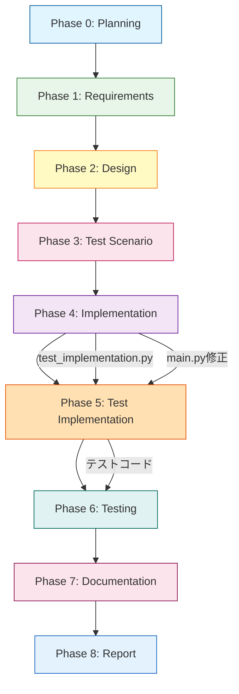

# 要件定義書 - Issue #324

## 0. Planning Documentの確認

Planning Phase（Phase 0）で作成された計画書を確認しました。以下の重要事項を踏まえて要件定義を実施します：

### 開発戦略の概要
- **複雑度**: 中程度
- **見積もり工数**: 8時間
- **リスクレベル**: 低
- **実装戦略**: CREATE（新規ファイル作成）
- **テスト戦略**: UNIT_INTEGRATION（ユニット + 統合テスト）
- **テストコード戦略**: CREATE_TEST（新規テストファイル作成）

### 主要な実装箇所（Planning Documentより）
- **新規作成**: `scripts/ai-workflow/phases/test_implementation.py`（約300行）
- **修正**: `scripts/ai-workflow/main.py`（phase選択肢追加）
- **修正**: `scripts/ai-workflow/phases/__init__.py`（エクスポート追加）
- **修正**: `scripts/ai-workflow/phases/report.py`（Phase番号更新）

### 既に対応済みの項目
- ✅ プロンプトファイル作成済み（`prompts/test_implementation/*.txt`）
- ✅ metadata.json構造対応済み（`workflow_state.py:80-86`）
- ✅ Jenkins DSL対応済み（`ai_workflow_orchestrator.groovy:56`）

---

## 1. 概要

### 背景
現在のAIワークフローでは、Phase 4（implementation）で実コードとテストコードを同時に実装しています。これにより以下の課題が発生しています：

- **責務の不明確さ**: 1つのフェーズで2つの異なる種類のコード（実コード、テストコード）を実装
- **レビューの焦点化が困難**: 実装とテストの両方を同時にレビューするため、観点が分散
- **段階的な開発が難しい**: 実コード完成後にテストコード実装という流れが明確でない

### 目的
実装フェーズとテストコード実装フェーズを分離し、8フェーズワークフローを構築します。

**新しいフェーズ構成**:
```
Phase 0: planning（計画）
Phase 1: requirements（要件定義）
Phase 2: design（設計）
Phase 3: test_scenario（テストシナリオ）
Phase 4: implementation（実装）← 実コードのみ
Phase 5: test_implementation（テストコード実装）← 新規追加
Phase 6: testing（テスト実行）
Phase 7: documentation（ドキュメント）
Phase 8: report（レポート）
```

### ビジネス価値・技術的価値

**ビジネス価値**:
- **品質向上**: 実装とテストを分離することで、各フェーズに特化したレビューが可能
- **トレーサビリティ強化**: Phase 3（test_scenario）→ Phase 5（test_implementation）→ Phase 6（testing）の流れが明確
- **並行作業の可能性**: 将来的に実装とテスト実装を別々に進められる

**技術的価値**:
- **責務分離**: 単一責任の原則（SRP）をフェーズレベルで適用
- **クリティカルシンキングレビューの精度向上**: 各フェーズで異なるレビュー基準を適用可能
- **保守性向上**: フェーズごとの成果物が明確になり、後続の修正が容易

---

## 2. 機能要件

### FR-001: Phase 5（test_implementation）の新設【高優先度】

**説明**: テストコード実装に特化したフェーズを追加します。

**詳細仕様**:
- **Phase名**: test_implementation
- **Phase番号**: 5
- **責務**:
  - Phase 3（test_scenario）で作成されたテストシナリオを基にテストコードを実装
  - Phase 4（implementation）で実装された実コードに対するテストを作成
  - 実コードの修正は行わない（テストコードのみ）
- **実装クラス**: `TestImplementationPhase`（BasePhaseを継承）
- **実装ファイル**: `scripts/ai-workflow/phases/test_implementation.py`（約300行）
- **参考実装**: `ImplementationPhase`、`TestingPhase`をテンプレートとして活用

**検証方法**:
- TestImplementationPhaseクラスが存在し、execute()、review()、revise()メソッドが実装されている
- Phase 4完了後にPhase 5を実行できる
- Phase 5でテストコードのみが実装される（実コードは変更されない）

---

### FR-002: 既存フェーズの番号変更【高優先度】

**説明**: Phase 5以降のフェーズ番号を1つずつ繰り下げます。

**詳細仕様**:
- Phase 5（testing）→ Phase 6（testing）
- Phase 6（documentation）→ Phase 7（documentation）
- Phase 7（report）→ Phase 8（report）

**影響範囲**:
- `scripts/ai-workflow/phases/report.py`: コメントとログ出力のPhase番号を7→8に更新
- Jenkins DSL: 既に対応済み（`ai_workflow_orchestrator.groovy:56`）
- metadata.json: 既に対応済み（`workflow_state.py:80-86`）

**検証方法**:
- report.pyのログ出力が「Phase 8: Report」となっている
- 既存のワークフロー（Phase 0→1→2→3→4→6→7→8）が引き続き動作する

---

### FR-003: Phase 4（implementation）の責務明確化【高優先度】

**説明**: Phase 4は実コードのみを実装対象とし、テストコードはPhase 5に委譲します。

**詳細仕様**:
- **Phase 4の責務**: 実コード（プロダクションコード）のみ実装
- **Phase 5に委譲**: テストコード（ユニットテスト、統合テスト）の実装
- **プロンプト更新**:
  - `prompts/implementation/execute.txt`: 「テストコードは実装しない」と明記（既に実施済み）
  - `prompts/implementation/review.txt`: 「テストコードが含まれていないか」をレビュー項目に追加

**検証方法**:
- Phase 4実行時にテストコードが実装されない
- Phase 4のレビューでテストコードの有無がチェックされる

---

### FR-004: Phase 5（test_implementation）のプロンプト確認【中優先度】

**説明**: Phase 5で使用するプロンプトファイルが適切に配置されていることを確認します。

**詳細仕様**:
- **既に作成済み**（Planning Documentより）:
  - `prompts/test_implementation/execute.txt`: テストコード実装プロンプト
  - `prompts/test_implementation/review.txt`: テストコードレビュープロンプト
  - `prompts/test_implementation/revise.txt`: テストコード修正プロンプト（オプション）

**プロンプト要件**:
- execute.txt: 「実コードは変更しない」と明記
- review.txt: 「実コードが変更されていないか」をレビュー項目に追加
- Phase 3（test_scenario）で作成されたテストシナリオへの参照を含む

**検証方法**:
- プロンプトファイルが存在する
- TestImplementationPhaseがプロンプトファイルを正しく読み込める
- プロンプトに「実コードは変更しない」旨が記載されている

---

### FR-005: metadata.jsonの拡張【高優先度】

**説明**: metadata.jsonにtest_implementationフェーズを記録します。

**詳細仕様**:
- **既に対応済み**（Planning Documentより）:
  - `workflow_state.py:80-86`にtest_implementationフェーズが定義済み
  - WorkflowState.create_new()で自動的に追加される

**metadata.json構造**:
```json
{
  "phases": {
    "test_implementation": {
      "status": "pending",
      "start_time": null,
      "end_time": null,
      "result": null,
      "git_commit": null
    }
  }
}
```

**検証方法**:
- 新規ワークフロー作成時にmetadata.jsonにtest_implementationが含まれる
- Phase 5実行時にstatusが更新される
- 既存のmetadata.json構造と互換性がある

---

### FR-006: 依存関係の明確化【高優先度】

**説明**: Phase間の依存関係を明確にします。

**詳細仕様**:
```
Phase 3 (test_scenario) → Phase 4 (implementation) → Phase 5 (test_implementation) → Phase 6 (testing)
```

**依存関係の実装**:
- Phase 5（test_implementation）はPhase 4（implementation）の完了が前提
- Phase 6（testing）はPhase 5（test_implementation）の完了が前提
- main.pyのphase選択肢リストに'test_implementation'を追加（96行目）

**検証方法**:
- Phase 4未完了時にPhase 5を実行すると適切なエラーメッセージが表示される
- Phase 5未完了時にPhase 6を実行すると適切なエラーメッセージが表示される

---

### FR-007: main.pyとphasesパッケージの修正【高優先度】

**説明**: Phase 5を実行可能にするため、main.pyとphasesパッケージを修正します。

**詳細仕様**:

**1. main.pyの修正**（line 96-97）:
```python
# phase選択肢に'test_implementation'を追加
phase_classes = {
    'planning': PlanningPhase,
    'requirements': RequirementsPhase,
    'design': DesignPhase,
    'test_scenario': TestScenarioPhase,
    'implementation': ImplementationPhase,
    'test_implementation': TestImplementationPhase,  # 追加
    'testing': TestingPhase,
    'documentation': DocumentationPhase,
    'report': ReportPhase,
}
```

**2. phases/__init__.pyの修正**:
```python
from .test_implementation import TestImplementationPhase

__all__ = [
    'PlanningPhase',
    'RequirementsPhase',
    'DesignPhase',
    'TestScenarioPhase',
    'ImplementationPhase',
    'TestImplementationPhase',  # 追加
    'TestingPhase',
    'DocumentationPhase',
    'ReportPhase',
]
```

**検証方法**:
- main.pyでTestImplementationPhaseがインポート可能
- phase選択肢に'test_implementation'が含まれる
- Jenkins DSLでtest_implementationが選択可能

---

## 3. 非機能要件

### NFR-001: 後方互換性【高優先度】

**説明**: 既存のワークフロー（7フェーズ）は引き続き動作します。

**詳細仕様**:
- **既存ワークフロー**: Phase 0→1→2→3→4→6→7→8（test_implementationをスキップ）
- **新しいワークフロー**: Phase 0→1→2→3→4→5→6→7→8（test_implementationを含む）
- **オプトイン方式**: START_PHASEパラメータで選択可能

**互換性保証**:
- main.pyのphase選択肢リストに'test_implementation'を追加するのみ
- 既存のmetadata.json構造を変更しない
- 既存のプロンプトファイルを変更しない

**検証方法**:
- Issue #305、#310等の既存Issueで7フェーズワークフローが動作する
- test_implementationをスキップしたワークフロー実行が可能
- metadata.jsonにtest_implementationが含まれていても既存フェーズが動作する

---

### NFR-002: パフォーマンス【中優先度】

**説明**: フェーズ追加によるオーバーヘッドを最小限に抑えます。

**詳細仕様**:
- **Phase 5の実行時間**: 従来のPhase 4の半分程度（約2時間 → 1時間ずつ）
- **オーバーヘッド**: Phase追加による追加時間は5分以内（メタデータ更新、Git操作等）
- **メモリ使用量**: 既存フェーズと同等（BasePhaseを継承するため）

**パフォーマンス目標**:
- Phase 4（実コードのみ）: 約1.5時間（Phase 2見積もりより）
- Phase 5（テストコードのみ）: 約2時間（Phase 5見積もりより）
- 合計: 3.5時間（従来のPhase 4の2時間から増加、ただし品質向上のトレードオフ）

**検証方法**:
- Phase 5の実行時間を計測し、2時間以内であることを確認
- 全体ワークフロー実行時間が従来の8時間から大幅に増加していないことを確認

---

### NFR-003: ログとトレーサビリティ【高優先度】

**説明**: 各フェーズの実行ログを明確に分離し、Phase間の依存関係を追跡可能にします。

**詳細仕様**:

**1. ログ分離**:
- Phase 4: `.ai-workflow/issue-XXX/04_implementation/`配下にログ保存
- Phase 5: `.ai-workflow/issue-XXX/05_test_implementation/`配下にログ保存
- 各フェーズのログは独立したディレクトリに保存

**2. トレーサビリティ**:
- metadata.jsonにPhase実行履歴を記録（start_time、end_time、result、git_commit）
- Phase間の依存関係をログで追跡可能
- Git commitメッセージにPhase情報を含める

**3. ログレベル**:
- INFO: 正常な処理フロー（Phase開始、完了、成果物保存）
- WARNING: 軽微な問題（リトライ、一部失敗）
- ERROR: 致命的な問題（Phase失敗、依存関係エラー）

**検証方法**:
- Phase 5のログが独立したディレクトリに保存される
- metadata.jsonにtest_implementationフェーズの実行履歴が記録される
- Git commitメッセージに「[ai-workflow] Phase 5 (test_implementation) - completed」と記録される

---

## 4. 制約事項

### 技術的制約

**TC-001: 既存実装パターンの踏襲**
- TestImplementationPhaseはBasePhaseを継承する必要がある
- execute()、review()、revise()メソッドを実装する必要がある
- ImplementationPhase、TestingPhaseをテンプレートとして活用する

**TC-002: プロンプトファイルの配置**
- プロンプトは`prompts/test_implementation/`ディレクトリに配置する
- execute.txt、review.txt、revise.txtの3ファイルが必要
- 既に作成済みのため、変更は最小限に留める

**TC-003: メタデータ構造**
- metadata.jsonの構造は既存フォーマットを維持する
- workflow_state.pyで定義されたフェーズ定義に従う
- 既存のWorkflowStateクラスのインターフェースを変更しない

**TC-004: Git auto-commit**
- 各フェーズ完了時にGit commitを自動実行する
- commitメッセージは「[ai-workflow] Phase X (phase_name) - status」形式
- Phase 5でも同様のcommit動作が必要

### リソース制約

**RC-001: 実装時間**
- 総見積もり工数: 8時間（Planning Documentより）
- Phase 4（実装）: 2時間
- Phase 5（テスト実装）: 2時間
- その他フェーズ: 4時間

**RC-002: テスト環境**
- 既存のunit/integration testsが動作する環境が必要
- Jenkinsパイプラインでの自動実行が可能な環境
- AWS SSM Parameter Storeへのアクセスが必要（Jenkins環境）

### ポリシー制約

**PC-001: コーディング規約**
- Pythonコーディング規約に準拠（PEP 8）
- 既存のBasePhase実装パターンに準拠
- コメントは日本語で記述（CLAUDE.mdより）

**PC-002: セキュリティポリシー**
- クレデンシャルのハードコーディング禁止
- 機密情報をログに出力しない
- Git commitに機密情報を含めない

**PC-003: ドキュメント更新ルール**
- README.mdの更新が必要（8フェーズワークフローの説明）
- ROADMAP.mdの更新が必要（Issue #324完了の記載）
- 変更内容は必ずドキュメントに反映する

---

## 5. 前提条件

### システム環境

**ENV-001: 実行環境**
- Python 3.8以上
- AWS CLI v2
- Git 2.x以上
- Jenkins 2.426.1以上（Jenkinsパイプライン実行時）

**ENV-002: ディレクトリ構造**
```
scripts/ai-workflow/
├── main.py                        # Phase実行エントリポイント
├── phases/
│   ├── __init__.py               # エクスポート定義
│   ├── base.py                   # BasePhase実装
│   ├── implementation.py         # 既存Phase 4
│   ├── test_implementation.py    # 新規Phase 5
│   ├── testing.py                # 既存Phase 6
│   └── report.py                 # 既存Phase 8
├── prompts/
│   ├── implementation/
│   │   ├── execute.txt
│   │   └── review.txt
│   ├── test_implementation/      # 既に作成済み
│   │   ├── execute.txt
│   │   ├── review.txt
│   │   └── revise.txt
│   └── testing/
│       ├── execute.txt
│       └── review.txt
└── core/
    └── workflow_state.py         # メタデータ管理
```

### 依存コンポーネント

**DEP-001: 既存フェーズ**
- Phase 3（test_scenario）が正常に動作すること
- Phase 4（implementation）が正常に動作すること
- Phase 6（testing）が正常に動作すること

**DEP-002: 共通ライブラリ**
- BasePhaseクラス（`phases/base.py`）
- ClaudeAgentClient（Claude APIクライアント）
- GitHubClient（GitHub API連携）
- WorkflowState（メタデータ管理）

**DEP-003: プロンプトファイル**
- `prompts/test_implementation/execute.txt`が存在すること
- `prompts/test_implementation/review.txt`が存在すること
- プロンプトに必要な情報が記載されていること

### 外部システム連携

**EXT-001: Git連携**
- Gitリポジトリが初期化されていること
- Git remote（origin）が設定されていること
- Phase完了時にGit commit & pushが可能であること

**EXT-002: Jenkins連携（オプション）**
- Jenkins DSLがtest_implementationをサポートしていること（既に対応済み）
- JenkinsパイプラインからPhase 5を実行可能であること
- 環境変数（ISSUE_NUMBER、START_PHASE等）が適切に設定されていること

**EXT-003: Claude API連携**
- Claude APIキーが設定されていること（環境変数またはSSM）
- Claude APIのレート制限に抵触しないこと
- プロンプトとレスポンスが適切にログ記録されること

---

## 6. 受け入れ基準

### AC-001: Phase 5（test_implementation）の新設

**Given**: Phase 4（implementation）が正常に完了している
**When**: Phase 5（test_implementation）を実行する
**Then**:
- TestImplementationPhaseクラスが正常にインスタンス化される
- execute()メソッドが実行され、テストコードが生成される
- review()メソッドでクリティカルシンキングレビューが実施される
- 実コードは変更されていない
- `.ai-workflow/issue-XXX/05_test_implementation/output/`配下にテストコードが保存される
- metadata.jsonのtest_implementationステータスが'completed'に更新される

**検証コマンド**:
```bash
python scripts/ai-workflow/main.py --issue-number 324 --phase test_implementation
```

---

### AC-002: Phase 4では実コードのみが実装される

**Given**: Phase 3（test_scenario）が正常に完了している
**When**: Phase 4（implementation）を実行する
**Then**:
- 実コード（プロダクションコード）のみが実装される
- テストコード（test_*.py）は実装されない
- review()メソッドでテストコードの有無がチェックされる
- テストコードが含まれている場合、レビューで指摘される

**検証方法**:
- Phase 4の成果物に`test_*.py`ファイルが含まれていないことを確認
- レビューログに「テストコードは含まれていません」という記載があることを確認

---

### AC-003: 既存ワークフローの後方互換性

**Given**: 既存のIssue（#305、#310等）が存在する
**When**: 7フェーズワークフロー（test_implementationをスキップ）を実行する
**Then**:
- Phase 0→1→2→3→4→6→7→8の順序で実行される
- test_implementationフェーズはスキップされる
- 既存のmetadata.json構造で動作する
- 全フェーズが正常に完了する

**検証コマンド**:
```bash
# test_implementationをスキップ
python scripts/ai-workflow/main.py --issue-number 305 --phase testing
```

---

### AC-004: Jenkinsでの自動実行

**Given**: Jenkins DSLが設定されている
**When**: JenkinsパイプラインでPhase 5を実行する
**Then**:
- START_PHASEパラメータで'test_implementation'が選択可能
- Jenkinsパイプラインが正常に実行される
- ログがJenkins UIで確認可能
- 実行結果がmetadata.jsonに記録される

**検証方法**:
- Jenkins UIでai-workflow-orchestratorジョブを実行
- START_PHASEで'test_implementation'を選択
- ビルドが成功することを確認

---

### AC-005: クリティカルシンキングレビューの機能

**Given**: Phase 5（test_implementation）が実行され、テストコードが生成されている
**When**: review()メソッドが実行される
**Then**:
- Phase 5に特化したレビュー基準が適用される
- テストコードの品質がチェックされる（カバレッジ、エッジケース、命名規則）
- 実コードが変更されていないかチェックされる
- レビュー結果が`.ai-workflow/issue-XXX/05_test_implementation/review.md`に保存される
- ブロッカーがある場合、Phase 5は'failed'ステータスになる

**検証方法**:
- review.mdにレビュー結果が記載されている
- ブロッカーがある場合、metadata.jsonのstatusが'failed'になる

---

### AC-006: metadata.jsonへの記録

**Given**: 新規ワークフローが開始される
**When**: WorkflowState.create_new()を実行する
**Then**:
- metadata.jsonにtest_implementationフェーズが含まれる
- phasesオブジェクトに以下のキーが存在する：
  - status: 'pending'
  - start_time: null
  - end_time: null
  - result: null
  - git_commit: null

**検証コマンド**:
```bash
cat .ai-workflow/issue-324/metadata.json | jq '.phases.test_implementation'
```

---

### AC-007: Git auto-commit & pushの動作

**Given**: Phase 5（test_implementation）が正常に完了している
**When**: Git auto-commitが実行される
**Then**:
- テストコードがGitにコミットされる
- commitメッセージに「[ai-workflow] Phase 5 (test_implementation) - completed」が含まれる
- リモートリポジトリにpushされる（設定による）
- metadata.jsonのgit_commitフィールドにcommit hashが記録される

**検証コマンド**:
```bash
git log --oneline --grep="Phase 5 (test_implementation)"
```

---

### AC-008: 全フェーズの完全実行（8フェーズワークフロー）

**Given**: 新規Issueが作成されている
**When**: Phase 0→1→2→3→4→5→6→7→8を順番に実行する
**Then**:
- 全フェーズが正常に完了する（statusが'completed'）
- Phase 4で実コードが実装される
- Phase 5でテストコードが実装される
- Phase 6でテストが実行される（Phase 5のテストコードを使用）
- 各フェーズの成果物が適切なディレクトリに保存される
- metadata.jsonに全フェーズの実行履歴が記録される

**検証方法**:
- metadata.jsonを確認し、全フェーズがstatusが'completed'になっている
- 各フェーズの成果物が存在する
- Git commitが8回行われている

---

## 7. スコープ外

以下の項目は本Issue（#324）のスコープ外とし、将来的な拡張候補とします。

### OUT-001: Phase 4とPhase 5の並行実行
- **理由**: 依存関係が明確であり、並行実行は複雑性を増す
- **将来的な拡張**: Issue #350等で別途検討

### OUT-002: Phase 5でのテストカバレッジ自動計測
- **理由**: Phase 6（testing）で実施するのが適切
- **将来的な拡張**: Phase 6の機能拡張として検討

### OUT-003: Phase 5での実コード修正の許可
- **理由**: 責務分離の原則に反する
- **将来的な拡張**: Phase 4とPhase 5の往復フローを別途検討

### OUT-004: 既存7フェーズワークフローの自動マイグレーション
- **理由**: 後方互換性が保証されているため不要
- **将来的な拡張**: 必要に応じてマイグレーションツールを作成

### OUT-005: Phase 5でのBDDテスト実装
- **理由**: 現時点ではユニットテスト・統合テストのみが対象（Planning Documentより）
- **将来的な拡張**: Issue #400等で別途検討

### OUT-006: Phase 5での自動リファクタリング
- **理由**: テストコード実装に専念し、リファクタリングは別フェーズで実施
- **将来的な拡張**: Phase 9（refactoring）の追加を検討

### OUT-007: 複数のテストフレームワークのサポート
- **理由**: 既存のpytestベースのテストパターンを踏襲
- **将来的な拡張**: プロジェクトで使用するテストフレームワークが増えた場合に対応

---

## 8. 品質ゲートチェックリスト

本要件定義書は以下の品質ゲートを満たしています：

- [x] **機能要件が明確に記載されている**
  - FR-001〜FR-007の7項目を具体的に定義
  - 各要件に詳細仕様と検証方法を記載

- [x] **受け入れ基準が定義されている**
  - AC-001〜AC-008の8項目をGiven-When-Then形式で定義
  - 検証コマンド・検証方法を明記

- [x] **スコープが明確である**
  - 機能要件（FR-001〜FR-007）でスコープ内を定義
  - スコープ外（OUT-001〜OUT-007）で明確に除外項目を列挙

- [x] **論理的な矛盾がない**
  - Phase間の依存関係が明確（FR-006）
  - 後方互換性が保証されている（NFR-001）
  - Planning Documentの戦略と整合性がある

---

## 9. 付録

### A. 用語集

| 用語 | 説明 |
|------|------|
| Phase | AIワークフローの1つの段階。0〜8の9フェーズで構成される |
| TestImplementationPhase | Phase 5のテストコード実装を担当するクラス |
| BasePhase | 全フェーズの基底クラス。execute()、review()、revise()を定義 |
| metadata.json | ワークフローの状態管理ファイル。各フェーズの実行履歴を記録 |
| クリティカルシンキングレビュー | 各フェーズのreview()メソッドで実施される品質レビュー |
| ブロッカー | 次フェーズに進めない致命的な問題 |
| Git auto-commit | 各フェーズ完了時に自動的にGit commitを実行する機能 |

### B. 参考ドキュメント

- **Planning Document**: `.ai-workflow/issue-324/00_planning/output/planning.md`
- **CLAUDE.md**: プロジェクトの全体方針とコーディングガイドライン
- **ARCHITECTURE.md**: アーキテクチャ設計思想
- **CONTRIBUTION.md**: 開発ガイドライン
- **README.md**: プロジェクト概要と使用方法

### C. フェーズ依存関係図



---

**作成日**: 2025-10-11
**Issue番号**: #324
**Phase**: Phase 1 (requirements)
**バージョン**: 1.0
