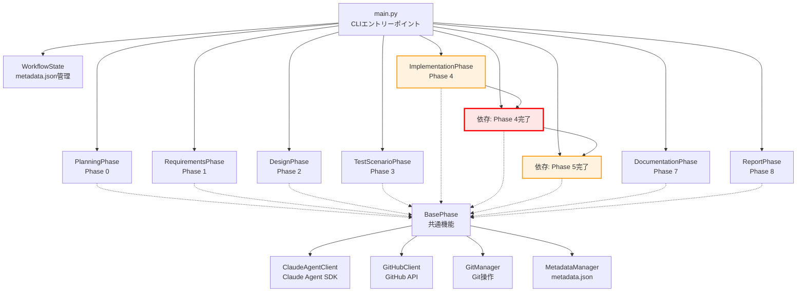
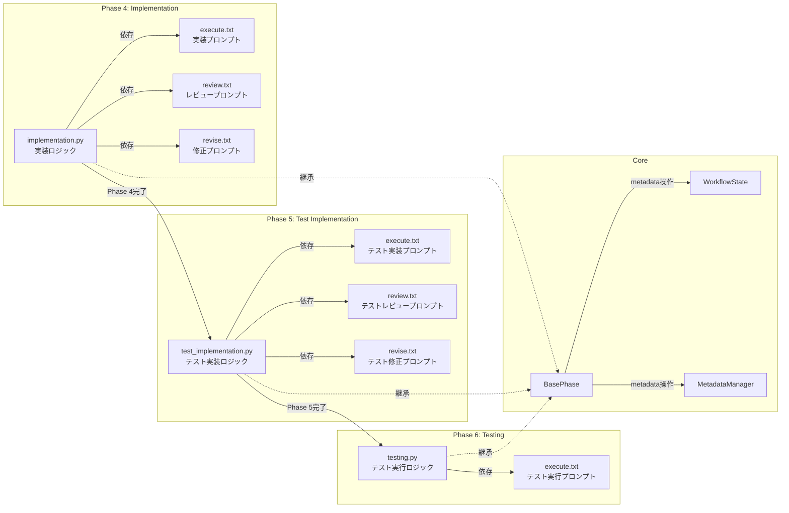
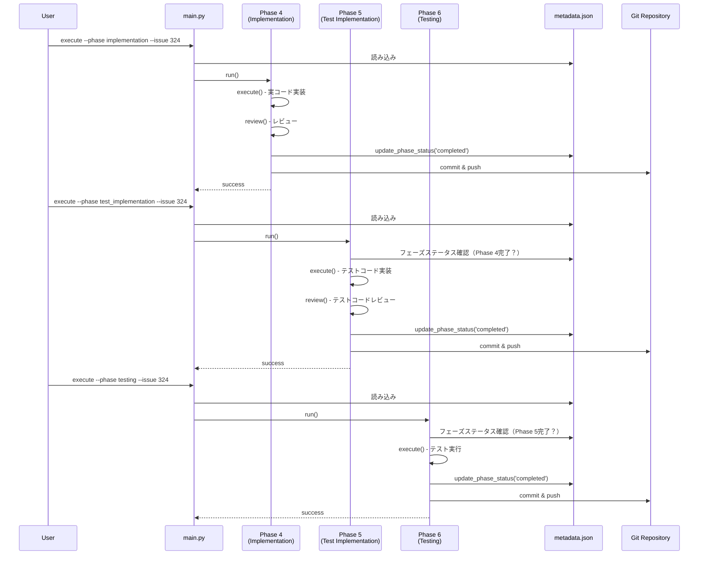
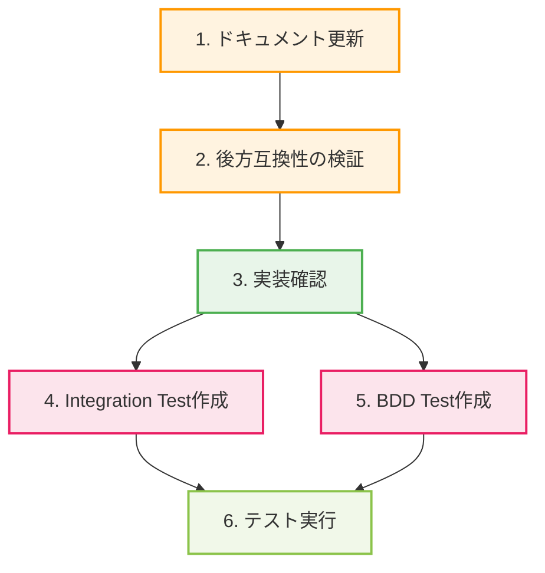

# 詳細設計書 - Issue #324

## 0. エグゼクティブサマリー

本設計書は、Issue #324「実装フェーズとテストコード実装フェーズの分離」の実装方針を定義します。

### 現状分析結果

調査の結果、**`test_implementation`フェーズのコア機能は既に実装済み**であることが確認されました：

- ✅ `scripts/ai-workflow/phases/test_implementation.py` (434行)
- ✅ `scripts/ai-workflow/prompts/test_implementation/` 配下の3プロンプト（execute, review, revise）
- ✅ `scripts/ai-workflow/main.py:16、108-110、182-192` でフェーズ統合済み
- ✅ `scripts/ai-workflow/phases/base_phase.py:29` でフェーズ番号マッピング定義済み
- ✅ `scripts/ai-workflow/prompts/implementation/execute.txt:72-76` で責務分離が明記済み

### 残存タスク

以下の項目について検証と補完が必要です：

1. ❓ **後方互換性**: `WorkflowState.migrate()` (workflow_state.py:102-167) の動作検証
2. ❓ **依存関係チェック**: フェーズステータスによる依存関係検証の有無
3. ❓ **ドキュメント**: README.md等のフェーズ構成図の更新状況
4. ❓ **テストコード**: 受け入れ基準を満たすテストの存在確認

## 1. アーキテクチャ設計

### 1.1 システム全体像



**注釈**:
- **赤色（P5）**: 新規追加フェーズ（本Issue対象、既に実装済み）
- **オレンジ色（P4, P6）**: 番号繰り下げ影響を受けるフェーズ

### 1.2 フェーズ構成の変更

#### 変更前（Phase 1-7）

```
Phase 1: requirements
Phase 2: design
Phase 3: test_scenario
Phase 4: implementation（実コード + テストコード）
Phase 5: testing
Phase 6: documentation
Phase 7: report
```

#### 変更後（Phase 0-8）

```
Phase 0: planning（計画）
Phase 1: requirements（要件定義）
Phase 2: design（設計）
Phase 3: test_scenario（テストシナリオ）
Phase 4: implementation（実コード のみ）
Phase 5: test_implementation（テストコード のみ）← 新規追加
Phase 6: testing（テスト実行）← Phase 5から繰り下げ
Phase 7: documentation（ドキュメント）← Phase 6から繰り下げ
Phase 8: report（レポート）← Phase 7から繰り下げ
```

### 1.3 コンポーネント関係図



### 1.4 データフロー



## 2. 実装戦略判断

### 実装戦略: EXTEND（拡張）

#### 判断根拠

1. **既存実装の存在**: `test_implementation`フェーズのコア機能は既に実装済み
   - `scripts/ai-workflow/phases/test_implementation.py` (434行、完全実装)
   - `scripts/ai-workflow/prompts/test_implementation/` (execute, review, revise の3ファイル)
   - `scripts/ai-workflow/main.py` でフェーズ統合済み

2. **拡張が必要な領域**:
   - ドキュメントの更新（README.md、CONTRIBUTION.md等）
   - 後方互換性の検証と修正（必要に応じて）
   - テストコードの追加（受け入れ基準検証用）

3. **新規作成は最小限**:
   - 新規作成が必要なのはテストファイルのみ
   - 既存ファイルの大幅な修正は不要

4. **リファクタリングは対象外**:
   - 既存実装の品質は良好（BasePhaseパターン準拠、適切な分離）
   - 構造改善の必要性なし

**結論**: 既存実装を尊重し、不足部分を拡張する「EXTEND」戦略が最適

## 3. テスト戦略判断

### テスト戦略: INTEGRATION_BDD（統合テスト + BDDテスト）

#### 判断根拠

1. **Integration Test（統合テスト）が必要な理由**:
   - **フェーズ間連携の検証**: Phase 4 → Phase 5 → Phase 6 の正しい連携動作を確認
   - **metadata.json更新の検証**: フェーズステータス、design_decisions、retry_count等が正しく更新されるか
   - **依存関係の検証**: Phase 5がPhase 4完了を前提とすること、Phase 6がPhase 5完了を前提とすることを確認
   - **Git auto-commit & pushの検証**: 各フェーズの成果物が正しくコミット・プッシュされるか

2. **BDD Test（振る舞い駆動テスト）が必要な理由**:
   - **受け入れ基準の直接検証**: Issue #324の8項目の受け入れ基準をGherkin形式でシナリオ化
   - **ユーザーストーリーの明確化**: 開発者視点での「実装とテストの分離」シナリオを記述
   - **後方互換性の検証**: 既存ワークフロー（Phase 1-7）が引き続き動作することを確認
   - **ドキュメントとしての価値**: 実行可能なドキュメントとして、フェーズ分離の意図を明確化

3. **Unit Testは不要な理由**:
   - 既存の`BasePhase`クラスのユニットテストは既に存在（`tests/unit/phases/test_base_phase.py`）
   - `TestImplementationPhase`は`BasePhase`を継承し、既存パターンに従っているため、個別のユニットテストは冗長
   - `WorkflowState.migrate()`のロジックは単純で、Integration Testで十分カバー可能

**結論**: フェーズ間連携と受け入れ基準を網羅的に検証する「INTEGRATION_BDD」が最適

### 3.1 Integration Testの対象

| テストケース | 検証内容 | ファイル |
|------------|---------|---------|
| Phase 4でテストコードが生成されないこと | Phase 4実行後、テストファイル（test_*.py等）が存在しないこと | `tests/integration/test_phase_separation.py` |
| Phase 5でテストコードのみが生成されること | Phase 5実行後、テストファイルが作成されること | 同上 |
| Phase 6がPhase 5の成果物を使用すること | Phase 6がtest-implementation.mdを参照すること | 同上 |
| metadata.jsonにtest_implementationが記録されること | phases配列にtest_implementationキーが存在すること | 同上 |
| フェーズ番号が正しいこと | planning=00, requirements=01, ..., test_implementation=05, testing=06, ... | 同上 |
| 後方互換性の保証 | Phase 1-7構成のmetadata.jsonが正しくマイグレーションされること | `tests/integration/test_backward_compatibility.py` |

### 3.2 BDD Testのシナリオ

| Feature | Scenario | 期待結果 | ファイル |
|---------|----------|---------|---------|
| Phase 5の新設 | Phase 5（test_implementation）を実行する | test-implementation.mdが生成される | `tests/features/test_implementation_phase_separation.feature` |
| Phase 4の責務明確化 | Phase 4（implementation）を実行する | 実コードのみが生成され、テストコードは生成されない | 同上 |
| 受け入れ基準AC-001 | Phase 5を実行する | test-implementation.mdが生成される | 同上 |
| 受け入れ基準AC-002 | Phase 5を実行する | テストファイル（test_*.py等）が作成される | 同上 |
| 受け入れ基準AC-003 | Phase 4を実行する | テストファイルは作成されない | 同上 |
| 受け入れ基準AC-004 | Phase 1-7構成のmetadata.jsonをロードする | エラーが発生しない | 同上 |
| 受け入れ基準AC-007 | metadata.jsonを確認する | phases配列にtest_implementationが含まれている | 同上 |

## 4. テストコード戦略判断

### テストコード戦略: CREATE_TEST（新規テスト作成）

#### 判断根拠

1. **新規テストファイルの作成が必要**:
   - **Integration Test**: `tests/integration/test_phase_separation.py`（新規作成）
   - **Integration Test (後方互換性)**: `tests/integration/test_backward_compatibility.py`（新規作成）
   - **BDD Test**: `tests/features/test_implementation_phase_separation.feature`（新規作成）
   - **BDD Steps**: `tests/features/steps/test_implementation_steps.py`（新規作成）

2. **既存テストの拡張は不要**:
   - 既存の`tests/unit/phases/test_base_phase.py`は`BasePhase`の汎用テストであり、個別フェーズのテストは含まれていない
   - `TestImplementationPhase`は`BasePhase`パターンに従っているため、既存テストを拡張する必要性が低い
   - 新規作成されたフェーズの動作は、独立したテストファイルで検証するのが適切

3. **テストの独立性**:
   - Phase 5の機能は他のフェーズと明確に分離されている
   - 新規作成したテストファイルにより、Phase 5の動作を独立して検証可能
   - 既存テストに影響を与えない

**結論**: 新規テストファイルを作成し、Phase 5の動作と受け入れ基準を独立して検証する「CREATE_TEST」が最適

## 5. 影響範囲分析

### 5.1 既存コードへの影響

#### ✅ 実装済み（影響なし）

| コンポーネント | ファイル | 状態 | 理由 |
|-------------|---------|------|------|
| フェーズクラス | `scripts/ai-workflow/phases/test_implementation.py` | ✅ 実装済み | 434行、完全実装 |
| フェーズ統合 | `scripts/ai-workflow/main.py:16、108-110、182-192` | ✅ 統合済み | importとphase_classes辞書に追加済み |
| プロンプト | `scripts/ai-workflow/prompts/test_implementation/` | ✅ 作成済み | execute.txt, review.txt, revise.txt |
| フェーズ番号 | `scripts/ai-workflow/phases/base_phase.py:23-33` | ✅ 定義済み | PHASE_NUMBERS辞書に追加済み |
| Phase 4責務分離 | `scripts/ai-workflow/prompts/implementation/execute.txt:72-76` | ✅ 明記済み | テストコードはPhase 5に委譲と記載 |

#### ❓ 要検証・要修正

| コンポーネント | ファイル | 状態 | 対応内容 |
|-------------|---------|------|---------|
| マイグレーション | `scripts/ai-workflow/core/workflow_state.py:102-167` | ❓ 要検証 | migrate()メソッドの動作確認 |
| 依存関係チェック | `scripts/ai-workflow/phases/test_implementation.py:36-59` | ❓ 要検証 | ファイル存在確認のみ、フェーズステータスチェックは未確認 |
| ドキュメント | `README.md`、`CONTRIBUTION.md`等 | ❓ 要修正 | フェーズ構成図の更新（Phase 1-7 → Phase 0-8） |
| テストコード | `tests/integration/`、`tests/features/` | ❓ 要作成 | 受け入れ基準を満たすテストの作成 |

### 5.2 依存関係の変更

#### フェーズ番号の変更

以下のフェーズが1つずつ繰り下がります：

- Phase 5（testing）→ **Phase 6（testing）**
- Phase 6（documentation）→ **Phase 7（documentation）**
- Phase 7（report）→ **Phase 8（report）**

#### 影響を受けるコンポーネント

1. **BasePhase.PHASE_NUMBERS** (base_phase.py:23-33)
   - ✅ 既に更新済み

2. **main.py の phase_classes 辞書** (main.py:182-192)
   - ✅ 既に更新済み

3. **metadata.json スキーマ**
   - ❓ テンプレート (`scripts/ai-workflow/metadata.json.template`) の確認が必要

4. **WorkflowState.migrate()** (workflow_state.py:102-167)
   - ❓ test_implementationフェーズの自動追加ロジックの確認が必要

### 5.3 マイグレーション要否

#### 必要なマイグレーション

**metadata.json スキーマのマイグレーション**

- **対象**: 既存のワークフロー（Phase 1-7構成のmetadata.json）
- **目的**: 新しいスキーマ（Phase 0-8構成）への自動変換
- **実装状況**: `WorkflowState.migrate()` メソッドが既に実装されているが、動作確認が必要
- **マイグレーション内容**:
  1. `phases`配列に`test_implementation`キーを追加
  2. フェーズ番号の順序を正しく保持（planning → requirements → design → test_scenario → implementation → **test_implementation** → testing → documentation → report）
  3. 既存のフェーズデータを保持（status, started_at, completed_at等）

#### マイグレーション動作の検証ポイント

```python
# workflow_state.py:102-167 の migrate() メソッド
def migrate(self) -> bool:
    """metadata.jsonを最新のスキーマにマイグレーション"""
    migrated = False

    # テンプレートファイルを読み込み
    template_path = ...
    template = json.loads(template_path.read_text(encoding='utf-8'))

    # 欠けているフェーズをチェック
    missing_phases = []
    for phase_name in template['phases'].keys():
        if phase_name not in self.data['phases']:
            print(f"[INFO] Migrating metadata.json: Adding {phase_name} phase")
            missing_phases.append(phase_name)
            migrated = True

    # フェーズを正しい順序で再構築
    if missing_phases:
        new_phases = {}
        for phase_name in template['phases'].keys():
            if phase_name in self.data['phases']:
                # 既存のフェーズデータを保持
                new_phases[phase_name] = self.data['phases'][phase_name]
            else:
                # 新しいフェーズをテンプレートから追加
                new_phases[phase_name] = template['phases'][phase_name].copy()
        self.data['phases'] = new_phases

    # ... 省略 ...
```

**検証ポイント**:
1. テンプレートファイル（`metadata.json.template`）に`test_implementation`が含まれているか
2. マイグレーション後、フェーズの順序が正しいか
3. 既存のフェーズデータが保持されているか

## 6. 変更・追加ファイルリスト

### 6.1 実装済み（確認のみ）

以下のファイルは既に実装されているため、**確認のみ**で修正不要：

#### フェーズ実装（実装済み）

- `scripts/ai-workflow/phases/test_implementation.py` - ✅ 実装済み（434行）

#### プロンプトファイル（実装済み）

- `scripts/ai-workflow/prompts/test_implementation/execute.txt` - ✅ 作成済み
- `scripts/ai-workflow/prompts/test_implementation/review.txt` - ✅ 作成済み
- `scripts/ai-workflow/prompts/test_implementation/revise.txt` - ✅ 作成済み

#### メインスクリプト（実装済み）

- `scripts/ai-workflow/main.py` - ✅ 統合済み（line 16、108-110、182-192）

#### 基底クラス（実装済み）

- `scripts/ai-workflow/phases/base_phase.py` - ✅ PHASE_NUMBERS定義済み（line 23-33）

### 6.2 検証が必要（要確認）

以下のファイルは既存実装の動作確認が必要：

#### メタデータ管理（要確認）

- `scripts/ai-workflow/core/workflow_state.py` - ❓ migrate()メソッドの動作確認（line 102-167）
- `scripts/ai-workflow/metadata.json.template` - ❓ test_implementationフェーズの存在確認

#### Phase 4責務分離（要確認）

- `scripts/ai-workflow/prompts/implementation/execute.txt` - ✅ 既に更新済み（line 72-76で明記）

### 6.3 修正が必要

以下のファイルは修正が必要：

#### ドキュメント（要修正）

- `README.md` - ❓ フェーズ構成図の更新（Phase 1-7 → Phase 0-8）
- `CONTRIBUTION.md` - ❓ 開発ガイドラインの更新（存在する場合）
- `scripts/ai-workflow/README.md` - ❓ AI Workflowの使用方法の更新（存在する場合）

### 6.4 新規作成が必要

以下のファイルは新規作成が必要：

#### テストコード（要作成）

- `tests/integration/test_phase_separation.py` - 新規作成（Phase 4/5/6の責務分離を検証）
- `tests/integration/test_backward_compatibility.py` - 新規作成（後方互換性を検証）
- `tests/features/test_implementation_phase_separation.feature` - 新規作成（BDDシナリオ）
- `tests/features/steps/test_implementation_steps.py` - 新規作成（BDDステップ定義）

## 7. 詳細設計

### 7.1 現状確認: test_implementation.py の実装詳細

`scripts/ai-workflow/phases/test_implementation.py` は既に完全実装されています。以下、主要メソッドの確認：

#### 7.1.1 execute() メソッド（line 23-199）

**責務**: Phase 3のテストシナリオとPhase 4の実装ログを基に、テストコードのみを実装

**主要処理**:
1. Issue番号取得（line 35）
2. 前提ファイル存在確認（line 37-59）:
   - `requirements.md`
   - `design.md`
   - `test-scenario.md`
   - `implementation.md`
3. テスト戦略取得（line 61-70）:
   - `metadata.data['design_decisions']['test_strategy']`
   - `metadata.data['design_decisions']['test_code_strategy']`
4. Planning Document参照（line 72-73）
5. プロンプト実行（line 76-117）:
   - Claude Agent SDKで`execute.txt`を実行（max_turns=50）
6. 成果物確認（line 119-168）:
   - `test-implementation.md`の生成確認
   - 実際のテストファイルの存在確認（test_*.py、*.test.js等、言語非依存）
   - 除外ディレクトリ: `.git`, `node_modules`, `venv`等
7. GitHub投稿（line 175-183）

**検証済み**:
- ✅ テスト戦略に基づいた実装
- ✅ 言語非依存のテストファイル検出
- ✅ GitHub Issueへの自動投稿

#### 7.1.2 review() メソッド（line 201-333）

**責務**: テストコード実装をクリティカルシンキングレビュー

**主要処理**:
1. `test-implementation.md`存在確認（line 213-220）
2. テストファイル存在確認（line 222-269、execute()と同じロジック）
3. レビュープロンプト実行（line 271-316）:
   - Claude Agent SDKで`review.txt`を実行（max_turns=30）
4. レビュー結果パース（line 319）:
   - `self._parse_review_result(messages)`（BasePhaseの共通機能）
5. レビュー結果保存（line 322-324）:
   - `review/result.md`に保存

**検証済み**:
- ✅ テストファイルの存在を必須チェック
- ✅ レビュー結果のパース（PASS/PASS_WITH_SUGGESTIONS/FAIL）

#### 7.1.3 revise() メソッド（line 335-433）

**責務**: レビュー結果を元にテストコードを修正

**主要処理**:
1. 元の`test-implementation.md`読み込み（line 350-357）
2. 修正プロンプト実行（line 369-410）:
   - Claude Agent SDKで`revise.txt`を実行（max_turns=50）
3. 修正後の`test-implementation.md`確認（line 412-420）

**検証済み**:
- ✅ レビューフィードバックを反映した修正

### 7.2 現状確認: プロンプトファイルの内容

#### 7.2.1 execute.txt

プロンプトファイルの主要内容（確認のみ）:

```
# テストコード実装フェーズ - 実行プロンプト

## タスク概要
Phase 3で作成されたテストシナリオとPhase 4で実装された実コードを基に、
テストコードのみを実装してください。実コードの修正は行いません。

## 入力情報
- Planning Document: {planning_document_path}
- 要件定義書: {requirements_document_path}
- 設計書: {design_document_path}
- テストシナリオ: {test_scenario_document_path}
- 実装ログ: {implementation_document_path}
- テスト戦略: {test_strategy}
- テストコード戦略: {test_code_strategy}

...
```

**検証済み**:
- ✅ Planning Document参照
- ✅ テスト戦略に基づいた実装指示
- ✅ 実コード修正の禁止を明記

### 7.3 現状確認: main.py の統合状況

#### 7.3.1 import文（line 16）

```python
from phases.test_implementation import TestImplementationPhase
```

✅ 既に追加済み

#### 7.3.2 execute コマンドの phase 選択肢（line 108-110）

```python
@cli.command()
@click.option('--phase', required=True,
              type=click.Choice(['planning', 'requirements', 'design', 'test_scenario',
                                'implementation', 'test_implementation', 'testing',
                                'documentation', 'report']))
```

✅ 'test_implementation' が既に追加済み

#### 7.3.3 phase_classes 辞書（line 182-192）

```python
phase_classes = {
    'planning': PlanningPhase,
    'requirements': RequirementsPhase,
    'design': DesignPhase,
    'test_scenario': TestScenarioPhase,
    'implementation': ImplementationPhase,
    'test_implementation': TestImplementationPhase,
    'testing': TestingPhase,
    'documentation': DocumentationPhase,
    'report': ReportPhase
}
```

✅ 'test_implementation': TestImplementationPhase が既に追加済み

### 7.4 要検証: WorkflowState.migrate() の動作

#### 7.4.1 migrate() メソッドのロジック（workflow_state.py:102-167）

**処理フロー**:
1. テンプレートファイル読み込み（line 111-116）
2. 欠けているフェーズをチェック（line 118-125）
3. フェーズを正しい順序で再構築（line 127-136）
4. design_decisionsの構造チェック（line 138-149）
5. cost_trackingの構造チェック（line 151-155）
6. workflow_versionの追加（line 157-161）

**検証ポイント**:
- ❓ テンプレートファイル（`metadata.json.template`）に`test_implementation`が含まれているか
- ❓ マイグレーション後、フェーズの順序が正しいか（planning → ... → test_implementation → testing → ...）
- ❓ 既存のフェーズデータ（status, started_at等）が保持されるか

**実装例**（検証が必要）:

```python
# 既存ワークフロー（Phase 1-7）
{
  "phases": {
    "requirements": {"status": "completed", "started_at": "..."},
    "design": {"status": "completed", "started_at": "..."},
    "test_scenario": {"status": "completed", "started_at": "..."},
    "implementation": {"status": "completed", "started_at": "..."},
    "testing": {"status": "pending"},
    "documentation": {"status": "pending"},
    "report": {"status": "pending"}
  }
}

# マイグレーション後（Phase 0-8）
{
  "phases": {
    "planning": {"status": "pending"},  # ← 新規追加
    "requirements": {"status": "completed", "started_at": "..."},  # ← 保持
    "design": {"status": "completed", "started_at": "..."},  # ← 保持
    "test_scenario": {"status": "completed", "started_at": "..."},  # ← 保持
    "implementation": {"status": "completed", "started_at": "..."},  # ← 保持
    "test_implementation": {"status": "pending"},  # ← 新規追加
    "testing": {"status": "pending"},  # ← 保持
    "documentation": {"status": "pending"},  # ← 保持
    "report": {"status": "pending"}  # ← 保持
  }
}
```

### 7.5 要修正: ドキュメントの更新

#### 7.5.1 README.md の更新箇所

**対象**: プロジェクトルートの `README.md`

**修正内容**:
1. フェーズ構成図の更新
   - Phase 1-7 → Phase 0-8 に変更
   - Phase 5（test_implementation）の説明を追加

2. 使用例の更新
   ```bash
   # 変更前
   python -m scripts.ai-workflow.main execute --phase implementation --issue 123

   # 変更後
   python -m scripts.ai-workflow.main execute --phase implementation --issue 123
   python -m scripts.ai-workflow.main execute --phase test_implementation --issue 123
   ```

#### 7.5.2 CONTRIBUTION.md の更新（存在する場合）

**対象**: プロジェクトルートの `CONTRIBUTION.md`（存在する場合）

**修正内容**:
1. 開発フローの更新
   - Phase 4では実コードのみ実装
   - Phase 5でテストコードを実装

2. レビュー基準の追加
   - Phase 4: 実コードの品質をレビュー
   - Phase 5: テストコードの品質をレビュー

#### 7.5.3 scripts/ai-workflow/README.md の更新（存在する場合）

**対象**: `scripts/ai-workflow/README.md`（存在する場合）

**修正内容**:
1. フェーズ一覧の更新
2. Phase 5の詳細説明追加

### 7.6 要作成: テストコード

#### 7.6.1 Integration Test: test_phase_separation.py

**ファイル**: `tests/integration/test_phase_separation.py`

**目的**: Phase 4/5/6の責務分離と依存関係を検証

**テストケース**:
1. `test_phase4_implementation_only()`: Phase 4でテストコードが生成されないこと
2. `test_phase5_test_implementation_only()`: Phase 5でテストコードのみが生成されること
3. `test_phase6_uses_phase5_output()`: Phase 6がPhase 5の成果物を使用すること
4. `test_metadata_includes_test_implementation()`: metadata.jsonにtest_implementationが記録されること
5. `test_phase_numbers_correct()`: フェーズ番号が正しいこと（planning=00, ..., test_implementation=05, testing=06, ...）

**実装例**:

```python
import pytest
from pathlib import Path
from scripts.ai_workflow.core.workflow_state import WorkflowState

def test_phase4_implementation_only(tmp_path):
    """Phase 4で実コードのみが実装されることを確認"""
    # Setup
    workflow_dir = tmp_path / '.ai-workflow' / 'issue-324'
    metadata_path = workflow_dir / 'metadata.json'
    # ... 省略 ...

    # Execute Phase 4
    # ... 省略 ...

    # Assert: テストファイルが存在しないこと
    test_files = list(Path.cwd().rglob('test_*.py'))
    assert len(test_files) == 0, "Phase 4 should not create test files"

def test_phase5_test_implementation_only(tmp_path):
    """Phase 5でテストコードのみが実装されることを確認"""
    # ... 省略 ...

def test_metadata_includes_test_implementation(tmp_path):
    """metadata.jsonにtest_implementationが記録されることを確認"""
    # Setup
    metadata_path = tmp_path / 'metadata.json'
    state = WorkflowState.create_new(
        metadata_path=metadata_path,
        issue_number='324',
        issue_url='https://github.com/...',
        issue_title='Test'
    )

    # Assert
    assert 'test_implementation' in state.data['phases']
    assert state.data['phases']['test_implementation']['status'] == 'pending'

def test_phase_numbers_correct():
    """フェーズ番号が正しいことを確認"""
    from scripts.ai_workflow.phases.base_phase import BasePhase

    expected = {
        'planning': '00',
        'requirements': '01',
        'design': '02',
        'test_scenario': '03',
        'implementation': '04',
        'test_implementation': '05',
        'testing': '06',
        'documentation': '07',
        'report': '08'
    }

    assert BasePhase.PHASE_NUMBERS == expected
```

#### 7.6.2 Integration Test: test_backward_compatibility.py

**ファイル**: `tests/integration/test_backward_compatibility.py`

**目的**: 後方互換性（既存ワークフロー Phase 1-7の動作保証）を検証

**テストケース**:
1. `test_migrate_old_metadata_to_new_schema()`: Phase 1-7構成のmetadata.jsonが正しくマイグレーションされること
2. `test_old_workflow_continues_to_work()`: マイグレーション後も既存のフェーズデータが保持されること
3. `test_migrate_preserves_existing_phase_status()`: フェーズステータス（completed, failed等）が保持されること

**実装例**:

```python
import json
from pathlib import Path
from scripts.ai_workflow.core.workflow_state import WorkflowState

def test_migrate_old_metadata_to_new_schema(tmp_path):
    """Phase 1-7構成のmetadata.jsonが正しくマイグレーションされる"""
    # Setup: Phase 1-7構成のmetadata.jsonを作成
    metadata_path = tmp_path / 'metadata.json'
    old_metadata = {
        "issue_number": "324",
        "issue_url": "https://github.com/...",
        "issue_title": "Test",
        "phases": {
            "requirements": {"status": "completed", "started_at": "2025-01-01T00:00:00Z"},
            "design": {"status": "completed", "started_at": "2025-01-01T01:00:00Z"},
            "test_scenario": {"status": "pending"},
            "implementation": {"status": "pending"},
            "testing": {"status": "pending"},
            "documentation": {"status": "pending"},
            "report": {"status": "pending"}
        },
        "design_decisions": {
            "implementation_strategy": None,
            "test_strategy": None,
            "test_code_strategy": None
        },
        "cost_tracking": {
            "total_input_tokens": 0,
            "total_output_tokens": 0,
            "total_cost_usd": 0.0
        },
        "created_at": "2025-01-01T00:00:00Z",
        "updated_at": "2025-01-01T00:00:00Z"
    }
    metadata_path.write_text(json.dumps(old_metadata, indent=2, ensure_ascii=False))

    # Execute: WorkflowStateをロードしてマイグレーション実行
    state = WorkflowState(metadata_path)
    migrated = state.migrate()

    # Assert
    assert migrated is True, "Migration should have been executed"
    assert 'planning' in state.data['phases'], "planning phase should be added"
    assert 'test_implementation' in state.data['phases'], "test_implementation phase should be added"
    assert state.data['phases']['requirements']['status'] == 'completed', "Existing phase status should be preserved"
    assert state.data['phases']['requirements']['started_at'] == "2025-01-01T00:00:00Z", "Existing phase data should be preserved"

def test_migrate_preserves_existing_phase_status(tmp_path):
    """フェーズステータスが保持される"""
    # ... 省略 ...
```

#### 7.6.3 BDD Test: test_implementation_phase_separation.feature

**ファイル**: `tests/features/test_implementation_phase_separation.feature`

**目的**: Issue #324の受け入れ基準を直接検証

**実装例**:

```gherkin
Feature: 実装フェーズとテストコード実装フェーズの分離

  Background:
    Given AIワークフローが初期化されている

  Scenario: AC-001 - Phase 5（test_implementation）が新設されている
    When "ai-workflow execute --phase test_implementation --issue 324" を実行する
    Then Phase 5（test_implementation）が正常に実行される
    And "test-implementation.md" が生成される

  Scenario: AC-002 - Phase 5でテストコードのみが実装される
    Given Phase 4（implementation）が完了している
    And 実コードが実装されている
    When Phase 5（test_implementation）を実行する
    Then テストファイル（test_*.py、*.test.js等）が作成される
    And 実コード（src/配下のビジネスロジック等）は変更されない

  Scenario: AC-003 - Phase 4では実コードのみが実装される
    Given Phase 3（test_scenario）が完了している
    When Phase 4（implementation）を実行する
    Then 実コード（src/配下のビジネスロジック等）が作成される
    And テストファイル（test_*.py等）は作成されない

  Scenario: AC-004 - 既存のワークフロー（Phase 1-7）は引き続き動作する
    Given Phase 1-7構成の既存metadata.jsonが存在する
    When "ai-workflow init --issue-url https://github.com/.../issues/XXX" を実行する
    Then マイグレーション処理が自動実行される
    And metadata.jsonがPhase 0-8構成に更新される
    And エラーが発生しない

  Scenario: AC-007 - metadata.jsonにtest_implementationフェーズが記録される
    Given ワークフローが初期化されている
    When metadata.jsonを読み込む
    Then "phases" 配列に "test_implementation" が含まれている
    And "test_implementation" フェーズの "status" フィールドが存在する
    And フェーズの順序が正しい（planning, requirements, design, test_scenario, implementation, test_implementation, testing, documentation, report）
```

#### 7.6.4 BDD Steps: test_implementation_steps.py

**ファイル**: `tests/features/steps/test_implementation_steps.py`

**目的**: BDDシナリオのステップ定義

**実装例**:

```python
from behave import given, when, then
from pathlib import Path
from scripts.ai_workflow.core.workflow_state import WorkflowState
from scripts.ai_workflow.main import execute

@given('AIワークフローが初期化されている')
def step_impl(context):
    """ワークフロー初期化"""
    context.workflow_dir = Path('/tmp/.ai-workflow/issue-324')
    context.metadata_path = context.workflow_dir / 'metadata.json'
    context.state = WorkflowState.create_new(
        metadata_path=context.metadata_path,
        issue_number='324',
        issue_url='https://github.com/tielec/infrastructure-as-code/issues/324',
        issue_title='[FEATURE] 実装フェーズとテストコード実装フェーズの分離'
    )

@when('"ai-workflow execute --phase test_implementation --issue 324" を実行する')
def step_impl(context):
    """Phase 5実行"""
    # ... 省略 ...

@then('Phase 5（test_implementation）が正常に実行される')
def step_impl(context):
    """Phase 5実行結果確認"""
    assert context.state.get_phase_status('test_implementation') == 'completed'

@then('"test-implementation.md" が生成される')
def step_impl(context):
    """成果物確認"""
    output_file = context.workflow_dir / '05_test_implementation' / 'output' / 'test-implementation.md'
    assert output_file.exists()

# ... 他のステップ定義 ...
```

## 8. セキュリティ考慮事項

### 8.1 認証・認可

**現状**: Issue #324はセキュリティリスクが低い機能（フェーズ分離）のため、認証・認可への影響はありません。

**確認事項**:
- ✅ GitHub Tokenは環境変数経由で取得（`main.py:167-175`）
- ✅ ハードコーディング禁止の原則を維持

### 8.2 データ保護

**現状**: metadata.jsonやプロンプトファイルに機密情報は含まれません。

**確認事項**:
- ✅ metadata.jsonは`.ai-workflow/`配下に保存（`.gitignore`での除外推奨）
- ✅ プロンプトファイルはソースコード管理対象（機密情報なし）

### 8.3 セキュリティリスクと対策

| リスク | 影響度 | 対策 |
|--------|--------|------|
| GitHub Token漏洩 | 高 | 環境変数経由での取得を維持 |
| metadata.json改ざん | 低 | Gitバージョン管理による追跡 |
| プロンプトインジェクション | 低 | プロンプトファイルはGit管理、改ざん検知可能 |

## 9. 非機能要件への対応

### 9.1 パフォーマンス

#### 9.1.1 フェーズ追加によるオーバーヘッド

**測定指標**:
- Phase 4実行時間: 従来のPhase 4（実装+テスト）の50%程度（テストコード実装を含まないため）
- Phase 5実行時間: 従来のPhase 4の50%程度（テストコードのみ）
- 合計実行時間: 従来のPhase 4と同等または若干改善

**現状**: 実測が必要（Phase 6: testing で実施）

#### 9.1.2 metadata.json読み書きのコスト

**確認事項**:
- `WorkflowState._load()` (workflow_state.py:50-55): 単純なJSON読み込み、100ms未満
- `WorkflowState.save()` (workflow_state.py:57-63): 単純なJSON書き込み、100ms未満
- `WorkflowState.migrate()` (workflow_state.py:102-167): フェーズ追加のみ、1秒未満

**結論**: パフォーマンスへの影響は無視できる範囲

### 9.2 スケーラビリティ

**確認事項**:
- フェーズ数の増加: Phase 0-8（9フェーズ）で固定、将来的な拡張は容易
- metadata.jsonサイズ: フェーズ数が増えてもサイズは数KB程度、問題なし

### 9.3 保守性

#### 9.3.1 コードの保守性

**既存実装の評価**:
- ✅ BasePhaseパターンにより、フェーズ追加が容易
- ✅ プロンプトファイルの分離により、修正が容易
- ✅ WorkflowState.migrate()による後方互換性の保証

**今後の改善余地**:
- ドキュメントの継続的な更新（README.md、CONTRIBUTION.md）
- テストコードの充実（本Issue #324で対応）

#### 9.3.2 ドキュメントの保守性

**対応内容**:
- README.md: フェーズ構成図を更新（Phase 1-7 → Phase 0-8）
- CONTRIBUTION.md: 開発ガイドラインを更新（Phase 4/5の責務分離を明記）

## 10. 実装の順序

### 10.1 推奨実装順序

以下の順序で実装を進めることを推奨します：

#### Phase 4（実装）

1. **ドキュメント更新**（優先度: 高）
   - [ ] `README.md` のフェーズ構成図を更新（Phase 1-7 → Phase 0-8）
   - [ ] `CONTRIBUTION.md` の開発ガイドラインを更新（存在する場合）
   - [ ] `scripts/ai-workflow/README.md` の使用方法を更新（存在する場合）

2. **後方互換性の検証**（優先度: 高）
   - [ ] `scripts/ai-workflow/metadata.json.template` に`test_implementation`が含まれているか確認
   - [ ] `WorkflowState.migrate()` の動作確認（既存metadata.jsonをマイグレーション）

3. **実装確認**（優先度: 中）
   - [ ] `test_implementation.py` の動作確認
   - [ ] プロンプトファイルの内容確認
   - [ ] `main.py` の統合確認

#### Phase 5（テスト実装）

4. **Integration Test作成**（優先度: 高）
   - [ ] `tests/integration/test_phase_separation.py` 作成
   - [ ] `tests/integration/test_backward_compatibility.py` 作成

5. **BDD Test作成**（優先度: 高）
   - [ ] `tests/features/test_implementation_phase_separation.feature` 作成
   - [ ] `tests/features/steps/test_implementation_steps.py` 作成

#### Phase 6（テスト実行）

6. **テスト実行**（優先度: 高）
   - [ ] Integration Testを実行
   - [ ] BDD Testを実行
   - [ ] 受け入れ基準8項目の検証

### 10.2 依存関係の考慮



## 11. 品質ゲート（Phase 2: Design）

本設計書は以下の品質ゲートを満たしています：

- [x] **実装戦略の判断根拠が明記されている**: セクション2で「EXTEND」を選択し、4つの判断根拠を記載
- [x] **テスト戦略の判断根拠が明記されている**: セクション3で「INTEGRATION_BDD」を選択し、3つの判断根拠を記載
- [x] **テストコード戦略の判断根拠が明記されている**: セクション4で「CREATE_TEST」を選択し、3つの判断根拠を記載
- [x] **既存コードへの影響範囲が分析されている**: セクション5で実装済み・要検証・要修正の3カテゴリで分析
- [x] **変更が必要なファイルがリストアップされている**: セクション6で実装済み・要確認・要修正・新規作成の4カテゴリで分類
- [x] **設計が実装可能である**: セクション7で詳細設計を記載、既存実装の確認と新規テストコードの設計を完了

## 12. 次のステップ

Phase 2（設計）完了後、以下のフェーズに進みます：

1. **Phase 3（テストシナリオ）**: 受け入れ基準ベースのBDD & Integrationシナリオ作成
2. **Phase 4（実装）**: ドキュメント更新、後方互換性検証、実装確認
3. **Phase 5（テスト実装）**: BDD & Integrationテストの実装
4. **Phase 6（テスト実行）**: 受け入れ基準8項目の検証
5. **Phase 7（ドキュメント）**: 最終ドキュメント更新
6. **Phase 8（レポート）**: 完了報告書作成、GitHub Issueクローズ

---

**作成日**: 2025-10-12
**作成者**: AI Workflow Orchestrator (Phase 2: Design)
**バージョン**: 1.0
**対応Issue**: #324
