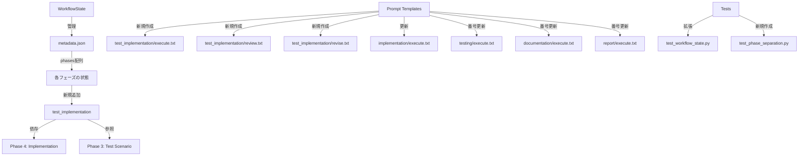

# 詳細設計書 - Issue #324

## Issue情報

- **Issue番号**: #324
- **タイトル**: [FEATURE] 実装フェーズとテストコード実装フェーズの分離
- **URL**: https://github.com/tielec/infrastructure-as-code/issues/324
- **優先度**: High
- **ラベル**: enhancement, ai-workflow, refactoring

## 0. Planning & Requirements Documentの確認

### 計画と要件の概要

Planning Document (`.ai-workflow/issue-324/00_planning/output/planning.md`) と Requirements Document (`.ai-workflow/issue-324/01_requirements/output/requirements.md`) で策定された以下の方針を踏まえて詳細設計を実施します：

- **複雑度**: 中程度
- **見積もり工数**: 12時間
- **リスク評価**: 中（フェーズ番号シフトの漏れ、後方互換性、責務の曖昧さ）

### 主要な判断事項（Planning Documentより）

1. **実装アプローチ**: 既存のフェーズ管理システムに新しいフェーズを組み込む（新規作成と拡張の組み合わせ）
2. **後方互換性**: 既存のワークフロー（Phase 1-7）は引き続き動作する必要がある
3. **責務分離の明確化**: Phase 4（実コード）とPhase 5（テストコード）の境界を明確に定義

## 1. 実装戦略の判断

### 実装戦略: EXTEND

**判断根拠**:

1. **既存ファイルの拡張が中心**
   - `workflow_state.py`の`create_new()`メソッドにtest_implementationフェーズを追加
   - `prompts/implementation/execute.txt`の責務明確化（既存プロンプトの更新）
   - `prompts/testing/execute.txt`、`prompts/documentation/execute.txt`、`prompts/report/execute.txt`のPhase番号更新

2. **新規ファイルの作成**
   - `prompts/test_implementation/execute.txt`（新規）
   - `prompts/test_implementation/review.txt`（新規）
   - `prompts/test_implementation/revise.txt`（新規）
   - ただし、既存のプロンプトパターンを踏襲

3. **既存パターンの踏襲**
   - 他のフェーズと同じパターン（execute/review/revise）を使用
   - metadata.jsonの構造は変更しない（phasesに追加するのみ）
   - PhaseStatusやWorkflowStateクラスの基本構造は維持

4. **アーキテクチャ変更なし**
   - 既存のフェーズ管理の仕組みをそのまま利用
   - 新しいフレームワークやライブラリの導入なし

→ **新規作成と拡張の両方が含まれるが、既存システムの拡張が中心**と判断し、**EXTEND**を選択。

## 2. テスト戦略の判断

### テスト戦略: UNIT_INTEGRATION

**判断根拠**:

1. **ユニットテストが必要な理由**
   - `WorkflowState.create_new()`が新しいフェーズ構造を正しく生成するか検証
   - `update_phase_status()`、`get_phase_status()`が"test_implementation"フェーズに対して正しく動作するか検証
   - フェーズ番号のシフト（Phase 5→6、Phase 6→7、Phase 7→8）が正しく反映されているか検証

2. **インテグレーションテストが必要な理由**
   - 実際のワークフロー実行（planning → requirements → design → test_scenario → implementation → test_implementation → testing → documentation → report）を検証
   - 既存のワークフロー（Phase 1-7構成）が引き続き動作するか検証（後方互換性）
   - クリティカルシンキングレビューが各フェーズで正しく機能するか検証

3. **BDDテストが不要な理由**
   - エンドユーザー向け機能ではなく、内部システムの拡張
   - ユーザーストーリーよりも技術的な仕様が重要

→ **ユニットテストとインテグレーションテストの両方が必要**と判断し、**UNIT_INTEGRATION**を選択。

## 3. テストコード戦略の判断

### テストコード戦略: BOTH_TEST

**判断根拠**:

1. **既存テストの拡張（EXTEND_TEST）が必要**
   - `tests/unit/core/test_workflow_state.py`: 既存のWorkflowStateテストに、test_implementationフェーズのテストケースを追加
   - `tests/integration/test_workflow_init.py`: 既存のワークフロー初期化テストに、新しいフェーズ構造の確認を追加（存在する場合）

2. **新規テストの作成（CREATE_TEST）が必要**
   - `tests/integration/test_phase_separation.py`: Phase 4（implementation）とPhase 5（test_implementation）の責務分離を検証する新規テスト
   - プロンプトファイルの内容検証（test_implementationプロンプトが正しく生成されているか）

→ **既存テストの拡張と新規テストの両方が必要**と判断し、**BOTH_TEST**を選択。

## 4. アーキテクチャ設計

### 4.1 システム全体図

```
┌─────────────────────────────────────────────────────────┐
│                  AIワークフローシステム                      │
├─────────────────────────────────────────────────────────┤
│                                                         │
│  Phase 0: Planning        Phase 1: Requirements        │
│  Phase 2: Design          Phase 3: Test Scenario       │
│  Phase 4: Implementation  ┌─ Phase 5: Test Implementation (新規) ─┐
│  Phase 6: Testing         │                            │
│  Phase 7: Documentation   │                            │
│  Phase 8: Report          │                            │
│                           │                            │
├───────────────────────────┴────────────────────────────┤
│                  WorkflowState                          │
│  ・metadata.json管理                                     │
│  ・フェーズステータス管理                                  │
│  ・リトライカウント管理                                   │
│  ・設計判断記録                                          │
├─────────────────────────────────────────────────────────┤
│              Prompt Template System                     │
│  ・execute.txt: 実行プロンプト                           │
│  ・review.txt: レビュープロンプト                        │
│  ・revise.txt: 修正プロンプト                           │
└─────────────────────────────────────────────────────────┘
```

### 4.2 新旧フェーズ構成の比較

**現在（Phase 1-7構成）**:
```
1. Planning
2. Requirements
3. Design
4. Test Scenario
5. Implementation（実コード + テストコード）← ここが分離対象
6. Testing
7. Documentation
8. Report
```

**新規（Phase 1-8構成）**:
```
1. Planning
2. Requirements
3. Design
4. Test Scenario
5. Implementation（実コードのみ）← 責務明確化
6. Test Implementation（テストコードのみ）← 新規追加
7. Testing（Phase 6から繰り下げ）
8. Documentation（Phase 7から繰り下げ）
9. Report（Phase 8から繰り下げ）
```

**注意**: metadata.jsonのphasesには"planning"キーがないため、実際のphases配列は以下の通り：
- 旧: requirements, design, test_scenario, implementation, testing, documentation, report
- 新: requirements, design, test_scenario, implementation, test_implementation, testing, documentation, report

### 4.3 コンポーネント間の関係



### 4.4 データフロー

```
Phase 4 (Implementation)
  ↓
  実コード作成
  ↓
  .ai-workflow/issue-XXX/04_implementation/output/implementation.md
  ↓
Phase 5 (Test Implementation) ← 新規
  ↓
  Phase 3のテストシナリオを参照
  Phase 4の実コードを参照
  ↓
  テストコード作成
  ↓
  .ai-workflow/issue-XXX/05_test_implementation/output/test_implementation.md
  ↓
Phase 6 (Testing) ← Phase 5から繰り下げ
  ↓
  Phase 5のテストコードを実行
  ↓
  .ai-workflow/issue-XXX/06_testing/output/test-result.md
```

## 5. 影響範囲分析

### 5.1 既存コードへの影響

#### 影響度: 中
- **Phase番号のシフト**: Phase 5以降のすべてのプロンプトでPhase番号を更新
- **WorkflowState.create_new()**: phases辞書にtest_implementationを追加
- **後方互換性**: 既存のmetadata.json（Phase 1-7構成）は引き続き動作する必要がある

#### 影響を受けるコンポーネント
1. **Core**: `workflow_state.py`のcreate_new()メソッド
2. **Prompts**: implementation、testing、documentation、reportのexecute.txt
3. **Tests**: test_workflow_state.pyに新規テストケース追加

### 5.2 依存関係の変更

#### 新規依存関係
- Phase 5（test_implementation）→ Phase 4（implementation）: 実コードを参照してテストコードを実装
- Phase 5（test_implementation）→ Phase 3（test_scenario）: テストシナリオを参照してテストコードを実装
- Phase 6（testing）→ Phase 5（test_implementation）: テストコードを実行（既存のPhase 5からの依存を継承）

#### 既存依存関係の維持
- Phase 4（implementation）→ Phase 3（test_scenario）: 引き続き参照可能
- Phase 4（implementation）→ Phase 2（design）: 引き続き参照可能

### 5.3 マイグレーション要否

#### データマイグレーション: 不要

**理由**:
- 既存のmetadata.json（Issue #305、#310、#315等）は旧フェーズ構造（requirements〜report）のまま保持される
- 新規作成されるワークフローのみが新しいフェーズ構造（requirements〜test_implementation〜report）を使用
- WorkflowState.create_new()が新旧どちらの構造でも動作するように設計（実際にはcreate_new()は新構造のみ生成、既存ファイルは読み込みのみ）

**後方互換性の維持方法**:
- WorkflowStateクラスは既存のmetadata.jsonを読み込む際、phasesに存在しないフェーズがあってもエラーにしない
- 既存のワークフローは旧フェーズ構造のまま完了まで実行可能
- 新規ワークフローのみが新しいフェーズ構造を使用

#### 設定ファイル変更: 不要

**理由**:
- 設定ファイルはフェーズ構造に依存していない

#### ドキュメント更新: 必要

**更新対象**:
- `scripts/ai-workflow/README.md`: フェーズ構造の説明を更新（Phase 1-7 → Phase 1-8）（存在する場合）
- プロジェクトルートの`README.md`: AIワークフローに関する説明があれば更新
- `.ai-workflow/issue-324/07_documentation/output/documentation.md`: Phase 7で自動生成

## 6. 変更・追加ファイルリスト

### 6.1 新規作成ファイル

1. **`scripts/ai-workflow/prompts/test_implementation/execute.txt`**
   - テストコード実装に特化した実行プロンプト
   - Phase 3（test_scenario）のシナリオとPhase 4（implementation）の実コードを参照する指示
   - テスト戦略（UNIT_ONLY/INTEGRATION_ONLY等）に応じた実装指示

2. **`scripts/ai-workflow/prompts/test_implementation/review.txt`**
   - テストコードのクリティカルシンキングレビュープロンプト
   - テストカバレッジ、テストの網羅性、エッジケース確認

3. **`scripts/ai-workflow/prompts/test_implementation/revise.txt`**
   - テストコード修正プロンプト（レビュー指摘事項の修正）
   - テストカバレッジ不足の補完指示

4. **`tests/integration/test_phase_separation.py`**
   - Phase 4とPhase 5の責務分離を検証する統合テスト
   - プロンプトファイルの内容検証

### 6.2 修正が必要な既存ファイル

1. **`scripts/ai-workflow/core/workflow_state.py`**
   - `create_new()`メソッド: phases辞書にtest_implementationを追加（implementationとtestingの間）
   - 行番号: 44-101（phasesの定義部分）

2. **`scripts/ai-workflow/prompts/implementation/execute.txt`**
   - 責務明確化: 「実コードのみを実装」と明記
   - 「テストコードはPhase 5（test_implementation）で実装」と追記

3. **`scripts/ai-workflow/prompts/testing/execute.txt`**
   - Phase番号の更新: Phase 5 → Phase 6
   - 内容: 「Phase 4の実装ログ」→「Phase 5のテスト実装ログ」

4. **`scripts/ai-workflow/prompts/documentation/execute.txt`**
   - Phase番号の更新: Phase 6 → Phase 7
   - 各フェーズの成果物パス更新（Phase 5: test_result_document_path → Phase 6: test_result_document_path）

5. **`scripts/ai-workflow/prompts/report/execute.txt`**
   - Phase番号の更新: Phase 7 → Phase 8
   - 各フェーズの成果物パス更新（Phase 6: documentation_update_log_path → Phase 7: documentation_update_log_path）

6. **`tests/unit/core/test_workflow_state.py`**
   - 既存テストケースの拡張: test_implementationフェーズのテストケース追加
   - test_create_new()にtest_implementationの検証を追加
   - test_update_phase_status()にtest_implementationの検証を追加

### 6.3 削除が必要なファイル

- なし

## 7. 詳細設計

### 7.1 WorkflowState.create_new()の変更

#### 現在の実装（workflow_state.py:24-112）

```python
@classmethod
def create_new(cls, metadata_path: Path, issue_number: str,
               issue_url: str, issue_title: str) -> 'WorkflowState':
    """新規ワークフローを作成"""
    initial_data = {
        # ... (省略)
        "phases": {
            "planning": { ... },
            "requirements": { ... },
            "design": { ... },
            "test_scenario": { ... },
            "implementation": { ... },
            "testing": { ... },  # ← この後に追加
            "documentation": { ... },
            "report": { ... }
        },
        # ... (省略)
    }
```

#### 変更後の実装

**変更箇所**: `phases`辞書のimplementationとtestingの間にtest_implementationを追加

```python
"phases": {
    "planning": {
        "status": "pending",
        "retry_count": 0,
        "started_at": None,
        "completed_at": None,
        "review_result": None
    },
    "requirements": { ... },
    "design": { ... },
    "test_scenario": { ... },
    "implementation": {
        "status": "pending",
        "retry_count": 0,
        "started_at": None,
        "completed_at": None,
        "review_result": None
    },
    "test_implementation": {  # ← 新規追加
        "status": "pending",
        "retry_count": 0,
        "started_at": None,
        "completed_at": None,
        "review_result": None
    },
    "testing": {
        "status": "pending",
        "retry_count": 0,
        "started_at": None,
        "completed_at": None,
        "review_result": None
    },
    "documentation": { ... },
    "report": { ... }
}
```

**注意点**:
- Python 3.7+では辞書の順序が保証されるため、test_implementationをimplementationの直後に定義すればOK
- 他のメソッド（update_phase_status、get_phase_status等）は既存のまま動作（フェーズ名を動的に扱っているため）

### 7.2 プロンプトファイルの設計

#### 7.2.1 test_implementation/execute.txt

**目的**: テストコード実装に特化した実行プロンプト

**主要セクション**:
1. タスク概要
2. 入力情報（Planning Document、設計書、テストシナリオ、実装ログ）
3. テスト戦略別の対応（UNIT_ONLY/INTEGRATION_ONLY/BDD等）
4. テストコード実装手順
5. 品質ゲート（Phase 5）
6. 注意事項

**implementation/execute.txtとの違い**:
- **implementation/execute.txt**: 実コード（ビジネスロジック、API、データモデル等）のみを実装
- **test_implementation/execute.txt**: テストコード（unit/integration/BDD）のみを実装

**具体的な内容**:
```markdown
# テストコード実装フェーズ - 実行プロンプト

## タスク概要
Phase 3のテストシナリオとPhase 4の実装に基づいて、テストコードを実装してください。

## 入力情報

### Planning Phase成果物
- Planning Document: {planning_document_path}

### テストシナリオ
{test_scenario_document_path}

### 実装ログ
{implementation_document_path}

### 設計書（参考）
{design_document_path}

### テスト戦略（Phase 2で決定）
**{test_strategy}**

## テスト戦略別の対応

Phase 2で決定されたテスト戦略に応じて、適切なテストコードを実装してください：

### UNIT_ONLY
- 各関数・メソッドの単体テストのみ実装
- モック・スタブを活用して外部依存を排除

### INTEGRATION_ONLY
- コンポーネント間の統合テストのみ実装
- 実際のDBやAPIを使用したテスト

### UNIT_INTEGRATION
- ユニットテストと統合テストの両方を実装
- ユニットテスト: 関数・メソッドレベル
- 統合テスト: コンポーネント間の連携

### BDD
- Given-When-Then形式のBDDテストを実装
- ユーザーストーリーに基づくシナリオテスト

## テストコード実装手順

### 1. テストシナリオの確認

Phase 3で作成されたテストシナリオを確認してください：
- 正常系シナリオ
- 異常系シナリオ
- エッジケースシナリオ

### 2. 実装コードの理解

Phase 4で実装された実コードを確認してください：
- 実装されたクラス・関数
- インターフェース
- データ構造

### 3. テストコードの実装

テストシナリオに基づいて、以下を実装してください：

#### 3.1 テストファイル作成
- 命名規則: test_*.py または *_test.py
- 配置場所: tests/ ディレクトリ配下

#### 3.2 テストケース実装
- Given-When-Then構造でテストを記述
- アサーション（assert文）を明確に
- テストの意図をコメントで記載

#### 3.3 テストユーティリティ
- モック・スタブの実装
- テストフィクスチャの作成
- テストヘルパー関数

### 4. テスト実装ログの記録

実装した内容を以下の形式で記録してください：

```markdown
# テストコード実装ログ

## 実装サマリー
- テスト戦略: {test_strategy}
- テストファイル数: X個
- テストケース数: Y個

## テストファイル一覧

### 新規作成
- `tests/test_xxx.py`: （説明）

## テストケース詳細

### ファイル: tests/test_xxx.py
- **test_function1**: （テスト内容）
- **test_function2**: （テスト内容）

## 次のステップ
- Phase 6でテストを実行
```

このログを `.ai-workflow/issue-{issue_number}/05_test_implementation/output/test_implementation.md` として保存してください。

## 品質ゲート（Phase 5）

テストコード実装は以下の品質ゲートを満たす必要があります：

- [ ] **Phase 3のテストシナリオがすべて実装されている**
- [ ] **テストコードが実行可能である**
- [ ] **テストの意図がコメントで明確**

これらの品質ゲートは**必須要件**です。実装後、クリティカルシンキングレビューが実施され、品質ゲートを満たさない場合は修正が必要になります。

## 注意事項

1. **責務の明確化**: テストコードのみを実装
   - 実コードは Phase 4 で実装済み
   - Phase 5 では一切の実コード変更を行わない

2. **テストの独立性**: テスト間の依存関係を避ける
   - 各テストは独立して実行可能
   - テストの実行順序に依存しない

3. **テストカバレッジ**: 十分なカバレッジを確保
   - 主要な機能はすべてテスト
   - エッジケースも考慮

4. **レビューされることを意識**: テストコードはクリティカルシンキングレビューが実施されます
   - 品質ゲート（3つの必須要件）を最優先で満たすこと
   - テストの意図を明確に

## テストコード実装開始

上記を踏まえ、テストコードを実装し、実装ログを作成してください。
```

#### 7.2.2 test_implementation/review.txt

**目的**: テストコードのクリティカルシンキングレビュープロンプト

**レビュー観点**:
1. テストカバレッジの確認（80%以上推奨）
2. テストシナリオとの対応確認
3. エッジケースのテスト確認
4. テストの独立性確認（テスト間の依存関係がない）
5. モックやスタブの適切な使用確認

**ブロッカー判定基準**:
- テストシナリオの主要ケースが実装されていない（ブロッカー）
- テストコードが実行不可能（シンタックスエラー等）（ブロッカー）
- テストの意図が不明確（警告）

#### 7.2.3 test_implementation/revise.txt

**目的**: テストコード修正プロンプト

**主要セクション**:
1. レビュー指摘事項の修正指示
2. テストカバレッジ不足の補完指示
3. エッジケースの追加指示

### 7.3 プロンプトファイルのPhase番号更新

#### 7.3.1 testing/execute.txt

**変更箇所**:
- 冒頭のコメント: "# テスト実行フェーズ - 実行プロンプト"（変更なし）
- 入力情報セクション:
  - **変更前**: `### 実装ログ\n{implementation_document_path}`
  - **変更後**: `### テスト実装ログ\n{test_implementation_document_path}`
- 参照フェーズ:
  - **変更前**: "Phase 4で実装したテストコードを実行"
  - **変更後**: "Phase 5で実装したテストコードを実行"
- 出力パス:
  - **変更前**: `.ai-workflow/issue-{issue_number}/05_testing/output/test-result.md`
  - **変更後**: `.ai-workflow/issue-{issue_number}/06_testing/output/test-result.md`

#### 7.3.2 documentation/execute.txt

**変更箇所**:
- 入力情報セクション:
  - **Phase 4**: `{implementation_document_path}`（変更なし）
  - **Phase 5**: `{test_implementation_document_path}`（新規追加）
  - **Phase 6**: `{test_result_document_path}`（Phase 5から繰り下げ）
- 出力パス:
  - **変更前**: `.ai-workflow/issue-{issue_number}/06_documentation/output/documentation-update-log.md`
  - **変更後**: `.ai-workflow/issue-{issue_number}/07_documentation/output/documentation-update-log.md`

#### 7.3.3 report/execute.txt

**変更箇所**:
- 入力情報セクション:
  - **Phase 4**: `{implementation_document_path}`（変更なし）
  - **Phase 5**: `{test_implementation_document_path}`（新規追加）
  - **Phase 6**: `{test_result_document_path}`（Phase 5から繰り下げ）
  - **Phase 7**: `{documentation_update_log_path}`（Phase 6から繰り下げ）
- 出力パス:
  - **変更前**: `.ai-workflow/issue-{issue_number}/07_report/output/report.md`
  - **変更後**: `.ai-workflow/issue-{issue_number}/08_report/output/report.md`

### 7.4 implementation/execute.txtの責務明確化

**変更箇所**: テストコード実装に関する記述を削除・修正

**追加する内容**:
```markdown
## 実装戦略別の対応

### EXTEND（拡張）
- 既存ファイルを読み込み、理解
- 既存のコーディングスタイルに合わせて拡張
- 設計書の「修正ファイルリスト」に従う

## 実装手順

### 3. 実装の実行

設計書に従って、以下を実装してください：

#### 3.1 コード実装
- 設計書の「詳細設計」セクションに従う
- 関数・クラス・メソッドを実装
- 適切なエラーハンドリングを追加
- コメント・ドキュメント文字列を記載

**注意**: このフェーズでは**実コード（ビジネスロジック、API、データモデル等）のみ**を実装してください。テストコードの実装は Phase 5（test_implementation）で行います。

#### 3.2 テストコード実装（Phase 5に移行）

**Phase 4では実コードのみを実装し、テストコードは Phase 5（test_implementation）で実装します。**

Phase 3で作成されたテストシナリオは参照しますが、テストコード自体の実装は行いません。
```

### 7.5 テストファイルの設計

#### 7.5.1 test_workflow_state.pyの拡張

**追加するテストケース**:

1. **test_create_new_with_test_implementation_phase**
   - 新規作成時にtest_implementationフェーズが含まれることを検証
   - phases配列の順序が正しいことを検証

2. **test_update_phase_status_test_implementation**
   - test_implementationフェーズのステータス更新が正しく動作することを検証

3. **test_get_phase_status_test_implementation**
   - test_implementationフェーズのステータス取得が正しく動作することを検証

**実装例**:
```python
def test_create_new_with_test_implementation_phase(self, tmp_path):
    """
    新規ワークフロー作成時にtest_implementationフェーズが含まれることを検証

    検証項目:
    - test_implementationフェーズが存在するか
    - フェーズの順序が正しいか（implementation → test_implementation → testing）
    - 初期ステータスがpendingであるか
    """
    # Arrange
    metadata_path = tmp_path / 'metadata.json'

    # Act
    state = WorkflowState.create_new(
        metadata_path=metadata_path,
        issue_number='324',
        issue_url='https://github.com/tielec/infrastructure-as-code/issues/324',
        issue_title='Test Issue #324'
    )

    # Assert
    assert 'test_implementation' in state.data['phases']
    assert state.data['phases']['test_implementation']['status'] == 'pending'
    assert state.data['phases']['test_implementation']['retry_count'] == 0

    # フェーズの順序を検証
    phases_list = list(state.data['phases'].keys())
    impl_index = phases_list.index('implementation')
    test_impl_index = phases_list.index('test_implementation')
    testing_index = phases_list.index('testing')

    assert impl_index < test_impl_index < testing_index, \
        f"Phase order incorrect: {phases_list}"
```

#### 7.5.2 test_phase_separation.pyの新規作成

**目的**: Phase 4とPhase 5の責務分離を検証する統合テスト

**テストケース**:

1. **test_implementation_prompt_specifies_code_only**
   - implementation/execute.txtに「実コードのみを実装」と明記されているか検証

2. **test_test_implementation_prompt_specifies_test_only**
   - test_implementation/execute.txtに「テストコードのみを実装」と明記されているか検証

3. **test_test_implementation_prompt_exists**
   - test_implementation/execute.txt, review.txt, revise.txtが存在するか検証

4. **test_phase_dependencies**
   - Phase 5がPhase 4に依存していることを検証（プロンプト内の参照を確認）

**実装例**:
```python
"""Phase 4とPhase 5の責務分離を検証する統合テスト"""
import pytest
from pathlib import Path


class TestPhaseSeparation:
    """Phase 4（implementation）とPhase 5（test_implementation）の責務分離テスト"""

    def test_implementation_prompt_specifies_code_only(self):
        """
        implementation/execute.txtに「実コードのみを実装」と明記されているか検証

        検証項目:
        - 「実コードのみ」または類似の文言が含まれているか
        - 「テストコードは Phase 5」と記載されているか
        """
        # Arrange
        prompt_path = Path('scripts/ai-workflow/prompts/implementation/execute.txt')

        # Act
        content = prompt_path.read_text(encoding='utf-8')

        # Assert
        assert '実コード' in content or 'production code' in content.lower()
        assert 'Phase 5' in content or 'test_implementation' in content

    def test_test_implementation_prompt_specifies_test_only(self):
        """
        test_implementation/execute.txtに「テストコードのみを実装」と明記されているか検証

        検証項目:
        - 「テストコードのみ」または類似の文言が含まれているか
        - Phase 4の実コードを参照する旨が記載されているか
        """
        # Arrange
        prompt_path = Path('scripts/ai-workflow/prompts/test_implementation/execute.txt')

        # Act
        content = prompt_path.read_text(encoding='utf-8')

        # Assert
        assert 'テストコード' in content or 'test code' in content.lower()
        assert 'Phase 4' in content or 'implementation' in content

    def test_test_implementation_prompt_files_exist(self):
        """
        test_implementation/のプロンプトファイルが存在するか検証

        検証項目:
        - execute.txt, review.txt, revise.txtが存在するか
        """
        # Arrange
        base_path = Path('scripts/ai-workflow/prompts/test_implementation')

        # Assert
        assert (base_path / 'execute.txt').exists()
        assert (base_path / 'review.txt').exists()
        assert (base_path / 'revise.txt').exists()

    def test_phase_order_in_workflow_state(self, tmp_path):
        """
        WorkflowState.create_new()でtest_implementationフェーズが正しい位置に作成されるか検証

        検証項目:
        - フェーズの順序が implementation → test_implementation → testing であるか
        """
        # Arrange
        from core.workflow_state import WorkflowState
        metadata_path = tmp_path / 'metadata.json'

        # Act
        state = WorkflowState.create_new(
            metadata_path=metadata_path,
            issue_number='324',
            issue_url='https://github.com/tielec/infrastructure-as-code/issues/324',
            issue_title='Test Phase Separation'
        )

        # Assert
        phases_list = list(state.data['phases'].keys())
        impl_index = phases_list.index('implementation')
        test_impl_index = phases_list.index('test_implementation')
        testing_index = phases_list.index('testing')

        assert impl_index < test_impl_index < testing_index, \
            f"Phase order incorrect: {phases_list}"
```

## 8. セキュリティ考慮事項

### 8.1 認証・認可
- **影響**: なし（内部システムの拡張）

### 8.2 データ保護
- **影響**: なし（既存のmetadata.json管理を踏襲）

### 8.3 セキュリティリスクと対策

#### リスク1: プロンプトインジェクション
- **内容**: test_implementationプロンプトに悪意あるコードが混入する可能性
- **対策**: プロンプトファイルはGit管理され、コードレビューを経て変更される

#### リスク2: テストコードの実行リスク
- **内容**: Phase 6（testing）でテストコードを実行する際、悪意あるコードが実行される可能性
- **対策**: テストはサンドボックス環境で実行する（既存のテスト実行環境を利用）

## 9. 非機能要件への対応

### 9.1 パフォーマンス

#### 目標
- Phase 4（実装）: 実コードのみ実装（従来の約50%の時間）
- Phase 5（テスト実装）: テストコードのみ実装（従来の約50%の時間）
- フェーズ間の遷移オーバーヘッド: 1分以内

#### 対策
- WorkflowState.create_new()の変更は最小限（phases辞書に1エントリ追加のみ）
- プロンプトファイルの読み込みは既存の仕組みを利用（追加のI/Oなし）

### 9.2 スケーラビリティ

#### 目標
- 将来的なフェーズ追加が容易であること

#### 対策
- フェーズ定義は辞書で管理（動的に扱える）
- プロンプトファイルは独立したディレクトリ構造（追加が容易）

### 9.3 保守性

#### 目標
- 既存のコーディング規約に準拠
- ドキュメント更新による情報共有

#### 対策
- Python: PEP 8準拠、型ヒント使用
- コメント: 日本語で記述
- 変更内容をCHANGELOG.mdに記載（存在する場合）

## 10. 実装の順序

実装は以下の順序で行うことを推奨します：

### ステップ1: コア機能の拡張（Phase 4）
1. **workflow_state.pyの修正**
   - create_new()にtest_implementationフェーズを追加
   - 既存のテストケース（test_workflow_state.py）を実行して後方互換性を確認

### ステップ2: プロンプトファイルの作成（Phase 4）
2. **test_implementation/execute.txtの作成**
   - 既存のimplementation/execute.txtを参考に作成
   - テストコード実装に特化した内容に変更

3. **test_implementation/review.txtの作成**
   - 既存のimplementation/review.txtを参考に作成
   - テストコードレビューに特化した内容に変更

4. **test_implementation/revise.txtの作成**
   - 既存のimplementation/revise.txtを参考に作成

### ステップ3: 既存プロンプトの更新（Phase 4）
5. **implementation/execute.txtの修正**
   - 責務明確化（実コードのみ実装）
   - テストコードはPhase 5に委譲する旨を追記

6. **testing/execute.txtの修正**
   - Phase番号を5→6に更新
   - 入力情報パスを更新（implementation_document_path → test_implementation_document_path）

7. **documentation/execute.txtの修正**
   - Phase番号を6→7に更新
   - 入力情報にPhase 5を追加

8. **report/execute.txtの修正**
   - Phase番号を7→8に更新
   - 入力情報にPhase 5を追加

### ステップ4: テストコードの実装（Phase 5）
9. **test_workflow_state.pyの拡張**
   - test_create_new_with_test_implementation_phase()を追加
   - test_update_phase_status_test_implementation()を追加

10. **test_phase_separation.pyの新規作成**
    - プロンプトファイルの内容検証テストを実装
    - フェーズ順序の検証テストを実装

### ステップ5: 統合テスト（Phase 6）
11. **全体の動作確認**
    - 新規ワークフロー作成（test_implementationフェーズが含まれるか確認）
    - 既存ワークフローの互換性確認（Phase 1-7構成が動作するか確認）

### ステップ6: ドキュメント更新（Phase 7）
12. **README.mdの更新**
    - フェーズ構造の説明を更新（Phase 1-7 → Phase 1-8）
    - test_implementationフェーズの説明を追加

## 11. 実装上の注意事項

### 11.1 Python辞書の順序保証
- Python 3.7+では辞書の挿入順序が保証される
- test_implementationをimplementationの直後に定義すれば、JSON出力も同じ順序になる

### 11.2 後方互換性の維持
- **既存のmetadata.json**: そのまま読み込み可能（test_implementationフェーズがなくても動作）
- **新規のmetadata.json**: test_implementationフェーズを含む

### 11.3 Phase番号のハードコーディング
- プロンプトファイル内でPhase番号がハードコードされている
- 将来的な改善として、Phase番号を動的に扱う仕組みが望ましい（ただし、本Issueのスコープ外）

### 11.4 テストコードの配置
- 既存のテストディレクトリ構造（tests/unit/、tests/integration/）に従う
- test_phase_separation.pyはtests/integration/に配置

## 12. リスクと軽減策

### リスク1: フェーズ番号シフトの漏れ
- **影響度**: 高
- **確率**: 中
- **軽減策**:
  1. Phase 2（設計）で変更ファイルリストを網羅的に作成（本ドキュメント）
  2. Phase 4（実装）でgrepを使用してPhase番号の記載箇所を全検索
  3. Phase 6（テスト）でインテグレーションテストを実行し、各フェーズの遷移を確認

### リスク2: 後方互換性の破壊
- **影響度**: 高
- **確率**: 低
- **軽減策**:
  1. 既存のmetadata.jsonを使用したテストを実施（Phase 6）
  2. WorkflowStateクラスは既存のmetadata.jsonを読み込む際、エラーにしない設計

### リスク3: test_implementationフェーズの責務が曖昧
- **影響度**: 中
- **確率**: 低
- **軽減策**:
  1. 本設計書のセクション7.2（プロンプトファイルの設計）で責務を明確に定義
  2. implementation/execute.txtに明記（Phase 4では実コードのみ）
  3. test_implementation/execute.txtに具体例を記載（Phase 5ではテストコードのみ）

## 13. 成果物チェックリスト

Phase 4（実装）完了時に、以下が揃っていることを確認してください：

### コードファイル
- [ ] `scripts/ai-workflow/core/workflow_state.py`が更新されている
- [ ] `scripts/ai-workflow/prompts/test_implementation/execute.txt`が作成されている
- [ ] `scripts/ai-workflow/prompts/test_implementation/review.txt`が作成されている
- [ ] `scripts/ai-workflow/prompts/test_implementation/revise.txt`が作成されている
- [ ] `scripts/ai-workflow/prompts/implementation/execute.txt`が更新されている
- [ ] `scripts/ai-workflow/prompts/testing/execute.txt`が更新されている
- [ ] `scripts/ai-workflow/prompts/documentation/execute.txt`が更新されている
- [ ] `scripts/ai-workflow/prompts/report/execute.txt`が更新されている

### テストファイル
- [ ] `tests/unit/core/test_workflow_state.py`が拡張されている
- [ ] `tests/integration/test_phase_separation.py`が作成されている

### ドキュメント
- [ ] 実装ログ（`.ai-workflow/issue-324/04_implementation/output/implementation.md`）が作成されている

## 14. 次のステップ

本設計書の承認後、Phase 3（テストシナリオ）に進みます。

Phase 3では以下を実施します：
1. ユニットテストシナリオの作成（WorkflowState、フェーズ管理）
2. インテグレーションテストシナリオの作成（新規ワークフロー、既存ワークフロー互換性）
3. Phase 4とPhase 5の責務分離を検証するシナリオの作成
4. エッジケースの洗い出し（フェーズ名のtypo、存在しないフェーズへのアクセス等）
5. テストシナリオ書の作成

---

**設計書作成日時**: 2025-10-10
**作成者**: AI Workflow Orchestrator
**レビュー状態**: 未レビュー（Phase 2 クリティカルシンキングレビュー待ち）
**バージョン**: 1.0
