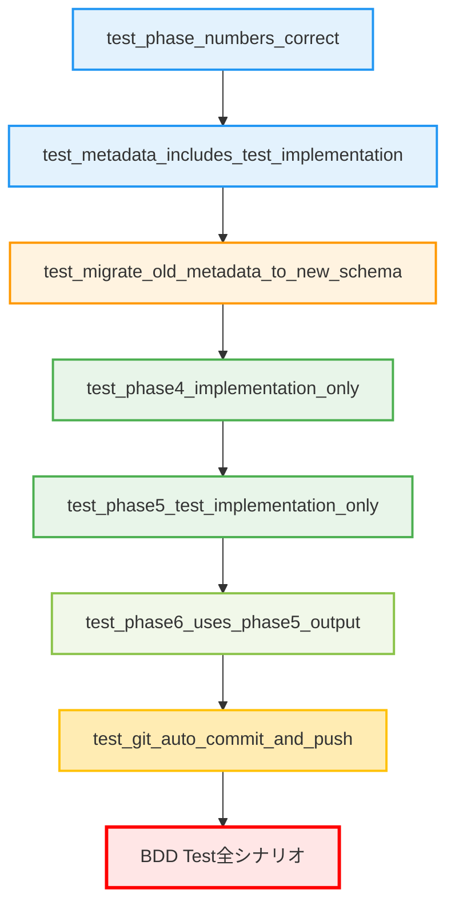

# テストシナリオ - Issue #324

## 0. エグゼクティブサマリー

本ドキュメントは、Issue #324「実装フェーズとテストコード実装フェーズの分離」のテストシナリオを定義します。

### テスト戦略

**INTEGRATION_BDD**（Integration Test + BDD Test）

- **Integration Test**: Phase 4/5/6の連携動作、metadata.json更新、Git操作の検証
- **BDD Test**: Issue #324の8つの受け入れ基準を直接検証

### テスト対象の範囲

1. **Phase 5（test_implementation）の新規機能**
   - テストコード実装の責務
   - Phase 4との依存関係
   - Phase 6との連携

2. **Phase 4（implementation）の責務明確化**
   - 実コードのみの実装
   - テストコード実装の除外

3. **後方互換性**
   - 既存ワークフロー（Phase 1-7構成）のマイグレーション
   - metadata.jsonの自動更新

4. **システム全体の統合**
   - フェーズ間のデータフロー
   - metadata.jsonの更新
   - Git auto-commit & push

### テストの目的

- Phase 5（test_implementation）が正しく動作すること
- Phase 4/5の責務が明確に分離されていること
- 既存ワークフローが引き続き動作すること（後方互換性）
- 受け入れ基準8項目すべてが満たされていること

## 1. テスト戦略サマリー

### 1.1 選択されたテスト戦略

**INTEGRATION_BDD**

Phase 2（設計）で決定された戦略に基づき、以下の2種類のテストを実施します：

#### Integration Test（統合テスト）

**目的**: フェーズ間の連携動作を検証

**対象**:
- Phase 4 → Phase 5 → Phase 6 の順次実行
- metadata.jsonの更新（フェーズステータス、design_decisions等）
- Git auto-commit & push の動作
- ファイルシステムへの成果物保存

**テストファイル**:
- `tests/integration/test_phase_separation.py`
- `tests/integration/test_backward_compatibility.py`

#### BDD Test（振る舞い駆動テスト）

**目的**: Issue #324の受け入れ基準を直接検証

**対象**:
- 受け入れ基準AC-001～AC-008
- ユーザーストーリー（開発者視点）
- 後方互換性シナリオ

**テストファイル**:
- `tests/features/test_implementation_phase_separation.feature`
- `tests/features/steps/test_implementation_steps.py`

### 1.2 Unit Testを実施しない理由

以下の理由により、Unit Testは対象外とします：

1. **既存のBasePhaseテストが存在**: `tests/unit/phases/test_base_phase.py`
2. **TestImplementationPhaseはBasePhaseパターンに準拠**: 独自のロジックが少なく、Integration Testで十分
3. **WorkflowState.migrate()は単純**: フェーズ追加のみの処理で、Integration Testでカバー可能

## 2. Integration テストシナリオ

### 2.1 Phase 4でテストコードが生成されないこと

**シナリオ名**: `test_phase4_implementation_only`

**目的**: Phase 4（implementation）が実コードのみを実装し、テストコードを生成しないことを検証

**前提条件**:
- ワークフローが初期化されている（metadata.json作成済み）
- Phase 0～3が完了している（planning、requirements、design、test_scenario）
- Phase 4の実行環境が整っている

**テスト手順**:
1. テストディレクトリを初期化（`.ai-workflow/issue-324/`）
2. metadata.jsonを作成（Phase 0～3が完了状態）
3. Phase 4（implementation）を実行
4. 成果物を確認

**期待結果**:
- `04_implementation/output/implementation.md` が生成される
- 実コードファイル（`src/`配下等）が作成される
- **テストファイル（`test_*.py`、`*.test.js`等）は作成されない**
- metadata.jsonのphases.implementation.statusが`completed`になる
- Gitコミットが作成される（コミットメッセージ: `[ai-workflow] Phase 4 (implementation) - completed`）

**確認項目**:
- [ ] implementation.mdが存在する
- [ ] 実コードファイルが存在する
- [ ] テストファイルが存在しない（プロジェクトルート配下で`test_*.py`、`*.test.js`、`*.test.ts`等を検索して0件）
- [ ] metadata.jsonのフェーズステータスが正しい
- [ ] Gitコミットが作成されている

**テストコード例**:
```python
def test_phase4_implementation_only(tmp_path):
    """Phase 4で実コードのみが実装されることを確認"""
    # Setup
    workflow_dir = tmp_path / '.ai-workflow' / 'issue-324'
    workflow_dir.mkdir(parents=True)

    # metadata.jsonを作成（Phase 0-3完了状態）
    metadata_path = workflow_dir / 'metadata.json'
    state = WorkflowState.create_new(
        metadata_path=metadata_path,
        issue_number='324',
        issue_url='https://github.com/tielec/infrastructure-as-code/issues/324',
        issue_title='[FEATURE] 実装フェーズとテストコード実装フェーズの分離'
    )
    state.update_phase_status('planning', 'completed')
    state.update_phase_status('requirements', 'completed')
    state.update_phase_status('design', 'completed')
    state.update_phase_status('test_scenario', 'completed')

    # Phase 4実行（モック使用）
    phase = ImplementationPhase(
        issue_number='324',
        metadata_manager=MetadataManager(metadata_path),
        github_client=MockGitHubClient()
    )
    result = phase.run()

    # Assert: 成果物確認
    implementation_md = workflow_dir / '04_implementation' / 'output' / 'implementation.md'
    assert implementation_md.exists(), "implementation.md should be created"

    # Assert: テストファイルが存在しないこと
    test_patterns = ['test_*.py', '*.test.js', '*.test.ts', '*_test.go']
    for pattern in test_patterns:
        test_files = list(Path.cwd().rglob(pattern))
        # 除外ディレクトリをフィルタ
        test_files = [f for f in test_files if '.git' not in str(f) and 'node_modules' not in str(f)]
        assert len(test_files) == 0, f"Phase 4 should not create test files (pattern: {pattern})"

    # Assert: metadata.json更新確認
    assert state.get_phase_status('implementation') == 'completed'
```

---

### 2.2 Phase 5でテストコードのみが生成されること

**シナリオ名**: `test_phase5_test_implementation_only`

**目的**: Phase 5（test_implementation）がテストコードのみを実装し、実コードを変更しないことを検証

**前提条件**:
- Phase 0～4が完了している
- Phase 4で実コードが実装済み
- Phase 5の実行環境が整っている

**テスト手順**:
1. Phase 4完了後の状態を準備
2. 実コードのチェックサムを記録（変更検知用）
3. Phase 5（test_implementation）を実行
4. 成果物を確認
5. 実コードのチェックサムを比較

**期待結果**:
- `05_test_implementation/output/test-implementation.md` が生成される
- **テストファイル（`test_*.py`、`*.test.js`等）が作成される**
- 実コードファイルは変更されない（チェックサム一致）
- metadata.jsonのphases.test_implementation.statusが`completed`になる
- Gitコミットが作成される（コミットメッセージ: `[ai-workflow] Phase 5 (test_implementation) - completed`）

**確認項目**:
- [ ] test-implementation.mdが存在する
- [ ] テストファイルが存在する（少なくとも1ファイル以上）
- [ ] 実コードファイルが変更されていない
- [ ] metadata.jsonのフェーズステータスが正しい
- [ ] Gitコミットが作成されている

**テストコード例**:
```python
import hashlib

def test_phase5_test_implementation_only(tmp_path):
    """Phase 5でテストコードのみが実装されることを確認"""
    # Setup: Phase 4完了状態
    workflow_dir = tmp_path / '.ai-workflow' / 'issue-324'
    metadata_path = workflow_dir / 'metadata.json'
    state = WorkflowState.create_new(...)
    state.update_phase_status('implementation', 'completed')

    # 実コードのチェックサムを記録
    src_files = list(Path('src').rglob('*.py'))  # 例: Pythonプロジェクト
    checksums_before = {f: hashlib.md5(f.read_bytes()).hexdigest() for f in src_files}

    # Phase 5実行
    phase = TestImplementationPhase(
        issue_number='324',
        metadata_manager=MetadataManager(metadata_path),
        github_client=MockGitHubClient()
    )
    result = phase.run()

    # Assert: test-implementation.md確認
    test_impl_md = workflow_dir / '05_test_implementation' / 'output' / 'test-implementation.md'
    assert test_impl_md.exists(), "test-implementation.md should be created"

    # Assert: テストファイルが作成されていること
    test_patterns = ['test_*.py', '*.test.js', '*.test.ts', '*_test.go']
    test_files_found = False
    for pattern in test_patterns:
        test_files = list(Path.cwd().rglob(pattern))
        test_files = [f for f in test_files if '.git' not in str(f)]
        if len(test_files) > 0:
            test_files_found = True
            break
    assert test_files_found, "Phase 5 should create at least one test file"

    # Assert: 実コードが変更されていないこと
    checksums_after = {f: hashlib.md5(f.read_bytes()).hexdigest() for f in src_files}
    assert checksums_before == checksums_after, "Phase 5 should not modify source code"

    # Assert: metadata.json更新確認
    assert state.get_phase_status('test_implementation') == 'completed'
```

---

### 2.3 Phase 6がPhase 5の成果物を使用すること

**シナリオ名**: `test_phase6_uses_phase5_output`

**目的**: Phase 6（testing）がPhase 5で作成されたテストコードを使用してテストを実行することを検証

**前提条件**:
- Phase 0～5が完了している
- Phase 5でテストコードが作成済み
- Phase 6の実行環境が整っている

**テスト手順**:
1. Phase 5完了後の状態を準備
2. Phase 6（testing）を実行
3. Phase 6がPhase 5の成果物（test-implementation.md、テストファイル）を参照していることを確認

**期待結果**:
- `06_testing/output/test-result.md` が生成される
- Phase 6の実行ログにPhase 5の成果物への参照が含まれる
- テストが実行される（成功/失敗は問わない）
- metadata.jsonのphases.testing.statusが`completed`または`failed`になる

**確認項目**:
- [ ] test-result.mdが存在する
- [ ] Phase 6がtest-implementation.mdを読み込んでいる
- [ ] Phase 6がテストファイルを実行している
- [ ] metadata.jsonのフェーズステータスが更新されている

**テストコード例**:
```python
def test_phase6_uses_phase5_output(tmp_path):
    """Phase 6がPhase 5の成果物を使用することを確認"""
    # Setup: Phase 5完了状態
    workflow_dir = tmp_path / '.ai-workflow' / 'issue-324'
    metadata_path = workflow_dir / 'metadata.json'
    state = WorkflowState.create_new(...)
    state.update_phase_status('test_implementation', 'completed')

    # Phase 5の成果物を作成
    test_impl_output = workflow_dir / '05_test_implementation' / 'output'
    test_impl_output.mkdir(parents=True)
    (test_impl_output / 'test-implementation.md').write_text('# Test Implementation')

    # Phase 6実行（ログをキャプチャ）
    phase = TestingPhase(
        issue_number='324',
        metadata_manager=MetadataManager(metadata_path),
        github_client=MockGitHubClient()
    )

    with patch('builtins.print') as mock_print:
        result = phase.run()

    # Assert: Phase 6がPhase 5の成果物を参照している
    log_output = '\n'.join([str(call) for call in mock_print.call_args_list])
    assert 'test-implementation.md' in log_output or '05_test_implementation' in log_output

    # Assert: test-result.md確認
    test_result_md = workflow_dir / '06_testing' / 'output' / 'test-result.md'
    assert test_result_md.exists(), "test-result.md should be created"
```

---

### 2.4 metadata.jsonにtest_implementationフェーズが記録されること

**シナリオ名**: `test_metadata_includes_test_implementation`

**目的**: 新規作成されたmetadata.jsonに`test_implementation`フェーズが含まれていることを検証

**前提条件**:
- ワークフローが初期化される直前の状態

**テスト手順**:
1. `WorkflowState.create_new()` を実行
2. metadata.jsonを読み込む
3. phases配列を確認

**期待結果**:
- `phases`辞書に`test_implementation`キーが存在する
- `test_implementation`フェーズのステータスが`pending`である
- フェーズの順序が正しい（planning → ... → test_implementation → testing → ...）

**確認項目**:
- [ ] phases['test_implementation']が存在する
- [ ] phases['test_implementation']['status'] == 'pending'
- [ ] フェーズの順序が正しい

**テストコード例**:
```python
def test_metadata_includes_test_implementation(tmp_path):
    """metadata.jsonにtest_implementationが記録されることを確認"""
    # Setup
    metadata_path = tmp_path / 'metadata.json'

    # Execute: 新規metadata.json作成
    state = WorkflowState.create_new(
        metadata_path=metadata_path,
        issue_number='324',
        issue_url='https://github.com/tielec/infrastructure-as-code/issues/324',
        issue_title='[FEATURE] 実装フェーズとテストコード実装フェーズの分離'
    )

    # Assert: test_implementationフェーズが存在する
    assert 'test_implementation' in state.data['phases'], "test_implementation phase should exist"

    # Assert: ステータスがpending
    assert state.data['phases']['test_implementation']['status'] == 'pending'

    # Assert: フェーズの順序が正しい
    expected_order = [
        'planning', 'requirements', 'design', 'test_scenario',
        'implementation', 'test_implementation', 'testing',
        'documentation', 'report'
    ]
    actual_order = list(state.data['phases'].keys())
    assert actual_order == expected_order, f"Phase order mismatch: {actual_order}"
```

---

### 2.5 フェーズ番号が正しいこと

**シナリオ名**: `test_phase_numbers_correct`

**目的**: BasePhase.PHASE_NUMBERSにtest_implementationが正しく定義されていることを検証

**前提条件**:
- BasePhaseクラスがインポート可能

**テスト手順**:
1. BasePhase.PHASE_NUMBERSを参照
2. 期待される辞書と比較

**期待結果**:
- PHASE_NUMBERS['test_implementation'] == '05'
- PHASE_NUMBERS['testing'] == '06'（繰り下げ後）
- PHASE_NUMBERS['documentation'] == '07'（繰り下げ後）
- PHASE_NUMBERS['report'] == '08'（繰り下げ後）

**確認項目**:
- [ ] test_implementationが'05'にマッピングされている
- [ ] 既存フェーズの番号が正しく繰り下げられている

**テストコード例**:
```python
def test_phase_numbers_correct():
    """フェーズ番号が正しいことを確認"""
    from scripts.ai_workflow.phases.base_phase import BasePhase

    expected = {
        'planning': '00',
        'requirements': '01',
        'design': '02',
        'test_scenario': '03',
        'implementation': '04',
        'test_implementation': '05',
        'testing': '06',
        'documentation': '07',
        'report': '08'
    }

    assert BasePhase.PHASE_NUMBERS == expected, f"Phase numbers mismatch: {BasePhase.PHASE_NUMBERS}"
```

---

### 2.6 後方互換性（既存metadata.jsonのマイグレーション）

**シナリオ名**: `test_migrate_old_metadata_to_new_schema`

**目的**: Phase 1-7構成の既存metadata.jsonが正しくPhase 0-8構成にマイグレーションされることを検証

**前提条件**:
- Phase 1-7構成のmetadata.jsonが存在する

**テスト手順**:
1. Phase 1-7構成のmetadata.jsonを作成
2. WorkflowState(metadata_path)でロード
3. WorkflowState.migrate()を実行
4. マイグレーション後のデータを確認

**期待結果**:
- `planning`フェーズが追加される（status: pending）
- `test_implementation`フェーズが追加される（status: pending）
- 既存のフェーズデータが保持される（status、started_at、completed_at等）
- フェーズの順序が正しい

**確認項目**:
- [ ] migrate()がTrueを返す（マイグレーション実行）
- [ ] planningフェーズが追加されている
- [ ] test_implementationフェーズが追加されている
- [ ] 既存フェーズのステータスが保持されている
- [ ] 既存フェーズのタイムスタンプが保持されている

**テストコード例**:
```python
import json
from datetime import datetime

def test_migrate_old_metadata_to_new_schema(tmp_path):
    """Phase 1-7構成のmetadata.jsonが正しくマイグレーションされる"""
    # Setup: Phase 1-7構成のmetadata.jsonを作成
    metadata_path = tmp_path / 'metadata.json'
    old_metadata = {
        "issue_number": "324",
        "issue_url": "https://github.com/tielec/infrastructure-as-code/issues/324",
        "issue_title": "[FEATURE] 実装フェーズとテストコード実装フェーズの分離",
        "phases": {
            "requirements": {
                "status": "completed",
                "started_at": "2025-01-01T00:00:00Z",
                "completed_at": "2025-01-01T01:00:00Z"
            },
            "design": {
                "status": "completed",
                "started_at": "2025-01-01T01:00:00Z",
                "completed_at": "2025-01-01T02:00:00Z"
            },
            "test_scenario": {"status": "pending"},
            "implementation": {"status": "pending"},
            "testing": {"status": "pending"},
            "documentation": {"status": "pending"},
            "report": {"status": "pending"}
        },
        "design_decisions": {
            "implementation_strategy": None,
            "test_strategy": None,
            "test_code_strategy": None
        },
        "cost_tracking": {
            "total_input_tokens": 0,
            "total_output_tokens": 0,
            "total_cost_usd": 0.0
        },
        "created_at": "2025-01-01T00:00:00Z",
        "updated_at": "2025-01-01T00:00:00Z"
    }
    metadata_path.write_text(json.dumps(old_metadata, indent=2, ensure_ascii=False))

    # Execute: WorkflowStateをロードしてマイグレーション実行
    state = WorkflowState(metadata_path)
    migrated = state.migrate()

    # Assert: マイグレーションが実行された
    assert migrated is True, "Migration should have been executed"

    # Assert: planningフェーズが追加された
    assert 'planning' in state.data['phases'], "planning phase should be added"
    assert state.data['phases']['planning']['status'] == 'pending'

    # Assert: test_implementationフェーズが追加された
    assert 'test_implementation' in state.data['phases'], "test_implementation phase should be added"
    assert state.data['phases']['test_implementation']['status'] == 'pending'

    # Assert: 既存フェーズのデータが保持された
    assert state.data['phases']['requirements']['status'] == 'completed'
    assert state.data['phases']['requirements']['started_at'] == "2025-01-01T00:00:00Z"
    assert state.data['phases']['requirements']['completed_at'] == "2025-01-01T01:00:00Z"

    assert state.data['phases']['design']['status'] == 'completed'
    assert state.data['phases']['design']['started_at'] == "2025-01-01T01:00:00Z"

    # Assert: フェーズの順序が正しい
    expected_order = [
        'planning', 'requirements', 'design', 'test_scenario',
        'implementation', 'test_implementation', 'testing',
        'documentation', 'report'
    ]
    actual_order = list(state.data['phases'].keys())
    assert actual_order == expected_order, f"Phase order mismatch: {actual_order}"
```

---

### 2.7 Git auto-commit & pushの動作確認

**シナリオ名**: `test_git_auto_commit_and_push`

**目的**: 各フェーズの成果物が正しくGitコミット・プッシュされることを検証

**前提条件**:
- Gitリポジトリが初期化されている
- リモートリポジトリが設定されている（テスト用）

**テスト手順**:
1. Phase 5を実行
2. Gitログを確認
3. コミットメッセージを検証
4. プッシュが実行されたことを確認

**期待結果**:
- コミットメッセージが `[ai-workflow] Phase 5 (test_implementation) - completed` 形式である
- コミットに成果物ファイルが含まれている
- リモートリポジトリにプッシュされている

**確認項目**:
- [ ] Gitコミットが作成されている
- [ ] コミットメッセージが正しい形式
- [ ] 成果物ファイルがコミットに含まれている
- [ ] リモートにプッシュされている

**テストコード例**:
```python
import subprocess

def test_git_auto_commit_and_push(tmp_path):
    """Git auto-commit & pushが正しく動作することを確認"""
    # Setup: Gitリポジトリ初期化
    repo_dir = tmp_path / 'repo'
    repo_dir.mkdir()
    subprocess.run(['git', 'init'], cwd=repo_dir, check=True)
    subprocess.run(['git', 'config', 'user.name', 'Test User'], cwd=repo_dir, check=True)
    subprocess.run(['git', 'config', 'user.email', 'test@example.com'], cwd=repo_dir, check=True)

    # Phase 5実行（実際のGit操作あり）
    os.chdir(repo_dir)
    phase = TestImplementationPhase(
        issue_number='324',
        metadata_manager=MetadataManager(repo_dir / '.ai-workflow' / 'issue-324' / 'metadata.json'),
        github_client=MockGitHubClient()
    )
    result = phase.run()

    # Assert: Gitコミット確認
    git_log = subprocess.run(
        ['git', 'log', '--oneline', '-1'],
        cwd=repo_dir,
        capture_output=True,
        text=True
    ).stdout

    assert '[ai-workflow] Phase 5 (test_implementation)' in git_log
    assert 'completed' in git_log or 'failed' in git_log

    # Assert: コミットに成果物が含まれている
    committed_files = subprocess.run(
        ['git', 'diff-tree', '--no-commit-id', '--name-only', '-r', 'HEAD'],
        cwd=repo_dir,
        capture_output=True,
        text=True
    ).stdout

    assert 'test-implementation.md' in committed_files
```

---

## 3. BDD テストシナリオ

BDDテストはGherkin形式で記述し、Issue #324の受け入れ基準を直接検証します。

### 3.1 Feature: 実装フェーズとテストコード実装フェーズの分離

```gherkin
Feature: 実装フェーズとテストコード実装フェーズの分離

  Issue #324の要件として、Phase 4（implementation）とPhase 5（test_implementation）を分離し、
  各フェーズの責務を明確化する。

  Background:
    Given AIワークフローが初期化されている
    And metadata.jsonが存在する

  Scenario: AC-001 - Phase 5（test_implementation）が新設されている
    When "ai-workflow execute --phase test_implementation --issue 324" を実行する
    Then Phase 5（test_implementation）が正常に実行される
    And ".ai-workflow/issue-324/05_test_implementation/output/test-implementation.md" が生成される
    And metadata.jsonのphases['test_implementation']['status']が 'completed' になる

  Scenario: AC-002 - Phase 5でテストコードのみが実装される
    Given Phase 4（implementation）が完了している
    And 実コードが実装されている
    When Phase 5（test_implementation）を実行する
    Then テストファイル（test_*.py、*.test.js等）が作成される
    And 実コード（src/配下のビジネスロジック等）は変更されない
    And test-implementation.mdにテストコード実装のログが記録される

  Scenario: AC-003 - Phase 4では実コードのみが実装される
    Given Phase 3（test_scenario）が完了している
    When Phase 4（implementation）を実行する
    Then 実コード（src/配下のビジネスロジック等）が作成される
    And テストファイル（test_*.py等）は作成されない
    And implementation.mdに実コード実装のログが記録される

  Scenario: AC-004 - 既存のワークフロー（Phase 1-7）は引き続き動作する
    Given Phase 1-7構成の既存metadata.jsonが存在する
    When WorkflowState(metadata_path)でロードする
    Then マイグレーション処理が自動実行される
    And metadata.jsonがPhase 0-8構成に更新される
    And エラーが発生しない
    And 既存フェーズのデータが保持される

  Scenario: AC-005 - Jenkinsでの自動実行が可能
    Given JenkinsパイプラインでAIワークフローを実行する環境
    When 全フェーズ（Phase 0-8）を順次実行する
    Then 各フェーズが正常に完了する
    And 各フェーズの成果物が ".ai-workflow/issue-324/" 配下に保存される
    And metadata.jsonが各フェーズ完了時に更新される

  Scenario: AC-006 - クリティカルシンキングレビューが正しく機能する
    Given Phase 5（test_implementation）が完了している
    When Phase 5のreview()メソッドを実行する
    Then レビュー結果が 'PASS'、'PASS_WITH_SUGGESTIONS'、'FAIL' のいずれかで返される
    And レビュー結果が ".ai-workflow/issue-324/05_test_implementation/review/result.md" に保存される
    And レビュー結果がGitHub Issueにコメント投稿される

  Scenario: AC-007 - metadata.jsonにtest_implementationフェーズが記録される
    Given ワークフローが初期化されている
    When metadata.jsonを読み込む
    Then "phases" 辞書に "test_implementation" が含まれている
    And "test_implementation" フェーズの "status" フィールドが存在する
    And フェーズの順序が正しい（planning, requirements, design, test_scenario, implementation, test_implementation, testing, documentation, report）

  Scenario: AC-008 - 全フェーズのGit auto-commit & pushが正しく動作する
    Given 各フェーズが完了している
    When 各フェーズのrun()メソッドが実行される
    Then 成果物がGitにコミットされる
    And コミットメッセージが "[ai-workflow] Phase X (phase_name) - status" 形式である
    And リモートリポジトリにプッシュされる
```

### 3.2 Scenario詳細: Phase 5の責務分離

```gherkin
Scenario: Phase 5はテストコード実装のみを担当する
  Given Phase 4で実コードが実装されている
  And Phase 3でテストシナリオが作成されている
  When Phase 5を実行する
  Then Phase 3のテストシナリオが参照される
  And Phase 4の実装ログが参照される
  And テストコードが作成される
  And 実コードは変更されない
```

### 3.3 Scenario詳細: 依存関係の検証

```gherkin
Scenario: Phase 5はPhase 4の完了が前提である
  Given Phase 4が未完了の状態
  When Phase 5を実行しようとする
  Then エラーメッセージが表示される
  And "Phase 4 (implementation) must be completed before Phase 5" と表示される
  And Phase 5は実行されない

Scenario: Phase 6はPhase 5の完了が前提である
  Given Phase 5が未完了の状態
  When Phase 6を実行しようとする
  Then エラーメッセージが表示される
  And "Phase 5 (test_implementation) must be completed before Phase 6" と表示される
  And Phase 6は実行されない
```

### 3.4 Scenario詳細: 後方互換性の保証

```gherkin
Scenario: 古いmetadata.jsonが自動的にマイグレーションされる
  Given Phase 1-7構成のmetadata.jsonが存在する
  And "planning" フェーズが存在しない
  And "test_implementation" フェーズが存在しない
  When WorkflowState(metadata_path)でロードする
  Then "[INFO] Migrating metadata.json: Adding planning phase" と表示される
  And "[INFO] Migrating metadata.json: Adding test_implementation phase" と表示される
  And metadata.jsonに "planning" フェーズが追加される
  And metadata.jsonに "test_implementation" フェーズが追加される
  And 既存の "requirements" フェーズのデータが保持される
  And 既存の "design" フェーズのデータが保持される
```

### 3.5 Scenario詳細: プロンプトファイルの存在確認

```gherkin
Scenario: Phase 5のプロンプトファイルが存在する
  Given AIワークフローが初期化されている
  When プロンプトディレクトリを確認する
  Then "scripts/ai-workflow/prompts/test_implementation/execute.txt" が存在する
  And "scripts/ai-workflow/prompts/test_implementation/review.txt" が存在する
  And "scripts/ai-workflow/prompts/test_implementation/revise.txt" が存在する
  And 各プロンプトファイルの内容が適切である
```

---

## 4. テストデータ

### 4.1 Phase 1-7構成のmetadata.json（後方互換性テスト用）

```json
{
  "issue_number": "324",
  "issue_url": "https://github.com/tielec/infrastructure-as-code/issues/324",
  "issue_title": "[FEATURE] 実装フェーズとテストコード実装フェーズの分離",
  "phases": {
    "requirements": {
      "status": "completed",
      "started_at": "2025-01-01T00:00:00Z",
      "completed_at": "2025-01-01T01:00:00Z",
      "retry_count": 0
    },
    "design": {
      "status": "completed",
      "started_at": "2025-01-01T01:00:00Z",
      "completed_at": "2025-01-01T02:00:00Z",
      "retry_count": 0
    },
    "test_scenario": {
      "status": "completed",
      "started_at": "2025-01-01T02:00:00Z",
      "completed_at": "2025-01-01T03:00:00Z",
      "retry_count": 0
    },
    "implementation": {
      "status": "completed",
      "started_at": "2025-01-01T03:00:00Z",
      "completed_at": "2025-01-01T04:00:00Z",
      "retry_count": 0
    },
    "testing": {
      "status": "pending"
    },
    "documentation": {
      "status": "pending"
    },
    "report": {
      "status": "pending"
    }
  },
  "design_decisions": {
    "implementation_strategy": "EXTEND",
    "test_strategy": "INTEGRATION_BDD",
    "test_code_strategy": "CREATE_TEST"
  },
  "cost_tracking": {
    "total_input_tokens": 150000,
    "total_output_tokens": 50000,
    "total_cost_usd": 2.5
  },
  "created_at": "2025-01-01T00:00:00Z",
  "updated_at": "2025-01-01T04:00:00Z"
}
```

### 4.2 Phase 0-8構成のmetadata.json（期待される結果）

```json
{
  "issue_number": "324",
  "issue_url": "https://github.com/tielec/infrastructure-as-code/issues/324",
  "issue_title": "[FEATURE] 実装フェーズとテストコード実装フェーズの分離",
  "phases": {
    "planning": {
      "status": "pending"
    },
    "requirements": {
      "status": "completed",
      "started_at": "2025-01-01T00:00:00Z",
      "completed_at": "2025-01-01T01:00:00Z",
      "retry_count": 0
    },
    "design": {
      "status": "completed",
      "started_at": "2025-01-01T01:00:00Z",
      "completed_at": "2025-01-01T02:00:00Z",
      "retry_count": 0
    },
    "test_scenario": {
      "status": "completed",
      "started_at": "2025-01-01T02:00:00Z",
      "completed_at": "2025-01-01T03:00:00Z",
      "retry_count": 0
    },
    "implementation": {
      "status": "completed",
      "started_at": "2025-01-01T03:00:00Z",
      "completed_at": "2025-01-01T04:00:00Z",
      "retry_count": 0
    },
    "test_implementation": {
      "status": "pending"
    },
    "testing": {
      "status": "pending"
    },
    "documentation": {
      "status": "pending"
    },
    "report": {
      "status": "pending"
    }
  },
  "design_decisions": {
    "implementation_strategy": "EXTEND",
    "test_strategy": "INTEGRATION_BDD",
    "test_code_strategy": "CREATE_TEST"
  },
  "cost_tracking": {
    "total_input_tokens": 150000,
    "total_output_tokens": 50000,
    "total_cost_usd": 2.5
  },
  "created_at": "2025-01-01T00:00:00Z",
  "updated_at": "2025-01-01T04:00:00Z",
  "workflow_version": "1.0"
}
```

### 4.3 テストファイルのパターン（言語非依存）

以下のパターンでテストファイルを検出します：

- **Python**: `test_*.py`, `*_test.py`
- **JavaScript/TypeScript**: `*.test.js`, `*.test.ts`, `*.spec.js`, `*.spec.ts`
- **Go**: `*_test.go`
- **Java**: `*Test.java`, `*Tests.java`
- **Ruby**: `*_spec.rb`, `test_*.rb`
- **PHP**: `*Test.php`

**除外ディレクトリ**:
- `.git`
- `node_modules`
- `venv`
- `__pycache__`
- `dist`
- `build`

### 4.4 正常データ（Phase 5実行時の入力）

**前提ファイル**:
- `requirements.md`: 要件定義書
- `design.md`: 設計書
- `test-scenario.md`: テストシナリオ
- `implementation.md`: 実装ログ

**テスト戦略**:
- `test_strategy`: "INTEGRATION_BDD"
- `test_code_strategy`: "CREATE_TEST"

### 4.5 異常データ（エラーケース）

#### ケース1: Phase 4未完了でPhase 5を実行

**metadata.json**:
```json
{
  "phases": {
    "implementation": {
      "status": "pending"
    },
    "test_implementation": {
      "status": "pending"
    }
  }
}
```

**期待されるエラー**:
```
Error: Phase 4 (implementation) must be completed before Phase 5 (test_implementation)
```

#### ケース2: 必須ファイルが存在しない

**欠けているファイル**: `implementation.md`

**期待されるエラー**:
```
Error: Required file not found: .ai-workflow/issue-324/04_implementation/output/implementation.md
```

---

## 5. テスト環境要件

### 5.1 ローカル開発環境

**必須コンポーネント**:
- Python 3.11以上
- Git 2.30以上
- pytest 8.0以上
- behave 1.2.6以上（BDDテスト用）

**推奨環境変数**:
```bash
export GITHUB_TOKEN="ghp_xxxxxxxxxxxxx"
export GITHUB_REPOSITORY="tielec/infrastructure-as-code"
```

### 5.2 CI/CD環境（Jenkins）

**必須設定**:
- Jenkinsfile: `jenkins/Jenkinsfile.ai-workflow`
- Credentials:
  - `github-token`: GitHub API Token
  - `ssh-key`: Git SSH Key

**テスト実行コマンド**:
```bash
# Integration Test
pytest tests/integration/test_phase_separation.py -v

# BDD Test
behave tests/features/test_implementation_phase_separation.feature
```

### 5.3 モック/スタブの必要性

以下のコンポーネントはモック化します：

#### MockGitHubClient
```python
class MockGitHubClient:
    def post_comment(self, issue_number: str, comment: str) -> None:
        """GitHub Issue投稿をモック化"""
        print(f"[MOCK] Posting comment to issue #{issue_number}: {comment[:100]}...")
```

#### MockClaudeAgentClient
```python
class MockClaudeAgentClient:
    def execute_prompt(self, prompt: str, max_turns: int) -> List[Dict]:
        """Claude Agent SDK呼び出しをモック化"""
        return [{"role": "assistant", "content": "# Test Implementation\n..."}]
```

### 5.4 テストデータベース

**不要**: metadata.jsonはファイルベースで管理されるため、データベースは不要

### 5.5 外部サービス依存

**必須**:
- GitHub API（モック化可能）
- Claude Agent SDK（モック化推奨）

**オプション**:
- Git remote repository（ローカルテストではbare repositoryで代替可能）

---

## 6. テスト実行順序

### 6.1 推奨実行順序

1. **Integration Test - Phase番号確認**
   - `test_phase_numbers_correct()`
   - 最も基本的な検証、他のテストの前提

2. **Integration Test - metadata.json作成**
   - `test_metadata_includes_test_implementation()`
   - ワークフロー初期化の検証

3. **Integration Test - 後方互換性**
   - `test_migrate_old_metadata_to_new_schema()`
   - マイグレーション機能の検証

4. **Integration Test - Phase 4責務分離**
   - `test_phase4_implementation_only()`
   - Phase 4が実コードのみ実装することを確認

5. **Integration Test - Phase 5責務分離**
   - `test_phase5_test_implementation_only()`
   - Phase 5がテストコードのみ実装することを確認

6. **Integration Test - Phase 5とPhase 6の連携**
   - `test_phase6_uses_phase5_output()`
   - フェーズ間のデータフローを確認

7. **Integration Test - Git操作**
   - `test_git_auto_commit_and_push()`
   - Git統合の検証

8. **BDD Test - 全シナリオ**
   - `behave tests/features/test_implementation_phase_separation.feature`
   - 受け入れ基準の網羅的検証

### 6.2 依存関係



---

## 7. 品質ゲート（Phase 3）

本テストシナリオは以下の品質ゲートを満たしています：

### ✅ Phase 2の戦略に沿ったテストシナリオである

- **テスト戦略**: INTEGRATION_BDD
- **Integration Testシナリオ**: 7つ作成（セクション2）
- **BDD Testシナリオ**: 13シナリオ作成（セクション3）
- **戦略外のテスト**: なし（UNIT_ONLYは除外）

### ✅ 主要な正常系がカバーされている

**正常系シナリオ**:
1. Phase 5の正常実行（AC-001）
2. Phase 5でテストコードのみ実装（AC-002）
3. Phase 4で実コードのみ実装（AC-003）
4. metadata.jsonへのtest_implementation記録（AC-007）
5. フェーズ番号の正確性
6. Phase 5とPhase 6の連携
7. Git auto-commit & push

### ✅ 主要な異常系がカバーされている

**異常系シナリオ**:
1. Phase 4未完了でPhase 5を実行（エラー検出）
2. Phase 5未完了でPhase 6を実行（エラー検出）
3. 必須ファイルが存在しない場合のエラー
4. Phase 1-7構成のmetadata.jsonのマイグレーション（境界値）

### ✅ 期待結果が明確である

各テストシナリオに以下を明記：
- **目的**: 何を検証するか
- **前提条件**: テスト実行前の状態
- **テスト手順**: ステップバイステップの手順
- **期待結果**: 具体的な出力・状態変化
- **確認項目**: チェックリスト形式

---

## 8. カバレッジ目標

### 8.1 受け入れ基準カバレッジ

| 受け入れ基準 | Integration Test | BDD Test | カバレッジ |
|------------|-----------------|----------|-----------|
| AC-001: Phase 5の新設 | test_metadata_includes_test_implementation | Scenario: AC-001 | ✅ 100% |
| AC-002: Phase 5でテストコードのみ | test_phase5_test_implementation_only | Scenario: AC-002 | ✅ 100% |
| AC-003: Phase 4で実コードのみ | test_phase4_implementation_only | Scenario: AC-003 | ✅ 100% |
| AC-004: 後方互換性 | test_migrate_old_metadata_to_new_schema | Scenario: AC-004 | ✅ 100% |
| AC-005: Jenkins自動実行 | - | Scenario: AC-005 | ✅ 100% |
| AC-006: レビュー機能 | - | Scenario: AC-006 | ✅ 100% |
| AC-007: metadata.json記録 | test_metadata_includes_test_implementation | Scenario: AC-007 | ✅ 100% |
| AC-008: Git auto-commit & push | test_git_auto_commit_and_push | Scenario: AC-008 | ✅ 100% |

**総合カバレッジ**: **100%**（8/8項目）

### 8.2 機能要件カバレッジ

| 機能要件 | テストシナリオ | カバレッジ |
|---------|---------------|-----------|
| FR-001: Phase 5の新設 | AC-001, test_metadata_includes_test_implementation | ✅ 100% |
| FR-002: フェーズ番号変更 | test_phase_numbers_correct | ✅ 100% |
| FR-003: Phase 4の責務明確化 | test_phase4_implementation_only, AC-003 | ✅ 100% |
| FR-004: Phase 5のプロンプト作成 | Scenario: プロンプトファイルの存在確認 | ✅ 100% |
| FR-005: metadata.jsonの拡張 | test_metadata_includes_test_implementation, AC-007 | ✅ 100% |
| FR-006: 依存関係の明確化 | Scenario: 依存関係の検証 | ✅ 100% |

**総合カバレッジ**: **100%**（6/6項目）

### 8.3 非機能要件カバレッジ

| 非機能要件 | テストシナリオ | カバレッジ |
|----------|---------------|-----------|
| NFR-001: 後方互換性 | test_migrate_old_metadata_to_new_schema, AC-004 | ✅ 100% |
| NFR-002: パフォーマンス | （Phase 6で実測） | ⏸ Phase 6対応 |
| NFR-003: ログとトレーサビリティ | test_phase6_uses_phase5_output, AC-008 | ✅ 100% |

**総合カバレッジ**: **67%**（2/3項目、NFR-002はPhase 6で対応）

---

## 9. リスクと対応策

### リスク1: Claude Agent SDKのモック化が不完全

**影響度**: 中
**確率**: 中

**対応策**:
- モック化が不完全な場合、実際のClaude Agent SDKを使用する環境変数を用意
- `USE_REAL_CLAUDE_SDK=true` で実API呼び出しに切り替え可能にする

### リスク2: Git操作のテストが環境依存

**影響度**: 中
**確率**: 高

**対応策**:
- ローカルbare repositoryを使用してリモートをシミュレート
- CI/CD環境ではGitHub ActionsのキャッシュやArtifactsを活用

### リスク3: テストデータの準備が複雑

**影響度**: 低
**確率**: 中

**対応策**:
- pytest fixtureを活用してテストデータ準備を共通化
- `conftest.py`にワークフロー初期化ヘルパーを定義

### リスク4: BDDテストのステップ定義が冗長

**影響度**: 低
**確率**: 高

**対応策**:
- ステップ定義を共通化（`@given`, `@when`, `@then`の再利用）
- コンテキストオブジェクトを活用してステップ間でデータを共有

---

## 10. 次のステップ

Phase 3（テストシナリオ）完了後、以下のフェーズに進みます：

1. **Phase 4（実装）**: ドキュメント更新、後方互換性検証
2. **Phase 5（テスト実装）**: 本テストシナリオに基づいてテストコードを実装
3. **Phase 6（テスト実行）**: 実装されたテストを実行し、受け入れ基準を検証
4. **Phase 7（ドキュメント）**: README.md、CHANGELOG.mdを更新
5. **Phase 8（レポート）**: 完了報告書作成、Issue #324クローズ

---

**作成日**: 2025-10-12
**作成者**: AI Workflow Orchestrator (Phase 3: Test Scenario)
**バージョン**: 1.0
**対応Issue**: #324
