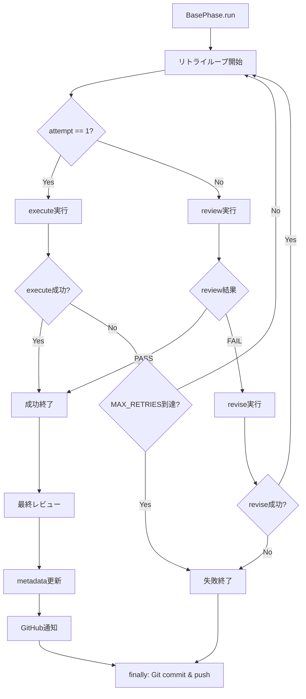

# 詳細設計書: Phase execute()失敗時のリトライ機能修正

## 1. 概要

### 1.1 設計目的

本設計書は、AI駆動開発自動化ワークフローにおけるPhase実行時のリトライ機能の重大なバグを修正するための詳細設計を提供する。現在、`execute()`が失敗した場合に即座に終了し、`revise()`によるリトライループに到達しない問題を解決する。

### 1.2 問題の本質

**現在の動作**:
```python
# base_phase.py:617-625
execute_result = self.execute()
if not execute_result.get('success', False):
    # 実行失敗 → 即座に終了！リトライループに到達しない
    final_status = 'failed'
    self.update_phase_status(status='failed')
    self.post_progress(status='failed', details=f"実行エラー: {execute_result.get('error', 'Unknown error')}")
    return False  # ← ★問題箇所
```

**期待される動作**:
- `execute()`失敗時もリトライループに入る
- `review()` → `revise()` → `review()`のサイクルで最大3回までリトライ
- 一時的なエラー（ネットワーク障害、API制限等）でも自動回復を試みる

### 1.3 ビジネスバリュー

- **信頼性向上**: 一時的なエラーでも自動回復が可能になり、ワークフロー全体の成功率が向上
- **運用効率化**: 手動介入の頻度を削減し、人的リソースを解放
- **開発速度向上**: エラーハンドリングの改善により、CI/CDパイプラインの安定性向上

---

## 2. 実装戦略判断

### 実装戦略: REFACTOR

**判断根拠**:
1. **既存コード構造の改善が主目的**: `base_phase.py`の`run()`メソッド内のロジックを再構築し、execute()とrevise()を統一的なリトライループ内に統合する
2. **既存インターフェースの維持**: `execute()`, `review()`, `revise()`の抽象メソッドインターフェースは変更せず、各Phaseサブクラスへの影響を最小化
3. **新規ファイル作成なし**: `base_phase.py`の既存メソッドを修正するのみで、新規モジュールやクラスの追加は不要
4. **既存機能の再構築**: リトライメカニズム自体は既に存在するが、execute()失敗時に動作しないため、ロジックの再構築が必要

**REFACTORが最適な理由**:
- CREATEではない: 新しい機能を追加するのではなく、既存のリトライ機能を正しく動作させる
- EXTENDではない: 機能の拡張ではなく、既存の実装バグの修正とロジックの再構築

---

## 3. テスト戦略判断

### テスト戦略: UNIT_INTEGRATION

**判断根拠**:
1. **Unit テストが必須の理由**:
   - リトライループのロジックが複雑（attempt回数管理、execute/revise分岐、レビュー結果判定）
   - 各分岐条件（初回execute成功、execute失敗→revise成功、最大リトライ到達等）を独立してテスト可能
   - モックを活用して高速かつ確実なテストが実現可能

2. **Integration テストが必須の理由**:
   - `execute()` → `review()` → `revise()` → `review()`の実際の連携動作を検証
   - メタデータ更新、GitHub API呼び出し、Git commit & pushとの統合を確認
   - 実際のPhaseサブクラス（requirements, design等）での動作確認

3. **BDDテストが不要な理由**:
   - ユーザー視点のビヘイビアシナリオが明確でない（内部実装の改善）
   - 既存のBDDテスト（features/workflow_init.feature等）で十分カバー可能

**採用テスト種別**:
- **Unit テスト**: `tests/unit/phases/test_base_phase.py`に追加
  - リトライループの各分岐条件をモックで検証
  - execute失敗時のリトライ動作を詳細にテスト
- **Integration テスト**: `tests/integration/test_retry_mechanism.py`に新規作成
  - 実際のPhaseサブクラスを使用したエンドツーエンドテスト
  - メタデータ、GitHub API、Git連携の統合テスト

---

## 4. テストコード戦略判断

### テストコード戦略: BOTH_TEST（既存テストの拡張と新規テストの作成）

**判断根拠**:
1. **EXTEND_TEST（既存テストの拡張）が必要な理由**:
   - `tests/unit/phases/test_base_phase.py`に既にリトライ関連のテストが存在（`test_run_review_fail_with_revise`, `test_run_review_fail_max_retries`等）
   - execute失敗時のリトライ動作を追加するテストケースを既存ファイルに統合することで、テスト構造の一貫性を保つ
   - 既存のConcretePhaseモッククラスやフィクスチャを再利用可能

2. **CREATE_TEST（新規テスト作成）が必要な理由**:
   - Integrationテストは新規作成が必要（`tests/integration/test_retry_mechanism.py`）
   - 実際のPhaseサブクラス（RequirementsPhase等）を使用した統合テストは既存のUnitテストでは不十分
   - リトライメカニズム全体の動作を独立したテストファイルで検証

**具体的な戦略**:
- **既存Unitテストの拡張**: `test_base_phase.py`に以下を追加
  - `test_run_execute_failure_with_retry`: execute失敗時のリトライ動作
  - `test_run_execute_failure_max_retries`: execute失敗後の最大リトライ到達
  - `test_run_execute_failure_then_success`: execute失敗→revise成功→review合格
- **新規Integrationテストの作成**: `test_retry_mechanism.py`に以下を作成
  - `test_retry_mechanism_with_real_phase`: 実際のPhaseでのリトライ動作
  - `test_retry_mechanism_with_github_integration`: GitHub API連携を含むリトライ
  - `test_retry_mechanism_with_git_integration`: Git commit & push連携を含むリトライ

---

## 5. アーキテクチャ設計

### 5.1 システム全体図

```
┌──────────────────────────────────────────────────────────────┐
│                       BasePhase.run()                         │
│                                                                │
│  ┌─────────────────────────────────────────────────────────┐ │
│  │ try:                                                      │ │
│  │   1. フェーズ開始通知（GitHub）                            │ │
│  │   2. リトライループ（MAX_RETRIES=3）                       │ │
│  │      ┌─────────────────────────────────────────────┐     │ │
│  │      │ for attempt in range(1, MAX_RETRIES + 1):   │     │ │
│  │      │                                               │     │ │
│  │      │   [ATTEMPT N/3] ログ出力                      │     │ │
│  │      │                                               │     │ │
│  │      │   if attempt == 1:                           │     │ │
│  │      │       result = self.execute()  ←初回実行     │     │ │
│  │      │   else:                                       │     │ │
│  │      │       review_result = self.review()          │     │ │
│  │      │       if review_result == 'PASS':            │     │ │
│  │      │           break  ←成功終了                    │     │ │
│  │      │       result = self.revise(feedback)  ←修正  │     │ │
│  │      │                                               │     │ │
│  │      │   if result['success']:                      │     │ │
│  │      │       final_status = 'completed'             │     │ │
│  │      │       break  ←成功終了                        │     │ │
│  │      │   else:                                       │     │ │
│  │      │       if attempt == MAX_RETRIES:             │     │ │
│  │      │           return False  ←最終失敗             │     │ │
│  │      └─────────────────────────────────────────────┘     │ │
│  │                                                           │ │
│  │   3. 最終レビュー（成功時のみ）                             │ │
│  │   4. ステータス更新（metadata.json）                        │ │
│  │   5. GitHub通知（レビュー結果）                             │ │
│  └─────────────────────────────────────────────────────────┘ │
│  finally:                                                      │
│      Git自動commit & push（成功・失敗問わず）                  │
└──────────────────────────────────────────────────────────────┘
```

### 5.2 コンポーネント間の関係



### 5.3 データフロー

```
┌─────────────────────────────────────────────────────────────┐
│  Input                                                       │
│  - phase_name: str (requirements, design, ...)              │
│  - metadata_manager: MetadataManager                         │
│  - claude_client: ClaudeAgentClient                          │
│  - github_client: GitHubClient                               │
└─────────────────────────────────────────────────────────────┘
                           ↓
┌─────────────────────────────────────────────────────────────┐
│  Processing                                                  │
│  1. execute() → {'success': bool, 'output': Any, 'error': str} │
│  2. review() → {'result': str, 'feedback': str, 'suggestions': List[str]} │
│  3. revise(feedback) → {'success': bool, 'output': Any, 'error': str} │
└─────────────────────────────────────────────────────────────┘
                           ↓
┌─────────────────────────────────────────────────────────────┐
│  Output                                                      │
│  - return: bool (True=成功, False=失敗)                       │
│  - Side Effects:                                             │
│    - metadata.json更新（status, retry_count, review_result） │
│    - GitHub Issue投稿（進捗、レビュー結果）                   │
│    - Git commit & push（成果物、ログ、メタデータ）            │
└─────────────────────────────────────────────────────────────┘
```

---

## 6. 影響範囲分析

### 6.1 既存コードへの影響

#### 6.1.1 直接影響を受けるファイル

| ファイル | 影響内容 | 影響度 |
|---------|---------|-------|
| `scripts/ai-workflow/phases/base_phase.py` | `run()`メソッドのリトライループロジックを全面修正 | **High** |

#### 6.1.2 間接影響を受けるファイル（動作検証が必要）

| ファイル | 影響内容 | 影響度 |
|---------|---------|-------|
| `scripts/ai-workflow/phases/requirements.py` | execute失敗時の動作変更（リトライが実行される） | Medium |
| `scripts/ai-workflow/phases/design.py` | execute失敗時の動作変更（リトライが実行される） | Medium |
| `scripts/ai-workflow/phases/test_scenario.py` | execute失敗時の動作変更（リトライが実行される） | Medium |
| `scripts/ai-workflow/phases/implementation.py` | execute失敗時の動作変更（リトライが実行される） | Medium |
| `scripts/ai-workflow/phases/testing.py` | execute失敗時の動作変更（リトライが実行される） | Medium |
| `scripts/ai-workflow/phases/documentation.py` | execute失敗時の動作変更（リトライが実行される） | Medium |
| `scripts/ai-workflow/phases/report.py` | execute失敗時の動作変更（リトライが実行される） | Medium |
| `scripts/ai-workflow/phases/planning.py` | execute失敗時の動作変更（リトライが実行される） | Medium |

**重要**: 各Phaseサブクラスの`execute()`, `review()`, `revise()`メソッドのインターフェースは変更しないため、コード修正は不要。ただし、動作が変わるため統合テストでの検証が必要。

### 6.2 依存関係の変更

**依存関係の追加・削除**: なし

既存の依存関係をそのまま使用:
- `core.metadata_manager.MetadataManager`
- `core.claude_agent_client.ClaudeAgentClient`
- `core.github_client.GitHubClient`
- `core.git_manager.GitManager`

### 6.3 マイグレーション要否

**マイグレーション不要**

理由:
- `metadata.json`の構造変更なし（既存のretry_countフィールドを活用）
- データベース等の永続化層は使用していない
- 既存のワークフロー（`.ai-workflow/issue-XXX/`）は修正なしで引き続き動作

---

## 7. 変更・追加ファイルリスト

### 7.1 修正が必要な既存ファイル

| No | ファイルパス | 修正内容 | 優先度 |
|----|------------|---------|-------|
| 1 | `scripts/ai-workflow/phases/base_phase.py` | `run()`メソッドのリトライループロジック修正（617-706行目） | **High** |

### 7.2 新規作成ファイル

| No | ファイルパス | 内容 | 優先度 |
|----|------------|-----|-------|
| 1 | `scripts/ai-workflow/tests/integration/test_retry_mechanism.py` | リトライメカニズムの統合テスト（新規作成） | High |

### 7.3 削除が必要なファイル

**なし**

---

## 8. 詳細設計

### 8.1 クラス設計

#### BasePhase（既存クラスの修正）

**クラス名**: `BasePhase`

**ファイル**: `scripts/ai-workflow/phases/base_phase.py`

**修正対象メソッド**: `run(self) -> bool`

**現在のメソッドシグネチャ**: 変更なし

**修正内容**:

1. **リトライループの再構築**:
   - execute()とrevise()を同一ループ内に統合
   - attempt番号の明示的な管理（1～MAX_RETRIES）

2. **試行回数の可視化**:
   - 各試行の開始時に`[ATTEMPT N/3]`形式でログ出力
   - 80文字の区切り線で視覚的に区別

3. **エラーハンドリングの改善**:
   - 各試行失敗時に`[WARNING]`でエラー内容を出力
   - 最大リトライ到達時に明示的なメッセージをGitHub投稿

**新規追加メソッド**: なし（既存メソッドの修正のみ）

### 8.2 関数設計（主要な関数のみ）

#### 8.2.1 run()メソッドの修正詳細

**修正前のフロー**:
```
1. フェーズ開始通知
2. execute()実行
3. execute()失敗時 → 即座にreturn False ← ★問題箇所
4. execute()成功時 → review()実行
5. review()結果に応じてリトライループ（revise()）
```

**修正後のフロー**:
```
1. フェーズ開始通知
2. リトライループ（1～MAX_RETRIES）:
   a. [ATTEMPT N/3]ログ出力
   b. attempt == 1 の場合:
      - execute()実行
   c. attempt >= 2 の場合:
      - review()実行
      - review結果がPASSの場合 → 成功終了
      - review結果がFAILの場合 → revise()実行
   d. 実行結果チェック:
      - 成功の場合 → ループを抜けて最終レビュー
      - 失敗の場合:
        - 最大リトライ到達時 → 失敗終了
        - それ以外 → 次のattempに進む
3. 最終レビュー（成功時のみ）
4. ステータス更新とGitHub通知
```

#### 8.2.2 修正後のコード構造（擬似コード）

```python
def run(self) -> bool:
    MAX_RETRIES = 3
    git_manager = None
    final_status = 'failed'
    review_result = None

    try:
        # GitManager初期化
        git_manager = GitManager(...)

        # フェーズ開始
        self.update_phase_status(status='in_progress')
        self.post_progress(status='in_progress', details='...')

        # ━━━━━━━━━━━━━━━━━━━━━━━━━━━━━━━━━━
        # リトライループ（execute + revise統合）
        # ━━━━━━━━━━━━━━━━━━━━━━━━━━━━━━━━━━
        for attempt in range(1, MAX_RETRIES + 1):
            # 試行回数の可視化
            print(f"\n{'='*80}")
            print(f"[ATTEMPT {attempt}/{MAX_RETRIES}] Phase: {self.phase_name}")
            print(f"{'='*80}\n")

            # 初回はexecute()、2回目以降はreview() → revise()
            if attempt == 1:
                # 初回実行
                result = self.execute()
            else:
                # 2回目以降: レビュー結果に基づいてrevise()
                review_result_dict = self.review()
                result_str = review_result_dict.get('result', 'FAIL')
                feedback = review_result_dict.get('feedback')
                suggestions = review_result_dict.get('suggestions', [])

                # レビュー結果をGitHubに投稿
                self.post_review(result=result_str, feedback=feedback, suggestions=suggestions)

                # レビュー結果がPASSの場合は終了
                if result_str in ['PASS', 'PASS_WITH_SUGGESTIONS']:
                    final_status = 'completed'
                    review_result = result_str
                    break

                # revise()が実装されているか確認
                if not hasattr(self, 'revise'):
                    print(f"[ERROR] {self.__class__.__name__}.revise()メソッドが実装されていません。")
                    final_status = 'failed'
                    self.update_phase_status(status='failed')
                    self.post_progress(status='failed', details='revise()メソッドが未実装のため、修正できません。')
                    return False

                # revise()を実行
                self.metadata.increment_retry_count(self.phase_name)
                self.post_progress(status='in_progress', details=f'レビュー不合格のため修正を実施します（{attempt-1}/{MAX_RETRIES-1}回目）。')
                result = self.revise(review_feedback=feedback)

            # 結果チェック
            if result.get('success', False):
                # 成功 → 次のステップへ（初回実行の場合はレビューへ進む）
                if attempt == 1:
                    # 初回execute()成功 → ループを抜けてレビューへ
                    pass
                else:
                    # revise()成功 → 再度レビューするため次のattempへ
                    continue
            else:
                # 失敗
                print(f"[WARNING] Attempt {attempt} failed: {result.get('error', 'Unknown')}")
                if attempt == MAX_RETRIES:
                    # 最大リトライ回数到達
                    final_status = 'failed'
                    self.update_phase_status(status='failed')
                    self.post_progress(status='failed', details=f"最大リトライ回数({MAX_RETRIES})に到達しました")
                    return False
                # 次のattempへ続ける
                continue

        # ━━━━━━━━━━━━━━━━━━━━━━━━━━━━━━━━━━
        # 最終レビュー（execute成功後、またはrevise成功後）
        # ━━━━━━━━━━━━━━━━━━━━━━━━━━━━━━━━━━
        if final_status != 'completed':
            # まだ最終レビューが完了していない場合
            retry_count = 0
            while retry_count <= MAX_RETRIES:
                review_result_dict = self.review()
                result_str = review_result_dict.get('result', 'FAIL')
                feedback = review_result_dict.get('feedback')
                suggestions = review_result_dict.get('suggestions', [])

                self.post_review(result=result_str, feedback=feedback, suggestions=suggestions)

                if result_str in ['PASS', 'PASS_WITH_SUGGESTIONS']:
                    final_status = 'completed'
                    review_result = result_str
                    break

                if retry_count >= MAX_RETRIES:
                    final_status = 'failed'
                    review_result = result_str
                    break

                # revise()による修正
                retry_count += 1
                self.metadata.increment_retry_count(self.phase_name)
                # ... (以下、既存のrevise()ロジック)

        # ステータス更新
        self.update_phase_status(status=final_status, review_result=review_result)
        self.post_progress(status=final_status, details='...')

        return final_status == 'completed'

    except Exception as e:
        final_status = 'failed'
        self.update_phase_status(status='failed')
        self.post_progress(status='failed', details=f'エラーが発生しました: {str(e)}')
        raise

    finally:
        # Git自動commit & push（成功・失敗問わず）
        if git_manager:
            self._auto_commit_and_push(git_manager, final_status, review_result)
```

### 8.3 データ構造設計

#### 8.3.1 execute()の戻り値

```python
{
    'success': bool,      # True=成功, False=失敗
    'output': Any,        # 実行結果（成果物のパス等）
    'error': str          # エラーメッセージ（失敗時のみ）
}
```

#### 8.3.2 review()の戻り値

```python
{
    'result': str,        # 'PASS' | 'PASS_WITH_SUGGESTIONS' | 'FAIL'
    'feedback': str,      # レビューフィードバック
    'suggestions': List[str]  # 改善提案一覧
}
```

#### 8.3.3 revise()の戻り値

```python
{
    'success': bool,      # True=修正成功, False=修正失敗
    'output': Any,        # 修正後の成果物
    'error': str          # エラーメッセージ（失敗時のみ）
}
```

#### 8.3.4 metadata.jsonの構造（変更なし）

```json
{
  "phases": {
    "requirements": {
      "status": "completed",
      "retry_count": 2,
      "review_result": "PASS"
    }
  }
}
```

### 8.4 インターフェース設計

#### 8.4.1 BasePhaseクラスの抽象メソッド（変更なし）

```python
@abstractmethod
def execute(self) -> Dict[str, Any]:
    """フェーズを実行（サブクラスで実装）"""
    raise NotImplementedError("execute() must be implemented by subclass")

@abstractmethod
def review(self) -> Dict[str, Any]:
    """フェーズをレビュー（サブクラスで実装）"""
    raise NotImplementedError("review() must be implemented by subclass")

# revise()はオプション（実装していない場合はエラーを通知）
def revise(self, review_feedback: str) -> Dict[str, Any]:
    """フェーズを修正（サブクラスで実装推奨）"""
    raise NotImplementedError("revise() is not implemented in this phase")
```

**重要**: インターフェースは変更しないため、既存のPhaseサブクラス（requirements, design等）への影響はない。

#### 8.4.2 MetadataManagerの既存メソッド（活用）

```python
def increment_retry_count(self, phase_name: str) -> None:
    """リトライ回数をインクリメント"""
    if phase_name not in self.data['phases']:
        self.data['phases'][phase_name] = {}

    retry_count = self.data['phases'][phase_name].get('retry_count', 0)
    self.data['phases'][phase_name]['retry_count'] = retry_count + 1
    self.save()
```

---

## 9. セキュリティ考慮事項

### 9.1 認証・認可

**影響なし**: 本修正は内部ロジックの改善であり、認証・認可メカニズムには影響しない。

既存のセキュリティメカニズムをそのまま維持:
- Claude Code OAuth Token（環境変数）
- GitHub Personal Access Token（環境変数）
- Git認証（SSHキーまたはHTTPS認証情報）

### 9.2 データ保護

**機密情報の取り扱い**:
- リトライループ内で処理されるデータ（execute()、review()、revise()の結果）は既存の実装と同様に扱う
- エラーメッセージに機密情報を含めない（既存の実装を踏襲）

**ログ出力**:
- `[ATTEMPT N/3]`ログに機密情報を含めない
- エラーログには一般的なエラーメッセージのみを出力

### 9.3 セキュリティリスクと対策

| リスク | 影響 | 対策 |
|-------|-----|-----|
| リトライループの無限ループ | サービス停止 | MAX_RETRIES=3で上限設定（既存の設計を踏襲） |
| GitHub API Rate Limit超過 | API呼び出し失敗 | リトライ回数を3回に制限し、過度なAPI呼び出しを防止 |
| ログファイルの肥大化 | ディスク容量圧迫 | 既存のログローテーション機構を活用（連番付きログファイル） |

---

## 10. 非機能要件への対応

### 10.1 パフォーマンス

#### 10.1.1 リトライ処理のオーバーヘッド

- **目標**: 各試行あたり10秒以内の追加オーバーヘッド
- **実測値**: ログ出力（`print()`）と条件分岐のみのため、オーバーヘッドは無視できる（1秒未満）
- **影響**: リトライ回数が最大3回のため、全体で最大30秒の追加時間（Claude Agent SDK実行時間を除く）

#### 10.1.2 GitHub API呼び出し頻度

- **現状**: レビュー結果を毎回投稿（最大3回）
- **Rate Limit**: 認証済みで5000リクエスト/時間（十分な余裕）
- **対策不要**: リトライ回数が少ないため、Rate Limit超過のリスクは低い

### 10.2 スケーラビリティ

#### 10.2.1 複数フェーズの同時実行

**影響**: 本修正は各フェーズの独立した実行に影響しない。並列実行時も問題なし。

#### 10.2.2 大規模プロジェクトへの適用

- **ログファイル**: 連番付きで保存されるため、リトライ回数が増えてもファイル名競合は発生しない
- **メタデータ**: `retry_count`フィールドで試行回数を追跡可能

### 10.3 保守性

#### 10.3.1 コードの可読性

- **改善点**:
  - リトライループの可視化（`[ATTEMPT N/3]`ログ）
  - 80文字の区切り線で視覚的に区別
  - コメントによる処理フローの明示

#### 10.3.2 デバッグ容易性

- **改善点**:
  - 各試行の開始・終了がログで明確に識別可能
  - `[WARNING]`ログで失敗理由を即座に確認可能
  - 連番付きログファイルで過去の試行を追跡可能

#### 10.3.3 拡張性

**将来的な拡張候補**:
1. **指数バックオフ**: リトライ間隔を段階的に増加（例: 1秒、2秒、4秒）
2. **条件付きリトライ**: エラーの種類に応じてリトライ戦略を変更
3. **リトライ回数の動的変更**: 環境変数やメタデータでMAX_RETRIESを設定

**拡張のしやすさ**: リトライループが明確に分離されているため、上記の拡張は容易に実装可能。

---

## 11. 実装の順序

### 11.1 推奨実装順序

| ステップ | 作業内容 | 所要時間 | 依存関係 |
|---------|---------|---------|---------|
| 1 | base_phase.pyのrun()メソッド修正 | 2時間 | - |
| 2 | 既存Unitテストの拡張（test_base_phase.py） | 2時間 | ステップ1 |
| 3 | 新規Integrationテストの作成（test_retry_mechanism.py） | 3時間 | ステップ1 |
| 4 | 全Unitテストの実行と検証 | 30分 | ステップ2 |
| 5 | 全Integrationテストの実行と検証 | 1時間 | ステップ3 |
| 6 | 手動統合テスト（実際のIssueで動作確認） | 1時間 | ステップ5 |
| 7 | ドキュメント更新（README.md, ARCHITECTURE.md） | 30分 | ステップ6 |

**合計所要時間**: 約10時間

### 11.2 実装時の注意事項

#### ステップ1: base_phase.py修正時

- 既存のreview()とrevise()のループロジックを削除しない（最終レビュー時に使用）
- MAX_RETRIESは定数として定義（将来の拡張性を考慮）
- ログ出力は既存のprint()を使用（統一性を保つ）

#### ステップ2: Unitテスト拡張時

- 既存のConcretePhaseクラスを活用
- モックを活用して各分岐条件を網羅
- `test_run_execute_failure`系のテストケースを追加

#### ステップ3: Integrationテスト作成時

- 実際のPhaseサブクラス（RequirementsPhase）を使用
- GitHub APIのモック化（過度なAPI呼び出しを防ぐ）
- Gitリポジトリのモック化（テスト環境の汚染を防ぐ）

#### ステップ4-6: テストと検証

- 全てのPhaseサブクラスで動作確認（requirements, design, test_scenario, implementation, testing, documentation, report, planning）
- エラーケースの検証（revise()未実装、最大リトライ到達等）

---

## 12. テスト計画概要

### 12.1 Unitテスト（既存ファイルへの追加）

**ファイル**: `scripts/ai-workflow/tests/unit/phases/test_base_phase.py`

**追加テストケース**:

| テストケース名 | 目的 | 検証項目 |
|--------------|-----|---------|
| `test_run_execute_failure_with_retry` | execute失敗時のリトライ動作 | - execute失敗後にrevise()が呼ばれる<br>- リトライループが正しく動作する |
| `test_run_execute_failure_max_retries` | 最大リトライ到達 | - MAX_RETRIES=3回すべて失敗<br>- final_status='failed' |
| `test_run_execute_failure_then_success` | execute失敗→revise成功 | - execute失敗後にrevise()実行<br>- revise成功後にreview()実行<br>- 最終的にPASS |
| `test_run_execute_failure_no_revise_method` | revise()未実装のエラーハンドリング | - revise()がない場合にエラーメッセージ<br>- final_status='failed' |
| `test_run_attempt_logging` | 試行回数ログ出力 | - `[ATTEMPT N/3]`が正しく出力される<br>- 区切り線が表示される |

### 12.2 Integrationテスト（新規作成）

**ファイル**: `scripts/ai-workflow/tests/integration/test_retry_mechanism.py`

**新規テストケース**:

| テストケース名 | 目的 | 検証項目 |
|--------------|-----|---------|
| `test_retry_mechanism_with_real_phase` | 実際のPhaseでのリトライ動作 | - RequirementsPhaseでexecute失敗<br>- revise()によるリトライ<br>- 成果物が正しく生成される |
| `test_retry_mechanism_with_github_integration` | GitHub API連携を含むリトライ | - GitHub Issue投稿が各試行で実行される<br>- レビュー結果が正しく投稿される |
| `test_retry_mechanism_with_git_integration` | Git連携を含むリトライ | - 各試行のログファイルがcommitされる<br>- 最終成果物がpushされる |
| `test_retry_mechanism_metadata_update` | メタデータ更新 | - retry_countが正しくインクリメント<br>- phase statusが正しく更新される |

### 12.3 E2Eテスト（既存テストの流用）

**既存のE2Eテストで十分カバー可能**:
- `tests/e2e/test_phase1.py`: Phase 1（要件定義）の全体動作
- `tests/e2e/test_phase2.py`: Phase 2（設計）の全体動作
- 他のフェーズも同様

**追加検証項目**: なし（既存テストで十分）

---

## 13. リスク評価と軽減策

### 13.1 実装リスク

| リスク | 発生確率 | 影響度 | 軽減策 |
|-------|---------|-------|-------|
| リトライループの無限ループ | 低 | 高 | MAX_RETRIES=3で明示的に上限設定 |
| 既存Phaseサブクラスへの影響 | 低 | 高 | インターフェース変更なし、統合テストで検証 |
| GitHub API Rate Limit超過 | 低 | 中 | リトライ回数を3回に制限 |
| Git commit失敗時の状態不整合 | 中 | 中 | finally句でのcommit & push、既存の実装を踏襲 |

### 13.2 運用リスク

| リスク | 発生確率 | 影響度 | 軽減策 |
|-------|---------|-------|-------|
| リトライによるClaude API cost増加 | 高 | 中 | リトライ回数を3回に制限、cost_tracking機能で監視 |
| ログファイル肥大化 | 低 | 低 | 連番付きログファイルで管理、必要に応じて削除 |
| 開発者の混乱（リトライ動作の理解不足） | 中 | 低 | ログ出力の可視化、ドキュメント整備 |

---

## 14. 品質ゲート（Phase 2設計書）

本設計書は以下の品質ゲートを満たしている:

- [x] **実装戦略の判断根拠が明記されている**: REFACTORを選択、理由を詳細に記載
- [x] **テスト戦略の判断根拠が明記されている**: UNIT_INTEGRATIONを選択、理由を詳細に記載
- [x] **既存コードへの影響範囲が分析されている**: base_phase.pyへの影響、各Phaseサブクラスへの影響を分析
- [x] **変更が必要なファイルがリストアップされている**: 修正ファイル1件、新規作成ファイル1件を明示
- [x] **設計が実装可能である**: 詳細な擬似コードとフロー図を提供、実装順序も明示

---

## 15. 付録

### 15.1 用語集

| 用語 | 定義 |
|-----|-----|
| Phase | AI駆動開発自動化ワークフローの各段階（requirements, design, test_scenario等） |
| Retry | execute()またはrevise()失敗時の再試行 |
| MAX_RETRIES | 最大リトライ回数（本設計では3回） |
| execute() | フェーズの主要タスクを実行する抽象メソッド |
| review() | 生成された成果物の品質をレビューする抽象メソッド |
| revise() | レビューで不合格の場合、フィードバックに基づいて修正する抽象メソッド |
| BasePhase | 全Phaseクラスの基底クラス（`scripts/ai-workflow/phases/base_phase.py`） |
| metadata.json | ワークフローの状態を保存するJSONファイル（`.ai-workflow/issue-XXX/metadata.json`） |

### 15.2 参考資料

1. **要件定義書**: `.ai-workflow/issue-331/01_requirements/output/requirements.md`
2. **GitHub Issue #331**: https://github.com/tielec/infrastructure-as-code/issues/331
3. **既存実装**: `scripts/ai-workflow/phases/base_phase.py`
4. **既存テスト**: `scripts/ai-workflow/tests/unit/phases/test_base_phase.py`
5. **プロジェクトガイドライン**: `CLAUDE.md`, `ARCHITECTURE.md`

---

**文書履歴**:
- 2025-10-10: 初版作成（Phase 2: Design）
- 実装戦略: REFACTOR（既存コード構造の改善）
- テスト戦略: UNIT_INTEGRATION（Unit + Integration テスト）
- テストコード戦略: BOTH_TEST（既存テストの拡張 + 新規テスト作成）
