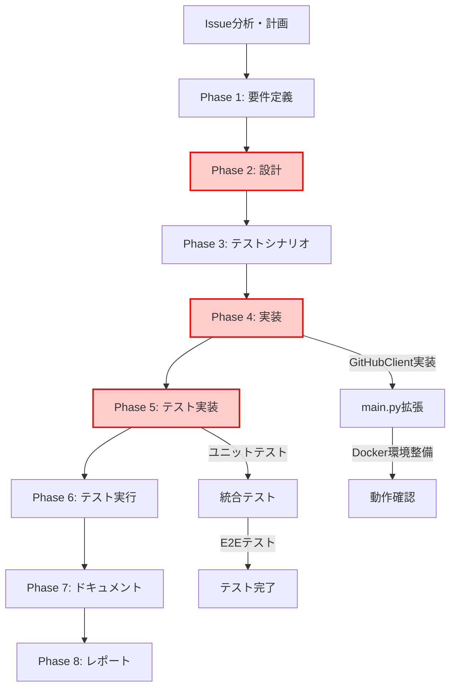

# プロジェクト計画書 - Issue #355

## Issue情報

- **Issue番号**: #355
- **タイトル**: [FEATURE] AI Workflow: Init時にドラフトPRを自動作成
- **状態**: open
- **URL**: https://github.com/tielec/infrastructure-as-code/issues/355

## 1. Issue分析

### 複雑度判定

**複雑度**: 中程度

#### 判定根拠

1. **変更範囲**: 2-3ファイルの修正（main.py、git_manager.py、github_client.py）
2. **新規機能追加**: PR作成機能の実装が必要
3. **既存機能の拡張**: GitManagerとGitHubClientの既存機能を活用できる
4. **統合ポイント**: Git操作、GitHub API、エラーハンドリングの統合
5. **リスク要因**: GitHub Token認証、リモートブランチの存在チェック、既存PRの重複チェック

### 見積もり工数

**総工数**: 約12時間

#### 工数内訳

- Phase 1（要件定義）: 1時間
- Phase 2（設計）: 2時間
- Phase 3（テストシナリオ）: 1.5時間
- Phase 4（実装）: 3時間
- Phase 5（テスト実装）: 2時間
- Phase 6（テスト）: 1時間
- Phase 7（ドキュメント）: 1時間
- Phase 8（レポート）: 0.5時間

#### 見積もり根拠

1. **既存機能の活用**: GitManagerとGitHubClientに必要な機能（commit, push）が既に実装されているため、新規実装量は限定的
2. **PR作成の複雑性**: gh CLIの統合とPRテンプレート生成に一定の時間が必要
3. **テストカバレッジ**: ユニットテスト、統合テスト、E2Eテストの実装が必要
4. **エラーハンドリング**: 複数のエラーケース（認証失敗、既存PR、リモートブランチ不存在等）への対応

### リスク評価

**総合リスク**: 中

#### リスク要因

1. **GitHub Token権限**: repo スコープが必要（PRの作成権限）
2. **gh CLI依存**: Docker環境にgh CLIがインストールされていない可能性
3. **既存PR重複**: 同じブランチで既にPRが存在する場合の処理
4. **リモートブランチ同期**: init時にブランチがリモートに存在しない場合のpush
5. **後方互換性**: 既存のワークフロー（init後に手動でPR作成）を壊さない

---

## 2. 実装戦略判断

### 実装戦略: EXTEND

#### 判断根拠

1. **既存機能の拡張**: `main.py`の`init`コマンドを拡張し、新機能（commit → push → PR作成）を追加
2. **GitManager活用**: `commit_phase_output()`と`push_to_remote()`は既存のため、そのまま利用可能
3. **GitHubClient拡張**: PR作成機能は新規だが、GitHubClientクラスに`create_pull_request()`メソッドを追加する形で対応
4. **新規ファイル不要**: 新しいクラスやモジュールの作成は不要
5. **最小限の変更**: 既存のアーキテクチャを維持しつつ、initコマンドの処理フローのみを拡張

### テスト戦略: UNIT_INTEGRATION

#### 判断根拠

1. **ユニットテスト（必須）**:
   - `GitHubClient.create_pull_request()`のモック化テスト
   - PR本文テンプレート生成ロジックのテスト
   - エラーハンドリング（認証失敗、既存PR、gh CLI不在）のテスト
2. **統合テスト（必須）**:
   - `init`コマンド全体のワークフロー（ブランチ作成 → metadata.json作成 → commit → push → PR作成）
   - GitManager、GitHubClientの実際の連携動作を確認
   - GitHub APIとの通信（モックではなく実際のAPI呼び出し、ただしテストリポジトリを使用）
3. **BDDテスト（不要）**:
   - ユーザーストーリーが単純（`init`コマンドを実行するとPRが作成される）
   - 統合テストで十分にカバー可能
4. **E2Eテスト（検討中）**:
   - 実際のGitHubリポジトリを使用したテストは、CI/CD環境でのみ実施
   - ローカル開発では統合テストで代替

### テストコード戦略: BOTH_TEST

#### 判断根拠

1. **既存テストの拡張（EXTEND_TEST）**:
   - `tests/unit/core/test_github_client.py`: `create_pull_request()`メソッドのユニットテストを追加
   - `tests/integration/test_workflow_init.py`: initコマンドのPR作成ステップを追加
2. **新規テストの作成（CREATE_TEST）**:
   - `tests/unit/test_main_init_pr.py`: main.py の init コマンドにおけるPR作成ロジックのユニットテスト（新規）
   - `tests/integration/test_init_pr_workflow.py`: init → commit → push → PR作成の統合テスト（新規）
3. **両方が必要な理由**:
   - GitHubClient の機能拡張は既存テストファイルに追加（コヒージョン維持）
   - main.py の init コマンドの新機能は、独立したテストファイルで管理（可読性向上）

---

## 3. 影響範囲分析

### 既存コードへの影響

#### 変更が必要なファイル

1. **scripts/ai-workflow/main.py**（約150行追加）
   - `init`コマンドの処理フロー拡張
   - commit → push → PR作成のロジック追加
   - エラーハンドリングとログ出力

2. **scripts/ai-workflow/core/github_client.py**（約100行追加）
   - `create_pull_request()`メソッドの新規追加
   - `check_existing_pr()`メソッドの新規追加（既存PR確認）
   - PR本文テンプレート生成ヘルパーメソッド

3. **scripts/ai-workflow/core/git_manager.py**（既存機能の活用のみ、変更不要）
   - `commit_phase_output()`を`init`コマンドから呼び出す
   - `push_to_remote()`を`init`コマンドから呼び出す

#### 影響を受けるモジュール

1. **tests/unit/core/test_github_client.py**: PR作成機能のユニットテスト追加
2. **tests/integration/test_workflow_init.py**: init統合テストの拡張
3. **scripts/ai-workflow/README.md**: init コマンドの説明更新、PR作成機能の追加

### 依存関係の変更

#### 新規依存の追加

1. **gh CLI（GitHub CLI）**:
   - **用途**: ドラフトPR作成（`gh pr create --draft`）
   - **インストール**: Dockerfileに追加が必要
   - **バージョン**: 2.0+ 推奨
   - **代替案**: PyGithubのPR作成APIを使用（gh CLI依存を排除）

2. **環境変数 GITHUB_TOKEN**:
   - **既に使用中**: GitHub APIクライアント初期化で使用
   - **追加権限**: `repo` スコープ（PR作成権限）
   - **確認事項**: 既存のトークンに権限があるか確認

#### 既存依存の変更

なし（PyGithub、GitPythonは既に使用中）

### マイグレーション要否

#### データベーススキーマ変更

なし

#### 設定ファイル変更

1. **Dockerfile**:
   - gh CLIのインストール手順を追加
   - または、PyGithub を使用してgh CLI依存を排除

2. **metadata.json**:
   - PR URLを記録する新しいフィールド`pr_url`を追加（オプション）
   - スキーマバージョンは変更不要（後方互換性あり）

3. **環境変数**:
   - 新規追加は不要（GITHUB_TOKENは既存）

---

## 4. タスク分割

### Phase 1: 要件定義（見積もり: 1h）

1. **機能要件の明確化**（0.3h）
   - init コマンドの拡張仕様
   - PR作成のタイミング（metadata.json作成後、commit後、push後）
   - PR本文のテンプレート仕様

2. **受け入れ基準の定義**（0.3h）
   - 成功ケース: init実行後にドラフトPRが作成される
   - エラーケース: 既存PR、認証失敗、gh CLI不在時の挙動
   - 後方互換性: `--no-pr`オプション（将来実装）の考慮

3. **非機能要件の定義**（0.4h）
   - パフォーマンス: init実行時間への影響（+3-5秒程度）
   - セキュリティ: GitHub Tokenの安全な管理
   - 運用性: エラー時のログ出力とリトライ戦略

### Phase 2: 設計（見積もり: 2h）

1. **アーキテクチャ設計**（0.5h）
   - init コマンドの処理フロー図（Mermaid形式）
   - GitManager、GitHubClientの役割分担
   - エラーハンドリング戦略

2. **クラス設計**（0.5h）
   - `GitHubClient.create_pull_request()`のインターフェース設計
   - `GitHubClient.check_existing_pr()`のインターフェース設計
   - PR本文テンプレート生成ロジック

3. **データ構造設計**（0.5h）
   - PR作成リクエストの構造
   - PR作成レスポンスの構造
   - metadata.jsonへのPR URL記録（オプション）

4. **エラーケース設計**（0.5h）
   - 既存PR存在時の処理
   - GitHub Token権限不足時の処理
   - gh CLI不在時の処理（または代替実装）

### Phase 3: テストシナリオ（見積もり: 1.5h）

1. **ユニットテストシナリオ**（0.5h）
   - `GitHubClient.create_pull_request()`の正常系・異常系
   - `GitHubClient.check_existing_pr()`の正常系・異常系
   - PR本文テンプレート生成ロジック

2. **統合テストシナリオ**（0.5h）
   - init コマンド全体のワークフロー
   - Git操作とGitHub API連携
   - エラーハンドリングと回復処理

3. **E2Eテストシナリオ**（0.5h）
   - 実際のGitHubリポジトリでのPR作成
   - CI/CD環境でのテスト実行
   - テスト後のクリーンアップ処理

### Phase 4: 実装（実コード）（見積もり: 3h）

1. **GitHubClient拡張**（1h）
   - `create_pull_request()`メソッド実装
   - `check_existing_pr()`メソッド実装
   - PR本文テンプレート生成ヘルパー

2. **main.py init コマンド拡張**（1.5h）
   - commit ロジックの追加
   - push ロジックの追加
   - PR作成ロジックの追加
   - エラーハンドリングとログ出力

3. **Docker環境整備**（0.5h）
   - gh CLI インストール（または PyGithub 実装への変更）
   - 環境変数の確認
   - 動作確認スクリプト

### Phase 5: テスト実装（テストコード）（見積もり: 2h）

1. **ユニットテスト実装**（0.8h）
   - `tests/unit/core/test_github_client.py`の拡張
   - `tests/unit/test_main_init_pr.py`の新規作成
   - モックとスタブの作成

2. **統合テスト実装**（0.8h）
   - `tests/integration/test_workflow_init.py`の拡張
   - `tests/integration/test_init_pr_workflow.py`の新規作成
   - テストフィクスチャの準備

3. **E2Eテスト実装**（0.4h）
   - CI/CD環境でのE2Eテストスクリプト
   - テストリポジトリの設定
   - クリーンアップスクリプト

### Phase 6: テスト（見積もり: 1h）

1. **ローカルテスト実行**（0.3h）
   - ユニットテスト実行
   - 統合テスト実行
   - カバレッジ確認（目標: 80%以上）

2. **Docker環境テスト**（0.3h）
   - Dockerイメージビルド
   - Docker環境でのテスト実行
   - 動作確認

3. **CI/CDテスト**（0.4h）
   - JenkinsでのE2Eテスト実行
   - テストリポジトリでのPR作成確認
   - エラーケースのテスト

### Phase 7: ドキュメント（見積もり: 1h）

1. **README.md更新**（0.4h）
   - init コマンドの説明更新
   - PR自動作成機能の説明追加
   - 使用例の追加

2. **CHANGELOG.md作成**（0.2h）
   - v1.8.0の変更内容
   - 破壊的変更（なし）の確認
   - マイグレーションガイド（不要）

3. **コードコメント**（0.4h）
   - GitHubClient新規メソッドのdocstring
   - main.py 拡張部分のコメント
   - エラーハンドリングの説明

### Phase 8: レポート（見積もり: 0.5h）

1. **実装サマリー作成**（0.2h）
   - 実装内容の要約
   - 変更ファイル一覧
   - テスト結果サマリー

2. **Issue更新**（0.2h）
   - Issue #355のクローズ
   - PR URLの記載
   - 成果物の説明

3. **レビュー依頼**（0.1h）
   - PRレビュアーの指定
   - レビューポイントの記載

---

## 5. 依存関係

### タスク依存関係図

### クリティカルパス

1. **Phase 2（設計）**: アーキテクチャ設計の品質が後続フェーズに影響
2. **Phase 4（実装）**: 実装の複雑度が最も高く、時間がかかる
3. **Phase 5（テスト実装）**: テストカバレッジが品質保証に直結

### 並列実行可能なタスク

1. **Phase 5内**: ユニットテスト、統合テスト、E2Eテストの実装は部分的に並列可能
2. **Phase 7（ドキュメント）**: テスト実行中にドキュメント作成を開始可能

---

## 6. リスクと軽減策

### リスク1: gh CLI依存による環境構築の複雑化

- **影響度**: 中
- **確率**: 中
- **軽減策**:
  1. **代替実装**: PyGithubのPR作成APIを使用し、gh CLI依存を排除
  2. **Docker対応**: Dockerfileにgh CLIインストール手順を追加
  3. **フォールバック**: gh CLI不在時はエラーメッセージを表示し、手動PR作成を案内

### リスク2: 既存PR重複によるエラー

- **影響度**: 低
- **確率**: 中
- **軽減策**:
  1. **事前チェック**: `check_existing_pr()`で既存PRの有無を確認
  2. **ユーザー通知**: 既存PRが存在する場合は、そのPR URLをログ出力
  3. **スキップ処理**: 既存PR存在時はPR作成をスキップし、成功として扱う

### リスク3: GitHub Token権限不足

- **影響度**: 高
- **確率**: 低
- **軽減策**:
  1. **事前確認**: initコマンド実行前にトークン権限をチェック
  2. **エラーメッセージ**: 権限不足時は明確なエラーメッセージとトークン再発行手順を表示
  3. **ドキュメント**: README.mdにトークン権限要件を明記

### リスク4: リモートブランチ同期の失敗

- **影響度**: 中
- **確率**: 低
- **軽減策**:
  1. **push前チェック**: リモートブランチの存在確認
  2. **リトライ機構**: GitManager.push_to_remote()は既に最大3回のリトライ機能を持つ
  3. **エラー通知**: push失敗時は詳細なエラーログを出力

### リスク5: 後方互換性の破壊

- **影響度**: 高
- **確率**: 低
- **軽減策**:
  1. **デフォルト動作**: PR自動作成はデフォルトで有効（ユーザー期待に沿う）
  2. **オプトアウト**: 将来的に`--no-pr`オプションを実装（Issue記載あり）
  3. **既存ワークフロー**: 既存のinitコマンドは引き続き動作（metadata.json作成は変更なし）

### リスク6: テストリポジトリへの影響

- **影響度**: 低
- **確率**: 中
- **軽減策**:
  1. **専用テストリポジトリ**: 本番リポジトリではなく、テスト専用リポジトリを使用
  2. **クリーンアップ**: テスト後にPRとブランチを自動削除
  3. **CI/CD分離**: E2Eテストは専用の環境で実行

---

## 7. 品質ゲート

### Phase 0: プロジェクト計画

- [x] **実装戦略が明確に決定されている**（EXTEND）
- [x] **テスト戦略が明確に決定されている**（UNIT_INTEGRATION）
- [x] **テストコード戦略が明確に決定されている**（BOTH_TEST）
- [x] **影響範囲が分析されている**
- [x] **タスク分割が適切な粒度である**（1タスク = 0.3~1.5時間）
- [x] **リスクが洗い出されている**（6つのリスクと軽減策）

### Phase 1: 要件定義

- [ ] 機能要件が明確に記載されている
- [ ] 受け入れ基準が定義されている
- [ ] 非機能要件が定義されている
- [ ] エラーケースが網羅されている
- [ ] UI/UX（CLI出力）の仕様が明確である

### Phase 2: 設計

- [ ] アーキテクチャ設計が適切である
- [ ] クラス設計が単一責任原則に従っている
- [ ] エラーハンドリング戦略が明確である
- [ ] データ構造が効率的である
- [ ] 既存コードとの統合方法が明確である

### Phase 3: テストシナリオ

- [ ] ユニットテストシナリオが網羅的である
- [ ] 統合テストシナリオが現実的である
- [ ] E2Eテストシナリオが自動化可能である
- [ ] エッジケースがカバーされている
- [ ] テストデータの準備方法が明確である

### Phase 4: 実装

- [ ] コードがPEP 8に準拠している
- [ ] コメントとdocstringが適切である
- [ ] エラーハンドリングが実装されている
- [ ] ログ出力が適切である
- [ ] 既存コードとの統合が完了している

### Phase 5: テスト実装

- [ ] ユニットテストが実装されている
- [ ] 統合テストが実装されている
- [ ] E2Eテストが実装されている
- [ ] モックとスタブが適切に使用されている
- [ ] テストカバレッジが80%以上である

### Phase 6: テスト

- [ ] すべてのユニットテストが成功している
- [ ] すべての統合テストが成功している
- [ ] E2Eテストが成功している
- [ ] パフォーマンステスト（init実行時間）が合格している
- [ ] エラーケースのテストが成功している

### Phase 7: ドキュメント

- [ ] README.mdが更新されている
- [ ] CHANGELOG.mdが作成されている
- [ ] コードコメントが適切である
- [ ] 使用例が追加されている
- [ ] トラブルシューティングガイドが充実している

### Phase 8: レポート

- [ ] 実装サマリーが作成されている
- [ ] Issue #355が更新されている
- [ ] PRレビュー依頼が完了している
- [ ] 成果物が適切に配置されている
- [ ] 次のステップが明確である

---

## 8. 参考情報

### 関連ファイル

1. **main.py:339-405** - init コマンドの既存実装
2. **core/git_manager.py:50-169** - commit_phase_output() メソッド
3. **core/git_manager.py:171-284** - push_to_remote() メソッド
4. **core/github_client.py** - GitHub API統合（PR作成機能は未実装）
5. **README.md** - AI Workflowの概要とCLI使用方法

### 既存機能の活用

1. **GitManager.commit_phase_output()**: metadata.jsonをcommitする機能は既に実装済み
2. **GitManager.push_to_remote()**: リトライ機能付きのpush実装は既に存在
3. **GitManager.create_branch()**: ブランチ作成とリモート同期は実装済み
4. **GitHubClient**: Issue情報取得とコメント投稿は実装済み（PR作成は未実装）

### 技術スタック

- **言語**: Python 3.11+
- **Git操作**: GitPython 3.1+
- **GitHub API**: PyGithub 2.0+ または gh CLI 2.0+
- **テスト**: pytest 7.0+, behave 1.2+ (BDD)
- **Docker**: Docker 20.0+
- **CI/CD**: Jenkins (ai-workflow-orchestratorジョブ)

---

## 9. 実装方針サマリー

### 重要な設計判断

1. **gh CLI vs PyGithub**:
   - **推奨**: PyGithubを使用（依存の簡素化）
   - **代替**: gh CLIを使用（Issue記載の実装例に従う）
   - **判断**: Phase 2で最終決定

2. **PR本文テンプレート**:
   - **フォーマット**: Markdown形式
   - **内容**: Issue #355記載のテンプレートを基準
   - **カスタマイズ**: 動的な進捗チェックリスト（Phase完了状況を反映）

3. **エラーハンドリング**:
   - **原則**: Fail-fast（エラー時は即座に停止）
   - **例外**: 既存PR存在時は警告のみでスキップ
   - **リトライ**: GitManager.push_to_remote()のリトライ機能を活用

4. **後方互換性**:
   - **デフォルト動作**: PR自動作成を実行
   - **将来拡張**: `--no-pr`オプションで無効化可能（Issue記載のオプション機能）

### 成功基準

1. `python main.py init --issue-url <URL>` 実行後、ドラフトPRが自動作成される
2. PR本文にワークフロー進捗チェックリストが含まれる
3. 既存PR存在時はスキップ（エラーではない）
4. すべてのテストが成功する（ユニット、統合、E2E）
5. README.mdとCHANGELOG.mdが更新される

---

**プロジェクト計画書作成日**: 2025-10-12
**見積もり総工数**: 12時間
**複雑度**: 中程度
**総合リスク**: 中

**次のステップ**: Phase 1（要件定義）に進み、機能要件を詳細化する
