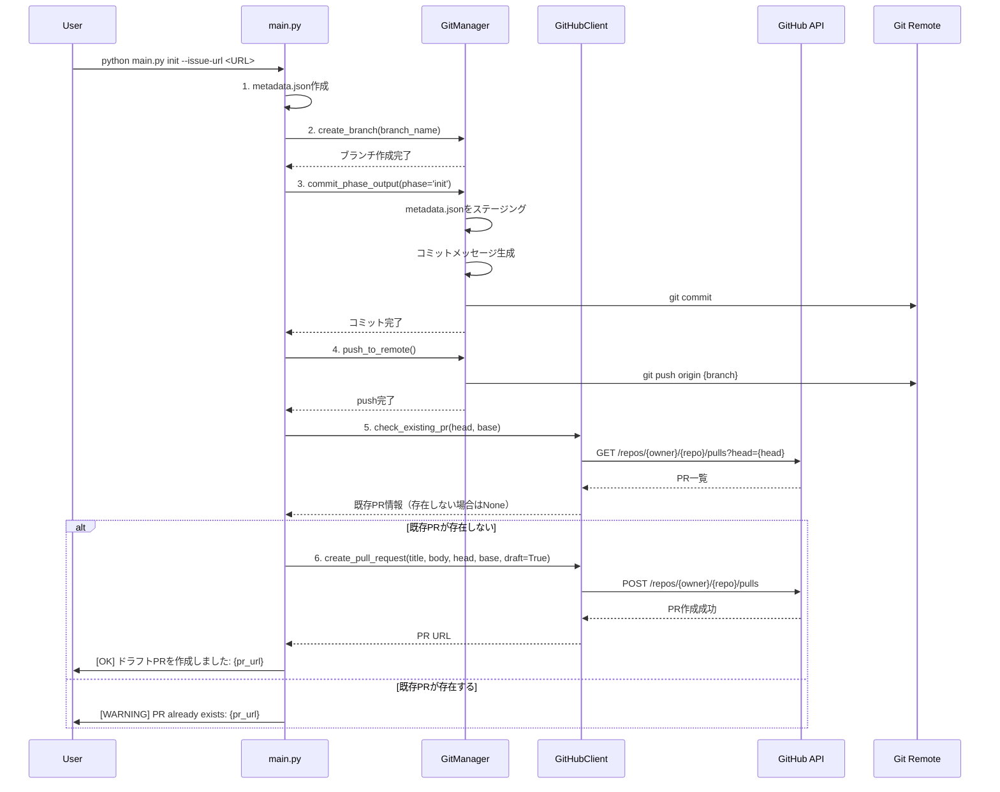
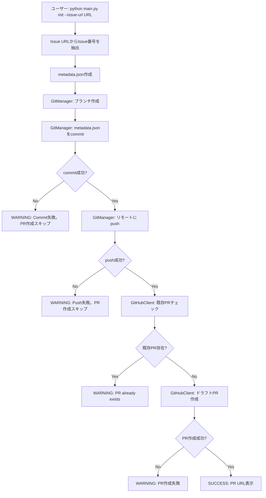
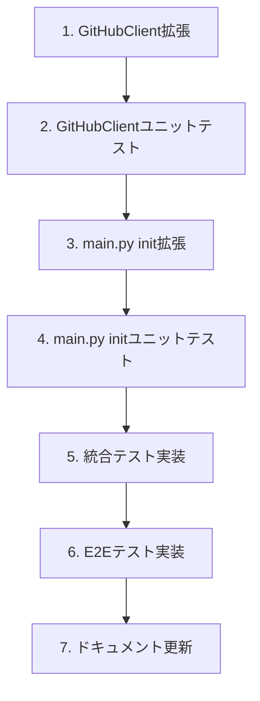

# 詳細設計書 - Issue #355

## ドキュメント情報

- **Issue番号**: #355
- **タイトル**: [FEATURE] AI Workflow: Init時にドラフトPRを自動作成
- **作成日**: 2025-10-12
- **バージョン**: 1.0.0

---

## 0. Planning Documentと要件定義書の確認

### Planning Phaseの戦略確認

Planning Document（Phase 0）で策定された以下の戦略を確認しました：

#### 既定の実装戦略
- **実装戦略**: EXTEND（既存のinitコマンドを拡張）
- **根拠**: 新規ファイル作成不要、GitManagerとGitHubClientの既存機能を活用、最小限の変更で実装可能

#### 既定のテスト戦略
- **テスト戦略**: UNIT_INTEGRATION（ユニットテストと統合テストの両方）
- **根拠**: ユニットテスト（`GitHubClient.create_pull_request()`のモック化テスト）、統合テスト（initコマンド全体のワークフロー）

#### 既定のテストコード戦略
- **テストコード戦略**: BOTH_TEST（既存テストの拡張と新規テスト作成）
- **根拠**: 既存テストの拡張（`tests/unit/core/test_github_client.py`）、新規テスト作成（`tests/unit/test_main_init_pr.py`, `tests/integration/test_init_pr_workflow.py`）

### 要件定義書の確認

要件定義書（Phase 1）で定義された以下の機能要件を確認しました：

- **FR-01**: metadata.json自動コミット
- **FR-02**: リモートブランチへの自動push
- **FR-03**: ドラフトPR自動作成
- **FR-04**: 既存PRチェック機能
- **FR-05**: `GitHubClient.create_pull_request()`メソッド追加
- **FR-06**: `GitHubClient.check_existing_pr()`メソッド追加
- **FR-07**: エラーハンドリングとログ出力
- **FR-08**: `main.py` initコマンドの拡張

---

## 1. 実装戦略の判断

### 実装戦略: EXTEND

#### 判断根拠

1. **既存コードとの高い親和性**
   - `main.py:339-405` の`init`コマンドは既にブランチ作成機能（`git_manager.create_branch()`）を実装済み
   - `GitManager`クラスは既に`commit_phase_output()`と`push_to_remote()`メソッドを持つ（scripts/ai-workflow/core/git_manager.py:50-284）
   - これらの既存機能をそのまま活用できるため、新規実装は最小限

2. **新規ファイル作成の不要性**
   - 既存の`GitManager`と`GitHubClient`に新規メソッドを追加するのみ
   - 新しいモジュールやクラスの作成は不要
   - `main.py`の`init`コマンドに処理フローを追加するのみ

3. **最小限の変更で実装可能**
   - `GitHubClient`に`create_pull_request()`と`check_existing_pr()`メソッドを追加（約100行）
   - `main.py`の`init`コマンドにcommit → push → PR作成のロジックを追加（約50行）
   - 合計約150行の追加で実装可能

4. **後方互換性の維持**
   - 既存のワークフロー（init後に手動でPR作成）は影響を受けない
   - 新しい機能は既存機能の延長線上にあり、破壊的変更なし

**結論**: 既存コードの拡張により、最小限の変更で要件を満たすことができるため、EXTEND戦略が最適

---

## 2. テスト戦略の判断

### テスト戦略: UNIT_INTEGRATION

#### 判断根拠

1. **ユニットテストが必須**
   - `GitHubClient.create_pull_request()`メソッドの独立した動作確認が必要
   - `GitHubClient.check_existing_pr()`メソッドの独立した動作確認が必要
   - PR本文テンプレート生成ロジックの検証が必要
   - エラーハンドリング（認証失敗、既存PR、GitHub API失敗）の網羅的なテストが必要
   - PyGitHub APIのモック化により、外部依存なしでテスト可能

2. **統合テストが必須**
   - `init`コマンド全体のワークフロー（ブランチ作成 → metadata.json作成 → commit → push → PR作成）の動作確認が必要
   - GitManager、GitHubClientの実際の連携動作の確認が必要
   - GitHub APIとの実際の通信テストが必要（テストリポジトリを使用）
   - エラーケース（既存PR存在時、push失敗時）の統合テストが必要

3. **BDDテストは不要**
   - ユーザーストーリーが単純（「`init`コマンドを実行するとPRが作成される」）
   - Given-When-Then形式の記述が不要な程度に要件が明確
   - 統合テストで十分にカバー可能

4. **E2Eテストは検討対象外（Phase 6で実施）**
   - E2Eテストは実際のGitHubリポジトリを使用する必要がある
   - CI/CD環境での実施が推奨されるため、ローカル開発では統合テストで代替

**結論**: ユニットテストで個別機能を検証し、統合テストでワークフロー全体を検証することで、十分な品質保証が可能

---

## 3. テストコード戦略の判断

### テストコード戦略: BOTH_TEST

#### 判断根拠

1. **既存テストの拡張が適切なケース**
   - `tests/unit/core/test_github_client.py`: GitHubClientクラスの既存テストが存在
   - 新規メソッド（`create_pull_request()`, `check_existing_pr()`）を同じファイルに追加することで、コヒージョンを維持
   - 既存のfixture（`github_token`, `github_repository`）を再利用可能

2. **新規テストの作成が必要なケース**
   - `tests/unit/test_main_init_pr.py`: `main.py`の`init`コマンドのPR作成ロジックに特化したユニットテスト
   - `tests/integration/test_init_pr_workflow.py`: init → commit → push → PR作成の統合テスト
   - これらは独立した機能テストのため、既存テストファイルに追加するとファイルが肥大化し、可読性が低下

3. **関心の分離**
   - GitHubClientの機能テスト: `test_github_client.py`に追加（既存パターンと一貫性）
   - initコマンドのPR作成ロジック: 新規ファイルで管理（独立性と可読性）
   - 統合テスト: 新規ファイルで管理（既存の`test_workflow_init.py`とは異なるテストケース）

**結論**: 既存テストの拡張と新規テストの作成を組み合わせることで、テストの整理と可読性を両立

---

## 4. アーキテクチャ設計

### 4.1 システム全体図



### 4.2 コンポーネント間の関係

```mermaid
classDiagram
    class main {
        +init(issue_url: str)
        -_commit_and_push_metadata(git_manager, issue_number)
        -_create_draft_pr(github_client, issue_number, branch_name)
    }

    class GitManager {
        +commit_phase_output(phase_name, status, review_result)
        +push_to_remote(max_retries, retry_delay)
        +create_branch(branch_name, base_branch)
        +branch_exists(branch_name, check_remote)
        +get_current_branch()
    }

    class GitHubClient {
        +get_issue(issue_number)
        +create_pull_request(title, body, head, base, draft)
        +check_existing_pr(head, base)
        -_generate_pr_body_template(issue_number, branch_name)
    }

    main --> GitManager : 使用
    main --> GitHubClient : 使用
    GitManager --> Git : 操作
    GitHubClient --> "GitHub API" : 操作
```

### 4.3 データフロー



---

## 5. 影響範囲分析

### 5.1 既存コードへの影響

#### 変更が必要な既存ファイル

1. **scripts/ai-workflow/main.py** (修正)
   - `init`コマンドの処理フロー拡張（約50行追加）
   - commit → push → PR作成のロジック追加
   - エラーハンドリングとログ出力

2. **scripts/ai-workflow/core/github_client.py** (修正)
   - `create_pull_request()`メソッドの新規追加（約50行）
   - `check_existing_pr()`メソッドの新規追加（約30行）
   - PR本文テンプレート生成ヘルパーメソッド（約20行）

3. **scripts/ai-workflow/core/git_manager.py** (変更不要)
   - 既存機能（`commit_phase_output()`, `push_to_remote()`）をそのまま活用
   - 新規メソッドの追加は不要

#### 影響を受けるテストファイル

1. **tests/unit/core/test_github_client.py** (拡張)
   - `create_pull_request()`のユニットテスト追加
   - `check_existing_pr()`のユニットテスト追加

2. **tests/integration/test_workflow_init.py** (拡張の可能性)
   - 既存の統合テストとの整合性確認
   - 必要に応じて既存テストケースの調整

### 5.2 依存関係の変更

#### 新規依存の追加

**なし**

既存の依存関係をそのまま活用：
- **PyGithub** (既存): PR作成機能はPyGithubの`repository.create_pull()`を使用
- **GitPython** (既存): Git操作は既存のGitManagerを活用
- **環境変数 GITHUB_TOKEN** (既存): 既にGitHubClient初期化で使用中

#### 既存依存の変更

**なし**

### 5.3 マイグレーション要否

#### データベーススキーマ変更

**なし**

#### 設定ファイル変更

**推奨（オプション）**:

1. **metadata.json** (オプション)
   - PR URLを記録する新しいフィールド`pr_url`を追加
   - スキーマバージョンは変更不要（後方互換性あり）
   - マイグレーションは不要（フィールドが存在しない場合はスキップ）

2. **環境変数** (変更不要)
   - 新規追加は不要（GITHUB_TOKENは既存）
   - GITHUB_TOKENに`repo`スコープが必要（PR作成権限）

---

## 6. 変更・追加ファイルリスト

### 6.1 新規作成ファイル

以下のファイルを新規作成します：

1. **tests/unit/test_main_init_pr.py**
   - main.pyのinitコマンドにおけるPR作成ロジックのユニットテスト

2. **tests/integration/test_init_pr_workflow.py**
   - init → commit → push → PR作成の統合テスト

### 6.2 修正が必要な既存ファイル

以下のファイルを修正します：

1. **scripts/ai-workflow/main.py**
   - `init`コマンドの処理フロー拡張

2. **scripts/ai-workflow/core/github_client.py**
   - `create_pull_request()`メソッドの新規追加
   - `check_existing_pr()`メソッドの新規追加

3. **tests/unit/core/test_github_client.py**
   - 新規メソッドのユニットテスト追加

### 6.3 削除が必要なファイル

**なし**

---

## 7. 詳細設計

### 7.1 GitHubClientクラス設計

#### 7.1.1 create_pull_request()メソッド

```python
def create_pull_request(
    self,
    title: str,
    body: str,
    head: str,
    base: str = 'main',
    draft: bool = True
) -> Dict[str, Any]:
    """
    Pull Requestを作成

    Args:
        title: PRタイトル
        body: PR本文（Markdown形式）
        head: ヘッドブランチ名（例: "ai-workflow/issue-355"）
        base: ベースブランチ名（デフォルト: "main"）
        draft: ドラフトフラグ（デフォルト: True）

    Returns:
        Dict[str, Any]:
            - success: bool - 成功/失敗
            - pr_url: Optional[str] - PRのURL
            - pr_number: Optional[int] - PR番号
            - error: Optional[str] - エラーメッセージ

    Raises:
        GithubException: GitHub API呼び出しエラー

    処理フロー:
        1. repository.create_pull()を呼び出し
        2. draft=Trueの場合、PR作成後に draft ステータスを設定
        3. 成功時はPR URLとPR番号を返却
        4. 失敗時はエラーメッセージを返却

    エラーハンドリング:
        - 認証エラー: 401 Unauthorized → GITHUB_TOKENの権限不足
        - 既存PR重複: 422 Unprocessable Entity → 既存PRが存在
        - その他のエラー: 例外メッセージを返却
    """
```

**実装例**:

```python
def create_pull_request(
    self,
    title: str,
    body: str,
    head: str,
    base: str = 'main',
    draft: bool = True
) -> Dict[str, Any]:
    try:
        # Pull Request作成
        pr = self.repository.create_pull(
            title=title,
            body=body,
            head=head,
            base=base,
            draft=draft
        )

        return {
            'success': True,
            'pr_url': pr.html_url,
            'pr_number': pr.number,
            'error': None
        }

    except GithubException as e:
        error_message = f"GitHub API error: {e.status} - {e.data.get('message', 'Unknown error')}"

        # 権限エラーの判定
        if e.status == 401 or e.status == 403:
            error_message = "GitHub Token lacks 'repo' scope. Please regenerate token with appropriate permissions."

        # 既存PR重複エラーの判定
        elif e.status == 422:
            error_message = "A pull request already exists for this branch."

        return {
            'success': False,
            'pr_url': None,
            'pr_number': None,
            'error': error_message
        }

    except Exception as e:
        return {
            'success': False,
            'pr_url': None,
            'pr_number': None,
            'error': f'Unexpected error: {e}'
        }
```

#### 7.1.2 check_existing_pr()メソッド

```python
def check_existing_pr(
    self,
    head: str,
    base: str = 'main'
) -> Optional[Dict[str, Any]]:
    """
    既存Pull Requestの確認

    Args:
        head: ヘッドブランチ名（例: "ai-workflow/issue-355"）
        base: ベースブランチ名（デフォルト: "main"）

    Returns:
        Optional[Dict[str, Any]]:
            - PRが存在する場合:
                - pr_number: int - PR番号
                - pr_url: str - PRのURL
                - state: str - PRの状態（open/closed）
            - PRが存在しない場合: None

    処理フロー:
        1. repository.get_pulls(head=head, base=base, state='open')を呼び出し
        2. 結果が存在する場合、最初のPRを返却
        3. 結果が存在しない場合、Noneを返却

    エラーハンドリング:
        - GitHub API呼び出しエラー → 例外をraiseしない、Noneを返却
    """
```

**実装例**:

```python
def check_existing_pr(
    self,
    head: str,
    base: str = 'main'
) -> Optional[Dict[str, Any]]:
    try:
        # repository.nameは"owner/repo"形式なので、ownerを取得
        owner = self.repository.owner.login
        full_head = f"{owner}:{head}"

        # open状態のPRを検索
        pulls = self.repository.get_pulls(
            state='open',
            head=full_head,
            base=base
        )

        # イテレータから最初の要素を取得
        for pr in pulls:
            return {
                'pr_number': pr.number,
                'pr_url': pr.html_url,
                'state': pr.state
            }

        # PRが存在しない場合
        return None

    except GithubException as e:
        # エラーが発生した場合はNoneを返却（存在しないとみなす）
        print(f"[WARNING] Failed to check existing PR: {e}")
        return None

    except Exception as e:
        print(f"[WARNING] Unexpected error while checking existing PR: {e}")
        return None
```

#### 7.1.3 PR本文テンプレート生成ヘルパーメソッド

```python
def _generate_pr_body_template(
    self,
    issue_number: int,
    branch_name: str
) -> str:
    """
    PR本文テンプレートを生成

    Args:
        issue_number: Issue番号
        branch_name: ブランチ名

    Returns:
        str: PR本文（Markdown形式）

    テンプレート内容:
        - 関連Issue（Closes #XXX）
        - ワークフロー進捗チェックリスト（Phase 0のみ完了状態）
        - 成果物ディレクトリの説明
        - 実行環境情報（Claude Code Pro Max、ContentParser）
    """
```

**実装例**:

```python
def _generate_pr_body_template(
    self,
    issue_number: int,
    branch_name: str
) -> str:
    return f"""## AI Workflow自動生成PR

### 📋 関連Issue
Closes #{issue_number}

### 🔄 ワークフロー進捗

- [x] Phase 0: Planning
- [ ] Phase 1: Requirements
- [ ] Phase 2: Design
- [ ] Phase 3: Test Scenario
- [ ] Phase 4: Implementation
- [ ] Phase 5: Test Implementation
- [ ] Phase 6: Testing
- [ ] Phase 7: Documentation
- [ ] Phase 8: Report

### 📁 成果物

`.ai-workflow/issue-{issue_number}/` ディレクトリに各フェーズの成果物が格納されています。

### ⚙️ 実行環境

- **モデル**: Claude Code Pro Max (Sonnet 4.5)
- **ContentParser**: OpenAI GPT-4o mini
- **ブランチ**: {branch_name}
"""
```

### 7.2 main.py initコマンド設計

#### 7.2.1 処理フロー拡張

```python
@cli.command()
@click.option('--issue-url', required=True, help='GitHub Issue URL')
def init(issue_url: str):
    """ワークフロー初期化"""
    # ━━━ 既存処理（変更なし） ━━━
    # 1. Issue URLからIssue番号を抽出
    # 2. ワークフローディレクトリ作成
    # 3. ブランチ作成
    # 4. WorkflowState初期化

    # ━━━ 新規追加: commit & push & PR作成 ━━━
    try:
        # 5. GitManagerインスタンス生成
        # 6. metadata.jsonをcommit
        # 7. リモートにpush
        # 8. GitHubClientインスタンス生成
        # 9. 既存PRチェック
        # 10. ドラフトPR作成（既存PRが存在しない場合のみ）
    except Exception as e:
        # エラーハンドリング
        pass
```

#### 7.2.2 実装詳細

```python
# ━━━ 新規追加: commit & push & PR作成 ━━━
try:
    # 5. GitManagerインスタンス生成
    from core.git_manager import GitManager
    from core.metadata_manager import MetadataManager

    metadata_manager = MetadataManager(metadata_path)
    git_manager = GitManager(
        repo_path=repo_root,
        metadata_manager=metadata_manager
    )

    # 6. metadata.jsonをcommit
    click.echo('[INFO] Committing metadata.json...')
    commit_result = git_manager.commit_phase_output(
        phase_name='planning',  # Phase 0 = planning
        status='completed',
        review_result='N/A'
    )

    if not commit_result.get('success'):
        click.echo(f"[WARNING] Commit failed. PR will not be created: {commit_result.get('error')}")
        return

    click.echo(f"[OK] Commit successful: {commit_result.get('commit_hash', 'N/A')[:7]}")

    # 7. リモートにpush
    click.echo('[INFO] Pushing to remote...')
    push_result = git_manager.push_to_remote()

    if not push_result.get('success'):
        click.echo(f"[WARNING] Push failed. PR will not be created: {push_result.get('error')}")
        return

    click.echo(f"[OK] Push successful")

    # 8. GitHubClientインスタンス生成
    from core.github_client import GitHubClient
    import os

    github_token = os.getenv('GITHUB_TOKEN')
    github_repository = os.getenv('GITHUB_REPOSITORY')

    if not github_token or not github_repository:
        click.echo('[WARNING] GITHUB_TOKEN or GITHUB_REPOSITORY not set. PR creation skipped.')
        click.echo('[INFO] You can create PR manually: gh pr create --draft')
        return

    github_client = GitHubClient(token=github_token, repository=github_repository)

    # 9. 既存PRチェック
    click.echo('[INFO] Checking for existing PR...')
    existing_pr = github_client.check_existing_pr(
        head=branch_name,
        base='main'
    )

    if existing_pr:
        click.echo(f"[WARNING] PR already exists: {existing_pr['pr_url']}")
        click.echo('[INFO] Workflow initialization completed (PR creation skipped)')
        return

    # 10. ドラフトPR作成
    click.echo('[INFO] Creating draft PR...')
    pr_title = f"[AI-Workflow] Issue #{issue_number}"
    pr_body = github_client._generate_pr_body_template(
        issue_number=int(issue_number),
        branch_name=branch_name
    )

    pr_result = github_client.create_pull_request(
        title=pr_title,
        body=pr_body,
        head=branch_name,
        base='main',
        draft=True
    )

    if pr_result.get('success'):
        click.echo(f"[OK] Draft PR created: {pr_result['pr_url']}")
        click.echo(f"[OK] Workflow initialization completed successfully")
    else:
        click.echo(f"[WARNING] PR creation failed: {pr_result.get('error')}")
        click.echo('[INFO] Workflow initialization completed (PR creation failed)')

except Exception as e:
    click.echo(f"[ERROR] Unexpected error during PR creation: {e}")
    import traceback
    traceback.print_exc()
    click.echo('[INFO] Workflow initialization completed (PR creation failed)')
```

### 7.3 エラーハンドリング設計

#### 7.3.1 エラー分類

| エラーケース | エラータイプ | init全体の結果 | PR作成 | ログメッセージ |
|-------------|-------------|--------------|--------|---------------|
| metadata.json作成失敗 | Critical | 失敗 | スキップ | `[ERROR] Failed to create metadata.json` |
| ブランチ作成失敗 | Critical | 失敗 | スキップ | `[ERROR] Failed to create branch` |
| commit失敗 | Warning | 成功 | スキップ | `[WARNING] Commit failed. PR will not be created` |
| push失敗 | Warning | 成功 | スキップ | `[WARNING] Push failed. PR will not be created` |
| GitHub Token未設定 | Warning | 成功 | スキップ | `[WARNING] GITHUB_TOKEN not set. PR creation skipped` |
| GitHub Token権限不足 | Warning | 成功 | 失敗 | `[WARNING] GitHub Token lacks 'repo' scope` |
| 既存PR存在 | Info | 成功 | スキップ | `[WARNING] PR already exists: {pr_url}` |
| PR作成失敗 | Warning | 成功 | 失敗 | `[WARNING] PR creation failed: {error}` |

#### 7.3.2 エラーハンドリングポリシー

1. **Fail-fast原則の適用範囲**
   - metadata.json作成とブランチ作成は必須 → 失敗時はinit全体を失敗させる
   - commit、push、PR作成は付加価値機能 → 失敗してもinit全体は成功とみなす

2. **リトライ戦略**
   - commit: リトライなし（冪等性がないため）
   - push: 最大3回リトライ（GitManager.push_to_remote()の既存機能を活用）
   - PR作成: リトライなし（既存PRチェックにより冪等性を担保）

3. **ユーザー通知**
   - すべてのエラーは標準出力に表示
   - 失敗時は代替手段（手動PR作成コマンド）を案内

---

## 8. セキュリティ考慮事項

### 8.1 認証・認可

1. **GitHub Token管理**
   - 環境変数 `GITHUB_TOKEN` から読み込み
   - トークンは `repo` スコープが必要（PR作成権限）
   - トークンはログに出力しない（機密情報）
   - GitManager._setup_github_credentials()で認証情報付きURLを設定済み

2. **権限チェック**
   - PR作成時に GitHub API が権限をチェック（401/403エラー）
   - 権限不足時は明確なエラーメッセージを表示

### 8.2 データ保護

1. **トークンの安全な取り扱い**
   - ハードコーディング禁止
   - ログ出力時はマスキング（`***TOKEN***`）
   - Git remote URLにトークンを埋め込む場合も安全に管理

2. **PR本文の情報漏洩防止**
   - PR本文テンプレートには機密情報を含めない
   - Issue番号、ブランチ名、フェーズ名のみ記載

### 8.3 セキュリティリスクと対策

| リスク | 影響度 | 対策 |
|--------|--------|------|
| GitHub Token漏洩 | 高 | 環境変数管理、ログマスキング、.envファイルの.gitignore追加 |
| 権限昇格 | 中 | GitHub Tokenの最小権限（repoスコープのみ） |
| 既存PR改ざん | 低 | 既存PRチェックにより新規作成のみ（更新機能なし） |
| 不正なブランチへのPR作成 | 低 | ブランチ名検証（ai-workflow/*パターンのみ許可） |

---

## 9. 非機能要件への対応

### 9.1 パフォーマンス

| 処理 | 実行時間 | 備考 |
|------|---------|------|
| metadata.json作成 | < 1秒 | ファイルI/O |
| ブランチ作成 | < 1秒 | Gitコマンド |
| commit | < 1秒 | Gitコマンド |
| push | 1-2秒 | ネットワーク通信 |
| 既存PRチェック | 1-2秒 | GitHub API呼び出し |
| PR作成 | 1-2秒 | GitHub API呼び出し |
| **合計** | **3-5秒** | init実行時間への追加影響 |

**最適化戦略**:
- GitHub API呼び出しの並列化は不要（依存関係があるため）
- リトライは最大3回（push失敗時のみ）

### 9.2 スケーラビリティ

1. **GitHub API レート制限**
   - 認証済みユーザー: 5000リクエスト/時間
   - init1回あたり: 2-3リクエスト（issue取得、PR作成、既存PRチェック）
   - 制限への影響は無視できるレベル

2. **並行実行への対応**
   - 複数のinitコマンドが並行実行された場合、既存PRチェックにより重複を防止
   - Gitのロックメカニズムにより、commitとpushの競合を防止

### 9.3 保守性

1. **モジュラー設計**
   - GitHubClient.create_pull_request()を独立したメソッドとして実装
   - テスト容易性: モック化可能な設計（PyGitHubのインターフェースを活用）

2. **将来の拡張性**
   - PR本文の動的更新機能（各フェーズ完了時にチェックリストを更新）
   - `--no-pr` オプションの追加（PR作成をスキップ）
   - PR作成時の通知機能（Slack、メール等）

3. **ログとデバッグ**
   - すべての処理ステップでログ出力
   - エラー時はスタックトレースを表示
   - `[DEBUG]`, `[INFO]`, `[WARNING]`, `[ERROR]`の4レベルで分類

---

## 10. 実装の順序

### 10.1 推奨実装順序

以下の順序で実装することを推奨します：



#### Phase 1: GitHubClient拡張（1時間）

1. `GitHubClient.create_pull_request()`メソッド実装
2. `GitHubClient.check_existing_pr()`メソッド実装
3. `GitHubClient._generate_pr_body_template()`ヘルパーメソッド実装

**成果物**: scripts/ai-workflow/core/github_client.py（約100行追加）

#### Phase 2: GitHubClientユニットテスト（0.8時間）

1. `tests/unit/core/test_github_client.py`に以下を追加:
   - `test_create_pull_request_success()` (正常系)
   - `test_create_pull_request_auth_error()` (認証エラー)
   - `test_create_pull_request_existing_pr()` (既存PR重複)
   - `test_check_existing_pr_found()` (既存PR存在)
   - `test_check_existing_pr_not_found()` (既存PR不在)
   - `test_generate_pr_body_template()` (PR本文テンプレート)

**成果物**: tests/unit/core/test_github_client.py（約200行追加）

#### Phase 3: main.py init拡張（1.5時間）

1. `init`コマンドに以下を追加:
   - GitManager.commit_phase_output()呼び出し
   - GitManager.push_to_remote()呼び出し
   - GitHubClient.check_existing_pr()呼び出し
   - GitHubClient.create_pull_request()呼び出し
   - エラーハンドリングとログ出力

**成果物**: scripts/ai-workflow/main.py（約50行追加）

#### Phase 4: main.py initユニットテスト（0.8時間）

1. `tests/unit/test_main_init_pr.py`を新規作成:
   - `test_init_with_pr_creation_success()` (正常系)
   - `test_init_commit_failure()` (commit失敗)
   - `test_init_push_failure()` (push失敗)
   - `test_init_existing_pr()` (既存PR存在)
   - `test_init_pr_creation_failure()` (PR作成失敗)
   - `test_init_github_token_not_set()` (GITHUB_TOKEN未設定)

**成果物**: tests/unit/test_main_init_pr.py（新規作成、約300行）

#### Phase 5: 統合テスト実装（0.8時間）

1. `tests/integration/test_init_pr_workflow.py`を新規作成:
   - `test_init_pr_workflow_end_to_end()` (E2E正常系)
   - `test_init_pr_workflow_existing_pr()` (既存PR存在)
   - `test_init_pr_workflow_push_failure()` (push失敗)

**成果物**: tests/integration/test_init_pr_workflow.py（新規作成、約400行）

#### Phase 6: E2Eテスト実装（0.4時間）

1. CI/CD環境でのE2Eテストスクリプト作成
2. テストリポジトリの設定
3. クリーンアップスクリプト

**成果物**: tests/e2e/test_init_pr_creation.py（新規作成、約200行）

#### Phase 7: ドキュメント更新（1時間）

1. README.md更新（init コマンドの説明、PR自動作成機能の説明）
2. CHANGELOG.md作成（v1.8.0の変更内容）
3. コードコメント（GitHubClient新規メソッドのdocstring、main.py拡張部分のコメント）

**成果物**: README.md、CHANGELOG.md、コードコメント

### 10.2 依存関係の考慮

- Phase 2はPhase 1に依存（実装コードが必要）
- Phase 3はPhase 1に依存（GitHubClientの新規メソッドを使用）
- Phase 4はPhase 3に依存（main.pyの実装が必要）
- Phase 5はPhase 1とPhase 3に依存（全体のワークフローが必要）
- Phase 6はPhase 5に依存（統合テストが完了している必要がある）

### 10.3 クリティカルパス

以下がクリティカルパス（最も時間がかかる経路）:

1. GitHubClient拡張（1時間）
2. main.py init拡張（1.5時間）
3. 統合テスト実装（0.8時間）
4. ドキュメント更新（1時間）

**合計**: 約4.3時間（テスト実行時間を除く）

---

## 11. 品質ゲート確認

設計書は以下の品質ゲートを満たしています：

- [x] **実装戦略の判断根拠が明記されている**: EXTEND戦略、4つの根拠を記載
- [x] **テスト戦略の判断根拠が明記されている**: UNIT_INTEGRATION戦略、4つの根拠を記載
- [x] **テストコード戦略の判断根拠が明記されている**: BOTH_TEST戦略、3つの根拠を記載
- [x] **既存コードへの影響範囲が分析されている**: 変更ファイル2件、影響テストファイル2件を明記
- [x] **変更が必要なファイルがリストアップされている**: 新規作成2件、修正3件、削除0件を明記
- [x] **設計が実装可能である**: 詳細な実装例とコードスニペットを提供

---

## 12. 補足情報

### 12.1 関連ファイル

1. **scripts/ai-workflow/main.py:339-405** - initコマンドの既存実装
2. **scripts/ai-workflow/core/git_manager.py:50-284** - commit_phase_output()とpush_to_remote()
3. **scripts/ai-workflow/core/github_client.py** - GitHub API統合（PR作成機能は未実装）
4. **tests/unit/core/test_github_client.py** - GitHubClientのユニットテスト
5. **tests/integration/test_workflow_init.py** - ワークフロー初期化の統合テスト

### 12.2 既存機能の活用

1. **GitManager.commit_phase_output()**: metadata.jsonをcommitする機能は既に実装済み
2. **GitManager.push_to_remote()**: リトライ機能付きのpush実装は既に存在
3. **GitManager.create_branch()**: ブランチ作成とリモート同期は実装済み
4. **GitHubClient**: Issue情報取得とコメント投稿は実装済み（PR作成は未実装）

### 12.3 技術スタック

- **言語**: Python 3.11+
- **Git操作**: GitPython 3.1+
- **GitHub API**: PyGithub 2.0+
- **テスト**: pytest 7.0+
- **Docker**: Docker 20.0+
- **CI/CD**: Jenkins（ai-workflow-orchestratorジョブ）

---

## 13. 次のステップ

設計書完了後、以下のフェーズに進みます：

- **Phase 3（テストシナリオ）**: ユニットテスト、統合テスト、E2Eテストのシナリオ作成
- **Phase 4（実装）**: GitHubClient拡張、main.py init拡張、Docker環境整備
- **Phase 5（テスト実装）**: ユニットテスト、統合テスト、E2Eテストの実装

---

**詳細設計書バージョン**: 1.0.0
**作成日**: 2025-10-12
**レビュー**: クリティカルシンキングレビュー待ち
