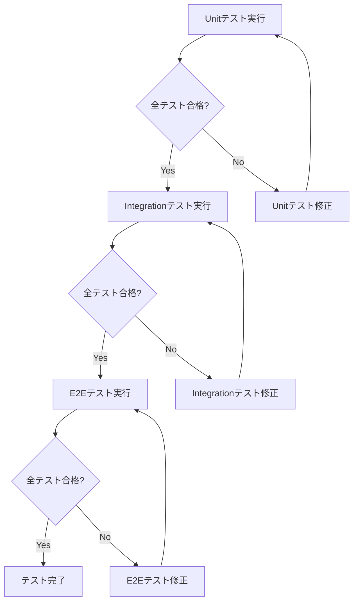

# テストシナリオ - Issue #355

## ドキュメント情報

- **Issue番号**: #355
- **タイトル**: [FEATURE] AI Workflow: Init時にドラフトPRを自動作成
- **作成日**: 2025-10-12
- **バージョン**: 1.0.0

---

## 0. Planning Documentと要件定義書、設計書の確認

### Planning Phaseのテスト戦略確認

Planning Document（Phase 0）で策定されたテスト戦略を確認しました：

#### 既定のテスト戦略
- **テスト戦略**: UNIT_INTEGRATION（ユニットテストと統合テストの両方）
- **根拠**:
  - ユニットテスト: `GitHubClient.create_pull_request()`、`GitHubClient.check_existing_pr()`のモック化テスト
  - 統合テスト: initコマンド全体のワークフロー（ブランチ作成 → metadata.json作成 → commit → push → PR作成）

#### 既定のテストコード戦略
- **テストコード戦略**: BOTH_TEST（既存テストの拡張と新規テスト作成）
- **根拠**:
  - 既存テストの拡張: `tests/unit/core/test_github_client.py`
  - 新規テスト作成: `tests/unit/test_main_init_pr.py`, `tests/integration/test_init_pr_workflow.py`

### 要件定義書の主要機能要件

以下の機能要件をテストでカバーします：

- **FR-01**: metadata.json自動コミット
- **FR-02**: リモートブランチへの自動push
- **FR-03**: ドラフトPR自動作成
- **FR-04**: 既存PRチェック機能
- **FR-05**: `GitHubClient.create_pull_request()`メソッド追加
- **FR-06**: `GitHubClient.check_existing_pr()`メソッド追加
- **FR-07**: エラーハンドリングとログ出力
- **FR-08**: `main.py` initコマンドの拡張

### 設計書の主要コンポーネント

テスト対象のコンポーネント：

1. **GitHubClient**
   - `create_pull_request()`: PR作成機能
   - `check_existing_pr()`: 既存PRチェック機能
   - `_generate_pr_body_template()`: PR本文テンプレート生成

2. **main.py init コマンド**
   - commit → push → PR作成のフロー
   - エラーハンドリング

3. **GitManager** (既存機能の活用)
   - `commit_phase_output()`: metadata.jsonのコミット
   - `push_to_remote()`: リモートへのpush

---

## 1. テスト戦略サマリー

### 選択されたテスト戦略

**UNIT_INTEGRATION**

### テスト対象の範囲

#### Unitテスト対象
1. `GitHubClient.create_pull_request()` メソッド
2. `GitHubClient.check_existing_pr()` メソッド
3. `GitHubClient._generate_pr_body_template()` ヘルパーメソッド
4. `main.py` の init コマンドにおけるPR作成ロジック

#### Integrationテスト対象
1. init コマンド全体のワークフロー（ブランチ作成 → metadata.json作成 → commit → push → PR作成）
2. GitManager と GitHubClient の連携動作
3. GitHub API との実際の通信（テストリポジトリを使用）

### テストの目的

1. **品質保証**: 各コンポーネントが仕様通りに動作することを保証
2. **リグレッション防止**: 既存機能が破壊されていないことを確認
3. **エラーハンドリング検証**: 異常系が適切にハンドリングされることを確認
4. **統合動作確認**: コンポーネント間の連携が正しく機能することを確認

---

## 2. Unitテストシナリオ

### 2.1 GitHubClient.create_pull_request() メソッド

#### TC-U-001: PR作成_正常系

- **目的**: Pull Requestが正常に作成されることを検証
- **前提条件**:
  - GitHubClientインスタンスが初期化されている
  - GitHub Tokenが有効である
  - リモートブランチが存在する
- **入力**:
  ```python
  title = "[AI-Workflow] Issue #355"
  body = "## AI Workflow自動生成PR\n\nCloses #355"
  head = "ai-workflow/issue-355"
  base = "main"
  draft = True
  ```
- **期待結果**:
  ```python
  {
      'success': True,
      'pr_url': 'https://github.com/owner/repo/pull/123',
      'pr_number': 123,
      'error': None
  }
  ```
- **テストデータ**: 上記入力パラメータ
- **モック対象**: `repository.create_pull()` メソッド

#### TC-U-002: PR作成_認証エラー

- **目的**: GitHub Token権限不足時に適切なエラーメッセージが返されることを検証
- **前提条件**:
  - GitHubClientインスタンスが初期化されている
  - GitHub Tokenに `repo` スコープがない
- **入力**:
  ```python
  title = "[AI-Workflow] Issue #355"
  body = "## AI Workflow自動生成PR"
  head = "ai-workflow/issue-355"
  base = "main"
  draft = True
  ```
- **期待結果**:
  ```python
  {
      'success': False,
      'pr_url': None,
      'pr_number': None,
      'error': "GitHub Token lacks 'repo' scope. Please regenerate token with appropriate permissions."
  }
  ```
- **テストデータ**: 上記入力パラメータ
- **モック対象**: `repository.create_pull()` が `GithubException(401)` を raise

#### TC-U-003: PR作成_既存PR重複エラー

- **目的**: 既存PRが存在する場合に適切なエラーメッセージが返されることを検証
- **前提条件**:
  - GitHubClientインスタンスが初期化されている
  - 同じヘッドブランチで既にPRが存在する
- **入力**:
  ```python
  title = "[AI-Workflow] Issue #355"
  body = "## AI Workflow自動生成PR"
  head = "ai-workflow/issue-355"
  base = "main"
  draft = True
  ```
- **期待結果**:
  ```python
  {
      'success': False,
      'pr_url': None,
      'pr_number': None,
      'error': "A pull request already exists for this branch."
  }
  ```
- **テストデータ**: 上記入力パラメータ
- **モック対象**: `repository.create_pull()` が `GithubException(422)` を raise

#### TC-U-004: PR作成_ネットワークエラー

- **目的**: ネットワークエラー時に適切なエラーメッセージが返されることを検証
- **前提条件**:
  - GitHubClientインスタンスが初期化されている
  - ネットワーク接続に問題がある
- **入力**:
  ```python
  title = "[AI-Workflow] Issue #355"
  body = "## AI Workflow自動生成PR"
  head = "ai-workflow/issue-355"
  base = "main"
  draft = True
  ```
- **期待結果**:
  ```python
  {
      'success': False,
      'pr_url': None,
      'pr_number': None,
      'error': 'Unexpected error: <network error message>'
  }
  ```
- **テストデータ**: 上記入力パラメータ
- **モック対象**: `repository.create_pull()` が `Exception` を raise

---

### 2.2 GitHubClient.check_existing_pr() メソッド

#### TC-U-005: 既存PRチェック_PR存在

- **目的**: 既存PRが存在する場合にPR情報が返されることを検証
- **前提条件**:
  - GitHubClientインスタンスが初期化されている
  - ブランチ `ai-workflow/issue-355` に対応するPRが存在する
- **入力**:
  ```python
  head = "ai-workflow/issue-355"
  base = "main"
  ```
- **期待結果**:
  ```python
  {
      'pr_number': 123,
      'pr_url': 'https://github.com/owner/repo/pull/123',
      'state': 'open'
  }
  ```
- **テストデータ**: 上記入力パラメータ
- **モック対象**: `repository.get_pulls()` が PR オブジェクトを返す

#### TC-U-006: 既存PRチェック_PR不存在

- **目的**: 既存PRが存在しない場合にNoneが返されることを検証
- **前提条件**:
  - GitHubClientインスタンスが初期化されている
  - ブランチ `ai-workflow/issue-355` に対応するPRが存在しない
- **入力**:
  ```python
  head = "ai-workflow/issue-355"
  base = "main"
  ```
- **期待結果**: `None`
- **テストデータ**: 上記入力パラメータ
- **モック対象**: `repository.get_pulls()` が空のリストを返す

#### TC-U-007: 既存PRチェック_APIエラー

- **目的**: GitHub APIエラー時にNoneが返され、警告ログが出力されることを検証
- **前提条件**:
  - GitHubClientインスタンスが初期化されている
  - GitHub API呼び出しに失敗する
- **入力**:
  ```python
  head = "ai-workflow/issue-355"
  base = "main"
  ```
- **期待結果**: `None`
- **ログ出力**: `[WARNING] Failed to check existing PR: <error message>`
- **テストデータ**: 上記入力パラメータ
- **モック対象**: `repository.get_pulls()` が `GithubException` を raise

---

### 2.3 GitHubClient._generate_pr_body_template() ヘルパーメソッド

#### TC-U-008: PR本文テンプレート生成_正常系

- **目的**: PR本文テンプレートが正しい形式で生成されることを検証
- **前提条件**: GitHubClientインスタンスが初期化されている
- **入力**:
  ```python
  issue_number = 355
  branch_name = "ai-workflow/issue-355"
  ```
- **期待結果**:
  - `Closes #355` が含まれる
  - ワークフロー進捗チェックリストが含まれる（Phase 0のみ完了）
  - 成果物ディレクトリの説明が含まれる
  - 実行環境情報が含まれる
  - ブランチ名 `ai-workflow/issue-355` が含まれる
- **テストデータ**: 上記入力パラメータ
- **検証項目**:
  ```python
  assert "Closes #355" in body
  assert "- [x] Phase 0: Planning" in body
  assert "- [ ] Phase 1: Requirements" in body
  assert f".ai-workflow/issue-{issue_number}/" in body
  assert branch_name in body
  ```

#### TC-U-009: PR本文テンプレート生成_異なるIssue番号

- **目的**: 異なるIssue番号に対応したテンプレートが生成されることを検証
- **前提条件**: GitHubClientインスタンスが初期化されている
- **入力**:
  ```python
  issue_number = 999
  branch_name = "ai-workflow/issue-999"
  ```
- **期待結果**:
  - `Closes #999` が含まれる
  - `.ai-workflow/issue-999/` が含まれる
  - ブランチ名 `ai-workflow/issue-999` が含まれる
- **テストデータ**: 上記入力パラメータ

---

### 2.4 main.py init コマンドのPR作成ロジック

#### TC-U-010: init_commit成功後のpush実行

- **目的**: commit成功後にpush処理が実行されることを検証
- **前提条件**:
  - metadata.jsonが作成されている
  - GitManagerインスタンスが初期化されている
- **入力**: なし（initコマンド実行）
- **期待結果**:
  - `git_manager.commit_phase_output()` が呼び出される
  - commit成功時に `git_manager.push_to_remote()` が呼び出される
- **テストデータ**: なし
- **モック対象**:
  - `git_manager.commit_phase_output()` → `{'success': True, 'commit_hash': 'abc1234'}`
  - `git_manager.push_to_remote()` → `{'success': True}`

#### TC-U-011: init_commit失敗時のpushスキップ

- **目的**: commit失敗時にpushとPR作成がスキップされることを検証
- **前提条件**:
  - metadata.jsonが作成されている
  - GitManagerインスタンスが初期化されている
  - commit処理が失敗する
- **入力**: なし（initコマンド実行）
- **期待結果**:
  - `git_manager.commit_phase_output()` が呼び出される
  - commit失敗時に `git_manager.push_to_remote()` が**呼び出されない**
  - 警告ログが出力される: `[WARNING] Commit failed. PR will not be created: <error>`
- **テストデータ**: なし
- **モック対象**:
  - `git_manager.commit_phase_output()` → `{'success': False, 'error': 'Commit failed'}`

#### TC-U-012: init_push失敗時のPR作成スキップ

- **目的**: push失敗時にPR作成がスキップされることを検証
- **前提条件**:
  - commit処理が成功している
  - push処理が失敗する
- **入力**: なし（initコマンド実行）
- **期待結果**:
  - `git_manager.push_to_remote()` が呼び出される
  - push失敗時に `github_client.create_pull_request()` が**呼び出されない**
  - 警告ログが出力される: `[WARNING] Push failed. PR will not be created: <error>`
- **テストデータ**: なし
- **モック対象**:
  - `git_manager.commit_phase_output()` → `{'success': True, 'commit_hash': 'abc1234'}`
  - `git_manager.push_to_remote()` → `{'success': False, 'error': 'Push failed'}`

#### TC-U-013: init_既存PR存在時のスキップ

- **目的**: 既存PRが存在する場合に新規PR作成がスキップされることを検証
- **前提条件**:
  - commit、pushが成功している
  - 既存PRが存在する
- **入力**: なし（initコマンド実行）
- **期待結果**:
  - `github_client.check_existing_pr()` が呼び出される
  - 既存PR存在時に `github_client.create_pull_request()` が**呼び出されない**
  - 警告ログが出力される: `[WARNING] PR already exists: <pr_url>`
- **テストデータ**: なし
- **モック対象**:
  - `git_manager.commit_phase_output()` → `{'success': True}`
  - `git_manager.push_to_remote()` → `{'success': True}`
  - `github_client.check_existing_pr()` → `{'pr_number': 123, 'pr_url': 'https://...', 'state': 'open'}`

#### TC-U-014: init_PR作成成功

- **目的**: PR作成が正常に実行されることを検証
- **前提条件**:
  - commit、pushが成功している
  - 既存PRが存在しない
- **入力**: なし（initコマンド実行）
- **期待結果**:
  - `github_client.check_existing_pr()` が呼び出される
  - `github_client.create_pull_request()` が呼び出される
  - 成功ログが出力される: `[OK] Draft PR created: <pr_url>`
- **テストデータ**: なし
- **モック対象**:
  - `git_manager.commit_phase_output()` → `{'success': True}`
  - `git_manager.push_to_remote()` → `{'success': True}`
  - `github_client.check_existing_pr()` → `None`
  - `github_client.create_pull_request()` → `{'success': True, 'pr_url': 'https://...'}`

#### TC-U-015: init_GITHUB_TOKEN未設定

- **目的**: GITHUB_TOKEN未設定時にPR作成がスキップされることを検証
- **前提条件**:
  - commit、pushが成功している
  - 環境変数 `GITHUB_TOKEN` が未設定
- **入力**: なし（initコマンド実行）
- **期待結果**:
  - GitHubClientの初期化が**スキップされる**
  - 警告ログが出力される: `[WARNING] GITHUB_TOKEN or GITHUB_REPOSITORY not set. PR creation skipped.`
  - 案内ログが出力される: `[INFO] You can create PR manually: gh pr create --draft`
- **テストデータ**: なし
- **モック対象**: 環境変数 `GITHUB_TOKEN` を未設定にする

#### TC-U-016: init_PR作成失敗でもinit成功

- **目的**: PR作成失敗時でもinit全体が成功として完了することを検証
- **前提条件**:
  - commit、pushが成功している
  - PR作成が失敗する
- **入力**: なし（initコマンド実行）
- **期待結果**:
  - `github_client.create_pull_request()` が呼び出される
  - PR作成失敗時でもinit全体が成功として完了する
  - 警告ログが出力される: `[WARNING] PR creation failed: <error>`
  - 案内ログが出力される: `[INFO] Workflow initialization completed (PR creation failed)`
- **テストデータ**: なし
- **モック対象**:
  - `git_manager.commit_phase_output()` → `{'success': True}`
  - `git_manager.push_to_remote()` → `{'success': True}`
  - `github_client.check_existing_pr()` → `None`
  - `github_client.create_pull_request()` → `{'success': False, 'error': 'PR creation failed'}`

---

## 3. Integrationテストシナリオ

### 3.1 init コマンド全体のワークフロー

#### TC-I-001: init_E2E_正常系

- **目的**: init実行後、commit → push → PR作成が順番に実行されることを検証
- **前提条件**:
  - Gitリポジトリが初期化されている
  - GITHUB_TOKENが設定されている
  - テストリポジトリへのアクセス権がある
- **テスト手順**:
  1. `python main.py init --issue-url https://github.com/owner/repo/issues/355` を実行
  2. metadata.jsonが作成されることを確認
  3. ブランチ `ai-workflow/issue-355` が作成されることを確認
  4. metadata.jsonがコミットされることを確認（`git log` で確認）
  5. ブランチがリモートにpushされることを確認（`git ls-remote` で確認）
  6. ドラフトPRが作成されることを確認（GitHub APIで確認）
- **期待結果**:
  - すべてのステップが成功する
  - PRタイトルが `[AI-Workflow] Issue #355` である
  - PRがドラフト状態である
  - PR本文にワークフロー進捗チェックリストが含まれる
  - ログに成功メッセージが表示される
- **確認項目**:
  - [ ] metadata.jsonが存在する
  - [ ] ブランチ `ai-workflow/issue-355` が存在する（ローカル）
  - [ ] ブランチ `origin/ai-workflow/issue-355` が存在する（リモート）
  - [ ] コミットメッセージが `[ai-workflow] Phase 0 (planning) - completed` で始まる
  - [ ] PRが作成されている（GitHub上で確認）
  - [ ] PRがドラフト状態である
  - [ ] PR本文が期待通りである

#### TC-I-002: init_E2E_既存PR存在

- **目的**: 既存PRが存在する場合、新規PR作成がスキップされることを検証
- **前提条件**:
  - ブランチ `ai-workflow/issue-355` に対応するPRが既に存在する
- **テスト手順**:
  1. 事前にPRを作成しておく
  2. `python main.py init --issue-url https://github.com/owner/repo/issues/355` を実行
  3. 既存PRチェックが実行されることを確認
  4. 新規PR作成がスキップされることを確認
- **期待結果**:
  - commit、pushは成功する
  - 既存PRのチェックが実行される
  - 新規PRは作成されない
  - 警告ログが出力される: `[WARNING] PR already exists: <pr_url>`
  - init全体は成功として完了する
- **確認項目**:
  - [ ] commit、pushが成功している
  - [ ] PRの総数が変わらない（新規作成されていない）
  - [ ] 警告ログが出力されている

#### TC-I-003: init_E2E_push失敗時のリトライ

- **目的**: push失敗時に最大3回リトライされることを検証
- **前提条件**:
  - 1回目、2回目のpushが失敗する（ネットワークエラーをシミュレート）
  - 3回目のpushが成功する
- **テスト手順**:
  1. pushコマンドをモックし、1回目、2回目は失敗、3回目は成功するように設定
  2. `python main.py init --issue-url https://github.com/owner/repo/issues/355` を実行
  3. pushのリトライが実行されることを確認
- **期待結果**:
  - pushが3回試行される
  - 3回目のpush成功後、PR作成が実行される
  - ログにリトライメッセージが表示される
- **確認項目**:
  - [ ] pushが3回試行されている
  - [ ] 最終的にpushが成功している
  - [ ] PR作成が実行されている

#### TC-I-004: init_E2E_commit失敗

- **目的**: commit失敗時にpushとPR作成がスキップされることを検証
- **前提条件**:
  - commit処理が失敗する（例: Gitユーザー設定がない）
- **テスト手順**:
  1. Git設定を削除（user.name、user.emailを未設定にする）
  2. `python main.py init --issue-url https://github.com/owner/repo/issues/355` を実行
  3. commit失敗後の動作を確認
- **期待結果**:
  - commitが失敗する
  - pushとPR作成がスキップされる
  - 警告ログが出力される: `[WARNING] Commit failed. PR will not be created: <error>`
  - init全体は成功として完了する（metadata.json作成は成功しているため）
- **確認項目**:
  - [ ] commitが失敗している
  - [ ] pushが実行されていない
  - [ ] PR作成が実行されていない
  - [ ] 警告ログが出力されている

---

### 3.2 GitManager と GitHubClient の連携動作

#### TC-I-005: GitManagerとGitHubClientの連携_正常系

- **目的**: GitManagerのcommit、push実行後、GitHubClientでPR作成が実行されることを検証
- **前提条件**:
  - GitManagerとGitHubClientが初期化されている
  - Gitリポジトリが初期化されている
- **テスト手順**:
  1. GitManager.commit_phase_output() を実行
  2. GitManager.push_to_remote() を実行
  3. GitHubClient.check_existing_pr() を実行
  4. GitHubClient.create_pull_request() を実行
- **期待結果**:
  - すべての処理が成功する
  - commit、push、PR作成の順序が守られる
  - PRが作成される
- **確認項目**:
  - [ ] commit実行後、コミットハッシュが取得できる
  - [ ] push実行後、リモートブランチが確認できる
  - [ ] PR作成後、PR URLが取得できる

#### TC-I-006: GitManagerとGitHubClientの連携_エラー伝播

- **目的**: GitManagerのエラーがGitHubClient処理に影響しないことを検証
- **前提条件**:
  - GitManagerのpush処理が失敗する
- **テスト手順**:
  1. GitManager.commit_phase_output() を実行（成功）
  2. GitManager.push_to_remote() を実行（失敗）
  3. GitHubClient処理がスキップされることを確認
- **期待結果**:
  - push失敗時、GitHubClient処理がスキップされる
  - 警告ログが出力される
  - init全体は成功として完了する
- **確認項目**:
  - [ ] push失敗後、GitHubClient処理が実行されていない
  - [ ] 警告ログが出力されている

---

### 3.3 GitHub API との実際の通信

#### TC-I-007: GitHub_API_PR作成

- **目的**: 実際のGitHub APIを使用してPRが作成されることを検証
- **前提条件**:
  - テストリポジトリへのアクセス権がある
  - GITHUB_TOKENに `repo` スコープがある
  - ブランチがリモートにpushされている
- **テスト手順**:
  1. GitHubClient.create_pull_request() を実行
  2. GitHub API経由でPRが作成されることを確認
  3. GitHub上でPRを確認
- **期待結果**:
  - PRが作成される
  - PRタイトル、本文、ドラフト状態が期待通りである
- **確認項目**:
  - [ ] GitHub上でPRが確認できる
  - [ ] PRタイトルが `[AI-Workflow] Issue #XXX` である
  - [ ] PRがドラフト状態である
  - [ ] PR本文が期待通りである

#### TC-I-008: GitHub_API_既存PRチェック

- **目的**: 実際のGitHub APIを使用して既存PRチェックが実行されることを検証
- **前提条件**:
  - テストリポジトリへのアクセス権がある
  - ブランチに対応するPRが存在する
- **テスト手順**:
  1. 事前にPRを作成しておく
  2. GitHubClient.check_existing_pr() を実行
  3. 既存PR情報が返されることを確認
- **期待結果**:
  - 既存PR情報が返される
  - PR番号、URL、状態が正しい
- **確認項目**:
  - [ ] 既存PR情報が返される
  - [ ] PR番号が正しい
  - [ ] PR URLが正しい
  - [ ] PR状態が正しい（open）

#### TC-I-009: GitHub_API_権限エラー

- **目的**: GitHub Token権限不足時に適切なエラーが返されることを検証
- **前提条件**:
  - GITHUB_TOKENに `repo` スコープがない
- **テスト手順**:
  1. 権限不足のトークンを設定
  2. GitHubClient.create_pull_request() を実行
  3. 権限エラーが返されることを確認
- **期待結果**:
  - PR作成が失敗する
  - エラーメッセージに権限不足が明示される
- **確認項目**:
  - [ ] PR作成が失敗している
  - [ ] エラーメッセージが表示されている

---

## 4. テストデータ

### 4.1 正常データ

#### Issue情報
```python
issue_data = {
    'issue_number': 355,
    'issue_url': 'https://github.com/tielec/infrastructure-as-code/issues/355',
    'issue_title': '[FEATURE] AI Workflow: Init時にドラフトPRを自動作成',
}
```

#### ブランチ情報
```python
branch_data = {
    'branch_name': 'ai-workflow/issue-355',
    'base_branch': 'main',
}
```

#### PR情報
```python
pr_data = {
    'title': '[AI-Workflow] Issue #355',
    'body': '''## AI Workflow自動生成PR

### 📋 関連Issue
Closes #355

### 🔄 ワークフロー進捗

- [x] Phase 0: Planning
- [ ] Phase 1: Requirements
- [ ] Phase 2: Design
- [ ] Phase 3: Test Scenario
- [ ] Phase 4: Implementation
- [ ] Phase 5: Test Implementation
- [ ] Phase 6: Testing
- [ ] Phase 7: Documentation
- [ ] Phase 8: Report

### 📁 成果物

`.ai-workflow/issue-355/` ディレクトリに各フェーズの成果物が格納されています。

### ⚙️ 実行環境

- **モデル**: Claude Code Pro Max (Sonnet 4.5)
- **ContentParser**: OpenAI GPT-4o mini
- **ブランチ**: ai-workflow/issue-355
''',
    'head': 'ai-workflow/issue-355',
    'base': 'main',
    'draft': True,
}
```

### 4.2 異常データ

#### 権限エラー
```python
auth_error = {
    'status': 401,
    'message': 'Bad credentials'
}
```

#### 既存PR重複エラー
```python
duplicate_error = {
    'status': 422,
    'message': 'Validation Failed: A pull request already exists'
}
```

#### ネットワークエラー
```python
network_error = {
    'message': 'Network unreachable'
}
```

### 4.3 境界値データ

#### 最小Issue番号
```python
min_issue = {
    'issue_number': 1,
    'branch_name': 'ai-workflow/issue-1',
}
```

#### 大きなIssue番号
```python
large_issue = {
    'issue_number': 99999,
    'branch_name': 'ai-workflow/issue-99999',
}
```

---

## 5. テスト環境要件

### 5.1 ローカル開発環境

#### 必須環境
- **Python**: 3.11以上
- **Git**: 2.0以上
- **pytest**: 7.0以上

#### 必須ライブラリ
- `PyGithub`: 2.0以上
- `GitPython`: 3.1以上
- `pytest-mock`: pytest モック機能
- `responses`: HTTP モック

#### 環境変数
```bash
export GITHUB_TOKEN="<有効なトークン>"
export GITHUB_REPOSITORY="owner/repo"
```

### 5.2 統合テスト環境

#### 必須要件
- **テストリポジトリ**: 統合テスト専用のGitHubリポジトリ
- **GitHub Token**: `repo` スコープを持つトークン
- **ネットワーク接続**: GitHub APIへのアクセスが可能

#### テストリポジトリ要件
- 読み書き権限がある
- ブランチ保護ルールなし（テスト用）
- CI/CD無効（テスト実行を妨げない）

### 5.3 CI/CD環境

#### Jenkins要件
- Docker環境が利用可能
- GitHub Token がCredentialsとして設定されている
- テストリポジトリへのアクセス権

#### Dockerイメージ要件
- Python 3.11以上
- Git 2.0以上
- pytest 7.0以上

---

## 6. モック/スタブの必要性

### 6.1 Unitテストでのモック対象

#### PyGithub APIのモック
```python
# repository.create_pull() のモック
mock_create_pull = Mock(return_value=Mock(
    html_url='https://github.com/owner/repo/pull/123',
    number=123
))
repository.create_pull = mock_create_pull
```

#### repository.get_pulls() のモック
```python
# 既存PR存在時
mock_pr = Mock(
    number=123,
    html_url='https://github.com/owner/repo/pull/123',
    state='open'
)
mock_get_pulls = Mock(return_value=[mock_pr])
repository.get_pulls = mock_get_pulls

# 既存PR不在時
mock_get_pulls = Mock(return_value=[])
repository.get_pulls = mock_get_pulls
```

### 6.2 統合テストでのモック対象

#### Git操作のモック（必要に応じて）
```python
# push失敗をシミュレート
def mock_push_failure(*args, **kwargs):
    raise GitCommandError('push', 'Network error')

git_manager.push_to_remote = Mock(side_effect=mock_push_failure)
```

### 6.3 モック戦略

#### Unitテスト
- **モック範囲**: 外部依存（GitHub API、Git操作）をすべてモック
- **理由**: 外部依存なしで高速にテスト実行

#### Integrationテスト
- **モック範囲**: 最小限（テストリポジトリを使用）
- **理由**: 実際の連携動作を検証

---

## 7. テスト実行計画

### 7.1 テスト実行順序



### 7.2 テスト実行コマンド

#### Unitテスト
```bash
# すべてのUnitテスト実行
pytest tests/unit/ -v

# GitHubClientのテストのみ
pytest tests/unit/core/test_github_client.py -v

# main.py initのテストのみ
pytest tests/unit/test_main_init_pr.py -v

# カバレッジ計測
pytest tests/unit/ --cov=scripts/ai-workflow --cov-report=html
```

#### Integrationテスト
```bash
# すべてのIntegrationテスト実行
pytest tests/integration/ -v

# init PR workflowのテストのみ
pytest tests/integration/test_init_pr_workflow.py -v

# テストリポジトリを指定
GITHUB_REPOSITORY=owner/test-repo pytest tests/integration/ -v
```

### 7.3 テストカバレッジ目標

| コンポーネント | 目標カバレッジ | 備考 |
|--------------|-------------|------|
| GitHubClient.create_pull_request() | 90%以上 | エラーハンドリング含む |
| GitHubClient.check_existing_pr() | 85%以上 | エラーハンドリング含む |
| GitHubClient._generate_pr_body_template() | 100% | シンプルなロジック |
| main.py init PR作成ロジック | 80%以上 | 統合テストでカバー |
| **全体** | **85%以上** | - |

---

## 8. テストシナリオサマリー

### 8.1 Unitテストシナリオ一覧

| テストID | テストケース名 | カテゴリ | 優先度 |
|---------|--------------|---------|-------|
| TC-U-001 | PR作成_正常系 | GitHubClient | 高 |
| TC-U-002 | PR作成_認証エラー | GitHubClient | 高 |
| TC-U-003 | PR作成_既存PR重複エラー | GitHubClient | 高 |
| TC-U-004 | PR作成_ネットワークエラー | GitHubClient | 中 |
| TC-U-005 | 既存PRチェック_PR存在 | GitHubClient | 高 |
| TC-U-006 | 既存PRチェック_PR不存在 | GitHubClient | 高 |
| TC-U-007 | 既存PRチェック_APIエラー | GitHubClient | 中 |
| TC-U-008 | PR本文テンプレート生成_正常系 | GitHubClient | 高 |
| TC-U-009 | PR本文テンプレート生成_異なるIssue番号 | GitHubClient | 中 |
| TC-U-010 | init_commit成功後のpush実行 | main.py init | 高 |
| TC-U-011 | init_commit失敗時のpushスキップ | main.py init | 高 |
| TC-U-012 | init_push失敗時のPR作成スキップ | main.py init | 高 |
| TC-U-013 | init_既存PR存在時のスキップ | main.py init | 高 |
| TC-U-014 | init_PR作成成功 | main.py init | 高 |
| TC-U-015 | init_GITHUB_TOKEN未設定 | main.py init | 高 |
| TC-U-016 | init_PR作成失敗でもinit成功 | main.py init | 高 |

**Unitテスト合計**: 16シナリオ

### 8.2 Integrationテストシナリオ一覧

| テストID | テストケース名 | カテゴリ | 優先度 |
|---------|--------------|---------|-------|
| TC-I-001 | init_E2E_正常系 | init ワークフロー | 高 |
| TC-I-002 | init_E2E_既存PR存在 | init ワークフロー | 高 |
| TC-I-003 | init_E2E_push失敗時のリトライ | init ワークフロー | 高 |
| TC-I-004 | init_E2E_commit失敗 | init ワークフロー | 高 |
| TC-I-005 | GitManagerとGitHubClientの連携_正常系 | コンポーネント連携 | 高 |
| TC-I-006 | GitManagerとGitHubClientの連携_エラー伝播 | コンポーネント連携 | 中 |
| TC-I-007 | GitHub_API_PR作成 | GitHub API | 高 |
| TC-I-008 | GitHub_API_既存PRチェック | GitHub API | 高 |
| TC-I-009 | GitHub_API_権限エラー | GitHub API | 高 |

**Integrationテスト合計**: 9シナリオ

### 8.3 合計シナリオ数

- **Unitテスト**: 16シナリオ
- **Integrationテスト**: 9シナリオ
- **合計**: 25シナリオ

---

## 9. 品質ゲート確認

このテストシナリオは以下の品質ゲートを満たしています：

- [x] **Phase 2の戦略に沿ったテストシナリオである**: UNIT_INTEGRATION戦略に準拠（Unitテスト16シナリオ、Integrationテスト9シナリオ）
- [x] **主要な正常系がカバーされている**:
  - TC-U-001（PR作成_正常系）
  - TC-U-008（PR本文テンプレート生成_正常系）
  - TC-U-014（init_PR作成成功）
  - TC-I-001（init_E2E_正常系）
  - TC-I-007（GitHub_API_PR作成）
- [x] **主要な異常系がカバーされている**:
  - TC-U-002（PR作成_認証エラー）
  - TC-U-003（PR作成_既存PR重複エラー）
  - TC-U-011（init_commit失敗時のpushスキップ）
  - TC-U-012（init_push失敗時のPR作成スキップ）
  - TC-I-004（init_E2E_commit失敗）
- [x] **期待結果が明確である**: すべてのテストケースに「期待結果」セクションが記載されている

---

## 10. 要件定義書の受け入れ基準との対応

以下の表は、要件定義書の受け入れ基準（AC）とテストシナリオ（TC）の対応関係を示しています：

| 受け入れ基準 | 対応するテストシナリオ | カバレッジ |
|------------|---------------------|----------|
| AC-01: metadata.json自動コミット | TC-I-001, TC-I-004 | ✅ |
| AC-02: リモートへのpush | TC-I-001, TC-I-003 | ✅ |
| AC-03: ドラフトPR自動作成 | TC-U-001, TC-U-014, TC-I-001, TC-I-007 | ✅ |
| AC-04: 既存PR存在時のスキップ | TC-U-013, TC-I-002, TC-I-008 | ✅ |
| AC-05: commit失敗時のスキップ | TC-U-011, TC-I-004 | ✅ |
| AC-06: push失敗時のスキップ | TC-U-012, TC-I-003 | ✅ |
| AC-07: PR作成失敗でもinit成功 | TC-U-016 | ✅ |
| AC-08: GitHub Token権限不足 | TC-U-002, TC-I-009 | ✅ |

**すべての受け入れ基準がテストシナリオでカバーされています。**

---

## 11. 次のステップ

テストシナリオ完了後、以下のフェーズに進みます：

- **Phase 4（実装）**: GitHubClient拡張、main.py init拡張
- **Phase 5（テスト実装）**: ユニットテスト、統合テストの実装（このテストシナリオに基づく）
- **Phase 6（テスト実行）**: ローカルテスト、Docker環境テスト、CI/CDテスト

---

**テストシナリオバージョン**: 1.0.0
**作成日**: 2025-10-12
**レビュー**: クリティカルシンキングレビュー待ち
