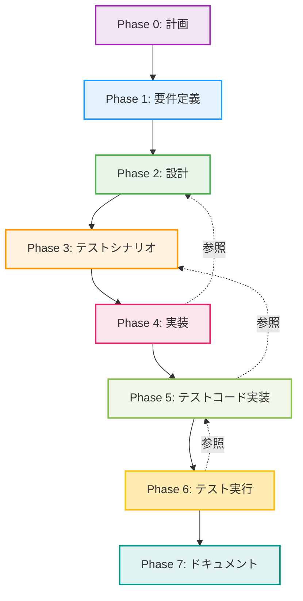

# プロジェクト計画書 - Issue #360

## 📋 Issue情報

- **Issue番号**: #360
- **タイトル**: [FEATURE] AIワークフロー実行時のレジューム機能実装
- **状態**: open
- **URL**: https://github.com/tielec/infrastructure-as-code/issues/360
- **ラベル**: enhancement

---

## 1. Issue分析

### 複雑度評価

**判定**: **中程度**

**理由**:
- 新規モジュール（`resume.py`）の作成が必要
- 既存コード（`main.py`、`metadata.py`）の拡張が必要
- メタデータ構造の理解と活用が必要
- 複数のエッジケースへの対応が必要
- ただし、アーキテクチャ変更や新規サブシステムの追加ではない

### 見積もり工数

**総工数**: 約12時間

**根拠**:
- Phase 0（計画）: 1時間
- Phase 1（要件定義）: 1時間
- Phase 2（設計）: 1.5時間
- Phase 3（テストシナリオ）: 1.5時間
- Phase 4（実装）: 3時間（`resume.py`新規作成 + `main.py`/`metadata.py`拡張）
- Phase 5（テストコード実装）: 2時間（ユニットテスト + 統合テスト）
- Phase 6（テスト実行）: 1時間
- Phase 7（ドキュメント）: 1時間

### リスク評価

**総合リスク**: **中**

**リスク内訳**:
- **技術的リスク**: 中 - メタデータ構造の複雑性、エッジケース対応
- **スコープリスク**: 低 - 要件が明確に定義されている
- **リソースリスク**: 低 - 必要なスキルセットは既存チームで対応可能
- **依存リスク**: 低 - 外部システム依存なし、既存APIのみ使用

---

## 2. 実装戦略判断

### 実装戦略: **EXTEND**

**判断根拠**:
- **新規ファイル作成**: `scripts/ai-workflow/utils/resume.py`（ResumeManager実装）
- **既存ファイル拡張**:
  - `scripts/ai-workflow/main.py`: `execute()`コマンドへのレジューム機能統合、`--force-reset`フラグ追加
  - `scripts/ai-workflow/core/metadata.py`: `clear()`メソッド追加
- **既存アーキテクチャの維持**: メタデータ管理の基本構造は変更なし、機能追加のみ
- **後方互換性の維持**: 既存ワークフローへの影響なし

**結論**: 新規モジュールの作成と既存コードの拡張が中心のため、**EXTEND**が最適

### テスト戦略: **UNIT_INTEGRATION**

**判断根拠**:
- **ユニットテスト必要性**:
  - `ResumeManager`クラスの各メソッド（`can_resume()`, `get_resume_phase()`, `is_completed()`等）のロジック検証が必要
  - メタデータ状態の判定ロジック（failed/in_progress/pending）の正確性検証
- **インテグレーションテスト必要性**:
  - `main.py execute --phase all`との統合動作確認
  - メタデータの読み込み → レジューム判定 → フェーズ実行の一連のフロー検証
  - `--force-reset`フラグの動作確認
- **BDDテスト不要**: エンドユーザー向けユーザーストーリーではなく、CLI内部機能のため不要

**結論**: ロジック検証（ユニット）とCLI統合動作確認（インテグレーション）の両方が必要なため、**UNIT_INTEGRATION**

### テストコード戦略: **CREATE_TEST**

**判断根拠**:
- **新規テストファイル作成**:
  - `scripts/ai-workflow/tests/unit/test_resume.py`: `ResumeManager`クラスのユニットテスト
  - `scripts/ai-workflow/tests/integration/test_resume_integration.py`: レジューム機能の統合テスト
- **既存テスト拡張不要**:
  - `test_main.py`は既存の`execute()`コマンドのテストであり、レジューム機能は別の関心事
  - `test_metadata_manager.py`は`MetadataManager`の基本機能のテストであり、`clear()`メソッドは新規機能

**結論**: 新規機能のため、新規テストファイルを作成する**CREATE_TEST**が最適

---

## 3. 影響範囲分析

### 既存コードへの影響

#### 変更が必要なファイル

| ファイルパス | 変更内容 | 影響度 |
|------------|---------|--------|
| `scripts/ai-workflow/utils/resume.py` | **新規作成** - ResumeManager実装 | 新規 |
| `scripts/ai-workflow/main.py` | `execute()`コマンドにレジューム機能統合、`--force-reset`引数追加 | 中 |
| `scripts/ai-workflow/core/metadata.py` | `clear()`メソッド追加（メタデータクリア機能） | 小 |
| `scripts/ai-workflow/README.md` | レジューム機能のドキュメント追加 | 小 |

#### 変更が不要なファイル

- `scripts/ai-workflow/core/workflow_state.py`: メタデータ構造は変更なし、既存APIのみ使用
- `scripts/ai-workflow/core/claude_agent_client.py`: フェーズ実行ロジックは変更なし
- `scripts/ai-workflow/core/github_client.py`: GitHub API連携は変更なし
- 各Phaseファイル（`phases/*.py`）: フェーズ実装は変更なし

### 依存関係の変更

**新規依存の追加**: なし
- 既存のPython標準ライブラリと既存モジュール（`WorkflowMetadata`, `MetadataManager`）のみ使用

**既存依存の変更**: なし

### マイグレーション要否

**不要**

**理由**:
- メタデータJSON構造の変更なし
- 既存の`metadata.json`ファイルとの互換性を完全に維持
- 既存ワークフローへの影響なし（レジューム機能は`--phase all`実行時のみ動作）

---

## 4. タスク分割

### Phase 0: プロジェクト計画（見積もり: 1h）

- [x] Issue #360の詳細分析
- [x] 実装戦略・テスト戦略の決定
- [x] 影響範囲分析とタスク分割
- [x] リスク評価と軽減策の定義
- [x] プロジェクト計画書の作成

### Phase 1: 要件定義（見積もり: 1h）

- [ ] 機能要件の明確化
  - レジューム機能の詳細な動作仕様
  - `--force-reset`フラグの動作仕様
  - エッジケースの網羅的な洗い出し
- [ ] 非機能要件の定義
  - パフォーマンス要件（レジューム判定の処理時間）
  - 後方互換性要件
- [ ] 受け入れ基準の定義
- [ ] ユースケースの整理

### Phase 2: 設計（見積もり: 1.5h）

- [ ] `ResumeManager`クラスの詳細設計
  - クラス図
  - メソッドシグネチャ
  - 状態遷移図
- [ ] `main.py`の改修設計
  - `execute()`関数のフロー図
  - レジューム判定ロジックの組み込み位置
- [ ] `metadata.py`の拡張設計
  - `clear()`メソッドの実装方針
- [ ] エラーハンドリング設計

### Phase 3: テストシナリオ（見積もり: 1.5h）

- [ ] ユニットテストシナリオ作成
  - `ResumeManager.can_resume()`のテストケース
  - `ResumeManager.get_resume_phase()`のテストケース（全パターン）
  - `ResumeManager.is_completed()`のテストケース
  - `MetadataManager.clear()`のテストケース
- [ ] インテグレーションテストシナリオ作成
  - `--phase all`実行時の自動レジューム動作確認
  - `--force-reset`フラグの動作確認
  - 全フェーズ完了済みケースの動作確認
- [ ] エッジケーステストシナリオ作成
  - メタデータ破損時の動作確認
  - 複数フェーズ失敗時の動作確認

### Phase 4: 実装（見積もり: 3h）

- [ ] `scripts/ai-workflow/utils/resume.py`の新規作成（1.5h）
  - `ResumeManager`クラス実装
  - `can_resume()`メソッド実装
  - `get_resume_phase()`メソッド実装（優先順位ロジック）
  - `is_completed()`メソッド実装
  - `get_status_summary()`メソッド実装
  - `reset()`メソッド実装
- [ ] `scripts/ai-workflow/main.py`の拡張（1h）
  - `--force-reset`引数の追加
  - `execute()`関数へのレジューム機能統合
  - レジューム状態のログ出力
- [ ] `scripts/ai-workflow/core/metadata.py`の拡張（0.5h）
  - `clear()`メソッドの実装

### Phase 5: テストコード実装（見積もり: 2h）

- [ ] `tests/unit/test_resume.py`の作成（1h）
  - `ResumeManager`の各メソッドのユニットテスト
  - モックオブジェクトを使用したメタデータ状態のテスト
  - エッジケースのテスト（メタデータ不存在、破損等）
- [ ] `tests/integration/test_resume_integration.py`の作成（1h）
  - `--phase all`実行時の統合テスト
  - `--force-reset`フラグの統合テスト
  - 実際のメタデータファイルを使用したテスト

### Phase 6: テスト実行（見積もり: 1h）

- [ ] ユニットテストの実行と結果確認
- [ ] インテグレーションテストの実行と結果確認
- [ ] カバレッジ確認（目標: 90%以上）
- [ ] バグ修正（必要な場合）

### Phase 7: ドキュメント（見積もり: 1h）

- [ ] `scripts/ai-workflow/README.md`の更新
  - レジューム機能の説明追加
  - `--force-reset`フラグの使用方法追加
  - 使用例の追加
- [ ] コードコメントの追加・更新
- [ ] CHANGELOG.mdの更新（該当する場合）

---

## 5. 依存関係

### タスク間の依存関係

**クリティカルパス**: Phase 0 → Phase 1 → Phase 2 → Phase 3 → Phase 4 → Phase 5 → Phase 6 → Phase 7

**並列実行可能なタスク**: なし（各Phaseは順次実行が必須）

**ブロッキングポイント**:
- Phase 2（設計）完了まで実装開始不可
- Phase 4（実装）完了までテストコード作成不可
- Phase 5（テストコード実装）完了までテスト実行不可

---

## 6. リスクと軽減策

### リスク1: メタデータ状態の複雑性

- **影響度**: 中
- **確率**: 中
- **詳細**:
  - メタデータJSON内のフェーズ状態（pending/in_progress/completed/failed）の組み合わせが複雑
  - エッジケース（複数フェーズ失敗、in_progressのまま異常終了等）の見落としリスク
- **軽減策**:
  - Phase 3（テストシナリオ）で網羅的なエッジケースを洗い出し
  - Phase 5（テストコード実装）で全パターンのユニットテストを作成
  - Phase 2（設計）で状態遷移図を作成し、レビュー

### リスク2: 既存ワークフローへの影響

- **影響度**: 低
- **確率**: 低
- **詳細**:
  - レジューム機能の実装により、既存の`--phase all`の動作が変わる可能性
  - 既存ユーザーが期待する動作と異なる可能性
- **軽減策**:
  - `--force-reset`フラグで既存動作（最初から実行）を提供
  - Phase 6（テスト実行）で既存ワークフローとの互換性を確認
  - README.mdに明確な使用方法とデフォルト動作を記載

### リスク3: `clear()`メソッドの破壊的操作

- **影響度**: 高
- **確率**: 低
- **詳細**:
  - `MetadataManager.clear()`はメタデータとワークフローディレクトリを削除する破壊的操作
  - ユーザーの意図しないデータ損失リスク
- **軽減策**:
  - `--force-reset`フラグを明示的に指定した場合のみ実行
  - ログに警告メッセージを明確に表示
  - Phase 5（テストコード実装）で`clear()`の動作を十分にテスト
  - README.mdに`--force-reset`の使用注意を明記

### リスク4: Phase 0（planning）フェーズとの混同

- **影響度**: 中
- **確率**: 中
- **詳細**:
  - Issue #360では`--phase all`が"Phase 1-8"を指すと記載されているが、README.mdではPlanningフェーズは含まれないと記載
  - レジューム機能がPlanningフェーズを含むか不明確
- **軽減策**:
  - Phase 1（要件定義）でPlanningフェーズの扱いを明確化
  - `execute_all_phases()`関数の実装でPlanningフェーズを含めるか判断
  - README.mdとコードの一貫性を確保

### リスク5: パフォーマンス低下

- **影響度**: 低
- **確率**: 低
- **詳細**:
  - レジューム判定処理が追加されることで、`--phase all`の起動が遅くなる可能性
- **軽減策**:
  - メタデータ読み込みは既存処理で実施済みのため、追加コストは最小限
  - レジューム判定ロジックはシンプルなループ処理のみ
  - Phase 6（テスト実行）でパフォーマンス測定

---

## 7. 品質ゲート

### Phase 0: プロジェクト計画

- [x] **実装戦略が明確に決定されている**（EXTEND）
- [x] **テスト戦略が明確に決定されている**（UNIT_INTEGRATION）
- [x] **テストコード戦略が明確に決定されている**（CREATE_TEST）
- [x] 影響範囲が分析されている
- [x] タスク分割が適切な粒度である（1タスク = 0.5~1.5時間）
- [x] リスクが洗い出されている（5つのリスクと軽減策を定義）

### Phase 1: 要件定義

- [ ] 機能要件が明確に記載されている
- [ ] 非機能要件が定義されている
- [ ] 受け入れ基準が定義されている
- [ ] エッジケースが網羅的に洗い出されている
- [ ] Planningフェーズの扱いが明確化されている

### Phase 2: 設計

- [ ] `ResumeManager`クラスの詳細設計が完成している
- [ ] クラス図とメソッドシグネチャが明確である
- [ ] 状態遷移図が作成されている
- [ ] エラーハンドリング方針が定義されている
- [ ] コードレビュー可能なレベルで設計ドキュメントが作成されている

### Phase 3: テストシナリオ

- [ ] ユニットテストシナリオが全メソッドをカバーしている
- [ ] インテグレーションテストシナリオが主要ユースケースをカバーしている
- [ ] エッジケーステストシナリオが定義されている
- [ ] テストケース数が適切である（過不足なし）

### Phase 4: 実装

- [ ] `resume.py`が正しく実装されている
- [ ] `main.py`の拡張が正しく実装されている
- [ ] `metadata.py`の拡張が正しく実装されている
- [ ] コードがPEP 8に準拠している
- [ ] エラーハンドリングが適切に実装されている
- [ ] ログ出力が適切に実装されている

### Phase 5: テストコード実装

- [ ] ユニットテストが全メソッドをカバーしている
- [ ] インテグレーションテストが主要ユースケースをカバーしている
- [ ] エッジケーステストが実装されている
- [ ] テストコードが読みやすく保守可能である
- [ ] モックオブジェクトが適切に使用されている

### Phase 6: テスト実行

- [ ] すべてのユニットテストがパスしている
- [ ] すべてのインテグレーションテストがパスしている
- [ ] カバレッジが90%以上である
- [ ] パフォーマンステストがパスしている（起動時間 < 1秒）
- [ ] 既存ワークフローとの互換性が確認されている

### Phase 7: ドキュメント

- [ ] README.mdが更新されている
- [ ] レジューム機能の使用方法が明確に記載されている
- [ ] `--force-reset`フラグの使用方法が明確に記載されている
- [ ] 使用例が追加されている
- [ ] コードコメントが適切に追加されている

---

## 8. まとめ

### プロジェクトの目標

`--phase all` で全フェーズを実行中に途中で失敗した場合、失敗したフェーズから自動的に再開するレジューム機能を実装し、開発者の作業効率を向上させる。

### 主要な成果物

1. **新規モジュール**: `scripts/ai-workflow/utils/resume.py`
2. **拡張モジュール**: `scripts/ai-workflow/main.py`, `scripts/ai-workflow/core/metadata.py`
3. **テストコード**: `tests/unit/test_resume.py`, `tests/integration/test_resume_integration.py`
4. **ドキュメント**: `scripts/ai-workflow/README.md`（レジューム機能セクション追加）

### 期待される効果

- **時間節約**: 既に完了したフェーズの再実行が不要
- **リソース節約**: Claude API呼び出しの重複が削減
- **作業効率向上**: 途中失敗時の手動操作が不要
- **ユーザビリティ向上**: デフォルトで自動レジューム、必要に応じて`--force-reset`で最初から実行

### 次のステップ

Phase 1（要件定義）に進み、レジューム機能の詳細な動作仕様を明確化します。

---

**作成日**: 2025-10-12
**プロジェクトマネージャ**: Claude AI (Phase 0)
**見積もり総工数**: 約12時間
**実装戦略**: EXTEND
**テスト戦略**: UNIT_INTEGRATION
**テストコード戦略**: CREATE_TEST
