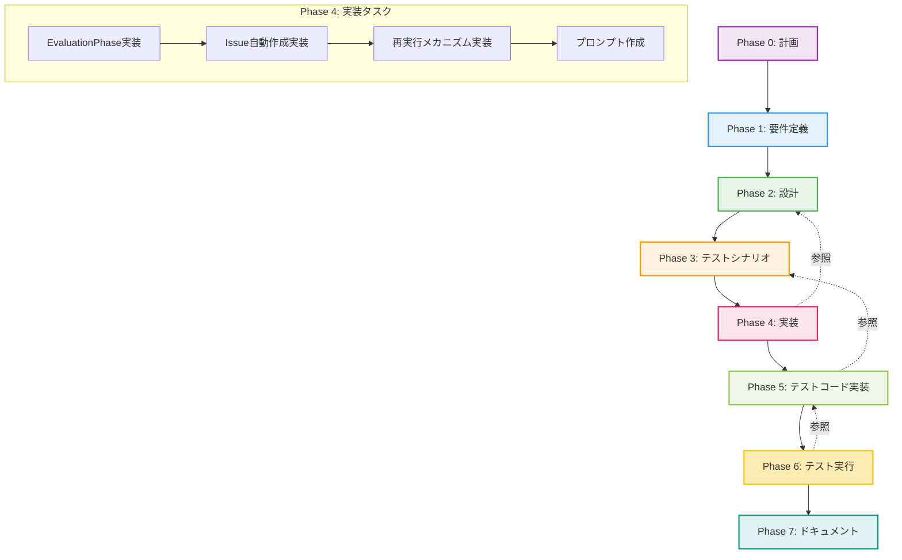

# プロジェクト計画書 - Issue #362

## 📋 Issue情報

- **Issue番号**: #362
- **タイトル**: [FEATURE] Project Evaluation フェーズの追加
- **状態**: open
- **URL**: https://github.com/tielec/infrastructure-as-code/issues/362
- **ラベル**: なし

---

## 1. Issue分析

### 複雑度評価

**判定**: **複雑**

**理由**:
- 新規フェーズ（Phase 9: Evaluation）の追加によるアーキテクチャ拡張
- 既存の8フェーズワークフローへの影響（Phase 0-8）
- 複数の判定タイプ（PASS/PASS_WITH_ISSUES/FAIL_PHASE_X/ABORT）の実装
- GitHub Issue自動作成機能の実装
- メタデータ構造の拡張（evaluation フィールド追加）
- 再実行メカニズムの設計と実装
- 既存のmain.py、metadata_manager、workflow_stateへの大規模な変更

### 見積もり工数

**総工数**: 約18時間

**根拠**:
- Phase 1（要件定義）: 2時間（判定基準の明確化、Issueテンプレート設計）
- Phase 2（設計）: 2.5時間（EvaluationPhaseクラス設計、判定アルゴリズム、メタデータ拡張）
- Phase 3（テストシナリオ）: 2時間（全判定タイプのシナリオ作成）
- Phase 4（実装）: 5時間
  - EvaluationPhaseクラス実装: 2時間
  - Issue自動作成機能: 1.5時間
  - 再実行メカニズム: 1時間
  - metadata_manager拡張: 0.5時間
- Phase 5（テストコード実装）: 3時間（ユニット + インテグレーション + BDD）
- Phase 6（テスト実行）: 1.5時間
- Phase 7（ドキュメント）: 2時間（README、CONTRIBUTION、プロンプト作成）

### リスク評価

**総合リスク**: **高**

**リスク内訳**:
- **技術的リスク**: 高 - メタデータ巻き戻し機能の実装、GitHub API連携の複雑性
- **スコープリスク**: 中 - 判定基準が曖昧になりやすい（PMの主観が入る）
- **リソースリスク**: 中 - 大規模な実装のため、見積もり超過の可能性
- **依存リスク**: 中 - GitHub API（Issue作成）、既存フェーズの成果物への依存

---

## 2. 実装戦略判断

### 実装戦略: **CREATE**

**判断根拠**:
- **新規フェーズクラスの作成**: `scripts/ai-workflow/phases/evaluation.py`（EvaluationPhase実装）
- **新規プロンプトファイルの作成**: `scripts/ai-workflow/prompts/evaluation/execute.txt`, `review.txt`
- **既存ワークフローの拡張**: main.pyのphase_classesに'evaluation'を追加、execute_all_phases()の修正
- **メタデータ構造の拡張**: metadata.jsonに'evaluation'フィールド追加
- **新規機能の追加**: Issue自動作成、再実行メカニズム

**結論**: 既存の8フェーズシステムに新しいフェーズを追加し、新機能（評価、判定、Issue作成）を実装するため、**CREATE**が最適

### テスト戦略: **ALL**

**判断根拠**:
- **ユニットテスト必要性**:
  - EvaluationPhaseクラスの各メソッド（evaluate_project()、determine_decision()等）のロジック検証
  - 判定アルゴリズムの正確性検証（PASS/PASS_WITH_ISSUES/FAIL_PHASE_X/ABORT）
- **インテグレーションテスト必要性**:
  - Phase 1-8の成果物を読み込み → 評価 → 判定の一連のフロー検証
  - GitHub API連携（Issue作成）の動作確認
  - メタデータ巻き戻し機能の動作確認
- **BDDテスト必要性**:
  - プロジェクトマネージャー視点のユーザーストーリー検証
  - 「プロジェクトが合格と判定される」「残タスクが新Issueとして作成される」等のシナリオ
  - エンドツーエンドの動作確認（Phase 0-9の完全実行）

**結論**: 大規模な変更でありリスクが高いため、すべてのテストレベル（ユニット、インテグレーション、BDD）を実施する**ALL**が必須

### テストコード戦略: **CREATE_TEST**

**判断根拠**:
- **新規テストファイル作成**:
  - `tests/unit/phases/test_evaluation.py`: EvaluationPhaseクラスのユニットテスト
  - `tests/integration/test_evaluation_integration.py`: 評価フローの統合テスト
  - `tests/bdd/features/evaluation.feature`: BDDシナリオ
  - `tests/bdd/steps/test_evaluation_steps.py`: BDDステップ実装
- **既存テスト拡張不要**:
  - 既存のPhase 1-8のテストは独立しており、Evaluationフェーズの影響を受けない

**結論**: 新規フェーズのため、新規テストファイルを作成する**CREATE_TEST**が最適

---

## 3. 影響範囲分析

### 既存コードへの影響

#### 変更が必要なファイル

| ファイルパス | 変更内容 | 影響度 |
|------------|---------|--------|
| `scripts/ai-workflow/phases/evaluation.py` | **新規作成** - EvaluationPhaseクラス実装 | 新規 |
| `scripts/ai-workflow/prompts/evaluation/execute.txt` | **新規作成** - 評価実行プロンプト | 新規 |
| `scripts/ai-workflow/prompts/evaluation/review.txt` | **新規作成** - 評価レビュープロンプト | 新規 |
| `scripts/ai-workflow/main.py` | phase_classesに'evaluation'追加、execute_all_phases()修正 | 中 |
| `scripts/ai-workflow/core/metadata_manager.py` | evaluationフィールド管理メソッド追加（rollback_to_phase等） | 中 |
| `scripts/ai-workflow/core/workflow_state.py` | メタデータスキーマに'evaluation'フィールド追加 | 小 |
| `scripts/ai-workflow/core/github_client.py` | create_issue_from_evaluation()メソッド追加 | 中 |
| `scripts/ai-workflow/phases/base_phase.py` | PHASE_NUMBERSに'evaluation': '09'追加 | 小 |
| `scripts/ai-workflow/README.md` | Phase 9の説明、判定タイプ、使用方法追加 | 小 |

#### 変更が不要なファイル

- `scripts/ai-workflow/phases/planning.py`: Phase 0は変更不要
- `scripts/ai-workflow/phases/requirements.py`: Phase 1は変更不要
- `scripts/ai-workflow/phases/design.py`: Phase 2は変更不要
- `scripts/ai-workflow/phases/test_scenario.py`: Phase 3は変更不要
- `scripts/ai-workflow/phases/implementation.py`: Phase 4は変更不要
- `scripts/ai-workflow/phases/test_implementation.py`: Phase 5は変更不要
- `scripts/ai-workflow/phases/testing.py`: Phase 6は変更不要
- `scripts/ai-workflow/phases/documentation.py`: Phase 7は変更不要
- `scripts/ai-workflow/phases/report.py`: Phase 8は変更不要
- `scripts/ai-workflow/core/claude_agent_client.py`: Claude Agent SDK連携は変更不要

### 依存関係の変更

**新規依存の追加**: なし
- 既存のPython標準ライブラリと既存モジュール（GitHubClient、MetadataManager等）のみ使用

**既存依存の変更**: なし

### マイグレーション要否

**必要**

**理由**:
- メタデータJSON構造に'evaluation'フィールドを追加
- 既存のmetadata.jsonファイルには'evaluation'フィールドが存在しない
- WorkflowState.migrate()メソッドで自動マイグレーション実装が必要

**マイグレーション内容**:
```python
# metadata.json
{
  "phases": {
    ...
    "evaluation": {
      "status": "pending",
      "retry_count": 0,
      "started_at": null,
      "completed_at": null,
      "review_result": null,
      "decision": null,  # PASS/PASS_WITH_ISSUES/FAIL_PHASE_X/ABORT
      "failed_phase": null,  # FAIL_PHASE_X の場合のフェーズ名
      "remaining_tasks": []  # PASS_WITH_ISSUES の場合のタスクリスト
    }
  }
}
```

---

## 4. タスク分割

### Phase 1: 要件定義（見積もり: 2h）

- [ ] 機能要件の明確化（1h）
  - 評価対象の成果物リスト定義（Phase 0-8の出力ファイル）
  - 判定基準の詳細定義（PASS/PASS_WITH_ISSUES/FAIL_PHASE_X/ABORT）
  - 残タスクの抽出基準定義
  - 再実行フェーズの決定ロジック定義
- [ ] 非機能要件の定義（0.5h）
  - 評価レポート生成時間（< 5分）
  - Issue作成API制限の考慮
- [ ] 受け入れ基準の定義（0.5h）
  - 判定精度の基準（例: PM判断と90%一致）
  - Issue自動作成の成功率（100%）

### Phase 2: 設計（見積もり: 2.5h）

- [ ] EvaluationPhaseクラスの詳細設計（1h）
  - クラス図、メソッドシグネチャ
  - execute()メソッドのフロー図
  - 判定アルゴリズムの疑似コード
- [ ] メタデータ構造拡張の設計（0.5h）
  - evaluationフィールドのスキーマ定義
  - マイグレーションロジックの設計
- [ ] GitHub Issue自動作成機能の設計（0.5h）
  - Issueテンプレート設計（タイトル、本文、ラベル）
  - create_issue_from_evaluation()メソッドのシグネチャ
- [ ] エラーハンドリング設計（0.5h）
  - Issue作成失敗時の処理
  - メタデータ破損時の処理

### Phase 3: テストシナリオ（見積もり: 2h）

- [ ] ユニットテストシナリオ作成（0.5h）
  - EvaluationPhase.evaluate_project()のテストケース
  - EvaluationPhase.determine_decision()のテストケース（全判定タイプ）
- [ ] インテグレーションテストシナリオ作成（0.5h）
  - Phase 0-8実行 → Phase 9評価の統合テスト
  - Issue自動作成の統合テスト
  - メタデータ巻き戻しの統合テスト
- [ ] BDDテストシナリオ作成（1h）
  - Given-When-Thenシナリオ定義
  - 全判定タイプ（PASS/PASS_WITH_ISSUES/FAIL_PHASE_X/ABORT）のシナリオ

### Phase 4: 実装（見積もり: 5h）

- [ ] `phases/evaluation.py`の新規作成（2h）
  - EvaluationPhaseクラス実装
  - execute()メソッド実装
  - review()メソッド実装
  - 判定アルゴリズム実装
- [ ] GitHub Issue自動作成機能の実装（1.5h）
  - github_client.create_issue_from_evaluation()実装
  - Issueテンプレート実装
- [ ] メタデータ再実行メカニズムの実装（1h）
  - metadata_manager.rollback_to_phase()実装
  - main.py execute_all_phases()の修正
- [ ] プロンプトファイルの作成（0.5h）
  - prompts/evaluation/execute.txt作成
  - prompts/evaluation/review.txt作成

### Phase 5: テストコード実装（見積もり: 3h）

- [ ] `tests/unit/phases/test_evaluation.py`の作成（1h）
  - EvaluationPhaseの全メソッドのユニットテスト
  - モックを使用した判定ロジックのテスト
- [ ] `tests/integration/test_evaluation_integration.py`の作成（1h）
  - 実際のPhase 0-8成果物を使用した統合テスト
  - GitHub API連携テスト（モックAPI使用）
- [ ] BDDテストの実装（1h）
  - `tests/bdd/features/evaluation.feature`作成
  - `tests/bdd/steps/test_evaluation_steps.py`作成

### Phase 6: テスト実行（見積もり: 1.5h）

- [ ] ユニットテストの実行と結果確認（0.5h）
- [ ] インテグレーションテストの実行と結果確認（0.5h）
- [ ] BDDテストの実行と結果確認（0.5h）
- [ ] カバレッジ確認（目標: 90%以上）

### Phase 7: ドキュメント（見積もり: 2h）

- [ ] README.mdの更新（1h）
  - Phase 9: Evaluationの説明追加
  - 判定タイプの説明（PASS/PASS_WITH_ISSUES/FAIL_PHASE_X/ABORT）
  - 使用例の追加
- [ ] プロンプトファイルの作成（1h）
  - execute.txtの詳細化
  - review.txtの詳細化
  - 判定基準の明記

---

## 5. 依存関係



### タスク間の依存関係

**クリティカルパス**: Phase 0 → Phase 1 → Phase 2 → Phase 3 → Phase 4 → Phase 5 → Phase 6 → Phase 7

**並列実行可能なタスク**: Phase 4内のタスク（EvaluationPhase実装とIssue自動作成実装は並列可能）

**ブロッキングポイント**:
- Phase 2（設計）完了まで実装開始不可
- Phase 4（実装）完了までテストコード作成不可
- Phase 5（テストコード実装）完了までテスト実行不可

---

## 6. リスクと軽減策

### リスク1: 判定基準の曖昧性

- **影響度**: 高
- **確率**: 高
- **詳細**:
  - PASS/PASS_WITH_ISSUES/FAIL_PHASE_X/ABORTの判定基準が主観的になりやすい
  - プロジェクトマネージャー（PM）の判断と自動評価の乖離リスク
  - 「致命的な問題」の定義が不明確
- **軽減策**:
  - Phase 1（要件定義）で具体的な判定基準を定義（例: Phase Xのレビュー結果がFAIL → FAIL_PHASE_X）
  - Phase 3（テストシナリオ）で判定基準のテストケースを網羅
  - プロンプトに明確な判定ロジックを記載（if-then-else形式）
  - Phase 6（テスト実行）で実際のIssueに対して評価精度を検証

### リスク2: メタデータ巻き戻し機能の複雑性

- **影響度**: 高
- **確率**: 中
- **詳細**:
  - metadata.jsonの状態を特定フェーズに巻き戻す処理が複雑
  - 巻き戻し時のデータ整合性リスク（例: Phase 5-8の成果物が残っている状態でPhase 4から再実行）
  - 既存のResumeManager機能との競合リスク
- **軽減策**:
  - Phase 2（設計）でrollback_to_phase()メソッドの詳細設計を実施
  - Phase 5（テストコード実装）で巻き戻し機能の網羅的なテストケースを作成
  - 巻き戻し前にワークフローディレクトリをバックアップ（オプション）
  - README.mdに巻き戻しの注意事項を明記

### リスク3: GitHub Issue自動作成の失敗

- **影響度**: 中
- **確率**: 中
- **詳細**:
  - GitHub API制限によるIssue作成失敗（Rate Limit: 5000 requests/hour）
  - ネットワークエラーやGitHub障害によるAPI呼び出し失敗
  - Issue作成失敗時のワークフロー停止リスク
- **軽減策**:
  - Issue作成失敗時はログに記録し、ワークフローは継続（PASSまたはPASS_WITH_ISSUESの場合のみ）
  - Phase 2（設計）でリトライロジックを実装（最大3回リトライ）
  - Phase 5（テストコード実装）でAPI失敗シナリオのテストを作成
  - README.mdに手動Issue作成の手順を記載

### リスク4: 既存ワークフローへの影響

- **影響度**: 高
- **確率**: 低
- **詳細**:
  - Phase 9追加により、既存のPhase 0-8のワークフローが影響を受ける可能性
  - main.py execute_all_phases()の修正により、既存の動作が変わる可能性
- **軽減策**:
  - Phase 9はオプション機能とし、明示的に実行する場合のみ動作（例: --with-evaluation フラグ）
  - Phase 6（テスト実行）で既存ワークフロー（Phase 0-8のみ）の動作確認
  - 後方互換性を維持（Phase 9を実行しなくてもPhase 0-8は正常動作）

### リスク5: スコープクリープ

- **影響度**: 中
- **確率**: 中
- **詳細**:
  - Issue #362の要件が拡大し、見積もり工数を超過する可能性
  - 「残タスクの抽出」「再実行メカニズム」等の実装が想定以上に複雑化
- **軽減策**:
  - Phase 1（要件定義）で実装範囲を明確化し、MVP（Minimum Viable Product）を定義
  - Phase 4（実装）で優先度付けし、高優先度機能から実装
  - 低優先度機能は後続Issueとして切り出し（例: Issue自動ラベリング機能）

---

## 7. 品質ゲート

### Phase 0: プロジェクト計画

- [x] **実装戦略が明確に決定されている**（CREATE）
- [x] **テスト戦略が明確に決定されている**（ALL）
- [x] **テストコード戦略が明確に決定されている**（CREATE_TEST）
- [x] 影響範囲が分析されている
- [x] タスク分割が適切な粒度である（1タスク = 0.5~2時間）
- [x] リスクが洗い出されている（5つのリスクと軽減策を定義）

### Phase 1: 要件定義

- [ ] 機能要件が明確に記載されている
- [ ] 判定基準（PASS/PASS_WITH_ISSUES/FAIL_PHASE_X/ABORT）が具体的に定義されている
- [ ] 受け入れ基準が定義されている
- [ ] エッジケースが網羅的に洗い出されている

### Phase 2: 設計

- [ ] EvaluationPhaseクラスの詳細設計が完成している
- [ ] クラス図とメソッドシグネチャが明確である
- [ ] 判定アルゴリズムの疑似コードが記載されている
- [ ] メタデータ構造拡張の設計が完成している
- [ ] エラーハンドリング方針が定義されている

### Phase 3: テストシナリオ

- [ ] ユニットテストシナリオが全メソッドをカバーしている
- [ ] インテグレーションテストシナリオが主要ユースケースをカバーしている
- [ ] BDDテストシナリオが全判定タイプをカバーしている
- [ ] テストケース数が適切である（過不足なし）

### Phase 4: 実装

- [ ] `evaluation.py`が正しく実装されている
- [ ] Issue自動作成機能が正しく実装されている
- [ ] 再実行メカニズムが正しく実装されている
- [ ] コードがPEP 8に準拠している
- [ ] エラーハンドリングが適切に実装されている
- [ ] ログ出力が適切に実装されている

### Phase 5: テストコード実装

- [ ] ユニットテストが全メソッドをカバーしている
- [ ] インテグレーションテストが主要ユースケースをカバーしている
- [ ] BDDテストが全判定タイプをカバーしている
- [ ] テストコードが読みやすく保守可能である

### Phase 6: テスト実行

- [ ] すべてのユニットテストがパスしている
- [ ] すべてのインテグレーションテストがパスしている
- [ ] すべてのBDDテストがパスしている
- [ ] カバレッジが90%以上である
- [ ] 既存ワークフロー（Phase 0-8）との互換性が確認されている

### Phase 7: ドキュメント

- [ ] README.mdが更新されている
- [ ] Phase 9の説明が明確に記載されている
- [ ] 判定タイプの説明が明確に記載されている
- [ ] 使用例が追加されている
- [ ] プロンプトファイルが作成されている

---

## 8. まとめ

### プロジェクトの目標

AI Workflow の Phase 1-8 完了後にプロジェクト全体を評価し、次のアクション（PASS/PASS_WITH_ISSUES/FAIL_PHASE_X/ABORT）を判定するProject Evaluationフェーズを追加し、プロジェクトマネージャーが成果を総合的に評価できるようにする。

### 主要な成果物

1. **新規フェーズクラス**: `scripts/ai-workflow/phases/evaluation.py`
2. **新規プロンプト**: `scripts/ai-workflow/prompts/evaluation/execute.txt`, `review.txt`
3. **拡張モジュール**: `scripts/ai-workflow/main.py`, `core/metadata_manager.py`, `core/github_client.py`
4. **テストコード**:
   - `tests/unit/phases/test_evaluation.py`
   - `tests/integration/test_evaluation_integration.py`
   - `tests/bdd/features/evaluation.feature`
   - `tests/bdd/steps/test_evaluation_steps.py`
5. **ドキュメント**: `scripts/ai-workflow/README.md`（Phase 9セクション追加）

### 期待される効果

- **品質向上**: プロジェクトマネージャーの視点で成果物を総合評価
- **残タスク管理**: PASS_WITH_ISSUES判定により、追加タスクを自動的にIssue化
- **再実行効率化**: FAIL_PHASE_X判定により、問題のあるフェーズから再実行可能
- **リスク軽減**: ABORT判定により、致命的な問題を早期発見し、無駄な作業を回避

### 次のステップ

Phase 1（要件定義）に進み、判定基準（PASS/PASS_WITH_ISSUES/FAIL_PHASE_X/ABORT）の具体的な定義と、残タスク抽出基準を明確化します。

---

**作成日**: 2025-10-12
**プロジェクトマネージャ**: Claude AI (Phase 0)
**見積もり総工数**: 約18時間
**実装戦略**: CREATE
**テスト戦略**: ALL
**テストコード戦略**: CREATE_TEST
**リスクレベル**: 高
**優先度**: 高
