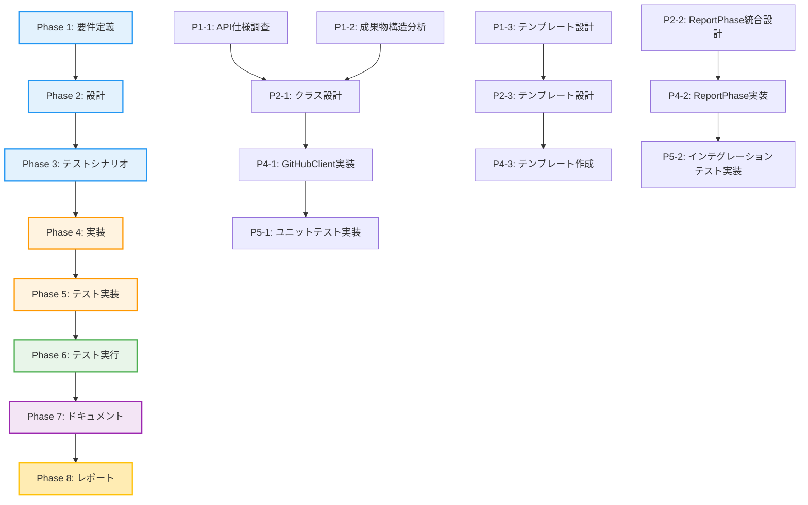

# プロジェクト計画書 - Issue #363

## 1. Issue分析

### 複雑度
**中程度**

### 見積もり工数
**8-12時間**

### 判定根拠
- **既存機能の拡張**が中心（GitHubClient、ReportPhaseの既存実装を拡張）
- **新規テンプレートの作成**が必要（`pr_body_detailed_template.md`）
- **複数フェーズの成果物を統合する処理**が必要（情報抽出ロジック）
- **GitHub API連携**の追加（PR更新機能）
- 既存のGitHub API wrapper（PyGithub）を活用できる
- 複数ファイルの修正が必要だが、アーキテクチャ変更は不要

### リスク評価
**中**

### リスク根拠
- GitHub API制限への対応が必要
- 成果物パース処理の複雑さ（Markdown/YAML解析）
- Phase 7完了タイミングでの統合処理の信頼性
- 既存PRへの更新処理の安全性（編集競合のリスク）

---

## 2. 実装戦略判断

### 実装戦略: EXTEND

**判断根拠**:
- 既存の`GitHubClient`クラスに`update_pull_request()`メソッドを追加
- 既存の`ReportPhase`クラスに最終処理としてPR更新ロジックを統合
- 既存のテンプレート管理機構（`templates/pr_body_template.md`）を活用して詳細版テンプレートを追加
- 新規クラスやモジュールの作成は不要、既存コンポーネントの拡張で対応可能

### テスト戦略: UNIT_INTEGRATION

**判断根拠**:
- **ユニットテスト**が必要な理由:
  - `GitHubClient.update_pull_request()`の単体テスト（モック使用）
  - PR本文生成ロジック（`_generate_pr_body_detailed()`）のロジック検証
  - 成果物パース処理（`_extract_phase_outputs()`）の単体テスト
- **インテグレーションテスト**が必要な理由:
  - Phase 7完了 → PR更新の一連のフロー検証
  - GitHub API連携テスト（実際のPR更新動作）
  - 既存PR存在時の更新処理（競合検知）
- BDDテストは不要（エンドユーザー向けUIではなく、内部処理の拡張）

### テストコード戦略: BOTH_TEST

**判断根拠**:
- **既存テストファイルへの追加**（EXTEND_TEST）:
  - `tests/unit/core/test_github_client.py`にPR更新メソッドのユニットテストを追加
  - `tests/unit/phases/test_report.py`（存在すれば）にPR更新統合処理のテストを追加
- **新規テストファイル作成**（CREATE_TEST）:
  - `tests/integration/test_pr_update_integration.py`を新規作成（Phase 7 → PR更新のE2Eフロー）
  - 既存の`test_phase_all.py`との統合も検討

---

## 3. 影響範囲分析

### 既存コードへの影響

#### 変更が必要なファイル
1. **`scripts/ai-workflow/core/github_client.py`**
   - `update_pull_request()` メソッドの追加
   - `_generate_pr_body_detailed()` メソッドの追加（詳細版PR本文生成）
   - `_extract_phase_outputs()` メソッドの追加（成果物情報抽出）

2. **`scripts/ai-workflow/phases/report.py`**
   - `execute()` メソッド内にPR更新処理を統合（Phase 8完了時）
   - 成果物パスの取得処理を活用

3. **`scripts/ai-workflow/templates/pr_body_detailed_template.md`**
   - 新規作成（詳細版PR本文テンプレート）

4. **テストファイル**
   - `tests/unit/core/test_github_client.py`（既存拡張）
   - `tests/integration/test_pr_update_integration.py`（新規作成）

### 依存関係の変更

#### 新規依存の追加
- なし（既存の`PyGithub`ライブラリを活用）

#### 既存依存の変更
- なし

### マイグレーション要否

#### データベーススキーマ変更
- なし

#### 設定ファイル変更
- なし（テンプレートの追加のみ）

#### 環境変数追加
- なし（既存の`GITHUB_TOKEN`を使用）

---

## 4. タスク分割

### Phase 1: 要件定義 (見積もり: 1.5h)
1. **GitHub API仕様調査**（0.5h）
   - PR更新API（`repository.get_pull(number).edit(body=new_body)`）の挙動確認
   - API rate limitの制約確認
   - 完了条件: GitHub REST API v3仕様を理解し、実装に必要な情報を文書化

2. **成果物構造分析**（0.5h）
   - 各フェーズ成果物（`.ai-workflow/issue-XXX/phaseX/output/*.md`）の構造確認
   - 抽出すべき情報の特定（実装詳細、テスト結果、ドキュメント更新リスト）
   - 完了条件: 各フェーズの成果物フォーマットを理解し、パース方法を設計

3. **詳細版PR本文テンプレート設計**（0.5h）
   - Issue本文から引き継ぐ項目の整理
   - Phase 4-7の成果物から抽出する項目の整理
   - Markdownフォーマットの設計
   - 完了条件: テンプレート構成が明確になり、プレースホルダーが定義される

### Phase 2: 設計 (見積もり: 1.5h)
1. **クラス設計**（0.5h）
   - `GitHubClient.update_pull_request()` のインターフェース設計
   - `GitHubClient._generate_pr_body_detailed()` のロジック設計
   - `GitHubClient._extract_phase_outputs()` のロジック設計
   - 完了条件: メソッドシグネチャ、戻り値、例外処理が明確になる

2. **ReportPhase統合設計**（0.5h）
   - Phase 8（Report）完了時のPR更新タイミング設計
   - エラーハンドリング方針（PR更新失敗時の処理）
   - 完了条件: ReportPhaseへの統合方法が明確になる

3. **テンプレート設計**（0.5h）
   - `pr_body_detailed_template.md` のプレースホルダー定義
   - 簡易版テンプレート（`pr_body_template.md`）との使い分け設計
   - 完了条件: テンプレートファイルの内容とプレースホルダーが確定

### Phase 3: テストシナリオ (見積もり: 1h)
1. **ユニットテストシナリオ作成**（0.5h）
   - `update_pull_request()` の正常系・異常系テストケース
   - `_generate_pr_body_detailed()` のテストケース
   - `_extract_phase_outputs()` のテストケース
   - 完了条件: テストケース一覧が作成され、期待値が明確になる

2. **インテグレーションテストシナリオ作成**（0.5h）
   - Phase 7完了 → PR更新の一連のフローシナリオ
   - GitHub API連携テストシナリオ（モック使用）
   - 完了条件: E2Eフローのテストシナリオが文書化される

### Phase 4: 実装 (見積もり: 3-4h)
1. **GitHubClient拡張実装**（1.5h）
   - `update_pull_request()` メソッドの実装
   - `_generate_pr_body_detailed()` メソッドの実装
   - `_extract_phase_outputs()` メソッドの実装
   - エラーハンドリングの実装
   - 完了条件: 全メソッドが実装され、静的解析エラーがゼロ

2. **ReportPhase統合実装**（1h）
   - Phase 8完了時のPR更新処理を`execute()`メソッドに追加
   - 成果物パス取得処理の活用
   - エラーログ出力の実装
   - 完了条件: PR更新処理が統合され、Phase 8実行時に呼び出される

3. **詳細版テンプレート作成**（0.5-1h）
   - `templates/pr_body_detailed_template.md` の作成
   - プレースホルダーの実装
   - Markdown書式の調整
   - 完了条件: テンプレートファイルが作成され、プレースホルダー置換が動作する

### Phase 5: テスト実装 (見積もり: 2h)
1. **ユニットテスト実装**（1h）
   - `tests/unit/core/test_github_client.py` に以下を追加:
     - `test_update_pull_request_success()`
     - `test_update_pull_request_not_found()`
     - `test_update_pull_request_api_error()`
     - `test_generate_pr_body_detailed()`
     - `test_extract_phase_outputs()`
   - 完了条件: 全ユニットテストが実装され、モックを使用してPASSする

2. **インテグレーションテスト実装**（1h）
   - `tests/integration/test_pr_update_integration.py` を新規作成
   - Phase 7完了 → PR更新のE2Eフローをテスト
   - GitHub API連携テスト（モック使用）
   - 完了条件: インテグレーションテストが実装され、PASSする

### Phase 6: テスト実行 (見積もり: 1h)
1. **ユニットテスト実行**（0.3h）
   - `test_github_client.py` の新規テストを実行
   - カバレッジ測定（目標: 80%以上）
   - 完了条件: 全ユニットテストがPASSし、カバレッジ目標達成

2. **インテグレーションテスト実行**（0.4h）
   - `test_pr_update_integration.py` を実行
   - E2Eフロー動作確認
   - 完了条件: 全インテグレーションテストがPASSする

3. **テスト結果の分析と修正**（0.3h）
   - 失敗したテストケースの原因調査
   - バグ修正とリトライ
   - 完了条件: 全テストがPASSし、テスト結果レポートが作成される

### Phase 7: ドキュメント (見積もり: 1h)
1. **機能ドキュメント作成**（0.5h）
   - `GitHubClient.update_pull_request()` のdocstring更新
   - 詳細版テンプレートの使用方法をREADMEに追記
   - 完了条件: APIドキュメントが整備され、使用方法が明確になる

2. **トラブルシューティングガイド作成**（0.5h）
   - PR更新失敗時の対処方法
   - GitHub API制限への対応方法
   - 完了条件: トラブルシューティングセクションがドキュメントに追加される

### Phase 8: レポート (見積もり: 0.5h)
1. **最終レポート作成**（0.5h）
   - 全フェーズの成果物サマリー
   - テスト結果レポート
   - 完了条件: `report.md` が作成され、レビュー準備完了

---

## 5. 依存関係

### 重要な依存関係
- **Phase 1-2（調査・設計）がPhase 4（実装）のブロッカー**
  - API仕様と成果物構造の理解が不十分な場合、実装段階でやり直しが発生
- **Phase 4-1（GitHubClient実装）がPhase 4-2（ReportPhase統合）の前提**
  - `update_pull_request()` メソッドが完成しないとReportPhaseに統合できない
- **Phase 4（実装）がPhase 5（テスト実装）の前提**
  - 実装が完了しないとテストコードを書けない

---

## 6. リスクと軽減策

### リスク1: GitHub API制限によるPR更新失敗
- **影響度**: 中
- **確率**: 中
- **軽減策**:
  - API rate limitチェックを実装（`repository.get_rate_limit()`）
  - 制限到達時は警告ログを出力し、手動でPR更新を促す
  - 認証済みトークンで5000リクエスト/時間が確保されているため、通常使用では問題なし
  - リトライロジックは実装しない（Phase 8完了時は1回のみの更新）

### リスク2: 成果物パース処理の複雑さ
- **影響度**: 中
- **確率**: 中
- **軽減策**:
  - Phase 1で各フェーズの成果物フォーマットを詳細に分析
  - パース処理は堅牢に実装し、必須フィールドが欠落している場合はエラーではなく警告
  - 各フェーズの成果物は既にMarkdown形式で構造化されているため、正規表現やYAMLパーサーで抽出可能

### リスク3: Phase 7完了タイミングでの統合処理の信頼性
- **影響度**: 高
- **確率**: 低
- **軽減策**:
  - PR更新処理をtry-exceptで囲み、失敗してもPhase 8全体は失敗させない
  - 失敗時は警告ログを出力し、手動でPR更新を実施するよう促す
  - Phase 8のテストで統合処理の動作を検証

### リスク4: 既存PRへの更新処理の安全性（編集競合）
- **影響度**: 低
- **確率**: 低
- **軽減策**:
  - PR更新はPyGitHubの`edit()`メソッドを使用（最新状態を上書き）
  - 編集競合は発生しない（PR本文は1つのフィールドのみ）
  - 万が一、手動でPR本文を編集していた場合は上書きされるが、Phase 8完了時の更新は最終版なので問題なし

### リスク5: テンプレートプレースホルダーの置換ミス
- **影響度**: 低
- **確率**: 低
- **軽減策**:
  - Phase 2でプレースホルダーを明確に定義
  - ユニットテストでプレースホルダー置換をテスト
  - 既存の`_generate_pr_body_template()`を参考に実装

### リスク6: PR番号の取得失敗
- **影響度**: 中
- **確率**: 低
- **軽減策**:
  - メタデータに`pr_number`が保存されていることを前提とする
  - 保存されていない場合は`GitHubClient.check_existing_pr()`で検索
  - 見つからない場合は警告ログを出力してスキップ

---

## 7. 品質ゲート

### Phase 1: 要件定義
- [ ] GitHub API仕様が文書化されている
- [ ] 各フェーズの成果物構造が明確になっている
- [ ] 詳細版PR本文テンプレートの構成が設計されている
- [ ] 受け入れ基準が定義されている（PR本文に必須項目が含まれる）

### Phase 2: 設計
- [ ] **実装戦略の判断根拠が明記されている**（EXTEND）
- [ ] **テスト戦略の判断根拠が明記されている**（UNIT_INTEGRATION）
- [ ] **テストコード戦略の判断根拠が明記されている**（BOTH_TEST）
- [ ] クラス設計が完了し、メソッドシグネチャが明確になっている
- [ ] エラーハンドリング方針が定義されている
- [ ] ReportPhaseへの統合方法が明確になっている

### Phase 3: テストシナリオ
- [ ] ユニットテストシナリオが作成されている（最低5ケース）
- [ ] インテグレーションテストシナリオが作成されている（E2Eフロー）
- [ ] 各テストケースの期待値が明確になっている

### Phase 4: 実装
- [ ] `GitHubClient.update_pull_request()` が実装されている
- [ ] `GitHubClient._generate_pr_body_detailed()` が実装されている
- [ ] `GitHubClient._extract_phase_outputs()` が実装されている
- [ ] ReportPhaseへの統合処理が実装されている
- [ ] 詳細版テンプレートが作成されている
- [ ] 静的解析エラーがゼロである（flake8、mypy）
- [ ] docstringが適切に記載されている

### Phase 5: テスト実装
- [ ] 全ユニットテストが実装されている（最低5ケース）
- [ ] 全インテグレーションテストが実装されている（E2Eフロー）
- [ ] モックを適切に使用している

### Phase 6: テスト実行
- [ ] 全ユニットテストがPASSしている
- [ ] 全インテグレーションテストがPASSしている
- [ ] テストカバレッジが80%以上である
- [ ] テスト結果レポートが作成されている

### Phase 7: ドキュメント
- [ ] APIドキュメントが整備されている（docstring）
- [ ] 詳細版テンプレートの使用方法がREADMEに記載されている
- [ ] トラブルシューティングガイドが作成されている

### Phase 8: レポート
- [ ] 最終レポート（`report.md`）が作成されている
- [ ] 全フェーズの成果物が揃っている
- [ ] テスト結果サマリーが記載されている

---

## 8. 成功基準

### 機能要件
- [ ] Phase 8完了時にPR本文が自動的に更新される
- [ ] PR本文に以下の情報が含まれる:
  - [ ] 変更サマリー（Issue要件から抽出）
  - [ ] 実装詳細（Phase 4から抽出）
  - [ ] テスト結果（Phase 6から抽出）
  - [ ] ドキュメント更新リスト（Phase 7から抽出）
  - [ ] レビューポイント
- [ ] GitHub API制限に適切に対応している

### 非機能要件
- [ ] テストカバレッジ80%以上
- [ ] 静的解析エラーゼロ
- [ ] ドキュメントが整備されている
- [ ] エラーハンドリングが適切に実装されている

### 受け入れ基準
- [ ] Phase 8完了後、PR本文が詳細版に更新されている
- [ ] レビュアーがPR本文だけで変更内容を理解できる
- [ ] PR更新失敗時も適切なエラーログが出力される
- [ ] 全テストがPASSする

---

## 9. 前提条件と制約

### 前提条件
- Phase 0でPRが既に作成されていること（`metadata.json`に`pr_number`が保存されている）
- 各フェーズの成果物が`.ai-workflow/issue-XXX/phaseX/output/`に正しく保存されていること
- GitHub Token（`GITHUB_TOKEN`）が設定されており、PR編集権限があること

### 制約
- GitHub API rate limit（認証済みで5000リクエスト/時間）
- PR本文の最大長（理論上は1MB、実用上は10KB程度に抑える）
- Phase 8完了時のみPR更新を実施（途中フェーズでは更新しない）

---

## 10. 参考情報

### 既存実装
- `scripts/ai-workflow/core/github_client.py`: GitHub API wrapper
- `scripts/ai-workflow/phases/report.py`: Phase 8実装
- `scripts/ai-workflow/templates/pr_body_template.md`: 簡易版テンプレート

### 外部リソース
- [PyGithub Documentation](https://pygithub.readthedocs.io/)
- [GitHub REST API - Pull Requests](https://docs.github.com/en/rest/pulls/pulls)
- [GitHub API Rate Limiting](https://docs.github.com/en/rest/overview/resources-in-the-rest-api#rate-limiting)

---

## まとめ

このプロジェクトは、AI Workflowの最終フェーズ（Phase 8: Report）完了時にPR本文を実際の成果物に基づいて更新する機能を実装します。既存の`GitHubClient`と`ReportPhase`を拡張する形で実装するため、アーキテクチャの大幅な変更は不要です。

**重要なポイント**:
1. **実装戦略はEXTEND**: 既存コンポーネントの拡張
2. **テスト戦略はUNIT_INTEGRATION**: ユニットテストとインテグレーションテストの両方
3. **テストコード戦略はBOTH_TEST**: 既存テスト拡張 + 新規テスト作成
4. **見積もり工数は8-12時間**: 中程度の複雑度
5. **リスクは中**: GitHub API制限と成果物パース処理に注意

この計画書に基づいて、Phase 1から順番に実装を進めることで、確実に機能を実現できます。
