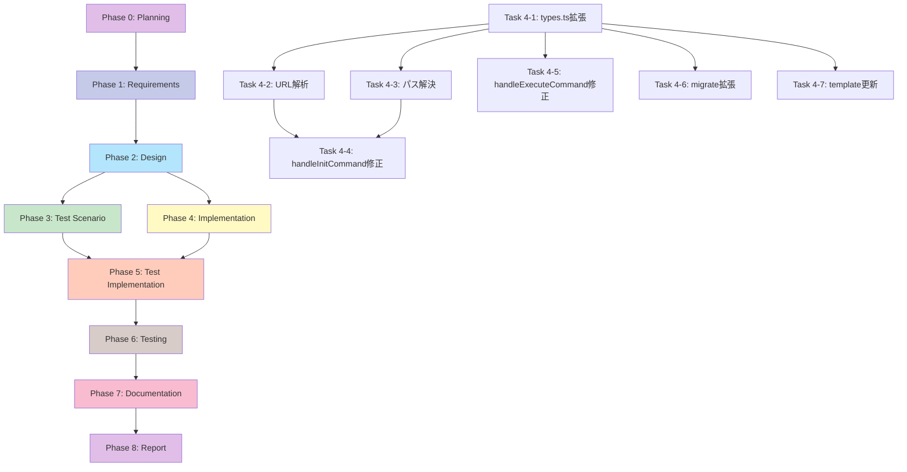

# プロジェクト計画書：AIワークフローv2 マルチリポジトリ対応

**Issue番号**: #369
**タイトル**: [FEATURE] AIワークフローv2: Issue URLから対象リポジトリを自動判定して実行
**作成日**: 2025-01-13
**ワークフローバージョン**: 0.1.0

---

## 1. Issue分析

### 複雑度判定

**中程度 (Medium)**

**判定根拠**:
- **変更範囲**: 5つのファイル（main.ts, types.ts, metadata-manager.ts, workflow-state.ts, git-manager.ts）
- **新規機能追加**: URL解析、リポジトリパス探索、メタデータスキーマ拡張
- **既存機能への影響**: init/executeコマンドの大幅な変更、後方互換性の考慮が必要
- **技術的複雑度**: URL解析、ファイルシステム探索、環境変数処理は標準的
- **リスク**: メタデータマイグレーションの実装が必要、既存ワークフローへの影響を最小限に抑える必要あり

### 見積もり工数

**合計: 12〜16時間**

**工数配分根拠**:
- **Phase 1 (要件定義)**: 1〜2時間 - Issue内容が詳細で明確
- **Phase 2 (設計)**: 2〜3時間 - アーキテクチャ変更の影響範囲分析が必要
- **Phase 3 (テストシナリオ)**: 1〜2時間 - 複数のユースケース（3つ）をカバー
- **Phase 4 (実装)**: 4〜6時間 - 関数の実装とリファクタリング、マイグレーション実装
- **Phase 5 (テストコード実装)**: 2〜3時間 - ユニットテスト + インテグレーションテスト
- **Phase 6 (テスト実行)**: 1時間 - テストの実行と修正
- **Phase 7 (ドキュメント)**: 1時間 - README.md更新とコード内コメント

### リスク評価

**中 (Medium)**

**主要リスク**:
1. **後方互換性リスク (中)**: 既存ワークフロー（Issue #305など）への影響
2. **マイグレーションリスク (中)**: 既存metadata.jsonのスキーマ変更
3. **環境依存リスク (低)**: ローカルリポジトリパスの探索ロジックの信頼性
4. **テスト不足リスク (中)**: マルチリポジトリ環境でのE2Eテストが困難

---

## 2. 実装戦略判断

### 実装戦略: **EXTEND**

**判断根拠**:
- **既存コードの拡張が中心**: `handleInitCommand`と`handleExecuteCommand`の機能拡張
- **新規関数の追加**: `parseIssueUrl()`, `resolveLocalRepoPath()`, `findWorkflowMetadata()`を新規作成
- **既存アーキテクチャの維持**: メタデータ管理、Git管理、フェーズ実行の仕組みは変更なし
- **CREATE要素**: 新規関数は追加するが、全体的には既存コードの拡張
- **REFACTOR要素**: `getRepoRoot()`の置き換えが発生するが、主目的は機能追加

**選択理由**:
既存のワークフローシステムの基本構造は変更せず、Issue URL解析とリポジトリ判定の機能を追加する形で実装するため、EXTENDが最適。

### テスト戦略: **UNIT_INTEGRATION**

**判断根拠**:
- **UNIT_ONLY不適**: 外部システム（ファイルシステム、Git）との連携が必須
- **INTEGRATION_ONLY不適**: URL解析ロジックなど単体でテスト可能な部分が多い
- **BDD_ONLY不適**: エンドユーザー向け機能ではなく、開発者向けツール
- **UNIT_INTEGRATION (選択)**:
  - ユニットテスト: `parseIssueUrl()`, `resolveLocalRepoPath()`などのロジック
  - インテグレーションテスト: 実際のGitリポジトリとファイルシステムを使った動作確認

**選択理由**:
ロジック部分（URL解析、パス探索）と外部システム連携部分（Git操作、ファイル読み書き）の両方をバランスよくテストする必要があるため。

### テストコード戦略: **BOTH_TEST**

**判断根拠**:
- **EXTEND_TEST**: 既存の`main.test.ts`系のテストに追加テストケースを追加
  - 既存の`handleInitCommand`と`handleExecuteCommand`のテストを拡張
  - マルチリポジトリシナリオを追加
- **CREATE_TEST**: 新規テストファイルを作成
  - `tests/unit/repository-resolution.test.ts` - URL解析とパス探索のユニットテスト
  - `tests/integration/multi-repo-workflow.test.ts` - マルチリポジトリワークフローのE2Eテスト

**選択理由**:
既存のコマンドハンドラーのテストは拡張し、新規追加のロジック（URL解析、パス探索）は独立したテストファイルで管理することで、テストの保守性を高める。

---

## 3. 影響範囲分析

### 既存コードへの影響

#### 変更が必要なファイル (5ファイル)

1. **`scripts/ai-workflow-v2/src/main.ts`** (Major Changes)
   - `parseIssueNumber()` → `parseIssueUrl()`に拡張
   - `getRepoRoot()` → `resolveLocalRepoPath()`に置き換え
   - `handleInitCommand()` - Issue URLからリポジトリ情報を抽出し、target_repositoryを設定
   - `handleExecuteCommand()` - メタデータからtarget_repositoryを読み込み
   - 新規関数: `findWorkflowMetadata(issueNumber)` - リポジトリ横断でメタデータを探索

2. **`scripts/ai-workflow-v2/src/types.ts`** (Minor Changes)
   - 新規インターフェース: `TargetRepository`
   - `WorkflowMetadata`インターフェースに`target_repository?`フィールドを追加

3. **`scripts/ai-workflow-v2/src/core/metadata-manager.ts`** (No Changes Required)
   - 影響なし（WorkflowMetadata型の拡張は自動的に反映される）

4. **`scripts/ai-workflow-v2/src/core/workflow-state.ts`** (Minor Changes)
   - `migrate()`メソッドで`target_repository`フィールドの追加をサポート

5. **`scripts/ai-workflow-v2/src/core/git-manager.ts`** (Review Required)
   - コンストラクタで受け取る`repoRoot`がtarget_repository.pathになる
   - 既存の動作に影響がないか確認が必要

#### 間接的な影響を受けるファイル

- **`scripts/ai-workflow-v2/metadata.json.template`**: `target_repository`フィールドをnullで追加
- **`.gitignore`**: 対象リポジトリ側で`.ai-workflow`を無視する設定が必要（ドキュメントで案内）

### 依存関係の変更

#### 新規依存の追加

**なし** - Node.js標準ライブラリ（`path`, `fs`, `os`）とsimple-gitの既存機能のみ使用

#### 既存依存の変更

**なし**

### マイグレーション要否

#### データベーススキーマ変更

**該当なし**

#### 設定ファイル変更

**metadata.json スキーマ拡張**

**変更内容**:
```typescript
interface TargetRepository {
  path: string;              // ローカルパス
  github_name: string;       // owner/repo形式
  remote_url: string;        // Git remote URL
  owner: string;             // リポジトリオーナー
  repo: string;              // リポジトリ名
}

interface WorkflowMetadata {
  // ... 既存フィールド
  repository?: string | null;  // 既存（後方互換性のため保持）
  target_repository?: TargetRepository;  // 新規
}
```

**マイグレーション戦略**:
1. **既存metadata.json**: `target_repository`がnullの場合、現在の`getRepoRoot()`の動作を維持（後方互換性）
2. **新規metadata.json**: init時に自動的に`target_repository`を設定
3. **WorkflowState.migrate()**: `target_repository`フィールドがない場合は追加（null値）

**後方互換性の保証**:
- `repository`フィールドは削除せず保持
- `target_repository`がnullの場合は従来の動作（実行環境のリポジトリを使用）
- 警告メッセージを表示: `[WARNING] target_repository not found in metadata. Using current repository.`

---

## 4. タスク分割

### Phase 1: 要件定義 (見積もり: 1〜2h)

- [x] Task 1-1: 機能要件の明確化 (0.5h)
  - Issue URLからリポジトリ情報抽出の要件定義
  - ローカルパス解決のロジック要件定義
  - 環境変数REPOS_ROOTの仕様確認
- [x] Task 1-2: 受け入れ基準の定義 (0.5h)
  - Case 1: 同一リポジトリ（infrastructure-as-code）の動作確認基準
  - Case 2: 別リポジトリ（my-app）の動作確認基準
  - Case 3: リポジトリが見つからない場合のエラー処理基準
- [x] Task 1-3: 非機能要件の定義 (0.5〜1h)
  - 後方互換性の保証範囲
  - エラーメッセージの明確性
  - パフォーマンス要件（リポジトリ探索の許容時間）

### Phase 2: 設計 (見積もり: 2〜3h)

- [ ] Task 2-1: アーキテクチャ設計 (1h)
  - Issue URL解析フロー設計
  - ローカルリポジトリパス探索アルゴリズム設計
  - メタデータスキーマ拡張設計（TargetRepository型）
- [ ] Task 2-2: 関数インターフェース設計 (0.5h)
  - `parseIssueUrl(issueUrl: string): IssueInfo`
  - `resolveLocalRepoPath(repoName: string): string`
  - `findWorkflowMetadata(issueNumber: string): { repoRoot: string, metadataPath: string }`
- [ ] Task 2-3: エラーハンドリング設計 (0.5h)
  - 無効なIssue URLの処理
  - リポジトリが見つからない場合の処理
  - メタデータが見つからない場合の処理
- [ ] Task 2-4: マイグレーション戦略設計 (0.5〜1h)
  - 既存metadata.jsonの移行方法
  - WorkflowState.migrate()の拡張設計
  - 後方互換性の実装方針

### Phase 3: テストシナリオ (見積もり: 1〜2h)

- [ ] Task 3-1: ユニットテストシナリオ作成 (0.5h)
  - `parseIssueUrl()`のテストケース（正常系、異常系）
  - `resolveLocalRepoPath()`のテストケース（環境変数あり/なし、複数の候補パス）
- [ ] Task 3-2: インテグレーションテストシナリオ作成 (0.5h)
  - Case 1: 同一リポジトリでのワークフロー実行
  - Case 2: 別リポジトリでのワークフロー実行
  - Case 3: リポジトリが見つからない場合のエラー処理
- [ ] Task 3-3: マイグレーションテストシナリオ作成 (0.5〜1h)
  - 既存metadata.json（target_repositoryなし）のマイグレーション
  - 新規metadata.json（target_repositoryあり）の作成
  - 後方互換性の確認

### Phase 4: 実装 (見積もり: 4〜6h)

- [ ] Task 4-1: types.ts の拡張 (0.5h)
  - `TargetRepository`インターフェースの追加
  - `WorkflowMetadata`に`target_repository?`フィールド追加
- [ ] Task 4-2: URL解析機能の実装 (1h)
  - `parseIssueUrl(issueUrl: string): IssueInfo`の実装
  - 正規表現によるGitHub Issue URL解析
  - バリデーション処理
- [ ] Task 4-3: ローカルリポジトリパス解決機能の実装 (1〜1.5h)
  - `resolveLocalRepoPath(repoName: string): string`の実装
  - 環境変数REPOS_ROOTのチェック
  - 複数の候補パスを探索するロジック
  - エラーハンドリング（リポジトリが見つからない場合）
- [ ] Task 4-4: handleInitCommand の修正 (1h)
  - `parseIssueUrl()`の呼び出し
  - `resolveLocalRepoPath()`の呼び出し
  - `target_repository`フィールドの設定
  - .ai-workflowディレクトリを対象リポジトリ配下に作成
- [ ] Task 4-5: handleExecuteCommand の修正 (0.5h)
  - メタデータから`target_repository`を読み込み
  - 後方互換性のための警告メッセージ追加
  - workingDirの設定を`target_repository.path`に変更
- [ ] Task 4-6: WorkflowState.migrate() の拡張 (0.5h)
  - `target_repository`フィールドの追加処理
  - テンプレートとの整合性確認
- [ ] Task 4-7: metadata.json.template の更新 (0.5h)
  - `target_repository`フィールドをnullで追加

### Phase 5: テストコード実装 (見積もり: 2〜3h)

- [ ] Task 5-1: ユニットテスト実装 (1〜1.5h)
  - `tests/unit/repository-resolution.test.ts`の作成
  - `parseIssueUrl()`のテストケース実装
  - `resolveLocalRepoPath()`のテストケース実装（モック使用）
- [ ] Task 5-2: インテグレーションテスト実装 (1〜1.5h)
  - `tests/integration/multi-repo-workflow.test.ts`の作成
  - テスト用の一時Gitリポジトリのセットアップ
  - Case 1, 2, 3のテストケース実装
  - テストフィクスチャのクリーンアップ

### Phase 6: テスト実行 (見積もり: 1h)

- [ ] Task 6-1: ユニットテスト実行 (0.5h)
  - `npm test -- repository-resolution.test.ts`の実行
  - テスト失敗時の修正
- [ ] Task 6-2: インテグレーションテスト実行 (0.5h)
  - `npm test -- multi-repo-workflow.test.ts`の実行
  - テスト失敗時の修正
  - 既存テストの回帰テスト実行

### Phase 7: ドキュメント (見積もり: 1h)

- [ ] Task 7-1: README.md の更新 (0.5h)
  - 環境変数REPOS_ROOTの説明追加
  - マルチリポジトリ対応の使用例追加
  - .gitignoreへの`.ai-workflow`追加案内
- [ ] Task 7-2: コード内コメントの追加 (0.5h)
  - `parseIssueUrl()`のJSDoc追加
  - `resolveLocalRepoPath()`のJSDoc追加
  - `findWorkflowMetadata()`のJSDoc追加

### Phase 8: レポート (見積もり: 0.5h)

- [ ] Task 8-1: 実装完了レポートの作成 (0.5h)
  - 実装内容のサマリー
  - テスト結果のサマリー
  - 後方互換性の確認結果
  - 既知の制約事項の記載

---

## 5. 依存関係



**重要な依存関係**:
- Phase 2 (設計) は Phase 4 (実装) と Phase 3 (テストシナリオ) に並列分岐
- Phase 4内では、Task 4-1 (types.ts拡張) がすべてのタスクの前提条件
- Phase 5 (テストコード実装) は Phase 3 と Phase 4 の両方に依存
- Phase 6 (テスト実行) は Phase 5 完了後のみ実行可能

---

## 6. リスクと軽減策

### リスク1: 後方互換性の破壊

- **影響度**: 高
- **確率**: 中
- **軽減策**:
  1. `repository`フィールドを削除せず保持
  2. `target_repository`がnullの場合は従来の動作を維持
  3. 警告メッセージで移行を促す
  4. 既存のissue-305などで回帰テストを実施
  5. Phase 6で後方互換性テストケースを必須実行

### リスク2: ローカルリポジトリパス探索の失敗

- **影響度**: 中
- **確率**: 中
- **軽減策**:
  1. 環境変数REPOS_ROOTで明示的に指定可能にする
  2. 複数の候補パスを順番に探索する
  3. 明確なエラーメッセージを提供（「リポジトリが見つかりません。REPOS_ROOTを設定するか、リポジトリをクローンしてください」）
  4. デバッグ用のverboseモード追加を検討

### リスク3: メタデータマイグレーションの失敗

- **影響度**: 中
- **確率**: 低
- **軽減策**:
  1. `WorkflowState.migrate()`メソッドを慎重に実装
  2. マイグレーション前に自動バックアップを作成
  3. Phase 5でマイグレーションテストケースを必須実装
  4. rollback機能の存在を確認（既存実装あり）

### リスク4: Issue URL形式の多様性

- **影響度**: 低
- **確率**: 中
- **軽減策**:
  1. 正規表現を柔軟に設計（末尾スラッシュの有無など）
  2. Phase 3で複数のURL形式をテストケースに含める
  3. バリデーションエラー時に具体的な期待形式を提示

### リスク5: Windowsパス対応

- **影響度**: 中
- **確率**: 低（開発環境がWindows）
- **軽減策**:
  1. `path.join()`などNode.js標準のパス処理APIを使用
  2. バックスラッシュとスラッシュの両方に対応
  3. Windowsでのインテグレーションテスト実施（Phase 6）

### リスク6: 環境変数REPOS_ROOTの設定漏れ

- **影響度**: 低
- **確率**: 中
- **軽減策**:
  1. REPOS_ROOTが未設定でも複数の候補パスを自動探索
  2. ドキュメントで推奨設定を明記
  3. Jenkins環境ではJenkinsfileで自動設定

---

## 7. 品質ゲート

### Phase 1: 要件定義

- [ ] 機能要件が明確に記載されている（URL解析、パス探索、メタデータ拡張）
- [ ] 受け入れ基準が定義されている（Case 1, 2, 3）
- [ ] 後方互換性の要件が明確である
- [ ] 非機能要件（パフォーマンス、エラーメッセージ）が定義されている

### Phase 2: 設計

- [ ] 実装戦略の判断根拠が明記されている（EXTEND）
- [ ] テスト戦略の判断根拠が明記されている（UNIT_INTEGRATION）
- [ ] テストコード戦略の判断根拠が明記されている（BOTH_TEST）
- [ ] 関数インターフェースが明確に設計されている
- [ ] メタデータスキーマ拡張が設計されている
- [ ] エラーハンドリング戦略が定義されている
- [ ] マイグレーション戦略が設計されている

### Phase 3: テストシナリオ

- [ ] ユニットテストのテストケースが網羅的である（正常系、異常系）
- [ ] インテグレーションテストのシナリオが3つのCaseをカバーしている
- [ ] マイグレーションテストシナリオが定義されている
- [ ] 後方互換性のテストシナリオが含まれている
- [ ] Windowsパス対応のテストケースが含まれている

### Phase 4: 実装

- [ ] `TargetRepository`型が定義されている
- [ ] `parseIssueUrl()`が実装され、正規表現によるURL解析が動作する
- [ ] `resolveLocalRepoPath()`が実装され、環境変数とフォールバック探索が動作する
- [ ] `handleInitCommand()`が`target_repository`を設定する
- [ ] `handleExecuteCommand()`が`target_repository`からパスを読み込む
- [ ] `WorkflowState.migrate()`が`target_repository`フィールドを追加する
- [ ] `metadata.json.template`が更新されている
- [ ] 後方互換性のための警告メッセージが実装されている

### Phase 5: テストコード実装

- [ ] `tests/unit/repository-resolution.test.ts`が作成されている
- [ ] `tests/integration/multi-repo-workflow.test.ts`が作成されている
- [ ] 既存テストが拡張されている（main-preset-resolution.test.ts等）
- [ ] モックとテストフィクスチャが適切に使用されている
- [ ] テストカバレッジが80%以上である

### Phase 6: テスト実行

- [ ] すべてのユニットテストがパスしている
- [ ] すべてのインテグレーションテストがパスしている
- [ ] 既存テストの回帰テストがパスしている
- [ ] 後方互換性テストがパスしている
- [ ] Windowsパス対応が確認されている

### Phase 7: ドキュメント

- [ ] README.mdに環境変数REPOS_ROOTの説明が追加されている
- [ ] README.mdにマルチリポジトリ対応の使用例が追加されている
- [ ] .gitignoreへの`.ai-workflow`追加案内が記載されている
- [ ] JSDocコメントが追加されている（parseIssueUrl, resolveLocalRepoPath, findWorkflowMetadata）
- [ ] ドキュメントの表現が明確で曖昧さがない

### Phase 8: レポート

- [ ] 実装内容のサマリーが記載されている
- [ ] テスト結果のサマリーが記載されている
- [ ] 後方互換性の確認結果が記載されている
- [ ] 既知の制約事項（リポジトリが.git持つ必要あり等）が記載されている
- [ ] 次のフェーズ（Phase 1）へのブロッカーがない

---

## 8. 成功基準

### 機能的成功基準

1. **Issue URLから正しくリポジトリ情報を抽出できる**
   - `https://github.com/tielec/my-app/issues/123` → `{ owner: "tielec", repo: "my-app", issueNumber: 123 }`

2. **ローカルリポジトリパスを正しく解決できる**
   - 環境変数REPOS_ROOTが設定されている場合: `$REPOS_ROOT/my-app`
   - 環境変数がない場合: 候補パスから探索（`~/TIELEC/development/my-app`等）

3. **対象リポジトリ配下に.ai-workflowディレクトリが作成される**
   - `C:\Users\ytaka\TIELEC\development\my-app/.ai-workflow/issue-123/`

4. **メタデータにtarget_repositoryが正しく保存される**
   ```json
   {
     "target_repository": {
       "path": "C:\\Users\\ytaka\\TIELEC\\development\\my-app",
       "github_name": "tielec/my-app",
       "remote_url": "https://github.com/tielec/my-app.git",
       "owner": "tielec",
       "repo": "my-app"
     }
   }
   ```

5. **後方互換性が保たれている**
   - 既存のissue-305などのワークフローが正常に動作する
   - `target_repository`がnullの場合、従来の動作を維持

### 非機能的成功基準

1. **パフォーマンス**: リポジトリパス探索が2秒以内に完了
2. **エラーメッセージ**: ユーザーが問題を理解し対処できる明確なメッセージ
3. **テストカバレッジ**: 80%以上
4. **ドキュメント品質**: 初見のユーザーが設定方法を理解できる

---

## 9. 備考

### 技術的な考慮事項

1. **環境変数REPOS_ROOT**
   - Jenkins環境では環境変数として設定
   - ローカル開発では`.env`ファイルまたはシェルのRC設定で管理

2. **Windowsパス対応**
   - バックスラッシュとスラッシュの混在を許容
   - `path.join()`と`path.resolve()`を適切に使用

3. **複数リポジトリの並行実行**
   - 各リポジトリ配下の`.ai-workflow`ディレクトリで完全に独立管理
   - メタデータの衝突リスクなし

### 制約事項

1. **Gitリポジトリ必須**: ローカルパスに`.git`ディレクトリが存在することが前提
2. **GitHub専用**: 現時点ではGitHub以外のサービス（GitLab、Bitbucket等）は非サポート
3. **リポジトリ名の一意性**: 同名の異なるリポジトリがある場合、環境変数REPOS_ROOTでの明示が必要

### 次のステップ

Phase 1（要件定義）に進むための条件:
- [ ] このプロジェクト計画書がレビューされ、承認されている
- [ ] ブロッカーリスクが識別され、軽減策が合意されている
- [ ] Phase 1の実行者が割り当てられている

---

**計画書承認日**: (Review Phase完了後に記入)
**承認者**: (Review Phaseで記入)
