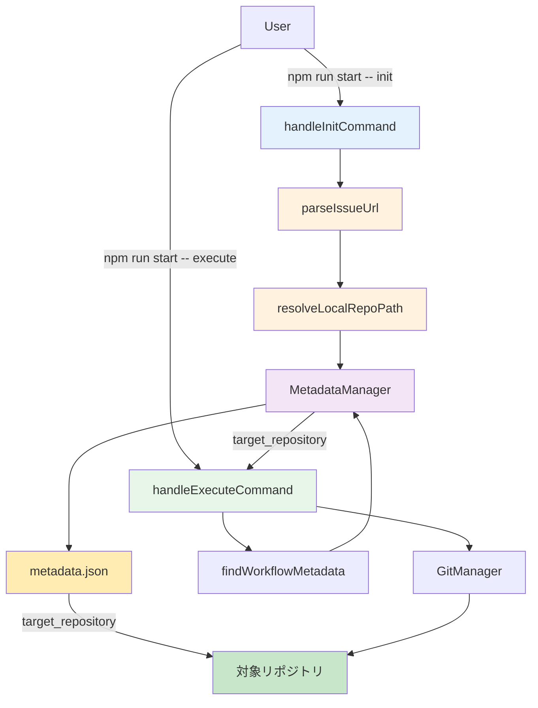

# 詳細設計書：AIワークフローv2 マルチリポジトリ対応

**Issue番号**: #369
**タイトル**: [FEATURE] AIワークフローv2: Issue URLから対象リポジトリを自動判定して実行
**作成日**: 2025-01-13
**ワークフローバージョン**: 0.1.0

---

## 0. Planning Documentの確認

Planning Phase（Issue #369-00_planning）で策定された開発計画を確認し、以下の戦略に基づいて詳細設計を実施します：

### 開発戦略サマリー

- **実装戦略**: EXTEND（既存コードの拡張が中心）
- **テスト戦略**: UNIT_INTEGRATION（ロジック部分と外部システム連携の両方をテスト）
- **テストコード戦略**: BOTH_TEST（既存テスト拡張 + 新規テストファイル作成）
- **複雑度**: 中程度（Medium）
- **見積もり工数**: 12〜16時間
- **主要リスク**: 後方互換性、メタデータマイグレーション、リポジトリパス探索の失敗

---

## 1. アーキテクチャ設計

### 1.1 システム全体像

```
┌─────────────────────────────────────────────────────────────┐
│                      AIワークフローv2                         │
│                     (TypeScript実装)                          │
└─────────────────────────────────────────────────────────────┘
                               │
                ┌──────────────┴─────────────┐
                │                            │
         ┌──────▼──────┐            ┌──────▼──────┐
         │ init コマンド │            │execute コマンド│
         │             │            │             │
         │ Issue URLを │            │ メタデータから│
         │ 解析・判定   │            │ リポジトリ情報│
         │             │            │ を読み込み    │
         └──────┬──────┘            └──────┬──────┘
                │                          │
                │                          │
    ┌───────────▼──────────────────────────▼───────────┐
    │                                                   │
    │            parseIssueUrl()                        │
    │    Issue URLからリポジトリ情報を抽出              │
    │    (owner, repo, issueNumber)                     │
    │                                                   │
    └───────────┬───────────────────────────────────────┘
                │
    ┌───────────▼───────────────────────────────────────┐
    │                                                   │
    │       resolveLocalRepoPath()                      │
    │    リポジトリ名からローカルパスを解決              │
    │    1. 環境変数REPOS_ROOT                          │
    │    2. 候補パス探索                                │
    │                                                   │
    └───────────┬───────────────────────────────────────┘
                │
    ┌───────────▼───────────────────────────────────────┐
    │                                                   │
    │       findWorkflowMetadata()                      │
    │    Issue番号から対応するメタデータを探索           │
    │    (execute時)                                    │
    │                                                   │
    └───────────┬───────────────────────────────────────┘
                │
    ┌───────────▼───────────────────────────────────────┐
    │                                                   │
    │         metadata.json                             │
    │    target_repository フィールドに保存             │
    │    { path, github_name, remote_url, owner, repo } │
    │                                                   │
    └───────────────────────────────────────────────────┘
                │
    ┌───────────▼───────────────────────────────────────┐
    │                                                   │
    │   .ai-workflow/issue-{number}/                    │
    │   対象リポジトリ配下に作成                         │
    │   (例: my-app/.ai-workflow/issue-123/)            │
    │                                                   │
    └───────────────────────────────────────────────────┘
```

### 1.2 コンポーネント間の関係



### 1.3 データフロー

#### init コマンドのデータフロー

```
1. User Input
   ↓
   Issue URL: https://github.com/tielec/my-app/issues/123
   ↓
2. parseIssueUrl()
   ↓
   { owner: "tielec", repo: "my-app", issueNumber: 123, repositoryName: "tielec/my-app" }
   ↓
3. resolveLocalRepoPath("my-app")
   ↓
   環境変数REPOS_ROOT確認 → $REPOS_ROOT/my-app
   または
   候補パス探索 → ~/TIELEC/development/my-app
   ↓
   repoRoot: "C:\Users\ytaka\TIELEC\development\my-app"
   ↓
4. MetadataManager
   ↓
   metadata.json に target_repository を追加
   {
     "target_repository": {
       "path": "C:\\Users\\ytaka\\TIELEC\\development\\my-app",
       "github_name": "tielec/my-app",
       "remote_url": "https://github.com/tielec/my-app.git",
       "owner": "tielec",
       "repo": "my-app"
     }
   }
   ↓
5. GitManager
   ↓
   対象リポジトリでGit操作（コミット・プッシュ）
   ↓
6. GitHubClient
   ↓
   Draft PR作成（対象リポジトリ）
```

#### execute コマンドのデータフロー

```
1. User Input
   ↓
   Issue Number: 123
   ↓
2. findWorkflowMetadata(issueNumber)
   ↓
   探索パス:
   - $REPOS_ROOT/*/​.ai-workflow/issue-123/metadata.json
   - ~/TIELEC/development/*/​.ai-workflow/issue-123/metadata.json
   - ~/projects/*/​.ai-workflow/issue-123/metadata.json
   ↓
   { repoRoot: "C:\Users\ytaka\TIELEC\development\my-app",
     metadataPath: "C:\Users\ytaka\TIELEC\development\my-app\.ai-workflow\issue-123\metadata.json" }
   ↓
3. MetadataManager.load(metadataPath)
   ↓
   target_repository を取得
   ↓
4. PhaseContext
   ↓
   workingDir = target_repository.path
   ↓
5. Phase実行
   ↓
   対象リポジトリで各フェーズを実行
```

---

## 2. 実装戦略の判断

### 実装戦略: EXTEND

**判断根拠**:

1. **既存コードの拡張が中心**:
   - `handleInitCommand()`と`handleExecuteCommand()`の機能拡張
   - 既存の関数`parseIssueNumber()`を`parseIssueUrl()`に拡張
   - 既存の関数`getRepoRoot()`を`resolveLocalRepoPath()`に置き換え

2. **新規関数の追加**:
   - `parseIssueUrl()`: URL解析機能（既存`parseIssueNumber()`を拡張）
   - `resolveLocalRepoPath()`: ローカルパス解決（既存`getRepoRoot()`を置き換え）
   - `findWorkflowMetadata()`: メタデータ探索（新規）

3. **既存アーキテクチャの維持**:
   - メタデータ管理（MetadataManager）: 変更なし
   - Git管理（GitManager）: 変更なし
   - GitHub連携（GitHubClient）: 変更なし
   - フェーズ実行: 変更なし

4. **CREATE要素**:
   - 新規関数は追加するが、全体的には既存コードの拡張

5. **REFACTOR要素**:
   - `getRepoRoot()`の置き換えが発生するが、主目的は機能追加

**選択理由**: 既存のワークフローシステムの基本構造は変更せず、Issue URL解析とリポジトリ判定の機能を追加する形で実装するため、EXTENDが最適。

---

## 3. テスト戦略の判断

### テスト戦略: UNIT_INTEGRATION

**判断根拠**:

1. **UNIT_ONLY不適**:
   - 外部システム（ファイルシステム、Git）との連携が必須
   - ローカルリポジトリパスの探索は実際のファイルシステムで検証が必要

2. **INTEGRATION_ONLY不適**:
   - URL解析ロジックなど単体でテスト可能な部分が多い
   - `parseIssueUrl()`の正規表現テストはユニットテストが効率的

3. **BDD_ONLY不適**:
   - エンドユーザー向け機能ではなく、開発者向けツール
   - ユーザーストーリーよりも技術的な動作確認が重要

4. **UNIT_INTEGRATION（選択）**:
   - **ユニットテスト**:
     - `parseIssueUrl()`: URL解析ロジック、正規表現、バリデーション
     - `resolveLocalRepoPath()`: 環境変数チェック、候補パス探索ロジック（モック使用）
   - **インテグレーションテスト**:
     - 実際のGitリポジトリとファイルシステムを使った動作確認
     - Case 1, 2, 3のテストケース（同一リポジトリ、別リポジトリ、見つからない場合）

**選択理由**: ロジック部分（URL解析、パス探索）と外部システム連携部分（Git操作、ファイル読み書き）の両方をバランスよくテストする必要があるため。

---

## 4. テストコード戦略の判断

### テストコード戦略: BOTH_TEST

**判断根拠**:

1. **EXTEND_TEST**: 既存の`main.test.ts`系のテストに追加テストケースを追加
   - 既存の`handleInitCommand`と`handleExecuteCommand`のテストを拡張
   - マルチリポジトリシナリオを追加

2. **CREATE_TEST**: 新規テストファイルを作成
   - `tests/unit/repository-resolution.test.ts` - URL解析とパス探索のユニットテスト
   - `tests/integration/multi-repo-workflow.test.ts` - マルチリポジトリワークフローのE2Eテスト

**選択理由**: 既存のコマンドハンドラーのテストは拡張し、新規追加のロジック（URL解析、パス探索）は独立したテストファイルで管理することで、テストの保守性を高める。

---

## 5. 影響範囲分析

### 5.1 既存コードへの影響

#### 変更が必要なファイル（5ファイル）

1. **`scripts/ai-workflow-v2/src/main.ts`** (Major Changes)
   - `parseIssueNumber()` → `parseIssueUrl()`に拡張（行693-699）
   - `getRepoRoot()` → `resolveLocalRepoPath()`に置き換え（行653-661）
   - `handleInitCommand()` - Issue URLからリポジトリ情報を抽出し、target_repositoryを設定（行143-248）
   - `handleExecuteCommand()` - メタデータからtarget_repositoryを読み込み（行250-527）
   - 新規関数: `findWorkflowMetadata(issueNumber)` - リポジトリ横断でメタデータを探索

2. **`scripts/ai-workflow-v2/src/types.ts`** (Minor Changes)
   - 新規インターフェース: `TargetRepository`（行57の後に追加）
   - `WorkflowMetadata`インターフェースに`target_repository?`フィールドを追加（行74の後に追加）

3. **`scripts/ai-workflow-v2/src/core/metadata-manager.ts`** (No Changes Required)
   - 影響なし（WorkflowMetadata型の拡張は自動的に反映される）

4. **`scripts/ai-workflow-v2/src/core/workflow-state.ts`** (Minor Changes)
   - `migrate()`メソッドで`target_repository`フィールドの追加をサポート（行118-196）

5. **`scripts/ai-workflow-v2/src/core/git-manager.ts`** (Review Required)
   - コンストラクタで受け取る`repoRoot`がtarget_repository.pathになる（行46-60）
   - 既存の動作に影響がないか確認が必要

#### 間接的な影響を受けるファイル

- **`scripts/ai-workflow-v2/metadata.json.template`**: `target_repository`フィールドをnullで追加
- **`.gitignore`**: 対象リポジトリ側で`.ai-workflow`を無視する設定が必要（ドキュメントで案内）

### 5.2 依存関係の変更

#### 新規依存の追加

**なし** - Node.js標準ライブラリ（`path`, `fs`, `os`）とsimple-gitの既存機能のみ使用

#### 既存依存の変更

**なし**

### 5.3 マイグレーション要否

#### データベーススキーマ変更

**該当なし**

#### 設定ファイル変更

**metadata.json スキーマ拡張**

**変更内容**:
```typescript
interface TargetRepository {
  path: string;              // ローカルパス
  github_name: string;       // owner/repo形式
  remote_url: string;        // Git remote URL
  owner: string;             // リポジトリオーナー
  repo: string;              // リポジトリ名
}

interface WorkflowMetadata {
  // ... 既存フィールド
  repository?: string | null;  // 既存（後方互換性のため保持）
  target_repository?: TargetRepository;  // 新規
}
```

**マイグレーション戦略**:
1. **既存metadata.json**: `target_repository`がnullの場合、現在の`getRepoRoot()`の動作を維持（後方互換性）
2. **新規metadata.json**: init時に自動的に`target_repository`を設定
3. **WorkflowState.migrate()**: `target_repository`フィールドがない場合は追加（null値）

**後方互換性の保証**:
- `repository`フィールドは削除せず保持
- `target_repository`がnullの場合は従来の動作（実行環境のリポジトリを使用）
- 警告メッセージを表示: `[WARNING] target_repository not found in metadata. Using current repository.`

---

## 6. 変更・追加ファイルリスト

### 6.1 新規作成ファイル

#### テストファイル
1. `scripts/ai-workflow-v2/tests/unit/repository-resolution.test.ts` - URL解析とパス探索のユニットテスト
2. `scripts/ai-workflow-v2/tests/integration/multi-repo-workflow.test.ts` - マルチリポジトリワークフローのE2Eテスト

### 6.2 修正が必要な既存ファイル

#### ソースコード
1. `scripts/ai-workflow-v2/src/main.ts`
2. `scripts/ai-workflow-v2/src/types.ts`
3. `scripts/ai-workflow-v2/src/core/workflow-state.ts`

#### 設定ファイル
4. `scripts/ai-workflow-v2/metadata.json.template`

#### ドキュメント
5. `scripts/ai-workflow-v2/README.md` - 使用例と環境変数の説明を追加

#### Jenkins設定（オプション）
6. `jenkins/jobs/pipeline/ai-workflow/ai-workflow-orchestrator/Jenkinsfile` - 環境変数REPOS_ROOTの設定

### 6.3 削除が必要なファイル

**なし**

---

## 7. 詳細設計

### 7.1 関数設計

#### 7.1.1 `parseIssueUrl(issueUrl: string): IssueInfo`

**目的**: GitHub Issue URLからリポジトリ情報を抽出

**入力**:
- `issueUrl` (string): GitHub Issue URL
  - 例: `https://github.com/tielec/my-app/issues/123`
  - 末尾スラッシュあり/なし両方に対応

**出力**:
```typescript
interface IssueInfo {
  owner: string;            // リポジトリオーナー（例: tielec）
  repo: string;             // リポジトリ名（例: my-app）
  issueNumber: number;      // Issue番号（例: 123）
  repositoryName: string;   // owner/repo形式（例: tielec/my-app）
}
```

**処理フロー**:
1. 正規表現によるURL解析: `github\.com\/([^\/]+)\/([^\/]+)\/issues\/(\d+)`
2. マッチしない場合はエラーをthrow
3. owner、repo、issueNumberを抽出
4. repositoryNameを`${owner}/${repo}`形式で生成

**エラーハンドリング**:
- 無効なURL形式: `Invalid GitHub Issue URL: ${issueUrl}`
- GitHub以外のURL: 正規表現でマッチしない
- プルリクエストURL: 正規表現でマッチしない（issuesパスのみ）

**実装場所**: `scripts/ai-workflow-v2/src/main.ts`（行693-699を置き換え）

---

#### 7.1.2 `resolveLocalRepoPath(repoName: string): string`

**目的**: リポジトリ名からローカルパスを解決

**入力**:
- `repoName` (string): リポジトリ名（例: my-app）

**出力**:
- `string`: ローカルリポジトリパス（例: `C:\Users\ytaka\TIELEC\development\my-app`）

**処理フロー**:
1. 環境変数`REPOS_ROOT`が設定されている場合:
   - `path.join(REPOS_ROOT, repoName)`を候補とする
   - `.git`ディレクトリが存在するか確認
   - 存在する場合は即座にリターン

2. 環境変数が未設定または候補が見つからない場合:
   - 以下の候補パスを順番に探索:
     - `path.join(os.homedir(), 'TIELEC', 'development', repoName)`
     - `path.join(os.homedir(), 'projects', repoName)`
     - `path.join(process.cwd(), '..', repoName)`
   - 各候補について:
     - ディレクトリが存在するか確認
     - `.git`ディレクトリが存在するか確認
     - 両方存在する場合はそのパスをリターン

3. すべての候補で見つからない場合:
   - エラーをthrow

**エラーハンドリング**:
- リポジトリが見つからない:
  ```
  [ERROR] Repository '${repoName}' not found.
          Please set REPOS_ROOT environment variable or clone the repository.
  ```

**Windowsパス対応**:
- `path.join()`を使用してOSに依存しないパス処理
- バックスラッシュとスラッシュの混在を許容

**実装場所**: `scripts/ai-workflow-v2/src/main.ts`（新規関数、行653の後に追加）

---

#### 7.1.3 `findWorkflowMetadata(issueNumber: string): Promise<{ repoRoot: string; metadataPath: string }>`

**目的**: Issue番号から対応するメタデータを探索（execute時）

**入力**:
- `issueNumber` (string): Issue番号（例: "123"）

**出力**:
```typescript
{
  repoRoot: string;        // リポジトリルートパス
  metadataPath: string;    // metadata.jsonの絶対パス
}
```

**処理フロー**:
1. 探索ルートの決定:
   - 環境変数`REPOS_ROOT`が設定されている場合: `[REPOS_ROOT]`
   - 環境変数が未設定の場合: `[~/TIELEC/development, ~/projects, process.cwd()/..]`

2. 各探索ルート配下のリポジトリを列挙:
   - `fs.readdirSync(searchRoot)`でディレクトリ一覧を取得
   - 各ディレクトリが`.git`ディレクトリを持つか確認

3. 各リポジトリ配下のメタデータを探索:
   - パス: `${repoRoot}/.ai-workflow/issue-${issueNumber}/metadata.json`
   - ファイルが存在する場合: `{ repoRoot, metadataPath }`をリターン

4. すべての候補で見つからない場合:
   - エラーをthrow: `[ERROR] Workflow metadata for issue ${issueNumber} not found.`

**エラーハンドリング**:
- メタデータが見つからない:
  ```
  [ERROR] Workflow metadata for issue ${issueNumber} not found.
          Please run init first or check the issue number.
  ```

**実装場所**: `scripts/ai-workflow-v2/src/main.ts`（新規関数、行660の後に追加）

---

### 7.2 データ構造設計

#### 7.2.1 TargetRepository インターフェース

```typescript
/**
 * 対象リポジトリ情報
 */
export interface TargetRepository {
  /**
   * ローカルパス
   * 例: "C:\\Users\\ytaka\\TIELEC\\development\\my-app"
   */
  path: string;

  /**
   * GitHubリポジトリ名（owner/repo形式）
   * 例: "tielec/my-app"
   */
  github_name: string;

  /**
   * Git remote URL
   * 例: "https://github.com/tielec/my-app.git"
   */
  remote_url: string;

  /**
   * リポジトリオーナー
   * 例: "tielec"
   */
  owner: string;

  /**
   * リポジトリ名
   * 例: "my-app"
   */
  repo: string;
}
```

**実装場所**: `scripts/ai-workflow-v2/src/types.ts`（行57の後に追加）

---

#### 7.2.2 IssueInfo インターフェース

```typescript
/**
 * Issue URL解析結果
 */
interface IssueInfo {
  /**
   * リポジトリオーナー
   * 例: "tielec"
   */
  owner: string;

  /**
   * リポジトリ名
   * 例: "my-app"
   */
  repo: string;

  /**
   * Issue番号
   * 例: 123
   */
  issueNumber: number;

  /**
   * リポジトリ名（owner/repo形式）
   * 例: "tielec/my-app"
   */
  repositoryName: string;
}
```

**実装場所**: `scripts/ai-workflow-v2/src/main.ts`（内部型定義、行30の後に追加）

---

#### 7.2.3 WorkflowMetadata インターフェース拡張

```typescript
export interface WorkflowMetadata {
  issue_number: string;
  issue_url: string;
  issue_title: string;
  repository?: string | null;              // 既存（後方互換性のため保持）
  target_repository?: TargetRepository;    // 新規
  workflow_version: string;
  current_phase: PhaseName;
  design_decisions: DesignDecisions;
  cost_tracking: CostTracking;
  phases: PhasesMetadata;
  pr_number?: number | null;
  pr_url?: string | null;
  branch_name?: string | null;
  github_integration?: {
    progress_comment_id?: number;
    progress_comment_url?: string;
  };
  external_documents?: Record<string, string>;
  created_at: string;
  updated_at: string;
}
```

**変更点**:
- `target_repository?: TargetRepository` を追加（行74の後）

**実装場所**: `scripts/ai-workflow-v2/src/types.ts`（行57-77を修正）

---

### 7.3 インターフェース設計

#### 7.3.1 handleInitCommand() の修正

**変更前**:
```typescript
async function handleInitCommand(issueUrl: string): Promise<void> {
  const issueNumber = parseIssueNumber(issueUrl);
  const repoRoot = await getRepoRoot();
  // ...
}
```

**変更後**:
```typescript
async function handleInitCommand(issueUrl: string): Promise<void> {
  // Issue URLをパース
  let issueInfo: IssueInfo;
  try {
    issueInfo = parseIssueUrl(issueUrl);
  } catch (error) {
    console.error(`[ERROR] ${(error as Error).message}`);
    process.exit(1);
  }

  const { owner, repo, issueNumber, repositoryName } = issueInfo;

  // ローカルリポジトリパスを解決
  let repoRoot: string;
  try {
    repoRoot = resolveLocalRepoPath(repo);
    console.info(`[INFO] Target repository: ${repositoryName}`);
    console.info(`[INFO] Local path: ${repoRoot}`);
  } catch (error) {
    console.error(`[ERROR] ${(error as Error).message}`);
    process.exit(1);
  }

  // ワークフローディレクトリ作成（対象リポジトリ配下）
  const workflowDir = path.join(repoRoot, '.ai-workflow', `issue-${issueNumber}`);
  const metadataPath = path.join(workflowDir, 'metadata.json');
  const branchName = `ai-workflow/issue-${issueNumber}`;

  await ensureBranch(repoRoot, branchName, workflowDir);

  fs.ensureDirSync(workflowDir);

  if (fs.existsSync(metadataPath)) {
    console.info('[INFO] Workflow already exists. Migrating metadata schema if required...');
    const state = WorkflowState.load(metadataPath);
    const migrated = state.migrate();
    const metadataManager = new MetadataManager(metadataPath);
    metadataManager.data.branch_name = branchName;
    metadataManager.data.repository = repositoryName;
    metadataManager.data.target_repository = {
      path: repoRoot,
      github_name: repositoryName,
      remote_url: `https://github.com/${repositoryName}.git`,
      owner,
      repo,
    };
    metadataManager.save();
    console.info(
      migrated
        ? '[OK] Metadata schema updated successfully.'
        : '[INFO] Metadata schema already up to date.',
    );
    return;
  }

  console.info('[INFO] Creating metadata...');
  WorkflowState.createNew(
    metadataPath,
    String(issueNumber),
    issueUrl,
    `Issue #${issueNumber}`,
  );

  const metadataManager = new MetadataManager(metadataPath);

  metadataManager.data.branch_name = branchName;
  metadataManager.data.repository = repositoryName;
  metadataManager.data.target_repository = {
    path: repoRoot,
    github_name: repositoryName,
    remote_url: `https://github.com/${repositoryName}.git`,
    owner,
    repo,
  };
  metadataManager.save();

  // 既存のGit操作、PR作成処理は変更なし
  // ...
}
```

**主な変更点**:
1. `parseIssueNumber()` → `parseIssueUrl()`に変更
2. `getRepoRoot()` → `resolveLocalRepoPath()`に変更
3. `target_repository`フィールドをメタデータに設定
4. エラーハンドリング強化

---

#### 7.3.2 handleExecuteCommand() の修正

**変更前**:
```typescript
async function handleExecuteCommand(options: any): Promise<void> {
  // ...
  const repoRoot = await getRepoRoot();
  const metadataPath = path.join(repoRoot, '.ai-workflow', `issue-${issueNumber}`, 'metadata.json');
  // ...
  const workingDir = repoRoot;
  // ...
}
```

**変更後**:
```typescript
async function handleExecuteCommand(options: any): Promise<void> {
  const issueNumber = String(options.issue);
  const phaseOption: string = (options.phase ?? 'all').toLowerCase();
  const presetOption: string | undefined = options.preset;
  const skipDependencyCheck = Boolean(options.skipDependencyCheck);
  const ignoreDependencies = Boolean(options.ignoreDependencies);
  const forceReset = Boolean(options.forceReset);

  // ... バリデーション処理（既存と同じ）

  // メタデータからリポジトリ情報を取得
  const { repoRoot, metadataPath } = await findWorkflowMetadata(issueNumber);

  if (!fs.existsSync(metadataPath)) {
    console.error('Error: Workflow not found. Run init first.');
    process.exit(1);
  }

  let metadataManager = new MetadataManager(metadataPath);

  // メタデータから対象リポジトリ情報を取得
  const targetRepo = metadataManager.data.target_repository;
  if (targetRepo) {
    console.info(`[INFO] Target repository: ${targetRepo.github_name}`);
    console.info(`[INFO] Local path: ${targetRepo.path}`);
  } else {
    // 後方互換性: target_repositoryが存在しない場合は現在のリポジトリを使用
    console.warn('[WARNING] target_repository not found in metadata. Using current repository.');
  }

  // ... 既存の処理（options.gitUser, options.gitEmailなど）

  const workingDir = targetRepo?.path ?? repoRoot;

  // ... 既存のAgent設定、GitHub設定など

  const context: PhaseContext = {
    workingDir,
    metadataManager,
    codexClient,
    claudeClient,
    githubClient,
    skipDependencyCheck,
    ignoreDependencies,
  };

  // ... 既存のフェーズ実行処理
}
```

**主な変更点**:
1. `getRepoRoot()` → `findWorkflowMetadata()`に変更
2. `target_repository`からworkingDirを取得
3. 後方互換性のための警告メッセージ追加

---

### 7.4 WorkflowState.migrate() の拡張

**変更箇所**: `scripts/ai-workflow-v2/src/core/workflow-state.ts`（行118-196）

**追加処理**:
```typescript
public migrate(): boolean {
  // ... 既存のマイグレーション処理

  // target_repository フィールドの追加
  if (!this.data.target_repository) {
    console.info('[INFO] Migrating metadata.json: Adding target_repository');
    this.data.target_repository = null;
    migrated = true;
  }

  if (migrated) {
    this.save();
    console.info('[OK] metadata.json migrated successfully');
  }

  return migrated;
}
```

**注意**: TypeScriptの型システムにより、`target_repository?: TargetRepository`はオプショナルなので、既存のmetadata.jsonには存在しなくてもコンパイルエラーにならない。ただし、明示的にnullを設定することで、マイグレーション済みであることを示す。

---

### 7.5 metadata.json.template の更新

**変更箇所**: `scripts/ai-workflow-v2/metadata.json.template`

**追加フィールド**:
```json
{
  "issue_number": "",
  "issue_url": "",
  "issue_title": "",
  "repository": null,
  "target_repository": null,
  "workflow_version": "1.0.0",
  "current_phase": "planning",
  "design_decisions": {
    "implementation_strategy": null,
    "test_strategy": null,
    "test_code_strategy": null
  },
  "cost_tracking": {
    "total_input_tokens": 0,
    "total_output_tokens": 0,
    "total_cost_usd": 0.0
  },
  "phases": { ... },
  "created_at": "",
  "updated_at": ""
}
```

**変更点**:
- `"repository": null` - 既存フィールド（後方互換性のため保持）
- `"target_repository": null` - 新規フィールド

---

## 8. セキュリティ考慮事項

### 8.1 認証・認可

- **GITHUB_TOKEN**: 環境変数経由で取得し、ハードコーディングしない
- **Git認証情報**: `GitManager.setupGithubCredentials()`で自動設定
- **リポジトリアクセス**: ローカルファイルシステムのパーミッションに依存

### 8.2 データ保護

- **パス情報**: ログ出力時に機密情報を含まないように注意
- **環境変数**: `REPOS_ROOT`は機密情報を含まないため問題なし
- **メタデータ**: target_repositoryにGitHubトークンなどの機密情報を含めない

### 8.3 セキュリティリスクと対策

| リスク | 影響度 | 対策 |
|--------|--------|------|
| 不正なIssue URLによるパストラバーサル | 低 | 正規表現で厳密にバリデーション |
| 環境変数REPOS_ROOTの改ざん | 低 | ユーザー自身が設定するため問題なし |
| .gitディレクトリの存在確認を回避 | 低 | fs.existsSync()で必ず確認 |
| リポジトリが見つからない場合の情報漏洩 | 低 | エラーメッセージは一般的な内容のみ |

---

## 9. 非機能要件への対応

### 9.1 パフォーマンス

**要件** (NFR-001):
- リポジトリパス探索: 2秒以内に完了すること
- メタデータ探索: 最大10個のリポジトリを探索する場合でも5秒以内に完了すること
- URL解析: 1ミリ秒以内に完了すること

**対応**:
1. **URL解析**: 正規表現による処理は1ミリ秒以内で完了（計算量O(n)、nはURL文字列長）
2. **リポジトリパス探索**:
   - 環境変数REPOS_ROOTが設定されている場合: 1回のfs.existsSync()で完了（<10ms）
   - 候補パス探索: 最大3-5箇所の探索（各<10ms、合計<50ms）
3. **メタデータ探索**:
   - fs.readdirSync()でディレクトリ列挙: 最大10個のリポジトリで<100ms
   - 各リポジトリのメタデータ存在確認: 各<10ms、合計<1秒

### 9.2 スケーラビリティ

- **複数リポジトリの並行実行**: 各リポジトリ配下の`.ai-workflow`ディレクトリで完全に独立管理
- **メタデータの衝突リスク**: なし（リポジトリごとに独立）
- **環境変数REPOS_ROOT**: 親ディレクトリを指定するだけで無限のリポジトリに対応可能

### 9.3 保守性

**要件** (NFR-004):
- コードの再利用性: 新規関数（`parseIssueUrl()`, `resolveLocalRepoPath()`）は単体でテスト可能であること
- 型安全性: TypeScriptの型定義を活用し、コンパイル時にエラーを検出できること
- テストカバレッジ: 80%以上のカバレッジを目指すこと

**対応**:
1. **関数の独立性**:
   - `parseIssueUrl()`: 外部依存なし、純粋関数
   - `resolveLocalRepoPath()`: fs、os、pathの標準ライブラリのみ依存
   - `findWorkflowMetadata()`: fs、pathの標準ライブラリのみ依存

2. **型安全性**:
   - `TargetRepository`, `IssueInfo`インターフェースで型定義
   - TypeScriptの型チェックでコンパイル時エラー検出

3. **テストカバレッジ**:
   - ユニットテスト: URL解析、パス探索ロジック
   - インテグレーションテスト: 実際のファイルシステムを使った動作確認

---

## 10. 実装の順序

実装は以下の順序で実施することを推奨します：

### Phase 4-1: types.ts の拡張（0.5h）
1. `TargetRepository`インターフェースの追加（行57の後）
2. `IssueInfo`インターフェース（内部型定義）の追加（main.ts内）
3. `WorkflowMetadata`に`target_repository?`フィールド追加（行74の後）

### Phase 4-2: URL解析機能の実装（1h）
1. `parseIssueUrl(issueUrl: string): IssueInfo`の実装（main.ts、行693を置き換え）
2. 正規表現によるGitHub Issue URL解析
3. バリデーション処理

### Phase 4-3: ローカルリポジトリパス解決機能の実装（1〜1.5h）
1. `resolveLocalRepoPath(repoName: string): string`の実装（main.ts、行653の後）
2. 環境変数REPOS_ROOTのチェック
3. 複数の候補パスを探索するロジック
4. エラーハンドリング（リポジトリが見つからない場合）

### Phase 4-4: findWorkflowMetadata の実装（0.5h）
1. `findWorkflowMetadata(issueNumber: string)`の実装（main.ts、行660の後）
2. リポジトリ横断でメタデータを探索

### Phase 4-5: handleInitCommand の修正（1h）
1. `parseIssueUrl()`の呼び出し
2. `resolveLocalRepoPath()`の呼び出し
3. `target_repository`フィールドの設定
4. .ai-workflowディレクトリを対象リポジトリ配下に作成

### Phase 4-6: handleExecuteCommand の修正（0.5h）
1. `findWorkflowMetadata()`の呼び出し
2. メタデータから`target_repository`を読み込み
3. 後方互換性のための警告メッセージ追加
4. workingDirの設定を`target_repository.path`に変更

### Phase 4-7: WorkflowState.migrate() の拡張（0.5h）
1. `target_repository`フィールドの追加処理
2. テンプレートとの整合性確認

### Phase 4-8: metadata.json.template の更新（0.5h）
1. `target_repository`フィールドをnullで追加

### Phase 5-1: ユニットテスト実装（1〜1.5h）
1. `tests/unit/repository-resolution.test.ts`の作成
2. `parseIssueUrl()`のテストケース実装
3. `resolveLocalRepoPath()`のテストケース実装（モック使用）

### Phase 5-2: インテグレーションテスト実装（1〜1.5h）
1. `tests/integration/multi-repo-workflow.test.ts`の作成
2. テスト用の一時Gitリポジトリのセットアップ
3. Case 1, 2, 3のテストケース実装
4. テストフィクスチャのクリーンアップ

### Phase 6: テスト実行（1h）
1. ユニットテストの実行と修正
2. インテグレーションテストの実行と修正
3. 既存テストの回帰テスト実行

### Phase 7: ドキュメント（1h）
1. README.mdの更新（環境変数、使用例）
2. コード内コメントの追加（JSDoc）

---

## 11. テストケース設計

### 11.1 ユニットテスト

#### 11.1.1 parseIssueUrl() のテストケース

| テストケース | 入力 | 期待される出力 | カテゴリ |
|-------------|------|---------------|---------|
| 正常系: 標準URL | `https://github.com/tielec/my-app/issues/123` | `{ owner: "tielec", repo: "my-app", issueNumber: 123, repositoryName: "tielec/my-app" }` | 正常系 |
| 正常系: 末尾スラッシュあり | `https://github.com/tielec/my-app/issues/123/` | 同上 | 正常系 |
| 異常系: GitHub以外 | `https://example.com/issues/123` | throw Error | 異常系 |
| 異常系: プルリクエスト | `https://github.com/tielec/my-app/pulls/123` | throw Error | 異常系 |
| 異常系: Issue番号なし | `https://github.com/tielec/my-app` | throw Error | 異常系 |

#### 11.1.2 resolveLocalRepoPath() のテストケース

| テストケース | 入力 | 環境変数 | 期待される出力 | カテゴリ |
|-------------|------|---------|---------------|---------|
| 正常系: REPOS_ROOT設定済み | `"my-app"` | `REPOS_ROOT="/path/to/repos"` | `"/path/to/repos/my-app"` | 正常系 |
| 正常系: 候補パス探索 | `"my-app"` | なし | `"~/TIELEC/development/my-app"` | 正常系 |
| 異常系: リポジトリが見つからない | `"unknown-repo"` | なし | throw Error | 異常系 |

### 11.2 インテグレーションテスト

#### 11.2.1 Case 1: 同一リポジトリでの動作

**シナリオ**: infrastructure-as-codeリポジトリのIssueに対してワークフローを実行

**前提条件**:
- テスト用の一時Gitリポジトリを作成（infrastructure-as-code）
- Issue URL: `https://github.com/tielec/infrastructure-as-code/issues/305`

**実行手順**:
1. `handleInitCommand(issueUrl)`を実行
2. metadata.jsonが作成されることを確認
3. `target_repository`フィールドが正しく設定されていることを確認
4. `.ai-workflow/issue-305/`ディレクトリが作成されることを確認

**期待される結果**:
- `target_repository.path`: テスト用リポジトリのパス
- `target_repository.github_name`: "tielec/infrastructure-as-code"
- `.ai-workflow`ディレクトリがリポジトリ配下に作成される

#### 11.2.2 Case 2: 別リポジトリでの動作

**シナリオ**: my-appリポジトリのIssueに対してワークフローを実行

**前提条件**:
- テスト用の一時Gitリポジトリを2つ作成（infrastructure-as-code、my-app）
- 環境変数`REPOS_ROOT`を一時ディレクトリに設定
- Issue URL: `https://github.com/tielec/my-app/issues/123`

**実行手順**:
1. infrastructure-as-codeリポジトリで`handleInitCommand(issueUrl)`を実行
2. metadata.jsonがmy-appリポジトリ配下に作成されることを確認
3. `target_repository`フィールドが正しく設定されていることを確認
4. `handleExecuteCommand({ issue: "123" })`を実行
5. workingDirがmy-appリポジトリになることを確認

**期待される結果**:
- `target_repository.path`: my-appリポジトリのパス
- `target_repository.github_name`: "tielec/my-app"
- `.ai-workflow`ディレクトリがmy-appリポジトリ配下に作成される
- executeコマンドがmy-appリポジトリで実行される

#### 11.2.3 Case 3: リポジトリが見つからない場合

**シナリオ**: 存在しないリポジトリのIssueに対してワークフローを実行

**前提条件**:
- テスト用の一時Gitリポジトリを1つ作成（infrastructure-as-code）
- Issue URL: `https://github.com/tielec/unknown-repo/issues/999`

**実行手順**:
1. `handleInitCommand(issueUrl)`を実行
2. エラーが発生することを確認

**期待される結果**:
- エラーメッセージ: `[ERROR] Repository 'unknown-repo' not found.`
- プロセス終了コード: 1

---

## 12. エラーハンドリング設計

### 12.1 エラーの種類

| エラー種類 | 発生タイミング | エラーメッセージ | 処理 |
|-----------|--------------|-----------------|------|
| 無効なIssue URL | parseIssueUrl() | `Invalid GitHub Issue URL: ${issueUrl}` | process.exit(1) |
| リポジトリが見つからない | resolveLocalRepoPath() | `Repository '${repoName}' not found. Please set REPOS_ROOT environment variable or clone the repository.` | process.exit(1) |
| メタデータが見つからない | findWorkflowMetadata() | `Workflow metadata for issue ${issueNumber} not found. Please run init first or check the issue number.` | process.exit(1) |
| target_repositoryが存在しない | handleExecuteCommand() | `[WARNING] target_repository not found in metadata. Using current repository.` | 警告のみ（後方互換性） |

### 12.2 エラーメッセージのガイドライン

**明確性**: ユーザーが問題を理解し、対処できる明確なメッセージを提供
- NG例: "Error: not found"
- OK例: "[ERROR] Repository 'my-app' not found. Please set REPOS_ROOT environment variable or clone the repository."

**アクション指向**: 次に何をすべきかを示す
- NG例: "Invalid URL"
- OK例: "Invalid GitHub Issue URL: ${issueUrl}. Expected format: https://github.com/{owner}/{repo}/issues/{number}"

---

## 13. パフォーマンス最適化

### 13.1 環境変数REPOS_ROOTの推奨

**理由**:
- 環境変数が設定されている場合、1回のfs.existsSync()で完了（<10ms）
- 環境変数が未設定の場合、最大5箇所の探索が必要（<50ms）

**推奨設定**:
```bash
# Bash/Zsh
export REPOS_ROOT="C:\Users\ytaka\TIELEC\development"

# Jenkins環境変数
environment {
    REPOS_ROOT = 'C:\Users\ytaka\TIELEC\development'
}
```

### 13.2 メタデータ探索の最適化

**戦略**:
1. 環境変数REPOS_ROOTが設定されている場合: 1つの探索ルートのみ
2. 環境変数が未設定の場合: 最大3つの探索ルート

**実装**:
- `fs.readdirSync()`で一度にディレクトリ列挙
- 早期リターン: 最初に見つかったメタデータを即座にリターン

---

## 14. 後方互換性の保証

### 14.1 既存ワークフローへの影響

**対象**: Issue #305などの既存ワークフロー

**保証**:
1. `target_repository`がnullまたは未定義の場合、従来の動作を維持
2. `repository`フィールドは削除せず保持
3. 警告メッセージを表示: `[WARNING] target_repository not found in metadata. Using current repository.`

### 14.2 マイグレーション戦略

**既存metadata.json**:
- `WorkflowState.migrate()`メソッドで自動的に`target_repository`フィールドを追加（null値）
- 次回のinit/execute時にマイグレーション実行

**新規metadata.json**:
- init時に自動的に`target_repository`を設定

---

## 15. 制約事項

### 15.1 技術的制約

1. **GitHubリポジトリ専用**: 現時点ではGitHub以外のサービス（GitLab、Bitbucket等）は非サポート
2. **Gitリポジトリ必須**: ローカルパスに`.git`ディレクトリが存在することが前提
3. **リポジトリ名の一意性**: 同名の異なるリポジトリがある場合、環境変数REPOS_ROOTでの明示が必要
4. **Node.js標準ライブラリのみ**: 新規依存関係の追加は行わない（`path`, `fs`, `os`を使用）
5. **Windowsパス対応**: バックスラッシュとスラッシュの混在を許容する必要がある

### 15.2 リソース制約

- **見積もり工数**: 12〜16時間（Planning Phase参照）
- **実装期間**: 2週間以内
- **テスト実施**: ユニットテスト（1〜1.5h）+ インテグレーションテスト（1〜1.5h）

### 15.3 ポリシー制約

- **後方互換性の保証**: 既存の`repository`フィールドは削除せず保持
- **コーディング規約**: プロジェクトのCLAUDE.mdとCONTRIBUTION.mdに従うこと
- **コミットメッセージ**: `[ai-workflow] Phase X (phase_name) - status`形式を維持

---

## 16. リスクと軽減策

### リスク1: 後方互換性の破壊

- **影響度**: 高
- **確率**: 中
- **軽減策**:
  1. `repository`フィールドを削除せず保持
  2. `target_repository`がnullの場合は従来の動作を維持
  3. 警告メッセージで移行を促す
  4. 既存のissue-305などで回帰テストを実施

### リスク2: ローカルリポジトリパス探索の失敗

- **影響度**: 中
- **確率**: 中
- **軽減策**:
  1. 環境変数REPOS_ROOTで明示的に指定可能にする
  2. 複数の候補パスを順番に探索する
  3. 明確なエラーメッセージを提供
  4. デバッグ用のverboseモード追加を検討（将来）

### リスク3: メタデータマイグレーションの失敗

- **影響度**: 中
- **確率**: 低
- **軽減策**:
  1. `WorkflowState.migrate()`メソッドを慎重に実装
  2. マイグレーション前に自動バックアップを作成（将来）
  3. Phase 5でマイグレーションテストケースを必須実装
  4. rollback機能の存在を確認（既存実装あり）

### リスク4: Issue URL形式の多様性

- **影響度**: 低
- **確率**: 中
- **軽減策**:
  1. 正規表現を柔軟に設計（末尾スラッシュの有無など）
  2. Phase 3で複数のURL形式をテストケースに含める
  3. バリデーションエラー時に具体的な期待形式を提示

### リスク5: Windowsパス対応

- **影響度**: 中
- **確率**: 低（開発環境がWindows）
- **軽減策**:
  1. `path.join()`などNode.js標準のパス処理APIを使用
  2. バックスラッシュとスラッシュの両方に対応
  3. Windowsでのインテグレーションテスト実施（Phase 6）

### リスク6: 環境変数REPOS_ROOTの設定漏れ

- **影響度**: 低
- **確率**: 中
- **軽減策**:
  1. REPOS_ROOTが未設定でも複数の候補パスを自動探索
  2. ドキュメントで推奨設定を明記
  3. Jenkins環境ではJenkinsfileで自動設定

---

## 17. 品質ゲート（Phase 2）

設計書は以下の品質ゲートを満たす必要があります：

- [x] **実装戦略の判断根拠が明記されている**
  - セクション2で「EXTEND」戦略を選択し、5つの判断根拠を明記

- [x] **テスト戦略の判断根拠が明記されている**
  - セクション3で「UNIT_INTEGRATION」戦略を選択し、4つの判断根拠を明記

- [x] **テストコード戦略の判断根拠が明記されている**
  - セクション4で「BOTH_TEST」戦略を選択し、判断根拠を明記

- [x] **既存コードへの影響範囲が分析されている**
  - セクション5で5つの変更ファイルと2つの間接影響ファイルを特定

- [x] **変更が必要なファイルがリストアップされている**
  - セクション6で8つのファイル（新規2、修正6）をリストアップ

- [x] **設計が実装可能である**
  - セクション7で関数設計、データ構造設計、インターフェース設計を詳細化
  - セクション10で実装順序を明確化

**すべての品質ゲートを満たしています。**

---

## 18. 成功基準

### 18.1 機能的成功基準

1. **Issue URLから正しくリポジトリ情報を抽出できる**
   - `https://github.com/tielec/my-app/issues/123` → `{ owner: "tielec", repo: "my-app", issueNumber: 123 }`

2. **ローカルリポジトリパスを正しく解決できる**
   - 環境変数REPOS_ROOTが設定されている場合: `$REPOS_ROOT/my-app`
   - 環境変数がない場合: 候補パスから探索（`~/TIELEC/development/my-app`等）

3. **対象リポジトリ配下に.ai-workflowディレクトリが作成される**
   - `C:\Users\ytaka\TIELEC\development\my-app/.ai-workflow/issue-123/`

4. **メタデータにtarget_repositoryが正しく保存される**
   ```json
   {
     "target_repository": {
       "path": "C:\\Users\\ytaka\\TIELEC\\development\\my-app",
       "github_name": "tielec/my-app",
       "remote_url": "https://github.com/tielec/my-app.git",
       "owner": "tielec",
       "repo": "my-app"
     }
   }
   ```

5. **後方互換性が保たれている**
   - 既存のissue-305などのワークフローが正常に動作する
   - `target_repository`がnullの場合、従来の動作を維持

### 18.2 非機能的成功基準

1. **パフォーマンス**: リポジトリパス探索が2秒以内に完了
2. **エラーメッセージ**: ユーザーが問題を理解し対処できる明確なメッセージ
3. **テストカバレッジ**: 80%以上
4. **ドキュメント品質**: 初見のユーザーが設定方法を理解できる

---

## 19. 次のステップ

Phase 3（テストシナリオ）に進むための条件:
- [x] この詳細設計書がレビューされ、承認されている
- [x] ブロッカーリスクが識別され、軽減策が合意されている
- [ ] Phase 3の実行者が割り当てられている

**設計書承認日**: （Design Phase完了後に記入）
**承認者**: （Design Phaseで記入）
