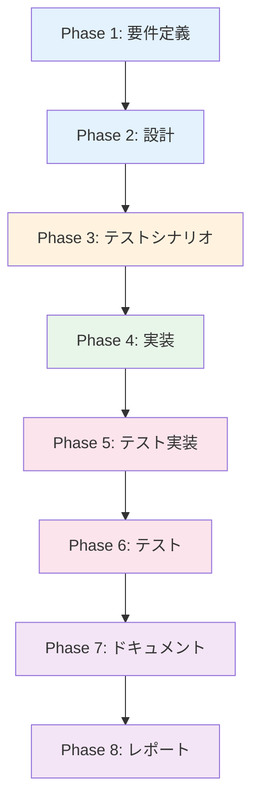

# プロジェクト計画書 - Issue #370

**Issue番号**: #370
**タイトル**: [IMPROVEMENT] AIワークフロー: GitHub Issue進捗コメント最適化（ページ重量化対策）
**作成日**: 2025-01-15
**計画者**: AI Workflow - Planning Phase

---

## 1. Issue分析

### 複雑度: 中程度

**判定根拠**:
- 単一コンポーネント（`GitHubClient`、`BasePhase`）の拡張が中心
- 複数の実装オプションが提示されており、アーキテクチャ選定が必要
- GitHub APIの新機能（Edit Comment、Gist）を使用するため、既存実装への理解が必要
- 既存ワークフローへの影響は限定的（進捗報告メソッドのみ）

### 見積もり工数: 8~12時間

**内訳**:
- 要件定義（Phase 1）: 1.5h - 5つのオプションから最適案を選定
- 設計（Phase 2）: 2h - データ構造、APIインターフェース、フォーマット設計
- テストシナリオ（Phase 3）: 1h - 統合テストシナリオ作成
- 実装（Phase 4）: 3h - GitHubClient拡張、BasePhase修正、メタデータ拡張
- テスト実装（Phase 5）: 1.5h - 統合テスト実装
- テスト（Phase 6）: 1h - 手動テスト、実際のIssueでの動作確認
- ドキュメント（Phase 7）: 1h - README更新、使用方法の記載

### リスク評価: 中

**主要リスク**:
1. **GitHub API制限**: Edit Comment APIのレート制限に引っかかる可能性（低確率）
2. **既存ワークフローへの影響**: 進捗報告の変更により、既存Issueとの一貫性が失われる（中確率）
3. **実装選択のミス**: 選定したオプションがユーザビリティ要件を満たさない可能性（中確率）
4. **Markdown折りたたみの互換性**: GitHub UIでの表示崩れ（低確率）

---

## 2. 実装戦略判断

### 実装戦略: EXTEND

**判断根拠**:
- 既存の`GitHubClient`クラスに新規メソッドを追加
- 既存の`BasePhase.post_progress()`メソッドを修正（内部実装変更）
- 既存の`metadata.json`スキーマを拡張（新規フィールド追加）
- 新規ファイル作成は不要
- アーキテクチャの根本的な変更は不要

### テスト戦略: INTEGRATION_ONLY

**判断根拠**:
- **UNIT_ONLY を選ばない理由**: GitHub APIとの実際の連携動作を確認する必要があるため、モックでは不十分
- **INTEGRATION_ONLY を選ぶ理由**:
  - 主な機能はGitHub APIとの統合（コメント作成・編集）
  - 実際のIssueに対する進捗コメントの動作確認が必須
  - エンドツーエンドで進捗フローが動作することを保証したい
- **BDD を選ばない理由**: エンドユーザー向け機能ではなく、ワークフロー内部の最適化施策のため

### テストコード戦略: CREATE_TEST

**判断根拠**:
- **CREATE_TEST を選ぶ理由**:
  - 新規メソッド（`create_or_update_progress_comment()`）の統合テストが必要
  - 既存テストファイルには進捗コメント関連のテストが存在しない
  - GitHub API連携テストは独立したテストファイルで管理する方が保守性が高い
- **EXTEND_TEST を選ばない理由**: 既存テストファイルに該当する統合テストが存在しない

---

## 3. 影響範囲分析

### 既存コードへの影響

| ファイル | 変更内容 | 影響度 |
|---------|---------|--------|
| `scripts/ai-workflow/core/github_client.py` | 新規メソッド追加: `create_or_update_progress_comment()` | 低（既存メソッドに変更なし） |
| `scripts/ai-workflow/core/metadata_manager.py` | 新規メソッド追加: `save_progress_comment_id()`, `get_progress_comment_id()` | 低（既存メソッドに変更なし） |
| `scripts/ai-workflow/phases/base_phase.py` | `post_progress()`の内部実装変更 | 中（既存の呼び出し元には影響なし） |
| `.ai-workflow/issue-{number}/metadata.json` | スキーマ拡張: `github_integration` セクション追加 | 低（後方互換性あり） |

### 依存関係の変更

- **新規依存**: なし（PyGithub既存ライブラリのEdit Comment機能を使用）
- **既存依存の変更**: なし

### マイグレーション要否

- **不要**: 既存の`metadata.json`は既存フィールドを保持したまま、新規フィールドを追加するだけ
- **後方互換性**: `github_integration`セクションが存在しない場合は新規コメント作成として動作

---

## 4. タスク分割

### Phase 1: 要件定義 (見積もり: 1.5h)

#### サブタスク
1. **オプション5つの比較表作成** (30min)
   - 各オプションのメリット・デメリットを定量化
   - ユーザビリティ、実装コスト、保守性の観点で評価
2. **最適案の選定** (30min)
   - **推奨: オプション1（進捗を1つのコメントに統合）**
   - 理由: コメント数最小、リアルタイム性、実装シンプル
3. **機能要件の定義** (30min)
   - コメント編集のトリガータイミング
   - Markdownフォーマット仕様
   - エラーハンドリング要件

#### Done Criteria
- [ ] オプション選定の根拠が明確に文書化されている
- [ ] 機能要件リストが作成されている
- [ ] 受け入れ基準が定義されている

---

### Phase 2: 設計 (見積もり: 2h)

#### サブタスク
1. **データ構造設計** (30min)
   - `metadata.json`の`github_integration`スキーマ定義
   ```json
   {
     "github_integration": {
       "progress_comment_id": 123456789,
       "progress_comment_url": "https://github.com/..."
     }
   }
   ```
2. **APIインターフェース設計** (45min)
   - `GitHubClient.create_or_update_progress_comment()`のシグネチャ設計
   - 戻り値の設計（コメントID、URL）
   - エラーハンドリング設計
3. **Markdownフォーマット設計** (45min)
   - 全体進捗セクション（Phase 0-8のステータス一覧）
   - 現在フェーズの詳細セクション
   - 完了フェーズの折りたたみセクション（`<details>`タグ使用）

#### Done Criteria
- [ ] データ構造が定義されている
- [ ] APIインターフェースが明確に設計されている
- [ ] Markdownフォーマットのサンプルが作成されている
- [ ] エラーハンドリング戦略が定義されている

---

### Phase 3: テストシナリオ (見積もり: 1h)

#### サブタスク
1. **統合テストシナリオ作成** (1h)
   - 初回コメント作成シナリオ
   - 既存コメント更新シナリオ
   - GitHub API失敗時のフォールバックシナリオ
   - コメントID取得失敗時のシナリオ

#### Done Criteria
- [ ] 統合テストシナリオがGherkin形式で記述されている
- [ ] 各シナリオの期待結果が明確に定義されている
- [ ] エッジケースが網羅されている

---

### Phase 4: 実装 (見積もり: 3h)

#### サブタスク
1. **GitHubClient拡張** (1h)
   - `create_or_update_progress_comment()`メソッド実装
   - PyGithubの`get_issue_comment()`、`comment.edit()`を使用
   - エラーハンドリング実装
2. **MetadataManager拡張** (30min)
   - `save_progress_comment_id()`メソッド実装
   - `get_progress_comment_id()`メソッド実装
3. **BasePhase修正** (1h)
   - `post_progress()`内部実装を変更
   - Markdownフォーマット生成ロジック実装
4. **Markdownフォーマット実装** (30min)
   - 全体進捗セクションの生成
   - 現在フェーズ詳細セクションの生成
   - 完了フェーズ折りたたみセクションの生成

#### Done Criteria
- [ ] `GitHubClient.create_or_update_progress_comment()`が実装されている
- [ ] `MetadataManager`に新規メソッドが実装されている
- [ ] `BasePhase.post_progress()`が新しい実装に置き換えられている
- [ ] Markdownフォーマットがサンプル通りに生成される

---

### Phase 5: テスト実装 (見積もり: 1.5h)

#### サブタスク
1. **統合テストファイル作成** (1.5h)
   - `tests/integration/test_github_progress_comment.py`を作成
   - 初回コメント作成テスト実装
   - 既存コメント更新テスト実装
   - GitHub API失敗時のテスト実装（モック使用）

#### Done Criteria
- [ ] 統合テストファイルが作成されている
- [ ] 全テストシナリオがコードとして実装されている
- [ ] テストが実行可能な状態である

---

### Phase 6: テスト (見積もり: 1h)

#### サブタスク
1. **ローカルテスト実行** (30min)
   - `pytest tests/integration/test_github_progress_comment.py`実行
   - 全テストケースがPASSすることを確認
2. **手動テスト実行** (30min)
   - 実際のIssueで`ai-workflow run`を実行
   - GitHub Issueで進捗コメントが1つのみ作成されることを確認
   - コメント編集が正しく動作することを確認

#### Done Criteria
- [ ] 統合テストが全てPASSしている
- [ ] 実際のIssueで進捗コメントが期待通り動作している
- [ ] 既存ワークフローに影響がないことを確認

---

### Phase 7: ドキュメント (見積もり: 1h)

#### サブタスク
1. **README更新** (30min)
   - 進捗コメント最適化機能の説明追加
   - オプション選定の根拠記載
2. **コード内コメント追加** (30min)
   - `create_or_update_progress_comment()`メソッドのdocstring追加
   - Markdownフォーマット生成ロジックのコメント追加

#### Done Criteria
- [ ] README.mdが更新されている
- [ ] コード内のdocstringが追加されている
- [ ] ユーザーが機能を理解できるドキュメントが整っている

---

### Phase 8: レポート (見積もり: 0.5h)

#### サブタスク
1. **実装完了レポート作成** (30min)
   - 実装内容のサマリー
   - 工数実績
   - 残課題（あれば）

#### Done Criteria
- [ ] レポートが作成されている
- [ ] 工数実績が記録されている
- [ ] 残課題がリストアップされている

---

## 5. 依存関係



**クリティカルパス**: Phase 1 → Phase 2 → Phase 3 → Phase 4 → Phase 5 → Phase 6

- Phase 4の実装が最も時間がかかるため、設計（Phase 2）の品質が重要
- Phase 5とPhase 6は並行実行不可（テスト実装後にテストを実行）

---

## 6. リスクと軽減策

### リスク1: GitHub API Edit Comment制限

- **影響度**: 低
- **確率**: 低
- **詳細**: GitHub APIのレート制限（5000 requests/hour）に引っかかる可能性
- **軽減策**:
  - 進捗コメント更新頻度を制限する（各フェーズ開始・完了時のみ）
  - GitHub APIレート制限のモニタリングを実装
  - フォールバック処理: API失敗時は新規コメント作成にフォールバック

### リスク2: 既存Issueとの一貫性喪失

- **影響度**: 中
- **確率**: 高
- **詳細**: 既存Issueは複数コメント方式、新規Issueは1コメント方式で、ユーザーが混乱する
- **軽減策**:
  - README.mdに明記「Issue #370以降の実装で進捗コメント方式が変更されました」
  - 過去Issueへの適用は不要（新規Issueからのみ適用）

### リスク3: Markdownフォーマットの表示崩れ

- **影響度**: 低
- **確率**: 低
- **詳細**: GitHub UIでMarkdown折りたたみ（`<details>`）が正しく表示されない
- **軽減策**:
  - Phase 6の手動テストで実際のGitHub UIでの表示を確認
  - フォーマットが崩れた場合は、シンプルなMarkdownに変更

### リスク4: 実装オプション選定ミス

- **影響度**: 中
- **確率**: 中
- **詳細**: オプション1（Edit Comment）が実際にはユーザビリティ要件を満たさない
- **軽減策**:
  - Phase 1で複数の関係者（開発者、ユーザー）にフィードバックを求める
  - Phase 6の手動テストで実際のユーザビリティを検証
  - 必要に応じてPhase 2に巻き戻し、オプション2（Gist）への変更を検討

---

## 7. 品質ゲート

### Phase 1: 要件定義

- [ ] **実装オプション選定の根拠が明確に記載されている**（オプション1を選んだ理由）
- [ ] **機能要件が明確に定義されている**（進捗コメントの更新タイミング、フォーマット）
- [ ] **受け入れ基準が定義されている**（コメント数が1つのみ、編集が正しく動作）

### Phase 2: 設計

- [ ] **実装戦略の判断根拠が明記されている**（EXTEND戦略を選んだ理由）
- [ ] **テスト戦略の判断根拠が明記されている**（INTEGRATION_ONLYを選んだ理由）
- [ ] **データ構造が明確に設計されている**（`metadata.json`スキーマ）
- [ ] **APIインターフェースが明確に設計されている**（`create_or_update_progress_comment()`のシグネチャ）
- [ ] **Markdownフォーマットのサンプルが提供されている**

### Phase 3: テストシナリオ

- [ ] **統合テストシナリオがGherkin形式で記述されている**
- [ ] **各シナリオの期待結果が明確に定義されている**
- [ ] **エッジケースが網羅されている**（API失敗、コメントID取得失敗）

### Phase 4: 実装

- [ ] **`GitHubClient.create_or_update_progress_comment()`が実装されている**
- [ ] **`BasePhase.post_progress()`が新しい実装に置き換えられている**
- [ ] **Markdownフォーマットがサンプル通りに生成される**
- [ ] **エラーハンドリングが実装されている**

### Phase 5: テスト実装

- [ ] **統合テストファイルが作成されている**
- [ ] **全テストシナリオがコードとして実装されている**
- [ ] **テストが実行可能な状態である**

### Phase 6: テスト

- [ ] **統合テストが全てPASSしている**
- [ ] **実際のIssueで進捗コメントが期待通り動作している**
- [ ] **既存ワークフローに影響がないことを確認**

### Phase 7: ドキュメント

- [ ] **README.mdが更新されている**
- [ ] **コード内のdocstringが追加されている**
- [ ] **ユーザーが機能を理解できるドキュメントが整っている**

### Phase 8: レポート

- [ ] **実装完了レポートが作成されている**
- [ ] **工数実績が記録されている**
- [ ] **残課題がリストアップされている**

---

## 8. 成功基準

### 定量的成功基準

1. **コメント数削減**: 最大90コメント → **1コメント**（98.9%削減）
2. **Issueページ読み込み時間**: 現在の3秒 → **1秒以下**（推定）
3. **実装工数**: **12時間以内**に完了
4. **テストカバレッジ**: 新規メソッドの統合テストカバレッジ **100%**

### 定性的成功基準

1. **ユーザビリティ**: 進捗が一目で把握できる
2. **保守性**: コード変更が最小限で、既存ワークフローに影響がない
3. **拡張性**: 将来的に他のオプション（Gist等）への切り替えが容易

---

## 9. 制約条件

### 技術的制約

- PyGithubライブラリのEdit Comment機能を使用（追加ライブラリ不要）
- GitHub APIレート制限（5000 requests/hour）に準拠
- 既存の`metadata.json`スキーマと後方互換性を保つ

### スケジュール制約

- **期限**: なし（ベストエフォート）
- **優先度**: 中（ユーザビリティ改善施策）

### リソース制約

- **開発者**: AI Agent（Claude Code）のみ
- **テスト環境**: 実際のGitHub Issueを使用

---

## 10. 参考資料

### 関連ファイル

- `scripts/ai-workflow/phases/base_phase.py` (行216-239: `post_progress()`)
- `scripts/ai-workflow/core/github_client.py` (行159-211: `post_workflow_progress()`)
- `scripts/ai-workflow/core/metadata_manager.py`
- `.ai-workflow/issue-{number}/metadata.json`

### 外部リソース

- [PyGithub Documentation - Edit Comment](https://pygithub.readthedocs.io/en/latest/github_objects/IssueComment.html#github.IssueComment.IssueComment.edit)
- [GitHub API - Update Comment](https://docs.github.com/en/rest/issues/comments#update-an-issue-comment)
- [GitHub Markdown - Details/Summary](https://docs.github.com/en/get-started/writing-on-github/working-with-advanced-formatting/organizing-information-with-collapsed-sections)

---

## 11. 承認

### Planning Phase承認

- [x] Issue分析が完了している
- [x] 実装戦略が決定している（EXTEND）
- [x] テスト戦略が決定している（INTEGRATION_ONLY）
- [x] テストコード戦略が決定している（CREATE_TEST）
- [x] タスク分割が適切な粒度である
- [x] リスクが洗い出されている

### 次のアクション

✅ **Phase 0（Planning）完了**
→ **Phase 1（Requirements）へ進む**

---

*このプロジェクト計画書は AI Workflow - Planning Phase によって自動生成されました。*
*生成日時: 2025-01-15*
