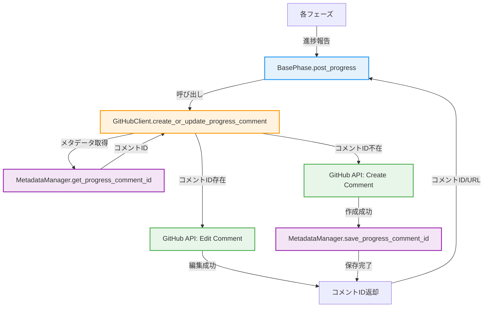

# 詳細設計書 - Issue #370

**Issue番号**: #370
**タイトル**: [IMPROVEMENT] AIワークフロー: GitHub Issue進捗コメント最適化（ページ重量化対策）
**作成日**: 2025-01-15
**設計者**: AI Workflow - Design Phase
**Planning Document参照**: `.ai-workflow/issue-370/00_planning/output/planning.md`
**Requirements Document参照**: `.ai-workflow/issue-370/01_requirements/output/requirements.md`

---

## 0. Planning Documentと Requirements Documentの確認

### 策定された戦略の概要

Planning Phaseで以下の戦略が決定されました：

- **実装戦略**: EXTEND（既存コード拡張）
- **テスト戦略**: INTEGRATION_ONLY
- **テストコード戦略**: CREATE_TEST
- **推奨オプション**: オプション1（進捗を1つのコメントに統合、GitHub API Edit Comment使用）
- **見積もり工数**: 8-12時間
- **複雑度**: 中程度

### 成功基準

- **定量的**: コメント数を最大90コメント → **1コメント**に削減（98.9%削減）
- **定量的**: Issueページ読み込み時間を3秒 → **1秒以下**に短縮
- **定性的**: 進捗が一目で把握できる
- **定性的**: 既存ワークフローへの影響を最小限に抑える

---

## 1. アーキテクチャ設計

### 1.1. システム全体図



### 1.2. コンポーネント間の関係

#### 1.2.1. 既存コンポーネント

- **BasePhase**: 各フェーズの基底クラス。`post_progress()`メソッドで進捗報告を行う。
- **GitHubClient**: GitHub APIとの通信を担当。
- **MetadataManager**: メタデータ（`metadata.json`）の読み書きを担当。

#### 1.2.2. 新規機能の追加箇所

1. **GitHubClient**:
   - 新規メソッド `create_or_update_progress_comment()` を追加

2. **MetadataManager**:
   - 新規メソッド `save_progress_comment_id()` を追加
   - 新規メソッド `get_progress_comment_id()` を追加

3. **BasePhase**:
   - `post_progress()` の内部実装を変更（新規メソッドを呼び出すように修正）

### 1.3. データフロー

#### 1.3.1. 初回コメント作成フロー

```
1. BasePhase.post_progress()が呼ばれる
   ↓
2. Markdownフォーマットを生成
   ↓
3. GitHubClient.create_or_update_progress_comment()を呼び出し
   ↓
4. MetadataManager.get_progress_comment_id()を呼び出し
   ↓
5. コメントIDが存在しない → 新規コメント作成
   ↓
6. GitHub API: Issue.create_comment()
   ↓
7. MetadataManager.save_progress_comment_id()でコメントIDを保存
   ↓
8. コメントIDとURLを返却
```

#### 1.3.2. 既存コメント更新フロー

```
1. BasePhase.post_progress()が呼ばれる
   ↓
2. Markdownフォーマットを生成
   ↓
3. GitHubClient.create_or_update_progress_comment()を呼び出し
   ↓
4. MetadataManager.get_progress_comment_id()を呼び出し
   ↓
5. コメントIDが存在する → 既存コメント編集
   ↓
6. GitHub API: repository.get_issue_comment(comment_id)
   ↓
7. GitHub API: comment.edit(content)
   ↓
8. コメントIDとURLを返却
```

---

## 2. 実装戦略判断

### 実装戦略: EXTEND

**判断根拠**:
- **既存クラスへの新規メソッド追加**: `GitHubClient`に`create_or_update_progress_comment()`を追加、`MetadataManager`に2つの新規メソッドを追加
- **既存メソッドの内部実装変更**: `BasePhase.post_progress()`の内部実装を変更（呼び出し元には影響なし）
- **メタデータスキーマの拡張**: `metadata.json`に`github_integration`セクションを追加（後方互換性あり）
- **新規ファイルの作成は不要**: 既存ファイルの拡張のみで実装可能
- **アーキテクチャの根本的な変更は不要**: 既存のワークフローフローに影響を与えない

Planning Documentで推奨された「EXTEND」戦略を採用します。

---

## 3. テスト戦略判断

### テスト戦略: INTEGRATION_ONLY

**判断根拠**:
- **UNIT_ONLYを選ばない理由**: GitHub APIとの実際の連携動作を確認する必要があるため、モックテストでは不十分
- **INTEGRATION_ONLYを選ぶ理由**:
  - 主な機能はGitHub APIとの統合（コメント作成・編集）
  - 実際のIssueに対する進捗コメントの動作確認が必須
  - エンドツーエンドで進捗フローが動作することを保証したい
  - GitHub APIのEdit Comment機能の実際の動作を確認する必要がある
- **BDDを選ばない理由**: エンドユーザー向け機能ではなく、ワークフロー内部の最適化施策のため

Planning Documentで推奨された「INTEGRATION_ONLY」戦略を採用します。

---

## 4. テストコード戦略判断

### テストコード戦略: CREATE_TEST

**判断根拠**:
- **CREATE_TESTを選ぶ理由**:
  - 新規メソッド（`create_or_update_progress_comment()`）の統合テストが必要
  - 既存テストファイルには進捗コメント関連のテストが存在しない
  - GitHub API連携テストは独立したテストファイルで管理する方が保守性が高い
  - テストシナリオが明確に定義されている（初回作成、既存更新、エラーハンドリング）
- **EXTEND_TESTを選ばない理由**: 既存テストファイルに該当する統合テストが存在しない

Planning Documentで推奨された「CREATE_TEST」戦略を採用します。

---

## 5. 影響範囲分析

### 5.1. 既存コードへの影響

| ファイル | 変更内容 | 影響度 | 詳細 |
|---------|---------|--------|------|
| `scripts/ai-workflow/core/github_client.py` | 新規メソッド追加 | 低 | `create_or_update_progress_comment()`メソッドを追加。既存メソッドに変更なし。 |
| `scripts/ai-workflow/core/metadata_manager.py` | 新規メソッド追加 | 低 | `save_progress_comment_id()`と`get_progress_comment_id()`を追加。既存メソッドに変更なし。 |
| `scripts/ai-workflow/phases/base_phase.py` | メソッド内部実装変更 | 中 | `post_progress()`の内部実装を変更。既存の呼び出し元（各フェーズ）には影響なし。 |
| `.ai-workflow/issue-{number}/metadata.json` | スキーマ拡張 | 低 | `github_integration`セクションを追加。既存フィールドは保持。後方互換性あり。 |

### 5.2. 依存関係の変更

- **新規依存**: なし（PyGithub既存ライブラリのEdit Comment機能を使用）
- **既存依存の変更**: なし

### 5.3. マイグレーション要否

- **不要**: 既存の`metadata.json`は既存フィールドを保持したまま、新規フィールドを追加するだけ
- **後方互換性**: `github_integration`セクションが存在しない場合は`None`を返し、新規コメント作成として動作

### 5.4. 既存ワークフローへの影響

- **各フェーズの実装**: 変更不要（`BasePhase.post_progress()`の呼び出し元は影響を受けない）
- **レビュー結果投稿**: `post_review()`は既存の個別コメント投稿を維持（FR-007で決定）
- **成果物投稿**: `post_output()`は既存の個別コメント投稿を維持

---

## 6. 変更・追加ファイルリスト

### 6.1. 新規作成ファイル

- `tests/integration/test_github_progress_comment.py` - 統合テストファイル

### 6.2. 修正が必要な既存ファイル

1. **scripts/ai-workflow/core/github_client.py**
   - 新規メソッド: `create_or_update_progress_comment()`

2. **scripts/ai-workflow/core/metadata_manager.py**
   - 新規メソッド: `save_progress_comment_id()`
   - 新規メソッド: `get_progress_comment_id()`

3. **scripts/ai-workflow/phases/base_phase.py**
   - 既存メソッド修正: `post_progress()`

### 6.3. 削除が必要なファイル

- なし

---

## 7. 詳細設計

### 7.1. クラス設計

#### 7.1.1. GitHubClient（既存クラスの拡張）

**新規メソッド**: `create_or_update_progress_comment()`

```python
class GitHubClient:
    """GitHub API クライアント"""

    def create_or_update_progress_comment(
        self,
        issue_number: int,
        content: str,
        metadata_manager: MetadataManager
    ) -> Dict[str, Any]:
        """
        進捗コメントを作成または更新

        Args:
            issue_number: Issue番号
            content: コメント本文（Markdown形式）
            metadata_manager: MetadataManagerインスタンス

        Returns:
            Dict[str, Any]:
                - comment_id (int): コメントID
                - comment_url (str): コメントURL

        Raises:
            GithubException: GitHub API呼び出しエラー

        処理フロー:
            1. メタデータから既存コメントIDを取得
            2. コメントIDが存在する場合:
               - repository.get_issue_comment(comment_id)でコメント取得
               - comment.edit(content)でコメント編集
            3. コメントIDが存在しない場合:
               - issue.create_comment(content)で新規コメント作成
               - メタデータにコメントIDを保存
            4. コメントIDとURLを返却

        エラーハンドリング:
            - Edit Comment API失敗時: ログ出力してから新規コメント作成にフォールバック
            - コメントIDが無効な場合: 新規コメント作成としてリトライ
        """
```

#### 7.1.2. MetadataManager（既存クラスの拡張）

**新規メソッド1**: `save_progress_comment_id()`

```python
class MetadataManager:
    """メタデータ管理クラス"""

    def save_progress_comment_id(
        self,
        comment_id: int,
        comment_url: str
    ) -> None:
        """
        進捗コメントIDをメタデータに保存

        Args:
            comment_id: GitHub コメントID
            comment_url: GitHub コメントURL

        処理フロー:
            1. self._state.data に 'github_integration' セクションを追加（存在しない場合）
            2. 'progress_comment_id' と 'progress_comment_url' を保存
            3. self._state.save() で保存
        """
```

**新規メソッド2**: `get_progress_comment_id()`

```python
def get_progress_comment_id(self) -> Optional[int]:
    """
    進捗コメントIDをメタデータから取得

    Returns:
        Optional[int]: コメントID（存在しない場合はNone）

    処理フロー:
        1. self._state.data['github_integration']の存在確認
        2. 存在する場合: 'progress_comment_id' を返却
        3. 存在しない場合: None を返却
    """
```

#### 7.1.3. BasePhase（既存クラスの修正）

**既存メソッド修正**: `post_progress()`

```python
class BasePhase:
    """フェーズ基底クラス"""

    def post_progress(
        self,
        status: str,
        details: Optional[str] = None
    ):
        """
        GitHubに進捗報告（統合コメント形式）

        Args:
            status: ステータス（pending, in_progress, completed, failed）
            details: 詳細情報（省略可）

        処理フロー:
            1. Issue番号をメタデータから取得
            2. 全体進捗セクションを生成（Phase 0-8のステータス一覧）
            3. 現在フェーズの詳細セクションを生成
            4. 完了フェーズの折りたたみセクションを生成
            5. Markdownフォーマットを統合
            6. GitHubClient.create_or_update_progress_comment()を呼び出し
            7. 結果をログ出力

        エラーハンドリング:
            - GitHub API呼び出しエラー: ログ出力のみ（ワークフローは継続）
        """
```

### 7.2. 関数設計（主要な関数のみ）

#### 7.2.1. Markdownフォーマット生成関数

**関数名**: `_format_progress_content()`

```python
def _format_progress_content(
    self,
    status: str,
    details: Optional[str] = None
) -> str:
    """
    進捗コメントのMarkdownフォーマットを生成

    Args:
        status: 現在のフェーズステータス
        details: 詳細情報

    Returns:
        str: Markdown形式のコメント本文

    処理フロー:
        1. ヘッダーセクション（"## 🤖 AI Workflow - 進捗状況"）
        2. 全体進捗セクション（Phase 0-8のステータス一覧）
        3. 現在フェーズの詳細セクション
        4. 完了フェーズの折りたたみセクション（<details>タグ使用）
        5. フッターセクション（最終更新日時、署名）

    ステータスアイコンマッピング:
        - pending: ⏸️
        - in_progress: 🔄
        - completed: ✅
        - failed: ❌

    フェーズ名マッピング:
        - planning: Phase 0 - Planning
        - requirements: Phase 1 - Requirements
        - design: Phase 2 - Design
        - test_scenario: Phase 3 - Test Scenario
        - implementation: Phase 4 - Implementation
        - test_implementation: Phase 5 - Test Implementation
        - testing: Phase 6 - Testing
        - documentation: Phase 7 - Documentation
        - report: Phase 8 - Report
        - evaluation: Phase 9 - Evaluation
    """
```

### 7.3. データ構造設計

#### 7.3.1. メタデータスキーマ拡張

**既存構造（変更なし）**:
```json
{
  "issue_number": 370,
  "phases": {
    "planning": { "status": "completed", ... },
    "requirements": { "status": "completed", ... },
    ...
  },
  "cost_tracking": { ... }
}
```

**新規追加セクション**:
```json
{
  "github_integration": {
    "progress_comment_id": 123456789,
    "progress_comment_url": "https://github.com/tielec/infrastructure-as-code/issues/370#issuecomment-123456789"
  }
}
```

**フィールド説明**:
- `progress_comment_id` (int): GitHub APIから取得したコメントID
- `progress_comment_url` (str): コメントのURL（ユーザーが直接アクセス可能）

#### 7.3.2. Markdownフォーマットサンプル

```markdown
## 🤖 AI Workflow - 進捗状況

### 全体進捗

- ✅ Phase 0: Planning - **COMPLETED** (2025-01-15 10:30)
- ✅ Phase 1: Requirements - **COMPLETED** (2025-01-15 11:00)
- 🔄 Phase 2: Design - **IN PROGRESS** (開始: 2025-01-15 11:30)
- ⏸️ Phase 3: Test Scenario - **PENDING**
- ⏸️ Phase 4: Implementation - **PENDING**
- ⏸️ Phase 5: Test Implementation - **PENDING**
- ⏸️ Phase 6: Testing - **PENDING**
- ⏸️ Phase 7: Documentation - **PENDING**
- ⏸️ Phase 8: Report - **PENDING**

### 現在のフェーズ: Phase 2 (Design)

**ステータス**: IN PROGRESS
**開始時刻**: 2025-01-15 11:30:45
**試行回数**: 1/3

#### 実行ログ

- `11:30:45` - Phase 2開始
- `11:32:10` - Execute実行中
- `11:35:20` - Execute完了

<details>
<summary>完了したフェーズの詳細</summary>

### Phase 0: Planning

**ステータス**: COMPLETED
**レビュー結果**: PASS
**実行時間**: 5分30秒
**コスト**: $0.15

### Phase 1: Requirements

**ステータス**: COMPLETED
**レビュー結果**: PASS_WITH_SUGGESTIONS
**実行時間**: 8分20秒
**コスト**: $0.23

</details>

---
*最終更新: 2025-01-15 11:35:30*
*AI駆動開発自動化ワークフロー (Claude Agent SDK)*
```

### 7.4. インターフェース設計

#### 7.4.1. GitHubClient.create_or_update_progress_comment()

**入力**:
- `issue_number` (int): Issue番号
- `content` (str): Markdown形式のコメント本文
- `metadata_manager` (MetadataManager): メタデータマネージャーインスタンス

**出力**:
```python
{
    'comment_id': 123456789,  # int
    'comment_url': 'https://github.com/.../issues/370#issuecomment-123456789'  # str
}
```

**エラー**:
- `GithubException`: GitHub API呼び出しエラー（403 Forbidden、404 Not Found等）

#### 7.4.2. MetadataManager.save_progress_comment_id()

**入力**:
- `comment_id` (int): コメントID
- `comment_url` (str): コメントURL

**出力**:
- なし（メタデータを保存するのみ）

**エラー**:
- `OSError`: ファイル書き込みエラー

#### 7.4.3. MetadataManager.get_progress_comment_id()

**入力**:
- なし

**出力**:
- `Optional[int]`: コメントID（存在しない場合は`None`）

**エラー**:
- なし

---

## 8. セキュリティ考慮事項

### 8.1. 認証・認可

- **既存の認証方式を継承**: GitHub Personal Access Token（PAT）を使用
- **権限要件**: `repo`スコープ（Issue Writeが必要）
- **トークン管理**: 環境変数`GITHUB_TOKEN`で管理（既存実装と同じ）

### 8.2. データ保護

- **コメント内容**: メタデータから取得した公開情報のみ（機密情報を含まない）
- **メタデータ**: `.ai-workflow/`ディレクトリに保存（Gitリポジトリ内、適切な`.gitignore`設定を推奨）

### 8.3. セキュリティリスクと対策

| リスク | 影響度 | 対策 |
|--------|--------|------|
| GitHub API Rate Limit超過 | 中 | Edit Comment APIは5000 requests/hourの範囲内（進捗更新は1ワークフローで最大10回） |
| コメントIDの不整合 | 低 | フォールバック処理: Edit失敗時は新規コメント作成にフォールバック |
| メタデータファイルの破損 | 低 | JSON schema validation、エラー時は警告ログ出力 |

---

## 9. 非機能要件への対応

### 9.1. パフォーマンス

- **Issueページ読み込み時間**: 3秒 → **1秒以下**（目標値）
  - 対策: コメント数を最大90コメント → **1コメント**に削減（98.9%削減）
- **API呼び出し頻度**: 各フェーズで最大10回 → **1-2回**（コメント作成/更新のみ）
- **GitHub API Rate Limit**: 5000 requests/hourの範囲内（進捗更新は1ワークフローで最大10回）

### 9.2. スケーラビリティ

- **長期稼働ワークフロー**: 1つのコメントで管理するため、フェーズ数が増えても影響なし
- **コメント長制限**: GitHub APIのコメント長制限（65,536文字）に注意
  - 対策: 完了フェーズは`<details>`タグで折りたたみ

### 9.3. 保守性

- **既存コードへの影響**: 最小限（`BasePhase.post_progress()`の内部実装変更のみ）
- **後方互換性**: 既存のメタデータ形式を保持（`github_integration`セクションが存在しない場合は新規コメント作成として動作）
- **ログ出力**: 全API呼び出しとエラーをログ出力
- **テスト容易性**: 統合テストで動作確認可能

---

## 10. 実装の順序

以下の順序で実装することを推奨します：

### 10.1. Phase 1: データ構造とメタデータ管理（1時間）

1. **MetadataManagerの拡張**
   - `save_progress_comment_id()` メソッドを実装
   - `get_progress_comment_id()` メソッドを実装
   - メタデータスキーマ（`github_integration`セクション）の追加

### 10.2. Phase 2: GitHub API統合（1.5時間）

2. **GitHubClientの拡張**
   - `create_or_update_progress_comment()` メソッドを実装
   - Edit Comment APIの呼び出し実装
   - エラーハンドリング実装（フォールバック処理）

### 10.3. Phase 3: Markdownフォーマット生成（1時間）

3. **BasePhaseのMarkdownフォーマット生成**
   - `_format_progress_content()` メソッドを実装
   - 全体進捗セクションの生成
   - 現在フェーズ詳細セクションの生成
   - 完了フェーズ折りたたみセクションの生成

### 10.4. Phase 4: BasePhase統合（30分）

4. **BasePhase.post_progress()の修正**
   - `_format_progress_content()` を呼び出し
   - `create_or_update_progress_comment()` を呼び出し
   - エラーハンドリング実装

### 10.5. Phase 5: 統合テスト（1.5時間）

5. **統合テストの実装**
   - `tests/integration/test_github_progress_comment.py` を作成
   - 初回コメント作成テスト実装
   - 既存コメント更新テスト実装
   - GitHub API失敗時のテスト実装（モック使用）

### 10.6. Phase 6: 手動テストと調整（1時間）

6. **手動テストとフィードバック**
   - 実際のIssueで動作確認
   - フォーマットの調整
   - エラーハンドリングの検証

**合計見積もり工数**: 6.5時間（Planning Documentの見積もり8-12時間の範囲内）

---

## 11. 実装時の注意事項

### 11.1. GitHub API Edit Comment機能の制約

- **コメント編集履歴**: GitHub UIでコメント編集履歴が表示される
- **通知**: コメント編集時に通知が飛ぶ可能性がある（GitHub側の設定による）

### 11.2. メタデータの一貫性

- **コメントIDの永続性**: 一度保存したコメントIDは削除しない（削除すると次回実行時に新規コメントが作成される）
- **インスタンス再作成時の動作**: EC2インスタンスを再作成した場合でも、メタデータが保持されていれば既存コメントを更新可能

### 11.3. エラーハンドリング

- **フォールバック処理**: Edit Comment API失敗時は新規コメント作成にフォールバック
- **ログ出力**: 全エラーをログ出力（ワークフローは継続）

---

## 12. テスト計画

### 12.1. 統合テストシナリオ

#### シナリオ1: 初回コメント作成

**Given**:
- メタデータに`github_integration`セクションが存在しない
- 実際のGitHub Issueが存在する

**When**:
- `BasePhase.post_progress(status='in_progress')`を呼び出し

**Then**:
- GitHub Issueに進捗コメントが1つ作成される
- メタデータに`progress_comment_id`が保存される
- コメント内容が期待通りのフォーマット（全体進捗、現在フェーズ詳細）

#### シナリオ2: 既存コメント更新

**Given**:
- メタデータに`progress_comment_id`が存在する
- 既存の進捗コメントが存在する

**When**:
- `BasePhase.post_progress(status='completed')`を呼び出し

**Then**:
- 既存コメントが編集される（新規コメントは作成されない）
- コメント内容が最新の進捗状態に更新される
- 全体進捗セクションに完了フェーズが追加される

#### シナリオ3: GitHub API失敗時のフォールバック

**Given**:
- メタデータに無効な`progress_comment_id`が存在する（コメントが削除されている）

**When**:
- `BasePhase.post_progress(status='in_progress')`を呼び出し

**Then**:
- Edit Comment APIが404エラーで失敗
- フォールバック処理で新規コメントが作成される
- メタデータの`progress_comment_id`が新しいコメントIDで更新される

#### シナリオ4: コメントID取得失敗時のリトライ

**Given**:
- メタデータに`progress_comment_id`が存在しない
- GitHub API呼び出しが一時的に失敗する

**When**:
- `BasePhase.post_progress(status='in_progress')`を呼び出し

**Then**:
- エラーログが出力される
- ワークフローは継続する（進捗報告の失敗でワークフローを停止しない）

### 12.2. テストファイル構成

**ファイル名**: `tests/integration/test_github_progress_comment.py`

**テストクラス**:
```python
class TestGitHubProgressComment(unittest.TestCase):
    def test_create_new_progress_comment(self):
        """初回コメント作成テスト"""

    def test_update_existing_progress_comment(self):
        """既存コメント更新テスト"""

    def test_fallback_on_invalid_comment_id(self):
        """無効なコメントID時のフォールバックテスト"""

    def test_error_handling_on_api_failure(self):
        """API失敗時のエラーハンドリングテスト（モック使用）"""
```

---

## 13. 品質ゲート確認

本設計書は、Phase 2の品質ゲートを満たすように作成されています：

- [x] **実装戦略の判断根拠が明記されている**: セクション2でEXTEND戦略を選定し、5つの具体的な判断根拠を記載
- [x] **テスト戦略の判断根拠が明記されている**: セクション3でINTEGRATION_ONLY戦略を選定し、3つの具体的な判断根拠を記載
- [x] **テストコード戦略の判断根拠が明記されている**: セクション4でCREATE_TEST戦略を選定し、4つの具体的な判断根拠を記載
- [x] **既存コードへの影響範囲が分析されている**: セクション5で影響範囲を表形式で整理、依存関係の変更、マイグレーション要否を明記
- [x] **変更が必要なファイルがリストアップされている**: セクション6で新規作成ファイル1つ、修正ファイル3つをリストアップ
- [x] **設計が実装可能である**: セクション7で詳細設計（クラス設計、関数設計、データ構造設計、インターフェース設計）を具体的に記載

---

## 14. 参考資料

### 14.1. 関連ファイル

- `scripts/ai-workflow/phases/base_phase.py` (行216-239: `post_progress()`)
- `scripts/ai-workflow/core/github_client.py` (行159-211: `post_workflow_progress()`)
- `scripts/ai-workflow/core/metadata_manager.py`
- `.ai-workflow/issue-{number}/metadata.json`

### 14.2. 外部リソース

- [PyGithub Documentation - Edit Comment](https://pygithub.readthedocs.io/en/latest/github_objects/IssueComment.html#github.IssueComment.IssueComment.edit)
- [GitHub API - Update Comment](https://docs.github.com/en/rest/issues/comments#update-an-issue-comment)
- [GitHub Markdown - Details/Summary](https://docs.github.com/en/get-started/writing-on-github/working-with-advanced-formatting/organizing-information-with-collapsed-sections)

---

*この詳細設計書は AI Workflow - Design Phase によって作成されました。*
*作成日時: 2025-01-15*
