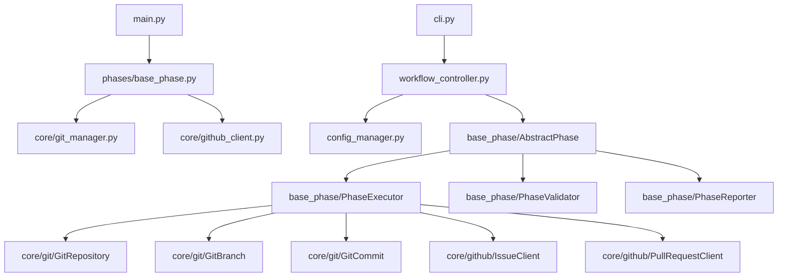
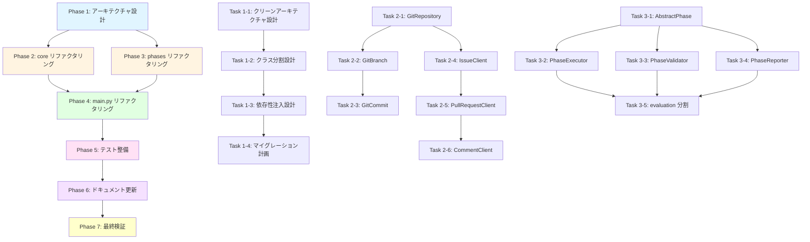

# プロジェクト計画書 - Issue #376

## 📋 Issue分析

### Issue情報
- **Issue番号**: #376
- **タイトル**: [TASK] ai-workflowスクリプトの大規模リファクタリング
- **状態**: open
- **URL**: https://github.com/tielec/infrastructure-as-code/issues/376

### 複雑度: **複雑 (High)**

**判定根拠**:
- **アーキテクチャ変更**: クリーンアーキテクチャ原則の適用、責務の分離、インターフェース定義など、システム全体の構造を変更
- **大規模コード修正**: 5つの主要ファイル（総計5,046行）を含む、複数モジュールの分割・再構成
- **既存機能の維持**: すべてのテストケースを通過させながら、内部構造を大幅に変更する必要がある
- **複数フェーズ**: Issue本文で6フェーズの段階的実施が計画されている
- **高リスク**: 既存テストコードの大幅な修正が必要、回帰バグのリスクが高い

### 見積もり工数: **80~120時間**

**根拠**:
1. **Phase 1 - アーキテクチャ設計** (16~24h)
   - クリーンアーキテクチャの詳細設計
   - インターフェース定義書作成
   - 依存性注入設計

2. **Phase 2 - core モジュールのリファクタリング** (20~30h)
   - `git_manager.py` (939行) → 3~4クラスに分割
   - `github_client.py` (1,104行) → 3~4クラスに分割
   - `content_parser.py` の最適化

3. **Phase 3 - phases モジュールのリファクタリング** (20~30h)
   - `base_phase.py` (1,142行) → 4クラスに分割
   - `evaluation.py` (781行) の機能分割
   - その他フェーズクラスの最適化

4. **Phase 4 - main.py のリファクタリング** (8~12h)
   - CLI層の分離 (1,080行)
   - ワークフロー制御ロジック抽出
   - 設定管理の独立化

5. **Phase 5 - テストコードの整備** (12~20h)
   - 既存テストの修正 (70+ファイル)
   - 新規ユニットテストの作成
   - モック標準化

6. **Phase 6 - ドキュメント更新** (4~6h)
   - ARCHITECTURE.md更新
   - README.md改訂
   - 各モジュールのdocstring追加

### リスク評価: **高 (High)**

**理由**:
- 既存機能の完全な動作保証が必要
- 大量のテストコードの修正が必要
- 段階的リファクタリング中の一貫性維持
- チーム内での設計レビュー・承認プロセスが必要

---

## 🎯 実装戦略判断

### 実装戦略: **REFACTOR**

**判断根拠**:
- このIssueは「大規模リファクタリング」を明示的に目標としている
- 新規機能追加ではなく、既存コードの構造改善が中心
- コードの可読性・保守性・テスタビリティの向上が目的
- 外部インターフェース（CLI、API）は変更せず、内部実装のみ変更
- Issue本文に「既存機能の動作を維持すること」が明記されている

### テスト戦略: **ALL (UNIT + INTEGRATION + BDD)**

**判断根拠**:

#### UNIT_TEST (必須)
- リファクタリング後の各クラス・関数が正しく動作することを保証
- 分割された小さなクラス（GitRepository、GitBranch、GitCommit等）は単体テストで検証
- モックを使った依存関係の切り離しテストが可能になる
- 新規抽出されたヘルパー関数・ユーティリティクラスのテスト

#### INTEGRATION_TEST (必須)
- リファクタリング後も、コンポーネント間の連携が正しく動作することを保証
- Git操作 + GitHub API連携のような複数クラス協調動作の検証
- Claude Agent SDK統合の検証
- ファイルI/O + メタデータ管理の連携テスト

#### BDD_TEST (必須)
- エンドユーザー視点での動作保証（「既存機能の動作を維持」の検証）
- ワークフロー全体（Phase 0~9）の正常動作確認
- エラーハンドリング・リトライ機能の振る舞い検証
- CLIコマンドの振る舞い検証（init, execute, resume等）

**すべてのレベルが必要な理由**:
- リファクタリングは「外部仕様不変」「内部構造変更」という性質上、全レベルでの回帰テストが必須
- 単体テストだけでは統合時の不具合を検知できない
- 統合テストだけでは個別クラスのバグ箇所特定が困難
- BDDテストで実際のユースケースレベルでの動作保証が必要

### テストコード戦略: **BOTH_TEST (既存拡張 + 新規作成)**

**判断根拠**:

#### EXTEND_TEST (既存テスト拡張)
- 既存のテストファイル（70+個）の修正が必要
- インポートパス変更（クラス・関数の移動に伴う）
- モックの差し替え（新しいインターフェースに対応）
- アサーション修正（リファクタリングによる戻り値変更）

#### CREATE_TEST (新規テスト作成)
- 新規抽出されたクラス用のテストファイル作成
  - `tests/unit/core/test_git_repository.py`
  - `tests/unit/core/test_git_branch.py`
  - `tests/unit/core/test_git_commit.py`
  - `tests/unit/core/test_issue_client.py`
  - `tests/unit/core/test_pull_request_client.py`
  - `tests/unit/phases/test_abstract_phase.py`
  - `tests/unit/phases/test_phase_executor.py`
  - `tests/unit/phases/test_phase_validator.py`
  - `tests/unit/phases/test_phase_reporter.py`
- 共通処理（ログ、エラーハンドリング、ファイル操作）のテスト作成

**両方必要な理由**:
- リファクタリングでクラス構成が変わるため、既存テストの修正は避けられない
- 新規作成されたクラス・モジュールには、対応するテストコードが存在しない
- テストカバレッジの向上が目標の一つ

---

## 🔍 影響範囲分析

### 既存コードへの影響

#### 1. 直接変更が必要なファイル (5ファイル)
- `main.py` (1,080行) - CLI層分離、ワークフロー制御抽出
- `phases/base_phase.py` (1,142行) - 4クラスに分割
- `core/git_manager.py` (939行) - 3クラスに分割
- `core/github_client.py` (1,104行) - 3クラスに分割
- `phases/evaluation.py` (781行) - 機能分割

#### 2. インポート修正が必要なファイル (30+ファイル)
- 各フェーズクラス (10ファイル)
- テストファイル (70+ファイル)
- ヘルパーモジュール (5ファイル)

#### 3. 新規作成が必要なファイル (20+ファイル)
- core モジュール分割後のクラスファイル (10ファイル)
- phases モジュール分割後のクラスファイル (5ファイル)
- main.py分割後のモジュールファイル (3ファイル)
- 共通処理モジュール (2ファイル)

### 依存関係の変更

#### 既存依存ライブラリ (変更なし)
```
click==8.1.3
GitPython==3.1.31
PyGithub==1.58.0
openai==1.0.0
anthropic==0.21.3
```

#### 新規依存ライブラリ (なし)
- リファクタリングのため、新規ライブラリは不要

#### 内部依存関係の変更
- **Before**: 大きなクラスが多くの機能を持つ（密結合）
- **After**: 小さなクラスがインターフェースを通じて連携（疎結合）



### マイグレーション要否

#### データベーススキーマ変更
- **不要**: このプロジェクトはDBを使用していない

#### 設定ファイル変更
- **不要**: `config.yaml`の構造は維持
- **オプション**: 設定管理の改善（ConfigManagerクラス導入）

#### メタデータフォーマット変更
- **不要**: `metadata.json`の構造は維持
- **後方互換性**: 既存のmetadata.jsonファイルはそのまま動作

#### 環境変数変更
- **不要**: 既存の環境変数（GITHUB_TOKEN, GITHUB_REPOSITORY等）は維持

---

## 📝 タスク分割

### Phase 1: アーキテクチャ設計 (見積もり: 16~24h)

#### タスク 1-1: クリーンアーキテクチャ設計書作成 (8~12h)
**目的**: システム全体の設計思想とアーキテクチャパターンを文書化

**作業内容**:
- レイヤー構造定義（Presentation / Application / Domain / Infrastructure）
- 依存性の方向ルール定義
- インターフェース設計原則の策定
- SOLID原則の適用方針

**完了条件**:
- [ ] ARCHITECTURE.md にクリーンアーキテクチャ設計を追記
- [ ] レイヤーごとの責務が明確に記載されている
- [ ] 各クラスの配置レイヤーが決定している

#### タスク 1-2: クラス分割設計書作成 (4~6h)
**目的**: 各大規模ファイルの分割方針を詳細化

**作業内容**:
- `git_manager.py` → GitRepository / GitBranch / GitCommit への分割詳細
- `github_client.py` → IssueClient / PullRequestClient / CommentClient への分割詳細
- `base_phase.py` → AbstractPhase / PhaseExecutor / PhaseValidator / PhaseReporter への分割詳細
- `evaluation.py` の機能分類と分割方針

**完了条件**:
- [ ] 各クラスの責務が明確に定義されている
- [ ] クラス間のインターフェースが決定している
- [ ] メソッドの移動先が決定している

#### タスク 1-3: 依存性注入設計書作成 (2~4h)
**目的**: 疎結合を実現するための依存性注入戦略を策定

**作業内容**:
- コンストラクタインジェクションの方針策定
- ファクトリーパターンの適用箇所決定
- モック可能な設計の検証

**完了条件**:
- [ ] 依存性注入パターンが明確に記載されている
- [ ] テスト容易性が向上することが確認できる
- [ ] 循環依存が発生しないことが確認できる

#### タスク 1-4: マイグレーション計画書作成 (2~2h)
**目的**: 段階的リファクタリングの実施順序を決定

**作業内容**:
- リファクタリング順序の決定（依存関係を考慮）
- 各ステップでのテスト戦略
- ロールバック手順の策定

**完了条件**:
- [ ] 実施順序が明確に記載されている
- [ ] 各ステップの完了条件が定義されている
- [ ] リスクとその軽減策が記載されている

---

### Phase 2: core モジュールのリファクタリング (見積もり: 20~30h)

#### タスク 2-1: git_manager.py の分割 - GitRepository クラス抽出 (4~6h)
**目的**: リポジトリ操作に関する責務を独立したクラスに抽出

**作業内容**:
- GitRepository クラスの作成
- `_get_repo_root()`, `get_status()`, `branch_exists()` 等のメソッド移動
- 既存コードからの参照修正

**完了条件**:
- [ ] `core/git/git_repository.py` が作成されている
- [ ] 既存テストがすべて通過する
- [ ] GitRepository のユニットテストが作成されている

#### タスク 2-2: git_manager.py の分割 - GitBranch クラス抽出 (4~6h)
**目的**: ブランチ操作に関する責務を独立したクラスに抽出

**作業内容**:
- GitBranch クラスの作成
- `create_branch()`, `switch_branch()`, `get_current_branch()` 等のメソッド移動
- 既存コードからの参照修正

**完了条件**:
- [ ] `core/git/git_branch.py` が作成されている
- [ ] 既存テストがすべて通過する
- [ ] GitBranch のユニットテストが作成されている

#### タスク 2-3: git_manager.py の分割 - GitCommit クラス抽出 (4~6h)
**目的**: コミット・プッシュ操作に関する責務を独立したクラスに抽出

**作業内容**:
- GitCommit クラスの作成
- `commit_phase_output()`, `push_to_remote()`, `create_commit_message()` 等のメソッド移動
- 既存コードからの参照修正

**完了条件**:
- [ ] `core/git/git_commit.py` が作成されている
- [ ] 既存テストがすべて通過する
- [ ] GitCommit のユニットテストが作成されている

#### タスク 2-4: github_client.py の分割 - IssueClient クラス抽出 (3~5h)
**目的**: Issue操作に関する責務を独立したクラスに抽出

**作業内容**:
- IssueClient クラスの作成
- `get_issue()`, `get_issue_info()`, `close_issue_with_reason()` 等のメソッド移動
- 既存コードからの参照修正

**完了条件**:
- [ ] `core/github/issue_client.py` が作成されている
- [ ] 既存テストがすべて通過する
- [ ] IssueClient のユニットテストが作成されている

#### タスク 2-5: github_client.py の分割 - PullRequestClient クラス抽出 (3~5h)
**目的**: PR操作に関する責務を独立したクラスに抽出

**作業内容**:
- PullRequestClient クラスの作成
- `create_pull_request()`, `update_pull_request()`, `check_existing_pr()` 等のメソッド移動
- 既存コードからの参照修正

**完了条件**:
- [ ] `core/github/pull_request_client.py` が作成されている
- [ ] 既存テストがすべて通過する
- [ ] PullRequestClient のユニットテストが作成されている

#### タスク 2-6: github_client.py の分割 - CommentClient クラス抽出 (2~4h)
**目的**: コメント操作に関する責務を独立したクラスに抽出

**作業内容**:
- CommentClient クラスの作成
- `post_comment()`, `create_or_update_progress_comment()` 等のメソッド移動
- 既存コードからの参照修正

**完了条件**:
- [ ] `core/github/comment_client.py` が作成されている
- [ ] 既存テストがすべて通過する
- [ ] CommentClient のユニットテストが作成されている

---

### Phase 3: phases モジュールのリファクタリング (見積もり: 20~30h)

#### タスク 3-1: base_phase.py の分割 - AbstractPhase 抽出 (4~6h)
**目的**: 抽象基底クラスとして最小限の責務のみを持つクラスを作成

**作業内容**:
- AbstractPhase クラスの作成
- 抽象メソッド（execute, review）の定義
- 共通プロパティの定義

**完了条件**:
- [ ] `phases/base_phase/abstract_phase.py` が作成されている
- [ ] 既存の各フェーズクラスが正しく継承できる
- [ ] 既存テストがすべて通過する

#### タスク 3-2: base_phase.py の分割 - PhaseExecutor 抽出 (5~7h)
**目的**: フェーズ実行制御ロジックを独立したクラスに抽出

**作業内容**:
- PhaseExecutor クラスの作成
- `run()`, `_auto_commit_and_push()`, `execute_with_claude()` 等のメソッド移動
- リトライロジックの抽出

**完了条件**:
- [ ] `phases/base_phase/phase_executor.py` が作成されている
- [ ] 既存テストがすべて通過する
- [ ] PhaseExecutor のユニットテストが作成されている

#### タスク 3-3: base_phase.py の分割 - PhaseValidator 抽出 (3~5h)
**目的**: 検証ロジックを独立したクラスに抽出

**作業内容**:
- PhaseValidator クラスの作成
- `_parse_review_result()`, 依存関係チェックロジック等のメソッド移動
- バリデーションルールの抽出

**完了条件**:
- [ ] `phases/base_phase/phase_validator.py` が作成されている
- [ ] 既存テストがすべて通過する
- [ ] PhaseValidator のユニットテストが作成されている

#### タスク 3-4: base_phase.py の分割 - PhaseReporter 抽出 (3~5h)
**目的**: レポート生成ロジックを独立したクラスに抽出

**作業内容**:
- PhaseReporter クラスの作成
- `post_progress()`, `post_review()`, `_format_progress_content()` 等のメソッド移動
- 進捗報告ロジックの抽出

**完了条件**:
- [ ] `phases/base_phase/phase_reporter.py` が作成されている
- [ ] 既存テストがすべて通過する
- [ ] PhaseReporter のユニットテストが作成されている

#### タスク 3-5: evaluation.py の機能分割 (5~7h)
**目的**: 評価フェーズの肥大化したロジックを複数のヘルパークラスに分割

**作業内容**:
- EvaluationExecutor, EvaluationReporter, EvaluationAnalyzer クラスの作成
- 各機能のメソッド移動
- 既存コードからの参照修正

**完了条件**:
- [ ] 機能別のクラスファイルが作成されている
- [ ] 既存テストがすべて通過する
- [ ] 各クラスのユニットテストが作成されている

---

### Phase 4: main.py のリファクタリング (見積もり: 8~12h)

#### タスク 4-1: CLI層の分離 (3~5h)
**目的**: Clickベースのコマンド定義を独立したモジュールに抽出

**作業内容**:
- `cli/commands.py` の作成
- `@cli.command()` デコレータ付き関数の移動
- オプション定義の移動

**完了条件**:
- [ ] `cli/commands.py` が作成されている
- [ ] main.py のサイズが半減している
- [ ] CLI機能がすべて正常動作する

#### タスク 4-2: ワークフロー制御ロジックの抽出 (3~5h)
**目的**: ワークフロー実行制御を独立したクラスに抽出

**作業内容**:
- WorkflowController クラスの作成
- `execute_all_phases()`, `execute_phases_from()`, `_execute_single_phase()` 等の関数を移動
- 実行サマリー生成ロジックの移動

**完了条件**:
- [ ] `core/workflow_controller.py` が作成されている
- [ ] main.py のサイズがさらに縮小している
- [ ] ワークフロー実行が正常動作する

#### タスク 4-3: 設定管理の独立化 (2~2h)
**目的**: 設定ファイル読み込み・環境変数管理を独立したクラスに抽出

**作業内容**:
- ConfigManager クラスの作成
- 環境変数チェックロジックの移動
- config.yaml読み込みロジックの統合

**完了条件**:
- [ ] `core/config_manager.py` が作成されている
- [ ] 設定関連のロジックが一箇所に集約されている
- [ ] 既存テストがすべて通過する

---

### Phase 5: テストコードの整備 (見積もり: 12~20h)

#### タスク 5-1: 既存ユニットテストの修正 (4~6h)
**目的**: リファクタリングによる変更を既存テストに反映

**作業内容**:
- インポートパスの修正 (70+ファイル)
- モックの差し替え（新しいクラスに対応）
- アサーションの修正

**完了条件**:
- [ ] すべての既存ユニットテストが通過する
- [ ] テストカバレッジが低下していない

#### タスク 5-2: 新規ユニットテストの作成 (4~8h)
**目的**: 新規作成されたクラスに対するユニットテストを作成

**作業内容**:
- core/git モジュールのテスト作成 (3ファイル)
- core/github モジュールのテスト作成 (3ファイル)
- phases/base_phase モジュールのテスト作成 (4ファイル)

**完了条件**:
- [ ] 新規クラスのユニットテストが作成されている
- [ ] テストカバレッジが80%以上

#### タスク 5-3: インテグレーションテストの修正 (2~4h)
**目的**: コンポーネント間の連携テストをリファクタリングに対応

**作業内容**:
- Git + GitHub統合テストの修正
- ワークフロー全体の統合テストの修正
- Claude Agent SDK統合テストの修正

**完了条件**:
- [ ] すべてのインテグレーションテストが通過する

#### タスク 5-4: BDDテストの修正 (2~2h)
**目的**: エンドツーエンドのシナリオテストをリファクタリングに対応

**作業内容**:
- Behaveシナリオの修正
- ステップ定義の修正

**完了条件**:
- [ ] すべてのBDDテストが通過する
- [ ] ユーザーストーリーレベルでの動作が保証されている

---

### Phase 6: ドキュメント更新 (見積もり: 4~6h)

#### タスク 6-1: ARCHITECTURE.md の更新 (1~2h)
**目的**: リファクタリング後のアーキテクチャを文書化

**作業内容**:
- クリーンアーキテクチャ設計の追記
- クラス図の更新
- 依存関係図の更新

**完了条件**:
- [ ] ARCHITECTURE.md が最新状態に更新されている
- [ ] 新規アーキテクチャが理解可能

#### タスク 6-2: README.md の改訂 (1~2h)
**目的**: ユーザー向けドキュメントを最新化

**作業内容**:
- 使用方法の確認
- インストール手順の確認
- トラブルシューティングの更新

**完了条件**:
- [ ] README.md が最新状態に更新されている
- [ ] ユーザーが迷わず使える

#### タスク 6-3: CONTRIBUTION.md への追記 (1~1h)
**目的**: 開発者向けガイドを最新化

**作業内容**:
- 新規アーキテクチャの説明
- コーディング規約の更新
- テスト作成ガイドの更新

**完了条件**:
- [ ] CONTRIBUTION.md が最新状態に更新されている
- [ ] 新規開発者がスムーズにオンボードできる

#### タスク 6-4: コード内docstringの充実 (1~1h)
**目的**: 各クラス・メソッドのdocstringを追加・改善

**作業内容**:
- 新規クラスのdocstring追加
- 既存クラスのdocstring改善
- 型ヒントの追加

**完了条件**:
- [ ] すべてのパブリックメソッドにdocstringがある
- [ ] 型ヒントが適切に付与されている

---

### Phase 7: 最終検証とレポート (見積もり: 4~6h)

#### タスク 7-1: 全テストスイート実行 (1~2h)
**目的**: リファクタリング完了後の総合テスト

**作業内容**:
- ユニットテスト実行
- インテグレーションテスト実行
- BDDテスト実行
- カバレッジレポート生成

**完了条件**:
- [ ] すべてのテストが通過する
- [ ] カバレッジが80%以上
- [ ] パフォーマンスが劣化していない

#### タスク 7-2: コードレビュー (2~3h)
**目的**: リファクタリング品質の最終確認

**作業内容**:
- SOLID原則遵守の確認
- 命名規則の確認
- コード重複の確認
- エラーハンドリングの確認

**完了条件**:
- [ ] レビュー指摘事項がすべて解決されている

#### タスク 7-3: リファクタリング完了レポート作成 (1~1h)
**目的**: 実施内容と成果を文書化

**作業内容**:
- Before/Afterの比較
- 達成された改善項目
- 残存課題の記録
- 今後の改善提案

**完了条件**:
- [ ] レポートが作成されている
- [ ] ステークホルダーに共有されている

---

## 📊 依存関係図



---

## ⚠️ リスクと軽減策

### リスク1: 既存テストの大量修正によるバグ混入

- **影響度**: 高
- **確率**: 中
- **軽減策**:
  - テスト修正を小さな単位で実施し、各修正後に全テストを実行
  - リファクタリング前に既存テストのカバレッジを100%にする
  - Git bisectを使ったバグ特定の準備
  - ペアプログラミングでのテスト修正実施

### リスク2: リファクタリング中の一貫性の欠如

- **影響度**: 中
- **確率**: 中
- **軽減策**:
  - Phase 1でアーキテクチャ設計を完全に固める
  - リファクタリング規約を明文化し、全タスクで遵守
  - コードレビューでの一貫性チェック
  - 定期的な全体レビュー（週1回）

### リスク3: パフォーマンス劣化

- **影響度**: 中
- **確率**: 低
- **軽減策**:
  - リファクタリング前にパフォーマンスベンチマークを取得
  - 各Phase完了後にベンチマークテストを実行
  - ボトルネックの早期発見と対応
  - プロファイリングツールの活用

### リスク4: スコープクリープ

- **影響度**: 中
- **確率**: 中
- **軽減策**:
  - 「既存機能の動作を維持」を厳守
  - 新機能追加は別Issueとして切り分け
  - Phase 1で実施範囲を明確に定義
  - ステークホルダーとの定期的な確認

### リスク5: 工数超過

- **影響度**: 中
- **確率**: 中
- **軽減策**:
  - 各Taskの実施時間を記録し、進捗を可視化
  - ボトルネックになったTaskは早期にエスカレーション
  - バッファ時間（見積もりの20%）を確保
  - Phase単位での中間レビューと軌道修正

### リスク6: ドキュメントと実装の乖離

- **影響度**: 低
- **確率**: 低
- **軽減策**:
  - Phase 6（ドキュメント更新）を必須化
  - 各Phaseでのドキュメント更新チェックリスト
  - PRレビュー時にドキュメント確認を必須化
  - 自動生成ツール（Sphinx等）の活用検討

---

## ✅ 品質ゲート

### Phase 1: アーキテクチャ設計
- [ ] クリーンアーキテクチャ設計書が完成している
- [ ] クラス分割設計書が完成している
- [ ] 依存性注入設計書が完成している
- [ ] マイグレーション計画書が完成している
- [ ] レビュー会議で承認されている

### Phase 2: core モジュールのリファクタリング
- [ ] GitRepository / GitBranch / GitCommit が作成されている
- [ ] IssueClient / PullRequestClient / CommentClient が作成されている
- [ ] 既存テストがすべて通過する
- [ ] 新規ユニットテストが作成されている
- [ ] テストカバレッジが80%以上

### Phase 3: phases モジュールのリファクタリング
- [ ] AbstractPhase / PhaseExecutor / PhaseValidator / PhaseReporter が作成されている
- [ ] evaluation.py が機能分割されている
- [ ] 既存テストがすべて通過する
- [ ] 新規ユニットテストが作成されている
- [ ] テストカバレッジが80%以上

### Phase 4: main.py のリファクタリング
- [ ] CLI層が分離されている
- [ ] WorkflowController が作成されている
- [ ] ConfigManager が作成されている
- [ ] main.py のサイズが50%以下になっている
- [ ] 既存テストがすべて通過する

### Phase 5: テストコードの整備
- [ ] すべての既存テストが修正されている
- [ ] すべての新規クラスにユニットテストがある
- [ ] インテグレーションテストが修正されている
- [ ] BDDテストが修正されている
- [ ] テストカバレッジが80%以上
- [ ] パフォーマンスが劣化していない

### Phase 6: ドキュメント更新
- [ ] ARCHITECTURE.md が更新されている
- [ ] README.md が更新されている
- [ ] CONTRIBUTION.md が更新されている
- [ ] すべてのパブリックメソッドにdocstringがある
- [ ] 型ヒントが適切に付与されている

### Phase 7: 最終検証とレポート
- [ ] すべてのテストが通過する
- [ ] カバレッジが80%以上
- [ ] コードレビューが完了している
- [ ] リファクタリング完了レポートが作成されている
- [ ] ステークホルダーに報告されている

---

## 📈 期待される効果

### 可読性の向上
- **Before**: 1,000行超のファイルが複数存在
- **After**: 各ファイル200~400行に分割、責務が明確

### 保守性の向上
- **Before**: 単一クラスの変更が複数の機能に影響
- **After**: 疎結合により影響範囲が限定的

### テスタビリティの向上
- **Before**: 大きなクラスのため、モックが困難
- **After**: 小さなクラスのため、ユニットテストが容易

### 再利用性の向上
- **Before**: 密結合のため、他プロジェクトでの再利用が困難
- **After**: インターフェース定義により、コンポーネント単位での再利用が可能

### バグ発見の容易化
- **Before**: デバッグ時のスタックトレースが長く、原因特定が困難
- **After**: 責務が明確なため、バグ箇所の特定が容易

---

## 📌 成功基準

このリファクタリングプロジェクトは、以下の基準をすべて満たした場合に成功とみなします:

1. **機能維持**: すべての既存機能が正常動作する（テストカバレッジ80%以上）
2. **コード品質**: 主要ファイルのサイズが50%以下に削減される
3. **テスト品質**: すべてのテストが通過する（ユニット/インテグレーション/BDD）
4. **ドキュメント**: アーキテクチャドキュメントが最新化されている
5. **パフォーマンス**: ベンチマークで5%以上の劣化がない
6. **レビュー承認**: ステークホルダーからの承認が得られている

---

## 🎓 学習・教訓

### リファクタリングのベストプラクティス
- 段階的アプローチが重要（一度にすべてを変えない）
- テスト駆動リファクタリング（各変更後に即座にテスト実行）
- ドキュメント first（設計書を先に作成）

### チーム協働
- コードレビューでの知識共有
- ペアプログラミングでの品質向上
- 定期的な進捗共有会議

### 今後の改善
- CI/CDパイプラインの強化
- 自動テストの拡充
- 継続的リファクタリングの文化醸成

---

*このプロジェクト計画書は、Issue #376の実施にあたっての指針となります。実施中に発見された問題点や改善提案は、随時この計画書に反映してください。*
