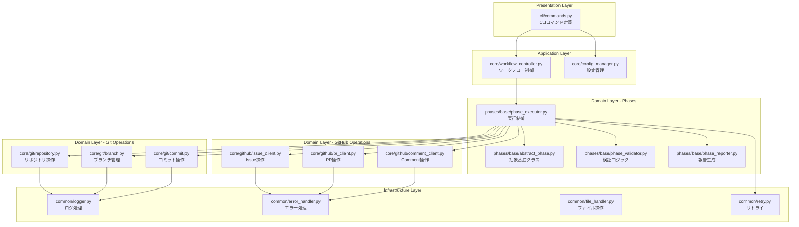

# 詳細設計書 - Issue #376

## プロジェクト情報

- **Issue番号**: #376
- **タイトル**: [TASK] ai-workflowスクリプトの大規模リファクタリング
- **作成日**: 2025-10-12
- **Planning Document**: @.ai-workflow/issue-376/00_planning/output/planning.md
- **Requirements Document**: @.ai-workflow/issue-376/01_requirements/output/requirements.md

---

## 1. アーキテクチャ設計

### 1.1 現状分析

#### 既存コードの問題点

```
現状のファイル構成:
├─ main.py (1,080行)                    - CLI層とワークフロー制御が混在
├─ phases/
│  └─ base_phase.py (1,142行)         - 実行/検証/報告/リトライが1クラスに集約
├─ core/
│  ├─ git_manager.py (939行)          - リポジトリ/ブランチ/コミット操作が混在
│  └─ github_client.py (1,111行)      - Issue/PR/Comment操作が1クラスに集約
└─ phases/
   └─ evaluation.py (781行)            - 評価ロジックが肥大化
```

#### 既存アーキテクチャの課題

1. **単一責任原則の違反**: 各クラスが複数の責務を持つ
2. **密結合**: コンポーネント間の依存関係が複雑
3. **テストの困難性**: 大きなクラスのため、モックが困難
4. **コードの重複**: 類似処理が複数箇所に存在

### 1.2 新アーキテクチャ（クリーンアーキテクチャ原則）



### 1.3 レイヤー別の責務

#### Presentation Layer（CLI層）
- **責務**: ユーザー入力の受付とコマンド実行
- **ファイル**: `cli/commands.py`
- **依存**: Application Layer（WorkflowController、ConfigManager）

#### Application Layer（アプリケーション層）
- **責務**: ビジネスロジックの調整とワークフロー制御
- **ファイル**: `core/workflow_controller.py`, `core/config_manager.py`
- **依存**: Domain Layer（Phase関連、Git操作、GitHub操作）

#### Domain Layer（ドメイン層）
- **責務**: 業務ロジックの実装
- **サブレイヤー**:
  - **Phases**: フェーズ実行・検証・報告
  - **Git Operations**: Git操作の実装
  - **GitHub Operations**: GitHub API操作の実装
- **依存**: Infrastructure Layer（共通処理）

#### Infrastructure Layer（インフラ層）
- **責務**: 技術的な共通処理
- **ファイル**: `common/logger.py`, `common/error_handler.py`, `common/file_handler.py`, `common/retry.py`
- **依存**: なし（最下層）

---

## 2. 実装戦略判断

### 実装戦略: **REFACTOR**

### 判断根拠

#### 根拠1: Issue本文で明示的に「リファクタリング」を目標としている
- Issue タイトル: 「[TASK] ai-workflowスクリプトの大規模リファクタリング」
- Issue 本文: 「コードの可読性・保守性・テスタビリティを向上させるため、大規模なリファクタリングを実施します」

#### 根拠2: 外部インターフェースは変更せず、内部実装のみを変更
- **CLI**: `main.py` の `@click.command()` デコレータは維持
- **API**: 各Phase クラスの `execute()`, `review()` メソッドは維持
- **設定ファイル**: `config.yaml` の構造は変更なし
- **メタデータ**: `metadata.json` のフォーマットは変更なし

#### 根拠3: 既存機能の動作保証が必須
- Planning Document（planning.md:71）: 「Issue本文に「既存機能の動作を維持すること」が明記されている」
- 既存のテストケース（70+ファイル）がすべて通過する必要がある

#### 根拠4: 新規機能追加ではなく、構造改善が中心
- 機能追加: なし
- 構造改善: クラス分割、責務分離、インターフェース定義

---

## 3. テスト戦略判断

### テスト戦略: **ALL（UNIT + INTEGRATION + BDD）**

### 判断根拠

#### 根拠1: UNIT_TEST（必須）
- **理由**: リファクタリング後の各クラス・関数が正しく動作することを保証
- **対象**:
  - 分割された小さなクラス（GitRepository、GitBranch、GitCommit等）
  - 新規抽出されたヘルパー関数・ユーティリティクラス
- **例**:
  - `tests/unit/core/test_git_repository.py`
  - `tests/unit/core/test_git_branch.py`
  - `tests/unit/phases/test_phase_executor.py`

#### 根拠2: INTEGRATION_TEST（必須）
- **理由**: リファクタリング後も、コンポーネント間の連携が正しく動作することを保証
- **対象**:
  - Git操作 + GitHub API連携のような複数クラス協調動作
  - Claude Agent SDK統合
  - ファイルI/O + メタデータ管理の連携
- **例**:
  - `tests/integration/test_git_github_integration.py`
  - `tests/integration/test_phase_workflow_integration.py`

#### 根拠3: BDD_TEST（必須）
- **理由**: エンドユーザー視点での動作保証（「既存機能の動作を維持」の検証）
- **対象**:
  - ワークフロー全体（Phase 0~9）の正常動作確認
  - エラーハンドリング・リトライ機能の振る舞い検証
  - CLIコマンドの振る舞い検証（init, execute, resume等）
- **例**:
  - `tests/features/workflow_execution.feature`
  - `tests/features/error_handling.feature`

#### 根拠4: リファクタリングの性質上、全レベルでの回帰テストが必須
- 単体テストだけでは統合時の不具合を検知できない
- 統合テストだけでは個別クラスのバグ箇所特定が困難
- BDDテストで実際のユースケースレベルでの動作保証が必要

---

## 4. テストコード戦略判断

### テストコード戦略: **BOTH_TEST（既存拡張 + 新規作成）**

### 判断根拠

#### 根拠1: EXTEND_TEST（既存テスト拡張）が必要
- **既存テストファイル数**: 70+ファイル
- **修正が必要な理由**:
  1. インポートパス変更（クラス・関数の移動に伴う）
     ```python
     # Before
     from core.git_manager import GitManager

     # After
     from core.git.repository import GitRepository
     from core.git.branch import GitBranch
     from core.git.commit import GitCommit
     ```
  2. モックの差し替え（新しいインターフェースに対応）
  3. アサーション修正（リファクタリングによる戻り値変更）

#### 根拠2: CREATE_TEST（新規テスト作成）が必要
- **新規クラス用のテスト作成**:
  - `tests/unit/core/git/test_repository.py`（新規）
  - `tests/unit/core/git/test_branch.py`（新規）
  - `tests/unit/core/git/test_commit.py`（新規）
  - `tests/unit/core/github/test_issue_client.py`（新規）
  - `tests/unit/core/github/test_pr_client.py`（新規）
  - `tests/unit/core/github/test_comment_client.py`（新規）
  - `tests/unit/phases/base/test_abstract_phase.py`（新規）
  - `tests/unit/phases/base/test_phase_executor.py`（新規）
  - `tests/unit/phases/base/test_phase_validator.py`（新規）
  - `tests/unit/phases/base/test_phase_reporter.py`（新規）
  - `tests/unit/common/test_logger.py`（新規）
  - `tests/unit/common/test_error_handler.py`（新規）
  - `tests/unit/common/test_retry.py`（新規）

#### 根拠3: テストカバレッジの向上が目標の一つ
- Planning Document（planning.md:128）: 「テストカバレッジの向上が目標の一つ」
- 要件定義書（requirements.md:278）: 「テストカバレッジを80%以上に向上させる」

---

## 5. 影響範囲分析

### 5.1 既存コードへの影響

#### 直接変更が必要なファイル（5ファイル + ディレクトリ構造変更）

| ファイル | 現在の行数 | 予想行数（変更後） | 変更内容 |
|---------|------------|-------------------|---------|
| `main.py` | 1,080行 | 500行以下 | CLI層の分離、ワークフロー制御の抽出 |
| `phases/base_phase.py` | 1,142行 | 200行以下 | 4クラスに分割（AbstractPhase, Executor, Validator, Reporter） |
| `core/git_manager.py` | 939行 | 削除 | 3クラスに分割（Repository, Branch, Commit） |
| `core/github_client.py` | 1,111行 | 削除 | 3クラスに分割（IssueClient, PRClient, CommentClient） |
| `phases/evaluation.py` | 781行 | 300行以下 | 機能分割（Executor, Reporter, Analyzer） |

#### インポート修正が必要なファイル（推定40+ファイル）

1. **各フェーズクラス（10ファイル）**:
   - `phases/planning.py`
   - `phases/requirements.py`
   - `phases/design.py`
   - `phases/test_scenario.py`
   - `phases/implementation.py`
   - `phases/test_implementation.py`
   - `phases/testing.py`
   - `phases/documentation.py`
   - `phases/report.py`
   - `phases/evaluation.py`

2. **テストファイル（70+ファイル）**: 全て確認が必要

3. **ヘルパーモジュール（5ファイル）**:
   - `core/metadata_manager.py`
   - `core/claude_agent_client.py`
   - `core/workflow_state.py`
   - `core/phase_dependencies.py`
   - `core/content_parser.py`

### 5.2 依存関係の変更

#### Before（現状）
```python
# main.py
from core.git_manager import GitManager
from core.github_client import GitHubClient
from phases.base_phase import BasePhase

# phases/requirements.py
from phases.base_phase import BasePhase
from core.git_manager import GitManager
from core.github_client import GitHubClient
```

#### After（リファクタリング後）
```python
# cli/commands.py
from core.workflow_controller import WorkflowController
from core.config_manager import ConfigManager

# core/workflow_controller.py
from core.git.repository import GitRepository
from core.git.branch import GitBranch
from core.git.commit import GitCommit
from core.github.issue_client import IssueClient
from core.github.pr_client import PRClient
from core.github.comment_client import CommentClient
from phases.base.abstract_phase import AbstractPhase
from phases.base.phase_executor import PhaseExecutor

# phases/requirements.py
from phases.base.abstract_phase import AbstractPhase
from phases.base.phase_executor import PhaseExecutor
from phases.base.phase_validator import PhaseValidator
from phases.base.phase_reporter import PhaseReporter
```

### 5.3 マイグレーション要否

#### データベーススキーマ変更
- **不要**: このプロジェクトはDBを使用していない

#### 設定ファイル変更
- **不要**: `config.yaml` の構造は維持

#### メタデータフォーマット変更
- **不要**: `metadata.json` の構造は維持
- **後方互換性**: 既存のmetadata.jsonファイルはそのまま動作

#### 環境変数変更
- **不要**: 既存の環境変数（GITHUB_TOKEN, GITHUB_REPOSITORY等）は維持

---

## 6. 変更・追加ファイルリスト

### 6.1 新規作成ファイル（31ファイル）

#### CLI層（1ファイル）
- `scripts/ai-workflow/cli/__init__.py`（新規）
- `scripts/ai-workflow/cli/commands.py`（新規） - main.pyのCLI層を抽出

#### Application層（2ファイル）
- `scripts/ai-workflow/core/workflow_controller.py`（新規） - ワークフロー制御ロジック
- `scripts/ai-workflow/core/config_manager.py`（新規） - 設定管理

#### Domain層 - Git Operations（4ファイル）
- `scripts/ai-workflow/core/git/__init__.py`（新規）
- `scripts/ai-workflow/core/git/repository.py`（新規） - リポジトリ操作
- `scripts/ai-workflow/core/git/branch.py`（新規） - ブランチ管理
- `scripts/ai-workflow/core/git/commit.py`（新規） - コミット操作

#### Domain層 - GitHub Operations（4ファイル）
- `scripts/ai-workflow/core/github/__init__.py`（新規）
- `scripts/ai-workflow/core/github/issue_client.py`（新規） - Issue操作
- `scripts/ai-workflow/core/github/pr_client.py`（新規） - PR操作
- `scripts/ai-workflow/core/github/comment_client.py`（新規） - Comment操作

#### Domain層 - Phases（5ファイル）
- `scripts/ai-workflow/phases/base/__init__.py`（新規）
- `scripts/ai-workflow/phases/base/abstract_phase.py`（新規） - 抽象基底クラス
- `scripts/ai-workflow/phases/base/phase_executor.py`（新規） - 実行制御
- `scripts/ai-workflow/phases/base/phase_validator.py`（新規） - 検証ロジック
- `scripts/ai-workflow/phases/base/phase_reporter.py`（新規） - 報告生成

#### Infrastructure層（5ファイル）
- `scripts/ai-workflow/common/__init__.py`（新規）
- `scripts/ai-workflow/common/logger.py`（新規） - ログ処理
- `scripts/ai-workflow/common/error_handler.py`（新規） - エラー処理
- `scripts/ai-workflow/common/file_handler.py`（新規） - ファイル操作
- `scripts/ai-workflow/common/retry.py`（新規） - リトライロジック

#### テストファイル（10ファイル）
- `scripts/ai-workflow/tests/unit/core/git/test_repository.py`（新規）
- `scripts/ai-workflow/tests/unit/core/git/test_branch.py`（新規）
- `scripts/ai-workflow/tests/unit/core/git/test_commit.py`（新規）
- `scripts/ai-workflow/tests/unit/core/github/test_issue_client.py`（新規）
- `scripts/ai-workflow/tests/unit/core/github/test_pr_client.py`（新規）
- `scripts/ai-workflow/tests/unit/core/github/test_comment_client.py`（新規）
- `scripts/ai-workflow/tests/unit/phases/base/test_abstract_phase.py`（新規）
- `scripts/ai-workflow/tests/unit/phases/base/test_phase_executor.py`（新規）
- `scripts/ai-workflow/tests/unit/phases/base/test_phase_validator.py`（新規）
- `scripts/ai-workflow/tests/unit/phases/base/test_phase_reporter.py`（新規）

### 6.2 修正が必要な既存ファイル（17ファイル + テスト70+ファイル）

#### メインファイル
- `scripts/ai-workflow/main.py` - CLI層の分離、インポートパス修正

#### Phaseファイル（10ファイル）
- `scripts/ai-workflow/phases/base_phase.py` - 削除予定（4ファイルに分割）
- `scripts/ai-workflow/phases/planning.py` - インポートパス修正
- `scripts/ai-workflow/phases/requirements.py` - インポートパス修正
- `scripts/ai-workflow/phases/design.py` - インポートパス修正
- `scripts/ai-workflow/phases/test_scenario.py` - インポートパス修正
- `scripts/ai-workflow/phases/implementation.py` - インポートパス修正
- `scripts/ai-workflow/phases/test_implementation.py` - インポートパス修正
- `scripts/ai-workflow/phases/testing.py` - インポートパス修正
- `scripts/ai-workflow/phases/documentation.py` - インポートパス修正
- `scripts/ai-workflow/phases/report.py` - インポートパス修正
- `scripts/ai-workflow/phases/evaluation.py` - 機能分割、インポートパス修正

#### Coreファイル（5ファイル）
- `scripts/ai-workflow/core/git_manager.py` - 削除予定（3ファイルに分割）
- `scripts/ai-workflow/core/github_client.py` - 削除予定（3ファイルに分割）
- `scripts/ai-workflow/core/metadata_manager.py` - インポートパス修正
- `scripts/ai-workflow/core/claude_agent_client.py` - インポートパス修正
- `scripts/ai-workflow/core/workflow_state.py` - インポートパス修正

#### テストファイル（70+ファイル）
- すべてのテストファイル - インポートパス修正、モック差し替え

### 6.3 削除が必要なファイル（2ファイル）

- `scripts/ai-workflow/core/git_manager.py` - 分割後削除
- `scripts/ai-workflow/core/github_client.py` - 分割後削除

**注意**: 削除は段階的に実施。分割クラス作成 → テスト動作確認 → 旧ファイル削除の順序を守ること。

---

## 7. 詳細設計

### 7.1 CLI層の設計

#### cli/commands.py（新規作成）

**責務**: CLIコマンドの定義とユーザー入力の受付

```python
"""CLI Commands - ユーザー入力の受付とコマンド実行"""
import click
from pathlib import Path
from typing import Optional
from core.workflow_controller import WorkflowController
from core.config_manager import ConfigManager

@click.group()
def cli():
    """AI駆動開発自動化ワークフロー"""
    pass

@cli.command()
@click.option('--issue-url', required=True, help='GitHub Issue URL')
def init(issue_url: str):
    """ワークフロー初期化

    Args:
        issue_url: GitHub Issue URL（例: https://github.com/owner/repo/issues/123）

    処理フロー:
        1. Issue番号をURLから抽出
        2. WorkflowControllerを初期化
        3. ワークフロー初期化（メタデータ作成、ブランチ作成、PR作成）
    """
    # WorkflowControllerに委譲
    controller = WorkflowController.initialize(issue_url)
    controller.create_workflow()

@cli.command()
@click.option('--phase', type=click.Choice(['all', 'planning', 'requirements', ...]))
@click.option('--issue', required=True, help='Issue number')
@click.option('--git-user', help='Git commit user name')
@click.option('--git-email', help='Git commit user email')
@click.option('--skip-dependency-check', is_flag=True)
@click.option('--ignore-dependencies', is_flag=True)
def execute(phase: str, issue: str, git_user: Optional[str], git_email: Optional[str],
            skip_dependency_check: bool, ignore_dependencies: bool):
    """フェーズ実行

    Args:
        phase: 実行するフェーズ（all, planning, requirements, design等）
        issue: Issue番号
        git_user: Gitコミットユーザー名（オプション）
        git_email: Gitコミットメールアドレス（オプション）
        skip_dependency_check: 依存関係チェックをスキップ
        ignore_dependencies: 依存関係違反を警告のみで許可

    処理フロー:
        1. ConfigManagerで設定ロード
        2. WorkflowControllerを初期化
        3. フェーズ実行（phase='all'の場合は全フェーズ、それ以外は個別フェーズ）
    """
    # ConfigManagerで設定ロード
    config = ConfigManager.load(git_user=git_user, git_email=git_email)

    # WorkflowControllerを初期化
    controller = WorkflowController.load(
        issue=issue,
        config=config,
        skip_dependency_check=skip_dependency_check,
        ignore_dependencies=ignore_dependencies
    )

    # フェーズ実行
    if phase == 'all':
        result = controller.execute_all_phases()
    else:
        result = controller.execute_phase(phase)

    # 結果表示
    if result['success']:
        click.echo('[OK] Phase completed successfully')
    else:
        click.echo(f"[ERROR] Phase failed: {result['error']}")
        sys.exit(1)

@cli.command()
@click.option('--phase', required=True)
@click.option('--issue', required=True, help='Issue number')
def review(phase: str, issue: str):
    """フェーズレビュー

    処理フロー:
        1. WorkflowControllerを初期化
        2. レビュー結果を取得
        3. レビュー結果を表示
    """
    controller = WorkflowController.load(issue=issue)
    status = controller.get_phase_status(phase)
    click.echo(f'[OK] Phase {phase} status: {status}')

if __name__ == '__main__':
    cli()
```

**主要メソッド**:
- `init()`: ワークフロー初期化コマンド
- `execute()`: フェーズ実行コマンド
- `review()`: フェーズレビューコマンド

### 7.2 Application層の設計

#### core/workflow_controller.py（新規作成）

**責務**: ワークフロー全体の制御とフェーズ実行の調整

```python
"""Workflow Controller - ワークフロー全体の制御"""
from pathlib import Path
from typing import Dict, Any, List, Optional
from core.metadata_manager import MetadataManager
from core.claude_agent_client import ClaudeAgentClient
from core.github.issue_client import IssueClient
from core.github.pr_client import PRClient
from core.git.repository import GitRepository
from core.git.branch import GitBranch
from core.git.commit import GitCommit
from phases.base.phase_executor import PhaseExecutor
from common.logger import Logger

class WorkflowController:
    """ワークフロー制御クラス"""

    def __init__(
        self,
        repo_path: Path,
        metadata_manager: MetadataManager,
        claude_client: ClaudeAgentClient,
        issue_client: IssueClient,
        pr_client: PRClient,
        git_repository: GitRepository,
        git_branch: GitBranch,
        git_commit: GitCommit,
        skip_dependency_check: bool = False,
        ignore_dependencies: bool = False
    ):
        """初期化

        Args:
            repo_path: リポジトリルートパス
            metadata_manager: メタデータ管理
            claude_client: Claude Agent SDKクライアント
            issue_client: Issue操作クライアント
            pr_client: PR操作クライアント
            git_repository: Gitリポジトリ操作
            git_branch: Gitブランチ操作
            git_commit: Gitコミット操作
            skip_dependency_check: 依存関係チェックをスキップ
            ignore_dependencies: 依存関係違反を警告のみで許可
        """
        self.repo_path = repo_path
        self.metadata = metadata_manager
        self.claude = claude_client
        self.issue_client = issue_client
        self.pr_client = pr_client
        self.git_repository = git_repository
        self.git_branch = git_branch
        self.git_commit = git_commit
        self.skip_dependency_check = skip_dependency_check
        self.ignore_dependencies = ignore_dependencies
        self.logger = Logger.get_logger(__name__)

    @classmethod
    def initialize(cls, issue_url: str) -> 'WorkflowController':
        """ワークフロー初期化（init コマンド用）

        Args:
            issue_url: GitHub Issue URL

        Returns:
            WorkflowController: 初期化されたインスタンス
        """
        # Issue番号を抽出
        issue_number = issue_url.rstrip('/').split('/')[-1]

        # リポジトリルート取得
        repo_path = cls._get_repo_root()

        # 各コンポーネント初期化
        # ... (省略)

        return cls(
            repo_path=repo_path,
            metadata_manager=metadata_manager,
            claude_client=claude_client,
            issue_client=issue_client,
            pr_client=pr_client,
            git_repository=git_repository,
            git_branch=git_branch,
            git_commit=git_commit
        )

    @classmethod
    def load(
        cls,
        issue: str,
        config: Optional[Dict[str, Any]] = None,
        skip_dependency_check: bool = False,
        ignore_dependencies: bool = False
    ) -> 'WorkflowController':
        """既存ワークフローをロード（execute コマンド用）

        Args:
            issue: Issue番号
            config: 設定（ConfigManagerから取得）
            skip_dependency_check: 依存関係チェックをスキップ
            ignore_dependencies: 依存関係違反を警告のみで許可

        Returns:
            WorkflowController: ロードされたインスタンス
        """
        # ... (省略)
        return cls(...)

    def create_workflow(self) -> Dict[str, Any]:
        """ワークフロー作成（init コマンドの実装）

        処理フロー:
            1. メタデータ作成
            2. ブランチ作成
            3. 初期コミット
            4. リモートプッシュ
            5. ドラフトPR作成

        Returns:
            Dict[str, Any]: 作成結果
                - success: bool
                - metadata_path: Path
                - branch_name: str
                - pr_url: str
                - error: Optional[str]
        """
        # ... (省略)

    def execute_all_phases(self) -> Dict[str, Any]:
        """全フェーズを順次実行

        処理フロー:
            1. レジューム可能性チェック
            2. 各フェーズを順次実行（planning → evaluation）
            3. 失敗時は中断
            4. 成功時は実行サマリーを生成

        Returns:
            Dict[str, Any]: 実行結果サマリー
                - success: bool
                - completed_phases: List[str]
                - failed_phase: Optional[str]
                - error: Optional[str]
                - total_duration: float
                - total_cost: float
        """
        # ... (省略)

    def execute_phase(self, phase_name: str) -> Dict[str, Any]:
        """個別フェーズを実行

        Args:
            phase_name: フェーズ名（planning, requirements, design等）

        Returns:
            Dict[str, Any]: 実行結果
                - success: bool
                - review_result: Optional[str]
                - error: Optional[str]
        """
        # PhaseExecutorに委譲
        executor = PhaseExecutor.create(
            phase_name=phase_name,
            metadata_manager=self.metadata,
            claude_client=self.claude,
            issue_client=self.issue_client,
            git_commit=self.git_commit,
            skip_dependency_check=self.skip_dependency_check,
            ignore_dependencies=self.ignore_dependencies
        )

        return executor.run()

    def get_phase_status(self, phase_name: str) -> str:
        """フェーズステータスを取得

        Args:
            phase_name: フェーズ名

        Returns:
            str: ステータス（pending, in_progress, completed, failed）
        """
        return self.metadata.get_phase_status(phase_name)
```

**主要メソッド**:
- `initialize()`: ワークフロー初期化
- `load()`: 既存ワークフローをロード
- `create_workflow()`: ワークフロー作成
- `execute_all_phases()`: 全フェーズ実行
- `execute_phase()`: 個別フェーズ実行
- `get_phase_status()`: フェーズステータス取得

#### core/config_manager.py（新規作成）

**責務**: 設定ファイル・環境変数の管理

```python
"""Config Manager - 設定管理"""
import os
import yaml
from pathlib import Path
from typing import Dict, Any, Optional

class ConfigManager:
    """設定管理クラス"""

    def __init__(self, config_data: Dict[str, Any]):
        """初期化

        Args:
            config_data: 設定データ
        """
        self.data = config_data

    @classmethod
    def load(
        cls,
        config_path: Optional[Path] = None,
        git_user: Optional[str] = None,
        git_email: Optional[str] = None
    ) -> 'ConfigManager':
        """設定をロード

        優先順位:
            1. CLIオプション（git_user, git_email）
            2. 環境変数
            3. config.yaml
            4. デフォルト値

        Args:
            config_path: 設定ファイルパス（省略時はデフォルト）
            git_user: Gitユーザー名（CLIオプション）
            git_email: Gitメールアドレス（CLIオプション）

        Returns:
            ConfigManager: 設定マネージャーインスタンス
        """
        # config.yamlをロード
        if config_path and config_path.exists():
            with open(config_path, 'r') as f:
                config_data = yaml.safe_load(f)
        else:
            config_data = {}

        # 環境変数をマージ
        config_data['github_token'] = os.getenv('GITHUB_TOKEN')
        config_data['github_repository'] = os.getenv('GITHUB_REPOSITORY')

        # CLIオプション優先
        if git_user:
            config_data['git_user'] = git_user
        elif 'git_user' not in config_data:
            config_data['git_user'] = os.getenv('GIT_COMMIT_USER_NAME', 'AI Workflow')

        if git_email:
            config_data['git_email'] = git_email
        elif 'git_email' not in config_data:
            config_data['git_email'] = os.getenv('GIT_COMMIT_USER_EMAIL', 'ai-workflow@tielec.local')

        return cls(config_data)

    def get(self, key: str, default: Any = None) -> Any:
        """設定値を取得

        Args:
            key: 設定キー
            default: デフォルト値

        Returns:
            Any: 設定値
        """
        return self.data.get(key, default)

    def set(self, key: str, value: Any):
        """設定値を設定

        Args:
            key: 設定キー
            value: 設定値
        """
        self.data[key] = value
```

**主要メソッド**:
- `load()`: 設定をロード（環境変数、config.yaml、デフォルト値の優先順位）
- `get()`: 設定値を取得
- `set()`: 設定値を設定

### 7.3 Domain層 - Git Operationsの設計

#### core/git/repository.py（新規作成）

**責務**: Gitリポジトリの操作

```python
"""Git Repository - リポジトリ操作"""
from pathlib import Path
from typing import Dict, Any, List
from git import Repo, GitCommandError
from common.logger import Logger

class GitRepository:
    """Gitリポジトリ操作クラス"""

    def __init__(self, repo_path: Path):
        """初期化

        Args:
            repo_path: リポジトリルートパス

        Raises:
            RuntimeError: Gitリポジトリが見つからない場合
        """
        self.repo_path = repo_path
        self.logger = Logger.get_logger(__name__)

        try:
            self.repo = Repo(repo_path)
        except Exception as e:
            raise RuntimeError(f"Git repository not found: {repo_path}") from e

    def get_root(self) -> Path:
        """リポジトリルートを取得

        Returns:
            Path: リポジトリルートパス
        """
        return Path(self.repo.working_dir)

    def get_status(self) -> Dict[str, Any]:
        """Git状態を取得

        Returns:
            Dict[str, Any]:
                - is_dirty: bool - 未コミットの変更があるか
                - untracked_files: List[str] - 未追跡ファイル一覧
                - modified_files: List[str] - 変更ファイル一覧
                - staged_files: List[str] - ステージングエリアのファイル一覧
        """
        return {
            'is_dirty': self.repo.is_dirty(),
            'untracked_files': self.repo.untracked_files,
            'modified_files': [item.a_path for item in self.repo.index.diff(None)],
            'staged_files': [item.a_path for item in self.repo.index.diff('HEAD')]
        }

    def get_changed_files(self, issue_number: int) -> List[str]:
        """変更ファイル一覧を取得（Issue番号でフィルタリング）

        Args:
            issue_number: Issue番号

        Returns:
            List[str]: 変更ファイル一覧
        """
        status = self.get_status()
        all_files = (
            status['untracked_files'] +
            status['modified_files'] +
            status['staged_files']
        )

        # 重複除去
        all_files = list(set(all_files))

        # .ai-workflow/issue-XXX/ 配下のファイルのみフィルタリング
        target_prefix = f".ai-workflow/issue-{issue_number}/"
        return [f for f in all_files if f.startswith(target_prefix)]
```

**主要メソッド**:
- `get_root()`: リポジトリルートを取得
- `get_status()`: Git状態を取得
- `get_changed_files()`: 変更ファイル一覧を取得

#### core/git/branch.py（新規作成）

**責務**: Gitブランチの管理

```python
"""Git Branch - ブランチ管理"""
from pathlib import Path
from typing import Dict, Any, Optional
from git import Repo, GitCommandError
from common.logger import Logger
from common.error_handler import GitBranchError

class GitBranch:
    """Gitブランチ管理クラス"""

    def __init__(self, repo: Repo):
        """初期化

        Args:
            repo: Gitリポジトリインスタンス
        """
        self.repo = repo
        self.logger = Logger.get_logger(__name__)

    def create(
        self,
        branch_name: str,
        base_branch: Optional[str] = None
    ) -> Dict[str, Any]:
        """ブランチを作成してチェックアウト

        Args:
            branch_name: 作成するブランチ名
            base_branch: 基準となるブランチ名（省略時は現在のブランチ）

        Returns:
            Dict[str, Any]:
                - success: bool
                - branch_name: str
                - error: Optional[str]

        Raises:
            GitBranchError: ブランチ作成に失敗した場合
        """
        try:
            # ブランチ存在チェック
            if self.exists(branch_name):
                self.logger.warning(f"Branch already exists: {branch_name}")
                # 既存ブランチをチェックアウト
                self.repo.git.checkout(branch_name)
                return {
                    'success': True,
                    'branch_name': branch_name,
                    'error': None
                }

            # 基準ブランチ指定時は、そのブランチにチェックアウト
            if base_branch:
                self.repo.git.checkout(base_branch)

            # ブランチ作成してチェックアウト
            self.repo.git.checkout('-b', branch_name)
            self.logger.info(f"Branch created: {branch_name}")

            return {
                'success': True,
                'branch_name': branch_name,
                'error': None
            }

        except GitCommandError as e:
            self.logger.error(f"Failed to create branch: {e}")
            raise GitBranchError(f"Failed to create branch: {e}") from e

    def switch(
        self,
        branch_name: str,
        force: bool = False
    ) -> Dict[str, Any]:
        """ブランチを切り替え

        Args:
            branch_name: 切り替え先ブランチ名
            force: 強制切り替え（未コミット変更を無視）

        Returns:
            Dict[str, Any]:
                - success: bool
                - branch_name: str
                - error: Optional[str]
        """
        try:
            # 現在のブランチと同じ場合はスキップ
            current = self.get_current()
            if current == branch_name:
                return {
                    'success': True,
                    'branch_name': branch_name,
                    'error': None
                }

            # ブランチ切り替え
            if force:
                self.repo.git.checkout('-f', branch_name)
            else:
                self.repo.git.checkout(branch_name)

            self.logger.info(f"Switched to branch: {branch_name}")
            return {
                'success': True,
                'branch_name': branch_name,
                'error': None
            }

        except GitCommandError as e:
            self.logger.error(f"Failed to switch branch: {e}")
            return {
                'success': False,
                'branch_name': branch_name,
                'error': str(e)
            }

    def exists(self, branch_name: str, check_remote: bool = True) -> bool:
        """ブランチの存在確認

        Args:
            branch_name: ブランチ名
            check_remote: リモートブランチもチェックするか

        Returns:
            bool: ブランチが存在する場合True
        """
        # ローカルブランチチェック
        branches = [b.name for b in self.repo.branches]
        if branch_name in branches:
            return True

        # リモートブランチチェック
        if check_remote:
            try:
                remote_branches = [ref.name for ref in self.repo.remote('origin').refs]
                if f'origin/{branch_name}' in remote_branches:
                    return True
            except Exception:
                pass

        return False

    def get_current(self) -> str:
        """現在のブランチ名を取得

        Returns:
            str: 現在のブランチ名
        """
        try:
            return self.repo.active_branch.name
        except TypeError:
            # デタッチHEAD状態の場合
            return 'HEAD'
```

**主要メソッド**:
- `create()`: ブランチを作成してチェックアウト
- `switch()`: ブランチを切り替え
- `exists()`: ブランチの存在確認
- `get_current()`: 現在のブランチ名を取得

#### core/git/commit.py（新規作成）

**責務**: Gitコミット操作

```python
"""Git Commit - コミット操作"""
from pathlib import Path
from typing import Dict, Any, List, Optional
from git import Repo, GitCommandError
from common.logger import Logger
from common.retry import retry

class GitCommit:
    """Gitコミット操作クラス"""

    def __init__(self, repo: Repo):
        """初期化

        Args:
            repo: Gitリポジトリインスタンス
        """
        self.repo = repo
        self.logger = Logger.get_logger(__name__)

    def commit_phase_output(
        self,
        phase_name: str,
        issue_number: int,
        status: str,
        review_result: Optional[str] = None
    ) -> Dict[str, Any]:
        """Phase成果物をコミット

        Args:
            phase_name: フェーズ名
            issue_number: Issue番号
            status: ステータス（completed/failed）
            review_result: レビュー結果（PASS/PASS_WITH_SUGGESTIONS/FAIL）

        Returns:
            Dict[str, Any]:
                - success: bool
                - commit_hash: Optional[str]
                - files_committed: List[str]
                - error: Optional[str]
        """
        try:
            # 変更ファイル取得
            from core.git.repository import GitRepository
            repository = GitRepository(Path(self.repo.working_dir))
            target_files = repository.get_changed_files(issue_number)

            if not target_files:
                self.logger.info("No files to commit")
                return {
                    'success': True,
                    'commit_hash': None,
                    'files_committed': [],
                    'error': None
                }

            # git add
            self.repo.index.add(target_files)

            # Git設定確認
            self._ensure_git_config()

            # コミットメッセージ生成
            commit_message = self._create_commit_message(
                phase_name=phase_name,
                issue_number=issue_number,
                status=status,
                review_result=review_result
            )

            # git commit
            commit = self.repo.index.commit(commit_message)

            self.logger.info(f"Commit successful: {commit.hexsha[:7]}")
            return {
                'success': True,
                'commit_hash': commit.hexsha,
                'files_committed': target_files,
                'error': None
            }

        except GitCommandError as e:
            self.logger.error(f"Git commit failed: {e}")
            return {
                'success': False,
                'commit_hash': None,
                'files_committed': [],
                'error': str(e)
            }

    @retry(max_attempts=3, delay=2.0)
    def push_to_remote(self) -> Dict[str, Any]:
        """リモートリポジトリにpush（リトライ機能付き）

        Returns:
            Dict[str, Any]:
                - success: bool
                - retries: int
                - error: Optional[str]
        """
        try:
            current_branch = self.repo.active_branch.name
            origin = self.repo.remote(name='origin')

            # git push
            push_info = origin.push(refspec=f'HEAD:{current_branch}')

            # push結果を確認
            for info in push_info:
                if info.flags & info.ERROR:
                    self.logger.error(f"Push failed: {info.summary}")
                    return {
                        'success': False,
                        'retries': 0,
                        'error': f'Push error: {info.summary}'
                    }

            self.logger.info("Push successful")
            return {
                'success': True,
                'retries': 0,
                'error': None
            }

        except GitCommandError as e:
            self.logger.error(f"Push failed: {e}")
            raise  # retryデコレータでリトライ

    def _create_commit_message(
        self,
        phase_name: str,
        issue_number: int,
        status: str,
        review_result: Optional[str]
    ) -> str:
        """コミットメッセージを生成

        Args:
            phase_name: フェーズ名
            issue_number: Issue番号
            status: ステータス
            review_result: レビュー結果

        Returns:
            str: コミットメッセージ
        """
        from phases.base.abstract_phase import AbstractPhase

        phase_number = AbstractPhase.PHASE_NUMBERS.get(phase_name, '00')
        review = review_result or 'N/A'

        message_parts = [
            f"[ai-workflow] Phase {int(phase_number)} ({phase_name}) - {status}",
            "",
            f"Issue: #{issue_number}",
            f"Phase: {int(phase_number)} ({phase_name})",
            f"Status: {status}",
            f"Review: {review}",
            "",
            "Auto-generated by AI Workflow"
        ]

        return '\n'.join(message_parts)

    def _ensure_git_config(self):
        """Git設定を確認し、未設定の場合は環境変数から設定"""
        import os

        try:
            config_reader = self.repo.config_reader()

            # user.nameをチェック
            try:
                user_name = config_reader.get_value('user', 'name')
            except Exception:
                user_name = os.getenv('GIT_COMMIT_USER_NAME', 'AI Workflow')

            # user.emailをチェック
            try:
                user_email = config_reader.get_value('user', 'email')
            except Exception:
                user_email = os.getenv('GIT_COMMIT_USER_EMAIL', 'ai-workflow@tielec.local')

            # 設定
            with self.repo.config_writer() as config_writer:
                config_writer.set_value('user', 'name', user_name)
                config_writer.set_value('user', 'email', user_email)

            self.logger.info(f"Git config set: {user_name} <{user_email}>")

        except Exception as e:
            self.logger.warning(f"Failed to ensure git config: {e}")
```

**主要メソッド**:
- `commit_phase_output()`: Phase成果物をコミット
- `push_to_remote()`: リモートリポジトリにpush（リトライ機能付き）
- `_create_commit_message()`: コミットメッセージを生成
- `_ensure_git_config()`: Git設定を確認

### 7.4 Domain層 - GitHub Operationsの設計

#### core/github/issue_client.py（新規作成）

**責務**: GitHub Issue操作

```python
"""GitHub Issue Client - Issue操作"""
from typing import Dict, Any, List, Optional
from github import Github, GithubException
from github.Issue import Issue
from common.logger import Logger
from common.error_handler import GitHubAPIError

class IssueClient:
    """GitHub Issue操作クライアント"""

    def __init__(self, github: Github, repository_name: str):
        """初期化

        Args:
            github: PyGitHub Githubインスタンス
            repository_name: リポジトリ名（例: "tielec/infrastructure-as-code"）
        """
        self.github = github
        self.repository = github.get_repo(repository_name)
        self.logger = Logger.get_logger(__name__)

    def get_issue(self, issue_number: int) -> Issue:
        """Issue情報を取得

        Args:
            issue_number: Issue番号

        Returns:
            Issue: Issue情報

        Raises:
            GitHubAPIError: API呼び出しエラー
        """
        try:
            return self.repository.get_issue(number=issue_number)
        except GithubException as e:
            self.logger.error(f"Failed to get issue #{issue_number}: {e}")
            raise GitHubAPIError(f"Failed to get issue #{issue_number}: {e}") from e

    def get_issue_info(self, issue_number: int) -> Dict[str, Any]:
        """Issue情報を辞書形式で取得

        Args:
            issue_number: Issue番号

        Returns:
            Dict[str, Any]: Issue情報
                - number: int
                - title: str
                - body: str
                - state: str
                - labels: List[str]
                - url: str
                - created_at: str
                - updated_at: str
        """
        issue = self.get_issue(issue_number)

        return {
            'number': issue.number,
            'title': issue.title,
            'body': issue.body or '',
            'state': issue.state,
            'labels': [label.name for label in issue.labels],
            'url': issue.html_url,
            'created_at': issue.created_at.isoformat(),
            'updated_at': issue.updated_at.isoformat()
        }

    def close_issue(
        self,
        issue_number: int,
        reason: str
    ) -> Dict[str, Any]:
        """Issueをクローズ

        Args:
            issue_number: Issue番号
            reason: クローズ理由

        Returns:
            Dict[str, Any]:
                - success: bool
                - error: Optional[str]
        """
        try:
            issue = self.get_issue(issue_number)

            # コメント投稿
            comment_body = f"## ⚠️ ワークフロー中止\n\n{reason}"
            issue.create_comment(comment_body)

            # Issueクローズ
            issue.edit(state='closed')

            self.logger.info(f"Issue #{issue_number} closed")
            return {
                'success': True,
                'error': None
            }

        except GithubException as e:
            self.logger.error(f"Failed to close issue: {e}")
            return {
                'success': False,
                'error': str(e)
            }
```

**主要メソッド**:
- `get_issue()`: Issue情報を取得
- `get_issue_info()`: Issue情報を辞書形式で取得
- `close_issue()`: Issueをクローズ

#### core/github/pr_client.py（新規作成）

**責務**: GitHub Pull Request操作

```python
"""GitHub PR Client - Pull Request操作"""
from typing import Dict, Any, Optional
from github import Github, GithubException
from common.logger import Logger

class PRClient:
    """GitHub PR操作クライアント"""

    def __init__(self, github: Github, repository_name: str):
        """初期化

        Args:
            github: PyGitHub Githubインスタンス
            repository_name: リポジトリ名
        """
        self.github = github
        self.repository = github.get_repo(repository_name)
        self.logger = Logger.get_logger(__name__)

    def create_pull_request(
        self,
        title: str,
        body: str,
        head: str,
        base: str = 'main',
        draft: bool = True
    ) -> Dict[str, Any]:
        """Pull Requestを作成

        Args:
            title: PRタイトル
            body: PR本文
            head: ヘッドブランチ名
            base: ベースブランチ名
            draft: ドラフトフラグ

        Returns:
            Dict[str, Any]:
                - success: bool
                - pr_url: Optional[str]
                - pr_number: Optional[int]
                - error: Optional[str]
        """
        try:
            pr = self.repository.create_pull(
                title=title,
                body=body,
                head=head,
                base=base,
                draft=draft
            )

            self.logger.info(f"PR created: {pr.html_url}")
            return {
                'success': True,
                'pr_url': pr.html_url,
                'pr_number': pr.number,
                'error': None
            }

        except GithubException as e:
            self.logger.error(f"Failed to create PR: {e}")
            return {
                'success': False,
                'pr_url': None,
                'pr_number': None,
                'error': str(e)
            }

    def check_existing_pr(
        self,
        head: str,
        base: str = 'main'
    ) -> Optional[Dict[str, Any]]:
        """既存Pull Requestの確認

        Args:
            head: ヘッドブランチ名
            base: ベースブランチ名

        Returns:
            Optional[Dict[str, Any]]: PRが存在する場合は情報を返す
                - pr_number: int
                - pr_url: str
                - state: str
        """
        try:
            owner = self.repository.owner.login
            full_head = f"{owner}:{head}"

            pulls = self.repository.get_pulls(
                state='open',
                head=full_head,
                base=base
            )

            for pr in pulls:
                return {
                    'pr_number': pr.number,
                    'pr_url': pr.html_url,
                    'state': pr.state
                }

            return None

        except Exception as e:
            self.logger.warning(f"Failed to check existing PR: {e}")
            return None

    def update_pull_request(
        self,
        pr_number: int,
        body: str
    ) -> Dict[str, Any]:
        """Pull Requestの本文を更新

        Args:
            pr_number: PR番号
            body: 新しいPR本文

        Returns:
            Dict[str, Any]:
                - success: bool
                - error: Optional[str]
        """
        try:
            pr = self.repository.get_pull(pr_number)
            pr.edit(body=body)

            self.logger.info(f"PR #{pr_number} updated")
            return {
                'success': True,
                'error': None
            }

        except GithubException as e:
            self.logger.error(f"Failed to update PR: {e}")
            return {
                'success': False,
                'error': str(e)
            }
```

**主要メソッド**:
- `create_pull_request()`: Pull Requestを作成
- `check_existing_pr()`: 既存Pull Requestの確認
- `update_pull_request()`: Pull Requestの本文を更新

#### core/github/comment_client.py（新規作成）

**責務**: GitHub Comment操作

```python
"""GitHub Comment Client - Comment操作"""
from typing import Dict, Any, List, Optional
from github import Github, GithubException
from github.IssueComment import IssueComment
from common.logger import Logger

class CommentClient:
    """GitHub Comment操作クライアント"""

    def __init__(self, github: Github, repository_name: str):
        """初期化

        Args:
            github: PyGitHub Githubインスタンス
            repository_name: リポジトリ名
        """
        self.github = github
        self.repository = github.get_repo(repository_name)
        self.logger = Logger.get_logger(__name__)

    def post_comment(
        self,
        issue_number: int,
        body: str
    ) -> IssueComment:
        """Issueにコメントを投稿

        Args:
            issue_number: Issue番号
            body: コメント本文

        Returns:
            IssueComment: 投稿されたコメント

        Raises:
            GithubException: API呼び出しエラー
        """
        try:
            issue = self.repository.get_issue(number=issue_number)
            comment = issue.create_comment(body)

            self.logger.info(f"Comment posted to issue #{issue_number}")
            return comment

        except GithubException as e:
            self.logger.error(f"Failed to post comment: {e}")
            raise

    def create_or_update_progress_comment(
        self,
        issue_number: int,
        content: str,
        comment_id: Optional[int] = None
    ) -> Dict[str, Any]:
        """進捗コメントを作成または更新

        Args:
            issue_number: Issue番号
            content: コメント本文
            comment_id: 既存コメントID（更新時）

        Returns:
            Dict[str, Any]:
                - comment_id: int
                - comment_url: str
        """
        try:
            issue = self.repository.get_issue(number=issue_number)

            if comment_id:
                # 既存コメント更新
                try:
                    comment = issue.get_comment(comment_id)
                    comment.edit(content)
                    self.logger.info(f"Progress comment updated: {comment.html_url}")

                    return {
                        'comment_id': comment.id,
                        'comment_url': comment.html_url
                    }

                except GithubException:
                    # コメントが見つからない場合は新規作成にフォールバック
                    self.logger.warning(f"Comment #{comment_id} not found, creating new comment")

            # 新規コメント作成
            new_comment = issue.create_comment(content)
            self.logger.info(f"Progress comment created: {new_comment.html_url}")

            return {
                'comment_id': new_comment.id,
                'comment_url': new_comment.html_url
            }

        except GithubException as e:
            self.logger.error(f"Failed to create or update progress comment: {e}")
            raise
```

**主要メソッド**:
- `post_comment()`: Issueにコメントを投稿
- `create_or_update_progress_comment()`: 進捗コメントを作成または更新

### 7.5 Domain層 - Phasesの設計

#### phases/base/abstract_phase.py（新規作成）

**責務**: フェーズの抽象基底クラス

```python
"""Abstract Phase - フェーズ抽象基底クラス"""
from abc import ABC, abstractmethod
from pathlib import Path
from typing import Dict, Any, Optional
from core.metadata_manager import MetadataManager
from core.claude_agent_client import ClaudeAgentClient
from core.content_parser import ContentParser

class AbstractPhase(ABC):
    """フェーズ抽象基底クラス"""

    # フェーズ番号マッピング
    PHASE_NUMBERS = {
        'planning': '00',
        'requirements': '01',
        'design': '02',
        'test_scenario': '03',
        'implementation': '04',
        'test_implementation': '05',
        'testing': '06',
        'documentation': '07',
        'report': '08',
        'evaluation': '09'
    }

    def __init__(
        self,
        phase_name: str,
        working_dir: Path,
        metadata_manager: MetadataManager,
        claude_client: ClaudeAgentClient
    ):
        """初期化

        Args:
            phase_name: フェーズ名
            working_dir: 作業ディレクトリ
            metadata_manager: メタデータマネージャー
            claude_client: Claude Agent SDKクライアント
        """
        self.phase_name = phase_name
        self.working_dir = working_dir
        self.metadata = metadata_manager
        self.claude = claude_client
        self.content_parser = ContentParser()

        # ディレクトリパス
        phase_number = self.PHASE_NUMBERS.get(phase_name, '00')
        self.phase_dir = self.metadata.workflow_dir / f'{phase_number}_{phase_name}'
        self.output_dir = self.phase_dir / 'output'
        self.execute_dir = self.phase_dir / 'execute'
        self.review_dir = self.phase_dir / 'review'
        self.revise_dir = self.phase_dir / 'revise'

        # ディレクトリ作成
        self.output_dir.mkdir(parents=True, exist_ok=True)
        self.execute_dir.mkdir(parents=True, exist_ok=True)
        self.review_dir.mkdir(parents=True, exist_ok=True)
        self.revise_dir.mkdir(parents=True, exist_ok=True)

    @abstractmethod
    def execute(self) -> Dict[str, Any]:
        """フェーズを実行

        Returns:
            Dict[str, Any]: 実行結果
                - success: bool
                - output: Any
                - error: Optional[str]
        """
        raise NotImplementedError("execute() must be implemented by subclass")

    @abstractmethod
    def review(self) -> Dict[str, Any]:
        """フェーズをレビュー

        Returns:
            Dict[str, Any]: レビュー結果
                - result: str (PASS/PASS_WITH_SUGGESTIONS/FAIL)
                - feedback: str
                - suggestions: List[str]
        """
        raise NotImplementedError("review() must be implemented by subclass")

    def load_prompt(self, prompt_type: str) -> str:
        """プロンプトファイルを読み込み

        Args:
            prompt_type: プロンプトタイプ（execute, review, revise）

        Returns:
            str: プロンプトテキスト
        """
        prompts_dir = self.working_dir / 'prompts' / self.phase_name
        prompt_file = prompts_dir / f'{prompt_type}.txt'

        if not prompt_file.exists():
            raise FileNotFoundError(f"Prompt file not found: {prompt_file}")

        return prompt_file.read_text(encoding='utf-8')
```

**主要メソッド**:
- `execute()`: フェーズを実行（抽象メソッド）
- `review()`: フェーズをレビュー（抽象メソッド）
- `load_prompt()`: プロンプトファイルを読み込み

#### phases/base/phase_executor.py（新規作成）

**責務**: フェーズ実行制御ロジック

```python
"""Phase Executor - フェーズ実行制御"""
from pathlib import Path
from typing import Dict, Any, Optional
from core.metadata_manager import MetadataManager
from core.claude_agent_client import ClaudeAgentClient
from core.github.issue_client import IssueClient
from core.git.commit import GitCommit
from phases.base.abstract_phase import AbstractPhase
from phases.base.phase_validator import PhaseValidator
from phases.base.phase_reporter import PhaseReporter
from common.logger import Logger

class PhaseExecutor:
    """フェーズ実行制御クラス"""

    MAX_RETRIES = 3

    def __init__(
        self,
        phase: AbstractPhase,
        metadata_manager: MetadataManager,
        issue_client: IssueClient,
        git_commit: GitCommit,
        validator: PhaseValidator,
        reporter: PhaseReporter,
        skip_dependency_check: bool = False,
        ignore_dependencies: bool = False
    ):
        """初期化

        Args:
            phase: フェーズインスタンス
            metadata_manager: メタデータマネージャー
            issue_client: Issue操作クライアント
            git_commit: Gitコミット操作
            validator: フェーズバリデーター
            reporter: フェーズレポーター
            skip_dependency_check: 依存関係チェックをスキップ
            ignore_dependencies: 依存関係違反を警告のみで許可
        """
        self.phase = phase
        self.metadata = metadata_manager
        self.issue_client = issue_client
        self.git_commit = git_commit
        self.validator = validator
        self.reporter = reporter
        self.skip_dependency_check = skip_dependency_check
        self.ignore_dependencies = ignore_dependencies
        self.logger = Logger.get_logger(__name__)

    @classmethod
    def create(
        cls,
        phase_name: str,
        metadata_manager: MetadataManager,
        claude_client: ClaudeAgentClient,
        issue_client: IssueClient,
        git_commit: GitCommit,
        skip_dependency_check: bool = False,
        ignore_dependencies: bool = False
    ) -> 'PhaseExecutor':
        """PhaseExecutorインスタンスを生成

        Args:
            phase_name: フェーズ名
            metadata_manager: メタデータマネージャー
            claude_client: Claude Agent SDKクライアント
            issue_client: Issue操作クライアント
            git_commit: Gitコミット操作
            skip_dependency_check: 依存関係チェックをスキップ
            ignore_dependencies: 依存関係違反を警告のみで許可

        Returns:
            PhaseExecutor: 初期化されたインスタンス
        """
        # フェーズインスタンス生成（動的インポート）
        phase_classes = {
            'planning': 'phases.planning.PlanningPhase',
            'requirements': 'phases.requirements.RequirementsPhase',
            'design': 'phases.design.DesignPhase',
            'test_scenario': 'phases.test_scenario.TestScenarioPhase',
            'implementation': 'phases.implementation.ImplementationPhase',
            'test_implementation': 'phases.test_implementation.TestImplementationPhase',
            'testing': 'phases.testing.TestingPhase',
            'documentation': 'phases.documentation.DocumentationPhase',
            'report': 'phases.report.ReportPhase',
            'evaluation': 'phases.evaluation.EvaluationPhase'
        }

        # ... 動的インポート処理（省略）

        # Validator, Reporter生成
        validator = PhaseValidator(metadata_manager)
        reporter = PhaseReporter(issue_client, metadata_manager)

        return cls(
            phase=phase_instance,
            metadata_manager=metadata_manager,
            issue_client=issue_client,
            git_commit=git_commit,
            validator=validator,
            reporter=reporter,
            skip_dependency_check=skip_dependency_check,
            ignore_dependencies=ignore_dependencies
        )

    def run(self) -> Dict[str, Any]:
        """フェーズを実行してレビュー（リトライ機能付き）

        Returns:
            Dict[str, Any]: 実行結果
                - success: bool
                - review_result: Optional[str]
                - error: Optional[str]
        """
        # 依存関係チェック
        if not self.skip_dependency_check:
            validation_result = self.validator.validate_dependencies(
                phase_name=self.phase.phase_name,
                ignore_violations=self.ignore_dependencies
            )

            if not validation_result['valid']:
                self.logger.error(f"Dependency check failed: {validation_result['error']}")
                return {
                    'success': False,
                    'review_result': None,
                    'error': validation_result['error']
                }

        # フェーズ開始
        self.metadata.update_phase_status(
            phase_name=self.phase.phase_name,
            status='in_progress'
        )
        self.reporter.post_progress(
            phase_name=self.phase.phase_name,
            status='in_progress',
            details=f'{self.phase.phase_name}フェーズを開始しました。'
        )

        # リトライループ
        for attempt in range(1, self.MAX_RETRIES + 1):
            self.logger.info(f"Attempt {attempt}/{self.MAX_RETRIES}: {self.phase.phase_name}")

            # 実行
            if attempt == 1:
                result = self.phase.execute()
            else:
                # 2回目以降はrevise()
                result = self.phase.revise(review_feedback=feedback)

            if not result.get('success', False):
                self.logger.error(f"Phase execution failed: {result.get('error')}")
                continue

            # レビュー
            review_result = self.phase.review()
            result_str = review_result.get('result', 'FAIL')
            feedback = review_result.get('feedback')

            # レビュー結果を投稿
            self.reporter.post_review(
                phase_name=self.phase.phase_name,
                result=result_str,
                feedback=feedback,
                suggestions=review_result.get('suggestions', [])
            )

            if result_str in ['PASS', 'PASS_WITH_SUGGESTIONS']:
                # 成功
                self.metadata.update_phase_status(
                    phase_name=self.phase.phase_name,
                    status='completed',
                    review_result=result_str
                )
                self.reporter.post_progress(
                    phase_name=self.phase.phase_name,
                    status='completed',
                    details=f'{self.phase.phase_name}フェーズが完了しました。'
                )

                # Git commit & push
                self._auto_commit_and_push(status='completed', review_result=result_str)

                return {
                    'success': True,
                    'review_result': result_str,
                    'error': None
                }

        # 最大リトライ到達
        self.metadata.update_phase_status(
            phase_name=self.phase.phase_name,
            status='failed'
        )
        self.reporter.post_progress(
            phase_name=self.phase.phase_name,
            status='failed',
            details=f'最大リトライ回数({self.MAX_RETRIES})に到達しました'
        )

        # Git commit & push（失敗時も実行）
        self._auto_commit_and_push(status='failed', review_result='FAIL')

        return {
            'success': False,
            'review_result': 'FAIL',
            'error': 'Max retries reached'
        }

    def _auto_commit_and_push(
        self,
        status: str,
        review_result: Optional[str]
    ):
        """Git自動commit & push

        Args:
            status: フェーズステータス
            review_result: レビュー結果
        """
        try:
            # Commit
            issue_number = int(self.metadata.data['issue_number'])
            commit_result = self.git_commit.commit_phase_output(
                phase_name=self.phase.phase_name,
                issue_number=issue_number,
                status=status,
                review_result=review_result
            )

            if not commit_result.get('success'):
                self.logger.warning(f"Git commit failed: {commit_result.get('error')}")
                return

            # Push
            push_result = self.git_commit.push_to_remote()

            if not push_result.get('success'):
                self.logger.error(f"Git push failed: {push_result.get('error')}")
            else:
                self.logger.info("Git commit & push successful")

        except Exception as e:
            self.logger.error(f"Git auto-commit & push failed: {e}")
```

**主要メソッド**:
- `create()`: PhaseExecutorインスタンスを生成（ファクトリーメソッド）
- `run()`: フェーズを実行してレビュー（リトライ機能付き）
- `_auto_commit_and_push()`: Git自動commit & push

#### phases/base/phase_validator.py（新規作成）

**責務**: フェーズ検証ロジック

```python
"""Phase Validator - フェーズ検証ロジック"""
from typing import Dict, Any, List
from core.metadata_manager import MetadataManager
from common.logger import Logger

class PhaseValidator:
    """フェーズ検証クラス"""

    # フェーズ依存関係定義
    PHASE_DEPENDENCIES = {
        'planning': [],
        'requirements': ['planning'],
        'design': ['requirements'],
        'test_scenario': ['design'],
        'implementation': ['design'],
        'test_implementation': ['implementation'],
        'testing': ['test_implementation'],
        'documentation': ['testing'],
        'report': ['documentation'],
        'evaluation': ['report']
    }

    def __init__(self, metadata_manager: MetadataManager):
        """初期化

        Args:
            metadata_manager: メタデータマネージャー
        """
        self.metadata = metadata_manager
        self.logger = Logger.get_logger(__name__)

    def validate_dependencies(
        self,
        phase_name: str,
        ignore_violations: bool = False
    ) -> Dict[str, Any]:
        """依存関係を検証

        Args:
            phase_name: フェーズ名
            ignore_violations: 依存関係違反を警告のみで許可

        Returns:
            Dict[str, Any]:
                - valid: bool
                - error: Optional[str]
                - warning: Optional[str]
                - missing_phases: List[str]
        """
        dependencies = self.PHASE_DEPENDENCIES.get(phase_name, [])

        if not dependencies:
            return {
                'valid': True,
                'error': None,
                'warning': None,
                'missing_phases': []
            }

        # 依存フェーズのステータスをチェック
        missing_phases = []
        phases_status = self.metadata.get_all_phases_status()

        for dep_phase in dependencies:
            status = phases_status.get(dep_phase, 'pending')
            if status != 'completed':
                missing_phases.append(dep_phase)

        if missing_phases:
            error_msg = f"Phase '{phase_name}' requires completion of: {', '.join(missing_phases)}"

            if ignore_violations:
                # 警告のみで実行継続
                self.logger.warning(error_msg)
                return {
                    'valid': True,
                    'error': None,
                    'warning': error_msg,
                    'missing_phases': missing_phases
                }
            else:
                # エラーで実行停止
                self.logger.error(error_msg)
                return {
                    'valid': False,
                    'error': error_msg,
                    'warning': None,
                    'missing_phases': missing_phases
                }

        return {
            'valid': True,
            'error': None,
            'warning': None,
            'missing_phases': []
        }

    def parse_review_result(self, messages: List[str]) -> Dict[str, Any]:
        """レビュー結果メッセージから判定とフィードバックを抽出

        Args:
            messages: Claude Agent SDKからのレスポンスメッセージ

        Returns:
            Dict[str, Any]: レビュー結果
                - result: str
                - feedback: str
                - suggestions: List[str]
        """
        # ContentParserに委譲
        from core.content_parser import ContentParser
        parser = ContentParser()
        return parser.parse_review_result(messages)
```

**主要メソッド**:
- `validate_dependencies()`: 依存関係を検証
- `parse_review_result()`: レビュー結果メッセージから判定とフィードバックを抽出

#### phases/base/phase_reporter.py（新規作成）

**責務**: フェーズレポート生成

```python
"""Phase Reporter - フェーズレポート生成"""
from typing import Dict, Any, List, Optional
from datetime import datetime
from core.metadata_manager import MetadataManager
from core.github.issue_client import IssueClient
from core.github.comment_client import CommentClient
from common.logger import Logger

class PhaseReporter:
    """フェーズレポート生成クラス"""

    def __init__(
        self,
        issue_client: IssueClient,
        comment_client: CommentClient,
        metadata_manager: MetadataManager
    ):
        """初期化

        Args:
            issue_client: Issue操作クライアント
            comment_client: Comment操作クライアント
            metadata_manager: メタデータマネージャー
        """
        self.issue_client = issue_client
        self.comment_client = comment_client
        self.metadata = metadata_manager
        self.logger = Logger.get_logger(__name__)

    def post_progress(
        self,
        phase_name: str,
        status: str,
        details: Optional[str] = None
    ):
        """GitHubに進捗報告（統合コメント形式）

        Args:
            phase_name: フェーズ名
            status: ステータス（pending, in_progress, completed, failed）
            details: 詳細情報（省略可）
        """
        try:
            issue_number = int(self.metadata.data['issue_number'])

            # 統合コメント形式のMarkdownを生成
            content = self._format_progress_content(phase_name, status, details)

            # コメント作成または更新
            comment_id = self.metadata.get_progress_comment_id()
            result = self.comment_client.create_or_update_progress_comment(
                issue_number=issue_number,
                content=content,
                comment_id=comment_id
            )

            # コメントIDを保存（初回のみ）
            if not comment_id:
                self.metadata.save_progress_comment_id(
                    comment_id=result['comment_id'],
                    comment_url=result['comment_url']
                )

            self.logger.info(f"Progress comment updated: {result['comment_url']}")

        except Exception as e:
            self.logger.warning(f"Failed to post progress: {e}")

    def post_review(
        self,
        phase_name: str,
        result: str,
        feedback: Optional[str] = None,
        suggestions: Optional[List[str]] = None
    ):
        """GitHubにレビュー結果を投稿

        Args:
            phase_name: フェーズ名
            result: レビュー結果（PASS, PASS_WITH_SUGGESTIONS, FAIL）
            feedback: フィードバック（省略可）
            suggestions: 改善提案一覧（省略可）
        """
        try:
            issue_number = int(self.metadata.data['issue_number'])

            # レビュー結果Markdown生成
            body = self._format_review_content(phase_name, result, feedback, suggestions)

            # コメント投稿
            self.comment_client.post_comment(issue_number, body)

            self.logger.info(f"Review result posted to issue #{issue_number}")

        except Exception as e:
            self.logger.warning(f"Failed to post review: {e}")

    def _format_progress_content(
        self,
        current_phase: str,
        status: str,
        details: Optional[str]
    ) -> str:
        """進捗コメントのMarkdownフォーマットを生成

        Args:
            current_phase: 現在のフェーズ名
            status: ステータス
            details: 詳細情報

        Returns:
            str: Markdown形式のコメント本文
        """
        # ステータスアイコンマッピング
        status_emoji = {
            'pending': '⏸️',
            'in_progress': '🔄',
            'completed': '✅',
            'failed': '❌'
        }

        # フェーズ名マッピング
        phase_names = {
            'planning': ('Phase 0', 'Planning'),
            'requirements': ('Phase 1', 'Requirements'),
            'design': ('Phase 2', 'Design'),
            'test_scenario': ('Phase 3', 'Test Scenario'),
            'implementation': ('Phase 4', 'Implementation'),
            'test_implementation': ('Phase 5', 'Test Implementation'),
            'testing': ('Phase 6', 'Testing'),
            'documentation': ('Phase 7', 'Documentation'),
            'report': ('Phase 8', 'Report'),
            'evaluation': ('Phase 9', 'Evaluation')
        }

        # 全フェーズのステータスを取得
        phases_status = self.metadata.get_all_phases_status()

        # ヘッダー
        content_parts = []
        content_parts.append("## 🤖 AI Workflow - 進捗状況\n")
        content_parts.append("\n### 全体進捗\n\n")

        # 全体進捗セクション
        for phase_key, (phase_number, phase_label) in phase_names.items():
            phase_status = phases_status.get(phase_key, 'pending')
            emoji = status_emoji.get(phase_status, '📝')

            status_line = f"- {emoji} {phase_number}: {phase_label} - **{phase_status.upper()}**"

            if phase_status == 'completed':
                phase_data = self.metadata.data['phases'].get(phase_key, {})
                completed_at = phase_data.get('completed_at')
                if completed_at:
                    status_line += f" ({completed_at})"

            content_parts.append(status_line + "\n")

        # 現在のフェーズの詳細セクション
        if current_phase:
            phase_number, phase_label = phase_names.get(current_phase, ('Phase X', current_phase))
            content_parts.append(f"\n### 現在のフェーズ: {phase_number} ({phase_label})\n\n")
            content_parts.append(f"**ステータス**: {status.upper()}\n")

            if details:
                content_parts.append(f"\n{details}\n")

        # フッター
        current_time = datetime.now().strftime('%Y-%m-%d %H:%M:%S')
        content_parts.append("\n---\n")
        content_parts.append(f"*最終更新: {current_time}*\n")
        content_parts.append("*AI駆動開発自動化ワークフロー (Claude Agent SDK)*\n")

        return ''.join(content_parts)

    def _format_review_content(
        self,
        phase_name: str,
        result: str,
        feedback: Optional[str],
        suggestions: Optional[List[str]]
    ) -> str:
        """レビュー結果のMarkdownフォーマットを生成

        Args:
            phase_name: フェーズ名
            result: レビュー結果
            feedback: フィードバック
            suggestions: 改善提案一覧

        Returns:
            str: Markdown形式のコメント本文
        """
        # レビュー結果絵文字マッピング
        result_emoji = {
            'PASS': '✅',
            'PASS_WITH_SUGGESTIONS': '⚠️',
            'FAIL': '❌'
        }

        emoji = result_emoji.get(result, '📝')

        body = f"## {emoji} レビュー結果 - {phase_name}フェーズ\n\n"
        body += f"**判定**: {result}\n\n"

        if feedback:
            body += f"### フィードバック\n\n{feedback}\n\n"

        if suggestions:
            body += "### 改善提案\n\n"
            for i, suggestion in enumerate(suggestions, 1):
                body += f"{i}. {suggestion}\n"
            body += "\n"

        body += "---\n"
        body += "*AI駆動開発自動化ワークフロー - クリティカルシンキングレビュー*"

        return body
```

**主要メソッド**:
- `post_progress()`: GitHubに進捗報告
- `post_review()`: GitHubにレビュー結果を投稿
- `_format_progress_content()`: 進捗コメントのMarkdownフォーマットを生成
- `_format_review_content()`: レビュー結果のMarkdownフォーマットを生成

### 7.6 Infrastructure層の設計

#### common/logger.py（新規作成）

**責務**: ログ処理の統一

```python
"""Logger - ログ処理の統一"""
import logging
from typing import Optional

class Logger:
    """ロガークラス"""

    _loggers = {}

    @classmethod
    def get_logger(cls, name: str, level: int = logging.INFO) -> logging.Logger:
        """ロガーインスタンスを取得

        Args:
            name: ロガー名（通常は__name__）
            level: ログレベル（デフォルト: INFO）

        Returns:
            logging.Logger: ロガーインスタンス
        """
        if name in cls._loggers:
            return cls._loggers[name]

        logger = logging.getLogger(name)
        logger.setLevel(level)

        # ハンドラ設定
        if not logger.handlers:
            handler = logging.StreamHandler()
            handler.setLevel(level)

            # フォーマット設定
            formatter = logging.Formatter(
                '[%(levelname)s] %(asctime)s - %(name)s - %(message)s',
                datefmt='%Y-%m-%d %H:%M:%S'
            )
            handler.setFormatter(formatter)

            logger.addHandler(handler)

        cls._loggers[name] = logger
        return logger
```

**主要メソッド**:
- `get_logger()`: ロガーインスタンスを取得

#### common/error_handler.py（新規作成）

**責務**: エラー処理の共通化

```python
"""Error Handler - エラー処理の共通化"""

class GitHubAPIError(Exception):
    """GitHub API呼び出しエラー"""
    pass

class GitBranchError(Exception):
    """Gitブランチ操作エラー"""
    pass

class GitCommitError(Exception):
    """Gitコミット操作エラー"""
    pass

class DependencyError(Exception):
    """依存関係エラー"""
    pass

class ValidationError(Exception):
    """バリデーションエラー"""
    pass

def handle_error(error: Exception) -> str:
    """エラーメッセージを整形

    Args:
        error: 例外オブジェクト

    Returns:
        str: 整形されたエラーメッセージ
    """
    error_type = type(error).__name__
    error_message = str(error)

    return f"[{error_type}] {error_message}"
```

**主要クラス**:
- `GitHubAPIError`: GitHub API呼び出しエラー
- `GitBranchError`: Gitブランチ操作エラー
- `GitCommitError`: Gitコミット操作エラー
- `DependencyError`: 依存関係エラー
- `ValidationError`: バリデーションエラー

#### common/retry.py（新規作成）

**責務**: リトライロジックの共通化

```python
"""Retry - リトライロジックの共通化"""
import time
import logging
from typing import Callable, TypeVar, Any
from functools import wraps

T = TypeVar('T')

def retry(
    max_attempts: int = 3,
    delay: float = 2.0,
    backoff: float = 1.0,
    exceptions: tuple = (Exception,)
):
    """リトライデコレータ

    Args:
        max_attempts: 最大試行回数
        delay: リトライ間隔（秒）
        backoff: バックオフ係数（指数バックオフ用）
        exceptions: リトライ対象の例外（タプル）

    Example:
        @retry(max_attempts=3, delay=2.0)
        def my_function():
            # リトライ可能な処理
            pass
    """
    def decorator(func: Callable[..., T]) -> Callable[..., T]:
        @wraps(func)
        def wrapper(*args, **kwargs) -> T:
            logger = logging.getLogger(func.__module__)

            for attempt in range(1, max_attempts + 1):
                try:
                    return func(*args, **kwargs)

                except exceptions as e:
                    if attempt == max_attempts:
                        logger.error(f"{func.__name__} failed after {max_attempts} attempts")
                        raise

                    wait_time = delay * (backoff ** (attempt - 1))
                    logger.warning(
                        f"{func.__name__} failed (attempt {attempt}/{max_attempts}). "
                        f"Retrying in {wait_time:.1f}s... Error: {e}"
                    )
                    time.sleep(wait_time)

            # ここに到達することはないが、型チェッカー対策
            raise RuntimeError("Unexpected retry loop exit")

        return wrapper
    return decorator
```

**主要関数**:
- `retry()`: リトライデコレータ

---

## 8. セキュリティ考慮事項

### 8.1 認証・認可

#### GitHub Token管理
- **環境変数で管理**: `GITHUB_TOKEN`
- **ハードコーディング禁止**: ソースコードに直接記載しない
- **権限スコープ**: `repo`, `read:org`, `write:discussion` のみ
- **ログ出力時のマスキング**: トークンをログに出力しない

#### Git認証情報
- **環境変数で管理**: `GIT_COMMIT_USER_NAME`, `GIT_COMMIT_USER_EMAIL`
- **デフォルト値**: `AI Workflow`, `ai-workflow@tielec.local`

### 8.2 データ保護

#### メタデータ
- **ファイルパーミッション**: `metadata.json` は 644 権限
- **機密情報の除外**: トークン、パスワードはメタデータに保存しない

#### ログファイル
- **機密情報のマスキング**: トークン、パスワードはマスキング
- **ファイルパーミッション**: ログファイルは 640 権限

### 8.3 セキュリティリスクと対策

| リスク | 対策 |
|--------|------|
| GitHub Tokenの漏洩 | 環境変数管理、ログマスキング |
| コミット情報の改ざん | Git署名（オプション）、監査ログ |
| 不正なフェーズ実行 | 依存関係チェック、権限管理 |
| ファイルシステムへの不正アクセス | パーミッション制限、パストラバーサル対策 |

---

## 9. 非機能要件への対応

### 9.1 パフォーマンス

#### 実行時間の維持
- **目標**: リファクタリング前と比較して5%以上劣化しないこと
- **対策**:
  - 不要な処理の削除
  - キャッシュの活用（Claude Agent SDK）
  - 並列処理の検討（将来的な拡張）

#### メモリ使用量の維持
- **目標**: リファクタリング前と比較して10%以上増加しないこと
- **対策**:
  - 不要なオブジェクトの削除
  - メモリリークの防止
  - ガベージコレクションの最適化

### 9.2 スケーラビリティ

#### フェーズ数の増加
- **対応**: AbstractPhase を継承することで、新規フェーズを簡単に追加可能

#### 並行実行（将来的な拡張）
- **対応**: PhaseExecutor を拡張して並列実行に対応

### 9.3 保守性

#### コードの可読性
- **基準**:
  - クラスサイズ: 200～400行以内
  - 関数サイズ: 50行以内
  - 循環的複雑度: 10以下
- **対策**:
  - 適切なクラス分割
  - メソッドの分割
  - コメントとdocstringの充実

#### テスト容易性
- **対応**:
  - 依存性注入により、モックが容易
  - 各クラスが単一責任を持つ
  - インターフェースによる抽象化

---

## 10. 実装の順序

### フェーズ1: Infrastructure層の実装（優先度: 高）
**理由**: 他のすべての層で使用される共通処理のため、最初に実装

1. `common/logger.py` - ログ処理
2. `common/error_handler.py` - エラー処理
3. `common/file_handler.py` - ファイル操作（必要に応じて）
4. `common/retry.py` - リトライロジック

**完了条件**:
- すべての共通処理が実装されている
- ユニットテストが作成されている

### フェーズ2: Domain層 - Git Operationsの実装（優先度: 高）
**理由**: ワークフロー制御で必須の機能

1. `core/git/repository.py` - リポジトリ操作
2. `core/git/branch.py` - ブランチ管理
3. `core/git/commit.py` - コミット操作

**完了条件**:
- 既存の`GitManager`機能がすべて分割クラスに移動
- 既存テストがすべて通過
- 新規ユニットテストが作成されている

### フェーズ3: Domain層 - GitHub Operationsの実装（優先度: 高）
**理由**: ワークフロー制御で必須の機能

1. `core/github/issue_client.py` - Issue操作
2. `core/github/pr_client.py` - PR操作
3. `core/github/comment_client.py` - Comment操作

**完了条件**:
- 既存の`GitHubClient`機能がすべて分割クラスに移動
- 既存テストがすべて通過
- 新規ユニットテストが作成されている

### フェーズ4: Domain層 - Phasesの実装（優先度: 高）
**理由**: フェーズ実行の中核機能

1. `phases/base/abstract_phase.py` - 抽象基底クラス
2. `phases/base/phase_validator.py` - 検証ロジック
3. `phases/base/phase_reporter.py` - 報告生成
4. `phases/base/phase_executor.py` - 実行制御

**完了条件**:
- 既存の`BasePhase`機能がすべて分割クラスに移動
- 既存テストがすべて通過
- 新規ユニットテストが作成されている

### フェーズ5: Application層の実装（優先度: 高）
**理由**: CLI層とDomain層の橋渡し

1. `core/config_manager.py` - 設定管理
2. `core/workflow_controller.py` - ワークフロー制御

**完了条件**:
- 既存の`main.py`のワークフロー制御ロジックがすべて移動
- 既存テストがすべて通過
- 新規ユニットテストが作成されている

### フェーズ6: CLI層の実装（優先度: 中）
**理由**: 最後に統合

1. `cli/commands.py` - CLIコマンド定義
2. `main.py` - エントリーポイント修正

**完了条件**:
- 既存の`main.py`のCLI層がすべて移動
- 既存のCLIコマンドがすべて動作
- インテグレーションテストが通過

### フェーズ7: 各Phaseファイルの修正（優先度: 中）
**理由**: インポートパスの修正

1. `phases/planning.py`
2. `phases/requirements.py`
3. `phases/design.py`
4. ... （全10ファイル）

**完了条件**:
- すべてのPhaseファイルのインポートパスが修正
- 既存テストがすべて通過

### フェーズ8: テストコードの修正と追加（優先度: 高）
**理由**: 回帰テスト

1. 既存ユニットテストの修正（70+ファイル）
2. 新規ユニットテストの作成（10ファイル）
3. インテグレーションテストの修正
4. BDDテストの修正

**完了条件**:
- すべてのテストが通過
- テストカバレッジが80%以上

### フェーズ9: ドキュメント更新（優先度: 中）
**理由**: 最終フェーズ

1. `ARCHITECTURE.md` の更新
2. `README.md` の改訂
3. `CONTRIBUTION.md` への追記
4. コード内docstringの充実

**完了条件**:
- すべてのドキュメントが最新化
- コードドキュメントが充実

---

## 11. 品質ゲート（Phase 2）

### ✅ 品質ゲート1: 実装戦略の判断根拠が明記されている

**確認内容**:
- ✅ 実装戦略（REFACTOR）が明記されている
- ✅ 判断根拠が4つ記載されている
- ✅ Issue本文とPlanning Documentとの整合性が取れている

### ✅ 品質ゲート2: テスト戦略の判断根拠が明記されている

**確認内容**:
- ✅ テスト戦略（ALL: UNIT + INTEGRATION + BDD）が明記されている
- ✅ 各テストレベルの必要性が説明されている
- ✅ リファクタリングの性質上、全レベルでの回帰テストが必須であることが説明されている

### ✅ 品質ゲート3: 既存コードへの影響範囲が分析されている

**確認内容**:
- ✅ 直接変更が必要なファイル（5ファイル）が特定されている
- ✅ インポート修正が必要なファイル（40+ファイル）が特定されている
- ✅ 依存関係の変更（Before/After）が明記されている

### ✅ 品質ゲート4: 変更が必要なファイルがリストアップされている

**確認内容**:
- ✅ 新規作成ファイル（31ファイル）がリストアップされている
- ✅ 修正が必要な既存ファイル（17+70ファイル）がリストアップされている
- ✅ 削除が必要なファイル（2ファイル）がリストアップされている

### ✅ 品質ゲート5: 設計が実装可能である

**確認内容**:
- ✅ クラス設計が具体的に記載されている（コード例あり）
- ✅ メソッド設計が具体的に記載されている（主要メソッドの詳細あり）
- ✅ 実装の順序が明記されている（9フェーズ）
- ✅ 依存関係が明確に定義されている（Mermaid図）

---

## 12. 次フェーズへの引き継ぎ事項

### Phase 3（テストシナリオフェーズ）への引き継ぎ

テストシナリオフェーズでは、本設計書に基づき、以下のテストシナリオを作成します：

#### 1. ユニットテストシナリオ
- 各クラスの単体テスト（31の新規クラス）
- 既存クラスの修正テスト（17クラス）

#### 2. インテグレーションテストシナリオ
- Git操作 + GitHub API連携テスト
- ワークフロー制御テスト
- Claude Agent SDK統合テスト

#### 3. BDDテストシナリオ
- ワークフロー全体の正常動作確認（init → execute → resume）
- エラーハンドリング・リトライ機能の検証
- CLIコマンドの振る舞い検証

### 重要な注意事項

1. **既存機能の動作維持**: テストシナリオでは、既存機能が100%動作することを検証
2. **段階的実施**: 実装の順序（9フェーズ）に従ってテストシナリオを作成
3. **テストカバレッジ**: 80%以上のカバレッジを目標
4. **品質ゲート**: テストシナリオフェーズ完了時も品質ゲートを満たすこと

---

**作成日**: 2025-10-12
**作成者**: AI Workflow Orchestrator
**関連Issue**: #376
**Planning Document**: `.ai-workflow/issue-376/00_planning/output/planning.md`
**Requirements Document**: `.ai-workflow/issue-376/01_requirements/output/requirements.md`
