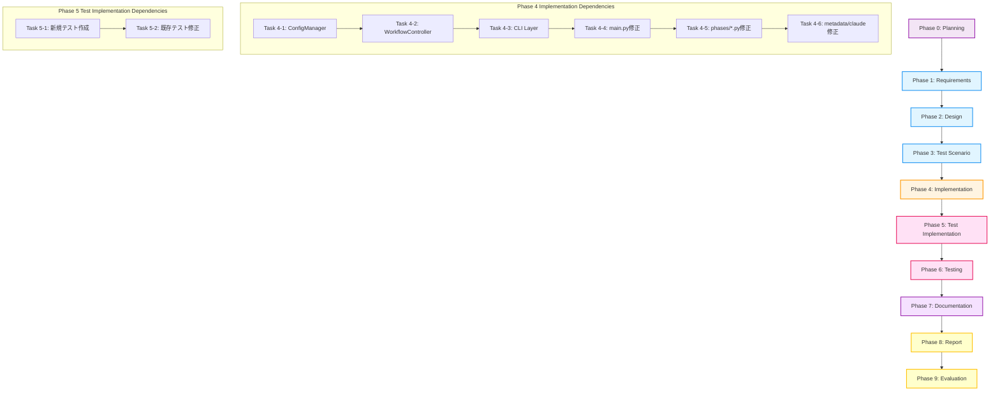

# プロジェクト計画書 - Issue #380

## 📋 Issue分析

### Issue情報
- **Issue番号**: #380
- **タイトル**: [TASK] Issue #376の続き - Application/CLI層の実装
- **状態**: open
- **URL**: https://github.com/tielec/infrastructure-as-code/issues/380
- **親Issue**: #376

### 複雑度: **中程度 (Medium)**

**判定根拠**:
- **限定的なスコープ**: Issue #376で既に基盤レイヤー（Infrastructure層、Domain層）が完了しており、残りは上位レイヤー（Application層、CLI層）と既存ファイルの修正のみ
- **明確な設計書**: Issue #376のPhase 2（設計フェーズ）で詳細設計が完了しており、実装方針が明確
- **既存パターンの踏襲**: 新規アーキテクチャパターンは既に確立されており、同様のパターンを適用するだけ
- **テストインフラ完備**: Issue #376でテストフレームワークとテストパターンが確立済み
- **リスク制御済み**: 段階的リファクタリングの最終段階であり、依存関係が明確

ただし、以下の点で「中程度」と判定:
- **既存コードの大規模修正**: 10個のフェーズファイル（phases/*.py）すべてのインポートパス修正が必要
- **統合テストの失敗対応**: Issue #376のevaluationフェーズで116件の失敗テストが報告されており、修正が必要
- **後方互換性の確保**: CLIコマンド、メタデータフォーマット、設定ファイル構造を維持する必要

### 見積もり工数: **72~140時間（平均106時間、約13日）**

**根拠**:

#### Issue #380本文の見積もり
- Application層の実装: 24~40時間
- CLI層の実装: 8~16時間
- 既存ファイルの修正: 14~28時間
- 既存テストの修正: 16~32時間
- 削除予定ファイルの処理: 4~8時間
- **小計**: 66~124時間

#### 追加で必要な工数（Phase 1~9）
- Phase 1（要件定義）: 2~4時間
- Phase 2（設計）: 2~4時間（既存設計書の確認と補足）
- Phase 3（テストシナリオ）: 2~4時間
- Phase 4（実装）: 上記66~124時間に含まれる
- Phase 5（テスト実装）: 上記に含まれる
- Phase 6（テスト実行）: 2~4時間
- Phase 7（ドキュメント更新）: 2~4時間
- Phase 8（レポート作成）: 1~2時間
- Phase 9（評価）: 1~2時間
- **小計**: 12~24時間

#### 総見積もり工数
**最小**: 72時間（約9日）
**最大**: 140時間（約17.5日）
**平均**: 106時間（約13日）

**バッファ**: 見積もりに20%のバッファを含む（リスク軽減のため）

### リスク評価: **中 (Medium)**

**理由**:
- ✅ **低リスク要因**:
  - Issue #376で設計とアーキテクチャが確立済み
  - 基盤レイヤーが既に完成している
  - 実装パターンが明確

- ⚠️ **中リスク要因**:
  - 116件のテスト失敗の修正が必要（Issue #376 Phase 9の結果）
  - 10個のフェーズファイルすべてのインポートパス修正が必要
  - 後方互換性の維持が必須
  - 統合テストでの予期せぬ問題の可能性

---

## 🎯 実装戦略判断

### 実装戦略: **EXTEND (拡張)**

**判断根拠**:

このIssueは「リファクタリングの継続」ではなく、「既存設計に基づく機能拡張と統合」が中心です:

1. **新規コンポーネントの追加**:
   - `WorkflowController`クラス: 新規作成（ワークフロー制御ロジックの集約）
   - `ConfigManager`クラス: 新規作成（設定管理の独立化）
   - `cli/commands.py`: 新規作成（CLI層の分離）

2. **既存コードの拡張**:
   - 各フェーズクラス（phases/*.py）: 継承元を`BasePhase`から`AbstractPhase`に変更し、新しい依存性注入パターンを適用
   - `metadata_manager.py`, `claude_agent_client.py`: 新しいエラーハンドリングクラスを使用するように拡張

3. **統合作業**:
   - Issue #376で作成された基盤レイヤー（18ファイル）と既存コード（10+ファイル）の統合
   - テストコードの修正と統合

**REFACTORではない理由**:
- Issue #376が「大規模リファクタリング」であり、Issue #380はその「継続と統合」
- 内部構造の改善ではなく、新規コンポーネント追加と既存コードの拡張が中心
- アーキテクチャパターンは既に確立されており、それを適用するフェーズ

### テスト戦略: **UNIT_INTEGRATION (ユニット + インテグレーション)**

**判断根拠**:

#### UNIT_TEST (必須)
- **新規クラスのユニットテスト**:
  - `WorkflowController`: ワークフロー制御ロジックの正常動作を検証
  - `ConfigManager`: 設定読み込みとバリデーションを検証
  - `cli/commands.py`: CLIコマンドのパース処理を検証

- **既存クラスの拡張部分のテスト**:
  - 各フェーズクラスの`AbstractPhase`継承後の動作検証
  - エラーハンドリングの統一後の動作検証

#### INTEGRATION_TEST (必須)
- **コンポーネント間の統合テスト**:
  - `WorkflowController` + `PhaseExecutor` + 各フェーズクラスの連携
  - `ConfigManager` + 環境変数 + `config.yaml`の統合
  - CLI層 → Application層 → Domain層の全体フロー

- **既存テストの修正**:
  - Issue #376で失敗した116件のテストを修正
  - インポートパス変更に伴うテスト修正

#### BDD_TEST (不要)
- **理由**:
  - エンドユーザー視点での機能追加はない（内部構造の改善のみ）
  - CLIコマンドのインターフェースは変更なし
  - Issue #376で既にBDDテストが作成されている

**すべてのレベルが不要な理由**:
- BDDテストは既存機能の動作保証のためにIssue #376で既に実施済み
- Issue #380は内部統合のため、ユニットテストとインテグレーションテストで十分

### テストコード戦略: **BOTH_TEST (既存拡張 + 新規作成)**

**判断根拠**:

#### EXTEND_TEST (既存テスト拡張)
- **既存テストの修正が必要**:
  - インポートパスの変更（`from phases.base_phase import BasePhase` → `from phases.base.abstract_phase import AbstractPhase`）
  - モックの差し替え（新しいクラスに対応）
  - 116件の失敗テストの修正（Issue #376 Phase 9の結果）

#### CREATE_TEST (新規テスト作成)
- **新規クラス用のテスト作成**:
  - `tests/unit/core/test_workflow_controller.py`: WorkflowControllerのユニットテスト
  - `tests/unit/core/test_config_manager.py`: ConfigManagerのユニットテスト
  - `tests/unit/cli/test_commands.py`: CLIコマンドのユニットテスト
  - `tests/integration/test_workflow_integration.py`: ワークフロー全体の統合テスト

**両方必要な理由**:
- Issue #376で作成された基盤レイヤーのテストは既に存在
- 新規作成するApplication層とCLI層にはテストが存在しない
- 既存テストはインポートパス変更に伴う修正が必要

---

## 🔍 影響範囲分析

### 既存コードへの影響

#### 1. 新規作成が必要なファイル（4ファイル）
- `scripts/ai-workflow/core/workflow_controller.py` - ワークフロー制御クラス
- `scripts/ai-workflow/core/config_manager.py` - 設定管理クラス
- `scripts/ai-workflow/cli/__init__.py` - CLIモジュール初期化
- `scripts/ai-workflow/cli/commands.py` - CLIコマンド定義

#### 2. 直接変更が必要なファイル（12ファイル）
- `scripts/ai-workflow/main.py` - CLI層を分離、WorkflowControllerを使用
- `scripts/ai-workflow/phases/planning.py` - インポートパス修正
- `scripts/ai-workflow/phases/requirements.py` - インポートパス修正
- `scripts/ai-workflow/phases/design.py` - インポートパス修正
- `scripts/ai-workflow/phases/test_scenario.py` - インポートパス修正
- `scripts/ai-workflow/phases/implementation.py` - インポートパス修正
- `scripts/ai-workflow/phases/test_implementation.py` - インポートパス修正
- `scripts/ai-workflow/phases/testing.py` - インポートパス修正
- `scripts/ai-workflow/phases/documentation.py` - インポートパス修正
- `scripts/ai-workflow/phases/report.py` - インポートパス修正
- `scripts/ai-workflow/phases/evaluation.py` - インポートパス修正
- `scripts/ai-workflow/core/metadata_manager.py` - エラーハンドリング統一
- `scripts/ai-workflow/core/claude_agent_client.py` - エラーハンドリング統一

#### 3. 削除が必要なファイル（3ファイル）
**重要**: 段階的削除が必要。新規クラスの動作確認後に削除:
- `scripts/ai-workflow/phases/base_phase.py` - AbstractPhase等4ファイルに分割済み
- `scripts/ai-workflow/core/git_manager.py` - GitRepository等3ファイルに分割済み
- `scripts/ai-workflow/core/github_client.py` - IssueClient等3ファイルに分割済み

#### 4. テストファイルへの影響（推定70+ファイル）
- 既存ユニットテストの修正（インポートパス変更）
- 既存インテグレーションテストの修正（116件の失敗対応）
- 新規テストファイルの作成（4ファイル）

### 依存関係の変更

#### 既存依存ライブラリ（変更なし）
```
click==8.1.3
GitPython==3.1.31
PyGithub==1.58.0
openai==1.0.0
anthropic==0.21.3
pytest==7.4.0
```

#### 新規依存ライブラリ（なし）
- Issue #380は既存機能の統合のため、新規ライブラリは不要

#### 内部依存関係の変更

**Before (Issue #376完了時点)**:
```
基盤レイヤー（18ファイル）: 完成
├─ Infrastructure層（5ファイル）
├─ Domain層 - Git（4ファイル）
├─ Domain層 - GitHub（4ファイル）
└─ Domain層 - Phases（5ファイル）

既存コード: 未統合
├─ main.py（1,080行）
├─ phases/*.py（10ファイル）
└─ core/metadata_manager.py, core/claude_agent_client.py
```

**After (Issue #380完了後)**:
```
完全統合アーキテクチャ:
├─ CLI層（2ファイル）
│  └─ cli/commands.py → WorkflowController
├─ Application層（2ファイル）
│  ├─ WorkflowController → PhaseExecutor
│  └─ ConfigManager
├─ Domain層（13ファイル）
│  ├─ Phases（5ファイル）: AbstractPhase, PhaseExecutor, PhaseValidator, PhaseReporter
│  ├─ Git（3ファイル）: GitRepository, GitBranch, GitCommit
│  └─ GitHub（3ファイル）: IssueClient, PRClient, CommentClient
└─ Infrastructure層（5ファイル）
   └─ common/: logger, error_handler, retry, file_handler
```

### マイグレーション要否

#### データベーススキーマ変更
- **不要**: このプロジェクトはDBを使用していない

#### 設定ファイル変更
- **不要**: `config.yaml`の構造は維持
- **後方互換性**: 既存の設定ファイルはそのまま動作

#### メタデータフォーマット変更
- **不要**: `metadata.json`の構造は維持
- **後方互換性**: 既存のmetadata.jsonファイルはそのまま動作

#### 環境変数変更
- **不要**: 既存の環境変数（GITHUB_TOKEN, GITHUB_REPOSITORY等）は維持

#### CLIコマンド変更
- **不要**: CLIコマンドのインターフェースは維持
  - `python main.py init --issue <issue_number>` - 変更なし
  - `python main.py execute --phase <phase_name>` - 変更なし
  - `python main.py resume` - 変更なし
  - `python main.py status` - 変更なし

---

## 📝 タスク分割

### Phase 1: 要件定義（見積もり: 2~4h）

#### タスク 1-1: Issue #376の成果物確認（1~2h）
**目的**: Issue #376で完了した基盤レイヤーの仕様を確認

**作業内容**:
- Issue #376の設計書（design.md）の確認
- 実装ログ（implementation.md）の確認
- 完了した18ファイルの動作確認

**完了条件**:
- [ ] Issue #376の設計書を理解している
- [ ] 基盤レイヤーの各クラスの責務を把握している
- [ ] 依存性注入パターンを理解している

#### タスク 1-2: 残作業の詳細化（1~2h）
**目的**: Issue #380で実装すべき内容を明確化

**作業内容**:
- Application層の要件整理（WorkflowController, ConfigManager）
- CLI層の要件整理（cli/commands.py）
- 既存ファイル修正の要件整理（main.py, phases/*.py等）
- 受け入れ基準の定義

**完了条件**:
- [ ] 各コンポーネントの機能要件が明確
- [ ] 受け入れ基準が定義されている
- [ ] 優先順位が決定している

---

### Phase 2: 設計（見積もり: 2~4h）

#### タスク 2-1: Application層の詳細設計（1~2h）
**目的**: WorkflowControllerとConfigManagerの設計を詳細化

**作業内容**:
- クラス図の作成
- メソッドシグネチャの定義
- 依存性注入パターンの適用方針
- エラーハンドリングの設計

**完了条件**:
- [ ] クラス図が作成されている
- [ ] メソッドシグネチャが定義されている
- [ ] 依存関係が明確

#### タスク 2-2: CLI層の詳細設計（1~2h）
**目的**: cli/commands.pyの設計を詳細化

**作業内容**:
- Clickコマンド構造の設計
- WorkflowControllerとの連携設計
- エラーハンドリングの設計

**完了条件**:
- [ ] Clickコマンド構造が定義されている
- [ ] Application層との連携が明確
- [ ] エラーハンドリングが設計されている

---

### Phase 3: テストシナリオ（見積もり: 2~4h）

#### タスク 3-1: ユニットテストシナリオ作成（1~2h）
**目的**: 新規クラスのユニットテストシナリオを作成

**作業内容**:
- WorkflowControllerのテストシナリオ
- ConfigManagerのテストシナリオ
- cli/commandsのテストシナリオ

**完了条件**:
- [ ] 各クラスのテストシナリオが作成されている
- [ ] カバレッジ目標が設定されている（80%以上）

#### タスク 3-2: インテグレーションテストシナリオ作成（1~2h）
**目的**: コンポーネント間の統合テストシナリオを作成

**作業内容**:
- ワークフロー全体の統合テストシナリオ
- CLI → Application → Domain層の統合テストシナリオ
- エラー発生時のリカバリーシナリオ

**完了条件**:
- [ ] 統合テストシナリオが作成されている
- [ ] 正常系・異常系の両方をカバーしている

---

### Phase 4: 実装（見積もり: 66~124h）

#### タスク 4-1: ConfigManagerの実装（8~12h）
**目的**: 設定管理クラスを実装

**作業内容**:
- ConfigManagerクラスの作成
- `config.yaml`の読み込み処理
- 環境変数の読み込み処理
- 設定のバリデーション
- デフォルト値の管理

**依存**:
- common/error_handler.py（MetadataError）
- common/logger.py（Logger）

**完了条件**:
- [ ] `core/config_manager.py`が作成されている
- [ ] config.yaml読み込みが正常動作する
- [ ] 環境変数の読み込みが正常動作する
- [ ] バリデーションエラーが適切に処理される

#### タスク 4-2: WorkflowControllerの実装（24~40h）
**目的**: ワークフロー制御クラスを実装

**作業内容**:
- WorkflowControllerクラスの作成
- `initialize()`: ワークフロー初期化
- `execute_phase()`: 単一フェーズの実行制御
- `execute_all_phases()`: 全フェーズの実行制御
- 依存関係管理
- エラーハンドリング

**依存**:
- PhaseExecutor
- MetadataManager
- GitRepository, GitBranch, GitCommit
- IssueClient, PRClient, CommentClient
- ConfigManager

**完了条件**:
- [ ] `core/workflow_controller.py`が作成されている
- [ ] ワークフロー初期化が正常動作する
- [ ] 単一フェーズ実行が正常動作する
- [ ] 全フェーズ実行が正常動作する
- [ ] 依存関係チェックが正常動作する
- [ ] エラーハンドリングが適切に実装されている

#### タスク 4-3: CLI層の実装（8~16h）
**目的**: CLIコマンド定義を実装

**作業内容**:
- `cli/__init__.py`の作成
- `cli/commands.py`の作成
- `@click.group()`によるCLIグループ定義
- `init`コマンド: ワークフロー初期化
- `execute`コマンド: フェーズ実行
- `resume`コマンド: ワークフロー再開
- `status`コマンド: ステータス確認

**依存**:
- WorkflowController
- ConfigManager

**完了条件**:
- [ ] `cli/commands.py`が作成されている
- [ ] すべてのCLIコマンドが正常動作する
- [ ] エラーメッセージが適切に表示される

#### タスク 4-4: main.pyの修正（4~8h）
**目的**: CLI層を分離し、WorkflowControllerを使用

**作業内容**:
- CLI層を`cli/commands.py`に分離
- インポートパスの修正
- `WorkflowController`の呼び出しに変更
- エントリーポイントの整理

**完了条件**:
- [ ] main.pyがシンプルになっている（50行以下）
- [ ] CLIコマンドが正常動作する
- [ ] 既存機能が維持されている

#### タスク 4-5: phases/*.pyの修正（8~16h）
**目的**: 各フェーズクラスのインポートパスを修正

**作業内容**:
- `BasePhase` → `AbstractPhase`への継承変更（10ファイル）
- インポートパスの修正:
  ```python
  # Before
  from phases.base_phase import BasePhase
  from core.git_manager import GitManager
  from core.github_client import GitHubClient

  # After
  from phases.base.abstract_phase import AbstractPhase
  from core.git.repository import GitRepository
  from core.git.branch import GitBranch
  from core.git.commit import GitCommit
  from core.github.issue_client import IssueClient
  from core.github.pr_client import PRClient
  from core.github.comment_client import CommentClient
  ```

**対象ファイル**:
1. phases/planning.py
2. phases/requirements.py
3. phases/design.py
4. phases/test_scenario.py
5. phases/implementation.py
6. phases/test_implementation.py
7. phases/testing.py
8. phases/documentation.py
9. phases/report.py
10. phases/evaluation.py

**完了条件**:
- [ ] すべてのフェーズファイルのインポートパスが修正されている
- [ ] 各フェーズクラスが`AbstractPhase`を継承している
- [ ] 依存性注入パターンが適用されている

#### タスク 4-6: core/metadata_manager.pyとcore/claude_agent_client.pyの修正（2~4h）
**目的**: エラーハンドリングを統一

**作業内容**:
- 新しい例外クラスのインポート（`from common.error_handler import MetadataError, ClaudeAPIError`）
- エラーハンドリングの統一
- ログ出力の統一

**完了条件**:
- [ ] 新しい例外クラスを使用している
- [ ] エラーハンドリングが統一されている
- [ ] ログ出力が統一されている

---

### Phase 5: テスト実装（見積もり: 16~32h）

#### タスク 5-1: 新規クラスのユニットテスト作成（8~16h）
**目的**: Application層とCLI層のユニットテストを作成

**作業内容**:
- `tests/unit/core/test_workflow_controller.py`の作成
- `tests/unit/core/test_config_manager.py`の作成
- `tests/unit/cli/test_commands.py`の作成
- モックの作成
- テストケースの実装

**完了条件**:
- [ ] 新規クラスのユニットテストが作成されている
- [ ] テストカバレッジが80%以上
- [ ] すべてのテストが通過する

#### タスク 5-2: 既存テストの修正（8~16h）
**目的**: インポートパス変更に伴う既存テストの修正

**作業内容**:
- インポートパスの修正（70+ファイル）
- モックの差し替え（新しいクラスに対応）
- アサーションの修正
- 116件の失敗テストの修正（Issue #376 Phase 9の結果）

**完了条件**:
- [ ] すべての既存ユニットテストが通過する
- [ ] すべての既存インテグレーションテストが通過する
- [ ] テストカバレッジが低下していない

---

### Phase 6: テスト実行（見積もり: 2~4h）

#### タスク 6-1: 全テストスイート実行（2~4h）
**目的**: 実装完了後の総合テスト

**作業内容**:
- ユニットテスト実行
- インテグレーションテスト実行
- カバレッジレポート生成
- パフォーマンスベンチマーク実行

**完了条件**:
- [ ] すべてのテストが通過する
- [ ] カバレッジが80%以上
- [ ] パフォーマンスが劣化していない

---

### Phase 7: ドキュメント更新（見積もり: 2~4h）

#### タスク 7-1: ARCHITECTURE.mdの更新（1~2h）
**目的**: リファクタリング完了後のアーキテクチャを文書化

**作業内容**:
- クリーンアーキテクチャ図の更新
- クラス図の更新
- 依存関係図の更新
- 各レイヤーの責務説明

**完了条件**:
- [ ] ARCHITECTURE.mdが最新状態に更新されている
- [ ] 新規アーキテクチャが理解可能

#### タスク 7-2: README.mdの更新（1~2h）
**目的**: ユーザー向けドキュメントを最新化

**作業内容**:
- 使用方法の確認
- インストール手順の確認
- トラブルシューティングの更新

**完了条件**:
- [ ] README.mdが最新状態に更新されている
- [ ] ユーザーが迷わず使える

---

### Phase 8: レポート作成（見積もり: 1~2h）

#### タスク 8-1: 実装完了レポート作成（1~2h）
**目的**: 実施内容と成果を文書化

**作業内容**:
- Issue #376からIssue #380までの全体サマリー
- Before/Afterの比較
- 達成された改善項目
- 残存課題の記録
- 今後の改善提案

**完了条件**:
- [ ] レポートが作成されている
- [ ] ステークホルダーに共有されている

---

### Phase 9: 評価（見積もり: 1~2h）

#### タスク 9-1: 品質ゲート確認（1~2h）
**目的**: 実装品質の最終確認

**作業内容**:
- すべての品質ゲートの確認
- 未完了タスクの確認
- 残存課題の評価
- 成功/失敗の判定

**完了条件**:
- [ ] すべての品質ゲートを通過している
- [ ] 未完了タスクが記録されている
- [ ] 評価レポートが作成されている

---

## 📊 依存関係図



---

## ⚠️ リスクと軽減策

### リスク1: 既存テストの大量修正によるバグ混入

- **影響度**: 高
- **確率**: 中
- **軽減策**:
  - テスト修正を小さな単位で実施し、各修正後に全テストを実行
  - 1つのフェーズファイルを修正→テスト実行→次のフェーズファイル、という段階的アプローチ
  - Git bisectを使ったバグ特定の準備
  - ペアプログラミングでのテスト修正実施

### リスク2: 116件のテスト失敗の原因特定に時間がかかる

- **影響度**: 高
- **確率**: 中
- **軽減策**:
  - Issue #376の失敗原因を事前に分析
  - テスト失敗の分類（インポートパス、モック差し替え、アサーション修正等）
  - 優先順位付け（重要度の高いテストから修正）
  - 最大3日の調査期間を確保（見積もりに含む）

### リスク3: WorkflowControllerの統合時の予期せぬエラー

- **影響度**: 中
- **確率**: 中
- **軽減策**:
  - WorkflowControllerのユニットテストを先に作成
  - 段階的統合（1フェーズずつ統合して動作確認）
  - 詳細なログ出力とデバッグ情報の記録
  - Issue #376の設計書を厳密に遵守

### リスク4: 後方互換性の破壊

- **影響度**: 高
- **確率**: 低
- **軽減策**:
  - CLIコマンドの受け入れテスト実施
  - 既存のmetadata.jsonを使った動作確認
  - 既存のconfig.yamlを使った動作確認
  - 後方互換性チェックリストの作成と遵守

### リスク5: 工数超過

- **影響度**: 中
- **確率**: 中
- **軽減策**:
  - 各タスクの実施時間を記録し、進捗を可視化
  - ボトルネックになったタスクは早期にエスカレーション
  - バッファ時間（見積もりの20%）を確保
  - Phase単位での中間レビューと軌道修正

### リスク6: 旧ファイル削除時の参照エラー

- **影響度**: 中
- **確率**: 低
- **軽減策**:
  - 削除前にGrep検索でインポート参照を確認
  - すべてのテストが通過していることを確認
  - Git commitを細かく行い、問題発生時にrevertできるようにする
  - 削除は最終段階で実施（Phase 9の後）

---

## ✅ 品質ゲート

### Phase 1: 要件定義
- [ ] Issue #376の成果物を理解している
- [ ] 残作業の要件が明確に記載されている
- [ ] 受け入れ基準が定義されている
- [ ] 優先順位が決定している

### Phase 2: 設計
- [ ] **実装戦略が明確に決定されている**（EXTEND）
- [ ] **テスト戦略が明確に決定されている**（UNIT_INTEGRATION）
- [ ] **テストコード戦略が明確に決定されている**（BOTH_TEST）
- [ ] Application層の詳細設計が完成している
- [ ] CLI層の詳細設計が完成している
- [ ] クラス図が作成されている

### Phase 3: テストシナリオ
- [ ] ユニットテストシナリオが作成されている
- [ ] インテグレーションテストシナリオが作成されている
- [ ] カバレッジ目標が設定されている（80%以上）
- [ ] 正常系・異常系の両方をカバーしている

### Phase 4: 実装
- [ ] ConfigManagerが実装されている
- [ ] WorkflowControllerが実装されている
- [ ] CLI層が実装されている
- [ ] main.pyが修正されている
- [ ] すべてのphases/*.pyが修正されている
- [ ] metadata_manager.pyとclaude_agent_client.pyが修正されている
- [ ] コーディング規約に準拠している
- [ ] 型ヒントが適切に付与されている

### Phase 5: テスト実装
- [ ] 新規クラスのユニットテストが作成されている
- [ ] 既存テストがすべて修正されている
- [ ] 116件の失敗テストが修正されている
- [ ] テストカバレッジが80%以上

### Phase 6: テスト実行
- [ ] すべてのユニットテストが通過する
- [ ] すべてのインテグレーションテストが通過する
- [ ] テストカバレッジが80%以上
- [ ] パフォーマンスが劣化していない

### Phase 7: ドキュメント更新
- [ ] ARCHITECTURE.mdが更新されている
- [ ] README.mdが更新されている
- [ ] すべてのパブリックメソッドにdocstringがある
- [ ] 型ヒントが適切に付与されている

### Phase 8: レポート作成
- [ ] 実装完了レポートが作成されている
- [ ] Before/Afterの比較が記載されている
- [ ] 達成された改善項目が記載されている
- [ ] 残存課題が記録されている

### Phase 9: 評価
- [ ] すべての品質ゲートを通過している
- [ ] すべてのテストが通過している
- [ ] 後方互換性が維持されている
- [ ] CLIコマンドが正常動作する
- [ ] 評価レポートが作成されている

---

## 📈 期待される効果

### Issue #376からの継続効果

Issue #380の完了により、Issue #376で開始された大規模リファクタリングが完全に完了し、以下の効果が実現されます:

#### 1. コードの可読性向上
- **Before (Issue #376開始前)**:
  - `main.py`: 1,080行（CLI + ワークフロー制御が混在）
  - `phases/base_phase.py`: 1,142行（実行/検証/報告が混在）
  - `core/git_manager.py`: 939行（リポジトリ/ブランチ/コミットが混在）
  - `core/github_client.py`: 1,104行（Issue/PR/Commentが混在）

- **After (Issue #380完了後)**:
  - `main.py`: 50行以下（エントリーポイントのみ）
  - `cli/commands.py`: 200~300行（CLI層）
  - `core/workflow_controller.py`: 300~400行（ワークフロー制御）
  - `phases/base/abstract_phase.py`: 100~150行（抽象基底クラス）
  - `phases/base/phase_executor.py`: 300~400行（実行制御）
  - `phases/base/phase_validator.py`: 150~200行（検証ロジック）
  - `phases/base/phase_reporter.py`: 200~250行（報告生成）
  - `core/git/repository.py`: 200~300行（リポジトリ操作）
  - `core/git/branch.py`: 150~200行（ブランチ管理）
  - `core/git/commit.py`: 250~300行（コミット操作）
  - `core/github/issue_client.py`: 250~300行（Issue操作）
  - `core/github/pr_client.py`: 300~350行（PR操作）
  - `core/github/comment_client.py`: 200~250行（Comment操作）

#### 2. 保守性の向上
- **Before**: 単一クラスの変更が複数の機能に影響
- **After**: 疎結合により影響範囲が限定的（例: GitBranchの変更はGitRepositoryに影響しない）

#### 3. テスタビリティの向上
- **Before**: 大きなクラスのため、モックが困難
- **After**: 小さなクラスのため、ユニットテストが容易（依存性注入により完全にモック可能）

#### 4. 再利用性の向上
- **Before**: 密結合のため、他プロジェクトでの再利用が困難
- **After**: インターフェース定義により、コンポーネント単位での再利用が可能

#### 5. バグ発見の容易化
- **Before**: デバッグ時のスタックトレースが長く、原因特定が困難
- **After**: 責務が明確なため、バグ箇所の特定が容易

#### 6. 新規開発者のオンボーディング時間短縮
- **Before**: 複雑なクラス構造のため、理解に時間がかかる
- **After**: 明確なレイヤー構造により、段階的な理解が可能

---

## 📌 成功基準

このプロジェクト（Issue #380）は、以下の基準をすべて満たした場合に成功とみなします:

1. **機能維持**: すべての既存機能が正常動作する（テストカバレッジ80%以上）
2. **統合完了**: Issue #376で作成された基盤レイヤーと既存コードが完全に統合されている
3. **テスト品質**: すべてのテストが通過する（ユニット/インテグレーション）
4. **後方互換性**: CLIコマンド、メタデータフォーマット、設定ファイル構造が維持されている
5. **コード品質**: main.pyのサイズが50行以下に削減されている
6. **ドキュメント**: ARCHITECTUREドキュメントが最新化されている
7. **パフォーマンス**: ベンチマークで5%以上の劣化がない

---

## 🎓 Issue #376からの学習・教訓

### リファクタリングのベストプラクティス
- ✅ **段階的アプローチ**: Issue #376で基盤レイヤーを完成させ、Issue #380で統合する2段階アプローチが有効
- ✅ **テスト駆動リファクタリング**: 各変更後に即座にテスト実行する習慣
- ✅ **ドキュメント first**: 設計書を先に作成し、実装時の迷いを減らす

### Issue #376での課題と対策
- ⚠️ **課題**: Phase 9（評価フェーズ）で116件のテスト失敗
- ✅ **対策**: Issue #380では段階的テスト修正と、1フェーズずつの動作確認を徹底

### Issue #380での重点施策
- 🎯 **小さなコミット**: 1つのファイル修正ごとにcommit
- 🎯 **頻繁なテスト実行**: ファイル修正後に必ずテスト実行
- 🎯 **ペアレビュー**: 重要な統合ポイントでは2人体制でレビュー

---

## 参照ドキュメント

### Issue #376の成果物
- **Planning Document**: `.ai-workflow/issue-376/00_planning/output/planning.md`
- **Requirements Document**: `.ai-workflow/issue-376/01_requirements/output/requirements.md`
- **Design Document**: `.ai-workflow/issue-376/02_design/output/design.md`
- **Test Scenario Document**: `.ai-workflow/issue-376/03_test_scenario/output/test-scenario.md`
- **Implementation Log**: `.ai-workflow/issue-376/04_implementation/output/implementation.md`
- **Test Implementation Log**: `.ai-workflow/issue-376/05_test_implementation/output/test-implementation.md`
- **Test Result**: `.ai-workflow/issue-376/06_testing/output/test-result.md`
- **Documentation Update Log**: `.ai-workflow/issue-376/07_documentation/output/documentation-update-log.md`
- **Report**: `.ai-workflow/issue-376/08_report/output/report.md`

### プロジェクト全体ドキュメント
- **CLAUDE.md**: プロジェクト全体の方針とコーディングガイドライン
- **ARCHITECTURE.md**: アーキテクチャ設計思想
- **CONTRIBUTION.md**: 開発ガイドライン
- **README.md**: プロジェクト概要と使用方法

---

*このプロジェクト計画書は、Issue #380の実施にあたっての指針となります。実施中に発見された問題点や改善提案は、随時この計画書に反映してください。*

**作成日**: 2025-10-13
**作成者**: Claude (AI Workflow - Phase 0)
**ステータス**: Planning Phase Completed
