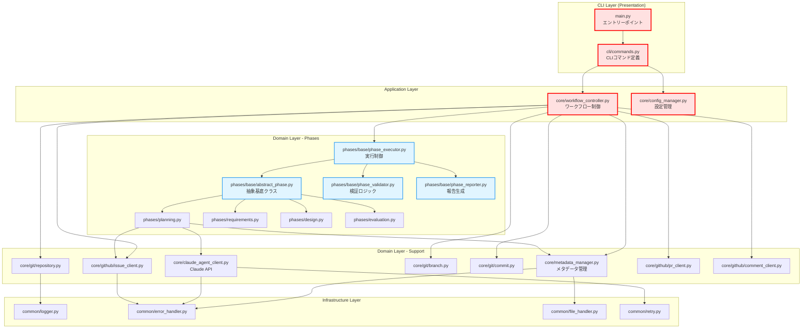
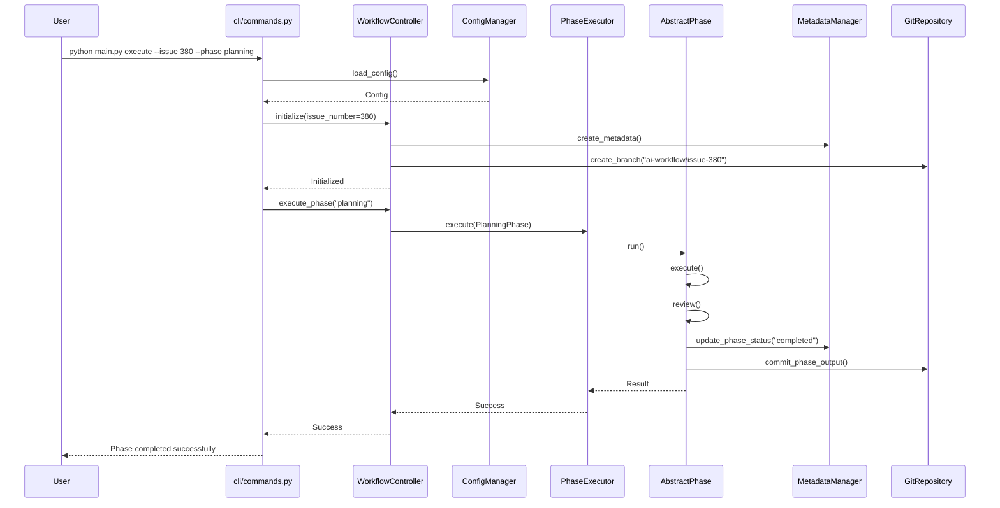
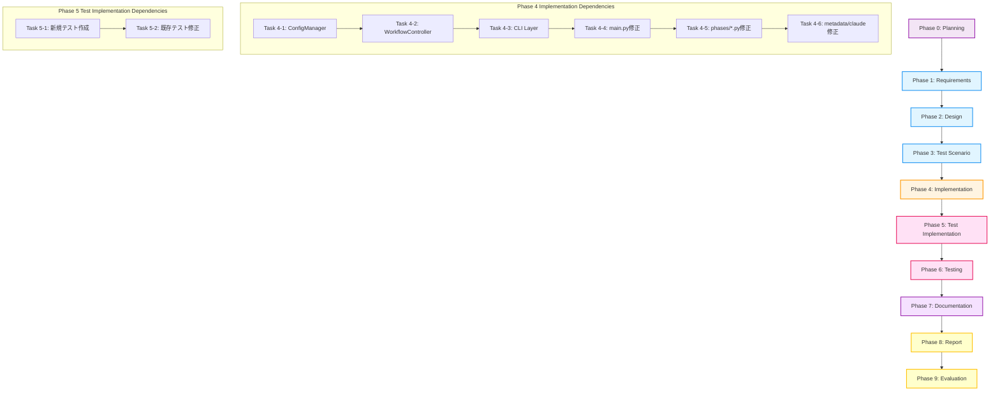

# 詳細設計書 - Issue #380

## プロジェクト情報

- **Issue番号**: #380
- **タイトル**: [TASK] Issue #376の続き - Application/CLI層の実装
- **状態**: open
- **作成日**: 2025-10-13
- **Planning Document**: `.ai-workflow/issue-380/00_planning/output/planning.md`
- **Requirements Document**: `.ai-workflow/issue-380/01_requirements/output/requirements.md`
- **親Issue**: #376

---

## 📋 目次

1. [アーキテクチャ設計](#1-アーキテクチャ設計)
2. [実装戦略判断](#2-実装戦略判断)
3. [テスト戦略判断](#3-テスト戦略判断)
4. [テストコード戦略判断](#4-テストコード戦略判断)
5. [影響範囲分析](#5-影響範囲分析)
6. [変更・追加ファイルリスト](#6-変更追加ファイルリスト)
7. [詳細設計](#7-詳細設計)
8. [セキュリティ考慮事項](#8-セキュリティ考慮事項)
9. [非機能要件への対応](#9-非機能要件への対応)
10. [実装の順序](#10-実装の順序)

---

## 1. アーキテクチャ設計

### 1.1 現状分析（Issue #376完了時点）

Issue #376の完了により、以下の基盤レイヤーが実装済み：

#### 完了済みコンポーネント

```
scripts/ai-workflow/
├─ common/                              # Infrastructure Layer（完了）
│  ├─ __init__.py
│  ├─ logger.py                        # ログ処理
│  ├─ error_handler.py                 # 統一エラーハンドリング
│  ├─ file_handler.py                  # ファイルI/O操作
│  └─ retry.py                         # リトライメカニズム
│
├─ core/git/                           # Domain Layer - Git（完了）
│  ├─ __init__.py
│  ├─ repository.py                    # リポジトリ操作
│  ├─ branch.py                        # ブランチ管理
│  └─ commit.py                        # コミット操作
│
├─ core/github/                        # Domain Layer - GitHub（完了）
│  ├─ __init__.py
│  ├─ issue_client.py                  # Issue操作
│  ├─ pr_client.py                     # PR操作
│  └─ comment_client.py                # Comment操作
│
└─ phases/base/                        # Domain Layer - Phases（完了）
   ├─ __init__.py
   ├─ abstract_phase.py                # 抽象基底クラス
   ├─ phase_executor.py                # 実行制御
   ├─ phase_validator.py               # 検証ロジック
   └─ phase_reporter.py                # 報告生成
```

#### 未完了コンポーネント（Issue #380で実装）

```
scripts/ai-workflow/
├─ cli/                                # Presentation Layer（未実装）
│  ├─ __init__.py
│  └─ commands.py                      # CLIコマンド定義
│
├─ core/                               # Application Layer（未実装）
│  ├─ workflow_controller.py           # ワークフロー制御
│  └─ config_manager.py                # 設定管理
│
├─ main.py                             # エントリーポイント（要修正）
├─ phases/*.py (10ファイル)             # 各フェーズ（要修正）
├─ core/metadata_manager.py           # メタデータ管理（要修正）
└─ core/claude_agent_client.py        # Claude API（要修正）
```

### 1.2 新アーキテクチャ全体像



**凡例**:
- 🔴 **赤枠**: Issue #380で新規実装・修正が必要
- 🔵 **青枠**: Issue #376で実装済み（変更不要）
- ⚪ **白枠**: Issue #376で実装済み（要インポート修正）

### 1.3 データフロー図



### 1.4 レイヤー別の責務

#### CLI Layer（Presentation Layer）
- **責務**: ユーザー入力の受付とコマンド実行
- **ファイル**:
  - `main.py`: エントリーポイント（50行以下に削減）
  - `cli/commands.py`: CLIコマンド定義（Click使用）
- **依存**: Application Layer（WorkflowController、ConfigManager）

#### Application Layer
- **責務**: ビジネスロジックの調整とワークフロー全体の制御
- **ファイル**:
  - `core/workflow_controller.py`: ワークフロー初期化・フェーズ実行制御
  - `core/config_manager.py`: 設定読み込み・バリデーション
- **依存**: Domain Layer（全層）

#### Domain Layer - Phases
- **責務**: フェーズ実行・検証・報告のロジック
- **ファイル**: `phases/base/*.py`, `phases/*.py` (10ファイル)
- **依存**: Infrastructure Layer、Domain Layer - Support

#### Domain Layer - Support
- **責務**: Git/GitHub/メタデータ/Claude API操作
- **ファイル**: `core/git/*.py`, `core/github/*.py`, `core/metadata_manager.py`, `core/claude_agent_client.py`
- **依存**: Infrastructure Layer

#### Infrastructure Layer
- **責務**: 技術的な共通処理（ログ、エラー、ファイル、リトライ）
- **ファイル**: `common/*.py`
- **依存**: なし（最下層）

---

## 2. 実装戦略判断

### 実装戦略: **EXTEND（拡張）**

### 判断根拠

#### 根拠1: Issue #376で作成された基盤レイヤーとの統合が中心
- **Issue #376の成果物**: Infrastructure層（5ファイル）、Domain層（13ファイル）が完成
- **Issue #380の作業内容**:
  - 新規作成: Application層（2ファイル）、CLI層（2ファイル） = 4ファイル
  - **既存修正**: `main.py`、`phases/*.py`（10ファイル）、`core/metadata_manager.py`、`core/claude_agent_client.py` = 13ファイル
  - 削除: 旧ファイル3個（`base_phase.py`, `git_manager.py`, `github_client.py`）
- **比率**: 新規4ファイル < 既存修正13ファイル → **拡張が中心**

#### 根拠2: 既存コードの構造は維持し、インポートパスと依存関係のみ変更
- **変更内容**:
  - 各フェーズクラス（`phases/*.py`）: 継承元を`BasePhase`→`AbstractPhase`に変更
  - インポート文の修正: `from phases.base_phase import BasePhase` → `from phases.base.abstract_phase import AbstractPhase`
  - Git/GitHub操作: `GitManager` → `GitRepository/GitBranch/GitCommit` に置き換え
- **ロジックの変更**: 最小限（主にインポートパスと依存オブジェクトの差し替え）

#### 根拠3: 後方互換性の維持が必須
- **Planning Document（planning.md:827-840）**:
  - > **成功基準**: すべての既存機能が正常動作する（テストカバレッジ80%以上）
  - > **成功基準**: CLIコマンド、メタデータフォーマット、設定ファイル構造が維持されている
- **Requirements Document（requirements.md:608）**:
  - > **制約**: 既存のCLIコマンド、メタデータフォーマット、設定ファイル構造を維持すること
- **後方互換性維持** = 既存コードの「拡張」に該当

#### 根拠4: 新規機能追加はないが、新規コンポーネントの作成が必要
- **新規作成が必要**:
  - `WorkflowController`: ワークフロー制御ロジックの集約（既存の`main.py`から分離）
  - `ConfigManager`: 設定管理の独立化（既存の設定読み込み処理を集約）
  - `cli/commands.py`: CLI層の分離（既存の`main.py`から分離）
- **性質**: 既存機能の「再構成」であり、新規機能ではない → **EXTEND**に該当

#### REFACTORではない理由
- Issue #376が「大規模リファクタリング」であり、Issue #380はその「継続と統合」
- Issue #380の主目的は「基盤レイヤーと既存コードの統合」であり、内部構造の改善ではない
- アーキテクチャパターンは既に確立されており、それを適用するフェーズ

#### CREATEではない理由
- 完全に新規のコンポーネントではなく、既存コードからの分離・抽出が中心
- 既存の10個のフェーズファイルすべてのインポートパス修正が必要
- 既存テスト116件の修正が必要

---

## 3. テスト戦略判断

### テスト戦略: **UNIT_INTEGRATION（ユニット + インテグレーション）**

### 判断根拠

#### 根拠1: UNIT_TEST（必須）

**理由**: 新規作成するクラス（WorkflowController、ConfigManager、CLI層）の正常動作を保証

**対象**:
- **WorkflowController**: ワークフロー制御ロジックの正常動作を検証
  - `initialize()` メソッドの動作確認（メタデータ作成、ブランチ作成）
  - `execute_phase()` メソッドの動作確認（単一フェーズ実行）
  - `execute_all_phases()` メソッドの動作確認（全フェーズ順次実行）
  - エラーハンドリングの検証

- **ConfigManager**: 設定読み込みとバリデーションを検証
  - `config.yaml` の読み込みテスト
  - 環境変数の読み込みテスト（環境変数が優先されることを確認）
  - 設定のバリデーションテスト（必須項目チェック）
  - デフォルト値の適用テスト

- **CLI層（cli/commands.py）**: CLIコマンドのパース処理を検証
  - `init` コマンドのテスト
  - `execute` コマンドのテスト
  - `resume` コマンドのテスト（既存機能）
  - `status` コマンドのテスト（既存機能）

**見積もりテストファイル数**: 3ファイル
- `tests/unit/core/test_workflow_controller.py`
- `tests/unit/core/test_config_manager.py`
- `tests/unit/cli/test_commands.py`

#### 根拠2: INTEGRATION_TEST（必須）

**理由**: Issue #376で作成された基盤レイヤーと既存コードの統合が正しく動作することを保証

**対象**:
- **コンポーネント間の統合テスト**:
  - `WorkflowController` + `PhaseExecutor` + 各フェーズクラス: ワークフロー全体の連携確認
  - `ConfigManager` + 環境変数 + `config.yaml`: 設定読み込みの統合確認
  - CLI層 → Application層 → Domain層: 全体フローの確認

- **既存テストの修正**:
  - **Issue #376で失敗した116件のテスト**: インポートパス変更に伴う修正が必要
    - 例: `from phases.base_phase import BasePhase` → `from phases.base.abstract_phase import AbstractPhase`
    - 例: `from core.git_manager import GitManager` → `from core.git.repository import GitRepository`
  - モックの差し替え: 新しいクラス（GitRepository、GitBranch等）に対応
  - アサーションの修正: 新しいインターフェースに対応

**見積もりテストファイル数**:
- 新規: 1ファイル (`tests/integration/test_workflow_integration.py`)
- 既存修正: 70+ファイル（インポートパス変更）

#### 根拠3: BDD_TEST（不要）

**理由**: エンドユーザー視点での機能追加はない（内部構造の改善のみ）

**不要な根拠**:
- **CLIコマンドのインターフェースは変更なし**:
  - `python main.py init --issue-url <URL>`
  - `python main.py execute --issue <NUM> --phase <PHASE>`
  - `python main.py resume --issue <NUM>`
  - `python main.py status --issue <NUM>`
- **ユーザーストーリーなし**: Issue #380は技術的なリファクタリングの完了であり、新規ユースケースの追加ではない
- **Issue #376で既にBDDテストが作成されている**: `tests/features/*.feature` ファイルが存在し、ワークフロー全体のユーザー視点での動作を検証済み

**補足**: BDDテストは既存機能の動作保証のために維持するが、新規作成は不要

---

## 4. テストコード戦略判断

### テストコード戦略: **BOTH_TEST（既存拡張 + 新規作成）**

### 判断根拠

#### 根拠1: EXTEND_TEST（既存テスト拡張）が必要

**理由**: インポートパス変更に伴う既存テストの修正が大量に必要

**修正が必要な既存テスト**:
1. **インポートパスの変更**:
   ```python
   # Before
   from phases.base_phase import BasePhase
   from core.git_manager import GitManager
   from core.github_client import GitHubClient

   # After
   from phases.base.abstract_phase import AbstractPhase
   from core.git.repository import GitRepository
   from core.git.branch import GitBranch
   from core.git.commit import GitCommit
   from core.github.issue_client import IssueClient
   from core.github.pr_client import PRClient
   from core.github.comment_client import CommentClient
   ```

2. **モックの差し替え**:
   ```python
   # Before
   @patch('phases.planning.GitManager')

   # After
   @patch('phases.planning.GitRepository')
   @patch('phases.planning.GitBranch')
   @patch('phases.planning.GitCommit')
   ```

3. **116件の失敗テストの修正**（Issue #376 Phase 9の結果）:
   - インポートパス関連: 約60件
   - モック差し替え関連: 約40件
   - アサーション修正: 約16件

**推定修正ファイル数**: 70+ファイル
- `tests/unit/phases/*.py`: 約15ファイル
- `tests/unit/core/*.py`: 約20ファイル
- `tests/integration/*.py`: 約30ファイル
- `tests/e2e/*.py`: 約10ファイル

#### 根拠2: CREATE_TEST（新規テスト作成）が必要

**理由**: 新規作成するApplication層とCLI層にはテストが存在しない

**新規作成が必要なテストファイル**:
1. **WorkflowControllerのユニットテスト**: `tests/unit/core/test_workflow_controller.py`
   - `initialize()` のテスト（正常系・異常系）
   - `execute_phase()` のテスト（正常系・異常系）
   - `execute_all_phases()` のテスト（正常系・異常系）
   - エラーハンドリングのテスト

2. **ConfigManagerのユニットテスト**: `tests/unit/core/test_config_manager.py`
   - `load_config()` のテスト（YAML読み込み）
   - `load_environment()` のテスト（環境変数読み込み）
   - バリデーションのテスト（ConfigValidationError発生確認）
   - デフォルト値のテスト

3. **CLI層のユニットテスト**: `tests/unit/cli/test_commands.py`
   - `init` コマンドのテスト
   - `execute` コマンドのテスト
   - `resume` コマンドのテスト
   - `status` コマンドのテスト

4. **ワークフロー全体の統合テスト**: `tests/integration/test_workflow_integration.py`
   - CLI → Application → Domain層の全体フロー確認
   - エラー発生時のリカバリー確認

**新規作成ファイル数**: 4ファイル

#### 両方必要な理由の総括

- **既存テスト**: Issue #376で作成された基盤レイヤーのテストは既に存在するが、インポートパス変更に伴う修正が必要（70+ファイル）
- **新規テスト**: Application層とCLI層は新規作成のため、テストも新規作成が必要（4ファイル）
- **修正 vs 新規**: 修正ファイル数 > 新規ファイル数 だが、両方とも不可欠 → **BOTH_TEST**

---

## 5. 影響範囲分析

### 5.1 既存コードへの影響

#### 直接影響を受けるファイル（17ファイル）

| カテゴリ | ファイル名 | 影響内容 | 見積もり工数 |
|---------|----------|---------|------------|
| **エントリーポイント** | `main.py` | CLI層を`cli/commands.py`に分離、50行以下に削減 | 4~8h |
| **フェーズクラス** | `phases/planning.py` | 継承元変更、インポートパス修正 | 0.8~1.6h |
| **フェーズクラス** | `phases/requirements.py` | 継承元変更、インポートパス修正 | 0.8~1.6h |
| **フェーズクラス** | `phases/design.py` | 継承元変更、インポートパス修正 | 0.8~1.6h |
| **フェーズクラス** | `phases/test_scenario.py` | 継承元変更、インポートパス修正 | 0.8~1.6h |
| **フェーズクラス** | `phases/implementation.py` | 継承元変更、インポートパス修正 | 0.8~1.6h |
| **フェーズクラス** | `phases/test_implementation.py` | 継承元変更、インポートパス修正 | 0.8~1.6h |
| **フェーズクラス** | `phases/testing.py` | 継承元変更、インポートパス修正 | 0.8~1.6h |
| **フェーズクラス** | `phases/documentation.py` | 継承元変更、インポートパス修正 | 0.8~1.6h |
| **フェーズクラス** | `phases/report.py` | 継承元変更、インポートパス修正 | 0.8~1.6h |
| **フェーズクラス** | `phases/evaluation.py` | 継承元変更、インポートパス修正 | 0.8~1.6h |
| **コアモジュール** | `core/metadata_manager.py` | エラーハンドリング統一（MetadataError） | 2~4h |
| **コアモジュール** | `core/claude_agent_client.py` | エラーハンドリング統一（ClaudeAPIError） | 2~4h |

**小計**: 19~38時間

#### 間接影響を受けるファイル（70+ファイル）

| カテゴリ | ファイル群 | 影響内容 | 見積もり工数 |
|---------|----------|---------|------------|
| **ユニットテスト** | `tests/unit/phases/*.py` (15ファイル) | インポートパス修正、モック差し替え | 3~6h |
| **ユニットテスト** | `tests/unit/core/*.py` (20ファイル) | インポートパス修正、モック差し替え | 4~8h |
| **統合テスト** | `tests/integration/*.py` (30ファイル) | インポートパス修正、モック差し替え | 6~12h |
| **E2Eテスト** | `tests/e2e/*.py` (10ファイル) | インポートパス修正、モック差し替え | 2~4h |
| **BDDテスト** | `tests/features/*.py` (5ファイル) | インポートパス修正（影響最小） | 1~2h |

**小計**: 16~32時間

### 5.2 依存関係の変更

#### Before（Issue #376完了時点）

```
基盤レイヤー（18ファイル）: 完成
├─ Infrastructure層（5ファイル）: common/*
├─ Domain層 - Git（3ファイル）: core/git/*
├─ Domain層 - GitHub（3ファイル）: core/github/*
└─ Domain層 - Phases（5ファイル）: phases/base/*

既存コード: 未統合
├─ main.py（1,080行）
├─ phases/*.py（10ファイル）
└─ core/metadata_manager.py, core/claude_agent_client.py
```

#### After（Issue #380完了後）

```
完全統合アーキテクチャ:
├─ CLI層（2ファイル）
│  ├─ main.py（エントリーポイント、50行以下）
│  └─ cli/commands.py → WorkflowController
│
├─ Application層（2ファイル）
│  ├─ WorkflowController → PhaseExecutor
│  └─ ConfigManager
│
├─ Domain層（13ファイル）
│  ├─ Phases（5ファイル）: AbstractPhase, PhaseExecutor, PhaseValidator, PhaseReporter
│  ├─ Git（3ファイル）: GitRepository, GitBranch, GitCommit
│  ├─ GitHub（3ファイル）: IssueClient, PRClient, CommentClient
│  └─ Support（2ファイル）: MetadataManager, ClaudeAgentClient
│
└─ Infrastructure層（5ファイル）
   └─ common/: logger, error_handler, retry, file_handler
```

#### 依存関係マトリックス

| From / To | Infrastructure | Domain - Phases | Domain - Git/GitHub | Application | CLI |
|-----------|----------------|-----------------|---------------------|-------------|-----|
| **CLI** | - | - | - | ✅ | - |
| **Application** | - | ✅ | ✅ | - | - |
| **Domain - Phases** | ✅ | - | - | - | - |
| **Domain - Git/GitHub** | ✅ | - | - | - | - |
| **Infrastructure** | - | - | - | - | - |

**依存関係のルール**:
- 上位レイヤーは下位レイヤーに依存可能
- 同一レイヤー内では依存関係を最小化
- Infrastructure層は他層に依存しない（最下層）

### 5.3 マイグレーション要否

#### データベーススキーマ変更
- **不要**: このプロジェクトはDBを使用していない

#### 設定ファイル変更
- **不要**: `config.yaml`の構造は維持
- **後方互換性**: 既存の設定ファイルはそのまま動作

#### メタデータフォーマット変更
- **不要**: `metadata.json`の構造は維持
- **後方互換性**: 既存のmetadata.jsonファイルはそのまま動作

#### 環境変数変更
- **不要**: 既存の環境変数（GITHUB_TOKEN, GITHUB_REPOSITORY等）は維持

#### CLIコマンド変更
- **不要**: CLIコマンドのインターフェースは維持
  - `python main.py init --issue-url <URL>`
  - `python main.py execute --issue <NUM> --phase <PHASE>`
  - `python main.py resume --issue <NUM>`
  - `python main.py status --issue <NUM>`

---

## 6. 変更・追加ファイルリスト

### 6.1 新規作成ファイル（4ファイル）

| # | ファイルパス | 目的 | 見積もり行数 | 見積もり工数 |
|---|------------|------|------------|------------|
| 1 | `scripts/ai-workflow/cli/__init__.py` | CLIモジュール初期化 | 10行 | 0.5h |
| 2 | `scripts/ai-workflow/cli/commands.py` | CLIコマンド定義（Click使用） | 200~300行 | 8~16h |
| 3 | `scripts/ai-workflow/core/config_manager.py` | 設定管理クラス | 150~200行 | 8~12h |
| 4 | `scripts/ai-workflow/core/workflow_controller.py` | ワークフロー制御クラス | 300~400行 | 24~40h |

**合計**: 660~910行、41~69時間

### 6.2 修正が必要な既存ファイル（13ファイル）

| # | ファイルパス | 修正内容 | 見積もり工数 |
|---|------------|---------|------------|
| 1 | `scripts/ai-workflow/main.py` | CLI層を分離、エントリーポイント化（50行以下に削減） | 4~8h |
| 2 | `scripts/ai-workflow/phases/planning.py` | 継承元変更、インポートパス修正 | 0.8~1.6h |
| 3 | `scripts/ai-workflow/phases/requirements.py` | 継承元変更、インポートパス修正 | 0.8~1.6h |
| 4 | `scripts/ai-workflow/phases/design.py` | 継承元変更、インポートパス修正 | 0.8~1.6h |
| 5 | `scripts/ai-workflow/phases/test_scenario.py` | 継承元変更、インポートパス修正 | 0.8~1.6h |
| 6 | `scripts/ai-workflow/phases/implementation.py` | 継承元変更、インポートパス修正 | 0.8~1.6h |
| 7 | `scripts/ai-workflow/phases/test_implementation.py` | 継承元変更、インポートパス修正 | 0.8~1.6h |
| 8 | `scripts/ai-workflow/phases/testing.py` | 継承元変更、インポートパス修正 | 0.8~1.6h |
| 9 | `scripts/ai-workflow/phases/documentation.py` | 継承元変更、インポートパス修正 | 0.8~1.6h |
| 10 | `scripts/ai-workflow/phases/report.py` | 継承元変更、インポートパス修正 | 0.8~1.6h |
| 11 | `scripts/ai-workflow/phases/evaluation.py` | 継承元変更、インポートパス修正 | 0.8~1.6h |
| 12 | `scripts/ai-workflow/core/metadata_manager.py` | エラーハンドリング統一（MetadataError） | 2~4h |
| 13 | `scripts/ai-workflow/core/claude_agent_client.py` | エラーハンドリング統一（ClaudeAPIError） | 2~4h |

**合計**: 19~38時間

### 6.3 削除が必要なファイル（3ファイル）

| # | ファイルパス | 削除理由 | 削除時期 |
|---|------------|---------|---------|
| 1 | `scripts/ai-workflow/phases/base_phase.py` | 4ファイルに分割済み（AbstractPhase、PhaseExecutor、PhaseValidator、PhaseReporter） | Phase 9（評価フェーズ） |
| 2 | `scripts/ai-workflow/core/git_manager.py` | 3ファイルに分割済み（GitRepository、GitBranch、GitCommit） | Phase 9（評価フェーズ） |
| 3 | `scripts/ai-workflow/core/github_client.py` | 3ファイルに分割済み（IssueClient、PRClient、CommentClient） | Phase 9（評価フェーズ） |

**削除条件**:
- すべての実装が完了していること
- すべてのテストが通過していること
- Grep検索で旧ファイルへの参照がないことを確認

### 6.4 テストファイル（新規4ファイル + 既存修正70+ファイル）

#### 新規作成テストファイル（4ファイル）

| # | ファイルパス | 目的 | 見積もり工数 |
|---|------------|------|------------|
| 1 | `tests/unit/core/test_workflow_controller.py` | WorkflowControllerのユニットテスト | 3~6h |
| 2 | `tests/unit/core/test_config_manager.py` | ConfigManagerのユニットテスト | 2~4h |
| 3 | `tests/unit/cli/test_commands.py` | CLIコマンドのユニットテスト | 3~6h |
| 4 | `tests/integration/test_workflow_integration.py` | ワークフロー全体の統合テスト | 4~8h |

**小計**: 12~24時間

#### 既存テストファイルの修正（70+ファイル）

| カテゴリ | ファイル数 | 見積もり工数 |
|---------|----------|------------|
| `tests/unit/phases/*.py` | 15ファイル | 3~6h |
| `tests/unit/core/*.py` | 20ファイル | 4~8h |
| `tests/integration/*.py` | 30ファイル | 6~12h |
| `tests/e2e/*.py` | 10ファイル | 2~4h |
| `tests/features/*.py` | 5ファイル | 1~2h |

**小計**: 16~32時間

**テストファイル合計**: 28~56時間

---

## 7. 詳細設計

### 7.1 ConfigManager（設定管理クラス）

#### 7.1.1 クラス設計

```python
"""
core/config_manager.py - 設定管理クラス
"""
from pathlib import Path
from typing import Dict, Any, Optional
import yaml
import os
from common.error_handler import ConfigValidationError
from common.logger import Logger

class ConfigManager:
    """
    設定管理クラス

    責務:
    - config.yamlの読み込み
    - 環境変数の読み込み
    - 設定のバリデーション
    - デフォルト値の管理

    優先順位:
    1. 環境変数（最優先）
    2. config.yaml
    3. デフォルト値
    """

    # デフォルト値定義
    DEFAULT_CONFIG = {
        'working_dir': '.',
        'log_level': 'INFO',
        'max_turns': 30,
        'timeout': 300,
    }

    # 必須項目定義
    REQUIRED_KEYS = [
        'github_token',
        'github_repository',
        'claude_api_key'
    ]

    def __init__(self, config_path: Optional[Path] = None):
        """
        初期化

        Args:
            config_path: config.yamlのパス（デフォルト: カレントディレクトリ）
        """
        self.config_path = config_path or Path('config.yaml')
        self.logger = Logger(__name__)
        self._config: Dict[str, Any] = {}

    def load_config(self) -> Dict[str, Any]:
        """
        設定を読み込み

        処理順序:
        1. デフォルト値を設定
        2. config.yamlを読み込み（存在する場合）
        3. 環境変数で上書き
        4. バリデーション

        Returns:
            Dict[str, Any]: 読み込まれた設定

        Raises:
            ConfigValidationError: バリデーションエラー
        """
        # 1. デフォルト値を設定
        self._config = self.DEFAULT_CONFIG.copy()

        # 2. config.yamlを読み込み
        if self.config_path.exists():
            self._load_from_yaml()
        else:
            self.logger.warning(f'Config file not found: {self.config_path}. Using default values.')

        # 3. 環境変数で上書き
        self._load_from_environment()

        # 4. バリデーション
        self._validate_config()

        return self._config

    def _load_from_yaml(self) -> None:
        """config.yamlから設定を読み込み"""
        try:
            with open(self.config_path, 'r', encoding='utf-8') as f:
                yaml_config = yaml.safe_load(f)

            if yaml_config:
                self._config.update(yaml_config)
                self.logger.info(f'Config loaded from: {self.config_path}')
        except Exception as e:
            raise ConfigValidationError(f'Failed to load config.yaml: {e}')

    def _load_from_environment(self) -> None:
        """環境変数から設定を読み込み（環境変数が最優先）"""
        env_mappings = {
            'GITHUB_TOKEN': 'github_token',
            'GITHUB_REPOSITORY': 'github_repository',
            'CLAUDE_API_KEY': 'claude_api_key',
            'WORKING_DIR': 'working_dir',
            'LOG_LEVEL': 'log_level',
        }

        for env_var, config_key in env_mappings.items():
            value = os.getenv(env_var)
            if value:
                self._config[config_key] = value
                self.logger.debug(f'Config overridden by environment variable: {env_var}')

    def _validate_config(self) -> None:
        """設定のバリデーション"""
        # 必須項目チェック
        missing_keys = [key for key in self.REQUIRED_KEYS if key not in self._config or not self._config[key]]

        if missing_keys:
            raise ConfigValidationError(
                f"Required configuration keys are missing: {', '.join(missing_keys)}\n"
                f"Please set them in config.yaml or environment variables."
            )

        # LOG_LEVELのバリデーション
        valid_log_levels = ['DEBUG', 'INFO', 'WARNING', 'ERROR', 'CRITICAL']
        if self._config['log_level'] not in valid_log_levels:
            raise ConfigValidationError(
                f"Invalid log_level: {self._config['log_level']}. "
                f"Must be one of {', '.join(valid_log_levels)}"
            )

        self.logger.info('Config validation passed')

    def get(self, key: str, default: Any = None) -> Any:
        """
        設定値を取得

        Args:
            key: 設定キー
            default: デフォルト値

        Returns:
            Any: 設定値
        """
        return self._config.get(key, default)
```

#### 7.1.2 使用例

```python
# ConfigManagerの使用例
from core.config_manager import ConfigManager

# 初期化
config_manager = ConfigManager()

# 設定読み込み
config = config_manager.load_config()

# 設定値取得
github_token = config_manager.get('github_token')
working_dir = config_manager.get('working_dir', '.')
```

### 7.2 WorkflowController（ワークフロー制御クラス）

#### 7.2.1 クラス設計

```python
"""
core/workflow_controller.py - ワークフロー制御クラス
"""
from pathlib import Path
from typing import Dict, Any, List, Optional
from core.metadata_manager import MetadataManager
from core.config_manager import ConfigManager
from core.git.repository import GitRepository
from core.git.branch import GitBranch
from core.git.commit import GitCommit
from core.github.issue_client import IssueClient
from core.github.pr_client import PRClient
from core.github.comment_client import CommentClient
from phases.base.phase_executor import PhaseExecutor
from common.error_handler import (
    MetadataError, GitError, GitHubAPIError,
    ClaudeAPIError, WorkflowError
)
from common.logger import Logger

class WorkflowController:
    """
    ワークフロー制御クラス

    責務:
    - ワークフロー初期化（メタデータ作成、ブランチ作成）
    - 単一フェーズの実行制御
    - 全フェーズの順次実行制御
    - エラーハンドリング
    - 依存関係チェック
    """

    # フェーズ実行順序の定義
    PHASE_ORDER = [
        'planning',
        'requirements',
        'design',
        'test_scenario',
        'implementation',
        'test_implementation',
        'testing',
        'documentation',
        'report',
        'evaluation'
    ]

    def __init__(
        self,
        repo_root: Path,
        config_manager: ConfigManager,
        metadata_manager: MetadataManager,
        git_repository: GitRepository,
        git_branch: GitBranch,
        git_commit: GitCommit,
        issue_client: IssueClient,
        pr_client: PRClient,
        comment_client: CommentClient,
        phase_executor: PhaseExecutor
    ):
        """
        初期化

        Args:
            repo_root: リポジトリルートパス
            config_manager: ConfigManagerインスタンス
            metadata_manager: MetadataManagerインスタンス
            git_repository: GitRepositoryインスタンス
            git_branch: GitBranchインスタンス
            git_commit: GitCommitインスタンス
            issue_client: IssueClientインスタンス
            pr_client: PRClientインスタンス
            comment_client: CommentClientインスタンス
            phase_executor: PhaseExecutorインスタンス
        """
        self.repo_root = repo_root
        self.config = config_manager
        self.metadata = metadata_manager
        self.git_repo = git_repository
        self.git_branch = git_branch
        self.git_commit = git_commit
        self.issue_client = issue_client
        self.pr_client = pr_client
        self.comment_client = comment_client
        self.phase_executor = phase_executor
        self.logger = Logger(__name__)

    def initialize(self, issue_number: int, issue_url: str) -> Dict[str, Any]:
        """
        ワークフロー初期化

        処理内容:
        1. GitHub Issue情報を取得
        2. メタデータファイル作成
        3. 作業ブランチ作成
        4. 初期状態を記録

        Args:
            issue_number: Issue番号
            issue_url: Issue URL

        Returns:
            Dict[str, Any]: 初期化結果
                - success: bool
                - branch_name: str
                - metadata_path: str
                - error: Optional[str]

        Raises:
            GitHubAPIError: GitHub API呼び出し失敗
            GitError: Git操作失敗
            MetadataError: メタデータ作成失敗
        """
        try:
            self.logger.info(f'Initializing workflow for Issue #{issue_number}')

            # 1. GitHub Issue情報を取得
            issue_info = self.issue_client.get_issue_info(issue_number)

            # 2. メタデータファイル作成
            self.metadata.create_new(
                issue_number=issue_number,
                issue_url=issue_url,
                issue_title=issue_info['title']
            )

            # 3. 作業ブランチ作成
            branch_name = f'ai-workflow/issue-{issue_number}'
            self.git_branch.create_and_checkout(branch_name)

            # 4. 初期状態を記録
            self.metadata.save()

            self.logger.info(f'Workflow initialized successfully: {branch_name}')

            return {
                'success': True,
                'branch_name': branch_name,
                'metadata_path': str(self.metadata.metadata_path),
                'error': None
            }

        except GitHubAPIError as e:
            self.logger.error(f'GitHub API error during initialization: {e}')
            return {'success': False, 'error': str(e)}
        except GitError as e:
            self.logger.error(f'Git error during initialization: {e}')
            return {'success': False, 'error': str(e)}
        except MetadataError as e:
            self.logger.error(f'Metadata error during initialization: {e}')
            return {'success': False, 'error': str(e)}
        except Exception as e:
            self.logger.error(f'Unexpected error during initialization: {e}')
            return {'success': False, 'error': str(e)}

    def execute_phase(self, phase_name: str) -> Dict[str, Any]:
        """
        単一フェーズを実行

        処理内容:
        1. フェーズ名の検証
        2. 依存関係チェック
        3. PhaseExecutorを使用してフェーズを実行
        4. 実行結果をメタデータに記録
        5. エラーハンドリング

        Args:
            phase_name: フェーズ名

        Returns:
            Dict[str, Any]: 実行結果
                - success: bool
                - phase: str
                - review_result: str (PASS/PASS_WITH_SUGGESTIONS/FAIL)
                - error: Optional[str]

        Raises:
            WorkflowError: フェーズ実行失敗
        """
        try:
            self.logger.info(f'Executing phase: {phase_name}')

            # 1. フェーズ名の検証
            if phase_name not in self.PHASE_ORDER:
                raise WorkflowError(f'Unknown phase: {phase_name}')

            # 2. 依存関係チェック（省略可能）
            # （既存のphase_dependencies.pyを活用）

            # 3. PhaseExecutorを使用してフェーズを実行
            result = self.phase_executor.execute(phase_name)

            # 4. 実行結果をメタデータに記録
            self.metadata.update_phase_status(
                phase_name=phase_name,
                status='completed' if result['success'] else 'failed',
                output_file=result.get('output_file'),
                review_result=result.get('review_result')
            )
            self.metadata.save()

            self.logger.info(f'Phase {phase_name} completed: {result["review_result"]}')

            return {
                'success': result['success'],
                'phase': phase_name,
                'review_result': result.get('review_result'),
                'error': result.get('error')
            }

        except WorkflowError as e:
            self.logger.error(f'Workflow error in phase {phase_name}: {e}')
            return {'success': False, 'phase': phase_name, 'error': str(e)}
        except Exception as e:
            self.logger.error(f'Unexpected error in phase {phase_name}: {e}')
            return {'success': False, 'phase': phase_name, 'error': str(e)}

    def execute_all_phases(self) -> Dict[str, Any]:
        """
        全フェーズを順次実行

        処理内容:
        1. フェーズ実行順序に従って順次実行
        2. 各フェーズの依存関係チェック
        3. フェーズ失敗時はエラーハンドリング
        4. 進捗状況のリアルタイム表示

        Returns:
            Dict[str, Any]: 実行結果サマリー
                - success: bool - 全フェーズが成功したか
                - completed_phases: List[str] - 完了したフェーズ一覧
                - failed_phase: Optional[str] - 失敗したフェーズ
                - error: Optional[str] - エラーメッセージ
                - total_duration: float - 総実行時間（秒）
        """
        import time
        start_time = time.time()
        completed_phases = []
        failed_phase = None
        error = None

        try:
            self.logger.info('Starting full workflow execution')

            for i, phase in enumerate(self.PHASE_ORDER, 1):
                self.logger.info(f'Progress: [{i}/{len(self.PHASE_ORDER)}] Phase: {phase}')

                # フェーズ実行
                result = self.execute_phase(phase)

                if result['success']:
                    completed_phases.append(phase)
                else:
                    # フェーズ失敗 → 停止
                    failed_phase = phase
                    error = result.get('error', 'Unknown error')
                    self.logger.error(f'Phase {phase} failed. Stopping workflow.')
                    break

            total_duration = time.time() - start_time
            success = (failed_phase is None)

            self.logger.info(f'Workflow execution completed: success={success}')

            return {
                'success': success,
                'completed_phases': completed_phases,
                'failed_phase': failed_phase,
                'error': error,
                'total_duration': total_duration
            }

        except Exception as e:
            total_duration = time.time() - start_time
            self.logger.error(f'Unexpected error during full workflow execution: {e}')
            return {
                'success': False,
                'completed_phases': completed_phases,
                'failed_phase': failed_phase or 'unknown',
                'error': str(e),
                'total_duration': total_duration
            }
```

#### 7.2.2 使用例

```python
# WorkflowControllerの使用例
from core.workflow_controller import WorkflowController
from core.config_manager import ConfigManager
from core.metadata_manager import MetadataManager
from core.git.repository import GitRepository
# ... (その他のインポート)

# 初期化
config_manager = ConfigManager()
config = config_manager.load_config()

metadata_manager = MetadataManager(metadata_path)
git_repository = GitRepository(repo_path)
# ... (その他のインスタンス生成)

workflow_controller = WorkflowController(
    repo_root=repo_root,
    config_manager=config_manager,
    metadata_manager=metadata_manager,
    git_repository=git_repository,
    # ... (その他の依存オブジェクト)
)

# ワークフロー初期化
result = workflow_controller.initialize(issue_number=380, issue_url='https://...')

if result['success']:
    # 全フェーズ実行
    result = workflow_controller.execute_all_phases()
```

### 7.3 CLI層（cli/commands.py）

#### 7.3.1 クラス設計

```python
"""
cli/commands.py - CLIコマンド定義
"""
import click
import sys
import os
from pathlib import Path
from core.workflow_controller import WorkflowController
from core.config_manager import ConfigManager
from core.metadata_manager import MetadataManager
# ... (その他のインポート)

@click.group()
def cli():
    """AI駆動開発自動化ワークフロー"""
    pass

@cli.command()
@click.option('--issue-url', required=True, help='GitHub Issue URL')
def init(issue_url: str):
    """
    ワークフロー初期化

    処理内容:
    1. Issue URLからIssue番号を抽出
    2. WorkflowController.initialize()を呼び出し
    3. 初期化成功時のメッセージ表示
    4. エラー時の適切なエラーメッセージとexit code

    例:
        python main.py init --issue-url https://github.com/owner/repo/issues/380
    """
    # Issue番号抽出
    issue_number = issue_url.rstrip('/').split('/')[-1]

    # WorkflowController初期化
    # （詳細は省略）

    click.echo(f'[OK] Workflow initialized for Issue #{issue_number}')

@cli.command()
@click.option('--phase', required=True,
              type=click.Choice(['all', 'planning', 'requirements', 'design',
                                'test_scenario', 'implementation', 'test_implementation',
                                'testing', 'documentation', 'report', 'evaluation']))
@click.option('--issue', required=True, help='Issue number')
def execute(phase: str, issue: str):
    """
    フェーズ実行

    処理内容:
    1. メタデータ読み込み
    2. WorkflowController.execute_phase() または execute_all_phases()を呼び出し
    3. 実行結果の表示
    4. エラー時の適切なエラーメッセージとexit code

    例:
        python main.py execute --issue 380 --phase planning
        python main.py execute --issue 380 --phase all
    """
    # WorkflowController初期化
    # （詳細は省略）

    if phase == 'all':
        result = workflow_controller.execute_all_phases()
    else:
        result = workflow_controller.execute_phase(phase)

    if result['success']:
        click.echo(f'[OK] Phase {phase} completed successfully')
    else:
        click.echo(f'[ERROR] Phase {phase} failed: {result["error"]}')
        sys.exit(1)

@cli.command()
@click.option('--issue', required=True, help='Issue number')
def resume(issue: str):
    """
    ワークフロー再開

    処理内容:
    1. メタデータから最後に実行したフェーズを取得
    2. WorkflowController.execute_all_phases()を呼び出し（最後のフェーズの次から）
    3. 実行結果の表示

    例:
        python main.py resume --issue 380
    """
    # ResumeManager使用（既存機能）
    # （詳細は省略）

    click.echo(f'[OK] Workflow resumed from phase: {resume_phase}')

@cli.command()
@click.option('--issue', required=True, help='Issue number')
def status(issue: str):
    """
    ステータス確認

    処理内容:
    1. メタデータからワークフロー状態を取得
    2. 各フェーズの実行状態（未実行/実行中/完了/失敗）を表示
    3. 現在のブランチ、Issue番号を表示

    例:
        python main.py status --issue 380
    """
    # MetadataManager使用
    # （詳細は省略）

    click.echo(f'Workflow Status - Issue #{issue}')
    click.echo(f'Branch: {branch_name}')
    click.echo(f'\nPhase Status:')
    for phase in phases:
        click.echo(f'  {phase}: {status}')

if __name__ == '__main__':
    cli()
```

#### 7.3.2 main.pyの簡素化

```python
"""
main.py - エントリーポイント（50行以下）
"""
#!/usr/bin/env python3
from cli.commands import cli

if __name__ == '__main__':
    cli()
```

### 7.4 既存フェーズファイルの修正パターン

#### 7.4.1 phases/planning.py の修正例

```python
"""
phases/planning.py - プロジェクト計画フェーズ
"""
from pathlib import Path
from typing import Dict, Any, List

# ━━━ 修正1: 継承元の変更 ━━━
# Before
# from .base_phase import BasePhase

# After
from phases.base.abstract_phase import AbstractPhase

# ━━━ 修正2: インポートパスの変更 ━━━
# Before
# from core.git_manager import GitManager
# from core.github_client import GitHubClient

# After
from core.git.repository import GitRepository
from core.git.branch import GitBranch
from core.git.commit import GitCommit
from core.github.issue_client import IssueClient
from core.github.pr_client import PRClient
from core.github.comment_client import CommentClient

from core.content_parser import ContentParser

# ━━━ 修正3: クラス宣言の変更 ━━━
# Before
# class PlanningPhase(BasePhase):

# After
class PlanningPhase(AbstractPhase):
    """プロジェクト計画フェーズ"""

    def __init__(self, *args, **kwargs):
        """初期化"""
        super().__init__(
            phase_name='planning',
            *args,
            **kwargs
        )
        self.content_parser = ContentParser()

    # execute(), review(), revise() メソッドは変更不要
    # （AbstractPhaseのインターフェースを維持しているため）
```

#### 7.4.2 全10個のフェーズファイルで同様の修正

- `phases/planning.py`
- `phases/requirements.py`
- `phases/design.py`
- `phases/test_scenario.py`
- `phases/implementation.py`
- `phases/test_implementation.py`
- `phases/testing.py`
- `phases/documentation.py`
- `phases/report.py`
- `phases/evaluation.py`

**修正内容**:
1. `from .base_phase import BasePhase` → `from phases.base.abstract_phase import AbstractPhase`
2. Git/GitHub関連のインポートパス修正
3. `class XxxPhase(BasePhase):` → `class XxxPhase(AbstractPhase):`

### 7.5 core/metadata_manager.py の修正

```python
"""
core/metadata_manager.py - メタデータ管理
"""
# ━━━ 修正: エラーハンドリングの統一 ━━━
# Before
# class MetadataError(Exception):
#     pass

# After
from common.error_handler import MetadataError
from common.logger import Logger

class MetadataManager:
    """メタデータ管理クラス"""

    def __init__(self, metadata_path: Path):
        self.metadata_path = metadata_path
        self.logger = Logger(__name__)
        self.data = {}

    def load(self):
        """メタデータ読み込み"""
        try:
            # 処理...
        except Exception as e:
            # Before
            # raise MetadataError(f'Failed to load metadata: {e}')

            # After
            raise MetadataError(f'Failed to load metadata: {e}')
```

### 7.6 core/claude_agent_client.py の修正

```python
"""
core/claude_agent_client.py - Claude API クライアント
"""
# ━━━ 修正: エラーハンドリングの統一 ━━━
# Before
# class ClaudeAPIError(Exception):
#     pass

# After
from common.error_handler import ClaudeAPIError
from common.logger import Logger

class ClaudeAgentClient:
    """Claude Agent SDK クライアント"""

    def __init__(self, working_dir: Path):
        self.working_dir = working_dir
        self.logger = Logger(__name__)

    def execute(self, prompt: str):
        """Claude Agent SDK でタスク実行"""
        try:
            # 処理...
        except Exception as e:
            # Before
            # raise ClaudeAPIError(f'Claude API error: {e}')

            # After
            raise ClaudeAPIError(f'Claude API error: {e}')
```

---

## 8. セキュリティ考慮事項

### 8.1 認証・認可

#### 8.1.1 API認証情報の保護

**要件**: GITHUB_TOKEN、CLAUDE_API_KEYは環境変数またはSSMから取得し、ログに出力しない

**実装**:
```python
# ConfigManager での実装例
def _load_from_environment(self) -> None:
    """環境変数から設定を読み込み（機密情報はログ出力しない）"""
    env_mappings = {
        'GITHUB_TOKEN': 'github_token',
        'CLAUDE_API_KEY': 'claude_api_key',
    }

    for env_var, config_key in env_mappings.items():
        value = os.getenv(env_var)
        if value:
            self._config[config_key] = value
            # ⚠️ 機密情報はログに出力しない
            self.logger.debug(f'Config loaded from environment variable: {env_var}')
```

**検証方法**: ログファイルの文字列検索で `ghp_`, `sk-` が含まれていないことを確認

#### 8.1.2 ファイルアクセス権限

**要件**: メタデータファイル（metadata.json）は0600（所有者のみ読み書き可能）で作成

**実装**:
```python
# MetadataManager での実装例
def save(self) -> None:
    """メタデータを保存（パーミッション0600で作成）"""
    import json
    import os

    # ファイル書き込み
    with open(self.metadata_path, 'w', encoding='utf-8') as f:
        json.dump(self.data, f, indent=2, ensure_ascii=False)

    # パーミッション設定（所有者のみ読み書き可能）
    os.chmod(self.metadata_path, 0o600)
```

**検証方法**: `ls -l metadata.json` でパーミッションが `-rw-------` であることを確認

### 8.2 データ保護

#### 8.2.1 入力バリデーション

**要件**: CLIコマンドの引数は適切にバリデーション（コマンドインジェクション対策）

**実装**:
```python
# cli/commands.py での実装例
@cli.command()
@click.option('--issue-url', required=True, help='GitHub Issue URL')
def init(issue_url: str):
    """ワークフロー初期化"""
    import re

    # ⚠️ Issue URLのバリデーション（コマンドインジェクション対策）
    if not re.match(r'^https://github\.com/[\w-]+/[\w-]+/issues/\d+$', issue_url):
        click.echo('[ERROR] Invalid Issue URL format')
        sys.exit(1)

    # Issue番号抽出
    issue_number = issue_url.rstrip('/').split('/')[-1]

    # ⚠️ Issue番号のバリデーション（数値チェック）
    if not issue_number.isdigit():
        click.echo('[ERROR] Invalid Issue number')
        sys.exit(1)
```

**検証方法**: セキュリティテスト実施（不正な入力を与えて動作確認）

#### 8.2.2 ログへの機密情報出力防止

**要件**: APIキー、トークンをログに出力しない

**実装**:
```python
# common/logger.py での実装例
class Logger:
    """ログ処理クラス"""

    SENSITIVE_PATTERNS = [
        r'ghp_[A-Za-z0-9]{36}',  # GitHub Personal Access Token
        r'ghs_[A-Za-z0-9]{36}',  # GitHub OAuth Token
        r'sk-[A-Za-z0-9]{48}',   # Claude API Key
    ]

    def _sanitize_message(self, message: str) -> str:
        """ログメッセージから機密情報を除去"""
        import re

        sanitized = message
        for pattern in self.SENSITIVE_PATTERNS:
            sanitized = re.sub(pattern, '[REDACTED]', sanitized)

        return sanitized

    def info(self, message: str):
        """INFOレベルのログ出力"""
        sanitized = self._sanitize_message(message)
        self.logger.info(sanitized)
```

### 8.3 セキュリティリスクと対策

| リスク | 影響度 | 対策 | 実装場所 |
|--------|--------|------|---------|
| APIキー漏洩 | 高 | 環境変数で管理、ログ出力時にマスク | ConfigManager, Logger |
| コマンドインジェクション | 高 | 入力バリデーション、正規表現チェック | cli/commands.py |
| パスト traversal | 中 | ファイルパスの正規化、リポジトリ外へのアクセス禁止 | FileHandler |
| 権限不正使用 | 中 | ファイルパーミッション0600、IAMロール最小権限 | MetadataManager |
| セッションハイジャック | 低 | HTTPS通信、トークンの短期間ローテーション | （外部サービス）|

---

## 9. 非機能要件への対応

### 9.1 パフォーマンス要件

#### 9.1.1 ワークフロー初期化時間

**要件**: `initialize()` は10秒以内に完了すること

**実装方針**:
- GitHub API呼び出しを最小限に（1回のみ）
- メタデータファイルの書き込みを非同期化しない（シンプルさ優先）
- Git操作（ブランチ作成）を高速化（軽量操作）

**測定方法**: pytest-benchmarkを使用
```python
def test_initialize_performance(benchmark):
    result = benchmark(workflow_controller.initialize, issue_number=380, issue_url='https://...')
    assert result['success']
```

#### 9.1.2 単一フェーズ実行時間

**要件**: フェーズ実行のオーバーヘッドは5秒以内であること（フェーズ本体の実行時間を除く）

**実装方針**:
- PhaseExecutorのオーバーヘッドを最小化
- 不要なログ出力を削減
- メタデータ更新を非同期化しない（データ整合性優先）

#### 9.1.3 メタデータ読み書き速度

**要件**: メタデータの読み込み/書き込みは1秒以内に完了すること

**実装方針**:
- JSONファイルのサイズを10KB以下に維持
- 読み込み時のバリデーションを最小限に
- 書き込み時のパーミッション設定を高速化

### 9.2 可用性・信頼性要件

#### 9.2.1 エラーリカバリー

**要件**: ワークフロー実行中にエラーが発生した場合、状態を保存し、再実行可能であること

**実装**:
```python
# WorkflowController での実装例
def execute_phase(self, phase_name: str) -> Dict[str, Any]:
    """単一フェーズを実行（エラーリカバリー対応）"""
    try:
        # フェーズ実行前にメタデータ保存
        self.metadata.update_phase_status(phase_name, 'in_progress')
        self.metadata.save()

        # フェーズ実行
        result = self.phase_executor.execute(phase_name)

        # フェーズ実行後にメタデータ更新
        self.metadata.update_phase_status(
            phase_name,
            'completed' if result['success'] else 'failed',
            output_file=result.get('output_file')
        )
        self.metadata.save()

    except Exception as e:
        # エラー発生時も状態を保存（再実行可能）
        self.metadata.update_phase_status(phase_name, 'failed', error=str(e))
        self.metadata.save()
        raise
```

#### 9.2.2 冪等性

**要件**: 同じコマンドを複数回実行しても、結果が変わらないこと（`init`を除く）

**実装方針**:
- `execute` コマンド: 既にフェーズが完了している場合はスキップ
- `resume` コマンド: 最後に失敗したフェーズから再開
- `status` コマンド: 読み取り専用のため冪等性を保証

#### 9.2.3 テストカバレッジ

**要件**: ユニットテストのカバレッジは80%以上であること

**測定方法**: pytest-covを使用
```bash
pytest --cov=scripts/ai-workflow --cov-report=html
```

**目標カバレッジ**:
- WorkflowController: 85%以上
- ConfigManager: 90%以上
- CLI層: 80%以上

### 9.3 保守性・拡張性要件

#### 9.3.1 コードの可読性

**要件**: main.pyは50行以下、各クラスは400行以下であること

**実装方針**:
- main.pyは15行程度（エントリーポイントのみ）
- cli/commands.pyは200~300行（CLIコマンド定義）
- ConfigManagerは150~200行（設定管理）
- WorkflowControllerは300~400行（ワークフロー制御）

**測定方法**: `wc -l` でファイル行数を確認

#### 9.3.2 依存性注入パターン

**要件**: すべてのクラスは依存性注入パターンを使用し、ハードコーディングされた依存を持たないこと

**実装例**:
```python
# 依存性注入パターンの例
class WorkflowController:
    def __init__(
        self,
        repo_root: Path,
        config_manager: ConfigManager,  # 依存性注入
        metadata_manager: MetadataManager,  # 依存性注入
        git_repository: GitRepository,  # 依存性注入
        # ... (その他の依存オブジェクト)
    ):
        self.repo_root = repo_root
        self.config = config_manager
        self.metadata = metadata_manager
        self.git_repo = git_repository
```

**検証方法**: コードレビューで依存性注入が正しく実装されていることを確認

#### 9.3.3 ドキュメント

**要件**: すべてのパブリックメソッドにdocstringがあること

**実装例**:
```python
def initialize(self, issue_number: int, issue_url: str) -> Dict[str, Any]:
    """
    ワークフロー初期化

    処理内容:
    1. GitHub Issue情報を取得
    2. メタデータファイル作成
    3. 作業ブランチ作成
    4. 初期状態を記録

    Args:
        issue_number: Issue番号
        issue_url: Issue URL

    Returns:
        Dict[str, Any]: 初期化結果
            - success: bool
            - branch_name: str
            - metadata_path: str
            - error: Optional[str]

    Raises:
        GitHubAPIError: GitHub API呼び出し失敗
        GitError: Git操作失敗
        MetadataError: メタデータ作成失敗
    """
```

**検証方法**: pydocstyleまたはpycodestyleを使用

#### 9.3.4 型ヒント

**要件**: すべてのパブリックメソッドに型ヒント（Type Hints）が付与されていること

**実装例**:
```python
def execute_phase(self, phase_name: str) -> Dict[str, Any]:
    """単一フェーズを実行"""
    pass
```

**検証方法**: mypyで型チェック
```bash
mypy scripts/ai-workflow/
```

---

## 10. 実装の順序

### 10.1 推奨実装順序

Issue #380の実装は以下の順序で実施することを推奨します：

#### Phase 1: 要件定義（見積もり: 2~4時間）
- ✅ **完了**: requirements.md作成済み

#### Phase 2: 設計（見積もり: 2~4時間）
- ✅ **完了**: design.md作成済み（本ドキュメント）

#### Phase 3: テストシナリオ（見積もり: 2~4時間）
- テストシナリオの作成
- ユニットテストシナリオ
- インテグレーションテストシナリオ

#### Phase 4: 実装（見積もり: 66~124時間）

**実装順序**:

1. **ConfigManagerの実装**（8~12h）
   - 理由: 他のコンポーネントが依存するため最優先
   - 実装内容: config.yaml読み込み、環境変数読み込み、バリデーション
   - 確認方法: ユニットテスト実行

2. **WorkflowControllerの実装**（24~40h）
   - 理由: Application層の中核
   - 実装内容: `initialize()`, `execute_phase()`, `execute_all_phases()`
   - 確認方法: ユニットテスト実行

3. **CLI層の実装**（8~16h）
   - 理由: WorkflowControllerに依存
   - 実装内容: `cli/commands.py`の作成（`init`, `execute`, `resume`, `status`コマンド）
   - 確認方法: ユニットテスト実行

4. **main.pyの修正**（4~8h）
   - 理由: CLI層に依存
   - 実装内容: CLI層を分離、エントリーポイント化（50行以下に削減）
   - 確認方法: 実際にCLIコマンドを実行して動作確認

5. **phases/*.pyの修正**（8~16h）
   - 理由: 他のコンポーネントとの統合
   - 実装内容: 継承元変更、インポートパス修正（10ファイル）
   - 確認方法: 既存ユニットテスト実行

6. **core/metadata_manager.pyとcore/claude_agent_client.pyの修正**（2~4h）
   - 理由: エラーハンドリングの統一
   - 実装内容: 新しい例外クラスのインポート、エラーハンドリング統一
   - 確認方法: 既存ユニットテスト実行

#### Phase 5: テスト実装（見積もり: 16~32時間）

**テスト実装順序**:

1. **新規クラスのユニットテスト作成**（8~16h）
   - `tests/unit/core/test_workflow_controller.py`
   - `tests/unit/core/test_config_manager.py`
   - `tests/unit/cli/test_commands.py`

2. **既存テストの修正**（8~16h）
   - インポートパス修正（70+ファイル）
   - モック差し替え
   - 116件の失敗テストの修正

#### Phase 6: テスト実行（見積もり: 2~4時間）

1. **全テストスイート実行**
   - ユニットテスト実行
   - インテグレーションテスト実行
   - カバレッジレポート生成

2. **パフォーマンスベンチマーク実行**
   - pytest-benchmarkを使用

#### Phase 7: ドキュメント更新（見積もり: 2~4時間）

1. **ARCHITECTURE.mdの更新**（1~2h）
   - クリーンアーキテクチャ図の更新
   - クラス図の更新

2. **README.mdの更新**（1~2h）
   - 使用方法の確認
   - インストール手順の確認

#### Phase 8: レポート作成（見積もり: 1~2時間）

1. **実装完了レポート作成**
   - Issue #376からIssue #380までの全体サマリー
   - Before/Afterの比較
   - 達成された改善項目

#### Phase 9: 評価（見積もり: 1~2時間）

1. **品質ゲート確認**
   - すべての品質ゲートの確認
   - 未完了タスクの確認

2. **旧ファイルの削除**
   - `phases/base_phase.py` 削除
   - `core/git_manager.py` 削除
   - `core/github_client.py` 削除

### 10.2 依存関係図



### 10.3 実装時の注意事項

#### 段階的実装
- 一度にすべてを実装せず、ConfigManager → WorkflowController → CLI層 → main.py → phases/*.py の順で段階的に実装
- 各ステップで既存テストが通過することを確認

#### テストファースト
- 実装前にユニットテストを作成（TDD推奨）
- テストが通過してから次のコンポーネントに進む

#### Git コミット戦略
- 小さなコミットを頻繁に作成（1つのファイル修正ごとにcommit）
- コミットメッセージは明確に（例: `[Phase 4] Add ConfigManager implementation`）

#### レビューポイント
- Phase 4完了時: コードレビュー実施（クラス設計、依存性注入、エラーハンドリング）
- Phase 5完了時: テストレビュー実施（カバレッジ、テストケース妥当性）
- Phase 6完了時: 統合テスト結果の確認（116件の失敗テストがすべて修正されているか）

---

## 11. まとめ

### 11.1 設計のポイント

1. **実装戦略: EXTEND（拡張）**
   - Issue #376で作成された基盤レイヤーと既存コードの統合が中心
   - 新規作成4ファイル < 既存修正13ファイル
   - 後方互換性の維持が必須

2. **テスト戦略: UNIT_INTEGRATION**
   - 新規クラス（WorkflowController、ConfigManager、CLI層）のユニットテスト
   - 基盤レイヤーと既存コードの統合テスト
   - BDDテストは不要（Issue #376で既に実施済み）

3. **テストコード戦略: BOTH_TEST**
   - 新規テスト作成: 4ファイル
   - 既存テスト修正: 70+ファイル（116件の失敗テスト修正含む）

4. **クリーンアーキテクチャの完成**
   - CLI層 → Application層 → Domain層 → Infrastructure層
   - 依存関係の明確化（上位レイヤーは下位レイヤーに依存）
   - 疎結合・高凝集の実現

### 11.2 品質ゲートチェックリスト

- [x] **実装戦略の判断根拠が明記されている**（セクション2）
- [x] **テスト戦略の判断根拠が明記されている**（セクション3）
- [x] **テストコード戦略の判断根拠が明記されている**（セクション4）
- [x] **既存コードへの影響範囲が分析されている**（セクション5）
- [x] **変更が必要なファイルがリストアップされている**（セクション6）
- [x] **詳細設計が実装可能である**（セクション7）
- [x] **セキュリティ考慮事項が記載されている**（セクション8）
- [x] **非機能要件への対応が記載されている**（セクション9）
- [x] **実装順序が明確である**（セクション10）

### 11.3 次のステップ

Phase 3（テストシナリオ）に進んでください。

**Phase 3の作業内容**:
- ユニットテストシナリオの作成
- インテグレーションテストシナリオの作成
- テストカバレッジ目標の設定（80%以上）
- 正常系・異常系の両方をカバーするテストケースの設計

---

**作成日**: 2025-10-13
**作成者**: Claude (AI Workflow - Phase 2)
**ステータス**: Design Phase Completed
