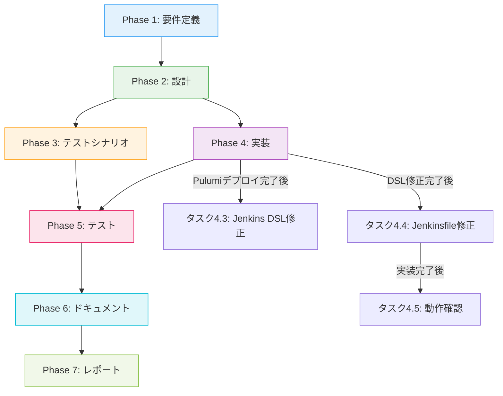

# プロジェクト計画書 - Issue #385

## Issue情報

- **Issue番号**: #385
- **タイトル**: [TASK] SSMバックアップジョブをマルチリージョン対応化（us-west-2対応追加）
- **状態**: open
- **URL**: https://github.com/tielec/infrastructure-as-code/issues/385

---

## 1. Issue分析

### 複雑度評価

**判定**: 中程度

**理由**:
- 複数のコンポーネントを横断する変更（Pulumi、Jenkins DSL、Jenkinsfile）
- 既存機能の拡張であり、新規サブシステムの追加ではない
- アーキテクチャの大幅な変更は不要
- 既存のリージョン（ap-northeast-1）に対する後方互換性の確保が必要

### 見積もり工数

**合計**: 約12時間

**内訳**:
- Phase 1（要件定義）: 1.5時間
- Phase 2（設計）: 2時間
- Phase 3（テストシナリオ）: 1.5時間
- Phase 4（実装）: 4時間
  - Pulumiスタックデプロイ: 1時間
  - Jenkins DSL修正: 0.5時間
  - Jenkinsfile修正: 1時間
  - 動作確認・デバッグ: 1.5時間
- Phase 5（テスト）: 2時間
- Phase 6（ドキュメント）: 0.5時間
- Phase 7（レポート）: 0.5時間

**根拠**:
- Pulumiのデプロイは既存のスタック構造を活用するため比較的短時間で完了
- Jenkins DSL/Jenkinsfileの変更は局所的で限定的
- テストは2リージョン×2環境（dev/prod）の組み合わせが必要
- 既存機能への影響確認が必要なため、テストフェーズにやや時間を要する

### リスク評価

**全体評価**: 低〜中

**リスク詳細**:

| リスク項目 | 評価 | 理由 |
|-----------|------|------|
| 技術的複雑性 | 低 | 既存実装の拡張のみ |
| 既存機能への影響 | 中 | ap-northeast-1の後方互換性を確保する必要あり |
| 依存関係 | 低 | 独立したリージョン固有リソース |
| デプロイリスク | 低 | Pulumiによる冪等性保証あり |

---

## 2. 実装戦略判断

### 実装戦略: **EXTEND**

**判断根拠**:
- 既存のJenkinsジョブ（admin_ssm_backup_job）を拡張し、リージョンをパラメータとして追加する
- 既存のJenkinsfile、DSL、Pulumiスタックは維持しながら、リージョン選択機能を追加する
- 新規ファイル・クラスの作成は不要で、既存コードの拡張で実現可能
- ハードコードされた `AWS_REGION` を動的なパラメータに変更する
- アーキテクチャやフロー構造の変更は不要

**実装方針**:
1. **Pulumi**: 既存のスタック構造を活用し、us-west-2用の新規スタックをデプロイ
2. **Jenkins DSL**: `choiceParam('AWS_REGION', ...)` を追加
3. **Jenkinsfile**: `AWS_REGION = params.AWS_REGION` に変更
4. **既存機能**: ap-northeast-1の動作に影響を与えない（デフォルト値で互換性確保）

### テスト戦略: **INTEGRATION_ONLY**

**判断根拠**:
- このタスクはAWS SSMパラメータストア、S3、Jenkinsジョブの統合動作確認が中心
- ユニットテストが必要な複雑なロジックは含まれていない（単純なパラメータ切り替え）
- BDDテストは不要（エンドユーザー向けの機能ではなく、運用管理者向けの内部ツール）
- **統合テスト（Integration Test）が最も重要**:
  - AWSリージョン間でのSSMパラメータ取得・S3バケット書き込みの実動作確認
  - 各リージョンで正しいS3バケットが使用されるかの検証
  - 環境（dev/prod）とリージョンの組み合わせパターンの検証

**テストスコープ**:
1. ap-northeast-1 での既存機能の回帰テスト（後方互換性確認）
2. us-west-2 での新規機能テスト（新規リージョン対応確認）
3. ドライランモードでの動作確認（本番実行前のシミュレーション）
4. 環境×リージョンのマトリクステスト（dev+ap-northeast-1、dev+us-west-2、prod+ap-northeast-1、prod+us-west-2）

### テストコード戦略: **該当なし（NONE）**

**判断根拠**:
- JenkinsのPipelineジョブはインフラストラクチャコードであり、従来の自動テストコード（ユニットテスト、BDDテスト）は作成しない方針
- 代わりに、**手動の統合テスト（Integration Test）を実施**:
  - 実際にJenkinsジョブを実行し、AWSリソースとの統合動作を確認
  - 各リージョン、各環境での実行結果をログとS3バケットで確認
  - ドライランモードと本番実行モードの両方で動作確認
- **自動テストコードの作成は不要**:
  - Groovyによる自動テストフレームワークの構築はプロジェクトスコープ外
  - 統合テストは手動実行で十分（実行頻度は低く、対象も明確）
  - Jenkinsジョブのテストは「実行して確認」が最も確実で効率的

**テスト実施方法**:
- Phase 5（テスト）で詳細なテストシナリオに基づいて手動実行
- テスト結果はテストレポート（Markdown）として記録
- 成功基準を満たすまで繰り返しテストを実施

---

## 3. 影響範囲分析

### 既存コードへの影響

| ファイルパス | 変更内容 | 影響度 |
|-------------|---------|--------|
| `pulumi/jenkins-ssm-backup-s3/index.ts` | 変更なし（既存実装をus-west-2でも利用） | なし |
| `pulumi/jenkins-ssm-backup-s3/Pulumi.us-west-2-dev.yaml` | **新規作成**（us-west-2用スタック設定） | 低 |
| `pulumi/jenkins-ssm-backup-s3/Pulumi.us-west-2-prod.yaml` | **新規作成**（us-west-2用スタック設定） | 低 |
| `jenkins/jobs/dsl/admin/admin_ssm_backup_job.groovy` | `AWS_REGION` choiceParamを追加 | 低 |
| `jenkins/jobs/pipeline/admin/ssm-backup/Jenkinsfile` | ハードコードされた `AWS_REGION` を `params.AWS_REGION` に変更 | 中 |

### 後方互換性への影響

**重要**: 既存のap-northeast-1での実行に影響を与えないことが必須。

- **Jenkins DSL**: choiceParamのデフォルト値を `ap-northeast-1` に設定
- **Jenkinsfile**: パラメータ取得時にデフォルト値を考慮（`params.AWS_REGION ?: 'ap-northeast-1'`）
- **SSMパラメータ**: 既存の `/jenkins/{env}/backup/s3-bucket-name` はそのまま維持
- **S3バケット**: リージョンごとに独立したバケットを使用（相互干渉なし）

### 依存関係の変更

**新規依存の追加**: なし
- 既存のAWS SDK、Pulumi、Jenkinsプラグインをそのまま使用

**既存依存の変更**: なし
- パッケージバージョンの変更は不要

### マイグレーション要否

**マイグレーション不要**:
- データベーススキーマ変更なし
- 設定ファイルの後方互換性は維持
- 既存のSSMパラメータやS3バケットはそのまま使用可能

**新規リソースのプロビジョニング**:
- us-west-2リージョンに新規S3バケットを作成（既存リソースには影響なし）
- us-west-2リージョンに新規SSMパラメータを作成（既存リソースには影響なし）

---

## 4. タスク分割

### Phase 1: 要件定義 (見積もり: 1.5h)

#### タスク1.1: 機能要件の明確化 (0.5h)
- [ ] リージョンパラメータの仕様を定義
  - 選択可能なリージョン: ap-northeast-1, us-west-2
  - デフォルト値: ap-northeast-1（後方互換性のため）
  - パラメータ名: `AWS_REGION`
- [ ] リージョンごとのS3バケット命名規則を確認
  - フォーマット: `{projectName}-ssm-backup-{environment}-{accountId}-{region}`
  - 例: `jenkins-infra-ssm-backup-dev-123456789012-us-west-2`
- [ ] SSMパラメータストアのパス規則を確認
  - パス: `/jenkins/{environment}/backup/s3-bucket-name`
  - リージョンごとに独立したパラメータストアを使用

#### タスク1.2: 非機能要件の定義 (0.5h)
- [ ] パフォーマンス要件
  - バックアップ実行時間: 既存と同等（リージョン追加による影響なし）
  - S3アップロード速度: リージョン内通信のため高速
- [ ] セキュリティ要件
  - S3バケットの暗号化: AES256（既存と同じ）
  - パブリックアクセスブロック: 有効（既存と同じ）
  - HTTPS通信の強制: 必須（既存と同じ）
- [ ] 運用要件
  - バックアップ保持期間: 30日（既存と同じ）
  - ドライランモード: 対応必須
  - エラーハンドリング: 既存と同等

#### タスク1.3: 受け入れ基準の明確化 (0.5h)
- [ ] 成功基準の文書化
  - ap-northeast-1で既存機能が正常動作すること
  - us-west-2で新規バックアップが正常実行されること
  - リージョンごとに正しいS3バケットが使用されること
  - 環境（dev/prod）とリージョンの全組み合わせで動作すること
  - ドライランモードが正常に機能すること
- [ ] テスト項目の洗い出し
  - 回帰テスト: ap-northeast-1（既存機能）
  - 新規機能テスト: us-west-2（新規リージョン）
  - マトリクステスト: 2環境×2リージョン=4パターン
  - エラーケーステスト: 無効なリージョン、S3バケット不存在など

**完了条件**:
- 機能要件が明確に記載されている
- 非機能要件が定義されている
- 受け入れ基準が具体的に定義されている

---

### Phase 2: 設計 (見積もり: 2h)

#### タスク2.1: Pulumiスタック設計 (0.5h)
- [ ] us-west-2用のスタック設定ファイル設計
  - `Pulumi.us-west-2-dev.yaml`
  - `Pulumi.us-west-2-prod.yaml`
- [ ] スタック設定内容の定義
  - `projectName`: jenkins-infra
  - `environment`: dev / prod
  - リージョン設定: `aws:region: us-west-2`
- [ ] 既存スタック（ap-northeast-1）への影響がないことを確認

#### タスク2.2: Jenkins DSL設計 (0.5h)
- [ ] リージョンパラメータの追加設計
  ```groovy
  choiceParam('AWS_REGION', ['ap-northeast-1', 'us-west-2'], 'バックアップ対象のAWSリージョン')
  ```
- [ ] パラメータの表示順序を決定（ENVIRONMENT → AWS_REGION → DRY_RUN → JENKINSFILE_BRANCH）
- [ ] デフォルト値の設定（最初の選択肢 `ap-northeast-1` がデフォルト）

#### タスク2.3: Jenkinsfile設計 (0.5h)
- [ ] `AWS_REGION` の動的取得設計
  ```groovy
  AWS_REGION = params.AWS_REGION ?: 'ap-northeast-1'
  ```
- [ ] ビルド表示名へのリージョン情報追加設計
  ```groovy
  currentBuild.displayName = "#${env.BUILD_NUMBER} - ${params.ENVIRONMENT} (${params.AWS_REGION}) Backup"
  ```
- [ ] ログ出力へのリージョン情報追加設計
  ```
  Region: ${params.AWS_REGION}
  ```

#### タスク2.4: エラーハンドリング設計 (0.5h)
- [ ] リージョン別のSSMパラメータ取得エラー処理
  - SSMパラメータが存在しない場合のエラーメッセージ
  - リージョン情報を含むエラーメッセージの設計
- [ ] S3バケット不存在時のエラーハンドリング
  - Pulumiスタック未デプロイのケースを想定
  - 適切なエラーメッセージを表示
- [ ] デフォルト値フォールバック機能の設計
  - パラメータ未指定時に `ap-northeast-1` を使用

**完了条件**:
- 実装に必要な設計が完了している
- エラーハンドリングが適切に設計されている
- 既存機能への影響がないことが確認されている

---

### Phase 3: テストシナリオ (見積もり: 1.5h)

#### タスク3.1: 統合テストシナリオ作成 (1h)
- [ ] 回帰テスト（ap-northeast-1）シナリオ
  - dev環境でのバックアップ実行
  - prod環境でのバックアップ実行
  - ドライランモードでの実行
  - S3バケット書き込み確認
- [ ] 新規機能テスト（us-west-2）シナリオ
  - dev環境でのバックアップ実行
  - prod環境でのバックアップ実行
  - ドライランモードでの実行
  - S3バケット書き込み確認
- [ ] マトリクステストシナリオ
  - dev + ap-northeast-1
  - dev + us-west-2
  - prod + ap-northeast-1
  - prod + us-west-2
- [ ] エラーケーステストシナリオ
  - SSMパラメータ不存在（Pulumiスタック未デプロイ）
  - S3バケット書き込み権限不足（IAMロール確認）

#### タスク3.2: テストデータ準備計画 (0.5h)
- [ ] 各リージョンのSSMパラメータ確認
  - ap-northeast-1: 既存パラメータを使用
  - us-west-2: テスト用パラメータの作成（Pulumiデプロイ後）
- [ ] S3バケット確認
  - ap-northeast-1: 既存バケットを使用
  - us-west-2: 新規バケットの作成（Pulumiデプロイ）
- [ ] テスト実行環境の確認
  - Jenkinsエージェントのリージョンアクセス権限確認
  - IAMロールの権限確認（両リージョンへのアクセス）

**完了条件**:
- 統合テストシナリオが明確に定義されている
- テストデータ準備計画が完了している
- テスト実行環境が確認されている

---

### Phase 4: 実装 (見積もり: 4h)

#### タスク4.1: Pulumiスタックデプロイ（us-west-2, dev環境） (0.5h)
- [ ] `Pulumi.us-west-2-dev.yaml` を作成
  ```yaml
  config:
    jenkins-ssm-backup-s3:projectName: jenkins-infra
    jenkins-ssm-backup-s3:environment: dev
    aws:region: us-west-2
  ```
- [ ] スタックの作成とデプロイ
  ```bash
  cd pulumi/jenkins-ssm-backup-s3
  pulumi stack init us-west-2-dev
  pulumi config set aws:region us-west-2
  pulumi up
  ```
- [ ] デプロイ結果の確認
  - S3バケット作成確認
  - SSMパラメータ作成確認（`/jenkins/dev/backup/s3-bucket-name`）
  - バケット名が正しいこと確認（リージョン名を含む）

#### タスク4.2: Pulumiスタックデプロイ（us-west-2, prod環境） (0.5h)
- [ ] `Pulumi.us-west-2-prod.yaml` を作成
  ```yaml
  config:
    jenkins-ssm-backup-s3:projectName: jenkins-infra
    jenkins-ssm-backup-s3:environment: prod
    aws:region: us-west-2
  ```
- [ ] スタックの作成とデプロイ
  ```bash
  pulumi stack init us-west-2-prod
  pulumi config set aws:region us-west-2
  pulumi up
  ```
- [ ] デプロイ結果の確認
  - S3バケット作成確認
  - SSMパラメータ作成確認（`/jenkins/prod/backup/s3-bucket-name`）
  - バケット名が正しいこと確認（リージョン名を含む）

#### タスク4.3: Jenkins DSL修正 (0.5h)
- [ ] `jenkins/jobs/dsl/admin/admin_ssm_backup_job.groovy` を修正
- [ ] リージョンパラメータを追加
  ```groovy
  parameters {
      choiceParam('ENVIRONMENT', ['dev', 'prod'], '環境を選択')
      choiceParam('AWS_REGION', ['ap-northeast-1', 'us-west-2'], 'バックアップ対象のAWSリージョン')
      booleanParam('DRY_RUN', false, 'ドライランモード（実際のバックアップは実行しない）')
      stringParam('JENKINSFILE_BRANCH', 'main', 'Jenkinsfileが格納されているブランチ')
  }
  ```
- [ ] シンタックスチェック実施

#### タスク4.4: Jenkinsfile修正 (1h)
- [ ] `jenkins/jobs/pipeline/admin/ssm-backup/Jenkinsfile` を修正
- [ ] `AWS_REGION` をパラメータから取得
  ```groovy
  environment {
      // AWS設定
      AWS_REGION = params.AWS_REGION ?: 'ap-northeast-1'
      // ...
  }
  ```
- [ ] ビルド表示名にリージョン情報を追加
  ```groovy
  currentBuild.displayName = "#${env.BUILD_NUMBER} - ${params.ENVIRONMENT} (${params.AWS_REGION}) Backup"
  ```
- [ ] Initializeステージのログ出力にリージョン情報を追加
  ```groovy
  echo """
  =============================================
  SSM Parameter Store Backup
  =============================================
  Environment: ${params.ENVIRONMENT}
  Region: ${params.AWS_REGION}
  Filter: Parameters containing '${env.ENV_FILTER}'
  Dry Run: ${params.DRY_RUN}
  Timestamp: ${env.BACKUP_TIMESTAMP}
  Date: ${env.BACKUP_DATE}
  =============================================
  """.stripIndent()
  ```
- [ ] Dry Run Reportにリージョン情報を追加
  ```groovy
  echo """
  =============================================
  DRY RUN - バックアップ実行レポート
  =============================================

  このドライランでは実際のS3アップロードは行われませんでした。

  バックアップ対象:
  - 環境: ${params.ENVIRONMENT}
  - リージョン: ${params.AWS_REGION}
  - パラメータ数: ${paramCount}
  - バックアップ日時: ${env.BACKUP_TIMESTAMP}

  実行時の動作:
  - S3バケット: ${env.BACKUP_BUCKET}
  - S3パス: ${env.BACKUP_DATE}/
  - ファイル名: ssm-backup-${params.ENVIRONMENT}-${env.BACKUP_TIMESTAMP}.json

  =============================================
  """.stripIndent()
  ```

#### タスク4.5: 動作確認・デバッグ (1.5h)
- [ ] Jenkinsでシードジョブを実行してDSLを反映
- [ ] リージョンパラメータが正しく表示されることを確認
- [ ] デフォルト値（ap-northeast-1）が正しく設定されていることを確認
- [ ] ドライランモードで各リージョンの動作確認
- [ ] エラーメッセージが適切に表示されることを確認

**完了条件**:
- すべてのコード変更が完了している
- Pulumiスタックが正常にデプロイされている
- Jenkinsジョブが正常に作成されている
- 基本的な動作確認が完了している

---

### Phase 5: テスト (見積もり: 2h)

#### タスク5.1: 回帰テスト（ap-northeast-1） (0.5h)
- [ ] dev環境でバックアップジョブを実行
  - リージョン: ap-northeast-1
  - 環境: dev
  - ドライラン: false
  - 結果: S3バケットに正しくアップロードされることを確認
- [ ] prod環境でバックアップジョブを実行
  - リージョン: ap-northeast-1
  - 環境: prod
  - ドライラン: false
  - 結果: S3バケットに正しくアップロードされることを確認
- [ ] ドライランモードでの実行確認
  - ドライラン: true
  - 結果: レポートが正しく表示されることを確認

#### タスク5.2: 新規機能テスト（us-west-2） (0.5h)
- [ ] dev環境でバックアップジョブを実行
  - リージョン: us-west-2
  - 環境: dev
  - ドライラン: false
  - 結果: S3バケットに正しくアップロードされることを確認
- [ ] prod環境でバックアップジョブを実行
  - リージョン: us-west-2
  - 環境: prod
  - ドライラン: false
  - 結果: S3バケットに正しくアップロードされることを確認
- [ ] ドライランモードでの実行確認
  - ドライラン: true
  - 結果: レポートが正しく表示されることを確認

#### タスク5.3: マトリクステスト（全組み合わせ） (0.5h)
- [ ] dev + ap-northeast-1
- [ ] dev + us-west-2
- [ ] prod + ap-northeast-1
- [ ] prod + us-west-2
- [ ] 各組み合わせで正しいS3バケットが使用されることを確認
- [ ] バックアップファイルが正しい場所にアップロードされることを確認

#### タスク5.4: エラーケーステスト (0.5h)
- [ ] SSMパラメータ不存在のケース（手動でパラメータを削除して確認）
  - 適切なエラーメッセージが表示されることを確認
  - リージョン情報がエラーメッセージに含まれていることを確認
- [ ] S3書き込み権限不足のケース（可能であれば）
  - 適切なエラーメッセージが表示されることを確認

**完了条件**:
- すべてのテストケースが実行されている
- すべてのテストが合格している
- テスト結果が記録されている

---

### Phase 6: ドキュメント (見積もり: 0.5h)

#### タスク6.1: jenkins/README.md の更新 (0.3h)
- [ ] SSMバックアップジョブの説明にマルチリージョン対応を追加
  - リージョンパラメータの説明
  - 使用可能なリージョン: ap-northeast-1, us-west-2
  - リージョンごとの独立したS3バケットの説明
- [ ] 実行例の更新
  - リージョンパラメータを含む実行例を追加
  - ドライランモードの実行例を更新

#### タスク6.2: jenkins/CONTRIBUTION.md の確認 (0.2h)
- [ ] マルチリージョン対応に関する開発ガイドラインの追加が必要か確認
- [ ] 必要に応じてベストプラクティスを追加
  - リージョンパラメータの追加方法
  - リージョン固有リソースの管理方法

**完了条件**:
- ドキュメントが更新されている
- ドキュメントの内容が正確で分かりやすい

---

### Phase 7: レポート (見積もり: 0.5h)

#### タスク7.1: 実装レポートの作成 (0.3h)
- [ ] 実装内容のサマリー
  - 変更ファイル一覧
  - 追加されたリソース一覧（S3バケット、SSMパラメータ）
  - 実装上の重要なポイント
- [ ] テスト結果のサマリー
  - 実行したテストケース一覧
  - テスト結果（Pass/Fail）
  - 発見された問題と解決方法

#### タスク7.2: 今後の課題と改善提案 (0.2h)
- [ ] 追加のリージョン対応（eu-west-1、ap-southeast-1など）
- [ ] リージョン選択のデフォルト値を環境変数で制御
- [ ] バックアップの自動検証機能（リストアテスト）
- [ ] バックアップファイルの差分管理機能

**完了条件**:
- 実装レポートが完成している
- 今後の改善提案が記載されている

---

## 5. 依存関係



### 依存関係の詳細

**Phase間の依存関係**:
1. Phase 1 → Phase 2: 要件が明確でないと設計ができない
2. Phase 2 → Phase 3, 4: 設計が完了しないとテストシナリオと実装ができない
3. Phase 3, 4 → Phase 5: テストシナリオと実装が完了しないとテストができない
4. Phase 5 → Phase 6: テスト結果を反映してドキュメントを作成
5. Phase 6 → Phase 7: ドキュメント完成後に最終レポートを作成

**Phase 4内の依存関係**:
1. タスク4.1, 4.2（Pulumiデプロイ）が完了しないと、タスク4.5（動作確認）でS3バケットが利用できない
2. タスク4.3（DSL修正）が完了しないと、タスク4.4（Jenkinsfile修正）でパラメータが正しく渡されない
3. タスク4.4（Jenkinsfile修正）が完了しないと、タスク4.5（動作確認）ができない

---

## 6. リスクと軽減策

### リスク1: 既存機能への影響（後方互換性の破壊）

- **影響度**: 高
- **確率**: 低
- **詳細**: パラメータ追加により、既存のap-northeast-1での動作が影響を受ける可能性
- **軽減策**:
  1. デフォルト値を `ap-northeast-1` に設定し、パラメータ未指定時は既存動作を維持
  2. Phase 5で回帰テストを最優先で実施
  3. 変更前後のJenkinsfile動作を比較確認
  4. 問題発生時は即座にロールバック可能な体制を整備

### リスク2: Pulumiスタックデプロイの失敗

- **影響度**: 中
- **確率**: 低
- **詳細**: us-west-2でのPulumiデプロイ時にリソース作成エラーが発生する可能性
- **軽減策**:
  1. デプロイ前に `pulumi preview` で変更内容を確認
  2. 既存のap-northeast-1スタックと同じ構造を使用し、実績のある実装を活用
  3. S3バケット名の一意性を確保（アカウントID、リージョンを含む）
  4. IAMロールの権限が両リージョンで有効であることを事前確認

### リスク3: リージョン間のSSMパラメータ参照の混乱

- **影響度**: 中
- **確率**: 中
- **詳細**: Jenkinsfileが誤ったリージョンのSSMパラメータを参照してしまう可能性
- **軽減策**:
  1. SSMパラメータ取得時に必ず `--region ${AWS_REGION}` オプションを指定
  2. エラーメッセージにリージョン情報を含め、デバッグを容易にする
  3. ドライランモードで事前確認を徹底
  4. Phase 5で全リージョン・環境の組み合わせをテスト

### リスク4: IAM権限の不足

- **影響度**: 中
- **確率**: 低
- **詳細**: Jenkinsエージェントが両リージョンのS3、SSMにアクセスできない可能性
- **軽減策**:
  1. 実装前にIAMロールポリシーを確認（マルチリージョンアクセス権限）
  2. ドライランモードで権限エラーを早期検出
  3. 必要に応じてIAMポリシーを更新（別Issueとして対応）
  4. エラーメッセージで権限不足を明示的に通知

### リスク5: S3バケット名の競合

- **影響度**: 低
- **確率**: 極低
- **詳細**: S3バケット名が既に使用されている可能性
- **軽減策**:
  1. バケット名にアカウントIDとリージョンを含め一意性を確保
  2. Pulumiが自動的に競合を検出してエラーを報告
  3. デプロイ前に `pulumi preview` で確認
  4. 万が一競合した場合は、バケット名のサフィックスを変更

### リスク6: スコープクリープ（追加要件の発生）

- **影響度**: 中
- **確率**: 低
- **詳細**: 実装中に追加のリージョン対応や機能追加が要求される可能性
- **軽減策**:
  1. Phase 1で要件を明確に定義し、スコープを固定
  2. 追加要件は別Issueとして扱う方針を明確化
  3. 今回のスコープはap-northeast-1とus-west-2の2リージョンのみ
  4. 今後の拡張は Phase 7 で改善提案として記載

---

## 7. 品質ゲート

### Phase 1: 要件定義

- [ ] 機能要件が明確に記載されている
  - リージョンパラメータの仕様が定義されている
  - S3バケット命名規則が明確である
  - SSMパラメータパスが定義されている
- [ ] 非機能要件が定義されている
  - パフォーマンス、セキュリティ、運用要件が記載されている
- [ ] 受け入れ基準が定義されている
  - 成功基準が明確である
  - テスト項目が洗い出されている
- [ ] ステークホルダーの承認が得られている（必要に応じて）

### Phase 2: 設計

- [ ] **実装戦略の判断根拠が明記されている**（EXTEND）
- [ ] **テスト戦略の判断根拠が明記されている**（INTEGRATION_ONLY）
- [ ] **テストコード戦略の判断根拠が明記されている**（該当なし/手動統合テスト）
- [ ] Pulumiスタック設計が完了している
- [ ] Jenkins DSL設計が完了している
- [ ] Jenkinsfile設計が完了している
- [ ] エラーハンドリング設計が適切である
- [ ] 既存機能への影響がないことが確認されている

### Phase 3: テストシナリオ

- [ ] 統合テストシナリオが明確に定義されている
  - 回帰テスト（ap-northeast-1）
  - 新規機能テスト（us-west-2）
  - マトリクステスト（2環境×2リージョン）
  - エラーケーステスト
- [ ] テストデータ準備計画が完了している
- [ ] テスト実行環境が確認されている
- [ ] テストの実行順序が明確である

### Phase 4: 実装

- [ ] すべてのコード変更が完了している
- [ ] Pulumiスタックが正常にデプロイされている
  - us-west-2 dev環境
  - us-west-2 prod環境
  - S3バケット作成確認
  - SSMパラメータ作成確認
- [ ] Jenkinsジョブが正常に作成されている
- [ ] 基本的な動作確認が完了している
- [ ] コードレビューが実施されている（必要に応じて）
- [ ] シンタックスチェックが実施されている

### Phase 5: テスト

- [ ] すべてのテストケースが実行されている
  - 回帰テスト（ap-northeast-1）: 3ケース
  - 新規機能テスト（us-west-2）: 3ケース
  - マトリクステスト: 4ケース
  - エラーケーステスト: 2ケース
- [ ] すべてのテストが合格している（Pass）
- [ ] テスト結果が記録されている
- [ ] 発見された問題が解決されている
- [ ] パフォーマンスが許容範囲内である
- [ ] セキュリティ要件が満たされている

### Phase 6: ドキュメント

- [ ] jenkins/README.md が更新されている
- [ ] jenkins/CONTRIBUTION.md が確認されている（必要に応じて更新）
- [ ] ドキュメントの内容が正確である
- [ ] ドキュメントが分かりやすく記述されている
- [ ] 実行例が正しく動作することを確認している

### Phase 7: レポート

- [ ] 実装レポートが完成している
  - 変更内容のサマリー
  - テスト結果のサマリー
  - 実装上の重要なポイント
- [ ] 今後の改善提案が記載されている
- [ ] Issue #385 の完了条件がすべて満たされている
- [ ] 成功基準がすべて達成されている

---

## 8. 成功基準の最終確認

以下の基準をすべて満たすことが、Issue #385 の完了条件です：

- [ ] **ap-northeast-1 と us-west-2 の両リージョンでSSMバックアップが実行できる**
  - Jenkinsジョブでリージョンを選択可能
  - 選択したリージョンで正常にバックアップが実行される
  - リージョン情報がログに正しく表示される

- [ ] **リージョンごとに独立したS3バケットにバックアップが保存される**
  - ap-northeast-1: `jenkins-infra-ssm-backup-{env}-{accountId}-ap-northeast-1`
  - us-west-2: `jenkins-infra-ssm-backup-{env}-{accountId}-us-west-2`
  - 各S3バケットに正しいファイルがアップロードされている

- [ ] **既存の ap-northeast-1 バックアップ機能が影響を受けない**
  - 回帰テストがすべて合格している
  - デフォルト動作が維持されている
  - 既存のS3バケット・SSMパラメータが正常に動作している

- [ ] **ドキュメントが更新されている**
  - jenkins/README.md にマルチリージョン対応が記載されている
  - 使用方法が明確に説明されている
  - 実行例が正しい

- [ ] **すべてのテストが合格している**
  - 回帰テスト: 3/3 Pass
  - 新規機能テスト: 3/3 Pass
  - マトリクステスト: 4/4 Pass
  - エラーケーステスト: 2/2 Pass

---

## 9. まとめ

本プロジェクト計画書は、Issue #385「SSMバックアップジョブをマルチリージョン対応化（us-west-2対応追加）」の実装を段階的に進めるためのロードマップです。

### 主要なポイント

1. **複雑度**: 中程度（見積もり工数: 約12時間）
2. **実装戦略**: EXTEND（既存機能の拡張）
3. **テスト戦略**: INTEGRATION_ONLY（統合テストのみ、手動実行）
4. **テストコード戦略**: 該当なし（自動テストコード作成は不要、手動統合テストを実施）
5. **主要リスク**: 既存機能への影響（後方互換性）→ デフォルト値設定と回帰テストで軽減

### 次のステップ

1. Phase 1（要件定義）から順番に進める
2. 各Phaseの品質ゲートを確実にクリアする
3. 問題が発生した場合は、リスク軽減策を適用する
4. すべてのフェーズ完了後、成功基準を最終確認する

本計画書に基づいて実装を進めることで、品質を維持しながら効率的にマルチリージョン対応を実現できます。
