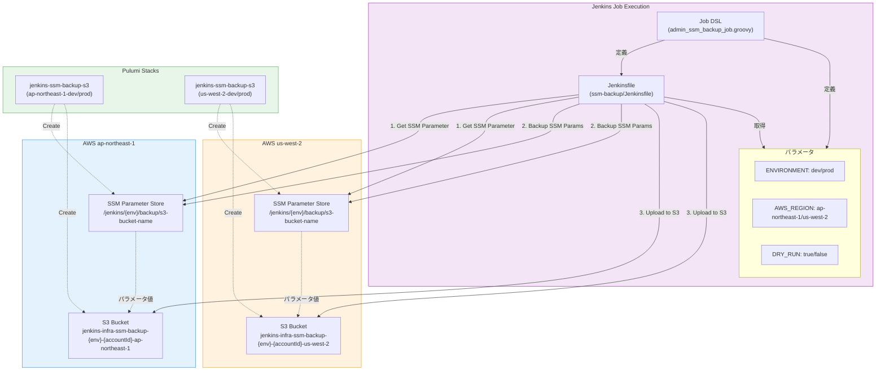
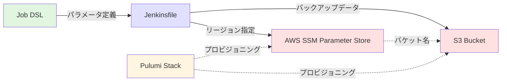
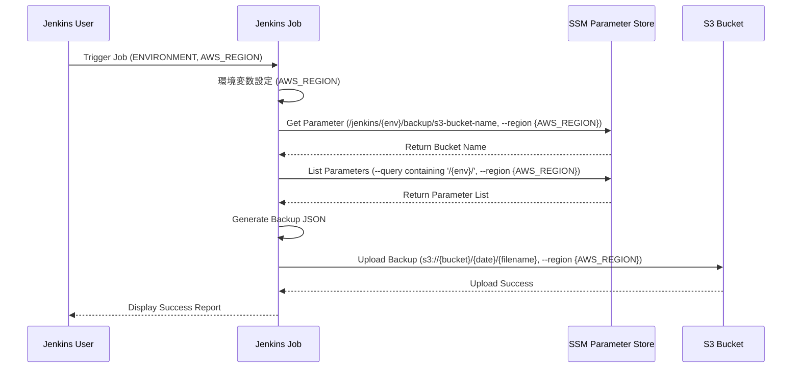
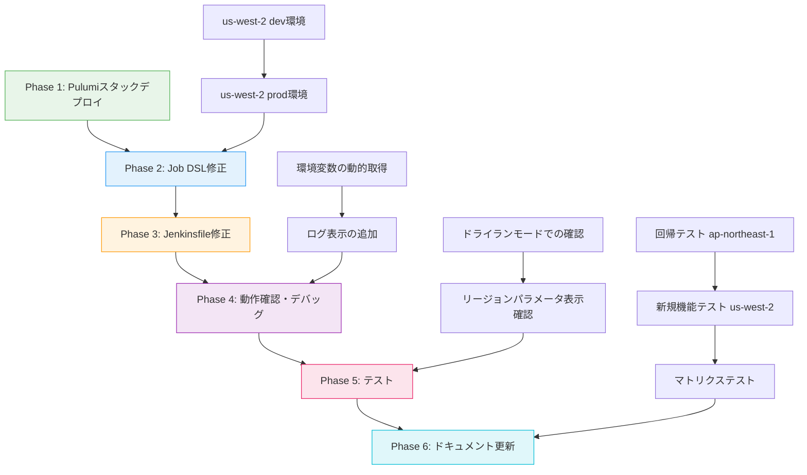

# 詳細設計書 - Issue #385

## Issue情報

- **Issue番号**: #385
- **タイトル**: [TASK] SSMバックアップジョブをマルチリージョン対応化（us-west-2対応追加）
- **状態**: open
- **URL**: https://github.com/tielec/infrastructure-as-code/issues/385
- **作成日**: 2025年度

---

## 0. Planning Documentの確認

Planning Phase（`.ai-workflow/issue-385/00_planning/output/planning.md`）および要件定義書（`.ai-workflow/issue-385/01_requirements/output/requirements.md`）で策定された以下の戦略を踏まえて詳細設計を実施します：

### 開発計画の全体像

- **複雑度評価**: 中程度（見積もり工数: 約12時間）
- **実装戦略**: EXTEND（既存機能の拡張）
- **テスト戦略**: INTEGRATION_ONLY（統合テストのみ、手動実行）
- **テストコード戦略**: 該当なし（自動テストコード作成不要、手動統合テストを実施）
- **主要リスク**: 既存機能への影響（後方互換性）→ デフォルト値設定と回帰テストで軽減

### スコープ

- **対象リージョン**: ap-northeast-1（既存）、us-west-2（新規）
- **スコープ外**: 追加リージョン対応（eu-west-1、ap-southeast-1など）は今回対象外

---

## 1. アーキテクチャ設計

### 1.1 システム全体図



### 1.2 コンポーネント間の関係



### 1.3 データフロー



---

## 2. 実装戦略判断

### 実装戦略: EXTEND（拡張）

**判断根拠**:
1. **既存コードの再利用**: 既存のJenkinsfile、DSL、Pulumiスタック構造をそのまま維持し、リージョンパラメータを追加するのみ
2. **ファイル修正のみ**: 新規ファイル作成は不要（Pulumiスタック設定ファイルを除く）
3. **局所的な変更**: 変更箇所は以下の3つのみ
   - Job DSL: choiceParamの追加（1行）
   - Jenkinsfile: 環境変数の取得方法変更（1行）+ ログ表示への追加（複数行）
   - Pulumiスタック設定: 新規環境用YAMLファイル（2ファイル）
4. **既存機能の保全**: ap-northeast-1の既存動作に影響を与えない（デフォルト値で互換性確保）

### 変更の性質

- **追加的変更**: リージョンの選択肢を追加するのみ
- **後方互換性**: デフォルト値（ap-northeast-1）により既存の動作を維持
- **アーキテクチャ**: 変更なし（既存のSSMパラメータ取得→S3アップロードフローを維持）

---

## 3. テスト戦略判断

### テスト戦略: INTEGRATION_ONLY（統合テストのみ）

**判断根拠**:
1. **システム統合の確認が最重要**: AWSリージョン、SSMパラメータストア、S3バケットの統合動作確認が中心
2. **複雑なロジックが存在しない**: 単純なパラメータ切り替えとAWS CLIコマンド実行のみ（ユニットテスト不要）
3. **BDDテスト不要**: エンドユーザー向けの機能ではなく、運用管理者向けの内部ツール
4. **手動実行が最適**: Jenkinsジョブは「実行して確認」が最も確実で効率的
5. **実行頻度が低い**: バックアップジョブは定期実行のため、頻繁なテストは不要

### テストスコープ

1. **回帰テスト（ap-northeast-1）**: 既存機能の互換性確認
2. **新規機能テスト（us-west-2）**: 新規リージョン対応の確認
3. **ドライランモード**: 本番実行前のシミュレーション
4. **マトリクステスト**: 環境×リージョンの全組み合わせ（2×2=4パターン）

---

## 4. テストコード戦略判断

### テストコード戦略: 該当なし（NONE）

**判断根拠**:
1. **Jenkinsパイプラインの性質**: インフラストラクチャコードであり、従来の自動テストコード（ユニットテスト、BDDテスト）は作成しない方針
2. **手動統合テストで十分**: 実際にJenkinsジョブを実行し、AWSリソースとの統合動作を確認する方が確実
3. **Groovyテストフレームワーク不要**: プロジェクトスコープ外であり、コストに見合わない
4. **実行頻度の低さ**: バックアップジョブは定期実行のため、自動テストの価値が低い

### テスト実施方法

- Phase 5（テスト）で詳細なテストシナリオに基づいて手動実行
- テスト結果はテストレポート（Markdown）として記録
- 成功基準を満たすまで繰り返しテストを実施

---

## 5. 影響範囲分析

### 5.1 既存コードへの影響

| ファイルパス | 変更内容 | 影響度 | 既存動作への影響 |
|-------------|---------|--------|----------------|
| `pulumi/jenkins-ssm-backup-s3/index.ts` | **変更なし** | なし | なし |
| `pulumi/jenkins-ssm-backup-s3/Pulumi.us-west-2-dev.yaml` | **新規作成** | 低 | なし（独立したスタック） |
| `pulumi/jenkins-ssm-backup-s3/Pulumi.us-west-2-prod.yaml` | **新規作成** | 低 | なし（独立したスタック） |
| `jenkins/jobs/dsl/admin/admin_ssm_backup_job.groovy` | **パラメータ追加**（choiceParam 'AWS_REGION'） | 低 | デフォルト値により既存動作を維持 |
| `jenkins/jobs/pipeline/admin/ssm-backup/Jenkinsfile` | **環境変数の動的取得**（AWS_REGION = params.AWS_REGION ?: 'ap-northeast-1'） | 中 | デフォルト値により後方互換性を確保 |
| `jenkins/jobs/pipeline/admin/ssm-backup/Jenkinsfile` | **ログ表示の追加**（Region情報を追加） | 低 | ログ出力のみで動作に影響なし |
| `jenkins/README.md` | **ドキュメント更新**（マルチリージョン対応の説明追加） | 低 | なし |

### 5.2 依存関係の変更

**新規依存の追加**: なし
- 既存のAWS CLI、Pulumi、Jenkinsプラグインをそのまま使用

**既存依存の変更**: なし
- パッケージバージョンの変更は不要

### 5.3 マイグレーション要否

**マイグレーション不要**:
- データベーススキーマ変更なし
- 設定ファイルの後方互換性は維持
- 既存のSSMパラメータやS3バケットはそのまま使用可能

**新規リソースのプロビジョニング**:
- us-west-2リージョンに新規S3バケットを作成（既存リソースには影響なし）
- us-west-2リージョンに新規SSMパラメータを作成（既存リソースには影響なし）

---

## 6. 変更・追加ファイルリスト

### 6.1 新規作成ファイル（相対パス）

| ファイルパス | 目的 | 内容 |
|------------|------|------|
| `pulumi/jenkins-ssm-backup-s3/Pulumi.us-west-2-dev.yaml` | us-west-2 dev環境スタック設定 | projectName, environment, aws:region |
| `pulumi/jenkins-ssm-backup-s3/Pulumi.us-west-2-prod.yaml` | us-west-2 prod環境スタック設定 | projectName, environment, aws:region |

### 6.2 修正が必要な既存ファイル（相対パス）

| ファイルパス | 修正内容 | 修正箇所 |
|------------|---------|---------|
| `jenkins/jobs/dsl/admin/admin_ssm_backup_job.groovy` | AWS_REGIONパラメータの追加 | parameters ブロック（50行目付近） |
| `jenkins/jobs/pipeline/admin/ssm-backup/Jenkinsfile` | AWS_REGIONの動的取得 | environment ブロック（21行目） |
| `jenkins/jobs/pipeline/admin/ssm-backup/Jenkinsfile` | ビルド表示名へのリージョン情報追加 | Initialize ステージ（41行目） |
| `jenkins/jobs/pipeline/admin/ssm-backup/Jenkinsfile` | ログ出力へのリージョン情報追加 | Initialize ステージ（48行目）、Dry Run Report ステージ（222行目） |
| `jenkins/jobs/pipeline/admin/ssm-backup/Jenkinsfile` | AWS CLI実行時のリージョン指定 | Get Backup Bucket Name（70行目）、Upload to S3（180行目）等 |
| `jenkins/README.md` | マルチリージョン対応の説明追加 | Admin_Jobs/SSM_Parameter_Backup セクション |

### 6.3 削除が必要なファイル（相対パス）

なし

---

## 7. 詳細設計

### 7.1 Job DSL設計

#### ファイル: `jenkins/jobs/dsl/admin/admin_ssm_backup_job.groovy`

**変更箇所**: parameters ブロック（50行目付近）

**変更前**:
```groovy
parameters {
    choiceParam('ENVIRONMENT', ['dev', 'prod'], '環境を選択')
    booleanParam('DRY_RUN', false, 'ドライランモード（実際のバックアップは実行しない）')
    stringParam('JENKINSFILE_BRANCH', 'main', 'Jenkinsfileが格納されているブランチ')
}
```

**変更後**:
```groovy
parameters {
    choiceParam('ENVIRONMENT', ['dev', 'prod'], '環境を選択')
    choiceParam('AWS_REGION', ['ap-northeast-1', 'us-west-2'], 'バックアップ対象のAWSリージョン')
    booleanParam('DRY_RUN', false, 'ドライランモード（実際のバックアップは実行しない）')
    stringParam('JENKINSFILE_BRANCH', 'main', 'Jenkinsfileが格納されているブランチ')
}
```

**設計ポイント**:
1. **choiceParamの最初の選択肢がデフォルト値**: `ap-northeast-1`を最初に配置することで後方互換性を確保
2. **パラメータの順序**: ENVIRONMENT → AWS_REGION → DRY_RUN → JENKINSFILE_BRANCH（論理的な順序）
3. **説明文**: 日本語で明確に「バックアップ対象のAWSリージョン」と記載

### 7.2 Jenkinsfile設計

#### ファイル: `jenkins/jobs/pipeline/admin/ssm-backup/Jenkinsfile`

#### 変更箇所1: 環境変数の動的取得（21行目）

**変更前**:
```groovy
environment {
    // AWS設定
    AWS_REGION = 'ap-northeast-1'

    // タイムスタンプ
    BACKUP_DATE = sh(script: "date '+%Y-%m-%d'", returnStdout: true).trim()
    // ...
}
```

**変更後**:
```groovy
environment {
    // AWS設定
    AWS_REGION = params.AWS_REGION ?: 'ap-northeast-1'

    // タイムスタンプ
    BACKUP_DATE = sh(script: "date '+%Y-%m-%d'", returnStdout: true).trim()
    // ...
}
```

**設計ポイント**:
1. **Groovyのエルビス演算子**: `params.AWS_REGION ?: 'ap-northeast-1'`により、パラメータ未指定時はデフォルト値を使用
2. **後方互換性**: パラメータが存在しない場合（古いジョブ定義）でもエラーにならない
3. **環境変数スコープ**: 全ステージで`env.AWS_REGION`として参照可能

#### 変更箇所2: ビルド表示名へのリージョン情報追加（41行目）

**変更前**:
```groovy
currentBuild.displayName = "#${env.BUILD_NUMBER} - ${params.ENVIRONMENT} Backup"
```

**変更後**:
```groovy
currentBuild.displayName = "#${env.BUILD_NUMBER} - ${params.ENVIRONMENT} (${params.AWS_REGION}) Backup"
```

**設計ポイント**:
1. **リージョン情報の視認性向上**: ビルド履歴を見るだけでどのリージョンのバックアップか判別可能
2. **括弧で明示**: `(ap-northeast-1)`のように括弧でリージョンを囲むことで可読性向上

#### 変更箇所3: ログ出力へのリージョン情報追加（48行目）

**変更前**:
```groovy
echo """
=============================================
SSM Parameter Store Backup
=============================================
Environment: ${params.ENVIRONMENT}
Filter: Parameters containing '${env.ENV_FILTER}'
Dry Run: ${params.DRY_RUN}
Timestamp: ${env.BACKUP_TIMESTAMP}
Date: ${env.BACKUP_DATE}
=============================================
""".stripIndent()
```

**変更後**:
```groovy
echo """
=============================================
SSM Parameter Store Backup
=============================================
Environment: ${params.ENVIRONMENT}
Region: ${params.AWS_REGION}
Filter: Parameters containing '${env.ENV_FILTER}'
Dry Run: ${params.DRY_RUN}
Timestamp: ${env.BACKUP_TIMESTAMP}
Date: ${env.BACKUP_DATE}
=============================================
""".stripIndent()
```

**設計ポイント**:
1. **ログの一貫性**: すべての重要パラメータをログの先頭で表示
2. **トラブルシューティングの容易化**: どのリージョンで実行されたか明確

#### 変更箇所4: Dry Run Reportへのリージョン情報追加（222行目）

**変更前**:
```groovy
echo """
=============================================
DRY RUN - バックアップ実行レポート
=============================================

このドライランでは実際のS3アップロードは行われませんでした。

バックアップ対象:
- 環境: ${params.ENVIRONMENT}
- パラメータ数: ${paramCount}
- バックアップ日時: ${env.BACKUP_TIMESTAMP}

実行時の動作:
- S3バケット: ${env.BACKUP_BUCKET}
- S3パス: ${env.BACKUP_DATE}/
- ファイル名: ssm-backup-${params.ENVIRONMENT}-${env.BACKUP_TIMESTAMP}.json

=============================================
""".stripIndent()
```

**変更後**:
```groovy
echo """
=============================================
DRY RUN - バックアップ実行レポート
=============================================

このドライランでは実際のS3アップロードは行われませんでした。

バックアップ対象:
- 環境: ${params.ENVIRONMENT}
- リージョン: ${params.AWS_REGION}
- パラメータ数: ${paramCount}
- バックアップ日時: ${env.BACKUP_TIMESTAMP}

実行時の動作:
- S3バケット: ${env.BACKUP_BUCKET}
- S3パス: ${env.BACKUP_DATE}/
- ファイル名: ssm-backup-${params.ENVIRONMENT}-${env.BACKUP_TIMESTAMP}.json

=============================================
""".stripIndent()
```

**設計ポイント**:
1. **ドライラン時の確認情報**: リージョン情報を含めることで、実行前に正しいリージョンが選択されているか確認可能
2. **レポートの完全性**: 実行時のすべての重要パラメータを含む

#### 変更箇所5: AWS CLIコマンドへのリージョン指定（複数箇所）

**影響箇所**:
- Get Backup Bucket Name（70行目）
- Upload to S3（180行目）
- その他のaws cliコマンド

**変更例（Get Backup Bucket Name）**:
```groovy
env.BACKUP_BUCKET = sh(
    script: """
        aws ssm get-parameter \
            --name "/jenkins/${params.ENVIRONMENT}/backup/s3-bucket-name" \
            --query 'Parameter.Value' \
            --output text \
            --region ${AWS_REGION} 2>/dev/null || echo ""
    """,
    returnStdout: true
).trim()
```

**設計ポイント**:
1. **リージョン明示的指定**: `--region ${AWS_REGION}`により、環境変数のリージョンを使用
2. **既存の構造維持**: エラーハンドリング（`2>/dev/null || echo ""`）はそのまま維持
3. **一貫性**: すべてのAWS CLIコマンドで`--region`オプションを明示的に指定

### 7.3 Pulumiスタック設計

#### 新規ファイル1: `pulumi/jenkins-ssm-backup-s3/Pulumi.us-west-2-dev.yaml`

```yaml
config:
  jenkins-ssm-backup-s3:projectName: jenkins-infra
  jenkins-ssm-backup-s3:environment: dev
  aws:region: us-west-2
```

**設計ポイント**:
1. **既存スタック設定との一貫性**: Pulumi.dev.yamlと同じ構造を維持
2. **リージョン明示的指定**: `aws:region: us-west-2`により、us-west-2リージョンにデプロイ
3. **プロジェクト名の統一**: `jenkins-infra`で統一

#### 新規ファイル2: `pulumi/jenkins-ssm-backup-s3/Pulumi.us-west-2-prod.yaml`

```yaml
config:
  jenkins-ssm-backup-s3:projectName: jenkins-infra
  jenkins-ssm-backup-s3:environment: prod
  aws:region: us-west-2
```

**設計ポイント**:
1. **prod環境との一貫性**: Pulumi.prod.yamlと同じ構造を維持
2. **環境名の明示**: `environment: prod`でprod環境を明示

#### Pulumi Stackの作成とデプロイ手順

```bash
# us-west-2 dev環境
cd pulumi/jenkins-ssm-backup-s3
pulumi stack init us-west-2-dev
pulumi config set aws:region us-west-2
pulumi up

# us-west-2 prod環境
pulumi stack init us-west-2-prod
pulumi config set aws:region us-west-2
pulumi up
```

**デプロイ結果の確認項目**:
1. **S3バケット作成**: `jenkins-infra-ssm-backup-{env}-{accountId}-us-west-2`
2. **SSMパラメータ作成**: `/jenkins/{env}/backup/s3-bucket-name`（us-west-2リージョン内）
3. **バケット名の確認**: リージョン名（us-west-2）が含まれていること

### 7.4 エラーハンドリング設計

#### エラーシナリオ1: SSMパラメータが存在しない場合

**発生箇所**: Initialize ステージ（Get Backup Bucket Name）

**既存のエラーハンドリング**:
```groovy
if (!env.BACKUP_BUCKET) {
    error("バックアップ用S3バケットが見つかりません。Pulumiスタックがデプロイされていることを確認してください。")
}
```

**改善案（リージョン情報を含む）**:
```groovy
if (!env.BACKUP_BUCKET) {
    error("バックアップ用S3バケットが見つかりません（リージョン: ${params.AWS_REGION}）。Pulumiスタックがデプロイされていることを確認してください。")
}
```

**設計ポイント**:
1. **リージョン情報の明示**: どのリージョンで失敗したか明確
2. **デバッグの容易化**: エラーメッセージから即座に原因を特定可能

#### エラーシナリオ2: S3バケットへのアップロード失敗

**発生箇所**: Upload to S3 ステージ

**既存のエラーハンドリング**:
- シェルコマンドのエラーコードによる自動失敗（Jenkins標準動作）

**設計ポイント**:
1. **明示的なリージョン指定**: `--region ${AWS_REGION}`により、リージョン不一致エラーを防止
2. **エラーメッセージの自動生成**: AWS CLIのエラーメッセージにリージョン情報が含まれる

---

## 8. セキュリティ考慮事項

### 8.1 認証・認可

**変更なし**: 既存のIAMロールとポリシーを使用

**確認事項**:
- JenkinsエージェントのIAMロールが両リージョン（ap-northeast-1、us-west-2）のSSMパラメータストア、S3にアクセス可能であること
- IAMポリシーにリージョン制限がないこと

### 8.2 データ保護

**変更なし**: 既存のセキュリティ設定を維持

**確認事項**:
1. **S3バケット暗号化**: AES256（既存と同じ）
2. **パブリックアクセスブロック**: 有効（既存と同じ）
3. **HTTPS通信の強制**: 必須（既存と同じ）
4. **SSMパラメータの暗号化**: SecureStringタイプで暗号化

### 8.3 セキュリティリスクと対策

| リスク | 対策 | 実装状況 |
|--------|------|---------|
| 不正なリージョン選択 | choiceParamで選択肢を制限 | 実装済み（DSL設計） |
| IAM権限不足 | 事前にIAMロールの権限を確認 | 実装前確認必須 |
| S3バケット不存在 | エラーハンドリングでPulumiデプロイを促す | 実装済み（Jenkinsfile既存） |
| クレデンシャル漏洩 | S3バケットへのアップロードは暗号化必須 | 実装済み（Pulumi設計） |

---

## 9. 非機能要件への対応

### 9.1 パフォーマンス

**要件**: バックアップ実行時間は既存実装と同等であること（±5%以内）

**対応**:
1. **リージョン内通信**: 同一リージョン内のSSMパラメータストアとS3バケット間の通信のため、ネットワークレイテンシは最小
2. **処理フローの変更なし**: リージョン追加による処理の複雑化はなし
3. **並列実行不要**: 単一リージョンのバックアップのみ（リージョン間の並列実行は不要）

**パフォーマンス測定項目**:
- バックアップ実行時間（ステージごと）
- S3アップロード時間
- SSMパラメータ取得時間

### 9.2 スケーラビリティ

**要件**: 将来的な追加リージョン対応が容易であること

**対応**:
1. **リージョンのハードコーディング排除**: choiceParamに新しいリージョンを追加するだけで拡張可能
2. **Pulumiスタック構造の再利用**: 既存のindex.tsをそのまま利用し、新しいスタック設定ファイルを追加するだけ
3. **ドキュメント化**: 拡張方法をREADME.mdに明記

**拡張時の作業**（例: eu-west-1を追加する場合）:
1. DSL: `choiceParam('AWS_REGION', ['ap-northeast-1', 'us-west-2', 'eu-west-1'], ...)`
2. Pulumiスタック設定: `Pulumi.eu-west-1-dev.yaml`, `Pulumi.eu-west-1-prod.yaml`を作成
3. Pulumiデプロイ: `pulumi stack init eu-west-1-dev && pulumi up`

### 9.3 保守性

**要件**: 保守性の高いコード設計

**対応**:
1. **コメントの充実**: 変更箇所にコメントを追加
2. **ドキュメント更新**: README.mdにマルチリージョン対応の説明を追加
3. **一貫性の維持**: 既存のコーディング規約（CONTRIBUTION.md）に準拠
4. **シンプルな設計**: リージョンパラメータの追加のみで、複雑なロジックは不要

---

## 10. 実装の順序

### 推奨実装順序



### 依存関係の詳細

1. **Phase 1 → Phase 2**: Pulumiスタックがデプロイされていないと、S3バケットとSSMパラメータが存在せず、動作確認ができない
2. **Phase 2 → Phase 3**: Job DSLでパラメータを定義してからJenkinsfileで使用する
3. **Phase 3 → Phase 4**: Jenkinsfileの修正が完了してから動作確認を行う
4. **Phase 4 → Phase 5**: 基本的な動作確認が完了してから本格的なテストを行う
5. **Phase 5 → Phase 6**: テスト結果を反映してドキュメントを作成

### 実装時の注意事項

1. **Phase 1（Pulumiデプロイ）**:
   - dev環境を先にデプロイしてテスト
   - prod環境は動作確認後にデプロイ
   - S3バケット名の一意性を確認（アカウントID、リージョンを含む）

2. **Phase 2（DSL修正）**:
   - choiceParamの最初の選択肢を`ap-northeast-1`にすることで後方互換性を確保
   - シードジョブ（Admin_Jobs/job-creator）を実行してDSLを反映

3. **Phase 3（Jenkinsfile修正）**:
   - エルビス演算子（`?:`）を使用してデフォルト値を設定
   - すべてのAWS CLIコマンドに`--region ${AWS_REGION}`を追加

4. **Phase 4（動作確認）**:
   - まずドライランモードでリージョンパラメータが正しく表示されることを確認
   - 次にap-northeast-1で既存機能の互換性を確認
   - 最後にus-west-2で新規機能を確認

5. **Phase 5（テスト）**:
   - 回帰テスト（ap-northeast-1）を最優先で実施
   - 新規機能テスト（us-west-2）で新規リージョンの動作を確認
   - マトリクステスト（2環境×2リージョン=4パターン）で全組み合わせを確認

6. **Phase 6（ドキュメント）**:
   - jenkins/README.mdにマルチリージョン対応を追加
   - 実行例にリージョンパラメータを含める

---

## 11. 品質ゲート確認

### 設計書の品質ゲート

- [x] **実装戦略の判断根拠が明記されている**: セクション2で詳細に記載
- [x] **テスト戦略の判断根拠が明記されている**: セクション3で詳細に記載
- [x] **テストコード戦略の判断根拠が明記されている**: セクション4で詳細に記載
- [x] **既存コードへの影響範囲が分析されている**: セクション5で詳細に記載
- [x] **変更が必要なファイルがリストアップされている**: セクション6で詳細に記載
- [x] **設計が実装可能である**: セクション7で具体的な実装方法を記載

### クリティカルシンキングレビューの準備

**予想される質問と回答準備**:

1. **Q: なぜEXTEND戦略なのか？**
   - A: 既存コードの再利用が可能で、新規ファイル作成は最小限（Pulumiスタック設定のみ）。リージョンパラメータの追加だけで実現できるため。

2. **Q: なぜINTEGRATION_ONLYなのか？**
   - A: AWSリージョン、SSMパラメータストア、S3バケットの統合動作確認が中心。複雑なロジックが存在せず、手動実行が最も確実で効率的。

3. **Q: なぜテストコードを作成しないのか？**
   - A: Jenkinsパイプラインはインフラストラクチャコードであり、従来の自動テストコードは作成しない方針。手動統合テストで十分。

4. **Q: 既存機能への影響はないか？**
   - A: デフォルト値（ap-northeast-1）により後方互換性を確保。回帰テストで確認予定。

5. **Q: 将来的な拡張性は確保されているか？**
   - A: choiceParamに新しいリージョンを追加するだけで拡張可能。Pulumiスタック構造は再利用可能。

---

## 12. 成功基準の最終確認

以下の基準をすべて満たすことが、Issue #385 の完了条件です：

- [ ] **ap-northeast-1 と us-west-2 の両リージョンでSSMバックアップが実行できる**
  - Jenkinsジョブでリージョンを選択可能
  - 選択したリージョンで正常にバックアップが実行される
  - リージョン情報がログに正しく表示される

- [ ] **リージョンごとに独立したS3バケットにバックアップが保存される**
  - ap-northeast-1: `jenkins-infra-ssm-backup-{env}-{accountId}-ap-northeast-1`
  - us-west-2: `jenkins-infra-ssm-backup-{env}-{accountId}-us-west-2`
  - 各S3バケットに正しいファイルがアップロードされている

- [ ] **既存の ap-northeast-1 バックアップ機能が影響を受けない**
  - 回帰テストがすべて合格している
  - デフォルト動作が維持されている
  - 既存のS3バケット・SSMパラメータが正常に動作している

- [ ] **ドキュメントが更新されている**
  - jenkins/README.md にマルチリージョン対応が記載されている
  - 使用方法が明確に説明されている
  - 実行例が正しい

- [ ] **すべてのテストが合格している**
  - 回帰テスト: 3/3 Pass
  - 新規機能テスト: 3/3 Pass
  - マトリクステスト: 4/4 Pass
  - エラーケーステスト: 2/2 Pass

---

## 13. まとめ

本詳細設計書は、Issue #385「SSMバックアップジョブをマルチリージョン対応化（us-west-2対応追加）」の実装を具体的に進めるための技術設計です。

### 主要なポイント

1. **実装戦略**: EXTEND（既存機能の拡張）- リージョンパラメータの追加のみ
2. **テスト戦略**: INTEGRATION_ONLY（統合テストのみ、手動実行）- AWS統合動作確認が中心
3. **テストコード戦略**: 該当なし（NONE）- 手動統合テストで十分
4. **後方互換性**: デフォルト値（ap-northeast-1）により既存動作を維持
5. **セキュリティ**: 既存のセキュリティ設定を維持（変更なし）
6. **拡張性**: 将来的な追加リージョン対応が容易（choiceParamに追加するのみ）

### 次のステップ

1. **Phase 3（テストシナリオ）**: 詳細なテストシナリオを作成
2. **Phase 4（実装）**: 本設計書に基づいて実装を進める
3. **Phase 5（テスト）**: テストシナリオに基づいて手動統合テストを実施
4. **Phase 6（ドキュメント）**: jenkins/README.mdを更新
5. **Phase 7（レポート）**: 実装レポートを作成

---

**作成日**: 2025年度
**最終更新日**: 2025年度
**作成者**: AI Workflow Orchestrator
**レビュー状態**: 初版作成完了、レビュー待ち
