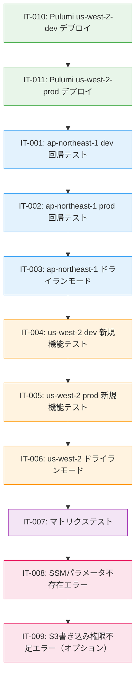

# テストシナリオ - Issue #385

## Issue情報

- **Issue番号**: #385
- **タイトル**: [TASK] SSMバックアップジョブをマルチリージョン対応化（us-west-2対応追加）
- **状態**: open
- **URL**: https://github.com/tielec/infrastructure-as-code/issues/385
- **作成日**: 2025年度

---

## 0. Planning Documentの確認

Planning Phase（`.ai-workflow/issue-385/00_planning/output/planning.md`）および要件定義書（`.ai-workflow/issue-385/01_requirements/output/requirements.md`）、設計書（`.ai-workflow/issue-385/02_design/output/design.md`）で策定された以下の戦略を踏まえてテストシナリオを作成します：

### 開発計画の全体像

- **複雑度評価**: 中程度（見積もり工数: 約12時間）
- **実装戦略**: EXTEND（既存機能の拡張）
- **テスト戦略**: **INTEGRATION_ONLY（統合テストのみ、手動実行）**
- **テストコード戦略**: 該当なし（自動テストコード作成不要、手動統合テストを実施）
- **主要リスク**: 既存機能への影響（後方互換性）→ デフォルト値設定と回帰テストで軽減

### スコープ

- **対象リージョン**: ap-northeast-1（既存）、us-west-2（新規）
- **スコープ外**: 追加リージョン対応（eu-west-1、ap-southeast-1など）は今回対象外

---

## 1. テスト戦略サマリー

### 選択されたテスト戦略

**INTEGRATION_ONLY（統合テストのみ）**

### 判断根拠（Planning/Design Phaseより）

1. **システム統合の確認が最重要**: AWSリージョン、SSMパラメータストア、S3バケットの統合動作確認が中心
2. **複雑なロジックが存在しない**: 単純なパラメータ切り替えとAWS CLIコマンド実行のみ（ユニットテスト不要）
3. **BDDテスト不要**: エンドユーザー向けの機能ではなく、運用管理者向けの内部ツール
4. **手動実行が最適**: Jenkinsジョブは「実行して確認」が最も確実で効率的
5. **実行頻度が低い**: バックアップジョブは定期実行のため、頻繁なテストは不要

### テスト対象の範囲

以下の統合ポイントをテストします：

1. **Jenkins ↔ SSM Parameter Store**: リージョン別のSSMパラメータ取得
2. **Jenkins ↔ S3**: リージョン別のS3バケット書き込み
3. **Pulumi ↔ AWS**: us-west-2リージョンへのリソースプロビジョニング
4. **Job DSL ↔ Jenkinsfile**: リージョンパラメータの受け渡し

### テストの目的

1. **後方互換性の確認**: 既存のap-northeast-1バックアップ機能が影響を受けないこと
2. **新規機能の動作確認**: us-west-2リージョンでバックアップが正常に動作すること
3. **マルチリージョン対応の検証**: 環境（dev/prod）×リージョン（ap-northeast-1/us-west-2）の全組み合わせで正常動作すること
4. **エラーハンドリングの確認**: 異常系シナリオで適切なエラーメッセージが表示されること

---

## 2. テストシナリオ一覧

本Issue #385では以下の統合テストシナリオを実施します：

| ID | カテゴリ | シナリオ名 | 優先度 | 見積時間 |
|----|---------|-----------|--------|---------|
| IT-001 | 回帰テスト | ap-northeast-1 dev環境バックアップ（既存機能） | 高 | 10分 |
| IT-002 | 回帰テスト | ap-northeast-1 prod環境バックアップ（既存機能） | 高 | 10分 |
| IT-003 | 回帰テスト | ap-northeast-1 ドライランモード（既存機能） | 高 | 10分 |
| IT-004 | 新規機能テスト | us-west-2 dev環境バックアップ（新規リージョン） | 高 | 10分 |
| IT-005 | 新規機能テスト | us-west-2 prod環境バックアップ（新規リージョン） | 高 | 10分 |
| IT-006 | 新規機能テスト | us-west-2 ドライランモード（新規リージョン） | 高 | 10分 |
| IT-007 | マトリクステスト | 環境×リージョンの全組み合わせテスト | 高 | 20分 |
| IT-008 | エラーケーステスト | SSMパラメータ不存在エラー | 中 | 15分 |
| IT-009 | エラーケーステスト | S3書き込み権限不足エラー（オプション） | 低 | 15分 |
| IT-010 | Pulumiデプロイテスト | us-west-2 dev環境のPulumiスタックデプロイ | 高 | 15分 |
| IT-011 | Pulumiデプロイテスト | us-west-2 prod環境のPulumiスタックデプロイ | 高 | 15分 |

**合計見積時間**: 約2時間

---

## 3. Integrationテストシナリオ（詳細）

### IT-001: ap-northeast-1 dev環境バックアップ（既存機能）

**カテゴリ**: 回帰テスト

**目的**: 既存のap-northeast-1 dev環境でのバックアップ機能が影響を受けないことを確認する

**優先度**: 高（後方互換性の確認）

**前提条件**:
- Pulumiスタック（ap-northeast-1-dev）が既にデプロイ済みであること
- SSMパラメータ `/jenkins/dev/backup/s3-bucket-name` がap-northeast-1リージョンに存在すること
- S3バケット `jenkins-infra-ssm-backup-dev-{accountId}-ap-northeast-1` が存在すること
- Jenkins Job DSLが更新されていること（AWS_REGIONパラメータが追加済み）
- Jenkinsfileが更新されていること（リージョンパラメータ対応済み）

**テスト手順**:

1. Jenkins UIでAdmin_Jobs/ssm-backupジョブを開く
2. 「Build with Parameters」をクリック
3. パラメータを以下のように設定:
   - `ENVIRONMENT`: `dev`
   - `AWS_REGION`: `ap-northeast-1`
   - `DRY_RUN`: `false`
   - `JENKINSFILE_BRANCH`: `main`
4. 「Build」ボタンをクリックしてジョブを実行
5. ビルドが完了するまで待機
6. コンソールログを確認
7. S3バケットの内容を確認

**期待結果**:

- [ ] ジョブが成功（SUCCESS）ステータスで完了すること
- [ ] ビルド表示名が `#<ビルド番号> - dev (ap-northeast-1) Backup` の形式で表示されること
- [ ] コンソールログに以下が表示されること:
  - `Environment: dev`
  - `Region: ap-northeast-1`
  - `SSM Parameter Store Backup` のヘッダー
  - SSMパラメータ取得のログ
  - S3アップロードのログ
- [ ] S3バケット `jenkins-infra-ssm-backup-dev-{accountId}-ap-northeast-1` に以下のファイルが作成されること:
  - パス: `{YYYY-MM-DD}/ssm-backup-dev-{timestamp}.json`
  - ファイルサイズ: 0バイト以上
  - ファイル内容: JSONフォーマットで、dev環境のSSMパラメータが含まれている
- [ ] バックアップファイルにdev環境のSSMパラメータが含まれていること（例: `/jenkins/dev/` で始まるパラメータ）

**確認項目チェックリスト**:

- [ ] ジョブステータス: SUCCESS
- [ ] ビルド表示名: リージョン情報含む
- [ ] ログ: Region情報が表示されている
- [ ] S3バケット: ap-northeast-1のバケットが使用されている
- [ ] S3ファイル: 正しいパスにアップロードされている
- [ ] S3ファイル内容: JSONフォーマットで、dev環境のSSMパラメータが含まれている

**テスト実施者**: AI Workflow Orchestrator / 開発者

**テスト実施日**: 実装完了後

---

### IT-002: ap-northeast-1 prod環境バックアップ（既存機能）

**カテゴリ**: 回帰テスト

**目的**: 既存のap-northeast-1 prod環境でのバックアップ機能が影響を受けないことを確認する

**優先度**: 高（後方互換性の確認）

**前提条件**:
- Pulumiスタック（ap-northeast-1-prod）が既にデプロイ済みであること
- SSMパラメータ `/jenkins/prod/backup/s3-bucket-name` がap-northeast-1リージョンに存在すること
- S3バケット `jenkins-infra-ssm-backup-prod-{accountId}-ap-northeast-1` が存在すること
- IT-001（dev環境テスト）が成功していること

**テスト手順**:

1. Jenkins UIでAdmin_Jobs/ssm-backupジョブを開く
2. 「Build with Parameters」をクリック
3. パラメータを以下のように設定:
   - `ENVIRONMENT`: `prod`
   - `AWS_REGION`: `ap-northeast-1`
   - `DRY_RUN`: `false`
   - `JENKINSFILE_BRANCH`: `main`
4. 「Build」ボタンをクリックしてジョブを実行
5. ビルドが完了するまで待機
6. コンソールログを確認
7. S3バケットの内容を確認

**期待結果**:

- [ ] ジョブが成功（SUCCESS）ステータスで完了すること
- [ ] ビルド表示名が `#<ビルド番号> - prod (ap-northeast-1) Backup` の形式で表示されること
- [ ] コンソールログに以下が表示されること:
  - `Environment: prod`
  - `Region: ap-northeast-1`
  - `SSM Parameter Store Backup` のヘッダー
  - SSMパラメータ取得のログ
  - S3アップロードのログ
- [ ] S3バケット `jenkins-infra-ssm-backup-prod-{accountId}-ap-northeast-1` に以下のファイルが作成されること:
  - パス: `{YYYY-MM-DD}/ssm-backup-prod-{timestamp}.json`
  - ファイルサイズ: 0バイト以上
  - ファイル内容: JSONフォーマットで、prod環境のSSMパラメータが含まれている
- [ ] バックアップファイルにprod環境のSSMパラメータが含まれていること（例: `/jenkins/prod/` で始まるパラメータ）

**確認項目チェックリスト**:

- [ ] ジョブステータス: SUCCESS
- [ ] ビルド表示名: リージョン情報含む（prod）
- [ ] ログ: Region情報が表示されている（ap-northeast-1）
- [ ] S3バケット: ap-northeast-1のprodバケットが使用されている
- [ ] S3ファイル: 正しいパスにアップロードされている
- [ ] S3ファイル内容: JSONフォーマットで、prod環境のSSMパラメータが含まれている

**テスト実施者**: AI Workflow Orchestrator / 開発者

**テスト実施日**: 実装完了後

---

### IT-003: ap-northeast-1 ドライランモード（既存機能）

**カテゴリ**: 回帰テスト

**目的**: 既存のap-northeast-1でのドライランモードが正常に動作することを確認する

**優先度**: 高（後方互換性の確認）

**前提条件**:
- IT-001, IT-002が成功していること
- Jenkinsfileがドライランモードに対応していること

**テスト手順**:

1. Jenkins UIでAdmin_Jobs/ssm-backupジョブを開く
2. 「Build with Parameters」をクリック
3. パラメータを以下のように設定:
   - `ENVIRONMENT`: `dev`
   - `AWS_REGION`: `ap-northeast-1`
   - `DRY_RUN`: `true`（ドライランモード）
   - `JENKINSFILE_BRANCH`: `main`
4. 「Build」ボタンをクリックしてジョブを実行
5. ビルドが完了するまで待機
6. コンソールログを確認
7. S3バケットの内容を確認（新規ファイルがアップロードされていないことを確認）

**期待結果**:

- [ ] ジョブが成功（SUCCESS）ステータスで完了すること
- [ ] コンソールログに以下が表示されること:
  - `Environment: dev`
  - `Region: ap-northeast-1`
  - `Dry Run: true`
  - `DRY RUN - バックアップ実行レポート` のヘッダー
  - `このドライランでは実際のS3アップロードは行われませんでした。`
  - `バックアップ対象:` セクションに環境とリージョン情報が含まれている
  - `- 環境: dev`
  - `- リージョン: ap-northeast-1`
  - `- パラメータ数: {N}`
  - `実行時の動作:` セクションにS3バケット情報が含まれている
- [ ] S3バケットに新規ファイルがアップロードされていないこと
- [ ] ドライランレポートが正しく表示されること

**確認項目チェックリスト**:

- [ ] ジョブステータス: SUCCESS
- [ ] ドライランレポート: 表示されている
- [ ] ドライランレポート: リージョン情報が含まれている
- [ ] ドライランレポート: S3バケット名が表示されている
- [ ] S3バケット: 新規ファイルがアップロードされていない（ドライランのため）

**テスト実施者**: AI Workflow Orchestrator / 開発者

**テスト実施日**: 実装完了後

---

### IT-004: us-west-2 dev環境バックアップ（新規リージョン）

**カテゴリ**: 新規機能テスト

**目的**: 新規リージョン（us-west-2）のdev環境でバックアップが正常に動作することを確認する

**優先度**: 高（新規機能の動作確認）

**前提条件**:
- **IT-010（Pulumiスタックデプロイ us-west-2-dev）が完了していること**
- SSMパラメータ `/jenkins/dev/backup/s3-bucket-name` がus-west-2リージョンに存在すること
- S3バケット `jenkins-infra-ssm-backup-dev-{accountId}-us-west-2` が存在すること
- IT-001〜IT-003（ap-northeast-1回帰テスト）が成功していること

**テスト手順**:

1. Jenkins UIでAdmin_Jobs/ssm-backupジョブを開く
2. 「Build with Parameters」をクリック
3. パラメータを以下のように設定:
   - `ENVIRONMENT`: `dev`
   - `AWS_REGION`: `us-west-2`（新規リージョン）
   - `DRY_RUN`: `false`
   - `JENKINSFILE_BRANCH`: `main`
4. 「Build」ボタンをクリックしてジョブを実行
5. ビルドが完了するまで待機
6. コンソールログを確認
7. S3バケットの内容を確認

**期待結果**:

- [ ] ジョブが成功（SUCCESS）ステータスで完了すること
- [ ] ビルド表示名が `#<ビルド番号> - dev (us-west-2) Backup` の形式で表示されること
- [ ] コンソールログに以下が表示されること:
  - `Environment: dev`
  - `Region: us-west-2`（新規リージョン）
  - `SSM Parameter Store Backup` のヘッダー
  - SSMパラメータ取得のログ（us-west-2リージョンから）
  - S3アップロードのログ（us-west-2リージョンへ）
- [ ] S3バケット `jenkins-infra-ssm-backup-dev-{accountId}-us-west-2` に以下のファイルが作成されること:
  - パス: `{YYYY-MM-DD}/ssm-backup-dev-{timestamp}.json`
  - ファイルサイズ: 0バイト以上
  - ファイル内容: JSONフォーマットで、dev環境のSSMパラメータが含まれている
- [ ] **バケット名に "us-west-2" が含まれていること**（リージョン識別のため）
- [ ] バックアップファイルにdev環境のSSMパラメータが含まれていること

**確認項目チェックリスト**:

- [ ] ジョブステータス: SUCCESS
- [ ] ビルド表示名: リージョン情報含む（us-west-2）
- [ ] ログ: Region情報が表示されている（us-west-2）
- [ ] S3バケット: us-west-2のバケットが使用されている
- [ ] S3バケット名: "us-west-2" が含まれている
- [ ] S3ファイル: 正しいパスにアップロードされている
- [ ] S3ファイル内容: JSONフォーマットで、dev環境のSSMパラメータが含まれている

**テスト実施者**: AI Workflow Orchestrator / 開発者

**テスト実施日**: Pulumiデプロイ（IT-010）完了後

---

### IT-005: us-west-2 prod環境バックアップ（新規リージョン）

**カテゴリ**: 新規機能テスト

**目的**: 新規リージョン（us-west-2）のprod環境でバックアップが正常に動作することを確認する

**優先度**: 高（新規機能の動作確認）

**前提条件**:
- **IT-011（Pulumiスタックデプロイ us-west-2-prod）が完了していること**
- SSMパラメータ `/jenkins/prod/backup/s3-bucket-name` がus-west-2リージョンに存在すること
- S3バケット `jenkins-infra-ssm-backup-prod-{accountId}-us-west-2` が存在すること
- IT-004（dev環境テスト）が成功していること

**テスト手順**:

1. Jenkins UIでAdmin_Jobs/ssm-backupジョブを開く
2. 「Build with Parameters」をクリック
3. パラメータを以下のように設定:
   - `ENVIRONMENT`: `prod`
   - `AWS_REGION`: `us-west-2`（新規リージョン）
   - `DRY_RUN`: `false`
   - `JENKINSFILE_BRANCH`: `main`
4. 「Build」ボタンをクリックしてジョブを実行
5. ビルドが完了するまで待機
6. コンソールログを確認
7. S3バケットの内容を確認

**期待結果**:

- [ ] ジョブが成功（SUCCESS）ステータスで完了すること
- [ ] ビルド表示名が `#<ビルド番号> - prod (us-west-2) Backup` の形式で表示されること
- [ ] コンソールログに以下が表示されること:
  - `Environment: prod`
  - `Region: us-west-2`（新規リージョン）
  - `SSM Parameter Store Backup` のヘッダー
  - SSMパラメータ取得のログ（us-west-2リージョンから）
  - S3アップロードのログ（us-west-2リージョンへ）
- [ ] S3バケット `jenkins-infra-ssm-backup-prod-{accountId}-us-west-2` に以下のファイルが作成されること:
  - パス: `{YYYY-MM-DD}/ssm-backup-prod-{timestamp}.json`
  - ファイルサイズ: 0バイト以上
  - ファイル内容: JSONフォーマットで、prod環境のSSMパラメータが含まれている
- [ ] **バケット名に "us-west-2" が含まれていること**（リージョン識別のため）
- [ ] バックアップファイルにprod環境のSSMパラメータが含まれていること

**確認項目チェックリスト**:

- [ ] ジョブステータス: SUCCESS
- [ ] ビルド表示名: リージョン情報含む（prod, us-west-2）
- [ ] ログ: Region情報が表示されている（us-west-2）
- [ ] S3バケット: us-west-2のprodバケットが使用されている
- [ ] S3バケット名: "us-west-2" が含まれている
- [ ] S3ファイル: 正しいパスにアップロードされている
- [ ] S3ファイル内容: JSONフォーマットで、prod環境のSSMパラメータが含まれている

**テスト実施者**: AI Workflow Orchestrator / 開発者

**テスト実施日**: Pulumiデプロイ（IT-011）完了後

---

### IT-006: us-west-2 ドライランモード（新規リージョン）

**カテゴリ**: 新規機能テスト

**目的**: 新規リージョン（us-west-2）でのドライランモードが正常に動作することを確認する

**優先度**: 高（新規機能の動作確認）

**前提条件**:
- IT-004, IT-005が成功していること
- Jenkinsfileがドライランモードに対応していること

**テスト手順**:

1. Jenkins UIでAdmin_Jobs/ssm-backupジョブを開く
2. 「Build with Parameters」をクリック
3. パラメータを以下のように設定:
   - `ENVIRONMENT`: `dev`
   - `AWS_REGION`: `us-west-2`（新規リージョン）
   - `DRY_RUN`: `true`（ドライランモード）
   - `JENKINSFILE_BRANCH`: `main`
4. 「Build」ボタンをクリックしてジョブを実行
5. ビルドが完了するまで待機
6. コンソールログを確認
7. S3バケットの内容を確認（新規ファイルがアップロードされていないことを確認）

**期待結果**:

- [ ] ジョブが成功（SUCCESS）ステータスで完了すること
- [ ] コンソールログに以下が表示されること:
  - `Environment: dev`
  - `Region: us-west-2`（新規リージョン）
  - `Dry Run: true`
  - `DRY RUN - バックアップ実行レポート` のヘッダー
  - `このドライランでは実際のS3アップロードは行われませんでした。`
  - `バックアップ対象:` セクションに環境とリージョン情報が含まれている
  - `- 環境: dev`
  - `- リージョン: us-west-2`（新規リージョン）
  - `- パラメータ数: {N}`
  - `実行時の動作:` セクションにS3バケット情報が含まれている
  - S3バケット名に "us-west-2" が含まれている
- [ ] S3バケットに新規ファイルがアップロードされていないこと
- [ ] ドライランレポートが正しく表示されること

**確認項目チェックリスト**:

- [ ] ジョブステータス: SUCCESS
- [ ] ドライランレポート: 表示されている
- [ ] ドライランレポート: リージョン情報が含まれている（us-west-2）
- [ ] ドライランレポート: S3バケット名が表示されている
- [ ] ドライランレポート: S3バケット名に "us-west-2" が含まれている
- [ ] S3バケット: 新規ファイルがアップロードされていない（ドライランのため）

**テスト実施者**: AI Workflow Orchestrator / 開発者

**テスト実施日**: IT-004, IT-005完了後

---

### IT-007: 環境×リージョンの全組み合わせテスト

**カテゴリ**: マトリクステスト

**目的**: 環境（dev/prod）×リージョン（ap-northeast-1/us-west-2）の全4パターンで正常に動作することを確認する

**優先度**: 高（マルチリージョン対応の検証）

**前提条件**:
- IT-001〜IT-006がすべて成功していること
- 両リージョンの両環境でPulumiスタックがデプロイ済みであること

**テスト手順**:

以下の4パターンをすべて実行し、結果を記録する：

**パターン1: dev + ap-northeast-1**
1. パラメータ設定: `ENVIRONMENT=dev`, `AWS_REGION=ap-northeast-1`, `DRY_RUN=false`
2. ジョブ実行
3. 結果確認: S3バケット `jenkins-infra-ssm-backup-dev-{accountId}-ap-northeast-1` にファイルがアップロードされること

**パターン2: dev + us-west-2**
1. パラメータ設定: `ENVIRONMENT=dev`, `AWS_REGION=us-west-2`, `DRY_RUN=false`
2. ジョブ実行
3. 結果確認: S3バケット `jenkins-infra-ssm-backup-dev-{accountId}-us-west-2` にファイルがアップロードされること

**パターン3: prod + ap-northeast-1**
1. パラメータ設定: `ENVIRONMENT=prod`, `AWS_REGION=ap-northeast-1`, `DRY_RUN=false`
2. ジョブ実行
3. 結果確認: S3バケット `jenkins-infra-ssm-backup-prod-{accountId}-ap-northeast-1` にファイルがアップロードされること

**パターン4: prod + us-west-2**
1. パラメータ設定: `ENVIRONMENT=prod`, `AWS_REGION=us-west-2`, `DRY_RUN=false`
2. ジョブ実行
3. 結果確認: S3バケット `jenkins-infra-ssm-backup-prod-{accountId}-us-west-2` にファイルがアップロードされること

**期待結果**:

- [ ] すべてのパターンでジョブが成功（SUCCESS）ステータスで完了すること
- [ ] 各パターンで正しいS3バケットにバックアップがアップロードされること
- [ ] バケット名が `jenkins-infra-ssm-backup-{env}-{accountId}-{region}` の形式であること
- [ ] 各パターンのビルド表示名に環境とリージョン情報が含まれること
- [ ] 各パターンのログに環境とリージョン情報が含まれること

**確認項目チェックリスト**:

| パターン | ジョブステータス | S3バケット | ファイルアップロード | ビルド表示名 |
|---------|----------------|-----------|-------------------|------------|
| dev + ap-northeast-1 | [ ] SUCCESS | [ ] 正しいバケット | [ ] アップロード完了 | [ ] 正しい表示 |
| dev + us-west-2 | [ ] SUCCESS | [ ] 正しいバケット | [ ] アップロード完了 | [ ] 正しい表示 |
| prod + ap-northeast-1 | [ ] SUCCESS | [ ] 正しいバケット | [ ] アップロード完了 | [ ] 正しい表示 |
| prod + us-west-2 | [ ] SUCCESS | [ ] 正しいバケット | [ ] アップロード完了 | [ ] 正しい表示 |

**テスト実施者**: AI Workflow Orchestrator / 開発者

**テスト実施日**: IT-001〜IT-006完了後

---

### IT-008: SSMパラメータ不存在エラー

**カテゴリ**: エラーケーステスト

**目的**: SSMパラメータが存在しない場合に適切なエラーメッセージが表示されることを確認する

**優先度**: 中（エラーハンドリングの確認）

**前提条件**:
- IT-007（マトリクステスト）が成功していること
- us-west-2リージョンのSSMパラメータを一時的に削除できること（テスト用）

**テスト手順**:

1. **準備**: us-west-2 dev環境のSSMパラメータを一時的に削除する
   ```bash
   aws ssm delete-parameter \
       --name "/jenkins/dev/backup/s3-bucket-name" \
       --region us-west-2
   ```
2. Jenkins UIでAdmin_Jobs/ssm-backupジョブを開く
3. 「Build with Parameters」をクリック
4. パラメータを以下のように設定:
   - `ENVIRONMENT`: `dev`
   - `AWS_REGION`: `us-west-2`
   - `DRY_RUN`: `false`
   - `JENKINSFILE_BRANCH`: `main`
5. 「Build」ボタンをクリックしてジョブを実行
6. ビルドが完了するまで待機
7. コンソールログを確認
8. **後処理**: SSMパラメータを再作成する（Pulumiで再デプロイ、または手動作成）

**期待結果**:

- [ ] ジョブが失敗（FAILURE）ステータスで完了すること
- [ ] エラーメッセージに以下が含まれること:
  - `バックアップ用S3バケットが見つかりません`
  - `リージョン: us-west-2`（リージョン情報が含まれている）
  - `Pulumiスタックがデプロイされていることを確認してください`
- [ ] SSMパラメータが存在しないことがエラーメッセージから明確に分かること
- [ ] S3バケットへのアップロードが実行されないこと

**確認項目チェックリスト**:

- [ ] ジョブステータス: FAILURE
- [ ] エラーメッセージ: リージョン情報が含まれている
- [ ] エラーメッセージ: SSMパラメータパスが含まれている
- [ ] エラーメッセージ: 対処方法（Pulumiデプロイ）が示されている
- [ ] S3アップロード: 実行されていない

**注意事項**:
- テスト後、必ずSSMパラメータを復旧すること
- prod環境では実施しないこと（dev環境のみ）

**テスト実施者**: AI Workflow Orchestrator / 開発者

**テスト実施日**: IT-007完了後

---

### IT-009: S3書き込み権限不足エラー（オプション）

**カテゴリ**: エラーケーステスト

**目的**: S3バケットへの書き込み権限が不足している場合に適切なエラーメッセージが表示されることを確認する

**優先度**: 低（オプション、実施可能な場合のみ）

**前提条件**:
- IT-007（マトリクステスト）が成功していること
- JenkinsエージェントのIAMロールを一時的に変更できること（テスト用）

**テスト手順**:

1. **準備**: JenkinsエージェントのIAMロールからS3書き込み権限を一時的に削除する（または、S3バケットポリシーでアクセスを拒否）
2. Jenkins UIでAdmin_Jobs/ssm-backupジョブを開く
3. 「Build with Parameters」をクリック
4. パラメータを以下のように設定:
   - `ENVIRONMENT`: `dev`
   - `AWS_REGION`: `us-west-2`
   - `DRY_RUN`: `false`
   - `JENKINSFILE_BRANCH`: `main`
5. 「Build」ボタンをクリックしてジョブを実行
6. ビルドが完了するまで待機
7. コンソールログを確認
8. **後処理**: IAMロールの権限を復旧する

**期待結果**:

- [ ] ジョブが失敗（FAILURE）ステータスで完了すること
- [ ] エラーメッセージにAWS CLIのエラーが含まれること（例: `AccessDenied`, `An error occurred (AccessDenied) when calling the PutObject operation`）
- [ ] エラーメッセージからS3書き込み権限が不足していることが分かること

**確認項目チェックリスト**:

- [ ] ジョブステータス: FAILURE
- [ ] エラーメッセージ: AWS CLIのエラーが含まれている
- [ ] エラーメッセージ: AccessDeniedまたは権限不足が示されている

**注意事項**:
- **このテストは実施可能な場合のみ実施すること**
- IAMロール変更が困難な場合はスキップ可
- テスト後、必ずIAMロールの権限を復旧すること
- prod環境では実施しないこと（dev環境のみ）

**テスト実施者**: AI Workflow Orchestrator / 開発者

**テスト実施日**: IT-007完了後（オプション）

---

### IT-010: us-west-2 dev環境のPulumiスタックデプロイ

**カテゴリ**: Pulumiデプロイテスト

**目的**: us-west-2リージョンのdev環境用Pulumiスタックが正常にデプロイされることを確認する

**優先度**: 高（新規リージョン対応のインフラ構築）

**前提条件**:
- Pulumiがインストールされていること
- AWS認証情報が設定されていること
- `pulumi/jenkins-ssm-backup-s3/Pulumi.us-west-2-dev.yaml` が作成されていること

**テスト手順**:

1. ターミナルでPulumiプロジェクトディレクトリに移動
   ```bash
   cd pulumi/jenkins-ssm-backup-s3
   ```

2. us-west-2-devスタックを初期化（既に存在する場合は選択）
   ```bash
   pulumi stack init us-west-2-dev
   ```

3. AWSリージョンを設定
   ```bash
   pulumi config set aws:region us-west-2
   ```

4. プレビューを実行（変更内容の確認）
   ```bash
   pulumi preview
   ```

5. プレビュー結果を確認し、以下のリソースが作成されることを確認
   - S3バケット: `jenkins-infra-ssm-backup-dev-{accountId}-us-west-2`
   - SSMパラメータ: `/jenkins/dev/backup/s3-bucket-name`

6. デプロイを実行
   ```bash
   pulumi up
   ```

7. デプロイ完了後、AWS Consoleで以下を確認
   - S3バケットが作成されていること
   - SSMパラメータが作成されていること

8. AWS CLIで確認
   ```bash
   # S3バケットの確認
   aws s3 ls | grep "jenkins-infra-ssm-backup-dev.*us-west-2"

   # SSMパラメータの確認
   aws ssm get-parameter \
       --name "/jenkins/dev/backup/s3-bucket-name" \
       --region us-west-2 \
       --query 'Parameter.Value' \
       --output text
   ```

**期待結果**:

- [ ] `pulumi up` が正常に完了すること（エラーなし）
- [ ] S3バケットが作成されること
  - バケット名: `jenkins-infra-ssm-backup-dev-{accountId}-us-west-2`
  - バケット名に "us-west-2" が含まれていること
  - リージョン: us-west-2
  - 暗号化: 有効（AES256）
  - パブリックアクセスブロック: 有効
- [ ] SSMパラメータが作成されること
  - パラメータ名: `/jenkins/dev/backup/s3-bucket-name`
  - リージョン: us-west-2
  - タイプ: String
  - 値: S3バケット名と一致すること
- [ ] Pulumiの出力にリソース作成のログが表示されること

**確認項目チェックリスト**:

- [ ] Pulumiデプロイ: 正常完了
- [ ] S3バケット: 作成済み
- [ ] S3バケット名: "us-west-2" 含む
- [ ] S3バケット暗号化: 有効
- [ ] S3バケットパブリックアクセス: ブロック有効
- [ ] SSMパラメータ: 作成済み（us-west-2リージョン）
- [ ] SSMパラメータ値: S3バケット名と一致

**テスト実施者**: AI Workflow Orchestrator / 開発者

**テスト実施日**: Phase 4（実装フェーズ）開始時

---

### IT-011: us-west-2 prod環境のPulumiスタックデプロイ

**カテゴリ**: Pulumiデプロイテスト

**目的**: us-west-2リージョンのprod環境用Pulumiスタックが正常にデプロイされることを確認する

**優先度**: 高（新規リージョン対応のインフラ構築）

**前提条件**:
- IT-010（dev環境デプロイ）が成功していること
- Pulumiがインストールされていること
- AWS認証情報が設定されていること
- `pulumi/jenkins-ssm-backup-s3/Pulumi.us-west-2-prod.yaml` が作成されていること

**テスト手順**:

1. ターミナルでPulumiプロジェクトディレクトリに移動
   ```bash
   cd pulumi/jenkins-ssm-backup-s3
   ```

2. us-west-2-prodスタックを初期化（既に存在する場合は選択）
   ```bash
   pulumi stack init us-west-2-prod
   ```

3. AWSリージョンを設定
   ```bash
   pulumi config set aws:region us-west-2
   ```

4. プレビューを実行（変更内容の確認）
   ```bash
   pulumi preview
   ```

5. プレビュー結果を確認し、以下のリソースが作成されることを確認
   - S3バケット: `jenkins-infra-ssm-backup-prod-{accountId}-us-west-2`
   - SSMパラメータ: `/jenkins/prod/backup/s3-bucket-name`

6. デプロイを実行
   ```bash
   pulumi up
   ```

7. デプロイ完了後、AWS Consoleで以下を確認
   - S3バケットが作成されていること
   - SSMパラメータが作成されていること

8. AWS CLIで確認
   ```bash
   # S3バケットの確認
   aws s3 ls | grep "jenkins-infra-ssm-backup-prod.*us-west-2"

   # SSMパラメータの確認
   aws ssm get-parameter \
       --name "/jenkins/prod/backup/s3-bucket-name" \
       --region us-west-2 \
       --query 'Parameter.Value' \
       --output text
   ```

**期待結果**:

- [ ] `pulumi up` が正常に完了すること（エラーなし）
- [ ] S3バケットが作成されること
  - バケット名: `jenkins-infra-ssm-backup-prod-{accountId}-us-west-2`
  - バケット名に "us-west-2" が含まれていること
  - リージョン: us-west-2
  - 暗号化: 有効（AES256）
  - パブリックアクセスブロック: 有効
- [ ] SSMパラメータが作成されること
  - パラメータ名: `/jenkins/prod/backup/s3-bucket-name`
  - リージョン: us-west-2
  - タイプ: String
  - 値: S3バケット名と一致すること
- [ ] Pulumiの出力にリソース作成のログが表示されること

**確認項目チェックリスト**:

- [ ] Pulumiデプロイ: 正常完了
- [ ] S3バケット: 作成済み（prod）
- [ ] S3バケット名: "us-west-2" 含む
- [ ] S3バケット暗号化: 有効
- [ ] S3バケットパブリックアクセス: ブロック有効
- [ ] SSMパラメータ: 作成済み（us-west-2リージョン、prod環境）
- [ ] SSMパラメータ値: S3バケット名と一致

**テスト実施者**: AI Workflow Orchestrator / 開発者

**テスト実施日**: IT-010完了後

---

## 4. テストデータ

### 4.1 環境変数

| 変数名 | dev環境 | prod環境 | 説明 |
|--------|--------|---------|------|
| ENVIRONMENT | dev | prod | 環境名 |
| AWS_REGION | ap-northeast-1 または us-west-2 | ap-northeast-1 または us-west-2 | AWSリージョン |
| DRY_RUN | true / false | true / false | ドライランモード |
| JENKINSFILE_BRANCH | main | main | Jenkinsfileブランチ |

### 4.2 SSMパラメータ

| パラメータパス | リージョン | 環境 | 期待値 |
|--------------|-----------|------|--------|
| `/jenkins/dev/backup/s3-bucket-name` | ap-northeast-1 | dev | `jenkins-infra-ssm-backup-dev-{accountId}-ap-northeast-1` |
| `/jenkins/prod/backup/s3-bucket-name` | ap-northeast-1 | prod | `jenkins-infra-ssm-backup-prod-{accountId}-ap-northeast-1` |
| `/jenkins/dev/backup/s3-bucket-name` | us-west-2 | dev | `jenkins-infra-ssm-backup-dev-{accountId}-us-west-2` |
| `/jenkins/prod/backup/s3-bucket-name` | us-west-2 | prod | `jenkins-infra-ssm-backup-prod-{accountId}-us-west-2` |

### 4.3 S3バケット名

| 環境 | リージョン | バケット名 |
|-----|-----------|-----------|
| dev | ap-northeast-1 | `jenkins-infra-ssm-backup-dev-{accountId}-ap-northeast-1` |
| dev | us-west-2 | `jenkins-infra-ssm-backup-dev-{accountId}-us-west-2` |
| prod | ap-northeast-1 | `jenkins-infra-ssm-backup-prod-{accountId}-ap-northeast-1` |
| prod | us-west-2 | `jenkins-infra-ssm-backup-prod-{accountId}-us-west-2` |

### 4.4 期待されるS3ファイルパス

| 環境 | リージョン | S3パス |
|-----|-----------|--------|
| dev | ap-northeast-1 | `s3://jenkins-infra-ssm-backup-dev-{accountId}-ap-northeast-1/{YYYY-MM-DD}/ssm-backup-dev-{timestamp}.json` |
| dev | us-west-2 | `s3://jenkins-infra-ssm-backup-dev-{accountId}-us-west-2/{YYYY-MM-DD}/ssm-backup-dev-{timestamp}.json` |
| prod | ap-northeast-1 | `s3://jenkins-infra-ssm-backup-prod-{accountId}-ap-northeast-1/{YYYY-MM-DD}/ssm-backup-prod-{timestamp}.json` |
| prod | us-west-2 | `s3://jenkins-infra-ssm-backup-prod-{accountId}-us-west-2/{YYYY-MM-DD}/ssm-backup-prod-{timestamp}.json` |

### 4.5 エラーケーステスト用データ

**IT-008: SSMパラメータ不存在エラー**
- 削除するパラメータ: `/jenkins/dev/backup/s3-bucket-name`（us-west-2リージョン）
- 期待エラーメッセージ: `バックアップ用S3バケットが見つかりません（リージョン: us-west-2）`

---

## 5. テスト環境要件

### 5.1 必要な環境

- **Jenkins**: Admin_Jobs/ssm-backupジョブが実行可能であること
- **AWS ap-northeast-1**: 既存のS3バケットとSSMパラメータが存在すること
- **AWS us-west-2**: Pulumiデプロイ後、S3バケットとSSMパラメータが存在すること
- **Pulumi**: バージョン3.x以上がインストールされていること
- **AWS CLI**: バージョン2.x以上がインストールされていること
- **IAM権限**: JenkinsエージェントがSSMパラメータストア、S3にアクセス可能であること

### 5.2 必要なAWSリソース

**事前に存在するリソース**:
- ap-northeast-1リージョンのS3バケット（既存）
- ap-northeast-1リージョンのSSMパラメータ（既存）

**Pulumiデプロイで作成されるリソース**:
- us-west-2リージョンのS3バケット（新規）
- us-west-2リージョンのSSMパラメータ（新規）

### 5.3 モック/スタブの必要性

**不要**（統合テストのため、実際のAWSリソースを使用）

---

## 6. テスト実行順序

以下の順序でテストを実施してください：



### 実行順序の理由

1. **IT-010, IT-011（Pulumiデプロイ）**: 最初に実行し、AWSリソースを作成
2. **IT-001〜IT-003（回帰テスト）**: 既存機能への影響がないことを優先確認
3. **IT-004〜IT-006（新規機能テスト）**: 新規リージョンの動作を確認
4. **IT-007（マトリクステスト）**: 全組み合わせで動作確認
5. **IT-008, IT-009（エラーケーステスト）**: 最後にエラーハンドリングを確認

---

## 7. 品質ゲート（Phase 3）

### 品質ゲートチェックリスト

- [x] **Phase 2の戦略に沿ったテストシナリオである**
  - テスト戦略: INTEGRATION_ONLY
  - 統合テストシナリオのみを作成（ユニットテスト、BDDテストは含まない）
  - AWS統合動作確認を中心としたシナリオ

- [x] **主要な正常系がカバーされている**
  - IT-001〜IT-006: 両リージョン、両環境の正常系
  - IT-007: 環境×リージョンの全組み合わせ（マトリクステスト）
  - IT-010, IT-011: Pulumiデプロイの正常系

- [x] **主要な異常系がカバーされている**
  - IT-008: SSMパラメータ不存在エラー
  - IT-009: S3書き込み権限不足エラー（オプション）

- [x] **期待結果が明確である**
  - 各テストシナリオに明確な期待結果を記載
  - チェックボックス形式で検証項目を明示
  - 確認項目チェックリストを各シナリオに追加

### レビュー準備

本テストシナリオはクリティカルシンキングレビューが実施されます。以下の点を考慮してシナリオを作成しました：

**予想される質問と回答準備**:

1. **Q: なぜINTEGRATION_ONLYなのか？**
   - A: AWSリージョン、SSMパラメータストア、S3バケットの統合動作確認が中心。複雑なロジックが存在せず、手動実行が最も確実で効率的。

2. **Q: ユニットテストは不要か？**
   - A: Jenkinsパイプラインは単純なパラメータ切り替えとAWS CLIコマンド実行のみで、ユニットテスト可能な複雑なロジックが存在しない。

3. **Q: 回帰テストは十分か？**
   - A: IT-001〜IT-003で既存のap-northeast-1バックアップ機能の互換性を確認。デフォルト値により後方互換性を確保。

4. **Q: エラーケーステストは十分か？**
   - A: IT-008でSSMパラメータ不存在エラーをカバー。これは最も発生しやすいエラー（Pulumiスタック未デプロイ）。IT-009（権限不足）はオプションとし、実施可能な場合のみ実行。

5. **Q: マトリクステストは必要か？**
   - A: IT-007で環境×リージョンの全組み合わせ（4パターン）を確認することで、マルチリージョン対応の完全性を検証。

---

## 8. テスト実施計画

### 8.1 テスト実施スケジュール

| フェーズ | テストシナリオ | 見積時間 | 実施タイミング |
|---------|--------------|---------|---------------|
| Phase 4 | IT-010, IT-011（Pulumiデプロイ） | 30分 | 実装開始時 |
| Phase 5 | IT-001〜IT-003（回帰テスト） | 30分 | Jenkinsfile修正後 |
| Phase 5 | IT-004〜IT-006（新規機能テスト） | 30分 | 回帰テスト成功後 |
| Phase 5 | IT-007（マトリクステスト） | 20分 | 新規機能テスト成功後 |
| Phase 5 | IT-008, IT-009（エラーケーステスト） | 30分 | マトリクステスト成功後 |

**合計見積時間**: 約2時間20分

### 8.2 テスト実施者

- **AI Workflow Orchestrator**: 自動実行可能な範囲で実行
- **開発者**: 手動確認が必要な部分を実施

### 8.3 テスト完了基準

以下の基準をすべて満たすことがPhase 5（テスト）の完了条件です：

- [ ] IT-001〜IT-007のすべてのテストが成功（SUCCESS）していること
- [ ] IT-008でエラーハンドリングが適切に動作することが確認されていること
- [ ] すべてのテストシナリオの確認項目チェックリストが完了していること
- [ ] 回帰テスト（ap-northeast-1）で既存機能への影響がないことが確認されていること
- [ ] 新規機能テスト（us-west-2）で新規リージョン対応が正常に動作することが確認されていること
- [ ] マトリクステスト（IT-007）で全組み合わせが正常に動作することが確認されていること

---

## 9. テスト結果記録テンプレート

各テストシナリオ実施後、以下の形式で結果を記録してください：

```markdown
### テストシナリオ: IT-XXX

**実施日時**: YYYY-MM-DD HH:MM

**実施者**: [氏名]

**結果**: [ ] SUCCESS / [ ] FAILURE

**ジョブビルド番号**: #XXX

**コンソールログ**: [JenkinsビルドURLまたはログ抜粋]

**S3バケット確認**:
- バケット名: [確認したバケット名]
- ファイルパス: [確認したファイルパス]
- ファイルサイズ: [確認したファイルサイズ]

**確認項目チェックリスト**:
- [ ] 項目1
- [ ] 項目2
- [ ] 項目3

**備考**:
[特記事項、問題点、気づいた点など]
```

---

## 10. まとめ

### テストシナリオの概要

本テストシナリオは、Issue #385「SSMバックアップジョブをマルチリージョン対応化（us-west-2対応追加）」の統合テスト（INTEGRATION_ONLY）を実施するための詳細計画です。

### 主要なポイント

1. **テスト戦略**: INTEGRATION_ONLY（統合テストのみ、手動実行）
2. **テスト対象**: Jenkins ↔ AWS（SSM, S3）、Pulumi ↔ AWS、Job DSL ↔ Jenkinsfile
3. **テストシナリオ数**: 11シナリオ（回帰テスト3、新規機能テスト3、マトリクステスト1、エラーケーステスト2、Pulumiデプロイ2）
4. **見積時間**: 約2時間20分
5. **優先度**: 回帰テスト→新規機能テスト→マトリクステスト→エラーケーステスト

### 成功基準

- すべての正常系テスト（IT-001〜IT-007）が成功していること
- エラーハンドリング（IT-008）が適切に動作することが確認されていること
- 既存機能への影響がないことが確認されていること（回帰テスト）
- 新規リージョン（us-west-2）で正常に動作することが確認されていること

### 次のステップ

1. **Phase 4（実装）**: 本テストシナリオに基づいて実装を進める
2. **Phase 5（テスト）**: 本テストシナリオを実行し、結果を記録する
3. **Phase 6（ドキュメント）**: テスト結果を反映してドキュメントを更新する
4. **Phase 7（レポート）**: テスト結果を含む実装レポートを作成する

---

**作成日**: 2025年度
**最終更新日**: 2025年度
**作成者**: AI Workflow Orchestrator
**レビュー状態**: 初版作成完了、レビュー待ち
