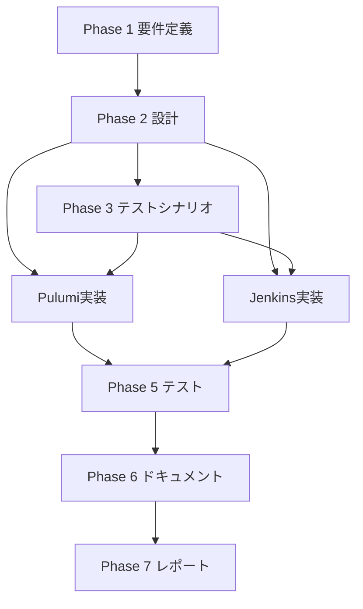

# Codex Agent 実行ログ

開始日時: 2025/10/15 12:07:12

---

## Turn 1: スレッド開始

**Thread ID**: `0199e7c4-6749-7b11-9a46-f69d966b53bd`

## Turn 2: ツール実行

**種別**: コマンド実行
**コマンド**: `bash -lc 'cat .ai-workflow/issue-391/00_planning/output/planning.md'`
**ステータス**: completed (exit_code=0)

```text
# Issue #391 プロジェクト計画書

## 1. Issue分析
- **複雑度**: 複雑（PulumiスタックとJenkinsパイプライン双方を多リージョン化し、IaC・CIの同時変更が必要で影響範囲が広い）
- **見積もり工数**: 27時間（Pulumi設計/実装 10h、パイプライン改修 8h、要件定義・テスト設計/実行・ドキュメント整備 9h の想定）
- **リスク評価**: 中（複数リージョンでの権限・S3命名整合性と既存運用影響に注意が必要だが、既存技術スタック内で制御可能）

## 2. 実装戦略判断
- **実装戦略: EXTEND**
  - 既存のPulumiスタックとJenkinsパイプラインを土台に、リージョンごとにリソースとステージを増やす機能追加が中心で、新規サブシステム導入は不要。
- **テスト戦略: UNIT_INTEGRATION**
  - Pulumiはスタック単位のユニットテストでリージョン配列からのバケット生成とSSMパラメータ書き込みを検証し、Jenkinsはdry-run/jenkinsfile-runnerで多リージョン連続実行フローを統合テストする。
- **テストコード戦略: CREATE_TEST**
  - 現行スタックに自動テストがないため、Pulumi向けの新規テスト（`@pulumi/pulumi` のmocksを利用）とJenkinsfile検証スクリプト（jenkinsfile-runnerベース）の新規作成が必要。

## 3. 影響範囲分析
- **既存コードへの影響**
  - `pulumi/jenkins-ssm-backup-s3/index.ts`: リージョン配列を処理し、各リージョンに`aws.Provider`を切り替えてバケットとSSMパラメータを動的に作成するロジックへの拡張。
  - `pulumi/jenkins-ssm-backup-s3/Pulumi.{dev,prod}.yaml`: スタック設定にバックアップ対象リージョン一覧とデフォルトリージョンを追加。
  - `jenkins/jobs/pipeline/admin/ssm-backup/Jenkinsfile`: ステージをリージョン単位で直列実行させ、各リージョンでPulumiが書き込むパラメータに従いバケットを参照する実装変更。
  - `jenkins/jobs/pipeline/admin/ssm-backup/scripts/collect_parameters.sh`: 多リージョンループ時の環境変数受け渡しとログ粒度向上のための微調整。
  - `jenkins/jobs/dsl/admin/admin_ssm_backup_job.groovy`: 多リージョン化後の説明文・タイムアウト/スロットル設定の見直し（パラメータ構成自体は現状維持）。
  - `docs/runbooks` もしくは `README.md`: リージョン追加手順・ロールバック手順の追記。
- **依存関係の変更**
  - ランタイム依存追加は想定なし。開発時テスト用に `jenkinsfile-runner` Dockerイメージの利用を追加（開発ドキュメントに記載）。
- **マイグレーション要否**
  - Pulumi config値の追加と既存SSMパラメータ`/jenkins/{env}/backup/s3-bucket-name`の互換確保（デフォルトリージョン値を維持しつつ、新規で`/jenkins/{env}/backup/{region}/s3-bucket-name`を発行）。
  - Jenkins実行ログの保存ポリシーとタイムアウトをリージョン数に合わせて更新。

## 4. タスク分割
### Phase 1: 要件定義 (見積もり: 4h)
- 2h: 対応リージョン候補と優先順を運用チームと確認（Done: 合意済みリージョン一覧と増減判断基準が文書化）
- 2h: バックアップ保持/リストア要件と既存CLI利用者の通知チャネル整理（Done: 通知対象とコミュニケーション計画を記載したメモ作成）

### Phase 2: 設計 (見積もり: 5h)
- 2h: Pulumiでのmulti-regionリソース設計（Provider切替・ネーミングルール定義）（Done: 設計メモにリソース命名/タグ/SSMキー方針を記載）
- 2h: Jenkinsパイプラインのリージョン逐次実行/失敗ハンドリング設計（Done: ステージ構成図と並列/直列判断理由がまとめられている）
- 1h: テストアプローチとロールバック手順のレビュー（Done: テストマトリクスとロールバック手順草案が承認）

### Phase 3: テストシナリオ (見積もり: 3h)
- 2h: 新旧リージョン構成でのバックアップ/リストア検証シナリオ作成（Done: テストケース一覧に成功/失敗パスが列挙）
- 1h: ログ検証・アラート確認手順の整備（Done: CloudWatch/S3/Slack確認手順がRunbook草案に反映）

### Phase 4: 実装 (見積もり: 8h)
- 2h: Pulumi configとスタックコードのmulti-region対応実装（Done: Pulumiスタックでリージョン毎のバケット/SSMが作成される）
- 2h: 旧SSMパラメータ互換レイヤーとデフォルトリージョン出力実装（Done: 既存パイプラインで互換確認済み）
- 2h: Jenkinsfileをリージョンループ/ステージ分割に改修し、失敗時の早期停止と通知を追加（Done: Declarative Linter通過とローカルdry-run成功）
- 2h: Groovy DSLと収集スクリプトの微修正（Done: DSL説明更新とスクリプトでリージョン_LOGを出力）

### Phase 5: テスト (見積もり: 3h)
- 1h: Pulumiユニットテスト実装・実行（Done: `npm test`でmulti-region生成テストが通過）
- 1h: Pulumi previewで各リージョンの差分を確認（Done: 主要リージョンで`pulumi preview`結果を保存）
- 1h: Jenkinsfile-runnerを用いたdry-runとus-west-2含むサンプルログ確認（Done: dry-runログとS3アップロードシミュレーション結果を記録）

### Phase 6: ドキュメント (見積もり: 2h)
- 1h: Runbook/READMEにリージョン追加・削除・ロールバック手順を追記（Done: PR内でレビュー済み）
- 1h: Pulumi config変更点と新SSMキー説明をドキュメント化（Done: Config例と設定手順が記載）

### Phase 7: レポート (見積もり: 2h)
- 1h: Issueコメントで実装概要・テスト結果・残課題を整理（Done: Issue #391に報告コメント投稿）
- 1h: 運用チーム向けリリースブリーフィング資料作成と合意取得（Done: 合意メール/コメントが記録されている）

## 5. 依存関係


## 6. リスクと軽減策
#### リスク1: リージョンごとのS3バケット命名衝突
- **影響度**: 高
- **確率**: 中
- **軽減策**: PulumiでアカウントID+リージョン+環境を必ず含める命名テンプレートとし、`pulumi preview`結果をレビュー。

#### リスク2: 既存ジョブが新SSMパラメータ構造に追随できない
- **影響度**: 中
- **確率**: 中
- **軽減策**: 旧キーを互換的に維持し、リリース前に本番ジョブのdry-runとロールバックスクリプトを用意。

#### リスク3: Jenkins multi-region実行でタイムアウトやスロットルが発生
- **影響度**: 中
- **確率**: 中
- **軽減策**: ステージ毎のタイムアウトを調整し、AWS CLIリトライ設定とリージョン順序の見直し、Slackアラートを拡張。

#### リスク4: 運用チームへの情報伝達不足による対応遅延
- **影響度**: 中
- **確率**: 低
- **軽減策**: 通知計画をPhase1で確定し、リリース前にFAQとRunbookを共有して合意取得。

## 7. 品質ゲート
#### Phase 1: 要件定義
- [ ] バックアップ対象リージョン一覧と増減判断基準が承認済み
- [ ] CLI/
... (truncated)
```

## Turn 3: ツール実行

**種別**: コマンド実行
**コマンド**: `bash -lc ls`
**ステータス**: completed (exit_code=0)

```text
ARCHITECTURE.md
CLAUDE.md
CONTRIBUTION.md
LICENSE
README.md
ansible
bootstrap
jenkins
pulumi
run_tests_issue_322.sh
scripts
```

## Turn 4: ツール実行

**種別**: コマンド実行
**コマンド**: `bash -lc 'ls .ai-workflow/issue-391'`
**ステータス**: completed (exit_code=0)

```text
00_planning
01_requirements
metadata.json
```

## Turn 5: ツール実行

**種別**: コマンド実行
**コマンド**: `bash -lc 'ls .ai-workflow/issue-391/01_requirements'`
**ステータス**: completed (exit_code=0)

```text
execute
output
review
revise
```

## Turn 6: ツール実行

**種別**: file_change
**ステータス**: completed

## Turn 7: ツール実行

**種別**: agent_message
**ステータス**: completed

## Turn 8: 実行完了

**ステータス**: completed
**所要時間**: 153793ms
**ターン数**: N/A

---

**経過時間**: 153793ms
**開始**: 2025-10-15T12:07:12.394Z
**終了**: 2025-10-15T12:09:46.187Z