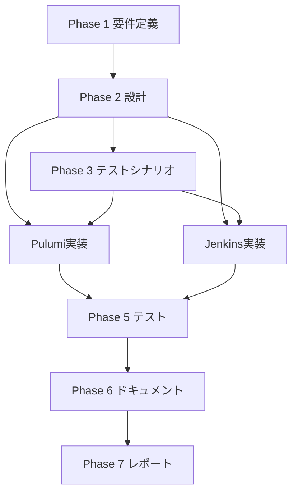

# Codex Agent 実行ログ

開始日時: 2025/10/15 12:15:07

---

## Turn 1: スレッド開始

**Thread ID**: `0199e7cb-a764-7590-bdc7-e2d05b0774a5`

## Turn 2: ツール実行

**種別**: コマンド実行
**コマンド**: `bash -lc ls`
**ステータス**: completed (exit_code=0)

```text
ARCHITECTURE.md
CLAUDE.md
CONTRIBUTION.md
LICENSE
README.md
ansible
bootstrap
jenkins
pulumi
run_tests_issue_322.sh
scripts
```

## Turn 3: ツール実行

**種別**: コマンド実行
**コマンド**: `bash -lc 'cat @.ai-workflow/issue-391/01_requirements/output/requirements.md'`
**ステータス**: failed (exit_code=1)

```text
cat: @.ai-workflow/issue-391/01_requirements/output/requirements.md: No such file or directory
```

## Turn 4: ツール実行

**種別**: コマンド実行
**コマンド**: `bash -lc 'ls @.ai-workflow'`
**ステータス**: failed (exit_code=2)

```text
ls: cannot access '@.ai-workflow': No such file or directory
```

## Turn 5: ツール実行

**種別**: コマンド実行
**コマンド**: `bash -lc 'ls -a'`
**ステータス**: completed (exit_code=0)

```text
.
..
.ai-workflow
.claude
.git
.github
.gitignore
ARCHITECTURE.md
CLAUDE.md
CONTRIBUTION.md
LICENSE
README.md
ansible
bootstrap
jenkins
pulumi
run_tests_issue_322.sh
scripts
```

## Turn 6: ツール実行

**種別**: コマンド実行
**コマンド**: `bash -lc 'ls .ai-workflow'`
**ステータス**: completed (exit_code=0)

```text
issue-304
issue-305
issue-310
issue-313
issue-315
issue-317
issue-319
issue-320
issue-322
issue-324
issue-331
issue-332
issue-355
issue-360
issue-362
issue-363
issue-370
issue-391
```

## Turn 7: ツール実行

**種別**: コマンド実行
**コマンド**: `bash -lc 'ls .ai-workflow/issue-391'`
**ステータス**: completed (exit_code=0)

```text
00_planning
01_requirements
metadata.json
```

## Turn 8: ツール実行

**種別**: コマンド実行
**コマンド**: `bash -lc 'ls .ai-workflow/issue-391/01_requirements/output'`
**ステータス**: completed (exit_code=0)

```text
requirements.md
```

## Turn 9: ツール実行

**種別**: コマンド実行
**コマンド**: `bash -lc 'cat .ai-workflow/issue-391/01_requirements/output/requirements.md'`
**ステータス**: completed (exit_code=0)

```text
# Issue #391 要件定義書：SSMバックアップのマルチリージョン対応

## 0. Planning Documentの確認
- **開発方針**: 実装戦略は既存PulumiスタックとJenkinsパイプラインを拡張する「EXTEND」。大規模な新規コンポーネント追加は不要で、既存資産を多リージョン対応へ拡張する前提。
- **テスト戦略**: Pulumiはmocksを用いたユニットテストと`pulumi preview`での差分確認、Jenkinsはjenkinsfile-runnerによるdry-run統合テストを実施する。テストコードは新規作成が必須。
- **リスクと対策**: S3バケット命名衝突、SSMパラメータ互換性、Jenkins実行時間増加、運用チームへの周知不足が主要リスク。命名規則の明文化、互換レイヤー維持、タイムアウト調整、通知計画策定が軽減策。
- **スケジュール**: 要件定義～レポートまで7フェーズ計27hを想定。Phase 1完了条件としてリージョン一覧と通知方針の承認が求められる。

## 1. 概要
AWS Systems Manager (SSM) パラメータのバックアップ機構を単一リージョン実行から、指定された複数リージョンへ拡張する。PulumiでリージョンごとのS3バケットとSSMパラメータを生成し、Jenkinsパイプラインで各リージョンのバックアップを順次取得する構成へ再設計する。これにより、災害対策や運用柔軟性を向上させ、バックアップの冗長性と信頼性を高めることがビジネス価値であり、IaCとCIの一貫性を保ったまま多リージョン化できる点が技術的価値である。

## 2. 機能要件
| ID | 要件 | 要件詳細 | 優先度 |
| --- | --- | --- | --- |
| FR-1 | Pulumi多リージョンS3管理 | Pulumiスタックが設定されたリージョン配列を受け取り、各リージョン専用のS3バケットと関連SSMパラメータを生成・管理する。命名はアカウントID・環境・リージョンを含むテンプレートに従う。 | 高 |
| FR-2 | SSMパラメータ互換性 | 新規に`/jenkins/{env}/backup/{region}/s3-bucket-name`形式のSSMキーを出力しつつ、既存のデフォルトキー(`/jenkins/{env}/backup/s3-bucket-name`)も最新リージョンを指すよう維持する。 | 高 |
| FR-3 | Jenkins多リージョン実行 | `jenkins/jobs/pipeline/admin/ssm-backup/Jenkinsfile`がリージョン単位のステージに分割され、定義済みリージョンを直列実行し各ステージでバックアップを取得する。ステージ境界で失敗時は後続リージョンを停止する。 | 高 |
| FR-4 | Jenkins DSL互換運用 | `jenkins/jobs/dsl/admin/admin_ssm_backup_job.groovy`のパラメータ構成を変更せず、リージョン選択をUIに追加しない。多リージョン対応の説明・タイムアウト調整はDSLで管理する。 | 中 |
| FR-5 | 利用者通知計画 | CLI利用者およびJenkinsジョブ利用者に対し、リリース前に変更内容・影響・ロールバック手順を通知する計画を作成し、運用チーム合意を得る。 | 中 |

## 3. 非機能要件
- **パフォーマンス**: Jenkinsパイプライン全体の実行時間は許容タイムアウト内（現行基準＋リージョン数×バックアップ時間、上限60分）に収まるよう調整する。ステージ毎に最大10分のタイムアウト設定を行い、AWS CLIリトライを有効化する。
- **セキュリティ**: 生成するS3バケットはサーバーサイド暗号化（SSE-S3またはKMS）を必須とし、Pulumiでブロックパブリックアクセスを有効化する。SSMパラメータは`SecureString`を維持する。
- **可用性・信頼性**: バックアップは少なくとも1日1回のジョブ成功が保証されるよう監視し、失敗時はSlackアラートにより一次連絡が行われる。リージョン追加・削除時のロールバック手順をRunbookに明記する。
- **保守性・拡張性**: 対応リージョンはPulumi configで設定可能とし、コード変更なく増減できる。PulumiユニットテストとJenkins dry-runテストをCIに統合し、将来のリージョン追加時の回帰リスクを低減する。

## 4. 制約事項
- **技術的制約**: インフラ定義はPulumi(TypeScript)、CIはJenkins Declarative PipelineとGroovy DSLを継続利用する。AWSアカウントおよび既存Jenkinsインフラに依存するため他ツールへの移行は対象外。
- **リソース制約**: 推定工数27時間、担当リソースは既存IaC/CIチーム内で賄う。追加予算なし。
- **ポリシー制約**: プロジェクトの命名規約、タグ付与ポリシー、セキュリティ標準（S3暗号化必須、最小権限IAM）に従う。コードレビューとテスト結果提出がリリース条件。

## 5. 前提条件
- Pulumiスタックで使用するAWSクレデンシャルはマルチリージョン操作権限を持ち、対象リージョンは運用チームと合意済み（例：`us-east-1`, `us-west-2`, `ap-northeast-1`）。
- Jenkins実行環境はAWS CLIおよび必要なPulumiバージョンをインストール済みで、追加リージョンへのアクセスが許可されている。
- 既存バックアップジョブのスケジュール、通知先（Slack/Email）、Runbookは現行通り利用可能であり、今回の変更に合わせて改訂できる。

## 6. 受け入れ基準
- **FR-1**  
  - Given Pulumi configに複数リージョンが設定されている  
  - When `pulumi preview`または`pulumi up`を実行する  
  - Then 各リージョンに命名規則に沿ったS3バケットと関連SSMパラメータが作成されることが確認できる。
- **FR-2**  
  - Given `pulumi up`実行後にSSMパラメータストアを確認する  
  - When `/jenkins/{env}/backup/{region}/s3-bucket-name`を取得する  
  - Then 対象リージョンのバケット名が取得でき、既存キー`/jenkins/{env}/backup/s3-bucket-name`も最新デフォルトリージョンの値を返す。
- **FR-3**  
  - Given Jenkinsfileに定義されたリージョンリストが3件ある  
  - When パイプラインを実行する  
  - Then ステージがリージョン順に直列実行され、いずれかのステージが失敗した場合は後続ステージがスキップされ通知が行われる。
- **FR-4**  
  - Given Jenkinsジョブのパラメータ画面を表示する  
  - When 多リージョン対応版のDSLがデプロイされている  
  - Then 既存パラメータ項目は名称・型ともに変更されておらず、新たなリージョン選択項目が追加されていない。
- **FR-5**  
  - Given リリース1週間前の運用準備ミーティング  
  - When 通知計画ドキュメントをレビューする  
  - Then CLI/Jenkins利用者への連絡チャネル・タイミング・ロールバック連絡手順が明記され、運用チームから承認を得た記録が残っている。

## 7. スコープ外
- バックアップ対象データの種類拡張（SSM以外のサービスバックアップ）は対象外。
- Jenkins以外のCI/CDツールへの移行や併用は行わない。
- 完全並列実行やイベントドリブン化など多リージョン以外の高度なオーケストレーションは本フェーズのスコープ外。将来的な改善候補として検討する。
```

## Turn 10: ツール実行

**種別**: コマンド実行
**コマンド**: `bash -lc 'ls .ai-workflow/issue-391/00_planning'`
**ステータス**: completed (exit_code=0)

```text
execute
output
review
revise
```

## Turn 11: ツール実行

**種別**: コマンド実行
**コマンド**: `bash -lc 'ls .ai-workflow/issue-391/00_planning/output'`
**ステータス**: completed (exit_code=0)

```text
planning.md
```

## Turn 12: ツール実行

**種別**: コマンド実行
**コマンド**: `bash -lc 'cat .ai-workflow/issue-391/00_planning/output/planning.md'`
**ステータス**: completed (exit_code=0)

```text
# Issue #391 プロジェクト計画書

## 1. Issue分析
- **複雑度**: 複雑（PulumiスタックとJenkinsパイプライン双方を多リージョン化し、IaC・CIの同時変更が必要で影響範囲が広い）
- **見積もり工数**: 27時間（Pulumi設計/実装 10h、パイプライン改修 8h、要件定義・テスト設計/実行・ドキュメント整備 9h の想定）
- **リスク評価**: 中（複数リージョンでの権限・S3命名整合性と既存運用影響に注意が必要だが、既存技術スタック内で制御可能）

## 2. 実装戦略判断
- **実装戦略: EXTEND**
  - 既存のPulumiスタックとJenkinsパイプラインを土台に、リージョンごとにリソースとステージを増やす機能追加が中心で、新規サブシステム導入は不要。
- **テスト戦略: UNIT_INTEGRATION**
  - Pulumiはスタック単位のユニットテストでリージョン配列からのバケット生成とSSMパラメータ書き込みを検証し、Jenkinsはdry-run/jenkinsfile-runnerで多リージョン連続実行フローを統合テストする。
- **テストコード戦略: CREATE_TEST**
  - 現行スタックに自動テストがないため、Pulumi向けの新規テスト（`@pulumi/pulumi` のmocksを利用）とJenkinsfile検証スクリプト（jenkinsfile-runnerベース）の新規作成が必要。

## 3. 影響範囲分析
- **既存コードへの影響**
  - `pulumi/jenkins-ssm-backup-s3/index.ts`: リージョン配列を処理し、各リージョンに`aws.Provider`を切り替えてバケットとSSMパラメータを動的に作成するロジックへの拡張。
  - `pulumi/jenkins-ssm-backup-s3/Pulumi.{dev,prod}.yaml`: スタック設定にバックアップ対象リージョン一覧とデフォルトリージョンを追加。
  - `jenkins/jobs/pipeline/admin/ssm-backup/Jenkinsfile`: ステージをリージョン単位で直列実行させ、各リージョンでPulumiが書き込むパラメータに従いバケットを参照する実装変更。
  - `jenkins/jobs/pipeline/admin/ssm-backup/scripts/collect_parameters.sh`: 多リージョンループ時の環境変数受け渡しとログ粒度向上のための微調整。
  - `jenkins/jobs/dsl/admin/admin_ssm_backup_job.groovy`: 多リージョン化後の説明文・タイムアウト/スロットル設定の見直し（パラメータ構成自体は現状維持）。
  - `docs/runbooks` もしくは `README.md`: リージョン追加手順・ロールバック手順の追記。
- **依存関係の変更**
  - ランタイム依存追加は想定なし。開発時テスト用に `jenkinsfile-runner` Dockerイメージの利用を追加（開発ドキュメントに記載）。
- **マイグレーション要否**
  - Pulumi config値の追加と既存SSMパラメータ`/jenkins/{env}/backup/s3-bucket-name`の互換確保（デフォルトリージョン値を維持しつつ、新規で`/jenkins/{env}/backup/{region}/s3-bucket-name`を発行）。
  - Jenkins実行ログの保存ポリシーとタイムアウトをリージョン数に合わせて更新。

## 4. タスク分割
### Phase 1: 要件定義 (見積もり: 4h)
- 2h: 対応リージョン候補と優先順を運用チームと確認（Done: 合意済みリージョン一覧と増減判断基準が文書化）
- 2h: バックアップ保持/リストア要件と既存CLI利用者の通知チャネル整理（Done: 通知対象とコミュニケーション計画を記載したメモ作成）

### Phase 2: 設計 (見積もり: 5h)
- 2h: Pulumiでのmulti-regionリソース設計（Provider切替・ネーミングルール定義）（Done: 設計メモにリソース命名/タグ/SSMキー方針を記載）
- 2h: Jenkinsパイプラインのリージョン逐次実行/失敗ハンドリング設計（Done: ステージ構成図と並列/直列判断理由がまとめられている）
- 1h: テストアプローチとロールバック手順のレビュー（Done: テストマトリクスとロールバック手順草案が承認）

### Phase 3: テストシナリオ (見積もり: 3h)
- 2h: 新旧リージョン構成でのバックアップ/リストア検証シナリオ作成（Done: テストケース一覧に成功/失敗パスが列挙）
- 1h: ログ検証・アラート確認手順の整備（Done: CloudWatch/S3/Slack確認手順がRunbook草案に反映）

### Phase 4: 実装 (見積もり: 8h)
- 2h: Pulumi configとスタックコードのmulti-region対応実装（Done: Pulumiスタックでリージョン毎のバケット/SSMが作成される）
- 2h: 旧SSMパラメータ互換レイヤーとデフォルトリージョン出力実装（Done: 既存パイプラインで互換確認済み）
- 2h: Jenkinsfileをリージョンループ/ステージ分割に改修し、失敗時の早期停止と通知を追加（Done: Declarative Linter通過とローカルdry-run成功）
- 2h: Groovy DSLと収集スクリプトの微修正（Done: DSL説明更新とスクリプトでリージョン_LOGを出力）

### Phase 5: テスト (見積もり: 3h)
- 1h: Pulumiユニットテスト実装・実行（Done: `npm test`でmulti-region生成テストが通過）
- 1h: Pulumi previewで各リージョンの差分を確認（Done: 主要リージョンで`pulumi preview`結果を保存）
- 1h: Jenkinsfile-runnerを用いたdry-runとus-west-2含むサンプルログ確認（Done: dry-runログとS3アップロードシミュレーション結果を記録）

### Phase 6: ドキュメント (見積もり: 2h)
- 1h: Runbook/READMEにリージョン追加・削除・ロールバック手順を追記（Done: PR内でレビュー済み）
- 1h: Pulumi config変更点と新SSMキー説明をドキュメント化（Done: Config例と設定手順が記載）

### Phase 7: レポート (見積もり: 2h)
- 1h: Issueコメントで実装概要・テスト結果・残課題を整理（Done: Issue #391に報告コメント投稿）
- 1h: 運用チーム向けリリースブリーフィング資料作成と合意取得（Done: 合意メール/コメントが記録されている）

## 5. 依存関係


## 6. リスクと軽減策
#### リスク1: リージョンごとのS3バケット命名衝突
- **影響度**: 高
- **確率**: 中
- **軽減策**: PulumiでアカウントID+リージョン+環境を必ず含める命名テンプレートとし、`pulumi preview`結果をレビュー。

#### リスク2: 既存ジョブが新SSMパラメータ構造に追随できない
- **影響度**: 中
- **確率**: 中
- **軽減策**: 旧キーを互換的に維持し、リリース前に本番ジョブのdry-runとロールバックスクリプトを用意。

#### リスク3: Jenkins multi-region実行でタイムアウトやスロットルが発生
- **影響度**: 中
- **確率**: 中
- **軽減策**: ステージ毎のタイムアウトを調整し、AWS CLIリトライ設定とリージョン順序の見直し、Slackアラートを拡張。

#### リスク4: 運用チームへの情報伝達不足による対応遅延
- **影響度**: 中
- **確率**: 低
- **軽減策**: 通知計画をPhase1で確定し、リリース前にFAQとRunbookを共有して合意取得。

## 7. 品質ゲート
#### Phase 1: 要件定義
- [ ] バックアップ対象リージョン一覧と増減判断基準が承認済み
- [ ] CLI/
... (truncated)
```

## Turn 13: ツール実行

**種別**: コマンド実行
**コマンド**: `bash -lc "rg --files -g'issue.md' .ai-workflow/issue-391"`
**ステータス**: failed (exit_code=127)

```text
bash: line 1: rg: command not found
```

## Turn 14: ツール実行

**種別**: コマンド実行
**コマンド**: `bash -lc "find .ai-workflow/issue-391 -maxdepth 2 -type f -name '*.md'"`
**ステータス**: completed (exit_code=0)

## Turn 15: ツール実行

**種別**: コマンド実行
**コマンド**: `bash -lc 'nl -ba .ai-workflow/issue-391/01_requirements/output/requirements.md'`
**ステータス**: completed (exit_code=0)

```text
1	# Issue #391 要件定義書：SSMバックアップのマルチリージョン対応
     2	
     3	## 0. Planning Documentの確認
     4	- **開発方針**: 実装戦略は既存PulumiスタックとJenkinsパイプラインを拡張する「EXTEND」。大規模な新規コンポーネント追加は不要で、既存資産を多リージョン対応へ拡張する前提。
     5	- **テスト戦略**: Pulumiはmocksを用いたユニットテストと`pulumi preview`での差分確認、Jenkinsはjenkinsfile-runnerによるdry-run統合テストを実施する。テストコードは新規作成が必須。
     6	- **リスクと対策**: S3バケット命名衝突、SSMパラメータ互換性、Jenkins実行時間増加、運用チームへの周知不足が主要リスク。命名規則の明文化、互換レイヤー維持、タイムアウト調整、通知計画策定が軽減策。
     7	- **スケジュール**: 要件定義～レポートまで7フェーズ計27hを想定。Phase 1完了条件としてリージョン一覧と通知方針の承認が求められる。
     8	
     9	## 1. 概要
    10	AWS Systems Manager (SSM) パラメータのバックアップ機構を単一リージョン実行から、指定された複数リージョンへ拡張する。PulumiでリージョンごとのS3バケットとSSMパラメータを生成し、Jenkinsパイプラインで各リージョンのバックアップを順次取得する構成へ再設計する。これにより、災害対策や運用柔軟性を向上させ、バックアップの冗長性と信頼性を高めることがビジネス価値であり、IaCとCIの一貫性を保ったまま多リージョン化できる点が技術的価値である。
    11	
    12	## 2. 機能要件
    13	| ID | 要件 | 要件詳細 | 優先度 |
    14	| --- | --- | --- | --- |
    15	| FR-1 | Pulumi多リージョンS3管理 | Pulumiスタックが設定されたリージョン配列を受け取り、各リージョン専用のS3バケットと関連SSMパラメータを生成・管理する。命名はアカウントID・環境・リージョンを含むテンプレートに従う。 | 高 |
    16	| FR-2 | SSMパラメータ互換性 | 新規に`/jenkins/{env}/backup/{region}/s3-bucket-name`形式のSSMキーを出力しつつ、既存のデフォルトキー(`/jenkins/{env}/backup/s3-bucket-name`)も最新リージョンを指すよう維持する。 | 高 |
    17	| FR-3 | Jenkins多リージョン実行 | `jenkins/jobs/pipeline/admin/ssm-backup/Jenkinsfile`がリージョン単位のステージに分割され、定義済みリージョンを直列実行し各ステージでバックアップを取得する。ステージ境界で失敗時は後続リージョンを停止する。 | 高 |
    18	| FR-4 | Jenkins DSL互換運用 | `jenkins/jobs/dsl/admin/admin_ssm_backup_job.groovy`のパラメータ構成を変更せず、リージョン選択をUIに追加しない。多リージョン対応の説明・タイムアウト調整はDSLで管理する。 | 中 |
    19	| FR-5 | 利用者通知計画 | CLI利用者およびJenkinsジョブ利用者に対し、リリース前に変更内容・影響・ロールバック手順を通知する計画を作成し、運用チーム合意を得る。 | 中 |
    20	
    21	## 3. 非機能要件
    22	- **パフォーマンス**: Jenkinsパイプライン全体の実行時間は許容タイムアウト内（現行基準＋リージョン数×バックアップ時間、上限60分）に収まるよう調整する。ステージ毎に最大10分のタイムアウト設定を行い、AWS CLIリトライを有効化する。
    23	- **セキュリティ**: 生成するS3バケットはサーバーサイド暗号化（SSE-S3またはKMS）を必須とし、Pulumiでブロックパブリックアクセスを有効化する。SSMパラメータは`SecureString`を維持する。
    24	- **可用性・信頼性**: バックアップは少なくとも1日1回のジョブ成功が保証されるよう監視し、失敗時はSlackアラートにより一次連絡が行われる。リージョン追加・削除時のロールバック手順をRunbookに明記する。
    25	- **保守性・拡張性**: 対応リージョンはPulumi configで設定可能とし、コード変更なく増減できる。PulumiユニットテストとJenkins dry-runテストをCIに統合し、将来のリージョン追加時の回帰リスクを低減する。
    26	
    27	## 4. 制約事項
    28	- **技術的制約**: インフラ定義はPulumi(TypeScript)、CIはJenkins Declarative PipelineとGroovy DSLを継続利用する。AWSアカウントおよび既存Jenkinsインフラに依存するため他ツールへの移行は対象外。
    29	- **リソース制約**: 推定工数27時間、担当リソースは既存IaC/CIチーム内で賄う。追加予算なし。
    30	- **ポリシー制約**: プロジェクトの命名規約、タグ付与ポリシー、セキュリティ標準（S3暗号化必須、最小権限IAM）に従う。コードレビューとテスト結果提出がリリース条件。
    31	
    32	## 5. 前提条件
    33	- Pulumiスタックで使用するAWSクレデンシャルはマルチリージョン操作権限を持ち、対象リージョンは運用チームと合意済み（例：`us-east-1`, `us-west-2`, `ap-northeast-1`）。
    34	- Jenkins実行環境はAWS CLIおよび必要なPulumiバージョンをインストール済みで、追加リージョンへのアクセスが許可されている。
    35	- 既存バックアップジョブのスケジュール、通知先（Slack/Email）、Runbookは現行通り利用可能であり、今回の変更に合わせて改訂できる。
    36	
    37	## 6. 受け入れ基準
    38	- **FR-1**  
    39	  - Given Pulumi configに複数リージョンが設定されている  
    40	  - When `pulumi preview`または`pulumi up`を実行する  
    41	  - Then 各リージョンに命名規則に沿ったS3バケットと関連SSMパラメータが作成されることが確認できる。
    42	- **FR-2**  
    43	  - Given `pulumi up`実行後にSSMパラメータストアを確認する  
    44	  - When `/jenkins/{env}/backup/{region}/s3-bucket-name`を取得する  
    45	  - Then 対象リージョンのバケット名が取得でき、既存キー`/jenkins/{env}/backup/s3-bucket-name`も最新デフォルトリージョンの値を返す。
    46	- **FR-3**  
    47	  - Given Jenkinsfileに定義されたリージョンリストが3件ある  
    48	  - When パイプラインを実行する  
    49	  - Then ステージがリージョン順に直列実行され、いずれかのステージが失敗した場合は後続ステージがスキップされ通知が行われる。
    50	- **FR-4**  
    51	  - Given Jenkinsジョブのパラメータ画面を表示する  
    52	  - When 多リージョン対応版のDSLがデプロイされている  
    53	  - Then 既存パラメータ項目は名称・型ともに変更されておらず、新たなリージョン選択項目が追加されていない。
    54	- **FR-5**  
    55	  - Given リリース1週間前の運用準備ミーティング  
    56	  - When 通知計画ドキュメントをレビューする  
    57	  - Then CLI/Jenkins利用者への連絡チャネル・タイミング・ロールバック連絡手順が明記され、運用チームから承認を得た記録が残っている。
    58	
    59	## 7. スコープ外
    60	- バックアップ対象データの種類拡張（SSM以外のサービスバックアップ）は対象外。
    61	- Jenkins以外のCI/CDツールへの移行や併用は行わない。
    62	- 完全並列実行やイベントドリブン化など多リージョン以外の高度なオーケストレーションは本フェーズのスコープ外。将来的な改善候補として検討する。
```

## Turn 16: ツール実行

**種別**: agent_message
**ステータス**: completed

## Turn 17: 実行完了

**ステータス**: completed
**所要時間**: 211371ms
**ターン数**: N/A

---

**経過時間**: 211371ms
**開始**: 2025-10-15T12:15:07.556Z
**終了**: 2025-10-15T12:18:38.927Z