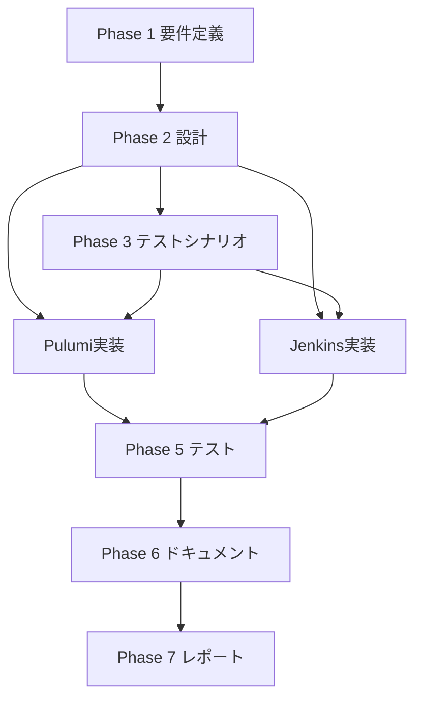

# Codex Agent 実行ログ

開始日時: 2025/10/15 12:18:43

---

## Turn 1: スレッド開始

**Thread ID**: `0199e7ce-f372-7ad0-99e7-53d7fa841ed0`

## Turn 2: ツール実行

**種別**: コマンド実行
**コマンド**: `bash -lc ls`
**ステータス**: completed (exit_code=0)

```text
ARCHITECTURE.md
CLAUDE.md
CONTRIBUTION.md
LICENSE
README.md
ansible
bootstrap
jenkins
pulumi
run_tests_issue_322.sh
scripts
```

## Turn 3: ツール実行

**種別**: コマンド実行
**コマンド**: `bash -lc 'cat .ai-workflow/issue-391/00_planning/output/planning.md'`
**ステータス**: completed (exit_code=0)

```text
# Issue #391 プロジェクト計画書

## 1. Issue分析
- **複雑度**: 複雑（PulumiスタックとJenkinsパイプライン双方を多リージョン化し、IaC・CIの同時変更が必要で影響範囲が広い）
- **見積もり工数**: 27時間（Pulumi設計/実装 10h、パイプライン改修 8h、要件定義・テスト設計/実行・ドキュメント整備 9h の想定）
- **リスク評価**: 中（複数リージョンでの権限・S3命名整合性と既存運用影響に注意が必要だが、既存技術スタック内で制御可能）

## 2. 実装戦略判断
- **実装戦略: EXTEND**
  - 既存のPulumiスタックとJenkinsパイプラインを土台に、リージョンごとにリソースとステージを増やす機能追加が中心で、新規サブシステム導入は不要。
- **テスト戦略: UNIT_INTEGRATION**
  - Pulumiはスタック単位のユニットテストでリージョン配列からのバケット生成とSSMパラメータ書き込みを検証し、Jenkinsはdry-run/jenkinsfile-runnerで多リージョン連続実行フローを統合テストする。
- **テストコード戦略: CREATE_TEST**
  - 現行スタックに自動テストがないため、Pulumi向けの新規テスト（`@pulumi/pulumi` のmocksを利用）とJenkinsfile検証スクリプト（jenkinsfile-runnerベース）の新規作成が必要。

## 3. 影響範囲分析
- **既存コードへの影響**
  - `pulumi/jenkins-ssm-backup-s3/index.ts`: リージョン配列を処理し、各リージョンに`aws.Provider`を切り替えてバケットとSSMパラメータを動的に作成するロジックへの拡張。
  - `pulumi/jenkins-ssm-backup-s3/Pulumi.{dev,prod}.yaml`: スタック設定にバックアップ対象リージョン一覧とデフォルトリージョンを追加。
  - `jenkins/jobs/pipeline/admin/ssm-backup/Jenkinsfile`: ステージをリージョン単位で直列実行させ、各リージョンでPulumiが書き込むパラメータに従いバケットを参照する実装変更。
  - `jenkins/jobs/pipeline/admin/ssm-backup/scripts/collect_parameters.sh`: 多リージョンループ時の環境変数受け渡しとログ粒度向上のための微調整。
  - `jenkins/jobs/dsl/admin/admin_ssm_backup_job.groovy`: 多リージョン化後の説明文・タイムアウト/スロットル設定の見直し（パラメータ構成自体は現状維持）。
  - `docs/runbooks` もしくは `README.md`: リージョン追加手順・ロールバック手順の追記。
- **依存関係の変更**
  - ランタイム依存追加は想定なし。開発時テスト用に `jenkinsfile-runner` Dockerイメージの利用を追加（開発ドキュメントに記載）。
- **マイグレーション要否**
  - Pulumi config値の追加と既存SSMパラメータ`/jenkins/{env}/backup/s3-bucket-name`の互換確保（デフォルトリージョン値を維持しつつ、新規で`/jenkins/{env}/backup/{region}/s3-bucket-name`を発行）。
  - Jenkins実行ログの保存ポリシーとタイムアウトをリージョン数に合わせて更新。

## 4. タスク分割
### Phase 1: 要件定義 (見積もり: 4h)
- 2h: 対応リージョン候補と優先順を運用チームと確認（Done: 合意済みリージョン一覧と増減判断基準が文書化）
- 2h: バックアップ保持/リストア要件と既存CLI利用者の通知チャネル整理（Done: 通知対象とコミュニケーション計画を記載したメモ作成）

### Phase 2: 設計 (見積もり: 5h)
- 2h: Pulumiでのmulti-regionリソース設計（Provider切替・ネーミングルール定義）（Done: 設計メモにリソース命名/タグ/SSMキー方針を記載）
- 2h: Jenkinsパイプラインのリージョン逐次実行/失敗ハンドリング設計（Done: ステージ構成図と並列/直列判断理由がまとめられている）
- 1h: テストアプローチとロールバック手順のレビュー（Done: テストマトリクスとロールバック手順草案が承認）

### Phase 3: テストシナリオ (見積もり: 3h)
- 2h: 新旧リージョン構成でのバックアップ/リストア検証シナリオ作成（Done: テストケース一覧に成功/失敗パスが列挙）
- 1h: ログ検証・アラート確認手順の整備（Done: CloudWatch/S3/Slack確認手順がRunbook草案に反映）

### Phase 4: 実装 (見積もり: 8h)
- 2h: Pulumi configとスタックコードのmulti-region対応実装（Done: Pulumiスタックでリージョン毎のバケット/SSMが作成される）
- 2h: 旧SSMパラメータ互換レイヤーとデフォルトリージョン出力実装（Done: 既存パイプラインで互換確認済み）
- 2h: Jenkinsfileをリージョンループ/ステージ分割に改修し、失敗時の早期停止と通知を追加（Done: Declarative Linter通過とローカルdry-run成功）
- 2h: Groovy DSLと収集スクリプトの微修正（Done: DSL説明更新とスクリプトでリージョン_LOGを出力）

### Phase 5: テスト (見積もり: 3h)
- 1h: Pulumiユニットテスト実装・実行（Done: `npm test`でmulti-region生成テストが通過）
- 1h: Pulumi previewで各リージョンの差分を確認（Done: 主要リージョンで`pulumi preview`結果を保存）
- 1h: Jenkinsfile-runnerを用いたdry-runとus-west-2含むサンプルログ確認（Done: dry-runログとS3アップロードシミュレーション結果を記録）

### Phase 6: ドキュメント (見積もり: 2h)
- 1h: Runbook/READMEにリージョン追加・削除・ロールバック手順を追記（Done: PR内でレビュー済み）
- 1h: Pulumi config変更点と新SSMキー説明をドキュメント化（Done: Config例と設定手順が記載）

### Phase 7: レポート (見積もり: 2h)
- 1h: Issueコメントで実装概要・テスト結果・残課題を整理（Done: Issue #391に報告コメント投稿）
- 1h: 運用チーム向けリリースブリーフィング資料作成と合意取得（Done: 合意メール/コメントが記録されている）

## 5. 依存関係


## 6. リスクと軽減策
#### リスク1: リージョンごとのS3バケット命名衝突
- **影響度**: 高
- **確率**: 中
- **軽減策**: PulumiでアカウントID+リージョン+環境を必ず含める命名テンプレートとし、`pulumi preview`結果をレビュー。

#### リスク2: 既存ジョブが新SSMパラメータ構造に追随できない
- **影響度**: 中
- **確率**: 中
- **軽減策**: 旧キーを互換的に維持し、リリース前に本番ジョブのdry-runとロールバックスクリプトを用意。

#### リスク3: Jenkins multi-region実行でタイムアウトやスロットルが発生
- **影響度**: 中
- **確率**: 中
- **軽減策**: ステージ毎のタイムアウトを調整し、AWS CLIリトライ設定とリージョン順序の見直し、Slackアラートを拡張。

#### リスク4: 運用チームへの情報伝達不足による対応遅延
- **影響度**: 中
- **確率**: 低
- **軽減策**: 通知計画をPhase1で確定し、リリース前にFAQとRunbookを共有して合意取得。

## 7. 品質ゲート
#### Phase 1: 要件定義
- [ ] バックアップ対象リージョン一覧と増減判断基準が承認済み
- [ ] CLI/
... (truncated)
```

## Turn 4: ツール実行

**種別**: コマンド実行
**コマンド**: `bash -lc 'cat .ai-workflow/issue-391/01_requirements/output/requirements.md'`
**ステータス**: completed (exit_code=0)

```text
# Issue #391 要件定義書：SSMバックアップのマルチリージョン対応

## 0. Planning Documentの確認
- **開発方針**: 実装戦略は既存PulumiスタックとJenkinsパイプラインを拡張する「EXTEND」。大規模な新規コンポーネント追加は不要で、既存資産を多リージョン対応へ拡張する前提。
- **テスト戦略**: Pulumiはmocksを用いたユニットテストと`pulumi preview`での差分確認、Jenkinsはjenkinsfile-runnerによるdry-run統合テストを実施する。テストコードは新規作成が必須。
- **リスクと対策**: S3バケット命名衝突、SSMパラメータ互換性、Jenkins実行時間増加、運用チームへの周知不足が主要リスク。命名規則の明文化、互換レイヤー維持、タイムアウト調整、通知計画策定が軽減策。
- **スケジュール**: 要件定義～レポートまで7フェーズ計27hを想定。Phase 1完了条件としてリージョン一覧と通知方針の承認が求められる。

## 1. 概要
AWS Systems Manager (SSM) パラメータのバックアップ機構を単一リージョン実行から、指定された複数リージョンへ拡張する。PulumiでリージョンごとのS3バケットとSSMパラメータを生成し、Jenkinsパイプラインで各リージョンのバックアップを順次取得する構成へ再設計する。これにより、災害対策や運用柔軟性を向上させ、バックアップの冗長性と信頼性を高めることがビジネス価値であり、IaCとCIの一貫性を保ったまま多リージョン化できる点が技術的価値である。

## 2. 機能要件
| ID | 要件 | 要件詳細 | 優先度 |
| --- | --- | --- | --- |
| FR-1 | Pulumi多リージョンS3管理 | Pulumiスタックが設定されたリージョン配列を受け取り、各リージョン専用のS3バケットと関連SSMパラメータを生成・管理する。命名はアカウントID・環境・リージョンを含むテンプレートに従う。 | 高 |
| FR-2 | SSMパラメータ互換性 | 新規に`/jenkins/{env}/backup/{region}/s3-bucket-name`形式のSSMキーを出力しつつ、既存のデフォルトキー(`/jenkins/{env}/backup/s3-bucket-name`)も最新リージョンを指すよう維持する。 | 高 |
| FR-3 | Jenkins多リージョン実行 | `jenkins/jobs/pipeline/admin/ssm-backup/Jenkinsfile`がリージョン単位のステージに分割され、定義済みリージョンを直列実行し各ステージでバックアップを取得する。ステージ境界で失敗時は後続リージョンを停止する。 | 高 |
| FR-4 | Jenkins DSL互換運用 | `jenkins/jobs/dsl/admin/admin_ssm_backup_job.groovy`のパラメータ構成を変更せず、リージョン選択をUIに追加しない。多リージョン対応の説明・タイムアウト調整はDSLで管理する。 | 中 |
| FR-5 | 利用者通知計画 | CLI利用者およびJenkinsジョブ利用者に対し、リリース前に変更内容・影響・ロールバック手順を通知する計画を作成し、運用チーム合意を得る。 | 中 |

## 3. 非機能要件
- **パフォーマンス**: Jenkinsパイプライン全体の実行時間は許容タイムアウト内（現行基準＋リージョン数×バックアップ時間、上限60分）に収まるよう調整する。ステージ毎に最大10分のタイムアウト設定を行い、AWS CLIリトライを有効化する。
- **セキュリティ**: 生成するS3バケットはサーバーサイド暗号化（SSE-S3またはKMS）を必須とし、Pulumiでブロックパブリックアクセスを有効化する。SSMパラメータは`SecureString`を維持する。
- **可用性・信頼性**: バックアップは少なくとも1日1回のジョブ成功が保証されるよう監視し、失敗時はSlackアラートにより一次連絡が行われる。リージョン追加・削除時のロールバック手順をRunbookに明記する。
- **保守性・拡張性**: 対応リージョンはPulumi configで設定可能とし、コード変更なく増減できる。PulumiユニットテストとJenkins dry-runテストをCIに統合し、将来のリージョン追加時の回帰リスクを低減する。

## 4. 制約事項
- **技術的制約**: インフラ定義はPulumi(TypeScript)、CIはJenkins Declarative PipelineとGroovy DSLを継続利用する。AWSアカウントおよび既存Jenkinsインフラに依存するため他ツールへの移行は対象外。
- **リソース制約**: 推定工数27時間、担当リソースは既存IaC/CIチーム内で賄う。追加予算なし。
- **ポリシー制約**: プロジェクトの命名規約、タグ付与ポリシー、セキュリティ標準（S3暗号化必須、最小権限IAM）に従う。コードレビューとテスト結果提出がリリース条件。

## 5. 前提条件
- Pulumiスタックで使用するAWSクレデンシャルはマルチリージョン操作権限を持ち、対象リージョンは運用チームと合意済み（例：`us-east-1`, `us-west-2`, `ap-northeast-1`）。
- Jenkins実行環境はAWS CLIおよび必要なPulumiバージョンをインストール済みで、追加リージョンへのアクセスが許可されている。
- 既存バックアップジョブのスケジュール、通知先（Slack/Email）、Runbookは現行通り利用可能であり、今回の変更に合わせて改訂できる。

## 6. 受け入れ基準
- **FR-1**  
  - Given Pulumi configに複数リージョンが設定されている  
  - When `pulumi preview`または`pulumi up`を実行する  
  - Then 各リージョンに命名規則に沿ったS3バケットと関連SSMパラメータが作成されることが確認できる。
- **FR-2**  
  - Given `pulumi up`実行後にSSMパラメータストアを確認する  
  - When `/jenkins/{env}/backup/{region}/s3-bucket-name`を取得する  
  - Then 対象リージョンのバケット名が取得でき、既存キー`/jenkins/{env}/backup/s3-bucket-name`も最新デフォルトリージョンの値を返す。
- **FR-3**  
  - Given Jenkinsfileに定義されたリージョンリストが3件ある  
  - When パイプラインを実行する  
  - Then ステージがリージョン順に直列実行され、いずれかのステージが失敗した場合は後続ステージがスキップされ通知が行われる。
- **FR-4**  
  - Given Jenkinsジョブのパラメータ画面を表示する  
  - When 多リージョン対応版のDSLがデプロイされている  
  - Then 既存パラメータ項目は名称・型ともに変更されておらず、新たなリージョン選択項目が追加されていない。
- **FR-5**  
  - Given リリース1週間前の運用準備ミーティング  
  - When 通知計画ドキュメントをレビューする  
  - Then CLI/Jenkins利用者への連絡チャネル・タイミング・ロールバック連絡手順が明記され、運用チームから承認を得た記録が残っている。

## 7. スコープ外
- バックアップ対象データの種類拡張（SSM以外のサービスバックアップ）は対象外。
- Jenkins以外のCI/CDツールへの移行や併用は行わない。
- 完全並列実行やイベントドリブン化など多リージョン以外の高度なオーケストレーションは本フェーズのスコープ外。将来的な改善候補として検討する。
```

## Turn 5: ツール実行

**種別**: コマンド実行
**コマンド**: `bash -lc "sed -n '1,200p' pulumi/jenkins-ssm-backup-s3/index.ts"`
**ステータス**: completed (exit_code=0)

```text
import * as pulumi from "@pulumi/pulumi";
import * as aws from "@pulumi/aws";

// 設定値の取得
const config = new pulumi.Config();
const projectName = config.require("projectName");
const environment = config.require("environment");

// AWSアカウント情報とリージョンを取得
const accountId = aws.getCallerIdentity().then(identity => identity.accountId);
const region = aws.config.region || "ap-northeast-1";

// S3バケット名の生成（アカウント番号とリージョンを含めて一意性を確保）
const bucketName = pulumi.interpolate`${projectName}-ssm-backup-${environment}-${accountId}-${region}`;

// SSMパラメータバックアップ用S3バケット
const backupBucket = new aws.s3.Bucket("ssm-backup-bucket", {
    bucket: bucketName,
    versioning: {
        enabled: true,
    },
    serverSideEncryptionConfiguration: {
        rule: {
            applyServerSideEncryptionByDefault: {
                sseAlgorithm: "AES256",
            },
            bucketKeyEnabled: true,  // S3 Bucket Keysを有効化（暗号化コストを削減）
        },
    },
    lifecycleRules: [{
        id: "delete-old-backups",
        enabled: true,
        expiration: {
            days: 30,  // 30日間保持
        },
        noncurrentVersionExpiration: {
            days: 7,  // 非現行バージョンは7日間保持
        },
    }],
    objectLockEnabled: false,  // 必要に応じてObject Lockを有効化可能
    tags: {
        Name: bucketName,
        Environment: environment,
        Purpose: "SSM Parameter Store Backup Storage",
        ManagedBy: "Pulumi",
        DataClassification: "Confidential",  // データ分類を明示
    },
});

// バケットのパブリックアクセスブロック設定
const bucketPublicAccessBlock = new aws.s3.BucketPublicAccessBlock("ssm-backup-bucket-pab", {
    bucket: backupBucket.id,
    blockPublicAcls: true,
    blockPublicPolicy: true,
    ignorePublicAcls: true,
    restrictPublicBuckets: true,
});

// バケットポリシー：HTTPS通信の強制とIP制限（オプション）
const bucketPolicy = new aws.s3.BucketPolicy("ssm-backup-bucket-policy", {
    bucket: backupBucket.id,
    policy: pulumi.all([backupBucket.arn]).apply(([bucketArn]) => JSON.stringify({
        Version: "2012-10-17",
        Statement: [
            {
                Sid: "DenyInsecureConnections",
                Effect: "Deny",
                Principal: "*",
                Action: "s3:*",
                Resource: [
                    bucketArn,
                    `${bucketArn}/*`,
                ],
                Condition: {
                    Bool: {
                        "aws:SecureTransport": "false"
                    }
                }
            },
            {
                Sid: "DenyUnencryptedObjectUploads",
                Effect: "Deny",
                Principal: "*",
                Action: "s3:PutObject",
                Resource: `${bucketArn}/*`,
                Condition: {
                    StringNotEquals: {
                        "s3:x-amz-server-side-encryption": "AES256"
                    }
                }
            }
        ]
    })),
});

// SSMパラメータストアにバケット名を保存
const ssmBackupBucketName = new aws.ssm.Parameter("ssm-backup-bucket-name", {
    name: `/jenkins/${environment}/backup/s3-bucket-name`,
    type: "String",
    value: backupBucket.bucket,
    description: "SSM Parameter Store backup S3 bucket name",
    tags: {
        Environment: environment,
        ManagedBy: "Pulumi",
    },
});

// エクスポート
export const bucketNameOutput = backupBucket.bucket;
export const bucketArn = backupBucket.arn;
export const ssmBackupBucketParameter = ssmBackupBucketName.name;
```

## Turn 6: ツール実行

**種別**: コマンド実行
**コマンド**: `bash -lc "sed -n '1,200p' jenkins/jobs/pipeline/admin/ssm-backup/Jenkinsfile"`
**ステータス**: completed (exit_code=0)

```text
@Library('jenkins-shared-lib') _

/**
 * SSM Parameter Store Backup Pipeline
 * AWS Systems Manager Parameter Storeのパラメータを定期的にバックアップ
 */
pipeline {
    agent {
        label 'ec2-fleet'
    }
    
    options {
        timestamps()
        timeout(time: 1, unit: 'HOURS')
        buildDiscarder(logRotator(daysToKeepStr: '30', numToKeepStr: '100'))
        disableConcurrentBuilds()
    }
    
    environment {
        // AWS設定
        AWS_REGION = 'ap-northeast-1'
        
        // タイムスタンプ
        BACKUP_DATE = sh(script: "date '+%Y-%m-%d'", returnStdout: true).trim()
        BACKUP_TIMESTAMP = sh(script: "date '+%Y%m%d_%H%M%S'", returnStdout: true).trim()
        
        // ディレクトリ構造
        WORK_DIR = "${WORKSPACE}/backup-work"
        DATA_DIR = "${WORK_DIR}/data"
        SCRIPT_DIR = "${WORKSPACE}/scripts"
        
        // 環境フィルタ（環境に含まれる文字列）
        ENV_FILTER = "/${params.ENVIRONMENT}/"
    }
    
    stages {
        stage('Initialize') {
            steps {
                script {
                    // ビルド表示名を設定
                    currentBuild.displayName = "#${env.BUILD_NUMBER} - ${params.ENVIRONMENT} Backup"
                    currentBuild.description = "Backup at ${env.BACKUP_TIMESTAMP}"
                    
                    echo """
                    =============================================
                    SSM Parameter Store Backup
                    =============================================
                    Environment: ${params.ENVIRONMENT}
                    Filter: Parameters containing '${env.ENV_FILTER}'
                    Dry Run: ${params.DRY_RUN}
                    Timestamp: ${env.BACKUP_TIMESTAMP}
                    Date: ${env.BACKUP_DATE}
                    =============================================
                    """.stripIndent()
                    
                    // 作業ディレクトリの準備
                    sh """
                        rm -rf ${WORK_DIR}
                        mkdir -p ${DATA_DIR}
                        mkdir -p ${SCRIPT_DIR}
                    """
                    
                    // S3バケット名の取得
                    env.BACKUP_BUCKET = sh(
                        script: """
                            aws ssm get-parameter \
                                --name "/jenkins/${params.ENVIRONMENT}/backup/s3-bucket-name" \
                                --query 'Parameter.Value' \
                                --output text \
                                --region ${AWS_REGION} 2>/dev/null || echo ""
                        """,
                        returnStdout: true
                    ).trim()
                    
                    if (!env.BACKUP_BUCKET) {
                        error("バックアップ用S3バケットが見つかりません。Pulumiスタックがデプロイされていることを確認してください。")
                    }
                    
                    echo "Backup S3 Bucket: ${env.BACKUP_BUCKET}"
                }
            }
        }
        
        stage('Prepare Scripts') {
            steps {
                script {
                    echo "=== Preparing Collection Scripts ==="
                    
                    // Jenkinsリポジトリをチェックアウト
                    dir('jenkins-repo') {
                        checkout([
                            $class: 'GitSCM',
                            branches: [[name: "${params.JENKINSFILE_BRANCH}"]],
                            userRemoteConfigs: [[
                                url: 'https://github.com/tielec/infrastructure-as-code',
                                credentialsId: 'github-app-credentials'
                            ]]
                        ])
                    }
                    
                    // スクリプトをコピー
                    sh """
                        cp jenkins-repo/jenkins/jobs/pipeline/admin/ssm-backup/scripts/collect_parameters.sh ${SCRIPT_DIR}/
                        chmod +x ${SCRIPT_DIR}/collect_parameters.sh
                        
                        echo "Script copie
... (truncated)
```

## Turn 7: ツール実行

**種別**: コマンド実行
**コマンド**: `bash -lc "sed -n '200,400p' jenkins/jobs/pipeline/admin/ssm-backup/Jenkinsfile"`
**ステータス**: completed (exit_code=0)

```text
// バックアップファイルは暗号化されたS3バケットでのみ管理
                }
            }
        }
        
        stage('Dry Run Report') {
            when {
                expression { params.DRY_RUN }
            }
            steps {
                script {
                    def paramCount = env.PARAM_COUNT ?: '0'
                    
                    echo """
                    =============================================
                    DRY RUN - バックアップ実行レポート
                    =============================================
                    
                    このドライランでは実際のS3アップロードは行われませんでした。
                    
                    バックアップ対象:
                    - 環境: ${params.ENVIRONMENT}
                    - パラメータ数: ${paramCount}
                    - バックアップ日時: ${env.BACKUP_TIMESTAMP}
                    
                    実行時の動作:
                    - S3バケット: ${env.BACKUP_BUCKET}
                    - S3パス: ${env.BACKUP_DATE}/
                    - ファイル名: ssm-backup-${params.ENVIRONMENT}-${env.BACKUP_TIMESTAMP}.json
                    
                    =============================================
                    """.stripIndent()
                    
                    // セキュリティ上の理由によりドライラン時もアーティファクトとして保存しない
                }
            }
        }
    }
    
    post {
        always {
            script {
                def paramCount = env.PARAM_COUNT ?: '0'
                
                // 実行サマリーの表示
                echo """
                =============================================
                SSM Parameter Store Backup Summary
                =============================================
                Build: #${env.BUILD_NUMBER}
                Status: ${currentBuild.result ?: 'SUCCESS'}
                Environment: ${params.ENVIRONMENT}
                Parameters: ${paramCount}
                Timestamp: ${env.BACKUP_TIMESTAMP}
                Dry Run: ${params.DRY_RUN}
                =============================================
                """.stripIndent()
            }
        }
        
        success {
            echo "✅ SSMパラメータのバックアップが正常に完了しました"
        }
        
        failure {
            echo "❌ バックアップが失敗しました。ログを確認してください"
        }
        
        unstable {
            echo "⚠️ バックアップは完了しましたが、警告があります"
        }
        
        cleanup {
            // 作業ディレクトリのクリーンアップ
            sh "rm -rf ${WORK_DIR} ${SCRIPT_DIR} jenkins-repo || true"
        }
    }
}
```

## Turn 8: ツール実行

**種別**: コマンド実行
**コマンド**: `bash -lc "sed -n '1,200p' jenkins/jobs/dsl/admin/admin_ssm_backup_job.groovy"`
**ステータス**: completed (exit_code=0)

```text
// 共通設定を取得
def jenkinsPipelineRepo = commonSettings['jenkins-pipeline-repo']

// ジョブ設定を取得
def jobKey = 'admin_ssm_backup_job'
def jobConfig = jenkinsJobsConfig[jobKey]

// フォルダとジョブ名を組み合わせる
def fullJobName = "Admin_Jobs/${jobConfig.name}"

pipelineJob(fullJobName) {
    displayName(jobConfig.displayName)
    
    // 基本情報
    description('SSM Parameter Storeのパラメータを自動的にバックアップします。')
    keepDependencies(false)
    disabled(false)

    // ビルド履歴の保持設定
    logRotator {
        daysToKeep(30)
        numToKeep(100)
        artifactDaysToKeep(-1)
        artifactNumToKeep(-1)
    }

    // プロパティ設定
    properties {
        rebuild {
            autoRebuild(false)
            rebuildDisabled(false)
        }
        pipelineTriggers {
            triggers {
                cron {
                    spec('0 13 * * *')  // JST 22:00 = UTC 13:00 (毎日実行)
                }
            }
        }
    }

    // 同時実行制御
    throttleConcurrentBuilds {
        maxTotal(1)
        throttleDisabled(false)
    }

    // パラメータ設定
    parameters {
        choiceParam('ENVIRONMENT', ['dev', 'prod'], '環境を選択')
        booleanParam('DRY_RUN', false, 'ドライランモード（実際のバックアップは実行しない）')
        stringParam('JENKINSFILE_BRANCH', 'main', 'Jenkinsfileが格納されているブランチ')
    }

    // パイプライン定義
    definition {
        cpsScm {
            scm {
                git {
                    remote {
                        url(jenkinsPipelineRepo.url)
                        credentials(jenkinsPipelineRepo.credentials)
                    }
                    branch('${JENKINSFILE_BRANCH}')
                }
            }
            scriptPath(jobConfig.jenkinsfile)
            lightweight(true)
        }
    }
}
```

## Turn 9: ツール実行

**種別**: コマンド実行
**コマンド**: `bash -lc "sed -n '1,200p' jenkins/jobs/pipeline/admin/ssm-backup/scripts/collect_parameters.sh"`
**ステータス**: completed (exit_code=0)

```text
#!/bin/bash
# SSM Parameter Collection and Backup Script
# SSMパラメータを収集してバックアップファイルを作成
# 
# 使用方法:
#   このスクリプトは環境変数を通じて設定を受け取ります
#   必須環境変数:
#     - ENVIRONMENT: バックアップ対象の環境 (dev/prod)
#     - ENV_FILTER: パラメータフィルタ文字列 (/dev/, /prod/)
#     - AWS_REGION: AWSリージョン
#     - BACKUP_DATE: バックアップ日付 (YYYY-MM-DD)
#     - BACKUP_TIMESTAMP: バックアップタイムスタンプ
#     - DATA_DIR: データ出力ディレクトリ
#
# 戻り値:
#   0: 正常終了
#   1: エラー発生

set -euo pipefail

echo "======================================"
echo "SSM Parameter Collection Script"
echo "======================================"
echo "Environment: ${ENVIRONMENT}"
echo "Filter: ${ENV_FILTER}"
echo "Region: ${AWS_REGION}"
echo "Backup Date: ${BACKUP_DATE}"
echo "Backup Timestamp: ${BACKUP_TIMESTAMP}"
echo "======================================"

# AWS認証情報の確認
echo "Checking AWS credentials..."
if ! aws sts get-caller-identity --region ${AWS_REGION}; then
    echo "Error: Failed to get AWS credentials. Please check IAM role or credentials."
    exit 1
fi
echo "AWS credentials verified."

# AWS API呼び出しのリトライ機能
aws_cli_with_retry() {
    local max_retries=5
    local retry_delay=3  # 初期待機時間を長めに設定
    local retry_count=0
    
    while [ $retry_count -lt $max_retries ]; do
        # AWS CLIを実行（環境変数で制御）
        if output=$(AWS_PAGER="" AWS_CLI_AUTO_PROMPT=off "$@" 2>&1); then
            echo "$output"
            return 0
        else
            if echo "$output" | grep -q "ThrottlingException\|Rate exceeded"; then
                retry_count=$((retry_count + 1))
                echo "  Rate limit hit. Retry ${retry_count}/${max_retries} after ${retry_delay}s..." >&2
                sleep $retry_delay
                retry_delay=$((retry_delay * 2))  # Exponential backoff
                if [ $retry_delay -gt 60 ]; then
                    retry_delay=60  # Max delay 60s
                fi
            else
                echo "Error: $output" >&2
                return 1
            fi
        fi
    done
    
    echo "Error: Max retries reached" >&2
    return 1
}

# パラメータ一覧の取得（ページネーション対応、フィルタリング最適化）
fetch_all_parameters() {
    local next_token=""
    local page=1
    local all_params="[]"
    
    # 初回実行前に待機（レート制限対策）
    echo "Waiting 2 seconds before API calls to avoid rate limiting..." >&2
    sleep 2
    
    while true; do
        echo "Fetching page ${page}..." >&2
        
        # AWS CLIコマンドの実行とエラーハンドリング
        local result
        local error_msg
        
        if [ -n "$next_token" ]; then
            echo "  Executing: aws ssm describe-parameters with filter --region ${AWS_REGION}" >&2
            # パラメータフィルタの値を変数に格納
            local filter_value="${ENV_FILTER:1:-1}"  # /dev/ -> dev
            # リトライ機能を使用（--next-tokenを使用）
            if ! result=$(aws_cli_with_retry aws ssm describe-parameters \
                --next-token "$next_token" \
                --max-results 50 \
                --parameter-filters "Key=Name,Option=Contains,Values=$filter_value" \
                --output json \
                --region ${AWS_REGION}); then
                echo "Error: Failed to describe parameters" >&2
                echo '{"Parameters": [], "NextToken": null}'
                return 1
            fi
        else
            echo "  Executing: aws ssm describe-parameters with filter --region ${AWS_REGION}" >&2
            # パラメータフィルタの値を変数に格納
            local filter_value="${ENV_FILTER:1:-1}"  # /dev/ -> dev
            # リトライ機能を使用
            if ! result=$(aws_cli_with_retry aws ssm describe-parameters \
                --max-results 50 \
                --parameter-filters "Key=Name,Option=Contains,Values=$filter_value" \
                --output json \
                --region ${AWS_REGION}); then
                echo "Error: Failed to describe parameters" >&2
                echo '{"Parameters": [], "NextToken": null}'
                return 1
            fi
        fi
        
        # 結果が空またはエラーメッセージの場合の処理
        if [ -z "$result" ]; then
            echo "Warning: Empty response rec
... (truncated)
```

## Turn 10: ツール実行

**種別**: コマンド実行
**コマンド**: `bash -lc "sed -n '200,400p' jenkins/jobs/pipeline/admin/ssm-backup/scripts/collect_parameters.sh"`
**ステータス**: completed (exit_code=0)

```text
# パラメータ取得前に待機（レート制限対策）
echo "Waiting before fetching parameter values..."
sleep 2

# パラメータを取得してバックアップデータを作成（バッチ処理で高速化）
echo "Fetching parameter values..."
BACKUP_DATA="[]"
BATCH_SIZE=10  # AWS APIの制限により最大10個
FAILED_COUNT=0
FAILED_PARAMS=()

# パラメータ名を配列に読み込み
mapfile -t PARAM_NAMES < ${DATA_DIR}/parameter_names.txt
TOTAL_PARAMS=${#PARAM_NAMES[@]}

# バッチ処理でパラメータを取得
for ((i=0; i<$TOTAL_PARAMS; i+=BATCH_SIZE)); do
    # バッチの終了インデックスを計算
    end=$((i + BATCH_SIZE))
    if [ $end -gt $TOTAL_PARAMS ]; then
        end=$TOTAL_PARAMS
    fi
    
    # 進捗表示
    echo "Fetching parameters $((i + 1))-$end of ${TOTAL_PARAMS}..."
    
    # バッチ用のパラメータ名を準備
    batch_params=()
    for ((j=i; j<end; j++)); do
        batch_params+=("${PARAM_NAMES[$j]}")
    done
    
    # get-parameters（複数形）でバッチ取得
    if [ ${#batch_params[@]} -gt 0 ]; then
        # AWS CLIコマンドを直接実行（xargsを使わない）
        BATCH_RESULT=$(aws ssm get-parameters \
            --names "${batch_params[@]}" \
            --with-decryption \
            --output json \
            --region ${AWS_REGION} 2>/dev/null || echo '{"Parameters": [], "InvalidParameters": []}')
        
        # 取得成功したパラメータを追加
        VALID_PARAMS=$(echo "$BATCH_RESULT" | jq '.Parameters // []')
        if [ "$VALID_PARAMS" != "[]" ] && [ "$VALID_PARAMS" != "null" ]; then
            BACKUP_DATA=$(echo "$BACKUP_DATA" | jq --argjson new_params "$VALID_PARAMS" '. + $new_params')
        fi
        
        # 取得失敗したパラメータを記録
        INVALID_PARAMS=$(echo "$BATCH_RESULT" | jq -r '.InvalidParameters[]?' 2>/dev/null)
        if [ -n "$INVALID_PARAMS" ]; then
            while IFS= read -r invalid_param; do
                echo "Warning: Failed to get parameter: $invalid_param"
                FAILED_PARAMS+=("$invalid_param")
                FAILED_COUNT=$((FAILED_COUNT + 1))
            done <<< "$INVALID_PARAMS"
        fi
    fi
    
    # APIレート制限対策（バッチ間の待機時間を長めに）
    if [ $end -lt $TOTAL_PARAMS ]; then
        sleep 2
    fi
done

COUNTER=$TOTAL_PARAMS

echo "Successfully fetched $((COUNTER - FAILED_COUNT)) parameters"
if [ "$FAILED_COUNT" -gt 0 ]; then
    echo "Failed to fetch ${FAILED_COUNT} parameters"
fi

# バックアップファイルの作成
echo "Creating backup file..."
BACKUP_JSON=$(jq -n \
    --arg date "${BACKUP_DATE}" \
    --arg timestamp "${BACKUP_TIMESTAMP}" \
    --arg environment "${ENVIRONMENT}" \
    --arg count "$((COUNTER - FAILED_COUNT))" \
    --argjson parameters "$BACKUP_DATA" \
    '{
        backup_date: $date,
        backup_timestamp: $timestamp,
        environment: $environment,
        parameter_count: $count | tonumber,
        parameters: $parameters
    }')

echo "$BACKUP_JSON" | jq '.' > ${DATA_DIR}/backup.json

echo "======================================"
echo "Backup Summary"
echo "======================================"
echo "Backup file created: ${DATA_DIR}/backup.json"
echo "Total parameters backed up: $(echo "$BACKUP_JSON" | jq '.parameter_count')"
echo "Failed parameters: ${FAILED_COUNT}"
echo "======================================"
```

## Turn 11: ツール実行

**種別**: コマンド実行
**コマンド**: `bash -lc 'ls pulumi/jenkins-ssm-backup-s3'`
**ステータス**: completed (exit_code=0)

```text
Pulumi.dev.yaml
Pulumi.prod.yaml
Pulumi.yaml
index.ts
package.json
tsconfig.json
```

## Turn 12: ツール実行

**種別**: コマンド実行
**コマンド**: `bash -lc 'cat pulumi/jenkins-ssm-backup-s3/Pulumi.yaml'`
**ステータス**: completed (exit_code=0)

```text
name: jenkins-ssm-backup-s3
runtime:
  name: nodejs
  options:
    typescript: true
description: SSM Parameter Store自動バックアップ用のS3バケット
config:
  aws:region: ap-northeast-1
```

## Turn 13: ツール実行

**種別**: コマンド実行
**コマンド**: `bash -lc 'cat pulumi/jenkins-ssm-backup-s3/Pulumi.dev.yaml'`
**ステータス**: completed (exit_code=0)

```text
config:
  jenkins-ssm-backup-s3:projectName: jenkins-infra
  jenkins-ssm-backup-s3:environment: dev
```

## Turn 14: ツール実行

**種別**: コマンド実行
**コマンド**: `bash -lc 'cat pulumi/jenkins-ssm-backup-s3/Pulumi.prod.yaml'`
**ステータス**: completed (exit_code=0)

```text
config:
  jenkins-ssm-backup-s3:projectName: jenkins-infra
  jenkins-ssm-backup-s3:environment: prod
```

## Turn 15: ツール実行

**種別**: コマンド実行
**コマンド**: `bash -lc "sed -n '1,200p' ARCHITECTURE.md"`
**ステータス**: completed (exit_code=0)

```text
# Platform Engineering アーキテクチャ設計思想

このドキュメントは、本プロジェクトが目指すPlatform Engineeringの理想的な設計思想と実装アプローチを記載します。

> **📌 重要**: このドキュメントは「目指すべき姿」を示しています。現在、段階的に実装を進めており、すべての機能が完全に実現されているわけではありません。しかし、この設計思想に基づいて継続的に改善を行っています。

## 📋 目次

- [Platform Engineering とは](#platform-engineering-とは)
- [アーキテクチャ全体像](#アーキテクチャ全体像)
- [各コンポーネントの責務](#各コンポーネントの責務)
- [ツール選定の理由](#ツール選定の理由)
- [設計原則](#設計原則)
- [実装のベストプラクティス](#実装のベストプラクティス)

## Platform Engineering とは

### 一言での定義
**「開発者が開発に専念できるように、インフラや運用を自動化・セルフサービス化する取り組み」**

### 従来の問題と解決
```
【従来】
開発者「サーバー欲しい」→ 運用チーム「3日後に用意します」→ 待機...
開発者「デプロイして」→ 運用チーム「手順書に従って...」→ ミス発生

【Platform Engineering】
開発者「サーバー欲しい」→ セルフサービスポータルでクリック → 5分で自動構築
開発者「デプロイして」→ git push → 自動デプロイ完了
```

### 3つの本質
1. **セルフサービス化**: 開発者が自分で必要なものを即座に用意できる
2. **自動化の徹底**: 手作業ゼロ、ミスが起きない仕組み
3. **標準化**: 誰でも同じ方法で同じ結果、属人性の排除

## アーキテクチャ全体像

### 階層構造と責務分担

```
┌─────────────────────────────────────────┐
│         Jenkins (統括司令塔)              │
│  ・WHO & WHEN (誰が・いつ)               │
│  ・実行トリガー                           │
│  ・ログ集約・可視化                       │
│  ・権限管理・承認フロー                   │
└──────────────┬──────────────────────────┘
               ↓ キック
┌─────────────────────────────────────────┐
│      Ansible (オーケストレーター)         │
│  ・HOW (どうやって)                      │
│  ・処理順序制御                           │
│  ・エラーハンドリング                     │
│  ・条件分岐・リトライ                     │
└──────────────┬──────────────────────────┘
               ↓ 実行指示
┌─────────────────────────────────────────┐
│       Pulumi (インフラ構築者)             │
│  ・WHAT (何を)                          │
│  ・リソースプロビジョニング               │
│  ・状態管理                               │
│  ・型安全な定義                           │
└─────────────────────────────────────────┘

    ↑↓ パラメータ参照 (全層から参照)
    
┌─────────────────────────────────────────┐
│   SSM Parameter Store (設定の中央管理)    │
│  ・Single Source of Truth               │
│  ・環境別パラメータ管理                   │
│  ・暗号化・監査ログ                       │
└─────────────────────────────────────────┘
```

## 各コンポーネントの責務

### Jenkins - 統括司令塔
**役割**: WHO & WHEN (誰が・いつ実行するか)

```groovy
// 実行権限の制御
pipeline {
    parameters {
        choice(name: 'ENVIRONMENT', choices: ['dev', 'staging', 'prod'])
    }
    stages {
        stage('Deploy') {
            steps {
                // Ansibleをキック
                ansiblePlaybook playbook: 'deploy.yml'
            }
        }
    }
}
```

**主要機能**:
- セルフサービスポータル（開発者向けUI）
- 実行ログの永続化と可視化
- 承認フロー・権限管理
- スケジュール実行・イベントトリガー

### Ansible - オーケストレーター
**役割**: HOW (どうやって実行するか)

```yaml
# 処理フローの制御
- name: デプロイメントフロー
  block:
    - include_role: pulumi_helper    # Pulumi実行
    - include_role: health_check     # ヘルスチェック
  rescue:
    - include_role: rollback         # エラー時ロールバック
  always:
    - include_role: notification     # 結果通知
```

**主要機能**:
- 複雑な処理フローの制御
- エラーハンドリング・リトライ
- 条件分岐・並列実行
- 冪等性の保証

### Pulumi - インフラ構築者
**役割**: WHAT (何を構築するか)

```typescript
// TypeScriptで型安全にインフラを定義
const instance = new aws.ec2.Instance("web-server", {
    instanceType: config.require("instanceType"),
    ami: aws.ec2.getAmi({
        mostRecent: true,
        filters: [{ name: "name", values: ["ubuntu/images/*"] }]
    }).then(ami => ami.id),
    tags: {
        Name: `${projectName}-${stack}`,
        Environment: stack
    }
});
```

**主要機能**:
- クラウドリソースのプロビジョニング
- インフラ状態の管理（State管理）
- 型安全な設定（TypeScript）
- マルチクラウド対応

### SSM Parameter Store - パラメータ中央管理
**役割**: Single Source of Truth

```
/jenkins-infra/
  ├── common/           # 共通設定
  │   ├── github/
  │   └── slack/
  ├── dev/             # 開発環境
  │   ├── jenkins/
  │   └── database/
  ├── staging/         # ステージング環境
  └── prod/            # 本番環境
```

**主要機能**:
- パラメータの一元管理（2重管理の排除）
- 環境別設定の管理
- SecureStringによる暗号化
- 変更履歴・監査ログ

## ツール選定の理由

### なぜ Jenkins？
- **既存資産の活用**: 多くの企業で既に導入済み
- **究極の柔軟性**: 2000以上のプラグイン、何でも連携可能
- **エンタープライズ対応**: オンプレミス、複雑な承認フロー、レガシーシステム連携
- **成熟度**: 10年以上の実績、膨大なナレッジベース

### なぜ Pulumi？
- **真のプログラミング言語**: TypeScript/Python/Go等で記述可能
- **型安全**: コンパイル時にエラー検出、IDE補完
- **テスト可能**: 通常のユニット
... (truncated)
```

## Turn 16: ツール実行

**種別**: コマンド実行
**コマンド**: `bash -lc 'cat pulumi/jenkins-ssm-backup-s3/package.json'`
**ステータス**: completed (exit_code=0)

```text
{
  "name": "jenkins-ssm-backup-s3",
  "version": "1.0.0",
  "description": "",
  "main": "index.ts",
  "scripts": {
    "build": "tsc",
    "preview": "pulumi preview",
    "up": "pulumi up",
    "destroy": "pulumi destroy",
    "test": "echo \"Error: no test specified\" && exit 1"
  },
  "keywords": [],
  "author": "",
  "license": "ISC",
  "type": "commonjs",
  "dependencies": {
    "@pulumi/aws": "^7.6.0",
    "@pulumi/pulumi": "^3.192.0",
    "@types/node": "^24.3.0",
    "typescript": "^5.9.2"
  }
}
```

## Turn 17: ツール実行

**種別**: コマンド実行
**コマンド**: `bash -lc 'ls .ai-workflow/issue-391/02_design/output'`
**ステータス**: completed (exit_code=0)

## Turn 18: ツール実行

**種別**: file_change
**ステータス**: completed

## Turn 19: ツール実行

**種別**: agent_message
**ステータス**: completed

## Turn 20: 実行完了

**ステータス**: completed
**所要時間**: 421766ms
**ターン数**: N/A

---

**経過時間**: 421766ms
**開始**: 2025-10-15T12:18:43.625Z
**終了**: 2025-10-15T12:25:45.391Z