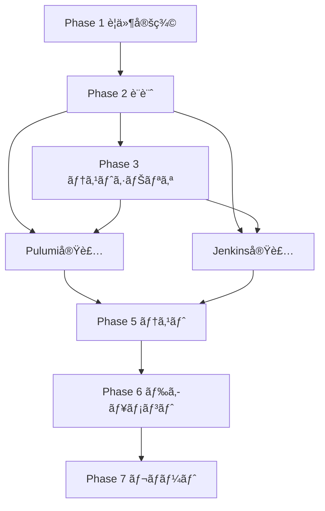

# Codex Agent 実行ログ

開始日時: 2025/10/15 12:18:43

---

## Turn 1: スレッド開始

**Thread ID**: `0199e7ce-f372-7ad0-99e7-53d7fa841ed0`

## Turn 2: ツール実行

**種別**: コãƒãƒ³ãƒ‰å®Ÿè¡Œ
**コãƒãƒ³ãƒ‰**: `bash -lc ls`
**ステータス**: completed (exit_code=0)

```text
ARCHITECTURE.md
CLAUDE.md
CONTRIBUTION.md
LICENSE
README.md
ansible
bootstrap
jenkins
pulumi
run_tests_issue_322.sh
scripts
```

## Turn 3: ツール実行

**種別**: コãƒãƒ³ãƒ‰å®Ÿè¡Œ
**コãƒãƒ³ãƒ‰**: `bash -lc 'cat .ai-workflow/issue-391/00_planning/output/planning.md'`
**ステータス**: completed (exit_code=0)

```text
# Issue #391 プロジェクト計画書

## 1. Issue分æ
- **複雑度**: 複雑（Pulumiスタックã¨JenkinsパイプラインåŒæ–¹ã‚’多リージョン化ã—ã€IaC・CIã®åŒæ™‚変更ãŒå¿…è¦ã§å½±éŸ¿ç¯„囲ãŒåºƒã„）
- **見ç©ã‚‚り工数**: 27時間（Pulumi設計/実装 10hã€ãƒ‘イプライン改修 8hã€è¦ä»¶å®šç¾©ãƒ»ãƒ†ã‚¹ãƒˆè¨­è¨ˆ/実行・ドキュメント整備 9h ã®æƒ³å®šï¼‰
- **リスク評価**: 中（複数リージョンã§ã®æ¨©é™ãƒ»S3命åæ•´åˆæ€§ã¨æ—¢å­˜é‹ç”¨å½±éŸ¿ã«æ³¨æ„ãŒå¿…è¦ã ãŒã€æ—¢å­˜æŠ€è¡“スタック内ã§åˆ¶å¾¡å¯èƒ½ï¼‰

## 2. 実装戦略判断
- **実装戦略: EXTEND**
  - 既存ã®Pulumiスタックã¨Jenkinsパイプラインを土å°ã«ã€ãƒªãƒ¼ã‚¸ãƒ§ãƒ³ã”ã¨ã«ãƒªã‚½ãƒ¼ã‚¹ã¨ã‚¹ãƒ†ãƒ¼ã‚¸ã‚’増やã™æ©Ÿèƒ½è¿½åŠ ãŒä¸­å¿ƒã§ã€æ–°è¦ã‚µãƒ–システムå°å…¥ã¯ä¸è¦ã€‚
- **テスト戦略: UNIT_INTEGRATION**
  - Pulumiã¯ã‚¹ã‚¿ãƒƒã‚¯å˜ä½ã®ãƒ¦ãƒ‹ãƒƒãƒˆãƒ†ã‚¹ãƒˆã§ãƒªãƒ¼ã‚¸ãƒ§ãƒ³é…列ã‹ã‚‰ã®ãƒã‚±ãƒƒãƒˆç”Ÿæˆã¨SSMパラメータ書ãè¾¼ã¿ã‚’検証ã—ã€Jenkinsã¯dry-run/jenkinsfile-runnerã§å¤šãƒªãƒ¼ã‚¸ãƒ§ãƒ³é€£ç¶šå®Ÿè¡Œãƒ•ãƒ­ãƒ¼ã‚’çµ±åˆãƒ†ã‚¹ãƒˆã™ã‚‹ã€‚
- **テストコード戦略: CREATE_TEST**
  - ç¾è¡Œã‚¹ã‚¿ãƒƒã‚¯ã«è‡ªå‹•ãƒ†ã‚¹ãƒˆãŒãªã„ãŸã‚ã€Pulumiå‘ã‘ã®æ–°è¦ãƒ†ã‚¹ãƒˆï¼ˆ`@pulumi/pulumi` ã®mocksを利用）ã¨Jenkinsfile検証スクリプト（jenkinsfile-runnerベース）ã®æ–°è¦ä½œæˆãŒå¿…è¦ã€‚

## 3. 影響範囲分æ
- **既存コードã¸ã®å½±éŸ¿**
  - `pulumi/jenkins-ssm-backup-s3/index.ts`: リージョンé…列を処ç†ã—ã€å„リージョンã«`aws.Provider`を切り替ãˆã¦ãƒã‚±ãƒƒãƒˆã¨SSMパラメータを動的ã«ä½œæˆã™ã‚‹ãƒ­ã‚¸ãƒƒã‚¯ã¸ã®æ‹¡å¼µã€‚
  - `pulumi/jenkins-ssm-backup-s3/Pulumi.{dev,prod}.yaml`: スタック設定ã«ãƒãƒƒã‚¯ã‚¢ãƒƒãƒ—対象リージョン一覧ã¨ãƒ‡ãƒ•ã‚©ãƒ«ãƒˆãƒªãƒ¼ã‚¸ãƒ§ãƒ³ã‚’追加。
  - `jenkins/jobs/pipeline/admin/ssm-backup/Jenkinsfile`: ステージをリージョンå˜ä½ã§ç›´åˆ—実行ã•ã›ã€å„リージョンã§PulumiãŒæ›¸ã込むパラメータã«å¾“ã„ãƒã‚±ãƒƒãƒˆã‚’å‚ç…§ã™ã‚‹å®Ÿè£…変更。
  - `jenkins/jobs/pipeline/admin/ssm-backup/scripts/collect_parameters.sh`: 多リージョンループ時ã®ç’°å¢ƒå¤‰æ•°å—ã‘渡ã—ã¨ãƒ­ã‚°ç²’度å‘上ã®ãŸã‚ã®å¾®èª¿æ•´ã€‚
  - `jenkins/jobs/dsl/admin/admin_ssm_backup_job.groovy`: 多リージョン化後ã®èª¬æ˜æ–‡ãƒ»ã‚¿ã‚¤ãƒ ã‚¢ã‚¦ãƒˆ/スロットル設定ã®è¦‹ç›´ã—（パラメータ構æˆè‡ªä½“ã¯ç¾çŠ¶ç¶­æŒï¼‰ã€‚
  - `docs/runbooks` ã‚‚ã—ã㯠`README.md`: リージョン追加手順・ロールãƒãƒƒã‚¯æ‰‹é †ã®è¿½è¨˜ã€‚
- **ä¾å­˜é–¢ä¿‚ã®å¤‰æ›´**
  - ランタイムä¾å­˜è¿½åŠ ã¯æƒ³å®šãªã—。開発時テスト用㫠`jenkinsfile-runner` Dockerイメージã®åˆ©ç”¨ã‚’追加（開発ドキュメントã«è¨˜è¼‰ï¼‰ã€‚
- **ãƒã‚¤ã‚°ãƒ¬ãƒ¼ã‚·ãƒ§ãƒ³è¦å¦**
  - Pulumi config値ã®è¿½åŠ ã¨æ—¢å­˜SSMパラメータ`/jenkins/{env}/backup/s3-bucket-name`ã®äº’æ›ç¢ºä¿ï¼ˆãƒ‡ãƒ•ã‚©ãƒ«ãƒˆãƒªãƒ¼ã‚¸ãƒ§ãƒ³å€¤ã‚’維æŒã—ã¤ã¤ã€æ–°è¦ã§`/jenkins/{env}/backup/{region}/s3-bucket-name`を発行）。
  - Jenkins実行ログã®ä¿å­˜ãƒãƒªã‚·ãƒ¼ã¨ã‚¿ã‚¤ãƒ ã‚¢ã‚¦ãƒˆã‚’リージョン数ã«åˆã‚ã›ã¦æ›´æ–°ã€‚

## 4. タスク分割
### Phase 1: è¦ä»¶å®šç¾© (見ç©ã‚‚ã‚Š: 4h)
- 2h: 対応リージョン候補ã¨å„ªå…ˆé †ã‚’é‹ç”¨ãƒãƒ¼ãƒ ã¨ç¢ºèªï¼ˆDone: åˆæ„済ã¿ãƒªãƒ¼ã‚¸ãƒ§ãƒ³ä¸€è¦§ã¨å¢—減判断基準ãŒæ–‡æ›¸åŒ–）
- 2h: ãƒãƒƒã‚¯ã‚¢ãƒƒãƒ—ä¿æŒ/リストアè¦ä»¶ã¨æ—¢å­˜CLI利用者ã®é€šçŸ¥ãƒãƒ£ãƒãƒ«æ•´ç†ï¼ˆDone: 通知対象ã¨ã‚³ãƒŸãƒ¥ãƒ‹ã‚±ãƒ¼ã‚·ãƒ§ãƒ³è¨ˆç”»ã‚’記載ã—ãŸãƒ¡ãƒ¢ä½œæˆï¼‰

### Phase 2: 設計 (見ç©ã‚‚ã‚Š: 5h)
- 2h: Pulumiã§ã®multi-regionリソース設計（Provider切替・ãƒãƒ¼ãƒŸãƒ³ã‚°ãƒ«ãƒ¼ãƒ«å®šç¾©ï¼‰ï¼ˆDone: 設計メモã«ãƒªã‚½ãƒ¼ã‚¹å‘½å/ã‚¿ã‚°/SSMキー方é‡ã‚’記載）
- 2h: Jenkinsパイプラインã®ãƒªãƒ¼ã‚¸ãƒ§ãƒ³é€æ¬¡å®Ÿè¡Œ/失敗ãƒãƒ³ãƒ‰ãƒªãƒ³ã‚°è¨­è¨ˆï¼ˆDone: ステージ構æˆå›³ã¨ä¸¦åˆ—/直列判断ç†ç”±ãŒã¾ã¨ã‚られã¦ã„る）
- 1h: テストアプローãƒã¨ãƒ­ãƒ¼ãƒ«ãƒãƒƒã‚¯æ‰‹é †ã®ãƒ¬ãƒ“ュー（Done: テストãƒãƒˆãƒªã‚¯ã‚¹ã¨ãƒ­ãƒ¼ãƒ«ãƒãƒƒã‚¯æ‰‹é †è‰æ¡ˆãŒæ‰¿èªï¼‰

### Phase 3: テストシナリオ (見ç©ã‚‚ã‚Š: 3h)
- 2h: 新旧リージョン構æˆã§ã®ãƒãƒƒã‚¯ã‚¢ãƒƒãƒ—/リストア検証シナリオ作æˆï¼ˆDone: テストケース一覧ã«æˆåŠŸ/失敗パスãŒåˆ—挙）
- 1h: ログ検証・アラート確èªæ‰‹é †ã®æ•´å‚™ï¼ˆDone: CloudWatch/S3/Slack確èªæ‰‹é †ãŒRunbookè‰æ¡ˆã«å映）

### Phase 4: 実装 (見ç©ã‚‚ã‚Š: 8h)
- 2h: Pulumi configã¨ã‚¹ã‚¿ãƒƒã‚¯ã‚³ãƒ¼ãƒ‰ã®multi-region対応実装（Done: Pulumiスタックã§ãƒªãƒ¼ã‚¸ãƒ§ãƒ³æ¯ã®ãƒã‚±ãƒƒãƒˆ/SSMãŒä½œæˆã•ã‚Œã‚‹ï¼‰
- 2h: æ—§SSMパラメータ互æ›ãƒ¬ã‚¤ãƒ¤ãƒ¼ã¨ãƒ‡ãƒ•ã‚©ãƒ«ãƒˆãƒªãƒ¼ã‚¸ãƒ§ãƒ³å‡ºåŠ›å®Ÿè£…（Done: 既存パイプラインã§äº’æ›ç¢ºèªæ¸ˆã¿ï¼‰
- 2h: Jenkinsfileをリージョンループ/ステージ分割ã«æ”¹ä¿®ã—ã€å¤±æ•—時ã®æ—©æœŸåœæ­¢ã¨é€šçŸ¥ã‚’追加（Done: Declarative Linter通éã¨ãƒ­ãƒ¼ã‚«ãƒ«dry-runæˆåŠŸï¼‰
- 2h: Groovy DSLã¨å集スクリプトã®å¾®ä¿®æ­£ï¼ˆDone: DSL説æ˜æ›´æ–°ã¨ã‚¹ã‚¯ãƒªãƒ—トã§ãƒªãƒ¼ã‚¸ãƒ§ãƒ³_LOGを出力）

### Phase 5: テスト (見ç©ã‚‚ã‚Š: 3h)
- 1h: Pulumiユニットテスト実装・実行（Done: `npm test`ã§multi-region生æˆãƒ†ã‚¹ãƒˆãŒé€šé）
- 1h: Pulumi previewã§å„リージョンã®å·®åˆ†ã‚’確èªï¼ˆDone: 主è¦ãƒªãƒ¼ã‚¸ãƒ§ãƒ³ã§`pulumi preview`çµæœã‚’ä¿å­˜ï¼‰
- 1h: Jenkinsfile-runnerを用ã„ãŸdry-runã¨us-west-2å«ã‚€ã‚µãƒ³ãƒ—ルログ確èªï¼ˆDone: dry-runログã¨S3アップロードシミュレーションçµæœã‚’記録）

### Phase 6: ドキュメント (見ç©ã‚‚ã‚Š: 2h)
- 1h: Runbook/READMEã«ãƒªãƒ¼ã‚¸ãƒ§ãƒ³è¿½åŠ ãƒ»å‰Šé™¤ãƒ»ãƒ­ãƒ¼ãƒ«ãƒãƒƒã‚¯æ‰‹é †ã‚’追記（Done: PR内ã§ãƒ¬ãƒ“ュー済ã¿ï¼‰
- 1h: Pulumi config変更点ã¨æ–°SSMキー説æ˜ã‚’ドキュメント化（Done: Config例ã¨è¨­å®šæ‰‹é †ãŒè¨˜è¼‰ï¼‰

### Phase 7: レãƒãƒ¼ãƒˆ (見ç©ã‚‚ã‚Š: 2h)
- 1h: Issueコメントã§å®Ÿè£…概è¦ãƒ»ãƒ†ã‚¹ãƒˆçµæœãƒ»æ®‹èª²é¡Œã‚’æ•´ç†ï¼ˆDone: Issue #391ã«å ±å‘Šã‚³ãƒ¡ãƒ³ãƒˆæŠ•ç¨¿ï¼‰
- 1h: é‹ç”¨ãƒãƒ¼ãƒ å‘ã‘リリースブリーフィング資料作æˆã¨åˆæ„å–得（Done: åˆæ„メール/コメントãŒè¨˜éŒ²ã•ã‚Œã¦ã„る）

## 5. ä¾å­˜é–¢ä¿‚


## 6. リスクã¨è»½æ¸›ç­–
#### リスク1: リージョンã”ã¨ã®S3ãƒã‚±ãƒƒãƒˆå‘½åè¡çª
- **影響度**: 高
- **確ç‡**: 中
- **軽減策**: Pulumiã§ã‚¢ã‚«ã‚¦ãƒ³ãƒˆID+リージョン+環境を必ãšå«ã‚る命åテンプレートã¨ã—ã€`pulumi preview`çµæœã‚’レビュー。

#### リスク2: 既存ジョブãŒæ–°SSMパラメータ構造ã«è¿½éšã§ããªã„
- **影響度**: 中
- **確ç‡**: 中
- **軽減策**: 旧キーを互æ›çš„ã«ç¶­æŒã—ã€ãƒªãƒªãƒ¼ã‚¹å‰ã«æœ¬ç•ªã‚¸ãƒ§ãƒ–ã®dry-runã¨ãƒ­ãƒ¼ãƒ«ãƒãƒƒã‚¯ã‚¹ã‚¯ãƒªãƒ—トを用æ„。

#### リスク3: Jenkins multi-region実行ã§ã‚¿ã‚¤ãƒ ã‚¢ã‚¦ãƒˆã‚„スロットルãŒç™ºç”Ÿ
- **影響度**: 中
- **確ç‡**: 中
- **軽減策**: ステージæ¯ã®ã‚¿ã‚¤ãƒ ã‚¢ã‚¦ãƒˆã‚’調整ã—ã€AWS CLIリトライ設定ã¨ãƒªãƒ¼ã‚¸ãƒ§ãƒ³é †åºã®è¦‹ç›´ã—ã€Slackアラートを拡張。

#### リスク4: é‹ç”¨ãƒãƒ¼ãƒ ã¸ã®æƒ…å ±ä¼é”ä¸è¶³ã«ã‚ˆã‚‹å¯¾å¿œé…延
- **影響度**: 中
- **確ç‡**: ä½
- **軽減策**: 通知計画をPhase1ã§ç¢ºå®šã—ã€ãƒªãƒªãƒ¼ã‚¹å‰ã«FAQã¨Runbookを共有ã—ã¦åˆæ„å–得。

## 7. å“質ゲート
#### Phase 1: è¦ä»¶å®šç¾©
- [ ] ãƒãƒƒã‚¯ã‚¢ãƒƒãƒ—対象リージョン一覧ã¨å¢—減判断基準ãŒæ‰¿èªæ¸ˆã¿
- [ ] CLI/
... (truncated)
```

## Turn 4: ツール実行

**種別**: コãƒãƒ³ãƒ‰å®Ÿè¡Œ
**コãƒãƒ³ãƒ‰**: `bash -lc 'cat .ai-workflow/issue-391/01_requirements/output/requirements.md'`
**ステータス**: completed (exit_code=0)

```text
# Issue #391 è¦ä»¶å®šç¾©æ›¸ï¼šSSMãƒãƒƒã‚¯ã‚¢ãƒƒãƒ—ã®ãƒãƒ«ãƒãƒªãƒ¼ã‚¸ãƒ§ãƒ³å¯¾å¿œ

## 0. Planning Documentã®ç¢ºèª
- **開発方é‡**: 実装戦略ã¯æ—¢å­˜Pulumiスタックã¨Jenkinsパイプラインを拡張ã™ã‚‹ã€ŒEXTENDã€ã€‚大è¦æ¨¡ãªæ–°è¦ã‚³ãƒ³ãƒãƒ¼ãƒãƒ³ãƒˆè¿½åŠ ã¯ä¸è¦ã§ã€æ—¢å­˜è³‡ç”£ã‚’多リージョン対応ã¸æ‹¡å¼µã™ã‚‹å‰æ。
- **テスト戦略**: Pulumiã¯mocksを用ã„ãŸãƒ¦ãƒ‹ãƒƒãƒˆãƒ†ã‚¹ãƒˆã¨`pulumi preview`ã§ã®å·®åˆ†ç¢ºèªã€Jenkinsã¯jenkinsfile-runnerã«ã‚ˆã‚‹dry-runçµ±åˆãƒ†ã‚¹ãƒˆã‚’実施ã™ã‚‹ã€‚テストコードã¯æ–°è¦ä½œæˆãŒå¿…須。
- **リスクã¨å¯¾ç­–**: S3ãƒã‚±ãƒƒãƒˆå‘½åè¡çªã€SSMパラメータ互æ›æ€§ã€Jenkins実行時間増加ã€é‹ç”¨ãƒãƒ¼ãƒ ã¸ã®å‘¨çŸ¥ä¸è¶³ãŒä¸»è¦ãƒªã‚¹ã‚¯ã€‚命åè¦å‰‡ã®æ˜æ–‡åŒ–ã€äº’æ›ãƒ¬ã‚¤ãƒ¤ãƒ¼ç¶­æŒã€ã‚¿ã‚¤ãƒ ã‚¢ã‚¦ãƒˆèª¿æ•´ã€é€šçŸ¥è¨ˆç”»ç­–定ãŒè»½æ¸›ç­–。
- **スケジュール**: è¦ä»¶å®šç¾©ï½ãƒ¬ãƒãƒ¼ãƒˆã¾ã§7フェーズ計27hを想定。Phase 1完了æ¡ä»¶ã¨ã—ã¦ãƒªãƒ¼ã‚¸ãƒ§ãƒ³ä¸€è¦§ã¨é€šçŸ¥æ–¹é‡ã®æ‰¿èªãŒæ±‚ã‚られる。

## 1. 概è¦
AWS Systems Manager (SSM) パラメータã®ãƒãƒƒã‚¯ã‚¢ãƒƒãƒ—機構をå˜ä¸€ãƒªãƒ¼ã‚¸ãƒ§ãƒ³å®Ÿè¡Œã‹ã‚‰ã€æŒ‡å®šã•ã‚ŒãŸè¤‡æ•°ãƒªãƒ¼ã‚¸ãƒ§ãƒ³ã¸æ‹¡å¼µã™ã‚‹ã€‚Pulumiã§ãƒªãƒ¼ã‚¸ãƒ§ãƒ³ã”ã¨ã®S3ãƒã‚±ãƒƒãƒˆã¨SSMパラメータを生æˆã—ã€Jenkinsパイプラインã§å„リージョンã®ãƒãƒƒã‚¯ã‚¢ãƒƒãƒ—を順次å–å¾—ã™ã‚‹æ§‹æˆã¸å†è¨­è¨ˆã™ã‚‹ã€‚ã“ã‚Œã«ã‚ˆã‚Šã€ç½å®³å¯¾ç­–ã‚„é‹ç”¨æŸ”軟性をå‘上ã•ã›ã€ãƒãƒƒã‚¯ã‚¢ãƒƒãƒ—ã®å†—長性ã¨ä¿¡é ¼æ€§ã‚’高ã‚ã‚‹ã“ã¨ãŒãƒ“ジãƒã‚¹ä¾¡å€¤ã§ã‚ã‚Šã€IaCã¨CIã®ä¸€è²«æ€§ã‚’ä¿ã£ãŸã¾ã¾å¤šãƒªãƒ¼ã‚¸ãƒ§ãƒ³åŒ–ã§ãる点ãŒæŠ€è¡“的価値ã§ã‚る。

## 2. 機能è¦ä»¶
| ID | è¦ä»¶ | è¦ä»¶è©³ç´° | 優先度 |
| --- | --- | --- | --- |
| FR-1 | Pulumi多リージョンS3ç®¡ç† | PulumiスタックãŒè¨­å®šã•ã‚ŒãŸãƒªãƒ¼ã‚¸ãƒ§ãƒ³é…列をå—ã‘å–ã‚Šã€å„リージョン専用ã®S3ãƒã‚±ãƒƒãƒˆã¨é–¢é€£SSMパラメータを生æˆãƒ»ç®¡ç†ã™ã‚‹ã€‚命åã¯ã‚¢ã‚«ã‚¦ãƒ³ãƒˆID・環境・リージョンをå«ã‚€ãƒ†ãƒ³ãƒ—レートã«å¾“ã†ã€‚ | 高 |
| FR-2 | SSMパラメータ互æ›æ€§ | æ–°è¦ã«`/jenkins/{env}/backup/{region}/s3-bucket-name`å½¢å¼ã®SSMキーを出力ã—ã¤ã¤ã€æ—¢å­˜ã®ãƒ‡ãƒ•ã‚©ãƒ«ãƒˆã‚­ãƒ¼(`/jenkins/{env}/backup/s3-bucket-name`)も最新リージョンを指ã™ã‚ˆã†ç¶­æŒã™ã‚‹ã€‚ | 高 |
| FR-3 | Jenkins多リージョン実行 | `jenkins/jobs/pipeline/admin/ssm-backup/Jenkinsfile`ãŒãƒªãƒ¼ã‚¸ãƒ§ãƒ³å˜ä½ã®ã‚¹ãƒ†ãƒ¼ã‚¸ã«åˆ†å‰²ã•ã‚Œã€å®šç¾©æ¸ˆã¿ãƒªãƒ¼ã‚¸ãƒ§ãƒ³ã‚’直列実行ã—å„ステージã§ãƒãƒƒã‚¯ã‚¢ãƒƒãƒ—ã‚’å–å¾—ã™ã‚‹ã€‚ステージ境界ã§å¤±æ•—時ã¯å¾Œç¶šãƒªãƒ¼ã‚¸ãƒ§ãƒ³ã‚’åœæ­¢ã™ã‚‹ã€‚ | 高 |
| FR-4 | Jenkins DSL互æ›é‹ç”¨ | `jenkins/jobs/dsl/admin/admin_ssm_backup_job.groovy`ã®ãƒ‘ラメータ構æˆã‚’変更ã›ãšã€ãƒªãƒ¼ã‚¸ãƒ§ãƒ³é¸æŠã‚’UIã«è¿½åŠ ã—ãªã„。多リージョン対応ã®èª¬æ˜ãƒ»ã‚¿ã‚¤ãƒ ã‚¢ã‚¦ãƒˆèª¿æ•´ã¯DSLã§ç®¡ç†ã™ã‚‹ã€‚ | 中 |
| FR-5 | 利用者通知計画 | CLI利用者ãŠã‚ˆã³Jenkinsジョブ利用者ã«å¯¾ã—ã€ãƒªãƒªãƒ¼ã‚¹å‰ã«å¤‰æ›´å†…容・影響・ロールãƒãƒƒã‚¯æ‰‹é †ã‚’通知ã™ã‚‹è¨ˆç”»ã‚’作æˆã—ã€é‹ç”¨ãƒãƒ¼ãƒ åˆæ„を得る。 | 中 |

## 3. é機能è¦ä»¶
- **パフォーãƒãƒ³ã‚¹**: Jenkinsパイプライン全体ã®å®Ÿè¡Œæ™‚é–“ã¯è¨±å®¹ã‚¿ã‚¤ãƒ ã‚¢ã‚¦ãƒˆå†…（ç¾è¡ŒåŸºæº–＋リージョン数×ãƒãƒƒã‚¯ã‚¢ãƒƒãƒ—時間ã€ä¸Šé™60分）ã«åã¾ã‚‹ã‚ˆã†èª¿æ•´ã™ã‚‹ã€‚ステージæ¯ã«æœ€å¤§10分ã®ã‚¿ã‚¤ãƒ ã‚¢ã‚¦ãƒˆè¨­å®šã‚’è¡Œã„ã€AWS CLIリトライを有効化ã™ã‚‹ã€‚
- **セキュリティ**: 生æˆã™ã‚‹S3ãƒã‚±ãƒƒãƒˆã¯ã‚µãƒ¼ãƒãƒ¼ã‚µã‚¤ãƒ‰æš—å·åŒ–（SSE-S3ã¾ãŸã¯KMS）を必須ã¨ã—ã€Pulumiã§ãƒ–ロックパブリックアクセスを有効化ã™ã‚‹ã€‚SSMパラメータã¯`SecureString`を維æŒã™ã‚‹ã€‚
- **å¯ç”¨æ€§ãƒ»ä¿¡é ¼æ€§**: ãƒãƒƒã‚¯ã‚¢ãƒƒãƒ—ã¯å°‘ãªãã¨ã‚‚1æ—¥1å›ã®ã‚¸ãƒ§ãƒ–æˆåŠŸãŒä¿è¨¼ã•ã‚Œã‚‹ã‚ˆã†ç›£è¦–ã—ã€å¤±æ•—時ã¯Slackアラートã«ã‚ˆã‚Šä¸€æ¬¡é€£çµ¡ãŒè¡Œã‚れる。リージョン追加・削除時ã®ãƒ­ãƒ¼ãƒ«ãƒãƒƒã‚¯æ‰‹é †ã‚’Runbookã«æ˜è¨˜ã™ã‚‹ã€‚
- **ä¿å®ˆæ€§ãƒ»æ‹¡å¼µæ€§**: 対応リージョンã¯Pulumi configã§è¨­å®šå¯èƒ½ã¨ã—ã€ã‚³ãƒ¼ãƒ‰å¤‰æ›´ãªã増減ã§ãる。Pulumiユニットテストã¨Jenkins dry-runテストをCIã«çµ±åˆã—ã€å°†æ¥ã®ãƒªãƒ¼ã‚¸ãƒ§ãƒ³è¿½åŠ æ™‚ã®å›å¸°ãƒªã‚¹ã‚¯ã‚’ä½æ¸›ã™ã‚‹ã€‚

## 4. 制約事項
- **技術的制約**: インフラ定義ã¯Pulumi(TypeScript)ã€CIã¯Jenkins Declarative Pipelineã¨Groovy DSLを継続利用ã™ã‚‹ã€‚AWSアカウントãŠã‚ˆã³æ—¢å­˜Jenkinsインフラã«ä¾å­˜ã™ã‚‹ãŸã‚他ツールã¸ã®ç§»è¡Œã¯å¯¾è±¡å¤–。
- **リソース制約**: æ¨å®šå·¥æ•°27時間ã€æ‹…当リソースã¯æ—¢å­˜IaC/CIãƒãƒ¼ãƒ å†…ã§è³„ã†ã€‚追加予算ãªã—。
- **ãƒãƒªã‚·ãƒ¼åˆ¶ç´„**: プロジェクトã®å‘½åè¦ç´„ã€ã‚¿ã‚°ä»˜ä¸ãƒãƒªã‚·ãƒ¼ã€ã‚»ã‚­ãƒ¥ãƒªãƒ†ã‚£æ¨™æº–（S3æš—å·åŒ–å¿…é ˆã€æœ€å°æ¨©é™IAM）ã«å¾“ã†ã€‚コードレビューã¨ãƒ†ã‚¹ãƒˆçµæœæ出ãŒãƒªãƒªãƒ¼ã‚¹æ¡ä»¶ã€‚

## 5. å‰ææ¡ä»¶
- Pulumiスタックã§ä½¿ç”¨ã™ã‚‹AWSクレデンシャルã¯ãƒãƒ«ãƒãƒªãƒ¼ã‚¸ãƒ§ãƒ³æ“作権é™ã‚’æŒã¡ã€å¯¾è±¡ãƒªãƒ¼ã‚¸ãƒ§ãƒ³ã¯é‹ç”¨ãƒãƒ¼ãƒ ã¨åˆæ„済ã¿ï¼ˆä¾‹ï¼š`us-east-1`, `us-west-2`, `ap-northeast-1`）。
- Jenkins実行環境ã¯AWS CLIãŠã‚ˆã³å¿…è¦ãªPulumiãƒãƒ¼ã‚¸ãƒ§ãƒ³ã‚’インストール済ã¿ã§ã€è¿½åŠ ãƒªãƒ¼ã‚¸ãƒ§ãƒ³ã¸ã®ã‚¢ã‚¯ã‚»ã‚¹ãŒè¨±å¯ã•ã‚Œã¦ã„る。
- 既存ãƒãƒƒã‚¯ã‚¢ãƒƒãƒ—ジョブã®ã‚¹ã‚±ã‚¸ãƒ¥ãƒ¼ãƒ«ã€é€šçŸ¥å…ˆï¼ˆSlack/Email）ã€Runbookã¯ç¾è¡Œé€šã‚Šåˆ©ç”¨å¯èƒ½ã§ã‚ã‚Šã€ä»Šå›ã®å¤‰æ›´ã«åˆã‚ã›ã¦æ”¹è¨‚ã§ãる。

## 6. å—ã‘入れ基準
- **FR-1**  
  - Given Pulumi configã«è¤‡æ•°ãƒªãƒ¼ã‚¸ãƒ§ãƒ³ãŒè¨­å®šã•ã‚Œã¦ã„ã‚‹  
  - When `pulumi preview`ã¾ãŸã¯`pulumi up`を実行ã™ã‚‹  
  - Then å„リージョンã«å‘½åè¦å‰‡ã«æ²¿ã£ãŸS3ãƒã‚±ãƒƒãƒˆã¨é–¢é€£SSMパラメータãŒä½œæˆã•ã‚Œã‚‹ã“ã¨ãŒç¢ºèªã§ãる。
- **FR-2**  
  - Given `pulumi up`実行後ã«SSMパラメータストアを確èªã™ã‚‹  
  - When `/jenkins/{env}/backup/{region}/s3-bucket-name`ã‚’å–å¾—ã™ã‚‹  
  - Then 対象リージョンã®ãƒã‚±ãƒƒãƒˆåãŒå–å¾—ã§ãã€æ—¢å­˜ã‚­ãƒ¼`/jenkins/{env}/backup/s3-bucket-name`も最新デフォルトリージョンã®å€¤ã‚’è¿”ã™ã€‚
- **FR-3**  
  - Given Jenkinsfileã«å®šç¾©ã•ã‚ŒãŸãƒªãƒ¼ã‚¸ãƒ§ãƒ³ãƒªã‚¹ãƒˆãŒ3件ã‚ã‚‹  
  - When パイプラインを実行ã™ã‚‹  
  - Then ステージãŒãƒªãƒ¼ã‚¸ãƒ§ãƒ³é †ã«ç›´åˆ—実行ã•ã‚Œã€ã„ãšã‚Œã‹ã®ã‚¹ãƒ†ãƒ¼ã‚¸ãŒå¤±æ•—ã—ãŸå ´åˆã¯å¾Œç¶šã‚¹ãƒ†ãƒ¼ã‚¸ãŒã‚¹ã‚­ãƒƒãƒ—ã•ã‚Œé€šçŸ¥ãŒè¡Œã‚れる。
- **FR-4**  
  - Given Jenkinsジョブã®ãƒ‘ラメータ画é¢ã‚’表示ã™ã‚‹  
  - When 多リージョン対応版ã®DSLãŒãƒ‡ãƒ—ロイã•ã‚Œã¦ã„ã‚‹  
  - Then 既存パラメータ項目ã¯å称・å‹ã¨ã‚‚ã«å¤‰æ›´ã•ã‚Œã¦ãŠã‚‰ãšã€æ–°ãŸãªãƒªãƒ¼ã‚¸ãƒ§ãƒ³é¸æŠé …ç›®ãŒè¿½åŠ ã•ã‚Œã¦ã„ãªã„。
- **FR-5**  
  - Given リリース1週間å‰ã®é‹ç”¨æº–備ミーティング  
  - When 通知計画ドキュメントをレビューã™ã‚‹  
  - Then CLI/Jenkins利用者ã¸ã®é€£çµ¡ãƒãƒ£ãƒãƒ«ãƒ»ã‚¿ã‚¤ãƒŸãƒ³ã‚°ãƒ»ãƒ­ãƒ¼ãƒ«ãƒãƒƒã‚¯é€£çµ¡æ‰‹é †ãŒæ˜è¨˜ã•ã‚Œã€é‹ç”¨ãƒãƒ¼ãƒ ã‹ã‚‰æ‰¿èªã‚’å¾—ãŸè¨˜éŒ²ãŒæ®‹ã£ã¦ã„る。

## 7. スコープ外
- ãƒãƒƒã‚¯ã‚¢ãƒƒãƒ—対象データã®ç¨®é¡æ‹¡å¼µï¼ˆSSM以外ã®ã‚µãƒ¼ãƒ“スãƒãƒƒã‚¯ã‚¢ãƒƒãƒ—）ã¯å¯¾è±¡å¤–。
- Jenkins以外ã®CI/CDツールã¸ã®ç§»è¡Œã‚„併用ã¯è¡Œã‚ãªã„。
- 完全並列実行やイベントドリブン化ãªã©å¤šãƒªãƒ¼ã‚¸ãƒ§ãƒ³ä»¥å¤–ã®é«˜åº¦ãªã‚ªãƒ¼ã‚±ã‚¹ãƒˆãƒ¬ãƒ¼ã‚·ãƒ§ãƒ³ã¯æœ¬ãƒ•ã‚§ãƒ¼ã‚ºã®ã‚¹ã‚³ãƒ¼ãƒ—外。将æ¥çš„ãªæ”¹å–„候補ã¨ã—ã¦æ¤œè¨ã™ã‚‹ã€‚
```

## Turn 5: ツール実行

**種別**: コãƒãƒ³ãƒ‰å®Ÿè¡Œ
**コãƒãƒ³ãƒ‰**: `bash -lc "sed -n '1,200p' pulumi/jenkins-ssm-backup-s3/index.ts"`
**ステータス**: completed (exit_code=0)

```text
import * as pulumi from "@pulumi/pulumi";
import * as aws from "@pulumi/aws";

// 設定値ã®å–å¾—
const config = new pulumi.Config();
const projectName = config.require("projectName");
const environment = config.require("environment");

// AWSアカウント情報ã¨ãƒªãƒ¼ã‚¸ãƒ§ãƒ³ã‚’å–å¾—
const accountId = aws.getCallerIdentity().then(identity => identity.accountId);
const region = aws.config.region || "ap-northeast-1";

// S3ãƒã‚±ãƒƒãƒˆåã®ç”Ÿæˆï¼ˆã‚¢ã‚«ã‚¦ãƒ³ãƒˆç•ªå·ã¨ãƒªãƒ¼ã‚¸ãƒ§ãƒ³ã‚’å«ã‚ã¦ä¸€æ„性を確ä¿ï¼‰
const bucketName = pulumi.interpolate`${projectName}-ssm-backup-${environment}-${accountId}-${region}`;

// SSMパラメータãƒãƒƒã‚¯ã‚¢ãƒƒãƒ—用S3ãƒã‚±ãƒƒãƒˆ
const backupBucket = new aws.s3.Bucket("ssm-backup-bucket", {
    bucket: bucketName,
    versioning: {
        enabled: true,
    },
    serverSideEncryptionConfiguration: {
        rule: {
            applyServerSideEncryptionByDefault: {
                sseAlgorithm: "AES256",
            },
            bucketKeyEnabled: true,  // S3 Bucket Keysを有効化（暗å·åŒ–コストを削減）
        },
    },
    lifecycleRules: [{
        id: "delete-old-backups",
        enabled: true,
        expiration: {
            days: 30,  // 30日間ä¿æŒ
        },
        noncurrentVersionExpiration: {
            days: 7,  // éç¾è¡Œãƒãƒ¼ã‚¸ãƒ§ãƒ³ã¯7日間ä¿æŒ
        },
    }],
    objectLockEnabled: false,  // å¿…è¦ã«å¿œã˜ã¦Object Lockを有効化å¯èƒ½
    tags: {
        Name: bucketName,
        Environment: environment,
        Purpose: "SSM Parameter Store Backup Storage",
        ManagedBy: "Pulumi",
        DataClassification: "Confidential",  // データ分é¡ã‚’æ˜ç¤º
    },
});

// ãƒã‚±ãƒƒãƒˆã®ãƒ‘ブリックアクセスブロック設定
const bucketPublicAccessBlock = new aws.s3.BucketPublicAccessBlock("ssm-backup-bucket-pab", {
    bucket: backupBucket.id,
    blockPublicAcls: true,
    blockPublicPolicy: true,
    ignorePublicAcls: true,
    restrictPublicBuckets: true,
});

// ãƒã‚±ãƒƒãƒˆãƒãƒªã‚·ãƒ¼ï¼šHTTPS通信ã®å¼·åˆ¶ã¨IP制é™ï¼ˆã‚ªãƒ—ション）
const bucketPolicy = new aws.s3.BucketPolicy("ssm-backup-bucket-policy", {
    bucket: backupBucket.id,
    policy: pulumi.all([backupBucket.arn]).apply(([bucketArn]) => JSON.stringify({
        Version: "2012-10-17",
        Statement: [
            {
                Sid: "DenyInsecureConnections",
                Effect: "Deny",
                Principal: "*",
                Action: "s3:*",
                Resource: [
                    bucketArn,
                    `${bucketArn}/*`,
                ],
                Condition: {
                    Bool: {
                        "aws:SecureTransport": "false"
                    }
                }
            },
            {
                Sid: "DenyUnencryptedObjectUploads",
                Effect: "Deny",
                Principal: "*",
                Action: "s3:PutObject",
                Resource: `${bucketArn}/*`,
                Condition: {
                    StringNotEquals: {
                        "s3:x-amz-server-side-encryption": "AES256"
                    }
                }
            }
        ]
    })),
});

// SSMパラメータストアã«ãƒã‚±ãƒƒãƒˆåã‚’ä¿å­˜
const ssmBackupBucketName = new aws.ssm.Parameter("ssm-backup-bucket-name", {
    name: `/jenkins/${environment}/backup/s3-bucket-name`,
    type: "String",
    value: backupBucket.bucket,
    description: "SSM Parameter Store backup S3 bucket name",
    tags: {
        Environment: environment,
        ManagedBy: "Pulumi",
    },
});

// エクスãƒãƒ¼ãƒˆ
export const bucketNameOutput = backupBucket.bucket;
export const bucketArn = backupBucket.arn;
export const ssmBackupBucketParameter = ssmBackupBucketName.name;
```

## Turn 6: ツール実行

**種別**: コãƒãƒ³ãƒ‰å®Ÿè¡Œ
**コãƒãƒ³ãƒ‰**: `bash -lc "sed -n '1,200p' jenkins/jobs/pipeline/admin/ssm-backup/Jenkinsfile"`
**ステータス**: completed (exit_code=0)

```text
@Library('jenkins-shared-lib') _

/**
 * SSM Parameter Store Backup Pipeline
 * AWS Systems Manager Parameter Storeã®ãƒ‘ラメータを定期的ã«ãƒãƒƒã‚¯ã‚¢ãƒƒãƒ—
 */
pipeline {
    agent {
        label 'ec2-fleet'
    }
    
    options {
        timestamps()
        timeout(time: 1, unit: 'HOURS')
        buildDiscarder(logRotator(daysToKeepStr: '30', numToKeepStr: '100'))
        disableConcurrentBuilds()
    }
    
    environment {
        // AWS設定
        AWS_REGION = 'ap-northeast-1'
        
        // タイムスタンプ
        BACKUP_DATE = sh(script: "date '+%Y-%m-%d'", returnStdout: true).trim()
        BACKUP_TIMESTAMP = sh(script: "date '+%Y%m%d_%H%M%S'", returnStdout: true).trim()
        
        // ディレクトリ構造
        WORK_DIR = "${WORKSPACE}/backup-work"
        DATA_DIR = "${WORK_DIR}/data"
        SCRIPT_DIR = "${WORKSPACE}/scripts"
        
        // 環境フィルタ（環境ã«å«ã¾ã‚Œã‚‹æ–‡å­—列）
        ENV_FILTER = "/${params.ENVIRONMENT}/"
    }
    
    stages {
        stage('Initialize') {
            steps {
                script {
                    // ビルド表示åを設定
                    currentBuild.displayName = "#${env.BUILD_NUMBER} - ${params.ENVIRONMENT} Backup"
                    currentBuild.description = "Backup at ${env.BACKUP_TIMESTAMP}"
                    
                    echo """
                    =============================================
                    SSM Parameter Store Backup
                    =============================================
                    Environment: ${params.ENVIRONMENT}
                    Filter: Parameters containing '${env.ENV_FILTER}'
                    Dry Run: ${params.DRY_RUN}
                    Timestamp: ${env.BACKUP_TIMESTAMP}
                    Date: ${env.BACKUP_DATE}
                    =============================================
                    """.stripIndent()
                    
                    // 作業ディレクトリã®æº–å‚™
                    sh """
                        rm -rf ${WORK_DIR}
                        mkdir -p ${DATA_DIR}
                        mkdir -p ${SCRIPT_DIR}
                    """
                    
                    // S3ãƒã‚±ãƒƒãƒˆåã®å–å¾—
                    env.BACKUP_BUCKET = sh(
                        script: """
                            aws ssm get-parameter \
                                --name "/jenkins/${params.ENVIRONMENT}/backup/s3-bucket-name" \
                                --query 'Parameter.Value' \
                                --output text \
                                --region ${AWS_REGION} 2>/dev/null || echo ""
                        """,
                        returnStdout: true
                    ).trim()
                    
                    if (!env.BACKUP_BUCKET) {
                        error("ãƒãƒƒã‚¯ã‚¢ãƒƒãƒ—用S3ãƒã‚±ãƒƒãƒˆãŒè¦‹ã¤ã‹ã‚Šã¾ã›ã‚“。PulumiスタックãŒãƒ‡ãƒ—ロイã•ã‚Œã¦ã„ã‚‹ã“ã¨ã‚’確èªã—ã¦ãã ã•ã„。")
                    }
                    
                    echo "Backup S3 Bucket: ${env.BACKUP_BUCKET}"
                }
            }
        }
        
        stage('Prepare Scripts') {
            steps {
                script {
                    echo "=== Preparing Collection Scripts ==="
                    
                    // Jenkinsリãƒã‚¸ãƒˆãƒªã‚’ãƒã‚§ãƒƒã‚¯ã‚¢ã‚¦ãƒˆ
                    dir('jenkins-repo') {
                        checkout([
                            $class: 'GitSCM',
                            branches: [[name: "${params.JENKINSFILE_BRANCH}"]],
                            userRemoteConfigs: [[
                                url: 'https://github.com/tielec/infrastructure-as-code',
                                credentialsId: 'github-app-credentials'
                            ]]
                        ])
                    }
                    
                    // スクリプトをコピー
                    sh """
                        cp jenkins-repo/jenkins/jobs/pipeline/admin/ssm-backup/scripts/collect_parameters.sh ${SCRIPT_DIR}/
                        chmod +x ${SCRIPT_DIR}/collect_parameters.sh
                        
                        echo "Script copie
... (truncated)
```

## Turn 7: ツール実行

**種別**: コãƒãƒ³ãƒ‰å®Ÿè¡Œ
**コãƒãƒ³ãƒ‰**: `bash -lc "sed -n '200,400p' jenkins/jobs/pipeline/admin/ssm-backup/Jenkinsfile"`
**ステータス**: completed (exit_code=0)

```text
// ãƒãƒƒã‚¯ã‚¢ãƒƒãƒ—ファイルã¯æš—å·åŒ–ã•ã‚ŒãŸS3ãƒã‚±ãƒƒãƒˆã§ã®ã¿ç®¡ç†
                }
            }
        }
        
        stage('Dry Run Report') {
            when {
                expression { params.DRY_RUN }
            }
            steps {
                script {
                    def paramCount = env.PARAM_COUNT ?: '0'
                    
                    echo """
                    =============================================
                    DRY RUN - ãƒãƒƒã‚¯ã‚¢ãƒƒãƒ—実行レãƒãƒ¼ãƒˆ
                    =============================================
                    
                    ã“ã®ãƒ‰ãƒ©ã‚¤ãƒ©ãƒ³ã§ã¯å®Ÿéš›ã®S3アップロードã¯è¡Œã‚ã‚Œã¾ã›ã‚“ã§ã—ãŸã€‚
                    
                    ãƒãƒƒã‚¯ã‚¢ãƒƒãƒ—対象:
                    - 環境: ${params.ENVIRONMENT}
                    - パラメータ数: ${paramCount}
                    - ãƒãƒƒã‚¯ã‚¢ãƒƒãƒ—日時: ${env.BACKUP_TIMESTAMP}
                    
                    実行時ã®å‹•ä½œ:
                    - S3ãƒã‚±ãƒƒãƒˆ: ${env.BACKUP_BUCKET}
                    - S3パス: ${env.BACKUP_DATE}/
                    - ファイルå: ssm-backup-${params.ENVIRONMENT}-${env.BACKUP_TIMESTAMP}.json
                    
                    =============================================
                    """.stripIndent()
                    
                    // セキュリティ上ã®ç†ç”±ã«ã‚ˆã‚Šãƒ‰ãƒ©ã‚¤ãƒ©ãƒ³æ™‚もアーティファクトã¨ã—ã¦ä¿å­˜ã—ãªã„
                }
            }
        }
    }
    
    post {
        always {
            script {
                def paramCount = env.PARAM_COUNT ?: '0'
                
                // 実行サãƒãƒªãƒ¼ã®è¡¨ç¤º
                echo """
                =============================================
                SSM Parameter Store Backup Summary
                =============================================
                Build: #${env.BUILD_NUMBER}
                Status: ${currentBuild.result ?: 'SUCCESS'}
                Environment: ${params.ENVIRONMENT}
                Parameters: ${paramCount}
                Timestamp: ${env.BACKUP_TIMESTAMP}
                Dry Run: ${params.DRY_RUN}
                =============================================
                """.stripIndent()
            }
        }
        
        success {
            echo "✅ SSMパラメータã®ãƒãƒƒã‚¯ã‚¢ãƒƒãƒ—ãŒæ­£å¸¸ã«å®Œäº†ã—ã¾ã—ãŸ"
        }
        
        failure {
            echo "⌠ãƒãƒƒã‚¯ã‚¢ãƒƒãƒ—ãŒå¤±æ•—ã—ã¾ã—ãŸã€‚ログを確èªã—ã¦ãã ã•ã„"
        }
        
        unstable {
            echo "âš ï¸ ãƒãƒƒã‚¯ã‚¢ãƒƒãƒ—ã¯å®Œäº†ã—ã¾ã—ãŸãŒã€è­¦å‘ŠãŒã‚ã‚Šã¾ã™"
        }
        
        cleanup {
            // 作業ディレクトリã®ã‚¯ãƒªãƒ¼ãƒ³ã‚¢ãƒƒãƒ—
            sh "rm -rf ${WORK_DIR} ${SCRIPT_DIR} jenkins-repo || true"
        }
    }
}
```

## Turn 8: ツール実行

**種別**: コãƒãƒ³ãƒ‰å®Ÿè¡Œ
**コãƒãƒ³ãƒ‰**: `bash -lc "sed -n '1,200p' jenkins/jobs/dsl/admin/admin_ssm_backup_job.groovy"`
**ステータス**: completed (exit_code=0)

```text
// 共通設定をå–å¾—
def jenkinsPipelineRepo = commonSettings['jenkins-pipeline-repo']

// ジョブ設定をå–å¾—
def jobKey = 'admin_ssm_backup_job'
def jobConfig = jenkinsJobsConfig[jobKey]

// フォルダã¨ã‚¸ãƒ§ãƒ–åを組ã¿åˆã‚ã›ã‚‹
def fullJobName = "Admin_Jobs/${jobConfig.name}"

pipelineJob(fullJobName) {
    displayName(jobConfig.displayName)
    
    // 基本情報
    description('SSM Parameter Storeã®ãƒ‘ラメータを自動的ã«ãƒãƒƒã‚¯ã‚¢ãƒƒãƒ—ã—ã¾ã™ã€‚')
    keepDependencies(false)
    disabled(false)

    // ビルド履歴ã®ä¿æŒè¨­å®š
    logRotator {
        daysToKeep(30)
        numToKeep(100)
        artifactDaysToKeep(-1)
        artifactNumToKeep(-1)
    }

    // プロパティ設定
    properties {
        rebuild {
            autoRebuild(false)
            rebuildDisabled(false)
        }
        pipelineTriggers {
            triggers {
                cron {
                    spec('0 13 * * *')  // JST 22:00 = UTC 13:00 (æ¯æ—¥å®Ÿè¡Œ)
                }
            }
        }
    }

    // åŒæ™‚実行制御
    throttleConcurrentBuilds {
        maxTotal(1)
        throttleDisabled(false)
    }

    // パラメータ設定
    parameters {
        choiceParam('ENVIRONMENT', ['dev', 'prod'], '環境をé¸æŠ')
        booleanParam('DRY_RUN', false, 'ドライランモード（実際ã®ãƒãƒƒã‚¯ã‚¢ãƒƒãƒ—ã¯å®Ÿè¡Œã—ãªã„）')
        stringParam('JENKINSFILE_BRANCH', 'main', 'JenkinsfileãŒæ ¼ç´ã•ã‚Œã¦ã„るブランãƒ')
    }

    // パイプライン定義
    definition {
        cpsScm {
            scm {
                git {
                    remote {
                        url(jenkinsPipelineRepo.url)
                        credentials(jenkinsPipelineRepo.credentials)
                    }
                    branch('${JENKINSFILE_BRANCH}')
                }
            }
            scriptPath(jobConfig.jenkinsfile)
            lightweight(true)
        }
    }
}
```

## Turn 9: ツール実行

**種別**: コãƒãƒ³ãƒ‰å®Ÿè¡Œ
**コãƒãƒ³ãƒ‰**: `bash -lc "sed -n '1,200p' jenkins/jobs/pipeline/admin/ssm-backup/scripts/collect_parameters.sh"`
**ステータス**: completed (exit_code=0)

```text
#!/bin/bash
# SSM Parameter Collection and Backup Script
# SSMパラメータをå集ã—ã¦ãƒãƒƒã‚¯ã‚¢ãƒƒãƒ—ファイルを作æˆ
# 
# 使用方法:
#   ã“ã®ã‚¹ã‚¯ãƒªãƒ—トã¯ç’°å¢ƒå¤‰æ•°ã‚’通ã˜ã¦è¨­å®šã‚’å—ã‘å–ã‚Šã¾ã™
#   必須環境変数:
#     - ENVIRONMENT: ãƒãƒƒã‚¯ã‚¢ãƒƒãƒ—対象ã®ç’°å¢ƒ (dev/prod)
#     - ENV_FILTER: パラメータフィルタ文字列 (/dev/, /prod/)
#     - AWS_REGION: AWSリージョン
#     - BACKUP_DATE: ãƒãƒƒã‚¯ã‚¢ãƒƒãƒ—日付 (YYYY-MM-DD)
#     - BACKUP_TIMESTAMP: ãƒãƒƒã‚¯ã‚¢ãƒƒãƒ—タイムスタンプ
#     - DATA_DIR: データ出力ディレクトリ
#
# 戻り値:
#   0: 正常終了
#   1: エラー発生

set -euo pipefail

echo "======================================"
echo "SSM Parameter Collection Script"
echo "======================================"
echo "Environment: ${ENVIRONMENT}"
echo "Filter: ${ENV_FILTER}"
echo "Region: ${AWS_REGION}"
echo "Backup Date: ${BACKUP_DATE}"
echo "Backup Timestamp: ${BACKUP_TIMESTAMP}"
echo "======================================"

# AWSèªè¨¼æƒ…å ±ã®ç¢ºèª
echo "Checking AWS credentials..."
if ! aws sts get-caller-identity --region ${AWS_REGION}; then
    echo "Error: Failed to get AWS credentials. Please check IAM role or credentials."
    exit 1
fi
echo "AWS credentials verified."

# AWS API呼ã³å‡ºã—ã®ãƒªãƒˆãƒ©ã‚¤æ©Ÿèƒ½
aws_cli_with_retry() {
    local max_retries=5
    local retry_delay=3  # åˆæœŸå¾…機時間を長ã‚ã«è¨­å®š
    local retry_count=0
    
    while [ $retry_count -lt $max_retries ]; do
        # AWS CLIを実行（環境変数ã§åˆ¶å¾¡ï¼‰
        if output=$(AWS_PAGER="" AWS_CLI_AUTO_PROMPT=off "$@" 2>&1); then
            echo "$output"
            return 0
        else
            if echo "$output" | grep -q "ThrottlingException\|Rate exceeded"; then
                retry_count=$((retry_count + 1))
                echo "  Rate limit hit. Retry ${retry_count}/${max_retries} after ${retry_delay}s..." >&2
                sleep $retry_delay
                retry_delay=$((retry_delay * 2))  # Exponential backoff
                if [ $retry_delay -gt 60 ]; then
                    retry_delay=60  # Max delay 60s
                fi
            else
                echo "Error: $output" >&2
                return 1
            fi
        fi
    done
    
    echo "Error: Max retries reached" >&2
    return 1
}

# パラメータ一覧ã®å–得（ページãƒãƒ¼ã‚·ãƒ§ãƒ³å¯¾å¿œã€ãƒ•ã‚£ãƒ«ã‚¿ãƒªãƒ³ã‚°æœ€é©åŒ–）
fetch_all_parameters() {
    local next_token=""
    local page=1
    local all_params="[]"
    
    # åˆå›å®Ÿè¡Œå‰ã«å¾…機（レート制é™å¯¾ç­–）
    echo "Waiting 2 seconds before API calls to avoid rate limiting..." >&2
    sleep 2
    
    while true; do
        echo "Fetching page ${page}..." >&2
        
        # AWS CLIコãƒãƒ³ãƒ‰ã®å®Ÿè¡Œã¨ã‚¨ãƒ©ãƒ¼ãƒãƒ³ãƒ‰ãƒªãƒ³ã‚°
        local result
        local error_msg
        
        if [ -n "$next_token" ]; then
            echo "  Executing: aws ssm describe-parameters with filter --region ${AWS_REGION}" >&2
            # パラメータフィルタã®å€¤ã‚’変数ã«æ ¼ç´
            local filter_value="${ENV_FILTER:1:-1}"  # /dev/ -> dev
            # リトライ機能を使用（--next-tokenを使用）
            if ! result=$(aws_cli_with_retry aws ssm describe-parameters \
                --next-token "$next_token" \
                --max-results 50 \
                --parameter-filters "Key=Name,Option=Contains,Values=$filter_value" \
                --output json \
                --region ${AWS_REGION}); then
                echo "Error: Failed to describe parameters" >&2
                echo '{"Parameters": [], "NextToken": null}'
                return 1
            fi
        else
            echo "  Executing: aws ssm describe-parameters with filter --region ${AWS_REGION}" >&2
            # パラメータフィルタã®å€¤ã‚’変数ã«æ ¼ç´
            local filter_value="${ENV_FILTER:1:-1}"  # /dev/ -> dev
            # リトライ機能を使用
            if ! result=$(aws_cli_with_retry aws ssm describe-parameters \
                --max-results 50 \
                --parameter-filters "Key=Name,Option=Contains,Values=$filter_value" \
                --output json \
                --region ${AWS_REGION}); then
                echo "Error: Failed to describe parameters" >&2
                echo '{"Parameters": [], "NextToken": null}'
                return 1
            fi
        fi
        
        # çµæœãŒç©ºã¾ãŸã¯ã‚¨ãƒ©ãƒ¼ãƒ¡ãƒƒã‚»ãƒ¼ã‚¸ã®å ´åˆã®å‡¦ç†
        if [ -z "$result" ]; then
            echo "Warning: Empty response rec
... (truncated)
```

## Turn 10: ツール実行

**種別**: コãƒãƒ³ãƒ‰å®Ÿè¡Œ
**コãƒãƒ³ãƒ‰**: `bash -lc "sed -n '200,400p' jenkins/jobs/pipeline/admin/ssm-backup/scripts/collect_parameters.sh"`
**ステータス**: completed (exit_code=0)

```text
# パラメータå–å¾—å‰ã«å¾…機（レート制é™å¯¾ç­–）
echo "Waiting before fetching parameter values..."
sleep 2

# パラメータをå–å¾—ã—ã¦ãƒãƒƒã‚¯ã‚¢ãƒƒãƒ—データを作æˆï¼ˆãƒãƒƒãƒå‡¦ç†ã§é«˜é€ŸåŒ–）
echo "Fetching parameter values..."
BACKUP_DATA="[]"
BATCH_SIZE=10  # AWS APIã®åˆ¶é™ã«ã‚ˆã‚Šæœ€å¤§10個
FAILED_COUNT=0
FAILED_PARAMS=()

# パラメータåã‚’é…列ã«èª­ã¿è¾¼ã¿
mapfile -t PARAM_NAMES < ${DATA_DIR}/parameter_names.txt
TOTAL_PARAMS=${#PARAM_NAMES[@]}

# ãƒãƒƒãƒå‡¦ç†ã§ãƒ‘ラメータをå–å¾—
for ((i=0; i<$TOTAL_PARAMS; i+=BATCH_SIZE)); do
    # ãƒãƒƒãƒã®çµ‚了インデックスを計算
    end=$((i + BATCH_SIZE))
    if [ $end -gt $TOTAL_PARAMS ]; then
        end=$TOTAL_PARAMS
    fi
    
    # 進æ—表示
    echo "Fetching parameters $((i + 1))-$end of ${TOTAL_PARAMS}..."
    
    # ãƒãƒƒãƒç”¨ã®ãƒ‘ラメータåを準備
    batch_params=()
    for ((j=i; j<end; j++)); do
        batch_params+=("${PARAM_NAMES[$j]}")
    done
    
    # get-parameters（複数形）ã§ãƒãƒƒãƒå–å¾—
    if [ ${#batch_params[@]} -gt 0 ]; then
        # AWS CLIコãƒãƒ³ãƒ‰ã‚’ç›´æ¥å®Ÿè¡Œï¼ˆxargsを使ã‚ãªã„）
        BATCH_RESULT=$(aws ssm get-parameters \
            --names "${batch_params[@]}" \
            --with-decryption \
            --output json \
            --region ${AWS_REGION} 2>/dev/null || echo '{"Parameters": [], "InvalidParameters": []}')
        
        # å–å¾—æˆåŠŸã—ãŸãƒ‘ラメータを追加
        VALID_PARAMS=$(echo "$BATCH_RESULT" | jq '.Parameters // []')
        if [ "$VALID_PARAMS" != "[]" ] && [ "$VALID_PARAMS" != "null" ]; then
            BACKUP_DATA=$(echo "$BACKUP_DATA" | jq --argjson new_params "$VALID_PARAMS" '. + $new_params')
        fi
        
        # å–得失敗ã—ãŸãƒ‘ラメータを記録
        INVALID_PARAMS=$(echo "$BATCH_RESULT" | jq -r '.InvalidParameters[]?' 2>/dev/null)
        if [ -n "$INVALID_PARAMS" ]; then
            while IFS= read -r invalid_param; do
                echo "Warning: Failed to get parameter: $invalid_param"
                FAILED_PARAMS+=("$invalid_param")
                FAILED_COUNT=$((FAILED_COUNT + 1))
            done <<< "$INVALID_PARAMS"
        fi
    fi
    
    # APIレート制é™å¯¾ç­–（ãƒãƒƒãƒé–“ã®å¾…機時間を長ã‚ã«ï¼‰
    if [ $end -lt $TOTAL_PARAMS ]; then
        sleep 2
    fi
done

COUNTER=$TOTAL_PARAMS

echo "Successfully fetched $((COUNTER - FAILED_COUNT)) parameters"
if [ "$FAILED_COUNT" -gt 0 ]; then
    echo "Failed to fetch ${FAILED_COUNT} parameters"
fi

# ãƒãƒƒã‚¯ã‚¢ãƒƒãƒ—ファイルã®ä½œæˆ
echo "Creating backup file..."
BACKUP_JSON=$(jq -n \
    --arg date "${BACKUP_DATE}" \
    --arg timestamp "${BACKUP_TIMESTAMP}" \
    --arg environment "${ENVIRONMENT}" \
    --arg count "$((COUNTER - FAILED_COUNT))" \
    --argjson parameters "$BACKUP_DATA" \
    '{
        backup_date: $date,
        backup_timestamp: $timestamp,
        environment: $environment,
        parameter_count: $count | tonumber,
        parameters: $parameters
    }')

echo "$BACKUP_JSON" | jq '.' > ${DATA_DIR}/backup.json

echo "======================================"
echo "Backup Summary"
echo "======================================"
echo "Backup file created: ${DATA_DIR}/backup.json"
echo "Total parameters backed up: $(echo "$BACKUP_JSON" | jq '.parameter_count')"
echo "Failed parameters: ${FAILED_COUNT}"
echo "======================================"
```

## Turn 11: ツール実行

**種別**: コãƒãƒ³ãƒ‰å®Ÿè¡Œ
**コãƒãƒ³ãƒ‰**: `bash -lc 'ls pulumi/jenkins-ssm-backup-s3'`
**ステータス**: completed (exit_code=0)

```text
Pulumi.dev.yaml
Pulumi.prod.yaml
Pulumi.yaml
index.ts
package.json
tsconfig.json
```

## Turn 12: ツール実行

**種別**: コãƒãƒ³ãƒ‰å®Ÿè¡Œ
**コãƒãƒ³ãƒ‰**: `bash -lc 'cat pulumi/jenkins-ssm-backup-s3/Pulumi.yaml'`
**ステータス**: completed (exit_code=0)

```text
name: jenkins-ssm-backup-s3
runtime:
  name: nodejs
  options:
    typescript: true
description: SSM Parameter Store自動ãƒãƒƒã‚¯ã‚¢ãƒƒãƒ—用ã®S3ãƒã‚±ãƒƒãƒˆ
config:
  aws:region: ap-northeast-1
```

## Turn 13: ツール実行

**種別**: コãƒãƒ³ãƒ‰å®Ÿè¡Œ
**コãƒãƒ³ãƒ‰**: `bash -lc 'cat pulumi/jenkins-ssm-backup-s3/Pulumi.dev.yaml'`
**ステータス**: completed (exit_code=0)

```text
config:
  jenkins-ssm-backup-s3:projectName: jenkins-infra
  jenkins-ssm-backup-s3:environment: dev
```

## Turn 14: ツール実行

**種別**: コãƒãƒ³ãƒ‰å®Ÿè¡Œ
**コãƒãƒ³ãƒ‰**: `bash -lc 'cat pulumi/jenkins-ssm-backup-s3/Pulumi.prod.yaml'`
**ステータス**: completed (exit_code=0)

```text
config:
  jenkins-ssm-backup-s3:projectName: jenkins-infra
  jenkins-ssm-backup-s3:environment: prod
```

## Turn 15: ツール実行

**種別**: コãƒãƒ³ãƒ‰å®Ÿè¡Œ
**コãƒãƒ³ãƒ‰**: `bash -lc "sed -n '1,200p' ARCHITECTURE.md"`
**ステータス**: completed (exit_code=0)

```text
# Platform Engineering アーキテクãƒãƒ£è¨­è¨ˆæ€æƒ³

ã“ã®ãƒ‰ã‚­ãƒ¥ãƒ¡ãƒ³ãƒˆã¯ã€æœ¬ãƒ—ロジェクトãŒç›®æŒ‡ã™Platform Engineeringã®ç†æƒ³çš„ãªè¨­è¨ˆæ€æƒ³ã¨å®Ÿè£…アプローãƒã‚’記載ã—ã¾ã™ã€‚

> **📌 é‡è¦**: ã“ã®ãƒ‰ã‚­ãƒ¥ãƒ¡ãƒ³ãƒˆã¯ã€Œç›®æŒ‡ã™ã¹ã姿ã€ã‚’示ã—ã¦ã„ã¾ã™ã€‚ç¾åœ¨ã€æ®µéšçš„ã«å®Ÿè£…を進ã‚ã¦ãŠã‚Šã€ã™ã¹ã¦ã®æ©Ÿèƒ½ãŒå®Œå…¨ã«å®Ÿç¾ã•ã‚Œã¦ã„ã‚‹ã‚ã‘ã§ã¯ã‚ã‚Šã¾ã›ã‚“。ã—ã‹ã—ã€ã“ã®è¨­è¨ˆæ€æƒ³ã«åŸºã¥ã„ã¦ç¶™ç¶šçš„ã«æ”¹å–„ã‚’è¡Œã£ã¦ã„ã¾ã™ã€‚

## 📋 目次

- [Platform Engineering ã¨ã¯](#platform-engineering-ã¨ã¯)
- [アーキテクãƒãƒ£å…¨ä½“åƒ](#アーキテクãƒãƒ£å…¨ä½“åƒ)
- [å„コンãƒãƒ¼ãƒãƒ³ãƒˆã®è²¬å‹™](#å„コンãƒãƒ¼ãƒãƒ³ãƒˆã®è²¬å‹™)
- [ツールé¸å®šã®ç†ç”±](#ツールé¸å®šã®ç†ç”±)
- [設計åŸå‰‡](#設計åŸå‰‡)
- [実装ã®ãƒ™ã‚¹ãƒˆãƒ—ラクティス](#実装ã®ãƒ™ã‚¹ãƒˆãƒ—ラクティス)

## Platform Engineering ã¨ã¯

### 一言ã§ã®å®šç¾©
**「開発者ãŒé–‹ç™ºã«å°‚念ã§ãるよã†ã«ã€ã‚¤ãƒ³ãƒ•ãƒ©ã‚„é‹ç”¨ã‚’自動化・セルフサービス化ã™ã‚‹å–り組ã¿ã€**

### 従æ¥ã®å•é¡Œã¨è§£æ±º
```
ã€å¾“æ¥ã€‘
開発者「サーãƒãƒ¼æ¬²ã—ã„ã€â†’ é‹ç”¨ãƒãƒ¼ãƒ ã€Œ3日後ã«ç”¨æ„ã—ã¾ã™ã€â†’ å¾…æ©Ÿ...
開発者「デプロイã—ã¦ã€â†’ é‹ç”¨ãƒãƒ¼ãƒ ã€Œæ‰‹é †æ›¸ã«å¾“ã£ã¦...ã€â†’ ミス発生

ã€Platform Engineering】
開発者「サーãƒãƒ¼æ¬²ã—ã„ã€â†’ セルフサービスãƒãƒ¼ã‚¿ãƒ«ã§ã‚¯ãƒªãƒƒã‚¯ → 5分ã§è‡ªå‹•æ§‹ç¯‰
開発者「デプロイã—ã¦ã€â†’ git push → 自動デプロイ完了
```

### 3ã¤ã®æœ¬è³ª
1. **セルフサービス化**: 開発者ãŒè‡ªåˆ†ã§å¿…è¦ãªã‚‚ã®ã‚’å³åº§ã«ç”¨æ„ã§ãã‚‹
2. **自動化ã®å¾¹åº•**: 手作業ゼロã€ãƒŸã‚¹ãŒèµ·ããªã„仕組ã¿
3. **標準化**: 誰ã§ã‚‚åŒã˜æ–¹æ³•ã§åŒã˜çµæœã€å±äººæ€§ã®æ’除

## アーキテクãƒãƒ£å…¨ä½“åƒ

### éšå±¤æ§‹é€ ã¨è²¬å‹™åˆ†æ‹…

```
┌─────────────────────────────────────────â”
│         Jenkins (統括å¸ä»¤å¡”)              │
│  ・WHO & WHEN (誰ãŒãƒ»ã„ã¤)               │
│  ・実行トリガー                           │
│  ・ログ集約・å¯è¦–化                       │
│  ・権é™ç®¡ç†ãƒ»æ‰¿èªãƒ•ãƒ­ãƒ¼                   │
└──────────────┬──────────────────────────┘
               ↓ キック
┌─────────────────────────────────────────â”
│      Ansible (オーケストレーター)         │
│  ・HOW (ã©ã†ã‚„ã£ã¦)                      │
│  ・処ç†é †åºåˆ¶å¾¡                           │
│  ・エラーãƒãƒ³ãƒ‰ãƒªãƒ³ã‚°                     │
│  ・æ¡ä»¶åˆ†å²ãƒ»ãƒªãƒˆãƒ©ã‚¤                     │
└──────────────┬──────────────────────────┘
               ↓ 実行指示
┌─────────────────────────────────────────â”
│       Pulumi (インフラ構築者)             │
│  ・WHAT (何を)                          │
│  ・リソースプロビジョニング               │
│  ãƒ»çŠ¶æ…‹ç®¡ç†                               │
│  ・å‹å®‰å…¨ãªå®šç¾©                           │
└─────────────────────────────────────────┘

    ↑↓ パラメータå‚ç…§ (全層ã‹ã‚‰å‚ç…§)
    
┌─────────────────────────────────────────â”
│   SSM Parameter Store (設定ã®ä¸­å¤®ç®¡ç†)    │
│  ・Single Source of Truth               │
│  ãƒ»ç’°å¢ƒåˆ¥ãƒ‘ãƒ©ãƒ¡ãƒ¼ã‚¿ç®¡ç†                   │
│  ・暗å·åŒ–・監査ログ                       │
└─────────────────────────────────────────┘
```

## å„コンãƒãƒ¼ãƒãƒ³ãƒˆã®è²¬å‹™

### Jenkins - 統括å¸ä»¤å¡”
**役割**: WHO & WHEN (誰ãŒãƒ»ã„ã¤å®Ÿè¡Œã™ã‚‹ã‹)

```groovy
// 実行権é™ã®åˆ¶å¾¡
pipeline {
    parameters {
        choice(name: 'ENVIRONMENT', choices: ['dev', 'staging', 'prod'])
    }
    stages {
        stage('Deploy') {
            steps {
                // Ansibleをキック
                ansiblePlaybook playbook: 'deploy.yml'
            }
        }
    }
}
```

**主è¦æ©Ÿèƒ½**:
- セルフサービスãƒãƒ¼ã‚¿ãƒ«ï¼ˆé–‹ç™ºè€…å‘ã‘UI）
- 実行ログã®æ°¸ç¶šåŒ–ã¨å¯è¦–化
- 承èªãƒ•ãƒ­ãƒ¼ãƒ»æ¨©é™ç®¡ç†
- スケジュール実行・イベントトリガー

### Ansible - オーケストレーター
**役割**: HOW (ã©ã†ã‚„ã£ã¦å®Ÿè¡Œã™ã‚‹ã‹)

```yaml
# 処ç†ãƒ•ãƒ­ãƒ¼ã®åˆ¶å¾¡
- name: デプロイメントフロー
  block:
    - include_role: pulumi_helper    # Pulumi実行
    - include_role: health_check     # ヘルスãƒã‚§ãƒƒã‚¯
  rescue:
    - include_role: rollback         # エラー時ロールãƒãƒƒã‚¯
  always:
    - include_role: notification     # çµæœé€šçŸ¥
```

**主è¦æ©Ÿèƒ½**:
- 複雑ãªå‡¦ç†ãƒ•ãƒ­ãƒ¼ã®åˆ¶å¾¡
- エラーãƒãƒ³ãƒ‰ãƒªãƒ³ã‚°ãƒ»ãƒªãƒˆãƒ©ã‚¤
- æ¡ä»¶åˆ†å²ãƒ»ä¸¦åˆ—実行
- 冪等性ã®ä¿è¨¼

### Pulumi - インフラ構築者
**役割**: WHAT (何を構築ã™ã‚‹ã‹)

```typescript
// TypeScriptã§å‹å®‰å…¨ã«ã‚¤ãƒ³ãƒ•ãƒ©ã‚’定義
const instance = new aws.ec2.Instance("web-server", {
    instanceType: config.require("instanceType"),
    ami: aws.ec2.getAmi({
        mostRecent: true,
        filters: [{ name: "name", values: ["ubuntu/images/*"] }]
    }).then(ami => ami.id),
    tags: {
        Name: `${projectName}-${stack}`,
        Environment: stack
    }
});
```

**主è¦æ©Ÿèƒ½**:
- クラウドリソースã®ãƒ—ロビジョニング
- インフラ状態ã®ç®¡ç†ï¼ˆState管ç†ï¼‰
- å‹å®‰å…¨ãªè¨­å®šï¼ˆTypeScript）
- ãƒãƒ«ãƒã‚¯ãƒ©ã‚¦ãƒ‰å¯¾å¿œ

### SSM Parameter Store - パラメータ中央管ç†
**役割**: Single Source of Truth

```
/jenkins-infra/
  ├── common/           # 共通設定
  │   ├── github/
  │   └── slack/
  ├── dev/             # 開発環境
  │   ├── jenkins/
  │   └── database/
  ├── staging/         # ステージング環境
  └── prod/            # 本番環境
```

**主è¦æ©Ÿèƒ½**:
- パラメータã®ä¸€å…ƒç®¡ç†ï¼ˆ2é‡ç®¡ç†ã®æ’除）
- 環境別設定ã®ç®¡ç†
- SecureStringã«ã‚ˆã‚‹æš—å·åŒ–
- 変更履歴・監査ログ

## ツールé¸å®šã®ç†ç”±

### ãªãœ Jenkins？
- **既存資産ã®æ´»ç”¨**: 多ãã®ä¼æ¥­ã§æ—¢ã«å°å…¥æ¸ˆã¿
- **究極ã®æŸ”軟性**: 2000以上ã®ãƒ—ラグインã€ä½•ã§ã‚‚連æºå¯èƒ½
- **エンタープライズ対応**: オンプレミスã€è¤‡é›‘ãªæ‰¿èªãƒ•ãƒ­ãƒ¼ã€ãƒ¬ã‚¬ã‚·ãƒ¼ã‚·ã‚¹ãƒ†ãƒ é€£æº
- **æˆç†Ÿåº¦**: 10年以上ã®å®Ÿç¸¾ã€è†¨å¤§ãªãƒŠãƒ¬ãƒƒã‚¸ãƒ™ãƒ¼ã‚¹

### ãªãœ Pulumi？
- **真ã®ãƒ—ログラミング言èª**: TypeScript/Python/Goç­‰ã§è¨˜è¿°å¯èƒ½
- **å‹å®‰å…¨**: コンパイル時ã«ã‚¨ãƒ©ãƒ¼æ¤œå‡ºã€IDE補完
- **テストå¯èƒ½**: 通常ã®ãƒ¦ãƒ‹ãƒƒãƒˆ
... (truncated)
```

## Turn 16: ツール実行

**種別**: コãƒãƒ³ãƒ‰å®Ÿè¡Œ
**コãƒãƒ³ãƒ‰**: `bash -lc 'cat pulumi/jenkins-ssm-backup-s3/package.json'`
**ステータス**: completed (exit_code=0)

```text
{
  "name": "jenkins-ssm-backup-s3",
  "version": "1.0.0",
  "description": "",
  "main": "index.ts",
  "scripts": {
    "build": "tsc",
    "preview": "pulumi preview",
    "up": "pulumi up",
    "destroy": "pulumi destroy",
    "test": "echo \"Error: no test specified\" && exit 1"
  },
  "keywords": [],
  "author": "",
  "license": "ISC",
  "type": "commonjs",
  "dependencies": {
    "@pulumi/aws": "^7.6.0",
    "@pulumi/pulumi": "^3.192.0",
    "@types/node": "^24.3.0",
    "typescript": "^5.9.2"
  }
}
```

## Turn 17: ツール実行

**種別**: コãƒãƒ³ãƒ‰å®Ÿè¡Œ
**コãƒãƒ³ãƒ‰**: `bash -lc 'ls .ai-workflow/issue-391/02_design/output'`
**ステータス**: completed (exit_code=0)

## Turn 18: ツール実行

**種別**: file_change
**ステータス**: completed

## Turn 19: ツール実行

**種別**: agent_message
**ステータス**: completed

## Turn 20: 実行完了

**ステータス**: completed
**所è¦æ™‚é–“**: 421766ms
**ターン数**: N/A

---

**経é時間**: 421766ms
**開始**: 2025-10-15T12:18:43.625Z
**終了**: 2025-10-15T12:25:45.391Z