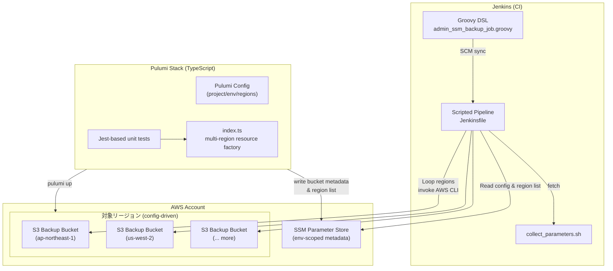

# Issue #391 詳細設計書: SSMバックアップのマルチリージョン対応

## 1. アーキテクチャ設計

### 1.1 システム全体図


### 1.2 コンポーネント間の関係
- **Pulumi**: リージョン配列に基づき AWS Provider を切り替え、S3 バケット＋SSM パラメータをリージョンごとに生成。メタデータ（リージョン一覧、デフォルトリージョン、レガシー互換キー）を SSM に書き込む。
- **Jenkins Pipeline**: SSM からリージョン一覧を読み取り、Scripted Pipeline でリージョンごとのステージを動的生成しつつ逐次バックアップ処理・S3 アップロード・ログ集計を実施。失敗時は即座に後続リージョンをスキップ。
- **collect_parameters.sh**: Jenkins 各ステージからリージョン別に呼び出される共通スクリプト。AWS_REGION 等の環境変数を受け取り、該当リージョンの SSM からパラメータを収集して JSON 化。
- **Groovy DSL**: UI パラメータを変更せず、説明文・スケジューリング・タイムアウトなどのメタ情報だけを調整。

### 1.3 データフロー
1. 運用チームが Pulumi config (`regions`, `defaultRegion`) を更新し、`pulumi up` 実行でターゲットリージョン毎の S3 バケットと `/jenkins/{env}/backup/{region}/s3-bucket-name` パラメータを作成。
2. Pulumi は同時に `/jenkins/{env}/backup/region-list`（JSON 配列）と `/jenkins/{env}/backup/s3-bucket-name`（互換用デフォルトバケット）も更新。
3. Jenkins DSL がスケジュールジョブを定義し、パイプライン起動時に `Initialize` ステージでリージョン一覧を SSM から取得し JSON→List へ変換。
4. Scripted Pipeline のメインループがリージョンごとに `stage("Backup ${region}")` を生成し、各ステージ内で
   - 対象リージョンに切り替えた AWS CLI で SSM を参照しバケット名を取得
   - `collect_parameters.sh` を対象リージョン向けディレクトリで実行
   - DRY_RUN フラグに応じたアップロード（AES256）と最新ポインタ更新を実行し、結果をステージローカルのマップへ格納
5. 全リージョンの結果は `regionSummaries` に蓄積され、`Finalize Report` ステージで `region_summaries.json` として出力した後、post セクションで Slack／メール通知（7.7節）を送信する。失敗時は `error()` で即停止し、失敗リージョンと原因が通知に含まれる。

## 2. 実装戦略: EXTEND

**判断根拠**:
- 既存の Pulumi スタックと Jenkins パイプラインを土台に、多リージョン化のための設定値・ループ処理を追加する拡張作業が主体（FR-1, FR-3）。
- 既存 SSM キーを互換維持しながらリージョン別キーを増やす方針で、新規システムを構築するのではなく現状の IaC/CI を拡張する形となる（FR-2, FR-4）。

## 3. テスト戦略: UNIT_INTEGRATION

**判断根拠**:
- Pulumi 側はリージョン配列→リソース生成ロジックの分岐が増えるため、mocks を用いたユニットテストでリソース数・命名規則・タグを検証する必要がある（FR-1, NFR-保守性）。
- Jenkins パイプラインは多ステージ逐次実行とエラー制御を含むため、jenkinsfile-runner を使った dry-run 統合テストでリージョン別ステージ生成・失敗時の停止挙動を検証する（FR-3, NFR-可用性）。

## 4. テストコード戦略: CREATE_TEST

**判断根拠**:
- `pulumi/jenkins-ssm-backup-s3` には自動テストが存在しないため、Jest ベースの新規テストスイートを作成する必要がある。
- Jenkins パイプラインにも既存テストがないため、jenkinsfile-runner を呼び出す新規スクリプト＋サンプル設定を追加して自動検証を実現する。

## 5. 影響範囲分析
- **Pulumi IaC**: `index.ts` のロジック刷新、Pulumi config ファイル（dev/prod）へのリージョン配列・デフォルトリージョン設定追加、`package.json` のテスト依存追加。
- **Jenkins Pipeline**: `Jenkinsfile` を Declarative から Scripted へ移行し、ステージ再編（Initialize → Config load、Regional loop 化）と失敗制御・ログ整備を追加。
- **Jenkins DSL**: UI パラメータ不変のまま説明文・タイムアウト・ビルド制御パラメータを見直し多リージョン実行時間を許容。
- **スクリプト**: `collect_parameters.sh` でリージョン名をログ出力し、複数回実行時のディレクトリ競合を防ぐ。
- **ドキュメント**: Runbook/README にリージョン追加/削除手順・ロールバック方針および Pulumi config 更新手順を追記。
- **その他**: Jenkins dry-run 用コンテナ利用方法を開発者ガイドに追記（テスト戦略反映）。

## 6. 変更・追加ファイルリスト
| 区分 | ファイル/パス | 目的 |
| ---- | ------------- | ---- |
| 既存修正 | `pulumi/jenkins-ssm-backup-s3/index.ts` | 多リージョン対応ロジック、SSM メタデータ生成、命名規則の抽象化 |
| 既存修正 | `pulumi/jenkins-ssm-backup-s3/Pulumi.dev.yaml`<br>`pulumi/jenkins-ssm-backup-s3/Pulumi.prod.yaml` | `regions`, `defaultRegion` 等の config 追加 |
| 既存修正 | `pulumi/jenkins-ssm-backup-s3/package.json` | テスト実行 (`jest`, `ts-jest`, `@types/jest`) スクリプトの追加 |
| 新規追加 | `pulumi/jenkins-ssm-backup-s3/__tests__/index.test.ts` | Pulumi mocks を用いた多リージョン生成ロジックのユニットテスト |
| 既存修正 | `jenkins/jobs/pipeline/admin/ssm-backup/Jenkinsfile` | リージョン逐次ステージ化、SSM リージョン一覧の読み込み、エラー停止 |
| 既存修正 | `jenkins/jobs/dsl/admin/admin_ssm_backup_job.groovy` | ジョブ説明、タイムアウト、通知周りの調整 |
| 既存修正 | `jenkins/jobs/pipeline/admin/ssm-backup/scripts/collect_parameters.sh` | リージョン別ディレクトリ対応、ログ明確化 |
| 新規追加 | `jenkins/jobs/pipeline/admin/ssm-backup/tests/jenkinsfile_runner.sh` | jenkinsfile-runner を使った dry-run テストスクリプト |
| 新規追加 | `jenkins/jobs/pipeline/admin/ssm-backup/tests/config/regions_sample.json` | テスト用の SSM 疑似レスポンス/入力データ |
| 新規追加 | `scripts/aws_mock.sh` | Jenkins テストで AWS CLI をモックし、リージョン別レスポンスを返すヘルパー |
| 既存修正 | `docs/runbooks/ssm-backup.md` (存在する場合) / `README.md` | リージョン増減・Pulumi config 手順・ロールバック方法の追記 |

## 7. 詳細設計

### 7.1 Pulumi (IaC) 詳細
- **Config インターフェース**  
  ```yaml
  # Pulumi.<stack>.yaml
  config:
    jenkins-ssm-backup-s3:projectName: jenkins-infra
    jenkins-ssm-backup-s3:environment: dev
    jenkins-ssm-backup-s3:regions:
      - ap-northeast-1
      - us-west-2
    jenkins-ssm-backup-s3:defaultRegion: ap-northeast-1
    jenkins-ssm-backup-s3:ssmHomeRegion: ap-northeast-1  # SSM メタデータを書き込む基準リージョン
  ```
- **主要関数設計**
  | 関数/スコープ | 役割 |
  | ------------- | ---- |
  | `createRegionalResources(region: string, provider: aws.Provider, accountId: pulumi.Output<string>)` | バケット・パブリックアクセスブロック・バケットポリシー・リージョン別 SSM パラメータを生成し、`pulumi.Resource` を返す。 |
  | `emitLegacyParameter(defaultRegionBucketName: pulumi.Output<string>)` | 既存キー `/jenkins/{env}/backup/s3-bucket-name` を更新して後方互換を確保。 |
  | `emitRegionMetadata(regions: string[], defaultRegion: string)` | `/jenkins/{env}/backup/region-list`（JSON 文字列）と `/jenkins/{env}/backup/default-region` を `ssmHomeRegion` で生成。 |
- **命名規則／タグ**  
  `bucketName = ${projectName}-ssm-backup-${environment}-${accountId}-${region}`  
  タグ: `Environment`, `ManagedBy=Pulumi`, `Region`, `Purpose=SSM Parameter Store Backup`, `DataClassification=Confidential`.  
  バケットリソース名: `ssm-backup-bucket-${region}`（Pulumi logical nameにリージョンを含め Terraform 差分衝突を防止）。
- **プロバイダー管理**  
  `const provider = new aws.Provider(\`region-${region}\`, { region });` を生成し、各リージョンの S3 リソースは該当プロバイダーにバインド。SSM パラメータは `provider: defaultProvider` または `ssmHomeRegion`.
- **非同期処理**  
  `aws.getCallerIdentity()` の `Output` を `pulumi.all` で束ね、リージョンループ内で `apply` を用いて命名文字列を構築。
- **エクスポート**  
  `export const bucketMap = pulumi.output(regions.reduce(...))` で `{ region: bucketName }` マップを出力し、CI/Runbook から参照可能にする。

### 7.2 Jenkins Pipeline 詳細
- **パイプライン方式**
  - Jenkinsfile を Scripted Pipeline へ切り替え、`node('ssm-backup') { ... }` ブロックでステージを定義する。これによりリージョン配列に基づき `stage("Backup ${region}")` を Groovy ループで逐次生成でき、Declarative のステージネスト制約を回避。
  - Jenkinsfile 内に共通関数（例: `loadRegionContext(region)`、`runBackupForRegion(ctx)`）を定義し、AWS CLI 呼び出しやエラーハンドリングを集約する。
- **グローバル変数**
  - `def regionList = []` と `def regionSummaries = [:]` を `node` ブロック直下で初期化し、リージョン一覧とリージョン別結果を管理。`regionSummaries` には `{status, parameterCount, artifactPath, failureMessage}` を格納。
  - 既存の `env.SSM_HOME_REGION`, `env.WORK_DIR`, `env.DATA_DIR`, `env.DRY_RUN` は `withEnv` で引き継ぎ、リージョン処理時に `REGION_DATA_DIR = "${env.DATA_DIR}/${region}"` を付与。
- **リージョンコンテキスト取得**
  - `loadRegionContext(region)` で `/jenkins/${env}/backup/${region}/s3-bucket-name` を `aws ssm get-parameter` から取得し、リージョン固有の作業ディレクトリ (`${env.DATA_DIR}/${region}`) を初期化。存在しない場合は `error("Bucket definition missing for ${region}")`。
  - `runBackupForRegion(ctx)` が `collect_parameters.sh` を実行し、`results/summary.json` から `parameterCount` を読み取って S3 へアップロードする `.tar.gz` や `latest.txt` のパスを返す。
  - ループ内で `ctx`（リージョン情報）と `result`（実行結果）をマージし、通知／成果物化に必要なキーを整備する。
- **ステージ構成**
  1. `stage('Initialize')`
     - `/jenkins/${env}/backup/region-list` を取得し `readJSON` で配列化。空配列なら `error('No regions configured')` で早期終了。
     - `/jenkins/${env}/backup/default-region` と `/jenkins/${env}/backup/s3-bucket-name` を照合し後方互換を確認。
     - `currentBuild.description` に `Regions=[...], Default=...` を記録し、post 通知向けに `env.REGION_LIST = regionList.join(',')` を設定。
  2. `stage('Prepare Scripts')`
     - リポジトリ checkout、`collect_parameters.sh` の実行権限付与、jenkinsfile-runner テスト資材の配置確認を実施。
  3. `for (region in regionList) { stage("Backup ${region}") { ... } }`
     - `withEnv(["TARGET_REGION=${region}", "AWS_REGION=${region}", "REGION_DATA_DIR=${env.DATA_DIR}/${region}"])` で環境を切り替え。
     - `def ctx = loadRegionContext(region)` で対象情報を取得し、`def result = runBackupForRegion(ctx)` を実行。DRY_RUN 時は `result.archivePath` を生成せず `echo "[DRY RUN] Skipped upload for ${region}"` のみ出力。
     - 正常終了時は `regionSummaries[region] = [status: 'SUCCESS', parameterCount: result.parameterCount, artifactPath: result.archivePath]` をセット。
     - 例外発生時は `regionSummaries[region] = [status: 'FAILED', failureMessage: err.getMessage()]` とし、`error(err.message)` でパイプラインを停止。
  4. `stage('Finalize Report')`
     - `writeJSON file: 'region_summaries.json', json: regionSummaries` と `archiveArtifacts artifacts: 'region_summaries.json'` を実施。
     - Runbook で参照するための最新成果物パスを `env.REGION_SUMMARY_PATH` に設定。
- **エラー制御**
  - Scripted Pipeline の `try/catch` でリージョン単位の例外を補足し、`regionSummaries` に失敗理由を残したうえで `error()` を再送する。
  - 逐次ループのため、失敗リージョン以降のステージは生成されない。リトライ時には Jenkins の `Replay` 機能でリージョン増減を確認可能。
- **メトリクス／ログ**
  - `collect_parameters.sh` は `summary.json` に `{"parameterCount": 123, "executionTimeSec": 45}` を出力し、パイプラインが `readJSON` で読み込む。
  - `currentBuild.description` と `region_summaries.json` を post セクションの Slack/Mail 通知テンプレートに渡し、リージョン別結果を通知。

### 7.3 Jenkins DSL (`admin_ssm_backup_job.groovy`)
- 説明文を「複数リージョンへ順次バックアップ」に更新し、期待実行時間やロールバック手順の参照先 (Runbook) を記載。
- `throttleConcurrentBuilds { maxTotal(1) }` は維持しつつ、`pipelineTriggers` タイムゾーンコメントを多リージョン対応に合わせて更新。
- `timeout`/`options` は Pipeline 内で 1 時間→リージョン数×10分 + α を許容できるよう `options { timeout(time: 90, unit: 'MINUTES') }` へ延長。DSL 側の説明にも反映。

### 7.4 `collect_parameters.sh`
- `DATA_DIR` を事前クリアする処理をオプション化し、リージョンごとにサブディレクトリを受け取って上書きを防止。Pipeline 側で `DATA_DIR=${WORK_DIR}/data/${TARGET_REGION}` を渡す。
- ログに `Target Region` を追加しジョブログ上でリージョンを識別可能にする。
- 連続実行時に `parameter_names.txt` 等がリージョンごとに保存されるため、`rm -f ${DATA_DIR}/*` を追加。

### 7.5 テスト設計詳細
- **Pulumi (Jest)**  
  - `beforeAll` で `pulumi.runtime.setMocks` を設定し、`regions = ["ap-northeast-1", "us-west-2"]` を与えて `require("../index")`。  
  - 期待事項:  
    - バケットがリージョン数分作成され Logical name/タグが正しい。  
    - `/backup/{region}/s3-bucket-name` SSM が各リージョンに存在。  
    - レガシーキー `/backup/s3-bucket-name` が defaultRegion のバケット名と一致。  
    - `bucketMap` エクスポートが全リージョンを包含。
- **Jenkins (jenkinsfile-runner)**  
  - `tests/jenkinsfile_runner.sh` で Docker イメージ `ghcr.io/jenkinsci/jenkinsfile-runner:latest` を起動。  
  - 事前に `AWS_REGION_LIST_JSON` などの env をモックし、`aws` CLI 呼び出しを `scripts/aws_mock.sh`（必要に応じ新規追加）で代替。  
  - 検証点:  
    - Scripted Pipeline がリージョン配列から `stage("Backup ${region}")` を順次生成する。  
    - `region_summaries.json` にリージョン別 `status` と `parameterCount` が記録される。  
    - 2 番目のリージョンで `error` を発生させた際に処理が停止し、`regionSummaries` に失敗理由が入る。
- **Manual テスト**  
  - `pulumi preview` で各リージョンの差分を確認。  
  - Jenkins 実行ログで `Backup us-west-2` ステージが 10 分以内に完了することを確認。  
  - us-west-2 の S3 に `latest.txt` が更新されているか spot-check。  
  - Slack 通知およびメール配信でリージョン別結果が配信されることを運用チャンネルで確認。

### 7.6 トレーサビリティ
| 要件ID | 設計上の対応箇所 |
| ------ | ---------------- |
| FR-1 | Pulumi 多リージョンリソース生成（7.1） |
| FR-2 | レガシー SSM キー維持と defaultRegion メタデータ（7.1, Jenkins Initialize） |
| FR-3 | Jenkins Regional orchestrator ステージ設計（7.2） |
| FR-4 | DSL UI パラメータ不変・説明更新（7.3） |
| FR-5 | 通知計画と運用責務整理（7.7, 9, 10 節） |

### 7.7 通知計画 (FR-5)
- **対象者**  
  - Jenkins ジョブ実行者（運用チーム当番・オンコール SRE）  
  - CLI 経由でバックアップ結果を参照する開発チーム  
- **チャネル**  
  - Slack `#infra-backup-alerts`: Jenkins post セクションから `slackSend` で成功/失敗を通知。本文には `region_summaries.json` の要約（成功・失敗リージョン、件数、duration）と Runbook リンクを含める。  
  - メール `ops-alerts@example.com`: `emailext` で日次ジョブ成功時にリージョン別サマリを送付。失敗時は件名に `[FAIL]` を付与し、オンコール SRE を CC。  
- **タイミング**  
  - パイプライン `post { success { ... } failure { ... } aborted { ... } }` で即時通知。  
  - Pulumi config でリージョンを増減した際は同日の業務時間内に Slack `#infra-announcements` へ計画通知（運用担当が手動で投稿）。  
  - 障害発生時は Runbook に従い 30 分以内に状況報告、復旧後 1 営業日以内に事後報告。  
- **責任者**  
  - ジョブオーナー: インフラチームリード（Jenkins folder owner）  
  - オンコール SRE: 通知を受領し Runbook 手順でリカバリーを実施。  
  - Pulumi オペレーター: config 変更時の事前通知・ロールバック判断を担当。  
- **テスト/検証**  
  - jenkinsfile-runner dry-run 時に Slack Webhook 先をダミー URL (`http://localhost:18080/slack`) に切り替え、`tests/jenkinsfile_runner.sh` で起動する簡易 HTTP サーバ（`python -m http.server 18080`）で受信したペイロードを `tests/output/slack_payload.json` に保存しリージョン要約が含まれることを確認。  
  - 本番導入前にステージングジョブで成功/失敗ケースを実行し、Slack/メール双方で想定文面を確認する。  
- **Runbook 更新**  
  - 通知チャネルと責任者、ロールバック時の連絡テンプレートを `docs/runbooks/ssm-backup.md` に追記。  
  - CLI 利用者向け FAQ に「どのタイミングで通知が届くか」「障害報告をどこで確認するか」を追加。

## 8. セキュリティ考慮事項
- **認証・認可**: Pulumi/Jenkins は既存 IAM ロールを継続利用。リージョン追加時に該当リージョンへの S3/SSM 権限があることを事前検証。jenkinsfile-runner テストでは資格情報をモックし、実際の AWS 認証情報を使用しない。
- **データ保護**: すべての S3 バケットに SSE-S3 (`AES256`) を強制し、バケットポリシーで未暗号化アップロードを拒否。Public Access Block を全リージョンで有効化。SSM パラメータは `SecureString` を維持（bucket 名は `String` で問題ないが、将来的に暗号化情報を扱う場合のテンプレートを整備）。
- **監査ログ**: Region ごとのバックアップ成功/失敗を Jenkins ログに記録し、後日 CloudTrail/S3 Access Log と突合できるようログフォーマットを標準化。Runbook にアラート発報手順を追記。

## 9. 非機能要件への対応
- **パフォーマンス**: ステージ毎のタイムアウトを 10 分に設定し、リージョン数に応じた合計を Scripted Pipeline のトップレベル `timeout(time: regionList.size()*10 + 30, unit: 'MINUTES')` でガード。AWS CLI のリトライは現行スクリプトの指数バックオフを再利用。
- **スケーラビリティ**: Pulumi config のリージョン配列を変更するだけで対応リージョンを増減可能。Jenkins は動的ステージ生成によりコード変更なくリスト変化に追随。
- **保守性**: Pulumi テストと Jenkins dry-run を CI へ組み込み、リージョン追加の回帰を早期検知。`bucketMap` エクスポートにより運用チームが CLI で状況確認しやすくする。
- **可用性**: 失敗時に早期停止し、post セクションで失敗リージョンを明示。Runbook にはロールバック手順と再実行ガイドを追記。

## 10. 実装の順序
1. **Pulumi Config/コード修正**: `index.ts` を多リージョン化し、config ファイルとテスト依存を更新。
2. **Pulumi ユニットテスト作成**: Jest セットアップと mocks を実装し、`npm test` で緑に。
3. **Jenkins Pipeline リファクタ**: `Jenkinsfile` を Scripted Pipeline へ移行し、ヘルパーメソッド／リージョンループを実装して jenkinsfile-runner dry-run で検証。
4. **collect_parameters.sh 調整**: リージョン別ディレクトリ／ログの拡充を反映。
5. **Jenkins DSL 更新**: 説明・タイムアウト・ドキュメントリンクの修正。
6. **jenkinsfile-runner テスト追加**: テストスクリプト整備とドキュメント化。
7. **Runbook/README 更新**: リージョン増減・Pulumi config 変更手順、ロールバック手順を明文化。
8. **統合テスト**: Pulumi preview、jenkinsfile-runner dry-run、本番想定リージョンのスポットテスト。

---

### 品質ゲート確認
- ✅ 実装戦略 (EXTEND) と判断根拠を明記
- ✅ テスト戦略 (UNIT_INTEGRATION) の判断根拠を明記
- ✅ 既存コードへの影響範囲を分析
- ✅ 必要な変更ファイルをリストアップ
- ✅ 実装手順と詳細設計で実現可能性を担保
