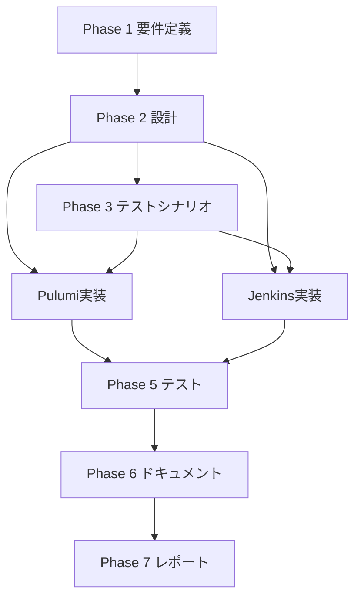
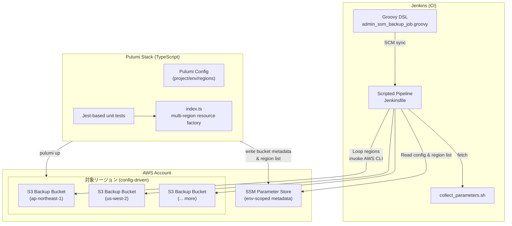

# Codex Agent 実行ログ

開始日時: 2025/10/15 12:48:41

---

## Turn 1: スレッド開始

**Thread ID**: `0199e7ea-637d-7b70-b2b2-c8baca7b344e`

## Turn 2: ツール実行

**種別**: コマンド実行
**コマンド**: `bash -lc 'cd /tmp/jenkins-785de167/workspace/AI_Workflow/ai_workflow_orchestrator && ls'`
**ステータス**: completed (exit_code=0)

```text
ARCHITECTURE.md
CLAUDE.md
CONTRIBUTION.md
LICENSE
README.md
ansible
bootstrap
jenkins
pulumi
run_tests_issue_322.sh
scripts
```

## Turn 3: ツール実行

**種別**: コマンド実行
**コマンド**: `bash -lc 'cd /tmp/jenkins-785de167/workspace/AI_Workflow/ai_workflow_orchestrator && ls .ai-workflow/issue-391'`
**ステータス**: completed (exit_code=0)

```text
00_planning
01_requirements
02_design
03_test_scenario
metadata.json
```

## Turn 4: ツール実行

**種別**: コマンド実行
**コマンド**: `bash -lc 'cd /tmp/jenkins-785de167/workspace/AI_Workflow/ai_workflow_orchestrator && cat .ai-workflow/issue-391/00_planning/output/planning.md'`
**ステータス**: completed (exit_code=0)

```text
# Issue #391 プロジェクト計画書

## 1. Issue分析
- **複雑度**: 複雑（PulumiスタックとJenkinsパイプライン双方を多リージョン化し、IaC・CIの同時変更が必要で影響範囲が広い）
- **見積もり工数**: 27時間（Pulumi設計/実装 10h、パイプライン改修 8h、要件定義・テスト設計/実行・ドキュメント整備 9h の想定）
- **リスク評価**: 中（複数リージョンでの権限・S3命名整合性と既存運用影響に注意が必要だが、既存技術スタック内で制御可能）

## 2. 実装戦略判断
- **実装戦略: EXTEND**
  - 既存のPulumiスタックとJenkinsパイプラインを土台に、リージョンごとにリソースとステージを増やす機能追加が中心で、新規サブシステム導入は不要。
- **テスト戦略: UNIT_INTEGRATION**
  - Pulumiはスタック単位のユニットテストでリージョン配列からのバケット生成とSSMパラメータ書き込みを検証し、Jenkinsはdry-run/jenkinsfile-runnerで多リージョン連続実行フローを統合テストする。
- **テストコード戦略: CREATE_TEST**
  - 現行スタックに自動テストがないため、Pulumi向けの新規テスト（`@pulumi/pulumi` のmocksを利用）とJenkinsfile検証スクリプト（jenkinsfile-runnerベース）の新規作成が必要。

## 3. 影響範囲分析
- **既存コードへの影響**
  - `pulumi/jenkins-ssm-backup-s3/index.ts`: リージョン配列を処理し、各リージョンに`aws.Provider`を切り替えてバケットとSSMパラメータを動的に作成するロジックへの拡張。
  - `pulumi/jenkins-ssm-backup-s3/Pulumi.{dev,prod}.yaml`: スタック設定にバックアップ対象リージョン一覧とデフォルトリージョンを追加。
  - `jenkins/jobs/pipeline/admin/ssm-backup/Jenkinsfile`: ステージをリージョン単位で直列実行させ、各リージョンでPulumiが書き込むパラメータに従いバケットを参照する実装変更。
  - `jenkins/jobs/pipeline/admin/ssm-backup/scripts/collect_parameters.sh`: 多リージョンループ時の環境変数受け渡しとログ粒度向上のための微調整。
  - `jenkins/jobs/dsl/admin/admin_ssm_backup_job.groovy`: 多リージョン化後の説明文・タイムアウト/スロットル設定の見直し（パラメータ構成自体は現状維持）。
  - `docs/runbooks` もしくは `README.md`: リージョン追加手順・ロールバック手順の追記。
- **依存関係の変更**
  - ランタイム依存追加は想定なし。開発時テスト用に `jenkinsfile-runner` Dockerイメージの利用を追加（開発ドキュメントに記載）。
- **マイグレーション要否**
  - Pulumi config値の追加と既存SSMパラメータ`/jenkins/{env}/backup/s3-bucket-name`の互換確保（デフォルトリージョン値を維持しつつ、新規で`/jenkins/{env}/backup/{region}/s3-bucket-name`を発行）。
  - Jenkins実行ログの保存ポリシーとタイムアウトをリージョン数に合わせて更新。

## 4. タスク分割
### Phase 1: 要件定義 (見積もり: 4h)
- 2h: 対応リージョン候補と優先順を運用チームと確認（Done: 合意済みリージョン一覧と増減判断基準が文書化）
- 2h: バックアップ保持/リストア要件と既存CLI利用者の通知チャネル整理（Done: 通知対象とコミュニケーション計画を記載したメモ作成）

### Phase 2: 設計 (見積もり: 5h)
- 2h: Pulumiでのmulti-regionリソース設計（Provider切替・ネーミングルール定義）（Done: 設計メモにリソース命名/タグ/SSMキー方針を記載）
- 2h: Jenkinsパイプラインのリージョン逐次実行/失敗ハンドリング設計（Done: ステージ構成図と並列/直列判断理由がまとめられている）
- 1h: テストアプローチとロールバック手順のレビュー（Done: テストマトリクスとロールバック手順草案が承認）

### Phase 3: テストシナリオ (見積もり: 3h)
- 2h: 新旧リージョン構成でのバックアップ/リストア検証シナリオ作成（Done: テストケース一覧に成功/失敗パスが列挙）
- 1h: ログ検証・アラート確認手順の整備（Done: CloudWatch/S3/Slack確認手順がRunbook草案に反映）

### Phase 4: 実装 (見積もり: 8h)
- 2h: Pulumi configとスタックコードのmulti-region対応実装（Done: Pulumiスタックでリージョン毎のバケット/SSMが作成される）
- 2h: 旧SSMパラメータ互換レイヤーとデフォルトリージョン出力実装（Done: 既存パイプラインで互換確認済み）
- 2h: Jenkinsfileをリージョンループ/ステージ分割に改修し、失敗時の早期停止と通知を追加（Done: Declarative Linter通過とローカルdry-run成功）
- 2h: Groovy DSLと収集スクリプトの微修正（Done: DSL説明更新とスクリプトでリージョン_LOGを出力）

### Phase 5: テスト (見積もり: 3h)
- 1h: Pulumiユニットテスト実装・実行（Done: `npm test`でmulti-region生成テストが通過）
- 1h: Pulumi previewで各リージョンの差分を確認（Done: 主要リージョンで`pulumi preview`結果を保存）
- 1h: Jenkinsfile-runnerを用いたdry-runとus-west-2含むサンプルログ確認（Done: dry-runログとS3アップロードシミュレーション結果を記録）

### Phase 6: ドキュメント (見積もり: 2h)
- 1h: Runbook/READMEにリージョン追加・削除・ロールバック手順を追記（Done: PR内でレビュー済み）
- 1h: Pulumi config変更点と新SSMキー説明をドキュメント化（Done: Config例と設定手順が記載）

### Phase 7: レポート (見積もり: 2h)
- 1h: Issueコメントで実装概要・テスト結果・残課題を整理（Done: Issue #391に報告コメント投稿）
- 1h: 運用チーム向けリリースブリーフィング資料作成と合意取得（Done: 合意メール/コメントが記録されている）

## 5. 依存関係


## 6. リスクと軽減策
#### リスク1: リージョンごとのS3バケット命名衝突
- **影響度**: 高
- **確率**: 中
- **軽減策**: PulumiでアカウントID+リージョン+環境を必ず含める命名テンプレートとし、`pulumi preview`結果をレビュー。

#### リスク2: 既存ジョブが新SSMパラメータ構造に追随できない
- **影響度**: 中
- **確率**: 中
- **軽減策**: 旧キーを互換的に維持し、リリース前に本番ジョブのdry-runとロールバックスクリプトを用意。

#### リスク3: Jenkins multi-region実行でタイムアウトやスロットルが発生
- **影響度**: 中
- **確率**: 中
- **軽減策**: ステージ毎のタイムアウトを調整し、AWS CLIリトライ設定とリージョン順序の見直し、Slackアラートを拡張。

#### リスク4: 運用チームへの情報伝達不足による対応遅延
- **影響度**: 中
- **確率**: 低
- **軽減策**: 通知計画をPhase1で確定し、リリース前にFAQとRunbookを共有して合意取得。

## 7. 品質ゲート
#### Phase 1: 要件定義
- [ ] バックアップ対象リージョン一覧と増減判断基準が承認済み
- [ ] CLI/
... (truncated)
```

## Turn 5: ツール実行

**種別**: コマンド実行
**コマンド**: `bash -lc 'cd /tmp/jenkins-785de167/workspace/AI_Workflow/ai_workflow_orchestrator && cat .ai-workflow/issue-391/01_requirements/output/requirements.md'`
**ステータス**: completed (exit_code=0)

```text
# Issue #391 要件定義書：SSMバックアップのマルチリージョン対応

## 0. Planning Documentの確認
- **開発方針**: 実装戦略は既存PulumiスタックとJenkinsパイプラインを拡張する「EXTEND」。大規模な新規コンポーネント追加は不要で、既存資産を多リージョン対応へ拡張する前提。
- **テスト戦略**: Pulumiはmocksを用いたユニットテストと`pulumi preview`での差分確認、Jenkinsはjenkinsfile-runnerによるdry-run統合テストを実施する。テストコードは新規作成が必須。
- **リスクと対策**: S3バケット命名衝突、SSMパラメータ互換性、Jenkins実行時間増加、運用チームへの周知不足が主要リスク。命名規則の明文化、互換レイヤー維持、タイムアウト調整、通知計画策定が軽減策。
- **スケジュール**: 要件定義～レポートまで7フェーズ計27hを想定。Phase 1完了条件としてリージョン一覧と通知方針の承認が求められる。

## 1. 概要
AWS Systems Manager (SSM) パラメータのバックアップ機構を単一リージョン実行から、指定された複数リージョンへ拡張する。PulumiでリージョンごとのS3バケットとSSMパラメータを生成し、Jenkinsパイプラインで各リージョンのバックアップを順次取得する構成へ再設計する。これにより、災害対策や運用柔軟性を向上させ、バックアップの冗長性と信頼性を高めることがビジネス価値であり、IaCとCIの一貫性を保ったまま多リージョン化できる点が技術的価値である。

## 2. 機能要件
| ID | 要件 | 要件詳細 | 優先度 |
| --- | --- | --- | --- |
| FR-1 | Pulumi多リージョンS3管理 | Pulumiスタックが設定されたリージョン配列を受け取り、各リージョン専用のS3バケットと関連SSMパラメータを生成・管理する。命名はアカウントID・環境・リージョンを含むテンプレートに従う。 | 高 |
| FR-2 | SSMパラメータ互換性 | 新規に`/jenkins/{env}/backup/{region}/s3-bucket-name`形式のSSMキーを出力しつつ、既存のデフォルトキー(`/jenkins/{env}/backup/s3-bucket-name`)も最新リージョンを指すよう維持する。 | 高 |
| FR-3 | Jenkins多リージョン実行 | `jenkins/jobs/pipeline/admin/ssm-backup/Jenkinsfile`がリージョン単位のステージに分割され、定義済みリージョンを直列実行し各ステージでバックアップを取得する。ステージ境界で失敗時は後続リージョンを停止する。 | 高 |
| FR-4 | Jenkins DSL互換運用 | `jenkins/jobs/dsl/admin/admin_ssm_backup_job.groovy`のパラメータ構成を変更せず、リージョン選択をUIに追加しない。多リージョン対応の説明・タイムアウト調整はDSLで管理する。 | 中 |
| FR-5 | 利用者通知計画 | CLI利用者およびJenkinsジョブ利用者に対し、リリース前に変更内容・影響・ロールバック手順を通知する計画を作成し、運用チーム合意を得る。 | 中 |

## 3. 非機能要件
- **パフォーマンス**: Jenkinsパイプライン全体の実行時間は許容タイムアウト内（現行基準＋リージョン数×バックアップ時間、上限60分）に収まるよう調整する。ステージ毎に最大10分のタイムアウト設定を行い、AWS CLIリトライを有効化する。
- **セキュリティ**: 生成するS3バケットはサーバーサイド暗号化（SSE-S3またはKMS）を必須とし、Pulumiでブロックパブリックアクセスを有効化する。SSMパラメータは`SecureString`を維持する。
- **可用性・信頼性**: バックアップは少なくとも1日1回のジョブ成功が保証されるよう監視し、失敗時はSlackアラートにより一次連絡が行われる。リージョン追加・削除時のロールバック手順をRunbookに明記する。
- **保守性・拡張性**: 対応リージョンはPulumi configで設定可能とし、コード変更なく増減できる。PulumiユニットテストとJenkins dry-runテストをCIに統合し、将来のリージョン追加時の回帰リスクを低減する。

## 4. 制約事項
- **技術的制約**: インフラ定義はPulumi(TypeScript)、CIはJenkins Declarative PipelineとGroovy DSLを継続利用する。AWSアカウントおよび既存Jenkinsインフラに依存するため他ツールへの移行は対象外。
- **リソース制約**: 推定工数27時間、担当リソースは既存IaC/CIチーム内で賄う。追加予算なし。
- **ポリシー制約**: プロジェクトの命名規約、タグ付与ポリシー、セキュリティ標準（S3暗号化必須、最小権限IAM）に従う。コードレビューとテスト結果提出がリリース条件。

## 5. 前提条件
- Pulumiスタックで使用するAWSクレデンシャルはマルチリージョン操作権限を持ち、対象リージョンは運用チームと合意済み（例：`us-east-1`, `us-west-2`, `ap-northeast-1`）。
- Jenkins実行環境はAWS CLIおよび必要なPulumiバージョンをインストール済みで、追加リージョンへのアクセスが許可されている。
- 既存バックアップジョブのスケジュール、通知先（Slack/Email）、Runbookは現行通り利用可能であり、今回の変更に合わせて改訂できる。

## 6. 受け入れ基準
- **FR-1**  
  - Given Pulumi configに複数リージョンが設定されている  
  - When `pulumi preview`または`pulumi up`を実行する  
  - Then 各リージョンに命名規則に沿ったS3バケットと関連SSMパラメータが作成されることが確認できる。
- **FR-2**  
  - Given `pulumi up`実行後にSSMパラメータストアを確認する  
  - When `/jenkins/{env}/backup/{region}/s3-bucket-name`を取得する  
  - Then 対象リージョンのバケット名が取得でき、既存キー`/jenkins/{env}/backup/s3-bucket-name`も最新デフォルトリージョンの値を返す。
- **FR-3**  
  - Given Jenkinsfileに定義されたリージョンリストが3件ある  
  - When パイプラインを実行する  
  - Then ステージがリージョン順に直列実行され、いずれかのステージが失敗した場合は後続ステージがスキップされ通知が行われる。
- **FR-4**  
  - Given Jenkinsジョブのパラメータ画面を表示する  
  - When 多リージョン対応版のDSLがデプロイされている  
  - Then 既存パラメータ項目は名称・型ともに変更されておらず、新たなリージョン選択項目が追加されていない。
- **FR-5**  
  - Given リリース1週間前の運用準備ミーティング  
  - When 通知計画ドキュメントをレビューする  
  - Then CLI/Jenkins利用者への連絡チャネル・タイミング・ロールバック連絡手順が明記され、運用チームから承認を得た記録が残っている。

## 7. スコープ外
- バックアップ対象データの種類拡張（SSM以外のサービスバックアップ）は対象外。
- Jenkins以外のCI/CDツールへの移行や併用は行わない。
- 完全並列実行やイベントドリブン化など多リージョン以外の高度なオーケストレーションは本フェーズのスコープ外。将来的な改善候補として検討する。
```

## Turn 6: ツール実行

**種別**: コマンド実行
**コマンド**: `bash -lc 'cd /tmp/jenkins-785de167/workspace/AI_Workflow/ai_workflow_orchestrator && cat .ai-workflow/issue-391/02_design/output/design.md'`
**ステータス**: completed (exit_code=0)

```text
# Issue #391 詳細設計書: SSMバックアップのマルチリージョン対応

## 1. アーキテクチャ設計

### 1.1 システム全体図


### 1.2 コンポーネント間の関係
- **Pulumi**: リージョン配列に基づき AWS Provider を切り替え、S3 バケット＋SSM パラメータをリージョンごとに生成。メタデータ（リージョン一覧、デフォルトリージョン、レガシー互換キー）を SSM に書き込む。
- **Jenkins Pipeline**: SSM からリージョン一覧を読み取り、Scripted Pipeline でリージョンごとのステージを動的生成しつつ逐次バックアップ処理・S3 アップロード・ログ集計を実施。失敗時は即座に後続リージョンをスキップ。
- **collect_parameters.sh**: Jenkins 各ステージからリージョン別に呼び出される共通スクリプト。AWS_REGION 等の環境変数を受け取り、該当リージョンの SSM からパラメータを収集して JSON 化。
- **Groovy DSL**: UI パラメータを変更せず、説明文・スケジューリング・タイムアウトなどのメタ情報だけを調整。

### 1.3 データフロー
1. 運用チームが Pulumi config (`regions`, `defaultRegion`) を更新し、`pulumi up` 実行でターゲットリージョン毎の S3 バケットと `/jenkins/{env}/backup/{region}/s3-bucket-name` パラメータを作成。
2. Pulumi は同時に `/jenkins/{env}/backup/region-list`（JSON 配列）と `/jenkins/{env}/backup/s3-bucket-name`（互換用デフォルトバケット）も更新。
3. Jenkins DSL がスケジュールジョブを定義し、パイプライン起動時に `Initialize` ステージでリージョン一覧を SSM から取得し JSON→List へ変換。
4. Scripted Pipeline のメインループがリージョンごとに `stage("Backup ${region}")` を生成し、各ステージ内で
   - 対象リージョンに切り替えた AWS CLI で SSM を参照しバケット名を取得
   - `collect_parameters.sh` を対象リージョン向けディレクトリで実行
   - DRY_RUN フラグに応じたアップロード（AES256）と最新ポインタ更新を実行し、結果をステージローカルのマップへ格納
5. 全リージョンの結果は `regionSummaries` に蓄積され、`Finalize Report` ステージで `region_summaries.json` として出力した後、post セクションで Slack／メール通知（7.7節）を送信する。失敗時は `error()` で即停止し、失敗リージョンと原因が通知に含まれる。

## 2. 実装戦略: EXTEND

**判断根拠**:
- 既存の Pulumi スタックと Jenkins パイプラインを土台に、多リージョン化のための設定値・ループ処理を追加する拡張作業が主体（FR-1, FR-3）。
- 既存 SSM キーを互換維持しながらリージョン別キーを増やす方針で、新規システムを構築するのではなく現状の IaC/CI を拡張する形となる（FR-2, FR-4）。

## 3. テスト戦略: UNIT_INTEGRATION

**判断根拠**:
- Pulumi 側はリージョン配列→リソース生成ロジックの分岐が増えるため、mocks を用いたユニットテストでリソース数・命名規則・タグを検証する必要がある（FR-1, NFR-保守性）。
- Jenkins パイプラインは多ステージ逐次実行とエラー制御を含むため、jenkinsfile-runner を使った dry-run 統合テストでリージョン別ステージ生成・失敗時の停止挙動を検証する（FR-3, NFR-可用性）。

## 4. テストコード戦略: CREATE_TEST

**判断根拠**:
- `pulumi/jenkins-ssm-backup-s3` には自動テストが存在しないため、Jest ベースの新規テストスイートを作成する必要がある。
- Jenkins パイプラインにも既存テストがないため、jenkinsfile-runner を呼び出す新規スクリプト＋サンプル設定を追加して自動検証を実現する。

## 5. 影響範囲分析
- **Pulumi IaC**: `index.ts` のロジック刷新、Pulumi config ファイル（dev/prod）へのリージョン配列・デフォルトリージョン設定追加、`package.json` のテスト依存追加。
- **Jenkins Pipeline**: `Jenkinsfile` を Declarative から Scripted へ移行し、ステージ再編（Initialize → Config load、Regional loop 化）と失敗制御・ログ整備を追加。
- **Jenkins DSL**: UI パラメータ不変のまま説明文・タイムアウト・ビルド制御パラメータを見直し多リージョン実行時間を許容。
- **スクリプト**: `collect_parameters.sh` でリージョン名をログ出力し、複数回実行時のディレクトリ競合を防ぐ。
- **ドキュメント**: Runbook/README にリージョン追加/削除手順・ロールバック方針および Pulumi config 更新手順を追記。
- **その他**: Jenkins dry-run 用コンテナ利用方法を開発者ガイドに追記（テスト戦略反映）。

## 6. 変更・追加ファイルリスト
| 区分 | ファイル/パス | 目的 |
| ---- | ------------- | ---- |
| 既存修正 | `pulumi/jenkins-ssm-backup-s3/index.ts` | 多リージョン対応ロジック、SSM メタデータ生成、命名規則の抽象化 |
| 既存修正 | `pulumi/jenkins-ssm-backup-s3/Pulumi.dev.yaml`<br>`pulumi/jenkins-ssm-backup-s3/Pulumi.prod.yaml` | `regions`, `defaultRegion` 等の config 追加 |
| 既存修正 | `pulumi/jenkins-ssm-backup-s3/package.json` | テスト実行 (`jest`, `ts-jest`, `@
... (truncated)
```

## Turn 7: ツール実行

**種別**: コマンド実行
**コマンド**: `bash -lc "cd /tmp/jenkins-785de167/workspace/AI_Workflow/ai_workflow_orchestrator && sed -n '1,160p' pulumi/jenkins-ssm-backup-s3/index.ts"`
**ステータス**: completed (exit_code=0)

```text
import * as pulumi from "@pulumi/pulumi";
import * as aws from "@pulumi/aws";

// 設定値の取得
const config = new pulumi.Config();
const projectName = config.require("projectName");
const environment = config.require("environment");

// AWSアカウント情報とリージョンを取得
const accountId = aws.getCallerIdentity().then(identity => identity.accountId);
const region = aws.config.region || "ap-northeast-1";

// S3バケット名の生成（アカウント番号とリージョンを含めて一意性を確保）
const bucketName = pulumi.interpolate`${projectName}-ssm-backup-${environment}-${accountId}-${region}`;

// SSMパラメータバックアップ用S3バケット
const backupBucket = new aws.s3.Bucket("ssm-backup-bucket", {
    bucket: bucketName,
    versioning: {
        enabled: true,
    },
    serverSideEncryptionConfiguration: {
        rule: {
            applyServerSideEncryptionByDefault: {
                sseAlgorithm: "AES256",
            },
            bucketKeyEnabled: true,  // S3 Bucket Keysを有効化（暗号化コストを削減）
        },
    },
    lifecycleRules: [{
        id: "delete-old-backups",
        enabled: true,
        expiration: {
            days: 30,  // 30日間保持
        },
        noncurrentVersionExpiration: {
            days: 7,  // 非現行バージョンは7日間保持
        },
    }],
    objectLockEnabled: false,  // 必要に応じてObject Lockを有効化可能
    tags: {
        Name: bucketName,
        Environment: environment,
        Purpose: "SSM Parameter Store Backup Storage",
        ManagedBy: "Pulumi",
        DataClassification: "Confidential",  // データ分類を明示
    },
});

// バケットのパブリックアクセスブロック設定
const bucketPublicAccessBlock = new aws.s3.BucketPublicAccessBlock("ssm-backup-bucket-pab", {
    bucket: backupBucket.id,
    blockPublicAcls: true,
    blockPublicPolicy: true,
    ignorePublicAcls: true,
    restrictPublicBuckets: true,
});

// バケットポリシー：HTTPS通信の強制とIP制限（オプション）
const bucketPolicy = new aws.s3.BucketPolicy("ssm-backup-bucket-policy", {
    bucket: backupBucket.id,
    policy: pulumi.all([backupBucket.arn]).apply(([bucketArn]) => JSON.stringify({
        Version: "2012-10-17",
        Statement: [
            {
                Sid: "DenyInsecureConnections",
                Effect: "Deny",
                Principal: "*",
                Action: "s3:*",
                Resource: [
                    bucketArn,
                    `${bucketArn}/*`,
                ],
                Condition: {
                    Bool: {
                        "aws:SecureTransport": "false"
                    }
                }
            },
            {
                Sid: "DenyUnencryptedObjectUploads",
                Effect: "Deny",
                Principal: "*",
                Action: "s3:PutObject",
                Resource: `${bucketArn}/*`,
                Condition: {
                    StringNotEquals: {
                        "s3:x-amz-server-side-encryption": "AES256"
                    }
                }
            }
        ]
    })),
});

// SSMパラメータストアにバケット名を保存
const ssmBackupBucketName = new aws.ssm.Parameter("ssm-backup-bucket-name", {
    name: `/jenkins/${environment}/backup/s3-bucket-name`,
    type: "String",
    value: backupBucket.bucket,
    description: "SSM Parameter Store backup S3 bucket name",
    tags: {
        Environment: environment,
        ManagedBy: "Pulumi",
    },
});

// エクスポート
export const bucketNameOutput = backupBucket.bucket;
export const bucketArn = backupBucket.arn;
export const ssmBackupBucketParameter = ssmBackupBucketName.name;
```

## Turn 8: ツール実行

**種別**: コマンド実行
**コマンド**: `bash -lc 'cd /tmp/jenkins-785de167/workspace/AI_Workflow/ai_workflow_orchestrator && rg "function" .ai-workflow/issue-391/02_design/output/design.md'`
**ステータス**: failed (exit_code=127)

```text
bash: line 1: rg: command not found
```

## Turn 9: ツール実行

**種別**: コマンド実行
**コマンド**: `bash -lc 'cd /tmp/jenkins-785de167/workspace/AI_Workflow/ai_workflow_orchestrator && grep -n "function" .ai-workflow/issue-391/02_design/output/design.md'`
**ステータス**: failed (exit_code=1)

## Turn 10: ツール実行

**種別**: コマンド実行
**コマンド**: `bash -lc "cd /tmp/jenkins-785de167/workspace/AI_Workflow/ai_workflow_orchestrator && sed -n '160,320p' .ai-workflow/issue-391/02_design/output/design.md"`
**ステータス**: completed (exit_code=0)

```text
- `currentBuild.description` と `region_summaries.json` を post セクションの Slack/Mail 通知テンプレートに渡し、リージョン別結果を通知。

### 7.3 Jenkins DSL (`admin_ssm_backup_job.groovy`)
- 説明文を「複数リージョンへ順次バックアップ」に更新し、期待実行時間やロールバック手順の参照先 (Runbook) を記載。
- `throttleConcurrentBuilds { maxTotal(1) }` は維持しつつ、`pipelineTriggers` タイムゾーンコメントを多リージョン対応に合わせて更新。
- `timeout`/`options` は Pipeline 内で 1 時間→リージョン数×10分 + α を許容できるよう `options { timeout(time: 90, unit: 'MINUTES') }` へ延長。DSL 側の説明にも反映。

### 7.4 `collect_parameters.sh`
- `DATA_DIR` を事前クリアする処理をオプション化し、リージョンごとにサブディレクトリを受け取って上書きを防止。Pipeline 側で `DATA_DIR=${WORK_DIR}/data/${TARGET_REGION}` を渡す。
- ログに `Target Region` を追加しジョブログ上でリージョンを識別可能にする。
- 連続実行時に `parameter_names.txt` 等がリージョンごとに保存されるため、`rm -f ${DATA_DIR}/*` を追加。

### 7.5 テスト設計詳細
- **Pulumi (Jest)**  
  - `beforeAll` で `pulumi.runtime.setMocks` を設定し、`regions = ["ap-northeast-1", "us-west-2"]` を与えて `require("../index")`。  
  - 期待事項:  
    - バケットがリージョン数分作成され Logical name/タグが正しい。  
    - `/backup/{region}/s3-bucket-name` SSM が各リージョンに存在。  
    - レガシーキー `/backup/s3-bucket-name` が defaultRegion のバケット名と一致。  
    - `bucketMap` エクスポートが全リージョンを包含。
- **Jenkins (jenkinsfile-runner)**  
  - `tests/jenkinsfile_runner.sh` で Docker イメージ `ghcr.io/jenkinsci/jenkinsfile-runner:latest` を起動。  
  - 事前に `AWS_REGION_LIST_JSON` などの env をモックし、`aws` CLI 呼び出しを `scripts/aws_mock.sh`（必要に応じ新規追加）で代替。  
  - 検証点:  
    - Scripted Pipeline がリージョン配列から `stage("Backup ${region}")` を順次生成する。  
    - `region_summaries.json` にリージョン別 `status` と `parameterCount` が記録される。  
    - 2 番目のリージョンで `error` を発生させた際に処理が停止し、`regionSummaries` に失敗理由が入る。
- **Manual テスト**  
  - `pulumi preview` で各リージョンの差分を確認。  
  - Jenkins 実行ログで `Backup us-west-2` ステージが 10 分以内に完了することを確認。  
  - us-west-2 の S3 に `latest.txt` が更新されているか spot-check。  
  - Slack 通知およびメール配信でリージョン別結果が配信されることを運用チャンネルで確認。

### 7.6 トレーサビリティ
| 要件ID | 設計上の対応箇所 |
| ------ | ---------------- |
| FR-1 | Pulumi 多リージョンリソース生成（7.1） |
| FR-2 | レガシー SSM キー維持と defaultRegion メタデータ（7.1, Jenkins Initialize） |
| FR-3 | Jenkins Regional orchestrator ステージ設計（7.2） |
| FR-4 | DSL UI パラメータ不変・説明更新（7.3） |
| FR-5 | 通知計画と運用責務整理（7.7, 9, 10 節） |

### 7.7 通知計画 (FR-5)
- **対象者**  
  - Jenkins ジョブ実行者（運用チーム当番・オンコール SRE）  
  - CLI 経由でバックアップ結果を参照する開発チーム  
- **チャネル**  
  - Slack `#infra-backup-alerts`: Jenkins post セクションから `slackSend` で成功/失敗を通知。本文には `region_summaries.json` の要約（成功・失敗リージョン、件数、duration）と Runbook リンクを含める。  
  - メール `ops-alerts@example.com`: `emailext` で日次ジョブ成功時にリージョン別サマリを送付。失敗時は件名に `[FAIL]` を付与し、オンコール SRE を CC。  
- **タイミング**  
  - パイプライン `post { success { ... } failure { ... } aborted { ... } }` で即時通知。  
  - Pulumi config でリージョンを増減した際は同日の業務時間内に Slack `#infra-announcements` へ計画通知（運用担当が手動で投稿）。  
  - 障害発生時は Runbook に従い 30 分以内に状況報告、復旧後 1 営業日以内に事後報告。  
- **責任者**  
  - ジョブオーナー: インフラチームリード（Jenkins folder owner）  
  - オンコール SRE: 通知を受領し Runbook 手順でリカバリーを実施。  
  - Pulumi オペレーター: config 変更時の事前通知・ロールバック判断を担当。  
- **テスト/検証**  
  - jenkinsfile-runner dry-run 時に Slack Webhook 先をダミー URL (`http://localhost:18080/slack`) に切り替え、`tests/jenkinsfile_runner.sh` で起動する簡易 HTTP サーバ（`python -m http.server 18080`）で受信したペイロードを `tests/output/slack_payload.json` に保存しリージョン要約が含まれることを確認。  
  - 本番導入前にステージングジョブで成功/失敗ケースを実行し、Slack/メール双方で想定文面を確認する。  
- **Runbook 更新**  
  - 通知チャネルと責任者、ロールバック時の連絡テンプレートを `docs/runbooks/ssm-backup.md` に追記。  
  - CLI 利用者向け FAQ に「どのタイミングで通知が届くか」「障害報告をどこで確認するか」を追加。

## 8. セキュリティ考慮事項
- **認証・認可**: Pulumi/Jenkins は既存 IAM ロールを継続利用。リージョン追加時に該当リージョンへの S3/SSM 権限があることを事前検証。jenkinsfile-runner テストでは資格情報をモックし、実際の AWS 認証情報を使用しない。
- **データ保護**: すべての S3 バケットに SSE-S3 (`AES256`) を強制し、バケットポリシーで未暗号化アップロードを拒否。Public Access Block を全リージョンで有効化。SSM パラメータは `SecureString` を維持（bucket 名は `String` で問題ないが、将来的に暗号化情報を扱う場合のテンプレートを整備）。
- **監査ログ**: Region ごとのバックアップ成功/失敗を Jenkins ログに記録し、後日 CloudTrail/S3 Access Log と突合できるようログフォーマットを標準化。Runbook にアラート発報手順を追記。

## 9. 非機能要件への対応
- **パフォーマンス**: ステージ毎のタイムアウトを 10 分に設定し、リージョン数に応じた合計を Scripted Pipeline のトップレベル `timeout(time: regionList.size()*10 + 30, unit: 'MINUTES')` でガード。AWS CLI のリトライは現行スクリプトの指数バックオ
... (truncated)
```

## Turn 11: ツール実行

**種別**: コマンド実行
**コマンド**: `bash -lc "cd /tmp/jenkins-785de167/workspace/AI_Workflow/ai_workflow_orchestrator && sed -n '80,200p' .ai-workflow/issue-391/02_design/output/design.md"`
**ステータス**: completed (exit_code=0)

```text
- **その他**: Jenkins dry-run 用コンテナ利用方法を開発者ガイドに追記（テスト戦略反映）。

## 6. 変更・追加ファイルリスト
| 区分 | ファイル/パス | 目的 |
| ---- | ------------- | ---- |
| 既存修正 | `pulumi/jenkins-ssm-backup-s3/index.ts` | 多リージョン対応ロジック、SSM メタデータ生成、命名規則の抽象化 |
| 既存修正 | `pulumi/jenkins-ssm-backup-s3/Pulumi.dev.yaml`<br>`pulumi/jenkins-ssm-backup-s3/Pulumi.prod.yaml` | `regions`, `defaultRegion` 等の config 追加 |
| 既存修正 | `pulumi/jenkins-ssm-backup-s3/package.json` | テスト実行 (`jest`, `ts-jest`, `@types/jest`) スクリプトの追加 |
| 新規追加 | `pulumi/jenkins-ssm-backup-s3/__tests__/index.test.ts` | Pulumi mocks を用いた多リージョン生成ロジックのユニットテスト |
| 既存修正 | `jenkins/jobs/pipeline/admin/ssm-backup/Jenkinsfile` | リージョン逐次ステージ化、SSM リージョン一覧の読み込み、エラー停止 |
| 既存修正 | `jenkins/jobs/dsl/admin/admin_ssm_backup_job.groovy` | ジョブ説明、タイムアウト、通知周りの調整 |
| 既存修正 | `jenkins/jobs/pipeline/admin/ssm-backup/scripts/collect_parameters.sh` | リージョン別ディレクトリ対応、ログ明確化 |
| 新規追加 | `jenkins/jobs/pipeline/admin/ssm-backup/tests/jenkinsfile_runner.sh` | jenkinsfile-runner を使った dry-run テストスクリプト |
| 新規追加 | `jenkins/jobs/pipeline/admin/ssm-backup/tests/config/regions_sample.json` | テスト用の SSM 疑似レスポンス/入力データ |
| 新規追加 | `scripts/aws_mock.sh` | Jenkins テストで AWS CLI をモックし、リージョン別レスポンスを返すヘルパー |
| 既存修正 | `docs/runbooks/ssm-backup.md` (存在する場合) / `README.md` | リージョン増減・Pulumi config 手順・ロールバック方法の追記 |

## 7. 詳細設計

### 7.1 Pulumi (IaC) 詳細
- **Config インターフェース**  
  ```yaml
  # Pulumi.<stack>.yaml
  config:
    jenkins-ssm-backup-s3:projectName: jenkins-infra
    jenkins-ssm-backup-s3:environment: dev
    jenkins-ssm-backup-s3:regions:
      - ap-northeast-1
      - us-west-2
    jenkins-ssm-backup-s3:defaultRegion: ap-northeast-1
    jenkins-ssm-backup-s3:ssmHomeRegion: ap-northeast-1  # SSM メタデータを書き込む基準リージョン
  ```
- **主要関数設計**
  | 関数/スコープ | 役割 |
  | ------------- | ---- |
  | `createRegionalResources(region: string, provider: aws.Provider, accountId: pulumi.Output<string>)` | バケット・パブリックアクセスブロック・バケットポリシー・リージョン別 SSM パラメータを生成し、`pulumi.Resource` を返す。 |
  | `emitLegacyParameter(defaultRegionBucketName: pulumi.Output<string>)` | 既存キー `/jenkins/{env}/backup/s3-bucket-name` を更新して後方互換を確保。 |
  | `emitRegionMetadata(regions: string[], defaultRegion: string)` | `/jenkins/{env}/backup/region-list`（JSON 文字列）と `/jenkins/{env}/backup/default-region` を `ssmHomeRegion` で生成。 |
- **命名規則／タグ**  
  `bucketName = ${projectName}-ssm-backup-${environment}-${accountId}-${region}`  
  タグ: `Environment`, `ManagedBy=Pulumi`, `Region`, `Purpose=SSM Parameter Store Backup`, `DataClassification=Confidential`.  
  バケットリソース名: `ssm-backup-bucket-${region}`（Pulumi logical nameにリージョンを含め Terraform 差分衝突を防止）。
- **プロバイダー管理**  
  `const provider = new aws.Provider(\`region-${region}\`, { region });` を生成し、各リージョンの S3 リソースは該当プロバイダーにバインド。SSM パラメータは `provider: defaultProvider` または `ssmHomeRegion`.
- **非同期処理**  
  `aws.getCallerIdentity()` の `Output` を `pulumi.all` で束ね、リージョンループ内で `apply` を用いて命名文字列を構築。
- **エクスポート**  
  `export const bucketMap = pulumi.output(regions.reduce(...))` で `{ region: bucketName }` マップを出力し、CI/Runbook から参照可能にする。

### 7.2 Jenkins Pipeline 詳細
- **パイプライン方式**
  - Jenkinsfile を Scripted Pipeline へ切り替え、`node('ssm-backup') { ... }` ブロックでステージを定義する。これによりリージョン配列に基づき `stage("Backup ${region}")` を Groovy ループで逐次生成でき、Declarative のステージネスト制約を回避。
  - Jenkinsfile 内に共通関数（例: `loadRegionContext(region)`、`runBackupForRegion(ctx)`）を定義し、AWS CLI 呼び出しやエラーハンドリングを集約する。
- **グローバル変数**
  - `def regionList = []` と `def regionSummaries = [:]` を `node` ブロック直下で初期化し、リージョン一覧とリージョン別結果を管理。`regionSummaries` には `{status, parameterCount, artifactPath, failureMessage}` を格納。
  - 既存の `env.SSM_HOME_REGION`, `env.WORK_DIR`, `env.DATA_DIR`, `env.DRY_RUN` は `withEnv` で引き継ぎ、リージョン処理時に `REGION_DATA_DIR = "${env.DATA_DIR}/${region}"` を付与。
- **リージョンコンテキスト取得**
  - `loadRegionContext(region)` で `/jenkins/${env}/backup/${region}/s3-bucket-name` を `aws ssm get-parameter` から取得し、リージョン固有の作業ディレクトリ (`${env.DATA_DIR}/${region}`) を初期化。存在しない場合は `error("Bucket definition missing for ${region}")`。
  - `runBackupForRegion(ctx)` が `collect_parameters
... (truncated)
```

## Turn 12: ツール実行

**種別**: コマンド実行
**コマンド**: `bash -lc "cd /tmp/jenkins-785de167/workspace/AI_Workflow/ai_workflow_orchestrator && echo 'Plan:
1. 要件・設計ドキュメントを精読してテスト観点を抽出する。
2. テストシナリオ案を整理（Unit/Integration）し、各ケースの目的・期待結果を明確化する。
3. Markdownフォーマットで test-scenario.md を作成・保存する。'"`
**ステータス**: completed (exit_code=0)

```text
Plan:
1. 要件・設計ドキュメントを精読してテスト観点を抽出する。
2. テストシナリオ案を整理（Unit/Integration）し、各ケースの目的・期待結果を明確化する。
3. Markdownフォーマットで test-scenario.md を作成・保存する。
```

## Turn 13: ツール実行

**種別**: コマンド実行
**コマンド**: `bash -lc 'cd /tmp/jenkins-785de167/workspace/AI_Workflow/ai_workflow_orchestrator && : plan already captured'`
**ステータス**: completed (exit_code=0)

## Turn 14: ツール実行

**種別**: file_change
**ステータス**: completed

## Turn 15: ツール実行

**種別**: agent_message
**ステータス**: completed

## Turn 16: 実行完了

**ステータス**: completed
**所要時間**: 269602ms
**ターン数**: N/A

---

**経過時間**: 269602ms
**開始**: 2025-10-15T12:48:41.791Z
**終了**: 2025-10-15T12:53:11.393Z