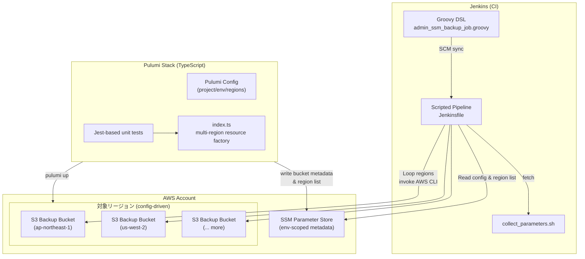

# Codex Agent 実行ログ

開始日時: 2025/10/15 12:53:12

---

## Turn 1: スレッド開始

**Thread ID**: `0199e7ee-8513-7652-ba59-e36ccc47ec59`

## Turn 2: ツール実行

**種別**: コマンド実行
**コマンド**: `bash -lc "sed -n '1,160p' @.ai-workflow/issue-391/01_requirements/output/requirements.md"`
**ステータス**: failed (exit_code=-1)

```text
No such file or directory (os error 2)
```

## Turn 3: ツール実行

**種別**: コマンド実行
**コマンド**: `bash -lc ls`
**ステータス**: completed (exit_code=0)

```text
ARCHITECTURE.md
CLAUDE.md
CONTRIBUTION.md
LICENSE
README.md
ansible
bootstrap
jenkins
pulumi
run_tests_issue_322.sh
scripts
```

## Turn 4: ツール実行

**種別**: コマンド実行
**コマンド**: `bash -lc 'ls -a'`
**ステータス**: completed (exit_code=0)

```text
.
..
.ai-workflow
.claude
.git
.github
.gitignore
ARCHITECTURE.md
CLAUDE.md
CONTRIBUTION.md
LICENSE
README.md
ansible
bootstrap
jenkins
pulumi
run_tests_issue_322.sh
scripts
```

## Turn 5: ツール実行

**種別**: コマンド実行
**コマンド**: `bash -lc "sed -n '1,160p' .ai-workflow/issue-391/01_requirements/output/requirements.md"`
**ステータス**: completed (exit_code=0)

```text
# Issue #391 要件定義書：SSMバックアップのマルチリージョン対応

## 0. Planning Documentの確認
- **開発方針**: 実装戦略は既存PulumiスタックとJenkinsパイプラインを拡張する「EXTEND」。大規模な新規コンポーネント追加は不要で、既存資産を多リージョン対応へ拡張する前提。
- **テスト戦略**: Pulumiはmocksを用いたユニットテストと`pulumi preview`での差分確認、Jenkinsはjenkinsfile-runnerによるdry-run統合テストを実施する。テストコードは新規作成が必須。
- **リスクと対策**: S3バケット命名衝突、SSMパラメータ互換性、Jenkins実行時間増加、運用チームへの周知不足が主要リスク。命名規則の明文化、互換レイヤー維持、タイムアウト調整、通知計画策定が軽減策。
- **スケジュール**: 要件定義～レポートまで7フェーズ計27hを想定。Phase 1完了条件としてリージョン一覧と通知方針の承認が求められる。

## 1. 概要
AWS Systems Manager (SSM) パラメータのバックアップ機構を単一リージョン実行から、指定された複数リージョンへ拡張する。PulumiでリージョンごとのS3バケットとSSMパラメータを生成し、Jenkinsパイプラインで各リージョンのバックアップを順次取得する構成へ再設計する。これにより、災害対策や運用柔軟性を向上させ、バックアップの冗長性と信頼性を高めることがビジネス価値であり、IaCとCIの一貫性を保ったまま多リージョン化できる点が技術的価値である。

## 2. 機能要件
| ID | 要件 | 要件詳細 | 優先度 |
| --- | --- | --- | --- |
| FR-1 | Pulumi多リージョンS3管理 | Pulumiスタックが設定されたリージョン配列を受け取り、各リージョン専用のS3バケットと関連SSMパラメータを生成・管理する。命名はアカウントID・環境・リージョンを含むテンプレートに従う。 | 高 |
| FR-2 | SSMパラメータ互換性 | 新規に`/jenkins/{env}/backup/{region}/s3-bucket-name`形式のSSMキーを出力しつつ、既存のデフォルトキー(`/jenkins/{env}/backup/s3-bucket-name`)も最新リージョンを指すよう維持する。 | 高 |
| FR-3 | Jenkins多リージョン実行 | `jenkins/jobs/pipeline/admin/ssm-backup/Jenkinsfile`がリージョン単位のステージに分割され、定義済みリージョンを直列実行し各ステージでバックアップを取得する。ステージ境界で失敗時は後続リージョンを停止する。 | 高 |
| FR-4 | Jenkins DSL互換運用 | `jenkins/jobs/dsl/admin/admin_ssm_backup_job.groovy`のパラメータ構成を変更せず、リージョン選択をUIに追加しない。多リージョン対応の説明・タイムアウト調整はDSLで管理する。 | 中 |
| FR-5 | 利用者通知計画 | CLI利用者およびJenkinsジョブ利用者に対し、リリース前に変更内容・影響・ロールバック手順を通知する計画を作成し、運用チーム合意を得る。 | 中 |

## 3. 非機能要件
- **パフォーマンス**: Jenkinsパイプライン全体の実行時間は許容タイムアウト内（現行基準＋リージョン数×バックアップ時間、上限60分）に収まるよう調整する。ステージ毎に最大10分のタイムアウト設定を行い、AWS CLIリトライを有効化する。
- **セキュリティ**: 生成するS3バケットはサーバーサイド暗号化（SSE-S3またはKMS）を必須とし、Pulumiでブロックパブリックアクセスを有効化する。SSMパラメータは`SecureString`を維持する。
- **可用性・信頼性**: バックアップは少なくとも1日1回のジョブ成功が保証されるよう監視し、失敗時はSlackアラートにより一次連絡が行われる。リージョン追加・削除時のロールバック手順をRunbookに明記する。
- **保守性・拡張性**: 対応リージョンはPulumi configで設定可能とし、コード変更なく増減できる。PulumiユニットテストとJenkins dry-runテストをCIに統合し、将来のリージョン追加時の回帰リスクを低減する。

## 4. 制約事項
- **技術的制約**: インフラ定義はPulumi(TypeScript)、CIはJenkins Declarative PipelineとGroovy DSLを継続利用する。AWSアカウントおよび既存Jenkinsインフラに依存するため他ツールへの移行は対象外。
- **リソース制約**: 推定工数27時間、担当リソースは既存IaC/CIチーム内で賄う。追加予算なし。
- **ポリシー制約**: プロジェクトの命名規約、タグ付与ポリシー、セキュリティ標準（S3暗号化必須、最小権限IAM）に従う。コードレビューとテスト結果提出がリリース条件。

## 5. 前提条件
- Pulumiスタックで使用するAWSクレデンシャルはマルチリージョン操作権限を持ち、対象リージョンは運用チームと合意済み（例：`us-east-1`, `us-west-2`, `ap-northeast-1`）。
- Jenkins実行環境はAWS CLIおよび必要なPulumiバージョンをインストール済みで、追加リージョンへのアクセスが許可されている。
- 既存バックアップジョブのスケジュール、通知先（Slack/Email）、Runbookは現行通り利用可能であり、今回の変更に合わせて改訂できる。

## 6. 受け入れ基準
- **FR-1**  
  - Given Pulumi configに複数リージョンが設定されている  
  - When `pulumi preview`または`pulumi up`を実行する  
  - Then 各リージョンに命名規則に沿ったS3バケットと関連SSMパラメータが作成されることが確認できる。
- **FR-2**  
  - Given `pulumi up`実行後にSSMパラメータストアを確認する  
  - When `/jenkins/{env}/backup/{region}/s3-bucket-name`を取得する  
  - Then 対象リージョンのバケット名が取得でき、既存キー`/jenkins/{env}/backup/s3-bucket-name`も最新デフォルトリージョンの値を返す。
- **FR-3**  
  - Given Jenkinsfileに定義されたリージョンリストが3件ある  
  - When パイプラインを実行する  
  - Then ステージがリージョン順に直列実行され、いずれかのステージが失敗した場合は後続ステージがスキップされ通知が行われる。
- **FR-4**  
  - Given Jenkinsジョブのパラメータ画面を表示する  
  - When 多リージョン対応版のDSLがデプロイされている  
  - Then 既存パラメータ項目は名称・型ともに変更されておらず、新たなリージョン選択項目が追加されていない。
- **FR-5**  
  - Given リリース1週間前の運用準備ミーティング  
  - When 通知計画ドキュメントをレビューする  
  - Then CLI/Jenkins利用者への連絡チャネル・タイミング・ロールバック連絡手順が明記され、運用チームから承認を得た記録が残っている。

## 7. スコープ外
- バックアップ対象データの種類拡張（SSM以外のサービスバックアップ）は対象外。
- Jenkins以外のCI/CDツールへの移行や併用は行わない。
- 完全並列実行やイベントドリブン化など多リージョン以外の高度なオーケストレーションは本フェーズのスコープ外。将来的な改善候補として検討する。
```

## Turn 6: ツール実行

**種別**: コマンド実行
**コマンド**: `bash -lc "sed -n '1,200p' .ai-workflow/issue-391/02_design/output/design.md"`
**ステータス**: completed (exit_code=0)

```text
# Issue #391 詳細設計書: SSMバックアップのマルチリージョン対応

## 1. アーキテクチャ設計

### 1.1 システム全体図


### 1.2 コンポーネント間の関係
- **Pulumi**: リージョン配列に基づき AWS Provider を切り替え、S3 バケット＋SSM パラメータをリージョンごとに生成。メタデータ（リージョン一覧、デフォルトリージョン、レガシー互換キー）を SSM に書き込む。
- **Jenkins Pipeline**: SSM からリージョン一覧を読み取り、Scripted Pipeline でリージョンごとのステージを動的生成しつつ逐次バックアップ処理・S3 アップロード・ログ集計を実施。失敗時は即座に後続リージョンをスキップ。
- **collect_parameters.sh**: Jenkins 各ステージからリージョン別に呼び出される共通スクリプト。AWS_REGION 等の環境変数を受け取り、該当リージョンの SSM からパラメータを収集して JSON 化。
- **Groovy DSL**: UI パラメータを変更せず、説明文・スケジューリング・タイムアウトなどのメタ情報だけを調整。

### 1.3 データフロー
1. 運用チームが Pulumi config (`regions`, `defaultRegion`) を更新し、`pulumi up` 実行でターゲットリージョン毎の S3 バケットと `/jenkins/{env}/backup/{region}/s3-bucket-name` パラメータを作成。
2. Pulumi は同時に `/jenkins/{env}/backup/region-list`（JSON 配列）と `/jenkins/{env}/backup/s3-bucket-name`（互換用デフォルトバケット）も更新。
3. Jenkins DSL がスケジュールジョブを定義し、パイプライン起動時に `Initialize` ステージでリージョン一覧を SSM から取得し JSON→List へ変換。
4. Scripted Pipeline のメインループがリージョンごとに `stage("Backup ${region}")` を生成し、各ステージ内で
   - 対象リージョンに切り替えた AWS CLI で SSM を参照しバケット名を取得
   - `collect_parameters.sh` を対象リージョン向けディレクトリで実行
   - DRY_RUN フラグに応じたアップロード（AES256）と最新ポインタ更新を実行し、結果をステージローカルのマップへ格納
5. 全リージョンの結果は `regionSummaries` に蓄積され、`Finalize Report` ステージで `region_summaries.json` として出力した後、post セクションで Slack／メール通知（7.7節）を送信する。失敗時は `error()` で即停止し、失敗リージョンと原因が通知に含まれる。

## 2. 実装戦略: EXTEND

**判断根拠**:
- 既存の Pulumi スタックと Jenkins パイプラインを土台に、多リージョン化のための設定値・ループ処理を追加する拡張作業が主体（FR-1, FR-3）。
- 既存 SSM キーを互換維持しながらリージョン別キーを増やす方針で、新規システムを構築するのではなく現状の IaC/CI を拡張する形となる（FR-2, FR-4）。

## 3. テスト戦略: UNIT_INTEGRATION

**判断根拠**:
- Pulumi 側はリージョン配列→リソース生成ロジックの分岐が増えるため、mocks を用いたユニットテストでリソース数・命名規則・タグを検証する必要がある（FR-1, NFR-保守性）。
- Jenkins パイプラインは多ステージ逐次実行とエラー制御を含むため、jenkinsfile-runner を使った dry-run 統合テストでリージョン別ステージ生成・失敗時の停止挙動を検証する（FR-3, NFR-可用性）。

## 4. テストコード戦略: CREATE_TEST

**判断根拠**:
- `pulumi/jenkins-ssm-backup-s3` には自動テストが存在しないため、Jest ベースの新規テストスイートを作成する必要がある。
- Jenkins パイプラインにも既存テストがないため、jenkinsfile-runner を呼び出す新規スクリプト＋サンプル設定を追加して自動検証を実現する。

## 5. 影響範囲分析
- **Pulumi IaC**: `index.ts` のロジック刷新、Pulumi config ファイル（dev/prod）へのリージョン配列・デフォルトリージョン設定追加、`package.json` のテスト依存追加。
- **Jenkins Pipeline**: `Jenkinsfile` を Declarative から Scripted へ移行し、ステージ再編（Initialize → Config load、Regional loop 化）と失敗制御・ログ整備を追加。
- **Jenkins DSL**: UI パラメータ不変のまま説明文・タイムアウト・ビルド制御パラメータを見直し多リージョン実行時間を許容。
- **スクリプト**: `collect_parameters.sh` でリージョン名をログ出力し、複数回実行時のディレクトリ競合を防ぐ。
- **ドキュメント**: Runbook/README にリージョン追加/削除手順・ロールバック方針および Pulumi config 更新手順を追記。
- **その他**: Jenkins dry-run 用コンテナ利用方法を開発者ガイドに追記（テスト戦略反映）。

## 6. 変更・追加ファイルリスト
| 区分 | ファイル/パス | 目的 |
| ---- | ------------- | ---- |
| 既存修正 | `pulumi/jenkins-ssm-backup-s3/index.ts` | 多リージョン対応ロジック、SSM メタデータ生成、命名規則の抽象化 |
| 既存修正 | `pulumi/jenkins-ssm-backup-s3/Pulumi.dev.yaml`<br>`pulumi/jenkins-ssm-backup-s3/Pulumi.prod.yaml` | `regions`, `defaultRegion` 等の config 追加 |
| 既存修正 | `pulumi/jenkins-ssm-backup-s3/package.json` | テスト実行 (`jest`, `ts-jest`, `@
... (truncated)
```

## Turn 7: ツール実行

**種別**: コマンド実行
**コマンド**: `bash -lc "sed -n '1,200p' .ai-workflow/issue-391/03_test_scenario/output/test-scenario.md"`
**ステータス**: completed (exit_code=0)

```text
# Issue #391 テストシナリオ: SSMバックアップのマルチリージョン対応

## 1. テスト戦略サマリー
- **テスト戦略**: UNIT_INTEGRATION（Phase 2 決定事項に準拠）
- **テスト対象範囲**: Pulumiスタック（`pulumi/jenkins-ssm-backup-s3`）の多リージョンリソース生成ロジック、Jenkinsパイプライン（Pipeline/Jenkinsfile・DSL・シェルスクリプト）によるリージョン逐次バックアップ処理および通知フロー
- **テスト目的**:
  - FR-1/FR-2/NFRと整合したマルチリージョンS3バケット&SSMメタデータ生成の正当性を検証
  - FR-3/FR-4の逐次実行・失敗制御・UI互換性を担保
  - FR-5および監視観点として、ログ/通知の検証手順を明確化

## 2. Unitテストシナリオ（Pulumi Jest + Mocks）

### テストケース名: validateConfig_regions未設定_異常系
- **目的**: `regions` が未定義または空配列の場合に明示的な例外を発生させ、誤ったPulumi実行を防ぐ（FR-1保守性）
- **前提条件**: Pulumi Configに `regions` を設定しない
- **入力**: `pulumi.Config()` モック値 `{ projectName: "jenkins-infra", environment: "dev" }`
- **期待結果**: `validateConfig()` が `Error("No regions configured")` をthrowし、`pulumi.runtime.setMocks` 起動前にテストが失敗扱いとなる
- **テストデータ**: `__tests__/fixtures/config_no_regions.json`

### テストケース名: validateConfig_defaultRegion不整合_異常系
- **目的**: `defaultRegion` が `regions` に含まれない場合に検知して失敗させる（FR-2互換性）
- **前提条件**: Config: `regions = ["ap-northeast-1"]`, `defaultRegion = "us-west-2"`
- **入力**: Pulumi Configモック
- **期待結果**: `validateConfig()` が `Error("defaultRegion must be included in regions")` をthrow
- **テストデータ**: `__tests__/fixtures/config_invalid_default.json`

### テストケース名: createRegionalResources_正常系
- **目的**: 各リージョンでS3バケット・パブリックアクセスブロック・バケットポリシー・リージョン別SSMパラメータが生成されることを確認（FR-1, NFR-セキュリティ）
- **前提条件**: `regions = ["ap-northeast-1", "us-west-2"]`, `defaultRegion = "ap-northeast-1"`, `projectName = "jenkins-infra"`, `environment = "dev"`
- **入力**: Pulumi mocks (`aws:s3/bucket:Bucket` など) に期待リソースを返させ `require("../index")`
- **期待結果**:
  - バケット名が `<project>-ssm-backup-<env>-<accountId>-<region>` 形式で2リージョン分生成
  - SSE設定 (`AES256`) と PublicAccessBlock が両リージョンで有効
  - `/jenkins/dev/backup/{region}/s3-bucket-name` パラメータが2件作成
- **テストデータ**: `__tests__/fixtures/mock_account.ts`

### テストケース名: emitLegacyParameter_正常系
- **目的**: 旧SSMキー `/jenkins/{env}/backup/s3-bucket-name` が defaultRegion のバケット名に更新されることを確認（FR-2）
- **前提条件**: `defaultRegion = "ap-northeast-1"`, `bucketMap["ap-northeast-1"] = "jenkins-infra-...-ap-northeast-1"`
- **入力**: `emitLegacyParameter(bucketMap)` を実行
- **期待結果**: SSM Parameter resourceが1件追加され、`value` が defaultRegion のバケット名と一致
- **テストデータ**: `__tests__/fixtures/bucket_map.json`

### テストケース名: emitRegionMetadata_JSON整形_正常系
- **目的**: `/jenkins/{env}/backup/region-list` と `/jenkins/{env}/backup/default-region` がJSON/文字列ともに正しく出力されることを確認（FR-1, FR-2, FR-5通知手順依存メタデータ）
- **前提条件**: `regions = ["ap-northeast-1", "us-west-2"]`, `defaultRegion = "ap-northeast-1"`
- **入力**: `emitRegionMetadata(regions, defaultRegion, provider)` 実行
- **期待結果**:
  - `region-list` の `value` が `["ap-northeast-1","us-west-2"]` JSON文字列
  - `default-region` の `value` が `ap-northeast-1`
  - いずれも `ssmHomeRegion` プロバイダーで作成される
- **テストデータ**: `__tests__/fixtures/regions_dual.json`

### テストケース名: bucketMap_export_正常系
- **目的**: `index.ts` のエクスポート `bucketMap` が全リージョンの `{ region: bucketName }` を返すことを確認し、Jenkins統合テストの前提を担保（FR-3/NFR-保守性）
- **前提条件**: `regions` に複数リージョンを設定
- **入力**: `require("../index")` 後の `bucketMap.apply`
- **期待結果**: `bucketMap` の `keys` が `regions` と一致し、各値がPulumi生成バケット名
- **テストデータ**: `__tests__/fixtures/regions_triple.json`

## 3. Integrationテストシナリオ

### シナリオ名: JenkinsPipeline_多リージョン順次バックアップ_正常系
- **目的**: Jenkinsパイプラインがリージョン一覧を取り込み、ステージを動的に生成し順次成功するハッピーパスを検証（FR-3, NFR-パフォーマンス）
- **前提条件**:
  - jenkinsfile-runner Dockerイメージ取得済み
  - テスト用SSMレスポンス `tests/config/regions_sample.json` を `scripts/aws_mock.sh` で返却
  - `DRY_RUN=true` で実行
- **テスト手順**:
  1. `tests/jenkinsfile_runner.sh` を `MODE=success` で実行
  2. Pipeline Initializeで`regionList=["ap-northeast-1","us-west-2"]`が読み込まれる
  3. `stage("Backup ap-northeast-1")` → `collect_parameters.sh` が `data/ap-northeast-1` に成果物を生成
  4. `stage("Backup us-west-2")` が同様に完了
  5. `Finalize Report` で `region_summaries.json` がWORK_DIRに出力
- **期待結果**:
  - Jenkinsログに2つのBackupステージが順序通り表示
  - `region_summaries.json` に各リージョン `status: "SUCCESS"`, `parameterCount > 0`
  - `post { success
... (truncated)
```

## Turn 8: ツール実行

**種別**: コマンド実行
**コマンド**: `bash -lc "sed -n '200,400p' .ai-workflow/issue-391/03_test_scenario/output/test-scenario.md"`
**ステータス**: completed (exit_code=0)

## Turn 9: ツール実行

**種別**: コマンド実行
**コマンド**: `bash -lc "sed -n '80,160p' .ai-workflow/issue-391/03_test_scenario/output/test-scenario.md"`
**ステータス**: completed (exit_code=0)

```text
- Jenkinsログ: ステージ順序と所要時間、`Region`ログが含まれること
  - Slackモック: 送信ペイロードのリージョン別サマリ
  - `collect_parameters.sh` 出力: 各リージョンディレクトリ配下に`parameter_names.txt`

### シナリオ名: JenkinsPipeline_途中失敗で後続停止_異常系
- **目的**: 2番目のリージョンでエラーが発生した場合に後続ステージが生成されず、Slack/メール通知が失敗内容を含むことを確認（FR-3, NFR-可用性）
- **前提条件**:
  - `tests/jenkinsfile_runner.sh MODE=fail_second_region`
  - `scripts/aws_mock.sh` が2番目のリージョンでexit 1を返しエラーメッセージ`"AccessDenied"`
- **テスト手順**:
  1. Pipeline Initializeでリージョンを読み込み
  2. `Backup ap-northeast-1` は成功
  3. `Backup us-west-2` 実行中に `collect_parameters.sh` が失敗し `error("Backup failed: AccessDenied")`
  4. Pipelineが即座に停止し `Finalize Report` はスキップ
  5. Post failureブロックがSlack/メールモックへ通知
- **期待結果**:
  - Jenkinsログに `Backup us-west-2` の失敗と `error` スタックトレースが記録
  - `regionSummaries` に `us-west-2` の `status: "FAILED"`, `failureMessage: "AccessDenied"`
  - Slackモックに `[FAIL]` 付き件名/本文、メールモックに失敗リージョン記載
- **確認項目**:
  - 後続リージョン（存在する場合）のステージが生成されていないこと
  - Slack/メールモックにRunbookリンクが含まれること
  - `tests/output/region_summaries_failure.json` に失敗詳細が保存されること

### シナリオ名: JenkinsDSL_UI互換性確認_正常系
- **目的**: `admin_ssm_backup_job.groovy` が既存ジョブパラメータを変更せず説明文とタイムアウトのみ更新されていることを確認（FR-4）
- **前提条件**:
  - Job DSL CLI または `jenkinsfile-runner` を `jobdsl` モードで実行可能
  - 既存ジョブ定義のsnapshot (`tests/config/jobdsl_baseline.xml`) を保持
- **テスト手順**:
  1. DSL seedジョブで `admin_ssm_backup_job.groovy` を適用し、生成XMLを `tests/output/admin_ssm_backup_job.xml` に保存
  2. 新旧XMLを `xmldiff` で比較
  3. `timeout` オプションと説明文以外の差分がないことを確認
- **期待結果**:
  - パラメータ定義 (`<hudson.model.StringParameterDefinition>`, `<ChoiceParameterDefinition>`) に差分なし
  - 新しい説明文に多リージョン対応の記述とRunbookリンクが追加
  - `options` 内 `timeout` が90分へ更新されている
- **確認項目**:
  - DSL適用時のログに警告が出ていないこと
  - Jenkins UIでリージョン選択パラメータが追加されていないこと（スモーク確認）

### シナリオ名: collectParameters_リージョン分離動作_正常系
- **目的**: `collect_parameters.sh` がリージョンごとのディレクトリを安全に扱い、既存ファイルを削除して最新の成果物だけを残すことを確認（FR-3/NFR-保守性）
- **前提条件**:
  - `DATA_DIR=/tmp/work/data/us-west-2` が既に存在し、旧ファイルが残っている
- **テスト手順**:
  1. `TARGET_REGION=us-west-2` `DRY_RUN=true` でスクリプトを起動
  2. 実行前に`touch /tmp/work/data/us-west-2/old.json`
  3. スクリプト完了後にディレクトリ内容を確認
- **期待結果**:
  - `old.json` が削除され、新たに `parameter_names.txt`, `parameters.json` のみ生成
  - ログに `Target Region: us-west-2` が出力
- **確認項目**:
  - `DATA_DIR` のパーミッションが保持されていること
  - エラー終了時にはクリーンアップが実施されないこと（別テストで確認済み）

## 4. テストデータ
- `__tests__/fixtures/config_no_regions.json`: `regions` 未設定のPulumi Config
- `__tests__/fixtures/config_invalid_default.json`: `defaultRegion` が `regions` と不整合な設定
- `__tests__/fixtures/regions_dual.json` / `regions_triple.json`: 多リージョン構成のConfigサンプル
- `__tests__/fixtures/mock_account.ts`: Pulumi mocks用の `accountId`・`region` 応答
- `__tests__/fixtures/bucket_map.json`: defaultRegionのバケット情報
- `jenkins/jobs/pipeline/admin/ssm-backup/tests/config/regions_sample.json`: Jenkins統合テスト用SSMレスポンスモック
- `tests/output/slack_payload.json`, `tests/output/region_summaries_failure.json`: Jenkins統合テストで生成される検証用成果物
- `tests/config/jobdsl_baseline.xml`: DSL差分比較のベースライン

## 5. テスト環境要件
- **ローカル/CI要件**:
  - Node.js 18系、npm、`ts-jest`/`@types/jest` をインストール済み
  - Pulumi CLI（プレビュー確認用、ユニットテストではモックを利用）
  - Docker 20.x 以上（jenkinsfile-runnerコンテナ実行用）
- **外部サービス/モック**:
  - AWSサービスは直接呼び出さず、Pulumi mocks と `scripts/aws_mock.sh` で全レスポンスをモック化
  - Slack/メール通知はHTTPサーバモックとローカルSMTPモック（`python -m smtpd` 等）を使用
- **CI/CD統合**:
  - Unitテスト: `npm test -- --runInBand`
  - Integrationテスト: `./jenkins/jobs/pipeline/admin/ssm-backup/tests/jenkinsfile_runner.sh MODE={success|fail_second_region}`
  - DSL差分検証: `./jenkins/jobs/pipeline/admin/ssm-backup/tests/jobdsl_verify.sh`（新規追加予定）

---
```

## Turn 10: ツール実行

**種別**: コマンド実行
**コマンド**: `bash -lc "sed -n '60,110p' .ai-workflow/issue-391/03_test_scenario/output/test-scenario.md"`
**ステータス**: completed (exit_code=0)

```text
## 3. Integrationテストシナリオ

### シナリオ名: JenkinsPipeline_多リージョン順次バックアップ_正常系
- **目的**: Jenkinsパイプラインがリージョン一覧を取り込み、ステージを動的に生成し順次成功するハッピーパスを検証（FR-3, NFR-パフォーマンス）
- **前提条件**:
  - jenkinsfile-runner Dockerイメージ取得済み
  - テスト用SSMレスポンス `tests/config/regions_sample.json` を `scripts/aws_mock.sh` で返却
  - `DRY_RUN=true` で実行
- **テスト手順**:
  1. `tests/jenkinsfile_runner.sh` を `MODE=success` で実行
  2. Pipeline Initializeで`regionList=["ap-northeast-1","us-west-2"]`が読み込まれる
  3. `stage("Backup ap-northeast-1")` → `collect_parameters.sh` が `data/ap-northeast-1` に成果物を生成
  4. `stage("Backup us-west-2")` が同様に完了
  5. `Finalize Report` で `region_summaries.json` がWORK_DIRに出力
- **期待結果**:
  - Jenkinsログに2つのBackupステージが順序通り表示
  - `region_summaries.json` に各リージョン `status: "SUCCESS"`, `parameterCount > 0`
  - `post { success { ... } }` でSlackダミーURLへHTTP 200のリクエスト送信（`tests/output/slack_payload.json`に書き出し）
- **確認項目**:
  - Jenkinsログ: ステージ順序と所要時間、`Region`ログが含まれること
  - Slackモック: 送信ペイロードのリージョン別サマリ
  - `collect_parameters.sh` 出力: 各リージョンディレクトリ配下に`parameter_names.txt`

### シナリオ名: JenkinsPipeline_途中失敗で後続停止_異常系
- **目的**: 2番目のリージョンでエラーが発生した場合に後続ステージが生成されず、Slack/メール通知が失敗内容を含むことを確認（FR-3, NFR-可用性）
- **前提条件**:
  - `tests/jenkinsfile_runner.sh MODE=fail_second_region`
  - `scripts/aws_mock.sh` が2番目のリージョンでexit 1を返しエラーメッセージ`"AccessDenied"`
- **テスト手順**:
  1. Pipeline Initializeでリージョンを読み込み
  2. `Backup ap-northeast-1` は成功
  3. `Backup us-west-2` 実行中に `collect_parameters.sh` が失敗し `error("Backup failed: AccessDenied")`
  4. Pipelineが即座に停止し `Finalize Report` はスキップ
  5. Post failureブロックがSlack/メールモックへ通知
- **期待結果**:
  - Jenkinsログに `Backup us-west-2` の失敗と `error` スタックトレースが記録
  - `regionSummaries` に `us-west-2` の `status: "FAILED"`, `failureMessage: "AccessDenied"`
  - Slackモックに `[FAIL]` 付き件名/本文、メールモックに失敗リージョン記載
- **確認項目**:
  - 後続リージョン（存在する場合）のステージが生成されていないこと
  - Slack/メールモックにRunbookリンクが含まれること
  - `tests/output/region_summaries_failure.json` に失敗詳細が保存されること

### シナリオ名: JenkinsDSL_UI互換性確認_正常系
- **目的**: `admin_ssm_backup_job.groovy` が既存ジョブパラメータを変更せず説明文とタイムアウトのみ更新されていることを確認（FR-4）
- **前提条件**:
  - Job DSL CLI または `jenkinsfile-runner` を `jobdsl` モードで実行可能
  - 既存ジョブ定義のsnapshot (`tests/config/jobdsl_baseline.xml`) を保持
- **テスト手順**:
  1. DSL seedジョブで `admin_ssm_backup_job.groovy` を適用し、生成XMLを `tests/output/admin_ssm_backup_job.xml` に保存
```

## Turn 11: ツール実行

**種別**: コマンド実行
**コマンド**: `bash -lc "nl -ba .ai-workflow/issue-391/03_test_scenario/output/test-scenario.md | sed -n '60,140p'"`
**ステータス**: completed (exit_code=0)

```text
60	
    61	## 3. Integrationテストシナリオ
    62	
    63	### シナリオ名: JenkinsPipeline_多リージョン順次バックアップ_正常系
    64	- **目的**: Jenkinsパイプラインがリージョン一覧を取り込み、ステージを動的に生成し順次成功するハッピーパスを検証（FR-3, NFR-パフォーマンス）
    65	- **前提条件**:
    66	  - jenkinsfile-runner Dockerイメージ取得済み
    67	  - テスト用SSMレスポンス `tests/config/regions_sample.json` を `scripts/aws_mock.sh` で返却
    68	  - `DRY_RUN=true` で実行
    69	- **テスト手順**:
    70	  1. `tests/jenkinsfile_runner.sh` を `MODE=success` で実行
    71	  2. Pipeline Initializeで`regionList=["ap-northeast-1","us-west-2"]`が読み込まれる
    72	  3. `stage("Backup ap-northeast-1")` → `collect_parameters.sh` が `data/ap-northeast-1` に成果物を生成
    73	  4. `stage("Backup us-west-2")` が同様に完了
    74	  5. `Finalize Report` で `region_summaries.json` がWORK_DIRに出力
    75	- **期待結果**:
    76	  - Jenkinsログに2つのBackupステージが順序通り表示
    77	  - `region_summaries.json` に各リージョン `status: "SUCCESS"`, `parameterCount > 0`
    78	  - `post { success { ... } }` でSlackダミーURLへHTTP 200のリクエスト送信（`tests/output/slack_payload.json`に書き出し）
    79	- **確認項目**:
    80	  - Jenkinsログ: ステージ順序と所要時間、`Region`ログが含まれること
    81	  - Slackモック: 送信ペイロードのリージョン別サマリ
    82	  - `collect_parameters.sh` 出力: 各リージョンディレクトリ配下に`parameter_names.txt`
    83	
    84	### シナリオ名: JenkinsPipeline_途中失敗で後続停止_異常系
    85	- **目的**: 2番目のリージョンでエラーが発生した場合に後続ステージが生成されず、Slack/メール通知が失敗内容を含むことを確認（FR-3, NFR-可用性）
    86	- **前提条件**:
    87	  - `tests/jenkinsfile_runner.sh MODE=fail_second_region`
    88	  - `scripts/aws_mock.sh` が2番目のリージョンでexit 1を返しエラーメッセージ`"AccessDenied"`
    89	- **テスト手順**:
    90	  1. Pipeline Initializeでリージョンを読み込み
    91	  2. `Backup ap-northeast-1` は成功
    92	  3. `Backup us-west-2` 実行中に `collect_parameters.sh` が失敗し `error("Backup failed: AccessDenied")`
    93	  4. Pipelineが即座に停止し `Finalize Report` はスキップ
    94	  5. Post failureブロックがSlack/メールモックへ通知
    95	- **期待結果**:
    96	  - Jenkinsログに `Backup us-west-2` の失敗と `error` スタックトレースが記録
    97	  - `regionSummaries` に `us-west-2` の `status: "FAILED"`, `failureMessage: "AccessDenied"`
    98	  - Slackモックに `[FAIL]` 付き件名/本文、メールモックに失敗リージョン記載
    99	- **確認項目**:
   100	  - 後続リージョン（存在する場合）のステージが生成されていないこと
   101	  - Slack/メールモックにRunbookリンクが含まれること
   102	  - `tests/output/region_summaries_failure.json` に失敗詳細が保存されること
   103	
   104	### シナリオ名: JenkinsDSL_UI互換性確認_正常系
   105	- **目的**: `admin_ssm_backup_job.groovy` が既存ジョブパラメータを変更せず説明文とタイムアウトのみ更新されていることを確認（FR-4）
   106	- **前提条件**:
   107	  - Job DSL CLI または `jenkinsfile-runner` を `jobdsl` モードで実行可能
   108	  - 既存ジョブ定義のsnapshot (`tests/config/jobdsl_baseline.xml`) を保持
   109	- **テスト手順**:
   110	  1. DSL seedジョブで `admin_ssm_backup_job.groovy` を適用し、生成XMLを `tests/output/admin_ssm_backup_job.xml` に保存
   111	  2. 新旧XMLを `xmldiff` で比較
   112	  3. `timeout` オプションと説明文以外の差分がないことを確認
   113	- **期待結果**:
   114	  - パラメータ定義 (`<hudson.model.StringParameterDefinition>`, `<ChoiceParameterDefinition>`) に差分なし
   115	  - 新しい説明文に多リージョン対応の記述とRunbookリンクが追加
   116	  - `options` 内 `timeout` が90分へ更新されている
   117	- **確認項目**:
   118	  - DSL適用時のログに警告が出ていないこと
   119	  - Jenkins UIでリージョン選択パラメータが追加されていないこと（スモーク確認）
   120	
   121	### シナリオ名: collectParameters_リージョン分離動作_正常系
   122	- **目的**: `collect_parameters.sh` がリージョンごとのディレクトリを安全に扱い、既存ファイルを削除して最新の成果物だけを残すことを確認（FR-3/NFR-保守性）
   123	- **前提条件**:
   124	  - `DATA_DIR=/tmp/work/data/us-west-2` が既に存在し、旧ファイルが残っている
   125	- **テスト手順**:
   126	  1. `TARGET_REGION=us-west-2` `DRY_RUN=true` でスクリプトを起動
   127	  2. 実行前に`touch /tmp/work/data/us-west-2/old.json`
   128	  3. スクリプト完了後にディレクトリ内容を確認
   129	- **期待結果**:
   130	  - `old.json` が削除され、新たに `parameter_names.txt`, `parameters.json` のみ生成
   131	  - ログに `Target Region: us-west-2` が出力
   132	- **確認項目**:
   133	  - `DATA_DIR` のパーミッションが保持されていること
   134	  - エラー終了時にはクリーンアップが実施されないこと（別テストで確認済み）
   135	
   136	## 4. テストデータ
   137	- `__tests__/fixtures/config_no_regions.json`: `regions` 未設定のPulumi Config
   138	- `__tests__/fixtures/config_invalid_default.json`: `defaultRegion` が `regions` と不整合な設定
   139	- `__tests__/fixtures/regions_dual.json` / `regions_triple.json`: 多リージョン構成の
... (truncated)
```

## Turn 12: ツール実行

**種別**: コマンド実行
**コマンド**: `bash -lc "nl -ba .ai-workflow/issue-391/03_test_scenario/output/test-scenario.md | sed -n '1,80p'"`
**ステータス**: completed (exit_code=0)

```text
1	# Issue #391 テストシナリオ: SSMバックアップのマルチリージョン対応
     2	
     3	## 1. テスト戦略サマリー
     4	- **テスト戦略**: UNIT_INTEGRATION（Phase 2 決定事項に準拠）
     5	- **テスト対象範囲**: Pulumiスタック（`pulumi/jenkins-ssm-backup-s3`）の多リージョンリソース生成ロジック、Jenkinsパイプライン（Pipeline/Jenkinsfile・DSL・シェルスクリプト）によるリージョン逐次バックアップ処理および通知フロー
     6	- **テスト目的**:
     7	  - FR-1/FR-2/NFRと整合したマルチリージョンS3バケット&SSMメタデータ生成の正当性を検証
     8	  - FR-3/FR-4の逐次実行・失敗制御・UI互換性を担保
     9	  - FR-5および監視観点として、ログ/通知の検証手順を明確化
    10	
    11	## 2. Unitテストシナリオ（Pulumi Jest + Mocks）
    12	
    13	### テストケース名: validateConfig_regions未設定_異常系
    14	- **目的**: `regions` が未定義または空配列の場合に明示的な例外を発生させ、誤ったPulumi実行を防ぐ（FR-1保守性）
    15	- **前提条件**: Pulumi Configに `regions` を設定しない
    16	- **入力**: `pulumi.Config()` モック値 `{ projectName: "jenkins-infra", environment: "dev" }`
    17	- **期待結果**: `validateConfig()` が `Error("No regions configured")` をthrowし、`pulumi.runtime.setMocks` 起動前にテストが失敗扱いとなる
    18	- **テストデータ**: `__tests__/fixtures/config_no_regions.json`
    19	
    20	### テストケース名: validateConfig_defaultRegion不整合_異常系
    21	- **目的**: `defaultRegion` が `regions` に含まれない場合に検知して失敗させる（FR-2互換性）
    22	- **前提条件**: Config: `regions = ["ap-northeast-1"]`, `defaultRegion = "us-west-2"`
    23	- **入力**: Pulumi Configモック
    24	- **期待結果**: `validateConfig()` が `Error("defaultRegion must be included in regions")` をthrow
    25	- **テストデータ**: `__tests__/fixtures/config_invalid_default.json`
    26	
    27	### テストケース名: createRegionalResources_正常系
    28	- **目的**: 各リージョンでS3バケット・パブリックアクセスブロック・バケットポリシー・リージョン別SSMパラメータが生成されることを確認（FR-1, NFR-セキュリティ）
    29	- **前提条件**: `regions = ["ap-northeast-1", "us-west-2"]`, `defaultRegion = "ap-northeast-1"`, `projectName = "jenkins-infra"`, `environment = "dev"`
    30	- **入力**: Pulumi mocks (`aws:s3/bucket:Bucket` など) に期待リソースを返させ `require("../index")`
    31	- **期待結果**:
    32	  - バケット名が `<project>-ssm-backup-<env>-<accountId>-<region>` 形式で2リージョン分生成
    33	  - SSE設定 (`AES256`) と PublicAccessBlock が両リージョンで有効
    34	  - `/jenkins/dev/backup/{region}/s3-bucket-name` パラメータが2件作成
    35	- **テストデータ**: `__tests__/fixtures/mock_account.ts`
    36	
    37	### テストケース名: emitLegacyParameter_正常系
    38	- **目的**: 旧SSMキー `/jenkins/{env}/backup/s3-bucket-name` が defaultRegion のバケット名に更新されることを確認（FR-2）
    39	- **前提条件**: `defaultRegion = "ap-northeast-1"`, `bucketMap["ap-northeast-1"] = "jenkins-infra-...-ap-northeast-1"`
    40	- **入力**: `emitLegacyParameter(bucketMap)` を実行
    41	- **期待結果**: SSM Parameter resourceが1件追加され、`value` が defaultRegion のバケット名と一致
    42	- **テストデータ**: `__tests__/fixtures/bucket_map.json`
    43	
    44	### テストケース名: emitRegionMetadata_JSON整形_正常系
    45	- **目的**: `/jenkins/{env}/backup/region-list` と `/jenkins/{env}/backup/default-region` がJSON/文字列ともに正しく出力されることを確認（FR-1, FR-2, FR-5通知手順依存メタデータ）
    46	- **前提条件**: `regions = ["ap-northeast-1", "us-west-2"]`, `defaultRegion = "ap-northeast-1"`
    47	- **入力**: `emitRegionMetadata(regions, defaultRegion, provider)` 実行
    48	- **期待結果**:
    49	  - `region-list` の `value` が `["ap-northeast-1","us-west-2"]` JSON文字列
    50	  - `default-region` の `value` が `ap-northeast-1`
    51	  - いずれも `ssmHomeRegion` プロバイダーで作成される
    52	- **テストデータ**: `__tests__/fixtures/regions_dual.json`
    53	
    54	### テストケース名: bucketMap_export_正常系
    55	- **目的**: `index.ts` のエクスポート `bucketMap` が全リージョンの `{ region: bucketName }` を返すことを確認し、Jenkins統合テストの前提を担保（FR-3/NFR-保守性）
    56	- **前提条件**: `regions` に複数リージョンを設定
    57	- **入力**: `require("../index")` 後の `bucketMap.apply`
    58	- **期待結果**: `bucketMap` の `keys` が `regions` と一致し、各値がPulumi生成バケット名
    59	- **テストデータ**: `__tests__/fixtures/regions_triple.json`
    60	
    61	## 3. Integrationテストシナリオ
    62	
    63	### シナリオ名: JenkinsPipeline_多リージョン順次バックアップ_正常系
    64	- **目的**: Jenkinsパイプラインがリージョン一覧を取り込み、ステージを動的に生成し順次成功するハッピーパスを検証（FR-3, NFR-パフォーマンス）
    65	- **前提条件**:
    66	  - jenkinsfile-runner Dockerイメージ取得済み
    67	  - テスト用SSMレスポンス `tests/config/regions_sample.json` を `scripts/aws_mock.sh` で返却
    68	  - `DRY_RUN=true` で実行
    69	- **テスト手順
... (truncated)
```

## Turn 13: ツール実行

**種別**: agent_message
**ステータス**: completed

## Turn 14: 実行完了

**ステータス**: completed
**所要時間**: 234048ms
**ターン数**: N/A

---

**経過時間**: 234048ms
**開始**: 2025-10-15T12:53:12.532Z
**終了**: 2025-10-15T12:57:06.580Z