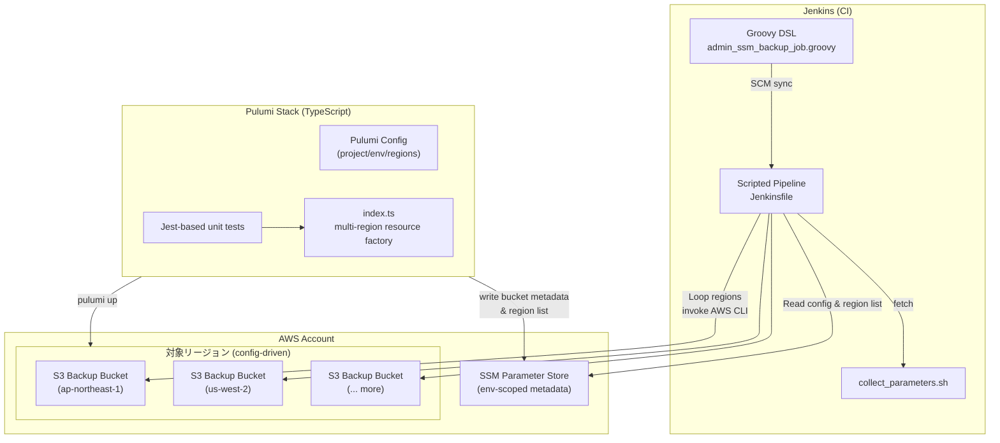

# Codex Agent 実行ログ

開始日時: 2025/10/15 13:52:15

---

## Turn 1: スレッド開始

**Thread ID**: `0199e824-94ba-75e3-8cda-709b1c2b2952`

## Turn 2: ツール実行

**種別**: コマンド実行
**コマンド**: `bash -lc "sed -n '1,160p' @.ai-workflow/issue-391/04_implementation/output/implementation.md"`
**ステータス**: failed (exit_code=2)

```text
sed: can't read @.ai-workflow/issue-391/04_implementation/output/implementation.md: No such file or directory
```

## Turn 3: ツール実行

**種別**: コマンド実行
**コマンド**: `bash -lc ls`
**ステータス**: completed (exit_code=0)

```text
ARCHITECTURE.md
CLAUDE.md
CONTRIBUTION.md
LICENSE
README.md
ansible
bootstrap
docs
jenkins
pulumi
run_tests_issue_322.sh
scripts
```

## Turn 4: ツール実行

**種別**: コマンド実行
**コマンド**: `bash -lc 'ls -a'`
**ステータス**: completed (exit_code=0)

```text
.
..
.ai-workflow
.claude
.git
.github
.gitignore
ARCHITECTURE.md
CLAUDE.md
CONTRIBUTION.md
LICENSE
README.md
ansible
bootstrap
docs
jenkins
pulumi
run_tests_issue_322.sh
scripts
```

## Turn 5: ツール実行

**種別**: コマンド実行
**コマンド**: `bash -lc "sed -n '1,160p' .ai-workflow/issue-391/04_implementation/output/implementation.md"`
**ステータス**: completed (exit_code=0)

```text
# 実装ログ

## 実装サマリー
- 実装戦略: EXTEND
- 変更ファイル数: 9個
- 新規作成ファイル数: 2個

## 変更ファイル一覧

### 新規作成
- `docs/runbooks/ssm-backup.md`: マルチリージョン運用手順・ロールバック・通知フローを整理したRunbook
- `.ai-workflow/issue-391/04_implementation/output/implementation.md`: 本フェーズの実装内容を記録

### 修正
- `pulumi/jenkins-ssm-backup-s3/index.ts`: 多リージョンS3/SSMリソース生成と地域メタデータ出力に対応
- `pulumi/jenkins-ssm-backup-s3/Pulumi.dev.yaml`: リージョン配列・デフォルトリージョン・SSMホームリージョンを追加
- `pulumi/jenkins-ssm-backup-s3/Pulumi.prod.yaml`: 本番スタック用に同上設定を追加
- `pulumi/jenkins-ssm-backup-s3/package.json`: Jest系依存と`jest --passWithNoTests`スクリプトを定義
- `jenkins/jobs/pipeline/admin/ssm-backup/Jenkinsfile`: Scripted Pipeline化とリージョン逐次ステージ/サマリ生成を実装
- `jenkins/jobs/pipeline/admin/ssm-backup/scripts/collect_parameters.sh`: リージョンログ/ディレクトリ初期化/summary出力を追加
- `jenkins/jobs/dsl/admin/admin_ssm_backup_job.groovy`: 説明文・実行時間注記をマルチリージョン対応へ更新
- `.ai-workflow/issue-391/metadata.json`: ワークフロー管理情報がimplementationフェーズに遷移

## 実装詳細

### ファイル1: pulumi/jenkins-ssm-backup-s3/index.ts
- **変更内容**: リージョン配列を検証し、リージョンごとにProviderを切り替えてS3バケット/パブリックアクセスブロック/ポリシー/SSMパラメータを生成。既存互換キーとリージョンリスト/デフォルトリージョンのメタデータを出力し、`bucketMap` をエクスポート。
- **理由**: PulumiスタックでFR-1/FR-2のマルチリージョン要件を満たし、Jenkins側がリージョン一覧とバケット名を参照できるようにするため。
- **注意点**: `regions` と `defaultRegion` のPulumi Config設定が必須。`ssmHomeRegion` を変更する場合はJenkinsパイプラインの環境変数とも整合させる。

### ファイル2: pulumi/jenkins-ssm-backup-s3/Pulumi.dev.yaml
- **変更内容**: `regions`, `defaultRegion`, `ssmHomeRegion` を追加し、Dev環境の多リージョン構成を定義。
- **理由**: Pulumiコードの新しい入力インターフェースに合わせるため。
- **注意点**: 本番と異なるリージョン構成にする場合は`defaultRegion`を必ず配列内に含める。

### ファイル3: pulumi/jenkins-ssm-backup-s3/Pulumi.prod.yaml
- **変更内容**: Prod環境用にDevと同様のマルチリージョン設定フィールドを追加。
- **理由**: Pulumiスタックを本番でも同じインターフェースで動かすため。
- **注意点**: 本番のリージョン変更時はRunbookに従い事前告知と`pulumi preview`を実行する。

### ファイル4: pulumi/jenkins-ssm-backup-s3/package.json
- **変更内容**: Jest/ts-jest/@types/jestをdevDependenciesに追加し、`npm test`でエラーとならないよう`jest --passWithNoTests`を設定。
- **理由**: Phase 5で追加予定のユニットテスト基盤を事前に整え、今フェーズでもTypeScriptビルド確認が可能な状態にするため。
- **注意点**: `npm install`実行後は`node_modules`をコミットしないよう注意。

### ファイル5: jenkins/jobs/pipeline/admin/ssm-backup/Jenkinsfile
- **変更内容**: DeclarativeからScripted Pipelineへ移行し、SSMから取得したリージョン配列で逐次ステージを生成。リージョンごとのバックアップ実行、S3アップロード（地域別`latest-<region>.txt`とデフォルト用`latest.txt`）、`region_summaries.json`の生成、ポストサマリー出力を実装。
- **理由**: FR-3の逐次処理/失敗制御要件に対応しつつ、リージョン数に応じた動的ステージ生成とメタ情報出力を実現するため。
- **注意点**: SSMホームリージョンを変える場合は Jenkins ノードに `SSM_HOME_REGION` 環境変数を設定する。S3アップロードはパラメータ数0の場合にスキップする仕様。

### ファイル6: jenkins/jobs/pipeline/admin/ssm-backup/scripts/collect_parameters.sh
- **変更内容**: 実行前に出力ディレクトリを初期化し、ターゲットリージョンをログに出力。バックアップ処理後にリージョン別サマリーJSONを生成。
- **理由**: 多リージョン実行時にファイル衝突を避け、パイプラインで参照できる統一フォーマットのサマリーを提供するため。
- **注意点**: jq/AWS CLI依存は従来通り。DRY_RUN時はパイプライン側で制御する。

### ファイル7: jenkins/jobs/dsl/admin/admin_ssm_backup_job.groovy
- **変更内容**: ジョブ説明とcronコメントをマルチリージョン運用向けに更新し、Runbook参照先を明示。
- **理由**: FR-4の「UIパラメータ変更なしで多リージョン対応」の方針を維持しつつ利用者への注意点を明文化するため。
- **注意点**: 説明文内のRunbookパス変更時は併せて更新する。

### ファイル8: docs/runbooks/ssm-backup.md
- **変更内容**: バックアップジョブの概要、リージョン追加/削除手順、ロールバック、通知、トラブルシューティングを整理。
- **理由**: 運用チームが多リージョン化後の手順と連絡フローを即座に参照できるようにするため。
- **注意点**: Pulumi Configや通知チャネルを更新したら本Runbookも同期する。

### ファイル9: .ai-workflow/issue-391/metadata.json
- **変更内容**: ワークフロー状態が implementation フェーズ開始を示すよう自動更新。
- **理由**: AIワークフローの進行管理に伴うメタ情報更新。
- **注意点**: システム更新のため手動で編集しない。

## 次のステップ
- Phase 5（test_implementation）でPulumi/Jenkinsの自動テストコードを追加し`npm test`/jenkinsfile-runner検証を実装
- Phase 6（testing）で`pulumi preview`とjenkinsfile-runner dry-runを実施し、マルチリージョン挙動を確認

## 修正履歴

### 修正1: 通知処理の実装不足を解消
- **指摘内容**: JenkinsのPost ActionsでSlack/メール通知が未実装で設計要件とRunbookの通知フローを満たしていない。
- **修正内容**: `notifyChannels`ヘルパーを追加し、Post ActionsからSlack(`slackSend`)とメール(`emailext`)で`regionSummaries`の要約とRunbookリンクを配信するようにした。失敗時もパイプラインが継続するよう例外を捕捉。
- **影響範囲**: `jenkins/jobs/pipeline/admin/ssm-backup/Jenkinsfile`

### 修正2: バックアップサマリーに実行時間を追加
- **指摘内容**: `collect_parameters.sh` が出力する `summary.json` に実行時間メトリクスがなく、通知や可観測性改善の設計意図を満たしていない。
- **修正内容**: スクリプトで処理時間を計測し
... (truncated)
```

## Turn 6: ツール実行

**種別**: コマンド実行
**コマンド**: `bash -lc "sed -n '1,200p' .ai-workflow/issue-391/02_design/output/design.md"`
**ステータス**: completed (exit_code=0)

```text
# Issue #391 詳細設計書: SSMバックアップのマルチリージョン対応

## 1. アーキテクチャ設計

### 1.1 システム全体図


### 1.2 コンポーネント間の関係
- **Pulumi**: リージョン配列に基づき AWS Provider を切り替え、S3 バケット＋SSM パラメータをリージョンごとに生成。メタデータ（リージョン一覧、デフォルトリージョン、レガシー互換キー）を SSM に書き込む。
- **Jenkins Pipeline**: SSM からリージョン一覧を読み取り、Scripted Pipeline でリージョンごとのステージを動的生成しつつ逐次バックアップ処理・S3 アップロード・ログ集計を実施。失敗時は即座に後続リージョンをスキップ。
- **collect_parameters.sh**: Jenkins 各ステージからリージョン別に呼び出される共通スクリプト。AWS_REGION 等の環境変数を受け取り、該当リージョンの SSM からパラメータを収集して JSON 化。
- **Groovy DSL**: UI パラメータを変更せず、説明文・スケジューリング・タイムアウトなどのメタ情報だけを調整。

### 1.3 データフロー
1. 運用チームが Pulumi config (`regions`, `defaultRegion`) を更新し、`pulumi up` 実行でターゲットリージョン毎の S3 バケットと `/jenkins/{env}/backup/{region}/s3-bucket-name` パラメータを作成。
2. Pulumi は同時に `/jenkins/{env}/backup/region-list`（JSON 配列）と `/jenkins/{env}/backup/s3-bucket-name`（互換用デフォルトバケット）も更新。
3. Jenkins DSL がスケジュールジョブを定義し、パイプライン起動時に `Initialize` ステージでリージョン一覧を SSM から取得し JSON→List へ変換。
4. Scripted Pipeline のメインループがリージョンごとに `stage("Backup ${region}")` を生成し、各ステージ内で
   - 対象リージョンに切り替えた AWS CLI で SSM を参照しバケット名を取得
   - `collect_parameters.sh` を対象リージョン向けディレクトリで実行
   - DRY_RUN フラグに応じたアップロード（AES256）と最新ポインタ更新を実行し、結果をステージローカルのマップへ格納
5. 全リージョンの結果は `regionSummaries` に蓄積され、`Finalize Report` ステージで `region_summaries.json` として出力した後、post セクションで Slack／メール通知（7.7節）を送信する。失敗時は `error()` で即停止し、失敗リージョンと原因が通知に含まれる。

## 2. 実装戦略: EXTEND

**判断根拠**:
- 既存の Pulumi スタックと Jenkins パイプラインを土台に、多リージョン化のための設定値・ループ処理を追加する拡張作業が主体（FR-1, FR-3）。
- 既存 SSM キーを互換維持しながらリージョン別キーを増やす方針で、新規システムを構築するのではなく現状の IaC/CI を拡張する形となる（FR-2, FR-4）。

## 3. テスト戦略: UNIT_INTEGRATION

**判断根拠**:
- Pulumi 側はリージョン配列→リソース生成ロジックの分岐が増えるため、mocks を用いたユニットテストでリソース数・命名規則・タグを検証する必要がある（FR-1, NFR-保守性）。
- Jenkins パイプラインは多ステージ逐次実行とエラー制御を含むため、jenkinsfile-runner を使った dry-run 統合テストでリージョン別ステージ生成・失敗時の停止挙動を検証する（FR-3, NFR-可用性）。

## 4. テストコード戦略: CREATE_TEST

**判断根拠**:
- `pulumi/jenkins-ssm-backup-s3` には自動テストが存在しないため、Jest ベースの新規テストスイートを作成する必要がある。
- Jenkins パイプラインにも既存テストがないため、jenkinsfile-runner を呼び出す新規スクリプト＋サンプル設定を追加して自動検証を実現する。

## 5. 影響範囲分析
- **Pulumi IaC**: `index.ts` のロジック刷新、Pulumi config ファイル（dev/prod）へのリージョン配列・デフォルトリージョン設定追加、`package.json` のテスト依存追加。
- **Jenkins Pipeline**: `Jenkinsfile` を Declarative から Scripted へ移行し、ステージ再編（Initialize → Config load、Regional loop 化）と失敗制御・ログ整備を追加。
- **Jenkins DSL**: UI パラメータ不変のまま説明文・タイムアウト・ビルド制御パラメータを見直し多リージョン実行時間を許容。
- **スクリプト**: `collect_parameters.sh` でリージョン名をログ出力し、複数回実行時のディレクトリ競合を防ぐ。
- **ドキュメント**: Runbook/README にリージョン追加/削除手順・ロールバック方針および Pulumi config 更新手順を追記。
- **その他**: Jenkins dry-run 用コンテナ利用方法を開発者ガイドに追記（テスト戦略反映）。

## 6. 変更・追加ファイルリスト
| 区分 | ファイル/パス | 目的 |
| ---- | ------------- | ---- |
| 既存修正 | `pulumi/jenkins-ssm-backup-s3/index.ts` | 多リージョン対応ロジック、SSM メタデータ生成、命名規則の抽象化 |
| 既存修正 | `pulumi/jenkins-ssm-backup-s3/Pulumi.dev.yaml`<br>`pulumi/jenkins-ssm-backup-s3/Pulumi.prod.yaml` | `regions`, `defaultRegion` 等の config 追加 |
| 既存修正 | `pulumi/jenkins-ssm-backup-s3/package.json` | テスト実行 (`jest`, `ts-jest`, `@
... (truncated)
```

## Turn 7: ツール実行

**種別**: コマンド実行
**コマンド**: `bash -lc 'git status -sb'`
**ステータス**: completed (exit_code=0)

```text
## ai-workflow/issue-391...origin/ai-workflow/issue-391
 M .ai-workflow/issue-391/metadata.json
 M jenkins/jobs/dsl/admin/admin_ssm_backup_job.groovy
 M jenkins/jobs/pipeline/admin/ssm-backup/Jenkinsfile
 M jenkins/jobs/pipeline/admin/ssm-backup/scripts/collect_parameters.sh
 M pulumi/jenkins-ssm-backup-s3/Pulumi.dev.yaml
 M pulumi/jenkins-ssm-backup-s3/Pulumi.prod.yaml
 M pulumi/jenkins-ssm-backup-s3/index.ts
 M pulumi/jenkins-ssm-backup-s3/package.json
?? .ai-workflow/issue-391/04_implementation/
?? docs/
```

## Turn 8: ツール実行

**種別**: コマンド実行
**コマンド**: `bash -lc "sed -n '1,200p' pulumi/jenkins-ssm-backup-s3/index.ts"`
**ステータス**: completed (exit_code=0)

```text
import * as pulumi from "@pulumi/pulumi";
import * as aws from "@pulumi/aws";

type RegionalResources = {
    region: string;
    bucket: aws.s3.Bucket;
    publicAccessBlock: aws.s3.BucketPublicAccessBlock;
    bucketPolicy: aws.s3.BucketPolicy;
    ssmParameter: aws.ssm.Parameter;
};

const config = new pulumi.Config();
const projectName = config.require("projectName");
const environment = config.require("environment");
const configuredRegions = config.requireObject<string[]>("regions");
const defaultRegion = config.require("defaultRegion");
const ssmHomeRegion = config.get("ssmHomeRegion") || defaultRegion;

const regions = Array.from(new Set(configuredRegions));
if (regions.length === 0) {
    throw new Error("No regions configured. Please set 'regions' in Pulumi config.");
}

if (!regions.includes(defaultRegion)) {
    throw new Error("defaultRegion must be included in regions.");
}

const callerIdentity = pulumi.output(aws.getCallerIdentity({}));
const accountId = callerIdentity.apply(identity => identity.accountId);

const ssmProvider = createRegionProvider("ssm-home", ssmHomeRegion);

const regionalResources: Record<string, RegionalResources> = {};
for (const region of regions) {
    const provider = createRegionProvider(`region-${region}`, region);
    regionalResources[region] = createRegionalResources({
        region,
        accountId,
        environment,
        projectName,
        provider,
        ssmProvider,
    });
}

const defaultRegionResources = regionalResources[defaultRegion];
if (!defaultRegionResources) {
    throw new Error(`Failed to locate resources for default region '${defaultRegion}'.`);
}

const legacyParameter = emitLegacyParameter({
    environment,
    bucketName: defaultRegionResources.bucket.bucket,
    provider: ssmProvider,
});

emitRegionMetadata({
    regions,
    defaultRegion,
    environment,
    provider: ssmProvider,
});

export const bucketMap = pulumi
    .all(
        Object.values(regionalResources).map(res =>
            res.bucket.bucket.apply(bucketName => ({
                region: res.region,
                bucketName,
            })),
        ),
    )
    .apply(entries =>
        entries.reduce<Record<string, string>>((acc, entry) => {
            acc[entry.region] = entry.bucketName;
            return acc;
        }, {}),
    );

export const bucketNameOutput = defaultRegionResources.bucket.bucket;
export const bucketArn = defaultRegionResources.bucket.arn;
export const ssmBackupBucketParameter = legacyParameter.name;

interface RegionalResourceArgs {
    region: string;
    accountId: pulumi.Output<string>;
    environment: string;
    projectName: string;
    provider: aws.Provider;
    ssmProvider: aws.Provider | undefined;
}

function createRegionalResources(args: RegionalResourceArgs): RegionalResources {
    const { region, accountId, environment, projectName, provider, ssmProvider } = args;

    const bucketName = pulumi.interpolate`${projectName}-ssm-backup-${environment}-${accountId}-${region}`;

    const bucket = new aws.s3.Bucket(
        `ssm-backup-bucket-${region}`,
        {
            bucket: bucketName,
            versioning: {
                enabled: true,
            },
            serverSideEncryptionConfiguration: {
                rule: {
                    applyServerSideEncryptionByDefault: {
                        sseAlgorithm: "AES256",
                    },
                    bucketKeyEnabled: true,
                },
            },
            lifecycleRules: [
                {
                    id: "delete-old-backups",
                    enabled: true,
                    expiration: {
                        days: 30,
                    },
                    noncurrentVersionExpiration: {
                        days: 7,
                    },
                },
            ],
            objectLockEnabled: false,
            tags: {
                Name: bucketName,
                Environment: environment,
... (truncated)
```

## Turn 9: ツール実行

**種別**: コマンド実行
**コマンド**: `bash -lc "sed -n '200,400p' pulumi/jenkins-ssm-backup-s3/index.ts"`
**ステータス**: completed (exit_code=0)

```text
name: `/jenkins/${environment}/backup/${region}/s3-bucket-name`,
            type: "String",
            value: bucket.bucket,
            description: `SSM Parameter Store backup S3 bucket for ${region}`,
            tags: {
                Environment: environment,
                ManagedBy: "Pulumi",
                Region: region,
            },
        },
        ssmProvider ? { provider: ssmProvider } : undefined,
    );

    return {
        region,
        bucket,
        publicAccessBlock,
        bucketPolicy,
        ssmParameter: parameter,
    };
}

interface EmitLegacyParameterArgs {
    environment: string;
    bucketName: pulumi.Output<string>;
    provider: aws.Provider | undefined;
}

function emitLegacyParameter(args: EmitLegacyParameterArgs): aws.ssm.Parameter {
    const { environment, bucketName, provider } = args;

    return new aws.ssm.Parameter(
        "ssm-backup-bucket-name-legacy",
        {
            name: `/jenkins/${environment}/backup/s3-bucket-name`,
            type: "String",
            value: bucketName,
            description: "Legacy default region SSM backup bucket name",
            tags: {
                Environment: environment,
                ManagedBy: "Pulumi",
                Region: "legacy",
            },
        },
        provider ? { provider } : undefined,
    );
}

interface EmitRegionMetadataArgs {
    regions: string[];
    defaultRegion: string;
    environment: string;
    provider: aws.Provider | undefined;
}

function emitRegionMetadata(args: EmitRegionMetadataArgs): void {
    const { regions, defaultRegion, environment, provider } = args;
    const providerOptions = provider ? { provider } : undefined;

    new aws.ssm.Parameter(
        "ssm-backup-region-list",
        {
            name: `/jenkins/${environment}/backup/region-list`,
            type: "String",
            value: JSON.stringify(regions),
            description: "JSON encoded list of backup target regions",
            tags: {
                Environment: environment,
                ManagedBy: "Pulumi",
            },
        },
        providerOptions,
    );

    new aws.ssm.Parameter(
        "ssm-backup-default-region",
        {
            name: `/jenkins/${environment}/backup/default-region`,
            type: "String",
            value: defaultRegion,
            description: "Default region for legacy integrations",
            tags: {
                Environment: environment,
                ManagedBy: "Pulumi",
            },
        },
        providerOptions,
    );
}

function createRegionProvider(name: string, region: string): aws.Provider {
    return new aws.Provider(name, { region });
}
```

## Turn 10: ツール実行

**種別**: コマンド実行
**コマンド**: `bash -lc "sed -n '1,200p' jenkins/jobs/pipeline/admin/ssm-backup/Jenkinsfile"`
**ステータス**: completed (exit_code=0)

```text
@Library('jenkins-shared-lib') _

def regionList = []
def regionSummaries = [:]
def pipelineContext = [
    metadataBasePath: "/jenkins/${params.ENVIRONMENT}/backup",
]

node('ec2-fleet') {
    timestamps {
        def ssmHomeRegion = env.SSM_HOME_REGION ?: 'ap-northeast-1'
        def workDirRelative = "backup-work"
        def dataDirRelative = "${workDirRelative}/data"
        def scriptDirRelative = "${workDirRelative}/scripts"
        def workDir = "${env.WORKSPACE}/${workDirRelative}"
        def dataDir = "${env.WORKSPACE}/${dataDirRelative}"
        def scriptDir = "${env.WORKSPACE}/${scriptDirRelative}"
        def envFilter = "/${params.ENVIRONMENT}/"
        env.SSM_HOME_REGION = ssmHomeRegion
        env.WORK_DIR = workDir
        env.DATA_DIR = dataDir
        env.SCRIPT_DIR = scriptDir
        env.ENV_FILTER = envFilter

        try {
            stage('Initialize') {
                env.BACKUP_DATE = sh(script: "date '+%Y-%m-%d'", returnStdout: true).trim()
                env.BACKUP_TIMESTAMP = sh(script: "date '+%Y%m%d_%H%M%S'", returnStdout: true).trim()

                sh """
                    rm -rf ${workDir}
                    mkdir -p ${dataDir}
                    mkdir -p ${scriptDir}
                """

                def regionListJson = sh(
                    script: """
                        aws ssm get-parameter \\
                            --name "${pipelineContext.metadataBasePath}/region-list" \\
                            --query 'Parameter.Value' \\
                            --output text \\
                            --region ${ssmHomeRegion} 2>/dev/null || echo ""
                    """,
                    returnStdout: true
                ).trim()

                if (!regionListJson?.trim()) {
                    error("Region list parameter '${pipelineContext.metadataBasePath}/region-list' is missing or empty.")
                }

                regionList = readJSON(text: regionListJson)
                if (!(regionList instanceof List) || regionList.isEmpty()) {
                    error("Region list is empty. Pulumi config must define at least one region.")
                }

                regionList = regionList.collect { it.toString() }

                def defaultRegionValue = sh(
                    script: """
                        aws ssm get-parameter \\
                            --name "${pipelineContext.metadataBasePath}/default-region" \\
                            --query 'Parameter.Value' \\
                            --output text \\
                            --region ${ssmHomeRegion} 2>/dev/null || echo ""
                    """,
                    returnStdout: true
                ).trim()

                if (!defaultRegionValue) {
                    error("Default region parameter '${pipelineContext.metadataBasePath}/default-region' is missing.")
                }

                if (!regionList.contains(defaultRegionValue)) {
                    error("Default region '${defaultRegionValue}' is not part of configured region list ${regionList}.")
                }

                env.DEFAULT_REGION = defaultRegionValue

                def legacyBucket = sh(
                    script: """
                        aws ssm get-parameter \\
                            --name "${pipelineContext.metadataBasePath}/s3-bucket-name" \\
                            --query 'Parameter.Value' \\
                            --output text \\
                            --region ${ssmHomeRegion} 2>/dev/null || echo ""
                    """,
                    returnStdout: true
                ).trim()

                if (legacyBucket) {
                    env.BACKUP_BUCKET = legacyBucket
                }

                currentBuild.displayName = "#${env.BUILD_NUMBER} - ${params.ENVIRONMENT} Backup"
                currentBuild.description = "Regions=${regionList.join(',')} | Default=${defaultRegionValue}"

                echo """
... (truncated)
```

## Turn 11: ツール実行

**種別**: コマンド実行
**コマンド**: `bash -lc "sed -n '200,400p' jenkins/jobs/pipeline/admin/ssm-backup/Jenkinsfile"`
**ステータス**: completed (exit_code=0)

```text
currentBuild.result = currentBuild.result ?: 'FAILURE'
            throw err
        } finally {
            stage('Post Actions') {
                emitRunSummary(regionSummaries, params.ENVIRONMENT, params.DRY_RUN as boolean)
                try {
                    notifyChannels(regionSummaries, params.ENVIRONMENT, params.DRY_RUN as boolean)
                } catch (Throwable notificationError) {
                    echo "Failed to send notifications: ${notificationError.getMessage() ?: notificationError.toString()}"
                }
                if (currentBuild.result == 'SUCCESS') {
                    echo "✅ SSMパラメータのバックアップが正常に完了しました"
                } else if (currentBuild.result == 'UNSTABLE') {
                    echo "⚠️ バックアップは完了しましたが、警告があります"
                } else {
                    echo "❌ バックアップが失敗しました。ログを確認してください"
                }

                sh "rm -rf ${workDir} jenkins-repo || true"
            }
        }
    }
}

def loadRegionContext(String environment, String region, String metadataBasePath, String ssmHomeRegion, String dataDirRoot) {
    def parameterName = "${metadataBasePath}/${region}/s3-bucket-name"
    def bucketName = sh(
        script: """
            aws ssm get-parameter \\
                --name "${parameterName}" \\
                --query 'Parameter.Value' \\
                --output text \\
                --region ${ssmHomeRegion} 2>/dev/null || echo ""
        """,
        returnStdout: true
    ).trim()

    if (!bucketName) {
        error("Bucket definition missing for region ${region}. Expected SSM parameter ${parameterName}.")
    }

    def regionDataDir = "${dataDirRoot}/${region}"
    sh """
        rm -rf ${regionDataDir}
        mkdir -p ${regionDataDir}
    """

    return [
        environment   : environment,
        region        : region,
        bucketName    : bucketName,
        regionDataDir : regionDataDir,
    ]
}

def runBackupForRegion(Map ctx, boolean dryRun) {
    def envFilter = ctx.envFilter
    def scriptDir = ctx.scriptDir
    def backupDate = ctx.backupDate
    def backupTimestamp = ctx.backupTimestamp
    def environment = ctx.environment
    def region = ctx.region
    def regionDataDir = ctx.regionDataDir
    def bucketName = ctx.bucketName
    def defaultRegion = ctx.defaultRegion

    def backupJsonPath = "${regionDataDir}/backup.json"
    def backupFileName = "ssm-backup-${environment}-${region}-${backupTimestamp}.json"
    def backupFilePath = "${regionDataDir}/${backupFileName}"
    def s3Key = "${backupDate}/${region}/${backupFileName}"

    withEnv([
        "ENVIRONMENT=${environment}",
        "ENV_FILTER=${envFilter}",
        "AWS_REGION=${region}",
        "BACKUP_DATE=${backupDate}",
        "BACKUP_TIMESTAMP=${backupTimestamp}",
        "DATA_DIR=${regionDataDir}",
        "TARGET_REGION=${region}",
    ]) {
        sh """
            rm -f ${regionDataDir}/*
            ${scriptDir}/collect_parameters.sh
        """
    }

    if (!fileExists(backupJsonPath)) {
        error("Backup file was not created for region ${region}.")
    }

    sh "cp ${backupJsonPath} ${backupFilePath}"

    def backupData = readJSON file: backupJsonPath
    def parameterCount = (backupData.parameter_count ?: backupData.parameterCount ?: 0) as int

    def summaryPath = "${regionDataDir}/summary.json"
    def scriptSummary = [:]
    if (fileExists(summaryPath)) {
        scriptSummary = readJSON file: summaryPath
    }
    def mergedSummary = [:]
    mergedSummary << (scriptSummary ?: [:])
    mergedSummary << [
        region         : region,
        parameterCount : parameterCount,
        s3Key          : s3Key,
        dryRun         : dryRun,
        bucket         : bucketName,
    ]
    writeJSON file: summaryPath, json: mergedSummary, pretty: 4

    if (!dryRun && parameterCount > 0) {
        sh """
            aws s3 cp ${backupFilePath} \
                s3://${bucketName}/${s3Key} \
                --sse AES256 \
                --r
... (truncated)
```

## Turn 12: ツール実行

**種別**: コマンド実行
**コマンド**: `bash -lc "sed -n '400,800p' jenkins/jobs/pipeline/admin/ssm-backup/Jenkinsfile"`
**ステータス**: completed (exit_code=0)

```text
Runbook: ${runbookUrl}
${buildUrl ? "Build: ${buildUrl}" : ''}"""

    try {
        slackSend(
            channel: '#infra-backup-alerts',
            attachments: [[
                color     : slackColor,
                title     : "SSM Backup ${environment} #${env.BUILD_NUMBER}",
                text      : slackMessage,
                mrkdwn_in : ['text', 'pretext'],
            ]]
        )
    } catch (Throwable slackErr) {
        echo "Slack notification failed: ${slackErr.getMessage() ?: slackErr.toString()}"
    }

    def emailSubjectPrefix = (result == 'FAILURE') ? '[FAIL]' : "[${result}]"
    def dryRunSuffix = dryRun ? ' (DRY RUN)' : ''
    def emailSubject = "[SSM Backup] ${emailSubjectPrefix} ${environment} #${env.BUILD_NUMBER}${dryRunSuffix}"
    def summaryBlock = summaryLines ?: 'No regional data recorded.'
    def escapedSummaryBlock = escapeHtml(summaryBlock)
    def escapedSummaryArtifact = escapeHtml(summaryArtifact)
    def emailBody = """<p>SSM Parameter Store backup for <strong>${environment}</strong> finished with result <strong>${result}</strong>.</p>
<p>Dry Run: <strong>${dryRun}</strong><br/>
Regions: <strong>${totalRegions}</strong> total / <strong>${successCount}</strong> success / <strong>${failureCount}</strong> failed</p>
<p><pre>${escapedSummaryBlock}</pre></p>
<p>Region summary artifact: ${escapedSummaryArtifact}</p>
<p><a href="${runbookUrl}">Runbook</a>${buildUrl ? " | <a href=\\"${buildUrl}\\">Build Logs</a>" : ''}</p>"""

    def emailTo = 'ops-alerts@example.com'
    def emailCc = (result == 'FAILURE') ? 'sre-oncall@example.com' : ''

    try {
        emailext(
            to: emailTo,
            cc: emailCc,
            subject: emailSubject,
            mimeType: 'text/html',
            body: emailBody
        )
    } catch (Throwable emailErr) {
        echo "Email notification failed: ${emailErr.getMessage() ?: emailErr.toString()}"
    }
}

def formatRegionSummaryLines(Map regionSummaries) {
    if (!regionSummaries || regionSummaries.isEmpty()) {
        return ''
    }

    def lines = []
    regionSummaries.keySet().sort().each { region ->
        def summary = regionSummaries[region] ?: [:]
        def fragments = []
        fragments << (summary.status ?: 'UNKNOWN')
        if (summary.parameterCount != null) {
            fragments << "count=${summary.parameterCount}"
        }
        if (summary.failedCount) {
            fragments << "failed=${summary.failedCount}"
        }
        if (summary.durationSeconds != null) {
            fragments << "stage=${summary.durationSeconds}s"
        }
        if (summary.executionTimeSec != null) {
            fragments << "script=${summary.executionTimeSec}s"
        }
        if (summary.s3Key) {
            fragments << "s3=${summary.s3Key}"
        }
        if (summary.message) {
            fragments << "message=${summary.message}"
        }
        lines << "${region}: ${fragments.join(', ')}"
    }

    return lines.join('\n')
}

def escapeHtml(String value) {
    if (!value) {
        return ''
    }

    value
        .replace('&', '&amp;')
        .replace('<', '&lt;')
        .replace('>', '&gt;')
        .replace('"', '&quot;')
        .replace("'", '&#39;')
}
```

## Turn 13: ツール実行

**種別**: コマンド実行
**コマンド**: `bash -lc "sed -n '1,200p' jenkins/jobs/pipeline/admin/ssm-backup/scripts/collect_parameters.sh"`
**ステータス**: completed (exit_code=0)

```text
#!/bin/bash
# SSM Parameter Collection and Backup Script
# SSMパラメータを収集してバックアップファイルを作成
# 
# 使用方法:
#   このスクリプトは環境変数を通じて設定を受け取ります
#   必須環境変数:
#     - ENVIRONMENT: バックアップ対象の環境 (dev/prod)
#     - ENV_FILTER: パラメータフィルタ文字列 (/dev/, /prod/)
#     - AWS_REGION: AWSリージョン
#     - BACKUP_DATE: バックアップ日付 (YYYY-MM-DD)
#     - BACKUP_TIMESTAMP: バックアップタイムスタンプ
#     - DATA_DIR: データ出力ディレクトリ
#
# 戻り値:
#   0: 正常終了
#   1: エラー発生

set -euo pipefail
SECONDS=0

echo "======================================"
echo "SSM Parameter Collection Script"
echo "======================================"
echo "Environment: ${ENVIRONMENT}"
echo "Filter: ${ENV_FILTER}"
echo "Region: ${AWS_REGION}"
echo "Backup Date: ${BACKUP_DATE}"
echo "Backup Timestamp: ${BACKUP_TIMESTAMP}"
echo "Target Region: ${AWS_REGION}"
echo "======================================"

mkdir -p "${DATA_DIR}"
rm -f "${DATA_DIR}/"*

# AWS認証情報の確認
echo "Checking AWS credentials..."
if ! aws sts get-caller-identity --region ${AWS_REGION}; then
    echo "Error: Failed to get AWS credentials. Please check IAM role or credentials."
    exit 1
fi
echo "AWS credentials verified."

# AWS API呼び出しのリトライ機能
aws_cli_with_retry() {
    local max_retries=5
    local retry_delay=3  # 初期待機時間を長めに設定
    local retry_count=0
    
    while [ $retry_count -lt $max_retries ]; do
        # AWS CLIを実行（環境変数で制御）
        if output=$(AWS_PAGER="" AWS_CLI_AUTO_PROMPT=off "$@" 2>&1); then
            echo "$output"
            return 0
        else
            if echo "$output" | grep -q "ThrottlingException\|Rate exceeded"; then
                retry_count=$((retry_count + 1))
                echo "  Rate limit hit. Retry ${retry_count}/${max_retries} after ${retry_delay}s..." >&2
                sleep $retry_delay
                retry_delay=$((retry_delay * 2))  # Exponential backoff
                if [ $retry_delay -gt 60 ]; then
                    retry_delay=60  # Max delay 60s
                fi
            else
                echo "Error: $output" >&2
                return 1
            fi
        fi
    done
    
    echo "Error: Max retries reached" >&2
    return 1
}

# パラメータ一覧の取得（ページネーション対応、フィルタリング最適化）
fetch_all_parameters() {
    local next_token=""
    local page=1
    local all_params="[]"
    
    # 初回実行前に待機（レート制限対策）
    echo "Waiting 2 seconds before API calls to avoid rate limiting..." >&2
    sleep 2
    
    while true; do
        echo "Fetching page ${page}..." >&2
        
        # AWS CLIコマンドの実行とエラーハンドリング
        local result
        local error_msg
        
        if [ -n "$next_token" ]; then
            echo "  Executing: aws ssm describe-parameters with filter --region ${AWS_REGION}" >&2
            # パラメータフィルタの値を変数に格納
            local filter_value="${ENV_FILTER:1:-1}"  # /dev/ -> dev
            # リトライ機能を使用（--next-tokenを使用）
            if ! result=$(aws_cli_with_retry aws ssm describe-parameters \
                --next-token "$next_token" \
                --max-results 50 \
                --parameter-filters "Key=Name,Option=Contains,Values=$filter_value" \
                --output json \
                --region ${AWS_REGION}); then
                echo "Error: Failed to describe parameters" >&2
                echo '{"Parameters": [], "NextToken": null}'
                return 1
            fi
        else
            echo "  Executing: aws ssm describe-parameters with filter --region ${AWS_REGION}" >&2
            # パラメータフィルタの値を変数に格納
            local filter_value="${ENV_FILTER:1:-1}"  # /dev/ -> dev
            # リトライ機能を使用
            if ! result=$(aws_cli_with_retry aws ssm describe-parameters \
                --max-results 50 \
                --parameter-filters "Key=Name,Option=Contains,Values=$filter_value" \
                --output json \
                --region ${AWS_REGION}); then
                echo "Error: Failed to describe parameters" >&2
                echo '{"Parameters": [], "NextToken": null}'
                return 1
            fi
        fi
        
        # 結果が空またはエラ
... (truncated)
```

## Turn 14: ツール実行

**種別**: コマンド実行
**コマンド**: `bash -lc "sed -n '200,400p' jenkins/jobs/pipeline/admin/ssm-backup/scripts/collect_parameters.sh"`
**ステータス**: completed (exit_code=0)

```text
# パラメータ名を配列に読み込み
    mapfile -t PARAM_NAMES < ${DATA_DIR}/parameter_names.txt
    TOTAL_PARAMS=${#PARAM_NAMES[@]}

    # パラメータを取得してバックアップデータを作成（バッチ処理で高速化）
    echo "Fetching parameter values..."
    for ((i=0; i<$TOTAL_PARAMS; i+=BATCH_SIZE)); do
        end=$((i + BATCH_SIZE))
        if [ $end -gt $TOTAL_PARAMS ]; then
            end=$TOTAL_PARAMS
        fi

        echo "Fetching parameters $((i + 1))-$end of ${TOTAL_PARAMS}..."

        batch_params=()
        for ((j=i; j<end; j++)); do
            batch_params+=("${PARAM_NAMES[$j]}")
        done

        if [ ${#batch_params[@]} -gt 0 ]; then
            BATCH_RESULT=$(aws ssm get-parameters \
                --names "${batch_params[@]}" \
                --with-decryption \
                --output json \
                --region ${AWS_REGION} 2>/dev/null || echo '{"Parameters": [], "InvalidParameters": []}')

            VALID_PARAMS=$(echo "$BATCH_RESULT" | jq '.Parameters // []')
            if [ "$VALID_PARAMS" != "[]" ] && [ "$VALID_PARAMS" != "null" ]; then
                BACKUP_DATA=$(echo "$BACKUP_DATA" | jq --argjson new_params "$VALID_PARAMS" '. + $new_params')
            fi

            INVALID_PARAMS=$(echo "$BATCH_RESULT" | jq -r '.InvalidParameters[]?' 2>/dev/null)
            if [ -n "$INVALID_PARAMS" ]; then
                while IFS= read -r invalid_param; do
                    echo "Warning: Failed to get parameter: $invalid_param"
                    FAILED_PARAMS+=("$invalid_param")
                    FAILED_COUNT=$((FAILED_COUNT + 1))
                done <<< "$INVALID_PARAMS"
            fi
        fi

        if [ $end -lt $TOTAL_PARAMS ]; then
            sleep 2
        fi
    done
else
    echo "WARNING: No parameters found matching filter '${ENV_FILTER}'"
fi

COUNTER=$TOTAL_PARAMS
SUCCESSFUL_COUNT=$((COUNTER - FAILED_COUNT))

echo "Successfully fetched ${SUCCESSFUL_COUNT} parameters"
if [ "$FAILED_COUNT" -gt 0 ]; then
    echo "Failed to fetch ${FAILED_COUNT} parameters"
fi

# バックアップファイルの作成
echo "Creating backup file..."
BACKUP_JSON=$(jq -n \
    --arg date "${BACKUP_DATE}" \
    --arg timestamp "${BACKUP_TIMESTAMP}" \
    --arg environment "${ENVIRONMENT}" \
    --arg count "${SUCCESSFUL_COUNT}" \
    --argjson parameters "$BACKUP_DATA" \
    '{
        backup_date: $date,
        backup_timestamp: $timestamp,
        environment: $environment,
        parameter_count: $count | tonumber,
        parameters: $parameters
    }')

echo "$BACKUP_JSON" | jq '.' > ${DATA_DIR}/backup.json

execution_time=${SECONDS}

echo "======================================"
echo "Backup Summary"
echo "======================================"
echo "Backup file created: ${DATA_DIR}/backup.json"
echo "Total parameters backed up: ${SUCCESSFUL_COUNT}"
echo "Failed parameters: ${FAILED_COUNT}"
echo "======================================"

# サマリーファイルを生成して上位パイプラインで参照できるようにする
echo "Creating summary file..."
jq -n \
    --arg environment "${ENVIRONMENT}" \
    --arg region "${AWS_REGION}" \
    --arg backupDate "${BACKUP_DATE}" \
    --arg backupTimestamp "${BACKUP_TIMESTAMP}" \
    --argjson parameterCount ${SUCCESSFUL_COUNT} \
    --argjson failedCount ${FAILED_COUNT} \
    --argjson executionTimeSec ${execution_time} \
    '{
        environment: $environment,
        region: $region,
        backupDate: $backupDate,
        backupTimestamp: $backupTimestamp,
        parameterCount: $parameterCount,
        failedCount: $failedCount,
        executionTimeSec: $executionTimeSec,
        backup_date: $backupDate,
        backup_timestamp: $backupTimestamp,
        parameter_count: $parameterCount,
        failed_count: $failedCount
    }' > "${DATA_DIR}/summary.json"

echo "Summary file created: ${DATA_DIR}/summary.json"
```

## Turn 15: ツール実行

**種別**: コマンド実行
**コマンド**: `bash -lc "sed -n '1,160p' pulumi/jenkins-ssm-backup-s3/Pulumi.dev.yaml"`
**ステータス**: completed (exit_code=0)

```text
config:
  jenkins-ssm-backup-s3:projectName: jenkins-infra
  jenkins-ssm-backup-s3:environment: dev
  jenkins-ssm-backup-s3:regions:
    - ap-northeast-1
    - us-west-2
  jenkins-ssm-backup-s3:defaultRegion: ap-northeast-1
  jenkins-ssm-backup-s3:ssmHomeRegion: ap-northeast-1
```

## Turn 16: ツール実行

**種別**: コマンド実行
**コマンド**: `bash -lc 'cat pulumi/jenkins-ssm-backup-s3/package.json'`
**ステータス**: completed (exit_code=0)

```text
{
  "name": "jenkins-ssm-backup-s3",
  "version": "1.0.0",
  "description": "",
  "main": "index.ts",
  "scripts": {
    "build": "tsc",
    "preview": "pulumi preview",
    "up": "pulumi up",
    "destroy": "pulumi destroy",
    "test": "jest --passWithNoTests"
  },
  "keywords": [],
  "author": "",
  "license": "ISC",
  "type": "commonjs",
  "dependencies": {
    "@pulumi/aws": "^7.6.0",
    "@pulumi/pulumi": "^3.192.0",
    "@types/node": "^24.3.0",
    "typescript": "^5.9.2"
  },
  "devDependencies": {
    "@types/jest": "^29.5.12",
    "jest": "^29.7.0",
    "ts-jest": "^29.2.5"
  }
}
```

## Turn 17: ツール実行

**種別**: コマンド実行
**コマンド**: `bash -lc "sed -n '1,200p' jenkins/jobs/dsl/admin/admin_ssm_backup_job.groovy"`
**ステータス**: completed (exit_code=0)

```text
// 共通設定を取得
def jenkinsPipelineRepo = commonSettings['jenkins-pipeline-repo']

// ジョブ設定を取得
def jobKey = 'admin_ssm_backup_job'
def jobConfig = jenkinsJobsConfig[jobKey]

// フォルダとジョブ名を組み合わせる
def fullJobName = "Admin_Jobs/${jobConfig.name}"

pipelineJob(fullJobName) {
    displayName(jobConfig.displayName)
    
    // 基本情報
    description('SSM Parameter Storeのパラメータを複数リージョンへ順次バックアップします。実行時間はリージョン数×10分程度を想定し、詳細手順とロールバックガイドは docs/runbooks/ssm-backup.md を参照してください。')
    keepDependencies(false)
    disabled(false)

    // ビルド履歴の保持設定
    logRotator {
        daysToKeep(30)
        numToKeep(100)
        artifactDaysToKeep(-1)
        artifactNumToKeep(-1)
    }

    // プロパティ設定
    properties {
        rebuild {
            autoRebuild(false)
            rebuildDisabled(false)
        }
        pipelineTriggers {
            triggers {
                cron {
                    spec('0 13 * * *')  // JST 22:00 = UTC 13:00 (毎日実行・多リージョン実行時間を考慮)
                }
            }
        }
    }

    // 同時実行制御
    throttleConcurrentBuilds {
        maxTotal(1)
        throttleDisabled(false)
    }

    // パラメータ設定
    parameters {
        choiceParam('ENVIRONMENT', ['dev', 'prod'], '環境を選択')
        booleanParam('DRY_RUN', false, 'ドライランモード（実際のバックアップは実行しない）')
        stringParam('JENKINSFILE_BRANCH', 'main', 'Jenkinsfileが格納されているブランチ')
    }

    // パイプライン定義
    definition {
        cpsScm {
            scm {
                git {
                    remote {
                        url(jenkinsPipelineRepo.url)
                        credentials(jenkinsPipelineRepo.credentials)
                    }
                    branch('${JENKINSFILE_BRANCH}')
                }
            }
            scriptPath(jobConfig.jenkinsfile)
            lightweight(true)
        }
    }
}
```

## Turn 18: ツール実行

**種別**: コマンド実行
**コマンド**: `bash -lc "sed -n '200,400p' .ai-workflow/issue-391/02_design/output/design.md"`
**ステータス**: completed (exit_code=0)

```text
| FR-5 | 通知計画と運用責務整理（7.7, 9, 10 節） |

### 7.7 通知計画 (FR-5)
- **対象者**  
  - Jenkins ジョブ実行者（運用チーム当番・オンコール SRE）  
  - CLI 経由でバックアップ結果を参照する開発チーム  
- **チャネル**  
  - Slack `#infra-backup-alerts`: Jenkins post セクションから `slackSend` で成功/失敗を通知。本文には `region_summaries.json` の要約（成功・失敗リージョン、件数、duration）と Runbook リンクを含める。  
  - メール `ops-alerts@example.com`: `emailext` で日次ジョブ成功時にリージョン別サマリを送付。失敗時は件名に `[FAIL]` を付与し、オンコール SRE を CC。  
- **タイミング**  
  - パイプライン `post { success { ... } failure { ... } aborted { ... } }` で即時通知。  
  - Pulumi config でリージョンを増減した際は同日の業務時間内に Slack `#infra-announcements` へ計画通知（運用担当が手動で投稿）。  
  - 障害発生時は Runbook に従い 30 分以内に状況報告、復旧後 1 営業日以内に事後報告。  
- **責任者**  
  - ジョブオーナー: インフラチームリード（Jenkins folder owner）  
  - オンコール SRE: 通知を受領し Runbook 手順でリカバリーを実施。  
  - Pulumi オペレーター: config 変更時の事前通知・ロールバック判断を担当。  
- **テスト/検証**  
  - jenkinsfile-runner dry-run 時に Slack Webhook 先をダミー URL (`http://localhost:18080/slack`) に切り替え、`tests/jenkinsfile_runner.sh` で起動する簡易 HTTP サーバ（`python -m http.server 18080`）で受信したペイロードを `tests/output/slack_payload.json` に保存しリージョン要約が含まれることを確認。  
  - 本番導入前にステージングジョブで成功/失敗ケースを実行し、Slack/メール双方で想定文面を確認する。  
- **Runbook 更新**  
  - 通知チャネルと責任者、ロールバック時の連絡テンプレートを `docs/runbooks/ssm-backup.md` に追記。  
  - CLI 利用者向け FAQ に「どのタイミングで通知が届くか」「障害報告をどこで確認するか」を追加。

## 8. セキュリティ考慮事項
- **認証・認可**: Pulumi/Jenkins は既存 IAM ロールを継続利用。リージョン追加時に該当リージョンへの S3/SSM 権限があることを事前検証。jenkinsfile-runner テストでは資格情報をモックし、実際の AWS 認証情報を使用しない。
- **データ保護**: すべての S3 バケットに SSE-S3 (`AES256`) を強制し、バケットポリシーで未暗号化アップロードを拒否。Public Access Block を全リージョンで有効化。SSM パラメータは `SecureString` を維持（bucket 名は `String` で問題ないが、将来的に暗号化情報を扱う場合のテンプレートを整備）。
- **監査ログ**: Region ごとのバックアップ成功/失敗を Jenkins ログに記録し、後日 CloudTrail/S3 Access Log と突合できるようログフォーマットを標準化。Runbook にアラート発報手順を追記。

## 9. 非機能要件への対応
- **パフォーマンス**: ステージ毎のタイムアウトを 10 分に設定し、リージョン数に応じた合計を Scripted Pipeline のトップレベル `timeout(time: regionList.size()*10 + 30, unit: 'MINUTES')` でガード。AWS CLI のリトライは現行スクリプトの指数バックオフを再利用。
- **スケーラビリティ**: Pulumi config のリージョン配列を変更するだけで対応リージョンを増減可能。Jenkins は動的ステージ生成によりコード変更なくリスト変化に追随。
- **保守性**: Pulumi テストと Jenkins dry-run を CI へ組み込み、リージョン追加の回帰を早期検知。`bucketMap` エクスポートにより運用チームが CLI で状況確認しやすくする。
- **可用性**: 失敗時に早期停止し、post セクションで失敗リージョンを明示。Runbook にはロールバック手順と再実行ガイドを追記。

## 10. 実装の順序
1. **Pulumi Config/コード修正**: `index.ts` を多リージョン化し、config ファイルとテスト依存を更新。
2. **Pulumi ユニットテスト作成**: Jest セットアップと mocks を実装し、`npm test` で緑に。
3. **Jenkins Pipeline リファクタ**: `Jenkinsfile` を Scripted Pipeline へ移行し、ヘルパーメソッド／リージョンループを実装して jenkinsfile-runner dry-run で検証。
4. **collect_parameters.sh 調整**: リージョン別ディレクトリ／ログの拡充を反映。
5. **Jenkins DSL 更新**: 説明・タイムアウト・ドキュメントリンクの修正。
6. **jenkinsfile-runner テスト追加**: テストスクリプト整備とドキュメント化。
7. **Runbook/README 更新**: リージョン増減・Pulumi config 変更手順、ロールバック手順を明文化。
8. **統合テスト**: Pulumi preview、jenkinsfile-runner dry-run、本番想定リージョンのスポットテスト。

---

### 品質ゲート確認
- ✅ 実装戦略 (EXTEND) と判断根拠を明記
- ✅ テスト戦略 (UNIT_INTEGRATION) の判断根拠を明記
- ✅ 既存コードへの影響範囲を分析
- ✅ 必要な変更ファイルをリストアップ
- ✅ 実装手順と詳細設計で実現可能性を担保
```

## Turn 19: ツール実行

**種別**: コマンド実行
**コマンド**: `bash -lc 'git diff origin/ai-workflow/issue-391 -- jenkins/jobs/pipeline/admin/ssm-backup/Jenkinsfile'`
**ステータス**: completed (exit_code=0)

```text
diff --git a/jenkins/jobs/pipeline/admin/ssm-backup/Jenkinsfile b/jenkins/jobs/pipeline/admin/ssm-backup/Jenkinsfile
index 2fef425..ea4c458 100644
--- a/jenkins/jobs/pipeline/admin/ssm-backup/Jenkinsfile
+++ b/jenkins/jobs/pipeline/admin/ssm-backup/Jenkinsfile
@@ -1,92 +1,121 @@
 @Library('jenkins-shared-lib') _
 
-/**
- * SSM Parameter Store Backup Pipeline
- * AWS Systems Manager Parameter Storeのパラメータを定期的にバックアップ
- */
-pipeline {
-    agent {
-        label 'ec2-fleet'
-    }
-    
-    options {
-        timestamps()
-        timeout(time: 1, unit: 'HOURS')
-        buildDiscarder(logRotator(daysToKeepStr: '30', numToKeepStr: '100'))
-        disableConcurrentBuilds()
-    }
-    
-    environment {
-        // AWS設定
-        AWS_REGION = 'ap-northeast-1'
-        
-        // タイムスタンプ
-        BACKUP_DATE = sh(script: "date '+%Y-%m-%d'", returnStdout: true).trim()
-        BACKUP_TIMESTAMP = sh(script: "date '+%Y%m%d_%H%M%S'", returnStdout: true).trim()
-        
-        // ディレクトリ構造
-        WORK_DIR = "${WORKSPACE}/backup-work"
-        DATA_DIR = "${WORK_DIR}/data"
-        SCRIPT_DIR = "${WORKSPACE}/scripts"
-        
-        // 環境フィルタ（環境に含まれる文字列）
-        ENV_FILTER = "/${params.ENVIRONMENT}/"
-    }
-    
-    stages {
-        stage('Initialize') {
-            steps {
-                script {
-                    // ビルド表示名を設定
-                    currentBuild.displayName = "#${env.BUILD_NUMBER} - ${params.ENVIRONMENT} Backup"
-                    currentBuild.description = "Backup at ${env.BACKUP_TIMESTAMP}"
-                    
-                    echo """
-                    =============================================
-                    SSM Parameter Store Backup
-                    =============================================
-                    Environment: ${params.ENVIRONMENT}
-                    Filter: Parameters containing '${env.ENV_FILTER}'
-                    Dry Run: ${params.DRY_RUN}
-                    Timestamp: ${env.BACKUP_TIMESTAMP}
-                    Date: ${env.BACKUP_DATE}
-                    =============================================
-                    """.stripIndent()
-                    
-                    // 作業ディレクトリの準備
-                    sh """
-                        rm -rf ${WORK_DIR}
-                        mkdir -p ${DATA_DIR}
-                        mkdir -p ${SCRIPT_DIR}
-                    """
-                    
-                    // S3バケット名の取得
-                    env.BACKUP_BUCKET = sh(
-                        script: """
-                            aws ssm get-parameter \
-                                --name "/jenkins/${params.ENVIRONMENT}/backup/s3-bucket-name" \
-                                --query 'Parameter.Value' \
-                                --output text \
-                                --region ${AWS_REGION} 2>/dev/null || echo ""
-                        """,
-                        returnStdout: true
-                    ).trim()
-                    
-                    if (!env.BACKUP_BUCKET) {
-                        error("バックアップ用S3バケットが見つかりません。Pulumiスタックがデプロイされていることを確認してください。")
-                    }
-                    
-                    echo "Backup S3 Bucket: ${env.BACKUP_BUCKET}"
+def regionList = []
+def regionSummaries = [:]
+def pipelineContext = [
+    metadataBasePath: "/jenkins/${params.ENVIRONMENT}/backup",
+]
+
+node('ec2-fleet') {
+    timestamps {
+        def ssmHomeRegion = env.SSM_HOME_REGION ?: 'ap-northeast-1'
+        def workDirRelative = "backup-work"
+        def dataDirRelative = "${workDirRelative}/data"
+        def scriptDirRelative = "${workDirRelative}/scripts"
+        def workDir = "${env.WORKSPACE}/${workDirRelative}"
+        def dataDir = "${env.WORKSPACE}/${dataDirRelative}"
+        def scriptDir = "${env.WORKSPACE}/${scriptDirRelative}"
+        def envFilter = "/${params.ENVIRONMENT}/"
+        env.SSM_HOME_REGION = ssmHomeRegion
+        env.WORK_DIR = workDir
+
... (truncated)
```

## Turn 20: ツール実行

**種別**: コマンド実行
**コマンド**: `bash -lc 'git diff origin/ai-workflow/issue-391 -- jenkins/jobs/pipeline/admin/ssm-backup/scripts/collect_parameters.sh'`
**ステータス**: completed (exit_code=0)

```text
diff --git a/jenkins/jobs/pipeline/admin/ssm-backup/scripts/collect_parameters.sh b/jenkins/jobs/pipeline/admin/ssm-backup/scripts/collect_parameters.sh
index fbea0b2..48c50ed 100644
--- a/jenkins/jobs/pipeline/admin/ssm-backup/scripts/collect_parameters.sh
+++ b/jenkins/jobs/pipeline/admin/ssm-backup/scripts/collect_parameters.sh
@@ -17,6 +17,7 @@
 #   1: エラー発生
 
 set -euo pipefail
+SECONDS=0
 
 echo "======================================"
 echo "SSM Parameter Collection Script"
@@ -26,8 +27,12 @@ echo "Filter: ${ENV_FILTER}"
 echo "Region: ${AWS_REGION}"
 echo "Backup Date: ${BACKUP_DATE}"
 echo "Backup Timestamp: ${BACKUP_TIMESTAMP}"
+echo "Target Region: ${AWS_REGION}"
 echo "======================================"
 
+mkdir -p "${DATA_DIR}"
+rm -f "${DATA_DIR}/"*
+
 # AWS認証情報の確認
 echo "Checking AWS credentials..."
 if ! aws sts get-caller-identity --region ${AWS_REGION}; then
@@ -178,93 +183,73 @@ fi
 PARAM_COUNT=$(echo "$FILTERED_PARAMS" | jq 'length' 2>/dev/null || echo "0")
 echo "Found ${PARAM_COUNT} parameters for environment ${ENVIRONMENT}"
 
-if [ "$PARAM_COUNT" = "0" ]; then
-    echo "WARNING: No parameters found matching filter '${ENV_FILTER}'"
-    # 空のバックアップファイルを作成
-    jq -n \
-        --arg date "${BACKUP_DATE}" \
-        --arg timestamp "${BACKUP_TIMESTAMP}" \
-        --arg environment "${ENVIRONMENT}" \
-        '{
-            backup_date: $date,
-            backup_timestamp: $timestamp,
-            environment: $environment,
-            parameter_count: 0,
-            parameters: []
-        }' > ${DATA_DIR}/backup.json
-    exit 0
-fi
-
-# パラメータ名の一覧を保存
-echo "$FILTERED_PARAMS" | jq -r '.[].Name' > ${DATA_DIR}/parameter_names.txt
-
-# パラメータ取得前に待機（レート制限対策）
-echo "Waiting before fetching parameter values..."
-sleep 2
-
-# パラメータを取得してバックアップデータを作成（バッチ処理で高速化）
-echo "Fetching parameter values..."
 BACKUP_DATA="[]"
 BATCH_SIZE=10  # AWS APIの制限により最大10個
 FAILED_COUNT=0
 FAILED_PARAMS=()
+TOTAL_PARAMS=$PARAM_COUNT
 
-# パラメータ名を配列に読み込み
-mapfile -t PARAM_NAMES < ${DATA_DIR}/parameter_names.txt
-TOTAL_PARAMS=${#PARAM_NAMES[@]}
+if [ "$PARAM_COUNT" != "0" ]; then
+    # パラメータ名の一覧を保存
+    echo "$FILTERED_PARAMS" | jq -r '.[].Name' > ${DATA_DIR}/parameter_names.txt
 
-# バッチ処理でパラメータを取得
-for ((i=0; i<$TOTAL_PARAMS; i+=BATCH_SIZE)); do
-    # バッチの終了インデックスを計算
-    end=$((i + BATCH_SIZE))
-    if [ $end -gt $TOTAL_PARAMS ]; then
-        end=$TOTAL_PARAMS
-    fi
-    
-    # 進捗表示
-    echo "Fetching parameters $((i + 1))-$end of ${TOTAL_PARAMS}..."
-    
-    # バッチ用のパラメータ名を準備
-    batch_params=()
-    for ((j=i; j<end; j++)); do
-        batch_params+=("${PARAM_NAMES[$j]}")
-    done
-    
-    # get-parameters（複数形）でバッチ取得
-    if [ ${#batch_params[@]} -gt 0 ]; then
-        # AWS CLIコマンドを直接実行（xargsを使わない）
-        BATCH_RESULT=$(aws ssm get-parameters \
-            --names "${batch_params[@]}" \
-            --with-decryption \
-            --output json \
-            --region ${AWS_REGION} 2>/dev/null || echo '{"Parameters": [], "InvalidParameters": []}')
-        
-        # 取得成功したパラメータを追加
-        VALID_PARAMS=$(echo "$BATCH_RESULT" | jq '.Parameters // []')
-        if [ "$VALID_PARAMS" != "[]" ] && [ "$VALID_PARAMS" != "null" ]; then
-            BACKUP_DATA=$(echo "$BACKUP_DATA" | jq --argjson new_params "$VALID_PARAMS" '. + $new_params')
+    # パラメータ取得前に待機（レート制限対策）
+    echo "Waiting before fetching parameter values..."
+    sleep 2
+
+    # パラメータ名を配列に読み込み
+    mapfile -t PARAM_NAMES < ${DATA_DIR}/parameter_names.txt
+    TOTAL_PARAMS=${#PARAM_NAMES[@]}
+
+    # パラメータを取得してバックアップデータを作成（バッチ処理で高速化）
+    echo "Fetching parameter values..."
+    for ((i=0; i<$TOTAL_PARAMS; i+=BATCH_SIZE)); do
+        end=$((i + BATCH_SIZE))
+        if [ $end -gt $TOTAL_PARAMS ]; then
+            end=$TOTAL_PARAMS
         fi
-        
-        # 取得失敗したパラメータを記録
-        INVALID_PARAMS=$(echo "$BATCH_RESULT" | jq -r '.InvalidParameters[]?' 2>/dev/null)
-        if [ -n "$INVALID_PARAMS" ]; then
-            while IFS= read -r invali
... (truncated)
```

## Turn 21: ツール実行

**種別**: コマンド実行
**コマンド**: `bash -lc "nl -ba jenkins/jobs/pipeline/admin/ssm-backup/Jenkinsfile | sed -n '100,200p'"`
**ステータス**: completed (exit_code=0)

```text
100	                =============================================
   101	                Environment      : ${params.ENVIRONMENT}
   102	                Regions          : ${regionList.join(', ')}
   103	                Default Region   : ${defaultRegionValue}
   104	                Dry Run          : ${params.DRY_RUN}
   105	                Backup Date      : ${env.BACKUP_DATE}
   106	                Timestamp        : ${env.BACKUP_TIMESTAMP}
   107	                SSM Home Region  : ${ssmHomeRegion}
   108	                Work Directory   : ${workDir}
   109	                =============================================
   110	                """.stripIndent()
   111	
   112	                env.REGION_LIST = regionList.join(',')
   113	                pipelineContext.timeoutMinutes = Math.max(regionList.size() * 10 + 30, 30)
   114	            }
   115	
   116	            timeout(time: pipelineContext.timeoutMinutes as int, unit: 'MINUTES') {
   117	                stage('Prepare Scripts') {
   118	                    sh "rm -rf jenkins-repo"
   119	                    dir('jenkins-repo') {
   120	                        checkout([
   121	                            $class: 'GitSCM',
   122	                            branches: [[name: "${params.JENKINSFILE_BRANCH}"]],
   123	                            userRemoteConfigs: [[
   124	                                url: 'https://github.com/tielec/infrastructure-as-code',
   125	                                credentialsId: 'github-app-credentials'
   126	                            ]]
   127	                        ])
   128	                    }
   129	
   130	                    sh """
   131	                        cp jenkins-repo/jenkins/jobs/pipeline/admin/ssm-backup/scripts/collect_parameters.sh ${scriptDir}/
   132	                        chmod +x ${scriptDir}/collect_parameters.sh
   133	                        ls -la ${scriptDir}/
   134	                    """
   135	                }
   136	
   137	                boolean dryRun = params.DRY_RUN as boolean
   138	
   139	                regionList.each { region ->
   140	                    stage("Backup ${region}") {
   141	                        def ctx = loadRegionContext(
   142	                            params.ENVIRONMENT,
   143	                            region,
   144	                            pipelineContext.metadataBasePath,
   145	                            ssmHomeRegion,
   146	                            dataDir
   147	                        )
   148	
   149	                        def stageStart = System.currentTimeMillis()
   150	
   151	                        try {
   152	                            def result = runBackupForRegion(
   153	                                ctx + [
   154	                                    defaultRegion: env.DEFAULT_REGION,
   155	                                    scriptDir: scriptDir,
   156	                                    envFilter: env.ENV_FILTER,
   157	                                    backupDate: env.BACKUP_DATE,
   158	                                    backupTimestamp: env.BACKUP_TIMESTAMP,
   159	                                ],
   160	                                dryRun
   161	                            )
   162	
   163	                            def durationSeconds = ((System.currentTimeMillis() - stageStart) / 1000) as long
   164	
   165	                            regionSummaries[region] = [
   166	                                status          : 'SUCCESS',
   167	                                parameterCount  : result.parameterCount,
   168	                                bucket          : ctx.bucketName,
   169	                                s3Key           : result.s3Key,
   170	                                dryRun          : dryRun,
   171	                                durationSeconds : durationSeconds,
   172	                                executionTimeSec: result.executionTimeSec,
   173
... (truncated)
```

## Turn 22: ツール実行

**種別**: コマンド実行
**コマンド**: `bash -lc "nl -ba jenkins/jobs/pipeline/admin/ssm-backup/scripts/collect_parameters.sh | sed -n '200,320p'"`
**ステータス**: completed (exit_code=0)

```text
200	    # パラメータ名を配列に読み込み
   201	    mapfile -t PARAM_NAMES < ${DATA_DIR}/parameter_names.txt
   202	    TOTAL_PARAMS=${#PARAM_NAMES[@]}
   203	
   204	    # パラメータを取得してバックアップデータを作成（バッチ処理で高速化）
   205	    echo "Fetching parameter values..."
   206	    for ((i=0; i<$TOTAL_PARAMS; i+=BATCH_SIZE)); do
   207	        end=$((i + BATCH_SIZE))
   208	        if [ $end -gt $TOTAL_PARAMS ]; then
   209	            end=$TOTAL_PARAMS
   210	        fi
   211	
   212	        echo "Fetching parameters $((i + 1))-$end of ${TOTAL_PARAMS}..."
   213	
   214	        batch_params=()
   215	        for ((j=i; j<end; j++)); do
   216	            batch_params+=("${PARAM_NAMES[$j]}")
   217	        done
   218	
   219	        if [ ${#batch_params[@]} -gt 0 ]; then
   220	            BATCH_RESULT=$(aws ssm get-parameters \
   221	                --names "${batch_params[@]}" \
   222	                --with-decryption \
   223	                --output json \
   224	                --region ${AWS_REGION} 2>/dev/null || echo '{"Parameters": [], "InvalidParameters": []}')
   225	
   226	            VALID_PARAMS=$(echo "$BATCH_RESULT" | jq '.Parameters // []')
   227	            if [ "$VALID_PARAMS" != "[]" ] && [ "$VALID_PARAMS" != "null" ]; then
   228	                BACKUP_DATA=$(echo "$BACKUP_DATA" | jq --argjson new_params "$VALID_PARAMS" '. + $new_params')
   229	            fi
   230	
   231	            INVALID_PARAMS=$(echo "$BATCH_RESULT" | jq -r '.InvalidParameters[]?' 2>/dev/null)
   232	            if [ -n "$INVALID_PARAMS" ]; then
   233	                while IFS= read -r invalid_param; do
   234	                    echo "Warning: Failed to get parameter: $invalid_param"
   235	                    FAILED_PARAMS+=("$invalid_param")
   236	                    FAILED_COUNT=$((FAILED_COUNT + 1))
   237	                done <<< "$INVALID_PARAMS"
   238	            fi
   239	        fi
   240	
   241	        if [ $end -lt $TOTAL_PARAMS ]; then
   242	            sleep 2
   243	        fi
   244	    done
   245	else
   246	    echo "WARNING: No parameters found matching filter '${ENV_FILTER}'"
   247	fi
   248	
   249	COUNTER=$TOTAL_PARAMS
   250	SUCCESSFUL_COUNT=$((COUNTER - FAILED_COUNT))
   251	
   252	echo "Successfully fetched ${SUCCESSFUL_COUNT} parameters"
   253	if [ "$FAILED_COUNT" -gt 0 ]; then
   254	    echo "Failed to fetch ${FAILED_COUNT} parameters"
   255	fi
   256	
   257	# バックアップファイルの作成
   258	echo "Creating backup file..."
   259	BACKUP_JSON=$(jq -n \
   260	    --arg date "${BACKUP_DATE}" \
   261	    --arg timestamp "${BACKUP_TIMESTAMP}" \
   262	    --arg environment "${ENVIRONMENT}" \
   263	    --arg count "${SUCCESSFUL_COUNT}" \
   264	    --argjson parameters "$BACKUP_DATA" \
   265	    '{
   266	        backup_date: $date,
   267	        backup_timestamp: $timestamp,
   268	        environment: $environment,
   269	        parameter_count: $count | tonumber,
   270	        parameters: $parameters
   271	    }')
   272	
   273	echo "$BACKUP_JSON" | jq '.' > ${DATA_DIR}/backup.json
   274	
   275	execution_time=${SECONDS}
   276	
   277	echo "======================================"
   278	echo "Backup Summary"
   279	echo "======================================"
   280	echo "Backup file created: ${DATA_DIR}/backup.json"
   281	echo "Total parameters backed up: ${SUCCESSFUL_COUNT}"
   282	echo "Failed parameters: ${FAILED_COUNT}"
   283	echo "======================================"
   284	
   285	# サマリーファイルを生成して上位パイプラインで参照できるようにする
   286	echo "Creating summary file..."
   287	jq -n \
   288	    --arg environment "${ENVIRONMENT}" \
   289	    --arg region "${AWS_REGION}" \
   290	    --arg backupDate "${BACKUP_DATE}" \
   291	    --arg backupTimestamp "${BACKUP_TIMESTAMP}" \
   292	    --argjson parameterCount ${SUCCESSFUL_COUNT} \
   293	    --argjson failedCount ${FAILED_COUNT} \
   294	    --argjson executionTimeSec ${execution_time} \
   295	    '{
   296	        environment: $environment,
   297	        region: $region,
... (truncated)
```

## Turn 23: ツール実行

**種別**: コマンド実行
**コマンド**: `bash -lc "nl -ba pulumi/jenkins-ssm-backup-s3/index.ts | sed -n '1,200p'"`
**ステータス**: completed (exit_code=0)

```text
1	import * as pulumi from "@pulumi/pulumi";
     2	import * as aws from "@pulumi/aws";
     3	
     4	type RegionalResources = {
     5	    region: string;
     6	    bucket: aws.s3.Bucket;
     7	    publicAccessBlock: aws.s3.BucketPublicAccessBlock;
     8	    bucketPolicy: aws.s3.BucketPolicy;
     9	    ssmParameter: aws.ssm.Parameter;
    10	};
    11	
    12	const config = new pulumi.Config();
    13	const projectName = config.require("projectName");
    14	const environment = config.require("environment");
    15	const configuredRegions = config.requireObject<string[]>("regions");
    16	const defaultRegion = config.require("defaultRegion");
    17	const ssmHomeRegion = config.get("ssmHomeRegion") || defaultRegion;
    18	
    19	const regions = Array.from(new Set(configuredRegions));
    20	if (regions.length === 0) {
    21	    throw new Error("No regions configured. Please set 'regions' in Pulumi config.");
    22	}
    23	
    24	if (!regions.includes(defaultRegion)) {
    25	    throw new Error("defaultRegion must be included in regions.");
    26	}
    27	
    28	const callerIdentity = pulumi.output(aws.getCallerIdentity({}));
    29	const accountId = callerIdentity.apply(identity => identity.accountId);
    30	
    31	const ssmProvider = createRegionProvider("ssm-home", ssmHomeRegion);
    32	
    33	const regionalResources: Record<string, RegionalResources> = {};
    34	for (const region of regions) {
    35	    const provider = createRegionProvider(`region-${region}`, region);
    36	    regionalResources[region] = createRegionalResources({
    37	        region,
    38	        accountId,
    39	        environment,
    40	        projectName,
    41	        provider,
    42	        ssmProvider,
    43	    });
    44	}
    45	
    46	const defaultRegionResources = regionalResources[defaultRegion];
    47	if (!defaultRegionResources) {
    48	    throw new Error(`Failed to locate resources for default region '${defaultRegion}'.`);
    49	}
    50	
    51	const legacyParameter = emitLegacyParameter({
    52	    environment,
    53	    bucketName: defaultRegionResources.bucket.bucket,
    54	    provider: ssmProvider,
    55	});
    56	
    57	emitRegionMetadata({
    58	    regions,
    59	    defaultRegion,
    60	    environment,
    61	    provider: ssmProvider,
    62	});
    63	
    64	export const bucketMap = pulumi
    65	    .all(
    66	        Object.values(regionalResources).map(res =>
    67	            res.bucket.bucket.apply(bucketName => ({
    68	                region: res.region,
    69	                bucketName,
    70	            })),
    71	        ),
    72	    )
    73	    .apply(entries =>
    74	        entries.reduce<Record<string, string>>((acc, entry) => {
    75	            acc[entry.region] = entry.bucketName;
    76	            return acc;
    77	        }, {}),
    78	    );
    79	
    80	export const bucketNameOutput = defaultRegionResources.bucket.bucket;
    81	export const bucketArn = defaultRegionResources.bucket.arn;
    82	export const ssmBackupBucketParameter = legacyParameter.name;
    83	
    84	interface RegionalResourceArgs {
    85	    region: string;
    86	    accountId: pulumi.Output<string>;
    87	    environment: string;
    88	    projectName: string;
    89	    provider: aws.Provider;
    90	    ssmProvider: aws.Provider | undefined;
    91	}
    92	
    93	function createRegionalResources(args: RegionalResourceArgs): RegionalResources {
    94	    const { region, accountId, environment, projectName, provider, ssmProvider } = args;
    95	
    96	    const bucketName = pulumi.interpolate`${projectName}-ssm-backup-${environment}-${accountId}-${region}`;
    97	
    98	    const bucket = new aws.s3.Bucket(
    99	        `ssm-backup-bucket-${region}`,
   100	        {
   101	            bucket: bucketName,
   102	            versioning: {
   103	                enabled: true,
   104	            },
   105	            serverSideEncryptionConfiguration: {
   106
... (truncated)
```

## Turn 24: ツール実行

**種別**: agent_message
**ステータス**: completed

## Turn 25: 実行完了

**ステータス**: completed
**所要時間**: 514549ms
**ターン数**: N/A

---

**経過時間**: 514549ms
**開始**: 2025-10-15T13:52:15.484Z
**終了**: 2025-10-15T14:00:50.033Z