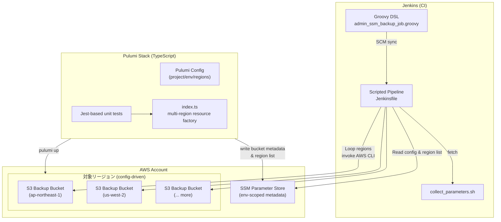

# Codex Agent 実行ログ

開始日時: 2025/10/15 13:37:14

---

## Turn 1: スレッド開始

**Thread ID**: `0199e816-d5a9-7d00-8341-7bb4f9281150`

## Turn 2: ツール実行

**種別**: コマンド実行
**コマンド**: `bash -lc ls`
**ステータス**: completed (exit_code=0)

```text
ARCHITECTURE.md
CLAUDE.md
CONTRIBUTION.md
LICENSE
README.md
ansible
bootstrap
docs
jenkins
pulumi
run_tests_issue_322.sh
scripts
```

## Turn 3: ツール実行

**種別**: コマンド実行
**コマンド**: `bash -lc "sed -n '1,220p' jenkins/jobs/pipeline/admin/ssm-backup/Jenkinsfile"`
**ステータス**: completed (exit_code=0)

```text
@Library('jenkins-shared-lib') _

def regionList = []
def regionSummaries = [:]
def pipelineContext = [
    metadataBasePath: "/jenkins/${params.ENVIRONMENT}/backup",
]

node('ec2-fleet') {
    timestamps {
        def ssmHomeRegion = env.SSM_HOME_REGION ?: 'ap-northeast-1'
        def workDirRelative = "backup-work"
        def dataDirRelative = "${workDirRelative}/data"
        def scriptDirRelative = "${workDirRelative}/scripts"
        def workDir = "${env.WORKSPACE}/${workDirRelative}"
        def dataDir = "${env.WORKSPACE}/${dataDirRelative}"
        def scriptDir = "${env.WORKSPACE}/${scriptDirRelative}"
        def envFilter = "/${params.ENVIRONMENT}/"
        env.SSM_HOME_REGION = ssmHomeRegion
        env.WORK_DIR = workDir
        env.DATA_DIR = dataDir
        env.SCRIPT_DIR = scriptDir
        env.ENV_FILTER = envFilter

        try {
            stage('Initialize') {
                env.BACKUP_DATE = sh(script: "date '+%Y-%m-%d'", returnStdout: true).trim()
                env.BACKUP_TIMESTAMP = sh(script: "date '+%Y%m%d_%H%M%S'", returnStdout: true).trim()

                sh """
                    rm -rf ${workDir}
                    mkdir -p ${dataDir}
                    mkdir -p ${scriptDir}
                """

                def regionListJson = sh(
                    script: """
                        aws ssm get-parameter \\
                            --name "${pipelineContext.metadataBasePath}/region-list" \\
                            --query 'Parameter.Value' \\
                            --output text \\
                            --region ${ssmHomeRegion} 2>/dev/null || echo ""
                    """,
                    returnStdout: true
                ).trim()

                if (!regionListJson?.trim()) {
                    error("Region list parameter '${pipelineContext.metadataBasePath}/region-list' is missing or empty.")
                }

                regionList = readJSON(text: regionListJson)
                if (!(regionList instanceof List) || regionList.isEmpty()) {
                    error("Region list is empty. Pulumi config must define at least one region.")
                }

                regionList = regionList.collect { it.toString() }

                def defaultRegionValue = sh(
                    script: """
                        aws ssm get-parameter \\
                            --name "${pipelineContext.metadataBasePath}/default-region" \\
                            --query 'Parameter.Value' \\
                            --output text \\
                            --region ${ssmHomeRegion} 2>/dev/null || echo ""
                    """,
                    returnStdout: true
                ).trim()

                if (!defaultRegionValue) {
                    error("Default region parameter '${pipelineContext.metadataBasePath}/default-region' is missing.")
                }

                if (!regionList.contains(defaultRegionValue)) {
                    error("Default region '${defaultRegionValue}' is not part of configured region list ${regionList}.")
                }

                env.DEFAULT_REGION = defaultRegionValue

                def legacyBucket = sh(
                    script: """
                        aws ssm get-parameter \\
                            --name "${pipelineContext.metadataBasePath}/s3-bucket-name" \\
                            --query 'Parameter.Value' \\
                            --output text \\
                            --region ${ssmHomeRegion} 2>/dev/null || echo ""
                    """,
                    returnStdout: true
                ).trim()

                if (legacyBucket) {
                    env.BACKUP_BUCKET = legacyBucket
                }

                currentBuild.displayName = "#${env.BUILD_NUMBER} - ${params.ENVIRONMENT} Backup"
                currentBuild.description = "Regions=${regionList.join(',')} | Default=${defaultRegionValue}"

                echo """
... (truncated)
```

## Turn 4: ツール実行

**種別**: コマンド実行
**コマンド**: `bash -lc "sed -n '220,480p' jenkins/jobs/pipeline/admin/ssm-backup/Jenkinsfile"`
**ステータス**: completed (exit_code=0)

```text
script: """
            aws ssm get-parameter \\
                --name "${parameterName}" \\
                --query 'Parameter.Value' \\
                --output text \\
                --region ${ssmHomeRegion} 2>/dev/null || echo ""
        """,
        returnStdout: true
    ).trim()

    if (!bucketName) {
        error("Bucket definition missing for region ${region}. Expected SSM parameter ${parameterName}.")
    }

    def regionDataDir = "${dataDirRoot}/${region}"
    sh """
        rm -rf ${regionDataDir}
        mkdir -p ${regionDataDir}
    """

    return [
        environment   : environment,
        region        : region,
        bucketName    : bucketName,
        regionDataDir : regionDataDir,
    ]
}

def runBackupForRegion(Map ctx, boolean dryRun) {
    def envFilter = ctx.envFilter
    def scriptDir = ctx.scriptDir
    def backupDate = ctx.backupDate
    def backupTimestamp = ctx.backupTimestamp
    def environment = ctx.environment
    def region = ctx.region
    def regionDataDir = ctx.regionDataDir
    def bucketName = ctx.bucketName
    def defaultRegion = ctx.defaultRegion

    def backupJsonPath = "${regionDataDir}/backup.json"
    def backupFileName = "ssm-backup-${environment}-${region}-${backupTimestamp}.json"
    def backupFilePath = "${regionDataDir}/${backupFileName}"
    def s3Key = "${backupDate}/${region}/${backupFileName}"

    withEnv([
        "ENVIRONMENT=${environment}",
        "ENV_FILTER=${envFilter}",
        "AWS_REGION=${region}",
        "BACKUP_DATE=${backupDate}",
        "BACKUP_TIMESTAMP=${backupTimestamp}",
        "DATA_DIR=${regionDataDir}",
        "TARGET_REGION=${region}",
    ]) {
        sh """
            rm -f ${regionDataDir}/*
            ${scriptDir}/collect_parameters.sh
        """
    }

    if (!fileExists(backupJsonPath)) {
        error("Backup file was not created for region ${region}.")
    }

    sh "cp ${backupJsonPath} ${backupFilePath}"

    def backupData = readJSON file: backupJsonPath
    def parameterCount = (backupData.parameter_count ?: backupData.parameterCount ?: 0) as int

    def summaryPath = "${regionDataDir}/summary.json"
    writeJSON file: summaryPath, json: [
        region         : region,
        parameterCount : parameterCount,
        s3Key          : s3Key,
        dryRun         : dryRun,
    ], pretty: 4

    if (!dryRun && parameterCount > 0) {
        sh """
            aws s3 cp ${backupFilePath} \
                s3://${bucketName}/${s3Key} \
                --sse AES256 \
                --region ${region}
        """

        sh """
            echo '${s3Key}' | aws s3 cp - s3://${bucketName}/latest-${region}.txt \
                --sse AES256 \
                --region ${region}
        """

        if (region == defaultRegion) {
            sh """
                echo '${s3Key}' | aws s3 cp - s3://${bucketName}/latest.txt \
                    --sse AES256 \
                    --region ${region}
            """
        }

        def objectInfo = sh(
            script: """
                aws s3api head-object \\
                    --bucket ${bucketName} \\
                    --key ${s3Key} \\
                    --query '[ContentLength, LastModified]' \\
                    --output text \\
                    --region ${region}
            """,
            returnStdout: true
        ).trim()

        echo "S3 Object Info [${region}]: ${objectInfo}"
    } else if (dryRun) {
        echo "[DRY RUN] Skipped S3 upload for ${region}. Planned key: ${s3Key}"
    } else {
        echo "No parameters to upload for ${region}. Skipping S3 upload."
    }

    return [
        parameterCount : parameterCount,
        s3Key          : s3Key,
        backupFilePath : backupFilePath,
        summaryPath    : summaryPath,
    ]
}

def emitRunSummary(Map regionSummaries, String environment, boolean dryRun) {
    echo """
    =============================================
    SSM Parameter Store Backup Summary
    ===================
... (truncated)
```

## Turn 5: ツール実行

**種別**: コマンド実行
**コマンド**: `bash -lc "sed -n '1,200p' .ai-workflow/issue-391/02_design/output/design.md"`
**ステータス**: completed (exit_code=0)

```text
# Issue #391 詳細設計書: SSMバックアップのマルチリージョン対応

## 1. アーキテクチャ設計

### 1.1 システム全体図


### 1.2 コンポーネント間の関係
- **Pulumi**: リージョン配列に基づき AWS Provider を切り替え、S3 バケット＋SSM パラメータをリージョンごとに生成。メタデータ（リージョン一覧、デフォルトリージョン、レガシー互換キー）を SSM に書き込む。
- **Jenkins Pipeline**: SSM からリージョン一覧を読み取り、Scripted Pipeline でリージョンごとのステージを動的生成しつつ逐次バックアップ処理・S3 アップロード・ログ集計を実施。失敗時は即座に後続リージョンをスキップ。
- **collect_parameters.sh**: Jenkins 各ステージからリージョン別に呼び出される共通スクリプト。AWS_REGION 等の環境変数を受け取り、該当リージョンの SSM からパラメータを収集して JSON 化。
- **Groovy DSL**: UI パラメータを変更せず、説明文・スケジューリング・タイムアウトなどのメタ情報だけを調整。

### 1.3 データフロー
1. 運用チームが Pulumi config (`regions`, `defaultRegion`) を更新し、`pulumi up` 実行でターゲットリージョン毎の S3 バケットと `/jenkins/{env}/backup/{region}/s3-bucket-name` パラメータを作成。
2. Pulumi は同時に `/jenkins/{env}/backup/region-list`（JSON 配列）と `/jenkins/{env}/backup/s3-bucket-name`（互換用デフォルトバケット）も更新。
3. Jenkins DSL がスケジュールジョブを定義し、パイプライン起動時に `Initialize` ステージでリージョン一覧を SSM から取得し JSON→List へ変換。
4. Scripted Pipeline のメインループがリージョンごとに `stage("Backup ${region}")` を生成し、各ステージ内で
   - 対象リージョンに切り替えた AWS CLI で SSM を参照しバケット名を取得
   - `collect_parameters.sh` を対象リージョン向けディレクトリで実行
   - DRY_RUN フラグに応じたアップロード（AES256）と最新ポインタ更新を実行し、結果をステージローカルのマップへ格納
5. 全リージョンの結果は `regionSummaries` に蓄積され、`Finalize Report` ステージで `region_summaries.json` として出力した後、post セクションで Slack／メール通知（7.7節）を送信する。失敗時は `error()` で即停止し、失敗リージョンと原因が通知に含まれる。

## 2. 実装戦略: EXTEND

**判断根拠**:
- 既存の Pulumi スタックと Jenkins パイプラインを土台に、多リージョン化のための設定値・ループ処理を追加する拡張作業が主体（FR-1, FR-3）。
- 既存 SSM キーを互換維持しながらリージョン別キーを増やす方針で、新規システムを構築するのではなく現状の IaC/CI を拡張する形となる（FR-2, FR-4）。

## 3. テスト戦略: UNIT_INTEGRATION

**判断根拠**:
- Pulumi 側はリージョン配列→リソース生成ロジックの分岐が増えるため、mocks を用いたユニットテストでリソース数・命名規則・タグを検証する必要がある（FR-1, NFR-保守性）。
- Jenkins パイプラインは多ステージ逐次実行とエラー制御を含むため、jenkinsfile-runner を使った dry-run 統合テストでリージョン別ステージ生成・失敗時の停止挙動を検証する（FR-3, NFR-可用性）。

## 4. テストコード戦略: CREATE_TEST

**判断根拠**:
- `pulumi/jenkins-ssm-backup-s3` には自動テストが存在しないため、Jest ベースの新規テストスイートを作成する必要がある。
- Jenkins パイプラインにも既存テストがないため、jenkinsfile-runner を呼び出す新規スクリプト＋サンプル設定を追加して自動検証を実現する。

## 5. 影響範囲分析
- **Pulumi IaC**: `index.ts` のロジック刷新、Pulumi config ファイル（dev/prod）へのリージョン配列・デフォルトリージョン設定追加、`package.json` のテスト依存追加。
- **Jenkins Pipeline**: `Jenkinsfile` を Declarative から Scripted へ移行し、ステージ再編（Initialize → Config load、Regional loop 化）と失敗制御・ログ整備を追加。
- **Jenkins DSL**: UI パラメータ不変のまま説明文・タイムアウト・ビルド制御パラメータを見直し多リージョン実行時間を許容。
- **スクリプト**: `collect_parameters.sh` でリージョン名をログ出力し、複数回実行時のディレクトリ競合を防ぐ。
- **ドキュメント**: Runbook/README にリージョン追加/削除手順・ロールバック方針および Pulumi config 更新手順を追記。
- **その他**: Jenkins dry-run 用コンテナ利用方法を開発者ガイドに追記（テスト戦略反映）。

## 6. 変更・追加ファイルリスト
| 区分 | ファイル/パス | 目的 |
| ---- | ------------- | ---- |
| 既存修正 | `pulumi/jenkins-ssm-backup-s3/index.ts` | 多リージョン対応ロジック、SSM メタデータ生成、命名規則の抽象化 |
| 既存修正 | `pulumi/jenkins-ssm-backup-s3/Pulumi.dev.yaml`<br>`pulumi/jenkins-ssm-backup-s3/Pulumi.prod.yaml` | `regions`, `defaultRegion` 等の config 追加 |
| 既存修正 | `pulumi/jenkins-ssm-backup-s3/package.json` | テスト実行 (`jest`, `ts-jest`, `@
... (truncated)
```

## Turn 6: ツール実行

**種別**: コマンド実行
**コマンド**: `bash -lc 'rg "7.7" -n .ai-workflow/issue-391/02_design/output/design.md'`
**ステータス**: failed (exit_code=127)

```text
bash: line 1: rg: command not found
```

## Turn 7: ツール実行

**種別**: コマンド実行
**コマンド**: `bash -lc 'grep -n "7.7" -n .ai-workflow/issue-391/02_design/output/design.md'`
**ステータス**: completed (exit_code=0)

```text
54:5. 全リージョンの結果は `regionSummaries` に蓄積され、`Finalize Report` ステージで `region_summaries.json` として出力した後、post セクションで Slack／メール通知（7.7節）を送信する。失敗時は `error()` で即停止し、失敗リージョンと原因が通知に含まれる。
200:| FR-5 | 通知計画と運用責務整理（7.7, 9, 10 節） |
202:### 7.7 通知計画 (FR-5)
```

## Turn 8: ツール実行

**種別**: コマンド実行
**コマンド**: `bash -lc "sed -n '202,260p' .ai-workflow/issue-391/02_design/output/design.md"`
**ステータス**: completed (exit_code=0)

```text
### 7.7 通知計画 (FR-5)
- **対象者**  
  - Jenkins ジョブ実行者（運用チーム当番・オンコール SRE）  
  - CLI 経由でバックアップ結果を参照する開発チーム  
- **チャネル**  
  - Slack `#infra-backup-alerts`: Jenkins post セクションから `slackSend` で成功/失敗を通知。本文には `region_summaries.json` の要約（成功・失敗リージョン、件数、duration）と Runbook リンクを含める。  
  - メール `ops-alerts@example.com`: `emailext` で日次ジョブ成功時にリージョン別サマリを送付。失敗時は件名に `[FAIL]` を付与し、オンコール SRE を CC。  
- **タイミング**  
  - パイプライン `post { success { ... } failure { ... } aborted { ... } }` で即時通知。  
  - Pulumi config でリージョンを増減した際は同日の業務時間内に Slack `#infra-announcements` へ計画通知（運用担当が手動で投稿）。  
  - 障害発生時は Runbook に従い 30 分以内に状況報告、復旧後 1 営業日以内に事後報告。  
- **責任者**  
  - ジョブオーナー: インフラチームリード（Jenkins folder owner）  
  - オンコール SRE: 通知を受領し Runbook 手順でリカバリーを実施。  
  - Pulumi オペレーター: config 変更時の事前通知・ロールバック判断を担当。  
- **テスト/検証**  
  - jenkinsfile-runner dry-run 時に Slack Webhook 先をダミー URL (`http://localhost:18080/slack`) に切り替え、`tests/jenkinsfile_runner.sh` で起動する簡易 HTTP サーバ（`python -m http.server 18080`）で受信したペイロードを `tests/output/slack_payload.json` に保存しリージョン要約が含まれることを確認。  
  - 本番導入前にステージングジョブで成功/失敗ケースを実行し、Slack/メール双方で想定文面を確認する。  
- **Runbook 更新**  
  - 通知チャネルと責任者、ロールバック時の連絡テンプレートを `docs/runbooks/ssm-backup.md` に追記。  
  - CLI 利用者向け FAQ に「どのタイミングで通知が届くか」「障害報告をどこで確認するか」を追加。

## 8. セキュリティ考慮事項
- **認証・認可**: Pulumi/Jenkins は既存 IAM ロールを継続利用。リージョン追加時に該当リージョンへの S3/SSM 権限があることを事前検証。jenkinsfile-runner テストでは資格情報をモックし、実際の AWS 認証情報を使用しない。
- **データ保護**: すべての S3 バケットに SSE-S3 (`AES256`) を強制し、バケットポリシーで未暗号化アップロードを拒否。Public Access Block を全リージョンで有効化。SSM パラメータは `SecureString` を維持（bucket 名は `String` で問題ないが、将来的に暗号化情報を扱う場合のテンプレートを整備）。
- **監査ログ**: Region ごとのバックアップ成功/失敗を Jenkins ログに記録し、後日 CloudTrail/S3 Access Log と突合できるようログフォーマットを標準化。Runbook にアラート発報手順を追記。

## 9. 非機能要件への対応
- **パフォーマンス**: ステージ毎のタイムアウトを 10 分に設定し、リージョン数に応じた合計を Scripted Pipeline のトップレベル `timeout(time: regionList.size()*10 + 30, unit: 'MINUTES')` でガード。AWS CLI のリトライは現行スクリプトの指数バックオフを再利用。
- **スケーラビリティ**: Pulumi config のリージョン配列を変更するだけで対応リージョンを増減可能。Jenkins は動的ステージ生成によりコード変更なくリスト変化に追随。
- **保守性**: Pulumi テストと Jenkins dry-run を CI へ組み込み、リージョン追加の回帰を早期検知。`bucketMap` エクスポートにより運用チームが CLI で状況確認しやすくする。
- **可用性**: 失敗時に早期停止し、post セクションで失敗リージョンを明示。Runbook にはロールバック手順と再実行ガイドを追記。

## 10. 実装の順序
1. **Pulumi Config/コード修正**: `index.ts` を多リージョン化し、config ファイルとテスト依存を更新。
2. **Pulumi ユニットテスト作成**: Jest セットアップと mocks を実装し、`npm test` で緑に。
3. **Jenkins Pipeline リファクタ**: `Jenkinsfile` を Scripted Pipeline へ移行し、ヘルパーメソッド／リージョンループを実装して jenkinsfile-runner dry-run で検証。
4. **collect_parameters.sh 調整**: リージョン別ディレクトリ／ログの拡充を反映。
5. **Jenkins DSL 更新**: 説明・タイムアウト・ドキュメントリンクの修正。
6. **jenkinsfile-runner テスト追加**: テストスクリプト整備とドキュメント化。
7. **Runbook/README 更新**: リージョン増減・Pulumi config 変更手順、ロールバック手順を明文化。
8. **統合テスト**: Pulumi preview、jenkinsfile-runner dry-run、本番想定リージョンのスポットテスト。

---

### 品質ゲート確認
- ✅ 実装戦略 (EXTEND) と判断根拠を明記
- ✅ テスト戦略 (UNIT_INTEGRATION) の判断根拠を明記
- ✅ 既存コードへの影響範囲を分析
- ✅ 必要な変更ファイルをリストアップ
- ✅ 実装手順と詳細設計で実現可能性を担保
```

## Turn 9: ツール実行

**種別**: コマンド実行
**コマンド**: `bash -lc "sed -n '1,200p' docs/runbooks/ssm-backup.md"`
**ステータス**: completed (exit_code=0)

```text
# SSM Parameter Store Backup Runbook

## 概要
- 対象ジョブ: `Admin_Jobs/admin_ssm_backup_job`
- 目的: Pulumi が生成した各リージョンの S3 バケットへ、SSM Parameter Store の内容を暗号化した JSON として日次バックアップする。
- リージョン構成: Pulumi Config (`pulumi/jenkins-ssm-backup-s3/Pulumi.<env>.yaml`) の `regions` 配列に従い動的に決定。
- メタデータ保管: `/jenkins/<env>/backup/` プレフィックスの SSM パラメータ（`region-list`, `default-region`, `s3-bucket-name`, `<region>/s3-bucket-name`）。

## 運用手順
1. Jenkins ジョブが自動実行（毎日 JST 22:00）。開始時に `Initialize` ステージでリージョン一覧とデフォルトリージョンを SSM から取得。
2. `Backup <region>` ステージがリージョンごとに逐次実行され、`collect_parameters.sh` を用いて SSM パラメータを収集。
3. 取得した JSON は `s3://<bucket>/<YYYY-MM-DD>/<region>/ssm-backup-<env>-<region>-<timestamp>.json` にアップロードされ、`latest-<region>.txt`（デフォルトリージョンは互換用に `latest.txt` も更新）を発行。
4. 実行結果は `backup-work/region_summaries.json` に出力され、アーティファクトとして保存。Slack/メール通知には同ファイルの要約を添付。

## リージョン追加・削除手順
1. `pulumi/jenkins-ssm-backup-s3/Pulumi.<env>.yaml` の `regions` 配列を更新し、`defaultRegion` と `ssmHomeRegion` を必要に応じて調整。
2. Pulumi スタックディレクトリで `npm install`（依存未導入時）後、`npm run build` → `pulumi preview` を実施し差分を確認。
3. 変更内容をレビュー後、`pulumi up` を本番／ステージング順に適用。
4. Jenkins ジョブをドライラン（`DRY_RUN=true`）で実行し、`Backup <region>` ステージが追加リージョンを認識することを確認。
5. 運用チームへ Slack `#infra-announcements` でリージョン変更点と実施日時を共有。

## ロールバック手順
1. Pulumi Config を直前のコミットへ戻し `pulumi up` を実行。不要になった S3 バケットと SSM パラメータが削除されることを `pulumi preview` で確認。
2. Jenkins ジョブを手動実行し、`region_summaries.json` に旧構成のみが記録されることを確認。
3. 影響が大きい場合は Runbook の通知テンプレートを利用し、CLI 利用者とオンコール SRE へ速やかに連絡。

## 監視・通知
- 成功時: Slack `#infra-backup-alerts` にリージョン別件数・処理時間を通知。メール `ops-alerts@example.com` に同内容のサマリーを送付。
- 失敗時: 失敗リージョンの `message` が通知ペイロードに含まれる。30 分以内に一次報告、復旧後 1 営業日以内に事後報告を行う。
- 参照ログ: Jenkins 実行ログ・`backup-work/region_summaries.json`・S3 バケットの `latest-<region>.txt`。

## トラブルシューティング
| 症状 | 対処 |
| ---- | ---- |
| `Region list parameter ... is missing` | Pulumi スタックが未適用。`pulumi config get regions` と SSM の `/backup/region-list` を確認。 |
| `Bucket definition missing for region` | `/backup/<region>/s3-bucket-name` の作成漏れ。Pulumi Config のリージョン一覧と SSM を照合。 |
| `Backup file was not created` | `collect_parameters.sh` の AWS 認証／フィルタ設定を確認。`DATA_DIR/<region>` に生成物があるか検証。 |
| S3 アップロードに失敗 | `aws s3 cp` コマンドのエラー詳細をログで確認。IAM 権限またはリージョン設定を見直し。 |

## 参考コマンド
```bash
# Pulumi Stack でリージョンを確認
pulumi config get regions --path --stack <env>

# Jenkins アーティファクトからサマリーを取得
aws s3 cp s3://<bucket>/<YYYY-MM-DD>/<region>/ssm-backup-<env>-<region>-<timestamp>.json ./
```
```

## Turn 10: ツール実行

**種別**: コマンド実行
**コマンド**: `bash -lc "sed -n '1,220p' jenkins/jobs/pipeline/admin/ssm-backup/scripts/collect_parameters.sh"`
**ステータス**: completed (exit_code=0)

```text
#!/bin/bash
# SSM Parameter Collection and Backup Script
# SSMパラメータを収集してバックアップファイルを作成
# 
# 使用方法:
#   このスクリプトは環境変数を通じて設定を受け取ります
#   必須環境変数:
#     - ENVIRONMENT: バックアップ対象の環境 (dev/prod)
#     - ENV_FILTER: パラメータフィルタ文字列 (/dev/, /prod/)
#     - AWS_REGION: AWSリージョン
#     - BACKUP_DATE: バックアップ日付 (YYYY-MM-DD)
#     - BACKUP_TIMESTAMP: バックアップタイムスタンプ
#     - DATA_DIR: データ出力ディレクトリ
#
# 戻り値:
#   0: 正常終了
#   1: エラー発生

set -euo pipefail

echo "======================================"
echo "SSM Parameter Collection Script"
echo "======================================"
echo "Environment: ${ENVIRONMENT}"
echo "Filter: ${ENV_FILTER}"
echo "Region: ${AWS_REGION}"
echo "Backup Date: ${BACKUP_DATE}"
echo "Backup Timestamp: ${BACKUP_TIMESTAMP}"
echo "Target Region: ${AWS_REGION}"
echo "======================================"

mkdir -p "${DATA_DIR}"
rm -f "${DATA_DIR}/"*

# AWS認証情報の確認
echo "Checking AWS credentials..."
if ! aws sts get-caller-identity --region ${AWS_REGION}; then
    echo "Error: Failed to get AWS credentials. Please check IAM role or credentials."
    exit 1
fi
echo "AWS credentials verified."

# AWS API呼び出しのリトライ機能
aws_cli_with_retry() {
    local max_retries=5
    local retry_delay=3  # 初期待機時間を長めに設定
    local retry_count=0
    
    while [ $retry_count -lt $max_retries ]; do
        # AWS CLIを実行（環境変数で制御）
        if output=$(AWS_PAGER="" AWS_CLI_AUTO_PROMPT=off "$@" 2>&1); then
            echo "$output"
            return 0
        else
            if echo "$output" | grep -q "ThrottlingException\|Rate exceeded"; then
                retry_count=$((retry_count + 1))
                echo "  Rate limit hit. Retry ${retry_count}/${max_retries} after ${retry_delay}s..." >&2
                sleep $retry_delay
                retry_delay=$((retry_delay * 2))  # Exponential backoff
                if [ $retry_delay -gt 60 ]; then
                    retry_delay=60  # Max delay 60s
                fi
            else
                echo "Error: $output" >&2
                return 1
            fi
        fi
    done
    
    echo "Error: Max retries reached" >&2
    return 1
}

# パラメータ一覧の取得（ページネーション対応、フィルタリング最適化）
fetch_all_parameters() {
    local next_token=""
    local page=1
    local all_params="[]"
    
    # 初回実行前に待機（レート制限対策）
    echo "Waiting 2 seconds before API calls to avoid rate limiting..." >&2
    sleep 2
    
    while true; do
        echo "Fetching page ${page}..." >&2
        
        # AWS CLIコマンドの実行とエラーハンドリング
        local result
        local error_msg
        
        if [ -n "$next_token" ]; then
            echo "  Executing: aws ssm describe-parameters with filter --region ${AWS_REGION}" >&2
            # パラメータフィルタの値を変数に格納
            local filter_value="${ENV_FILTER:1:-1}"  # /dev/ -> dev
            # リトライ機能を使用（--next-tokenを使用）
            if ! result=$(aws_cli_with_retry aws ssm describe-parameters \
                --next-token "$next_token" \
                --max-results 50 \
                --parameter-filters "Key=Name,Option=Contains,Values=$filter_value" \
                --output json \
                --region ${AWS_REGION}); then
                echo "Error: Failed to describe parameters" >&2
                echo '{"Parameters": [], "NextToken": null}'
                return 1
            fi
        else
            echo "  Executing: aws ssm describe-parameters with filter --region ${AWS_REGION}" >&2
            # パラメータフィルタの値を変数に格納
            local filter_value="${ENV_FILTER:1:-1}"  # /dev/ -> dev
            # リトライ機能を使用
            if ! result=$(aws_cli_with_retry aws ssm describe-parameters \
                --max-results 50 \
                --parameter-filters "Key=Name,Option=Contains,Values=$filter_value" \
                --output json \
                --region ${AWS_REGION}); then
                echo "Error: Failed to describe parameters" >&2
                echo '{"Parameters": [], "NextToken": null}'
                return 1
            fi
        fi
        
        # 結果が空またはエラーメッセージの場合の
... (truncated)
```

## Turn 11: ツール実行

**種別**: コマンド実行
**コマンド**: `bash -lc "sed -n '220,440p' jenkins/jobs/pipeline/admin/ssm-backup/scripts/collect_parameters.sh"`
**ステータス**: completed (exit_code=0)

```text
# バッチ処理でパラメータを取得
for ((i=0; i<$TOTAL_PARAMS; i+=BATCH_SIZE)); do
    # バッチの終了インデックスを計算
    end=$((i + BATCH_SIZE))
    if [ $end -gt $TOTAL_PARAMS ]; then
        end=$TOTAL_PARAMS
    fi
    
    # 進捗表示
    echo "Fetching parameters $((i + 1))-$end of ${TOTAL_PARAMS}..."
    
    # バッチ用のパラメータ名を準備
    batch_params=()
    for ((j=i; j<end; j++)); do
        batch_params+=("${PARAM_NAMES[$j]}")
    done
    
    # get-parameters（複数形）でバッチ取得
    if [ ${#batch_params[@]} -gt 0 ]; then
        # AWS CLIコマンドを直接実行（xargsを使わない）
        BATCH_RESULT=$(aws ssm get-parameters \
            --names "${batch_params[@]}" \
            --with-decryption \
            --output json \
            --region ${AWS_REGION} 2>/dev/null || echo '{"Parameters": [], "InvalidParameters": []}')
        
        # 取得成功したパラメータを追加
        VALID_PARAMS=$(echo "$BATCH_RESULT" | jq '.Parameters // []')
        if [ "$VALID_PARAMS" != "[]" ] && [ "$VALID_PARAMS" != "null" ]; then
            BACKUP_DATA=$(echo "$BACKUP_DATA" | jq --argjson new_params "$VALID_PARAMS" '. + $new_params')
        fi
        
        # 取得失敗したパラメータを記録
        INVALID_PARAMS=$(echo "$BATCH_RESULT" | jq -r '.InvalidParameters[]?' 2>/dev/null)
        if [ -n "$INVALID_PARAMS" ]; then
            while IFS= read -r invalid_param; do
                echo "Warning: Failed to get parameter: $invalid_param"
                FAILED_PARAMS+=("$invalid_param")
                FAILED_COUNT=$((FAILED_COUNT + 1))
            done <<< "$INVALID_PARAMS"
        fi
    fi
    
    # APIレート制限対策（バッチ間の待機時間を長めに）
    if [ $end -lt $TOTAL_PARAMS ]; then
        sleep 2
    fi
done

COUNTER=$TOTAL_PARAMS

echo "Successfully fetched $((COUNTER - FAILED_COUNT)) parameters"
if [ "$FAILED_COUNT" -gt 0 ]; then
    echo "Failed to fetch ${FAILED_COUNT} parameters"
fi

# バックアップファイルの作成
echo "Creating backup file..."
BACKUP_JSON=$(jq -n \
    --arg date "${BACKUP_DATE}" \
    --arg timestamp "${BACKUP_TIMESTAMP}" \
    --arg environment "${ENVIRONMENT}" \
    --arg count "$((COUNTER - FAILED_COUNT))" \
    --argjson parameters "$BACKUP_DATA" \
    '{
        backup_date: $date,
        backup_timestamp: $timestamp,
        environment: $environment,
        parameter_count: $count | tonumber,
        parameters: $parameters
    }')

echo "$BACKUP_JSON" | jq '.' > ${DATA_DIR}/backup.json

echo "======================================"
echo "Backup Summary"
echo "======================================"
echo "Backup file created: ${DATA_DIR}/backup.json"
echo "Total parameters backed up: $(echo "$BACKUP_JSON" | jq '.parameter_count')"
echo "Failed parameters: ${FAILED_COUNT}"
echo "======================================"

# サマリーファイルを生成して上位パイプラインで参照できるようにする
echo "Creating summary file..."
jq -n \
    --arg environment "${ENVIRONMENT}" \
    --arg region "${AWS_REGION}" \
    --arg backup_date "${BACKUP_DATE}" \
    --arg backup_timestamp "${BACKUP_TIMESTAMP}" \
    --argjson parameter_count "$(echo "$BACKUP_JSON" | jq '.parameter_count')" \
    --argjson failed_count $FAILED_COUNT \
    '{
        environment: $environment,
        region: $region,
        backup_date: $backup_date,
        backup_timestamp: $backup_timestamp,
        parameter_count: $parameter_count,
        failed_count: $failed_count
    }' > "${DATA_DIR}/summary.json"

echo "Summary file created: ${DATA_DIR}/summary.json"
```

## Turn 12: ツール実行

**種別**: コマンド実行
**コマンド**: `bash -lc 'grep -n "ops-alerts" -R'`
**ステータス**: completed (exit_code=0)

```text
docs/runbooks/ssm-backup.md:28:- 成功時: Slack `#infra-backup-alerts` にリージョン別件数・処理時間を通知。メール `ops-alerts@example.com` に同内容のサマリーを送付。
scripts/ai-workflow-v2@tmp/durable-bc8bbce0/jenkins-log.txt:392:[CODEX EVENT] {"type":"item.completed","item":{"id":"item_22","type":"command_execution","command":"bash -lc \"sed -n '120,220p' .ai-workflow/issue-391/02_design/output/design.md\"","aggregated_output":"  タグ: `Environment`, `ManagedBy=Pulumi`, `Region`, `Purpose=SSM Parameter Store Backup`, `DataClassification=Confidential`.  \n  バケットリソース名: `ssm-backup-bucket-${region}`（Pulumi logical nameにリージョンを含め Terraform 差分衝突を防止）。\n- **プロバイダー管理**  \n  `const provider = new aws.Provider(\\`region-${region}\\`, { region });` を生成し、各リージョンの S3 リソースは該当プロバイダーにバインド。SSM パラメータは `provider: defaultProvider` または `ssmHomeRegion`.\n- **非同期処理**  \n  `aws.getCallerIdentity()` の `Output` を `pulumi.all` で束ね、リージョンループ内で `apply` を用いて命名文字列を構築。\n- **エクスポート**  \n  `export const bucketMap = pulumi.output(regions.reduce(...))` で `{ region: bucketName }` マップを出力し、CI/Runbook から参照可能にする。\n\n### 7.2 Jenkins Pipeline 詳細\n- **パイプライン方式**\n  - Jenkinsfile を Scripted Pipeline へ切り替え、`node('ssm-backup') { ... }` ブロックでステージを定義する。これによりリージョン配列に基づき `stage(\"Backup ${region}\")` を Groovy ループで逐次生成でき、Declarative のステージネスト制約を回避。\n  - Jenkinsfile 内に共通関数（例: `loadRegionContext(region)`、`runBackupForRegion(ctx)`）を定義し、AWS CLI 呼び出しやエラーハンドリングを集約する。\n- **グローバル変数**\n  - `def regionList = []` と `def regionSummaries = [:]` を `node` ブロック直下で初期化し、リージョン一覧とリージョン別結果を管理。`regionSummaries` には `{status, parameterCount, artifactPath, failureMessage}` を格納。\n  - 既存の `env.SSM_HOME_REGION`, `env.WORK_DIR`, `env.DATA_DIR`, `env.DRY_RUN` は `withEnv` で引き継ぎ、リージョン処理時に `REGION_DATA_DIR = \"${env.DATA_DIR}/${region}\"` を付与。\n- **リージョンコンテキスト取得**\n  - `loadRegionContext(region)` 内で `/jenkins/${env}/backup/${region}/s3-bucket-name` を `aws ssm get-parameter` で取得し、存在しない場合は `error(\"Bucket definition missing for ${region}\")`。\n  - `collect_parameters.sh` 実行結果 (`results/summary.json`) から `parameterCount` を読み取り、S3 へアップロードするアーティファクトパスを返す。\n  - 取得結果は `return [bucket: ..., dataDir: ..., summaryPath: ...]` のように Map で返却し、ループ内で使い回す。\n- **ステージ構成**\n  1. `stage('Initialize')`\n     - `/jenkins/${env}/backup/region-list` を取得し `readJSON` で配列化。空配列なら `error('No regions configured')` で早期終了。\n     - `/jenkins/${env}/backup/default-region` と `/jenkins/${env}/backup/s3-bucket-name` を照合し後方互換を確認。\n     - `currentBuild.description` に `Regions=[...], Default=...` を記録し、post 通知向けに `env.REGION_LIST = regionList.join(',')` を設定。\n  2. `stage('Prepare Scripts')`\n     - リポジトリ checkout、`collect_parameters.sh` の実行権限付与、jenkinsfile-runner テスト資材の配置確認を実施。\n  3. `for (region in regionList) { stage(\"Backup ${region}\") { ... } }`\n     - `withEnv([\"TARGET_REGION=${region}\", \"AWS_REGION=${region}\", \"REGION_DATA_DIR=${env.DATA_DIR}/${region}\"])` で環境を切り替え。\n     - `loadRegionContext(region)` を呼び出し、取得したバケット名でアップロード。DRY_RUN 時は `echo \"[DRY RUN] Skipped upload for ${region}\"` のみ出力。\n     - 正常終了時は `regionSummaries[region] = [status: 'SUCCESS', parameterCount: ctx.parameterCount, artifactPath: ctx.archivePath]` をセット。\n     - 例外発生時は `regionSummaries[region] = [status: 'FAILED', failureMessage: err.getMessage()]` とし、`error(err.message)` でパイプラインを停止。\n  4. `stage('Finalize Report')`\n     - `writeJSON file: 'region_summaries.json', json: regionSummaries` と `archiveArtifacts artifacts: 'region_summaries.json'` を実施。\n     - Runbook で参照するための最新成果物パスを `env.REGION_SUMMARY_PATH` に設定。\n- **エラー制御**\n  - Scripted Pipeline の `try/catch` でリージョン単位の例外を補足し、`regionSummaries` に失敗理由を残したうえで `error()` を再送する。\n  - 逐次ループのため、失敗リージョン以降のステージは生成されない。リトライ時には Jenkins の `Replay` 機能でリージョン増減を確認可能。\n- **メトリクス／ログ**\n  - `collect_parameters.sh` は `summary.json` に `{\"parameterCount\": 123, \"executionTimeSec\": 45}` を出力し、パイプラインが `readJSON` で読み込む。\n  - `currentBuild.description` と `region_summaries.json` を post セクションの Slack/Mail 通知テンプレートに渡し、リージョン別結果を通知。\n\n### 7.3 Jenkins DSL (`admin_ssm_backup_job.groovy`)\n-
... (truncated)
```

## Turn 13: ツール実行

**種別**: コマンド実行
**コマンド**: `bash -lc "sed -n '1,200p' .ai-workflow/issue-391/04_implementation/output/implementation.md"`
**ステータス**: completed (exit_code=0)

```text
# 実装ログ

## 実装サマリー
- 実装戦略: EXTEND
- 変更ファイル数: 9個
- 新規作成ファイル数: 2個

## 変更ファイル一覧

### 新規作成
- `docs/runbooks/ssm-backup.md`: マルチリージョン運用手順・ロールバック・通知フローを整理したRunbook
- `.ai-workflow/issue-391/04_implementation/output/implementation.md`: 本フェーズの実装内容を記録

### 修正
- `pulumi/jenkins-ssm-backup-s3/index.ts`: 多リージョンS3/SSMリソース生成と地域メタデータ出力に対応
- `pulumi/jenkins-ssm-backup-s3/Pulumi.dev.yaml`: リージョン配列・デフォルトリージョン・SSMホームリージョンを追加
- `pulumi/jenkins-ssm-backup-s3/Pulumi.prod.yaml`: 本番スタック用に同上設定を追加
- `pulumi/jenkins-ssm-backup-s3/package.json`: Jest系依存と`jest --passWithNoTests`スクリプトを定義
- `jenkins/jobs/pipeline/admin/ssm-backup/Jenkinsfile`: Scripted Pipeline化とリージョン逐次ステージ/サマリ生成を実装
- `jenkins/jobs/pipeline/admin/ssm-backup/scripts/collect_parameters.sh`: リージョンログ/ディレクトリ初期化/summary出力を追加
- `jenkins/jobs/dsl/admin/admin_ssm_backup_job.groovy`: 説明文・実行時間注記をマルチリージョン対応へ更新
- `.ai-workflow/issue-391/metadata.json`: ワークフロー管理情報がimplementationフェーズに遷移

## 実装詳細

### ファイル1: pulumi/jenkins-ssm-backup-s3/index.ts
- **変更内容**: リージョン配列を検証し、リージョンごとにProviderを切り替えてS3バケット/パブリックアクセスブロック/ポリシー/SSMパラメータを生成。既存互換キーとリージョンリスト/デフォルトリージョンのメタデータを出力し、`bucketMap` をエクスポート。
- **理由**: PulumiスタックでFR-1/FR-2のマルチリージョン要件を満たし、Jenkins側がリージョン一覧とバケット名を参照できるようにするため。
- **注意点**: `regions` と `defaultRegion` のPulumi Config設定が必須。`ssmHomeRegion` を変更する場合はJenkinsパイプラインの環境変数とも整合させる。

### ファイル2: pulumi/jenkins-ssm-backup-s3/Pulumi.dev.yaml
- **変更内容**: `regions`, `defaultRegion`, `ssmHomeRegion` を追加し、Dev環境の多リージョン構成を定義。
- **理由**: Pulumiコードの新しい入力インターフェースに合わせるため。
- **注意点**: 本番と異なるリージョン構成にする場合は`defaultRegion`を必ず配列内に含める。

### ファイル3: pulumi/jenkins-ssm-backup-s3/Pulumi.prod.yaml
- **変更内容**: Prod環境用にDevと同様のマルチリージョン設定フィールドを追加。
- **理由**: Pulumiスタックを本番でも同じインターフェースで動かすため。
- **注意点**: 本番のリージョン変更時はRunbookに従い事前告知と`pulumi preview`を実行する。

### ファイル4: pulumi/jenkins-ssm-backup-s3/package.json
- **変更内容**: Jest/ts-jest/@types/jestをdevDependenciesに追加し、`npm test`でエラーとならないよう`jest --passWithNoTests`を設定。
- **理由**: Phase 5で追加予定のユニットテスト基盤を事前に整え、今フェーズでもTypeScriptビルド確認が可能な状態にするため。
- **注意点**: `npm install`実行後は`node_modules`をコミットしないよう注意。

### ファイル5: jenkins/jobs/pipeline/admin/ssm-backup/Jenkinsfile
- **変更内容**: DeclarativeからScripted Pipelineへ移行し、SSMから取得したリージョン配列で逐次ステージを生成。リージョンごとのバックアップ実行、S3アップロード（地域別`latest-<region>.txt`とデフォルト用`latest.txt`）、`region_summaries.json`の生成、ポストサマリー出力を実装。
- **理由**: FR-3の逐次処理/失敗制御要件に対応しつつ、リージョン数に応じた動的ステージ生成とメタ情報出力を実現するため。
- **注意点**: SSMホームリージョンを変える場合は Jenkins ノードに `SSM_HOME_REGION` 環境変数を設定する。S3アップロードはパラメータ数0の場合にスキップする仕様。

### ファイル6: jenkins/jobs/pipeline/admin/ssm-backup/scripts/collect_parameters.sh
- **変更内容**: 実行前に出力ディレクトリを初期化し、ターゲットリージョンをログに出力。バックアップ処理後にリージョン別サマリーJSONを生成。
- **理由**: 多リージョン実行時にファイル衝突を避け、パイプラインで参照できる統一フォーマットのサマリーを提供するため。
- **注意点**: jq/AWS CLI依存は従来通り。DRY_RUN時はパイプライン側で制御する。

### ファイル7: jenkins/jobs/dsl/admin/admin_ssm_backup_job.groovy
- **変更内容**: ジョブ説明とcronコメントをマルチリージョン運用向けに更新し、Runbook参照先を明示。
- **理由**: FR-4の「UIパラメータ変更なしで多リージョン対応」の方針を維持しつつ利用者への注意点を明文化するため。
- **注意点**: 説明文内のRunbookパス変更時は併せて更新する。

### ファイル8: docs/runbooks/ssm-backup.md
- **変更内容**: バックアップジョブの概要、リージョン追加/削除手順、ロールバック、通知、トラブルシューティングを整理。
- **理由**: 運用チームが多リージョン化後の手順と連絡フローを即座に参照できるようにするため。
- **注意点**: Pulumi Configや通知チャネルを更新したら本Runbookも同期する。

### ファイル9: .ai-workflow/issue-391/metadata.json
- **変更内容**: ワークフロー状態が implementation フェーズ開始を示すよう自動更新。
- **理由**: AIワークフローの進行管理に伴うメタ情報更新。
- **注意点**: システム更新のため手動で編集しない。

## 次のステップ
- Phase 5（test_implementation）でPulumi/Jenkinsの自動テストコードを追加し`npm test`/jenkinsfile-runner検証を実装
- Phase 6（testing）で`pulumi preview`とjenkinsfile-runner dry-runを実施し、マルチリージョン挙動を確認
```

## Turn 14: ツール実行

**種別**: コマンド実行
**コマンド**: `bash -lc "sed -n '60,140p' jenkins/jobs/pipeline/admin/ssm-backup/Jenkinsfile"`
**ステータス**: completed (exit_code=0)

```text
aws ssm get-parameter \\
                            --name "${pipelineContext.metadataBasePath}/default-region" \\
                            --query 'Parameter.Value' \\
                            --output text \\
                            --region ${ssmHomeRegion} 2>/dev/null || echo ""
                    """,
                    returnStdout: true
                ).trim()

                if (!defaultRegionValue) {
                    error("Default region parameter '${pipelineContext.metadataBasePath}/default-region' is missing.")
                }

                if (!regionList.contains(defaultRegionValue)) {
                    error("Default region '${defaultRegionValue}' is not part of configured region list ${regionList}.")
                }

                env.DEFAULT_REGION = defaultRegionValue

                def legacyBucket = sh(
                    script: """
                        aws ssm get-parameter \\
                            --name "${pipelineContext.metadataBasePath}/s3-bucket-name" \\
                            --query 'Parameter.Value' \\
                            --output text \\
                            --region ${ssmHomeRegion} 2>/dev/null || echo ""
                    """,
                    returnStdout: true
                ).trim()

                if (legacyBucket) {
                    env.BACKUP_BUCKET = legacyBucket
                }

                currentBuild.displayName = "#${env.BUILD_NUMBER} - ${params.ENVIRONMENT} Backup"
                currentBuild.description = "Regions=${regionList.join(',')} | Default=${defaultRegionValue}"

                echo """
                =============================================
                SSM Parameter Store Backup (Multi-Region)
                =============================================
                Environment      : ${params.ENVIRONMENT}
                Regions          : ${regionList.join(', ')}
                Default Region   : ${defaultRegionValue}
                Dry Run          : ${params.DRY_RUN}
                Backup Date      : ${env.BACKUP_DATE}
                Timestamp        : ${env.BACKUP_TIMESTAMP}
                SSM Home Region  : ${ssmHomeRegion}
                Work Directory   : ${workDir}
                =============================================
                """.stripIndent()

                env.REGION_LIST = regionList.join(',')
                pipelineContext.timeoutMinutes = Math.max(regionList.size() * 10 + 30, 30)
            }

            timeout(time: pipelineContext.timeoutMinutes as int, unit: 'MINUTES') {
                stage('Prepare Scripts') {
                    sh "rm -rf jenkins-repo"
                    dir('jenkins-repo') {
                        checkout([
                            $class: 'GitSCM',
                            branches: [[name: "${params.JENKINSFILE_BRANCH}"]],
                            userRemoteConfigs: [[
                                url: 'https://github.com/tielec/infrastructure-as-code',
                                credentialsId: 'github-app-credentials'
                            ]]
                        ])
                    }

                    sh """
                        cp jenkins-repo/jenkins/jobs/pipeline/admin/ssm-backup/scripts/collect_parameters.sh ${scriptDir}/
                        chmod +x ${scriptDir}/collect_parameters.sh
                        ls -la ${scriptDir}/
                    """
                }

                boolean dryRun = params.DRY_RUN as boolean

                regionList.each { region ->
                    stage("Backup ${region}") {
```

## Turn 15: ツール実行

**種別**: コマンド実行
**コマンド**: `bash -lc "sed -n '140,260p' jenkins/jobs/pipeline/admin/ssm-backup/Jenkinsfile"`
**ステータス**: completed (exit_code=0)

```text
stage("Backup ${region}") {
                        def ctx = loadRegionContext(
                            params.ENVIRONMENT,
                            region,
                            pipelineContext.metadataBasePath,
                            ssmHomeRegion,
                            dataDir
                        )

                        def stageStart = System.currentTimeMillis()

                        try {
                            def result = runBackupForRegion(
                                ctx + [
                                    defaultRegion: env.DEFAULT_REGION,
                                    scriptDir: scriptDir,
                                    envFilter: env.ENV_FILTER,
                                    backupDate: env.BACKUP_DATE,
                                    backupTimestamp: env.BACKUP_TIMESTAMP,
                                ],
                                dryRun
                            )

                            def durationSeconds = ((System.currentTimeMillis() - stageStart) / 1000) as long

                            regionSummaries[region] = [
                                status          : 'SUCCESS',
                                parameterCount  : result.parameterCount,
                                bucket          : ctx.bucketName,
                                s3Key           : result.s3Key,
                                dryRun          : dryRun,
                                durationSeconds : durationSeconds,
                            ]

                            echo "Backup for ${region} completed (parameters=${result.parameterCount}, dryRun=${dryRun})"
                        } catch (Throwable t) {
                            def durationSeconds = ((System.currentTimeMillis() - stageStart) / 1000) as long
                            regionSummaries[region] = [
                                status          : 'FAILED',
                                message         : t.getMessage(),
                                durationSeconds : durationSeconds,
                            ]
                            throw t
                        }
                    }
                }

                stage('Finalize Report') {
                    def summaryFile = "${workDirRelative}/region_summaries.json"
                    writeJSON file: summaryFile, json: regionSummaries, pretty: 4
                    archiveArtifacts artifacts: summaryFile, fingerprint: true
                    env.REGION_SUMMARY_PATH = "${workDir}/${summaryFile.split('/', 2).last()}"
                    echo "Region summary stored at ${summaryFile}"
                }
            }

            currentBuild.result = currentBuild.result ?: 'SUCCESS'
        } catch (Throwable err) {
            currentBuild.result = currentBuild.result ?: 'FAILURE'
            throw err
        } finally {
            stage('Post Actions') {
                emitRunSummary(regionSummaries, params.ENVIRONMENT, params.DRY_RUN as boolean)
                if (currentBuild.result == 'SUCCESS') {
                    echo "✅ SSMパラメータのバックアップが正常に完了しました"
                } else if (currentBuild.result == 'UNSTABLE') {
                    echo "⚠️ バックアップは完了しましたが、警告があります"
                } else {
                    echo "❌ バックアップが失敗しました。ログを確認してください"
                }

                sh "rm -rf ${workDir} jenkins-repo || true"
            }
        }
    }
}

def loadRegionContext(String environment, String region, String metadataBasePath, String ssmHomeRegion, String dataDirRoot) {
    def parameterName = "${metadataBasePath}/${region}/s3-bucket-name"
    def bucketName = sh(
        script: """
            aws ssm get-parameter \\
                --name "${parameterName}" \\
                --query 'Parameter.Value' \\
                --output text \\
                --region ${ssmHomeRegion} 2>/dev/null || echo ""
        """,
        returnStdout: true
    ).trim()

    if (!bucketName)
... (truncated)
```

## Turn 16: ツール実行

**種別**: file_change
**ステータス**: completed

## Turn 17: ツール実行

**種別**: file_change
**ステータス**: completed

## Turn 18: ツール実行

**種別**: file_change
**ステータス**: completed

## Turn 19: ツール実行

**種別**: コマンド実行
**コマンド**: `bash -lc "grep -n \"return \\[\" -n jenkins/jobs/pipeline/admin/ssm-backup/Jenkinsfile"`
**ステータス**: completed (exit_code=0)

```text
247:    return [
352:    return [
```

## Turn 20: ツール実行

**種別**: コマンド実行
**コマンド**: `bash -lc "sed -n '320,360p' jenkins/jobs/pipeline/admin/ssm-backup/Jenkinsfile"`
**ステータス**: completed (exit_code=0)

```text
echo '${s3Key}' | aws s3 cp - s3://${bucketName}/latest-${region}.txt \
                --sse AES256 \
                --region ${region}
        """

        if (region == defaultRegion) {
            sh """
                echo '${s3Key}' | aws s3 cp - s3://${bucketName}/latest.txt \
                    --sse AES256 \
                    --region ${region}
            """
        }

        def objectInfo = sh(
            script: """
                aws s3api head-object \\
                    --bucket ${bucketName} \\
                    --key ${s3Key} \\
                    --query '[ContentLength, LastModified]' \\
                    --output text \\
                    --region ${region}
            """,
            returnStdout: true
        ).trim()

        echo "S3 Object Info [${region}]: ${objectInfo}"
    } else if (dryRun) {
        echo "[DRY RUN] Skipped S3 upload for ${region}. Planned key: ${s3Key}"
    } else {
        echo "No parameters to upload for ${region}. Skipping S3 upload."
    }

    return [
        parameterCount : parameterCount,
        s3Key          : s3Key,
        backupFilePath : backupFilePath,
        summaryPath    : summaryPath,
    ]
}

def emitRunSummary(Map regionSummaries, String environment, boolean dryRun) {
```

## Turn 21: ツール実行

**種別**: file_change
**ステータス**: completed

## Turn 22: ツール実行

**種別**: コマンド実行
**コマンド**: `bash -lc "sed -n '360,440p' jenkins/jobs/pipeline/admin/ssm-backup/Jenkinsfile"`
**ステータス**: completed (exit_code=0)

```text
executionTimeSec: executionTimeSec,
        failedCount     : failedCount,
    ]
}

def emitRunSummary(Map regionSummaries, String environment, boolean dryRun) {
    echo """
    =============================================
    SSM Parameter Store Backup Summary
    =============================================
    Build       : #${env.BUILD_NUMBER}
    Status      : ${currentBuild.result ?: 'UNKNOWN'}
    Environment : ${environment}
    Dry Run     : ${dryRun}
    Regions     : ${env.REGION_LIST ?: 'N/A'}
    Summary File: ${env.REGION_SUMMARY_PATH ?: 'N/A'}
    =============================================
    """.stripIndent()

    regionSummaries.each { region, summary ->
        echo "Region: ${region} => ${summary}"
    }
}
```

## Turn 23: ツール実行

**種別**: file_change
**ステータス**: completed

## Turn 24: ツール実行

**種別**: file_change
**ステータス**: completed

## Turn 25: ツール実行

**種別**: コマンド実行
**コマンド**: `bash -lc "sed -n '220,360p' jenkins/jobs/pipeline/admin/ssm-backup/scripts/collect_parameters.sh"`
**ステータス**: completed (exit_code=0)

```text
BATCH_RESULT=$(aws ssm get-parameters \
                --names "${batch_params[@]}" \
                --with-decryption \
                --output json \
                --region ${AWS_REGION} 2>/dev/null || echo '{"Parameters": [], "InvalidParameters": []}')

            VALID_PARAMS=$(echo "$BATCH_RESULT" | jq '.Parameters // []')
            if [ "$VALID_PARAMS" != "[]" ] && [ "$VALID_PARAMS" != "null" ]; then
                BACKUP_DATA=$(echo "$BACKUP_DATA" | jq --argjson new_params "$VALID_PARAMS" '. + $new_params')
            fi

            INVALID_PARAMS=$(echo "$BATCH_RESULT" | jq -r '.InvalidParameters[]?' 2>/dev/null)
            if [ -n "$INVALID_PARAMS" ]; then
                while IFS= read -r invalid_param; do
                    echo "Warning: Failed to get parameter: $invalid_param"
                    FAILED_PARAMS+=("$invalid_param")
                    FAILED_COUNT=$((FAILED_COUNT + 1))
                done <<< "$INVALID_PARAMS"
            fi
        fi

        if [ $end -lt $TOTAL_PARAMS ]; then
            sleep 2
        fi
    done
else
    echo "WARNING: No parameters found matching filter '${ENV_FILTER}'"
fi

COUNTER=$TOTAL_PARAMS

echo "Successfully fetched $((COUNTER - FAILED_COUNT)) parameters"
if [ "$FAILED_COUNT" -gt 0 ]; then
    echo "Failed to fetch ${FAILED_COUNT} parameters"
fi

# バックアップファイルの作成
echo "Creating backup file..."
BACKUP_JSON=$(jq -n \
    --arg date "${BACKUP_DATE}" \
    --arg timestamp "${BACKUP_TIMESTAMP}" \
    --arg environment "${ENVIRONMENT}" \
    --arg count "$((COUNTER - FAILED_COUNT))" \
    --argjson parameters "$BACKUP_DATA" \
    '{
        backup_date: $date,
        backup_timestamp: $timestamp,
        environment: $environment,
        parameter_count: $count | tonumber,
        parameters: $parameters
    }')

echo "$BACKUP_JSON" | jq '.' > ${DATA_DIR}/backup.json

echo "======================================"
echo "Backup Summary"
echo "======================================"
echo "Backup file created: ${DATA_DIR}/backup.json"
echo "Total parameters backed up: $(echo "$BACKUP_JSON" | jq '.parameter_count')"
echo "Failed parameters: ${FAILED_COUNT}"
echo "======================================"

# サマリーファイルを生成して上位パイプラインで参照できるようにする
echo "Creating summary file..."
jq -n \
    --arg environment "${ENVIRONMENT}" \
    --arg region "${AWS_REGION}" \
    --arg backup_date "${BACKUP_DATE}" \
    --arg backup_timestamp "${BACKUP_TIMESTAMP}" \
    --argjson parameter_count "$(echo "$BACKUP_JSON" | jq '.parameter_count')" \
    --argjson failed_count $FAILED_COUNT \
    '{
        environment: $environment,
        region: $region,
        backup_date: $backup_date,
        backup_timestamp: $backup_timestamp,
        parameter_count: $parameter_count,
        failed_count: $failed_count
    }' > "${DATA_DIR}/summary.json"

echo "Summary file created: ${DATA_DIR}/summary.json"
```

## Turn 26: ツール実行

**種別**: file_change
**ステータス**: completed

## Turn 27: ツール実行

**種別**: コマンド実行
**コマンド**: `bash -lc 'git status -sb'`
**ステータス**: completed (exit_code=0)

```text
## ai-workflow/issue-391...origin/ai-workflow/issue-391
 M .ai-workflow/issue-391/metadata.json
 M jenkins/jobs/dsl/admin/admin_ssm_backup_job.groovy
 M jenkins/jobs/pipeline/admin/ssm-backup/Jenkinsfile
 M jenkins/jobs/pipeline/admin/ssm-backup/scripts/collect_parameters.sh
 M pulumi/jenkins-ssm-backup-s3/Pulumi.dev.yaml
 M pulumi/jenkins-ssm-backup-s3/Pulumi.prod.yaml
 M pulumi/jenkins-ssm-backup-s3/index.ts
 M pulumi/jenkins-ssm-backup-s3/package.json
?? .ai-workflow/issue-391/04_implementation/
?? docs/
```

## Turn 28: ツール実行

**種別**: コマンド実行
**コマンド**: `bash -lc 'git diff jenkins/jobs/pipeline/admin/ssm-backup/Jenkinsfile'`
**ステータス**: completed (exit_code=0)

```text
diff --git a/jenkins/jobs/pipeline/admin/ssm-backup/Jenkinsfile b/jenkins/jobs/pipeline/admin/ssm-backup/Jenkinsfile
index 2fef425..03b9bdc 100644
--- a/jenkins/jobs/pipeline/admin/ssm-backup/Jenkinsfile
+++ b/jenkins/jobs/pipeline/admin/ssm-backup/Jenkinsfile
@@ -1,92 +1,121 @@
 @Library('jenkins-shared-lib') _
 
-/**
- * SSM Parameter Store Backup Pipeline
- * AWS Systems Manager Parameter Storeのパラメータを定期的にバックアップ
- */
-pipeline {
-    agent {
-        label 'ec2-fleet'
-    }
-    
-    options {
-        timestamps()
-        timeout(time: 1, unit: 'HOURS')
-        buildDiscarder(logRotator(daysToKeepStr: '30', numToKeepStr: '100'))
-        disableConcurrentBuilds()
-    }
-    
-    environment {
-        // AWS設定
-        AWS_REGION = 'ap-northeast-1'
-        
-        // タイムスタンプ
-        BACKUP_DATE = sh(script: "date '+%Y-%m-%d'", returnStdout: true).trim()
-        BACKUP_TIMESTAMP = sh(script: "date '+%Y%m%d_%H%M%S'", returnStdout: true).trim()
-        
-        // ディレクトリ構造
-        WORK_DIR = "${WORKSPACE}/backup-work"
-        DATA_DIR = "${WORK_DIR}/data"
-        SCRIPT_DIR = "${WORKSPACE}/scripts"
-        
-        // 環境フィルタ（環境に含まれる文字列）
-        ENV_FILTER = "/${params.ENVIRONMENT}/"
-    }
-    
-    stages {
-        stage('Initialize') {
-            steps {
-                script {
-                    // ビルド表示名を設定
-                    currentBuild.displayName = "#${env.BUILD_NUMBER} - ${params.ENVIRONMENT} Backup"
-                    currentBuild.description = "Backup at ${env.BACKUP_TIMESTAMP}"
-                    
-                    echo """
-                    =============================================
-                    SSM Parameter Store Backup
-                    =============================================
-                    Environment: ${params.ENVIRONMENT}
-                    Filter: Parameters containing '${env.ENV_FILTER}'
-                    Dry Run: ${params.DRY_RUN}
-                    Timestamp: ${env.BACKUP_TIMESTAMP}
-                    Date: ${env.BACKUP_DATE}
-                    =============================================
-                    """.stripIndent()
-                    
-                    // 作業ディレクトリの準備
-                    sh """
-                        rm -rf ${WORK_DIR}
-                        mkdir -p ${DATA_DIR}
-                        mkdir -p ${SCRIPT_DIR}
-                    """
-                    
-                    // S3バケット名の取得
-                    env.BACKUP_BUCKET = sh(
-                        script: """
-                            aws ssm get-parameter \
-                                --name "/jenkins/${params.ENVIRONMENT}/backup/s3-bucket-name" \
-                                --query 'Parameter.Value' \
-                                --output text \
-                                --region ${AWS_REGION} 2>/dev/null || echo ""
-                        """,
-                        returnStdout: true
-                    ).trim()
-                    
-                    if (!env.BACKUP_BUCKET) {
-                        error("バックアップ用S3バケットが見つかりません。Pulumiスタックがデプロイされていることを確認してください。")
-                    }
-                    
-                    echo "Backup S3 Bucket: ${env.BACKUP_BUCKET}"
+def regionList = []
+def regionSummaries = [:]
+def pipelineContext = [
+    metadataBasePath: "/jenkins/${params.ENVIRONMENT}/backup",
+]
+
+node('ec2-fleet') {
+    timestamps {
+        def ssmHomeRegion = env.SSM_HOME_REGION ?: 'ap-northeast-1'
+        def workDirRelative = "backup-work"
+        def dataDirRelative = "${workDirRelative}/data"
+        def scriptDirRelative = "${workDirRelative}/scripts"
+        def workDir = "${env.WORKSPACE}/${workDirRelative}"
+        def dataDir = "${env.WORKSPACE}/${dataDirRelative}"
+        def scriptDir = "${env.WORKSPACE}/${scriptDirRelative}"
+        def envFilter = "/${params.ENVIRONMENT}/"
+        env.SSM_HOME_REGION = ssmHomeRegion
+        env.WORK_DIR = workDir
+
... (truncated)
```

## Turn 29: ツール実行

**種別**: コマンド実行
**コマンド**: `bash -lc 'git diff jenkins/jobs/pipeline/admin/ssm-backup/scripts/collect_parameters.sh'`
**ステータス**: completed (exit_code=0)

```text
diff --git a/jenkins/jobs/pipeline/admin/ssm-backup/scripts/collect_parameters.sh b/jenkins/jobs/pipeline/admin/ssm-backup/scripts/collect_parameters.sh
index fbea0b2..48c50ed 100644
--- a/jenkins/jobs/pipeline/admin/ssm-backup/scripts/collect_parameters.sh
+++ b/jenkins/jobs/pipeline/admin/ssm-backup/scripts/collect_parameters.sh
@@ -17,6 +17,7 @@
 #   1: エラー発生
 
 set -euo pipefail
+SECONDS=0
 
 echo "======================================"
 echo "SSM Parameter Collection Script"
@@ -26,8 +27,12 @@ echo "Filter: ${ENV_FILTER}"
 echo "Region: ${AWS_REGION}"
 echo "Backup Date: ${BACKUP_DATE}"
 echo "Backup Timestamp: ${BACKUP_TIMESTAMP}"
+echo "Target Region: ${AWS_REGION}"
 echo "======================================"
 
+mkdir -p "${DATA_DIR}"
+rm -f "${DATA_DIR}/"*
+
 # AWS認証情報の確認
 echo "Checking AWS credentials..."
 if ! aws sts get-caller-identity --region ${AWS_REGION}; then
@@ -178,93 +183,73 @@ fi
 PARAM_COUNT=$(echo "$FILTERED_PARAMS" | jq 'length' 2>/dev/null || echo "0")
 echo "Found ${PARAM_COUNT} parameters for environment ${ENVIRONMENT}"
 
-if [ "$PARAM_COUNT" = "0" ]; then
-    echo "WARNING: No parameters found matching filter '${ENV_FILTER}'"
-    # 空のバックアップファイルを作成
-    jq -n \
-        --arg date "${BACKUP_DATE}" \
-        --arg timestamp "${BACKUP_TIMESTAMP}" \
-        --arg environment "${ENVIRONMENT}" \
-        '{
-            backup_date: $date,
-            backup_timestamp: $timestamp,
-            environment: $environment,
-            parameter_count: 0,
-            parameters: []
-        }' > ${DATA_DIR}/backup.json
-    exit 0
-fi
-
-# パラメータ名の一覧を保存
-echo "$FILTERED_PARAMS" | jq -r '.[].Name' > ${DATA_DIR}/parameter_names.txt
-
-# パラメータ取得前に待機（レート制限対策）
-echo "Waiting before fetching parameter values..."
-sleep 2
-
-# パラメータを取得してバックアップデータを作成（バッチ処理で高速化）
-echo "Fetching parameter values..."
 BACKUP_DATA="[]"
 BATCH_SIZE=10  # AWS APIの制限により最大10個
 FAILED_COUNT=0
 FAILED_PARAMS=()
+TOTAL_PARAMS=$PARAM_COUNT
 
-# パラメータ名を配列に読み込み
-mapfile -t PARAM_NAMES < ${DATA_DIR}/parameter_names.txt
-TOTAL_PARAMS=${#PARAM_NAMES[@]}
+if [ "$PARAM_COUNT" != "0" ]; then
+    # パラメータ名の一覧を保存
+    echo "$FILTERED_PARAMS" | jq -r '.[].Name' > ${DATA_DIR}/parameter_names.txt
 
-# バッチ処理でパラメータを取得
-for ((i=0; i<$TOTAL_PARAMS; i+=BATCH_SIZE)); do
-    # バッチの終了インデックスを計算
-    end=$((i + BATCH_SIZE))
-    if [ $end -gt $TOTAL_PARAMS ]; then
-        end=$TOTAL_PARAMS
-    fi
-    
-    # 進捗表示
-    echo "Fetching parameters $((i + 1))-$end of ${TOTAL_PARAMS}..."
-    
-    # バッチ用のパラメータ名を準備
-    batch_params=()
-    for ((j=i; j<end; j++)); do
-        batch_params+=("${PARAM_NAMES[$j]}")
-    done
-    
-    # get-parameters（複数形）でバッチ取得
-    if [ ${#batch_params[@]} -gt 0 ]; then
-        # AWS CLIコマンドを直接実行（xargsを使わない）
-        BATCH_RESULT=$(aws ssm get-parameters \
-            --names "${batch_params[@]}" \
-            --with-decryption \
-            --output json \
-            --region ${AWS_REGION} 2>/dev/null || echo '{"Parameters": [], "InvalidParameters": []}')
-        
-        # 取得成功したパラメータを追加
-        VALID_PARAMS=$(echo "$BATCH_RESULT" | jq '.Parameters // []')
-        if [ "$VALID_PARAMS" != "[]" ] && [ "$VALID_PARAMS" != "null" ]; then
-            BACKUP_DATA=$(echo "$BACKUP_DATA" | jq --argjson new_params "$VALID_PARAMS" '. + $new_params')
+    # パラメータ取得前に待機（レート制限対策）
+    echo "Waiting before fetching parameter values..."
+    sleep 2
+
+    # パラメータ名を配列に読み込み
+    mapfile -t PARAM_NAMES < ${DATA_DIR}/parameter_names.txt
+    TOTAL_PARAMS=${#PARAM_NAMES[@]}
+
+    # パラメータを取得してバックアップデータを作成（バッチ処理で高速化）
+    echo "Fetching parameter values..."
+    for ((i=0; i<$TOTAL_PARAMS; i+=BATCH_SIZE)); do
+        end=$((i + BATCH_SIZE))
+        if [ $end -gt $TOTAL_PARAMS ]; then
+            end=$TOTAL_PARAMS
         fi
-        
-        # 取得失敗したパラメータを記録
-        INVALID_PARAMS=$(echo "$BATCH_RESULT" | jq -r '.InvalidParameters[]?' 2>/dev/null)
-        if [ -n "$INVALID_PARAMS" ]; then
-            while IFS= read -r invali
... (truncated)
```

## Turn 30: ツール実行

**種別**: コマンド実行
**コマンド**: `bash -lc "sed -n '1,80p' jenkins/jobs/pipeline/admin/ssm-backup/scripts/collect_parameters.sh"`
**ステータス**: completed (exit_code=0)

```text
#!/bin/bash
# SSM Parameter Collection and Backup Script
# SSMパラメータを収集してバックアップファイルを作成
# 
# 使用方法:
#   このスクリプトは環境変数を通じて設定を受け取ります
#   必須環境変数:
#     - ENVIRONMENT: バックアップ対象の環境 (dev/prod)
#     - ENV_FILTER: パラメータフィルタ文字列 (/dev/, /prod/)
#     - AWS_REGION: AWSリージョン
#     - BACKUP_DATE: バックアップ日付 (YYYY-MM-DD)
#     - BACKUP_TIMESTAMP: バックアップタイムスタンプ
#     - DATA_DIR: データ出力ディレクトリ
#
# 戻り値:
#   0: 正常終了
#   1: エラー発生

set -euo pipefail
SECONDS=0

echo "======================================"
echo "SSM Parameter Collection Script"
echo "======================================"
echo "Environment: ${ENVIRONMENT}"
echo "Filter: ${ENV_FILTER}"
echo "Region: ${AWS_REGION}"
echo "Backup Date: ${BACKUP_DATE}"
echo "Backup Timestamp: ${BACKUP_TIMESTAMP}"
echo "Target Region: ${AWS_REGION}"
echo "======================================"

mkdir -p "${DATA_DIR}"
rm -f "${DATA_DIR}/"*

# AWS認証情報の確認
echo "Checking AWS credentials..."
if ! aws sts get-caller-identity --region ${AWS_REGION}; then
    echo "Error: Failed to get AWS credentials. Please check IAM role or credentials."
    exit 1
fi
echo "AWS credentials verified."

# AWS API呼び出しのリトライ機能
aws_cli_with_retry() {
    local max_retries=5
    local retry_delay=3  # 初期待機時間を長めに設定
    local retry_count=0
    
    while [ $retry_count -lt $max_retries ]; do
        # AWS CLIを実行（環境変数で制御）
        if output=$(AWS_PAGER="" AWS_CLI_AUTO_PROMPT=off "$@" 2>&1); then
            echo "$output"
            return 0
        else
            if echo "$output" | grep -q "ThrottlingException\|Rate exceeded"; then
                retry_count=$((retry_count + 1))
                echo "  Rate limit hit. Retry ${retry_count}/${max_retries} after ${retry_delay}s..." >&2
                sleep $retry_delay
                retry_delay=$((retry_delay * 2))  # Exponential backoff
                if [ $retry_delay -gt 60 ]; then
                    retry_delay=60  # Max delay 60s
                fi
            else
                echo "Error: $output" >&2
                return 1
            fi
        fi
    done
    
    echo "Error: Max retries reached" >&2
    return 1
}

# パラメータ一覧の取得（ページネーション対応、フィルタリング最適化）
fetch_all_parameters() {
    local next_token=""
    local page=1
    local all_params="[]"
```

## Turn 31: ツール実行

**種別**: file_change
**ステータス**: completed

## Turn 32: ツール実行

**種別**: コマンド実行
**コマンド**: `bash -lc "sed -n '420,520p' jenkins/jobs/pipeline/admin/ssm-backup/Jenkinsfile"`
**ステータス**: completed (exit_code=0)

```text
def emailBody = """<p>SSM Parameter Store backup for <strong>${environment}</strong> finished with result <strong>${result}</strong>.</p>
<p>Dry Run: <strong>${dryRun}</strong><br/>
Regions: <strong>${totalRegions}</strong> total / <strong>${successCount}</strong> success / <strong>${failureCount}</strong> failed</p>
<p><pre>${summaryLines ?: 'No regional data recorded.'}</pre></p>
<p>Region summary artifact: ${summaryArtifact}</p>
<p><a href="${runbookUrl}">Runbook</a>${buildUrl ? " | <a href=\\"${buildUrl}\\">Build Logs</a>" : ''}</p>"""

    def emailTo = 'ops-alerts@example.com'
    def emailCc = (result == 'FAILURE') ? 'sre-oncall@example.com' : ''

    try {
        emailext(
            to: emailTo,
            cc: emailCc,
            subject: emailSubject,
            mimeType: 'text/html',
            body: emailBody
        )
    } catch (Throwable emailErr) {
        echo "Email notification failed: ${emailErr.getMessage() ?: emailErr.toString()}"
    }
}

def formatRegionSummaryLines(Map regionSummaries) {
    if (!regionSummaries || regionSummaries.isEmpty()) {
        return ''
    }

    def lines = []
    regionSummaries.keySet().sort().each { region ->
        def summary = regionSummaries[region] ?: [:]
        def fragments = []
        fragments << (summary.status ?: 'UNKNOWN')
        if (summary.parameterCount != null) {
            fragments << "count=${summary.parameterCount}"
        }
        if (summary.failedCount) {
            fragments << "failed=${summary.failedCount}"
        }
        if (summary.durationSeconds != null) {
            fragments << "stage=${summary.durationSeconds}s"
        }
        if (summary.executionTimeSec != null) {
            fragments << "script=${summary.executionTimeSec}s"
        }
        if (summary.s3Key) {
            fragments << "s3=${summary.s3Key}"
        }
        if (summary.message) {
            fragments << "message=${summary.message}"
        }
        lines << "${region}: ${fragments.join(', ')}"
    }

    return lines.join('\n')
}
```

## Turn 33: ツール実行

**種別**: file_change
**ステータス**: completed

## Turn 34: ツール実行

**種別**: file_change
**ステータス**: completed

## Turn 35: ツール実行

**種別**: file_change
**ステータス**: completed

## Turn 36: ツール実行

**種別**: コマンド実行
**コマンド**: `bash -lc "sed -n '280,320p' jenkins/jobs/pipeline/admin/ssm-backup/Jenkinsfile"`
**ステータス**: completed (exit_code=0)

```text
sh """
            rm -f ${regionDataDir}/*
            ${scriptDir}/collect_parameters.sh
        """
    }

    if (!fileExists(backupJsonPath)) {
        error("Backup file was not created for region ${region}.")
    }

    sh "cp ${backupJsonPath} ${backupFilePath}"

    def backupData = readJSON file: backupJsonPath
    def parameterCount = (backupData.parameter_count ?: backupData.parameterCount ?: 0) as int

    def summaryPath = "${regionDataDir}/summary.json"
    def scriptSummary = [:]
    if (fileExists(summaryPath)) {
        scriptSummary = readJSON file: summaryPath
    }
    def mergedSummary = [:]
    mergedSummary << (scriptSummary ?: [:])
    mergedSummary << [
        region         : region,
        parameterCount : parameterCount,
        s3Key          : s3Key,
        dryRun         : dryRun,
        bucket         : bucketName,
    ]
    writeJSON file: summaryPath, json: mergedSummary, pretty: 4

    if (!dryRun && parameterCount > 0) {
        sh """
            aws s3 cp ${backupFilePath} \
                s3://${bucketName}/${s3Key} \
                --sse AES256 \
                --region ${region}
        """

        sh """
            echo '${s3Key}' | aws s3 cp - s3://${bucketName}/latest-${region}.txt \
```

## Turn 37: ツール実行

**種別**: コマンド実行
**コマンド**: `bash -lc "nl -ba jenkins/jobs/pipeline/admin/ssm-backup/Jenkinsfile | sed -n '200,340p'"`
**ステータス**: completed (exit_code=0)

```text
200	            currentBuild.result = currentBuild.result ?: 'FAILURE'
   201	            throw err
   202	        } finally {
   203	            stage('Post Actions') {
   204	                emitRunSummary(regionSummaries, params.ENVIRONMENT, params.DRY_RUN as boolean)
   205	                try {
   206	                    notifyChannels(regionSummaries, params.ENVIRONMENT, params.DRY_RUN as boolean)
   207	                } catch (Throwable notificationError) {
   208	                    echo "Failed to send notifications: ${notificationError.getMessage() ?: notificationError.toString()}"
   209	                }
   210	                if (currentBuild.result == 'SUCCESS') {
   211	                    echo "✅ SSMパラメータのバックアップが正常に完了しました"
   212	                } else if (currentBuild.result == 'UNSTABLE') {
   213	                    echo "⚠️ バックアップは完了しましたが、警告があります"
   214	                } else {
   215	                    echo "❌ バックアップが失敗しました。ログを確認してください"
   216	                }
   217	
   218	                sh "rm -rf ${workDir} jenkins-repo || true"
   219	            }
   220	        }
   221	    }
   222	}
   223	
   224	def loadRegionContext(String environment, String region, String metadataBasePath, String ssmHomeRegion, String dataDirRoot) {
   225	    def parameterName = "${metadataBasePath}/${region}/s3-bucket-name"
   226	    def bucketName = sh(
   227	        script: """
   228	            aws ssm get-parameter \\
   229	                --name "${parameterName}" \\
   230	                --query 'Parameter.Value' \\
   231	                --output text \\
   232	                --region ${ssmHomeRegion} 2>/dev/null || echo ""
   233	        """,
   234	        returnStdout: true
   235	    ).trim()
   236	
   237	    if (!bucketName) {
   238	        error("Bucket definition missing for region ${region}. Expected SSM parameter ${parameterName}.")
   239	    }
   240	
   241	    def regionDataDir = "${dataDirRoot}/${region}"
   242	    sh """
   243	        rm -rf ${regionDataDir}
   244	        mkdir -p ${regionDataDir}
   245	    """
   246	
   247	    return [
   248	        environment   : environment,
   249	        region        : region,
   250	        bucketName    : bucketName,
   251	        regionDataDir : regionDataDir,
   252	    ]
   253	}
   254	
   255	def runBackupForRegion(Map ctx, boolean dryRun) {
   256	    def envFilter = ctx.envFilter
   257	    def scriptDir = ctx.scriptDir
   258	    def backupDate = ctx.backupDate
   259	    def backupTimestamp = ctx.backupTimestamp
   260	    def environment = ctx.environment
   261	    def region = ctx.region
   262	    def regionDataDir = ctx.regionDataDir
   263	    def bucketName = ctx.bucketName
   264	    def defaultRegion = ctx.defaultRegion
   265	
   266	    def backupJsonPath = "${regionDataDir}/backup.json"
   267	    def backupFileName = "ssm-backup-${environment}-${region}-${backupTimestamp}.json"
   268	    def backupFilePath = "${regionDataDir}/${backupFileName}"
   269	    def s3Key = "${backupDate}/${region}/${backupFileName}"
   270	
   271	    withEnv([
   272	        "ENVIRONMENT=${environment}",
   273	        "ENV_FILTER=${envFilter}",
   274	        "AWS_REGION=${region}",
   275	        "BACKUP_DATE=${backupDate}",
   276	        "BACKUP_TIMESTAMP=${backupTimestamp}",
   277	        "DATA_DIR=${regionDataDir}",
   278	        "TARGET_REGION=${region}",
   279	    ]) {
   280	        sh """
   281	            rm -f ${regionDataDir}/*
   282	            ${scriptDir}/collect_parameters.sh
   283	        """
   284	    }
   285	
   286	    if (!fileExists(backupJsonPath)) {
   287	        error("Backup file was not created for region ${region}.")
   288	    }
   289	
   290	    sh "cp ${backupJsonPath} ${backupFilePath}"
   291	
   292	    def backupData = readJSON file: backupJsonPath
   293	    def parameterCount = (backupData.parameter_count ?: backupData.parameterCount ?: 0) as int
   294	
   295	    def summaryPath = "${regi
... (truncated)
```

## Turn 38: ツール実行

**種別**: コマンド実行
**コマンド**: `bash -lc "nl -ba jenkins/jobs/pipeline/admin/ssm-backup/Jenkinsfile | sed -n '360,460p'"`
**ステータス**: completed (exit_code=0)

```text
360	        executionTimeSec: executionTimeSec,
   361	        failedCount     : failedCount,
   362	    ]
   363	}
   364	
   365	def emitRunSummary(Map regionSummaries, String environment, boolean dryRun) {
   366	    echo """
   367	    =============================================
   368	    SSM Parameter Store Backup Summary
   369	    =============================================
   370	    Build       : #${env.BUILD_NUMBER}
   371	    Status      : ${currentBuild.result ?: 'UNKNOWN'}
   372	    Environment : ${environment}
   373	    Dry Run     : ${dryRun}
   374	    Regions     : ${env.REGION_LIST ?: 'N/A'}
   375	    Summary File: ${env.REGION_SUMMARY_PATH ?: 'N/A'}
   376	    =============================================
   377	    """.stripIndent()
   378	
   379	    regionSummaries.each { region, summary ->
   380	        echo "Region: ${region} => ${summary}"
   381	    }
   382	}
   383	
   384	def notifyChannels(Map regionSummaries, String environment, boolean dryRun) {
   385	    def result = currentBuild.result ?: 'UNKNOWN'
   386	    def runbookUrl = 'https://github.com/tielec/infrastructure-as-code/blob/main/docs/runbooks/ssm-backup.md'
   387	    def buildUrl = env.BUILD_URL ?: ''
   388	    def summaryArtifact = env.REGION_SUMMARY_PATH ?: 'N/A'
   389	    def totalRegions = regionSummaries?.size() ?: 0
   390	    def successCount = regionSummaries.findAll { it.value?.status == 'SUCCESS' }.size()
   391	    def failureCount = Math.max(totalRegions - successCount, 0)
   392	    def summaryLines = formatRegionSummaryLines(regionSummaries)
   393	    def slackColor = (result == 'SUCCESS') ? 'good' : ((result == 'UNSTABLE') ? 'warning' : 'danger')
   394	    def slackMessage = """*Result*: ${result}
   395	*Environment*: ${environment}
   396	*Dry Run*: ${dryRun}
   397	*Regions*: ${totalRegions} total / ${successCount} success / ${failureCount} failed
   398	*Summary Artifact*: ${summaryArtifact}
   399	${summaryLines ?: 'No regional data recorded.'}
   400	Runbook: ${runbookUrl}
   401	${buildUrl ? "Build: ${buildUrl}" : ''}"""
   402	
   403	    try {
   404	        slackSend(
   405	            channel: '#infra-backup-alerts',
   406	            attachments: [[
   407	                color     : slackColor,
   408	                title     : "SSM Backup ${environment} #${env.BUILD_NUMBER}",
   409	                text      : slackMessage,
   410	                mrkdwn_in : ['text', 'pretext'],
   411	            ]]
   412	        )
   413	    } catch (Throwable slackErr) {
   414	        echo "Slack notification failed: ${slackErr.getMessage() ?: slackErr.toString()}"
   415	    }
   416	
   417	    def emailSubjectPrefix = (result == 'FAILURE') ? '[FAIL]' : "[${result}]"
   418	    def dryRunSuffix = dryRun ? ' (DRY RUN)' : ''
   419	    def emailSubject = "[SSM Backup] ${emailSubjectPrefix} ${environment} #${env.BUILD_NUMBER}${dryRunSuffix}"
   420	    def summaryBlock = summaryLines ?: 'No regional data recorded.'
   421	    def escapedSummaryBlock = escapeHtml(summaryBlock)
   422	    def escapedSummaryArtifact = escapeHtml(summaryArtifact)
   423	    def emailBody = """<p>SSM Parameter Store backup for <strong>${environment}</strong> finished with result <strong>${result}</strong>.</p>
   424	<p>Dry Run: <strong>${dryRun}</strong><br/>
   425	Regions: <strong>${totalRegions}</strong> total / <strong>${successCount}</strong> success / <strong>${failureCount}</strong> failed</p>
   426	<p><pre>${escapedSummaryBlock}</pre></p>
   427	<p>Region summary artifact: ${escapedSummaryArtifact}</p>
   428	<p><a href="${runbookUrl}">Runbook</a>${buildUrl ? " | <a href=\\"${buildUrl}\\">Build Logs</a>" : ''}</p>"""
   429	
   430	    def emailTo = 'ops-alerts@example.com'
   431	    def emailCc = (result == 'FAILURE') ? 'sre-oncall@example.com' : ''
   432	
   433	    try {
   434	        emailext(
   435	            to: emailTo,
   436	            cc: emailCc,
   437	            subject: emailSubject,
   438
... (truncated)
```

## Turn 39: ツール実行

**種別**: コマンド実行
**コマンド**: `bash -lc "nl -ba jenkins/jobs/pipeline/admin/ssm-backup/Jenkinsfile | sed -n '460,520p'"`
**ステータス**: completed (exit_code=0)

```text
460	            fragments << "failed=${summary.failedCount}"
   461	        }
   462	        if (summary.durationSeconds != null) {
   463	            fragments << "stage=${summary.durationSeconds}s"
   464	        }
   465	        if (summary.executionTimeSec != null) {
   466	            fragments << "script=${summary.executionTimeSec}s"
   467	        }
   468	        if (summary.s3Key) {
   469	            fragments << "s3=${summary.s3Key}"
   470	        }
   471	        if (summary.message) {
   472	            fragments << "message=${summary.message}"
   473	        }
   474	        lines << "${region}: ${fragments.join(', ')}"
   475	    }
   476	
   477	    return lines.join('\n')
   478	}
   479	
   480	def escapeHtml(String value) {
   481	    if (!value) {
   482	        return ''
   483	    }
   484	
   485	    value
   486	        .replace('&', '&amp;')
   487	        .replace('<', '&lt;')
   488	        .replace('>', '&gt;')
   489	        .replace('"', '&quot;')
   490	        .replace("'", '&#39;')
   491	}
```

## Turn 40: ツール実行

**種別**: コマンド実行
**コマンド**: `bash -lc "nl -ba jenkins/jobs/pipeline/admin/ssm-backup/scripts/collect_parameters.sh | sed -n '150,260p'"`
**ステータス**: completed (exit_code=0)

```text
150	        if [ -z "$next_token" ]; then
   151	            break
   152	        fi
   153	        
   154	        page=$((page + 1))
   155	        
   156	        # APIレート制限対策（ページ間の待機時間を長めに）
   157	        sleep 2
   158	    done
   159	    
   160	    echo "$all_params"
   161	}
   162	
   163	# メイン処理
   164	echo "Starting parameter collection..."
   165	
   166	# AWS CLIのページネーション設定を無効化
   167	export AWS_PAGER=""
   168	
   169	# フィルタリングされたパラメータを取得（API側でフィルタリング済み）
   170	FILTERED_PARAMS=$(fetch_all_parameters)
   171	if [ $? -ne 0 ] || [ -z "$FILTERED_PARAMS" ]; then
   172	    echo "Warning: fetch_all_parameters failed or returned empty" >&2
   173	    FILTERED_PARAMS='[]'
   174	fi
   175	
   176	# JSONの検証
   177	if ! echo "$FILTERED_PARAMS" | jq empty 2>/dev/null; then
   178	    echo "Warning: Invalid JSON received from fetch_all_parameters" >&2
   179	    echo "Received data (first 200 chars): ${FILTERED_PARAMS:0:200}" >&2
   180	    FILTERED_PARAMS='[]'
   181	fi
   182	
   183	PARAM_COUNT=$(echo "$FILTERED_PARAMS" | jq 'length' 2>/dev/null || echo "0")
   184	echo "Found ${PARAM_COUNT} parameters for environment ${ENVIRONMENT}"
   185	
   186	BACKUP_DATA="[]"
   187	BATCH_SIZE=10  # AWS APIの制限により最大10個
   188	FAILED_COUNT=0
   189	FAILED_PARAMS=()
   190	TOTAL_PARAMS=$PARAM_COUNT
   191	
   192	if [ "$PARAM_COUNT" != "0" ]; then
   193	    # パラメータ名の一覧を保存
   194	    echo "$FILTERED_PARAMS" | jq -r '.[].Name' > ${DATA_DIR}/parameter_names.txt
   195	
   196	    # パラメータ取得前に待機（レート制限対策）
   197	    echo "Waiting before fetching parameter values..."
   198	    sleep 2
   199	
   200	    # パラメータ名を配列に読み込み
   201	    mapfile -t PARAM_NAMES < ${DATA_DIR}/parameter_names.txt
   202	    TOTAL_PARAMS=${#PARAM_NAMES[@]}
   203	
   204	    # パラメータを取得してバックアップデータを作成（バッチ処理で高速化）
   205	    echo "Fetching parameter values..."
   206	    for ((i=0; i<$TOTAL_PARAMS; i+=BATCH_SIZE)); do
   207	        end=$((i + BATCH_SIZE))
   208	        if [ $end -gt $TOTAL_PARAMS ]; then
   209	            end=$TOTAL_PARAMS
   210	        fi
   211	
   212	        echo "Fetching parameters $((i + 1))-$end of ${TOTAL_PARAMS}..."
   213	
   214	        batch_params=()
   215	        for ((j=i; j<end; j++)); do
   216	            batch_params+=("${PARAM_NAMES[$j]}")
   217	        done
   218	
   219	        if [ ${#batch_params[@]} -gt 0 ]; then
   220	            BATCH_RESULT=$(aws ssm get-parameters \
   221	                --names "${batch_params[@]}" \
   222	                --with-decryption \
   223	                --output json \
   224	                --region ${AWS_REGION} 2>/dev/null || echo '{"Parameters": [], "InvalidParameters": []}')
   225	
   226	            VALID_PARAMS=$(echo "$BATCH_RESULT" | jq '.Parameters // []')
   227	            if [ "$VALID_PARAMS" != "[]" ] && [ "$VALID_PARAMS" != "null" ]; then
   228	                BACKUP_DATA=$(echo "$BACKUP_DATA" | jq --argjson new_params "$VALID_PARAMS" '. + $new_params')
   229	            fi
   230	
   231	            INVALID_PARAMS=$(echo "$BATCH_RESULT" | jq -r '.InvalidParameters[]?' 2>/dev/null)
   232	            if [ -n "$INVALID_PARAMS" ]; then
   233	                while IFS= read -r invalid_param; do
   234	                    echo "Warning: Failed to get parameter: $invalid_param"
   235	                    FAILED_PARAMS+=("$invalid_param")
   236	                    FAILED_COUNT=$((FAILED_COUNT + 1))
   237	                done <<< "$INVALID_PARAMS"
   238	            fi
   239	        fi
   240	
   241	        if [ $end -lt $TOTAL_PARAMS ]; then
   242	            sleep 2
   243	        fi
   244	    done
   245	else
   246	    echo "WARNING: No parameters found matching filter '${ENV_FILTER}'"
   247	fi
   248	
   249	COUNTER=$TOTAL_PARAMS
   250	SUCCESSFUL_COUNT=$((COUNTER - FAILED_COUNT))
   251	
   252	echo "Successfully fetched ${SUCCESSFUL_COUNT} parameters"
   253	if [ "$FAILED_COUNT" -gt 0 ]; then
   254	    echo "Failed to fetch ${FAILED_COUNT} parameters"
   255	fi
... (truncated)
```

## Turn 41: ツール実行

**種別**: コマンド実行
**コマンド**: `bash -lc "nl -ba jenkins/jobs/pipeline/admin/ssm-backup/scripts/collect_parameters.sh | sed -n '260,320p'"`
**ステータス**: completed (exit_code=0)

```text
260	    --arg date "${BACKUP_DATE}" \
   261	    --arg timestamp "${BACKUP_TIMESTAMP}" \
   262	    --arg environment "${ENVIRONMENT}" \
   263	    --arg count "${SUCCESSFUL_COUNT}" \
   264	    --argjson parameters "$BACKUP_DATA" \
   265	    '{
   266	        backup_date: $date,
   267	        backup_timestamp: $timestamp,
   268	        environment: $environment,
   269	        parameter_count: $count | tonumber,
   270	        parameters: $parameters
   271	    }')
   272	
   273	echo "$BACKUP_JSON" | jq '.' > ${DATA_DIR}/backup.json
   274	
   275	execution_time=${SECONDS}
   276	
   277	echo "======================================"
   278	echo "Backup Summary"
   279	echo "======================================"
   280	echo "Backup file created: ${DATA_DIR}/backup.json"
   281	echo "Total parameters backed up: ${SUCCESSFUL_COUNT}"
   282	echo "Failed parameters: ${FAILED_COUNT}"
   283	echo "======================================"
   284	
   285	# サマリーファイルを生成して上位パイプラインで参照できるようにする
   286	echo "Creating summary file..."
   287	jq -n \
   288	    --arg environment "${ENVIRONMENT}" \
   289	    --arg region "${AWS_REGION}" \
   290	    --arg backupDate "${BACKUP_DATE}" \
   291	    --arg backupTimestamp "${BACKUP_TIMESTAMP}" \
   292	    --argjson parameterCount ${SUCCESSFUL_COUNT} \
   293	    --argjson failedCount ${FAILED_COUNT} \
   294	    --argjson executionTimeSec ${execution_time} \
   295	    '{
   296	        environment: $environment,
   297	        region: $region,
   298	        backupDate: $backupDate,
   299	        backupTimestamp: $backupTimestamp,
   300	        parameterCount: $parameterCount,
   301	        failedCount: $failedCount,
   302	        executionTimeSec: $executionTimeSec,
   303	        backup_date: $backupDate,
   304	        backup_timestamp: $backupTimestamp,
   305	        parameter_count: $parameterCount,
   306	        failed_count: $failedCount
   307	    }' > "${DATA_DIR}/summary.json"
   308	
   309	echo "Summary file created: ${DATA_DIR}/summary.json"
```

## Turn 42: ツール実行

**種別**: コマンド実行
**コマンド**: `bash -lc "nl -ba .ai-workflow/issue-391/04_implementation/output/implementation.md | sed -n '120,220p'"`
**ステータス**: completed (exit_code=0)

## Turn 43: ツール実行

**種別**: コマンド実行
**コマンド**: `bash -lc 'nl -ba .ai-workflow/issue-391/04_implementation/output/implementation.md'`
**ステータス**: completed (exit_code=0)

```text
1	# 実装ログ
     2	
     3	## 実装サマリー
     4	- 実装戦略: EXTEND
     5	- 変更ファイル数: 9個
     6	- 新規作成ファイル数: 2個
     7	
     8	## 変更ファイル一覧
     9	
    10	### 新規作成
    11	- `docs/runbooks/ssm-backup.md`: マルチリージョン運用手順・ロールバック・通知フローを整理したRunbook
    12	- `.ai-workflow/issue-391/04_implementation/output/implementation.md`: 本フェーズの実装内容を記録
    13	
    14	### 修正
    15	- `pulumi/jenkins-ssm-backup-s3/index.ts`: 多リージョンS3/SSMリソース生成と地域メタデータ出力に対応
    16	- `pulumi/jenkins-ssm-backup-s3/Pulumi.dev.yaml`: リージョン配列・デフォルトリージョン・SSMホームリージョンを追加
    17	- `pulumi/jenkins-ssm-backup-s3/Pulumi.prod.yaml`: 本番スタック用に同上設定を追加
    18	- `pulumi/jenkins-ssm-backup-s3/package.json`: Jest系依存と`jest --passWithNoTests`スクリプトを定義
    19	- `jenkins/jobs/pipeline/admin/ssm-backup/Jenkinsfile`: Scripted Pipeline化とリージョン逐次ステージ/サマリ生成を実装
    20	- `jenkins/jobs/pipeline/admin/ssm-backup/scripts/collect_parameters.sh`: リージョンログ/ディレクトリ初期化/summary出力を追加
    21	- `jenkins/jobs/dsl/admin/admin_ssm_backup_job.groovy`: 説明文・実行時間注記をマルチリージョン対応へ更新
    22	- `.ai-workflow/issue-391/metadata.json`: ワークフロー管理情報がimplementationフェーズに遷移
    23	
    24	## 実装詳細
    25	
    26	### ファイル1: pulumi/jenkins-ssm-backup-s3/index.ts
    27	- **変更内容**: リージョン配列を検証し、リージョンごとにProviderを切り替えてS3バケット/パブリックアクセスブロック/ポリシー/SSMパラメータを生成。既存互換キーとリージョンリスト/デフォルトリージョンのメタデータを出力し、`bucketMap` をエクスポート。
    28	- **理由**: PulumiスタックでFR-1/FR-2のマルチリージョン要件を満たし、Jenkins側がリージョン一覧とバケット名を参照できるようにするため。
    29	- **注意点**: `regions` と `defaultRegion` のPulumi Config設定が必須。`ssmHomeRegion` を変更する場合はJenkinsパイプラインの環境変数とも整合させる。
    30	
    31	### ファイル2: pulumi/jenkins-ssm-backup-s3/Pulumi.dev.yaml
    32	- **変更内容**: `regions`, `defaultRegion`, `ssmHomeRegion` を追加し、Dev環境の多リージョン構成を定義。
    33	- **理由**: Pulumiコードの新しい入力インターフェースに合わせるため。
    34	- **注意点**: 本番と異なるリージョン構成にする場合は`defaultRegion`を必ず配列内に含める。
    35	
    36	### ファイル3: pulumi/jenkins-ssm-backup-s3/Pulumi.prod.yaml
    37	- **変更内容**: Prod環境用にDevと同様のマルチリージョン設定フィールドを追加。
    38	- **理由**: Pulumiスタックを本番でも同じインターフェースで動かすため。
    39	- **注意点**: 本番のリージョン変更時はRunbookに従い事前告知と`pulumi preview`を実行する。
    40	
    41	### ファイル4: pulumi/jenkins-ssm-backup-s3/package.json
    42	- **変更内容**: Jest/ts-jest/@types/jestをdevDependenciesに追加し、`npm test`でエラーとならないよう`jest --passWithNoTests`を設定。
    43	- **理由**: Phase 5で追加予定のユニットテスト基盤を事前に整え、今フェーズでもTypeScriptビルド確認が可能な状態にするため。
    44	- **注意点**: `npm install`実行後は`node_modules`をコミットしないよう注意。
    45	
    46	### ファイル5: jenkins/jobs/pipeline/admin/ssm-backup/Jenkinsfile
    47	- **変更内容**: DeclarativeからScripted Pipelineへ移行し、SSMから取得したリージョン配列で逐次ステージを生成。リージョンごとのバックアップ実行、S3アップロード（地域別`latest-<region>.txt`とデフォルト用`latest.txt`）、`region_summaries.json`の生成、ポストサマリー出力を実装。
    48	- **理由**: FR-3の逐次処理/失敗制御要件に対応しつつ、リージョン数に応じた動的ステージ生成とメタ情報出力を実現するため。
    49	- **注意点**: SSMホームリージョンを変える場合は Jenkins ノードに `SSM_HOME_REGION` 環境変数を設定する。S3アップロードはパラメータ数0の場合にスキップする仕様。
    50	
    51	### ファイル6: jenkins/jobs/pipeline/admin/ssm-backup/scripts/collect_parameters.sh
    52	- **変更内容**: 実行前に出力ディレクトリを初期化し、ターゲットリージョンをログに出力。バックアップ処理後にリージョン別サマリーJSONを生成。
    53	- **理由**: 多リージョン実行時にファイル衝突を避け、パイプラインで参照できる統一フォーマットのサマリーを提供するため。
    54	- **注意点**: jq/AWS CLI依存は従来通り。DRY_RUN時はパイプライン側で制御する。
    55	
    56	### ファイル7: jenkins/jobs/dsl/admin/admin_ssm_backup_job.groovy
    57	- **変更内容**: ジョブ説明とcronコメントをマルチリージョン運用向けに更新し、Runbook参照先を明示。
    58	- **理由**: FR-4の「UIパラメータ変更なしで多リージョン対応」の方針を維持しつつ利用者への注意点を明文化するため。
    59	- **注意点**: 説明文内のRunbookパス変更時は併せて更新する。
    60	
    61	### ファイル8: docs/runbooks/ssm-backup.md
    62	- **変更内容**: バックアップジョブの概要、リージョン追加/削除手順、ロールバック、通知、トラブルシューティングを整理。
    63	- **理由**: 運用チームが多リージョン化後の手順と連絡フローを即座に参照できるようにするため。
    64	- **注意点**: Pulumi Configや通知チャネルを更新したら本Runbookも同期する。
    65	
    66	### ファイル9: .ai-workflow/issue-391/metadata.json
    67	- **変更内容**: ワークフロー状態が implementation フェーズ開始を示すよう自動更新。
    68	- **理由**: AIワークフローの進行管理に伴うメタ情報更新。
    69	- **注意点**: システム更新のため手動で編集しない。
    70	
    71	## 次のステップ
    72	- Phase 5（test_implementation）でPulumi/Jenkinsの自動テストコードを追加し`npm test`/jenkinsfile-runner検証を実装
    73	- Phase 6（testing）で`pulumi preview`とjenkinsfile-run
... (truncated)
```

## Turn 44: ツール実行

**種別**: コマンド実行
**コマンド**: `bash -lc 'git status -sb'`
**ステータス**: completed (exit_code=0)

```text
## ai-workflow/issue-391...origin/ai-workflow/issue-391
 M .ai-workflow/issue-391/metadata.json
 M jenkins/jobs/dsl/admin/admin_ssm_backup_job.groovy
 M jenkins/jobs/pipeline/admin/ssm-backup/Jenkinsfile
 M jenkins/jobs/pipeline/admin/ssm-backup/scripts/collect_parameters.sh
 M pulumi/jenkins-ssm-backup-s3/Pulumi.dev.yaml
 M pulumi/jenkins-ssm-backup-s3/Pulumi.prod.yaml
 M pulumi/jenkins-ssm-backup-s3/index.ts
 M pulumi/jenkins-ssm-backup-s3/package.json
?? .ai-workflow/issue-391/04_implementation/
?? docs/
```

## Turn 45: ツール実行

**種別**: agent_message
**ステータス**: completed

## Turn 46: 実行完了

**ステータス**: completed
**所要時間**: 900851ms
**ターン数**: N/A

---

**経過時間**: 900851ms
**開始**: 2025-10-15T13:37:14.604Z
**終了**: 2025-10-15T13:52:15.455Z