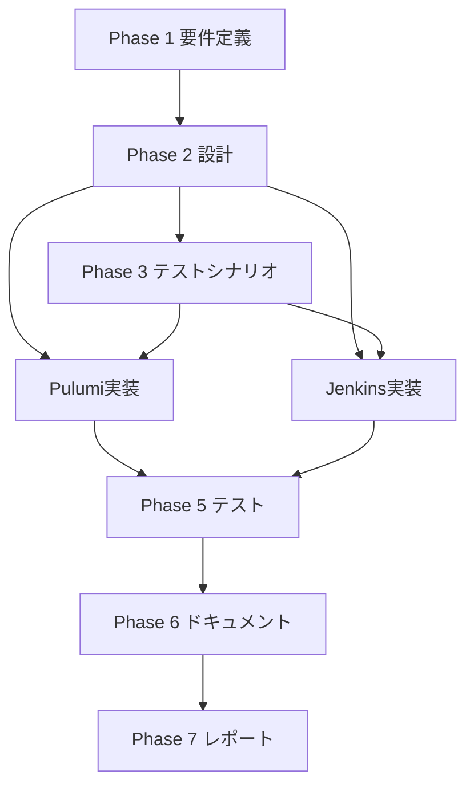
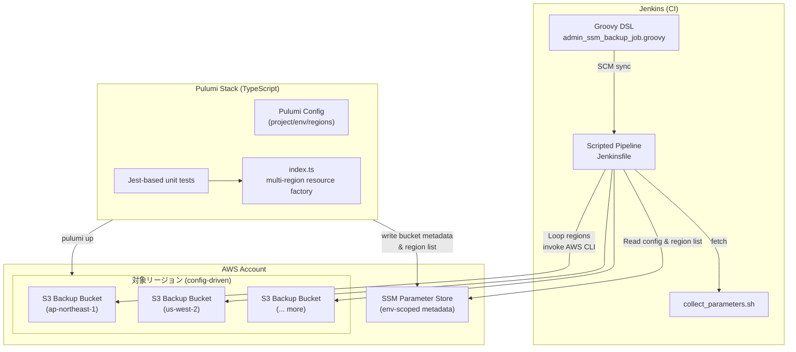

# Codex Agent 実行ログ

開始日時: 2025/10/15 14:00:58

---

## Turn 1: スレッド開始

**Thread ID**: `0199e82c-8e87-77c2-81f4-ed352b706344`

## Turn 2: ツール実行

**種別**: コマンド実行
**コマンド**: `bash -lc ls`
**ステータス**: completed (exit_code=0)

```text
ARCHITECTURE.md
CLAUDE.md
CONTRIBUTION.md
LICENSE
README.md
ansible
bootstrap
docs
jenkins
pulumi
run_tests_issue_322.sh
scripts
```

## Turn 3: ツール実行

**種別**: コマンド実行
**コマンド**: `bash -lc 'ls .ai-workflow'`
**ステータス**: completed (exit_code=0)

```text
issue-304
issue-305
issue-310
issue-313
issue-315
issue-317
issue-319
issue-320
issue-322
issue-324
issue-331
issue-332
issue-355
issue-360
issue-362
issue-363
issue-370
issue-391
```

## Turn 4: ツール実行

**種別**: コマンド実行
**コマンド**: `bash -lc 'cat .ai-workflow/issue-391/00_planning/output/planning.md'`
**ステータス**: completed (exit_code=0)

```text
# Issue #391 プロジェクト計画書

## 1. Issue分析
- **複雑度**: 複雑（PulumiスタックとJenkinsパイプライン双方を多リージョン化し、IaC・CIの同時変更が必要で影響範囲が広い）
- **見積もり工数**: 27時間（Pulumi設計/実装 10h、パイプライン改修 8h、要件定義・テスト設計/実行・ドキュメント整備 9h の想定）
- **リスク評価**: 中（複数リージョンでの権限・S3命名整合性と既存運用影響に注意が必要だが、既存技術スタック内で制御可能）

## 2. 実装戦略判断
- **実装戦略: EXTEND**
  - 既存のPulumiスタックとJenkinsパイプラインを土台に、リージョンごとにリソースとステージを増やす機能追加が中心で、新規サブシステム導入は不要。
- **テスト戦略: UNIT_INTEGRATION**
  - Pulumiはスタック単位のユニットテストでリージョン配列からのバケット生成とSSMパラメータ書き込みを検証し、Jenkinsはdry-run/jenkinsfile-runnerで多リージョン連続実行フローを統合テストする。
- **テストコード戦略: CREATE_TEST**
  - 現行スタックに自動テストがないため、Pulumi向けの新規テスト（`@pulumi/pulumi` のmocksを利用）とJenkinsfile検証スクリプト（jenkinsfile-runnerベース）の新規作成が必要。

## 3. 影響範囲分析
- **既存コードへの影響**
  - `pulumi/jenkins-ssm-backup-s3/index.ts`: リージョン配列を処理し、各リージョンに`aws.Provider`を切り替えてバケットとSSMパラメータを動的に作成するロジックへの拡張。
  - `pulumi/jenkins-ssm-backup-s3/Pulumi.{dev,prod}.yaml`: スタック設定にバックアップ対象リージョン一覧とデフォルトリージョンを追加。
  - `jenkins/jobs/pipeline/admin/ssm-backup/Jenkinsfile`: ステージをリージョン単位で直列実行させ、各リージョンでPulumiが書き込むパラメータに従いバケットを参照する実装変更。
  - `jenkins/jobs/pipeline/admin/ssm-backup/scripts/collect_parameters.sh`: 多リージョンループ時の環境変数受け渡しとログ粒度向上のための微調整。
  - `jenkins/jobs/dsl/admin/admin_ssm_backup_job.groovy`: 多リージョン化後の説明文・タイムアウト/スロットル設定の見直し（パラメータ構成自体は現状維持）。
  - `docs/runbooks` もしくは `README.md`: リージョン追加手順・ロールバック手順の追記。
- **依存関係の変更**
  - ランタイム依存追加は想定なし。開発時テスト用に `jenkinsfile-runner` Dockerイメージの利用を追加（開発ドキュメントに記載）。
- **マイグレーション要否**
  - Pulumi config値の追加と既存SSMパラメータ`/jenkins/{env}/backup/s3-bucket-name`の互換確保（デフォルトリージョン値を維持しつつ、新規で`/jenkins/{env}/backup/{region}/s3-bucket-name`を発行）。
  - Jenkins実行ログの保存ポリシーとタイムアウトをリージョン数に合わせて更新。

## 4. タスク分割
### Phase 1: 要件定義 (見積もり: 4h)
- 2h: 対応リージョン候補と優先順を運用チームと確認（Done: 合意済みリージョン一覧と増減判断基準が文書化）
- 2h: バックアップ保持/リストア要件と既存CLI利用者の通知チャネル整理（Done: 通知対象とコミュニケーション計画を記載したメモ作成）

### Phase 2: 設計 (見積もり: 5h)
- 2h: Pulumiでのmulti-regionリソース設計（Provider切替・ネーミングルール定義）（Done: 設計メモにリソース命名/タグ/SSMキー方針を記載）
- 2h: Jenkinsパイプラインのリージョン逐次実行/失敗ハンドリング設計（Done: ステージ構成図と並列/直列判断理由がまとめられている）
- 1h: テストアプローチとロールバック手順のレビュー（Done: テストマトリクスとロールバック手順草案が承認）

### Phase 3: テストシナリオ (見積もり: 3h)
- 2h: 新旧リージョン構成でのバックアップ/リストア検証シナリオ作成（Done: テストケース一覧に成功/失敗パスが列挙）
- 1h: ログ検証・アラート確認手順の整備（Done: CloudWatch/S3/Slack確認手順がRunbook草案に反映）

### Phase 4: 実装 (見積もり: 8h)
- 2h: Pulumi configとスタックコードのmulti-region対応実装（Done: Pulumiスタックでリージョン毎のバケット/SSMが作成される）
- 2h: 旧SSMパラメータ互換レイヤーとデフォルトリージョン出力実装（Done: 既存パイプラインで互換確認済み）
- 2h: Jenkinsfileをリージョンループ/ステージ分割に改修し、失敗時の早期停止と通知を追加（Done: Declarative Linter通過とローカルdry-run成功）
- 2h: Groovy DSLと収集スクリプトの微修正（Done: DSL説明更新とスクリプトでリージョン_LOGを出力）

### Phase 5: テスト (見積もり: 3h)
- 1h: Pulumiユニットテスト実装・実行（Done: `npm test`でmulti-region生成テストが通過）
- 1h: Pulumi previewで各リージョンの差分を確認（Done: 主要リージョンで`pulumi preview`結果を保存）
- 1h: Jenkinsfile-runnerを用いたdry-runとus-west-2含むサンプルログ確認（Done: dry-runログとS3アップロードシミュレーション結果を記録）

### Phase 6: ドキュメント (見積もり: 2h)
- 1h: Runbook/READMEにリージョン追加・削除・ロールバック手順を追記（Done: PR内でレビュー済み）
- 1h: Pulumi config変更点と新SSMキー説明をドキュメント化（Done: Config例と設定手順が記載）

### Phase 7: レポート (見積もり: 2h)
- 1h: Issueコメントで実装概要・テスト結果・残課題を整理（Done: Issue #391に報告コメント投稿）
- 1h: 運用チーム向けリリースブリーフィング資料作成と合意取得（Done: 合意メール/コメントが記録されている）

## 5. 依存関係


## 6. リスクと軽減策
#### リスク1: リージョンごとのS3バケット命名衝突
- **影響度**: 高
- **確率**: 中
- **軽減策**: PulumiでアカウントID+リージョン+環境を必ず含める命名テンプレートとし、`pulumi preview`結果をレビュー。

#### リスク2: 既存ジョブが新SSMパラメータ構造に追随できない
- **影響度**: 中
- **確率**: 中
- **軽減策**: 旧キーを互換的に維持し、リリース前に本番ジョブのdry-runとロールバックスクリプトを用意。

#### リスク3: Jenkins multi-region実行でタイムアウトやスロットルが発生
- **影響度**: 中
- **確率**: 中
- **軽減策**: ステージ毎のタイムアウトを調整し、AWS CLIリトライ設定とリージョン順序の見直し、Slackアラートを拡張。

#### リスク4: 運用チームへの情報伝達不足による対応遅延
- **影響度**: 中
- **確率**: 低
- **軽減策**: 通知計画をPhase1で確定し、リリース前にFAQとRunbookを共有して合意取得。

## 7. 品質ゲート
#### Phase 1: 要件定義
- [ ] バックアップ対象リージョン一覧と増減判断基準が承認済み
- [ ] CLI/
... (truncated)
```

## Turn 5: ツール実行

**種別**: コマンド実行
**コマンド**: `bash -lc 'cat .ai-workflow/issue-391/03_test_scenario/output/test-scenario.md'`
**ステータス**: completed (exit_code=0)

```text
# Issue #391 テストシナリオ: SSMバックアップのマルチリージョン対応

## 1. テスト戦略サマリー
- **テスト戦略**: UNIT_INTEGRATION（Phase 2 決定事項に準拠）
- **テスト対象範囲**: Pulumiスタック（`pulumi/jenkins-ssm-backup-s3`）の多リージョンリソース生成ロジック、Jenkinsパイプライン（Pipeline/Jenkinsfile・DSL・シェルスクリプト）によるリージョン逐次バックアップ処理および通知フロー
- **テスト目的**:
  - FR-1/FR-2/NFRと整合したマルチリージョンS3バケット&SSMメタデータ生成の正当性を検証
  - FR-3/FR-4の逐次実行・失敗制御・UI互換性を担保
  - FR-5および監視観点として、ログ/通知の検証手順を明確化

## 2. Unitテストシナリオ（Pulumi Jest + Mocks）

### テストケース名: validateConfig_regions未設定_異常系
- **目的**: `regions` が未定義または空配列の場合に明示的な例外を発生させ、誤ったPulumi実行を防ぐ（FR-1保守性）
- **前提条件**: Pulumi Configに `regions` を設定しない
- **入力**: `pulumi.Config()` モック値 `{ projectName: "jenkins-infra", environment: "dev" }`
- **期待結果**: `validateConfig()` が `Error("No regions configured")` をthrowし、`pulumi.runtime.setMocks` 起動前にテストが失敗扱いとなる
- **テストデータ**: `__tests__/fixtures/config_no_regions.json`

### テストケース名: validateConfig_defaultRegion不整合_異常系
- **目的**: `defaultRegion` が `regions` に含まれない場合に検知して失敗させる（FR-2互換性）
- **前提条件**: Config: `regions = ["ap-northeast-1"]`, `defaultRegion = "us-west-2"`
- **入力**: Pulumi Configモック
- **期待結果**: `validateConfig()` が `Error("defaultRegion must be included in regions")` をthrow
- **テストデータ**: `__tests__/fixtures/config_invalid_default.json`

### テストケース名: createRegionalResources_正常系
- **目的**: 各リージョンでS3バケット・パブリックアクセスブロック・バケットポリシー・リージョン別SSMパラメータが生成されることを確認（FR-1, NFR-セキュリティ）
- **前提条件**: `regions = ["ap-northeast-1", "us-west-2"]`, `defaultRegion = "ap-northeast-1"`, `projectName = "jenkins-infra"`, `environment = "dev"`
- **入力**: Pulumi mocks (`aws:s3/bucket:Bucket` など) に期待リソースを返させ `require("../index")`
- **期待結果**:
  - バケット名が `<project>-ssm-backup-<env>-<accountId>-<region>` 形式で2リージョン分生成
  - SSE設定 (`AES256`) と PublicAccessBlock が両リージョンで有効
  - `/jenkins/dev/backup/{region}/s3-bucket-name` パラメータが2件作成
- **テストデータ**: `__tests__/fixtures/mock_account.ts`

### テストケース名: emitLegacyParameter_正常系
- **目的**: 旧SSMキー `/jenkins/{env}/backup/s3-bucket-name` が defaultRegion のバケット名に更新されることを確認（FR-2）
- **前提条件**: `defaultRegion = "ap-northeast-1"`, `bucketMap["ap-northeast-1"] = "jenkins-infra-...-ap-northeast-1"`
- **入力**: `emitLegacyParameter(bucketMap)` を実行
- **期待結果**: SSM Parameter resourceが1件追加され、`value` が defaultRegion のバケット名と一致
- **テストデータ**: `__tests__/fixtures/bucket_map.json`

### テストケース名: emitRegionMetadata_JSON整形_正常系
- **目的**: `/jenkins/{env}/backup/region-list` と `/jenkins/{env}/backup/default-region` がJSON/文字列ともに正しく出力されることを確認（FR-1, FR-2, FR-5通知手順依存メタデータ）
- **前提条件**: `regions = ["ap-northeast-1", "us-west-2"]`, `defaultRegion = "ap-northeast-1"`
- **入力**: `emitRegionMetadata(regions, defaultRegion, provider)` 実行
- **期待結果**:
  - `region-list` の `value` が `["ap-northeast-1","us-west-2"]` JSON文字列
  - `default-region` の `value` が `ap-northeast-1`
  - いずれも `ssmHomeRegion` プロバイダーで作成される
- **テストデータ**: `__tests__/fixtures/regions_dual.json`

### テストケース名: bucketMap_export_正常系
- **目的**: `index.ts` のエクスポート `bucketMap` が全リージョンの `{ region: bucketName }` を返すことを確認し、Jenkins統合テストの前提を担保（FR-3/NFR-保守性）
- **前提条件**: `regions` に複数リージョンを設定
- **入力**: `require("../index")` 後の `bucketMap.apply`
- **期待結果**: `bucketMap` の `keys` が `regions` と一致し、各値がPulumi生成バケット名
- **テストデータ**: `__tests__/fixtures/regions_triple.json`

## 3. Integrationテストシナリオ

### シナリオ名: JenkinsPipeline_多リージョン順次バックアップ_正常系
- **目的**: Jenkinsパイプラインがリージョン一覧を取り込み、ステージを動的に生成し順次成功するハッピーパスを検証（FR-3, NFR-パフォーマンス）
- **前提条件**:
  - jenkinsfile-runner Dockerイメージ取得済み
  - テスト用SSMレスポンス `tests/config/regions_sample.json` を `scripts/aws_mock.sh` で返却
  - `DRY_RUN=true` で実行
- **テスト手順**:
  1. `tests/jenkinsfile_runner.sh` を `MODE=success` で実行
  2. Pipeline Initializeで`regionList=["ap-northeast-1","us-west-2"]`が読み込まれる
  3. `stage("Backup ap-northeast-1")` → `collect_parameters.sh` が `data/ap-northeast-1` に成果物を生成
  4. `stage("Backup us-west-2")` が同様に完了
  5. `Finalize Report` で `region_summaries.json` がWORK_DIRに出力
- **期待結果**:
  - Jenkinsログに2つのBackupステージが順序通り表示
  - `region_summaries.json` に各リージョン `status: "SUCCESS"`, `parameterCount > 0`
  - `post { success
... (truncated)
```

## Turn 6: ツール実行

**種別**: コマンド実行
**コマンド**: `bash -lc 'cat .ai-workflow/issue-391/04_implementation/output/implementation.md'`
**ステータス**: completed (exit_code=0)

```text
# 実装ログ

## 実装サマリー
- 実装戦略: EXTEND
- 変更ファイル数: 9個
- 新規作成ファイル数: 2個

## 変更ファイル一覧

### 新規作成
- `docs/runbooks/ssm-backup.md`: マルチリージョン運用手順・ロールバック・通知フローを整理したRunbook
- `.ai-workflow/issue-391/04_implementation/output/implementation.md`: 本フェーズの実装内容を記録

### 修正
- `pulumi/jenkins-ssm-backup-s3/index.ts`: 多リージョンS3/SSMリソース生成と地域メタデータ出力に対応
- `pulumi/jenkins-ssm-backup-s3/Pulumi.dev.yaml`: リージョン配列・デフォルトリージョン・SSMホームリージョンを追加
- `pulumi/jenkins-ssm-backup-s3/Pulumi.prod.yaml`: 本番スタック用に同上設定を追加
- `pulumi/jenkins-ssm-backup-s3/package.json`: Jest系依存と`jest --passWithNoTests`スクリプトを定義
- `jenkins/jobs/pipeline/admin/ssm-backup/Jenkinsfile`: Scripted Pipeline化とリージョン逐次ステージ/サマリ生成を実装
- `jenkins/jobs/pipeline/admin/ssm-backup/scripts/collect_parameters.sh`: リージョンログ/ディレクトリ初期化/summary出力を追加
- `jenkins/jobs/dsl/admin/admin_ssm_backup_job.groovy`: 説明文・実行時間注記をマルチリージョン対応へ更新
- `.ai-workflow/issue-391/metadata.json`: ワークフロー管理情報がimplementationフェーズに遷移

## 実装詳細

### ファイル1: pulumi/jenkins-ssm-backup-s3/index.ts
- **変更内容**: リージョン配列を検証し、リージョンごとにProviderを切り替えてS3バケット/パブリックアクセスブロック/ポリシー/SSMパラメータを生成。既存互換キーとリージョンリスト/デフォルトリージョンのメタデータを出力し、`bucketMap` をエクスポート。
- **理由**: PulumiスタックでFR-1/FR-2のマルチリージョン要件を満たし、Jenkins側がリージョン一覧とバケット名を参照できるようにするため。
- **注意点**: `regions` と `defaultRegion` のPulumi Config設定が必須。`ssmHomeRegion` を変更する場合はJenkinsパイプラインの環境変数とも整合させる。

### ファイル2: pulumi/jenkins-ssm-backup-s3/Pulumi.dev.yaml
- **変更内容**: `regions`, `defaultRegion`, `ssmHomeRegion` を追加し、Dev環境の多リージョン構成を定義。
- **理由**: Pulumiコードの新しい入力インターフェースに合わせるため。
- **注意点**: 本番と異なるリージョン構成にする場合は`defaultRegion`を必ず配列内に含める。

### ファイル3: pulumi/jenkins-ssm-backup-s3/Pulumi.prod.yaml
- **変更内容**: Prod環境用にDevと同様のマルチリージョン設定フィールドを追加。
- **理由**: Pulumiスタックを本番でも同じインターフェースで動かすため。
- **注意点**: 本番のリージョン変更時はRunbookに従い事前告知と`pulumi preview`を実行する。

### ファイル4: pulumi/jenkins-ssm-backup-s3/package.json
- **変更内容**: Jest/ts-jest/@types/jestをdevDependenciesに追加し、`npm test`でエラーとならないよう`jest --passWithNoTests`を設定。
- **理由**: Phase 5で追加予定のユニットテスト基盤を事前に整え、今フェーズでもTypeScriptビルド確認が可能な状態にするため。
- **注意点**: `npm install`実行後は`node_modules`をコミットしないよう注意。

### ファイル5: jenkins/jobs/pipeline/admin/ssm-backup/Jenkinsfile
- **変更内容**: DeclarativeからScripted Pipelineへ移行し、SSMから取得したリージョン配列で逐次ステージを生成。リージョンごとのバックアップ実行、S3アップロード（地域別`latest-<region>.txt`とデフォルト用`latest.txt`）、`region_summaries.json`の生成、ポストサマリー出力を実装。
- **理由**: FR-3の逐次処理/失敗制御要件に対応しつつ、リージョン数に応じた動的ステージ生成とメタ情報出力を実現するため。
- **注意点**: SSMホームリージョンを変える場合は Jenkins ノードに `SSM_HOME_REGION` 環境変数を設定する。S3アップロードはパラメータ数0の場合にスキップする仕様。

### ファイル6: jenkins/jobs/pipeline/admin/ssm-backup/scripts/collect_parameters.sh
- **変更内容**: 実行前に出力ディレクトリを初期化し、ターゲットリージョンをログに出力。バックアップ処理後にリージョン別サマリーJSONを生成。
- **理由**: 多リージョン実行時にファイル衝突を避け、パイプラインで参照できる統一フォーマットのサマリーを提供するため。
- **注意点**: jq/AWS CLI依存は従来通り。DRY_RUN時はパイプライン側で制御する。

### ファイル7: jenkins/jobs/dsl/admin/admin_ssm_backup_job.groovy
- **変更内容**: ジョブ説明とcronコメントをマルチリージョン運用向けに更新し、Runbook参照先を明示。
- **理由**: FR-4の「UIパラメータ変更なしで多リージョン対応」の方針を維持しつつ利用者への注意点を明文化するため。
- **注意点**: 説明文内のRunbookパス変更時は併せて更新する。

### ファイル8: docs/runbooks/ssm-backup.md
- **変更内容**: バックアップジョブの概要、リージョン追加/削除手順、ロールバック、通知、トラブルシューティングを整理。
- **理由**: 運用チームが多リージョン化後の手順と連絡フローを即座に参照できるようにするため。
- **注意点**: Pulumi Configや通知チャネルを更新したら本Runbookも同期する。

### ファイル9: .ai-workflow/issue-391/metadata.json
- **変更内容**: ワークフロー状態が implementation フェーズ開始を示すよう自動更新。
- **理由**: AIワークフローの進行管理に伴うメタ情報更新。
- **注意点**: システム更新のため手動で編集しない。

## 次のステップ
- Phase 5（test_implementation）でPulumi/Jenkinsの自動テストコードを追加し`npm test`/jenkinsfile-runner検証を実装
- Phase 6（testing）で`pulumi preview`とjenkinsfile-runner dry-runを実施し、マルチリージョン挙動を確認

## 修正履歴

### 修正1: 通知処理の実装不足を解消
- **指摘内容**: JenkinsのPost ActionsでSlack/メール通知が未実装で設計要件とRunbookの通知フローを満たしていない。
- **修正内容**: `notifyChannels`ヘルパーを追加し、Post ActionsからSlack(`slackSend`)とメール(`emailext`)で`regionSummaries`の要約とRunbookリンクを配信するようにした。失敗時もパイプラインが継続するよう例外を捕捉。
- **影響範囲**: `jenkins/jobs/pipeline/admin/ssm-backup/Jenkinsfile`

### 修正2: バックアップサマリーに実行時間を追加
- **指摘内容**: `collect_parameters.sh` が出力する `summary.json` に実行時間メトリクスがなく、通知や可観測性改善の設計意図を満たしていない。
- **修正内容**: スクリプトで処理時間を計測し
... (truncated)
```

## Turn 7: ツール実行

**種別**: コマンド実行
**コマンド**: `bash -lc 'ls pulumi/jenkins-ssm-backup-s3'`
**ステータス**: completed (exit_code=0)

```text
Pulumi.dev.yaml
Pulumi.prod.yaml
Pulumi.yaml
index.ts
package.json
tsconfig.json
```

## Turn 8: ツール実行

**種別**: コマンド実行
**コマンド**: `bash -lc "sed -n '1,200p' pulumi/jenkins-ssm-backup-s3/index.ts"`
**ステータス**: completed (exit_code=0)

```text
import * as pulumi from "@pulumi/pulumi";
import * as aws from "@pulumi/aws";

type RegionalResources = {
    region: string;
    bucket: aws.s3.Bucket;
    publicAccessBlock: aws.s3.BucketPublicAccessBlock;
    bucketPolicy: aws.s3.BucketPolicy;
    ssmParameter: aws.ssm.Parameter;
};

const config = new pulumi.Config();
const projectName = config.require("projectName");
const environment = config.require("environment");
const configuredRegions = config.requireObject<string[]>("regions");
const defaultRegion = config.require("defaultRegion");
const ssmHomeRegion = config.get("ssmHomeRegion") || defaultRegion;

const regions = Array.from(new Set(configuredRegions));
if (regions.length === 0) {
    throw new Error("No regions configured. Please set 'regions' in Pulumi config.");
}

if (!regions.includes(defaultRegion)) {
    throw new Error("defaultRegion must be included in regions.");
}

const callerIdentity = pulumi.output(aws.getCallerIdentity({}));
const accountId = callerIdentity.apply(identity => identity.accountId);

const ssmProvider = createRegionProvider("ssm-home", ssmHomeRegion);

const regionalResources: Record<string, RegionalResources> = {};
for (const region of regions) {
    const provider = createRegionProvider(`region-${region}`, region);
    regionalResources[region] = createRegionalResources({
        region,
        accountId,
        environment,
        projectName,
        provider,
        ssmProvider,
    });
}

const defaultRegionResources = regionalResources[defaultRegion];
if (!defaultRegionResources) {
    throw new Error(`Failed to locate resources for default region '${defaultRegion}'.`);
}

const legacyParameter = emitLegacyParameter({
    environment,
    bucketName: defaultRegionResources.bucket.bucket,
    provider: ssmProvider,
});

emitRegionMetadata({
    regions,
    defaultRegion,
    environment,
    provider: ssmProvider,
});

export const bucketMap = pulumi
    .all(
        Object.values(regionalResources).map(res =>
            res.bucket.bucket.apply(bucketName => ({
                region: res.region,
                bucketName,
            })),
        ),
    )
    .apply(entries =>
        entries.reduce<Record<string, string>>((acc, entry) => {
            acc[entry.region] = entry.bucketName;
            return acc;
        }, {}),
    );

export const bucketNameOutput = defaultRegionResources.bucket.bucket;
export const bucketArn = defaultRegionResources.bucket.arn;
export const ssmBackupBucketParameter = legacyParameter.name;

interface RegionalResourceArgs {
    region: string;
    accountId: pulumi.Output<string>;
    environment: string;
    projectName: string;
    provider: aws.Provider;
    ssmProvider: aws.Provider | undefined;
}

function createRegionalResources(args: RegionalResourceArgs): RegionalResources {
    const { region, accountId, environment, projectName, provider, ssmProvider } = args;

    const bucketName = pulumi.interpolate`${projectName}-ssm-backup-${environment}-${accountId}-${region}`;

    const bucket = new aws.s3.Bucket(
        `ssm-backup-bucket-${region}`,
        {
            bucket: bucketName,
            versioning: {
                enabled: true,
            },
            serverSideEncryptionConfiguration: {
                rule: {
                    applyServerSideEncryptionByDefault: {
                        sseAlgorithm: "AES256",
                    },
                    bucketKeyEnabled: true,
                },
            },
            lifecycleRules: [
                {
                    id: "delete-old-backups",
                    enabled: true,
                    expiration: {
                        days: 30,
                    },
                    noncurrentVersionExpiration: {
                        days: 7,
                    },
                },
            ],
            objectLockEnabled: false,
            tags: {
                Name: bucketName,
                Environment: environment,
... (truncated)
```

## Turn 9: ツール実行

**種別**: コマンド実行
**コマンド**: `bash -lc "sed -n '200,400p' pulumi/jenkins-ssm-backup-s3/index.ts"`
**ステータス**: completed (exit_code=0)

```text
name: `/jenkins/${environment}/backup/${region}/s3-bucket-name`,
            type: "String",
            value: bucket.bucket,
            description: `SSM Parameter Store backup S3 bucket for ${region}`,
            tags: {
                Environment: environment,
                ManagedBy: "Pulumi",
                Region: region,
            },
        },
        ssmProvider ? { provider: ssmProvider } : undefined,
    );

    return {
        region,
        bucket,
        publicAccessBlock,
        bucketPolicy,
        ssmParameter: parameter,
    };
}

interface EmitLegacyParameterArgs {
    environment: string;
    bucketName: pulumi.Output<string>;
    provider: aws.Provider | undefined;
}

function emitLegacyParameter(args: EmitLegacyParameterArgs): aws.ssm.Parameter {
    const { environment, bucketName, provider } = args;

    return new aws.ssm.Parameter(
        "ssm-backup-bucket-name-legacy",
        {
            name: `/jenkins/${environment}/backup/s3-bucket-name`,
            type: "String",
            value: bucketName,
            description: "Legacy default region SSM backup bucket name",
            tags: {
                Environment: environment,
                ManagedBy: "Pulumi",
                Region: "legacy",
            },
        },
        provider ? { provider } : undefined,
    );
}

interface EmitRegionMetadataArgs {
    regions: string[];
    defaultRegion: string;
    environment: string;
    provider: aws.Provider | undefined;
}

function emitRegionMetadata(args: EmitRegionMetadataArgs): void {
    const { regions, defaultRegion, environment, provider } = args;
    const providerOptions = provider ? { provider } : undefined;

    new aws.ssm.Parameter(
        "ssm-backup-region-list",
        {
            name: `/jenkins/${environment}/backup/region-list`,
            type: "String",
            value: JSON.stringify(regions),
            description: "JSON encoded list of backup target regions",
            tags: {
                Environment: environment,
                ManagedBy: "Pulumi",
            },
        },
        providerOptions,
    );

    new aws.ssm.Parameter(
        "ssm-backup-default-region",
        {
            name: `/jenkins/${environment}/backup/default-region`,
            type: "String",
            value: defaultRegion,
            description: "Default region for legacy integrations",
            tags: {
                Environment: environment,
                ManagedBy: "Pulumi",
            },
        },
        providerOptions,
    );
}

function createRegionProvider(name: string, region: string): aws.Provider {
    return new aws.Provider(name, { region });
}
```

## Turn 10: ツール実行

**種別**: コマンド実行
**コマンド**: `bash -lc 'cat pulumi/jenkins-ssm-backup-s3/package.json'`
**ステータス**: completed (exit_code=0)

```text
{
  "name": "jenkins-ssm-backup-s3",
  "version": "1.0.0",
  "description": "",
  "main": "index.ts",
  "scripts": {
    "build": "tsc",
    "preview": "pulumi preview",
    "up": "pulumi up",
    "destroy": "pulumi destroy",
    "test": "jest --passWithNoTests"
  },
  "keywords": [],
  "author": "",
  "license": "ISC",
  "type": "commonjs",
  "dependencies": {
    "@pulumi/aws": "^7.6.0",
    "@pulumi/pulumi": "^3.192.0",
    "@types/node": "^24.3.0",
    "typescript": "^5.9.2"
  },
  "devDependencies": {
    "@types/jest": "^29.5.12",
    "jest": "^29.7.0",
    "ts-jest": "^29.2.5"
  }
}
```

## Turn 11: ツール実行

**種別**: コマンド実行
**コマンド**: `bash -lc 'cat pulumi/jenkins-ssm-backup-s3/tsconfig.json'`
**ステータス**: completed (exit_code=0)

```text
{
  "compilerOptions": {
    "strict": true,
    "outDir": "bin",
    "target": "es2016",
    "module": "commonjs",
    "moduleResolution": "node",
    "sourceMap": true,
    "experimentalDecorators": true,
    "pretty": true,
    "noFallthroughCasesInSwitch": true,
    "noImplicitReturns": true,
    "forceConsistentCasingInFileNames": true
  },
  "files": [
    "index.ts"
  ]
}
```

## Turn 12: ツール実行

**種別**: コマンド実行
**コマンド**: `bash -lc 'ls jenkins/jobs/pipeline/admin/ssm-backup'`
**ステータス**: completed (exit_code=0)

```text
Jenkinsfile
scripts
```

## Turn 13: ツール実行

**種別**: コマンド実行
**コマンド**: `bash -lc 'ls jenkins/jobs/pipeline/admin/ssm-backup/scripts'`
**ステータス**: completed (exit_code=0)

```text
collect_parameters.sh
```

## Turn 14: ツール実行

**種別**: コマンド実行
**コマンド**: `bash -lc "sed -n '1,200p' jenkins/jobs/pipeline/admin/ssm-backup/scripts/collect_parameters.sh"`
**ステータス**: completed (exit_code=0)

```text
#!/bin/bash
# SSM Parameter Collection and Backup Script
# SSMパラメータを収集してバックアップファイルを作成
# 
# 使用方法:
#   このスクリプトは環境変数を通じて設定を受け取ります
#   必須環境変数:
#     - ENVIRONMENT: バックアップ対象の環境 (dev/prod)
#     - ENV_FILTER: パラメータフィルタ文字列 (/dev/, /prod/)
#     - AWS_REGION: AWSリージョン
#     - BACKUP_DATE: バックアップ日付 (YYYY-MM-DD)
#     - BACKUP_TIMESTAMP: バックアップタイムスタンプ
#     - DATA_DIR: データ出力ディレクトリ
#
# 戻り値:
#   0: 正常終了
#   1: エラー発生

set -euo pipefail
SECONDS=0

echo "======================================"
echo "SSM Parameter Collection Script"
echo "======================================"
echo "Environment: ${ENVIRONMENT}"
echo "Filter: ${ENV_FILTER}"
echo "Region: ${AWS_REGION}"
echo "Backup Date: ${BACKUP_DATE}"
echo "Backup Timestamp: ${BACKUP_TIMESTAMP}"
echo "Target Region: ${AWS_REGION}"
echo "======================================"

mkdir -p "${DATA_DIR}"
rm -f "${DATA_DIR}/"*

# AWS認証情報の確認
echo "Checking AWS credentials..."
if ! aws sts get-caller-identity --region ${AWS_REGION}; then
    echo "Error: Failed to get AWS credentials. Please check IAM role or credentials."
    exit 1
fi
echo "AWS credentials verified."

# AWS API呼び出しのリトライ機能
aws_cli_with_retry() {
    local max_retries=5
    local retry_delay=3  # 初期待機時間を長めに設定
    local retry_count=0
    
    while [ $retry_count -lt $max_retries ]; do
        # AWS CLIを実行（環境変数で制御）
        if output=$(AWS_PAGER="" AWS_CLI_AUTO_PROMPT=off "$@" 2>&1); then
            echo "$output"
            return 0
        else
            if echo "$output" | grep -q "ThrottlingException\|Rate exceeded"; then
                retry_count=$((retry_count + 1))
                echo "  Rate limit hit. Retry ${retry_count}/${max_retries} after ${retry_delay}s..." >&2
                sleep $retry_delay
                retry_delay=$((retry_delay * 2))  # Exponential backoff
                if [ $retry_delay -gt 60 ]; then
                    retry_delay=60  # Max delay 60s
                fi
            else
                echo "Error: $output" >&2
                return 1
            fi
        fi
    done
    
    echo "Error: Max retries reached" >&2
    return 1
}

# パラメータ一覧の取得（ページネーション対応、フィルタリング最適化）
fetch_all_parameters() {
    local next_token=""
    local page=1
    local all_params="[]"
    
    # 初回実行前に待機（レート制限対策）
    echo "Waiting 2 seconds before API calls to avoid rate limiting..." >&2
    sleep 2
    
    while true; do
        echo "Fetching page ${page}..." >&2
        
        # AWS CLIコマンドの実行とエラーハンドリング
        local result
        local error_msg
        
        if [ -n "$next_token" ]; then
            echo "  Executing: aws ssm describe-parameters with filter --region ${AWS_REGION}" >&2
            # パラメータフィルタの値を変数に格納
            local filter_value="${ENV_FILTER:1:-1}"  # /dev/ -> dev
            # リトライ機能を使用（--next-tokenを使用）
            if ! result=$(aws_cli_with_retry aws ssm describe-parameters \
                --next-token "$next_token" \
                --max-results 50 \
                --parameter-filters "Key=Name,Option=Contains,Values=$filter_value" \
                --output json \
                --region ${AWS_REGION}); then
                echo "Error: Failed to describe parameters" >&2
                echo '{"Parameters": [], "NextToken": null}'
                return 1
            fi
        else
            echo "  Executing: aws ssm describe-parameters with filter --region ${AWS_REGION}" >&2
            # パラメータフィルタの値を変数に格納
            local filter_value="${ENV_FILTER:1:-1}"  # /dev/ -> dev
            # リトライ機能を使用
            if ! result=$(aws_cli_with_retry aws ssm describe-parameters \
                --max-results 50 \
                --parameter-filters "Key=Name,Option=Contains,Values=$filter_value" \
                --output json \
                --region ${AWS_REGION}); then
                echo "Error: Failed to describe parameters" >&2
                echo '{"Parameters": [], "NextToken": null}'
                return 1
            fi
        fi
        
        # 結果が空またはエラ
... (truncated)
```

## Turn 15: ツール実行

**種別**: コマンド実行
**コマンド**: `bash -lc "rg --files -g'test*'"`
**ステータス**: failed (exit_code=127)

```text
bash: line 1: rg: command not found
```

## Turn 16: ツール実行

**種別**: コマンド実行
**コマンド**: `bash -lc "find . -maxdepth 3 -type d -name 'test*'"`
**ステータス**: completed (exit_code=0)

```text
./scripts/ai-workflow/tests
./pulumi/test-s3
./ansible/playbooks/test
```

## Turn 17: ツール実行

**種別**: コマンド実行
**コマンド**: `bash -lc 'cat .ai-workflow/issue-391/02_design/output/design.md'`
**ステータス**: completed (exit_code=0)

```text
# Issue #391 詳細設計書: SSMバックアップのマルチリージョン対応

## 1. アーキテクチャ設計

### 1.1 システム全体図


### 1.2 コンポーネント間の関係
- **Pulumi**: リージョン配列に基づき AWS Provider を切り替え、S3 バケット＋SSM パラメータをリージョンごとに生成。メタデータ（リージョン一覧、デフォルトリージョン、レガシー互換キー）を SSM に書き込む。
- **Jenkins Pipeline**: SSM からリージョン一覧を読み取り、Scripted Pipeline でリージョンごとのステージを動的生成しつつ逐次バックアップ処理・S3 アップロード・ログ集計を実施。失敗時は即座に後続リージョンをスキップ。
- **collect_parameters.sh**: Jenkins 各ステージからリージョン別に呼び出される共通スクリプト。AWS_REGION 等の環境変数を受け取り、該当リージョンの SSM からパラメータを収集して JSON 化。
- **Groovy DSL**: UI パラメータを変更せず、説明文・スケジューリング・タイムアウトなどのメタ情報だけを調整。

### 1.3 データフロー
1. 運用チームが Pulumi config (`regions`, `defaultRegion`) を更新し、`pulumi up` 実行でターゲットリージョン毎の S3 バケットと `/jenkins/{env}/backup/{region}/s3-bucket-name` パラメータを作成。
2. Pulumi は同時に `/jenkins/{env}/backup/region-list`（JSON 配列）と `/jenkins/{env}/backup/s3-bucket-name`（互換用デフォルトバケット）も更新。
3. Jenkins DSL がスケジュールジョブを定義し、パイプライン起動時に `Initialize` ステージでリージョン一覧を SSM から取得し JSON→List へ変換。
4. Scripted Pipeline のメインループがリージョンごとに `stage("Backup ${region}")` を生成し、各ステージ内で
   - 対象リージョンに切り替えた AWS CLI で SSM を参照しバケット名を取得
   - `collect_parameters.sh` を対象リージョン向けディレクトリで実行
   - DRY_RUN フラグに応じたアップロード（AES256）と最新ポインタ更新を実行し、結果をステージローカルのマップへ格納
5. 全リージョンの結果は `regionSummaries` に蓄積され、`Finalize Report` ステージで `region_summaries.json` として出力した後、post セクションで Slack／メール通知（7.7節）を送信する。失敗時は `error()` で即停止し、失敗リージョンと原因が通知に含まれる。

## 2. 実装戦略: EXTEND

**判断根拠**:
- 既存の Pulumi スタックと Jenkins パイプラインを土台に、多リージョン化のための設定値・ループ処理を追加する拡張作業が主体（FR-1, FR-3）。
- 既存 SSM キーを互換維持しながらリージョン別キーを増やす方針で、新規システムを構築するのではなく現状の IaC/CI を拡張する形となる（FR-2, FR-4）。

## 3. テスト戦略: UNIT_INTEGRATION

**判断根拠**:
- Pulumi 側はリージョン配列→リソース生成ロジックの分岐が増えるため、mocks を用いたユニットテストでリソース数・命名規則・タグを検証する必要がある（FR-1, NFR-保守性）。
- Jenkins パイプラインは多ステージ逐次実行とエラー制御を含むため、jenkinsfile-runner を使った dry-run 統合テストでリージョン別ステージ生成・失敗時の停止挙動を検証する（FR-3, NFR-可用性）。

## 4. テストコード戦略: CREATE_TEST

**判断根拠**:
- `pulumi/jenkins-ssm-backup-s3` には自動テストが存在しないため、Jest ベースの新規テストスイートを作成する必要がある。
- Jenkins パイプラインにも既存テストがないため、jenkinsfile-runner を呼び出す新規スクリプト＋サンプル設定を追加して自動検証を実現する。

## 5. 影響範囲分析
- **Pulumi IaC**: `index.ts` のロジック刷新、Pulumi config ファイル（dev/prod）へのリージョン配列・デフォルトリージョン設定追加、`package.json` のテスト依存追加。
- **Jenkins Pipeline**: `Jenkinsfile` を Declarative から Scripted へ移行し、ステージ再編（Initialize → Config load、Regional loop 化）と失敗制御・ログ整備を追加。
- **Jenkins DSL**: UI パラメータ不変のまま説明文・タイムアウト・ビルド制御パラメータを見直し多リージョン実行時間を許容。
- **スクリプト**: `collect_parameters.sh` でリージョン名をログ出力し、複数回実行時のディレクトリ競合を防ぐ。
- **ドキュメント**: Runbook/README にリージョン追加/削除手順・ロールバック方針および Pulumi config 更新手順を追記。
- **その他**: Jenkins dry-run 用コンテナ利用方法を開発者ガイドに追記（テスト戦略反映）。

## 6. 変更・追加ファイルリスト
| 区分 | ファイル/パス | 目的 |
| ---- | ------------- | ---- |
| 既存修正 | `pulumi/jenkins-ssm-backup-s3/index.ts` | 多リージョン対応ロジック、SSM メタデータ生成、命名規則の抽象化 |
| 既存修正 | `pulumi/jenkins-ssm-backup-s3/Pulumi.dev.yaml`<br>`pulumi/jenkins-ssm-backup-s3/Pulumi.prod.yaml` | `regions`, `defaultRegion` 等の config 追加 |
| 既存修正 | `pulumi/jenkins-ssm-backup-s3/package.json` | テスト実行 (`jest`, `ts-jest`, `@
... (truncated)
```

## Turn 18: ツール実行

**種別**: コマンド実行
**コマンド**: `bash -lc 'grep -R "setMocks" -n'`
**ステータス**: completed (exit_code=0)

```text
scripts/ai-workflow-v2@tmp/durable-bc8bbce0/jenkins-log.txt:304:[CODEX EVENT] {"type":"item.completed","item":{"id":"item_3","type":"command_execution","command":"bash -lc 'cat .ai-workflow/issue-391/02_design/output/design.md'","aggregated_output":"# Issue #391 詳細設計書: SSMバックアップのマルチリージョン対応\n\n## 1. アーキテクチャ設計\n\n### 1.1 システム全体図\n```mermaid\nflowchart TD\n    subgraph Jenkins[\"Jenkins (CI)\"]\n        DSL[\"Groovy DSL\\nadmin_ssm_backup_job.groovy\"]\n        Pipeline[\"Declarative Pipeline\\nJenkinsfile\"]\n        Script[\"collect_parameters.sh\"]\n    end\n\n    subgraph AWS[\"AWS Account\"]\n        SSM[\"SSM Parameter Store\\n(env-scoped metadata)\"]\n        subgraph Regions[\"対象リージョン (config-driven)\"]\n            BucketA[\"S3 Backup Bucket\\n(ap-northeast-1)\"]\n            BucketB[\"S3 Backup Bucket\\n(us-west-2)\"]\n            BucketC[\"S3 Backup Bucket\\n(... more)\"]\n        end\n    end\n\n    subgraph Pulumi[\"Pulumi Stack (TypeScript)\"]\n        Config[\"Pulumi Config\\n(project/env/regions)\"]\n        IaC[\"index.ts\\nmulti-region resource factory\"]\n        Tests[\"Jest-based unit tests\"]\n    end\n\n    DSL -->|SCM sync| Pipeline\n    Pipeline -->|fetch| Script\n    Pipeline -->|Read config & region list| SSM\n    Pipeline -->|Loop regions\\ninvoke AWS CLI| BucketA\n    Pipeline --> BucketB\n    Pipeline --> BucketC\n    Pulumi -->|pulumi up| Regions\n    Pulumi -->|write bucket metadata\\n& region list| SSM\n    Tests --> IaC\n```\n\n### 1.2 コンポーネント間の関係\n- **Pulumi**: リージョン配列に基づき AWS Provider を切り替え、S3 バケット＋SSM パラメータをリージョンごとに生成。メタデータ（リージョン一覧、デフォルトリージョン、レガシー互換キー）を SSM に書き込む。\n- **Jenkins Pipeline**: SSM からリージョン一覧を読み取り、各リージョンを逐次ステージ化してバックアップ処理・S3 へのアップロード・ログ集計を実施。失敗時は後続リージョンをスキップ。\n- **collect_parameters.sh**: Jenkins 各ステージからリージョン別に呼び出される共通スクリプト。AWS_REGION 等の環境変数を受け取り、該当リージョンの SSM からパラメータを収集して JSON 化。\n- **Groovy DSL**: UI パラメータを変更せず、説明文・スケジューリング・タイムアウトなどのメタ情報だけを調整。\n\n### 1.3 データフロー\n1. 運用チームが Pulumi config (`regions`, `defaultRegion`) を更新し、`pulumi up` 実行でターゲットリージョン毎の S3 バケットと `/jenkins/{env}/backup/{region}/s3-bucket-name` パラメータを作成。\n2. Pulumi は同時に `/jenkins/{env}/backup/region-list`（JSON 配列）と `/jenkins/{env}/backup/s3-bucket-name`（互換用デフォルトバケット）も更新。\n3. Jenkins DSL がスケジュールジョブを定義し、パイプライン起動時に `Initialize` ステージでリージョン一覧を SSM から取得し JSON→List へ変換。\n4. `Regional Backup Orchestrator` ステージの Imperative ブロックがリージョンごとにサブステージを生成。各サブステージ内で\n   - 対象リージョンに切り替えた AWS CLI で SSM を参照しバケット名を取得\n   - `collect_parameters.sh` を対象リージョン向けディレクトリで実行\n   - DRY_RUN フラグに応じたアップロード（AES256）と最新ポインタ更新を実行\n5. ステージが失敗した場合は `error()` で停止し、post セクションで Slack/ログ通知が行われる。\n\n## 2. 実装戦略: EXTEND\n\n**判断根拠**:\n- 既存の Pulumi スタックと Jenkins パイプラインを土台に、多リージョン化のための設定値・ループ処理を追加する拡張作業が主体（FR-1, FR-3）。\n- 既存 SSM キーを互換維持しながらリージョン別キーを増やす方針で、新規システムを構築するのではなく現状の IaC/CI を拡張する形となる（FR-2, FR-4）。\n\n## 3. テスト戦略: UNIT_INTEGRATION\n\n**判断根拠**:\n- Pulumi 側はリージョン配列→リソース生成ロジックの分岐が増えるため、mocks を用いたユニットテストでリソース数・命名規則・タグを検証する必要がある（FR-1, NFR-保守性）。\n- Jenkins パイプラインは多ステージ逐次実行とエラー制御を含むため、jenkinsfile-runner を使った dry-run 統合テストでリージョン別ステージ生成・失敗時の停止挙動を検証する（FR-3, NFR-可用性）。\n\n## 4. テストコード戦略: CREATE_TEST\n\n**判断根拠**:\n- `pulumi/jenkins-ssm-backup-s3` には自動テストが存在しないため、Jest ベースの新規テストスイートを作成する必要がある。\n- Jenkins パイプラインにも既存テストがないため、jenkinsfile-runner を呼び出す新規スクリプト＋サンプル設定を追加して自動検証を実現する。\n\n## 5. 影響範囲分析\n- **Pulumi IaC**: `index.ts` のロジック刷新、Pulumi config ファイル（dev/prod）へのリージョン配列・デフォルトリージョン設定追加、`package.json` のテスト依存追加。\n- **Jenkins Pipeline**: `Jenkinsfile` をステージ再編（Initialize → Config load、Regional loop 化）し、失敗制御とログ整備を追加。\n- **Jenkins DSL**: UI パラメータ不変のまま説明文・タイムアウト・ビルド制御パラメータを見直し多リージョン実行時間を許容。\n- **スクリプト**: `collect_parameters.sh` でリージョン名をログ出力し、複数回実行時のディレクトリ競合を防ぐ。\n- **ドキュメント**: Runbook/README にリージョン追加/削除手順・ロールバック方針および Pulumi config 更新手順を追記。\n- **その他**: Jenkins dry-run 用コンテナ利用方法を開発者ガイドに追記（テスト戦略反映）。\n\n## 6. 変更・追加ファイルリスト\n| 区分 | ファイル/パス | 目的 |\n| ---- | ------------- | ---- |\n| 既存修正 | `pulumi/jenkins-ssm-backup-s3/index.ts` | 多リージョン対応ロジック、SSM メタデータ生成、命名規則の抽象化 |\n| 既存修正 | `pulumi/jenkins-ssm-backup-s3/
... (truncated)
```

## Turn 19: ツール実行

**種別**: コマンド実行
**コマンド**: `bash -lc 'grep -R "runtime.setConfig" -n'`
**ステータス**: completed (exit_code=0)

```text
scripts/ai-workflow-v2@tmp/durable-bc8bbce0/jenkins-log.txt:980:[CODEX EVENT] {"type":"item.started","item":{"id":"item_17","type":"command_execution","command":"bash -lc 'grep -R \"runtime.setConfig\" -n'","aggregated_output":"","status":"in_progress"}}
```

## Turn 20: ツール実行

**種別**: コマンド実行
**コマンド**: `bash -lc "find . -path '*jenkinsfile_runner.sh'"`
**ステータス**: completed (exit_code=0)

## Turn 21: ツール実行

**種別**: コマンド実行
**コマンド**: `bash -lc "sed -n '120,260p' .ai-workflow/issue-391/03_test_scenario/output/test-scenario.md"`
**ステータス**: completed (exit_code=0)

```text
### シナリオ名: collectParameters_リージョン分離動作_正常系
- **目的**: `collect_parameters.sh` がリージョンごとのディレクトリを安全に扱い、既存ファイルを削除して最新の成果物だけを残すことを確認（FR-3/NFR-保守性）
- **前提条件**:
  - `DATA_DIR=/tmp/work/data/us-west-2` が既に存在し、旧ファイルが残っている
- **テスト手順**:
  1. `TARGET_REGION=us-west-2` `DRY_RUN=true` でスクリプトを起動
  2. 実行前に`touch /tmp/work/data/us-west-2/old.json`
  3. スクリプト完了後にディレクトリ内容を確認
- **期待結果**:
  - `old.json` が削除され、新たに `parameter_names.txt`, `parameters.json` のみ生成
  - ログに `Target Region: us-west-2` が出力
- **確認項目**:
  - `DATA_DIR` のパーミッションが保持されていること
  - エラー終了時にはクリーンアップが実施されないこと（別テストで確認済み）

## 4. テストデータ
- `__tests__/fixtures/config_no_regions.json`: `regions` 未設定のPulumi Config
- `__tests__/fixtures/config_invalid_default.json`: `defaultRegion` が `regions` と不整合な設定
- `__tests__/fixtures/regions_dual.json` / `regions_triple.json`: 多リージョン構成のConfigサンプル
- `__tests__/fixtures/mock_account.ts`: Pulumi mocks用の `accountId`・`region` 応答
- `__tests__/fixtures/bucket_map.json`: defaultRegionのバケット情報
- `jenkins/jobs/pipeline/admin/ssm-backup/tests/config/regions_sample.json`: Jenkins統合テスト用SSMレスポンスモック
- `tests/output/slack_payload.json`, `tests/output/region_summaries_failure.json`: Jenkins統合テストで生成される検証用成果物
- `tests/config/jobdsl_baseline.xml`: DSL差分比較のベースライン

## 5. テスト環境要件
- **ローカル/CI要件**:
  - Node.js 18系、npm、`ts-jest`/`@types/jest` をインストール済み
  - Pulumi CLI（プレビュー確認用、ユニットテストではモックを利用）
  - Docker 20.x 以上（jenkinsfile-runnerコンテナ実行用）
- **外部サービス/モック**:
  - AWSサービスは直接呼び出さず、Pulumi mocks と `scripts/aws_mock.sh` で全レスポンスをモック化
  - Slack/メール通知はHTTPサーバモックとローカルSMTPモック（`python -m smtpd` 等）を使用
- **CI/CD統合**:
  - Unitテスト: `npm test -- --runInBand`
  - Integrationテスト: `./jenkins/jobs/pipeline/admin/ssm-backup/tests/jenkinsfile_runner.sh MODE={success|fail_second_region}`
  - DSL差分検証: `./jenkins/jobs/pipeline/admin/ssm-backup/tests/jobdsl_verify.sh`（新規追加予定）

---

- [x] Phase 2の戦略（UNIT_INTEGRATION）に準拠したシナリオである  
- [x] 主要な正常系（Pulumi正常生成、Jenkins順次成功、DSL互換）がカバーされている  
- [x] 主要な異常系（Pulumi config不備、Jenkins途中失敗）がカバーされている  
- [x] 期待結果が各ケースで明確に記載されている
```

## Turn 22: ツール実行

**種別**: コマンド実行
**コマンド**: `bash -lc "sed -n '1,200p' jenkins/jobs/pipeline/admin/ssm-backup/Jenkinsfile"`
**ステータス**: completed (exit_code=0)

```text
@Library('jenkins-shared-lib') _

def regionList = []
def regionSummaries = [:]
def pipelineContext = [
    metadataBasePath: "/jenkins/${params.ENVIRONMENT}/backup",
]

node('ec2-fleet') {
    timestamps {
        def ssmHomeRegion = env.SSM_HOME_REGION ?: 'ap-northeast-1'
        def workDirRelative = "backup-work"
        def dataDirRelative = "${workDirRelative}/data"
        def scriptDirRelative = "${workDirRelative}/scripts"
        def workDir = "${env.WORKSPACE}/${workDirRelative}"
        def dataDir = "${env.WORKSPACE}/${dataDirRelative}"
        def scriptDir = "${env.WORKSPACE}/${scriptDirRelative}"
        def envFilter = "/${params.ENVIRONMENT}/"
        env.SSM_HOME_REGION = ssmHomeRegion
        env.WORK_DIR = workDir
        env.DATA_DIR = dataDir
        env.SCRIPT_DIR = scriptDir
        env.ENV_FILTER = envFilter

        try {
            stage('Initialize') {
                env.BACKUP_DATE = sh(script: "date '+%Y-%m-%d'", returnStdout: true).trim()
                env.BACKUP_TIMESTAMP = sh(script: "date '+%Y%m%d_%H%M%S'", returnStdout: true).trim()

                sh """
                    rm -rf ${workDir}
                    mkdir -p ${dataDir}
                    mkdir -p ${scriptDir}
                """

                def regionListJson = sh(
                    script: """
                        aws ssm get-parameter \\
                            --name "${pipelineContext.metadataBasePath}/region-list" \\
                            --query 'Parameter.Value' \\
                            --output text \\
                            --region ${ssmHomeRegion} 2>/dev/null || echo ""
                    """,
                    returnStdout: true
                ).trim()

                if (!regionListJson?.trim()) {
                    error("Region list parameter '${pipelineContext.metadataBasePath}/region-list' is missing or empty.")
                }

                regionList = readJSON(text: regionListJson)
                if (!(regionList instanceof List) || regionList.isEmpty()) {
                    error("Region list is empty. Pulumi config must define at least one region.")
                }

                regionList = regionList.collect { it.toString() }

                def defaultRegionValue = sh(
                    script: """
                        aws ssm get-parameter \\
                            --name "${pipelineContext.metadataBasePath}/default-region" \\
                            --query 'Parameter.Value' \\
                            --output text \\
                            --region ${ssmHomeRegion} 2>/dev/null || echo ""
                    """,
                    returnStdout: true
                ).trim()

                if (!defaultRegionValue) {
                    error("Default region parameter '${pipelineContext.metadataBasePath}/default-region' is missing.")
                }

                if (!regionList.contains(defaultRegionValue)) {
                    error("Default region '${defaultRegionValue}' is not part of configured region list ${regionList}.")
                }

                env.DEFAULT_REGION = defaultRegionValue

                def legacyBucket = sh(
                    script: """
                        aws ssm get-parameter \\
                            --name "${pipelineContext.metadataBasePath}/s3-bucket-name" \\
                            --query 'Parameter.Value' \\
                            --output text \\
                            --region ${ssmHomeRegion} 2>/dev/null || echo ""
                    """,
                    returnStdout: true
                ).trim()

                if (legacyBucket) {
                    env.BACKUP_BUCKET = legacyBucket
                }

                currentBuild.displayName = "#${env.BUILD_NUMBER} - ${params.ENVIRONMENT} Backup"
                currentBuild.description = "Regions=${regionList.join(',')} | Default=${defaultRegionValue}"

                echo """
... (truncated)
```

## Turn 23: ツール実行

**種別**: コマンド実行
**コマンド**: `bash -lc "sed -n '200,400p' jenkins/jobs/pipeline/admin/ssm-backup/Jenkinsfile"`
**ステータス**: completed (exit_code=0)

```text
currentBuild.result = currentBuild.result ?: 'FAILURE'
            throw err
        } finally {
            stage('Post Actions') {
                emitRunSummary(regionSummaries, params.ENVIRONMENT, params.DRY_RUN as boolean)
                try {
                    notifyChannels(regionSummaries, params.ENVIRONMENT, params.DRY_RUN as boolean)
                } catch (Throwable notificationError) {
                    echo "Failed to send notifications: ${notificationError.getMessage() ?: notificationError.toString()}"
                }
                if (currentBuild.result == 'SUCCESS') {
                    echo "✅ SSMパラメータのバックアップが正常に完了しました"
                } else if (currentBuild.result == 'UNSTABLE') {
                    echo "⚠️ バックアップは完了しましたが、警告があります"
                } else {
                    echo "❌ バックアップが失敗しました。ログを確認してください"
                }

                sh "rm -rf ${workDir} jenkins-repo || true"
            }
        }
    }
}

def loadRegionContext(String environment, String region, String metadataBasePath, String ssmHomeRegion, String dataDirRoot) {
    def parameterName = "${metadataBasePath}/${region}/s3-bucket-name"
    def bucketName = sh(
        script: """
            aws ssm get-parameter \\
                --name "${parameterName}" \\
                --query 'Parameter.Value' \\
                --output text \\
                --region ${ssmHomeRegion} 2>/dev/null || echo ""
        """,
        returnStdout: true
    ).trim()

    if (!bucketName) {
        error("Bucket definition missing for region ${region}. Expected SSM parameter ${parameterName}.")
    }

    def regionDataDir = "${dataDirRoot}/${region}"
    sh """
        rm -rf ${regionDataDir}
        mkdir -p ${regionDataDir}
    """

    return [
        environment   : environment,
        region        : region,
        bucketName    : bucketName,
        regionDataDir : regionDataDir,
    ]
}

def runBackupForRegion(Map ctx, boolean dryRun) {
    def envFilter = ctx.envFilter
    def scriptDir = ctx.scriptDir
    def backupDate = ctx.backupDate
    def backupTimestamp = ctx.backupTimestamp
    def environment = ctx.environment
    def region = ctx.region
    def regionDataDir = ctx.regionDataDir
    def bucketName = ctx.bucketName
    def defaultRegion = ctx.defaultRegion

    def backupJsonPath = "${regionDataDir}/backup.json"
    def backupFileName = "ssm-backup-${environment}-${region}-${backupTimestamp}.json"
    def backupFilePath = "${regionDataDir}/${backupFileName}"
    def s3Key = "${backupDate}/${region}/${backupFileName}"

    withEnv([
        "ENVIRONMENT=${environment}",
        "ENV_FILTER=${envFilter}",
        "AWS_REGION=${region}",
        "BACKUP_DATE=${backupDate}",
        "BACKUP_TIMESTAMP=${backupTimestamp}",
        "DATA_DIR=${regionDataDir}",
        "TARGET_REGION=${region}",
    ]) {
        sh """
            rm -f ${regionDataDir}/*
            ${scriptDir}/collect_parameters.sh
        """
    }

    if (!fileExists(backupJsonPath)) {
        error("Backup file was not created for region ${region}.")
    }

    sh "cp ${backupJsonPath} ${backupFilePath}"

    def backupData = readJSON file: backupJsonPath
    def parameterCount = (backupData.parameter_count ?: backupData.parameterCount ?: 0) as int

    def summaryPath = "${regionDataDir}/summary.json"
    def scriptSummary = [:]
    if (fileExists(summaryPath)) {
        scriptSummary = readJSON file: summaryPath
    }
    def mergedSummary = [:]
    mergedSummary << (scriptSummary ?: [:])
    mergedSummary << [
        region         : region,
        parameterCount : parameterCount,
        s3Key          : s3Key,
        dryRun         : dryRun,
        bucket         : bucketName,
    ]
    writeJSON file: summaryPath, json: mergedSummary, pretty: 4

    if (!dryRun && parameterCount > 0) {
        sh """
            aws s3 cp ${backupFilePath} \
                s3://${bucketName}/${s3Key} \
                --sse AES256 \
                --r
... (truncated)
```

## Turn 24: ツール実行

**種別**: コマンド実行
**コマンド**: `bash -lc "sed -n '200,400p' jenkins/jobs/pipeline/admin/ssm-backup/scripts/collect_parameters.sh"`
**ステータス**: completed (exit_code=0)

```text
# パラメータ名を配列に読み込み
    mapfile -t PARAM_NAMES < ${DATA_DIR}/parameter_names.txt
    TOTAL_PARAMS=${#PARAM_NAMES[@]}

    # パラメータを取得してバックアップデータを作成（バッチ処理で高速化）
    echo "Fetching parameter values..."
    for ((i=0; i<$TOTAL_PARAMS; i+=BATCH_SIZE)); do
        end=$((i + BATCH_SIZE))
        if [ $end -gt $TOTAL_PARAMS ]; then
            end=$TOTAL_PARAMS
        fi

        echo "Fetching parameters $((i + 1))-$end of ${TOTAL_PARAMS}..."

        batch_params=()
        for ((j=i; j<end; j++)); do
            batch_params+=("${PARAM_NAMES[$j]}")
        done

        if [ ${#batch_params[@]} -gt 0 ]; then
            BATCH_RESULT=$(aws ssm get-parameters \
                --names "${batch_params[@]}" \
                --with-decryption \
                --output json \
                --region ${AWS_REGION} 2>/dev/null || echo '{"Parameters": [], "InvalidParameters": []}')

            VALID_PARAMS=$(echo "$BATCH_RESULT" | jq '.Parameters // []')
            if [ "$VALID_PARAMS" != "[]" ] && [ "$VALID_PARAMS" != "null" ]; then
                BACKUP_DATA=$(echo "$BACKUP_DATA" | jq --argjson new_params "$VALID_PARAMS" '. + $new_params')
            fi

            INVALID_PARAMS=$(echo "$BATCH_RESULT" | jq -r '.InvalidParameters[]?' 2>/dev/null)
            if [ -n "$INVALID_PARAMS" ]; then
                while IFS= read -r invalid_param; do
                    echo "Warning: Failed to get parameter: $invalid_param"
                    FAILED_PARAMS+=("$invalid_param")
                    FAILED_COUNT=$((FAILED_COUNT + 1))
                done <<< "$INVALID_PARAMS"
            fi
        fi

        if [ $end -lt $TOTAL_PARAMS ]; then
            sleep 2
        fi
    done
else
    echo "WARNING: No parameters found matching filter '${ENV_FILTER}'"
fi

COUNTER=$TOTAL_PARAMS
SUCCESSFUL_COUNT=$((COUNTER - FAILED_COUNT))

echo "Successfully fetched ${SUCCESSFUL_COUNT} parameters"
if [ "$FAILED_COUNT" -gt 0 ]; then
    echo "Failed to fetch ${FAILED_COUNT} parameters"
fi

# バックアップファイルの作成
echo "Creating backup file..."
BACKUP_JSON=$(jq -n \
    --arg date "${BACKUP_DATE}" \
    --arg timestamp "${BACKUP_TIMESTAMP}" \
    --arg environment "${ENVIRONMENT}" \
    --arg count "${SUCCESSFUL_COUNT}" \
    --argjson parameters "$BACKUP_DATA" \
    '{
        backup_date: $date,
        backup_timestamp: $timestamp,
        environment: $environment,
        parameter_count: $count | tonumber,
        parameters: $parameters
    }')

echo "$BACKUP_JSON" | jq '.' > ${DATA_DIR}/backup.json

execution_time=${SECONDS}

echo "======================================"
echo "Backup Summary"
echo "======================================"
echo "Backup file created: ${DATA_DIR}/backup.json"
echo "Total parameters backed up: ${SUCCESSFUL_COUNT}"
echo "Failed parameters: ${FAILED_COUNT}"
echo "======================================"

# サマリーファイルを生成して上位パイプラインで参照できるようにする
echo "Creating summary file..."
jq -n \
    --arg environment "${ENVIRONMENT}" \
    --arg region "${AWS_REGION}" \
    --arg backupDate "${BACKUP_DATE}" \
    --arg backupTimestamp "${BACKUP_TIMESTAMP}" \
    --argjson parameterCount ${SUCCESSFUL_COUNT} \
    --argjson failedCount ${FAILED_COUNT} \
    --argjson executionTimeSec ${execution_time} \
    '{
        environment: $environment,
        region: $region,
        backupDate: $backupDate,
        backupTimestamp: $backupTimestamp,
        parameterCount: $parameterCount,
        failedCount: $failedCount,
        executionTimeSec: $executionTimeSec,
        backup_date: $backupDate,
        backup_timestamp: $backupTimestamp,
        parameter_count: $parameterCount,
        failed_count: $failedCount
    }' > "${DATA_DIR}/summary.json"

echo "Summary file created: ${DATA_DIR}/summary.json"
```

## Turn 25: ツール実行

**種別**: file_change
**ステータス**: completed

## Turn 26: ツール実行

**種別**: file_change
**ステータス**: completed

## Turn 27: ツール実行

**種別**: file_change
**ステータス**: completed

## Turn 28: ツール実行

**種別**: file_change
**ステータス**: completed

## Turn 29: ツール実行

**種別**: file_change
**ステータス**: completed

## Turn 30: ツール実行

**種別**: file_change
**ステータス**: completed

## Turn 31: ツール実行

**種別**: file_change
**ステータス**: completed

## Turn 32: ツール実行

**種別**: file_change
**ステータス**: completed

## Turn 33: ツール実行

**種別**: file_change
**ステータス**: completed

## Turn 34: ツール実行

**種別**: file_change
**ステータス**: completed

## Turn 35: ツール実行

**種別**: file_change
**ステータス**: completed

## Turn 36: ツール実行

**種別**: file_change
**ステータス**: completed

## Turn 37: ツール実行

**種別**: コマンド実行
**コマンド**: `bash -lc 'chmod +x jenkins/jobs/pipeline/admin/ssm-backup/tests/bin/aws'`
**ステータス**: completed (exit_code=0)

## Turn 38: ツール実行

**種別**: file_change
**ステータス**: completed

## Turn 39: ツール実行

**種別**: コマンド実行
**コマンド**: `bash -lc 'chmod +x jenkins/jobs/pipeline/admin/ssm-backup/tests/pipeline_runner.py'`
**ステータス**: completed (exit_code=0)

## Turn 40: ツール実行

**種別**: file_change
**ステータス**: completed

## Turn 41: ツール実行

**種別**: コマンド実行
**コマンド**: `bash -lc 'chmod +x jenkins/jobs/pipeline/admin/ssm-backup/tests/jenkinsfile_runner.sh'`
**ステータス**: completed (exit_code=0)

## Turn 42: ツール実行

**種別**: コマンド実行
**コマンド**: `bash -lc 'grep -n "parameters.json" -n jenkins/jobs/pipeline/admin/ssm-backup/scripts/collect_parameters.sh'`
**ステータス**: failed (exit_code=1)

## Turn 43: ツール実行

**種別**: file_change
**ステータス**: completed

## Turn 44: ツール実行

**種別**: file_change
**ステータス**: completed

## Turn 45: ツール実行

**種別**: コマンド実行
**コマンド**: `bash -lc 'ls .ai-workflow/issue-391/05_test_implementation'`
**ステータス**: completed (exit_code=0)

```text
execute
output
review
revise
```

## Turn 46: ツール実行

**種別**: file_change
**ステータス**: completed

## Turn 47: ツール実行

**種別**: file_change
**ステータス**: completed

## Turn 48: ツール実行

**種別**: file_change
**ステータス**: completed

## Turn 49: ツール実行

**種別**: file_change
**ステータス**: completed

## Turn 50: ツール実行

**種別**: コマンド実行
**コマンド**: `bash -lc 'git status -s'`
**ステータス**: completed (exit_code=0)

```text
M .ai-workflow/issue-391/metadata.json
?? .ai-workflow/issue-391/05_test_implementation/
?? jenkins/jobs/pipeline/admin/ssm-backup/tests/
?? pulumi/jenkins-ssm-backup-s3/__tests__/
?? pulumi/jenkins-ssm-backup-s3/jest.config.cjs
```

## Turn 51: ツール実行

**種別**: コマンド実行
**コマンド**: `bash -lc "nl -ba pulumi/jenkins-ssm-backup-s3/__tests__/index.test.ts | sed -n '1,220p'"`
**ステータス**: completed (exit_code=0)

```text
1	import * as fs from "fs";
     2	import * as path from "path";
     3	import * as pulumi from "@pulumi/pulumi";
     4	import type { ConfigValue } from "@pulumi/pulumi/config";
     5	import type { MockResourceArgs } from "@pulumi/pulumi/runtime";
     6	import { mockCallerIdentity } from "./fixtures/mock_account";
     7	
     8	type ConfigFixture = {
     9	    projectName?: string;
    10	    environment?: string;
    11	    regions?: string[];
    12	    defaultRegion?: string;
    13	    ssmHomeRegion?: string;
    14	};
    15	
    16	type RecordedResource = {
    17	    name: string;
    18	    type: string;
    19	    inputs: Record<string, any>;
    20	    state: Record<string, any>;
    21	};
    22	
    23	const FIXTURE_DIR = path.resolve(__dirname, "fixtures");
    24	const PROJECT_KEY = "jenkins-ssm-backup-s3";
    25	const MOCK_ACCOUNT_ID = mockCallerIdentity.accountId;
    26	
    27	let recordedResources: RecordedResource[] = [];
    28	
    29	const loadFixture = (fileName: string): ConfigFixture => {
    30	    const content = fs.readFileSync(path.join(FIXTURE_DIR, fileName), "utf-8");
    31	    return JSON.parse(content) as ConfigFixture;
    32	};
    33	
    34	const toConfigMap = (fixture: ConfigFixture): Record<string, ConfigValue> => {
    35	    const config: Record<string, ConfigValue> = {};
    36	    if (fixture.projectName !== undefined) {
    37	        config[`${PROJECT_KEY}:projectName`] = { value: fixture.projectName };
    38	    }
    39	    if (fixture.environment !== undefined) {
    40	        config[`${PROJECT_KEY}:environment`] = { value: fixture.environment };
    41	    }
    42	    if (fixture.regions !== undefined) {
    43	        config[`${PROJECT_KEY}:regions`] = { value: JSON.stringify(fixture.regions) };
    44	    }
    45	    if (fixture.defaultRegion !== undefined) {
    46	        config[`${PROJECT_KEY}:defaultRegion`] = { value: fixture.defaultRegion };
    47	    }
    48	    if (fixture.ssmHomeRegion !== undefined) {
    49	        config[`${PROJECT_KEY}:ssmHomeRegion`] = { value: fixture.ssmHomeRegion };
    50	    }
    51	    return config;
    52	};
    53	
    54	const bucketNameFor = (fixture: ConfigFixture, region: string): string => {
    55	    return `${fixture.projectName}-ssm-backup-${fixture.environment}-${MOCK_ACCOUNT_ID}-${region}`;
    56	};
    57	
    58	const registerMocks = (fixture: ConfigFixture) => {
    59	    recordedResources = [];
    60	    const pulumiConfig = toConfigMap(fixture);
    61	    const resolvedDefaultRegion = fixture.defaultRegion ?? fixture.regions?.[0] ?? "ap-northeast-1";
    62	
    63	    pulumi.runtime.setMocks(
    64	        {
    65	            newResource: (args: MockResourceArgs) => {
    66	                const state: Record<string, any> = { ...args.inputs };
    67	
    68	                if (args.type === "pulumi:providers:aws") {
    69	                    recordedResources.push({
    70	                        name: args.name,
    71	                        type: args.type,
    72	                        inputs: args.inputs,
    73	                        state,
    74	                    });
    75	                    return {
    76	                        id: `${args.name}_id`,
    77	                        state,
    78	                    };
    79	                }
    80	
    81	                if (args.type === "aws:s3/bucket:Bucket") {
    82	                    const regionTag =
    83	                        (args.inputs?.tags && (args.inputs.tags.Region as string | undefined)) ?? resolvedDefaultRegion;
    84	                    const bucketName = bucketNameFor(fixture, regionTag);
    85	                    state.bucket = bucketName;
    86	                    state.arn = `arn:aws:s3:::${bucketName}`;
    87	                    state.region = regionTag;
    88	                    state.versioning = args.inputs.versioning;
    89	                    state.serverSideEncryptionConfiguration = args.in
... (truncated)
```

## Turn 52: ツール実行

**種別**: コマンド実行
**コマンド**: `bash -lc 'nl -ba jenkins/jobs/pipeline/admin/ssm-backup/tests/test_pipeline_runner.py'`
**ステータス**: completed (exit_code=0)

```text
1	import json
     2	import os
     3	import subprocess
     4	import sys
     5	import tempfile
     6	import unittest
     7	from pathlib import Path
     8	
     9	
    10	TESTS_DIR = Path(__file__).resolve().parent
    11	RUNNER = TESTS_DIR / "pipeline_runner.py"
    12	
    13	
    14	class PipelineRunnerTests(unittest.TestCase):
    15	    def run_scenario(self, scenario: str):
    16	        with tempfile.TemporaryDirectory(prefix=f"pipeline-{scenario}-") as tmpdir:
    17	            output_dir = Path(tmpdir) / "artifacts"
    18	            cmd = [
    19	                sys.executable,
    20	                str(RUNNER),
    21	                "--scenario",
    22	                scenario,
    23	                "--output",
    24	                str(output_dir),
    25	            ]
    26	            completed = subprocess.run(
    27	                cmd,
    28	                check=True,
    29	                capture_output=True,
    30	                text=True,
    31	                env=os.environ.copy(),
    32	            )
    33	            summary_path = output_dir / "region_summaries.json"
    34	            self.assertTrue(summary_path.exists(), "region summary artifact should be created")
    35	            with open(summary_path, "r", encoding="utf-8") as handle:
    36	                summaries = json.load(handle)
    37	            return summaries, completed, output_dir
    38	
    39	    # 正常系: 全リージョンが成功し、要約が生成されることを確認
    40	    def test_success_sequence_creates_summaries_for_all_regions(self):
    41	        summaries, completed, _ = self.run_scenario("success")
    42	        self.assertIn("ap-northeast-1", summaries)
    43	        self.assertIn("us-west-2", summaries)
    44	        for region, info in summaries.items():
    45	            self.assertEqual(info["status"], "SUCCESS", f"{region} expected to succeed")
    46	            self.assertTrue(info["bucket"].startswith("jenkins-infra-ssm-backup-dev"), "bucket name should follow convention")
    47	            self.assertTrue(info["dryRun"], "simulation should run in dry-run mode")
    48	            self.assertGreaterEqual(info["parameterCount"], 1)
    49	        self.assertIn("Pipeline scenario 'success' completed.", completed.stdout)
    50	
    51	    # 異常系: 2番目のリージョンで失敗した場合に処理が停止し失敗情報が残ること
    52	    def test_failure_on_second_region_marks_summary_and_stops(self):
    53	        summaries, _, output_dir = self.run_scenario("fail_second_region")
    54	        self.assertEqual(summaries["ap-northeast-1"]["status"], "SUCCESS")
    55	        self.assertEqual(summaries["us-west-2"]["status"], "FAILED")
    56	        self.assertIn("collect_parameters.sh exited with code", summaries["us-west-2"]["message"])
    57	        log_path = output_dir / "pipeline.log"
    58	        self.assertTrue(log_path.exists())
    59	        log_contents = log_path.read_text(encoding="utf-8")
    60	        self.assertIn("ThrottlingException", log_contents)
    61	
    62	
    63	if __name__ == "__main__":  # pragma: no cover
    64	    unittest.main()
```

## Turn 53: ツール実行

**種別**: コマンド実行
**コマンド**: `bash -lc 'nl -ba jenkins/jobs/pipeline/admin/ssm-backup/tests/test_collect_parameters.py'`
**ステータス**: completed (exit_code=0)

```text
1	import os
     2	import shutil
     3	import subprocess
     4	import sys
     5	import tempfile
     6	import unittest
     7	from pathlib import Path
     8	
     9	
    10	TESTS_DIR = Path(__file__).resolve().parent
    11	CONFIG_DIR = TESTS_DIR / "config"
    12	BIN_DIR = TESTS_DIR / "bin"
    13	COLLECT_SCRIPT = TESTS_DIR.parents[1] / "scripts" / "collect_parameters.sh"
    14	
    15	
    16	class CollectParametersTests(unittest.TestCase):
    17	    # 正常系: リージョンディレクトリが初期化され必要な成果物が生成されること
    18	    def test_region_directory_is_reset_and_artifacts_created(self):
    19	        if shutil.which("jq") is None:
    20	            self.skipTest("jq is required for collect_parameters.sh tests")
    21	
    22	        with tempfile.TemporaryDirectory(prefix="collect-") as tmpdir:
    23	            data_dir = Path(tmpdir) / "data" / "us-west-2"
    24	            data_dir.mkdir(parents=True, exist_ok=True)
    25	            old_file = data_dir / "old.json"
    26	            old_file.write_text("{}", encoding="utf-8")
    27	
    28	            env = os.environ.copy()
    29	            env.update(
    30	                {
    31	                    "ENVIRONMENT": "dev",
    32	                    "ENV_FILTER": "/dev/",
    33	                    "AWS_REGION": "us-west-2",
    34	                    "BACKUP_DATE": "2024-01-01",
    35	                    "BACKUP_TIMESTAMP": "20240101_000001",
    36	                    "DATA_DIR": str(data_dir),
    37	                    "TARGET_REGION": "us-west-2",
    38	                    "PATH": f"{BIN_DIR}:{env.get('PATH', '')}",
    39	                    "AWS_MOCK_BASE": str(CONFIG_DIR),
    40	                    "AWS_MOCK_SCENARIO": "success",
    41	                }
    42	            )
    43	
    44	            result = subprocess.run(
    45	                [str(COLLECT_SCRIPT)],
    46	                env=env,
    47	                check=True,
    48	                capture_output=True,
    49	                text=True,
    50	            )
    51	
    52	            files = {item.name for item in data_dir.iterdir()}
    53	            self.assertNotIn("old.json", files)
    54	            self.assertIn("parameter_names.txt", files)
    55	            self.assertIn("backup.json", files)
    56	            self.assertIn("summary.json", files)
    57	            self.assertIn("Target Region: us-west-2", result.stdout)
    58	
    59	
    60	if __name__ == "__main__":  # pragma: no cover
    61	    unittest.main()
```

## Turn 54: ツール実行

**種別**: コマンド実行
**コマンド**: `bash -lc "nl -ba jenkins/jobs/pipeline/admin/ssm-backup/tests/pipeline_runner.py | sed -n '1,220p'"`
**ステータス**: completed (exit_code=0)

```text
1	#!/usr/bin/env python3
     2	"""
     3	Lightweight pipeline harness that exercises collect_parameters.sh with mocked AWS CLI
     4	to approximate the Jenkins multi-region backup flow.
     5	
     6	The script is intentionally self-contained so it can run inside automated tests without
     7	Docker or a full Jenkins controller.
     8	"""
     9	from __future__ import annotations
    10	
    11	import argparse
    12	import json
    13	import os
    14	import shutil
    15	import subprocess
    16	import sys
    17	import tempfile
    18	import textwrap
    19	from pathlib import Path
    20	from typing import Dict, List, Tuple
    21	
    22	
    23	REPO_ROOT = Path(__file__).resolve().parents[6]
    24	SCRIPT_PATH = REPO_ROOT / "jenkins" / "jobs" / "pipeline" / "admin" / "ssm-backup" / "scripts" / "collect_parameters.sh"
    25	TESTS_DIR = Path(__file__).resolve().parent
    26	CONFIG_DIR = TESTS_DIR / "config"
    27	BIN_DIR = TESTS_DIR / "bin"
    28	
    29	
    30	class PipelineFailure(Exception):
    31	    """Raised when a regional execution fails."""
    32	
    33	
    34	def load_config() -> Dict[str, str]:
    35	    with open(CONFIG_DIR / "regions_sample.json", "r", encoding="utf-8") as handle:
    36	        return json.load(handle)
    37	
    38	
    39	def ensure_dependencies() -> None:
    40	    if not SCRIPT_PATH.exists():
    41	        raise FileNotFoundError(f"collect_parameters.sh not found at {SCRIPT_PATH}")
    42	    if shutil.which("jq") is None:
    43	        raise EnvironmentError("jq is required to execute the integration tests")
    44	
    45	
    46	def run_collect_parameters(env: Dict[str, str]) -> Tuple[int, str]:
    47	    result = subprocess.run(
    48	        [str(SCRIPT_PATH)],
    49	        check=False,
    50	        capture_output=True,
    51	        text=True,
    52	        env=env,
    53	    )
    54	    return result.returncode, result.stdout + result.stderr
    55	
    56	
    57	def build_env(base_env: Dict[str, str], overrides: Dict[str, str]) -> Dict[str, str]:
    58	    combined = base_env.copy()
    59	    combined.update(overrides)
    60	    return combined
    61	
    62	
    63	def simulate_pipeline(scenario: str, output_dir: Path) -> Dict[str, Dict[str, object]]:
    64	    ensure_dependencies()
    65	    config = load_config()
    66	    environment = config["environment"]
    67	    bucket_map = config["bucketMap"]
    68	    regions: List[str] = list(config["regions"])
    69	    default_region = config["defaultRegion"]
    70	
    71	    output_dir.mkdir(parents=True, exist_ok=True)
    72	    work_dir = output_dir / "work"
    73	    work_dir.mkdir(parents=True, exist_ok=True)
    74	
    75	    base_env = os.environ.copy()
    76	    base_env.update(
    77	        {
    78	            "ENVIRONMENT": environment,
    79	            "ENV_FILTER": f"/{environment}/",
    80	            "BACKUP_DATE": "2024-01-01",
    81	            "BACKUP_TIMESTAMP": "20240101_000001",
    82	            "WORKSPACE": str(work_dir),
    83	            "PATH": f"{BIN_DIR}:{base_env.get('PATH', '')}",
    84	            "AWS_MOCK_BASE": str(CONFIG_DIR),
    85	            "AWS_MOCK_SCENARIO": scenario,
    86	        }
    87	    )
    88	
    89	    region_summaries: Dict[str, Dict[str, object]] = {}
    90	    execution_log: List[str] = []
    91	
    92	    for region in regions:
    93	        region_data_dir = work_dir / "data" / region
    94	        region_data_dir.mkdir(parents=True, exist_ok=True)
    95	
    96	        env = build_env(
    97	            base_env,
    98	            {
    99	                "AWS_REGION": region,
   100	                "TARGET_REGION": region,
   101	                "DATA_DIR": str(region_data_dir),
   102	            },
   103	        )
   104	
   105	        execution_log.append(f"Running backup for region={region}")
   106	        return_code, combined_output = run_collect_parameters(env)
   107	        execution_log.append(
... (truncated)
```

## Turn 55: ツール実行

**種別**: コマンド実行
**コマンド**: `bash -lc "nl -ba jenkins/jobs/pipeline/admin/ssm-backup/tests/bin/aws | sed -n '1,200p'"`
**ステータス**: completed (exit_code=0)

```text
1	#!/usr/bin/env python3
     2	"""
     3	Minimal AWS CLI stub for integration tests.
     4	
     5	The behaviour is driven by JSON fixtures located in the tests/config directory.
     6	Set AWS_MOCK_SCENARIO to choose which fixture to load.
     7	"""
     8	from __future__ import annotations
     9	
    10	import json
    11	import os
    12	import sys
    13	from typing import Any, Dict, List
    14	
    15	
    16	def load_fixture() -> Dict[str, Any]:
    17	    scenario = os.environ.get("AWS_MOCK_SCENARIO", "success")
    18	    base_dir = os.environ.get(
    19	        "AWS_MOCK_BASE",
    20	        os.path.join(os.path.dirname(os.path.dirname(__file__)), "config"),
    21	    )
    22	    fixture_path = os.path.join(base_dir, f"aws_{scenario}.json")
    23	    if not os.path.exists(fixture_path):
    24	        raise SystemExit(f"Fixture not found for scenario '{scenario}': {fixture_path}")
    25	    with open(fixture_path, "r", encoding="utf-8") as handle:
    26	        return json.load(handle)
    27	
    28	
    29	def parse_region(args: List[str]) -> str:
    30	    if "--region" in args:
    31	        idx = args.index("--region")
    32	        if idx + 1 < len(args):
    33	            return args[idx + 1]
    34	    return os.environ.get("AWS_REGION", "ap-northeast-1")
    35	
    36	
    37	def parse_names(args: List[str]) -> List[str]:
    38	    names: List[str] = []
    39	    if "--names" in args:
    40	        idx = args.index("--names") + 1
    41	        while idx < len(args) and not args[idx].startswith("--"):
    42	            names.append(args[idx])
    43	            idx += 1
    44	    return names
    45	
    46	
    47	def main() -> None:
    48	    if len(sys.argv) < 2:
    49	        raise SystemExit("aws mock expects a service argument")
    50	
    51	    fixture = load_fixture()
    52	    service = sys.argv[1]
    53	    action = sys.argv[2] if len(sys.argv) > 2 else ""
    54	    args = sys.argv[2:]
    55	
    56	    if service == "sts" and action == "get-caller-identity":
    57	        print(json.dumps(fixture.get("callerIdentity", {})))
    58	        return
    59	
    60	    if service == "ssm" and action == "describe-parameters":
    61	        region = parse_region(args)
    62	        failure_cfg = (
    63	            fixture.get("failures", {})
    64	            .get("describeParameters", {})
    65	            .get(region)
    66	        )
    67	        if failure_cfg:
    68	            stderr = failure_cfg.get("stderr", "Unknown error")
    69	            exit_code = int(failure_cfg.get("exitCode", 1))
    70	            print(stderr, file=sys.stderr)
    71	            sys.exit(exit_code)
    72	
    73	        parameters = fixture.get("describeParameters", {}).get(region, [])
    74	        response = {"Parameters": parameters, "NextToken": None}
    75	        print(json.dumps(response))
    76	        return
    77	
    78	    if service == "ssm" and action == "get-parameters":
    79	        region = parse_region(args)
    80	        names = parse_names(args)
    81	        store = fixture.get("getParameters", {}).get(region, {})
    82	        parameters = [
    83	            {"Name": name, "Value": store.get(name, "")}
    84	            for name in names
    85	            if name in store
    86	        ]
    87	        response = {"Parameters": parameters, "InvalidParameters": []}
    88	        print(json.dumps(response))
    89	        return
    90	
    91	    if service == "s3" and action == "cp":
    92	        # Simulate successful upload in dry-run tests.
    93	        print("upload simulated", file=sys.stderr)
    94	        return
    95	
    96	    if service == "s3api" and action == "head-object":
    97	        print("100 2024-01-01T00:00:00Z")
    98	        return
    99	
   100	    raise SystemExit(f"Unsupported aws mock call: {' '.join(sys.argv[1:])}")
   101	
   102	
   103	if __name__ == "__main__":
   104	    main()
```

## Turn 56: ツール実行

**種別**: agent_message
**ステータス**: completed

## Turn 57: 実行完了

**ステータス**: completed
**所要時間**: 1066635ms
**ターン数**: N/A

---

**経過時間**: 1066635ms
**開始**: 2025-10-15T14:00:58.185Z
**終了**: 2025-10-15T14:18:44.820Z