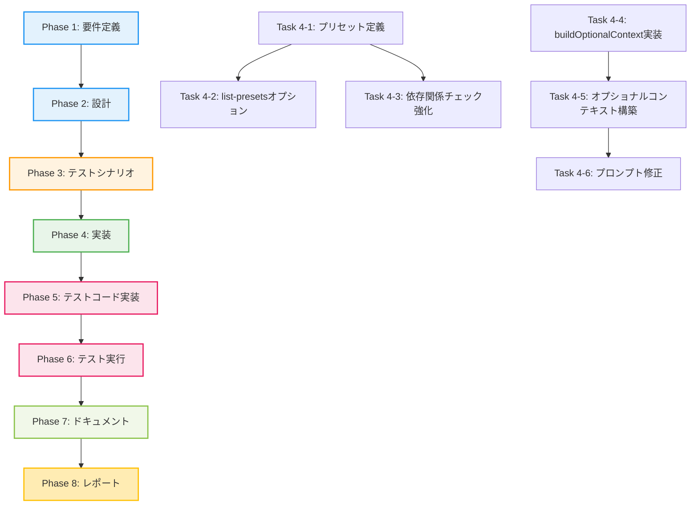

# プロジェクト計画書: Issue #396

## Issue分析

### 複雑度
**中程度**

### 見積もり工数
**15~21時間**

**根拠**:
- Issue本文の見積もり合計: 15-21時間
- Phase 1（既存プリセット整理）: 2-3時間
- Phase 2（新規プリセット追加）: 3-4時間
- Phase 3（依存関係チェック + プロンプト改善）: 6-8時間（最も時間がかかる）
- Phase 4（ドキュメント更新）: 2-3時間
- Phase 5（テスト・検証）: 2-3時間

### リスク評価
**中**

**理由**:
- 既存機能への影響範囲は限定的（主に`phase-dependencies.ts`と`main.ts`）
- プロンプトの変更は5つのフェーズに影響するため、テスト工数が増加
- 依存関係チェックの現在の動作を完全に把握する必要がある（実装確認が必要）
- 後方互換性の維持が必要（既存プリセット名のエイリアス対応）

---

## 実装戦略判断

### 実装戦略: EXTEND

**判断根拠**:
- 既存の`PHASE_PRESETS`オブジェクトを拡張（新規プリセットの追加）
- 既存の`validatePhaseDependencies`関数の動作確認と、必要に応じた強化
- 既存のプロンプトファイル（5つ）にオプショナル参照機能を追加
- `BasePhase`クラスに`buildOptionalContext`ヘルパー関数を追加
- 新規ファイル作成は最小限（主に既存ファイルの拡張）

### テスト戦略: UNIT_INTEGRATION

**判断根拠**:
- **ユニットテスト**:
  - プリセット定義の正確性（各プリセットが正しいPhaseリストを持つ）
  - 依存関係チェックロジックの動作（単一Phase実行時のチェック）
  - `buildOptionalContext`関数の動作（ファイル存在・非存在の両方）
  - 後方互換性（古いプリセット名の動作確認）

- **インテグレーションテスト**:
  - 各プリセットのエンドツーエンド実行（複数Phaseの連携）
  - プロンプトのオプショナル参照が実際のAgent実行時に正常に動作
  - 依存関係チェックエラー時の挙動（エラーメッセージ、`--ignore-dependencies`オプション）
  - Resume機能との連携（特定Phaseから再開時の動作）

**BDD不要の理由**: エンドユーザー向けのストーリーではなく、開発者向けのCLIオプション拡張であるため

### テストコード戦略: BOTH_TEST

**判断根拠**:
- **既存テストの拡張**:
  - 既存の`phase-dependencies.ts`関連テストに新規プリセットのテストを追加
  - 既存の依存関係チェックテストに新しいシナリオを追加

- **新規テスト作成**:
  - `buildOptionalContext`関数の単体テスト（新規機能）
  - プロンプトオプショナル参照のインテグレーションテスト（新規機能）
  - 各プリセットのエンドツーエンドテスト（新規プリセット）

---

## 影響範囲分析

### 既存コードへの影響

**変更が必要なファイル** (10ファイル):
1. `src/core/phase-dependencies.ts` - プリセット定義の追加・変更、依存関係チェック強化
2. `src/main.ts` - `--list-presets`オプション追加、エラーメッセージ改善
3. `src/phases/base-phase.ts` - `buildOptionalContext`ヘルパー関数の追加
4. `src/phases/implementation.ts` - オプショナルコンテキスト構築
5. `src/phases/test-implementation.ts` - オプショナルコンテキスト構築
6. `src/phases/testing.ts` - オプショナルコンテキスト構築
7. `src/phases/documentation.ts` - オプショナルコンテキスト構築
8. `src/phases/report.ts` - オプショナルコンテキスト構築
9. `src/prompts/implementation/execute.txt` - オプショナル参照への変更
10. `src/prompts/test_implementation/execute.txt` - オプショナル参照への変更

**プロンプトファイル** (追加3ファイル):
- `src/prompts/testing/execute.txt`
- `src/prompts/documentation/execute.txt`
- `src/prompts/report/execute.txt`

**ドキュメント** (1ファイル):
- `README.md` - プリセット一覧セクション追加

### 依存関係の変更

**新規依存の追加**: なし

**既存依存の変更**: なし

### マイグレーション要否

**不要**

- メタデータスキーマの変更なし
- データベーススキーマの変更なし
- 設定ファイルの変更なし（オプションの追加のみ）

---

## タスク分割

### Phase 1: 要件定義 (見積もり: 1~2h)

- [x] Task 1-1: 既存プリセットの問題点の整理 (0.5h)
  - 命名の不一致パターンを列挙
  - 依存関係の欠落を特定
  - カバーされていない開発パターンを抽出
- [x] Task 1-2: 新規プリセットの仕様定義 (0.5~1h)
  - 7個の新規プリセットの目的と含まれるPhaseリストを明確化
  - 単一Phase実行との使い分け基準を定義
  - 後方互換性の仕様（deprecation warning、エイリアス）
- [x] Task 1-3: 依存関係チェック強化の要件定義 (0.5h)
  - 現在の動作の確認項目をリスト化
  - 強化すべきチェック項目を定義（ファイル存在チェック等）
  - エラーメッセージの改善内容を定義

### Phase 2: 設計 (見積もり: 2~3h)

- [ ] Task 2-1: プリセット設計 (0.5h)
  - 新規プリセット定義の詳細設計
  - 後方互換性のためのエイリアスマップ設計
  - `--list-presets`コマンドの出力フォーマット設計
- [ ] Task 2-2: 依存関係チェック強化の設計 (1~1.5h)
  - ファイル存在チェックのロジック設計
  - エラーメッセージのテンプレート設計
  - `--ignore-dependencies`オプションの動作フロー設計
- [ ] Task 2-3: プロンプトオプショナル参照の設計 (0.5~1h)
  - `buildOptionalContext`関数のインターフェース設計
  - フォールバックメッセージのテンプレート設計
  - 各Phaseでのコンテキスト構築ロジック設計

### Phase 3: テストシナリオ (見積もり: 1.5~2h)

- [ ] Task 3-1: プリセット実行テストシナリオ (0.5h)
  - 各プリセットの正常系シナリオ
  - 存在しないプリセット名のエラーシナリオ
  - 古いプリセット名のdeprecation warningシナリオ
- [ ] Task 3-2: 依存関係チェックテストシナリオ (0.5h)
  - 依存Phase未完了時のエラーシナリオ
  - `--ignore-dependencies`オプション使用時の警告シナリオ
  - metadata.json不整合時のエラーシナリオ
- [ ] Task 3-3: プロンプトオプショナル参照テストシナリオ (0.5~1h)
  - 参照ファイル存在時の正常動作シナリオ
  - 参照ファイル非存在時のフォールバック動作シナリオ
  - Agent実行時の統合動作シナリオ

### Phase 4: 実装 (見積もり: 6~8h)

- [ ] Task 4-1: プリセット定義の追加・変更 (1.5~2h)
  - `src/core/phase-dependencies.ts`の`PHASE_PRESETS`に7個の新規プリセット追加
  - 既存プリセット名の変更（`review-requirements`, `review-design`, `implementation`）
  - `full-workflow`の削除
  - 後方互換性のためのエイリアスマップ`DEPRECATED_PRESETS`追加
- [ ] Task 4-2: `--list-presets`オプション実装 (0.5~1h)
  - `src/main.ts`に新規オプション追加
  - プリセット一覧表示機能の実装
  - 各プリセットの説明文追加
- [ ] Task 4-3: 依存関係チェック強化 (1.5~2h)
  - `src/core/phase-dependencies.ts`の`validatePhaseDependencies`にファイル存在チェック追加
  - `src/main.ts`のエラーメッセージ改善
  - `--ignore-dependencies`オプション使用時の警告表示強化
- [ ] Task 4-4: `buildOptionalContext`ヘルパー関数実装 (1~1.5h)
  - `src/phases/base-phase.ts`に`buildOptionalContext`メソッド追加
  - ファイル存在チェックロジック実装
  - フォールバックメッセージ生成ロジック実装
- [ ] Task 4-5: 各Phaseでのオプショナルコンテキスト構築 (1.5~2h)
  - `src/phases/implementation.ts`の`execute`メソッド修正
  - `src/phases/test-implementation.ts`の`execute`メソッド修正
  - `src/phases/testing.ts`の`execute`メソッド修正
  - `src/phases/documentation.ts`の`execute`メソッド修正
  - `src/phases/report.ts`の`execute`メソッド修正
- [ ] Task 4-6: プロンプトファイル修正 (1~1.5h)
  - `src/prompts/implementation/execute.txt`修正
  - `src/prompts/test_implementation/execute.txt`修正
  - `src/prompts/testing/execute.txt`修正
  - `src/prompts/documentation/execute.txt`修正
  - `src/prompts/report/execute.txt`修正

### Phase 5: テストコード実装 (見積もり: 2~3h)

- [ ] Task 5-1: プリセット定義テスト (0.5~1h)
  - 各プリセットが正しいPhaseリストを持つことを検証
  - 後方互換性（エイリアス）のテスト
  - `--list-presets`の出力テスト
- [ ] Task 5-2: 依存関係チェックテスト (0.5~1h)
  - 単一Phase実行時の依存関係チェックテスト
  - ファイル存在チェックのテスト
  - エラーメッセージのテスト
- [ ] Task 5-3: オプショナル参照テスト (1~1.5h)
  - `buildOptionalContext`の単体テスト
  - プロンプト構築の統合テスト
  - Agent実行時のエンドツーエンドテスト

### Phase 6: テスト実行 (見積もり: 1~1.5h)

- [ ] Task 6-1: ユニットテスト実行 (0.5h)
  - プリセット定義テストの実行と確認
  - 依存関係チェックテストの実行と確認
  - オプショナル参照テストの実行と確認
- [ ] Task 6-2: インテグレーションテスト実行 (0.5~1h)
  - 各プリセットのエンドツーエンド実行テスト
  - 依存関係チェックエラーシナリオのテスト
  - プロンプトオプショナル参照の統合テスト

### Phase 7: ドキュメント (見積もり: 1.5~2h)

- [ ] Task 7-1: README.mdにプリセット一覧セクション追加 (1~1.5h)
  - プリセット一覧テーブル作成
  - 各プリセットの用途説明
  - 使用例の追加
  - プリセット vs `--phase`の使い分けガイド
- [ ] Task 7-2: 移行ガイド作成 (0.5h)
  - 既存プリセット名から新プリセット名への対応表
  - `full-workflow`削除の案内（`--phase all`への移行）
  - Deprecation期間の案内

### Phase 8: レポート (見積もり: 0.5~1h)

- [ ] Task 8-1: 実装完了レポート作成 (0.5~1h)
  - 実装内容のサマリー
  - テスト結果のサマリー
  - 既知の制約・課題
  - 今後の改善提案

---

## 依存関係



---

## リスクと軽減策

### リスク1: 依存関係チェックの現在の動作が不明確

- **影響度**: 中
- **確率**: 中
- **軽減策**:
  - Phase 1で現在の実装を詳細に確認（`validatePhaseDependencies`のコードレビュー）
  - テストケースを作成して実際の動作を検証
  - 予想外の動作が判明した場合は、Phase 2で設計を見直す

### リスク2: プロンプト変更による予期しない動作

- **影響度**: 中
- **確率**: 低
- **軽減策**:
  - オプショナル参照のフォールバックメッセージを明確に記述
  - 各Phaseで実際にAgentを実行してテスト（インテグレーションテスト）
  - Agentの挙動を注意深く監視し、問題があれば即座に修正

### リスク3: 後方互換性の維持不足

- **影響度**: 低
- **確率**: 低
- **軽減策**:
  - Deprecation warningを明確に表示
  - 旧プリセット名のエイリアスを確実に実装
  - ドキュメントに移行ガイドを明記

### リスク4: テスト工数の増加

- **影響度**: 低
- **確率**: 中
- **軽減策**:
  - テストの優先順位付け（クリティカルパスのテストを優先）
  - 自動テストの活用（ユニットテスト、インテグレーションテスト）
  - 手動テストは最小限に抑える

---

## 品質ゲート

### Phase 1: 要件定義

- [ ] 機能要件が明確に記載されている
  - 7個の新規プリセットの仕様が定義されている
  - 後方互換性の仕様が定義されている
  - 依存関係チェック強化の要件が定義されている
- [ ] 受け入れ基準が定義されている
  - 各プリセットの動作確認項目がリスト化されている
  - 依存関係チェックの動作確認項目がリスト化されている
  - プロンプトオプショナル参照の動作確認項目がリスト化されている

### Phase 2: 設計

- [ ] 実装戦略の判断根拠が明記されている（EXTEND）
- [ ] テスト戦略の判断根拠が明記されている（UNIT_INTEGRATION）
- [ ] テストコード戦略の判断根拠が明記されている（BOTH_TEST）
- [ ] アーキテクチャ設計が完了している
  - プリセット定義の設計が完了している
  - 依存関係チェック強化の設計が完了している
  - プロンプトオプショナル参照の設計が完了している
- [ ] インターフェース設計が完了している
  - `buildOptionalContext`のインターフェースが定義されている
  - CLI オプションのインターフェースが定義されている

### Phase 3: テストシナリオ

- [ ] テストシナリオが網羅的に定義されている
  - プリセット実行の正常系・異常系シナリオ
  - 依存関係チェックのシナリオ
  - プロンプトオプショナル参照のシナリオ
- [ ] 受け入れテスト基準が明確である
  - 各テストシナリオの期待結果が明記されている
  - テスト成功条件が定義されている

### Phase 4: 実装

- [ ] すべてのタスクが完了している（6つのタスク）
- [ ] コーディング規約に準拠している
  - TypeScriptの型安全性が保たれている
  - 既存コードのスタイルに合致している
- [ ] コミットメッセージが適切である
  - `[ai-workflow-v2] <action>: <description>` の形式

### Phase 5: テストコード実装

- [ ] ユニットテストが実装されている
  - プリセット定義テスト
  - 依存関係チェックテスト
  - `buildOptionalContext`テスト
- [ ] インテグレーションテストが実装されている
  - プリセット実行のエンドツーエンドテスト
  - プロンプトオプショナル参照のテスト
- [ ] テストカバレッジが十分である（目標: 80%以上）

### Phase 6: テスト実行

- [ ] すべてのテストが成功している
  - ユニットテスト: 100%成功
  - インテグレーションテスト: 100%成功
- [ ] 既存機能への影響がないことが確認されている
  - 既存のプリセット（エイリアス）が正常に動作
  - 既存の`--phase`オプションが正常に動作
  - Resume機能が正常に動作

### Phase 7: ドキュメント

- [ ] README.mdが更新されている
  - プリセット一覧セクションが追加されている
  - 使い分けガイドが記載されている
  - 移行ガイドが記載されている
- [ ] ドキュメントがわかりやすい
  - 例が豊富に記載されている
  - チーム内で標準化できる内容である

### Phase 8: レポート

- [ ] 実装完了レポートが作成されている
- [ ] テスト結果が記載されている
- [ ] 既知の課題が記載されている
- [ ] 今後の改善提案が記載されている

---

## 補足情報

### 最小実装範囲（Phase 1-3のみ: 11-15時間）

Issue本文に記載されている通り、Phase 1-3（既存プリセット整理 + 新規プリセット追加 + 依存関係チェック + プロンプト改善）だけで主要な効果が得られます。

- Phase 1: 既存プリセット整理（2-3時間）
- Phase 2: 新規プリセット追加（3-4時間）
- Phase 3: 依存関係チェック確認 + プロンプト改善（6-8時間）

Phase 4（ドキュメント更新）とPhase 5（テスト・検証）は、優先度Mediumとして後回しにすることも可能です。

### 開発環境セットアップ

すでにai-workflow-v2は稼働しているため、追加の環境セットアップは不要です。

```bash
cd scripts/ai-workflow-v2
npm install  # 既にインストール済み
npm run build  # TypeScriptのビルド
```

### 関連Issue

- #382: Review agentにPlanning.mdチェックリスト照合機能を追加（将来的に統合される可能性）

---

**作成日時**: 2025-10-16
**Issue番号**: #396
**見積もり合計**: 15~21時間
**リスクレベル**: 中
